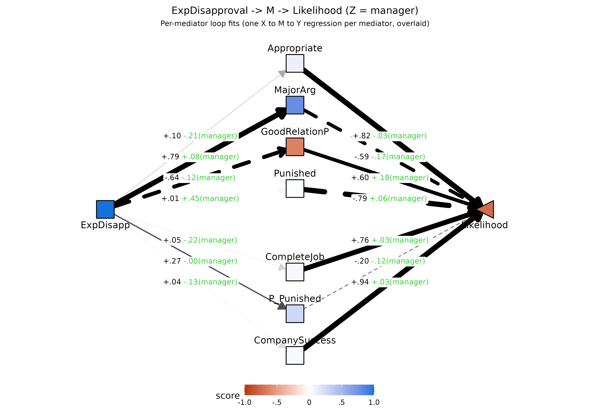
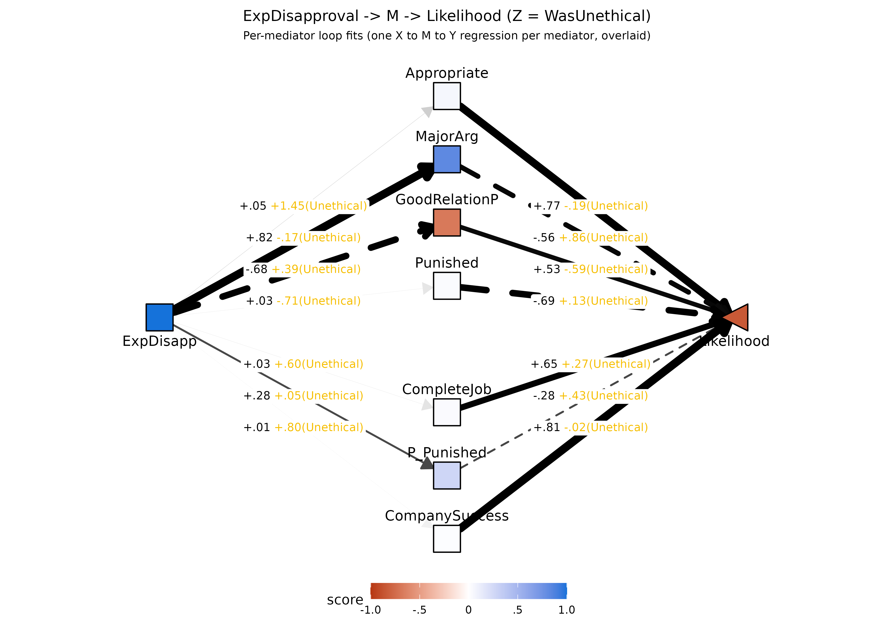
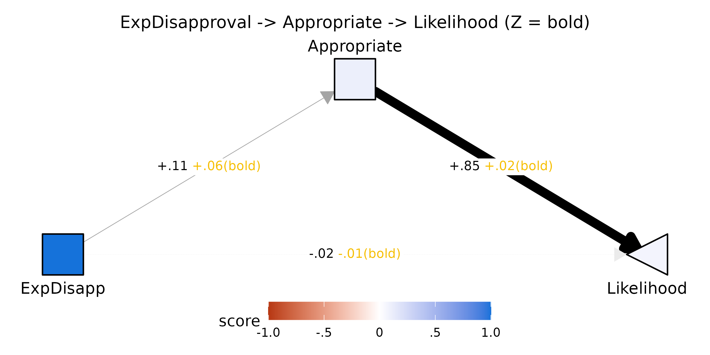

# Moderated mediation with \`pathXMY()\`: the coworker assertiveness ESJT

This vignette demonstrates moderated mediation with
[`pathXMY()`](https://dustin-wood.github.io/funfield/reference/pathXMY.md)
using the `coworkerESJT` dataset — a workplace assertiveness ESJT in
which participants rated two possible responses across 12 scenarios
involving a coworker making an inappropriate request. Three moderators
are examined: the **rank** of the coworker in the scenario
(situation-level; experimentally assigned), the **perceived
unethicality** of the coworker’s request (situation-level;
participant-rated), and **boldness** as a self-reported personality
trait (person-level).

## The data

``` r

library(funfield)
data(coworkerESJT)
lapply(coworkerESJT, dim)
#> $PSI
#> [1] 5846   12
#> 
#> $cond
#> [1] 2988    3
#> 
#> $sit
#> [1] 2465    6
#> 
#> $IIDL
#> [1] 206  41
#> 
#> $codebook
#> NULL
```

The dataset is a named list with five components:

- **`$PSI`** — 5,846 rows: 249 persons × 12 situations × 2 actions, with
  8 rated outcome features and `Likelihood`
- **`$cond`** — situational condition per (person, scenario):
  `subordinate`, `coworker`, or `manager` (randomly assigned, ~4 per
  condition per person)
- **`$sit`** — situation-level perceptions (action-independent; ~82.5%
  coverage)
- **`$IIDL`** — 40 IIDL personality items for 206 of the 249
  participants
- **`$codebook`** — full survey wording, scale anchors, and scenario
  texts

## Variables and survey wording

### The scenarios

Each participant read 12 distinct workplace scenarios and rated two
candidate responses to each. The `[X]` placeholder in each scenario was
filled with `subordinate`, `coworker`, or `manager` (randomly assigned,
roughly four scenarios per condition per participant). Below are the
first three of the twelve, with both response options shown:

> **Scenario 1.** You suspect that your \[X\] has been taking credit for
> documents that you have prepared and ideas that you have generated.
> One afternoon you notice your \[X\] attaching his/her business card to
> a presentation that you prepared.
>
> - **A.** Speak with your \[X\] and tell him/her that the lack of
>   recognition makes you feel unmotivated at work.
> - **B.** Tell your \[X\] that you think his/her behavior is unethical
>   and that you will be filing a complaint.

> **Scenario 2.** You and your \[X\] disagree over the way to approach a
> client’s request. After a long discussion, you come to an agreement.
> During a subsequent meeting with a client, your \[X\] dispenses with
> the agreed-upon approach and presents his original proposal.
>
> - **A.** Talk to your \[X\] later to find out why s/he changed the
>   agreed-upon approach and suggest a protocol for subsequent client
>   meetings.
> - **B.** Present the agreed-upon approach anyway, and ask the client
>   which one is preferred.

> **Scenario 3.** On the way to the breakroom, you overhear a \[X\]
> saying you’re a lazy employee who consistently underperforms. Later
> that day, the \[X\] you heard talking about you asks you to email
> him/her the document s/he needs to complete a task with an upcoming
> deadline.
>
> - **A.** Send the \[X\] the document with enough time to complete the
>   task.
> - **B.** Purposely delay in responding, causing the \[X\] to miss the
>   deadline.

The complete set of 12 scenarios is in
`coworkerESJT$codebook$scenarios`.

### Expected outcomes

The predictor, mediators, and outcome are the expected-outcome ratings
from `$PSI`. Participants rated each action on the stem:

> *“If you do this… \[action\] …how likely is this outcome to result?”*

The table below shows the variable name and the complete survey wording
for each item (0 = Very Unlikely, 1 = Very Likely):

``` r

knitr::kable(
  coworkerESJT$codebook$outcomes[, c("var", "label")],
  col.names = c("Variable", "Survey wording"),
  caption = "Outcome items (PSI)"
)
```

| Variable | Survey wording |
|:---|:---|
| Appropriate | Having acted appropriately within your role in the company |
| ExpDisapproval | Having directly/forcefully expressed disapproval with your \[coworker\]’s behavior |
| MajorArg | Having a major argument/confrontation with your \[coworker\] |
| GoodRelationP | Having a good working relationship with your \[coworker\] in the long run |
| Punished | You being formally punished in some way (example: reprimanded or fired) |
| CompleteJob | You completing your job responsibilities/work effectively in the long run |
| P_Punished | Your \[coworker\] being formally punished in some way (example: reprimanded or fired) |
| CompanySuccess | The overall success of the company |
| Likelihood |   How likely are you to do the following actions in response to this situation? |

Outcome items (PSI) {.table}

The focal **predictor** is `ExpDisapproval` — *“Having
directly/forcefully expressed disapproval with your \[coworker\]’s
behavior.”* Note that this is itself an expected outcome: respondents
rate how likely it is that taking this action will result in them having
expressed disapproval. It is coded such that higher values mean the
action is *more* likely to constitute such an expression.

The focal **outcome** is `Likelihood` — *“How likely are you to do the
following actions in response to this situation?”*

The seven **mediators** are the remaining expected-outcome features.

## Data preparation

Deviate the Level-1 columns within `(person, situation)` with
[`devPSI()`](https://dustin-wood.github.io/funfield/reference/devPSI.md),
then merge the condition variable and code a `manager` dummy (1 =
coworker is a manager, 0 = coworker or subordinate).

``` r

mediators <- c("Appropriate","MajorArg","GoodRelationP",
               "Punished","CompleteJob","P_Punished","CompanySuccess")

## devPSI() deviates each action's outcome ratings within (person, situation):
## each rating is centered on the person's mean across the actions they rated
## in that same situation, isolating the within-situation action contrast.
dat <- merge(devPSI(coworkerESJT$PSI), coworkerESJT$cond, by = c("p","s"))
dat$manager <- as.numeric(dat$condition == "manager")
```

## Normative model (no moderator)

How does `ExpDisapproval` — the expectation of having directly expressed
disapproval — mediate the link between an action and how likely the
respondent is to take it, averaging across people and conditions?

``` r

norm <- pathXMY(dat, X = "ExpDisapproval", Y = "Likelihood", M = mediators)

## Loop pass: one X -> M -> Y regression PER MEDIATOR, fit independently.
## Each B1_YM row is the slope of Likelihood on that mediator controlling
## only for ExpDisapproval (no other mediators in the equation).
norm$tidy_loop
#>          mediator         param          est         se           z       pvalue     ci.lower    ci.upper
#> 1     Appropriate         B1_MX  0.098477007 0.02186970   4.5028972 6.703330e-06  0.055613185  0.14134083
#> 2     Appropriate         B1_YX -0.015362912 0.01569909  -0.9785860 3.277846e-01 -0.046132568  0.01540674
#> 3     Appropriate         B1_YM  0.824923985 0.01692269  48.7466222 0.000000e+00  0.791756122  0.85809185
#> 4     Appropriate B1_MX * B1_YM  0.081236045 0.01838178   4.4193779 9.898540e-06  0.045208413  0.11726368
#> 5        MajorArg         B1_MX  0.787150673 0.01697812  46.3626425 0.000000e+00  0.753874162  0.82042718
#> 6        MajorArg         B1_YX  0.535054781 0.04109056  13.0213546 0.000000e+00  0.454518759  0.61559080
#> 7        MajorArg         B1_YM -0.596050622 0.03872116 -15.3934099 0.000000e+00 -0.671942692 -0.52015855
#> 8        MajorArg B1_MX * B1_YM -0.469181648 0.03433678 -13.6641122 0.000000e+00 -0.536480505 -0.40188279
#> 9   GoodRelationP         B1_MX -0.642909951 0.02161870 -29.7386007 0.000000e+00 -0.685281829 -0.60053807
#> 10  GoodRelationP         B1_YX  0.457886454 0.03202991  14.2955885 0.000000e+00  0.395108979  0.52066393
#> 11  GoodRelationP         B1_YM  0.609748411 0.03433025  17.7612561 0.000000e+00  0.542462352  0.67703447
#> 12  GoodRelationP B1_MX * B1_YM -0.392013321 0.02720818 -14.4079217 0.000000e+00 -0.445340374 -0.33868627
#> 13       Punished         B1_MX  0.012568387 0.01933786   0.6499367 5.157331e-01 -0.025333128  0.05046990
#> 14       Punished         B1_YX  0.075640770 0.02096430   3.6080759 3.084762e-04  0.034551506  0.11673003
#> 15       Punished         B1_YM -0.777159169 0.02700175 -28.7818077 0.000000e+00 -0.830081626 -0.72423671
#> 16       Punished B1_MX * B1_YM -0.009767637 0.01494738  -0.6534680 5.134546e-01 -0.039063971  0.01952870
#> 17    CompleteJob         B1_MX  0.047390211 0.01640594   2.8886004 3.869605e-03  0.015235155  0.07954527
#> 18    CompleteJob         B1_YX  0.029232314 0.02125619   1.3752377 1.690578e-01 -0.012429054  0.07089368
#> 19    CompleteJob         B1_YM  0.773172742 0.03069234  25.1910664 0.000000e+00  0.713016863  0.83332862
#> 20    CompleteJob B1_MX * B1_YM  0.036640820 0.01261961   2.9034835 3.690364e-03  0.011906845  0.06137479
#> 21     P_Punished         B1_MX  0.268076298 0.01482554  18.0820637 0.000000e+00  0.239018780  0.29713382
#> 22     P_Punished         B1_YX  0.118341328 0.02793098   4.2369206 2.266062e-05  0.063597620  0.17308504
#> 23     P_Punished         B1_YM -0.195721125 0.04510414  -4.3393166 1.429265e-05 -0.284123606 -0.10731864
#> 24     P_Punished B1_MX * B1_YM -0.052468195 0.01211298  -4.3315683 1.480510e-05 -0.076209197 -0.02872719
#> 25 CompanySuccess         B1_MX  0.037409434 0.01480606   2.5266298 1.151628e-02  0.008390088  0.06642878
#> 26 CompanySuccess         B1_YX  0.030486931 0.02062691   1.4780175 1.394031e-01 -0.009941065  0.07091493
#> 27 CompanySuccess         B1_YM  0.945916531 0.02854602  33.1365441 0.000000e+00  0.889967355  1.00186571
#> 28 CompanySuccess B1_MX * B1_YM  0.035386202 0.01412570   2.5050930 1.224192e-02  0.007700331  0.06307207

## Joint pass: a SINGLE simultaneous regression with all mediators together
## in the Y equation. B1_YM_joint slopes are partial slopes net of the
## other mediators -- not comparable to the loop B1_YM above.
norm$tidy_joint
#>          mediator       param         est         se           z       pvalue     ci.lower    ci.upper
#> 1     Appropriate B1_MX_joint  0.09847701 0.02186970   4.5028972 6.703330e-06  0.055613185  0.14134083
#> 2     Appropriate B1_YM_joint  0.62758885 0.02686725  23.3588763 0.000000e+00  0.574930002  0.68024770
#> 3        MajorArg B1_MX_joint  0.78715067 0.01697812  46.3626425 0.000000e+00  0.753874162  0.82042718
#> 4        MajorArg B1_YM_joint -0.14195035 0.03463590  -4.0983585 4.160906e-05 -0.209835480 -0.07406523
#> 5   GoodRelationP B1_MX_joint -0.64290995 0.02161870 -29.7386007 0.000000e+00 -0.685281829 -0.60053807
#> 6   GoodRelationP B1_YM_joint  0.09564202 0.03058433   3.1271576 1.765053e-03  0.035697835  0.15558621
#> 7        Punished B1_MX_joint  0.01256839 0.01933786   0.6499367 5.157331e-01 -0.025333128  0.05046990
#> 8        Punished B1_YM_joint -0.13676432 0.02715016  -5.0373296 4.720715e-07 -0.189977655 -0.08355098
#> 9     CompleteJob B1_MX_joint  0.04739021 0.01640594   2.8886004 3.869605e-03  0.015235155  0.07954527
#> 10    CompleteJob B1_YM_joint  0.07183973 0.02935467   2.4473021 1.439302e-02  0.014305647  0.12937382
#> 11     P_Punished B1_MX_joint  0.26807630 0.01482554  18.0820637 0.000000e+00  0.239018780  0.29713382
#> 12     P_Punished B1_YM_joint  0.11879209 0.02669457   4.4500470 8.585152e-06  0.066471695  0.17111249
#> 13 CompanySuccess B1_MX_joint  0.03740943 0.01480606   2.5266298 1.151628e-02  0.008390088  0.06642878
#> 14 CompanySuccess B1_YM_joint  0.14834233 0.03557323   4.1700546 3.045266e-05  0.078620071  0.21806458
#> 15           <NA> B1_YX_joint  0.13821524 0.02461123   5.6159412 1.954952e-08  0.089978112  0.18645238
```

### Expectation paths (B1_MX): what co-occurs with expressing disapproval?

Actions that score higher on `ExpDisapproval` (i.e., actions that would
constitute more direct expression of disapproval) are also seen as more
likely to produce a major argument/confrontation (`MajorArg`, B1_MX ≈
0.79) and less likely to maintain a good working relationship in the
long run (`GoodRelationP`, B1_MX ≈ −0.64). They are also seen as more
appropriate within the role (`Appropriate`, B1_MX \> 0) and more likely
to result in the coworker being formally punished (`P_Punished`, B1_MX
\> 0).

### Valuation paths (B1_YM): which outcomes drive action likelihood?

Acting appropriately (`Appropriate`, B1_YM ≈ 0.82) and benefiting
company success (`CompanySuccess`, B1_YM ≈ 0.95) are the strongest
positive drivers of whether a respondent says they would take an action.
Being formally punished (`Punished`, B1_YM ≈ −0.78) and having a major
argument (`MajorArg`, B1_YM ≈ −0.60) are the strongest suppressors.

### Indirect effects (B1_MX × B1_YM)

Indirect effects are significant for every mediator whose two component
paths are both non-zero — the lone exception is `Punished`, whose
expectation path (`B1_MX` ≈ 0.01) is essentially zero. The largest
indirect paths are both negative: through `MajorArg` (B1_MX × B1_YM ≈
−0.47) and `GoodRelationP` (≈ −0.39). Within a situation, the action
that more strongly expresses disapproval is expected to provoke a major
argument and to erode the working relationship, and both expectations
pull strongly against taking it.

## Situation-level moderation: coworker rank

Does the rank of the coworker in the scenario change how expressing
disapproval co-occurs with other outcome expectations? The `manager`
dummy varies *within* persons across scenarios (randomly assigned), so
we use `Z.within = TRUE`.
[`pathXMY()`](https://dustin-wood.github.io/funfield/reference/pathXMY.md)
then within-person deviates the moderator before fitting.

``` r

mod_s <- pathXMY(dat, X = "ExpDisapproval", Y = "Likelihood",
                 M = mediators, Z = "manager", Z.within = TRUE)
```

### Does manager rank moderate the expectation arm (ExpDisapproval → M)?

``` r

knitr::kable(
  subset(mod_s$tidy_loop, param == "BZ_MX")[, c("mediator","est","se","z","pvalue")],
  digits = 3,
  caption = "Moderation of expectation paths by manager rank (BZ_MX)"
)
```

|     | mediator       |    est |    se |      z | pvalue |
|:----|:---------------|-------:|------:|-------:|-------:|
| 2   | Appropriate    | -0.205 | 0.056 | -3.636 |  0.000 |
| 11  | MajorArg       |  0.081 | 0.024 |  3.329 |  0.001 |
| 20  | GoodRelationP  | -0.125 | 0.027 | -4.567 |  0.000 |
| 29  | Punished       |  0.451 | 0.043 | 10.500 |  0.000 |
| 38  | CompleteJob    | -0.222 | 0.041 | -5.479 |  0.000 |
| 47  | P_Punished     | -0.004 | 0.028 | -0.155 |  0.877 |
| 56  | CompanySuccess | -0.134 | 0.040 | -3.313 |  0.001 |

Moderation of expectation paths by manager rank (BZ_MX) {.table}

Six of the seven mediators show significant moderation. When the
coworker holds a higher rank (manager condition), expressing disapproval
is expected to be substantially *more* likely to result in formal
punishment of oneself (`Punished`, BZ_MX \> 0): the power asymmetry
increases the perceived personal cost. At the same time, expressing
disapproval in a manager scenario is perceived as *less* likely to be
seen as role-appropriate (`Appropriate`), less likely to help complete
the job (`CompleteJob`), less likely to maintain a good working
relationship (`GoodRelationP`), and less likely to benefit company
success (`CompanySuccess`) — the perceived benefits of asserting shrink
when facing a higher-power colleague.

### Does that moderation carry through to the indirect effect?

``` r

knitr::kable(
  subset(mod_s$tidy_loop, param == "BZ_MX * B1_YM")[, c("mediator","est","se","z","pvalue")],
  digits = 3,
  caption = "Moderation of indirect effects by manager rank (BZ_MX × B1_YM)"
)
```

|     | mediator       |    est |    se |      z | pvalue |
|:----|:---------------|-------:|------:|-------:|-------:|
| 8   | Appropriate    | -0.168 | 0.047 | -3.620 |  0.000 |
| 17  | MajorArg       | -0.047 | 0.015 | -3.239 |  0.001 |
| 26  | GoodRelationP  | -0.075 | 0.018 | -4.233 |  0.000 |
| 35  | Punished       | -0.355 | 0.039 | -9.163 |  0.000 |
| 44  | CompleteJob    | -0.170 | 0.032 | -5.354 |  0.000 |
| 53  | P_Punished     |  0.001 | 0.006 |  0.155 |  0.877 |
| 62  | CompanySuccess | -0.125 | 0.037 | -3.365 |  0.001 |

Moderation of indirect effects by manager rank (BZ_MX × B1_YM) {.table}

All significant expectation moderation translates into significant
moderation of the indirect effect. The indirect path through `Punished`
is the largest in magnitude: in manager scenarios, the combination of
expecting more formal punishment *and* punishment’s strong negative
valuation substantially suppresses the indirect pull toward expressing
disapproval through that path.

### Decomposition and field view

[`pathXMY_decompose()`](https://dustin-wood.github.io/funfield/reference/pathXMY_decompose.md)
partitions the total Z-moderation (`BZ_YX[1]`) into expectation routing
(`BZ_MX × B1_YM`), valuation routing (`B1_MX × BZ_YM`), and a residual
direct term. The static
[`plotPathXMY()`](https://dustin-wood.github.io/funfield/reference/plotPathXMY.md)
shows the full field with `b1 + bZ(Z)` edge labels; the toggleable
widget overlays the field at low / mid / high manager exposure.

``` r

dec_m <- pathXMY_decompose(dat, X = "ExpDisapproval", Y = "Likelihood",
                           M = mediators, Z = "manager", Z.within = TRUE)
knitr::kable(dec_m$total, digits = 3,
             caption = "Total moderation BZ_YX[1] for manager rank")
```

|   est |    se |      z | pvalue | ci.lower | ci.upper |
|------:|------:|-------:|-------:|---------:|---------:|
| -0.28 | 0.063 | -4.443 |      0 |   -0.403 |   -0.156 |

Total moderation BZ_YX\[1\] for manager rank {.table}

``` r

plotPathXMY(dec_m,
            X_label = "ExpDisapp", Y_label = "Likelihood",
            Z_label = "manager",
            title = "ExpDisapproval -> M -> Likelihood (Z = manager)")
```



The fan diagram’s mediator arms are the per-mediator *loop* fits (one X
to M to Y model per mediator, overlaid). The straight **X to Likelihood
arrow** is the residual direct path from the *joint* multi-mediator fit
(added automatically by `pathXMY(joint = TRUE)`, the default) — i.e. the
`ExpDisapproval -> Likelihood` effect after controlling for the *full*
set of seven mediators simultaneously. See the speeding vignette for an
extended discussion of why the loop coefficients (not the per-mediator
joint ones) are the right tool for inference about a single mediator’s
role, and why `BZ_YX_joint` is best treated as a system-level diagnostic
(Wood, Adanu, & Harms, 2025).

``` r

plotPathXMY_widget(dec_m,
                   X_label = "ExpDisapp", Y_label = "Likelihood",
                   Z_label = "manager",
                   Z_levels = c(-0.5, 0, 0.5),
                   format   = "svg")
```

![manager =
-0.5](data:image/svg+xml;base64,PD94bWwgdmVyc2lvbj0nMS4wJyBlbmNvZGluZz0nVVRGLTgnID8+CjxzdmcgeG1sbnM9J2h0dHA6Ly93d3cudzMub3JnLzIwMDAvc3ZnJyB4bWxuczp4bGluaz0naHR0cDovL3d3dy53My5vcmcvMTk5OS94bGluaycgd2lkdGg9JzY0OC4wMHB0JyBoZWlnaHQ9JzQ2OC4wMHB0JyB2aWV3Qm94PScwIDAgNjQ4LjAwIDQ2OC4wMCc+CjxnIGNsYXNzPSdzdmdsaXRlJz4KPGRlZnM+CiAgPHN0eWxlIHR5cGU9J3RleHQvY3NzJz48IVtDREFUQVsKICAgIC5zdmdsaXRlIGxpbmUsIC5zdmdsaXRlIHBvbHlsaW5lLCAuc3ZnbGl0ZSBwb2x5Z29uLCAuc3ZnbGl0ZSBwYXRoLCAuc3ZnbGl0ZSByZWN0LCAuc3ZnbGl0ZSBjaXJjbGUgewogICAgICBmaWxsOiBub25lOwogICAgICBzdHJva2U6ICMwMDAwMDA7CiAgICAgIHN0cm9rZS1saW5lY2FwOiByb3VuZDsKICAgICAgc3Ryb2tlLWxpbmVqb2luOiByb3VuZDsKICAgICAgc3Ryb2tlLW1pdGVybGltaXQ6IDEwLjAwOwogICAgfQogICAgLnN2Z2xpdGUgdGV4dCB7CiAgICAgIHdoaXRlLXNwYWNlOiBwcmU7CiAgICB9CiAgICAuc3ZnbGl0ZSBnLmdseXBoZ3JvdXAgcGF0aCB7CiAgICAgIGZpbGw6IGluaGVyaXQ7CiAgICAgIHN0cm9rZTogbm9uZTsKICAgIH0KICBdXT48L3N0eWxlPgo8L2RlZnM+CjxyZWN0IHdpZHRoPScxMDAlJyBoZWlnaHQ9JzEwMCUnIHN0eWxlPSdzdHJva2U6IG5vbmU7IGZpbGw6ICNGRkZGRkY7Jy8+CjxkZWZzPgogIDxjbGlwUGF0aCBpZD0nY3BNQzR3TUh3Mk5EZ3VNREI4TUM0d01IdzBOamd1TURBPSc+CiAgICA8cmVjdCB4PScwLjAwJyB5PScwLjAwJyB3aWR0aD0nNjQ4LjAwJyBoZWlnaHQ9JzQ2OC4wMCcgLz4KICA8L2NsaXBQYXRoPgo8L2RlZnM+CjxnIGNsaXAtcGF0aD0ndXJsKCNjcE1DNHdNSHcyTkRndU1EQjhNQzR3TUh3ME5qZ3VNREE9KSc+CjwvZz4KPGRlZnM+CiAgPGNsaXBQYXRoIGlkPSdjcE56RXVOakI4TlRjMkxqUXdmREF1TURCOE5EWTRMakF3Jz4KICAgIDxyZWN0IHg9JzcxLjYwJyB5PScwLjAwJyB3aWR0aD0nNTA0Ljc5JyBoZWlnaHQ9JzQ2OC4wMCcgLz4KICA8L2NsaXBQYXRoPgo8L2RlZnM+CjxnIGNsaXAtcGF0aD0ndXJsKCNjcE56RXVOakI4TlRjMkxqUXdmREF1TURCOE5EWTRMakF3KSc+CjxyZWN0IHg9JzcxLjYwJyB5PSctMC4wMDAwMDAwMDAwMDAxMScgd2lkdGg9JzUwNC43OScgaGVpZ2h0PSc0NjguMDAnIHN0eWxlPSdzdHJva2Utd2lkdGg6IDAuMDA7IHN0cm9rZTogbm9uZTsnIC8+CjwvZz4KPGcgY2xpcC1wYXRoPSd1cmwoI2NwTUM0d01IdzJORGd1TURCOE1DNHdNSHcwTmpndU1EQT0pJz4KPGxpbmUgeDE9JzEyMS42MScgeTE9JzIyOS41MicgeDI9JzMxNC4wOScgeTI9JzgxLjMxJyBzdHlsZT0nc3Ryb2tlLXdpZHRoOiAxLjA0OyBzdHJva2U6ICM2QTZBNkE7JyAvPgo8cG9seWdvbiBwb2ludHM9JzMxMC4yNSw5MC42MiAzMTQuMDksODEuMzEgMzA0LjEwLDgyLjY0ICcgc3R5bGU9J3N0cm9rZS13aWR0aDogMS4wNDsgc3Ryb2tlOiAjNkE2QTZBOyBmaWxsOiAjNkE2QTZBOycgLz4KPGxpbmUgeDE9JzMzMy45MScgeTE9JzgxLjMxJyB4Mj0nNTMyLjQwJyB5Mj0nMjM0LjE0JyBzdHlsZT0nc3Ryb2tlLXdpZHRoOiA2LjUxOycgLz4KPHBvbHlnb24gcG9pbnRzPSc1MjIuNDEsMjMyLjgxIDUzMi40MCwyMzQuMTQgNTI4LjU2LDIyNC44MiAnIHN0eWxlPSdzdHJva2Utd2lkdGg6IDYuNTE7IGZpbGw6ICMwMDAwMDA7JyAvPgo8bGluZSB4MT0nMTIxLjYxJyB5MT0nMjMxLjcwJyB4Mj0nMzE0LjA5JyB5Mj0nMTI1LjgzJyBzdHlsZT0nc3Ryb2tlLXdpZHRoOiA1LjkxOycgLz4KPHBvbHlnb24gcG9pbnRzPSczMDguODcsMTM0LjQ1IDMxNC4wOSwxMjUuODMgMzA0LjAxLDEyNS42MiAnIHN0eWxlPSdzdHJva2Utd2lkdGg6IDUuOTE7IGZpbGw6ICMwMDAwMDA7JyAvPgo8bGluZSB4MT0nMzMzLjkxJyB5MT0nMTI1LjgzJyB4Mj0nNTMxLjU4JyB5Mj0nMjM0LjU1JyBzdHlsZT0nc3Ryb2tlLXdpZHRoOiAzLjQ1OyBzdHJva2U6ICMwRDBEMEQ7IHN0cm9rZS1kYXNoYXJyYXk6IDE4LjM5LDE4LjM5OycgLz4KPHBvbHlnb24gcG9pbnRzPSc1MjEuNTAsMjM0Ljc2IDUzMS41OCwyMzQuNTUgNTI2LjM2LDIyNS45MyAnIHN0eWxlPSdzdHJva2Utd2lkdGg6IDMuNDU7IHN0cm9rZTogIzBEMEQwRDsgc3Ryb2tlLWRhc2hhcnJheTogMTguMzksMTguMzk7IGZpbGw6ICMwRDBEMEQ7JyAvPgo8bGluZSB4MT0nMTIxLjYxJyB5MT0nMjMzLjg4JyB4Mj0nMzE0LjA5JyB5Mj0nMTcwLjM2JyBzdHlsZT0nc3Ryb2tlLXdpZHRoOiA0LjE4OyBzdHJva2U6ICMwNTA1MDU7IHN0cm9rZS1kYXNoYXJyYXk6IDIyLjMyLDIyLjMyOycgLz4KPHBvbHlnb24gcG9pbnRzPSczMDcuMzgsMTc3Ljg4IDMxNC4wOSwxNzAuMzYgMzA0LjIyLDE2OC4zMSAnIHN0eWxlPSdzdHJva2Utd2lkdGg6IDQuMTg7IHN0cm9rZTogIzA1MDUwNTsgc3Ryb2tlLWRhc2hhcnJheTogMjIuMzIsMjIuMzI7IGZpbGw6ICMwNTA1MDU7JyAvPgo8bGluZSB4MT0nMzMzLjkxJyB5MT0nMTcwLjM2JyB4Mj0nNTMwLjMzJyB5Mj0nMjM1LjE4JyBzdHlsZT0nc3Ryb2tlLXdpZHRoOiAzLjU0OyBzdHJva2U6ICMwQzBDMEM7JyAvPgo8cG9seWdvbiBwb2ludHM9JzUyMC40NiwyMzcuMjMgNTMwLjMzLDIzNS4xOCA1MjMuNjIsMjI3LjY1ICcgc3R5bGU9J3N0cm9rZS13aWR0aDogMy41NDsgc3Ryb2tlOiAjMEMwQzBDOyBmaWxsOiAjMEMwQzBDOycgLz4KPGxpbmUgeDE9JzEyMS42MScgeTE9JzIzNi4wNicgeDI9JzMxNC4wOScgeTI9JzIxNC44OCcgc3R5bGU9J3N0cm9rZS13aWR0aDogMS4xMzsgc3Ryb2tlOiAjNjM2MzYzOyBzdHJva2UtZGFzaGFycmF5OiA2LjA0LDYuMDQ7JyAvPgo8cG9seWdvbiBwb2ludHM9JzMwNS45NywyMjAuODUgMzE0LjA5LDIxNC44OCAzMDQuODYsMjEwLjgzICcgc3R5bGU9J3N0cm9rZS13aWR0aDogMS4xMzsgc3Ryb2tlOiAjNjM2MzYzOyBzdHJva2UtZGFzaGFycmF5OiA2LjA0LDYuMDQ7IGZpbGw6ICM2MzYzNjM7JyAvPgo8bGluZSB4MT0nMzMzLjkxJyB5MT0nMjE0Ljg4JyB4Mj0nNTI4LjE4JyB5Mj0nMjM2LjI1JyBzdHlsZT0nc3Ryb2tlLXdpZHRoOiA2LjUxOyBzdHJva2UtZGFzaGFycmF5OiAzNC43MSwzNC43MTsnIC8+Cjxwb2x5Z29uIHBvaW50cz0nNTE4Ljk1LDI0MC4zMSA1MjguMTgsMjM2LjI1IDUyMC4wNSwyMzAuMjkgJyBzdHlsZT0nc3Ryb2tlLXdpZHRoOiA2LjUxOyBzdHJva2UtZGFzaGFycmF5OiAzNC43MSwzNC43MTsgZmlsbDogIzAwMDAwMDsnIC8+CjxsaW5lIHgxPScxMjEuNjEnIHkxPScyNDAuNDInIHgyPSczMTQuMDknIHkyPSczMDMuOTMnIHN0eWxlPSdzdHJva2Utd2lkdGg6IDAuNzg7IHN0cm9rZTogIzgyODI4MjsnIC8+Cjxwb2x5Z29uIHBvaW50cz0nMzA0LjIyLDMwNS45OSAzMTQuMDksMzAzLjkzIDMwNy4zOCwyOTYuNDEgJyBzdHlsZT0nc3Ryb2tlLXdpZHRoOiAwLjc4OyBzdHJva2U6ICM4MjgyODI7IGZpbGw6ICM4MjgyODI7JyAvPgo8bGluZSB4MT0nMzMzLjkxJyB5MT0nMzAzLjkzJyB4Mj0nNTMwLjMzJyB5Mj0nMjM5LjEyJyBzdHlsZT0nc3Ryb2tlLXdpZHRoOiA1LjkyOycgLz4KPHBvbHlnb24gcG9pbnRzPSc1MjMuNjIsMjQ2LjY0IDUzMC4zMywyMzkuMTIgNTIwLjQ2LDIzNy4wNyAnIHN0eWxlPSdzdHJva2Utd2lkdGg6IDUuOTI7IGZpbGw6ICMwMDAwMDA7JyAvPgo8bGluZSB4MT0nMTIxLjYxJyB5MT0nMjQyLjYwJyB4Mj0nMzE0LjA5JyB5Mj0nMzQ4LjQ2JyBzdHlsZT0nc3Ryb2tlLXdpZHRoOiAxLjUxOyBzdHJva2U6ICM0QTRBNEE7JyAvPgo8cG9seWdvbiBwb2ludHM9JzMwNC4wMSwzNDguNjcgMzE0LjA5LDM0OC40NiAzMDguODcsMzM5Ljg0ICcgc3R5bGU9J3N0cm9rZS13aWR0aDogMS41MTsgc3Ryb2tlOiAjNEE0QTRBOyBmaWxsOiAjNEE0QTRBOycgLz4KPGxpbmUgeDE9JzMzMy45MScgeTE9JzM0OC40NicgeDI9JzUzMS41OCcgeTI9JzIzOS43NCcgc3R5bGU9J3N0cm9rZS13aWR0aDogMC42Njsgc3Ryb2tlOiAjOEY4RjhGOyBzdHJva2UtZGFzaGFycmF5OiA0LjAwLDQuMDA7JyAvPgo8cG9seWdvbiBwb2ludHM9JzUyNi4zNiwyNDguMzYgNTMxLjU4LDIzOS43NCA1MjEuNTAsMjM5LjUzICcgc3R5bGU9J3N0cm9rZS13aWR0aDogMC42Njsgc3Ryb2tlOiAjOEY4RjhGOyBzdHJva2UtZGFzaGFycmF5OiA0LjAwLDQuMDA7IGZpbGw6ICM4RjhGOEY7JyAvPgo8bGluZSB4MT0nMTIxLjYxJyB5MT0nMjQ0Ljc3JyB4Mj0nMzE0LjA5JyB5Mj0nMzkyLjk5JyBzdHlsZT0nc3Ryb2tlLXdpZHRoOiAwLjQ4OyBzdHJva2U6ICNBN0E3QTc7JyAvPgo8cG9seWdvbiBwb2ludHM9JzMwNC4xMCwzOTEuNjUgMzE0LjA5LDM5Mi45OSAzMTAuMjUsMzgzLjY3ICcgc3R5bGU9J3N0cm9rZS13aWR0aDogMC40ODsgc3Ryb2tlOiAjQTdBN0E3OyBmaWxsOiAjQTdBN0E3OycgLz4KPGxpbmUgeDE9JzMzMy45MScgeTE9JzM5Mi45OScgeDI9JzUzMi40MCcgeTI9JzI0MC4xNScgc3R5bGU9J3N0cm9rZS13aWR0aDogNi41MTsnIC8+Cjxwb2x5Z29uIHBvaW50cz0nNTI4LjU2LDI0OS40NyA1MzIuNDAsMjQwLjE1IDUyMi40MSwyNDEuNDggJyBzdHlsZT0nc3Ryb2tlLXdpZHRoOiA2LjUxOyBmaWxsOiAjMDAwMDAwOycgLz4KPHBvbHlnb24gcG9pbnRzPScyMDkuMzAsMTYxLjIxIDIyNi40MCwxNjEuMjEgMjI2LjMyLDE2MS4yMSAyMjYuNjYsMTYxLjIwIDIyNy4wMCwxNjEuMTMgMjI3LjMzLDE2MS4wMCAyMjcuNjMsMTYwLjgzIDIyNy45MCwxNjAuNjEgMjI4LjEzLDE2MC4zNSAyMjguMzIsMTYwLjA1IDIyOC40NSwxNTkuNzQgMjI4LjU0LDE1OS40MCAyMjguNTYsMTU5LjA1IDIyOC41NiwxNTkuMDUgMjI4LjU2LDE1MS43NyAyMjguNTYsMTUxLjc3IDIyOC41NCwxNTEuNDMgMjI4LjQ1LDE1MS4wOSAyMjguMzIsMTUwLjc3IDIyOC4xMywxNTAuNDcgMjI3LjkwLDE1MC4yMSAyMjcuNjMsMTQ5Ljk5IDIyNy4zMywxNDkuODIgMjI3LjAwLDE0OS43MCAyMjYuNjYsMTQ5LjYzIDIyNi40MCwxNDkuNjEgMjA5LjMwLDE0OS42MSAyMDkuNTYsMTQ5LjYzIDIwOS4yMSwxNDkuNjEgMjA4Ljg3LDE0OS42NiAyMDguNTMsMTQ5Ljc1IDIwOC4yMiwxNDkuOTAgMjA3LjkzLDE1MC4xMCAyMDcuNjgsMTUwLjM0IDIwNy40NywxNTAuNjIgMjA3LjMxLDE1MC45MyAyMDcuMjAsMTUxLjI1IDIwNy4xNSwxNTEuNjAgMjA3LjE0LDE1MS43NyAyMDcuMTQsMTU5LjA1IDIwNy4xNSwxNTguODggMjA3LjE1LDE1OS4yMiAyMDcuMjAsMTU5LjU3IDIwNy4zMSwxNTkuOTAgMjA3LjQ3LDE2MC4yMSAyMDcuNjgsMTYwLjQ4IDIwNy45MywxNjAuNzIgMjA4LjIyLDE2MC45MiAyMDguNTMsMTYxLjA3IDIwOC44NywxNjEuMTcgMjA5LjIxLDE2MS4yMSAnIHN0eWxlPSdzdHJva2Utd2lkdGg6IDAuMDA7IGZpbGw6ICNGRkZGRkY7JyAvPgo8dGV4dCB4PScyMDguODcnIHk9JzE1Ny42MCcgc3R5bGU9J2ZvbnQtc2l6ZTogOS4xMHB4OyBmb250LWZhbWlseTogIkxpYmVyYXRpb24gU2FucyI7JyB0ZXh0TGVuZ3RoPScxNy45N3B4JyBsZW5ndGhBZGp1c3Q9J3NwYWNpbmdBbmRHbHlwaHMnPisuMjA8L3RleHQ+Cjxwb2x5Z29uIHBvaW50cz0nNDIxLjYwLDE2MS4yMSA0MzguNzAsMTYxLjIxIDQzOC42MSwxNjEuMjEgNDM4Ljk2LDE2MS4yMCA0MzkuMzAsMTYxLjEzIDQzOS42MywxNjEuMDAgNDM5LjkzLDE2MC44MyA0NDAuMjAsMTYwLjYxIDQ0MC40MywxNjAuMzUgNDQwLjYxLDE2MC4wNSA0NDAuNzUsMTU5Ljc0IDQ0MC44MywxNTkuNDAgNDQwLjg2LDE1OS4wNSA0NDAuODYsMTU5LjA1IDQ0MC44NiwxNTEuNzcgNDQwLjg2LDE1MS43NyA0NDAuODMsMTUxLjQzIDQ0MC43NSwxNTEuMDkgNDQwLjYxLDE1MC43NyA0NDAuNDMsMTUwLjQ3IDQ0MC4yMCwxNTAuMjEgNDM5LjkzLDE0OS45OSA0MzkuNjMsMTQ5LjgyIDQzOS4zMCwxNDkuNzAgNDM4Ljk2LDE0OS42MyA0MzguNzAsMTQ5LjYxIDQyMS42MCwxNDkuNjEgNDIxLjg2LDE0OS42MyA0MjEuNTEsMTQ5LjYxIDQyMS4xNiwxNDkuNjYgNDIwLjgzLDE0OS43NSA0MjAuNTIsMTQ5LjkwIDQyMC4yMywxNTAuMTAgNDE5Ljk4LDE1MC4zNCA0MTkuNzcsMTUwLjYyIDQxOS42MSwxNTAuOTMgNDE5LjUwLDE1MS4yNSA0MTkuNDQsMTUxLjYwIDQxOS40NCwxNTEuNzcgNDE5LjQ0LDE1OS4wNSA0MTkuNDQsMTU4Ljg4IDQxOS40NCwxNTkuMjIgNDE5LjUwLDE1OS41NyA0MTkuNjEsMTU5LjkwIDQxOS43NywxNjAuMjEgNDE5Ljk4LDE2MC40OCA0MjAuMjMsMTYwLjcyIDQyMC41MiwxNjAuOTIgNDIwLjgzLDE2MS4wNyA0MjEuMTYsMTYxLjE3IDQyMS41MSwxNjEuMjEgJyBzdHlsZT0nc3Ryb2tlLXdpZHRoOiAwLjAwOyBmaWxsOiAjRkZGRkZGOycgLz4KPHRleHQgeD0nNDIxLjE2JyB5PScxNTcuNjAnIHN0eWxlPSdmb250LXNpemU6IDkuMTBweDsgZm9udC1mYW1pbHk6ICJMaWJlcmF0aW9uIFNhbnMiOycgdGV4dExlbmd0aD0nMTcuOTdweCcgbGVuZ3RoQWRqdXN0PSdzcGFjaW5nQW5kR2x5cGhzJz4rLjg0PC90ZXh0Pgo8cG9seWdvbiBwb2ludHM9JzIwOS4zMCwxODQuNTYgMjI2LjQwLDE4NC41NiAyMjYuMzIsMTg0LjU2IDIyNi42NiwxODQuNTUgMjI3LjAwLDE4NC40OCAyMjcuMzMsMTg0LjM2IDIyNy42MywxODQuMTggMjI3LjkwLDE4My45NiAyMjguMTMsMTgzLjcwIDIyOC4zMiwxODMuNDEgMjI4LjQ1LDE4My4wOSAyMjguNTQsMTgyLjc1IDIyOC41NiwxODIuNDAgMjI4LjU2LDE4Mi40MCAyMjguNTYsMTc1LjEyIDIyOC41NiwxNzUuMTIgMjI4LjU0LDE3NC43OCAyMjguNDUsMTc0LjQ0IDIyOC4zMiwxNzQuMTIgMjI4LjEzLDE3My44MyAyMjcuOTAsMTczLjU3IDIyNy42MywxNzMuMzUgMjI3LjMzLDE3My4xNyAyMjcuMDAsMTczLjA1IDIyNi42NiwxNzIuOTggMjI2LjQwLDE3Mi45NiAyMDkuMzAsMTcyLjk2IDIwOS41NiwxNzIuOTggMjA5LjIxLDE3Mi45NyAyMDguODcsMTczLjAxIDIwOC41MywxNzMuMTAgMjA4LjIyLDE3My4yNSAyMDcuOTMsMTczLjQ1IDIwNy42OCwxNzMuNjkgMjA3LjQ3LDE3My45NyAyMDcuMzEsMTc0LjI4IDIwNy4yMCwxNzQuNjEgMjA3LjE1LDE3NC45NSAyMDcuMTQsMTc1LjEyIDIwNy4xNCwxODIuNDAgMjA3LjE1LDE4Mi4yMyAyMDcuMTUsMTgyLjU4IDIwNy4yMCwxODIuOTIgMjA3LjMxLDE4My4yNSAyMDcuNDcsMTgzLjU2IDIwNy42OCwxODMuODQgMjA3LjkzLDE4NC4wOCAyMDguMjIsMTg0LjI3IDIwOC41MywxODQuNDIgMjA4Ljg3LDE4NC41MiAyMDkuMjEsMTg0LjU2ICcgc3R5bGU9J3N0cm9rZS13aWR0aDogMC4wMDsgZmlsbDogI0ZGRkZGRjsnIC8+Cjx0ZXh0IHg9JzIwOC44NycgeT0nMTgwLjk1JyBzdHlsZT0nZm9udC1zaXplOiA5LjEwcHg7IGZvbnQtZmFtaWx5OiAiTGliZXJhdGlvbiBTYW5zIjsnIHRleHRMZW5ndGg9JzE3Ljk3cHgnIGxlbmd0aEFkanVzdD0nc3BhY2luZ0FuZEdseXBocyc+Ky43NTwvdGV4dD4KPHBvbHlnb24gcG9pbnRzPSc0MjIuNzQsMTg0LjU2IDQzNy41NiwxODQuNTYgNDM3LjQ3LDE4NC41NiA0MzcuODIsMTg0LjU1IDQzOC4xNiwxODQuNDggNDM4LjQ5LDE4NC4zNiA0MzguNzksMTg0LjE4IDQzOS4wNiwxODMuOTYgNDM5LjI5LDE4My43MCA0MzkuNDcsMTgzLjQxIDQzOS42MSwxODMuMDkgNDM5LjY5LDE4Mi43NSA0MzkuNzIsMTgyLjQwIDQzOS43MiwxODIuNDAgNDM5LjcyLDE3NS4xMiA0MzkuNzIsMTc1LjEyIDQzOS42OSwxNzQuNzggNDM5LjYxLDE3NC40NCA0MzkuNDcsMTc0LjEyIDQzOS4yOSwxNzMuODMgNDM5LjA2LDE3My41NyA0MzguNzksMTczLjM1IDQzOC40OSwxNzMuMTcgNDM4LjE2LDE3My4wNSA0MzcuODIsMTcyLjk4IDQzNy41NiwxNzIuOTYgNDIyLjc0LDE3Mi45NiA0MjMuMDAsMTcyLjk4IDQyMi42NSwxNzIuOTcgNDIyLjMxLDE3My4wMSA0MjEuOTcsMTczLjEwIDQyMS42NiwxNzMuMjUgNDIxLjM3LDE3My40NSA0MjEuMTIsMTczLjY5IDQyMC45MSwxNzMuOTcgNDIwLjc1LDE3NC4yOCA0MjAuNjQsMTc0LjYxIDQyMC41OCwxNzQuOTUgNDIwLjU4LDE3NS4xMiA0MjAuNTgsMTgyLjQwIDQyMC41OCwxODIuMjMgNDIwLjU4LDE4Mi41OCA0MjAuNjQsMTgyLjkyIDQyMC43NSwxODMuMjUgNDIwLjkxLDE4My41NiA0MjEuMTIsMTgzLjg0IDQyMS4zNywxODQuMDggNDIxLjY2LDE4NC4yNyA0MjEuOTcsMTg0LjQyIDQyMi4zMSwxODQuNTIgNDIyLjY1LDE4NC41NiAnIHN0eWxlPSdzdHJva2Utd2lkdGg6IDAuMDA7IGZpbGw6ICNGRkZGRkY7JyAvPgo8dGV4dCB4PSc0MjIuMzEnIHk9JzE4MC45NScgc3R5bGU9J2ZvbnQtc2l6ZTogOS4xMHB4OyBmb250LWZhbWlseTogIkxpYmVyYXRpb24gU2FucyI7JyB0ZXh0TGVuZ3RoPScxNS42OXB4JyBsZW5ndGhBZGp1c3Q9J3NwYWNpbmdBbmRHbHlwaHMnPi0uNTA8L3RleHQ+Cjxwb2x5Z29uIHBvaW50cz0nMjEwLjQ0LDIwNy45MiAyMjUuMjYsMjA3LjkyIDIyNS4xOCwyMDcuOTEgMjI1LjUyLDIwNy45MCAyMjUuODYsMjA3LjgzIDIyNi4xOSwyMDcuNzEgMjI2LjQ5LDIwNy41MyAyMjYuNzYsMjA3LjMxIDIyNi45OSwyMDcuMDUgMjI3LjE4LDIwNi43NiAyMjcuMzEsMjA2LjQ0IDIyNy4zOSwyMDYuMTAgMjI3LjQyLDIwNS43NiAyMjcuNDIsMjA1Ljc2IDIyNy40MiwxOTguNDggMjI3LjQyLDE5OC40OCAyMjcuMzksMTk4LjEzIDIyNy4zMSwxOTcuNzkgMjI3LjE4LDE5Ny40NyAyMjYuOTksMTk3LjE4IDIyNi43NiwxOTYuOTIgMjI2LjQ5LDE5Ni43MCAyMjYuMTksMTk2LjUzIDIyNS44NiwxOTYuNDAgMjI1LjUyLDE5Ni4zMyAyMjUuMjYsMTk2LjMyIDIxMC40NCwxOTYuMzIgMjEwLjcwLDE5Ni4zMyAyMTAuMzUsMTk2LjMyIDIxMC4wMSwxOTYuMzYgMjA5LjY3LDE5Ni40NiAyMDkuMzYsMTk2LjYxIDIwOS4wNywxOTYuODAgMjA4LjgyLDE5Ny4wNSAyMDguNjEsMTk3LjMyIDIwOC40NSwxOTcuNjMgMjA4LjM0LDE5Ny45NiAyMDguMjksMTk4LjMwIDIwOC4yOCwxOTguNDggMjA4LjI4LDIwNS43NiAyMDguMjksMjA1LjU4IDIwOC4yOSwyMDUuOTMgMjA4LjM0LDIwNi4yNyAyMDguNDUsMjA2LjYwIDIwOC42MSwyMDYuOTEgMjA4LjgyLDIwNy4xOSAyMDkuMDcsMjA3LjQzIDIwOS4zNiwyMDcuNjMgMjA5LjY3LDIwNy43OCAyMTAuMDEsMjA3Ljg3IDIxMC4zNSwyMDcuOTEgJyBzdHlsZT0nc3Ryb2tlLXdpZHRoOiAwLjAwOyBmaWxsOiAjRkZGRkZGOycgLz4KPHRleHQgeD0nMjEwLjAxJyB5PScyMDQuMzAnIHN0eWxlPSdmb250LXNpemU6IDkuMTBweDsgZm9udC1mYW1pbHk6ICJMaWJlcmF0aW9uIFNhbnMiOycgdGV4dExlbmd0aD0nMTUuNjlweCcgbGVuZ3RoQWRqdXN0PSdzcGFjaW5nQW5kR2x5cGhzJz4tLjU4PC90ZXh0Pgo8cG9seWdvbiBwb2ludHM9JzQyMS42MCwyMDcuOTIgNDM4LjcwLDIwNy45MiA0MzguNjEsMjA3LjkxIDQzOC45NiwyMDcuOTAgNDM5LjMwLDIwNy44MyA0MzkuNjMsMjA3LjcxIDQzOS45MywyMDcuNTMgNDQwLjIwLDIwNy4zMSA0NDAuNDMsMjA3LjA1IDQ0MC42MSwyMDYuNzYgNDQwLjc1LDIwNi40NCA0NDAuODMsMjA2LjEwIDQ0MC44NiwyMDUuNzYgNDQwLjg2LDIwNS43NiA0NDAuODYsMTk4LjQ4IDQ0MC44NiwxOTguNDggNDQwLjgzLDE5OC4xMyA0NDAuNzUsMTk3Ljc5IDQ0MC42MSwxOTcuNDcgNDQwLjQzLDE5Ny4xOCA0NDAuMjAsMTk2LjkyIDQzOS45MywxOTYuNzAgNDM5LjYzLDE5Ni41MyA0MzkuMzAsMTk2LjQwIDQzOC45NiwxOTYuMzMgNDM4LjcwLDE5Ni4zMiA0MjEuNjAsMTk2LjMyIDQyMS44NiwxOTYuMzMgNDIxLjUxLDE5Ni4zMiA0MjEuMTYsMTk2LjM2IDQyMC44MywxOTYuNDYgNDIwLjUyLDE5Ni42MSA0MjAuMjMsMTk2LjgwIDQxOS45OCwxOTcuMDUgNDE5Ljc3LDE5Ny4zMiA0MTkuNjEsMTk3LjYzIDQxOS41MCwxOTcuOTYgNDE5LjQ0LDE5OC4zMCA0MTkuNDQsMTk4LjQ4IDQxOS40NCwyMDUuNzYgNDE5LjQ0LDIwNS41OCA0MTkuNDQsMjA1LjkzIDQxOS41MCwyMDYuMjcgNDE5LjYxLDIwNi42MCA0MTkuNzcsMjA2LjkxIDQxOS45OCwyMDcuMTkgNDIwLjIzLDIwNy40MyA0MjAuNTIsMjA3LjYzIDQyMC44MywyMDcuNzggNDIxLjE2LDIwNy44NyA0MjEuNTEsMjA3LjkxICcgc3R5bGU9J3N0cm9rZS13aWR0aDogMC4wMDsgZmlsbDogI0ZGRkZGRjsnIC8+Cjx0ZXh0IHg9JzQyMS4xNicgeT0nMjA0LjMwJyBzdHlsZT0nZm9udC1zaXplOiA5LjEwcHg7IGZvbnQtZmFtaWx5OiAiTGliZXJhdGlvbiBTYW5zIjsnIHRleHRMZW5ndGg9JzE3Ljk3cHgnIGxlbmd0aEFkanVzdD0nc3BhY2luZ0FuZEdseXBocyc+Ky41MTwvdGV4dD4KPHBvbHlnb24gcG9pbnRzPScyMTAuNDQsMjMxLjI3IDIyNS4yNiwyMzEuMjcgMjI1LjE4LDIzMS4yNyAyMjUuNTIsMjMxLjI1IDIyNS44NiwyMzEuMTggMjI2LjE5LDIzMS4wNiAyMjYuNDksMjMwLjg5IDIyNi43NiwyMzAuNjcgMjI2Ljk5LDIzMC40MSAyMjcuMTgsMjMwLjExIDIyNy4zMSwyMjkuNzkgMjI3LjM5LDIyOS40NiAyMjcuNDIsMjI5LjExIDIyNy40MiwyMjkuMTEgMjI3LjQyLDIyMS44MyAyMjcuNDIsMjIxLjgzIDIyNy4zOSwyMjEuNDggMjI3LjMxLDIyMS4xNSAyMjcuMTgsMjIwLjgzIDIyNi45OSwyMjAuNTMgMjI2Ljc2LDIyMC4yNyAyMjYuNDksMjIwLjA1IDIyNi4xOSwyMTkuODggMjI1Ljg2LDIxOS43NiAyMjUuNTIsMjE5LjY5IDIyNS4yNiwyMTkuNjcgMjEwLjQ0LDIxOS42NyAyMTAuNzAsMjE5LjY5IDIxMC4zNSwyMTkuNjcgMjEwLjAxLDIxOS43MSAyMDkuNjcsMjE5LjgxIDIwOS4zNiwyMTkuOTYgMjA5LjA3LDIyMC4xNiAyMDguODIsMjIwLjQwIDIwOC42MSwyMjAuNjggMjA4LjQ1LDIyMC45OCAyMDguMzQsMjIxLjMxIDIwOC4yOSwyMjEuNjYgMjA4LjI4LDIyMS44MyAyMDguMjgsMjI5LjExIDIwOC4yOSwyMjguOTQgMjA4LjI5LDIyOS4yOCAyMDguMzQsMjI5LjYzIDIwOC40NSwyMjkuOTYgMjA4LjYxLDIzMC4yNiAyMDguODIsMjMwLjU0IDIwOS4wNywyMzAuNzggMjA5LjM2LDIzMC45OCAyMDkuNjcsMjMxLjEzIDIxMC4wMSwyMzEuMjMgMjEwLjM1LDIzMS4yNyAnIHN0eWxlPSdzdHJva2Utd2lkdGg6IDAuMDA7IGZpbGw6ICNGRkZGRkY7JyAvPgo8dGV4dCB4PScyMTAuMDEnIHk9JzIyNy42NScgc3R5bGU9J2ZvbnQtc2l6ZTogOS4xMHB4OyBmb250LWZhbWlseTogIkxpYmVyYXRpb24gU2FucyI7JyB0ZXh0TGVuZ3RoPScxNS42OXB4JyBsZW5ndGhBZGp1c3Q9J3NwYWNpbmdBbmRHbHlwaHMnPi0uMjI8L3RleHQ+Cjxwb2x5Z29uIHBvaW50cz0nNDIyLjc0LDIzMS4yNyA0MzcuNTYsMjMxLjI3IDQzNy40NywyMzEuMjcgNDM3LjgyLDIzMS4yNSA0MzguMTYsMjMxLjE4IDQzOC40OSwyMzEuMDYgNDM4Ljc5LDIzMC44OSA0MzkuMDYsMjMwLjY3IDQzOS4yOSwyMzAuNDEgNDM5LjQ3LDIzMC4xMSA0MzkuNjEsMjI5Ljc5IDQzOS42OSwyMjkuNDYgNDM5LjcyLDIyOS4xMSA0MzkuNzIsMjI5LjExIDQzOS43MiwyMjEuODMgNDM5LjcyLDIyMS44MyA0MzkuNjksMjIxLjQ4IDQzOS42MSwyMjEuMTUgNDM5LjQ3LDIyMC44MyA0MzkuMjksMjIwLjUzIDQzOS4wNiwyMjAuMjcgNDM4Ljc5LDIyMC4wNSA0MzguNDksMjE5Ljg4IDQzOC4xNiwyMTkuNzYgNDM3LjgyLDIxOS42OSA0MzcuNTYsMjE5LjY3IDQyMi43NCwyMTkuNjcgNDIzLjAwLDIxOS42OSA0MjIuNjUsMjE5LjY3IDQyMi4zMSwyMTkuNzEgNDIxLjk3LDIxOS44MSA0MjEuNjYsMjE5Ljk2IDQyMS4zNywyMjAuMTYgNDIxLjEyLDIyMC40MCA0MjAuOTEsMjIwLjY4IDQyMC43NSwyMjAuOTggNDIwLjY0LDIyMS4zMSA0MjAuNTgsMjIxLjY2IDQyMC41OCwyMjEuODMgNDIwLjU4LDIyOS4xMSA0MjAuNTgsMjI4Ljk0IDQyMC41OCwyMjkuMjggNDIwLjY0LDIyOS42MyA0MjAuNzUsMjI5Ljk2IDQyMC45MSwyMzAuMjYgNDIxLjEyLDIzMC41NCA0MjEuMzcsMjMwLjc4IDQyMS42NiwyMzAuOTggNDIxLjk3LDIzMS4xMyA0MjIuMzEsMjMxLjIzIDQyMi42NSwyMzEuMjcgJyBzdHlsZT0nc3Ryb2tlLXdpZHRoOiAwLjAwOyBmaWxsOiAjRkZGRkZGOycgLz4KPHRleHQgeD0nNDIyLjMxJyB5PScyMjcuNjUnIHN0eWxlPSdmb250LXNpemU6IDkuMTBweDsgZm9udC1mYW1pbHk6ICJMaWJlcmF0aW9uIFNhbnMiOycgdGV4dExlbmd0aD0nMTUuNjlweCcgbGVuZ3RoQWRqdXN0PSdzcGFjaW5nQW5kR2x5cGhzJz4tLjgyPC90ZXh0Pgo8cG9seWdvbiBwb2ludHM9JzIwOS4zMCwyNzcuOTcgMjI2LjQwLDI3Ny45NyAyMjYuMzIsMjc3Ljk3IDIyNi42NiwyNzcuOTYgMjI3LjAwLDI3Ny44OSAyMjcuMzMsMjc3Ljc3IDIyNy42MywyNzcuNTkgMjI3LjkwLDI3Ny4zNyAyMjguMTMsMjc3LjExIDIyOC4zMiwyNzYuODIgMjI4LjQ1LDI3Ni41MCAyMjguNTQsMjc2LjE2IDIyOC41NiwyNzUuODEgMjI4LjU2LDI3NS44MSAyMjguNTYsMjY4LjU0IDIyOC41NiwyNjguNTQgMjI4LjU0LDI2OC4xOSAyMjguNDUsMjY3Ljg1IDIyOC4zMiwyNjcuNTMgMjI4LjEzLDI2Ny4yNCAyMjcuOTAsMjY2Ljk4IDIyNy42MywyNjYuNzYgMjI3LjMzLDI2Ni41OCAyMjcuMDAsMjY2LjQ2IDIyNi42NiwyNjYuMzkgMjI2LjQwLDI2Ni4zOCAyMDkuMzAsMjY2LjM4IDIwOS41NiwyNjYuMzkgMjA5LjIxLDI2Ni4zOCAyMDguODcsMjY2LjQyIDIwOC41MywyNjYuNTIgMjA4LjIyLDI2Ni42NyAyMDcuOTMsMjY2Ljg2IDIwNy42OCwyNjcuMTAgMjA3LjQ3LDI2Ny4zOCAyMDcuMzEsMjY3LjY5IDIwNy4yMCwyNjguMDIgMjA3LjE1LDI2OC4zNiAyMDcuMTQsMjY4LjU0IDIwNy4xNCwyNzUuODEgMjA3LjE1LDI3NS42NCAyMDcuMTUsMjc1Ljk5IDIwNy4yMCwyNzYuMzMgMjA3LjMxLDI3Ni42NiAyMDcuNDcsMjc2Ljk3IDIwNy42OCwyNzcuMjUgMjA3LjkzLDI3Ny40OSAyMDguMjIsMjc3LjY5IDIwOC41MywyNzcuODMgMjA4Ljg3LDI3Ny45MyAyMDkuMjEsMjc3Ljk3ICcgc3R5bGU9J3N0cm9rZS13aWR0aDogMC4wMDsgZmlsbDogI0ZGRkZGRjsnIC8+Cjx0ZXh0IHg9JzIwOC44NycgeT0nMjc0LjM2JyBzdHlsZT0nZm9udC1zaXplOiA5LjEwcHg7IGZvbnQtZmFtaWx5OiAiTGliZXJhdGlvbiBTYW5zIjsnIHRleHRMZW5ndGg9JzE3Ljk3cHgnIGxlbmd0aEFkanVzdD0nc3BhY2luZ0FuZEdseXBocyc+Ky4xNjwvdGV4dD4KPHBvbHlnb24gcG9pbnRzPSc0MjEuNjAsMjc3Ljk3IDQzOC43MCwyNzcuOTcgNDM4LjYxLDI3Ny45NyA0MzguOTYsMjc3Ljk2IDQzOS4zMCwyNzcuODkgNDM5LjYzLDI3Ny43NyA0MzkuOTMsMjc3LjU5IDQ0MC4yMCwyNzcuMzcgNDQwLjQzLDI3Ny4xMSA0NDAuNjEsMjc2LjgyIDQ0MC43NSwyNzYuNTAgNDQwLjgzLDI3Ni4xNiA0NDAuODYsMjc1LjgxIDQ0MC44NiwyNzUuODEgNDQwLjg2LDI2OC41NCA0NDAuODYsMjY4LjU0IDQ0MC44MywyNjguMTkgNDQwLjc1LDI2Ny44NSA0NDAuNjEsMjY3LjUzIDQ0MC40MywyNjcuMjQgNDQwLjIwLDI2Ni45OCA0MzkuOTMsMjY2Ljc2IDQzOS42MywyNjYuNTggNDM5LjMwLDI2Ni40NiA0MzguOTYsMjY2LjM5IDQzOC43MCwyNjYuMzggNDIxLjYwLDI2Ni4zOCA0MjEuODYsMjY2LjM5IDQyMS41MSwyNjYuMzggNDIxLjE2LDI2Ni40MiA0MjAuODMsMjY2LjUyIDQyMC41MiwyNjYuNjcgNDIwLjIzLDI2Ni44NiA0MTkuOTgsMjY3LjEwIDQxOS43NywyNjcuMzggNDE5LjYxLDI2Ny42OSA0MTkuNTAsMjY4LjAyIDQxOS40NCwyNjguMzYgNDE5LjQ0LDI2OC41NCA0MTkuNDQsMjc1LjgxIDQxOS40NCwyNzUuNjQgNDE5LjQ0LDI3NS45OSA0MTkuNTAsMjc2LjMzIDQxOS42MSwyNzYuNjYgNDE5Ljc3LDI3Ni45NyA0MTkuOTgsMjc3LjI1IDQyMC4yMywyNzcuNDkgNDIwLjUyLDI3Ny42OSA0MjAuODMsMjc3LjgzIDQyMS4xNiwyNzcuOTMgNDIxLjUxLDI3Ny45NyAnIHN0eWxlPSdzdHJva2Utd2lkdGg6IDAuMDA7IGZpbGw6ICNGRkZGRkY7JyAvPgo8dGV4dCB4PSc0MjEuMTYnIHk9JzI3NC4zNicgc3R5bGU9J2ZvbnQtc2l6ZTogOS4xMHB4OyBmb250LWZhbWlseTogIkxpYmVyYXRpb24gU2FucyI7JyB0ZXh0TGVuZ3RoPScxNy45N3B4JyBsZW5ndGhBZGp1c3Q9J3NwYWNpbmdBbmRHbHlwaHMnPisuNzU8L3RleHQ+Cjxwb2x5Z29uIHBvaW50cz0nMjA5LjMwLDMwMS4zMyAyMjYuNDAsMzAxLjMzIDIyNi4zMiwzMDEuMzMgMjI2LjY2LDMwMS4zMSAyMjcuMDAsMzAxLjI0IDIyNy4zMywzMDEuMTIgMjI3LjYzLDMwMC45NSAyMjcuOTAsMzAwLjczIDIyOC4xMywzMDAuNDcgMjI4LjMyLDMwMC4xNyAyMjguNDUsMjk5Ljg1IDIyOC41NCwyOTkuNTEgMjI4LjU2LDI5OS4xNyAyMjguNTYsMjk5LjE3IDIyOC41NiwyOTEuODkgMjI4LjU2LDI5MS44OSAyMjguNTQsMjkxLjU0IDIyOC40NSwyOTEuMjAgMjI4LjMyLDI5MC44OCAyMjguMTMsMjkwLjU5IDIyNy45MCwyOTAuMzMgMjI3LjYzLDI5MC4xMSAyMjcuMzMsMjg5Ljk0IDIyNy4wMCwyODkuODEgMjI2LjY2LDI4OS43NCAyMjYuNDAsMjg5LjczIDIwOS4zMCwyODkuNzMgMjA5LjU2LDI4OS43NCAyMDkuMjEsMjg5LjczIDIwOC44NywyODkuNzcgMjA4LjUzLDI4OS44NyAyMDguMjIsMjkwLjAyIDIwNy45MywyOTAuMjIgMjA3LjY4LDI5MC40NiAyMDcuNDcsMjkwLjczIDIwNy4zMSwyOTEuMDQgMjA3LjIwLDI5MS4zNyAyMDcuMTUsMjkxLjcxIDIwNy4xNCwyOTEuODkgMjA3LjE0LDI5OS4xNyAyMDcuMTUsMjk4Ljk5IDIwNy4xNSwyOTkuMzQgMjA3LjIwLDI5OS42OCAyMDcuMzEsMzAwLjAxIDIwNy40NywzMDAuMzIgMjA3LjY4LDMwMC42MCAyMDcuOTMsMzAwLjg0IDIwOC4yMiwzMDEuMDQgMjA4LjUzLDMwMS4xOSAyMDguODcsMzAxLjI4IDIwOS4yMSwzMDEuMzMgJyBzdHlsZT0nc3Ryb2tlLXdpZHRoOiAwLjAwOyBmaWxsOiAjRkZGRkZGOycgLz4KPHRleHQgeD0nMjA4Ljg3JyB5PScyOTcuNzEnIHN0eWxlPSdmb250LXNpemU6IDkuMTBweDsgZm9udC1mYW1pbHk6ICJMaWJlcmF0aW9uIFNhbnMiOycgdGV4dExlbmd0aD0nMTcuOTdweCcgbGVuZ3RoQWRqdXN0PSdzcGFjaW5nQW5kR2x5cGhzJz4rLjI3PC90ZXh0Pgo8cG9seWdvbiBwb2ludHM9JzQyMi43NCwzMDEuMzMgNDM3LjU2LDMwMS4zMyA0MzcuNDcsMzAxLjMzIDQzNy44MiwzMDEuMzEgNDM4LjE2LDMwMS4yNCA0MzguNDksMzAxLjEyIDQzOC43OSwzMDAuOTUgNDM5LjA2LDMwMC43MyA0MzkuMjksMzAwLjQ3IDQzOS40NywzMDAuMTcgNDM5LjYxLDI5OS44NSA0MzkuNjksMjk5LjUxIDQzOS43MiwyOTkuMTcgNDM5LjcyLDI5OS4xNyA0MzkuNzIsMjkxLjg5IDQzOS43MiwyOTEuODkgNDM5LjY5LDI5MS41NCA0MzkuNjEsMjkxLjIwIDQzOS40NywyOTAuODggNDM5LjI5LDI5MC41OSA0MzkuMDYsMjkwLjMzIDQzOC43OSwyOTAuMTEgNDM4LjQ5LDI4OS45NCA0MzguMTYsMjg5LjgxIDQzNy44MiwyODkuNzQgNDM3LjU2LDI4OS43MyA0MjIuNzQsMjg5LjczIDQyMy4wMCwyODkuNzQgNDIyLjY1LDI4OS43MyA0MjIuMzEsMjg5Ljc3IDQyMS45NywyODkuODcgNDIxLjY2LDI5MC4wMiA0MjEuMzcsMjkwLjIyIDQyMS4xMiwyOTAuNDYgNDIwLjkxLDI5MC43MyA0MjAuNzUsMjkxLjA0IDQyMC42NCwyOTEuMzcgNDIwLjU4LDI5MS43MSA0MjAuNTgsMjkxLjg5IDQyMC41OCwyOTkuMTcgNDIwLjU4LDI5OC45OSA0MjAuNTgsMjk5LjM0IDQyMC42NCwyOTkuNjggNDIwLjc1LDMwMC4wMSA0MjAuOTEsMzAwLjMyIDQyMS4xMiwzMDAuNjAgNDIxLjM3LDMwMC44NCA0MjEuNjYsMzAxLjA0IDQyMS45NywzMDEuMTkgNDIyLjMxLDMwMS4yOCA0MjIuNjUsMzAxLjMzICcgc3R5bGU9J3N0cm9rZS13aWR0aDogMC4wMDsgZmlsbDogI0ZGRkZGRjsnIC8+Cjx0ZXh0IHg9JzQyMi4zMScgeT0nMjk3LjcxJyBzdHlsZT0nZm9udC1zaXplOiA5LjEwcHg7IGZvbnQtZmFtaWx5OiAiTGliZXJhdGlvbiBTYW5zIjsnIHRleHRMZW5ndGg9JzE1LjY5cHgnIGxlbmd0aEFkanVzdD0nc3BhY2luZ0FuZEdseXBocyc+LS4xNDwvdGV4dD4KPHBvbHlnb24gcG9pbnRzPScyMDkuNjMsMzI0LjY4IDIyNi4wNywzMjQuNjggMjI1Ljk4LDMyNC42OCAyMjYuMzMsMzI0LjY2IDIyNi42NywzMjQuNjAgMjI2Ljk5LDMyNC40NyAyMjcuMjksMzI0LjMwIDIyNy41NiwzMjQuMDggMjI3Ljc5LDMyMy44MiAyMjcuOTgsMzIzLjUyIDIyOC4xMiwzMjMuMjAgMjI4LjIwLDMyMi44NyAyMjguMjMsMzIyLjUyIDIyOC4yMywzMjIuNTIgMjI4LjIzLDMxNS4yNCAyMjguMjMsMzE1LjI0IDIyOC4yMCwzMTQuODkgMjI4LjEyLDMxNC41NiAyMjcuOTgsMzE0LjI0IDIyNy43OSwzMTMuOTQgMjI3LjU2LDMxMy42OCAyMjcuMjksMzEzLjQ2IDIyNi45OSwzMTMuMjkgMjI2LjY3LDMxMy4xNyAyMjYuMzMsMzEzLjEwIDIyNi4wNywzMTMuMDggMjA5LjYzLDMxMy4wOCAyMDkuOTAsMzEzLjEwIDIwOS41NSwzMTMuMDggMjA5LjIwLDMxMy4xMiAyMDguODcsMzEzLjIyIDIwOC41NSwzMTMuMzcgMjA4LjI3LDMxMy41NyAyMDguMDIsMzEzLjgxIDIwNy44MSwzMTQuMDkgMjA3LjY1LDMxNC4zOSAyMDcuNTQsMzE0LjcyIDIwNy40OCwzMTUuMDcgMjA3LjQ3LDMxNS4yNCAyMDcuNDcsMzIyLjUyIDIwNy40OCwzMjIuMzUgMjA3LjQ4LDMyMi42OSAyMDcuNTQsMzIzLjA0IDIwNy42NSwzMjMuMzcgMjA3LjgxLDMyMy42NyAyMDguMDIsMzIzLjk1IDIwOC4yNywzMjQuMTkgMjA4LjU1LDMyNC4zOSAyMDguODcsMzI0LjU0IDIwOS4yMCwzMjQuNjQgMjA5LjU1LDMyNC42OCAnIHN0eWxlPSdzdHJva2Utd2lkdGg6IDAuMDA7IGZpbGw6ICNGRkZGRkY7JyAvPgo8dGV4dCB4PScyMDkuMjAnIHk9JzMyMS4wNycgc3R5bGU9J2ZvbnQtc2l6ZTogOS4xMHB4OyBmb250LWZhbWlseTogIkxpYmVyYXRpb24gU2FucyI7JyB0ZXh0TGVuZ3RoPScxNy4zMHB4JyBsZW5ndGhBZGp1c3Q9J3NwYWNpbmdBbmRHbHlwaHMnPisuMTE8L3RleHQ+Cjxwb2x5Z29uIHBvaW50cz0nNDIxLjYwLDMyNC42OCA0MzguNzAsMzI0LjY4IDQzOC42MSwzMjQuNjggNDM4Ljk2LDMyNC42NiA0MzkuMzAsMzI0LjYwIDQzOS42MywzMjQuNDcgNDM5LjkzLDMyNC4zMCA0NDAuMjAsMzI0LjA4IDQ0MC40MywzMjMuODIgNDQwLjYxLDMyMy41MiA0NDAuNzUsMzIzLjIwIDQ0MC44MywzMjIuODcgNDQwLjg2LDMyMi41MiA0NDAuODYsMzIyLjUyIDQ0MC44NiwzMTUuMjQgNDQwLjg2LDMxNS4yNCA0NDAuODMsMzE0Ljg5IDQ0MC43NSwzMTQuNTYgNDQwLjYxLDMxNC4yNCA0NDAuNDMsMzEzLjk0IDQ0MC4yMCwzMTMuNjggNDM5LjkzLDMxMy40NiA0MzkuNjMsMzEzLjI5IDQzOS4zMCwzMTMuMTcgNDM4Ljk2LDMxMy4xMCA0MzguNzAsMzEzLjA4IDQyMS42MCwzMTMuMDggNDIxLjg2LDMxMy4xMCA0MjEuNTEsMzEzLjA4IDQyMS4xNiwzMTMuMTIgNDIwLjgzLDMxMy4yMiA0MjAuNTIsMzEzLjM3IDQyMC4yMywzMTMuNTcgNDE5Ljk4LDMxMy44MSA0MTkuNzcsMzE0LjA5IDQxOS42MSwzMTQuMzkgNDE5LjUwLDMxNC43MiA0MTkuNDQsMzE1LjA3IDQxOS40NCwzMTUuMjQgNDE5LjQ0LDMyMi41MiA0MTkuNDQsMzIyLjM1IDQxOS40NCwzMjIuNjkgNDE5LjUwLDMyMy4wNCA0MTkuNjEsMzIzLjM3IDQxOS43NywzMjMuNjcgNDE5Ljk4LDMyMy45NSA0MjAuMjMsMzI0LjE5IDQyMC41MiwzMjQuMzkgNDIwLjgzLDMyNC41NCA0MjEuMTYsMzI0LjY0IDQyMS41MSwzMjQuNjggJyBzdHlsZT0nc3Ryb2tlLXdpZHRoOiAwLjAwOyBmaWxsOiAjRkZGRkZGOycgLz4KPHRleHQgeD0nNDIxLjE2JyB5PSczMjEuMDcnIHN0eWxlPSdmb250LXNpemU6IDkuMTBweDsgZm9udC1mYW1pbHk6ICJMaWJlcmF0aW9uIFNhbnMiOycgdGV4dExlbmd0aD0nMTcuOTdweCcgbGVuZ3RoQWRqdXN0PSdzcGFjaW5nQW5kR2x5cGhzJz4rLjkyPC90ZXh0Pgo8cG9seWdvbiBwb2ludHM9JzMxNC4wOSw4My41OCAzMzMuOTEsODMuNTggMzMzLjkxLDYzLjc3IDMxNC4wOSw2My43NyAnIHN0eWxlPSdzdHJva2Utd2lkdGg6IDEuMDc7IHN0cm9rZS1saW5lY2FwOiBidXR0OyBmaWxsOiAjREJFMEY4OycgLz4KPHBvbHlnb24gcG9pbnRzPSczMTQuMDksNDEwLjUyIDMzMy45MSw0MTAuNTIgMzMzLjkxLDM5MC43MSAzMTQuMDksMzkwLjcxICcgc3R5bGU9J3N0cm9rZS13aWR0aDogMS4wNzsgc3Ryb2tlLWxpbmVjYXA6IGJ1dHQ7IGZpbGw6ICNFQ0VGRkM7JyAvPgo8cG9seWdvbiBwb2ludHM9JzMxNC4wOSwzMTcuMTEgMzMzLjkxLDMxNy4xMSAzMzMuOTEsMjk3LjMwIDMxNC4wOSwyOTcuMzAgJyBzdHlsZT0nc3Ryb2tlLXdpZHRoOiAxLjA3OyBzdHJva2UtbGluZWNhcDogYnV0dDsgZmlsbDogI0UzRTdGQTsnIC8+Cjxwb2x5Z29uIHBvaW50cz0nMzE0LjA5LDE3Ny4wMCAzMzMuOTEsMTc3LjAwIDMzMy45MSwxNTcuMTggMzE0LjA5LDE1Ny4xOCAnIHN0eWxlPSdzdHJva2Utd2lkdGg6IDEuMDc7IHN0cm9rZS1saW5lY2FwOiBidXR0OyBmaWxsOiAjRTE4RDcxOycgLz4KPHBvbHlnb24gcG9pbnRzPSczMTQuMDksMTMwLjI5IDMzMy45MSwxMzAuMjkgMzMzLjkxLDExMC40OCAzMTQuMDksMTEwLjQ4ICcgc3R5bGU9J3N0cm9rZS13aWR0aDogMS4wNzsgc3Ryb2tlLWxpbmVjYXA6IGJ1dHQ7IGZpbGw6ICM3MDkzRTQ7JyAvPgo8cG9seWdvbiBwb2ludHM9JzMxNC4wOSwzNjMuODIgMzMzLjkxLDM2My44MiAzMzMuOTEsMzQ0LjAwIDMxNC4wOSwzNDQuMDAgJyBzdHlsZT0nc3Ryb2tlLXdpZHRoOiAxLjA3OyBzdHJva2UtbGluZWNhcDogYnV0dDsgZmlsbDogI0NGRDZGNjsnIC8+Cjxwb2x5Z29uIHBvaW50cz0nMzE0LjA5LDIyMy43MCAzMzMuOTEsMjIzLjcwIDMzMy45MSwyMDMuODkgMzE0LjA5LDIwMy44OSAnIHN0eWxlPSdzdHJva2Utd2lkdGg6IDEuMDc7IHN0cm9rZS1saW5lY2FwOiBidXR0OyBmaWxsOiAjRjhENEM4OycgLz4KPHBvbHlnb24gcG9pbnRzPScxMDEuODAsMjQ3LjA1IDEyMS42MSwyNDcuMDUgMTIxLjYxLDIyNy4yNCAxMDEuODAsMjI3LjI0ICcgc3R5bGU9J3N0cm9rZS13aWR0aDogMS4wNzsgc3Ryb2tlLWxpbmVjYXA6IGJ1dHQ7IGZpbGw6ICMxNTcyREE7JyAvPgo8cG9seWdvbiBwb2ludHM9JzUyNi4zOSwyMzcuMTUgNTQ2LjIwLDIyNy4yNCA1NDYuMjAsMjQ3LjA1ICcgc3R5bGU9J3N0cm9rZS13aWR0aDogMS4wNzsgc3Ryb2tlLWxpbmVjYXA6IGJ1dHQ7IGZpbGw6ICNGQkUyREE7JyAvPgo8dGV4dCB4PScxMTEuNzAnIHk9JzI1OC40MicgdGV4dC1hbmNob3I9J21pZGRsZScgc3R5bGU9J2ZvbnQtc2l6ZTogMTEuMzhweDsgZm9udC1mYW1pbHk6ICJMaWJlcmF0aW9uIFNhbnMiOycgdGV4dExlbmd0aD0nNTUuMDNweCcgbGVuZ3RoQWRqdXN0PSdzcGFjaW5nQW5kR2x5cGhzJz5FeHBEaXNhcHA8L3RleHQ+Cjx0ZXh0IHg9JzMyNC4wMCcgeT0nNjAuMjMnIHRleHQtYW5jaG9yPSdtaWRkbGUnIHN0eWxlPSdmb250LXNpemU6IDExLjM4cHg7IGZvbnQtZmFtaWx5OiAiTGliZXJhdGlvbiBTYW5zIjsnIHRleHRMZW5ndGg9JzU4LjgxcHgnIGxlbmd0aEFkanVzdD0nc3BhY2luZ0FuZEdseXBocyc+QXBwcm9wcmlhdGU8L3RleHQ+Cjx0ZXh0IHg9JzMyNC4wMCcgeT0nMTA2Ljk0JyB0ZXh0LWFuY2hvcj0nbWlkZGxlJyBzdHlsZT0nZm9udC1zaXplOiAxMS4zOHB4OyBmb250LWZhbWlseTogIkxpYmVyYXRpb24gU2FucyI7JyB0ZXh0TGVuZ3RoPSc0Ni4xNHB4JyBsZW5ndGhBZGp1c3Q9J3NwYWNpbmdBbmRHbHlwaHMnPk1ham9yQXJnPC90ZXh0Pgo8dGV4dCB4PSczMjQuMDAnIHk9JzE1My42NCcgdGV4dC1hbmNob3I9J21pZGRsZScgc3R5bGU9J2ZvbnQtc2l6ZTogMTEuMzhweDsgZm9udC1mYW1pbHk6ICJMaWJlcmF0aW9uIFNhbnMiOycgdGV4dExlbmd0aD0nNzcuMTdweCcgbGVuZ3RoQWRqdXN0PSdzcGFjaW5nQW5kR2x5cGhzJz5Hb29kUmVsYXRpb25QPC90ZXh0Pgo8dGV4dCB4PSczMjQuMDAnIHk9JzIwMC4zNScgdGV4dC1hbmNob3I9J21pZGRsZScgc3R5bGU9J2ZvbnQtc2l6ZTogMTEuMzhweDsgZm9udC1mYW1pbHk6ICJMaWJlcmF0aW9uIFNhbnMiOycgdGV4dExlbmd0aD0nNDcuNDVweCcgbGVuZ3RoQWRqdXN0PSdzcGFjaW5nQW5kR2x5cGhzJz5QdW5pc2hlZDwvdGV4dD4KPHRleHQgeD0nMzI0LjAwJyB5PScyOTMuNzYnIHRleHQtYW5jaG9yPSdtaWRkbGUnIHN0eWxlPSdmb250LXNpemU6IDExLjM4cHg7IGZvbnQtZmFtaWx5OiAiTGliZXJhdGlvbiBTYW5zIjsnIHRleHRMZW5ndGg9JzY3LjAzcHgnIGxlbmd0aEFkanVzdD0nc3BhY2luZ0FuZEdseXBocyc+Q29tcGxldGVKb2I8L3RleHQ+Cjx0ZXh0IHg9JzMyNC4wMCcgeT0nMzQwLjQ2JyB0ZXh0LWFuY2hvcj0nbWlkZGxlJyBzdHlsZT0nZm9udC1zaXplOiAxMS4zOHB4OyBmb250LWZhbWlseTogIkxpYmVyYXRpb24gU2FucyI7JyB0ZXh0TGVuZ3RoPSc2MS4zOHB4JyBsZW5ndGhBZGp1c3Q9J3NwYWNpbmdBbmRHbHlwaHMnPlBfUHVuaXNoZWQ8L3RleHQ+Cjx0ZXh0IHg9JzMyNC4wMCcgeT0nMzg3LjE3JyB0ZXh0LWFuY2hvcj0nbWlkZGxlJyBzdHlsZT0nZm9udC1zaXplOiAxMS4zOHB4OyBmb250LWZhbWlseTogIkxpYmVyYXRpb24gU2FucyI7JyB0ZXh0TGVuZ3RoPSc5MS42OXB4JyBsZW5ndGhBZGp1c3Q9J3NwYWNpbmdBbmRHbHlwaHMnPkNvbXBhbnlTdWNjZXNzPC90ZXh0Pgo8dGV4dCB4PSc1MzYuMzAnIHk9JzI1OC40MicgdGV4dC1hbmNob3I9J21pZGRsZScgc3R5bGU9J2ZvbnQtc2l6ZTogMTEuMzhweDsgZm9udC1mYW1pbHk6ICJMaWJlcmF0aW9uIFNhbnMiOycgdGV4dExlbmd0aD0nNTEuMjVweCcgbGVuZ3RoQWRqdXN0PSdzcGFjaW5nQW5kR2x5cGhzJz5MaWtlbGlob29kPC90ZXh0Pgo8dGV4dCB4PScyMjguNjEnIHk9JzQ1MC42NScgc3R5bGU9J2ZvbnQtc2l6ZTogMTEuMDBweDsgZm9udC1mYW1pbHk6ICJMaWJlcmF0aW9uIFNhbnMiOycgdGV4dExlbmd0aD0nMjYuOTFweCcgbGVuZ3RoQWRqdXN0PSdzcGFjaW5nQW5kR2x5cGhzJz5zY29yZTwvdGV4dD4KPGltYWdlIHdpZHRoPScxNTguNDAnIGhlaWdodD0nMTIuOTYnIHg9JzI2MC45OScgeT0nNDMzLjcxJyBwcmVzZXJ2ZUFzcGVjdFJhdGlvPSdub25lJyB4bGluazpocmVmPSdkYXRhOmltYWdlL3BuZztiYXNlNjQsaVZCT1J3MEtHZ29BQUFBTlNVaEVVZ0FBQVN3QUFBQUJDQVlBQUFCa09KTXBBQUFBd2tsRVFWUTRqWTJReXhIRElBeEUzMUpDbWtucDZTMnhVUTZBUVRJd1BqRHNhai9DMXVmOU1xV0VKRWdKS2FFa3BGUzU4TG91RDg1YjU5VlA5RW0zVE94c0hmUHNmUDQwMzN6RVhwZmJaSWIvUTNpUHkxZGYxKzU3Wi8xTDN5U3p4bjFueEtVcjFTNDVQT3YwbnZLTnhkTXhtMTJHTUFNenEzYzVlVHJ6dk9WeTREMi9tdTEzUGQwZFo5a01ZNWZ4YjUzbUY5eTlDYy96Zy80ODZuZzlQL0RuMEQveUM5TzFITHpYTHJ4K3czUitEbnJESndYM1l4d0dCM0FZL016NEd2d0JpOEpKY2FJd0lsOEFBQUFBU1VWT1JLNUNZSUk9Jy8+Cjxwb2x5bGluZSBwb2ludHM9JzI2MS4yNiw0NDMuMjEgMjYxLjI2LDQ0Ni42NyAnIHN0eWxlPSdzdHJva2Utd2lkdGg6IDAuMzg7IHN0cm9rZTogI0ZGRkZGRjsnIC8+Cjxwb2x5bGluZSBwb2ludHM9JzMwMC43Miw0NDMuMjEgMzAwLjcyLDQ0Ni42NyAnIHN0eWxlPSdzdHJva2Utd2lkdGg6IDAuMzg7IHN0cm9rZTogI0ZGRkZGRjsnIC8+Cjxwb2x5bGluZSBwb2ludHM9JzM0MC4xOSw0NDMuMjEgMzQwLjE5LDQ0Ni42NyAnIHN0eWxlPSdzdHJva2Utd2lkdGg6IDAuMzg7IHN0cm9rZTogI0ZGRkZGRjsnIC8+Cjxwb2x5bGluZSBwb2ludHM9JzM3OS42Niw0NDMuMjEgMzc5LjY2LDQ0Ni42NyAnIHN0eWxlPSdzdHJva2Utd2lkdGg6IDAuMzg7IHN0cm9rZTogI0ZGRkZGRjsnIC8+Cjxwb2x5bGluZSBwb2ludHM9JzQxOS4xMyw0NDMuMjEgNDE5LjEzLDQ0Ni42NyAnIHN0eWxlPSdzdHJva2Utd2lkdGg6IDAuMzg7IHN0cm9rZTogI0ZGRkZGRjsnIC8+Cjxwb2x5bGluZSBwb2ludHM9JzI2MS4yNiw0MzcuMTYgMjYxLjI2LDQzMy43MSAnIHN0eWxlPSdzdHJva2Utd2lkdGg6IDAuMzg7IHN0cm9rZTogI0ZGRkZGRjsnIC8+Cjxwb2x5bGluZSBwb2ludHM9JzMwMC43Miw0MzcuMTYgMzAwLjcyLDQzMy43MSAnIHN0eWxlPSdzdHJva2Utd2lkdGg6IDAuMzg7IHN0cm9rZTogI0ZGRkZGRjsnIC8+Cjxwb2x5bGluZSBwb2ludHM9JzM0MC4xOSw0MzcuMTYgMzQwLjE5LDQzMy43MSAnIHN0eWxlPSdzdHJva2Utd2lkdGg6IDAuMzg7IHN0cm9rZTogI0ZGRkZGRjsnIC8+Cjxwb2x5bGluZSBwb2ludHM9JzM3OS42Niw0MzcuMTYgMzc5LjY2LDQzMy43MSAnIHN0eWxlPSdzdHJva2Utd2lkdGg6IDAuMzg7IHN0cm9rZTogI0ZGRkZGRjsnIC8+Cjxwb2x5bGluZSBwb2ludHM9JzQxOS4xMyw0MzcuMTYgNDE5LjEzLDQzMy43MSAnIHN0eWxlPSdzdHJva2Utd2lkdGg6IDAuMzg7IHN0cm9rZTogI0ZGRkZGRjsnIC8+Cjx0ZXh0IHg9JzI2MS4yNicgeT0nNDU4LjIwJyB0ZXh0LWFuY2hvcj0nbWlkZGxlJyBzdHlsZT0nZm9udC1zaXplOiA4LjgwcHg7IGZvbnQtZmFtaWx5OiAiTGliZXJhdGlvbiBTYW5zIjsnIHRleHRMZW5ndGg9JzE1LjE0cHgnIGxlbmd0aEFkanVzdD0nc3BhY2luZ0FuZEdseXBocyc+LTEuMDwvdGV4dD4KPHRleHQgeD0nMzAwLjcyJyB5PSc0NTguMjAnIHRleHQtYW5jaG9yPSdtaWRkbGUnIHN0eWxlPSdmb250LXNpemU6IDguODBweDsgZm9udC1mYW1pbHk6ICJMaWJlcmF0aW9uIFNhbnMiOycgdGV4dExlbmd0aD0nMTAuMjVweCcgbGVuZ3RoQWRqdXN0PSdzcGFjaW5nQW5kR2x5cGhzJz4tLjU8L3RleHQ+Cjx0ZXh0IHg9JzM0MC4xOScgeT0nNDU4LjIwJyB0ZXh0LWFuY2hvcj0nbWlkZGxlJyBzdHlsZT0nZm9udC1zaXplOiA4LjgwcHg7IGZvbnQtZmFtaWx5OiAiTGliZXJhdGlvbiBTYW5zIjsnIHRleHRMZW5ndGg9JzQuODlweCcgbGVuZ3RoQWRqdXN0PSdzcGFjaW5nQW5kR2x5cGhzJz4wPC90ZXh0Pgo8dGV4dCB4PSczNzkuNjYnIHk9JzQ1OC4yMCcgdGV4dC1hbmNob3I9J21pZGRsZScgc3R5bGU9J2ZvbnQtc2l6ZTogOC44MHB4OyBmb250LWZhbWlseTogIkxpYmVyYXRpb24gU2FucyI7JyB0ZXh0TGVuZ3RoPSc3LjMzcHgnIGxlbmd0aEFkanVzdD0nc3BhY2luZ0FuZEdseXBocyc+LjU8L3RleHQ+Cjx0ZXh0IHg9JzQxOS4xMycgeT0nNDU4LjIwJyB0ZXh0LWFuY2hvcj0nbWlkZGxlJyBzdHlsZT0nZm9udC1zaXplOiA4LjgwcHg7IGZvbnQtZmFtaWx5OiAiTGliZXJhdGlvbiBTYW5zIjsnIHRleHRMZW5ndGg9JzEyLjIycHgnIGxlbmd0aEFkanVzdD0nc3BhY2luZ0FuZEdseXBocyc+MS4wPC90ZXh0Pgo8dGV4dCB4PSczMjQuMDAnIHk9JzMwLjg5JyB0ZXh0LWFuY2hvcj0nbWlkZGxlJyBzdHlsZT0nZm9udC1zaXplOiA5LjAwcHg7IGZvbnQtZmFtaWx5OiAiTGliZXJhdGlvbiBTYW5zIjsnIHRleHRMZW5ndGg9JzI4OS4xOXB4JyBsZW5ndGhBZGp1c3Q9J3NwYWNpbmdBbmRHbHlwaHMnPlBlci1tZWRpYXRvciBsb29wIGZpdHMgKG9uZSBYIHRvIE0gdG8gWSByZWdyZXNzaW9uIHBlciBtZWRpYXRvciwgb3ZlcmxhaWQpPC90ZXh0Pgo8dGV4dCB4PSczMjQuMDAnIHk9JzE2LjIzJyB0ZXh0LWFuY2hvcj0nbWlkZGxlJyBzdHlsZT0nZm9udC1zaXplOiAxMi4wMHB4OyBmb250LWZhbWlseTogIkxpYmVyYXRpb24gU2FucyI7JyB0ZXh0TGVuZ3RoPSc4MS43MHB4JyBsZW5ndGhBZGp1c3Q9J3NwYWNpbmdBbmRHbHlwaHMnPm1hbmFnZXIgPSAtMC41PC90ZXh0Pgo8L2c+CjwvZz4KPC9zdmc+Cg==)![manager
=
+0](data:image/svg+xml;base64,PD94bWwgdmVyc2lvbj0nMS4wJyBlbmNvZGluZz0nVVRGLTgnID8+CjxzdmcgeG1sbnM9J2h0dHA6Ly93d3cudzMub3JnLzIwMDAvc3ZnJyB4bWxuczp4bGluaz0naHR0cDovL3d3dy53My5vcmcvMTk5OS94bGluaycgd2lkdGg9JzY0OC4wMHB0JyBoZWlnaHQ9JzQ2OC4wMHB0JyB2aWV3Qm94PScwIDAgNjQ4LjAwIDQ2OC4wMCc+CjxnIGNsYXNzPSdzdmdsaXRlJz4KPGRlZnM+CiAgPHN0eWxlIHR5cGU9J3RleHQvY3NzJz48IVtDREFUQVsKICAgIC5zdmdsaXRlIGxpbmUsIC5zdmdsaXRlIHBvbHlsaW5lLCAuc3ZnbGl0ZSBwb2x5Z29uLCAuc3ZnbGl0ZSBwYXRoLCAuc3ZnbGl0ZSByZWN0LCAuc3ZnbGl0ZSBjaXJjbGUgewogICAgICBmaWxsOiBub25lOwogICAgICBzdHJva2U6ICMwMDAwMDA7CiAgICAgIHN0cm9rZS1saW5lY2FwOiByb3VuZDsKICAgICAgc3Ryb2tlLWxpbmVqb2luOiByb3VuZDsKICAgICAgc3Ryb2tlLW1pdGVybGltaXQ6IDEwLjAwOwogICAgfQogICAgLnN2Z2xpdGUgdGV4dCB7CiAgICAgIHdoaXRlLXNwYWNlOiBwcmU7CiAgICB9CiAgICAuc3ZnbGl0ZSBnLmdseXBoZ3JvdXAgcGF0aCB7CiAgICAgIGZpbGw6IGluaGVyaXQ7CiAgICAgIHN0cm9rZTogbm9uZTsKICAgIH0KICBdXT48L3N0eWxlPgo8L2RlZnM+CjxyZWN0IHdpZHRoPScxMDAlJyBoZWlnaHQ9JzEwMCUnIHN0eWxlPSdzdHJva2U6IG5vbmU7IGZpbGw6ICNGRkZGRkY7Jy8+CjxkZWZzPgogIDxjbGlwUGF0aCBpZD0nY3BNQzR3TUh3Mk5EZ3VNREI4TUM0d01IdzBOamd1TURBPSc+CiAgICA8cmVjdCB4PScwLjAwJyB5PScwLjAwJyB3aWR0aD0nNjQ4LjAwJyBoZWlnaHQ9JzQ2OC4wMCcgLz4KICA8L2NsaXBQYXRoPgo8L2RlZnM+CjxnIGNsaXAtcGF0aD0ndXJsKCNjcE1DNHdNSHcyTkRndU1EQjhNQzR3TUh3ME5qZ3VNREE9KSc+CjwvZz4KPGRlZnM+CiAgPGNsaXBQYXRoIGlkPSdjcE56RXVOakI4TlRjMkxqUXdmREF1TURCOE5EWTRMakF3Jz4KICAgIDxyZWN0IHg9JzcxLjYwJyB5PScwLjAwJyB3aWR0aD0nNTA0Ljc5JyBoZWlnaHQ9JzQ2OC4wMCcgLz4KICA8L2NsaXBQYXRoPgo8L2RlZnM+CjxnIGNsaXAtcGF0aD0ndXJsKCNjcE56RXVOakI4TlRjMkxqUXdmREF1TURCOE5EWTRMakF3KSc+CjxyZWN0IHg9JzcxLjYwJyB5PSctMC4wMDAwMDAwMDAwMDAxMScgd2lkdGg9JzUwNC43OScgaGVpZ2h0PSc0NjguMDAnIHN0eWxlPSdzdHJva2Utd2lkdGg6IDAuMDA7IHN0cm9rZTogbm9uZTsnIC8+CjwvZz4KPGcgY2xpcC1wYXRoPSd1cmwoI2NwTUM0d01IdzJORGd1TURCOE1DNHdNSHcwTmpndU1EQT0pJz4KPGxpbmUgeDE9JzEyMS42MScgeTE9JzIyOS41MicgeDI9JzMxNC4wOScgeTI9JzgxLjMxJyBzdHlsZT0nc3Ryb2tlLXdpZHRoOiAwLjQ2OyBzdHJva2U6ICNBQkFCQUI7JyAvPgo8cG9seWdvbiBwb2ludHM9JzMxMC4yNSw5MC42MiAzMTQuMDksODEuMzEgMzA0LjEwLDgyLjY0ICcgc3R5bGU9J3N0cm9rZS13aWR0aDogMC40Njsgc3Ryb2tlOiAjQUJBQkFCOyBmaWxsOiAjQUJBQkFCOycgLz4KPGxpbmUgeDE9JzMzMy45MScgeTE9JzgxLjMxJyB4Mj0nNTMyLjQwJyB5Mj0nMjM0LjE0JyBzdHlsZT0nc3Ryb2tlLXdpZHRoOiA2LjUxOycgLz4KPHBvbHlnb24gcG9pbnRzPSc1MjIuNDEsMjMyLjgxIDUzMi40MCwyMzQuMTQgNTI4LjU2LDIyNC44MiAnIHN0eWxlPSdzdHJva2Utd2lkdGg6IDYuNTE7IGZpbGw6ICMwMDAwMDA7JyAvPgo8bGluZSB4MT0nMTIxLjYxJyB5MT0nMjMxLjcwJyB4Mj0nMzE0LjA5JyB5Mj0nMTI1LjgzJyBzdHlsZT0nc3Ryb2tlLXdpZHRoOiA2LjM2OycgLz4KPHBvbHlnb24gcG9pbnRzPSczMDguODcsMTM0LjQ1IDMxNC4wOSwxMjUuODMgMzA0LjAxLDEyNS42MiAnIHN0eWxlPSdzdHJva2Utd2lkdGg6IDYuMzY7IGZpbGw6ICMwMDAwMDA7JyAvPgo8bGluZSB4MT0nMzMzLjkxJyB5MT0nMTI1LjgzJyB4Mj0nNTMxLjU4JyB5Mj0nMjM0LjU1JyBzdHlsZT0nc3Ryb2tlLXdpZHRoOiA0LjI1OyBzdHJva2U6ICMwNTA1MDU7IHN0cm9rZS1kYXNoYXJyYXk6IDIyLjY0LDIyLjY0OycgLz4KPHBvbHlnb24gcG9pbnRzPSc1MjEuNTAsMjM0Ljc2IDUzMS41OCwyMzQuNTUgNTI2LjM2LDIyNS45MyAnIHN0eWxlPSdzdHJva2Utd2lkdGg6IDQuMjU7IHN0cm9rZTogIzA1MDUwNTsgc3Ryb2tlLWRhc2hhcnJheTogMjIuNjQsMjIuNjQ7IGZpbGw6ICMwNTA1MDU7JyAvPgo8bGluZSB4MT0nMTIxLjYxJyB5MT0nMjMzLjg4JyB4Mj0nMzE0LjA5JyB5Mj0nMTcwLjM2JyBzdHlsZT0nc3Ryb2tlLXdpZHRoOiA0LjgxOyBzdHJva2U6ICMwMjAyMDI7IHN0cm9rZS1kYXNoYXJyYXk6IDI1LjY2LDI1LjY2OycgLz4KPHBvbHlnb24gcG9pbnRzPSczMDcuMzgsMTc3Ljg4IDMxNC4wOSwxNzAuMzYgMzA0LjIyLDE2OC4zMSAnIHN0eWxlPSdzdHJva2Utd2lkdGg6IDQuODE7IHN0cm9rZTogIzAyMDIwMjsgc3Ryb2tlLWRhc2hhcnJheTogMjUuNjYsMjUuNjY7IGZpbGw6ICMwMjAyMDI7JyAvPgo8bGluZSB4MT0nMzMzLjkxJyB5MT0nMTcwLjM2JyB4Mj0nNTMwLjMzJyB5Mj0nMjM1LjE4JyBzdHlsZT0nc3Ryb2tlLXdpZHRoOiA0LjQwOyBzdHJva2U6ICMwNDA0MDQ7JyAvPgo8cG9seWdvbiBwb2ludHM9JzUyMC40NiwyMzcuMjMgNTMwLjMzLDIzNS4xOCA1MjMuNjIsMjI3LjY1ICcgc3R5bGU9J3N0cm9rZS13aWR0aDogNC40MDsgc3Ryb2tlOiAjMDQwNDA0OyBmaWxsOiAjMDQwNDA0OycgLz4KPGxpbmUgeDE9JzEyMS42MScgeTE9JzIzNi4wNicgeDI9JzMxNC4wOScgeTI9JzIxNC44OCcgc3R5bGU9J3N0cm9rZS13aWR0aDogMC4xMjsgc3Ryb2tlOiAjRjZGNkY2OycgLz4KPHBvbHlnb24gcG9pbnRzPSczMDUuOTcsMjIwLjg1IDMxNC4wOSwyMTQuODggMzA0Ljg2LDIxMC44MyAnIHN0eWxlPSdzdHJva2Utd2lkdGg6IDAuMTI7IHN0cm9rZTogI0Y2RjZGNjsgZmlsbDogI0Y2RjZGNjsnIC8+CjxsaW5lIHgxPSczMzMuOTEnIHkxPScyMTQuODgnIHgyPSc1MjguMTgnIHkyPScyMzYuMjUnIHN0eWxlPSdzdHJva2Utd2lkdGg6IDYuMzY7IHN0cm9rZS1kYXNoYXJyYXk6IDMzLjkyLDMzLjkyOycgLz4KPHBvbHlnb24gcG9pbnRzPSc1MTguOTUsMjQwLjMxIDUyOC4xOCwyMzYuMjUgNTIwLjA1LDIzMC4yOSAnIHN0eWxlPSdzdHJva2Utd2lkdGg6IDYuMzY7IHN0cm9rZS1kYXNoYXJyYXk6IDMzLjkyLDMzLjkyOyBmaWxsOiAjMDAwMDAwOycgLz4KPGxpbmUgeDE9JzEyMS42MScgeTE9JzI0MC40MicgeDI9JzMxNC4wOScgeTI9JzMwMy45Mycgc3R5bGU9J3N0cm9rZS13aWR0aDogMC4yNDsgc3Ryb2tlOiAjRDNEM0QzOycgLz4KPHBvbHlnb24gcG9pbnRzPSczMDQuMjIsMzA1Ljk5IDMxNC4wOSwzMDMuOTMgMzA3LjM4LDI5Ni40MSAnIHN0eWxlPSdzdHJva2Utd2lkdGg6IDAuMjQ7IHN0cm9rZTogI0QzRDNEMzsgZmlsbDogI0QzRDNEMzsnIC8+CjxsaW5lIHgxPSczMzMuOTEnIHkxPSczMDMuOTMnIHgyPSc1MzAuMzMnIHkyPScyMzkuMTInIHN0eWxlPSdzdHJva2Utd2lkdGg6IDYuMTE7JyAvPgo8cG9seWdvbiBwb2ludHM9JzUyMy42MiwyNDYuNjQgNTMwLjMzLDIzOS4xMiA1MjAuNDYsMjM3LjA3ICcgc3R5bGU9J3N0cm9rZS13aWR0aDogNi4xMTsgZmlsbDogIzAwMDAwMDsnIC8+CjxsaW5lIHgxPScxMjEuNjEnIHkxPScyNDIuNjAnIHgyPSczMTQuMDknIHkyPSczNDguNDYnIHN0eWxlPSdzdHJva2Utd2lkdGg6IDEuNDk7IHN0cm9rZTogIzRCNEI0QjsnIC8+Cjxwb2x5Z29uIHBvaW50cz0nMzA0LjAxLDM0OC42NyAzMTQuMDksMzQ4LjQ2IDMwOC44NywzMzkuODQgJyBzdHlsZT0nc3Ryb2tlLXdpZHRoOiAxLjQ5OyBzdHJva2U6ICM0QjRCNEI7IGZpbGw6ICM0QjRCNEI7JyAvPgo8bGluZSB4MT0nMzMzLjkxJyB5MT0nMzQ4LjQ2JyB4Mj0nNTMxLjU4JyB5Mj0nMjM5Ljc0JyBzdHlsZT0nc3Ryb2tlLXdpZHRoOiAxLjAyOyBzdHJva2U6ICM2QzZDNkM7IHN0cm9rZS1kYXNoYXJyYXk6IDUuNDUsNS40NTsnIC8+Cjxwb2x5Z29uIHBvaW50cz0nNTI2LjM2LDI0OC4zNiA1MzEuNTgsMjM5Ljc0IDUyMS41MCwyMzkuNTMgJyBzdHlsZT0nc3Ryb2tlLXdpZHRoOiAxLjAyOyBzdHJva2U6ICM2QzZDNkM7IHN0cm9rZS1kYXNoYXJyYXk6IDUuNDUsNS40NTsgZmlsbDogIzZDNkM2QzsnIC8+CjxsaW5lIHgxPScxMjEuNjEnIHkxPScyNDQuNzcnIHgyPSczMTQuMDknIHkyPSczOTIuOTknIHN0eWxlPSdzdHJva2Utd2lkdGg6IDAuMjA7IHN0cm9rZTogI0RDRENEQzsnIC8+Cjxwb2x5Z29uIHBvaW50cz0nMzA0LjEwLDM5MS42NSAzMTQuMDksMzkyLjk5IDMxMC4yNSwzODMuNjcgJyBzdHlsZT0nc3Ryb2tlLXdpZHRoOiAwLjIwOyBzdHJva2U6ICNEQ0RDREM7IGZpbGw6ICNEQ0RDREM7JyAvPgo8bGluZSB4MT0nMzMzLjkxJyB5MT0nMzkyLjk5JyB4Mj0nNTMyLjQwJyB5Mj0nMjQwLjE1JyBzdHlsZT0nc3Ryb2tlLXdpZHRoOiA2LjUxOycgLz4KPHBvbHlnb24gcG9pbnRzPSc1MjguNTYsMjQ5LjQ3IDUzMi40MCwyNDAuMTUgNTIyLjQxLDI0MS40OCAnIHN0eWxlPSdzdHJva2Utd2lkdGg6IDYuNTE7IGZpbGw6ICMwMDAwMDA7JyAvPgo8cG9seWdvbiBwb2ludHM9JzIwOS4zMCwxNjEuMjEgMjI2LjQwLDE2MS4yMSAyMjYuMzIsMTYxLjIxIDIyNi42NiwxNjEuMjAgMjI3LjAwLDE2MS4xMyAyMjcuMzMsMTYxLjAwIDIyNy42MywxNjAuODMgMjI3LjkwLDE2MC42MSAyMjguMTMsMTYwLjM1IDIyOC4zMiwxNjAuMDUgMjI4LjQ1LDE1OS43NCAyMjguNTQsMTU5LjQwIDIyOC41NiwxNTkuMDUgMjI4LjU2LDE1OS4wNSAyMjguNTYsMTUxLjc3IDIyOC41NiwxNTEuNzcgMjI4LjU0LDE1MS40MyAyMjguNDUsMTUxLjA5IDIyOC4zMiwxNTAuNzcgMjI4LjEzLDE1MC40NyAyMjcuOTAsMTUwLjIxIDIyNy42MywxNDkuOTkgMjI3LjMzLDE0OS44MiAyMjcuMDAsMTQ5LjcwIDIyNi42NiwxNDkuNjMgMjI2LjQwLDE0OS42MSAyMDkuMzAsMTQ5LjYxIDIwOS41NiwxNDkuNjMgMjA5LjIxLDE0OS42MSAyMDguODcsMTQ5LjY2IDIwOC41MywxNDkuNzUgMjA4LjIyLDE0OS45MCAyMDcuOTMsMTUwLjEwIDIwNy42OCwxNTAuMzQgMjA3LjQ3LDE1MC42MiAyMDcuMzEsMTUwLjkzIDIwNy4yMCwxNTEuMjUgMjA3LjE1LDE1MS42MCAyMDcuMTQsMTUxLjc3IDIwNy4xNCwxNTkuMDUgMjA3LjE1LDE1OC44OCAyMDcuMTUsMTU5LjIyIDIwNy4yMCwxNTkuNTcgMjA3LjMxLDE1OS45MCAyMDcuNDcsMTYwLjIxIDIwNy42OCwxNjAuNDggMjA3LjkzLDE2MC43MiAyMDguMjIsMTYwLjkyIDIwOC41MywxNjEuMDcgMjA4Ljg3LDE2MS4xNyAyMDkuMjEsMTYxLjIxICcgc3R5bGU9J3N0cm9rZS13aWR0aDogMC4wMDsgZmlsbDogI0ZGRkZGRjsnIC8+Cjx0ZXh0IHg9JzIwOC44NycgeT0nMTU3LjYwJyBzdHlsZT0nZm9udC1zaXplOiA5LjEwcHg7IGZvbnQtZmFtaWx5OiAiTGliZXJhdGlvbiBTYW5zIjsnIHRleHRMZW5ndGg9JzE3Ljk3cHgnIGxlbmd0aEFkanVzdD0nc3BhY2luZ0FuZEdseXBocyc+Ky4xMDwvdGV4dD4KPHBvbHlnb24gcG9pbnRzPSc0MjEuNjAsMTYxLjIxIDQzOC43MCwxNjEuMjEgNDM4LjYxLDE2MS4yMSA0MzguOTYsMTYxLjIwIDQzOS4zMCwxNjEuMTMgNDM5LjYzLDE2MS4wMCA0MzkuOTMsMTYwLjgzIDQ0MC4yMCwxNjAuNjEgNDQwLjQzLDE2MC4zNSA0NDAuNjEsMTYwLjA1IDQ0MC43NSwxNTkuNzQgNDQwLjgzLDE1OS40MCA0NDAuODYsMTU5LjA1IDQ0MC44NiwxNTkuMDUgNDQwLjg2LDE1MS43NyA0NDAuODYsMTUxLjc3IDQ0MC44MywxNTEuNDMgNDQwLjc1LDE1MS4wOSA0NDAuNjEsMTUwLjc3IDQ0MC40MywxNTAuNDcgNDQwLjIwLDE1MC4yMSA0MzkuOTMsMTQ5Ljk5IDQzOS42MywxNDkuODIgNDM5LjMwLDE0OS43MCA0MzguOTYsMTQ5LjYzIDQzOC43MCwxNDkuNjEgNDIxLjYwLDE0OS42MSA0MjEuODYsMTQ5LjYzIDQyMS41MSwxNDkuNjEgNDIxLjE2LDE0OS42NiA0MjAuODMsMTQ5Ljc1IDQyMC41MiwxNDkuOTAgNDIwLjIzLDE1MC4xMCA0MTkuOTgsMTUwLjM0IDQxOS43NywxNTAuNjIgNDE5LjYxLDE1MC45MyA0MTkuNTAsMTUxLjI1IDQxOS40NCwxNTEuNjAgNDE5LjQ0LDE1MS43NyA0MTkuNDQsMTU5LjA1IDQxOS40NCwxNTguODggNDE5LjQ0LDE1OS4yMiA0MTkuNTAsMTU5LjU3IDQxOS42MSwxNTkuOTAgNDE5Ljc3LDE2MC4yMSA0MTkuOTgsMTYwLjQ4IDQyMC4yMywxNjAuNzIgNDIwLjUyLDE2MC45MiA0MjAuODMsMTYxLjA3IDQyMS4xNiwxNjEuMTcgNDIxLjUxLDE2MS4yMSAnIHN0eWxlPSdzdHJva2Utd2lkdGg6IDAuMDA7IGZpbGw6ICNGRkZGRkY7JyAvPgo8dGV4dCB4PSc0MjEuMTYnIHk9JzE1Ny42MCcgc3R5bGU9J2ZvbnQtc2l6ZTogOS4xMHB4OyBmb250LWZhbWlseTogIkxpYmVyYXRpb24gU2FucyI7JyB0ZXh0TGVuZ3RoPScxNy45N3B4JyBsZW5ndGhBZGp1c3Q9J3NwYWNpbmdBbmRHbHlwaHMnPisuODI8L3RleHQ+Cjxwb2x5Z29uIHBvaW50cz0nMjA5LjMwLDE4NC41NiAyMjYuNDAsMTg0LjU2IDIyNi4zMiwxODQuNTYgMjI2LjY2LDE4NC41NSAyMjcuMDAsMTg0LjQ4IDIyNy4zMywxODQuMzYgMjI3LjYzLDE4NC4xOCAyMjcuOTAsMTgzLjk2IDIyOC4xMywxODMuNzAgMjI4LjMyLDE4My40MSAyMjguNDUsMTgzLjA5IDIyOC41NCwxODIuNzUgMjI4LjU2LDE4Mi40MCAyMjguNTYsMTgyLjQwIDIyOC41NiwxNzUuMTIgMjI4LjU2LDE3NS4xMiAyMjguNTQsMTc0Ljc4IDIyOC40NSwxNzQuNDQgMjI4LjMyLDE3NC4xMiAyMjguMTMsMTczLjgzIDIyNy45MCwxNzMuNTcgMjI3LjYzLDE3My4zNSAyMjcuMzMsMTczLjE3IDIyNy4wMCwxNzMuMDUgMjI2LjY2LDE3Mi45OCAyMjYuNDAsMTcyLjk2IDIwOS4zMCwxNzIuOTYgMjA5LjU2LDE3Mi45OCAyMDkuMjEsMTcyLjk3IDIwOC44NywxNzMuMDEgMjA4LjUzLDE3My4xMCAyMDguMjIsMTczLjI1IDIwNy45MywxNzMuNDUgMjA3LjY4LDE3My42OSAyMDcuNDcsMTczLjk3IDIwNy4zMSwxNzQuMjggMjA3LjIwLDE3NC42MSAyMDcuMTUsMTc0Ljk1IDIwNy4xNCwxNzUuMTIgMjA3LjE0LDE4Mi40MCAyMDcuMTUsMTgyLjIzIDIwNy4xNSwxODIuNTggMjA3LjIwLDE4Mi45MiAyMDcuMzEsMTgzLjI1IDIwNy40NywxODMuNTYgMjA3LjY4LDE4My44NCAyMDcuOTMsMTg0LjA4IDIwOC4yMiwxODQuMjcgMjA4LjUzLDE4NC40MiAyMDguODcsMTg0LjUyIDIwOS4yMSwxODQuNTYgJyBzdHlsZT0nc3Ryb2tlLXdpZHRoOiAwLjAwOyBmaWxsOiAjRkZGRkZGOycgLz4KPHRleHQgeD0nMjA4Ljg3JyB5PScxODAuOTUnIHN0eWxlPSdmb250LXNpemU6IDkuMTBweDsgZm9udC1mYW1pbHk6ICJMaWJlcmF0aW9uIFNhbnMiOycgdGV4dExlbmd0aD0nMTcuOTdweCcgbGVuZ3RoQWRqdXN0PSdzcGFjaW5nQW5kR2x5cGhzJz4rLjc5PC90ZXh0Pgo8cG9seWdvbiBwb2ludHM9JzQyMi43NCwxODQuNTYgNDM3LjU2LDE4NC41NiA0MzcuNDcsMTg0LjU2IDQzNy44MiwxODQuNTUgNDM4LjE2LDE4NC40OCA0MzguNDksMTg0LjM2IDQzOC43OSwxODQuMTggNDM5LjA2LDE4My45NiA0MzkuMjksMTgzLjcwIDQzOS40NywxODMuNDEgNDM5LjYxLDE4My4wOSA0MzkuNjksMTgyLjc1IDQzOS43MiwxODIuNDAgNDM5LjcyLDE4Mi40MCA0MzkuNzIsMTc1LjEyIDQzOS43MiwxNzUuMTIgNDM5LjY5LDE3NC43OCA0MzkuNjEsMTc0LjQ0IDQzOS40NywxNzQuMTIgNDM5LjI5LDE3My44MyA0MzkuMDYsMTczLjU3IDQzOC43OSwxNzMuMzUgNDM4LjQ5LDE3My4xNyA0MzguMTYsMTczLjA1IDQzNy44MiwxNzIuOTggNDM3LjU2LDE3Mi45NiA0MjIuNzQsMTcyLjk2IDQyMy4wMCwxNzIuOTggNDIyLjY1LDE3Mi45NyA0MjIuMzEsMTczLjAxIDQyMS45NywxNzMuMTAgNDIxLjY2LDE3My4yNSA0MjEuMzcsMTczLjQ1IDQyMS4xMiwxNzMuNjkgNDIwLjkxLDE3My45NyA0MjAuNzUsMTc0LjI4IDQyMC42NCwxNzQuNjEgNDIwLjU4LDE3NC45NSA0MjAuNTgsMTc1LjEyIDQyMC41OCwxODIuNDAgNDIwLjU4LDE4Mi4yMyA0MjAuNTgsMTgyLjU4IDQyMC42NCwxODIuOTIgNDIwLjc1LDE4My4yNSA0MjAuOTEsMTgzLjU2IDQyMS4xMiwxODMuODQgNDIxLjM3LDE4NC4wOCA0MjEuNjYsMTg0LjI3IDQyMS45NywxODQuNDIgNDIyLjMxLDE4NC41MiA0MjIuNjUsMTg0LjU2ICcgc3R5bGU9J3N0cm9rZS13aWR0aDogMC4wMDsgZmlsbDogI0ZGRkZGRjsnIC8+Cjx0ZXh0IHg9JzQyMi4zMScgeT0nMTgwLjk1JyBzdHlsZT0nZm9udC1zaXplOiA5LjEwcHg7IGZvbnQtZmFtaWx5OiAiTGliZXJhdGlvbiBTYW5zIjsnIHRleHRMZW5ndGg9JzE1LjY5cHgnIGxlbmd0aEFkanVzdD0nc3BhY2luZ0FuZEdseXBocyc+LS41OTwvdGV4dD4KPHBvbHlnb24gcG9pbnRzPScyMTAuNDQsMjA3LjkyIDIyNS4yNiwyMDcuOTIgMjI1LjE4LDIwNy45MSAyMjUuNTIsMjA3LjkwIDIyNS44NiwyMDcuODMgMjI2LjE5LDIwNy43MSAyMjYuNDksMjA3LjUzIDIyNi43NiwyMDcuMzEgMjI2Ljk5LDIwNy4wNSAyMjcuMTgsMjA2Ljc2IDIyNy4zMSwyMDYuNDQgMjI3LjM5LDIwNi4xMCAyMjcuNDIsMjA1Ljc2IDIyNy40MiwyMDUuNzYgMjI3LjQyLDE5OC40OCAyMjcuNDIsMTk4LjQ4IDIyNy4zOSwxOTguMTMgMjI3LjMxLDE5Ny43OSAyMjcuMTgsMTk3LjQ3IDIyNi45OSwxOTcuMTggMjI2Ljc2LDE5Ni45MiAyMjYuNDksMTk2LjcwIDIyNi4xOSwxOTYuNTMgMjI1Ljg2LDE5Ni40MCAyMjUuNTIsMTk2LjMzIDIyNS4yNiwxOTYuMzIgMjEwLjQ0LDE5Ni4zMiAyMTAuNzAsMTk2LjMzIDIxMC4zNSwxOTYuMzIgMjEwLjAxLDE5Ni4zNiAyMDkuNjcsMTk2LjQ2IDIwOS4zNiwxOTYuNjEgMjA5LjA3LDE5Ni44MCAyMDguODIsMTk3LjA1IDIwOC42MSwxOTcuMzIgMjA4LjQ1LDE5Ny42MyAyMDguMzQsMTk3Ljk2IDIwOC4yOSwxOTguMzAgMjA4LjI4LDE5OC40OCAyMDguMjgsMjA1Ljc2IDIwOC4yOSwyMDUuNTggMjA4LjI5LDIwNS45MyAyMDguMzQsMjA2LjI3IDIwOC40NSwyMDYuNjAgMjA4LjYxLDIwNi45MSAyMDguODIsMjA3LjE5IDIwOS4wNywyMDcuNDMgMjA5LjM2LDIwNy42MyAyMDkuNjcsMjA3Ljc4IDIxMC4wMSwyMDcuODcgMjEwLjM1LDIwNy45MSAnIHN0eWxlPSdzdHJva2Utd2lkdGg6IDAuMDA7IGZpbGw6ICNGRkZGRkY7JyAvPgo8dGV4dCB4PScyMTAuMDEnIHk9JzIwNC4zMCcgc3R5bGU9J2ZvbnQtc2l6ZTogOS4xMHB4OyBmb250LWZhbWlseTogIkxpYmVyYXRpb24gU2FucyI7JyB0ZXh0TGVuZ3RoPScxNS42OXB4JyBsZW5ndGhBZGp1c3Q9J3NwYWNpbmdBbmRHbHlwaHMnPi0uNjQ8L3RleHQ+Cjxwb2x5Z29uIHBvaW50cz0nNDIxLjYwLDIwNy45MiA0MzguNzAsMjA3LjkyIDQzOC42MSwyMDcuOTEgNDM4Ljk2LDIwNy45MCA0MzkuMzAsMjA3LjgzIDQzOS42MywyMDcuNzEgNDM5LjkzLDIwNy41MyA0NDAuMjAsMjA3LjMxIDQ0MC40MywyMDcuMDUgNDQwLjYxLDIwNi43NiA0NDAuNzUsMjA2LjQ0IDQ0MC44MywyMDYuMTAgNDQwLjg2LDIwNS43NiA0NDAuODYsMjA1Ljc2IDQ0MC44NiwxOTguNDggNDQwLjg2LDE5OC40OCA0NDAuODMsMTk4LjEzIDQ0MC43NSwxOTcuNzkgNDQwLjYxLDE5Ny40NyA0NDAuNDMsMTk3LjE4IDQ0MC4yMCwxOTYuOTIgNDM5LjkzLDE5Ni43MCA0MzkuNjMsMTk2LjUzIDQzOS4zMCwxOTYuNDAgNDM4Ljk2LDE5Ni4zMyA0MzguNzAsMTk2LjMyIDQyMS42MCwxOTYuMzIgNDIxLjg2LDE5Ni4zMyA0MjEuNTEsMTk2LjMyIDQyMS4xNiwxOTYuMzYgNDIwLjgzLDE5Ni40NiA0MjAuNTIsMTk2LjYxIDQyMC4yMywxOTYuODAgNDE5Ljk4LDE5Ny4wNSA0MTkuNzcsMTk3LjMyIDQxOS42MSwxOTcuNjMgNDE5LjUwLDE5Ny45NiA0MTkuNDQsMTk4LjMwIDQxOS40NCwxOTguNDggNDE5LjQ0LDIwNS43NiA0MTkuNDQsMjA1LjU4IDQxOS40NCwyMDUuOTMgNDE5LjUwLDIwNi4yNyA0MTkuNjEsMjA2LjYwIDQxOS43NywyMDYuOTEgNDE5Ljk4LDIwNy4xOSA0MjAuMjMsMjA3LjQzIDQyMC41MiwyMDcuNjMgNDIwLjgzLDIwNy43OCA0MjEuMTYsMjA3Ljg3IDQyMS41MSwyMDcuOTEgJyBzdHlsZT0nc3Ryb2tlLXdpZHRoOiAwLjAwOyBmaWxsOiAjRkZGRkZGOycgLz4KPHRleHQgeD0nNDIxLjE2JyB5PScyMDQuMzAnIHN0eWxlPSdmb250LXNpemU6IDkuMTBweDsgZm9udC1mYW1pbHk6ICJMaWJlcmF0aW9uIFNhbnMiOycgdGV4dExlbmd0aD0nMTcuOTdweCcgbGVuZ3RoQWRqdXN0PSdzcGFjaW5nQW5kR2x5cGhzJz4rLjYwPC90ZXh0Pgo8cG9seWdvbiBwb2ludHM9JzIwOS4zMCwyMzEuMjcgMjI2LjQwLDIzMS4yNyAyMjYuMzIsMjMxLjI3IDIyNi42NiwyMzEuMjUgMjI3LjAwLDIzMS4xOCAyMjcuMzMsMjMxLjA2IDIyNy42MywyMzAuODkgMjI3LjkwLDIzMC42NyAyMjguMTMsMjMwLjQxIDIyOC4zMiwyMzAuMTEgMjI4LjQ1LDIyOS43OSAyMjguNTQsMjI5LjQ2IDIyOC41NiwyMjkuMTEgMjI4LjU2LDIyOS4xMSAyMjguNTYsMjIxLjgzIDIyOC41NiwyMjEuODMgMjI4LjU0LDIyMS40OCAyMjguNDUsMjIxLjE1IDIyOC4zMiwyMjAuODMgMjI4LjEzLDIyMC41MyAyMjcuOTAsMjIwLjI3IDIyNy42MywyMjAuMDUgMjI3LjMzLDIxOS44OCAyMjcuMDAsMjE5Ljc2IDIyNi42NiwyMTkuNjkgMjI2LjQwLDIxOS42NyAyMDkuMzAsMjE5LjY3IDIwOS41NiwyMTkuNjkgMjA5LjIxLDIxOS42NyAyMDguODcsMjE5LjcxIDIwOC41MywyMTkuODEgMjA4LjIyLDIxOS45NiAyMDcuOTMsMjIwLjE2IDIwNy42OCwyMjAuNDAgMjA3LjQ3LDIyMC42OCAyMDcuMzEsMjIwLjk4IDIwNy4yMCwyMjEuMzEgMjA3LjE1LDIyMS42NiAyMDcuMTQsMjIxLjgzIDIwNy4xNCwyMjkuMTEgMjA3LjE1LDIyOC45NCAyMDcuMTUsMjI5LjI4IDIwNy4yMCwyMjkuNjMgMjA3LjMxLDIyOS45NiAyMDcuNDcsMjMwLjI2IDIwNy42OCwyMzAuNTQgMjA3LjkzLDIzMC43OCAyMDguMjIsMjMwLjk4IDIwOC41MywyMzEuMTMgMjA4Ljg3LDIzMS4yMyAyMDkuMjEsMjMxLjI3ICcgc3R5bGU9J3N0cm9rZS13aWR0aDogMC4wMDsgZmlsbDogI0ZGRkZGRjsnIC8+Cjx0ZXh0IHg9JzIwOC44NycgeT0nMjI3LjY1JyBzdHlsZT0nZm9udC1zaXplOiA5LjEwcHg7IGZvbnQtZmFtaWx5OiAiTGliZXJhdGlvbiBTYW5zIjsnIHRleHRMZW5ndGg9JzE3Ljk3cHgnIGxlbmd0aEFkanVzdD0nc3BhY2luZ0FuZEdseXBocyc+Ky4wMTwvdGV4dD4KPHBvbHlnb24gcG9pbnRzPSc0MjIuNzQsMjMxLjI3IDQzNy41NiwyMzEuMjcgNDM3LjQ3LDIzMS4yNyA0MzcuODIsMjMxLjI1IDQzOC4xNiwyMzEuMTggNDM4LjQ5LDIzMS4wNiA0MzguNzksMjMwLjg5IDQzOS4wNiwyMzAuNjcgNDM5LjI5LDIzMC40MSA0MzkuNDcsMjMwLjExIDQzOS42MSwyMjkuNzkgNDM5LjY5LDIyOS40NiA0MzkuNzIsMjI5LjExIDQzOS43MiwyMjkuMTEgNDM5LjcyLDIyMS44MyA0MzkuNzIsMjIxLjgzIDQzOS42OSwyMjEuNDggNDM5LjYxLDIyMS4xNSA0MzkuNDcsMjIwLjgzIDQzOS4yOSwyMjAuNTMgNDM5LjA2LDIyMC4yNyA0MzguNzksMjIwLjA1IDQzOC40OSwyMTkuODggNDM4LjE2LDIxOS43NiA0MzcuODIsMjE5LjY5IDQzNy41NiwyMTkuNjcgNDIyLjc0LDIxOS42NyA0MjMuMDAsMjE5LjY5IDQyMi42NSwyMTkuNjcgNDIyLjMxLDIxOS43MSA0MjEuOTcsMjE5LjgxIDQyMS42NiwyMTkuOTYgNDIxLjM3LDIyMC4xNiA0MjEuMTIsMjIwLjQwIDQyMC45MSwyMjAuNjggNDIwLjc1LDIyMC45OCA0MjAuNjQsMjIxLjMxIDQyMC41OCwyMjEuNjYgNDIwLjU4LDIyMS44MyA0MjAuNTgsMjI5LjExIDQyMC41OCwyMjguOTQgNDIwLjU4LDIyOS4yOCA0MjAuNjQsMjI5LjYzIDQyMC43NSwyMjkuOTYgNDIwLjkxLDIzMC4yNiA0MjEuMTIsMjMwLjU0IDQyMS4zNywyMzAuNzggNDIxLjY2LDIzMC45OCA0MjEuOTcsMjMxLjEzIDQyMi4zMSwyMzEuMjMgNDIyLjY1LDIzMS4yNyAnIHN0eWxlPSdzdHJva2Utd2lkdGg6IDAuMDA7IGZpbGw6ICNGRkZGRkY7JyAvPgo8dGV4dCB4PSc0MjIuMzEnIHk9JzIyNy42NScgc3R5bGU9J2ZvbnQtc2l6ZTogOS4xMHB4OyBmb250LWZhbWlseTogIkxpYmVyYXRpb24gU2FucyI7JyB0ZXh0TGVuZ3RoPScxNS42OXB4JyBsZW5ndGhBZGp1c3Q9J3NwYWNpbmdBbmRHbHlwaHMnPi0uNzk8L3RleHQ+Cjxwb2x5Z29uIHBvaW50cz0nMjA5LjMwLDI3Ny45NyAyMjYuNDAsMjc3Ljk3IDIyNi4zMiwyNzcuOTcgMjI2LjY2LDI3Ny45NiAyMjcuMDAsMjc3Ljg5IDIyNy4zMywyNzcuNzcgMjI3LjYzLDI3Ny41OSAyMjcuOTAsMjc3LjM3IDIyOC4xMywyNzcuMTEgMjI4LjMyLDI3Ni44MiAyMjguNDUsMjc2LjUwIDIyOC41NCwyNzYuMTYgMjI4LjU2LDI3NS44MSAyMjguNTYsMjc1LjgxIDIyOC41NiwyNjguNTQgMjI4LjU2LDI2OC41NCAyMjguNTQsMjY4LjE5IDIyOC40NSwyNjcuODUgMjI4LjMyLDI2Ny41MyAyMjguMTMsMjY3LjI0IDIyNy45MCwyNjYuOTggMjI3LjYzLDI2Ni43NiAyMjcuMzMsMjY2LjU4IDIyNy4wMCwyNjYuNDYgMjI2LjY2LDI2Ni4zOSAyMjYuNDAsMjY2LjM4IDIwOS4zMCwyNjYuMzggMjA5LjU2LDI2Ni4zOSAyMDkuMjEsMjY2LjM4IDIwOC44NywyNjYuNDIgMjA4LjUzLDI2Ni41MiAyMDguMjIsMjY2LjY3IDIwNy45MywyNjYuODYgMjA3LjY4LDI2Ny4xMCAyMDcuNDcsMjY3LjM4IDIwNy4zMSwyNjcuNjkgMjA3LjIwLDI2OC4wMiAyMDcuMTUsMjY4LjM2IDIwNy4xNCwyNjguNTQgMjA3LjE0LDI3NS44MSAyMDcuMTUsMjc1LjY0IDIwNy4xNSwyNzUuOTkgMjA3LjIwLDI3Ni4zMyAyMDcuMzEsMjc2LjY2IDIwNy40NywyNzYuOTcgMjA3LjY4LDI3Ny4yNSAyMDcuOTMsMjc3LjQ5IDIwOC4yMiwyNzcuNjkgMjA4LjUzLDI3Ny44MyAyMDguODcsMjc3LjkzIDIwOS4yMSwyNzcuOTcgJyBzdHlsZT0nc3Ryb2tlLXdpZHRoOiAwLjAwOyBmaWxsOiAjRkZGRkZGOycgLz4KPHRleHQgeD0nMjA4Ljg3JyB5PScyNzQuMzYnIHN0eWxlPSdmb250LXNpemU6IDkuMTBweDsgZm9udC1mYW1pbHk6ICJMaWJlcmF0aW9uIFNhbnMiOycgdGV4dExlbmd0aD0nMTcuOTdweCcgbGVuZ3RoQWRqdXN0PSdzcGFjaW5nQW5kR2x5cGhzJz4rLjA1PC90ZXh0Pgo8cG9seWdvbiBwb2ludHM9JzQyMS42MCwyNzcuOTcgNDM4LjcwLDI3Ny45NyA0MzguNjEsMjc3Ljk3IDQzOC45NiwyNzcuOTYgNDM5LjMwLDI3Ny44OSA0MzkuNjMsMjc3Ljc3IDQzOS45MywyNzcuNTkgNDQwLjIwLDI3Ny4zNyA0NDAuNDMsMjc3LjExIDQ0MC42MSwyNzYuODIgNDQwLjc1LDI3Ni41MCA0NDAuODMsMjc2LjE2IDQ0MC44NiwyNzUuODEgNDQwLjg2LDI3NS44MSA0NDAuODYsMjY4LjU0IDQ0MC44NiwyNjguNTQgNDQwLjgzLDI2OC4xOSA0NDAuNzUsMjY3Ljg1IDQ0MC42MSwyNjcuNTMgNDQwLjQzLDI2Ny4yNCA0NDAuMjAsMjY2Ljk4IDQzOS45MywyNjYuNzYgNDM5LjYzLDI2Ni41OCA0MzkuMzAsMjY2LjQ2IDQzOC45NiwyNjYuMzkgNDM4LjcwLDI2Ni4zOCA0MjEuNjAsMjY2LjM4IDQyMS44NiwyNjYuMzkgNDIxLjUxLDI2Ni4zOCA0MjEuMTYsMjY2LjQyIDQyMC44MywyNjYuNTIgNDIwLjUyLDI2Ni42NyA0MjAuMjMsMjY2Ljg2IDQxOS45OCwyNjcuMTAgNDE5Ljc3LDI2Ny4zOCA0MTkuNjEsMjY3LjY5IDQxOS41MCwyNjguMDIgNDE5LjQ0LDI2OC4zNiA0MTkuNDQsMjY4LjU0IDQxOS40NCwyNzUuODEgNDE5LjQ0LDI3NS42NCA0MTkuNDQsMjc1Ljk5IDQxOS41MCwyNzYuMzMgNDE5LjYxLDI3Ni42NiA0MTkuNzcsMjc2Ljk3IDQxOS45OCwyNzcuMjUgNDIwLjIzLDI3Ny40OSA0MjAuNTIsMjc3LjY5IDQyMC44MywyNzcuODMgNDIxLjE2LDI3Ny45MyA0MjEuNTEsMjc3Ljk3ICcgc3R5bGU9J3N0cm9rZS13aWR0aDogMC4wMDsgZmlsbDogI0ZGRkZGRjsnIC8+Cjx0ZXh0IHg9JzQyMS4xNicgeT0nMjc0LjM2JyBzdHlsZT0nZm9udC1zaXplOiA5LjEwcHg7IGZvbnQtZmFtaWx5OiAiTGliZXJhdGlvbiBTYW5zIjsnIHRleHRMZW5ndGg9JzE3Ljk3cHgnIGxlbmd0aEFkanVzdD0nc3BhY2luZ0FuZEdseXBocyc+Ky43NjwvdGV4dD4KPHBvbHlnb24gcG9pbnRzPScyMDkuMzAsMzAxLjMzIDIyNi40MCwzMDEuMzMgMjI2LjMyLDMwMS4zMyAyMjYuNjYsMzAxLjMxIDIyNy4wMCwzMDEuMjQgMjI3LjMzLDMwMS4xMiAyMjcuNjMsMzAwLjk1IDIyNy45MCwzMDAuNzMgMjI4LjEzLDMwMC40NyAyMjguMzIsMzAwLjE3IDIyOC40NSwyOTkuODUgMjI4LjU0LDI5OS41MSAyMjguNTYsMjk5LjE3IDIyOC41NiwyOTkuMTcgMjI4LjU2LDI5MS44OSAyMjguNTYsMjkxLjg5IDIyOC41NCwyOTEuNTQgMjI4LjQ1LDI5MS4yMCAyMjguMzIsMjkwLjg4IDIyOC4xMywyOTAuNTkgMjI3LjkwLDI5MC4zMyAyMjcuNjMsMjkwLjExIDIyNy4zMywyODkuOTQgMjI3LjAwLDI4OS44MSAyMjYuNjYsMjg5Ljc0IDIyNi40MCwyODkuNzMgMjA5LjMwLDI4OS43MyAyMDkuNTYsMjg5Ljc0IDIwOS4yMSwyODkuNzMgMjA4Ljg3LDI4OS43NyAyMDguNTMsMjg5Ljg3IDIwOC4yMiwyOTAuMDIgMjA3LjkzLDI5MC4yMiAyMDcuNjgsMjkwLjQ2IDIwNy40NywyOTAuNzMgMjA3LjMxLDI5MS4wNCAyMDcuMjAsMjkxLjM3IDIwNy4xNSwyOTEuNzEgMjA3LjE0LDI5MS44OSAyMDcuMTQsMjk5LjE3IDIwNy4xNSwyOTguOTkgMjA3LjE1LDI5OS4zNCAyMDcuMjAsMjk5LjY4IDIwNy4zMSwzMDAuMDEgMjA3LjQ3LDMwMC4zMiAyMDcuNjgsMzAwLjYwIDIwNy45MywzMDAuODQgMjA4LjIyLDMwMS4wNCAyMDguNTMsMzAxLjE5IDIwOC44NywzMDEuMjggMjA5LjIxLDMwMS4zMyAnIHN0eWxlPSdzdHJva2Utd2lkdGg6IDAuMDA7IGZpbGw6ICNGRkZGRkY7JyAvPgo8dGV4dCB4PScyMDguODcnIHk9JzI5Ny43MScgc3R5bGU9J2ZvbnQtc2l6ZTogOS4xMHB4OyBmb250LWZhbWlseTogIkxpYmVyYXRpb24gU2FucyI7JyB0ZXh0TGVuZ3RoPScxNy45N3B4JyBsZW5ndGhBZGp1c3Q9J3NwYWNpbmdBbmRHbHlwaHMnPisuMjc8L3RleHQ+Cjxwb2x5Z29uIHBvaW50cz0nNDIyLjc0LDMwMS4zMyA0MzcuNTYsMzAxLjMzIDQzNy40NywzMDEuMzMgNDM3LjgyLDMwMS4zMSA0MzguMTYsMzAxLjI0IDQzOC40OSwzMDEuMTIgNDM4Ljc5LDMwMC45NSA0MzkuMDYsMzAwLjczIDQzOS4yOSwzMDAuNDcgNDM5LjQ3LDMwMC4xNyA0MzkuNjEsMjk5Ljg1IDQzOS42OSwyOTkuNTEgNDM5LjcyLDI5OS4xNyA0MzkuNzIsMjk5LjE3IDQzOS43MiwyOTEuODkgNDM5LjcyLDI5MS44OSA0MzkuNjksMjkxLjU0IDQzOS42MSwyOTEuMjAgNDM5LjQ3LDI5MC44OCA0MzkuMjksMjkwLjU5IDQzOS4wNiwyOTAuMzMgNDM4Ljc5LDI5MC4xMSA0MzguNDksMjg5Ljk0IDQzOC4xNiwyODkuODEgNDM3LjgyLDI4OS43NCA0MzcuNTYsMjg5LjczIDQyMi43NCwyODkuNzMgNDIzLjAwLDI4OS43NCA0MjIuNjUsMjg5LjczIDQyMi4zMSwyODkuNzcgNDIxLjk3LDI4OS44NyA0MjEuNjYsMjkwLjAyIDQyMS4zNywyOTAuMjIgNDIxLjEyLDI5MC40NiA0MjAuOTEsMjkwLjczIDQyMC43NSwyOTEuMDQgNDIwLjY0LDI5MS4zNyA0MjAuNTgsMjkxLjcxIDQyMC41OCwyOTEuODkgNDIwLjU4LDI5OS4xNyA0MjAuNTgsMjk4Ljk5IDQyMC41OCwyOTkuMzQgNDIwLjY0LDI5OS42OCA0MjAuNzUsMzAwLjAxIDQyMC45MSwzMDAuMzIgNDIxLjEyLDMwMC42MCA0MjEuMzcsMzAwLjg0IDQyMS42NiwzMDEuMDQgNDIxLjk3LDMwMS4xOSA0MjIuMzEsMzAxLjI4IDQyMi42NSwzMDEuMzMgJyBzdHlsZT0nc3Ryb2tlLXdpZHRoOiAwLjAwOyBmaWxsOiAjRkZGRkZGOycgLz4KPHRleHQgeD0nNDIyLjMxJyB5PScyOTcuNzEnIHN0eWxlPSdmb250LXNpemU6IDkuMTBweDsgZm9udC1mYW1pbHk6ICJMaWJlcmF0aW9uIFNhbnMiOycgdGV4dExlbmd0aD0nMTUuNjlweCcgbGVuZ3RoQWRqdXN0PSdzcGFjaW5nQW5kR2x5cGhzJz4tLjIwPC90ZXh0Pgo8cG9seWdvbiBwb2ludHM9JzIwOS4zMCwzMjQuNjggMjI2LjQwLDMyNC42OCAyMjYuMzIsMzI0LjY4IDIyNi42NiwzMjQuNjYgMjI3LjAwLDMyNC42MCAyMjcuMzMsMzI0LjQ3IDIyNy42MywzMjQuMzAgMjI3LjkwLDMyNC4wOCAyMjguMTMsMzIzLjgyIDIyOC4zMiwzMjMuNTIgMjI4LjQ1LDMyMy4yMCAyMjguNTQsMzIyLjg3IDIyOC41NiwzMjIuNTIgMjI4LjU2LDMyMi41MiAyMjguNTYsMzE1LjI0IDIyOC41NiwzMTUuMjQgMjI4LjU0LDMxNC44OSAyMjguNDUsMzE0LjU2IDIyOC4zMiwzMTQuMjQgMjI4LjEzLDMxMy45NCAyMjcuOTAsMzEzLjY4IDIyNy42MywzMTMuNDYgMjI3LjMzLDMxMy4yOSAyMjcuMDAsMzEzLjE3IDIyNi42NiwzMTMuMTAgMjI2LjQwLDMxMy4wOCAyMDkuMzAsMzEzLjA4IDIwOS41NiwzMTMuMTAgMjA5LjIxLDMxMy4wOCAyMDguODcsMzEzLjEyIDIwOC41MywzMTMuMjIgMjA4LjIyLDMxMy4zNyAyMDcuOTMsMzEzLjU3IDIwNy42OCwzMTMuODEgMjA3LjQ3LDMxNC4wOSAyMDcuMzEsMzE0LjM5IDIwNy4yMCwzMTQuNzIgMjA3LjE1LDMxNS4wNyAyMDcuMTQsMzE1LjI0IDIwNy4xNCwzMjIuNTIgMjA3LjE1LDMyMi4zNSAyMDcuMTUsMzIyLjY5IDIwNy4yMCwzMjMuMDQgMjA3LjMxLDMyMy4zNyAyMDcuNDcsMzIzLjY3IDIwNy42OCwzMjMuOTUgMjA3LjkzLDMyNC4xOSAyMDguMjIsMzI0LjM5IDIwOC41MywzMjQuNTQgMjA4Ljg3LDMyNC42NCAyMDkuMjEsMzI0LjY4ICcgc3R5bGU9J3N0cm9rZS13aWR0aDogMC4wMDsgZmlsbDogI0ZGRkZGRjsnIC8+Cjx0ZXh0IHg9JzIwOC44NycgeT0nMzIxLjA3JyBzdHlsZT0nZm9udC1zaXplOiA5LjEwcHg7IGZvbnQtZmFtaWx5OiAiTGliZXJhdGlvbiBTYW5zIjsnIHRleHRMZW5ndGg9JzE3Ljk3cHgnIGxlbmd0aEFkanVzdD0nc3BhY2luZ0FuZEdseXBocyc+Ky4wNDwvdGV4dD4KPHBvbHlnb24gcG9pbnRzPSc0MjEuNjAsMzI0LjY4IDQzOC43MCwzMjQuNjggNDM4LjYxLDMyNC42OCA0MzguOTYsMzI0LjY2IDQzOS4zMCwzMjQuNjAgNDM5LjYzLDMyNC40NyA0MzkuOTMsMzI0LjMwIDQ0MC4yMCwzMjQuMDggNDQwLjQzLDMyMy44MiA0NDAuNjEsMzIzLjUyIDQ0MC43NSwzMjMuMjAgNDQwLjgzLDMyMi44NyA0NDAuODYsMzIyLjUyIDQ0MC44NiwzMjIuNTIgNDQwLjg2LDMxNS4yNCA0NDAuODYsMzE1LjI0IDQ0MC44MywzMTQuODkgNDQwLjc1LDMxNC41NiA0NDAuNjEsMzE0LjI0IDQ0MC40MywzMTMuOTQgNDQwLjIwLDMxMy42OCA0MzkuOTMsMzEzLjQ2IDQzOS42MywzMTMuMjkgNDM5LjMwLDMxMy4xNyA0MzguOTYsMzEzLjEwIDQzOC43MCwzMTMuMDggNDIxLjYwLDMxMy4wOCA0MjEuODYsMzEzLjEwIDQyMS41MSwzMTMuMDggNDIxLjE2LDMxMy4xMiA0MjAuODMsMzEzLjIyIDQyMC41MiwzMTMuMzcgNDIwLjIzLDMxMy41NyA0MTkuOTgsMzEzLjgxIDQxOS43NywzMTQuMDkgNDE5LjYxLDMxNC4zOSA0MTkuNTAsMzE0LjcyIDQxOS40NCwzMTUuMDcgNDE5LjQ0LDMxNS4yNCA0MTkuNDQsMzIyLjUyIDQxOS40NCwzMjIuMzUgNDE5LjQ0LDMyMi42OSA0MTkuNTAsMzIzLjA0IDQxOS42MSwzMjMuMzcgNDE5Ljc3LDMyMy42NyA0MTkuOTgsMzIzLjk1IDQyMC4yMywzMjQuMTkgNDIwLjUyLDMyNC4zOSA0MjAuODMsMzI0LjU0IDQyMS4xNiwzMjQuNjQgNDIxLjUxLDMyNC42OCAnIHN0eWxlPSdzdHJva2Utd2lkdGg6IDAuMDA7IGZpbGw6ICNGRkZGRkY7JyAvPgo8dGV4dCB4PSc0MjEuMTYnIHk9JzMyMS4wNycgc3R5bGU9J2ZvbnQtc2l6ZTogOS4xMHB4OyBmb250LWZhbWlseTogIkxpYmVyYXRpb24gU2FucyI7JyB0ZXh0TGVuZ3RoPScxNy45N3B4JyBsZW5ndGhBZGp1c3Q9J3NwYWNpbmdBbmRHbHlwaHMnPisuOTQ8L3RleHQ+Cjxwb2x5Z29uIHBvaW50cz0nMzE0LjA5LDgzLjU4IDMzMy45MSw4My41OCAzMzMuOTEsNjMuNzcgMzE0LjA5LDYzLjc3ICcgc3R5bGU9J3N0cm9rZS13aWR0aDogMS4wNzsgc3Ryb2tlLWxpbmVjYXA6IGJ1dHQ7IGZpbGw6ICNFREYwRkM7JyAvPgo8cG9seWdvbiBwb2ludHM9JzMxNC4wOSw0MTAuNTIgMzMzLjkxLDQxMC41MiAzMzMuOTEsMzkwLjcxIDMxNC4wOSwzOTAuNzEgJyBzdHlsZT0nc3Ryb2tlLXdpZHRoOiAxLjA3OyBzdHJva2UtbGluZWNhcDogYnV0dDsgZmlsbDogI0Y4RjlGRTsnIC8+Cjxwb2x5Z29uIHBvaW50cz0nMzE0LjA5LDMxNy4xMSAzMzMuOTEsMzE3LjExIDMzMy45MSwyOTcuMzAgMzE0LjA5LDI5Ny4zMCAnIHN0eWxlPSdzdHJva2Utd2lkdGg6IDEuMDc7IHN0cm9rZS1saW5lY2FwOiBidXR0OyBmaWxsOiAjRjZGOEZEOycgLz4KPHBvbHlnb24gcG9pbnRzPSczMTQuMDksMTc3LjAwIDMzMy45MSwxNzcuMDAgMzMzLjkxLDE1Ny4xOCAzMTQuMDksMTU3LjE4ICcgc3R5bGU9J3N0cm9rZS13aWR0aDogMS4wNzsgc3Ryb2tlLWxpbmVjYXA6IGJ1dHQ7IGZpbGw6ICNEQzgxNjM7JyAvPgo8cG9seWdvbiBwb2ludHM9JzMxNC4wOSwxMzAuMjkgMzMzLjkxLDEzMC4yOSAzMzMuOTEsMTEwLjQ4IDMxNC4wOSwxMTAuNDggJyBzdHlsZT0nc3Ryb2tlLXdpZHRoOiAxLjA3OyBzdHJva2UtbGluZWNhcDogYnV0dDsgZmlsbDogIzY3OEVFMzsnIC8+Cjxwb2x5Z29uIHBvaW50cz0nMzE0LjA5LDM2My44MiAzMzMuOTEsMzYzLjgyIDMzMy45MSwzNDQuMDAgMzE0LjA5LDM0NC4wMCAnIHN0eWxlPSdzdHJva2Utd2lkdGg6IDEuMDc7IHN0cm9rZS1saW5lY2FwOiBidXR0OyBmaWxsOiAjQ0ZEN0Y2OycgLz4KPHBvbHlnb24gcG9pbnRzPSczMTQuMDksMjIzLjcwIDMzMy45MSwyMjMuNzAgMzMzLjkxLDIwMy44OSAzMTQuMDksMjAzLjg5ICcgc3R5bGU9J3N0cm9rZS13aWR0aDogMS4wNzsgc3Ryb2tlLWxpbmVjYXA6IGJ1dHQ7IGZpbGw6ICNGREZFRkY7JyAvPgo8cG9seWdvbiBwb2ludHM9JzEwMS44MCwyNDcuMDUgMTIxLjYxLDI0Ny4wNSAxMjEuNjEsMjI3LjI0IDEwMS44MCwyMjcuMjQgJyBzdHlsZT0nc3Ryb2tlLXdpZHRoOiAxLjA3OyBzdHJva2UtbGluZWNhcDogYnV0dDsgZmlsbDogIzE1NzJEQTsnIC8+Cjxwb2x5Z29uIHBvaW50cz0nNTI2LjM5LDIzNy4xNSA1NDYuMjAsMjI3LjI0IDU0Ni4yMCwyNDcuMDUgJyBzdHlsZT0nc3Ryb2tlLXdpZHRoOiAxLjA3OyBzdHJva2UtbGluZWNhcDogYnV0dDsgZmlsbDogI0QyNkI0QTsnIC8+Cjx0ZXh0IHg9JzExMS43MCcgeT0nMjU4LjQyJyB0ZXh0LWFuY2hvcj0nbWlkZGxlJyBzdHlsZT0nZm9udC1zaXplOiAxMS4zOHB4OyBmb250LWZhbWlseTogIkxpYmVyYXRpb24gU2FucyI7JyB0ZXh0TGVuZ3RoPSc1NS4wM3B4JyBsZW5ndGhBZGp1c3Q9J3NwYWNpbmdBbmRHbHlwaHMnPkV4cERpc2FwcDwvdGV4dD4KPHRleHQgeD0nMzI0LjAwJyB5PSc2MC4yMycgdGV4dC1hbmNob3I9J21pZGRsZScgc3R5bGU9J2ZvbnQtc2l6ZTogMTEuMzhweDsgZm9udC1mYW1pbHk6ICJMaWJlcmF0aW9uIFNhbnMiOycgdGV4dExlbmd0aD0nNTguODFweCcgbGVuZ3RoQWRqdXN0PSdzcGFjaW5nQW5kR2x5cGhzJz5BcHByb3ByaWF0ZTwvdGV4dD4KPHRleHQgeD0nMzI0LjAwJyB5PScxMDYuOTQnIHRleHQtYW5jaG9yPSdtaWRkbGUnIHN0eWxlPSdmb250LXNpemU6IDExLjM4cHg7IGZvbnQtZmFtaWx5OiAiTGliZXJhdGlvbiBTYW5zIjsnIHRleHRMZW5ndGg9JzQ2LjE0cHgnIGxlbmd0aEFkanVzdD0nc3BhY2luZ0FuZEdseXBocyc+TWFqb3JBcmc8L3RleHQ+Cjx0ZXh0IHg9JzMyNC4wMCcgeT0nMTUzLjY0JyB0ZXh0LWFuY2hvcj0nbWlkZGxlJyBzdHlsZT0nZm9udC1zaXplOiAxMS4zOHB4OyBmb250LWZhbWlseTogIkxpYmVyYXRpb24gU2FucyI7JyB0ZXh0TGVuZ3RoPSc3Ny4xN3B4JyBsZW5ndGhBZGp1c3Q9J3NwYWNpbmdBbmRHbHlwaHMnPkdvb2RSZWxhdGlvblA8L3RleHQ+Cjx0ZXh0IHg9JzMyNC4wMCcgeT0nMjAwLjM1JyB0ZXh0LWFuY2hvcj0nbWlkZGxlJyBzdHlsZT0nZm9udC1zaXplOiAxMS4zOHB4OyBmb250LWZhbWlseTogIkxpYmVyYXRpb24gU2FucyI7JyB0ZXh0TGVuZ3RoPSc0Ny40NXB4JyBsZW5ndGhBZGp1c3Q9J3NwYWNpbmdBbmRHbHlwaHMnPlB1bmlzaGVkPC90ZXh0Pgo8dGV4dCB4PSczMjQuMDAnIHk9JzI5My43NicgdGV4dC1hbmNob3I9J21pZGRsZScgc3R5bGU9J2ZvbnQtc2l6ZTogMTEuMzhweDsgZm9udC1mYW1pbHk6ICJMaWJlcmF0aW9uIFNhbnMiOycgdGV4dExlbmd0aD0nNjcuMDNweCcgbGVuZ3RoQWRqdXN0PSdzcGFjaW5nQW5kR2x5cGhzJz5Db21wbGV0ZUpvYjwvdGV4dD4KPHRleHQgeD0nMzI0LjAwJyB5PSczNDAuNDYnIHRleHQtYW5jaG9yPSdtaWRkbGUnIHN0eWxlPSdmb250LXNpemU6IDExLjM4cHg7IGZvbnQtZmFtaWx5OiAiTGliZXJhdGlvbiBTYW5zIjsnIHRleHRMZW5ndGg9JzYxLjM4cHgnIGxlbmd0aEFkanVzdD0nc3BhY2luZ0FuZEdseXBocyc+UF9QdW5pc2hlZDwvdGV4dD4KPHRleHQgeD0nMzI0LjAwJyB5PSczODcuMTcnIHRleHQtYW5jaG9yPSdtaWRkbGUnIHN0eWxlPSdmb250LXNpemU6IDExLjM4cHg7IGZvbnQtZmFtaWx5OiAiTGliZXJhdGlvbiBTYW5zIjsnIHRleHRMZW5ndGg9JzkxLjY5cHgnIGxlbmd0aEFkanVzdD0nc3BhY2luZ0FuZEdseXBocyc+Q29tcGFueVN1Y2Nlc3M8L3RleHQ+Cjx0ZXh0IHg9JzUzNi4zMCcgeT0nMjU4LjQyJyB0ZXh0LWFuY2hvcj0nbWlkZGxlJyBzdHlsZT0nZm9udC1zaXplOiAxMS4zOHB4OyBmb250LWZhbWlseTogIkxpYmVyYXRpb24gU2FucyI7JyB0ZXh0TGVuZ3RoPSc1MS4yNXB4JyBsZW5ndGhBZGp1c3Q9J3NwYWNpbmdBbmRHbHlwaHMnPkxpa2VsaWhvb2Q8L3RleHQ+Cjx0ZXh0IHg9JzIyOC42MScgeT0nNDUwLjY1JyBzdHlsZT0nZm9udC1zaXplOiAxMS4wMHB4OyBmb250LWZhbWlseTogIkxpYmVyYXRpb24gU2FucyI7JyB0ZXh0TGVuZ3RoPScyNi45MXB4JyBsZW5ndGhBZGp1c3Q9J3NwYWNpbmdBbmRHbHlwaHMnPnNjb3JlPC90ZXh0Pgo8aW1hZ2Ugd2lkdGg9JzE1OC40MCcgaGVpZ2h0PScxMi45NicgeD0nMjYwLjk5JyB5PSc0MzMuNzEnIHByZXNlcnZlQXNwZWN0UmF0aW89J25vbmUnIHhsaW5rOmhyZWY9J2RhdGE6aW1hZ2UvcG5nO2Jhc2U2NCxpVkJPUncwS0dnb0FBQUFOU1VoRVVnQUFBU3dBQUFBQkNBWUFBQUJrT0pNcEFBQUF3a2xFUVZRNGpZMlF5eEhESUF4RTMxSkNta25wNlMyeFVRNkFRVEl3UGpEc2FqL0MxdWY5TXFXRUpFZ0pLYUVrcEZTNThMb3VEODViNTlWUDlFbTNUT3hzSGZQc2ZQNDAzM3pFWHBmYlpJYi9RM2lQeTFkZjErNTdaLzFMM3lTenhuMW54S1VyMVM0NVBPdjBudktOeGRNeG0xMkdNQU16cTNjNWVUcnp2T1Z5NEQyL211MTNQZDBkWjlrTVk1ZnhiNTNtRjl5OUNjL3pnLzQ4Nm5nOVAvRG4wRC95QzlPMUhMelhMcngrdzNSK0RuckRKd1gzWXh3R0IzQVkvTXo0R3Z3Qmk4SkpjYUl3SWw4QUFBQUFTVVZPUks1Q1lJST0nLz4KPHBvbHlsaW5lIHBvaW50cz0nMjYxLjI2LDQ0My4yMSAyNjEuMjYsNDQ2LjY3ICcgc3R5bGU9J3N0cm9rZS13aWR0aDogMC4zODsgc3Ryb2tlOiAjRkZGRkZGOycgLz4KPHBvbHlsaW5lIHBvaW50cz0nMzAwLjcyLDQ0My4yMSAzMDAuNzIsNDQ2LjY3ICcgc3R5bGU9J3N0cm9rZS13aWR0aDogMC4zODsgc3Ryb2tlOiAjRkZGRkZGOycgLz4KPHBvbHlsaW5lIHBvaW50cz0nMzQwLjE5LDQ0My4yMSAzNDAuMTksNDQ2LjY3ICcgc3R5bGU9J3N0cm9rZS13aWR0aDogMC4zODsgc3Ryb2tlOiAjRkZGRkZGOycgLz4KPHBvbHlsaW5lIHBvaW50cz0nMzc5LjY2LDQ0My4yMSAzNzkuNjYsNDQ2LjY3ICcgc3R5bGU9J3N0cm9rZS13aWR0aDogMC4zODsgc3Ryb2tlOiAjRkZGRkZGOycgLz4KPHBvbHlsaW5lIHBvaW50cz0nNDE5LjEzLDQ0My4yMSA0MTkuMTMsNDQ2LjY3ICcgc3R5bGU9J3N0cm9rZS13aWR0aDogMC4zODsgc3Ryb2tlOiAjRkZGRkZGOycgLz4KPHBvbHlsaW5lIHBvaW50cz0nMjYxLjI2LDQzNy4xNiAyNjEuMjYsNDMzLjcxICcgc3R5bGU9J3N0cm9rZS13aWR0aDogMC4zODsgc3Ryb2tlOiAjRkZGRkZGOycgLz4KPHBvbHlsaW5lIHBvaW50cz0nMzAwLjcyLDQzNy4xNiAzMDAuNzIsNDMzLjcxICcgc3R5bGU9J3N0cm9rZS13aWR0aDogMC4zODsgc3Ryb2tlOiAjRkZGRkZGOycgLz4KPHBvbHlsaW5lIHBvaW50cz0nMzQwLjE5LDQzNy4xNiAzNDAuMTksNDMzLjcxICcgc3R5bGU9J3N0cm9rZS13aWR0aDogMC4zODsgc3Ryb2tlOiAjRkZGRkZGOycgLz4KPHBvbHlsaW5lIHBvaW50cz0nMzc5LjY2LDQzNy4xNiAzNzkuNjYsNDMzLjcxICcgc3R5bGU9J3N0cm9rZS13aWR0aDogMC4zODsgc3Ryb2tlOiAjRkZGRkZGOycgLz4KPHBvbHlsaW5lIHBvaW50cz0nNDE5LjEzLDQzNy4xNiA0MTkuMTMsNDMzLjcxICcgc3R5bGU9J3N0cm9rZS13aWR0aDogMC4zODsgc3Ryb2tlOiAjRkZGRkZGOycgLz4KPHRleHQgeD0nMjYxLjI2JyB5PSc0NTguMjAnIHRleHQtYW5jaG9yPSdtaWRkbGUnIHN0eWxlPSdmb250LXNpemU6IDguODBweDsgZm9udC1mYW1pbHk6ICJMaWJlcmF0aW9uIFNhbnMiOycgdGV4dExlbmd0aD0nMTUuMTRweCcgbGVuZ3RoQWRqdXN0PSdzcGFjaW5nQW5kR2x5cGhzJz4tMS4wPC90ZXh0Pgo8dGV4dCB4PSczMDAuNzInIHk9JzQ1OC4yMCcgdGV4dC1hbmNob3I9J21pZGRsZScgc3R5bGU9J2ZvbnQtc2l6ZTogOC44MHB4OyBmb250LWZhbWlseTogIkxpYmVyYXRpb24gU2FucyI7JyB0ZXh0TGVuZ3RoPScxMC4yNXB4JyBsZW5ndGhBZGp1c3Q9J3NwYWNpbmdBbmRHbHlwaHMnPi0uNTwvdGV4dD4KPHRleHQgeD0nMzQwLjE5JyB5PSc0NTguMjAnIHRleHQtYW5jaG9yPSdtaWRkbGUnIHN0eWxlPSdmb250LXNpemU6IDguODBweDsgZm9udC1mYW1pbHk6ICJMaWJlcmF0aW9uIFNhbnMiOycgdGV4dExlbmd0aD0nNC44OXB4JyBsZW5ndGhBZGp1c3Q9J3NwYWNpbmdBbmRHbHlwaHMnPjA8L3RleHQ+Cjx0ZXh0IHg9JzM3OS42NicgeT0nNDU4LjIwJyB0ZXh0LWFuY2hvcj0nbWlkZGxlJyBzdHlsZT0nZm9udC1zaXplOiA4LjgwcHg7IGZvbnQtZmFtaWx5OiAiTGliZXJhdGlvbiBTYW5zIjsnIHRleHRMZW5ndGg9JzcuMzNweCcgbGVuZ3RoQWRqdXN0PSdzcGFjaW5nQW5kR2x5cGhzJz4uNTwvdGV4dD4KPHRleHQgeD0nNDE5LjEzJyB5PSc0NTguMjAnIHRleHQtYW5jaG9yPSdtaWRkbGUnIHN0eWxlPSdmb250LXNpemU6IDguODBweDsgZm9udC1mYW1pbHk6ICJMaWJlcmF0aW9uIFNhbnMiOycgdGV4dExlbmd0aD0nMTIuMjJweCcgbGVuZ3RoQWRqdXN0PSdzcGFjaW5nQW5kR2x5cGhzJz4xLjA8L3RleHQ+Cjx0ZXh0IHg9JzMyNC4wMCcgeT0nMzAuODknIHRleHQtYW5jaG9yPSdtaWRkbGUnIHN0eWxlPSdmb250LXNpemU6IDkuMDBweDsgZm9udC1mYW1pbHk6ICJMaWJlcmF0aW9uIFNhbnMiOycgdGV4dExlbmd0aD0nMjg5LjE5cHgnIGxlbmd0aEFkanVzdD0nc3BhY2luZ0FuZEdseXBocyc+UGVyLW1lZGlhdG9yIGxvb3AgZml0cyAob25lIFggdG8gTSB0byBZIHJlZ3Jlc3Npb24gcGVyIG1lZGlhdG9yLCBvdmVybGFpZCk8L3RleHQ+Cjx0ZXh0IHg9JzMyNC4wMCcgeT0nMTYuMjMnIHRleHQtYW5jaG9yPSdtaWRkbGUnIHN0eWxlPSdmb250LXNpemU6IDEyLjAwcHg7IGZvbnQtZmFtaWx5OiAiTGliZXJhdGlvbiBTYW5zIjsnIHRleHRMZW5ndGg9Jzc0LjcycHgnIGxlbmd0aEFkanVzdD0nc3BhY2luZ0FuZEdseXBocyc+bWFuYWdlciA9ICswPC90ZXh0Pgo8L2c+CjwvZz4KPC9zdmc+Cg==)![manager
=
+0.5](data:image/svg+xml;base64,PD94bWwgdmVyc2lvbj0nMS4wJyBlbmNvZGluZz0nVVRGLTgnID8+CjxzdmcgeG1sbnM9J2h0dHA6Ly93d3cudzMub3JnLzIwMDAvc3ZnJyB4bWxuczp4bGluaz0naHR0cDovL3d3dy53My5vcmcvMTk5OS94bGluaycgd2lkdGg9JzY0OC4wMHB0JyBoZWlnaHQ9JzQ2OC4wMHB0JyB2aWV3Qm94PScwIDAgNjQ4LjAwIDQ2OC4wMCc+CjxnIGNsYXNzPSdzdmdsaXRlJz4KPGRlZnM+CiAgPHN0eWxlIHR5cGU9J3RleHQvY3NzJz48IVtDREFUQVsKICAgIC5zdmdsaXRlIGxpbmUsIC5zdmdsaXRlIHBvbHlsaW5lLCAuc3ZnbGl0ZSBwb2x5Z29uLCAuc3ZnbGl0ZSBwYXRoLCAuc3ZnbGl0ZSByZWN0LCAuc3ZnbGl0ZSBjaXJjbGUgewogICAgICBmaWxsOiBub25lOwogICAgICBzdHJva2U6ICMwMDAwMDA7CiAgICAgIHN0cm9rZS1saW5lY2FwOiByb3VuZDsKICAgICAgc3Ryb2tlLWxpbmVqb2luOiByb3VuZDsKICAgICAgc3Ryb2tlLW1pdGVybGltaXQ6IDEwLjAwOwogICAgfQogICAgLnN2Z2xpdGUgdGV4dCB7CiAgICAgIHdoaXRlLXNwYWNlOiBwcmU7CiAgICB9CiAgICAuc3ZnbGl0ZSBnLmdseXBoZ3JvdXAgcGF0aCB7CiAgICAgIGZpbGw6IGluaGVyaXQ7CiAgICAgIHN0cm9rZTogbm9uZTsKICAgIH0KICBdXT48L3N0eWxlPgo8L2RlZnM+CjxyZWN0IHdpZHRoPScxMDAlJyBoZWlnaHQ9JzEwMCUnIHN0eWxlPSdzdHJva2U6IG5vbmU7IGZpbGw6ICNGRkZGRkY7Jy8+CjxkZWZzPgogIDxjbGlwUGF0aCBpZD0nY3BNQzR3TUh3Mk5EZ3VNREI4TUM0d01IdzBOamd1TURBPSc+CiAgICA8cmVjdCB4PScwLjAwJyB5PScwLjAwJyB3aWR0aD0nNjQ4LjAwJyBoZWlnaHQ9JzQ2OC4wMCcgLz4KICA8L2NsaXBQYXRoPgo8L2RlZnM+CjxnIGNsaXAtcGF0aD0ndXJsKCNjcE1DNHdNSHcyTkRndU1EQjhNQzR3TUh3ME5qZ3VNREE9KSc+CjwvZz4KPGRlZnM+CiAgPGNsaXBQYXRoIGlkPSdjcE56RXVOakI4TlRjMkxqUXdmREF1TURCOE5EWTRMakF3Jz4KICAgIDxyZWN0IHg9JzcxLjYwJyB5PScwLjAwJyB3aWR0aD0nNTA0Ljc5JyBoZWlnaHQ9JzQ2OC4wMCcgLz4KICA8L2NsaXBQYXRoPgo8L2RlZnM+CjxnIGNsaXAtcGF0aD0ndXJsKCNjcE56RXVOakI4TlRjMkxqUXdmREF1TURCOE5EWTRMakF3KSc+CjxyZWN0IHg9JzcxLjYwJyB5PSctMC4wMDAwMDAwMDAwMDAxMScgd2lkdGg9JzUwNC43OScgaGVpZ2h0PSc0NjguMDAnIHN0eWxlPSdzdHJva2Utd2lkdGg6IDAuMDA7IHN0cm9rZTogbm9uZTsnIC8+CjwvZz4KPGcgY2xpcC1wYXRoPSd1cmwoI2NwTUM0d01IdzJORGd1TURCOE1DNHdNSHcwTmpndU1EQT0pJz4KPGxpbmUgeDE9JzEyMS42MScgeTE9JzIyOS41MicgeDI9JzMxNC4wOScgeTI9JzgxLjMxJyBzdHlsZT0nc3Ryb2tlLXdpZHRoOiAwLjExOyBzdHJva2U6ICNGREZERkQ7IHN0cm9rZS1kYXNoYXJyYXk6IDQuMDAsNC4wMDsnIC8+Cjxwb2x5Z29uIHBvaW50cz0nMzEwLjI1LDkwLjYyIDMxNC4wOSw4MS4zMSAzMDQuMTAsODIuNjQgJyBzdHlsZT0nc3Ryb2tlLXdpZHRoOiAwLjExOyBzdHJva2U6ICNGREZERkQ7IHN0cm9rZS1kYXNoYXJyYXk6IDQuMDAsNC4wMDsgZmlsbDogI0ZERkRGRDsnIC8+CjxsaW5lIHgxPSczMzMuOTEnIHkxPSc4MS4zMScgeDI9JzUzMi40MCcgeTI9JzIzNC4xNCcgc3R5bGU9J3N0cm9rZS13aWR0aDogNi41MTsnIC8+Cjxwb2x5Z29uIHBvaW50cz0nNTIyLjQxLDIzMi44MSA1MzIuNDAsMjM0LjE0IDUyOC41NiwyMjQuODIgJyBzdHlsZT0nc3Ryb2tlLXdpZHRoOiA2LjUxOyBmaWxsOiAjMDAwMDAwOycgLz4KPGxpbmUgeDE9JzEyMS42MScgeTE9JzIzMS43MCcgeDI9JzMxNC4wOScgeTI9JzEyNS44Mycgc3R5bGU9J3N0cm9rZS13aWR0aDogNi41MTsnIC8+Cjxwb2x5Z29uIHBvaW50cz0nMzA4Ljg3LDEzNC40NSAzMTQuMDksMTI1LjgzIDMwNC4wMSwxMjUuNjIgJyBzdHlsZT0nc3Ryb2tlLXdpZHRoOiA2LjUxOyBmaWxsOiAjMDAwMDAwOycgLz4KPGxpbmUgeDE9JzMzMy45MScgeTE9JzEyNS44MycgeDI9JzUzMS41OCcgeTI9JzIzNC41NScgc3R5bGU9J3N0cm9rZS13aWR0aDogNS4wOTsgc3Ryb2tlOiAjMDEwMTAxOyBzdHJva2UtZGFzaGFycmF5OiAyNy4xNCwyNy4xNDsnIC8+Cjxwb2x5Z29uIHBvaW50cz0nNTIxLjUwLDIzNC43NiA1MzEuNTgsMjM0LjU1IDUyNi4zNiwyMjUuOTMgJyBzdHlsZT0nc3Ryb2tlLXdpZHRoOiA1LjA5OyBzdHJva2U6ICMwMTAxMDE7IHN0cm9rZS1kYXNoYXJyYXk6IDI3LjE0LDI3LjE0OyBmaWxsOiAjMDEwMTAxOycgLz4KPGxpbmUgeDE9JzEyMS42MScgeTE9JzIzMy44OCcgeDI9JzMxNC4wOScgeTI9JzE3MC4zNicgc3R5bGU9J3N0cm9rZS13aWR0aDogNS40Njsgc3Ryb2tlLWRhc2hhcnJheTogMjkuMTMsMjkuMTM7JyAvPgo8cG9seWdvbiBwb2ludHM9JzMwNy4zOCwxNzcuODggMzE0LjA5LDE3MC4zNiAzMDQuMjIsMTY4LjMxICcgc3R5bGU9J3N0cm9rZS13aWR0aDogNS40Njsgc3Ryb2tlLWRhc2hhcnJheTogMjkuMTMsMjkuMTM7IGZpbGw6ICMwMDAwMDA7JyAvPgo8bGluZSB4MT0nMzMzLjkxJyB5MT0nMTcwLjM2JyB4Mj0nNTMwLjMzJyB5Mj0nMjM1LjE4JyBzdHlsZT0nc3Ryb2tlLXdpZHRoOiA1LjMxOyBzdHJva2U6ICMwMTAxMDE7JyAvPgo8cG9seWdvbiBwb2ludHM9JzUyMC40NiwyMzcuMjMgNTMwLjMzLDIzNS4xOCA1MjMuNjIsMjI3LjY1ICcgc3R5bGU9J3N0cm9rZS13aWR0aDogNS4zMTsgc3Ryb2tlOiAjMDEwMTAxOyBmaWxsOiAjMDEwMTAxOycgLz4KPGxpbmUgeDE9JzEyMS42MScgeTE9JzIzNi4wNicgeDI9JzMxNC4wOScgeTI9JzIxNC44OCcgc3R5bGU9J3N0cm9rZS13aWR0aDogMS4yNjsgc3Ryb2tlOiAjNUE1QTVBOycgLz4KPHBvbHlnb24gcG9pbnRzPSczMDUuOTcsMjIwLjg1IDMxNC4wOSwyMTQuODggMzA0Ljg2LDIxMC44MyAnIHN0eWxlPSdzdHJva2Utd2lkdGg6IDEuMjY7IHN0cm9rZTogIzVBNUE1QTsgZmlsbDogIzVBNUE1QTsnIC8+CjxsaW5lIHgxPSczMzMuOTEnIHkxPScyMTQuODgnIHgyPSc1MjguMTgnIHkyPScyMzYuMjUnIHN0eWxlPSdzdHJva2Utd2lkdGg6IDYuMDE7IHN0cm9rZS1kYXNoYXJyYXk6IDMyLjA0LDMyLjA0OycgLz4KPHBvbHlnb24gcG9pbnRzPSc1MTguOTUsMjQwLjMxIDUyOC4xOCwyMzYuMjUgNTIwLjA1LDIzMC4yOSAnIHN0eWxlPSdzdHJva2Utd2lkdGg6IDYuMDE7IHN0cm9rZS1kYXNoYXJyYXk6IDMyLjA0LDMyLjA0OyBmaWxsOiAjMDAwMDAwOycgLz4KPGxpbmUgeDE9JzEyMS42MScgeTE9JzI0MC40MicgeDI9JzMxNC4wOScgeTI9JzMwMy45Mycgc3R5bGU9J3N0cm9rZS13aWR0aDogMC4yOTsgc3Ryb2tlOiAjQzhDOEM4OyBzdHJva2UtZGFzaGFycmF5OiA0LjAwLDQuMDA7JyAvPgo8cG9seWdvbiBwb2ludHM9JzMwNC4yMiwzMDUuOTkgMzE0LjA5LDMwMy45MyAzMDcuMzgsMjk2LjQxICcgc3R5bGU9J3N0cm9rZS13aWR0aDogMC4yOTsgc3Ryb2tlOiAjQzhDOEM4OyBzdHJva2UtZGFzaGFycmF5OiA0LjAwLDQuMDA7IGZpbGw6ICNDOEM4Qzg7JyAvPgo8bGluZSB4MT0nMzMzLjkxJyB5MT0nMzAzLjkzJyB4Mj0nNTMwLjMzJyB5Mj0nMjM5LjEyJyBzdHlsZT0nc3Ryb2tlLXdpZHRoOiA2LjMwOycgLz4KPHBvbHlnb24gcG9pbnRzPSc1MjMuNjIsMjQ2LjY0IDUzMC4zMywyMzkuMTIgNTIwLjQ2LDIzNy4wNyAnIHN0eWxlPSdzdHJva2Utd2lkdGg6IDYuMzA7IGZpbGw6ICMwMDAwMDA7JyAvPgo8bGluZSB4MT0nMTIxLjYxJyB5MT0nMjQyLjYwJyB4Mj0nMzE0LjA5JyB5Mj0nMzQ4LjQ2JyBzdHlsZT0nc3Ryb2tlLXdpZHRoOiAxLjQ4OyBzdHJva2U6ICM0QzRDNEM7JyAvPgo8cG9seWdvbiBwb2ludHM9JzMwNC4wMSwzNDguNjcgMzE0LjA5LDM0OC40NiAzMDguODcsMzM5Ljg0ICcgc3R5bGU9J3N0cm9rZS13aWR0aDogMS40ODsgc3Ryb2tlOiAjNEM0QzRDOyBmaWxsOiAjNEM0QzRDOycgLz4KPGxpbmUgeDE9JzMzMy45MScgeTE9JzM0OC40NicgeDI9JzUzMS41OCcgeTI9JzIzOS43NCcgc3R5bGU9J3N0cm9rZS13aWR0aDogMS40Mzsgc3Ryb2tlOiAjNEY0RjRGOyBzdHJva2UtZGFzaGFycmF5OiA3LjYyLDcuNjI7JyAvPgo8cG9seWdvbiBwb2ludHM9JzUyNi4zNiwyNDguMzYgNTMxLjU4LDIzOS43NCA1MjEuNTAsMjM5LjUzICcgc3R5bGU9J3N0cm9rZS13aWR0aDogMS40Mzsgc3Ryb2tlOiAjNEY0RjRGOyBzdHJva2UtZGFzaGFycmF5OiA3LjYyLDcuNjI7IGZpbGw6ICM0RjRGNEY7JyAvPgo8bGluZSB4MT0nMTIxLjYxJyB5MT0nMjQ0Ljc3JyB4Mj0nMzE0LjA5JyB5Mj0nMzkyLjk5JyBzdHlsZT0nc3Ryb2tlLXdpZHRoOiAwLjE3OyBzdHJva2U6ICNFNUU1RTU7IHN0cm9rZS1kYXNoYXJyYXk6IDQuMDAsNC4wMDsnIC8+Cjxwb2x5Z29uIHBvaW50cz0nMzA0LjEwLDM5MS42NSAzMTQuMDksMzkyLjk5IDMxMC4yNSwzODMuNjcgJyBzdHlsZT0nc3Ryb2tlLXdpZHRoOiAwLjE3OyBzdHJva2U6ICNFNUU1RTU7IHN0cm9rZS1kYXNoYXJyYXk6IDQuMDAsNC4wMDsgZmlsbDogI0U1RTVFNTsnIC8+CjxsaW5lIHgxPSczMzMuOTEnIHkxPSczOTIuOTknIHgyPSc1MzIuNDAnIHkyPScyNDAuMTUnIHN0eWxlPSdzdHJva2Utd2lkdGg6IDYuNTE7JyAvPgo8cG9seWdvbiBwb2ludHM9JzUyOC41NiwyNDkuNDcgNTMyLjQwLDI0MC4xNSA1MjIuNDEsMjQxLjQ4ICcgc3R5bGU9J3N0cm9rZS13aWR0aDogNi41MTsgZmlsbDogIzAwMDAwMDsnIC8+Cjxwb2x5Z29uIHBvaW50cz0nMjEwLjQ0LDE2MS4yMSAyMjUuMjYsMTYxLjIxIDIyNS4xOCwxNjEuMjEgMjI1LjUyLDE2MS4yMCAyMjUuODYsMTYxLjEzIDIyNi4xOSwxNjEuMDAgMjI2LjQ5LDE2MC44MyAyMjYuNzYsMTYwLjYxIDIyNi45OSwxNjAuMzUgMjI3LjE4LDE2MC4wNSAyMjcuMzEsMTU5Ljc0IDIyNy4zOSwxNTkuNDAgMjI3LjQyLDE1OS4wNSAyMjcuNDIsMTU5LjA1IDIyNy40MiwxNTEuNzcgMjI3LjQyLDE1MS43NyAyMjcuMzksMTUxLjQzIDIyNy4zMSwxNTEuMDkgMjI3LjE4LDE1MC43NyAyMjYuOTksMTUwLjQ3IDIyNi43NiwxNTAuMjEgMjI2LjQ5LDE0OS45OSAyMjYuMTksMTQ5LjgyIDIyNS44NiwxNDkuNzAgMjI1LjUyLDE0OS42MyAyMjUuMjYsMTQ5LjYxIDIxMC40NCwxNDkuNjEgMjEwLjcwLDE0OS42MyAyMTAuMzUsMTQ5LjYxIDIxMC4wMSwxNDkuNjYgMjA5LjY3LDE0OS43NSAyMDkuMzYsMTQ5LjkwIDIwOS4wNywxNTAuMTAgMjA4LjgyLDE1MC4zNCAyMDguNjEsMTUwLjYyIDIwOC40NSwxNTAuOTMgMjA4LjM0LDE1MS4yNSAyMDguMjksMTUxLjYwIDIwOC4yOCwxNTEuNzcgMjA4LjI4LDE1OS4wNSAyMDguMjksMTU4Ljg4IDIwOC4yOSwxNTkuMjIgMjA4LjM0LDE1OS41NyAyMDguNDUsMTU5LjkwIDIwOC42MSwxNjAuMjEgMjA4LjgyLDE2MC40OCAyMDkuMDcsMTYwLjcyIDIwOS4zNiwxNjAuOTIgMjA5LjY3LDE2MS4wNyAyMTAuMDEsMTYxLjE3IDIxMC4zNSwxNjEuMjEgJyBzdHlsZT0nc3Ryb2tlLXdpZHRoOiAwLjAwOyBmaWxsOiAjRkZGRkZGOycgLz4KPHRleHQgeD0nMjEwLjAxJyB5PScxNTcuNjAnIHN0eWxlPSdmb250LXNpemU6IDkuMTBweDsgZm9udC1mYW1pbHk6ICJMaWJlcmF0aW9uIFNhbnMiOycgdGV4dExlbmd0aD0nMTUuNjlweCcgbGVuZ3RoQWRqdXN0PSdzcGFjaW5nQW5kR2x5cGhzJz4tLjAwPC90ZXh0Pgo8cG9seWdvbiBwb2ludHM9JzQyMS42MCwxNjEuMjEgNDM4LjcwLDE2MS4yMSA0MzguNjEsMTYxLjIxIDQzOC45NiwxNjEuMjAgNDM5LjMwLDE2MS4xMyA0MzkuNjMsMTYxLjAwIDQzOS45MywxNjAuODMgNDQwLjIwLDE2MC42MSA0NDAuNDMsMTYwLjM1IDQ0MC42MSwxNjAuMDUgNDQwLjc1LDE1OS43NCA0NDAuODMsMTU5LjQwIDQ0MC44NiwxNTkuMDUgNDQwLjg2LDE1OS4wNSA0NDAuODYsMTUxLjc3IDQ0MC44NiwxNTEuNzcgNDQwLjgzLDE1MS40MyA0NDAuNzUsMTUxLjA5IDQ0MC42MSwxNTAuNzcgNDQwLjQzLDE1MC40NyA0NDAuMjAsMTUwLjIxIDQzOS45MywxNDkuOTkgNDM5LjYzLDE0OS44MiA0MzkuMzAsMTQ5LjcwIDQzOC45NiwxNDkuNjMgNDM4LjcwLDE0OS42MSA0MjEuNjAsMTQ5LjYxIDQyMS44NiwxNDkuNjMgNDIxLjUxLDE0OS42MSA0MjEuMTYsMTQ5LjY2IDQyMC44MywxNDkuNzUgNDIwLjUyLDE0OS45MCA0MjAuMjMsMTUwLjEwIDQxOS45OCwxNTAuMzQgNDE5Ljc3LDE1MC42MiA0MTkuNjEsMTUwLjkzIDQxOS41MCwxNTEuMjUgNDE5LjQ0LDE1MS42MCA0MTkuNDQsMTUxLjc3IDQxOS40NCwxNTkuMDUgNDE5LjQ0LDE1OC44OCA0MTkuNDQsMTU5LjIyIDQxOS41MCwxNTkuNTcgNDE5LjYxLDE1OS45MCA0MTkuNzcsMTYwLjIxIDQxOS45OCwxNjAuNDggNDIwLjIzLDE2MC43MiA0MjAuNTIsMTYwLjkyIDQyMC44MywxNjEuMDcgNDIxLjE2LDE2MS4xNyA0MjEuNTEsMTYxLjIxICcgc3R5bGU9J3N0cm9rZS13aWR0aDogMC4wMDsgZmlsbDogI0ZGRkZGRjsnIC8+Cjx0ZXh0IHg9JzQyMS4xNicgeT0nMTU3LjYwJyBzdHlsZT0nZm9udC1zaXplOiA5LjEwcHg7IGZvbnQtZmFtaWx5OiAiTGliZXJhdGlvbiBTYW5zIjsnIHRleHRMZW5ndGg9JzE3Ljk3cHgnIGxlbmd0aEFkanVzdD0nc3BhY2luZ0FuZEdseXBocyc+Ky44MTwvdGV4dD4KPHBvbHlnb24gcG9pbnRzPScyMDkuMzAsMTg0LjU2IDIyNi40MCwxODQuNTYgMjI2LjMyLDE4NC41NiAyMjYuNjYsMTg0LjU1IDIyNy4wMCwxODQuNDggMjI3LjMzLDE4NC4zNiAyMjcuNjMsMTg0LjE4IDIyNy45MCwxODMuOTYgMjI4LjEzLDE4My43MCAyMjguMzIsMTgzLjQxIDIyOC40NSwxODMuMDkgMjI4LjU0LDE4Mi43NSAyMjguNTYsMTgyLjQwIDIyOC41NiwxODIuNDAgMjI4LjU2LDE3NS4xMiAyMjguNTYsMTc1LjEyIDIyOC41NCwxNzQuNzggMjI4LjQ1LDE3NC40NCAyMjguMzIsMTc0LjEyIDIyOC4xMywxNzMuODMgMjI3LjkwLDE3My41NyAyMjcuNjMsMTczLjM1IDIyNy4zMywxNzMuMTcgMjI3LjAwLDE3My4wNSAyMjYuNjYsMTcyLjk4IDIyNi40MCwxNzIuOTYgMjA5LjMwLDE3Mi45NiAyMDkuNTYsMTcyLjk4IDIwOS4yMSwxNzIuOTcgMjA4Ljg3LDE3My4wMSAyMDguNTMsMTczLjEwIDIwOC4yMiwxNzMuMjUgMjA3LjkzLDE3My40NSAyMDcuNjgsMTczLjY5IDIwNy40NywxNzMuOTcgMjA3LjMxLDE3NC4yOCAyMDcuMjAsMTc0LjYxIDIwNy4xNSwxNzQuOTUgMjA3LjE0LDE3NS4xMiAyMDcuMTQsMTgyLjQwIDIwNy4xNSwxODIuMjMgMjA3LjE1LDE4Mi41OCAyMDcuMjAsMTgyLjkyIDIwNy4zMSwxODMuMjUgMjA3LjQ3LDE4My41NiAyMDcuNjgsMTgzLjg0IDIwNy45MywxODQuMDggMjA4LjIyLDE4NC4yNyAyMDguNTMsMTg0LjQyIDIwOC44NywxODQuNTIgMjA5LjIxLDE4NC41NiAnIHN0eWxlPSdzdHJva2Utd2lkdGg6IDAuMDA7IGZpbGw6ICNGRkZGRkY7JyAvPgo8dGV4dCB4PScyMDguODcnIHk9JzE4MC45NScgc3R5bGU9J2ZvbnQtc2l6ZTogOS4xMHB4OyBmb250LWZhbWlseTogIkxpYmVyYXRpb24gU2FucyI7JyB0ZXh0TGVuZ3RoPScxNy45N3B4JyBsZW5ndGhBZGp1c3Q9J3NwYWNpbmdBbmRHbHlwaHMnPisuODM8L3RleHQ+Cjxwb2x5Z29uIHBvaW50cz0nNDIyLjc0LDE4NC41NiA0MzcuNTYsMTg0LjU2IDQzNy40NywxODQuNTYgNDM3LjgyLDE4NC41NSA0MzguMTYsMTg0LjQ4IDQzOC40OSwxODQuMzYgNDM4Ljc5LDE4NC4xOCA0MzkuMDYsMTgzLjk2IDQzOS4yOSwxODMuNzAgNDM5LjQ3LDE4My40MSA0MzkuNjEsMTgzLjA5IDQzOS42OSwxODIuNzUgNDM5LjcyLDE4Mi40MCA0MzkuNzIsMTgyLjQwIDQzOS43MiwxNzUuMTIgNDM5LjcyLDE3NS4xMiA0MzkuNjksMTc0Ljc4IDQzOS42MSwxNzQuNDQgNDM5LjQ3LDE3NC4xMiA0MzkuMjksMTczLjgzIDQzOS4wNiwxNzMuNTcgNDM4Ljc5LDE3My4zNSA0MzguNDksMTczLjE3IDQzOC4xNiwxNzMuMDUgNDM3LjgyLDE3Mi45OCA0MzcuNTYsMTcyLjk2IDQyMi43NCwxNzIuOTYgNDIzLjAwLDE3Mi45OCA0MjIuNjUsMTcyLjk3IDQyMi4zMSwxNzMuMDEgNDIxLjk3LDE3My4xMCA0MjEuNjYsMTczLjI1IDQyMS4zNywxNzMuNDUgNDIxLjEyLDE3My42OSA0MjAuOTEsMTczLjk3IDQyMC43NSwxNzQuMjggNDIwLjY0LDE3NC42MSA0MjAuNTgsMTc0Ljk1IDQyMC41OCwxNzUuMTIgNDIwLjU4LDE4Mi40MCA0MjAuNTgsMTgyLjIzIDQyMC41OCwxODIuNTggNDIwLjY0LDE4Mi45MiA0MjAuNzUsMTgzLjI1IDQyMC45MSwxODMuNTYgNDIxLjEyLDE4My44NCA0MjEuMzcsMTg0LjA4IDQyMS42NiwxODQuMjcgNDIxLjk3LDE4NC40MiA0MjIuMzEsMTg0LjUyIDQyMi42NSwxODQuNTYgJyBzdHlsZT0nc3Ryb2tlLXdpZHRoOiAwLjAwOyBmaWxsOiAjRkZGRkZGOycgLz4KPHRleHQgeD0nNDIyLjMxJyB5PScxODAuOTUnIHN0eWxlPSdmb250LXNpemU6IDkuMTBweDsgZm9udC1mYW1pbHk6ICJMaWJlcmF0aW9uIFNhbnMiOycgdGV4dExlbmd0aD0nMTUuNjlweCcgbGVuZ3RoQWRqdXN0PSdzcGFjaW5nQW5kR2x5cGhzJz4tLjY3PC90ZXh0Pgo8cG9seWdvbiBwb2ludHM9JzIxMC40NCwyMDcuOTIgMjI1LjI2LDIwNy45MiAyMjUuMTgsMjA3LjkxIDIyNS41MiwyMDcuOTAgMjI1Ljg2LDIwNy44MyAyMjYuMTksMjA3LjcxIDIyNi40OSwyMDcuNTMgMjI2Ljc2LDIwNy4zMSAyMjYuOTksMjA3LjA1IDIyNy4xOCwyMDYuNzYgMjI3LjMxLDIwNi40NCAyMjcuMzksMjA2LjEwIDIyNy40MiwyMDUuNzYgMjI3LjQyLDIwNS43NiAyMjcuNDIsMTk4LjQ4IDIyNy40MiwxOTguNDggMjI3LjM5LDE5OC4xMyAyMjcuMzEsMTk3Ljc5IDIyNy4xOCwxOTcuNDcgMjI2Ljk5LDE5Ny4xOCAyMjYuNzYsMTk2LjkyIDIyNi40OSwxOTYuNzAgMjI2LjE5LDE5Ni41MyAyMjUuODYsMTk2LjQwIDIyNS41MiwxOTYuMzMgMjI1LjI2LDE5Ni4zMiAyMTAuNDQsMTk2LjMyIDIxMC43MCwxOTYuMzMgMjEwLjM1LDE5Ni4zMiAyMTAuMDEsMTk2LjM2IDIwOS42NywxOTYuNDYgMjA5LjM2LDE5Ni42MSAyMDkuMDcsMTk2LjgwIDIwOC44MiwxOTcuMDUgMjA4LjYxLDE5Ny4zMiAyMDguNDUsMTk3LjYzIDIwOC4zNCwxOTcuOTYgMjA4LjI5LDE5OC4zMCAyMDguMjgsMTk4LjQ4IDIwOC4yOCwyMDUuNzYgMjA4LjI5LDIwNS41OCAyMDguMjksMjA1LjkzIDIwOC4zNCwyMDYuMjcgMjA4LjQ1LDIwNi42MCAyMDguNjEsMjA2LjkxIDIwOC44MiwyMDcuMTkgMjA5LjA3LDIwNy40MyAyMDkuMzYsMjA3LjYzIDIwOS42NywyMDcuNzggMjEwLjAxLDIwNy44NyAyMTAuMzUsMjA3LjkxICcgc3R5bGU9J3N0cm9rZS13aWR0aDogMC4wMDsgZmlsbDogI0ZGRkZGRjsnIC8+Cjx0ZXh0IHg9JzIxMC4wMScgeT0nMjA0LjMwJyBzdHlsZT0nZm9udC1zaXplOiA5LjEwcHg7IGZvbnQtZmFtaWx5OiAiTGliZXJhdGlvbiBTYW5zIjsnIHRleHRMZW5ndGg9JzE1LjY5cHgnIGxlbmd0aEFkanVzdD0nc3BhY2luZ0FuZEdseXBocyc+LS43MDwvdGV4dD4KPHBvbHlnb24gcG9pbnRzPSc0MjEuNjAsMjA3LjkyIDQzOC43MCwyMDcuOTIgNDM4LjYxLDIwNy45MSA0MzguOTYsMjA3LjkwIDQzOS4zMCwyMDcuODMgNDM5LjYzLDIwNy43MSA0MzkuOTMsMjA3LjUzIDQ0MC4yMCwyMDcuMzEgNDQwLjQzLDIwNy4wNSA0NDAuNjEsMjA2Ljc2IDQ0MC43NSwyMDYuNDQgNDQwLjgzLDIwNi4xMCA0NDAuODYsMjA1Ljc2IDQ0MC44NiwyMDUuNzYgNDQwLjg2LDE5OC40OCA0NDAuODYsMTk4LjQ4IDQ0MC44MywxOTguMTMgNDQwLjc1LDE5Ny43OSA0NDAuNjEsMTk3LjQ3IDQ0MC40MywxOTcuMTggNDQwLjIwLDE5Ni45MiA0MzkuOTMsMTk2LjcwIDQzOS42MywxOTYuNTMgNDM5LjMwLDE5Ni40MCA0MzguOTYsMTk2LjMzIDQzOC43MCwxOTYuMzIgNDIxLjYwLDE5Ni4zMiA0MjEuODYsMTk2LjMzIDQyMS41MSwxOTYuMzIgNDIxLjE2LDE5Ni4zNiA0MjAuODMsMTk2LjQ2IDQyMC41MiwxOTYuNjEgNDIwLjIzLDE5Ni44MCA0MTkuOTgsMTk3LjA1IDQxOS43NywxOTcuMzIgNDE5LjYxLDE5Ny42MyA0MTkuNTAsMTk3Ljk2IDQxOS40NCwxOTguMzAgNDE5LjQ0LDE5OC40OCA0MTkuNDQsMjA1Ljc2IDQxOS40NCwyMDUuNTggNDE5LjQ0LDIwNS45MyA0MTkuNTAsMjA2LjI3IDQxOS42MSwyMDYuNjAgNDE5Ljc3LDIwNi45MSA0MTkuOTgsMjA3LjE5IDQyMC4yMywyMDcuNDMgNDIwLjUyLDIwNy42MyA0MjAuODMsMjA3Ljc4IDQyMS4xNiwyMDcuODcgNDIxLjUxLDIwNy45MSAnIHN0eWxlPSdzdHJva2Utd2lkdGg6IDAuMDA7IGZpbGw6ICNGRkZGRkY7JyAvPgo8dGV4dCB4PSc0MjEuMTYnIHk9JzIwNC4zMCcgc3R5bGU9J2ZvbnQtc2l6ZTogOS4xMHB4OyBmb250LWZhbWlseTogIkxpYmVyYXRpb24gU2FucyI7JyB0ZXh0TGVuZ3RoPScxNy45N3B4JyBsZW5ndGhBZGp1c3Q9J3NwYWNpbmdBbmRHbHlwaHMnPisuNjk8L3RleHQ+Cjxwb2x5Z29uIHBvaW50cz0nMjA5LjMwLDIzMS4yNyAyMjYuNDAsMjMxLjI3IDIyNi4zMiwyMzEuMjcgMjI2LjY2LDIzMS4yNSAyMjcuMDAsMjMxLjE4IDIyNy4zMywyMzEuMDYgMjI3LjYzLDIzMC44OSAyMjcuOTAsMjMwLjY3IDIyOC4xMywyMzAuNDEgMjI4LjMyLDIzMC4xMSAyMjguNDUsMjI5Ljc5IDIyOC41NCwyMjkuNDYgMjI4LjU2LDIyOS4xMSAyMjguNTYsMjI5LjExIDIyOC41NiwyMjEuODMgMjI4LjU2LDIyMS44MyAyMjguNTQsMjIxLjQ4IDIyOC40NSwyMjEuMTUgMjI4LjMyLDIyMC44MyAyMjguMTMsMjIwLjUzIDIyNy45MCwyMjAuMjcgMjI3LjYzLDIyMC4wNSAyMjcuMzMsMjE5Ljg4IDIyNy4wMCwyMTkuNzYgMjI2LjY2LDIxOS42OSAyMjYuNDAsMjE5LjY3IDIwOS4zMCwyMTkuNjcgMjA5LjU2LDIxOS42OSAyMDkuMjEsMjE5LjY3IDIwOC44NywyMTkuNzEgMjA4LjUzLDIxOS44MSAyMDguMjIsMjE5Ljk2IDIwNy45MywyMjAuMTYgMjA3LjY4LDIyMC40MCAyMDcuNDcsMjIwLjY4IDIwNy4zMSwyMjAuOTggMjA3LjIwLDIyMS4zMSAyMDcuMTUsMjIxLjY2IDIwNy4xNCwyMjEuODMgMjA3LjE0LDIyOS4xMSAyMDcuMTUsMjI4Ljk0IDIwNy4xNSwyMjkuMjggMjA3LjIwLDIyOS42MyAyMDcuMzEsMjI5Ljk2IDIwNy40NywyMzAuMjYgMjA3LjY4LDIzMC41NCAyMDcuOTMsMjMwLjc4IDIwOC4yMiwyMzAuOTggMjA4LjUzLDIzMS4xMyAyMDguODcsMjMxLjIzIDIwOS4yMSwyMzEuMjcgJyBzdHlsZT0nc3Ryb2tlLXdpZHRoOiAwLjAwOyBmaWxsOiAjRkZGRkZGOycgLz4KPHRleHQgeD0nMjA4Ljg3JyB5PScyMjcuNjUnIHN0eWxlPSdmb250LXNpemU6IDkuMTBweDsgZm9udC1mYW1pbHk6ICJMaWJlcmF0aW9uIFNhbnMiOycgdGV4dExlbmd0aD0nMTcuOTdweCcgbGVuZ3RoQWRqdXN0PSdzcGFjaW5nQW5kR2x5cGhzJz4rLjIzPC90ZXh0Pgo8cG9seWdvbiBwb2ludHM9JzQyMi43NCwyMzEuMjcgNDM3LjU2LDIzMS4yNyA0MzcuNDcsMjMxLjI3IDQzNy44MiwyMzEuMjUgNDM4LjE2LDIzMS4xOCA0MzguNDksMjMxLjA2IDQzOC43OSwyMzAuODkgNDM5LjA2LDIzMC42NyA0MzkuMjksMjMwLjQxIDQzOS40NywyMzAuMTEgNDM5LjYxLDIyOS43OSA0MzkuNjksMjI5LjQ2IDQzOS43MiwyMjkuMTEgNDM5LjcyLDIyOS4xMSA0MzkuNzIsMjIxLjgzIDQzOS43MiwyMjEuODMgNDM5LjY5LDIyMS40OCA0MzkuNjEsMjIxLjE1IDQzOS40NywyMjAuODMgNDM5LjI5LDIyMC41MyA0MzkuMDYsMjIwLjI3IDQzOC43OSwyMjAuMDUgNDM4LjQ5LDIxOS44OCA0MzguMTYsMjE5Ljc2IDQzNy44MiwyMTkuNjkgNDM3LjU2LDIxOS42NyA0MjIuNzQsMjE5LjY3IDQyMy4wMCwyMTkuNjkgNDIyLjY1LDIxOS42NyA0MjIuMzEsMjE5LjcxIDQyMS45NywyMTkuODEgNDIxLjY2LDIxOS45NiA0MjEuMzcsMjIwLjE2IDQyMS4xMiwyMjAuNDAgNDIwLjkxLDIyMC42OCA0MjAuNzUsMjIwLjk4IDQyMC42NCwyMjEuMzEgNDIwLjU4LDIyMS42NiA0MjAuNTgsMjIxLjgzIDQyMC41OCwyMjkuMTEgNDIwLjU4LDIyOC45NCA0MjAuNTgsMjI5LjI4IDQyMC42NCwyMjkuNjMgNDIwLjc1LDIyOS45NiA0MjAuOTEsMjMwLjI2IDQyMS4xMiwyMzAuNTQgNDIxLjM3LDIzMC43OCA0MjEuNjYsMjMwLjk4IDQyMS45NywyMzEuMTMgNDIyLjMxLDIzMS4yMyA0MjIuNjUsMjMxLjI3ICcgc3R5bGU9J3N0cm9rZS13aWR0aDogMC4wMDsgZmlsbDogI0ZGRkZGRjsnIC8+Cjx0ZXh0IHg9JzQyMi4zMScgeT0nMjI3LjY1JyBzdHlsZT0nZm9udC1zaXplOiA5LjEwcHg7IGZvbnQtZmFtaWx5OiAiTGliZXJhdGlvbiBTYW5zIjsnIHRleHRMZW5ndGg9JzE1LjY5cHgnIGxlbmd0aEFkanVzdD0nc3BhY2luZ0FuZEdseXBocyc+LS43NTwvdGV4dD4KPHBvbHlnb24gcG9pbnRzPScyMTAuNDQsMjc3Ljk3IDIyNS4yNiwyNzcuOTcgMjI1LjE4LDI3Ny45NyAyMjUuNTIsMjc3Ljk2IDIyNS44NiwyNzcuODkgMjI2LjE5LDI3Ny43NyAyMjYuNDksMjc3LjU5IDIyNi43NiwyNzcuMzcgMjI2Ljk5LDI3Ny4xMSAyMjcuMTgsMjc2LjgyIDIyNy4zMSwyNzYuNTAgMjI3LjM5LDI3Ni4xNiAyMjcuNDIsMjc1LjgxIDIyNy40MiwyNzUuODEgMjI3LjQyLDI2OC41NCAyMjcuNDIsMjY4LjU0IDIyNy4zOSwyNjguMTkgMjI3LjMxLDI2Ny44NSAyMjcuMTgsMjY3LjUzIDIyNi45OSwyNjcuMjQgMjI2Ljc2LDI2Ni45OCAyMjYuNDksMjY2Ljc2IDIyNi4xOSwyNjYuNTggMjI1Ljg2LDI2Ni40NiAyMjUuNTIsMjY2LjM5IDIyNS4yNiwyNjYuMzggMjEwLjQ0LDI2Ni4zOCAyMTAuNzAsMjY2LjM5IDIxMC4zNSwyNjYuMzggMjEwLjAxLDI2Ni40MiAyMDkuNjcsMjY2LjUyIDIwOS4zNiwyNjYuNjcgMjA5LjA3LDI2Ni44NiAyMDguODIsMjY3LjEwIDIwOC42MSwyNjcuMzggMjA4LjQ1LDI2Ny42OSAyMDguMzQsMjY4LjAyIDIwOC4yOSwyNjguMzYgMjA4LjI4LDI2OC41NCAyMDguMjgsMjc1LjgxIDIwOC4yOSwyNzUuNjQgMjA4LjI5LDI3NS45OSAyMDguMzQsMjc2LjMzIDIwOC40NSwyNzYuNjYgMjA4LjYxLDI3Ni45NyAyMDguODIsMjc3LjI1IDIwOS4wNywyNzcuNDkgMjA5LjM2LDI3Ny42OSAyMDkuNjcsMjc3LjgzIDIxMC4wMSwyNzcuOTMgMjEwLjM1LDI3Ny45NyAnIHN0eWxlPSdzdHJva2Utd2lkdGg6IDAuMDA7IGZpbGw6ICNGRkZGRkY7JyAvPgo8dGV4dCB4PScyMTAuMDEnIHk9JzI3NC4zNicgc3R5bGU9J2ZvbnQtc2l6ZTogOS4xMHB4OyBmb250LWZhbWlseTogIkxpYmVyYXRpb24gU2FucyI7JyB0ZXh0TGVuZ3RoPScxNS42OXB4JyBsZW5ndGhBZGp1c3Q9J3NwYWNpbmdBbmRHbHlwaHMnPi0uMDY8L3RleHQ+Cjxwb2x5Z29uIHBvaW50cz0nNDIxLjYwLDI3Ny45NyA0MzguNzAsMjc3Ljk3IDQzOC42MSwyNzcuOTcgNDM4Ljk2LDI3Ny45NiA0MzkuMzAsMjc3Ljg5IDQzOS42MywyNzcuNzcgNDM5LjkzLDI3Ny41OSA0NDAuMjAsMjc3LjM3IDQ0MC40MywyNzcuMTEgNDQwLjYxLDI3Ni44MiA0NDAuNzUsMjc2LjUwIDQ0MC44MywyNzYuMTYgNDQwLjg2LDI3NS44MSA0NDAuODYsMjc1LjgxIDQ0MC44NiwyNjguNTQgNDQwLjg2LDI2OC41NCA0NDAuODMsMjY4LjE5IDQ0MC43NSwyNjcuODUgNDQwLjYxLDI2Ny41MyA0NDAuNDMsMjY3LjI0IDQ0MC4yMCwyNjYuOTggNDM5LjkzLDI2Ni43NiA0MzkuNjMsMjY2LjU4IDQzOS4zMCwyNjYuNDYgNDM4Ljk2LDI2Ni4zOSA0MzguNzAsMjY2LjM4IDQyMS42MCwyNjYuMzggNDIxLjg2LDI2Ni4zOSA0MjEuNTEsMjY2LjM4IDQyMS4xNiwyNjYuNDIgNDIwLjgzLDI2Ni41MiA0MjAuNTIsMjY2LjY3IDQyMC4yMywyNjYuODYgNDE5Ljk4LDI2Ny4xMCA0MTkuNzcsMjY3LjM4IDQxOS42MSwyNjcuNjkgNDE5LjUwLDI2OC4wMiA0MTkuNDQsMjY4LjM2IDQxOS40NCwyNjguNTQgNDE5LjQ0LDI3NS44MSA0MTkuNDQsMjc1LjY0IDQxOS40NCwyNzUuOTkgNDE5LjUwLDI3Ni4zMyA0MTkuNjEsMjc2LjY2IDQxOS43NywyNzYuOTcgNDE5Ljk4LDI3Ny4yNSA0MjAuMjMsMjc3LjQ5IDQyMC41MiwyNzcuNjkgNDIwLjgzLDI3Ny44MyA0MjEuMTYsMjc3LjkzIDQyMS41MSwyNzcuOTcgJyBzdHlsZT0nc3Ryb2tlLXdpZHRoOiAwLjAwOyBmaWxsOiAjRkZGRkZGOycgLz4KPHRleHQgeD0nNDIxLjE2JyB5PScyNzQuMzYnIHN0eWxlPSdmb250LXNpemU6IDkuMTBweDsgZm9udC1mYW1pbHk6ICJMaWJlcmF0aW9uIFNhbnMiOycgdGV4dExlbmd0aD0nMTcuOTdweCcgbGVuZ3RoQWRqdXN0PSdzcGFjaW5nQW5kR2x5cGhzJz4rLjc4PC90ZXh0Pgo8cG9seWdvbiBwb2ludHM9JzIwOS4zMCwzMDEuMzMgMjI2LjQwLDMwMS4zMyAyMjYuMzIsMzAxLjMzIDIyNi42NiwzMDEuMzEgMjI3LjAwLDMwMS4yNCAyMjcuMzMsMzAxLjEyIDIyNy42MywzMDAuOTUgMjI3LjkwLDMwMC43MyAyMjguMTMsMzAwLjQ3IDIyOC4zMiwzMDAuMTcgMjI4LjQ1LDI5OS44NSAyMjguNTQsMjk5LjUxIDIyOC41NiwyOTkuMTcgMjI4LjU2LDI5OS4xNyAyMjguNTYsMjkxLjg5IDIyOC41NiwyOTEuODkgMjI4LjU0LDI5MS41NCAyMjguNDUsMjkxLjIwIDIyOC4zMiwyOTAuODggMjI4LjEzLDI5MC41OSAyMjcuOTAsMjkwLjMzIDIyNy42MywyOTAuMTEgMjI3LjMzLDI4OS45NCAyMjcuMDAsMjg5LjgxIDIyNi42NiwyODkuNzQgMjI2LjQwLDI4OS43MyAyMDkuMzAsMjg5LjczIDIwOS41NiwyODkuNzQgMjA5LjIxLDI4OS43MyAyMDguODcsMjg5Ljc3IDIwOC41MywyODkuODcgMjA4LjIyLDI5MC4wMiAyMDcuOTMsMjkwLjIyIDIwNy42OCwyOTAuNDYgMjA3LjQ3LDI5MC43MyAyMDcuMzEsMjkxLjA0IDIwNy4yMCwyOTEuMzcgMjA3LjE1LDI5MS43MSAyMDcuMTQsMjkxLjg5IDIwNy4xNCwyOTkuMTcgMjA3LjE1LDI5OC45OSAyMDcuMTUsMjk5LjM0IDIwNy4yMCwyOTkuNjggMjA3LjMxLDMwMC4wMSAyMDcuNDcsMzAwLjMyIDIwNy42OCwzMDAuNjAgMjA3LjkzLDMwMC44NCAyMDguMjIsMzAxLjA0IDIwOC41MywzMDEuMTkgMjA4Ljg3LDMwMS4yOCAyMDkuMjEsMzAxLjMzICcgc3R5bGU9J3N0cm9rZS13aWR0aDogMC4wMDsgZmlsbDogI0ZGRkZGRjsnIC8+Cjx0ZXh0IHg9JzIwOC44NycgeT0nMjk3LjcxJyBzdHlsZT0nZm9udC1zaXplOiA5LjEwcHg7IGZvbnQtZmFtaWx5OiAiTGliZXJhdGlvbiBTYW5zIjsnIHRleHRMZW5ndGg9JzE3Ljk3cHgnIGxlbmd0aEFkanVzdD0nc3BhY2luZ0FuZEdseXBocyc+Ky4yNzwvdGV4dD4KPHBvbHlnb24gcG9pbnRzPSc0MjIuNzQsMzAxLjMzIDQzNy41NiwzMDEuMzMgNDM3LjQ3LDMwMS4zMyA0MzcuODIsMzAxLjMxIDQzOC4xNiwzMDEuMjQgNDM4LjQ5LDMwMS4xMiA0MzguNzksMzAwLjk1IDQzOS4wNiwzMDAuNzMgNDM5LjI5LDMwMC40NyA0MzkuNDcsMzAwLjE3IDQzOS42MSwyOTkuODUgNDM5LjY5LDI5OS41MSA0MzkuNzIsMjk5LjE3IDQzOS43MiwyOTkuMTcgNDM5LjcyLDI5MS44OSA0MzkuNzIsMjkxLjg5IDQzOS42OSwyOTEuNTQgNDM5LjYxLDI5MS4yMCA0MzkuNDcsMjkwLjg4IDQzOS4yOSwyOTAuNTkgNDM5LjA2LDI5MC4zMyA0MzguNzksMjkwLjExIDQzOC40OSwyODkuOTQgNDM4LjE2LDI4OS44MSA0MzcuODIsMjg5Ljc0IDQzNy41NiwyODkuNzMgNDIyLjc0LDI4OS43MyA0MjMuMDAsMjg5Ljc0IDQyMi42NSwyODkuNzMgNDIyLjMxLDI4OS43NyA0MjEuOTcsMjg5Ljg3IDQyMS42NiwyOTAuMDIgNDIxLjM3LDI5MC4yMiA0MjEuMTIsMjkwLjQ2IDQyMC45MSwyOTAuNzMgNDIwLjc1LDI5MS4wNCA0MjAuNjQsMjkxLjM3IDQyMC41OCwyOTEuNzEgNDIwLjU4LDI5MS44OSA0MjAuNTgsMjk5LjE3IDQyMC41OCwyOTguOTkgNDIwLjU4LDI5OS4zNCA0MjAuNjQsMjk5LjY4IDQyMC43NSwzMDAuMDEgNDIwLjkxLDMwMC4zMiA0MjEuMTIsMzAwLjYwIDQyMS4zNywzMDAuODQgNDIxLjY2LDMwMS4wNCA0MjEuOTcsMzAxLjE5IDQyMi4zMSwzMDEuMjggNDIyLjY1LDMwMS4zMyAnIHN0eWxlPSdzdHJva2Utd2lkdGg6IDAuMDA7IGZpbGw6ICNGRkZGRkY7JyAvPgo8dGV4dCB4PSc0MjIuMzEnIHk9JzI5Ny43MScgc3R5bGU9J2ZvbnQtc2l6ZTogOS4xMHB4OyBmb250LWZhbWlseTogIkxpYmVyYXRpb24gU2FucyI7JyB0ZXh0TGVuZ3RoPScxNS42OXB4JyBsZW5ndGhBZGp1c3Q9J3NwYWNpbmdBbmRHbHlwaHMnPi0uMjY8L3RleHQ+Cjxwb2x5Z29uIHBvaW50cz0nMjEwLjQ0LDMyNC42OCAyMjUuMjYsMzI0LjY4IDIyNS4xOCwzMjQuNjggMjI1LjUyLDMyNC42NiAyMjUuODYsMzI0LjYwIDIyNi4xOSwzMjQuNDcgMjI2LjQ5LDMyNC4zMCAyMjYuNzYsMzI0LjA4IDIyNi45OSwzMjMuODIgMjI3LjE4LDMyMy41MiAyMjcuMzEsMzIzLjIwIDIyNy4zOSwzMjIuODcgMjI3LjQyLDMyMi41MiAyMjcuNDIsMzIyLjUyIDIyNy40MiwzMTUuMjQgMjI3LjQyLDMxNS4yNCAyMjcuMzksMzE0Ljg5IDIyNy4zMSwzMTQuNTYgMjI3LjE4LDMxNC4yNCAyMjYuOTksMzEzLjk0IDIyNi43NiwzMTMuNjggMjI2LjQ5LDMxMy40NiAyMjYuMTksMzEzLjI5IDIyNS44NiwzMTMuMTcgMjI1LjUyLDMxMy4xMCAyMjUuMjYsMzEzLjA4IDIxMC40NCwzMTMuMDggMjEwLjcwLDMxMy4xMCAyMTAuMzUsMzEzLjA4IDIxMC4wMSwzMTMuMTIgMjA5LjY3LDMxMy4yMiAyMDkuMzYsMzEzLjM3IDIwOS4wNywzMTMuNTcgMjA4LjgyLDMxMy44MSAyMDguNjEsMzE0LjA5IDIwOC40NSwzMTQuMzkgMjA4LjM0LDMxNC43MiAyMDguMjksMzE1LjA3IDIwOC4yOCwzMTUuMjQgMjA4LjI4LDMyMi41MiAyMDguMjksMzIyLjM1IDIwOC4yOSwzMjIuNjkgMjA4LjM0LDMyMy4wNCAyMDguNDUsMzIzLjM3IDIwOC42MSwzMjMuNjcgMjA4LjgyLDMyMy45NSAyMDkuMDcsMzI0LjE5IDIwOS4zNiwzMjQuMzkgMjA5LjY3LDMyNC41NCAyMTAuMDEsMzI0LjY0IDIxMC4zNSwzMjQuNjggJyBzdHlsZT0nc3Ryb2tlLXdpZHRoOiAwLjAwOyBmaWxsOiAjRkZGRkZGOycgLz4KPHRleHQgeD0nMjEwLjAxJyB5PSczMjEuMDcnIHN0eWxlPSdmb250LXNpemU6IDkuMTBweDsgZm9udC1mYW1pbHk6ICJMaWJlcmF0aW9uIFNhbnMiOycgdGV4dExlbmd0aD0nMTUuNjlweCcgbGVuZ3RoQWRqdXN0PSdzcGFjaW5nQW5kR2x5cGhzJz4tLjAzPC90ZXh0Pgo8cG9seWdvbiBwb2ludHM9JzQyMS42MCwzMjQuNjggNDM4LjcwLDMyNC42OCA0MzguNjEsMzI0LjY4IDQzOC45NiwzMjQuNjYgNDM5LjMwLDMyNC42MCA0MzkuNjMsMzI0LjQ3IDQzOS45MywzMjQuMzAgNDQwLjIwLDMyNC4wOCA0NDAuNDMsMzIzLjgyIDQ0MC42MSwzMjMuNTIgNDQwLjc1LDMyMy4yMCA0NDAuODMsMzIyLjg3IDQ0MC44NiwzMjIuNTIgNDQwLjg2LDMyMi41MiA0NDAuODYsMzE1LjI0IDQ0MC44NiwzMTUuMjQgNDQwLjgzLDMxNC44OSA0NDAuNzUsMzE0LjU2IDQ0MC42MSwzMTQuMjQgNDQwLjQzLDMxMy45NCA0NDAuMjAsMzEzLjY4IDQzOS45MywzMTMuNDYgNDM5LjYzLDMxMy4yOSA0MzkuMzAsMzEzLjE3IDQzOC45NiwzMTMuMTAgNDM4LjcwLDMxMy4wOCA0MjEuNjAsMzEzLjA4IDQyMS44NiwzMTMuMTAgNDIxLjUxLDMxMy4wOCA0MjEuMTYsMzEzLjEyIDQyMC44MywzMTMuMjIgNDIwLjUyLDMxMy4zNyA0MjAuMjMsMzEzLjU3IDQxOS45OCwzMTMuODEgNDE5Ljc3LDMxNC4wOSA0MTkuNjEsMzE0LjM5IDQxOS41MCwzMTQuNzIgNDE5LjQ0LDMxNS4wNyA0MTkuNDQsMzE1LjI0IDQxOS40NCwzMjIuNTIgNDE5LjQ0LDMyMi4zNSA0MTkuNDQsMzIyLjY5IDQxOS41MCwzMjMuMDQgNDE5LjYxLDMyMy4zNyA0MTkuNzcsMzIzLjY3IDQxOS45OCwzMjMuOTUgNDIwLjIzLDMyNC4xOSA0MjAuNTIsMzI0LjM5IDQyMC44MywzMjQuNTQgNDIxLjE2LDMyNC42NCA0MjEuNTEsMzI0LjY4ICcgc3R5bGU9J3N0cm9rZS13aWR0aDogMC4wMDsgZmlsbDogI0ZGRkZGRjsnIC8+Cjx0ZXh0IHg9JzQyMS4xNicgeT0nMzIxLjA3JyBzdHlsZT0nZm9udC1zaXplOiA5LjEwcHg7IGZvbnQtZmFtaWx5OiAiTGliZXJhdGlvbiBTYW5zIjsnIHRleHRMZW5ndGg9JzE3Ljk3cHgnIGxlbmd0aEFkanVzdD0nc3BhY2luZ0FuZEdseXBocyc+Ky45NTwvdGV4dD4KPHBvbHlnb24gcG9pbnRzPSczMTQuMDksODMuNTggMzMzLjkxLDgzLjU4IDMzMy45MSw2My43NyAzMTQuMDksNjMuNzcgJyBzdHlsZT0nc3Ryb2tlLXdpZHRoOiAxLjA3OyBzdHJva2UtbGluZWNhcDogYnV0dDsgZmlsbDogI0ZGRkZGRTsnIC8+Cjxwb2x5Z29uIHBvaW50cz0nMzE0LjA5LDQxMC41MiAzMzMuOTEsNDEwLjUyIDMzMy45MSwzOTAuNzEgMzE0LjA5LDM5MC43MSAnIHN0eWxlPSdzdHJva2Utd2lkdGg6IDEuMDc7IHN0cm9rZS1saW5lY2FwOiBidXR0OyBmaWxsOiAjRkVGOUY4OycgLz4KPHBvbHlnb24gcG9pbnRzPSczMTQuMDksMzE3LjExIDMzMy45MSwzMTcuMTEgMzMzLjkxLDI5Ny4zMCAzMTQuMDksMjk3LjMwICcgc3R5bGU9J3N0cm9rZS13aWR0aDogMS4wNzsgc3Ryb2tlLWxpbmVjYXA6IGJ1dHQ7IGZpbGw6ICNGRUYzRUY7JyAvPgo8cG9seWdvbiBwb2ludHM9JzMxNC4wOSwxNzcuMDAgMzMzLjkxLDE3Ny4wMCAzMzMuOTEsMTU3LjE4IDMxNC4wOSwxNTcuMTggJyBzdHlsZT0nc3Ryb2tlLXdpZHRoOiAxLjA3OyBzdHJva2UtbGluZWNhcDogYnV0dDsgZmlsbDogI0Q2NzU1NTsnIC8+Cjxwb2x5Z29uIHBvaW50cz0nMzE0LjA5LDEzMC4yOSAzMzMuOTEsMTMwLjI5IDMzMy45MSwxMTAuNDggMzE0LjA5LDExMC40OCAnIHN0eWxlPSdzdHJva2Utd2lkdGg6IDEuMDc7IHN0cm9rZS1saW5lY2FwOiBidXR0OyBmaWxsOiAjNUM4OEUxOycgLz4KPHBvbHlnb24gcG9pbnRzPSczMTQuMDksMzYzLjgyIDMzMy45MSwzNjMuODIgMzMzLjkxLDM0NC4wMCAzMTQuMDksMzQ0LjAwICcgc3R5bGU9J3N0cm9rZS13aWR0aDogMS4wNzsgc3Ryb2tlLWxpbmVjYXA6IGJ1dHQ7IGZpbGw6ICNEMEQ3RjY7JyAvPgo8cG9seWdvbiBwb2ludHM9JzMxNC4wOSwyMjMuNzAgMzMzLjkxLDIyMy43MCAzMzMuOTEsMjAzLjg5IDMxNC4wOSwyMDMuODkgJyBzdHlsZT0nc3Ryb2tlLXdpZHRoOiAxLjA3OyBzdHJva2UtbGluZWNhcDogYnV0dDsgZmlsbDogI0Q1RENGNzsnIC8+Cjxwb2x5Z29uIHBvaW50cz0nMTAxLjgwLDI0Ny4wNSAxMjEuNjEsMjQ3LjA1IDEyMS42MSwyMjcuMjQgMTAxLjgwLDIyNy4yNCAnIHN0eWxlPSdzdHJva2Utd2lkdGg6IDEuMDc7IHN0cm9rZS1saW5lY2FwOiBidXR0OyBmaWxsOiAjMTU3MkRBOycgLz4KPHBvbHlnb24gcG9pbnRzPSc1MjYuMzksMjM3LjE1IDU0Ni4yMCwyMjcuMjQgNTQ2LjIwLDI0Ny4wNSAnIHN0eWxlPSdzdHJva2Utd2lkdGg6IDEuMDc7IHN0cm9rZS1saW5lY2FwOiBidXR0OyBmaWxsOiAjQjczNzEyOycgLz4KPHRleHQgeD0nMTExLjcwJyB5PScyNTguNDInIHRleHQtYW5jaG9yPSdtaWRkbGUnIHN0eWxlPSdmb250LXNpemU6IDExLjM4cHg7IGZvbnQtZmFtaWx5OiAiTGliZXJhdGlvbiBTYW5zIjsnIHRleHRMZW5ndGg9JzU1LjAzcHgnIGxlbmd0aEFkanVzdD0nc3BhY2luZ0FuZEdseXBocyc+RXhwRGlzYXBwPC90ZXh0Pgo8dGV4dCB4PSczMjQuMDAnIHk9JzYwLjIzJyB0ZXh0LWFuY2hvcj0nbWlkZGxlJyBzdHlsZT0nZm9udC1zaXplOiAxMS4zOHB4OyBmb250LWZhbWlseTogIkxpYmVyYXRpb24gU2FucyI7JyB0ZXh0TGVuZ3RoPSc1OC44MXB4JyBsZW5ndGhBZGp1c3Q9J3NwYWNpbmdBbmRHbHlwaHMnPkFwcHJvcHJpYXRlPC90ZXh0Pgo8dGV4dCB4PSczMjQuMDAnIHk9JzEwNi45NCcgdGV4dC1hbmNob3I9J21pZGRsZScgc3R5bGU9J2ZvbnQtc2l6ZTogMTEuMzhweDsgZm9udC1mYW1pbHk6ICJMaWJlcmF0aW9uIFNhbnMiOycgdGV4dExlbmd0aD0nNDYuMTRweCcgbGVuZ3RoQWRqdXN0PSdzcGFjaW5nQW5kR2x5cGhzJz5NYWpvckFyZzwvdGV4dD4KPHRleHQgeD0nMzI0LjAwJyB5PScxNTMuNjQnIHRleHQtYW5jaG9yPSdtaWRkbGUnIHN0eWxlPSdmb250LXNpemU6IDExLjM4cHg7IGZvbnQtZmFtaWx5OiAiTGliZXJhdGlvbiBTYW5zIjsnIHRleHRMZW5ndGg9Jzc3LjE3cHgnIGxlbmd0aEFkanVzdD0nc3BhY2luZ0FuZEdseXBocyc+R29vZFJlbGF0aW9uUDwvdGV4dD4KPHRleHQgeD0nMzI0LjAwJyB5PScyMDAuMzUnIHRleHQtYW5jaG9yPSdtaWRkbGUnIHN0eWxlPSdmb250LXNpemU6IDExLjM4cHg7IGZvbnQtZmFtaWx5OiAiTGliZXJhdGlvbiBTYW5zIjsnIHRleHRMZW5ndGg9JzQ3LjQ1cHgnIGxlbmd0aEFkanVzdD0nc3BhY2luZ0FuZEdseXBocyc+UHVuaXNoZWQ8L3RleHQ+Cjx0ZXh0IHg9JzMyNC4wMCcgeT0nMjkzLjc2JyB0ZXh0LWFuY2hvcj0nbWlkZGxlJyBzdHlsZT0nZm9udC1zaXplOiAxMS4zOHB4OyBmb250LWZhbWlseTogIkxpYmVyYXRpb24gU2FucyI7JyB0ZXh0TGVuZ3RoPSc2Ny4wM3B4JyBsZW5ndGhBZGp1c3Q9J3NwYWNpbmdBbmRHbHlwaHMnPkNvbXBsZXRlSm9iPC90ZXh0Pgo8dGV4dCB4PSczMjQuMDAnIHk9JzM0MC40NicgdGV4dC1hbmNob3I9J21pZGRsZScgc3R5bGU9J2ZvbnQtc2l6ZTogMTEuMzhweDsgZm9udC1mYW1pbHk6ICJMaWJlcmF0aW9uIFNhbnMiOycgdGV4dExlbmd0aD0nNjEuMzhweCcgbGVuZ3RoQWRqdXN0PSdzcGFjaW5nQW5kR2x5cGhzJz5QX1B1bmlzaGVkPC90ZXh0Pgo8dGV4dCB4PSczMjQuMDAnIHk9JzM4Ny4xNycgdGV4dC1hbmNob3I9J21pZGRsZScgc3R5bGU9J2ZvbnQtc2l6ZTogMTEuMzhweDsgZm9udC1mYW1pbHk6ICJMaWJlcmF0aW9uIFNhbnMiOycgdGV4dExlbmd0aD0nOTEuNjlweCcgbGVuZ3RoQWRqdXN0PSdzcGFjaW5nQW5kR2x5cGhzJz5Db21wYW55U3VjY2VzczwvdGV4dD4KPHRleHQgeD0nNTM2LjMwJyB5PScyNTguNDInIHRleHQtYW5jaG9yPSdtaWRkbGUnIHN0eWxlPSdmb250LXNpemU6IDExLjM4cHg7IGZvbnQtZmFtaWx5OiAiTGliZXJhdGlvbiBTYW5zIjsnIHRleHRMZW5ndGg9JzUxLjI1cHgnIGxlbmd0aEFkanVzdD0nc3BhY2luZ0FuZEdseXBocyc+TGlrZWxpaG9vZDwvdGV4dD4KPHRleHQgeD0nMjI4LjYxJyB5PSc0NTAuNjUnIHN0eWxlPSdmb250LXNpemU6IDExLjAwcHg7IGZvbnQtZmFtaWx5OiAiTGliZXJhdGlvbiBTYW5zIjsnIHRleHRMZW5ndGg9JzI2LjkxcHgnIGxlbmd0aEFkanVzdD0nc3BhY2luZ0FuZEdseXBocyc+c2NvcmU8L3RleHQ+CjxpbWFnZSB3aWR0aD0nMTU4LjQwJyBoZWlnaHQ9JzEyLjk2JyB4PScyNjAuOTknIHk9JzQzMy43MScgcHJlc2VydmVBc3BlY3RSYXRpbz0nbm9uZScgeGxpbms6aHJlZj0nZGF0YTppbWFnZS9wbmc7YmFzZTY0LGlWQk9SdzBLR2dvQUFBQU5TVWhFVWdBQUFTd0FBQUFCQ0FZQUFBQmtPSk1wQUFBQXdrbEVRVlE0alkyUXl4SERJQXhFMzFKQ21rbnA2UzJ4VVE2QVFUSXdQakRzYWovQzF1ZjlNcVdFSkVnSkthRWtwRlM1OExvdUQ4NWI1OVZQOUVtM1RPeHNIZlBzZlA0MDMzekVYcGZiWkliL1EzaVB5MWRmMSs1N1ovMUwzeVN6eG4xbnhLVXIxUzQ1UE92MG52S054ZE14bTEyR01BTXpxM2M1ZVRyenZPVnk0RDIvbXUxM1BkMGRaOWtNWTVmeGI1M21GOXk5Q2MvemcvNDg2bmc5UC9EbjBEL3lDOU8xSEx6WExyeCt3M1IrRG5yREp3WDNZeHdHQjNBWS9NejRHdndCaThKSmNhSXdJbDhBQUFBQVNVVk9SSzVDWUlJPScvPgo8cG9seWxpbmUgcG9pbnRzPScyNjEuMjYsNDQzLjIxIDI2MS4yNiw0NDYuNjcgJyBzdHlsZT0nc3Ryb2tlLXdpZHRoOiAwLjM4OyBzdHJva2U6ICNGRkZGRkY7JyAvPgo8cG9seWxpbmUgcG9pbnRzPSczMDAuNzIsNDQzLjIxIDMwMC43Miw0NDYuNjcgJyBzdHlsZT0nc3Ryb2tlLXdpZHRoOiAwLjM4OyBzdHJva2U6ICNGRkZGRkY7JyAvPgo8cG9seWxpbmUgcG9pbnRzPSczNDAuMTksNDQzLjIxIDM0MC4xOSw0NDYuNjcgJyBzdHlsZT0nc3Ryb2tlLXdpZHRoOiAwLjM4OyBzdHJva2U6ICNGRkZGRkY7JyAvPgo8cG9seWxpbmUgcG9pbnRzPSczNzkuNjYsNDQzLjIxIDM3OS42Niw0NDYuNjcgJyBzdHlsZT0nc3Ryb2tlLXdpZHRoOiAwLjM4OyBzdHJva2U6ICNGRkZGRkY7JyAvPgo8cG9seWxpbmUgcG9pbnRzPSc0MTkuMTMsNDQzLjIxIDQxOS4xMyw0NDYuNjcgJyBzdHlsZT0nc3Ryb2tlLXdpZHRoOiAwLjM4OyBzdHJva2U6ICNGRkZGRkY7JyAvPgo8cG9seWxpbmUgcG9pbnRzPScyNjEuMjYsNDM3LjE2IDI2MS4yNiw0MzMuNzEgJyBzdHlsZT0nc3Ryb2tlLXdpZHRoOiAwLjM4OyBzdHJva2U6ICNGRkZGRkY7JyAvPgo8cG9seWxpbmUgcG9pbnRzPSczMDAuNzIsNDM3LjE2IDMwMC43Miw0MzMuNzEgJyBzdHlsZT0nc3Ryb2tlLXdpZHRoOiAwLjM4OyBzdHJva2U6ICNGRkZGRkY7JyAvPgo8cG9seWxpbmUgcG9pbnRzPSczNDAuMTksNDM3LjE2IDM0MC4xOSw0MzMuNzEgJyBzdHlsZT0nc3Ryb2tlLXdpZHRoOiAwLjM4OyBzdHJva2U6ICNGRkZGRkY7JyAvPgo8cG9seWxpbmUgcG9pbnRzPSczNzkuNjYsNDM3LjE2IDM3OS42Niw0MzMuNzEgJyBzdHlsZT0nc3Ryb2tlLXdpZHRoOiAwLjM4OyBzdHJva2U6ICNGRkZGRkY7JyAvPgo8cG9seWxpbmUgcG9pbnRzPSc0MTkuMTMsNDM3LjE2IDQxOS4xMyw0MzMuNzEgJyBzdHlsZT0nc3Ryb2tlLXdpZHRoOiAwLjM4OyBzdHJva2U6ICNGRkZGRkY7JyAvPgo8dGV4dCB4PScyNjEuMjYnIHk9JzQ1OC4yMCcgdGV4dC1hbmNob3I9J21pZGRsZScgc3R5bGU9J2ZvbnQtc2l6ZTogOC44MHB4OyBmb250LWZhbWlseTogIkxpYmVyYXRpb24gU2FucyI7JyB0ZXh0TGVuZ3RoPScxNS4xNHB4JyBsZW5ndGhBZGp1c3Q9J3NwYWNpbmdBbmRHbHlwaHMnPi0xLjA8L3RleHQ+Cjx0ZXh0IHg9JzMwMC43MicgeT0nNDU4LjIwJyB0ZXh0LWFuY2hvcj0nbWlkZGxlJyBzdHlsZT0nZm9udC1zaXplOiA4LjgwcHg7IGZvbnQtZmFtaWx5OiAiTGliZXJhdGlvbiBTYW5zIjsnIHRleHRMZW5ndGg9JzEwLjI1cHgnIGxlbmd0aEFkanVzdD0nc3BhY2luZ0FuZEdseXBocyc+LS41PC90ZXh0Pgo8dGV4dCB4PSczNDAuMTknIHk9JzQ1OC4yMCcgdGV4dC1hbmNob3I9J21pZGRsZScgc3R5bGU9J2ZvbnQtc2l6ZTogOC44MHB4OyBmb250LWZhbWlseTogIkxpYmVyYXRpb24gU2FucyI7JyB0ZXh0TGVuZ3RoPSc0Ljg5cHgnIGxlbmd0aEFkanVzdD0nc3BhY2luZ0FuZEdseXBocyc+MDwvdGV4dD4KPHRleHQgeD0nMzc5LjY2JyB5PSc0NTguMjAnIHRleHQtYW5jaG9yPSdtaWRkbGUnIHN0eWxlPSdmb250LXNpemU6IDguODBweDsgZm9udC1mYW1pbHk6ICJMaWJlcmF0aW9uIFNhbnMiOycgdGV4dExlbmd0aD0nNy4zM3B4JyBsZW5ndGhBZGp1c3Q9J3NwYWNpbmdBbmRHbHlwaHMnPi41PC90ZXh0Pgo8dGV4dCB4PSc0MTkuMTMnIHk9JzQ1OC4yMCcgdGV4dC1hbmNob3I9J21pZGRsZScgc3R5bGU9J2ZvbnQtc2l6ZTogOC44MHB4OyBmb250LWZhbWlseTogIkxpYmVyYXRpb24gU2FucyI7JyB0ZXh0TGVuZ3RoPScxMi4yMnB4JyBsZW5ndGhBZGp1c3Q9J3NwYWNpbmdBbmRHbHlwaHMnPjEuMDwvdGV4dD4KPHRleHQgeD0nMzI0LjAwJyB5PSczMC44OScgdGV4dC1hbmNob3I9J21pZGRsZScgc3R5bGU9J2ZvbnQtc2l6ZTogOS4wMHB4OyBmb250LWZhbWlseTogIkxpYmVyYXRpb24gU2FucyI7JyB0ZXh0TGVuZ3RoPScyODkuMTlweCcgbGVuZ3RoQWRqdXN0PSdzcGFjaW5nQW5kR2x5cGhzJz5QZXItbWVkaWF0b3IgbG9vcCBmaXRzIChvbmUgWCB0byBNIHRvIFkgcmVncmVzc2lvbiBwZXIgbWVkaWF0b3IsIG92ZXJsYWlkKTwvdGV4dD4KPHRleHQgeD0nMzI0LjAwJyB5PScxNi4yMycgdGV4dC1hbmNob3I9J21pZGRsZScgc3R5bGU9J2ZvbnQtc2l6ZTogMTIuMDBweDsgZm9udC1mYW1pbHk6ICJMaWJlcmF0aW9uIFNhbnMiOycgdGV4dExlbmd0aD0nODQuNzJweCcgbGVuZ3RoQWRqdXN0PSdzcGFjaW5nQW5kR2x5cGhzJz5tYW5hZ2VyID0gKzAuNTwvdGV4dD4KPC9nPgo8L2c+Cjwvc3ZnPgo=)

← Back

Frame 1 of 3

Forward →

Because `manager` is binary and within-person deviated, the practical
range of `Z` is roughly ±0.5 — toggling `c(-0.5, 0, +0.5)` approximates
“less-manager / average / more-manager” exposure rather than the
SD-based default.

## Situation-level moderation: perceived unethicality (WasUnethical)

A second situation-level moderator comes from `$sit`: `WasUnethical`,
rated on the stem *“At this point in the situation, to what extent has
your \[coworker\] done something that… Should be regarded as unethical,
morally inappropriate, or ‘wrong’?”* (0 = Greatly Decreased, 0.5 =
Negligible, 1 = Greatly Increased). Unlike `manager`, which was
experimentally assigned, `WasUnethical` is a continuous participant
perception that varies across situations and persons.

### Data preparation note

Because `$sit` has complete data for only 206 of the 249 participants
(43 participants skipped the situation-perceptions block entirely),
merging `WasUnethical` restricts this analysis to a subsample.
[`devPSI()`](https://dustin-wood.github.io/funfield/reference/devPSI.md)
deviates each rating within its `(p, s)` cell, so — unlike person-level
centering — the deviation scores do not depend on which other situations
a person has; we
[`devPSI()`](https://dustin-wood.github.io/funfield/reference/devPSI.md)
the full `$PSI`, merge the moderator, and drop person-situations with no
`WasUnethical` rating:

``` r

sit_sub <- coworkerESJT$sit[, c("p","s","WasUnethical")]
dat3 <- merge(devPSI(coworkerESJT$PSI), sit_sub, by = c("p","s"))
dat3 <- dat3[!is.na(dat3$WasUnethical), ]
cat("Rows:", nrow(dat3), " | Persons:", length(unique(dat3$p)), "\n")
#> Rows: 4760  | Persons: 206
```

Note that within the 206 retained participants, coverage is ~96% of
person-situations. The reduction from 5,734 to 4,760 rows is almost
entirely due to the 43 persons with no sit data, not random
within-person missingness.

**A caution on standard errors.** `WasUnethical` is a situation-level
perception: both action rows for a given person-situation carry the
*same* value. The cluster-robust SEs produced by
[`pathXMY()`](https://dustin-wood.github.io/funfield/reference/pathXMY.md)
cluster at the person level (`p`), which correctly handles person-level
non-independence, but do not additionally account for the extra
within-situation correlation introduced by a shared Z. SEs for paths
involving `WasUnethical` may therefore be modestly optimistic. Two-way
clustering (by person and by person × situation) would address this
fully but is not yet implemented.

``` r

mod_ue <- pathXMY(dat3, X = "ExpDisapproval", Y = "Likelihood",
                  M = mediators, Z = "WasUnethical", Z.within = TRUE)
```

### Does perceived unethicality moderate the expectation arm (ExpDisapproval → M)?

``` r

knitr::kable(
  subset(mod_ue$tidy_loop, param == "BZ_MX")[, c("mediator","est","se","z","pvalue")],
  digits = 3,
  caption = "Moderation of expectation paths by perceived unethicality (BZ_MX)"
)
```

|     | mediator       |    est |    se |       z | pvalue |
|:----|:---------------|-------:|------:|--------:|-------:|
| 2   | Appropriate    |  1.453 | 0.062 |  23.359 |  0.000 |
| 11  | MajorArg       | -0.174 | 0.031 |  -5.588 |  0.000 |
| 20  | GoodRelationP  |  0.385 | 0.046 |   8.439 |  0.000 |
| 29  | Punished       | -0.707 | 0.061 | -11.539 |  0.000 |
| 38  | CompleteJob    |  0.602 | 0.055 |  10.883 |  0.000 |
| 47  | P_Punished     |  0.045 | 0.040 |   1.129 |  0.259 |
| 56  | CompanySuccess |  0.799 | 0.047 |  17.101 |  0.000 |

Moderation of expectation paths by perceived unethicality (BZ_MX)
{.table}

Six of the seven mediators are significantly moderated (`P_Punished` is
the exception), and the effects are substantially larger than those for
coworker rank. The dominant pattern is through `Appropriate` (BZ_MX =
1.45, z = 23.4): in situations perceived as more unethical than the
respondent’s personal average, expressing disapproval is expected to be
dramatically *more* role-appropriate. The complementary picture holds
for `Punished` (BZ_MX = −0.71): when the coworker’s behavior is
perceived as unethical, the respondent expects *less* personal
punishment for pushing back — the moral justification removes the sense
of personal risk. `CompleteJob` (0.60) and `CompanySuccess` (0.80) also
show large positive moderation: in unethical situations, expressing
disapproval is expected to serve both task-completion and organizational
interests far better.

The profile is a near-complete reversal of the manager-rank effect:
where a higher-power coworker suppresses the perceived benefits of
asserting, perceived unethicality amplifies them.

### Does that moderation carry through to the indirect effect?

``` r

knitr::kable(
  subset(mod_ue$tidy_loop, param == "BZ_MX * B1_YM")[, c("mediator","est","se","z","pvalue")],
  digits = 3,
  caption = "Moderation of indirect effects by perceived unethicality (BZ_MX × B1_YM)"
)
```

|     | mediator       |    est |    se |      z | pvalue |
|:----|:---------------|-------:|------:|-------:|-------:|
| 8   | Appropriate    |  1.118 | 0.064 | 17.338 |  0.000 |
| 17  | MajorArg       |  0.098 | 0.019 |  5.112 |  0.000 |
| 26  | GoodRelationP  |  0.202 | 0.028 |  7.324 |  0.000 |
| 35  | Punished       |  0.485 | 0.051 |  9.427 |  0.000 |
| 44  | CompleteJob    |  0.390 | 0.042 |  9.281 |  0.000 |
| 53  | P_Punished     | -0.013 | 0.011 | -1.110 |  0.267 |
| 62  | CompanySuccess |  0.644 | 0.047 | 13.638 |  0.000 |

Moderation of indirect effects by perceived unethicality (BZ_MX × B1_YM)
{.table}

The moderated indirect effect through `Appropriate` (1.12) is the
largest such coefficient in this entire vignette — larger than any
effect of coworker rank. In situations perceived as more unethical, the
combination of expecting the action to be appropriate *and* perceived
appropriateness strongly driving likelihood produces a powerful
amplification of the indirect path toward action. `CompanySuccess`
(0.64), `Punished` (0.49), and `CompleteJob` (0.39) also show
substantial moderated indirect effects, all reinforcing the same
direction: perceived unethicality makes the full pathway from
expressing-disapproval expectation to action likelihood substantially
stronger.

### Decomposition and field view

``` r

dec_ue <- pathXMY_decompose(dat3, X = "ExpDisapproval", Y = "Likelihood",
                            M = mediators, Z = "WasUnethical",
                            Z.within = TRUE)
knitr::kable(dec_ue$total, digits = 3,
             caption = "Total moderation BZ_YX[1] for WasUnethical")
```

|   est |    se |      z | pvalue | ci.lower | ci.upper |
|------:|------:|-------:|-------:|---------:|---------:|
| 1.686 | 0.066 | 25.668 |      0 |    1.557 |    1.814 |

Total moderation BZ_YX\[1\] for WasUnethical {.table}

``` r

plotPathXMY(dec_ue,
            X_label = "ExpDisapp", Y_label = "Likelihood",
            Z_label = "Unethical",
            title = "ExpDisapproval -> M -> Likelihood (Z = WasUnethical)")
```



``` r

plotPathXMY_widget(dec_ue,
                   X_label = "ExpDisapp", Y_label = "Likelihood",
                   Z_label = "Unethical",
                   Z_levels = c(-0.5, 0, 0.5),
                   format   = "svg")
```

![Unethical =
-0.5](data:image/svg+xml;base64,PD94bWwgdmVyc2lvbj0nMS4wJyBlbmNvZGluZz0nVVRGLTgnID8+CjxzdmcgeG1sbnM9J2h0dHA6Ly93d3cudzMub3JnLzIwMDAvc3ZnJyB4bWxuczp4bGluaz0naHR0cDovL3d3dy53My5vcmcvMTk5OS94bGluaycgd2lkdGg9JzY0OC4wMHB0JyBoZWlnaHQ9JzQ2OC4wMHB0JyB2aWV3Qm94PScwIDAgNjQ4LjAwIDQ2OC4wMCc+CjxnIGNsYXNzPSdzdmdsaXRlJz4KPGRlZnM+CiAgPHN0eWxlIHR5cGU9J3RleHQvY3NzJz48IVtDREFUQVsKICAgIC5zdmdsaXRlIGxpbmUsIC5zdmdsaXRlIHBvbHlsaW5lLCAuc3ZnbGl0ZSBwb2x5Z29uLCAuc3ZnbGl0ZSBwYXRoLCAuc3ZnbGl0ZSByZWN0LCAuc3ZnbGl0ZSBjaXJjbGUgewogICAgICBmaWxsOiBub25lOwogICAgICBzdHJva2U6ICMwMDAwMDA7CiAgICAgIHN0cm9rZS1saW5lY2FwOiByb3VuZDsKICAgICAgc3Ryb2tlLWxpbmVqb2luOiByb3VuZDsKICAgICAgc3Ryb2tlLW1pdGVybGltaXQ6IDEwLjAwOwogICAgfQogICAgLnN2Z2xpdGUgdGV4dCB7CiAgICAgIHdoaXRlLXNwYWNlOiBwcmU7CiAgICB9CiAgICAuc3ZnbGl0ZSBnLmdseXBoZ3JvdXAgcGF0aCB7CiAgICAgIGZpbGw6IGluaGVyaXQ7CiAgICAgIHN0cm9rZTogbm9uZTsKICAgIH0KICBdXT48L3N0eWxlPgo8L2RlZnM+CjxyZWN0IHdpZHRoPScxMDAlJyBoZWlnaHQ9JzEwMCUnIHN0eWxlPSdzdHJva2U6IG5vbmU7IGZpbGw6ICNGRkZGRkY7Jy8+CjxkZWZzPgogIDxjbGlwUGF0aCBpZD0nY3BNQzR3TUh3Mk5EZ3VNREI4TUM0d01IdzBOamd1TURBPSc+CiAgICA8cmVjdCB4PScwLjAwJyB5PScwLjAwJyB3aWR0aD0nNjQ4LjAwJyBoZWlnaHQ9JzQ2OC4wMCcgLz4KICA8L2NsaXBQYXRoPgo8L2RlZnM+CjxnIGNsaXAtcGF0aD0ndXJsKCNjcE1DNHdNSHcyTkRndU1EQjhNQzR3TUh3ME5qZ3VNREE9KSc+CjwvZz4KPGRlZnM+CiAgPGNsaXBQYXRoIGlkPSdjcE56RXVOakI4TlRjMkxqUXdmREF1TURCOE5EWTRMakF3Jz4KICAgIDxyZWN0IHg9JzcxLjYwJyB5PScwLjAwJyB3aWR0aD0nNTA0Ljc5JyBoZWlnaHQ9JzQ2OC4wMCcgLz4KICA8L2NsaXBQYXRoPgo8L2RlZnM+CjxnIGNsaXAtcGF0aD0ndXJsKCNjcE56RXVOakI4TlRjMkxqUXdmREF1TURCOE5EWTRMakF3KSc+CjxyZWN0IHg9JzcxLjYwJyB5PSctMC4wMDAwMDAwMDAwMDAxMScgd2lkdGg9JzUwNC43OScgaGVpZ2h0PSc0NjguMDAnIHN0eWxlPSdzdHJva2Utd2lkdGg6IDAuMDA7IHN0cm9rZTogbm9uZTsnIC8+CjwvZz4KPGcgY2xpcC1wYXRoPSd1cmwoI2NwTUM0d01IdzJORGd1TURCOE1DNHdNSHcwTmpndU1EQT0pJz4KPGxpbmUgeDE9JzEyMS42MScgeTE9JzIyOS41MicgeDI9JzMxNC4wOScgeTI9JzgxLjMxJyBzdHlsZT0nc3Ryb2tlLXdpZHRoOiA1LjEzOyBzdHJva2U6ICMwMTAxMDE7IHN0cm9rZS1kYXNoYXJyYXk6IDI3LjM0LDI3LjM0OycgLz4KPHBvbHlnb24gcG9pbnRzPSczMTAuMjUsOTAuNjIgMzE0LjA5LDgxLjMxIDMwNC4xMCw4Mi42NCAnIHN0eWxlPSdzdHJva2Utd2lkdGg6IDUuMTM7IHN0cm9rZTogIzAxMDEwMTsgc3Ryb2tlLWRhc2hhcnJheTogMjcuMzQsMjcuMzQ7IGZpbGw6ICMwMTAxMDE7JyAvPgo8bGluZSB4MT0nMzMzLjkxJyB5MT0nODEuMzEnIHgyPSc1MzIuNDAnIHkyPScyMzQuMTQnIHN0eWxlPSdzdHJva2Utd2lkdGg6IDYuNTE7JyAvPgo8cG9seWdvbiBwb2ludHM9JzUyMi40MSwyMzIuODEgNTMyLjQwLDIzNC4xNCA1MjguNTYsMjI0LjgyICcgc3R5bGU9J3N0cm9rZS13aWR0aDogNi41MTsgZmlsbDogIzAwMDAwMDsnIC8+CjxsaW5lIHgxPScxMjEuNjEnIHkxPScyMzEuNzAnIHgyPSczMTQuMDknIHkyPScxMjUuODMnIHN0eWxlPSdzdHJva2Utd2lkdGg6IDYuNTE7JyAvPgo8cG9seWdvbiBwb2ludHM9JzMwOC44NywxMzQuNDUgMzE0LjA5LDEyNS44MyAzMDQuMDEsMTI1LjYyICcgc3R5bGU9J3N0cm9rZS13aWR0aDogNi41MTsgZmlsbDogIzAwMDAwMDsnIC8+CjxsaW5lIHgxPSczMzMuOTEnIHkxPScxMjUuODMnIHgyPSc1MzEuNTgnIHkyPScyMzQuNTUnIHN0eWxlPSdzdHJva2Utd2lkdGg6IDYuNTE7IHN0cm9rZS1kYXNoYXJyYXk6IDM0LjcxLDM0LjcxOycgLz4KPHBvbHlnb24gcG9pbnRzPSc1MjEuNTAsMjM0Ljc2IDUzMS41OCwyMzQuNTUgNTI2LjM2LDIyNS45MyAnIHN0eWxlPSdzdHJva2Utd2lkdGg6IDYuNTE7IHN0cm9rZS1kYXNoYXJyYXk6IDM0LjcxLDM0LjcxOyBmaWxsOiAjMDAwMDAwOycgLz4KPGxpbmUgeDE9JzEyMS42MScgeTE9JzIzMy44OCcgeDI9JzMxNC4wOScgeTI9JzE3MC4zNicgc3R5bGU9J3N0cm9rZS13aWR0aDogNi41MTsgc3Ryb2tlLWRhc2hhcnJheTogMzQuNzEsMzQuNzE7JyAvPgo8cG9seWdvbiBwb2ludHM9JzMwNy4zOCwxNzcuODggMzE0LjA5LDE3MC4zNiAzMDQuMjIsMTY4LjMxICcgc3R5bGU9J3N0cm9rZS13aWR0aDogNi41MTsgc3Ryb2tlLWRhc2hhcnJheTogMzQuNzEsMzQuNzE7IGZpbGw6ICMwMDAwMDA7JyAvPgo8bGluZSB4MT0nMzMzLjkxJyB5MT0nMTcwLjM2JyB4Mj0nNTMwLjMzJyB5Mj0nMjM1LjE4JyBzdHlsZT0nc3Ryb2tlLXdpZHRoOiA2LjUxOycgLz4KPHBvbHlnb24gcG9pbnRzPSc1MjAuNDYsMjM3LjIzIDUzMC4zMywyMzUuMTggNTIzLjYyLDIyNy42NSAnIHN0eWxlPSdzdHJva2Utd2lkdGg6IDYuNTE7IGZpbGw6ICMwMDAwMDA7JyAvPgo8bGluZSB4MT0nMTIxLjYxJyB5MT0nMjM2LjA2JyB4Mj0nMzE0LjA5JyB5Mj0nMjE0Ljg4JyBzdHlsZT0nc3Ryb2tlLXdpZHRoOiAyLjM3OyBzdHJva2U6ICMyNTI1MjU7JyAvPgo8cG9seWdvbiBwb2ludHM9JzMwNS45NywyMjAuODUgMzE0LjA5LDIxNC44OCAzMDQuODYsMjEwLjgzICcgc3R5bGU9J3N0cm9rZS13aWR0aDogMi4zNzsgc3Ryb2tlOiAjMjUyNTI1OyBmaWxsOiAjMjUyNTI1OycgLz4KPGxpbmUgeDE9JzMzMy45MScgeTE9JzIxNC44OCcgeDI9JzUyOC4xOCcgeTI9JzIzNi4yNScgc3R5bGU9J3N0cm9rZS13aWR0aDogNS45Njsgc3Ryb2tlLWRhc2hhcnJheTogMzEuNzksMzEuNzk7JyAvPgo8cG9seWdvbiBwb2ludHM9JzUxOC45NSwyNDAuMzEgNTI4LjE4LDIzNi4yNSA1MjAuMDUsMjMwLjI5ICcgc3R5bGU9J3N0cm9rZS13aWR0aDogNS45Njsgc3Ryb2tlLWRhc2hhcnJheTogMzEuNzksMzEuNzk7IGZpbGw6ICMwMDAwMDA7JyAvPgo8bGluZSB4MT0nMTIxLjYxJyB5MT0nMjQwLjQyJyB4Mj0nMzE0LjA5JyB5Mj0nMzAzLjkzJyBzdHlsZT0nc3Ryb2tlLXdpZHRoOiAxLjUxOyBzdHJva2U6ICM0QTRBNEE7IHN0cm9rZS1kYXNoYXJyYXk6IDguMDcsOC4wNzsnIC8+Cjxwb2x5Z29uIHBvaW50cz0nMzA0LjIyLDMwNS45OSAzMTQuMDksMzAzLjkzIDMwNy4zOCwyOTYuNDEgJyBzdHlsZT0nc3Ryb2tlLXdpZHRoOiAxLjUxOyBzdHJva2U6ICM0QTRBNEE7IHN0cm9rZS1kYXNoYXJyYXk6IDguMDcsOC4wNzsgZmlsbDogIzRBNEE0QTsnIC8+CjxsaW5lIHgxPSczMzMuOTEnIHkxPSczMDMuOTMnIHgyPSc1MzAuMzMnIHkyPScyMzkuMTInIHN0eWxlPSdzdHJva2Utd2lkdGg6IDMuNTY7IHN0cm9rZTogIzBDMEMwQzsnIC8+Cjxwb2x5Z29uIHBvaW50cz0nNTIzLjYyLDI0Ni42NCA1MzAuMzMsMjM5LjEyIDUyMC40NiwyMzcuMDcgJyBzdHlsZT0nc3Ryb2tlLXdpZHRoOiAzLjU2OyBzdHJva2U6ICMwQzBDMEM7IGZpbGw6ICMwQzBDMEM7JyAvPgo8bGluZSB4MT0nMTIxLjYxJyB5MT0nMjQyLjYwJyB4Mj0nMzE0LjA5JyB5Mj0nMzQ4LjQ2JyBzdHlsZT0nc3Ryb2tlLXdpZHRoOiAxLjM4OyBzdHJva2U6ICM1MjUyNTI7JyAvPgo8cG9seWdvbiBwb2ludHM9JzMwNC4wMSwzNDguNjcgMzE0LjA5LDM0OC40NiAzMDguODcsMzM5Ljg0ICcgc3R5bGU9J3N0cm9rZS13aWR0aDogMS4zODsgc3Ryb2tlOiAjNTI1MjUyOyBmaWxsOiAjNTI1MjUyOycgLz4KPGxpbmUgeDE9JzMzMy45MScgeTE9JzM0OC40NicgeDI9JzUzMS41OCcgeTI9JzIzOS43NCcgc3R5bGU9J3N0cm9rZS13aWR0aDogMy4zOTsgc3Ryb2tlOiAjMEUwRTBFOyBzdHJva2UtZGFzaGFycmF5OiAxOC4wOCwxOC4wODsnIC8+Cjxwb2x5Z29uIHBvaW50cz0nNTI2LjM2LDI0OC4zNiA1MzEuNTgsMjM5Ljc0IDUyMS41MCwyMzkuNTMgJyBzdHlsZT0nc3Ryb2tlLXdpZHRoOiAzLjM5OyBzdHJva2U6ICMwRTBFMEU7IHN0cm9rZS1kYXNoYXJyYXk6IDE4LjA4LDE4LjA4OyBmaWxsOiAjMEUwRTBFOycgLz4KPGxpbmUgeDE9JzEyMS42MScgeTE9JzI0NC43NycgeDI9JzMxNC4wOScgeTI9JzM5Mi45OScgc3R5bGU9J3N0cm9rZS13aWR0aDogMi40MTsgc3Ryb2tlOiAjMjQyNDI0OyBzdHJva2UtZGFzaGFycmF5OiAxMi44MywxMi44MzsnIC8+Cjxwb2x5Z29uIHBvaW50cz0nMzA0LjEwLDM5MS42NSAzMTQuMDksMzkyLjk5IDMxMC4yNSwzODMuNjcgJyBzdHlsZT0nc3Ryb2tlLXdpZHRoOiAyLjQxOyBzdHJva2U6ICMyNDI0MjQ7IHN0cm9rZS1kYXNoYXJyYXk6IDEyLjgzLDEyLjgzOyBmaWxsOiAjMjQyNDI0OycgLz4KPGxpbmUgeDE9JzMzMy45MScgeTE9JzM5Mi45OScgeDI9JzUzMi40MCcgeTI9JzI0MC4xNScgc3R5bGU9J3N0cm9rZS13aWR0aDogNi41MTsnIC8+Cjxwb2x5Z29uIHBvaW50cz0nNTI4LjU2LDI0OS40NyA1MzIuNDAsMjQwLjE1IDUyMi40MSwyNDEuNDggJyBzdHlsZT0nc3Ryb2tlLXdpZHRoOiA2LjUxOyBmaWxsOiAjMDAwMDAwOycgLz4KPHBvbHlnb24gcG9pbnRzPScyMTAuNDQsMTYxLjIxIDIyNS4yNiwxNjEuMjEgMjI1LjE4LDE2MS4yMSAyMjUuNTIsMTYxLjIwIDIyNS44NiwxNjEuMTMgMjI2LjE5LDE2MS4wMCAyMjYuNDksMTYwLjgzIDIyNi43NiwxNjAuNjEgMjI2Ljk5LDE2MC4zNSAyMjcuMTgsMTYwLjA1IDIyNy4zMSwxNTkuNzQgMjI3LjM5LDE1OS40MCAyMjcuNDIsMTU5LjA1IDIyNy40MiwxNTkuMDUgMjI3LjQyLDE1MS43NyAyMjcuNDIsMTUxLjc3IDIyNy4zOSwxNTEuNDMgMjI3LjMxLDE1MS4wOSAyMjcuMTgsMTUwLjc3IDIyNi45OSwxNTAuNDcgMjI2Ljc2LDE1MC4yMSAyMjYuNDksMTQ5Ljk5IDIyNi4xOSwxNDkuODIgMjI1Ljg2LDE0OS43MCAyMjUuNTIsMTQ5LjYzIDIyNS4yNiwxNDkuNjEgMjEwLjQ0LDE0OS42MSAyMTAuNzAsMTQ5LjYzIDIxMC4zNSwxNDkuNjEgMjEwLjAxLDE0OS42NiAyMDkuNjcsMTQ5Ljc1IDIwOS4zNiwxNDkuOTAgMjA5LjA3LDE1MC4xMCAyMDguODIsMTUwLjM0IDIwOC42MSwxNTAuNjIgMjA4LjQ1LDE1MC45MyAyMDguMzQsMTUxLjI1IDIwOC4yOSwxNTEuNjAgMjA4LjI4LDE1MS43NyAyMDguMjgsMTU5LjA1IDIwOC4yOSwxNTguODggMjA4LjI5LDE1OS4yMiAyMDguMzQsMTU5LjU3IDIwOC40NSwxNTkuOTAgMjA4LjYxLDE2MC4yMSAyMDguODIsMTYwLjQ4IDIwOS4wNywxNjAuNzIgMjA5LjM2LDE2MC45MiAyMDkuNjcsMTYxLjA3IDIxMC4wMSwxNjEuMTcgMjEwLjM1LDE2MS4yMSAnIHN0eWxlPSdzdHJva2Utd2lkdGg6IDAuMDA7IGZpbGw6ICNGRkZGRkY7JyAvPgo8dGV4dCB4PScyMTAuMDEnIHk9JzE1Ny42MCcgc3R5bGU9J2ZvbnQtc2l6ZTogOS4xMHB4OyBmb250LWZhbWlseTogIkxpYmVyYXRpb24gU2FucyI7JyB0ZXh0TGVuZ3RoPScxNS42OXB4JyBsZW5ndGhBZGp1c3Q9J3NwYWNpbmdBbmRHbHlwaHMnPi0uNjc8L3RleHQ+Cjxwb2x5Z29uIHBvaW50cz0nNDIxLjYwLDE2MS4yMSA0MzguNzAsMTYxLjIxIDQzOC42MSwxNjEuMjEgNDM4Ljk2LDE2MS4yMCA0MzkuMzAsMTYxLjEzIDQzOS42MywxNjEuMDAgNDM5LjkzLDE2MC44MyA0NDAuMjAsMTYwLjYxIDQ0MC40MywxNjAuMzUgNDQwLjYxLDE2MC4wNSA0NDAuNzUsMTU5Ljc0IDQ0MC44MywxNTkuNDAgNDQwLjg2LDE1OS4wNSA0NDAuODYsMTU5LjA1IDQ0MC44NiwxNTEuNzcgNDQwLjg2LDE1MS43NyA0NDAuODMsMTUxLjQzIDQ0MC43NSwxNTEuMDkgNDQwLjYxLDE1MC43NyA0NDAuNDMsMTUwLjQ3IDQ0MC4yMCwxNTAuMjEgNDM5LjkzLDE0OS45OSA0MzkuNjMsMTQ5LjgyIDQzOS4zMCwxNDkuNzAgNDM4Ljk2LDE0OS42MyA0MzguNzAsMTQ5LjYxIDQyMS42MCwxNDkuNjEgNDIxLjg2LDE0OS42MyA0MjEuNTEsMTQ5LjYxIDQyMS4xNiwxNDkuNjYgNDIwLjgzLDE0OS43NSA0MjAuNTIsMTQ5LjkwIDQyMC4yMywxNTAuMTAgNDE5Ljk4LDE1MC4zNCA0MTkuNzcsMTUwLjYyIDQxOS42MSwxNTAuOTMgNDE5LjUwLDE1MS4yNSA0MTkuNDQsMTUxLjYwIDQxOS40NCwxNTEuNzcgNDE5LjQ0LDE1OS4wNSA0MTkuNDQsMTU4Ljg4IDQxOS40NCwxNTkuMjIgNDE5LjUwLDE1OS41NyA0MTkuNjEsMTU5LjkwIDQxOS43NywxNjAuMjEgNDE5Ljk4LDE2MC40OCA0MjAuMjMsMTYwLjcyIDQyMC41MiwxNjAuOTIgNDIwLjgzLDE2MS4wNyA0MjEuMTYsMTYxLjE3IDQyMS41MSwxNjEuMjEgJyBzdHlsZT0nc3Ryb2tlLXdpZHRoOiAwLjAwOyBmaWxsOiAjRkZGRkZGOycgLz4KPHRleHQgeD0nNDIxLjE2JyB5PScxNTcuNjAnIHN0eWxlPSdmb250LXNpemU6IDkuMTBweDsgZm9udC1mYW1pbHk6ICJMaWJlcmF0aW9uIFNhbnMiOycgdGV4dExlbmd0aD0nMTcuOTdweCcgbGVuZ3RoQWRqdXN0PSdzcGFjaW5nQW5kR2x5cGhzJz4rLjg2PC90ZXh0Pgo8cG9seWdvbiBwb2ludHM9JzIwOS4zMCwxODQuNTYgMjI2LjQwLDE4NC41NiAyMjYuMzIsMTg0LjU2IDIyNi42NiwxODQuNTUgMjI3LjAwLDE4NC40OCAyMjcuMzMsMTg0LjM2IDIyNy42MywxODQuMTggMjI3LjkwLDE4My45NiAyMjguMTMsMTgzLjcwIDIyOC4zMiwxODMuNDEgMjI4LjQ1LDE4My4wOSAyMjguNTQsMTgyLjc1IDIyOC41NiwxODIuNDAgMjI4LjU2LDE4Mi40MCAyMjguNTYsMTc1LjEyIDIyOC41NiwxNzUuMTIgMjI4LjU0LDE3NC43OCAyMjguNDUsMTc0LjQ0IDIyOC4zMiwxNzQuMTIgMjI4LjEzLDE3My44MyAyMjcuOTAsMTczLjU3IDIyNy42MywxNzMuMzUgMjI3LjMzLDE3My4xNyAyMjcuMDAsMTczLjA1IDIyNi42NiwxNzIuOTggMjI2LjQwLDE3Mi45NiAyMDkuMzAsMTcyLjk2IDIwOS41NiwxNzIuOTggMjA5LjIxLDE3Mi45NyAyMDguODcsMTczLjAxIDIwOC41MywxNzMuMTAgMjA4LjIyLDE3My4yNSAyMDcuOTMsMTczLjQ1IDIwNy42OCwxNzMuNjkgMjA3LjQ3LDE3My45NyAyMDcuMzEsMTc0LjI4IDIwNy4yMCwxNzQuNjEgMjA3LjE1LDE3NC45NSAyMDcuMTQsMTc1LjEyIDIwNy4xNCwxODIuNDAgMjA3LjE1LDE4Mi4yMyAyMDcuMTUsMTgyLjU4IDIwNy4yMCwxODIuOTIgMjA3LjMxLDE4My4yNSAyMDcuNDcsMTgzLjU2IDIwNy42OCwxODMuODQgMjA3LjkzLDE4NC4wOCAyMDguMjIsMTg0LjI3IDIwOC41MywxODQuNDIgMjA4Ljg3LDE4NC41MiAyMDkuMjEsMTg0LjU2ICcgc3R5bGU9J3N0cm9rZS13aWR0aDogMC4wMDsgZmlsbDogI0ZGRkZGRjsnIC8+Cjx0ZXh0IHg9JzIwOC44NycgeT0nMTgwLjk1JyBzdHlsZT0nZm9udC1zaXplOiA5LjEwcHg7IGZvbnQtZmFtaWx5OiAiTGliZXJhdGlvbiBTYW5zIjsnIHRleHRMZW5ndGg9JzE3Ljk3cHgnIGxlbmd0aEFkanVzdD0nc3BhY2luZ0FuZEdseXBocyc+Ky45MTwvdGV4dD4KPHBvbHlnb24gcG9pbnRzPSc0MjIuNzQsMTg0LjU2IDQzNy41NiwxODQuNTYgNDM3LjQ3LDE4NC41NiA0MzcuODIsMTg0LjU1IDQzOC4xNiwxODQuNDggNDM4LjQ5LDE4NC4zNiA0MzguNzksMTg0LjE4IDQzOS4wNiwxODMuOTYgNDM5LjI5LDE4My43MCA0MzkuNDcsMTgzLjQxIDQzOS42MSwxODMuMDkgNDM5LjY5LDE4Mi43NSA0MzkuNzIsMTgyLjQwIDQzOS43MiwxODIuNDAgNDM5LjcyLDE3NS4xMiA0MzkuNzIsMTc1LjEyIDQzOS42OSwxNzQuNzggNDM5LjYxLDE3NC40NCA0MzkuNDcsMTc0LjEyIDQzOS4yOSwxNzMuODMgNDM5LjA2LDE3My41NyA0MzguNzksMTczLjM1IDQzOC40OSwxNzMuMTcgNDM4LjE2LDE3My4wNSA0MzcuODIsMTcyLjk4IDQzNy41NiwxNzIuOTYgNDIyLjc0LDE3Mi45NiA0MjMuMDAsMTcyLjk4IDQyMi42NSwxNzIuOTcgNDIyLjMxLDE3My4wMSA0MjEuOTcsMTczLjEwIDQyMS42NiwxNzMuMjUgNDIxLjM3LDE3My40NSA0MjEuMTIsMTczLjY5IDQyMC45MSwxNzMuOTcgNDIwLjc1LDE3NC4yOCA0MjAuNjQsMTc0LjYxIDQyMC41OCwxNzQuOTUgNDIwLjU4LDE3NS4xMiA0MjAuNTgsMTgyLjQwIDQyMC41OCwxODIuMjMgNDIwLjU4LDE4Mi41OCA0MjAuNjQsMTgyLjkyIDQyMC43NSwxODMuMjUgNDIwLjkxLDE4My41NiA0MjEuMTIsMTgzLjg0IDQyMS4zNywxODQuMDggNDIxLjY2LDE4NC4yNyA0MjEuOTcsMTg0LjQyIDQyMi4zMSwxODQuNTIgNDIyLjY1LDE4NC41NiAnIHN0eWxlPSdzdHJva2Utd2lkdGg6IDAuMDA7IGZpbGw6ICNGRkZGRkY7JyAvPgo8dGV4dCB4PSc0MjIuMzEnIHk9JzE4MC45NScgc3R5bGU9J2ZvbnQtc2l6ZTogOS4xMHB4OyBmb250LWZhbWlseTogIkxpYmVyYXRpb24gU2FucyI7JyB0ZXh0TGVuZ3RoPScxNS42OXB4JyBsZW5ndGhBZGp1c3Q9J3NwYWNpbmdBbmRHbHlwaHMnPi0uOTk8L3RleHQ+Cjxwb2x5Z29uIHBvaW50cz0nMjEwLjQ0LDIwNy45MiAyMjUuMjYsMjA3LjkyIDIyNS4xOCwyMDcuOTEgMjI1LjUyLDIwNy45MCAyMjUuODYsMjA3LjgzIDIyNi4xOSwyMDcuNzEgMjI2LjQ5LDIwNy41MyAyMjYuNzYsMjA3LjMxIDIyNi45OSwyMDcuMDUgMjI3LjE4LDIwNi43NiAyMjcuMzEsMjA2LjQ0IDIyNy4zOSwyMDYuMTAgMjI3LjQyLDIwNS43NiAyMjcuNDIsMjA1Ljc2IDIyNy40MiwxOTguNDggMjI3LjQyLDE5OC40OCAyMjcuMzksMTk4LjEzIDIyNy4zMSwxOTcuNzkgMjI3LjE4LDE5Ny40NyAyMjYuOTksMTk3LjE4IDIyNi43NiwxOTYuOTIgMjI2LjQ5LDE5Ni43MCAyMjYuMTksMTk2LjUzIDIyNS44NiwxOTYuNDAgMjI1LjUyLDE5Ni4zMyAyMjUuMjYsMTk2LjMyIDIxMC40NCwxOTYuMzIgMjEwLjcwLDE5Ni4zMyAyMTAuMzUsMTk2LjMyIDIxMC4wMSwxOTYuMzYgMjA5LjY3LDE5Ni40NiAyMDkuMzYsMTk2LjYxIDIwOS4wNywxOTYuODAgMjA4LjgyLDE5Ny4wNSAyMDguNjEsMTk3LjMyIDIwOC40NSwxOTcuNjMgMjA4LjM0LDE5Ny45NiAyMDguMjksMTk4LjMwIDIwOC4yOCwxOTguNDggMjA4LjI4LDIwNS43NiAyMDguMjksMjA1LjU4IDIwOC4yOSwyMDUuOTMgMjA4LjM0LDIwNi4yNyAyMDguNDUsMjA2LjYwIDIwOC42MSwyMDYuOTEgMjA4LjgyLDIwNy4xOSAyMDkuMDcsMjA3LjQzIDIwOS4zNiwyMDcuNjMgMjA5LjY3LDIwNy43OCAyMTAuMDEsMjA3Ljg3IDIxMC4zNSwyMDcuOTEgJyBzdHlsZT0nc3Ryb2tlLXdpZHRoOiAwLjAwOyBmaWxsOiAjRkZGRkZGOycgLz4KPHRleHQgeD0nMjEwLjAxJyB5PScyMDQuMzAnIHN0eWxlPSdmb250LXNpemU6IDkuMTBweDsgZm9udC1mYW1pbHk6ICJMaWJlcmF0aW9uIFNhbnMiOycgdGV4dExlbmd0aD0nMTUuNjlweCcgbGVuZ3RoQWRqdXN0PSdzcGFjaW5nQW5kR2x5cGhzJz4tLjg4PC90ZXh0Pgo8cG9seWdvbiBwb2ludHM9JzQyMS42MCwyMDcuOTIgNDM4LjcwLDIwNy45MiA0MzguNjEsMjA3LjkxIDQzOC45NiwyMDcuOTAgNDM5LjMwLDIwNy44MyA0MzkuNjMsMjA3LjcxIDQzOS45MywyMDcuNTMgNDQwLjIwLDIwNy4zMSA0NDAuNDMsMjA3LjA1IDQ0MC42MSwyMDYuNzYgNDQwLjc1LDIwNi40NCA0NDAuODMsMjA2LjEwIDQ0MC44NiwyMDUuNzYgNDQwLjg2LDIwNS43NiA0NDAuODYsMTk4LjQ4IDQ0MC44NiwxOTguNDggNDQwLjgzLDE5OC4xMyA0NDAuNzUsMTk3Ljc5IDQ0MC42MSwxOTcuNDcgNDQwLjQzLDE5Ny4xOCA0NDAuMjAsMTk2LjkyIDQzOS45MywxOTYuNzAgNDM5LjYzLDE5Ni41MyA0MzkuMzAsMTk2LjQwIDQzOC45NiwxOTYuMzMgNDM4LjcwLDE5Ni4zMiA0MjEuNjAsMTk2LjMyIDQyMS44NiwxOTYuMzMgNDIxLjUxLDE5Ni4zMiA0MjEuMTYsMTk2LjM2IDQyMC44MywxOTYuNDYgNDIwLjUyLDE5Ni42MSA0MjAuMjMsMTk2LjgwIDQxOS45OCwxOTcuMDUgNDE5Ljc3LDE5Ny4zMiA0MTkuNjEsMTk3LjYzIDQxOS41MCwxOTcuOTYgNDE5LjQ0LDE5OC4zMCA0MTkuNDQsMTk4LjQ4IDQxOS40NCwyMDUuNzYgNDE5LjQ0LDIwNS41OCA0MTkuNDQsMjA1LjkzIDQxOS41MCwyMDYuMjcgNDE5LjYxLDIwNi42MCA0MTkuNzcsMjA2LjkxIDQxOS45OCwyMDcuMTkgNDIwLjIzLDIwNy40MyA0MjAuNTIsMjA3LjYzIDQyMC44MywyMDcuNzggNDIxLjE2LDIwNy44NyA0MjEuNTEsMjA3LjkxICcgc3R5bGU9J3N0cm9rZS13aWR0aDogMC4wMDsgZmlsbDogI0ZGRkZGRjsnIC8+Cjx0ZXh0IHg9JzQyMS4xNicgeT0nMjA0LjMwJyBzdHlsZT0nZm9udC1zaXplOiA5LjEwcHg7IGZvbnQtZmFtaWx5OiAiTGliZXJhdGlvbiBTYW5zIjsnIHRleHRMZW5ndGg9JzE3Ljk3cHgnIGxlbmd0aEFkanVzdD0nc3BhY2luZ0FuZEdseXBocyc+Ky44MjwvdGV4dD4KPHBvbHlnb24gcG9pbnRzPScyMDkuMzAsMjMxLjI3IDIyNi40MCwyMzEuMjcgMjI2LjMyLDIzMS4yNyAyMjYuNjYsMjMxLjI1IDIyNy4wMCwyMzEuMTggMjI3LjMzLDIzMS4wNiAyMjcuNjMsMjMwLjg5IDIyNy45MCwyMzAuNjcgMjI4LjEzLDIzMC40MSAyMjguMzIsMjMwLjExIDIyOC40NSwyMjkuNzkgMjI4LjU0LDIyOS40NiAyMjguNTYsMjI5LjExIDIyOC41NiwyMjkuMTEgMjI4LjU2LDIyMS44MyAyMjguNTYsMjIxLjgzIDIyOC41NCwyMjEuNDggMjI4LjQ1LDIyMS4xNSAyMjguMzIsMjIwLjgzIDIyOC4xMywyMjAuNTMgMjI3LjkwLDIyMC4yNyAyMjcuNjMsMjIwLjA1IDIyNy4zMywyMTkuODggMjI3LjAwLDIxOS43NiAyMjYuNjYsMjE5LjY5IDIyNi40MCwyMTkuNjcgMjA5LjMwLDIxOS42NyAyMDkuNTYsMjE5LjY5IDIwOS4yMSwyMTkuNjcgMjA4Ljg3LDIxOS43MSAyMDguNTMsMjE5LjgxIDIwOC4yMiwyMTkuOTYgMjA3LjkzLDIyMC4xNiAyMDcuNjgsMjIwLjQwIDIwNy40NywyMjAuNjggMjA3LjMxLDIyMC45OCAyMDcuMjAsMjIxLjMxIDIwNy4xNSwyMjEuNjYgMjA3LjE0LDIyMS44MyAyMDcuMTQsMjI5LjExIDIwNy4xNSwyMjguOTQgMjA3LjE1LDIyOS4yOCAyMDcuMjAsMjI5LjYzIDIwNy4zMSwyMjkuOTYgMjA3LjQ3LDIzMC4yNiAyMDcuNjgsMjMwLjU0IDIwNy45MywyMzAuNzggMjA4LjIyLDIzMC45OCAyMDguNTMsMjMxLjEzIDIwOC44NywyMzEuMjMgMjA5LjIxLDIzMS4yNyAnIHN0eWxlPSdzdHJva2Utd2lkdGg6IDAuMDA7IGZpbGw6ICNGRkZGRkY7JyAvPgo8dGV4dCB4PScyMDguODcnIHk9JzIyNy42NScgc3R5bGU9J2ZvbnQtc2l6ZTogOS4xMHB4OyBmb250LWZhbWlseTogIkxpYmVyYXRpb24gU2FucyI7JyB0ZXh0TGVuZ3RoPScxNy45N3B4JyBsZW5ndGhBZGp1c3Q9J3NwYWNpbmdBbmRHbHlwaHMnPisuMzg8L3RleHQ+Cjxwb2x5Z29uIHBvaW50cz0nNDIyLjc0LDIzMS4yNyA0MzcuNTYsMjMxLjI3IDQzNy40NywyMzEuMjcgNDM3LjgyLDIzMS4yNSA0MzguMTYsMjMxLjE4IDQzOC40OSwyMzEuMDYgNDM4Ljc5LDIzMC44OSA0MzkuMDYsMjMwLjY3IDQzOS4yOSwyMzAuNDEgNDM5LjQ3LDIzMC4xMSA0MzkuNjEsMjI5Ljc5IDQzOS42OSwyMjkuNDYgNDM5LjcyLDIyOS4xMSA0MzkuNzIsMjI5LjExIDQzOS43MiwyMjEuODMgNDM5LjcyLDIyMS44MyA0MzkuNjksMjIxLjQ4IDQzOS42MSwyMjEuMTUgNDM5LjQ3LDIyMC44MyA0MzkuMjksMjIwLjUzIDQzOS4wNiwyMjAuMjcgNDM4Ljc5LDIyMC4wNSA0MzguNDksMjE5Ljg4IDQzOC4xNiwyMTkuNzYgNDM3LjgyLDIxOS42OSA0MzcuNTYsMjE5LjY3IDQyMi43NCwyMTkuNjcgNDIzLjAwLDIxOS42OSA0MjIuNjUsMjE5LjY3IDQyMi4zMSwyMTkuNzEgNDIxLjk3LDIxOS44MSA0MjEuNjYsMjE5Ljk2IDQyMS4zNywyMjAuMTYgNDIxLjEyLDIyMC40MCA0MjAuOTEsMjIwLjY4IDQyMC43NSwyMjAuOTggNDIwLjY0LDIyMS4zMSA0MjAuNTgsMjIxLjY2IDQyMC41OCwyMjEuODMgNDIwLjU4LDIyOS4xMSA0MjAuNTgsMjI4Ljk0IDQyMC41OCwyMjkuMjggNDIwLjY0LDIyOS42MyA0MjAuNzUsMjI5Ljk2IDQyMC45MSwyMzAuMjYgNDIxLjEyLDIzMC41NCA0MjEuMzcsMjMwLjc4IDQyMS42NiwyMzAuOTggNDIxLjk3LDIzMS4xMyA0MjIuMzEsMjMxLjIzIDQyMi42NSwyMzEuMjcgJyBzdHlsZT0nc3Ryb2tlLXdpZHRoOiAwLjAwOyBmaWxsOiAjRkZGRkZGOycgLz4KPHRleHQgeD0nNDIyLjMxJyB5PScyMjcuNjUnIHN0eWxlPSdmb250LXNpemU6IDkuMTBweDsgZm9udC1mYW1pbHk6ICJMaWJlcmF0aW9uIFNhbnMiOycgdGV4dExlbmd0aD0nMTUuNjlweCcgbGVuZ3RoQWRqdXN0PSdzcGFjaW5nQW5kR2x5cGhzJz4tLjc1PC90ZXh0Pgo8cG9seWdvbiBwb2ludHM9JzIxMC40NCwyNzcuOTcgMjI1LjI2LDI3Ny45NyAyMjUuMTgsMjc3Ljk3IDIyNS41MiwyNzcuOTYgMjI1Ljg2LDI3Ny44OSAyMjYuMTksMjc3Ljc3IDIyNi40OSwyNzcuNTkgMjI2Ljc2LDI3Ny4zNyAyMjYuOTksMjc3LjExIDIyNy4xOCwyNzYuODIgMjI3LjMxLDI3Ni41MCAyMjcuMzksMjc2LjE2IDIyNy40MiwyNzUuODEgMjI3LjQyLDI3NS44MSAyMjcuNDIsMjY4LjU0IDIyNy40MiwyNjguNTQgMjI3LjM5LDI2OC4xOSAyMjcuMzEsMjY3Ljg1IDIyNy4xOCwyNjcuNTMgMjI2Ljk5LDI2Ny4yNCAyMjYuNzYsMjY2Ljk4IDIyNi40OSwyNjYuNzYgMjI2LjE5LDI2Ni41OCAyMjUuODYsMjY2LjQ2IDIyNS41MiwyNjYuMzkgMjI1LjI2LDI2Ni4zOCAyMTAuNDQsMjY2LjM4IDIxMC43MCwyNjYuMzkgMjEwLjM1LDI2Ni4zOCAyMTAuMDEsMjY2LjQyIDIwOS42NywyNjYuNTIgMjA5LjM2LDI2Ni42NyAyMDkuMDcsMjY2Ljg2IDIwOC44MiwyNjcuMTAgMjA4LjYxLDI2Ny4zOCAyMDguNDUsMjY3LjY5IDIwOC4zNCwyNjguMDIgMjA4LjI5LDI2OC4zNiAyMDguMjgsMjY4LjU0IDIwOC4yOCwyNzUuODEgMjA4LjI5LDI3NS42NCAyMDguMjksMjc1Ljk5IDIwOC4zNCwyNzYuMzMgMjA4LjQ1LDI3Ni42NiAyMDguNjEsMjc2Ljk3IDIwOC44MiwyNzcuMjUgMjA5LjA3LDI3Ny40OSAyMDkuMzYsMjc3LjY5IDIwOS42NywyNzcuODMgMjEwLjAxLDI3Ny45MyAyMTAuMzUsMjc3Ljk3ICcgc3R5bGU9J3N0cm9rZS13aWR0aDogMC4wMDsgZmlsbDogI0ZGRkZGRjsnIC8+Cjx0ZXh0IHg9JzIxMC4wMScgeT0nMjc0LjM2JyBzdHlsZT0nZm9udC1zaXplOiA5LjEwcHg7IGZvbnQtZmFtaWx5OiAiTGliZXJhdGlvbiBTYW5zIjsnIHRleHRMZW5ndGg9JzE1LjY5cHgnIGxlbmd0aEFkanVzdD0nc3BhY2luZ0FuZEdseXBocyc+LS4yNzwvdGV4dD4KPHBvbHlnb24gcG9pbnRzPSc0MjEuNjAsMjc3Ljk3IDQzOC43MCwyNzcuOTcgNDM4LjYxLDI3Ny45NyA0MzguOTYsMjc3Ljk2IDQzOS4zMCwyNzcuODkgNDM5LjYzLDI3Ny43NyA0MzkuOTMsMjc3LjU5IDQ0MC4yMCwyNzcuMzcgNDQwLjQzLDI3Ny4xMSA0NDAuNjEsMjc2LjgyIDQ0MC43NSwyNzYuNTAgNDQwLjgzLDI3Ni4xNiA0NDAuODYsMjc1LjgxIDQ0MC44NiwyNzUuODEgNDQwLjg2LDI2OC41NCA0NDAuODYsMjY4LjU0IDQ0MC44MywyNjguMTkgNDQwLjc1LDI2Ny44NSA0NDAuNjEsMjY3LjUzIDQ0MC40MywyNjcuMjQgNDQwLjIwLDI2Ni45OCA0MzkuOTMsMjY2Ljc2IDQzOS42MywyNjYuNTggNDM5LjMwLDI2Ni40NiA0MzguOTYsMjY2LjM5IDQzOC43MCwyNjYuMzggNDIxLjYwLDI2Ni4zOCA0MjEuODYsMjY2LjM5IDQyMS41MSwyNjYuMzggNDIxLjE2LDI2Ni40MiA0MjAuODMsMjY2LjUyIDQyMC41MiwyNjYuNjcgNDIwLjIzLDI2Ni44NiA0MTkuOTgsMjY3LjEwIDQxOS43NywyNjcuMzggNDE5LjYxLDI2Ny42OSA0MTkuNTAsMjY4LjAyIDQxOS40NCwyNjguMzYgNDE5LjQ0LDI2OC41NCA0MTkuNDQsMjc1LjgxIDQxOS40NCwyNzUuNjQgNDE5LjQ0LDI3NS45OSA0MTkuNTAsMjc2LjMzIDQxOS42MSwyNzYuNjYgNDE5Ljc3LDI3Ni45NyA0MTkuOTgsMjc3LjI1IDQyMC4yMywyNzcuNDkgNDIwLjUyLDI3Ny42OSA0MjAuODMsMjc3LjgzIDQyMS4xNiwyNzcuOTMgNDIxLjUxLDI3Ny45NyAnIHN0eWxlPSdzdHJva2Utd2lkdGg6IDAuMDA7IGZpbGw6ICNGRkZGRkY7JyAvPgo8dGV4dCB4PSc0MjEuMTYnIHk9JzI3NC4zNicgc3R5bGU9J2ZvbnQtc2l6ZTogOS4xMHB4OyBmb250LWZhbWlseTogIkxpYmVyYXRpb24gU2FucyI7JyB0ZXh0TGVuZ3RoPScxNy45N3B4JyBsZW5ndGhBZGp1c3Q9J3NwYWNpbmdBbmRHbHlwaHMnPisuNTE8L3RleHQ+Cjxwb2x5Z29uIHBvaW50cz0nMjA5LjMwLDMwMS4zMyAyMjYuNDAsMzAxLjMzIDIyNi4zMiwzMDEuMzMgMjI2LjY2LDMwMS4zMSAyMjcuMDAsMzAxLjI0IDIyNy4zMywzMDEuMTIgMjI3LjYzLDMwMC45NSAyMjcuOTAsMzAwLjczIDIyOC4xMywzMDAuNDcgMjI4LjMyLDMwMC4xNyAyMjguNDUsMjk5Ljg1IDIyOC41NCwyOTkuNTEgMjI4LjU2LDI5OS4xNyAyMjguNTYsMjk5LjE3IDIyOC41NiwyOTEuODkgMjI4LjU2LDI5MS44OSAyMjguNTQsMjkxLjU0IDIyOC40NSwyOTEuMjAgMjI4LjMyLDI5MC44OCAyMjguMTMsMjkwLjU5IDIyNy45MCwyOTAuMzMgMjI3LjYzLDI5MC4xMSAyMjcuMzMsMjg5Ljk0IDIyNy4wMCwyODkuODEgMjI2LjY2LDI4OS43NCAyMjYuNDAsMjg5LjczIDIwOS4zMCwyODkuNzMgMjA5LjU2LDI4OS43NCAyMDkuMjEsMjg5LjczIDIwOC44NywyODkuNzcgMjA4LjUzLDI4OS44NyAyMDguMjIsMjkwLjAyIDIwNy45MywyOTAuMjIgMjA3LjY4LDI5MC40NiAyMDcuNDcsMjkwLjczIDIwNy4zMSwyOTEuMDQgMjA3LjIwLDI5MS4zNyAyMDcuMTUsMjkxLjcxIDIwNy4xNCwyOTEuODkgMjA3LjE0LDI5OS4xNyAyMDcuMTUsMjk4Ljk5IDIwNy4xNSwyOTkuMzQgMjA3LjIwLDI5OS42OCAyMDcuMzEsMzAwLjAxIDIwNy40NywzMDAuMzIgMjA3LjY4LDMwMC42MCAyMDcuOTMsMzAwLjg0IDIwOC4yMiwzMDEuMDQgMjA4LjUzLDMwMS4xOSAyMDguODcsMzAxLjI4IDIwOS4yMSwzMDEuMzMgJyBzdHlsZT0nc3Ryb2tlLXdpZHRoOiAwLjAwOyBmaWxsOiAjRkZGRkZGOycgLz4KPHRleHQgeD0nMjA4Ljg3JyB5PScyOTcuNzEnIHN0eWxlPSdmb250LXNpemU6IDkuMTBweDsgZm9udC1mYW1pbHk6ICJMaWJlcmF0aW9uIFNhbnMiOycgdGV4dExlbmd0aD0nMTcuOTdweCcgbGVuZ3RoQWRqdXN0PSdzcGFjaW5nQW5kR2x5cGhzJz4rLjI1PC90ZXh0Pgo8cG9seWdvbiBwb2ludHM9JzQyMi43NCwzMDEuMzMgNDM3LjU2LDMwMS4zMyA0MzcuNDcsMzAxLjMzIDQzNy44MiwzMDEuMzEgNDM4LjE2LDMwMS4yNCA0MzguNDksMzAxLjEyIDQzOC43OSwzMDAuOTUgNDM5LjA2LDMwMC43MyA0MzkuMjksMzAwLjQ3IDQzOS40NywzMDAuMTcgNDM5LjYxLDI5OS44NSA0MzkuNjksMjk5LjUxIDQzOS43MiwyOTkuMTcgNDM5LjcyLDI5OS4xNyA0MzkuNzIsMjkxLjg5IDQzOS43MiwyOTEuODkgNDM5LjY5LDI5MS41NCA0MzkuNjEsMjkxLjIwIDQzOS40NywyOTAuODggNDM5LjI5LDI5MC41OSA0MzkuMDYsMjkwLjMzIDQzOC43OSwyOTAuMTEgNDM4LjQ5LDI4OS45NCA0MzguMTYsMjg5LjgxIDQzNy44MiwyODkuNzQgNDM3LjU2LDI4OS43MyA0MjIuNzQsMjg5LjczIDQyMy4wMCwyODkuNzQgNDIyLjY1LDI4OS43MyA0MjIuMzEsMjg5Ljc3IDQyMS45NywyODkuODcgNDIxLjY2LDI5MC4wMiA0MjEuMzcsMjkwLjIyIDQyMS4xMiwyOTAuNDYgNDIwLjkxLDI5MC43MyA0MjAuNzUsMjkxLjA0IDQyMC42NCwyOTEuMzcgNDIwLjU4LDI5MS43MSA0MjAuNTgsMjkxLjg5IDQyMC41OCwyOTkuMTcgNDIwLjU4LDI5OC45OSA0MjAuNTgsMjk5LjM0IDQyMC42NCwyOTkuNjggNDIwLjc1LDMwMC4wMSA0MjAuOTEsMzAwLjMyIDQyMS4xMiwzMDAuNjAgNDIxLjM3LDMwMC44NCA0MjEuNjYsMzAxLjA0IDQyMS45NywzMDEuMTkgNDIyLjMxLDMwMS4yOCA0MjIuNjUsMzAxLjMzICcgc3R5bGU9J3N0cm9rZS13aWR0aDogMC4wMDsgZmlsbDogI0ZGRkZGRjsnIC8+Cjx0ZXh0IHg9JzQyMi4zMScgeT0nMjk3LjcxJyBzdHlsZT0nZm9udC1zaXplOiA5LjEwcHg7IGZvbnQtZmFtaWx5OiAiTGliZXJhdGlvbiBTYW5zIjsnIHRleHRMZW5ndGg9JzE1LjY5cHgnIGxlbmd0aEFkanVzdD0nc3BhY2luZ0FuZEdseXBocyc+LS41MDwvdGV4dD4KPHBvbHlnb24gcG9pbnRzPScyMTAuNDQsMzI0LjY4IDIyNS4yNiwzMjQuNjggMjI1LjE4LDMyNC42OCAyMjUuNTIsMzI0LjY2IDIyNS44NiwzMjQuNjAgMjI2LjE5LDMyNC40NyAyMjYuNDksMzI0LjMwIDIyNi43NiwzMjQuMDggMjI2Ljk5LDMyMy44MiAyMjcuMTgsMzIzLjUyIDIyNy4zMSwzMjMuMjAgMjI3LjM5LDMyMi44NyAyMjcuNDIsMzIyLjUyIDIyNy40MiwzMjIuNTIgMjI3LjQyLDMxNS4yNCAyMjcuNDIsMzE1LjI0IDIyNy4zOSwzMTQuODkgMjI3LjMxLDMxNC41NiAyMjcuMTgsMzE0LjI0IDIyNi45OSwzMTMuOTQgMjI2Ljc2LDMxMy42OCAyMjYuNDksMzEzLjQ2IDIyNi4xOSwzMTMuMjkgMjI1Ljg2LDMxMy4xNyAyMjUuNTIsMzEzLjEwIDIyNS4yNiwzMTMuMDggMjEwLjQ0LDMxMy4wOCAyMTAuNzAsMzEzLjEwIDIxMC4zNSwzMTMuMDggMjEwLjAxLDMxMy4xMiAyMDkuNjcsMzEzLjIyIDIwOS4zNiwzMTMuMzcgMjA5LjA3LDMxMy41NyAyMDguODIsMzEzLjgxIDIwOC42MSwzMTQuMDkgMjA4LjQ1LDMxNC4zOSAyMDguMzQsMzE0LjcyIDIwOC4yOSwzMTUuMDcgMjA4LjI4LDMxNS4yNCAyMDguMjgsMzIyLjUyIDIwOC4yOSwzMjIuMzUgMjA4LjI5LDMyMi42OSAyMDguMzQsMzIzLjA0IDIwOC40NSwzMjMuMzcgMjA4LjYxLDMyMy42NyAyMDguODIsMzIzLjk1IDIwOS4wNywzMjQuMTkgMjA5LjM2LDMyNC4zOSAyMDkuNjcsMzI0LjU0IDIxMC4wMSwzMjQuNjQgMjEwLjM1LDMyNC42OCAnIHN0eWxlPSdzdHJva2Utd2lkdGg6IDAuMDA7IGZpbGw6ICNGRkZGRkY7JyAvPgo8dGV4dCB4PScyMTAuMDEnIHk9JzMyMS4wNycgc3R5bGU9J2ZvbnQtc2l6ZTogOS4xMHB4OyBmb250LWZhbWlseTogIkxpYmVyYXRpb24gU2FucyI7JyB0ZXh0TGVuZ3RoPScxNS42OXB4JyBsZW5ndGhBZGp1c3Q9J3NwYWNpbmdBbmRHbHlwaHMnPi0uMzg8L3RleHQ+Cjxwb2x5Z29uIHBvaW50cz0nNDIxLjYwLDMyNC42OCA0MzguNzAsMzI0LjY4IDQzOC42MSwzMjQuNjggNDM4Ljk2LDMyNC42NiA0MzkuMzAsMzI0LjYwIDQzOS42MywzMjQuNDcgNDM5LjkzLDMyNC4zMCA0NDAuMjAsMzI0LjA4IDQ0MC40MywzMjMuODIgNDQwLjYxLDMyMy41MiA0NDAuNzUsMzIzLjIwIDQ0MC44MywzMjIuODcgNDQwLjg2LDMyMi41MiA0NDAuODYsMzIyLjUyIDQ0MC44NiwzMTUuMjQgNDQwLjg2LDMxNS4yNCA0NDAuODMsMzE0Ljg5IDQ0MC43NSwzMTQuNTYgNDQwLjYxLDMxNC4yNCA0NDAuNDMsMzEzLjk0IDQ0MC4yMCwzMTMuNjggNDM5LjkzLDMxMy40NiA0MzkuNjMsMzEzLjI5IDQzOS4zMCwzMTMuMTcgNDM4Ljk2LDMxMy4xMCA0MzguNzAsMzEzLjA4IDQyMS42MCwzMTMuMDggNDIxLjg2LDMxMy4xMCA0MjEuNTEsMzEzLjA4IDQyMS4xNiwzMTMuMTIgNDIwLjgzLDMxMy4yMiA0MjAuNTIsMzEzLjM3IDQyMC4yMywzMTMuNTcgNDE5Ljk4LDMxMy44MSA0MTkuNzcsMzE0LjA5IDQxOS42MSwzMTQuMzkgNDE5LjUwLDMxNC43MiA0MTkuNDQsMzE1LjA3IDQxOS40NCwzMTUuMjQgNDE5LjQ0LDMyMi41MiA0MTkuNDQsMzIyLjM1IDQxOS40NCwzMjIuNjkgNDE5LjUwLDMyMy4wNCA0MTkuNjEsMzIzLjM3IDQxOS43NywzMjMuNjcgNDE5Ljk4LDMyMy45NSA0MjAuMjMsMzI0LjE5IDQyMC41MiwzMjQuMzkgNDIwLjgzLDMyNC41NCA0MjEuMTYsMzI0LjY0IDQyMS41MSwzMjQuNjggJyBzdHlsZT0nc3Ryb2tlLXdpZHRoOiAwLjAwOyBmaWxsOiAjRkZGRkZGOycgLz4KPHRleHQgeD0nNDIxLjE2JyB5PSczMjEuMDcnIHN0eWxlPSdmb250LXNpemU6IDkuMTBweDsgZm9udC1mYW1pbHk6ICJMaWJlcmF0aW9uIFNhbnMiOycgdGV4dExlbmd0aD0nMTcuOTdweCcgbGVuZ3RoQWRqdXN0PSdzcGFjaW5nQW5kR2x5cGhzJz4rLjgxPC90ZXh0Pgo8cG9seWdvbiBwb2ludHM9JzMxNC4wOSw4My41OCAzMzMuOTEsODMuNTggMzMzLjkxLDYzLjc3IDMxNC4wOSw2My43NyAnIHN0eWxlPSdzdHJva2Utd2lkdGg6IDEuMDc7IHN0cm9rZS1saW5lY2FwOiBidXR0OyBmaWxsOiAjRDk3QjVDOycgLz4KPHBvbHlnb24gcG9pbnRzPSczMTQuMDksNDEwLjUyIDMzMy45MSw0MTAuNTIgMzMzLjkxLDM5MC43MSAzMTQuMDksMzkwLjcxICcgc3R5bGU9J3N0cm9rZS13aWR0aDogMS4wNzsgc3Ryb2tlLWxpbmVjYXA6IGJ1dHQ7IGZpbGw6ICNFRkIzOUY7JyAvPgo8cG9seWdvbiBwb2ludHM9JzMxNC4wOSwzMTcuMTEgMzMzLjkxLDMxNy4xMSAzMzMuOTEsMjk3LjMwIDMxNC4wOSwyOTcuMzAgJyBzdHlsZT0nc3Ryb2tlLXdpZHRoOiAxLjA3OyBzdHJva2UtbGluZWNhcDogYnV0dDsgZmlsbDogI0Y1QzlCQjsnIC8+Cjxwb2x5Z29uIHBvaW50cz0nMzE0LjA5LDE3Ny4wMCAzMzMuOTEsMTc3LjAwIDMzMy45MSwxNTcuMTggMzE0LjA5LDE1Ny4xOCAnIHN0eWxlPSdzdHJva2Utd2lkdGg6IDEuMDc7IHN0cm9rZS1saW5lY2FwOiBidXR0OyBmaWxsOiAjQzU1MjJGOycgLz4KPHBvbHlnb24gcG9pbnRzPSczMTQuMDksMTMwLjI5IDMzMy45MSwxMzAuMjkgMzMzLjkxLDExMC40OCAzMTQuMDksMTEwLjQ4ICcgc3R5bGU9J3N0cm9rZS13aWR0aDogMS4wNzsgc3Ryb2tlLWxpbmVjYXA6IGJ1dHQ7IGZpbGw6ICM0NDdFREU7JyAvPgo8cG9seWdvbiBwb2ludHM9JzMxNC4wOSwzNjMuODIgMzMzLjkxLDM2My44MiAzMzMuOTEsMzQ0LjAwIDMxNC4wOSwzNDQuMDAgJyBzdHlsZT0nc3Ryb2tlLXdpZHRoOiAxLjA3OyBzdHJva2UtbGluZWNhcDogYnV0dDsgZmlsbDogI0QyRDlGNzsnIC8+Cjxwb2x5Z29uIHBvaW50cz0nMzE0LjA5LDIyMy43MCAzMzMuOTEsMjIzLjcwIDMzMy45MSwyMDMuODkgMzE0LjA5LDIwMy44OSAnIHN0eWxlPSdzdHJva2Utd2lkdGg6IDEuMDc7IHN0cm9rZS1saW5lY2FwOiBidXR0OyBmaWxsOiAjQkJDNkYyOycgLz4KPHBvbHlnb24gcG9pbnRzPScxMDEuODAsMjQ3LjA1IDEyMS42MSwyNDcuMDUgMTIxLjYxLDIyNy4yNCAxMDEuODAsMjI3LjI0ICcgc3R5bGU9J3N0cm9rZS13aWR0aDogMS4wNzsgc3Ryb2tlLWxpbmVjYXA6IGJ1dHQ7IGZpbGw6ICMxNTcyREE7JyAvPgo8cG9seWdvbiBwb2ludHM9JzUyNi4zOSwyMzcuMTUgNTQ2LjIwLDIyNy4yNCA1NDYuMjAsMjQ3LjA1ICcgc3R5bGU9J3N0cm9rZS13aWR0aDogMS4wNzsgc3Ryb2tlLWxpbmVjYXA6IGJ1dHQ7IGZpbGw6ICNCNzM3MTI7JyAvPgo8dGV4dCB4PScxMTEuNzAnIHk9JzI1OC40MicgdGV4dC1hbmNob3I9J21pZGRsZScgc3R5bGU9J2ZvbnQtc2l6ZTogMTEuMzhweDsgZm9udC1mYW1pbHk6ICJMaWJlcmF0aW9uIFNhbnMiOycgdGV4dExlbmd0aD0nNTUuMDNweCcgbGVuZ3RoQWRqdXN0PSdzcGFjaW5nQW5kR2x5cGhzJz5FeHBEaXNhcHA8L3RleHQ+Cjx0ZXh0IHg9JzMyNC4wMCcgeT0nNjAuMjMnIHRleHQtYW5jaG9yPSdtaWRkbGUnIHN0eWxlPSdmb250LXNpemU6IDExLjM4cHg7IGZvbnQtZmFtaWx5OiAiTGliZXJhdGlvbiBTYW5zIjsnIHRleHRMZW5ndGg9JzU4LjgxcHgnIGxlbmd0aEFkanVzdD0nc3BhY2luZ0FuZEdseXBocyc+QXBwcm9wcmlhdGU8L3RleHQ+Cjx0ZXh0IHg9JzMyNC4wMCcgeT0nMTA2Ljk0JyB0ZXh0LWFuY2hvcj0nbWlkZGxlJyBzdHlsZT0nZm9udC1zaXplOiAxMS4zOHB4OyBmb250LWZhbWlseTogIkxpYmVyYXRpb24gU2FucyI7JyB0ZXh0TGVuZ3RoPSc0Ni4xNHB4JyBsZW5ndGhBZGp1c3Q9J3NwYWNpbmdBbmRHbHlwaHMnPk1ham9yQXJnPC90ZXh0Pgo8dGV4dCB4PSczMjQuMDAnIHk9JzE1My42NCcgdGV4dC1hbmNob3I9J21pZGRsZScgc3R5bGU9J2ZvbnQtc2l6ZTogMTEuMzhweDsgZm9udC1mYW1pbHk6ICJMaWJlcmF0aW9uIFNhbnMiOycgdGV4dExlbmd0aD0nNzcuMTdweCcgbGVuZ3RoQWRqdXN0PSdzcGFjaW5nQW5kR2x5cGhzJz5Hb29kUmVsYXRpb25QPC90ZXh0Pgo8dGV4dCB4PSczMjQuMDAnIHk9JzIwMC4zNScgdGV4dC1hbmNob3I9J21pZGRsZScgc3R5bGU9J2ZvbnQtc2l6ZTogMTEuMzhweDsgZm9udC1mYW1pbHk6ICJMaWJlcmF0aW9uIFNhbnMiOycgdGV4dExlbmd0aD0nNDcuNDVweCcgbGVuZ3RoQWRqdXN0PSdzcGFjaW5nQW5kR2x5cGhzJz5QdW5pc2hlZDwvdGV4dD4KPHRleHQgeD0nMzI0LjAwJyB5PScyOTMuNzYnIHRleHQtYW5jaG9yPSdtaWRkbGUnIHN0eWxlPSdmb250LXNpemU6IDExLjM4cHg7IGZvbnQtZmFtaWx5OiAiTGliZXJhdGlvbiBTYW5zIjsnIHRleHRMZW5ndGg9JzY3LjAzcHgnIGxlbmd0aEFkanVzdD0nc3BhY2luZ0FuZEdseXBocyc+Q29tcGxldGVKb2I8L3RleHQ+Cjx0ZXh0IHg9JzMyNC4wMCcgeT0nMzQwLjQ2JyB0ZXh0LWFuY2hvcj0nbWlkZGxlJyBzdHlsZT0nZm9udC1zaXplOiAxMS4zOHB4OyBmb250LWZhbWlseTogIkxpYmVyYXRpb24gU2FucyI7JyB0ZXh0TGVuZ3RoPSc2MS4zOHB4JyBsZW5ndGhBZGp1c3Q9J3NwYWNpbmdBbmRHbHlwaHMnPlBfUHVuaXNoZWQ8L3RleHQ+Cjx0ZXh0IHg9JzMyNC4wMCcgeT0nMzg3LjE3JyB0ZXh0LWFuY2hvcj0nbWlkZGxlJyBzdHlsZT0nZm9udC1zaXplOiAxMS4zOHB4OyBmb250LWZhbWlseTogIkxpYmVyYXRpb24gU2FucyI7JyB0ZXh0TGVuZ3RoPSc5MS42OXB4JyBsZW5ndGhBZGp1c3Q9J3NwYWNpbmdBbmRHbHlwaHMnPkNvbXBhbnlTdWNjZXNzPC90ZXh0Pgo8dGV4dCB4PSc1MzYuMzAnIHk9JzI1OC40MicgdGV4dC1hbmNob3I9J21pZGRsZScgc3R5bGU9J2ZvbnQtc2l6ZTogMTEuMzhweDsgZm9udC1mYW1pbHk6ICJMaWJlcmF0aW9uIFNhbnMiOycgdGV4dExlbmd0aD0nNTEuMjVweCcgbGVuZ3RoQWRqdXN0PSdzcGFjaW5nQW5kR2x5cGhzJz5MaWtlbGlob29kPC90ZXh0Pgo8dGV4dCB4PScyMjguNjEnIHk9JzQ1MC42NScgc3R5bGU9J2ZvbnQtc2l6ZTogMTEuMDBweDsgZm9udC1mYW1pbHk6ICJMaWJlcmF0aW9uIFNhbnMiOycgdGV4dExlbmd0aD0nMjYuOTFweCcgbGVuZ3RoQWRqdXN0PSdzcGFjaW5nQW5kR2x5cGhzJz5zY29yZTwvdGV4dD4KPGltYWdlIHdpZHRoPScxNTguNDAnIGhlaWdodD0nMTIuOTYnIHg9JzI2MC45OScgeT0nNDMzLjcxJyBwcmVzZXJ2ZUFzcGVjdFJhdGlvPSdub25lJyB4bGluazpocmVmPSdkYXRhOmltYWdlL3BuZztiYXNlNjQsaVZCT1J3MEtHZ29BQUFBTlNVaEVVZ0FBQVN3QUFBQUJDQVlBQUFCa09KTXBBQUFBd2tsRVFWUTRqWTJReXhIRElBeEUzMUpDbWtucDZTMnhVUTZBUVRJd1BqRHNhai9DMXVmOU1xV0VKRWdKS2FFa3BGUzU4TG91RDg1YjU5VlA5RW0zVE94c0hmUHNmUDQwMzN6RVhwZmJaSWIvUTNpUHkxZGYxKzU3Wi8xTDN5U3p4bjFueEtVcjFTNDVQT3YwbnZLTnhkTXhtMTJHTUFNenEzYzVlVHJ6dk9WeTREMi9tdTEzUGQwZFo5a01ZNWZ4YjUzbUY5eTlDYy96Zy80ODZuZzlQL0RuMEQveUM5TzFITHpYTHJ4K3czUitEbnJESndYM1l4d0dCM0FZL016NEd2d0JpOEpKY2FJd0lsOEFBQUFBU1VWT1JLNUNZSUk9Jy8+Cjxwb2x5bGluZSBwb2ludHM9JzI2MS4yNiw0NDMuMjEgMjYxLjI2LDQ0Ni42NyAnIHN0eWxlPSdzdHJva2Utd2lkdGg6IDAuMzg7IHN0cm9rZTogI0ZGRkZGRjsnIC8+Cjxwb2x5bGluZSBwb2ludHM9JzMwMC43Miw0NDMuMjEgMzAwLjcyLDQ0Ni42NyAnIHN0eWxlPSdzdHJva2Utd2lkdGg6IDAuMzg7IHN0cm9rZTogI0ZGRkZGRjsnIC8+Cjxwb2x5bGluZSBwb2ludHM9JzM0MC4xOSw0NDMuMjEgMzQwLjE5LDQ0Ni42NyAnIHN0eWxlPSdzdHJva2Utd2lkdGg6IDAuMzg7IHN0cm9rZTogI0ZGRkZGRjsnIC8+Cjxwb2x5bGluZSBwb2ludHM9JzM3OS42Niw0NDMuMjEgMzc5LjY2LDQ0Ni42NyAnIHN0eWxlPSdzdHJva2Utd2lkdGg6IDAuMzg7IHN0cm9rZTogI0ZGRkZGRjsnIC8+Cjxwb2x5bGluZSBwb2ludHM9JzQxOS4xMyw0NDMuMjEgNDE5LjEzLDQ0Ni42NyAnIHN0eWxlPSdzdHJva2Utd2lkdGg6IDAuMzg7IHN0cm9rZTogI0ZGRkZGRjsnIC8+Cjxwb2x5bGluZSBwb2ludHM9JzI2MS4yNiw0MzcuMTYgMjYxLjI2LDQzMy43MSAnIHN0eWxlPSdzdHJva2Utd2lkdGg6IDAuMzg7IHN0cm9rZTogI0ZGRkZGRjsnIC8+Cjxwb2x5bGluZSBwb2ludHM9JzMwMC43Miw0MzcuMTYgMzAwLjcyLDQzMy43MSAnIHN0eWxlPSdzdHJva2Utd2lkdGg6IDAuMzg7IHN0cm9rZTogI0ZGRkZGRjsnIC8+Cjxwb2x5bGluZSBwb2ludHM9JzM0MC4xOSw0MzcuMTYgMzQwLjE5LDQzMy43MSAnIHN0eWxlPSdzdHJva2Utd2lkdGg6IDAuMzg7IHN0cm9rZTogI0ZGRkZGRjsnIC8+Cjxwb2x5bGluZSBwb2ludHM9JzM3OS42Niw0MzcuMTYgMzc5LjY2LDQzMy43MSAnIHN0eWxlPSdzdHJva2Utd2lkdGg6IDAuMzg7IHN0cm9rZTogI0ZGRkZGRjsnIC8+Cjxwb2x5bGluZSBwb2ludHM9JzQxOS4xMyw0MzcuMTYgNDE5LjEzLDQzMy43MSAnIHN0eWxlPSdzdHJva2Utd2lkdGg6IDAuMzg7IHN0cm9rZTogI0ZGRkZGRjsnIC8+Cjx0ZXh0IHg9JzI2MS4yNicgeT0nNDU4LjIwJyB0ZXh0LWFuY2hvcj0nbWlkZGxlJyBzdHlsZT0nZm9udC1zaXplOiA4LjgwcHg7IGZvbnQtZmFtaWx5OiAiTGliZXJhdGlvbiBTYW5zIjsnIHRleHRMZW5ndGg9JzE1LjE0cHgnIGxlbmd0aEFkanVzdD0nc3BhY2luZ0FuZEdseXBocyc+LTEuMDwvdGV4dD4KPHRleHQgeD0nMzAwLjcyJyB5PSc0NTguMjAnIHRleHQtYW5jaG9yPSdtaWRkbGUnIHN0eWxlPSdmb250LXNpemU6IDguODBweDsgZm9udC1mYW1pbHk6ICJMaWJlcmF0aW9uIFNhbnMiOycgdGV4dExlbmd0aD0nMTAuMjVweCcgbGVuZ3RoQWRqdXN0PSdzcGFjaW5nQW5kR2x5cGhzJz4tLjU8L3RleHQ+Cjx0ZXh0IHg9JzM0MC4xOScgeT0nNDU4LjIwJyB0ZXh0LWFuY2hvcj0nbWlkZGxlJyBzdHlsZT0nZm9udC1zaXplOiA4LjgwcHg7IGZvbnQtZmFtaWx5OiAiTGliZXJhdGlvbiBTYW5zIjsnIHRleHRMZW5ndGg9JzQuODlweCcgbGVuZ3RoQWRqdXN0PSdzcGFjaW5nQW5kR2x5cGhzJz4wPC90ZXh0Pgo8dGV4dCB4PSczNzkuNjYnIHk9JzQ1OC4yMCcgdGV4dC1hbmNob3I9J21pZGRsZScgc3R5bGU9J2ZvbnQtc2l6ZTogOC44MHB4OyBmb250LWZhbWlseTogIkxpYmVyYXRpb24gU2FucyI7JyB0ZXh0TGVuZ3RoPSc3LjMzcHgnIGxlbmd0aEFkanVzdD0nc3BhY2luZ0FuZEdseXBocyc+LjU8L3RleHQ+Cjx0ZXh0IHg9JzQxOS4xMycgeT0nNDU4LjIwJyB0ZXh0LWFuY2hvcj0nbWlkZGxlJyBzdHlsZT0nZm9udC1zaXplOiA4LjgwcHg7IGZvbnQtZmFtaWx5OiAiTGliZXJhdGlvbiBTYW5zIjsnIHRleHRMZW5ndGg9JzEyLjIycHgnIGxlbmd0aEFkanVzdD0nc3BhY2luZ0FuZEdseXBocyc+MS4wPC90ZXh0Pgo8dGV4dCB4PSczMjQuMDAnIHk9JzMwLjg5JyB0ZXh0LWFuY2hvcj0nbWlkZGxlJyBzdHlsZT0nZm9udC1zaXplOiA5LjAwcHg7IGZvbnQtZmFtaWx5OiAiTGliZXJhdGlvbiBTYW5zIjsnIHRleHRMZW5ndGg9JzI4OS4xOXB4JyBsZW5ndGhBZGp1c3Q9J3NwYWNpbmdBbmRHbHlwaHMnPlBlci1tZWRpYXRvciBsb29wIGZpdHMgKG9uZSBYIHRvIE0gdG8gWSByZWdyZXNzaW9uIHBlciBtZWRpYXRvciwgb3ZlcmxhaWQpPC90ZXh0Pgo8dGV4dCB4PSczMjQuMDAnIHk9JzE2LjIzJyB0ZXh0LWFuY2hvcj0nbWlkZGxlJyBzdHlsZT0nZm9udC1zaXplOiAxMi4wMHB4OyBmb250LWZhbWlseTogIkxpYmVyYXRpb24gU2FucyI7JyB0ZXh0TGVuZ3RoPSc4NC4zOHB4JyBsZW5ndGhBZGp1c3Q9J3NwYWNpbmdBbmRHbHlwaHMnPlVuZXRoaWNhbCA9IC0wLjU8L3RleHQ+CjwvZz4KPC9nPgo8L3N2Zz4K)![Unethical
=
+0](data:image/svg+xml;base64,PD94bWwgdmVyc2lvbj0nMS4wJyBlbmNvZGluZz0nVVRGLTgnID8+CjxzdmcgeG1sbnM9J2h0dHA6Ly93d3cudzMub3JnLzIwMDAvc3ZnJyB4bWxuczp4bGluaz0naHR0cDovL3d3dy53My5vcmcvMTk5OS94bGluaycgd2lkdGg9JzY0OC4wMHB0JyBoZWlnaHQ9JzQ2OC4wMHB0JyB2aWV3Qm94PScwIDAgNjQ4LjAwIDQ2OC4wMCc+CjxnIGNsYXNzPSdzdmdsaXRlJz4KPGRlZnM+CiAgPHN0eWxlIHR5cGU9J3RleHQvY3NzJz48IVtDREFUQVsKICAgIC5zdmdsaXRlIGxpbmUsIC5zdmdsaXRlIHBvbHlsaW5lLCAuc3ZnbGl0ZSBwb2x5Z29uLCAuc3ZnbGl0ZSBwYXRoLCAuc3ZnbGl0ZSByZWN0LCAuc3ZnbGl0ZSBjaXJjbGUgewogICAgICBmaWxsOiBub25lOwogICAgICBzdHJva2U6ICMwMDAwMDA7CiAgICAgIHN0cm9rZS1saW5lY2FwOiByb3VuZDsKICAgICAgc3Ryb2tlLWxpbmVqb2luOiByb3VuZDsKICAgICAgc3Ryb2tlLW1pdGVybGltaXQ6IDEwLjAwOwogICAgfQogICAgLnN2Z2xpdGUgdGV4dCB7CiAgICAgIHdoaXRlLXNwYWNlOiBwcmU7CiAgICB9CiAgICAuc3ZnbGl0ZSBnLmdseXBoZ3JvdXAgcGF0aCB7CiAgICAgIGZpbGw6IGluaGVyaXQ7CiAgICAgIHN0cm9rZTogbm9uZTsKICAgIH0KICBdXT48L3N0eWxlPgo8L2RlZnM+CjxyZWN0IHdpZHRoPScxMDAlJyBoZWlnaHQ9JzEwMCUnIHN0eWxlPSdzdHJva2U6IG5vbmU7IGZpbGw6ICNGRkZGRkY7Jy8+CjxkZWZzPgogIDxjbGlwUGF0aCBpZD0nY3BNQzR3TUh3Mk5EZ3VNREI4TUM0d01IdzBOamd1TURBPSc+CiAgICA8cmVjdCB4PScwLjAwJyB5PScwLjAwJyB3aWR0aD0nNjQ4LjAwJyBoZWlnaHQ9JzQ2OC4wMCcgLz4KICA8L2NsaXBQYXRoPgo8L2RlZnM+CjxnIGNsaXAtcGF0aD0ndXJsKCNjcE1DNHdNSHcyTkRndU1EQjhNQzR3TUh3ME5qZ3VNREE9KSc+CjwvZz4KPGRlZnM+CiAgPGNsaXBQYXRoIGlkPSdjcE56RXVOakI4TlRjMkxqUXdmREF1TURCOE5EWTRMakF3Jz4KICAgIDxyZWN0IHg9JzcxLjYwJyB5PScwLjAwJyB3aWR0aD0nNTA0Ljc5JyBoZWlnaHQ9JzQ2OC4wMCcgLz4KICA8L2NsaXBQYXRoPgo8L2RlZnM+CjxnIGNsaXAtcGF0aD0ndXJsKCNjcE56RXVOakI4TlRjMkxqUXdmREF1TURCOE5EWTRMakF3KSc+CjxyZWN0IHg9JzcxLjYwJyB5PSctMC4wMDAwMDAwMDAwMDAxMScgd2lkdGg9JzUwNC43OScgaGVpZ2h0PSc0NjguMDAnIHN0eWxlPSdzdHJva2Utd2lkdGg6IDAuMDA7IHN0cm9rZTogbm9uZTsnIC8+CjwvZz4KPGcgY2xpcC1wYXRoPSd1cmwoI2NwTUM0d01IdzJORGd1TURCOE1DNHdNSHcwTmpndU1EQT0pJz4KPGxpbmUgeDE9JzEyMS42MScgeTE9JzIyOS41MicgeDI9JzMxNC4wOScgeTI9JzgxLjMxJyBzdHlsZT0nc3Ryb2tlLXdpZHRoOiAwLjI1OyBzdHJva2U6ICNDRkNGQ0Y7JyAvPgo8cG9seWdvbiBwb2ludHM9JzMxMC4yNSw5MC42MiAzMTQuMDksODEuMzEgMzA0LjEwLDgyLjY0ICcgc3R5bGU9J3N0cm9rZS13aWR0aDogMC4yNTsgc3Ryb2tlOiAjQ0ZDRkNGOyBmaWxsOiAjQ0ZDRkNGOycgLz4KPGxpbmUgeDE9JzMzMy45MScgeTE9JzgxLjMxJyB4Mj0nNTMyLjQwJyB5Mj0nMjM0LjE0JyBzdHlsZT0nc3Ryb2tlLXdpZHRoOiA2LjE3OycgLz4KPHBvbHlnb24gcG9pbnRzPSc1MjIuNDEsMjMyLjgxIDUzMi40MCwyMzQuMTQgNTI4LjU2LDIyNC44MiAnIHN0eWxlPSdzdHJva2Utd2lkdGg6IDYuMTc7IGZpbGw6ICMwMDAwMDA7JyAvPgo8bGluZSB4MT0nMTIxLjYxJyB5MT0nMjMxLjcwJyB4Mj0nMzE0LjA5JyB5Mj0nMTI1LjgzJyBzdHlsZT0nc3Ryb2tlLXdpZHRoOiA2LjUxOycgLz4KPHBvbHlnb24gcG9pbnRzPSczMDguODcsMTM0LjQ1IDMxNC4wOSwxMjUuODMgMzA0LjAxLDEyNS42MiAnIHN0eWxlPSdzdHJva2Utd2lkdGg6IDYuNTE7IGZpbGw6ICMwMDAwMDA7JyAvPgo8bGluZSB4MT0nMzMzLjkxJyB5MT0nMTI1LjgzJyB4Mj0nNTMxLjU4JyB5Mj0nMjM0LjU1JyBzdHlsZT0nc3Ryb2tlLXdpZHRoOiA0LjAzOyBzdHJva2U6ICMwNzA3MDc7IHN0cm9rZS1kYXNoYXJyYXk6IDIxLjUxLDIxLjUxOycgLz4KPHBvbHlnb24gcG9pbnRzPSc1MjEuNTAsMjM0Ljc2IDUzMS41OCwyMzQuNTUgNTI2LjM2LDIyNS45MyAnIHN0eWxlPSdzdHJva2Utd2lkdGg6IDQuMDM7IHN0cm9rZTogIzA3MDcwNzsgc3Ryb2tlLWRhc2hhcnJheTogMjEuNTEsMjEuNTE7IGZpbGw6ICMwNzA3MDc7JyAvPgo8bGluZSB4MT0nMTIxLjYxJyB5MT0nMjMzLjg4JyB4Mj0nMzE0LjA5JyB5Mj0nMTcwLjM2JyBzdHlsZT0nc3Ryb2tlLXdpZHRoOiA1LjI0OyBzdHJva2U6ICMwMTAxMDE7IHN0cm9rZS1kYXNoYXJyYXk6IDI3Ljk3LDI3Ljk3OycgLz4KPHBvbHlnb24gcG9pbnRzPSczMDcuMzgsMTc3Ljg4IDMxNC4wOSwxNzAuMzYgMzA0LjIyLDE2OC4zMSAnIHN0eWxlPSdzdHJva2Utd2lkdGg6IDUuMjQ7IHN0cm9rZTogIzAxMDEwMTsgc3Ryb2tlLWRhc2hhcnJheTogMjcuOTcsMjcuOTc7IGZpbGw6ICMwMTAxMDE7JyAvPgo8bGluZSB4MT0nMzMzLjkxJyB5MT0nMTcwLjM2JyB4Mj0nNTMwLjMzJyB5Mj0nMjM1LjE4JyBzdHlsZT0nc3Ryb2tlLXdpZHRoOiAzLjY2OyBzdHJva2U6ICMwQTBBMEE7JyAvPgo8cG9seWdvbiBwb2ludHM9JzUyMC40NiwyMzcuMjMgNTMwLjMzLDIzNS4xOCA1MjMuNjIsMjI3LjY1ICcgc3R5bGU9J3N0cm9rZS13aWR0aDogMy42Njsgc3Ryb2tlOiAjMEEwQTBBOyBmaWxsOiAjMEEwQTBBOycgLz4KPGxpbmUgeDE9JzEyMS42MScgeTE9JzIzNi4wNicgeDI9JzMxNC4wOScgeTI9JzIxNC44OCcgc3R5bGU9J3N0cm9rZS13aWR0aDogMC4xNjsgc3Ryb2tlOiAjRTZFNkU2OycgLz4KPHBvbHlnb24gcG9pbnRzPSczMDUuOTcsMjIwLjg1IDMxNC4wOSwyMTQuODggMzA0Ljg2LDIxMC44MyAnIHN0eWxlPSdzdHJva2Utd2lkdGg6IDAuMTY7IHN0cm9rZTogI0U2RTZFNjsgZmlsbDogI0U2RTZFNjsnIC8+CjxsaW5lIHgxPSczMzMuOTEnIHkxPScyMTQuODgnIHgyPSc1MjguMTgnIHkyPScyMzYuMjUnIHN0eWxlPSdzdHJva2Utd2lkdGg6IDUuMjg7IHN0cm9rZTogIzAxMDEwMTsgc3Ryb2tlLWRhc2hhcnJheTogMjguMTQsMjguMTQ7JyAvPgo8cG9seWdvbiBwb2ludHM9JzUxOC45NSwyNDAuMzEgNTI4LjE4LDIzNi4yNSA1MjAuMDUsMjMwLjI5ICcgc3R5bGU9J3N0cm9rZS13aWR0aDogNS4yODsgc3Ryb2tlOiAjMDEwMTAxOyBzdHJva2UtZGFzaGFycmF5OiAyOC4xNCwyOC4xNDsgZmlsbDogIzAxMDEwMTsnIC8+CjxsaW5lIHgxPScxMjEuNjEnIHkxPScyNDAuNDInIHgyPSczMTQuMDknIHkyPSczMDMuOTMnIHN0eWxlPSdzdHJva2Utd2lkdGg6IDAuMTc7IHN0cm9rZTogI0U0RTRFNDsnIC8+Cjxwb2x5Z29uIHBvaW50cz0nMzA0LjIyLDMwNS45OSAzMTQuMDksMzAzLjkzIDMwNy4zOCwyOTYuNDEgJyBzdHlsZT0nc3Ryb2tlLXdpZHRoOiAwLjE3OyBzdHJva2U6ICNFNEU0RTQ7IGZpbGw6ICNFNEU0RTQ7JyAvPgo8bGluZSB4MT0nMzMzLjkxJyB5MT0nMzAzLjkzJyB4Mj0nNTMwLjMzJyB5Mj0nMjM5LjEyJyBzdHlsZT0nc3Ryb2tlLXdpZHRoOiA0Ljg4OyBzdHJva2U6ICMwMjAyMDI7JyAvPgo8cG9seWdvbiBwb2ludHM9JzUyMy42MiwyNDYuNjQgNTMwLjMzLDIzOS4xMiA1MjAuNDYsMjM3LjA3ICcgc3R5bGU9J3N0cm9rZS13aWR0aDogNC44ODsgc3Ryb2tlOiAjMDIwMjAyOyBmaWxsOiAjMDIwMjAyOycgLz4KPGxpbmUgeDE9JzEyMS42MScgeTE9JzI0Mi42MCcgeDI9JzMxNC4wOScgeTI9JzM0OC40Nicgc3R5bGU9J3N0cm9rZS13aWR0aDogMS41NTsgc3Ryb2tlOiAjNDg0ODQ4OycgLz4KPHBvbHlnb24gcG9pbnRzPSczMDQuMDEsMzQ4LjY3IDMxNC4wOSwzNDguNDYgMzA4Ljg3LDMzOS44NCAnIHN0eWxlPSdzdHJva2Utd2lkdGg6IDEuNTU7IHN0cm9rZTogIzQ4NDg0ODsgZmlsbDogIzQ4NDg0ODsnIC8+CjxsaW5lIHgxPSczMzMuOTEnIHkxPSczNDguNDYnIHgyPSc1MzEuNTgnIHkyPScyMzkuNzQnIHN0eWxlPSdzdHJva2Utd2lkdGg6IDEuNTc7IHN0cm9rZTogIzQ2NDY0Njsgc3Ryb2tlLWRhc2hhcnJheTogOC4zOSw4LjM5OycgLz4KPHBvbHlnb24gcG9pbnRzPSc1MjYuMzYsMjQ4LjM2IDUzMS41OCwyMzkuNzQgNTIxLjUwLDIzOS41MyAnIHN0eWxlPSdzdHJva2Utd2lkdGg6IDEuNTc7IHN0cm9rZTogIzQ2NDY0Njsgc3Ryb2tlLWRhc2hhcnJheTogOC4zOSw4LjM5OyBmaWxsOiAjNDY0NjQ2OycgLz4KPGxpbmUgeDE9JzEyMS42MScgeTE9JzI0NC43NycgeDI9JzMxNC4wOScgeTI9JzM5Mi45OScgc3R5bGU9J3N0cm9rZS13aWR0aDogMC4xMzsgc3Ryb2tlOiAjRjFGMUYxOycgLz4KPHBvbHlnb24gcG9pbnRzPSczMDQuMTAsMzkxLjY1IDMxNC4wOSwzOTIuOTkgMzEwLjI1LDM4My42NyAnIHN0eWxlPSdzdHJva2Utd2lkdGg6IDAuMTM7IHN0cm9rZTogI0YxRjFGMTsgZmlsbDogI0YxRjFGMTsnIC8+CjxsaW5lIHgxPSczMzMuOTEnIHkxPSczOTIuOTknIHgyPSc1MzIuNDAnIHkyPScyNDAuMTUnIHN0eWxlPSdzdHJva2Utd2lkdGg6IDYuNTE7JyAvPgo8cG9seWdvbiBwb2ludHM9JzUyOC41NiwyNDkuNDcgNTMyLjQwLDI0MC4xNSA1MjIuNDEsMjQxLjQ4ICcgc3R5bGU9J3N0cm9rZS13aWR0aDogNi41MTsgZmlsbDogIzAwMDAwMDsnIC8+Cjxwb2x5Z29uIHBvaW50cz0nMjA5LjMwLDE2MS4yMSAyMjYuNDAsMTYxLjIxIDIyNi4zMiwxNjEuMjEgMjI2LjY2LDE2MS4yMCAyMjcuMDAsMTYxLjEzIDIyNy4zMywxNjEuMDAgMjI3LjYzLDE2MC44MyAyMjcuOTAsMTYwLjYxIDIyOC4xMywxNjAuMzUgMjI4LjMyLDE2MC4wNSAyMjguNDUsMTU5Ljc0IDIyOC41NCwxNTkuNDAgMjI4LjU2LDE1OS4wNSAyMjguNTYsMTU5LjA1IDIyOC41NiwxNTEuNzcgMjI4LjU2LDE1MS43NyAyMjguNTQsMTUxLjQzIDIyOC40NSwxNTEuMDkgMjI4LjMyLDE1MC43NyAyMjguMTMsMTUwLjQ3IDIyNy45MCwxNTAuMjEgMjI3LjYzLDE0OS45OSAyMjcuMzMsMTQ5LjgyIDIyNy4wMCwxNDkuNzAgMjI2LjY2LDE0OS42MyAyMjYuNDAsMTQ5LjYxIDIwOS4zMCwxNDkuNjEgMjA5LjU2LDE0OS42MyAyMDkuMjEsMTQ5LjYxIDIwOC44NywxNDkuNjYgMjA4LjUzLDE0OS43NSAyMDguMjIsMTQ5LjkwIDIwNy45MywxNTAuMTAgMjA3LjY4LDE1MC4zNCAyMDcuNDcsMTUwLjYyIDIwNy4zMSwxNTAuOTMgMjA3LjIwLDE1MS4yNSAyMDcuMTUsMTUxLjYwIDIwNy4xNCwxNTEuNzcgMjA3LjE0LDE1OS4wNSAyMDcuMTUsMTU4Ljg4IDIwNy4xNSwxNTkuMjIgMjA3LjIwLDE1OS41NyAyMDcuMzEsMTU5LjkwIDIwNy40NywxNjAuMjEgMjA3LjY4LDE2MC40OCAyMDcuOTMsMTYwLjcyIDIwOC4yMiwxNjAuOTIgMjA4LjUzLDE2MS4wNyAyMDguODcsMTYxLjE3IDIwOS4yMSwxNjEuMjEgJyBzdHlsZT0nc3Ryb2tlLXdpZHRoOiAwLjAwOyBmaWxsOiAjRkZGRkZGOycgLz4KPHRleHQgeD0nMjA4Ljg3JyB5PScxNTcuNjAnIHN0eWxlPSdmb250LXNpemU6IDkuMTBweDsgZm9udC1mYW1pbHk6ICJMaWJlcmF0aW9uIFNhbnMiOycgdGV4dExlbmd0aD0nMTcuOTdweCcgbGVuZ3RoQWRqdXN0PSdzcGFjaW5nQW5kR2x5cGhzJz4rLjA1PC90ZXh0Pgo8cG9seWdvbiBwb2ludHM9JzQyMS42MCwxNjEuMjEgNDM4LjcwLDE2MS4yMSA0MzguNjEsMTYxLjIxIDQzOC45NiwxNjEuMjAgNDM5LjMwLDE2MS4xMyA0MzkuNjMsMTYxLjAwIDQzOS45MywxNjAuODMgNDQwLjIwLDE2MC42MSA0NDAuNDMsMTYwLjM1IDQ0MC42MSwxNjAuMDUgNDQwLjc1LDE1OS43NCA0NDAuODMsMTU5LjQwIDQ0MC44NiwxNTkuMDUgNDQwLjg2LDE1OS4wNSA0NDAuODYsMTUxLjc3IDQ0MC44NiwxNTEuNzcgNDQwLjgzLDE1MS40MyA0NDAuNzUsMTUxLjA5IDQ0MC42MSwxNTAuNzcgNDQwLjQzLDE1MC40NyA0NDAuMjAsMTUwLjIxIDQzOS45MywxNDkuOTkgNDM5LjYzLDE0OS44MiA0MzkuMzAsMTQ5LjcwIDQzOC45NiwxNDkuNjMgNDM4LjcwLDE0OS42MSA0MjEuNjAsMTQ5LjYxIDQyMS44NiwxNDkuNjMgNDIxLjUxLDE0OS42MSA0MjEuMTYsMTQ5LjY2IDQyMC44MywxNDkuNzUgNDIwLjUyLDE0OS45MCA0MjAuMjMsMTUwLjEwIDQxOS45OCwxNTAuMzQgNDE5Ljc3LDE1MC42MiA0MTkuNjEsMTUwLjkzIDQxOS41MCwxNTEuMjUgNDE5LjQ0LDE1MS42MCA0MTkuNDQsMTUxLjc3IDQxOS40NCwxNTkuMDUgNDE5LjQ0LDE1OC44OCA0MTkuNDQsMTU5LjIyIDQxOS41MCwxNTkuNTcgNDE5LjYxLDE1OS45MCA0MTkuNzcsMTYwLjIxIDQxOS45OCwxNjAuNDggNDIwLjIzLDE2MC43MiA0MjAuNTIsMTYwLjkyIDQyMC44MywxNjEuMDcgNDIxLjE2LDE2MS4xNyA0MjEuNTEsMTYxLjIxICcgc3R5bGU9J3N0cm9rZS13aWR0aDogMC4wMDsgZmlsbDogI0ZGRkZGRjsnIC8+Cjx0ZXh0IHg9JzQyMS4xNicgeT0nMTU3LjYwJyBzdHlsZT0nZm9udC1zaXplOiA5LjEwcHg7IGZvbnQtZmFtaWx5OiAiTGliZXJhdGlvbiBTYW5zIjsnIHRleHRMZW5ndGg9JzE3Ljk3cHgnIGxlbmd0aEFkanVzdD0nc3BhY2luZ0FuZEdseXBocyc+Ky43NzwvdGV4dD4KPHBvbHlnb24gcG9pbnRzPScyMDkuMzAsMTg0LjU2IDIyNi40MCwxODQuNTYgMjI2LjMyLDE4NC41NiAyMjYuNjYsMTg0LjU1IDIyNy4wMCwxODQuNDggMjI3LjMzLDE4NC4zNiAyMjcuNjMsMTg0LjE4IDIyNy45MCwxODMuOTYgMjI4LjEzLDE4My43MCAyMjguMzIsMTgzLjQxIDIyOC40NSwxODMuMDkgMjI4LjU0LDE4Mi43NSAyMjguNTYsMTgyLjQwIDIyOC41NiwxODIuNDAgMjI4LjU2LDE3NS4xMiAyMjguNTYsMTc1LjEyIDIyOC41NCwxNzQuNzggMjI4LjQ1LDE3NC40NCAyMjguMzIsMTc0LjEyIDIyOC4xMywxNzMuODMgMjI3LjkwLDE3My41NyAyMjcuNjMsMTczLjM1IDIyNy4zMywxNzMuMTcgMjI3LjAwLDE3My4wNSAyMjYuNjYsMTcyLjk4IDIyNi40MCwxNzIuOTYgMjA5LjMwLDE3Mi45NiAyMDkuNTYsMTcyLjk4IDIwOS4yMSwxNzIuOTcgMjA4Ljg3LDE3My4wMSAyMDguNTMsMTczLjEwIDIwOC4yMiwxNzMuMjUgMjA3LjkzLDE3My40NSAyMDcuNjgsMTczLjY5IDIwNy40NywxNzMuOTcgMjA3LjMxLDE3NC4yOCAyMDcuMjAsMTc0LjYxIDIwNy4xNSwxNzQuOTUgMjA3LjE0LDE3NS4xMiAyMDcuMTQsMTgyLjQwIDIwNy4xNSwxODIuMjMgMjA3LjE1LDE4Mi41OCAyMDcuMjAsMTgyLjkyIDIwNy4zMSwxODMuMjUgMjA3LjQ3LDE4My41NiAyMDcuNjgsMTgzLjg0IDIwNy45MywxODQuMDggMjA4LjIyLDE4NC4yNyAyMDguNTMsMTg0LjQyIDIwOC44NywxODQuNTIgMjA5LjIxLDE4NC41NiAnIHN0eWxlPSdzdHJva2Utd2lkdGg6IDAuMDA7IGZpbGw6ICNGRkZGRkY7JyAvPgo8dGV4dCB4PScyMDguODcnIHk9JzE4MC45NScgc3R5bGU9J2ZvbnQtc2l6ZTogOS4xMHB4OyBmb250LWZhbWlseTogIkxpYmVyYXRpb24gU2FucyI7JyB0ZXh0TGVuZ3RoPScxNy45N3B4JyBsZW5ndGhBZGp1c3Q9J3NwYWNpbmdBbmRHbHlwaHMnPisuODI8L3RleHQ+Cjxwb2x5Z29uIHBvaW50cz0nNDIyLjc0LDE4NC41NiA0MzcuNTYsMTg0LjU2IDQzNy40NywxODQuNTYgNDM3LjgyLDE4NC41NSA0MzguMTYsMTg0LjQ4IDQzOC40OSwxODQuMzYgNDM4Ljc5LDE4NC4xOCA0MzkuMDYsMTgzLjk2IDQzOS4yOSwxODMuNzAgNDM5LjQ3LDE4My40MSA0MzkuNjEsMTgzLjA5IDQzOS42OSwxODIuNzUgNDM5LjcyLDE4Mi40MCA0MzkuNzIsMTgyLjQwIDQzOS43MiwxNzUuMTIgNDM5LjcyLDE3NS4xMiA0MzkuNjksMTc0Ljc4IDQzOS42MSwxNzQuNDQgNDM5LjQ3LDE3NC4xMiA0MzkuMjksMTczLjgzIDQzOS4wNiwxNzMuNTcgNDM4Ljc5LDE3My4zNSA0MzguNDksMTczLjE3IDQzOC4xNiwxNzMuMDUgNDM3LjgyLDE3Mi45OCA0MzcuNTYsMTcyLjk2IDQyMi43NCwxNzIuOTYgNDIzLjAwLDE3Mi45OCA0MjIuNjUsMTcyLjk3IDQyMi4zMSwxNzMuMDEgNDIxLjk3LDE3My4xMCA0MjEuNjYsMTczLjI1IDQyMS4zNywxNzMuNDUgNDIxLjEyLDE3My42OSA0MjAuOTEsMTczLjk3IDQyMC43NSwxNzQuMjggNDIwLjY0LDE3NC42MSA0MjAuNTgsMTc0Ljk1IDQyMC41OCwxNzUuMTIgNDIwLjU4LDE4Mi40MCA0MjAuNTgsMTgyLjIzIDQyMC41OCwxODIuNTggNDIwLjY0LDE4Mi45MiA0MjAuNzUsMTgzLjI1IDQyMC45MSwxODMuNTYgNDIxLjEyLDE4My44NCA0MjEuMzcsMTg0LjA4IDQyMS42NiwxODQuMjcgNDIxLjk3LDE4NC40MiA0MjIuMzEsMTg0LjUyIDQyMi42NSwxODQuNTYgJyBzdHlsZT0nc3Ryb2tlLXdpZHRoOiAwLjAwOyBmaWxsOiAjRkZGRkZGOycgLz4KPHRleHQgeD0nNDIyLjMxJyB5PScxODAuOTUnIHN0eWxlPSdmb250LXNpemU6IDkuMTBweDsgZm9udC1mYW1pbHk6ICJMaWJlcmF0aW9uIFNhbnMiOycgdGV4dExlbmd0aD0nMTUuNjlweCcgbGVuZ3RoQWRqdXN0PSdzcGFjaW5nQW5kR2x5cGhzJz4tLjU2PC90ZXh0Pgo8cG9seWdvbiBwb2ludHM9JzIxMC40NCwyMDcuOTIgMjI1LjI2LDIwNy45MiAyMjUuMTgsMjA3LjkxIDIyNS41MiwyMDcuOTAgMjI1Ljg2LDIwNy44MyAyMjYuMTksMjA3LjcxIDIyNi40OSwyMDcuNTMgMjI2Ljc2LDIwNy4zMSAyMjYuOTksMjA3LjA1IDIyNy4xOCwyMDYuNzYgMjI3LjMxLDIwNi40NCAyMjcuMzksMjA2LjEwIDIyNy40MiwyMDUuNzYgMjI3LjQyLDIwNS43NiAyMjcuNDIsMTk4LjQ4IDIyNy40MiwxOTguNDggMjI3LjM5LDE5OC4xMyAyMjcuMzEsMTk3Ljc5IDIyNy4xOCwxOTcuNDcgMjI2Ljk5LDE5Ny4xOCAyMjYuNzYsMTk2LjkyIDIyNi40OSwxOTYuNzAgMjI2LjE5LDE5Ni41MyAyMjUuODYsMTk2LjQwIDIyNS41MiwxOTYuMzMgMjI1LjI2LDE5Ni4zMiAyMTAuNDQsMTk2LjMyIDIxMC43MCwxOTYuMzMgMjEwLjM1LDE5Ni4zMiAyMTAuMDEsMTk2LjM2IDIwOS42NywxOTYuNDYgMjA5LjM2LDE5Ni42MSAyMDkuMDcsMTk2LjgwIDIwOC44MiwxOTcuMDUgMjA4LjYxLDE5Ny4zMiAyMDguNDUsMTk3LjYzIDIwOC4zNCwxOTcuOTYgMjA4LjI5LDE5OC4zMCAyMDguMjgsMTk4LjQ4IDIwOC4yOCwyMDUuNzYgMjA4LjI5LDIwNS41OCAyMDguMjksMjA1LjkzIDIwOC4zNCwyMDYuMjcgMjA4LjQ1LDIwNi42MCAyMDguNjEsMjA2LjkxIDIwOC44MiwyMDcuMTkgMjA5LjA3LDIwNy40MyAyMDkuMzYsMjA3LjYzIDIwOS42NywyMDcuNzggMjEwLjAxLDIwNy44NyAyMTAuMzUsMjA3LjkxICcgc3R5bGU9J3N0cm9rZS13aWR0aDogMC4wMDsgZmlsbDogI0ZGRkZGRjsnIC8+Cjx0ZXh0IHg9JzIxMC4wMScgeT0nMjA0LjMwJyBzdHlsZT0nZm9udC1zaXplOiA5LjEwcHg7IGZvbnQtZmFtaWx5OiAiTGliZXJhdGlvbiBTYW5zIjsnIHRleHRMZW5ndGg9JzE1LjY5cHgnIGxlbmd0aEFkanVzdD0nc3BhY2luZ0FuZEdseXBocyc+LS42ODwvdGV4dD4KPHBvbHlnb24gcG9pbnRzPSc0MjEuNjAsMjA3LjkyIDQzOC43MCwyMDcuOTIgNDM4LjYxLDIwNy45MSA0MzguOTYsMjA3LjkwIDQzOS4zMCwyMDcuODMgNDM5LjYzLDIwNy43MSA0MzkuOTMsMjA3LjUzIDQ0MC4yMCwyMDcuMzEgNDQwLjQzLDIwNy4wNSA0NDAuNjEsMjA2Ljc2IDQ0MC43NSwyMDYuNDQgNDQwLjgzLDIwNi4xMCA0NDAuODYsMjA1Ljc2IDQ0MC44NiwyMDUuNzYgNDQwLjg2LDE5OC40OCA0NDAuODYsMTk4LjQ4IDQ0MC44MywxOTguMTMgNDQwLjc1LDE5Ny43OSA0NDAuNjEsMTk3LjQ3IDQ0MC40MywxOTcuMTggNDQwLjIwLDE5Ni45MiA0MzkuOTMsMTk2LjcwIDQzOS42MywxOTYuNTMgNDM5LjMwLDE5Ni40MCA0MzguOTYsMTk2LjMzIDQzOC43MCwxOTYuMzIgNDIxLjYwLDE5Ni4zMiA0MjEuODYsMTk2LjMzIDQyMS41MSwxOTYuMzIgNDIxLjE2LDE5Ni4zNiA0MjAuODMsMTk2LjQ2IDQyMC41MiwxOTYuNjEgNDIwLjIzLDE5Ni44MCA0MTkuOTgsMTk3LjA1IDQxOS43NywxOTcuMzIgNDE5LjYxLDE5Ny42MyA0MTkuNTAsMTk3Ljk2IDQxOS40NCwxOTguMzAgNDE5LjQ0LDE5OC40OCA0MTkuNDQsMjA1Ljc2IDQxOS40NCwyMDUuNTggNDE5LjQ0LDIwNS45MyA0MTkuNTAsMjA2LjI3IDQxOS42MSwyMDYuNjAgNDE5Ljc3LDIwNi45MSA0MTkuOTgsMjA3LjE5IDQyMC4yMywyMDcuNDMgNDIwLjUyLDIwNy42MyA0MjAuODMsMjA3Ljc4IDQyMS4xNiwyMDcuODcgNDIxLjUxLDIwNy45MSAnIHN0eWxlPSdzdHJva2Utd2lkdGg6IDAuMDA7IGZpbGw6ICNGRkZGRkY7JyAvPgo8dGV4dCB4PSc0MjEuMTYnIHk9JzIwNC4zMCcgc3R5bGU9J2ZvbnQtc2l6ZTogOS4xMHB4OyBmb250LWZhbWlseTogIkxpYmVyYXRpb24gU2FucyI7JyB0ZXh0TGVuZ3RoPScxNy45N3B4JyBsZW5ndGhBZGp1c3Q9J3NwYWNpbmdBbmRHbHlwaHMnPisuNTM8L3RleHQ+Cjxwb2x5Z29uIHBvaW50cz0nMjA5LjMwLDIzMS4yNyAyMjYuNDAsMjMxLjI3IDIyNi4zMiwyMzEuMjcgMjI2LjY2LDIzMS4yNSAyMjcuMDAsMjMxLjE4IDIyNy4zMywyMzEuMDYgMjI3LjYzLDIzMC44OSAyMjcuOTAsMjMwLjY3IDIyOC4xMywyMzAuNDEgMjI4LjMyLDIzMC4xMSAyMjguNDUsMjI5Ljc5IDIyOC41NCwyMjkuNDYgMjI4LjU2LDIyOS4xMSAyMjguNTYsMjI5LjExIDIyOC41NiwyMjEuODMgMjI4LjU2LDIyMS44MyAyMjguNTQsMjIxLjQ4IDIyOC40NSwyMjEuMTUgMjI4LjMyLDIyMC44MyAyMjguMTMsMjIwLjUzIDIyNy45MCwyMjAuMjcgMjI3LjYzLDIyMC4wNSAyMjcuMzMsMjE5Ljg4IDIyNy4wMCwyMTkuNzYgMjI2LjY2LDIxOS42OSAyMjYuNDAsMjE5LjY3IDIwOS4zMCwyMTkuNjcgMjA5LjU2LDIxOS42OSAyMDkuMjEsMjE5LjY3IDIwOC44NywyMTkuNzEgMjA4LjUzLDIxOS44MSAyMDguMjIsMjE5Ljk2IDIwNy45MywyMjAuMTYgMjA3LjY4LDIyMC40MCAyMDcuNDcsMjIwLjY4IDIwNy4zMSwyMjAuOTggMjA3LjIwLDIyMS4zMSAyMDcuMTUsMjIxLjY2IDIwNy4xNCwyMjEuODMgMjA3LjE0LDIyOS4xMSAyMDcuMTUsMjI4Ljk0IDIwNy4xNSwyMjkuMjggMjA3LjIwLDIyOS42MyAyMDcuMzEsMjI5Ljk2IDIwNy40NywyMzAuMjYgMjA3LjY4LDIzMC41NCAyMDcuOTMsMjMwLjc4IDIwOC4yMiwyMzAuOTggMjA4LjUzLDIzMS4xMyAyMDguODcsMjMxLjIzIDIwOS4yMSwyMzEuMjcgJyBzdHlsZT0nc3Ryb2tlLXdpZHRoOiAwLjAwOyBmaWxsOiAjRkZGRkZGOycgLz4KPHRleHQgeD0nMjA4Ljg3JyB5PScyMjcuNjUnIHN0eWxlPSdmb250LXNpemU6IDkuMTBweDsgZm9udC1mYW1pbHk6ICJMaWJlcmF0aW9uIFNhbnMiOycgdGV4dExlbmd0aD0nMTcuOTdweCcgbGVuZ3RoQWRqdXN0PSdzcGFjaW5nQW5kR2x5cGhzJz4rLjAzPC90ZXh0Pgo8cG9seWdvbiBwb2ludHM9JzQyMi43NCwyMzEuMjcgNDM3LjU2LDIzMS4yNyA0MzcuNDcsMjMxLjI3IDQzNy44MiwyMzEuMjUgNDM4LjE2LDIzMS4xOCA0MzguNDksMjMxLjA2IDQzOC43OSwyMzAuODkgNDM5LjA2LDIzMC42NyA0MzkuMjksMjMwLjQxIDQzOS40NywyMzAuMTEgNDM5LjYxLDIyOS43OSA0MzkuNjksMjI5LjQ2IDQzOS43MiwyMjkuMTEgNDM5LjcyLDIyOS4xMSA0MzkuNzIsMjIxLjgzIDQzOS43MiwyMjEuODMgNDM5LjY5LDIyMS40OCA0MzkuNjEsMjIxLjE1IDQzOS40NywyMjAuODMgNDM5LjI5LDIyMC41MyA0MzkuMDYsMjIwLjI3IDQzOC43OSwyMjAuMDUgNDM4LjQ5LDIxOS44OCA0MzguMTYsMjE5Ljc2IDQzNy44MiwyMTkuNjkgNDM3LjU2LDIxOS42NyA0MjIuNzQsMjE5LjY3IDQyMy4wMCwyMTkuNjkgNDIyLjY1LDIxOS42NyA0MjIuMzEsMjE5LjcxIDQyMS45NywyMTkuODEgNDIxLjY2LDIxOS45NiA0MjEuMzcsMjIwLjE2IDQyMS4xMiwyMjAuNDAgNDIwLjkxLDIyMC42OCA0MjAuNzUsMjIwLjk4IDQyMC42NCwyMjEuMzEgNDIwLjU4LDIyMS42NiA0MjAuNTgsMjIxLjgzIDQyMC41OCwyMjkuMTEgNDIwLjU4LDIyOC45NCA0MjAuNTgsMjI5LjI4IDQyMC42NCwyMjkuNjMgNDIwLjc1LDIyOS45NiA0MjAuOTEsMjMwLjI2IDQyMS4xMiwyMzAuNTQgNDIxLjM3LDIzMC43OCA0MjEuNjYsMjMwLjk4IDQyMS45NywyMzEuMTMgNDIyLjMxLDIzMS4yMyA0MjIuNjUsMjMxLjI3ICcgc3R5bGU9J3N0cm9rZS13aWR0aDogMC4wMDsgZmlsbDogI0ZGRkZGRjsnIC8+Cjx0ZXh0IHg9JzQyMi4zMScgeT0nMjI3LjY1JyBzdHlsZT0nZm9udC1zaXplOiA5LjEwcHg7IGZvbnQtZmFtaWx5OiAiTGliZXJhdGlvbiBTYW5zIjsnIHRleHRMZW5ndGg9JzE1LjY5cHgnIGxlbmd0aEFkanVzdD0nc3BhY2luZ0FuZEdseXBocyc+LS42OTwvdGV4dD4KPHBvbHlnb24gcG9pbnRzPScyMDkuMzAsMjc3Ljk3IDIyNi40MCwyNzcuOTcgMjI2LjMyLDI3Ny45NyAyMjYuNjYsMjc3Ljk2IDIyNy4wMCwyNzcuODkgMjI3LjMzLDI3Ny43NyAyMjcuNjMsMjc3LjU5IDIyNy45MCwyNzcuMzcgMjI4LjEzLDI3Ny4xMSAyMjguMzIsMjc2LjgyIDIyOC40NSwyNzYuNTAgMjI4LjU0LDI3Ni4xNiAyMjguNTYsMjc1LjgxIDIyOC41NiwyNzUuODEgMjI4LjU2LDI2OC41NCAyMjguNTYsMjY4LjU0IDIyOC41NCwyNjguMTkgMjI4LjQ1LDI2Ny44NSAyMjguMzIsMjY3LjUzIDIyOC4xMywyNjcuMjQgMjI3LjkwLDI2Ni45OCAyMjcuNjMsMjY2Ljc2IDIyNy4zMywyNjYuNTggMjI3LjAwLDI2Ni40NiAyMjYuNjYsMjY2LjM5IDIyNi40MCwyNjYuMzggMjA5LjMwLDI2Ni4zOCAyMDkuNTYsMjY2LjM5IDIwOS4yMSwyNjYuMzggMjA4Ljg3LDI2Ni40MiAyMDguNTMsMjY2LjUyIDIwOC4yMiwyNjYuNjcgMjA3LjkzLDI2Ni44NiAyMDcuNjgsMjY3LjEwIDIwNy40NywyNjcuMzggMjA3LjMxLDI2Ny42OSAyMDcuMjAsMjY4LjAyIDIwNy4xNSwyNjguMzYgMjA3LjE0LDI2OC41NCAyMDcuMTQsMjc1LjgxIDIwNy4xNSwyNzUuNjQgMjA3LjE1LDI3NS45OSAyMDcuMjAsMjc2LjMzIDIwNy4zMSwyNzYuNjYgMjA3LjQ3LDI3Ni45NyAyMDcuNjgsMjc3LjI1IDIwNy45MywyNzcuNDkgMjA4LjIyLDI3Ny42OSAyMDguNTMsMjc3LjgzIDIwOC44NywyNzcuOTMgMjA5LjIxLDI3Ny45NyAnIHN0eWxlPSdzdHJva2Utd2lkdGg6IDAuMDA7IGZpbGw6ICNGRkZGRkY7JyAvPgo8dGV4dCB4PScyMDguODcnIHk9JzI3NC4zNicgc3R5bGU9J2ZvbnQtc2l6ZTogOS4xMHB4OyBmb250LWZhbWlseTogIkxpYmVyYXRpb24gU2FucyI7JyB0ZXh0TGVuZ3RoPScxNy45N3B4JyBsZW5ndGhBZGp1c3Q9J3NwYWNpbmdBbmRHbHlwaHMnPisuMDM8L3RleHQ+Cjxwb2x5Z29uIHBvaW50cz0nNDIxLjYwLDI3Ny45NyA0MzguNzAsMjc3Ljk3IDQzOC42MSwyNzcuOTcgNDM4Ljk2LDI3Ny45NiA0MzkuMzAsMjc3Ljg5IDQzOS42MywyNzcuNzcgNDM5LjkzLDI3Ny41OSA0NDAuMjAsMjc3LjM3IDQ0MC40MywyNzcuMTEgNDQwLjYxLDI3Ni44MiA0NDAuNzUsMjc2LjUwIDQ0MC44MywyNzYuMTYgNDQwLjg2LDI3NS44MSA0NDAuODYsMjc1LjgxIDQ0MC44NiwyNjguNTQgNDQwLjg2LDI2OC41NCA0NDAuODMsMjY4LjE5IDQ0MC43NSwyNjcuODUgNDQwLjYxLDI2Ny41MyA0NDAuNDMsMjY3LjI0IDQ0MC4yMCwyNjYuOTggNDM5LjkzLDI2Ni43NiA0MzkuNjMsMjY2LjU4IDQzOS4zMCwyNjYuNDYgNDM4Ljk2LDI2Ni4zOSA0MzguNzAsMjY2LjM4IDQyMS42MCwyNjYuMzggNDIxLjg2LDI2Ni4zOSA0MjEuNTEsMjY2LjM4IDQyMS4xNiwyNjYuNDIgNDIwLjgzLDI2Ni41MiA0MjAuNTIsMjY2LjY3IDQyMC4yMywyNjYuODYgNDE5Ljk4LDI2Ny4xMCA0MTkuNzcsMjY3LjM4IDQxOS42MSwyNjcuNjkgNDE5LjUwLDI2OC4wMiA0MTkuNDQsMjY4LjM2IDQxOS40NCwyNjguNTQgNDE5LjQ0LDI3NS44MSA0MTkuNDQsMjc1LjY0IDQxOS40NCwyNzUuOTkgNDE5LjUwLDI3Ni4zMyA0MTkuNjEsMjc2LjY2IDQxOS43NywyNzYuOTcgNDE5Ljk4LDI3Ny4yNSA0MjAuMjMsMjc3LjQ5IDQyMC41MiwyNzcuNjkgNDIwLjgzLDI3Ny44MyA0MjEuMTYsMjc3LjkzIDQyMS41MSwyNzcuOTcgJyBzdHlsZT0nc3Ryb2tlLXdpZHRoOiAwLjAwOyBmaWxsOiAjRkZGRkZGOycgLz4KPHRleHQgeD0nNDIxLjE2JyB5PScyNzQuMzYnIHN0eWxlPSdmb250LXNpemU6IDkuMTBweDsgZm9udC1mYW1pbHk6ICJMaWJlcmF0aW9uIFNhbnMiOycgdGV4dExlbmd0aD0nMTcuOTdweCcgbGVuZ3RoQWRqdXN0PSdzcGFjaW5nQW5kR2x5cGhzJz4rLjY1PC90ZXh0Pgo8cG9seWdvbiBwb2ludHM9JzIwOS4zMCwzMDEuMzMgMjI2LjQwLDMwMS4zMyAyMjYuMzIsMzAxLjMzIDIyNi42NiwzMDEuMzEgMjI3LjAwLDMwMS4yNCAyMjcuMzMsMzAxLjEyIDIyNy42MywzMDAuOTUgMjI3LjkwLDMwMC43MyAyMjguMTMsMzAwLjQ3IDIyOC4zMiwzMDAuMTcgMjI4LjQ1LDI5OS44NSAyMjguNTQsMjk5LjUxIDIyOC41NiwyOTkuMTcgMjI4LjU2LDI5OS4xNyAyMjguNTYsMjkxLjg5IDIyOC41NiwyOTEuODkgMjI4LjU0LDI5MS41NCAyMjguNDUsMjkxLjIwIDIyOC4zMiwyOTAuODggMjI4LjEzLDI5MC41OSAyMjcuOTAsMjkwLjMzIDIyNy42MywyOTAuMTEgMjI3LjMzLDI4OS45NCAyMjcuMDAsMjg5LjgxIDIyNi42NiwyODkuNzQgMjI2LjQwLDI4OS43MyAyMDkuMzAsMjg5LjczIDIwOS41NiwyODkuNzQgMjA5LjIxLDI4OS43MyAyMDguODcsMjg5Ljc3IDIwOC41MywyODkuODcgMjA4LjIyLDI5MC4wMiAyMDcuOTMsMjkwLjIyIDIwNy42OCwyOTAuNDYgMjA3LjQ3LDI5MC43MyAyMDcuMzEsMjkxLjA0IDIwNy4yMCwyOTEuMzcgMjA3LjE1LDI5MS43MSAyMDcuMTQsMjkxLjg5IDIwNy4xNCwyOTkuMTcgMjA3LjE1LDI5OC45OSAyMDcuMTUsMjk5LjM0IDIwNy4yMCwyOTkuNjggMjA3LjMxLDMwMC4wMSAyMDcuNDcsMzAwLjMyIDIwNy42OCwzMDAuNjAgMjA3LjkzLDMwMC44NCAyMDguMjIsMzAxLjA0IDIwOC41MywzMDEuMTkgMjA4Ljg3LDMwMS4yOCAyMDkuMjEsMzAxLjMzICcgc3R5bGU9J3N0cm9rZS13aWR0aDogMC4wMDsgZmlsbDogI0ZGRkZGRjsnIC8+Cjx0ZXh0IHg9JzIwOC44NycgeT0nMjk3LjcxJyBzdHlsZT0nZm9udC1zaXplOiA5LjEwcHg7IGZvbnQtZmFtaWx5OiAiTGliZXJhdGlvbiBTYW5zIjsnIHRleHRMZW5ndGg9JzE3Ljk3cHgnIGxlbmd0aEFkanVzdD0nc3BhY2luZ0FuZEdseXBocyc+Ky4yODwvdGV4dD4KPHBvbHlnb24gcG9pbnRzPSc0MjIuNzQsMzAxLjMzIDQzNy41NiwzMDEuMzMgNDM3LjQ3LDMwMS4zMyA0MzcuODIsMzAxLjMxIDQzOC4xNiwzMDEuMjQgNDM4LjQ5LDMwMS4xMiA0MzguNzksMzAwLjk1IDQzOS4wNiwzMDAuNzMgNDM5LjI5LDMwMC40NyA0MzkuNDcsMzAwLjE3IDQzOS42MSwyOTkuODUgNDM5LjY5LDI5OS41MSA0MzkuNzIsMjk5LjE3IDQzOS43MiwyOTkuMTcgNDM5LjcyLDI5MS44OSA0MzkuNzIsMjkxLjg5IDQzOS42OSwyOTEuNTQgNDM5LjYxLDI5MS4yMCA0MzkuNDcsMjkwLjg4IDQzOS4yOSwyOTAuNTkgNDM5LjA2LDI5MC4zMyA0MzguNzksMjkwLjExIDQzOC40OSwyODkuOTQgNDM4LjE2LDI4OS44MSA0MzcuODIsMjg5Ljc0IDQzNy41NiwyODkuNzMgNDIyLjc0LDI4OS43MyA0MjMuMDAsMjg5Ljc0IDQyMi42NSwyODkuNzMgNDIyLjMxLDI4OS43NyA0MjEuOTcsMjg5Ljg3IDQyMS42NiwyOTAuMDIgNDIxLjM3LDI5MC4yMiA0MjEuMTIsMjkwLjQ2IDQyMC45MSwyOTAuNzMgNDIwLjc1LDI5MS4wNCA0MjAuNjQsMjkxLjM3IDQyMC41OCwyOTEuNzEgNDIwLjU4LDI5MS44OSA0MjAuNTgsMjk5LjE3IDQyMC41OCwyOTguOTkgNDIwLjU4LDI5OS4zNCA0MjAuNjQsMjk5LjY4IDQyMC43NSwzMDAuMDEgNDIwLjkxLDMwMC4zMiA0MjEuMTIsMzAwLjYwIDQyMS4zNywzMDAuODQgNDIxLjY2LDMwMS4wNCA0MjEuOTcsMzAxLjE5IDQyMi4zMSwzMDEuMjggNDIyLjY1LDMwMS4zMyAnIHN0eWxlPSdzdHJva2Utd2lkdGg6IDAuMDA7IGZpbGw6ICNGRkZGRkY7JyAvPgo8dGV4dCB4PSc0MjIuMzEnIHk9JzI5Ny43MScgc3R5bGU9J2ZvbnQtc2l6ZTogOS4xMHB4OyBmb250LWZhbWlseTogIkxpYmVyYXRpb24gU2FucyI7JyB0ZXh0TGVuZ3RoPScxNS42OXB4JyBsZW5ndGhBZGp1c3Q9J3NwYWNpbmdBbmRHbHlwaHMnPi0uMjg8L3RleHQ+Cjxwb2x5Z29uIHBvaW50cz0nMjA5LjMwLDMyNC42OCAyMjYuNDAsMzI0LjY4IDIyNi4zMiwzMjQuNjggMjI2LjY2LDMyNC42NiAyMjcuMDAsMzI0LjYwIDIyNy4zMywzMjQuNDcgMjI3LjYzLDMyNC4zMCAyMjcuOTAsMzI0LjA4IDIyOC4xMywzMjMuODIgMjI4LjMyLDMyMy41MiAyMjguNDUsMzIzLjIwIDIyOC41NCwzMjIuODcgMjI4LjU2LDMyMi41MiAyMjguNTYsMzIyLjUyIDIyOC41NiwzMTUuMjQgMjI4LjU2LDMxNS4yNCAyMjguNTQsMzE0Ljg5IDIyOC40NSwzMTQuNTYgMjI4LjMyLDMxNC4yNCAyMjguMTMsMzEzLjk0IDIyNy45MCwzMTMuNjggMjI3LjYzLDMxMy40NiAyMjcuMzMsMzEzLjI5IDIyNy4wMCwzMTMuMTcgMjI2LjY2LDMxMy4xMCAyMjYuNDAsMzEzLjA4IDIwOS4zMCwzMTMuMDggMjA5LjU2LDMxMy4xMCAyMDkuMjEsMzEzLjA4IDIwOC44NywzMTMuMTIgMjA4LjUzLDMxMy4yMiAyMDguMjIsMzEzLjM3IDIwNy45MywzMTMuNTcgMjA3LjY4LDMxMy44MSAyMDcuNDcsMzE0LjA5IDIwNy4zMSwzMTQuMzkgMjA3LjIwLDMxNC43MiAyMDcuMTUsMzE1LjA3IDIwNy4xNCwzMTUuMjQgMjA3LjE0LDMyMi41MiAyMDcuMTUsMzIyLjM1IDIwNy4xNSwzMjIuNjkgMjA3LjIwLDMyMy4wNCAyMDcuMzEsMzIzLjM3IDIwNy40NywzMjMuNjcgMjA3LjY4LDMyMy45NSAyMDcuOTMsMzI0LjE5IDIwOC4yMiwzMjQuMzkgMjA4LjUzLDMyNC41NCAyMDguODcsMzI0LjY0IDIwOS4yMSwzMjQuNjggJyBzdHlsZT0nc3Ryb2tlLXdpZHRoOiAwLjAwOyBmaWxsOiAjRkZGRkZGOycgLz4KPHRleHQgeD0nMjA4Ljg3JyB5PSczMjEuMDcnIHN0eWxlPSdmb250LXNpemU6IDkuMTBweDsgZm9udC1mYW1pbHk6ICJMaWJlcmF0aW9uIFNhbnMiOycgdGV4dExlbmd0aD0nMTcuOTdweCcgbGVuZ3RoQWRqdXN0PSdzcGFjaW5nQW5kR2x5cGhzJz4rLjAxPC90ZXh0Pgo8cG9seWdvbiBwb2ludHM9JzQyMS42MCwzMjQuNjggNDM4LjcwLDMyNC42OCA0MzguNjEsMzI0LjY4IDQzOC45NiwzMjQuNjYgNDM5LjMwLDMyNC42MCA0MzkuNjMsMzI0LjQ3IDQzOS45MywzMjQuMzAgNDQwLjIwLDMyNC4wOCA0NDAuNDMsMzIzLjgyIDQ0MC42MSwzMjMuNTIgNDQwLjc1LDMyMy4yMCA0NDAuODMsMzIyLjg3IDQ0MC44NiwzMjIuNTIgNDQwLjg2LDMyMi41MiA0NDAuODYsMzE1LjI0IDQ0MC44NiwzMTUuMjQgNDQwLjgzLDMxNC44OSA0NDAuNzUsMzE0LjU2IDQ0MC42MSwzMTQuMjQgNDQwLjQzLDMxMy45NCA0NDAuMjAsMzEzLjY4IDQzOS45MywzMTMuNDYgNDM5LjYzLDMxMy4yOSA0MzkuMzAsMzEzLjE3IDQzOC45NiwzMTMuMTAgNDM4LjcwLDMxMy4wOCA0MjEuNjAsMzEzLjA4IDQyMS44NiwzMTMuMTAgNDIxLjUxLDMxMy4wOCA0MjEuMTYsMzEzLjEyIDQyMC44MywzMTMuMjIgNDIwLjUyLDMxMy4zNyA0MjAuMjMsMzEzLjU3IDQxOS45OCwzMTMuODEgNDE5Ljc3LDMxNC4wOSA0MTkuNjEsMzE0LjM5IDQxOS41MCwzMTQuNzIgNDE5LjQ0LDMxNS4wNyA0MTkuNDQsMzE1LjI0IDQxOS40NCwzMjIuNTIgNDE5LjQ0LDMyMi4zNSA0MTkuNDQsMzIyLjY5IDQxOS41MCwzMjMuMDQgNDE5LjYxLDMyMy4zNyA0MTkuNzcsMzIzLjY3IDQxOS45OCwzMjMuOTUgNDIwLjIzLDMyNC4xOSA0MjAuNTIsMzI0LjM5IDQyMC44MywzMjQuNTQgNDIxLjE2LDMyNC42NCA0MjEuNTEsMzI0LjY4ICcgc3R5bGU9J3N0cm9rZS13aWR0aDogMC4wMDsgZmlsbDogI0ZGRkZGRjsnIC8+Cjx0ZXh0IHg9JzQyMS4xNicgeT0nMzIxLjA3JyBzdHlsZT0nZm9udC1zaXplOiA5LjEwcHg7IGZvbnQtZmFtaWx5OiAiTGliZXJhdGlvbiBTYW5zIjsnIHRleHRMZW5ndGg9JzE3Ljk3cHgnIGxlbmd0aEFkanVzdD0nc3BhY2luZ0FuZEdseXBocyc+Ky44MTwvdGV4dD4KPHBvbHlnb24gcG9pbnRzPSczMTQuMDksODMuNTggMzMzLjkxLDgzLjU4IDMzMy45MSw2My43NyAzMTQuMDksNjMuNzcgJyBzdHlsZT0nc3Ryb2tlLXdpZHRoOiAxLjA3OyBzdHJva2UtbGluZWNhcDogYnV0dDsgZmlsbDogI0Y1RjdGRDsnIC8+Cjxwb2x5Z29uIHBvaW50cz0nMzE0LjA5LDQxMC41MiAzMzMuOTEsNDEwLjUyIDMzMy45MSwzOTAuNzEgMzE0LjA5LDM5MC43MSAnIHN0eWxlPSdzdHJva2Utd2lkdGg6IDEuMDc7IHN0cm9rZS1saW5lY2FwOiBidXR0OyBmaWxsOiAjRkNGREZGOycgLz4KPHBvbHlnb24gcG9pbnRzPSczMTQuMDksMzE3LjExIDMzMy45MSwzMTcuMTEgMzMzLjkxLDI5Ny4zMCAzMTQuMDksMjk3LjMwICcgc3R5bGU9J3N0cm9rZS13aWR0aDogMS4wNzsgc3Ryb2tlLWxpbmVjYXA6IGJ1dHQ7IGZpbGw6ICNGQUZBRkU7JyAvPgo8cG9seWdvbiBwb2ludHM9JzMxNC4wOSwxNzcuMDAgMzMzLjkxLDE3Ny4wMCAzMzMuOTEsMTU3LjE4IDMxNC4wOSwxNTcuMTggJyBzdHlsZT0nc3Ryb2tlLXdpZHRoOiAxLjA3OyBzdHJva2UtbGluZWNhcDogYnV0dDsgZmlsbDogI0Q4Nzk1QTsnIC8+Cjxwb2x5Z29uIHBvaW50cz0nMzE0LjA5LDEzMC4yOSAzMzMuOTEsMTMwLjI5IDMzMy45MSwxMTAuNDggMzE0LjA5LDExMC40OCAnIHN0eWxlPSdzdHJva2Utd2lkdGg6IDEuMDc7IHN0cm9rZS1saW5lY2FwOiBidXR0OyBmaWxsOiAjNUU4OUUxOycgLz4KPHBvbHlnb24gcG9pbnRzPSczMTQuMDksMzYzLjgyIDMzMy45MSwzNjMuODIgMzMzLjkxLDM0NC4wMCAzMTQuMDksMzQ0LjAwICcgc3R5bGU9J3N0cm9rZS13aWR0aDogMS4wNzsgc3Ryb2tlLWxpbmVjYXA6IGJ1dHQ7IGZpbGw6ICNDRUQ2RjY7JyAvPgo8cG9seWdvbiBwb2ludHM9JzMxNC4wOSwyMjMuNzAgMzMzLjkxLDIyMy43MCAzMzMuOTEsMjAzLjg5IDMxNC4wOSwyMDMuODkgJyBzdHlsZT0nc3Ryb2tlLXdpZHRoOiAxLjA3OyBzdHJva2UtbGluZWNhcDogYnV0dDsgZmlsbDogI0ZBRkJGRTsnIC8+Cjxwb2x5Z29uIHBvaW50cz0nMTAxLjgwLDI0Ny4wNSAxMjEuNjEsMjQ3LjA1IDEyMS42MSwyMjcuMjQgMTAxLjgwLDIyNy4yNCAnIHN0eWxlPSdzdHJva2Utd2lkdGg6IDEuMDc7IHN0cm9rZS1saW5lY2FwOiBidXR0OyBmaWxsOiAjMTU3MkRBOycgLz4KPHBvbHlnb24gcG9pbnRzPSc1MjYuMzksMjM3LjE1IDU0Ni4yMCwyMjcuMjQgNTQ2LjIwLDI0Ny4wNSAnIHN0eWxlPSdzdHJva2Utd2lkdGg6IDEuMDc7IHN0cm9rZS1saW5lY2FwOiBidXR0OyBmaWxsOiAjQzg1OTM2OycgLz4KPHRleHQgeD0nMTExLjcwJyB5PScyNTguNDInIHRleHQtYW5jaG9yPSdtaWRkbGUnIHN0eWxlPSdmb250LXNpemU6IDExLjM4cHg7IGZvbnQtZmFtaWx5OiAiTGliZXJhdGlvbiBTYW5zIjsnIHRleHRMZW5ndGg9JzU1LjAzcHgnIGxlbmd0aEFkanVzdD0nc3BhY2luZ0FuZEdseXBocyc+RXhwRGlzYXBwPC90ZXh0Pgo8dGV4dCB4PSczMjQuMDAnIHk9JzYwLjIzJyB0ZXh0LWFuY2hvcj0nbWlkZGxlJyBzdHlsZT0nZm9udC1zaXplOiAxMS4zOHB4OyBmb250LWZhbWlseTogIkxpYmVyYXRpb24gU2FucyI7JyB0ZXh0TGVuZ3RoPSc1OC44MXB4JyBsZW5ndGhBZGp1c3Q9J3NwYWNpbmdBbmRHbHlwaHMnPkFwcHJvcHJpYXRlPC90ZXh0Pgo8dGV4dCB4PSczMjQuMDAnIHk9JzEwNi45NCcgdGV4dC1hbmNob3I9J21pZGRsZScgc3R5bGU9J2ZvbnQtc2l6ZTogMTEuMzhweDsgZm9udC1mYW1pbHk6ICJMaWJlcmF0aW9uIFNhbnMiOycgdGV4dExlbmd0aD0nNDYuMTRweCcgbGVuZ3RoQWRqdXN0PSdzcGFjaW5nQW5kR2x5cGhzJz5NYWpvckFyZzwvdGV4dD4KPHRleHQgeD0nMzI0LjAwJyB5PScxNTMuNjQnIHRleHQtYW5jaG9yPSdtaWRkbGUnIHN0eWxlPSdmb250LXNpemU6IDExLjM4cHg7IGZvbnQtZmFtaWx5OiAiTGliZXJhdGlvbiBTYW5zIjsnIHRleHRMZW5ndGg9Jzc3LjE3cHgnIGxlbmd0aEFkanVzdD0nc3BhY2luZ0FuZEdseXBocyc+R29vZFJlbGF0aW9uUDwvdGV4dD4KPHRleHQgeD0nMzI0LjAwJyB5PScyMDAuMzUnIHRleHQtYW5jaG9yPSdtaWRkbGUnIHN0eWxlPSdmb250LXNpemU6IDExLjM4cHg7IGZvbnQtZmFtaWx5OiAiTGliZXJhdGlvbiBTYW5zIjsnIHRleHRMZW5ndGg9JzQ3LjQ1cHgnIGxlbmd0aEFkanVzdD0nc3BhY2luZ0FuZEdseXBocyc+UHVuaXNoZWQ8L3RleHQ+Cjx0ZXh0IHg9JzMyNC4wMCcgeT0nMjkzLjc2JyB0ZXh0LWFuY2hvcj0nbWlkZGxlJyBzdHlsZT0nZm9udC1zaXplOiAxMS4zOHB4OyBmb250LWZhbWlseTogIkxpYmVyYXRpb24gU2FucyI7JyB0ZXh0TGVuZ3RoPSc2Ny4wM3B4JyBsZW5ndGhBZGp1c3Q9J3NwYWNpbmdBbmRHbHlwaHMnPkNvbXBsZXRlSm9iPC90ZXh0Pgo8dGV4dCB4PSczMjQuMDAnIHk9JzM0MC40NicgdGV4dC1hbmNob3I9J21pZGRsZScgc3R5bGU9J2ZvbnQtc2l6ZTogMTEuMzhweDsgZm9udC1mYW1pbHk6ICJMaWJlcmF0aW9uIFNhbnMiOycgdGV4dExlbmd0aD0nNjEuMzhweCcgbGVuZ3RoQWRqdXN0PSdzcGFjaW5nQW5kR2x5cGhzJz5QX1B1bmlzaGVkPC90ZXh0Pgo8dGV4dCB4PSczMjQuMDAnIHk9JzM4Ny4xNycgdGV4dC1hbmNob3I9J21pZGRsZScgc3R5bGU9J2ZvbnQtc2l6ZTogMTEuMzhweDsgZm9udC1mYW1pbHk6ICJMaWJlcmF0aW9uIFNhbnMiOycgdGV4dExlbmd0aD0nOTEuNjlweCcgbGVuZ3RoQWRqdXN0PSdzcGFjaW5nQW5kR2x5cGhzJz5Db21wYW55U3VjY2VzczwvdGV4dD4KPHRleHQgeD0nNTM2LjMwJyB5PScyNTguNDInIHRleHQtYW5jaG9yPSdtaWRkbGUnIHN0eWxlPSdmb250LXNpemU6IDExLjM4cHg7IGZvbnQtZmFtaWx5OiAiTGliZXJhdGlvbiBTYW5zIjsnIHRleHRMZW5ndGg9JzUxLjI1cHgnIGxlbmd0aEFkanVzdD0nc3BhY2luZ0FuZEdseXBocyc+TGlrZWxpaG9vZDwvdGV4dD4KPHRleHQgeD0nMjI4LjYxJyB5PSc0NTAuNjUnIHN0eWxlPSdmb250LXNpemU6IDExLjAwcHg7IGZvbnQtZmFtaWx5OiAiTGliZXJhdGlvbiBTYW5zIjsnIHRleHRMZW5ndGg9JzI2LjkxcHgnIGxlbmd0aEFkanVzdD0nc3BhY2luZ0FuZEdseXBocyc+c2NvcmU8L3RleHQ+CjxpbWFnZSB3aWR0aD0nMTU4LjQwJyBoZWlnaHQ9JzEyLjk2JyB4PScyNjAuOTknIHk9JzQzMy43MScgcHJlc2VydmVBc3BlY3RSYXRpbz0nbm9uZScgeGxpbms6aHJlZj0nZGF0YTppbWFnZS9wbmc7YmFzZTY0LGlWQk9SdzBLR2dvQUFBQU5TVWhFVWdBQUFTd0FBQUFCQ0FZQUFBQmtPSk1wQUFBQXdrbEVRVlE0alkyUXl4SERJQXhFMzFKQ21rbnA2UzJ4VVE2QVFUSXdQakRzYWovQzF1ZjlNcVdFSkVnSkthRWtwRlM1OExvdUQ4NWI1OVZQOUVtM1RPeHNIZlBzZlA0MDMzekVYcGZiWkliL1EzaVB5MWRmMSs1N1ovMUwzeVN6eG4xbnhLVXIxUzQ1UE92MG52S054ZE14bTEyR01BTXpxM2M1ZVRyenZPVnk0RDIvbXUxM1BkMGRaOWtNWTVmeGI1M21GOXk5Q2MvemcvNDg2bmc5UC9EbjBEL3lDOU8xSEx6WExyeCt3M1IrRG5yREp3WDNZeHdHQjNBWS9NejRHdndCaThKSmNhSXdJbDhBQUFBQVNVVk9SSzVDWUlJPScvPgo8cG9seWxpbmUgcG9pbnRzPScyNjEuMjYsNDQzLjIxIDI2MS4yNiw0NDYuNjcgJyBzdHlsZT0nc3Ryb2tlLXdpZHRoOiAwLjM4OyBzdHJva2U6ICNGRkZGRkY7JyAvPgo8cG9seWxpbmUgcG9pbnRzPSczMDAuNzIsNDQzLjIxIDMwMC43Miw0NDYuNjcgJyBzdHlsZT0nc3Ryb2tlLXdpZHRoOiAwLjM4OyBzdHJva2U6ICNGRkZGRkY7JyAvPgo8cG9seWxpbmUgcG9pbnRzPSczNDAuMTksNDQzLjIxIDM0MC4xOSw0NDYuNjcgJyBzdHlsZT0nc3Ryb2tlLXdpZHRoOiAwLjM4OyBzdHJva2U6ICNGRkZGRkY7JyAvPgo8cG9seWxpbmUgcG9pbnRzPSczNzkuNjYsNDQzLjIxIDM3OS42Niw0NDYuNjcgJyBzdHlsZT0nc3Ryb2tlLXdpZHRoOiAwLjM4OyBzdHJva2U6ICNGRkZGRkY7JyAvPgo8cG9seWxpbmUgcG9pbnRzPSc0MTkuMTMsNDQzLjIxIDQxOS4xMyw0NDYuNjcgJyBzdHlsZT0nc3Ryb2tlLXdpZHRoOiAwLjM4OyBzdHJva2U6ICNGRkZGRkY7JyAvPgo8cG9seWxpbmUgcG9pbnRzPScyNjEuMjYsNDM3LjE2IDI2MS4yNiw0MzMuNzEgJyBzdHlsZT0nc3Ryb2tlLXdpZHRoOiAwLjM4OyBzdHJva2U6ICNGRkZGRkY7JyAvPgo8cG9seWxpbmUgcG9pbnRzPSczMDAuNzIsNDM3LjE2IDMwMC43Miw0MzMuNzEgJyBzdHlsZT0nc3Ryb2tlLXdpZHRoOiAwLjM4OyBzdHJva2U6ICNGRkZGRkY7JyAvPgo8cG9seWxpbmUgcG9pbnRzPSczNDAuMTksNDM3LjE2IDM0MC4xOSw0MzMuNzEgJyBzdHlsZT0nc3Ryb2tlLXdpZHRoOiAwLjM4OyBzdHJva2U6ICNGRkZGRkY7JyAvPgo8cG9seWxpbmUgcG9pbnRzPSczNzkuNjYsNDM3LjE2IDM3OS42Niw0MzMuNzEgJyBzdHlsZT0nc3Ryb2tlLXdpZHRoOiAwLjM4OyBzdHJva2U6ICNGRkZGRkY7JyAvPgo8cG9seWxpbmUgcG9pbnRzPSc0MTkuMTMsNDM3LjE2IDQxOS4xMyw0MzMuNzEgJyBzdHlsZT0nc3Ryb2tlLXdpZHRoOiAwLjM4OyBzdHJva2U6ICNGRkZGRkY7JyAvPgo8dGV4dCB4PScyNjEuMjYnIHk9JzQ1OC4yMCcgdGV4dC1hbmNob3I9J21pZGRsZScgc3R5bGU9J2ZvbnQtc2l6ZTogOC44MHB4OyBmb250LWZhbWlseTogIkxpYmVyYXRpb24gU2FucyI7JyB0ZXh0TGVuZ3RoPScxNS4xNHB4JyBsZW5ndGhBZGp1c3Q9J3NwYWNpbmdBbmRHbHlwaHMnPi0xLjA8L3RleHQ+Cjx0ZXh0IHg9JzMwMC43MicgeT0nNDU4LjIwJyB0ZXh0LWFuY2hvcj0nbWlkZGxlJyBzdHlsZT0nZm9udC1zaXplOiA4LjgwcHg7IGZvbnQtZmFtaWx5OiAiTGliZXJhdGlvbiBTYW5zIjsnIHRleHRMZW5ndGg9JzEwLjI1cHgnIGxlbmd0aEFkanVzdD0nc3BhY2luZ0FuZEdseXBocyc+LS41PC90ZXh0Pgo8dGV4dCB4PSczNDAuMTknIHk9JzQ1OC4yMCcgdGV4dC1hbmNob3I9J21pZGRsZScgc3R5bGU9J2ZvbnQtc2l6ZTogOC44MHB4OyBmb250LWZhbWlseTogIkxpYmVyYXRpb24gU2FucyI7JyB0ZXh0TGVuZ3RoPSc0Ljg5cHgnIGxlbmd0aEFkanVzdD0nc3BhY2luZ0FuZEdseXBocyc+MDwvdGV4dD4KPHRleHQgeD0nMzc5LjY2JyB5PSc0NTguMjAnIHRleHQtYW5jaG9yPSdtaWRkbGUnIHN0eWxlPSdmb250LXNpemU6IDguODBweDsgZm9udC1mYW1pbHk6ICJMaWJlcmF0aW9uIFNhbnMiOycgdGV4dExlbmd0aD0nNy4zM3B4JyBsZW5ndGhBZGp1c3Q9J3NwYWNpbmdBbmRHbHlwaHMnPi41PC90ZXh0Pgo8dGV4dCB4PSc0MTkuMTMnIHk9JzQ1OC4yMCcgdGV4dC1hbmNob3I9J21pZGRsZScgc3R5bGU9J2ZvbnQtc2l6ZTogOC44MHB4OyBmb250LWZhbWlseTogIkxpYmVyYXRpb24gU2FucyI7JyB0ZXh0TGVuZ3RoPScxMi4yMnB4JyBsZW5ndGhBZGp1c3Q9J3NwYWNpbmdBbmRHbHlwaHMnPjEuMDwvdGV4dD4KPHRleHQgeD0nMzI0LjAwJyB5PSczMC44OScgdGV4dC1hbmNob3I9J21pZGRsZScgc3R5bGU9J2ZvbnQtc2l6ZTogOS4wMHB4OyBmb250LWZhbWlseTogIkxpYmVyYXRpb24gU2FucyI7JyB0ZXh0TGVuZ3RoPScyODkuMTlweCcgbGVuZ3RoQWRqdXN0PSdzcGFjaW5nQW5kR2x5cGhzJz5QZXItbWVkaWF0b3IgbG9vcCBmaXRzIChvbmUgWCB0byBNIHRvIFkgcmVncmVzc2lvbiBwZXIgbWVkaWF0b3IsIG92ZXJsYWlkKTwvdGV4dD4KPHRleHQgeD0nMzI0LjAwJyB5PScxNi4yMycgdGV4dC1hbmNob3I9J21pZGRsZScgc3R5bGU9J2ZvbnQtc2l6ZTogMTIuMDBweDsgZm9udC1mYW1pbHk6ICJMaWJlcmF0aW9uIFNhbnMiOycgdGV4dExlbmd0aD0nNzcuMzlweCcgbGVuZ3RoQWRqdXN0PSdzcGFjaW5nQW5kR2x5cGhzJz5VbmV0aGljYWwgPSArMDwvdGV4dD4KPC9nPgo8L2c+Cjwvc3ZnPgo=)![Unethical
=
+0.5](data:image/svg+xml;base64,PD94bWwgdmVyc2lvbj0nMS4wJyBlbmNvZGluZz0nVVRGLTgnID8+CjxzdmcgeG1sbnM9J2h0dHA6Ly93d3cudzMub3JnLzIwMDAvc3ZnJyB4bWxuczp4bGluaz0naHR0cDovL3d3dy53My5vcmcvMTk5OS94bGluaycgd2lkdGg9JzY0OC4wMHB0JyBoZWlnaHQ9JzQ2OC4wMHB0JyB2aWV3Qm94PScwIDAgNjQ4LjAwIDQ2OC4wMCc+CjxnIGNsYXNzPSdzdmdsaXRlJz4KPGRlZnM+CiAgPHN0eWxlIHR5cGU9J3RleHQvY3NzJz48IVtDREFUQVsKICAgIC5zdmdsaXRlIGxpbmUsIC5zdmdsaXRlIHBvbHlsaW5lLCAuc3ZnbGl0ZSBwb2x5Z29uLCAuc3ZnbGl0ZSBwYXRoLCAuc3ZnbGl0ZSByZWN0LCAuc3ZnbGl0ZSBjaXJjbGUgewogICAgICBmaWxsOiBub25lOwogICAgICBzdHJva2U6ICMwMDAwMDA7CiAgICAgIHN0cm9rZS1saW5lY2FwOiByb3VuZDsKICAgICAgc3Ryb2tlLWxpbmVqb2luOiByb3VuZDsKICAgICAgc3Ryb2tlLW1pdGVybGltaXQ6IDEwLjAwOwogICAgfQogICAgLnN2Z2xpdGUgdGV4dCB7CiAgICAgIHdoaXRlLXNwYWNlOiBwcmU7CiAgICB9CiAgICAuc3ZnbGl0ZSBnLmdseXBoZ3JvdXAgcGF0aCB7CiAgICAgIGZpbGw6IGluaGVyaXQ7CiAgICAgIHN0cm9rZTogbm9uZTsKICAgIH0KICBdXT48L3N0eWxlPgo8L2RlZnM+CjxyZWN0IHdpZHRoPScxMDAlJyBoZWlnaHQ9JzEwMCUnIHN0eWxlPSdzdHJva2U6IG5vbmU7IGZpbGw6ICNGRkZGRkY7Jy8+CjxkZWZzPgogIDxjbGlwUGF0aCBpZD0nY3BNQzR3TUh3Mk5EZ3VNREI4TUM0d01IdzBOamd1TURBPSc+CiAgICA8cmVjdCB4PScwLjAwJyB5PScwLjAwJyB3aWR0aD0nNjQ4LjAwJyBoZWlnaHQ9JzQ2OC4wMCcgLz4KICA8L2NsaXBQYXRoPgo8L2RlZnM+CjxnIGNsaXAtcGF0aD0ndXJsKCNjcE1DNHdNSHcyTkRndU1EQjhNQzR3TUh3ME5qZ3VNREE9KSc+CjwvZz4KPGRlZnM+CiAgPGNsaXBQYXRoIGlkPSdjcE56RXVOakI4TlRjMkxqUXdmREF1TURCOE5EWTRMakF3Jz4KICAgIDxyZWN0IHg9JzcxLjYwJyB5PScwLjAwJyB3aWR0aD0nNTA0Ljc5JyBoZWlnaHQ9JzQ2OC4wMCcgLz4KICA8L2NsaXBQYXRoPgo8L2RlZnM+CjxnIGNsaXAtcGF0aD0ndXJsKCNjcE56RXVOakI4TlRjMkxqUXdmREF1TURCOE5EWTRMakF3KSc+CjxyZWN0IHg9JzcxLjYwJyB5PSctMC4wMDAwMDAwMDAwMDAxMScgd2lkdGg9JzUwNC43OScgaGVpZ2h0PSc0NjguMDAnIHN0eWxlPSdzdHJva2Utd2lkdGg6IDAuMDA7IHN0cm9rZTogbm9uZTsnIC8+CjwvZz4KPGcgY2xpcC1wYXRoPSd1cmwoI2NwTUM0d01IdzJORGd1TURCOE1DNHdNSHcwTmpndU1EQT0pJz4KPGxpbmUgeDE9JzEyMS42MScgeTE9JzIyOS41MicgeDI9JzMxNC4wOScgeTI9JzgxLjMxJyBzdHlsZT0nc3Ryb2tlLXdpZHRoOiA2LjMwOycgLz4KPHBvbHlnb24gcG9pbnRzPSczMTAuMjUsOTAuNjIgMzE0LjA5LDgxLjMxIDMwNC4xMCw4Mi42NCAnIHN0eWxlPSdzdHJva2Utd2lkdGg6IDYuMzA7IGZpbGw6ICMwMDAwMDA7JyAvPgo8bGluZSB4MT0nMzMzLjkxJyB5MT0nODEuMzEnIHgyPSc1MzIuNDAnIHkyPScyMzQuMTQnIHN0eWxlPSdzdHJva2Utd2lkdGg6IDUuMTY7IHN0cm9rZTogIzAxMDEwMTsnIC8+Cjxwb2x5Z29uIHBvaW50cz0nNTIyLjQxLDIzMi44MSA1MzIuNDAsMjM0LjE0IDUyOC41NiwyMjQuODIgJyBzdHlsZT0nc3Ryb2tlLXdpZHRoOiA1LjE2OyBzdHJva2U6ICMwMTAxMDE7IGZpbGw6ICMwMTAxMDE7JyAvPgo8bGluZSB4MT0nMTIxLjYxJyB5MT0nMjMxLjcwJyB4Mj0nMzE0LjA5JyB5Mj0nMTI1LjgzJyBzdHlsZT0nc3Ryb2tlLXdpZHRoOiA1Ljc3OycgLz4KPHBvbHlnb24gcG9pbnRzPSczMDguODcsMTM0LjQ1IDMxNC4wOSwxMjUuODMgMzA0LjAxLDEyNS42MiAnIHN0eWxlPSdzdHJva2Utd2lkdGg6IDUuNzc7IGZpbGw6ICMwMDAwMDA7JyAvPgo8bGluZSB4MT0nMzMzLjkxJyB5MT0nMTI1LjgzJyB4Mj0nNTMxLjU4JyB5Mj0nMjM0LjU1JyBzdHlsZT0nc3Ryb2tlLXdpZHRoOiAwLjY0OyBzdHJva2U6ICM5MzkzOTM7IHN0cm9rZS1kYXNoYXJyYXk6IDQuMDAsNC4wMDsnIC8+Cjxwb2x5Z29uIHBvaW50cz0nNTIxLjUwLDIzNC43NiA1MzEuNTgsMjM0LjU1IDUyNi4zNiwyMjUuOTMgJyBzdHlsZT0nc3Ryb2tlLXdpZHRoOiAwLjY0OyBzdHJva2U6ICM5MzkzOTM7IHN0cm9rZS1kYXNoYXJyYXk6IDQuMDAsNC4wMDsgZmlsbDogIzkzOTM5MzsnIC8+CjxsaW5lIHgxPScxMjEuNjEnIHkxPScyMzMuODgnIHgyPSczMTQuMDknIHkyPScxNzAuMzYnIHN0eWxlPSdzdHJva2Utd2lkdGg6IDMuMzQ7IHN0cm9rZTogIzBGMEYwRjsgc3Ryb2tlLWRhc2hhcnJheTogMTcuODEsMTcuODE7JyAvPgo8cG9seWdvbiBwb2ludHM9JzMwNy4zOCwxNzcuODggMzE0LjA5LDE3MC4zNiAzMDQuMjIsMTY4LjMxICcgc3R5bGU9J3N0cm9rZS13aWR0aDogMy4zNDsgc3Ryb2tlOiAjMEYwRjBGOyBzdHJva2UtZGFzaGFycmF5OiAxNy44MSwxNy44MTsgZmlsbDogIzBGMEYwRjsnIC8+CjxsaW5lIHgxPSczMzMuOTEnIHkxPScxNzAuMzYnIHgyPSc1MzAuMzMnIHkyPScyMzUuMTgnIHN0eWxlPSdzdHJva2Utd2lkdGg6IDEuMjQ7IHN0cm9rZTogIzVCNUI1QjsnIC8+Cjxwb2x5Z29uIHBvaW50cz0nNTIwLjQ2LDIzNy4yMyA1MzAuMzMsMjM1LjE4IDUyMy42MiwyMjcuNjUgJyBzdHlsZT0nc3Ryb2tlLXdpZHRoOiAxLjI0OyBzdHJva2U6ICM1QjVCNUI7IGZpbGw6ICM1QjVCNUI7JyAvPgo8bGluZSB4MT0nMTIxLjYxJyB5MT0nMjM2LjA2JyB4Mj0nMzE0LjA5JyB5Mj0nMjE0Ljg4JyBzdHlsZT0nc3Ryb2tlLXdpZHRoOiAxLjkzOyBzdHJva2U6ICMzNTM1MzU7IHN0cm9rZS1kYXNoYXJyYXk6IDEwLjMxLDEwLjMxOycgLz4KPHBvbHlnb24gcG9pbnRzPSczMDUuOTcsMjIwLjg1IDMxNC4wOSwyMTQuODggMzA0Ljg2LDIxMC44MyAnIHN0eWxlPSdzdHJva2Utd2lkdGg6IDEuOTM7IHN0cm9rZTogIzM1MzUzNTsgc3Ryb2tlLWRhc2hhcnJheTogMTAuMzEsMTAuMzE7IGZpbGw6ICMzNTM1MzU7JyAvPgo8bGluZSB4MT0nMzMzLjkxJyB5MT0nMjE0Ljg4JyB4Mj0nNTI4LjE4JyB5Mj0nMjM2LjI1JyBzdHlsZT0nc3Ryb2tlLXdpZHRoOiA0LjYxOyBzdHJva2U6ICMwMzAzMDM7IHN0cm9rZS1kYXNoYXJyYXk6IDI0LjYxLDI0LjYxOycgLz4KPHBvbHlnb24gcG9pbnRzPSc1MTguOTUsMjQwLjMxIDUyOC4xOCwyMzYuMjUgNTIwLjA1LDIzMC4yOSAnIHN0eWxlPSdzdHJva2Utd2lkdGg6IDQuNjE7IHN0cm9rZTogIzAzMDMwMzsgc3Ryb2tlLWRhc2hhcnJheTogMjQuNjEsMjQuNjE7IGZpbGw6ICMwMzAzMDM7JyAvPgo8bGluZSB4MT0nMTIxLjYxJyB5MT0nMjQwLjQyJyB4Mj0nMzE0LjA5JyB5Mj0nMzAzLjkzJyBzdHlsZT0nc3Ryb2tlLXdpZHRoOiAxLjk2OyBzdHJva2U6ICMzNDM0MzQ7JyAvPgo8cG9seWdvbiBwb2ludHM9JzMwNC4yMiwzMDUuOTkgMzE0LjA5LDMwMy45MyAzMDcuMzgsMjk2LjQxICcgc3R5bGU9J3N0cm9rZS13aWR0aDogMS45Njsgc3Ryb2tlOiAjMzQzNDM0OyBmaWxsOiAjMzQzNDM0OycgLz4KPGxpbmUgeDE9JzMzMy45MScgeTE9JzMwMy45MycgeDI9JzUzMC4zMycgeTI9JzIzOS4xMicgc3R5bGU9J3N0cm9rZS13aWR0aDogNi4zMTsnIC8+Cjxwb2x5Z29uIHBvaW50cz0nNTIzLjYyLDI0Ni42NCA1MzAuMzMsMjM5LjEyIDUyMC40NiwyMzcuMDcgJyBzdHlsZT0nc3Ryb2tlLXdpZHRoOiA2LjMxOyBmaWxsOiAjMDAwMDAwOycgLz4KPGxpbmUgeDE9JzEyMS42MScgeTE9JzI0Mi42MCcgeDI9JzMxNC4wOScgeTI9JzM0OC40Nicgc3R5bGU9J3N0cm9rZS13aWR0aDogMS43Mjsgc3Ryb2tlOiAjM0YzRjNGOycgLz4KPHBvbHlnb24gcG9pbnRzPSczMDQuMDEsMzQ4LjY3IDMxNC4wOSwzNDguNDYgMzA4Ljg3LDMzOS44NCAnIHN0eWxlPSdzdHJva2Utd2lkdGg6IDEuNzI7IHN0cm9rZTogIzNGM0YzRjsgZmlsbDogIzNGM0YzRjsnIC8+CjxsaW5lIHgxPSczMzMuOTEnIHkxPSczNDguNDYnIHgyPSc1MzEuNTgnIHkyPScyMzkuNzQnIHN0eWxlPSdzdHJva2Utd2lkdGg6IDAuMjg7IHN0cm9rZTogI0M4QzhDODsgc3Ryb2tlLWRhc2hhcnJheTogNC4wMCw0LjAwOycgLz4KPHBvbHlnb24gcG9pbnRzPSc1MjYuMzYsMjQ4LjM2IDUzMS41OCwyMzkuNzQgNTIxLjUwLDIzOS41MyAnIHN0eWxlPSdzdHJva2Utd2lkdGg6IDAuMjg7IHN0cm9rZTogI0M4QzhDODsgc3Ryb2tlLWRhc2hhcnJheTogNC4wMCw0LjAwOyBmaWxsOiAjQzhDOEM4OycgLz4KPGxpbmUgeDE9JzEyMS42MScgeTE9JzI0NC43NycgeDI9JzMxNC4wOScgeTI9JzM5Mi45OScgc3R5bGU9J3N0cm9rZS13aWR0aDogMi42NTsgc3Ryb2tlOiAjMUQxRDFEOycgLz4KPHBvbHlnb24gcG9pbnRzPSczMDQuMTAsMzkxLjY1IDMxNC4wOSwzOTIuOTkgMzEwLjI1LDM4My42NyAnIHN0eWxlPSdzdHJva2Utd2lkdGg6IDIuNjU7IHN0cm9rZTogIzFEMUQxRDsgZmlsbDogIzFEMUQxRDsnIC8+CjxsaW5lIHgxPSczMzMuOTEnIHkxPSczOTIuOTknIHgyPSc1MzIuNDAnIHkyPScyNDAuMTUnIHN0eWxlPSdzdHJva2Utd2lkdGg6IDYuNDk7JyAvPgo8cG9seWdvbiBwb2ludHM9JzUyOC41NiwyNDkuNDcgNTMyLjQwLDI0MC4xNSA1MjIuNDEsMjQxLjQ4ICcgc3R5bGU9J3N0cm9rZS13aWR0aDogNi40OTsgZmlsbDogIzAwMDAwMDsnIC8+Cjxwb2x5Z29uIHBvaW50cz0nMjA5LjMwLDE2MS4yMSAyMjYuNDAsMTYxLjIxIDIyNi4zMiwxNjEuMjEgMjI2LjY2LDE2MS4yMCAyMjcuMDAsMTYxLjEzIDIyNy4zMywxNjEuMDAgMjI3LjYzLDE2MC44MyAyMjcuOTAsMTYwLjYxIDIyOC4xMywxNjAuMzUgMjI4LjMyLDE2MC4wNSAyMjguNDUsMTU5Ljc0IDIyOC41NCwxNTkuNDAgMjI4LjU2LDE1OS4wNSAyMjguNTYsMTU5LjA1IDIyOC41NiwxNTEuNzcgMjI4LjU2LDE1MS43NyAyMjguNTQsMTUxLjQzIDIyOC40NSwxNTEuMDkgMjI4LjMyLDE1MC43NyAyMjguMTMsMTUwLjQ3IDIyNy45MCwxNTAuMjEgMjI3LjYzLDE0OS45OSAyMjcuMzMsMTQ5LjgyIDIyNy4wMCwxNDkuNzAgMjI2LjY2LDE0OS42MyAyMjYuNDAsMTQ5LjYxIDIwOS4zMCwxNDkuNjEgMjA5LjU2LDE0OS42MyAyMDkuMjEsMTQ5LjYxIDIwOC44NywxNDkuNjYgMjA4LjUzLDE0OS43NSAyMDguMjIsMTQ5LjkwIDIwNy45MywxNTAuMTAgMjA3LjY4LDE1MC4zNCAyMDcuNDcsMTUwLjYyIDIwNy4zMSwxNTAuOTMgMjA3LjIwLDE1MS4yNSAyMDcuMTUsMTUxLjYwIDIwNy4xNCwxNTEuNzcgMjA3LjE0LDE1OS4wNSAyMDcuMTUsMTU4Ljg4IDIwNy4xNSwxNTkuMjIgMjA3LjIwLDE1OS41NyAyMDcuMzEsMTU5LjkwIDIwNy40NywxNjAuMjEgMjA3LjY4LDE2MC40OCAyMDcuOTMsMTYwLjcyIDIwOC4yMiwxNjAuOTIgMjA4LjUzLDE2MS4wNyAyMDguODcsMTYxLjE3IDIwOS4yMSwxNjEuMjEgJyBzdHlsZT0nc3Ryb2tlLXdpZHRoOiAwLjAwOyBmaWxsOiAjRkZGRkZGOycgLz4KPHRleHQgeD0nMjA4Ljg3JyB5PScxNTcuNjAnIHN0eWxlPSdmb250LXNpemU6IDkuMTBweDsgZm9udC1mYW1pbHk6ICJMaWJlcmF0aW9uIFNhbnMiOycgdGV4dExlbmd0aD0nMTcuOTdweCcgbGVuZ3RoQWRqdXN0PSdzcGFjaW5nQW5kR2x5cGhzJz4rLjc4PC90ZXh0Pgo8cG9seWdvbiBwb2ludHM9JzQyMS42MCwxNjEuMjEgNDM4LjcwLDE2MS4yMSA0MzguNjEsMTYxLjIxIDQzOC45NiwxNjEuMjAgNDM5LjMwLDE2MS4xMyA0MzkuNjMsMTYxLjAwIDQzOS45MywxNjAuODMgNDQwLjIwLDE2MC42MSA0NDAuNDMsMTYwLjM1IDQ0MC42MSwxNjAuMDUgNDQwLjc1LDE1OS43NCA0NDAuODMsMTU5LjQwIDQ0MC44NiwxNTkuMDUgNDQwLjg2LDE1OS4wNSA0NDAuODYsMTUxLjc3IDQ0MC44NiwxNTEuNzcgNDQwLjgzLDE1MS40MyA0NDAuNzUsMTUxLjA5IDQ0MC42MSwxNTAuNzcgNDQwLjQzLDE1MC40NyA0NDAuMjAsMTUwLjIxIDQzOS45MywxNDkuOTkgNDM5LjYzLDE0OS44MiA0MzkuMzAsMTQ5LjcwIDQzOC45NiwxNDkuNjMgNDM4LjcwLDE0OS42MSA0MjEuNjAsMTQ5LjYxIDQyMS44NiwxNDkuNjMgNDIxLjUxLDE0OS42MSA0MjEuMTYsMTQ5LjY2IDQyMC44MywxNDkuNzUgNDIwLjUyLDE0OS45MCA0MjAuMjMsMTUwLjEwIDQxOS45OCwxNTAuMzQgNDE5Ljc3LDE1MC42MiA0MTkuNjEsMTUwLjkzIDQxOS41MCwxNTEuMjUgNDE5LjQ0LDE1MS42MCA0MTkuNDQsMTUxLjc3IDQxOS40NCwxNTkuMDUgNDE5LjQ0LDE1OC44OCA0MTkuNDQsMTU5LjIyIDQxOS41MCwxNTkuNTcgNDE5LjYxLDE1OS45MCA0MTkuNzcsMTYwLjIxIDQxOS45OCwxNjAuNDggNDIwLjIzLDE2MC43MiA0MjAuNTIsMTYwLjkyIDQyMC44MywxNjEuMDcgNDIxLjE2LDE2MS4xNyA0MjEuNTEsMTYxLjIxICcgc3R5bGU9J3N0cm9rZS13aWR0aDogMC4wMDsgZmlsbDogI0ZGRkZGRjsnIC8+Cjx0ZXh0IHg9JzQyMS4xNicgeT0nMTU3LjYwJyBzdHlsZT0nZm9udC1zaXplOiA5LjEwcHg7IGZvbnQtZmFtaWx5OiAiTGliZXJhdGlvbiBTYW5zIjsnIHRleHRMZW5ndGg9JzE3Ljk3cHgnIGxlbmd0aEFkanVzdD0nc3BhY2luZ0FuZEdseXBocyc+Ky42ODwvdGV4dD4KPHBvbHlnb24gcG9pbnRzPScyMDkuMzAsMTg0LjU2IDIyNi40MCwxODQuNTYgMjI2LjMyLDE4NC41NiAyMjYuNjYsMTg0LjU1IDIyNy4wMCwxODQuNDggMjI3LjMzLDE4NC4zNiAyMjcuNjMsMTg0LjE4IDIyNy45MCwxODMuOTYgMjI4LjEzLDE4My43MCAyMjguMzIsMTgzLjQxIDIyOC40NSwxODMuMDkgMjI4LjU0LDE4Mi43NSAyMjguNTYsMTgyLjQwIDIyOC41NiwxODIuNDAgMjI4LjU2LDE3NS4xMiAyMjguNTYsMTc1LjEyIDIyOC41NCwxNzQuNzggMjI4LjQ1LDE3NC40NCAyMjguMzIsMTc0LjEyIDIyOC4xMywxNzMuODMgMjI3LjkwLDE3My41NyAyMjcuNjMsMTczLjM1IDIyNy4zMywxNzMuMTcgMjI3LjAwLDE3My4wNSAyMjYuNjYsMTcyLjk4IDIyNi40MCwxNzIuOTYgMjA5LjMwLDE3Mi45NiAyMDkuNTYsMTcyLjk4IDIwOS4yMSwxNzIuOTcgMjA4Ljg3LDE3My4wMSAyMDguNTMsMTczLjEwIDIwOC4yMiwxNzMuMjUgMjA3LjkzLDE3My40NSAyMDcuNjgsMTczLjY5IDIwNy40NywxNzMuOTcgMjA3LjMxLDE3NC4yOCAyMDcuMjAsMTc0LjYxIDIwNy4xNSwxNzQuOTUgMjA3LjE0LDE3NS4xMiAyMDcuMTQsMTgyLjQwIDIwNy4xNSwxODIuMjMgMjA3LjE1LDE4Mi41OCAyMDcuMjAsMTgyLjkyIDIwNy4zMSwxODMuMjUgMjA3LjQ3LDE4My41NiAyMDcuNjgsMTgzLjg0IDIwNy45MywxODQuMDggMjA4LjIyLDE4NC4yNyAyMDguNTMsMTg0LjQyIDIwOC44NywxODQuNTIgMjA5LjIxLDE4NC41NiAnIHN0eWxlPSdzdHJva2Utd2lkdGg6IDAuMDA7IGZpbGw6ICNGRkZGRkY7JyAvPgo8dGV4dCB4PScyMDguODcnIHk9JzE4MC45NScgc3R5bGU9J2ZvbnQtc2l6ZTogOS4xMHB4OyBmb250LWZhbWlseTogIkxpYmVyYXRpb24gU2FucyI7JyB0ZXh0TGVuZ3RoPScxNy45N3B4JyBsZW5ndGhBZGp1c3Q9J3NwYWNpbmdBbmRHbHlwaHMnPisuNzM8L3RleHQ+Cjxwb2x5Z29uIHBvaW50cz0nNDIyLjc0LDE4NC41NiA0MzcuNTYsMTg0LjU2IDQzNy40NywxODQuNTYgNDM3LjgyLDE4NC41NSA0MzguMTYsMTg0LjQ4IDQzOC40OSwxODQuMzYgNDM4Ljc5LDE4NC4xOCA0MzkuMDYsMTgzLjk2IDQzOS4yOSwxODMuNzAgNDM5LjQ3LDE4My40MSA0MzkuNjEsMTgzLjA5IDQzOS42OSwxODIuNzUgNDM5LjcyLDE4Mi40MCA0MzkuNzIsMTgyLjQwIDQzOS43MiwxNzUuMTIgNDM5LjcyLDE3NS4xMiA0MzkuNjksMTc0Ljc4IDQzOS42MSwxNzQuNDQgNDM5LjQ3LDE3NC4xMiA0MzkuMjksMTczLjgzIDQzOS4wNiwxNzMuNTcgNDM4Ljc5LDE3My4zNSA0MzguNDksMTczLjE3IDQzOC4xNiwxNzMuMDUgNDM3LjgyLDE3Mi45OCA0MzcuNTYsMTcyLjk2IDQyMi43NCwxNzIuOTYgNDIzLjAwLDE3Mi45OCA0MjIuNjUsMTcyLjk3IDQyMi4zMSwxNzMuMDEgNDIxLjk3LDE3My4xMCA0MjEuNjYsMTczLjI1IDQyMS4zNywxNzMuNDUgNDIxLjEyLDE3My42OSA0MjAuOTEsMTczLjk3IDQyMC43NSwxNzQuMjggNDIwLjY0LDE3NC42MSA0MjAuNTgsMTc0Ljk1IDQyMC41OCwxNzUuMTIgNDIwLjU4LDE4Mi40MCA0MjAuNTgsMTgyLjIzIDQyMC41OCwxODIuNTggNDIwLjY0LDE4Mi45MiA0MjAuNzUsMTgzLjI1IDQyMC45MSwxODMuNTYgNDIxLjEyLDE4My44NCA0MjEuMzcsMTg0LjA4IDQyMS42NiwxODQuMjcgNDIxLjk3LDE4NC40MiA0MjIuMzEsMTg0LjUyIDQyMi42NSwxODQuNTYgJyBzdHlsZT0nc3Ryb2tlLXdpZHRoOiAwLjAwOyBmaWxsOiAjRkZGRkZGOycgLz4KPHRleHQgeD0nNDIyLjMxJyB5PScxODAuOTUnIHN0eWxlPSdmb250LXNpemU6IDkuMTBweDsgZm9udC1mYW1pbHk6ICJMaWJlcmF0aW9uIFNhbnMiOycgdGV4dExlbmd0aD0nMTUuNjlweCcgbGVuZ3RoQWRqdXN0PSdzcGFjaW5nQW5kR2x5cGhzJz4tLjEzPC90ZXh0Pgo8cG9seWdvbiBwb2ludHM9JzIxMC40NCwyMDcuOTIgMjI1LjI2LDIwNy45MiAyMjUuMTgsMjA3LjkxIDIyNS41MiwyMDcuOTAgMjI1Ljg2LDIwNy44MyAyMjYuMTksMjA3LjcxIDIyNi40OSwyMDcuNTMgMjI2Ljc2LDIwNy4zMSAyMjYuOTksMjA3LjA1IDIyNy4xOCwyMDYuNzYgMjI3LjMxLDIwNi40NCAyMjcuMzksMjA2LjEwIDIyNy40MiwyMDUuNzYgMjI3LjQyLDIwNS43NiAyMjcuNDIsMTk4LjQ4IDIyNy40MiwxOTguNDggMjI3LjM5LDE5OC4xMyAyMjcuMzEsMTk3Ljc5IDIyNy4xOCwxOTcuNDcgMjI2Ljk5LDE5Ny4xOCAyMjYuNzYsMTk2LjkyIDIyNi40OSwxOTYuNzAgMjI2LjE5LDE5Ni41MyAyMjUuODYsMTk2LjQwIDIyNS41MiwxOTYuMzMgMjI1LjI2LDE5Ni4zMiAyMTAuNDQsMTk2LjMyIDIxMC43MCwxOTYuMzMgMjEwLjM1LDE5Ni4zMiAyMTAuMDEsMTk2LjM2IDIwOS42NywxOTYuNDYgMjA5LjM2LDE5Ni42MSAyMDkuMDcsMTk2LjgwIDIwOC44MiwxOTcuMDUgMjA4LjYxLDE5Ny4zMiAyMDguNDUsMTk3LjYzIDIwOC4zNCwxOTcuOTYgMjA4LjI5LDE5OC4zMCAyMDguMjgsMTk4LjQ4IDIwOC4yOCwyMDUuNzYgMjA4LjI5LDIwNS41OCAyMDguMjksMjA1LjkzIDIwOC4zNCwyMDYuMjcgMjA4LjQ1LDIwNi42MCAyMDguNjEsMjA2LjkxIDIwOC44MiwyMDcuMTkgMjA5LjA3LDIwNy40MyAyMDkuMzYsMjA3LjYzIDIwOS42NywyMDcuNzggMjEwLjAxLDIwNy44NyAyMTAuMzUsMjA3LjkxICcgc3R5bGU9J3N0cm9rZS13aWR0aDogMC4wMDsgZmlsbDogI0ZGRkZGRjsnIC8+Cjx0ZXh0IHg9JzIxMC4wMScgeT0nMjA0LjMwJyBzdHlsZT0nZm9udC1zaXplOiA5LjEwcHg7IGZvbnQtZmFtaWx5OiAiTGliZXJhdGlvbiBTYW5zIjsnIHRleHRMZW5ndGg9JzE1LjY5cHgnIGxlbmd0aEFkanVzdD0nc3BhY2luZ0FuZEdseXBocyc+LS40OTwvdGV4dD4KPHBvbHlnb24gcG9pbnRzPSc0MjEuNjAsMjA3LjkyIDQzOC43MCwyMDcuOTIgNDM4LjYxLDIwNy45MSA0MzguOTYsMjA3LjkwIDQzOS4zMCwyMDcuODMgNDM5LjYzLDIwNy43MSA0MzkuOTMsMjA3LjUzIDQ0MC4yMCwyMDcuMzEgNDQwLjQzLDIwNy4wNSA0NDAuNjEsMjA2Ljc2IDQ0MC43NSwyMDYuNDQgNDQwLjgzLDIwNi4xMCA0NDAuODYsMjA1Ljc2IDQ0MC44NiwyMDUuNzYgNDQwLjg2LDE5OC40OCA0NDAuODYsMTk4LjQ4IDQ0MC44MywxOTguMTMgNDQwLjc1LDE5Ny43OSA0NDAuNjEsMTk3LjQ3IDQ0MC40MywxOTcuMTggNDQwLjIwLDE5Ni45MiA0MzkuOTMsMTk2LjcwIDQzOS42MywxOTYuNTMgNDM5LjMwLDE5Ni40MCA0MzguOTYsMTk2LjMzIDQzOC43MCwxOTYuMzIgNDIxLjYwLDE5Ni4zMiA0MjEuODYsMTk2LjMzIDQyMS41MSwxOTYuMzIgNDIxLjE2LDE5Ni4zNiA0MjAuODMsMTk2LjQ2IDQyMC41MiwxOTYuNjEgNDIwLjIzLDE5Ni44MCA0MTkuOTgsMTk3LjA1IDQxOS43NywxOTcuMzIgNDE5LjYxLDE5Ny42MyA0MTkuNTAsMTk3Ljk2IDQxOS40NCwxOTguMzAgNDE5LjQ0LDE5OC40OCA0MTkuNDQsMjA1Ljc2IDQxOS40NCwyMDUuNTggNDE5LjQ0LDIwNS45MyA0MTkuNTAsMjA2LjI3IDQxOS42MSwyMDYuNjAgNDE5Ljc3LDIwNi45MSA0MTkuOTgsMjA3LjE5IDQyMC4yMywyMDcuNDMgNDIwLjUyLDIwNy42MyA0MjAuODMsMjA3Ljc4IDQyMS4xNiwyMDcuODcgNDIxLjUxLDIwNy45MSAnIHN0eWxlPSdzdHJva2Utd2lkdGg6IDAuMDA7IGZpbGw6ICNGRkZGRkY7JyAvPgo8dGV4dCB4PSc0MjEuMTYnIHk9JzIwNC4zMCcgc3R5bGU9J2ZvbnQtc2l6ZTogOS4xMHB4OyBmb250LWZhbWlseTogIkxpYmVyYXRpb24gU2FucyI7JyB0ZXh0TGVuZ3RoPScxNy45N3B4JyBsZW5ndGhBZGp1c3Q9J3NwYWNpbmdBbmRHbHlwaHMnPisuMjM8L3RleHQ+Cjxwb2x5Z29uIHBvaW50cz0nMjEwLjQ0LDIzMS4yNyAyMjUuMjYsMjMxLjI3IDIyNS4xOCwyMzEuMjcgMjI1LjUyLDIzMS4yNSAyMjUuODYsMjMxLjE4IDIyNi4xOSwyMzEuMDYgMjI2LjQ5LDIzMC44OSAyMjYuNzYsMjMwLjY3IDIyNi45OSwyMzAuNDEgMjI3LjE4LDIzMC4xMSAyMjcuMzEsMjI5Ljc5IDIyNy4zOSwyMjkuNDYgMjI3LjQyLDIyOS4xMSAyMjcuNDIsMjI5LjExIDIyNy40MiwyMjEuODMgMjI3LjQyLDIyMS44MyAyMjcuMzksMjIxLjQ4IDIyNy4zMSwyMjEuMTUgMjI3LjE4LDIyMC44MyAyMjYuOTksMjIwLjUzIDIyNi43NiwyMjAuMjcgMjI2LjQ5LDIyMC4wNSAyMjYuMTksMjE5Ljg4IDIyNS44NiwyMTkuNzYgMjI1LjUyLDIxOS42OSAyMjUuMjYsMjE5LjY3IDIxMC40NCwyMTkuNjcgMjEwLjcwLDIxOS42OSAyMTAuMzUsMjE5LjY3IDIxMC4wMSwyMTkuNzEgMjA5LjY3LDIxOS44MSAyMDkuMzYsMjE5Ljk2IDIwOS4wNywyMjAuMTYgMjA4LjgyLDIyMC40MCAyMDguNjEsMjIwLjY4IDIwOC40NSwyMjAuOTggMjA4LjM0LDIyMS4zMSAyMDguMjksMjIxLjY2IDIwOC4yOCwyMjEuODMgMjA4LjI4LDIyOS4xMSAyMDguMjksMjI4Ljk0IDIwOC4yOSwyMjkuMjggMjA4LjM0LDIyOS42MyAyMDguNDUsMjI5Ljk2IDIwOC42MSwyMzAuMjYgMjA4LjgyLDIzMC41NCAyMDkuMDcsMjMwLjc4IDIwOS4zNiwyMzAuOTggMjA5LjY3LDIzMS4xMyAyMTAuMDEsMjMxLjIzIDIxMC4zNSwyMzEuMjcgJyBzdHlsZT0nc3Ryb2tlLXdpZHRoOiAwLjAwOyBmaWxsOiAjRkZGRkZGOycgLz4KPHRleHQgeD0nMjEwLjAxJyB5PScyMjcuNjUnIHN0eWxlPSdmb250LXNpemU6IDkuMTBweDsgZm9udC1mYW1pbHk6ICJMaWJlcmF0aW9uIFNhbnMiOycgdGV4dExlbmd0aD0nMTUuNjlweCcgbGVuZ3RoQWRqdXN0PSdzcGFjaW5nQW5kR2x5cGhzJz4tLjMzPC90ZXh0Pgo8cG9seWdvbiBwb2ludHM9JzQyMi43NCwyMzEuMjcgNDM3LjU2LDIzMS4yNyA0MzcuNDcsMjMxLjI3IDQzNy44MiwyMzEuMjUgNDM4LjE2LDIzMS4xOCA0MzguNDksMjMxLjA2IDQzOC43OSwyMzAuODkgNDM5LjA2LDIzMC42NyA0MzkuMjksMjMwLjQxIDQzOS40NywyMzAuMTEgNDM5LjYxLDIyOS43OSA0MzkuNjksMjI5LjQ2IDQzOS43MiwyMjkuMTEgNDM5LjcyLDIyOS4xMSA0MzkuNzIsMjIxLjgzIDQzOS43MiwyMjEuODMgNDM5LjY5LDIyMS40OCA0MzkuNjEsMjIxLjE1IDQzOS40NywyMjAuODMgNDM5LjI5LDIyMC41MyA0MzkuMDYsMjIwLjI3IDQzOC43OSwyMjAuMDUgNDM4LjQ5LDIxOS44OCA0MzguMTYsMjE5Ljc2IDQzNy44MiwyMTkuNjkgNDM3LjU2LDIxOS42NyA0MjIuNzQsMjE5LjY3IDQyMy4wMCwyMTkuNjkgNDIyLjY1LDIxOS42NyA0MjIuMzEsMjE5LjcxIDQyMS45NywyMTkuODEgNDIxLjY2LDIxOS45NiA0MjEuMzcsMjIwLjE2IDQyMS4xMiwyMjAuNDAgNDIwLjkxLDIyMC42OCA0MjAuNzUsMjIwLjk4IDQyMC42NCwyMjEuMzEgNDIwLjU4LDIyMS42NiA0MjAuNTgsMjIxLjgzIDQyMC41OCwyMjkuMTEgNDIwLjU4LDIyOC45NCA0MjAuNTgsMjI5LjI4IDQyMC42NCwyMjkuNjMgNDIwLjc1LDIyOS45NiA0MjAuOTEsMjMwLjI2IDQyMS4xMiwyMzAuNTQgNDIxLjM3LDIzMC43OCA0MjEuNjYsMjMwLjk4IDQyMS45NywyMzEuMTMgNDIyLjMxLDIzMS4yMyA0MjIuNjUsMjMxLjI3ICcgc3R5bGU9J3N0cm9rZS13aWR0aDogMC4wMDsgZmlsbDogI0ZGRkZGRjsnIC8+Cjx0ZXh0IHg9JzQyMi4zMScgeT0nMjI3LjY1JyBzdHlsZT0nZm9udC1zaXplOiA5LjEwcHg7IGZvbnQtZmFtaWx5OiAiTGliZXJhdGlvbiBTYW5zIjsnIHRleHRMZW5ndGg9JzE1LjY5cHgnIGxlbmd0aEFkanVzdD0nc3BhY2luZ0FuZEdseXBocyc+LS42MjwvdGV4dD4KPHBvbHlnb24gcG9pbnRzPScyMDkuMzAsMjc3Ljk3IDIyNi40MCwyNzcuOTcgMjI2LjMyLDI3Ny45NyAyMjYuNjYsMjc3Ljk2IDIyNy4wMCwyNzcuODkgMjI3LjMzLDI3Ny43NyAyMjcuNjMsMjc3LjU5IDIyNy45MCwyNzcuMzcgMjI4LjEzLDI3Ny4xMSAyMjguMzIsMjc2LjgyIDIyOC40NSwyNzYuNTAgMjI4LjU0LDI3Ni4xNiAyMjguNTYsMjc1LjgxIDIyOC41NiwyNzUuODEgMjI4LjU2LDI2OC41NCAyMjguNTYsMjY4LjU0IDIyOC41NCwyNjguMTkgMjI4LjQ1LDI2Ny44NSAyMjguMzIsMjY3LjUzIDIyOC4xMywyNjcuMjQgMjI3LjkwLDI2Ni45OCAyMjcuNjMsMjY2Ljc2IDIyNy4zMywyNjYuNTggMjI3LjAwLDI2Ni40NiAyMjYuNjYsMjY2LjM5IDIyNi40MCwyNjYuMzggMjA5LjMwLDI2Ni4zOCAyMDkuNTYsMjY2LjM5IDIwOS4yMSwyNjYuMzggMjA4Ljg3LDI2Ni40MiAyMDguNTMsMjY2LjUyIDIwOC4yMiwyNjYuNjcgMjA3LjkzLDI2Ni44NiAyMDcuNjgsMjY3LjEwIDIwNy40NywyNjcuMzggMjA3LjMxLDI2Ny42OSAyMDcuMjAsMjY4LjAyIDIwNy4xNSwyNjguMzYgMjA3LjE0LDI2OC41NCAyMDcuMTQsMjc1LjgxIDIwNy4xNSwyNzUuNjQgMjA3LjE1LDI3NS45OSAyMDcuMjAsMjc2LjMzIDIwNy4zMSwyNzYuNjYgMjA3LjQ3LDI3Ni45NyAyMDcuNjgsMjc3LjI1IDIwNy45MywyNzcuNDkgMjA4LjIyLDI3Ny42OSAyMDguNTMsMjc3LjgzIDIwOC44NywyNzcuOTMgMjA5LjIxLDI3Ny45NyAnIHN0eWxlPSdzdHJva2Utd2lkdGg6IDAuMDA7IGZpbGw6ICNGRkZGRkY7JyAvPgo8dGV4dCB4PScyMDguODcnIHk9JzI3NC4zNicgc3R5bGU9J2ZvbnQtc2l6ZTogOS4xMHB4OyBmb250LWZhbWlseTogIkxpYmVyYXRpb24gU2FucyI7JyB0ZXh0TGVuZ3RoPScxNy45N3B4JyBsZW5ndGhBZGp1c3Q9J3NwYWNpbmdBbmRHbHlwaHMnPisuMzM8L3RleHQ+Cjxwb2x5Z29uIHBvaW50cz0nNDIxLjYwLDI3Ny45NyA0MzguNzAsMjc3Ljk3IDQzOC42MSwyNzcuOTcgNDM4Ljk2LDI3Ny45NiA0MzkuMzAsMjc3Ljg5IDQzOS42MywyNzcuNzcgNDM5LjkzLDI3Ny41OSA0NDAuMjAsMjc3LjM3IDQ0MC40MywyNzcuMTEgNDQwLjYxLDI3Ni44MiA0NDAuNzUsMjc2LjUwIDQ0MC44MywyNzYuMTYgNDQwLjg2LDI3NS44MSA0NDAuODYsMjc1LjgxIDQ0MC44NiwyNjguNTQgNDQwLjg2LDI2OC41NCA0NDAuODMsMjY4LjE5IDQ0MC43NSwyNjcuODUgNDQwLjYxLDI2Ny41MyA0NDAuNDMsMjY3LjI0IDQ0MC4yMCwyNjYuOTggNDM5LjkzLDI2Ni43NiA0MzkuNjMsMjY2LjU4IDQzOS4zMCwyNjYuNDYgNDM4Ljk2LDI2Ni4zOSA0MzguNzAsMjY2LjM4IDQyMS42MCwyNjYuMzggNDIxLjg2LDI2Ni4zOSA0MjEuNTEsMjY2LjM4IDQyMS4xNiwyNjYuNDIgNDIwLjgzLDI2Ni41MiA0MjAuNTIsMjY2LjY3IDQyMC4yMywyNjYuODYgNDE5Ljk4LDI2Ny4xMCA0MTkuNzcsMjY3LjM4IDQxOS42MSwyNjcuNjkgNDE5LjUwLDI2OC4wMiA0MTkuNDQsMjY4LjM2IDQxOS40NCwyNjguNTQgNDE5LjQ0LDI3NS44MSA0MTkuNDQsMjc1LjY0IDQxOS40NCwyNzUuOTkgNDE5LjUwLDI3Ni4zMyA0MTkuNjEsMjc2LjY2IDQxOS43NywyNzYuOTcgNDE5Ljk4LDI3Ny4yNSA0MjAuMjMsMjc3LjQ5IDQyMC41MiwyNzcuNjkgNDIwLjgzLDI3Ny44MyA0MjEuMTYsMjc3LjkzIDQyMS41MSwyNzcuOTcgJyBzdHlsZT0nc3Ryb2tlLXdpZHRoOiAwLjAwOyBmaWxsOiAjRkZGRkZGOycgLz4KPHRleHQgeD0nNDIxLjE2JyB5PScyNzQuMzYnIHN0eWxlPSdmb250LXNpemU6IDkuMTBweDsgZm9udC1mYW1pbHk6ICJMaWJlcmF0aW9uIFNhbnMiOycgdGV4dExlbmd0aD0nMTcuOTdweCcgbGVuZ3RoQWRqdXN0PSdzcGFjaW5nQW5kR2x5cGhzJz4rLjc4PC90ZXh0Pgo8cG9seWdvbiBwb2ludHM9JzIwOS4zMCwzMDEuMzMgMjI2LjQwLDMwMS4zMyAyMjYuMzIsMzAxLjMzIDIyNi42NiwzMDEuMzEgMjI3LjAwLDMwMS4yNCAyMjcuMzMsMzAxLjEyIDIyNy42MywzMDAuOTUgMjI3LjkwLDMwMC43MyAyMjguMTMsMzAwLjQ3IDIyOC4zMiwzMDAuMTcgMjI4LjQ1LDI5OS44NSAyMjguNTQsMjk5LjUxIDIyOC41NiwyOTkuMTcgMjI4LjU2LDI5OS4xNyAyMjguNTYsMjkxLjg5IDIyOC41NiwyOTEuODkgMjI4LjU0LDI5MS41NCAyMjguNDUsMjkxLjIwIDIyOC4zMiwyOTAuODggMjI4LjEzLDI5MC41OSAyMjcuOTAsMjkwLjMzIDIyNy42MywyOTAuMTEgMjI3LjMzLDI4OS45NCAyMjcuMDAsMjg5LjgxIDIyNi42NiwyODkuNzQgMjI2LjQwLDI4OS43MyAyMDkuMzAsMjg5LjczIDIwOS41NiwyODkuNzQgMjA5LjIxLDI4OS43MyAyMDguODcsMjg5Ljc3IDIwOC41MywyODkuODcgMjA4LjIyLDI5MC4wMiAyMDcuOTMsMjkwLjIyIDIwNy42OCwyOTAuNDYgMjA3LjQ3LDI5MC43MyAyMDcuMzEsMjkxLjA0IDIwNy4yMCwyOTEuMzcgMjA3LjE1LDI5MS43MSAyMDcuMTQsMjkxLjg5IDIwNy4xNCwyOTkuMTcgMjA3LjE1LDI5OC45OSAyMDcuMTUsMjk5LjM0IDIwNy4yMCwyOTkuNjggMjA3LjMxLDMwMC4wMSAyMDcuNDcsMzAwLjMyIDIwNy42OCwzMDAuNjAgMjA3LjkzLDMwMC44NCAyMDguMjIsMzAxLjA0IDIwOC41MywzMDEuMTkgMjA4Ljg3LDMwMS4yOCAyMDkuMjEsMzAxLjMzICcgc3R5bGU9J3N0cm9rZS13aWR0aDogMC4wMDsgZmlsbDogI0ZGRkZGRjsnIC8+Cjx0ZXh0IHg9JzIwOC44NycgeT0nMjk3LjcxJyBzdHlsZT0nZm9udC1zaXplOiA5LjEwcHg7IGZvbnQtZmFtaWx5OiAiTGliZXJhdGlvbiBTYW5zIjsnIHRleHRMZW5ndGg9JzE3Ljk3cHgnIGxlbmd0aEFkanVzdD0nc3BhY2luZ0FuZEdseXBocyc+Ky4zMDwvdGV4dD4KPHBvbHlnb24gcG9pbnRzPSc0MjIuNzQsMzAxLjMzIDQzNy41NiwzMDEuMzMgNDM3LjQ3LDMwMS4zMyA0MzcuODIsMzAxLjMxIDQzOC4xNiwzMDEuMjQgNDM4LjQ5LDMwMS4xMiA0MzguNzksMzAwLjk1IDQzOS4wNiwzMDAuNzMgNDM5LjI5LDMwMC40NyA0MzkuNDcsMzAwLjE3IDQzOS42MSwyOTkuODUgNDM5LjY5LDI5OS41MSA0MzkuNzIsMjk5LjE3IDQzOS43MiwyOTkuMTcgNDM5LjcyLDI5MS44OSA0MzkuNzIsMjkxLjg5IDQzOS42OSwyOTEuNTQgNDM5LjYxLDI5MS4yMCA0MzkuNDcsMjkwLjg4IDQzOS4yOSwyOTAuNTkgNDM5LjA2LDI5MC4zMyA0MzguNzksMjkwLjExIDQzOC40OSwyODkuOTQgNDM4LjE2LDI4OS44MSA0MzcuODIsMjg5Ljc0IDQzNy41NiwyODkuNzMgNDIyLjc0LDI4OS43MyA0MjMuMDAsMjg5Ljc0IDQyMi42NSwyODkuNzMgNDIyLjMxLDI4OS43NyA0MjEuOTcsMjg5Ljg3IDQyMS42NiwyOTAuMDIgNDIxLjM3LDI5MC4yMiA0MjEuMTIsMjkwLjQ2IDQyMC45MSwyOTAuNzMgNDIwLjc1LDI5MS4wNCA0MjAuNjQsMjkxLjM3IDQyMC41OCwyOTEuNzEgNDIwLjU4LDI5MS44OSA0MjAuNTgsMjk5LjE3IDQyMC41OCwyOTguOTkgNDIwLjU4LDI5OS4zNCA0MjAuNjQsMjk5LjY4IDQyMC43NSwzMDAuMDEgNDIwLjkxLDMwMC4zMiA0MjEuMTIsMzAwLjYwIDQyMS4zNywzMDAuODQgNDIxLjY2LDMwMS4wNCA0MjEuOTcsMzAxLjE5IDQyMi4zMSwzMDEuMjggNDIyLjY1LDMwMS4zMyAnIHN0eWxlPSdzdHJva2Utd2lkdGg6IDAuMDA7IGZpbGw6ICNGRkZGRkY7JyAvPgo8dGV4dCB4PSc0MjIuMzEnIHk9JzI5Ny43MScgc3R5bGU9J2ZvbnQtc2l6ZTogOS4xMHB4OyBmb250LWZhbWlseTogIkxpYmVyYXRpb24gU2FucyI7JyB0ZXh0TGVuZ3RoPScxNS42OXB4JyBsZW5ndGhBZGp1c3Q9J3NwYWNpbmdBbmRHbHlwaHMnPi0uMDY8L3RleHQ+Cjxwb2x5Z29uIHBvaW50cz0nMjA5LjMwLDMyNC42OCAyMjYuNDAsMzI0LjY4IDIyNi4zMiwzMjQuNjggMjI2LjY2LDMyNC42NiAyMjcuMDAsMzI0LjYwIDIyNy4zMywzMjQuNDcgMjI3LjYzLDMyNC4zMCAyMjcuOTAsMzI0LjA4IDIyOC4xMywzMjMuODIgMjI4LjMyLDMyMy41MiAyMjguNDUsMzIzLjIwIDIyOC41NCwzMjIuODcgMjI4LjU2LDMyMi41MiAyMjguNTYsMzIyLjUyIDIyOC41NiwzMTUuMjQgMjI4LjU2LDMxNS4yNCAyMjguNTQsMzE0Ljg5IDIyOC40NSwzMTQuNTYgMjI4LjMyLDMxNC4yNCAyMjguMTMsMzEzLjk0IDIyNy45MCwzMTMuNjggMjI3LjYzLDMxMy40NiAyMjcuMzMsMzEzLjI5IDIyNy4wMCwzMTMuMTcgMjI2LjY2LDMxMy4xMCAyMjYuNDAsMzEzLjA4IDIwOS4zMCwzMTMuMDggMjA5LjU2LDMxMy4xMCAyMDkuMjEsMzEzLjA4IDIwOC44NywzMTMuMTIgMjA4LjUzLDMxMy4yMiAyMDguMjIsMzEzLjM3IDIwNy45MywzMTMuNTcgMjA3LjY4LDMxMy44MSAyMDcuNDcsMzE0LjA5IDIwNy4zMSwzMTQuMzkgMjA3LjIwLDMxNC43MiAyMDcuMTUsMzE1LjA3IDIwNy4xNCwzMTUuMjQgMjA3LjE0LDMyMi41MiAyMDcuMTUsMzIyLjM1IDIwNy4xNSwzMjIuNjkgMjA3LjIwLDMyMy4wNCAyMDcuMzEsMzIzLjM3IDIwNy40NywzMjMuNjcgMjA3LjY4LDMyMy45NSAyMDcuOTMsMzI0LjE5IDIwOC4yMiwzMjQuMzkgMjA4LjUzLDMyNC41NCAyMDguODcsMzI0LjY0IDIwOS4yMSwzMjQuNjggJyBzdHlsZT0nc3Ryb2tlLXdpZHRoOiAwLjAwOyBmaWxsOiAjRkZGRkZGOycgLz4KPHRleHQgeD0nMjA4Ljg3JyB5PSczMjEuMDcnIHN0eWxlPSdmb250LXNpemU6IDkuMTBweDsgZm9udC1mYW1pbHk6ICJMaWJlcmF0aW9uIFNhbnMiOycgdGV4dExlbmd0aD0nMTcuOTdweCcgbGVuZ3RoQWRqdXN0PSdzcGFjaW5nQW5kR2x5cGhzJz4rLjQxPC90ZXh0Pgo8cG9seWdvbiBwb2ludHM9JzQyMS42MCwzMjQuNjggNDM4LjcwLDMyNC42OCA0MzguNjEsMzI0LjY4IDQzOC45NiwzMjQuNjYgNDM5LjMwLDMyNC42MCA0MzkuNjMsMzI0LjQ3IDQzOS45MywzMjQuMzAgNDQwLjIwLDMyNC4wOCA0NDAuNDMsMzIzLjgyIDQ0MC42MSwzMjMuNTIgNDQwLjc1LDMyMy4yMCA0NDAuODMsMzIyLjg3IDQ0MC44NiwzMjIuNTIgNDQwLjg2LDMyMi41MiA0NDAuODYsMzE1LjI0IDQ0MC44NiwzMTUuMjQgNDQwLjgzLDMxNC44OSA0NDAuNzUsMzE0LjU2IDQ0MC42MSwzMTQuMjQgNDQwLjQzLDMxMy45NCA0NDAuMjAsMzEzLjY4IDQzOS45MywzMTMuNDYgNDM5LjYzLDMxMy4yOSA0MzkuMzAsMzEzLjE3IDQzOC45NiwzMTMuMTAgNDM4LjcwLDMxMy4wOCA0MjEuNjAsMzEzLjA4IDQyMS44NiwzMTMuMTAgNDIxLjUxLDMxMy4wOCA0MjEuMTYsMzEzLjEyIDQyMC44MywzMTMuMjIgNDIwLjUyLDMxMy4zNyA0MjAuMjMsMzEzLjU3IDQxOS45OCwzMTMuODEgNDE5Ljc3LDMxNC4wOSA0MTkuNjEsMzE0LjM5IDQxOS41MCwzMTQuNzIgNDE5LjQ0LDMxNS4wNyA0MTkuNDQsMzE1LjI0IDQxOS40NCwzMjIuNTIgNDE5LjQ0LDMyMi4zNSA0MTkuNDQsMzIyLjY5IDQxOS41MCwzMjMuMDQgNDE5LjYxLDMyMy4zNyA0MTkuNzcsMzIzLjY3IDQxOS45OCwzMjMuOTUgNDIwLjIzLDMyNC4xOSA0MjAuNTIsMzI0LjM5IDQyMC44MywzMjQuNTQgNDIxLjE2LDMyNC42NCA0MjEuNTEsMzI0LjY4ICcgc3R5bGU9J3N0cm9rZS13aWR0aDogMC4wMDsgZmlsbDogI0ZGRkZGRjsnIC8+Cjx0ZXh0IHg9JzQyMS4xNicgeT0nMzIxLjA3JyBzdHlsZT0nZm9udC1zaXplOiA5LjEwcHg7IGZvbnQtZmFtaWx5OiAiTGliZXJhdGlvbiBTYW5zIjsnIHRleHRMZW5ndGg9JzE3Ljk3cHgnIGxlbmd0aEFkanVzdD0nc3BhY2luZ0FuZEdseXBocyc+Ky44MDwvdGV4dD4KPHBvbHlnb24gcG9pbnRzPSczMTQuMDksODMuNTggMzMzLjkxLDgzLjU4IDMzMy45MSw2My43NyAzMTQuMDksNjMuNzcgJyBzdHlsZT0nc3Ryb2tlLXdpZHRoOiAxLjA3OyBzdHJva2UtbGluZWNhcDogYnV0dDsgZmlsbDogIzY4OEVFMzsnIC8+Cjxwb2x5Z29uIHBvaW50cz0nMzE0LjA5LDQxMC41MiAzMzMuOTEsNDEwLjUyIDMzMy45MSwzOTAuNzEgMzE0LjA5LDM5MC43MSAnIHN0eWxlPSdzdHJva2Utd2lkdGg6IDEuMDc7IHN0cm9rZS1saW5lY2FwOiBidXR0OyBmaWxsOiAjQjRDMUYxOycgLz4KPHBvbHlnb24gcG9pbnRzPSczMTQuMDksMzE3LjExIDMzMy45MSwzMTcuMTEgMzMzLjkxLDI5Ny4zMCAzMTQuMDksMjk3LjMwICcgc3R5bGU9J3N0cm9rZS13aWR0aDogMS4wNzsgc3Ryb2tlLWxpbmVjYXA6IGJ1dHQ7IGZpbGw6ICNDNENFRjQ7JyAvPgo8cG9seWdvbiBwb2ludHM9JzMxNC4wOSwxNzcuMDAgMzMzLjkxLDE3Ny4wMCAzMzMuOTEsMTU3LjE4IDMxNC4wOSwxNTcuMTggJyBzdHlsZT0nc3Ryb2tlLXdpZHRoOiAxLjA3OyBzdHJva2UtbGluZWNhcDogYnV0dDsgZmlsbDogI0U4OUU4NjsnIC8+Cjxwb2x5Z29uIHBvaW50cz0nMzE0LjA5LDEzMC4yOSAzMzMuOTEsMTMwLjI5IDMzMy45MSwxMTAuNDggMzE0LjA5LDExMC40OCAnIHN0eWxlPSdzdHJva2Utd2lkdGg6IDEuMDc7IHN0cm9rZS1saW5lY2FwOiBidXR0OyBmaWxsOiAjNzQ5NUU1OycgLz4KPHBvbHlnb24gcG9pbnRzPSczMTQuMDksMzYzLjgyIDMzMy45MSwzNjMuODIgMzMzLjkxLDM0NC4wMCAzMTQuMDksMzQ0LjAwICcgc3R5bGU9J3N0cm9rZS13aWR0aDogMS4wNzsgc3Ryb2tlLWxpbmVjYXA6IGJ1dHQ7IGZpbGw6ICNDQUQyRjU7JyAvPgo8cG9seWdvbiBwb2ludHM9JzMxNC4wOSwyMjMuNzAgMzMzLjkxLDIyMy43MCAzMzMuOTEsMjAzLjg5IDMxNC4wOSwyMDMuODkgJyBzdHlsZT0nc3Ryb2tlLXdpZHRoOiAxLjA3OyBzdHJva2UtbGluZWNhcDogYnV0dDsgZmlsbDogI0YyQkVBRDsnIC8+Cjxwb2x5Z29uIHBvaW50cz0nMTAxLjgwLDI0Ny4wNSAxMjEuNjEsMjQ3LjA1IDEyMS42MSwyMjcuMjQgMTAxLjgwLDIyNy4yNCAnIHN0eWxlPSdzdHJva2Utd2lkdGg6IDEuMDc7IHN0cm9rZS1saW5lY2FwOiBidXR0OyBmaWxsOiAjMTU3MkRBOycgLz4KPHBvbHlnb24gcG9pbnRzPSc1MjYuMzksMjM3LjE1IDU0Ni4yMCwyMjcuMjQgNTQ2LjIwLDI0Ny4wNSAnIHN0eWxlPSdzdHJva2Utd2lkdGg6IDEuMDc7IHN0cm9rZS1saW5lY2FwOiBidXR0OyBmaWxsOiAjMTU3MkRBOycgLz4KPHRleHQgeD0nMTExLjcwJyB5PScyNTguNDInIHRleHQtYW5jaG9yPSdtaWRkbGUnIHN0eWxlPSdmb250LXNpemU6IDExLjM4cHg7IGZvbnQtZmFtaWx5OiAiTGliZXJhdGlvbiBTYW5zIjsnIHRleHRMZW5ndGg9JzU1LjAzcHgnIGxlbmd0aEFkanVzdD0nc3BhY2luZ0FuZEdseXBocyc+RXhwRGlzYXBwPC90ZXh0Pgo8dGV4dCB4PSczMjQuMDAnIHk9JzYwLjIzJyB0ZXh0LWFuY2hvcj0nbWlkZGxlJyBzdHlsZT0nZm9udC1zaXplOiAxMS4zOHB4OyBmb250LWZhbWlseTogIkxpYmVyYXRpb24gU2FucyI7JyB0ZXh0TGVuZ3RoPSc1OC44MXB4JyBsZW5ndGhBZGp1c3Q9J3NwYWNpbmdBbmRHbHlwaHMnPkFwcHJvcHJpYXRlPC90ZXh0Pgo8dGV4dCB4PSczMjQuMDAnIHk9JzEwNi45NCcgdGV4dC1hbmNob3I9J21pZGRsZScgc3R5bGU9J2ZvbnQtc2l6ZTogMTEuMzhweDsgZm9udC1mYW1pbHk6ICJMaWJlcmF0aW9uIFNhbnMiOycgdGV4dExlbmd0aD0nNDYuMTRweCcgbGVuZ3RoQWRqdXN0PSdzcGFjaW5nQW5kR2x5cGhzJz5NYWpvckFyZzwvdGV4dD4KPHRleHQgeD0nMzI0LjAwJyB5PScxNTMuNjQnIHRleHQtYW5jaG9yPSdtaWRkbGUnIHN0eWxlPSdmb250LXNpemU6IDExLjM4cHg7IGZvbnQtZmFtaWx5OiAiTGliZXJhdGlvbiBTYW5zIjsnIHRleHRMZW5ndGg9Jzc3LjE3cHgnIGxlbmd0aEFkanVzdD0nc3BhY2luZ0FuZEdseXBocyc+R29vZFJlbGF0aW9uUDwvdGV4dD4KPHRleHQgeD0nMzI0LjAwJyB5PScyMDAuMzUnIHRleHQtYW5jaG9yPSdtaWRkbGUnIHN0eWxlPSdmb250LXNpemU6IDExLjM4cHg7IGZvbnQtZmFtaWx5OiAiTGliZXJhdGlvbiBTYW5zIjsnIHRleHRMZW5ndGg9JzQ3LjQ1cHgnIGxlbmd0aEFkanVzdD0nc3BhY2luZ0FuZEdseXBocyc+UHVuaXNoZWQ8L3RleHQ+Cjx0ZXh0IHg9JzMyNC4wMCcgeT0nMjkzLjc2JyB0ZXh0LWFuY2hvcj0nbWlkZGxlJyBzdHlsZT0nZm9udC1zaXplOiAxMS4zOHB4OyBmb250LWZhbWlseTogIkxpYmVyYXRpb24gU2FucyI7JyB0ZXh0TGVuZ3RoPSc2Ny4wM3B4JyBsZW5ndGhBZGp1c3Q9J3NwYWNpbmdBbmRHbHlwaHMnPkNvbXBsZXRlSm9iPC90ZXh0Pgo8dGV4dCB4PSczMjQuMDAnIHk9JzM0MC40NicgdGV4dC1hbmNob3I9J21pZGRsZScgc3R5bGU9J2ZvbnQtc2l6ZTogMTEuMzhweDsgZm9udC1mYW1pbHk6ICJMaWJlcmF0aW9uIFNhbnMiOycgdGV4dExlbmd0aD0nNjEuMzhweCcgbGVuZ3RoQWRqdXN0PSdzcGFjaW5nQW5kR2x5cGhzJz5QX1B1bmlzaGVkPC90ZXh0Pgo8dGV4dCB4PSczMjQuMDAnIHk9JzM4Ny4xNycgdGV4dC1hbmNob3I9J21pZGRsZScgc3R5bGU9J2ZvbnQtc2l6ZTogMTEuMzhweDsgZm9udC1mYW1pbHk6ICJMaWJlcmF0aW9uIFNhbnMiOycgdGV4dExlbmd0aD0nOTEuNjlweCcgbGVuZ3RoQWRqdXN0PSdzcGFjaW5nQW5kR2x5cGhzJz5Db21wYW55U3VjY2VzczwvdGV4dD4KPHRleHQgeD0nNTM2LjMwJyB5PScyNTguNDInIHRleHQtYW5jaG9yPSdtaWRkbGUnIHN0eWxlPSdmb250LXNpemU6IDExLjM4cHg7IGZvbnQtZmFtaWx5OiAiTGliZXJhdGlvbiBTYW5zIjsnIHRleHRMZW5ndGg9JzUxLjI1cHgnIGxlbmd0aEFkanVzdD0nc3BhY2luZ0FuZEdseXBocyc+TGlrZWxpaG9vZDwvdGV4dD4KPHRleHQgeD0nMjI4LjYxJyB5PSc0NTAuNjUnIHN0eWxlPSdmb250LXNpemU6IDExLjAwcHg7IGZvbnQtZmFtaWx5OiAiTGliZXJhdGlvbiBTYW5zIjsnIHRleHRMZW5ndGg9JzI2LjkxcHgnIGxlbmd0aEFkanVzdD0nc3BhY2luZ0FuZEdseXBocyc+c2NvcmU8L3RleHQ+CjxpbWFnZSB3aWR0aD0nMTU4LjQwJyBoZWlnaHQ9JzEyLjk2JyB4PScyNjAuOTknIHk9JzQzMy43MScgcHJlc2VydmVBc3BlY3RSYXRpbz0nbm9uZScgeGxpbms6aHJlZj0nZGF0YTppbWFnZS9wbmc7YmFzZTY0LGlWQk9SdzBLR2dvQUFBQU5TVWhFVWdBQUFTd0FBQUFCQ0FZQUFBQmtPSk1wQUFBQXdrbEVRVlE0alkyUXl4SERJQXhFMzFKQ21rbnA2UzJ4VVE2QVFUSXdQakRzYWovQzF1ZjlNcVdFSkVnSkthRWtwRlM1OExvdUQ4NWI1OVZQOUVtM1RPeHNIZlBzZlA0MDMzekVYcGZiWkliL1EzaVB5MWRmMSs1N1ovMUwzeVN6eG4xbnhLVXIxUzQ1UE92MG52S054ZE14bTEyR01BTXpxM2M1ZVRyenZPVnk0RDIvbXUxM1BkMGRaOWtNWTVmeGI1M21GOXk5Q2MvemcvNDg2bmc5UC9EbjBEL3lDOU8xSEx6WExyeCt3M1IrRG5yREp3WDNZeHdHQjNBWS9NejRHdndCaThKSmNhSXdJbDhBQUFBQVNVVk9SSzVDWUlJPScvPgo8cG9seWxpbmUgcG9pbnRzPScyNjEuMjYsNDQzLjIxIDI2MS4yNiw0NDYuNjcgJyBzdHlsZT0nc3Ryb2tlLXdpZHRoOiAwLjM4OyBzdHJva2U6ICNGRkZGRkY7JyAvPgo8cG9seWxpbmUgcG9pbnRzPSczMDAuNzIsNDQzLjIxIDMwMC43Miw0NDYuNjcgJyBzdHlsZT0nc3Ryb2tlLXdpZHRoOiAwLjM4OyBzdHJva2U6ICNGRkZGRkY7JyAvPgo8cG9seWxpbmUgcG9pbnRzPSczNDAuMTksNDQzLjIxIDM0MC4xOSw0NDYuNjcgJyBzdHlsZT0nc3Ryb2tlLXdpZHRoOiAwLjM4OyBzdHJva2U6ICNGRkZGRkY7JyAvPgo8cG9seWxpbmUgcG9pbnRzPSczNzkuNjYsNDQzLjIxIDM3OS42Niw0NDYuNjcgJyBzdHlsZT0nc3Ryb2tlLXdpZHRoOiAwLjM4OyBzdHJva2U6ICNGRkZGRkY7JyAvPgo8cG9seWxpbmUgcG9pbnRzPSc0MTkuMTMsNDQzLjIxIDQxOS4xMyw0NDYuNjcgJyBzdHlsZT0nc3Ryb2tlLXdpZHRoOiAwLjM4OyBzdHJva2U6ICNGRkZGRkY7JyAvPgo8cG9seWxpbmUgcG9pbnRzPScyNjEuMjYsNDM3LjE2IDI2MS4yNiw0MzMuNzEgJyBzdHlsZT0nc3Ryb2tlLXdpZHRoOiAwLjM4OyBzdHJva2U6ICNGRkZGRkY7JyAvPgo8cG9seWxpbmUgcG9pbnRzPSczMDAuNzIsNDM3LjE2IDMwMC43Miw0MzMuNzEgJyBzdHlsZT0nc3Ryb2tlLXdpZHRoOiAwLjM4OyBzdHJva2U6ICNGRkZGRkY7JyAvPgo8cG9seWxpbmUgcG9pbnRzPSczNDAuMTksNDM3LjE2IDM0MC4xOSw0MzMuNzEgJyBzdHlsZT0nc3Ryb2tlLXdpZHRoOiAwLjM4OyBzdHJva2U6ICNGRkZGRkY7JyAvPgo8cG9seWxpbmUgcG9pbnRzPSczNzkuNjYsNDM3LjE2IDM3OS42Niw0MzMuNzEgJyBzdHlsZT0nc3Ryb2tlLXdpZHRoOiAwLjM4OyBzdHJva2U6ICNGRkZGRkY7JyAvPgo8cG9seWxpbmUgcG9pbnRzPSc0MTkuMTMsNDM3LjE2IDQxOS4xMyw0MzMuNzEgJyBzdHlsZT0nc3Ryb2tlLXdpZHRoOiAwLjM4OyBzdHJva2U6ICNGRkZGRkY7JyAvPgo8dGV4dCB4PScyNjEuMjYnIHk9JzQ1OC4yMCcgdGV4dC1hbmNob3I9J21pZGRsZScgc3R5bGU9J2ZvbnQtc2l6ZTogOC44MHB4OyBmb250LWZhbWlseTogIkxpYmVyYXRpb24gU2FucyI7JyB0ZXh0TGVuZ3RoPScxNS4xNHB4JyBsZW5ndGhBZGp1c3Q9J3NwYWNpbmdBbmRHbHlwaHMnPi0xLjA8L3RleHQ+Cjx0ZXh0IHg9JzMwMC43MicgeT0nNDU4LjIwJyB0ZXh0LWFuY2hvcj0nbWlkZGxlJyBzdHlsZT0nZm9udC1zaXplOiA4LjgwcHg7IGZvbnQtZmFtaWx5OiAiTGliZXJhdGlvbiBTYW5zIjsnIHRleHRMZW5ndGg9JzEwLjI1cHgnIGxlbmd0aEFkanVzdD0nc3BhY2luZ0FuZEdseXBocyc+LS41PC90ZXh0Pgo8dGV4dCB4PSczNDAuMTknIHk9JzQ1OC4yMCcgdGV4dC1hbmNob3I9J21pZGRsZScgc3R5bGU9J2ZvbnQtc2l6ZTogOC44MHB4OyBmb250LWZhbWlseTogIkxpYmVyYXRpb24gU2FucyI7JyB0ZXh0TGVuZ3RoPSc0Ljg5cHgnIGxlbmd0aEFkanVzdD0nc3BhY2luZ0FuZEdseXBocyc+MDwvdGV4dD4KPHRleHQgeD0nMzc5LjY2JyB5PSc0NTguMjAnIHRleHQtYW5jaG9yPSdtaWRkbGUnIHN0eWxlPSdmb250LXNpemU6IDguODBweDsgZm9udC1mYW1pbHk6ICJMaWJlcmF0aW9uIFNhbnMiOycgdGV4dExlbmd0aD0nNy4zM3B4JyBsZW5ndGhBZGp1c3Q9J3NwYWNpbmdBbmRHbHlwaHMnPi41PC90ZXh0Pgo8dGV4dCB4PSc0MTkuMTMnIHk9JzQ1OC4yMCcgdGV4dC1hbmNob3I9J21pZGRsZScgc3R5bGU9J2ZvbnQtc2l6ZTogOC44MHB4OyBmb250LWZhbWlseTogIkxpYmVyYXRpb24gU2FucyI7JyB0ZXh0TGVuZ3RoPScxMi4yMnB4JyBsZW5ndGhBZGp1c3Q9J3NwYWNpbmdBbmRHbHlwaHMnPjEuMDwvdGV4dD4KPHRleHQgeD0nMzI0LjAwJyB5PSczMC44OScgdGV4dC1hbmNob3I9J21pZGRsZScgc3R5bGU9J2ZvbnQtc2l6ZTogOS4wMHB4OyBmb250LWZhbWlseTogIkxpYmVyYXRpb24gU2FucyI7JyB0ZXh0TGVuZ3RoPScyODkuMTlweCcgbGVuZ3RoQWRqdXN0PSdzcGFjaW5nQW5kR2x5cGhzJz5QZXItbWVkaWF0b3IgbG9vcCBmaXRzIChvbmUgWCB0byBNIHRvIFkgcmVncmVzc2lvbiBwZXIgbWVkaWF0b3IsIG92ZXJsYWlkKTwvdGV4dD4KPHRleHQgeD0nMzI0LjAwJyB5PScxNi4yMycgdGV4dC1hbmNob3I9J21pZGRsZScgc3R5bGU9J2ZvbnQtc2l6ZTogMTIuMDBweDsgZm9udC1mYW1pbHk6ICJMaWJlcmF0aW9uIFNhbnMiOycgdGV4dExlbmd0aD0nODcuMzlweCcgbGVuZ3RoQWRqdXN0PSdzcGFjaW5nQW5kR2x5cGhzJz5VbmV0aGljYWwgPSArMC41PC90ZXh0Pgo8L2c+CjwvZz4KPC9zdmc+Cg==)

← Back

Frame 1 of 3

Forward →

Scrub through to watch the field reshape: at low `Unethical` the
`Appropriate` and `CompanySuccess` edges from `ExpDisapproval` are weak
/ negative; at high `Unethical` they swing strongly positive, and the
`Likelihood` node shifts from red (don’t do it) toward blue (do it). The
whole expectancy-value field flips with perceived moral justification.

## Person-level moderation: boldness (IIDL_bold)

Does trait boldness moderate these paths? The IIDL item for boldness
asks respondents to rate *“bold, assertive”* on the stem *“How much does
each term describe the way you typically act, feel, or see yourself at
work?”* (0 = Very Uncharacteristic, 1 = Very Characteristic).

Boldness is a between-person variable, so we use the default
`Z.within = FALSE`. Merging `$IIDL` reduces the sample to the 206
participants who completed the IIDL measure.

``` r

dat2 <- merge(dat, coworkerESJT$IIDL[, c("p","IIDL_bold")], by = "p")
cat("Persons with IIDL_bold:", length(unique(dat2$p)), "\n")
#> Persons with IIDL_bold: 206

mod_p <- pathXMY(dat2, X = "ExpDisapproval", Y = "Likelihood",
                 M = mediators, Z = "IIDL_bold", Z.within = FALSE)
```

### Does boldness moderate the expectation arm?

``` r

knitr::kable(
  subset(mod_p$tidy_loop, param == "BZ_MX")[, c("mediator","est","se","z","pvalue")],
  digits = 3,
  caption = "Moderation of expectation paths by boldness (BZ_MX)"
)
```

|     | mediator       |    est |    se |      z | pvalue |
|:----|:---------------|-------:|------:|-------:|-------:|
| 2   | Appropriate    |  0.065 | 0.024 |  2.688 |  0.007 |
| 11  | MajorArg       | -0.013 | 0.014 | -0.864 |  0.388 |
| 20  | GoodRelationP  |  0.021 | 0.020 |  1.069 |  0.285 |
| 29  | Punished       | -0.037 | 0.021 | -1.812 |  0.070 |
| 38  | CompleteJob    |  0.008 | 0.019 |  0.427 |  0.670 |
| 47  | P_Punished     | -0.010 | 0.015 | -0.668 |  0.504 |
| 56  | CompanySuccess |  0.030 | 0.016 |  1.846 |  0.065 |

Moderation of expectation paths by boldness (BZ_MX) {.table}

### Does that carry through to the indirect effect?

``` r

knitr::kable(
  subset(mod_p$tidy_loop, param == "BZ_MX * B1_YM")[, c("mediator","est","se","z","pvalue")],
  digits = 3,
  caption = "Moderation of indirect effects by boldness (BZ_MX × B1_YM)"
)
```

|     | mediator       |   est |    se |     z | pvalue |
|:----|:---------------|------:|------:|------:|-------:|
| 8   | Appropriate    | 0.055 | 0.021 | 2.681 |  0.007 |
| 17  | MajorArg       | 0.009 | 0.010 | 0.852 |  0.394 |
| 26  | GoodRelationP  | 0.015 | 0.014 | 1.055 |  0.291 |
| 35  | Punished       | 0.031 | 0.017 | 1.804 |  0.071 |
| 44  | CompleteJob    | 0.007 | 0.015 | 0.426 |  0.670 |
| 53  | P_Punished     | 0.002 | 0.003 | 0.667 |  0.505 |
| 62  | CompanySuccess | 0.030 | 0.016 | 1.848 |  0.065 |

Moderation of indirect effects by boldness (BZ_MX × B1_YM) {.table}

Person-level boldness shows modest moderation overall. The only
significant effect is through `Appropriate` (BZ_MX \> 0, p \< .05):
bolder individuals expect that directly expressing disapproval will be
*more* role-appropriate than less bold individuals do. This translates
into a small but significant indirect effect: among bolder respondents,
expressing disapproval is somewhat more likely to be taken partly
because it is expected to be appropriate.

The contrast with the situation-level results is informative: *where*
you are in the power hierarchy (as captured by the randomly assigned
coworker rank) shapes expected outcomes far more pervasively than *who*
you are in terms of self-reported boldness.

### Decomposition and field view

``` r

dec_b <- pathXMY_decompose(dat2, X = "ExpDisapproval", Y = "Likelihood",
                           M = mediators, Z = "IIDL_bold",
                           Z.within = FALSE)
knitr::kable(dec_b$total, digits = 3,
             caption = "Total moderation BZ_YX[1] for IIDL_bold")
```

|   est |    se |     z | pvalue | ci.lower | ci.upper |
|------:|------:|------:|-------:|---------:|---------:|
| 0.046 | 0.026 | 1.746 |  0.081 |   -0.006 |    0.097 |

Total moderation BZ_YX\[1\] for IIDL_bold {.table}

``` r

plotPathXMY(dec_b, mediator = "Appropriate",
            X_label = "ExpDisapp", Y_label = "Likelihood",
            Z_label = "bold",
            title = "ExpDisapproval -> Appropriate -> Likelihood (Z = bold)")
```



``` r

plotPathXMY_widget(dec_b, mediator = "Appropriate",
                   X_label = "ExpDisapp", Y_label = "Likelihood",
                   Z_label = "bold",
                   format  = "svg")
```

![bold =
-1](data:image/svg+xml;base64,PD94bWwgdmVyc2lvbj0nMS4wJyBlbmNvZGluZz0nVVRGLTgnID8+CjxzdmcgeG1sbnM9J2h0dHA6Ly93d3cudzMub3JnLzIwMDAvc3ZnJyB4bWxuczp4bGluaz0naHR0cDovL3d3dy53My5vcmcvMTk5OS94bGluaycgd2lkdGg9JzY0OC4wMHB0JyBoZWlnaHQ9JzI1Mi4wMHB0JyB2aWV3Qm94PScwIDAgNjQ4LjAwIDI1Mi4wMCc+CjxnIGNsYXNzPSdzdmdsaXRlJz4KPGRlZnM+CiAgPHN0eWxlIHR5cGU9J3RleHQvY3NzJz48IVtDREFUQVsKICAgIC5zdmdsaXRlIGxpbmUsIC5zdmdsaXRlIHBvbHlsaW5lLCAuc3ZnbGl0ZSBwb2x5Z29uLCAuc3ZnbGl0ZSBwYXRoLCAuc3ZnbGl0ZSByZWN0LCAuc3ZnbGl0ZSBjaXJjbGUgewogICAgICBmaWxsOiBub25lOwogICAgICBzdHJva2U6ICMwMDAwMDA7CiAgICAgIHN0cm9rZS1saW5lY2FwOiByb3VuZDsKICAgICAgc3Ryb2tlLWxpbmVqb2luOiByb3VuZDsKICAgICAgc3Ryb2tlLW1pdGVybGltaXQ6IDEwLjAwOwogICAgfQogICAgLnN2Z2xpdGUgdGV4dCB7CiAgICAgIHdoaXRlLXNwYWNlOiBwcmU7CiAgICB9CiAgICAuc3ZnbGl0ZSBnLmdseXBoZ3JvdXAgcGF0aCB7CiAgICAgIGZpbGw6IGluaGVyaXQ7CiAgICAgIHN0cm9rZTogbm9uZTsKICAgIH0KICBdXT48L3N0eWxlPgo8L2RlZnM+CjxyZWN0IHdpZHRoPScxMDAlJyBoZWlnaHQ9JzEwMCUnIHN0eWxlPSdzdHJva2U6IG5vbmU7IGZpbGw6ICNGRkZGRkY7Jy8+CjxkZWZzPgogIDxjbGlwUGF0aCBpZD0nY3BNQzR3TUh3Mk5EZ3VNREI4TUM0d01Id3lOVEl1TURBPSc+CiAgICA8cmVjdCB4PScwLjAwJyB5PScwLjAwJyB3aWR0aD0nNjQ4LjAwJyBoZWlnaHQ9JzI1Mi4wMCcgLz4KICA8L2NsaXBQYXRoPgo8L2RlZnM+CjxnIGNsaXAtcGF0aD0ndXJsKCNjcE1DNHdNSHcyTkRndU1EQjhNQzR3TUh3eU5USXVNREE9KSc+CjwvZz4KPGRlZnM+CiAgPGNsaXBQYXRoIGlkPSdjcE5qSXVNamw4TlRnMUxqY3hmREF1TURCOE1qVXlMakF3Jz4KICAgIDxyZWN0IHg9JzYyLjI5JyB5PScwLjAwJyB3aWR0aD0nNTIzLjQyJyBoZWlnaHQ9JzI1Mi4wMCcgLz4KICA8L2NsaXBQYXRoPgo8L2RlZnM+CjxnIGNsaXAtcGF0aD0ndXJsKCNjcE5qSXVNamw4TlRnMUxqY3hmREF1TURCOE1qVXlMakF3KSc+CjxyZWN0IHg9JzYyLjI5JyB5PScwLjAwJyB3aWR0aD0nNTIzLjQyJyBoZWlnaHQ9JzI1Mi4wMCcgc3R5bGU9J3N0cm9rZS13aWR0aDogMC4wMDsgc3Ryb2tlOiBub25lOycgLz4KPC9nPgo8ZyBjbGlwLXBhdGg9J3VybCgjY3BNQzR3TUh3Mk5EZ3VNREI4TUM0d01Id3lOVEl1TURBPSknPgo8bGluZSB4MT0nMTIzLjUxJyB5MT0nMTczLjk5JyB4Mj0nMzA4LjkxJyB5Mj0nNjIuNzUnIHN0eWxlPSdzdHJva2Utd2lkdGg6IDAuMjE7IHN0cm9rZTogI0Q4RDhEODsnIC8+Cjxwb2x5Z29uIHBvaW50cz0nMzA0LjAyLDcxLjU2IDMwOC45MSw2Mi43NSAyOTguODMsNjIuOTIgJyBzdHlsZT0nc3Ryb2tlLXdpZHRoOiAwLjIxOyBzdHJva2U6ICNEOEQ4RDg7IGZpbGw6ICNEOEQ4RDg7JyAvPgo8bGluZSB4MT0nMzM5LjA5JyB5MT0nNjIuNzUnIHgyPSc1MzIuNzInIHkyPScxNzguOTMnIHN0eWxlPSdzdHJva2Utd2lkdGg6IDYuNTE7JyAvPgo8cG9seWdvbiBwb2ludHM9JzUyMi42NCwxNzguNzYgNTMyLjcyLDE3OC45MyA1MjcuODMsMTcwLjExICcgc3R5bGU9J3N0cm9rZS13aWR0aDogNi41MTsgZmlsbDogIzAwMDAwMDsnIC8+CjxsaW5lIHgxPScxMjMuNTEnIHkxPScxODMuMDQnIHgyPSc1MjQuNDknIHkyPScxODMuMDQnIHN0eWxlPSdzdHJva2Utd2lkdGg6IDAuMTI7IHN0cm9rZTogI0Y1RjVGNTsgc3Ryb2tlLWRhc2hhcnJheTogNC4wMCw0LjAwOycgLz4KPHBvbHlnb24gcG9pbnRzPSc1MTUuNzYsMTg4LjA4IDUyNC40OSwxODMuMDQgNTE1Ljc2LDE3OC4wMCAnIHN0eWxlPSdzdHJva2Utd2lkdGg6IDAuMTI7IHN0cm9rZTogI0Y1RjVGNTsgc3Ryb2tlLWRhc2hhcnJheTogNC4wMCw0LjAwOyBmaWxsOiAjRjVGNUY1OycgLz4KPHBvbHlnb24gcG9pbnRzPScyMDcuNjYsMTI0LjE3IDIyNC43NiwxMjQuMTcgMjI0LjY3LDEyNC4xNyAyMjUuMDIsMTI0LjE1IDIyNS4zNiwxMjQuMDggMjI1LjY5LDEyMy45NiAyMjUuOTksMTIzLjc4IDIyNi4yNiwxMjMuNTYgMjI2LjQ5LDEyMy4zMCAyMjYuNjcsMTIzLjAxIDIyNi44MSwxMjIuNjkgMjI2Ljg5LDEyMi4zNSAyMjYuOTIsMTIyLjAxIDIyNi45MiwxMjIuMDEgMjI2LjkyLDExNC43MyAyMjYuOTIsMTE0LjczIDIyNi44OSwxMTQuMzggMjI2LjgxLDExNC4wNCAyMjYuNjcsMTEzLjcyIDIyNi40OSwxMTMuNDMgMjI2LjI2LDExMy4xNyAyMjUuOTksMTEyLjk1IDIyNS42OSwxMTIuNzggMjI1LjM2LDExMi42NSAyMjUuMDIsMTEyLjU4IDIyNC43NiwxMTIuNTcgMjA3LjY2LDExMi41NyAyMDcuOTIsMTEyLjU4IDIwNy41NywxMTIuNTcgMjA3LjIzLDExMi42MSAyMDYuODksMTEyLjcxIDIwNi41OCwxMTIuODYgMjA2LjI5LDExMy4wNSAyMDYuMDQsMTEzLjMwIDIwNS44MywxMTMuNTcgMjA1LjY3LDExMy44OCAyMDUuNTYsMTE0LjIxIDIwNS41MCwxMTQuNTUgMjA1LjUwLDExNC43MyAyMDUuNTAsMTIyLjAxIDIwNS41MCwxMjEuODMgMjA1LjUwLDEyMi4xOCAyMDUuNTYsMTIyLjUyIDIwNS42NywxMjIuODUgMjA1LjgzLDEyMy4xNiAyMDYuMDQsMTIzLjQ0IDIwNi4yOSwxMjMuNjggMjA2LjU4LDEyMy44OCAyMDYuODksMTI0LjAzIDIwNy4yMywxMjQuMTIgMjA3LjU3LDEyNC4xNyAnIHN0eWxlPSdzdHJva2Utd2lkdGg6IDAuMDA7IGZpbGw6ICNGRkZGRkY7JyAvPgo8dGV4dCB4PScyMDcuMjMnIHk9JzEyMC41NScgc3R5bGU9J2ZvbnQtc2l6ZTogOS4xMHB4OyBmb250LWZhbWlseTogIkxpYmVyYXRpb24gU2FucyI7JyB0ZXh0TGVuZ3RoPScxNy45N3B4JyBsZW5ndGhBZGp1c3Q9J3NwYWNpbmdBbmRHbHlwaHMnPisuMDQ8L3RleHQ+Cjxwb2x5Z29uIHBvaW50cz0nNDIzLjI0LDEyNC4xNyA0NDAuMzQsMTI0LjE3IDQ0MC4yNiwxMjQuMTcgNDQwLjYwLDEyNC4xNSA0NDAuOTQsMTI0LjA4IDQ0MS4yNywxMjMuOTYgNDQxLjU3LDEyMy43OCA0NDEuODQsMTIzLjU2IDQ0Mi4wNywxMjMuMzAgNDQyLjI2LDEyMy4wMSA0NDIuMzksMTIyLjY5IDQ0Mi40NywxMjIuMzUgNDQyLjUwLDEyMi4wMSA0NDIuNTAsMTIyLjAxIDQ0Mi41MCwxMTQuNzMgNDQyLjUwLDExNC43MyA0NDIuNDcsMTE0LjM4IDQ0Mi4zOSwxMTQuMDQgNDQyLjI2LDExMy43MiA0NDIuMDcsMTEzLjQzIDQ0MS44NCwxMTMuMTcgNDQxLjU3LDExMi45NSA0NDEuMjcsMTEyLjc4IDQ0MC45NCwxMTIuNjUgNDQwLjYwLDExMi41OCA0NDAuMzQsMTEyLjU3IDQyMy4yNCwxMTIuNTcgNDIzLjUwLDExMi41OCA0MjMuMTUsMTEyLjU3IDQyMi44MSwxMTIuNjEgNDIyLjQ3LDExMi43MSA0MjIuMTYsMTEyLjg2IDQyMS44NywxMTMuMDUgNDIxLjYyLDExMy4zMCA0MjEuNDEsMTEzLjU3IDQyMS4yNSwxMTMuODggNDIxLjE0LDExNC4yMSA0MjEuMDksMTE0LjU1IDQyMS4wOCwxMTQuNzMgNDIxLjA4LDEyMi4wMSA0MjEuMDksMTIxLjgzIDQyMS4wOSwxMjIuMTggNDIxLjE0LDEyMi41MiA0MjEuMjUsMTIyLjg1IDQyMS40MSwxMjMuMTYgNDIxLjYyLDEyMy40NCA0MjEuODcsMTIzLjY4IDQyMi4xNiwxMjMuODggNDIyLjQ3LDEyNC4wMyA0MjIuODEsMTI0LjEyIDQyMy4xNSwxMjQuMTcgJyBzdHlsZT0nc3Ryb2tlLXdpZHRoOiAwLjAwOyBmaWxsOiAjRkZGRkZGOycgLz4KPHRleHQgeD0nNDIyLjgxJyB5PScxMjAuNTUnIHN0eWxlPSdmb250LXNpemU6IDkuMTBweDsgZm9udC1mYW1pbHk6ICJMaWJlcmF0aW9uIFNhbnMiOycgdGV4dExlbmd0aD0nMTcuOTdweCcgbGVuZ3RoQWRqdXN0PSdzcGFjaW5nQW5kR2x5cGhzJz4rLjgzPC90ZXh0Pgo8cG9seWdvbiBwb2ludHM9JzMxNi41OSwxODguODQgMzMxLjQxLDE4OC44NCAzMzEuMzIsMTg4Ljg0IDMzMS42NywxODguODMgMzMyLjAxLDE4OC43NiAzMzIuMzQsMTg4LjYzIDMzMi42NCwxODguNDYgMzMyLjkxLDE4OC4yNCAzMzMuMTQsMTg3Ljk4IDMzMy4zMiwxODcuNjggMzMzLjQ2LDE4Ny4zNyAzMzMuNTQsMTg3LjAzIDMzMy41NywxODYuNjggMzMzLjU3LDE4Ni42OCAzMzMuNTcsMTc5LjQwIDMzMy41NywxNzkuNDAgMzMzLjU0LDE3OS4wNiAzMzMuNDYsMTc4LjcyIDMzMy4zMiwxNzguNDAgMzMzLjE0LDE3OC4xMCAzMzIuOTEsMTc3Ljg0IDMzMi42NCwxNzcuNjIgMzMyLjM0LDE3Ny40NSAzMzIuMDEsMTc3LjMzIDMzMS42NywxNzcuMjYgMzMxLjQxLDE3Ny4yNCAzMTYuNTksMTc3LjI0IDMxNi44NSwxNzcuMjYgMzE2LjUwLDE3Ny4yNCAzMTYuMTYsMTc3LjI5IDMxNS44MiwxNzcuMzggMzE1LjUxLDE3Ny41MyAzMTUuMjIsMTc3LjczIDMxNC45NywxNzcuOTcgMzE0Ljc2LDE3OC4yNSAzMTQuNjAsMTc4LjU2IDMxNC40OSwxNzguODggMzE0LjQ0LDE3OS4yMyAzMTQuNDMsMTc5LjQwIDMxNC40MywxODYuNjggMzE0LjQ0LDE4Ni41MSAzMTQuNDQsMTg2Ljg1IDMxNC40OSwxODcuMjAgMzE0LjYwLDE4Ny41MyAzMTQuNzYsMTg3Ljg0IDMxNC45NywxODguMTEgMzE1LjIyLDE4OC4zNSAzMTUuNTEsMTg4LjU1IDMxNS44MiwxODguNzAgMzE2LjE2LDE4OC44MCAzMTYuNTAsMTg4Ljg0ICcgc3R5bGU9J3N0cm9rZS13aWR0aDogMC4wMDsgZmlsbDogI0ZGRkZGRjsnIC8+Cjx0ZXh0IHg9JzMxNi4xNicgeT0nMTg1LjIzJyBzdHlsZT0nZm9udC1zaXplOiA5LjEwcHg7IGZvbnQtZmFtaWx5OiAiTGliZXJhdGlvbiBTYW5zIjsnIHRleHRMZW5ndGg9JzE1LjY5cHgnIGxlbmd0aEFkanVzdD0nc3BhY2luZ0FuZEdseXBocyc+LS4wMTwvdGV4dD4KPHBvbHlnb24gcG9pbnRzPSczMDguOTEsNjguNzggMzM5LjA5LDY4Ljc4IDMzOS4wOSwzOC42MCAzMDguOTEsMzguNjAgJyBzdHlsZT0nc3Ryb2tlLXdpZHRoOiAxLjA3OyBzdHJva2UtbGluZWNhcDogYnV0dDsgZmlsbDogI0Y3RjhGRTsnIC8+Cjxwb2x5Z29uIHBvaW50cz0nOTMuMzMsMTk4LjEzIDEyMy41MSwxOTguMTMgMTIzLjUxLDE2Ny45NSA5My4zMywxNjcuOTUgJyBzdHlsZT0nc3Ryb2tlLXdpZHRoOiAxLjA3OyBzdHJva2UtbGluZWNhcDogYnV0dDsgZmlsbDogIzE1NzJEQTsnIC8+Cjxwb2x5Z29uIHBvaW50cz0nNTI0LjQ5LDE4My4wNCA1NTQuNjcsMTY3Ljk1IDU1NC42NywxOTguMTMgJyBzdHlsZT0nc3Ryb2tlLXdpZHRoOiAxLjA3OyBzdHJva2UtbGluZWNhcDogYnV0dDsgZmlsbDogI0ZCRkJGRTsnIC8+Cjx0ZXh0IHg9JzEwOC40MicgeT0nMjExLjM1JyB0ZXh0LWFuY2hvcj0nbWlkZGxlJyBzdHlsZT0nZm9udC1zaXplOiAxMS4zOHB4OyBmb250LWZhbWlseTogIkxpYmVyYXRpb24gU2FucyI7JyB0ZXh0TGVuZ3RoPSc1NS4wM3B4JyBsZW5ndGhBZGp1c3Q9J3NwYWNpbmdBbmRHbHlwaHMnPkV4cERpc2FwcDwvdGV4dD4KPHRleHQgeD0nMzI0LjAwJyB5PSczMy4yMScgdGV4dC1hbmNob3I9J21pZGRsZScgc3R5bGU9J2ZvbnQtc2l6ZTogMTEuMzhweDsgZm9udC1mYW1pbHk6ICJMaWJlcmF0aW9uIFNhbnMiOycgdGV4dExlbmd0aD0nNTguODFweCcgbGVuZ3RoQWRqdXN0PSdzcGFjaW5nQW5kR2x5cGhzJz5BcHByb3ByaWF0ZTwvdGV4dD4KPHRleHQgeD0nNTM5LjU4JyB5PScyMTEuMzUnIHRleHQtYW5jaG9yPSdtaWRkbGUnIHN0eWxlPSdmb250LXNpemU6IDExLjM4cHg7IGZvbnQtZmFtaWx5OiAiTGliZXJhdGlvbiBTYW5zIjsnIHRleHRMZW5ndGg9JzUxLjI1cHgnIGxlbmd0aEFkanVzdD0nc3BhY2luZ0FuZEdseXBocyc+TGlrZWxpaG9vZDwvdGV4dD4KPHRleHQgeD0nMjI4LjYxJyB5PScyMzQuNjUnIHN0eWxlPSdmb250LXNpemU6IDExLjAwcHg7IGZvbnQtZmFtaWx5OiAiTGliZXJhdGlvbiBTYW5zIjsnIHRleHRMZW5ndGg9JzI2LjkxcHgnIGxlbmd0aEFkanVzdD0nc3BhY2luZ0FuZEdseXBocyc+c2NvcmU8L3RleHQ+CjxpbWFnZSB3aWR0aD0nMTU4LjQwJyBoZWlnaHQ9JzEyLjk2JyB4PScyNjAuOTknIHk9JzIxNy43MScgcHJlc2VydmVBc3BlY3RSYXRpbz0nbm9uZScgeGxpbms6aHJlZj0nZGF0YTppbWFnZS9wbmc7YmFzZTY0LGlWQk9SdzBLR2dvQUFBQU5TVWhFVWdBQUFTd0FBQUFCQ0FZQUFBQmtPSk1wQUFBQXdrbEVRVlE0alkyUXl4SERJQXhFMzFKQ21rbnA2UzJ4VVE2QVFUSXdQakRzYWovQzF1ZjlNcVdFSkVnSkthRWtwRlM1OExvdUQ4NWI1OVZQOUVtM1RPeHNIZlBzZlA0MDMzekVYcGZiWkliL1EzaVB5MWRmMSs1N1ovMUwzeVN6eG4xbnhLVXIxUzQ1UE92MG52S054ZE14bTEyR01BTXpxM2M1ZVRyenZPVnk0RDIvbXUxM1BkMGRaOWtNWTVmeGI1M21GOXk5Q2MvemcvNDg2bmc5UC9EbjBEL3lDOU8xSEx6WExyeCt3M1IrRG5yREp3WDNZeHdHQjNBWS9NejRHdndCaThKSmNhSXdJbDhBQUFBQVNVVk9SSzVDWUlJPScvPgo8cG9seWxpbmUgcG9pbnRzPScyNjEuMjYsMjI3LjIxIDI2MS4yNiwyMzAuNjcgJyBzdHlsZT0nc3Ryb2tlLXdpZHRoOiAwLjM4OyBzdHJva2U6ICNGRkZGRkY7JyAvPgo8cG9seWxpbmUgcG9pbnRzPSczMDAuNzIsMjI3LjIxIDMwMC43MiwyMzAuNjcgJyBzdHlsZT0nc3Ryb2tlLXdpZHRoOiAwLjM4OyBzdHJva2U6ICNGRkZGRkY7JyAvPgo8cG9seWxpbmUgcG9pbnRzPSczNDAuMTksMjI3LjIxIDM0MC4xOSwyMzAuNjcgJyBzdHlsZT0nc3Ryb2tlLXdpZHRoOiAwLjM4OyBzdHJva2U6ICNGRkZGRkY7JyAvPgo8cG9seWxpbmUgcG9pbnRzPSczNzkuNjYsMjI3LjIxIDM3OS42NiwyMzAuNjcgJyBzdHlsZT0nc3Ryb2tlLXdpZHRoOiAwLjM4OyBzdHJva2U6ICNGRkZGRkY7JyAvPgo8cG9seWxpbmUgcG9pbnRzPSc0MTkuMTMsMjI3LjIxIDQxOS4xMywyMzAuNjcgJyBzdHlsZT0nc3Ryb2tlLXdpZHRoOiAwLjM4OyBzdHJva2U6ICNGRkZGRkY7JyAvPgo8cG9seWxpbmUgcG9pbnRzPScyNjEuMjYsMjIxLjE2IDI2MS4yNiwyMTcuNzEgJyBzdHlsZT0nc3Ryb2tlLXdpZHRoOiAwLjM4OyBzdHJva2U6ICNGRkZGRkY7JyAvPgo8cG9seWxpbmUgcG9pbnRzPSczMDAuNzIsMjIxLjE2IDMwMC43MiwyMTcuNzEgJyBzdHlsZT0nc3Ryb2tlLXdpZHRoOiAwLjM4OyBzdHJva2U6ICNGRkZGRkY7JyAvPgo8cG9seWxpbmUgcG9pbnRzPSczNDAuMTksMjIxLjE2IDM0MC4xOSwyMTcuNzEgJyBzdHlsZT0nc3Ryb2tlLXdpZHRoOiAwLjM4OyBzdHJva2U6ICNGRkZGRkY7JyAvPgo8cG9seWxpbmUgcG9pbnRzPSczNzkuNjYsMjIxLjE2IDM3OS42NiwyMTcuNzEgJyBzdHlsZT0nc3Ryb2tlLXdpZHRoOiAwLjM4OyBzdHJva2U6ICNGRkZGRkY7JyAvPgo8cG9seWxpbmUgcG9pbnRzPSc0MTkuMTMsMjIxLjE2IDQxOS4xMywyMTcuNzEgJyBzdHlsZT0nc3Ryb2tlLXdpZHRoOiAwLjM4OyBzdHJva2U6ICNGRkZGRkY7JyAvPgo8dGV4dCB4PScyNjEuMjYnIHk9JzI0Mi4yMCcgdGV4dC1hbmNob3I9J21pZGRsZScgc3R5bGU9J2ZvbnQtc2l6ZTogOC44MHB4OyBmb250LWZhbWlseTogIkxpYmVyYXRpb24gU2FucyI7JyB0ZXh0TGVuZ3RoPScxNS4xNHB4JyBsZW5ndGhBZGp1c3Q9J3NwYWNpbmdBbmRHbHlwaHMnPi0xLjA8L3RleHQ+Cjx0ZXh0IHg9JzMwMC43MicgeT0nMjQyLjIwJyB0ZXh0LWFuY2hvcj0nbWlkZGxlJyBzdHlsZT0nZm9udC1zaXplOiA4LjgwcHg7IGZvbnQtZmFtaWx5OiAiTGliZXJhdGlvbiBTYW5zIjsnIHRleHRMZW5ndGg9JzEwLjI1cHgnIGxlbmd0aEFkanVzdD0nc3BhY2luZ0FuZEdseXBocyc+LS41PC90ZXh0Pgo8dGV4dCB4PSczNDAuMTknIHk9JzI0Mi4yMCcgdGV4dC1hbmNob3I9J21pZGRsZScgc3R5bGU9J2ZvbnQtc2l6ZTogOC44MHB4OyBmb250LWZhbWlseTogIkxpYmVyYXRpb24gU2FucyI7JyB0ZXh0TGVuZ3RoPSc0Ljg5cHgnIGxlbmd0aEFkanVzdD0nc3BhY2luZ0FuZEdseXBocyc+MDwvdGV4dD4KPHRleHQgeD0nMzc5LjY2JyB5PScyNDIuMjAnIHRleHQtYW5jaG9yPSdtaWRkbGUnIHN0eWxlPSdmb250LXNpemU6IDguODBweDsgZm9udC1mYW1pbHk6ICJMaWJlcmF0aW9uIFNhbnMiOycgdGV4dExlbmd0aD0nNy4zM3B4JyBsZW5ndGhBZGp1c3Q9J3NwYWNpbmdBbmRHbHlwaHMnPi41PC90ZXh0Pgo8dGV4dCB4PSc0MTkuMTMnIHk9JzI0Mi4yMCcgdGV4dC1hbmNob3I9J21pZGRsZScgc3R5bGU9J2ZvbnQtc2l6ZTogOC44MHB4OyBmb250LWZhbWlseTogIkxpYmVyYXRpb24gU2FucyI7JyB0ZXh0TGVuZ3RoPScxMi4yMnB4JyBsZW5ndGhBZGp1c3Q9J3NwYWNpbmdBbmRHbHlwaHMnPjEuMDwvdGV4dD4KPHRleHQgeD0nMzI0LjAwJyB5PScxNi4yMycgdGV4dC1hbmNob3I9J21pZGRsZScgc3R5bGU9J2ZvbnQtc2l6ZTogMTIuMDBweDsgZm9udC1mYW1pbHk6ICJMaWJlcmF0aW9uIFNhbnMiOycgdGV4dExlbmd0aD0nNDcuMDNweCcgbGVuZ3RoQWRqdXN0PSdzcGFjaW5nQW5kR2x5cGhzJz5ib2xkID0gLTE8L3RleHQ+CjwvZz4KPC9nPgo8L3N2Zz4K)![bold
=
+0](data:image/svg+xml;base64,PD94bWwgdmVyc2lvbj0nMS4wJyBlbmNvZGluZz0nVVRGLTgnID8+CjxzdmcgeG1sbnM9J2h0dHA6Ly93d3cudzMub3JnLzIwMDAvc3ZnJyB4bWxuczp4bGluaz0naHR0cDovL3d3dy53My5vcmcvMTk5OS94bGluaycgd2lkdGg9JzY0OC4wMHB0JyBoZWlnaHQ9JzI1Mi4wMHB0JyB2aWV3Qm94PScwIDAgNjQ4LjAwIDI1Mi4wMCc+CjxnIGNsYXNzPSdzdmdsaXRlJz4KPGRlZnM+CiAgPHN0eWxlIHR5cGU9J3RleHQvY3NzJz48IVtDREFUQVsKICAgIC5zdmdsaXRlIGxpbmUsIC5zdmdsaXRlIHBvbHlsaW5lLCAuc3ZnbGl0ZSBwb2x5Z29uLCAuc3ZnbGl0ZSBwYXRoLCAuc3ZnbGl0ZSByZWN0LCAuc3ZnbGl0ZSBjaXJjbGUgewogICAgICBmaWxsOiBub25lOwogICAgICBzdHJva2U6ICMwMDAwMDA7CiAgICAgIHN0cm9rZS1saW5lY2FwOiByb3VuZDsKICAgICAgc3Ryb2tlLWxpbmVqb2luOiByb3VuZDsKICAgICAgc3Ryb2tlLW1pdGVybGltaXQ6IDEwLjAwOwogICAgfQogICAgLnN2Z2xpdGUgdGV4dCB7CiAgICAgIHdoaXRlLXNwYWNlOiBwcmU7CiAgICB9CiAgICAuc3ZnbGl0ZSBnLmdseXBoZ3JvdXAgcGF0aCB7CiAgICAgIGZpbGw6IGluaGVyaXQ7CiAgICAgIHN0cm9rZTogbm9uZTsKICAgIH0KICBdXT48L3N0eWxlPgo8L2RlZnM+CjxyZWN0IHdpZHRoPScxMDAlJyBoZWlnaHQ9JzEwMCUnIHN0eWxlPSdzdHJva2U6IG5vbmU7IGZpbGw6ICNGRkZGRkY7Jy8+CjxkZWZzPgogIDxjbGlwUGF0aCBpZD0nY3BNQzR3TUh3Mk5EZ3VNREI4TUM0d01Id3lOVEl1TURBPSc+CiAgICA8cmVjdCB4PScwLjAwJyB5PScwLjAwJyB3aWR0aD0nNjQ4LjAwJyBoZWlnaHQ9JzI1Mi4wMCcgLz4KICA8L2NsaXBQYXRoPgo8L2RlZnM+CjxnIGNsaXAtcGF0aD0ndXJsKCNjcE1DNHdNSHcyTkRndU1EQjhNQzR3TUh3eU5USXVNREE9KSc+CjwvZz4KPGRlZnM+CiAgPGNsaXBQYXRoIGlkPSdjcE5qSXVNamw4TlRnMUxqY3hmREF1TURCOE1qVXlMakF3Jz4KICAgIDxyZWN0IHg9JzYyLjI5JyB5PScwLjAwJyB3aWR0aD0nNTIzLjQyJyBoZWlnaHQ9JzI1Mi4wMCcgLz4KICA8L2NsaXBQYXRoPgo8L2RlZnM+CjxnIGNsaXAtcGF0aD0ndXJsKCNjcE5qSXVNamw4TlRnMUxqY3hmREF1TURCOE1qVXlMakF3KSc+CjxyZWN0IHg9JzYyLjI5JyB5PScwLjAwJyB3aWR0aD0nNTIzLjQyJyBoZWlnaHQ9JzI1Mi4wMCcgc3R5bGU9J3N0cm9rZS13aWR0aDogMC4wMDsgc3Ryb2tlOiBub25lOycgLz4KPC9nPgo8ZyBjbGlwLXBhdGg9J3VybCgjY3BNQzR3TUh3Mk5EZ3VNREI4TUM0d01Id3lOVEl1TURBPSknPgo8bGluZSB4MT0nMTIzLjUxJyB5MT0nMTczLjk5JyB4Mj0nMzA4LjkxJyB5Mj0nNjIuNzUnIHN0eWxlPSdzdHJva2Utd2lkdGg6IDAuNDk7IHN0cm9rZTogI0E1QTVBNTsnIC8+Cjxwb2x5Z29uIHBvaW50cz0nMzA0LjAyLDcxLjU2IDMwOC45MSw2Mi43NSAyOTguODMsNjIuOTIgJyBzdHlsZT0nc3Ryb2tlLXdpZHRoOiAwLjQ5OyBzdHJva2U6ICNBNUE1QTU7IGZpbGw6ICNBNUE1QTU7JyAvPgo8bGluZSB4MT0nMzM5LjA5JyB5MT0nNjIuNzUnIHgyPSc1MzIuNzInIHkyPScxNzguOTMnIHN0eWxlPSdzdHJva2Utd2lkdGg6IDYuNTE7JyAvPgo8cG9seWdvbiBwb2ludHM9JzUyMi42NCwxNzguNzYgNTMyLjcyLDE3OC45MyA1MjcuODMsMTcwLjExICcgc3R5bGU9J3N0cm9rZS13aWR0aDogNi41MTsgZmlsbDogIzAwMDAwMDsnIC8+CjxsaW5lIHgxPScxMjMuNTEnIHkxPScxODMuMDQnIHgyPSc1MjQuNDknIHkyPScxODMuMDQnIHN0eWxlPSdzdHJva2Utd2lkdGg6IDAuMTU7IHN0cm9rZTogI0VCRUJFQjsgc3Ryb2tlLWRhc2hhcnJheTogNC4wMCw0LjAwOycgLz4KPHBvbHlnb24gcG9pbnRzPSc1MTUuNzYsMTg4LjA4IDUyNC40OSwxODMuMDQgNTE1Ljc2LDE3OC4wMCAnIHN0eWxlPSdzdHJva2Utd2lkdGg6IDAuMTU7IHN0cm9rZTogI0VCRUJFQjsgc3Ryb2tlLWRhc2hhcnJheTogNC4wMCw0LjAwOyBmaWxsOiAjRUJFQkVCOycgLz4KPHBvbHlnb24gcG9pbnRzPScyMDcuOTksMTI0LjE3IDIyNC40MywxMjQuMTcgMjI0LjM0LDEyNC4xNyAyMjQuNjksMTI0LjE1IDIyNS4wMywxMjQuMDggMjI1LjM1LDEyMy45NiAyMjUuNjUsMTIzLjc4IDIyNS45MiwxMjMuNTYgMjI2LjE1LDEyMy4zMCAyMjYuMzQsMTIzLjAxIDIyNi40NywxMjIuNjkgMjI2LjU2LDEyMi4zNSAyMjYuNTksMTIyLjAxIDIyNi41OSwxMjIuMDEgMjI2LjU5LDExNC43MyAyMjYuNTksMTE0LjczIDIyNi41NiwxMTQuMzggMjI2LjQ3LDExNC4wNCAyMjYuMzQsMTEzLjcyIDIyNi4xNSwxMTMuNDMgMjI1LjkyLDExMy4xNyAyMjUuNjUsMTEyLjk1IDIyNS4zNSwxMTIuNzggMjI1LjAzLDExMi42NSAyMjQuNjksMTEyLjU4IDIyNC40MywxMTIuNTcgMjA3Ljk5LDExMi41NyAyMDguMjUsMTEyLjU4IDIwNy45MSwxMTIuNTcgMjA3LjU2LDExMi42MSAyMDcuMjMsMTEyLjcxIDIwNi45MSwxMTIuODYgMjA2LjYzLDExMy4wNSAyMDYuMzgsMTEzLjMwIDIwNi4xNywxMTMuNTcgMjA2LjAxLDExMy44OCAyMDUuOTAsMTE0LjIxIDIwNS44NCwxMTQuNTUgMjA1LjgzLDExNC43MyAyMDUuODMsMTIyLjAxIDIwNS44NCwxMjEuODMgMjA1Ljg0LDEyMi4xOCAyMDUuOTAsMTIyLjUyIDIwNi4wMSwxMjIuODUgMjA2LjE3LDEyMy4xNiAyMDYuMzgsMTIzLjQ0IDIwNi42MywxMjMuNjggMjA2LjkxLDEyMy44OCAyMDcuMjMsMTI0LjAzIDIwNy41NiwxMjQuMTIgMjA3LjkxLDEyNC4xNyAnIHN0eWxlPSdzdHJva2Utd2lkdGg6IDAuMDA7IGZpbGw6ICNGRkZGRkY7JyAvPgo8dGV4dCB4PScyMDcuNTYnIHk9JzEyMC41NScgc3R5bGU9J2ZvbnQtc2l6ZTogOS4xMHB4OyBmb250LWZhbWlseTogIkxpYmVyYXRpb24gU2FucyI7JyB0ZXh0TGVuZ3RoPScxNy4zMHB4JyBsZW5ndGhBZGp1c3Q9J3NwYWNpbmdBbmRHbHlwaHMnPisuMTE8L3RleHQ+Cjxwb2x5Z29uIHBvaW50cz0nNDIzLjI0LDEyNC4xNyA0NDAuMzQsMTI0LjE3IDQ0MC4yNiwxMjQuMTcgNDQwLjYwLDEyNC4xNSA0NDAuOTQsMTI0LjA4IDQ0MS4yNywxMjMuOTYgNDQxLjU3LDEyMy43OCA0NDEuODQsMTIzLjU2IDQ0Mi4wNywxMjMuMzAgNDQyLjI2LDEyMy4wMSA0NDIuMzksMTIyLjY5IDQ0Mi40NywxMjIuMzUgNDQyLjUwLDEyMi4wMSA0NDIuNTAsMTIyLjAxIDQ0Mi41MCwxMTQuNzMgNDQyLjUwLDExNC43MyA0NDIuNDcsMTE0LjM4IDQ0Mi4zOSwxMTQuMDQgNDQyLjI2LDExMy43MiA0NDIuMDcsMTEzLjQzIDQ0MS44NCwxMTMuMTcgNDQxLjU3LDExMi45NSA0NDEuMjcsMTEyLjc4IDQ0MC45NCwxMTIuNjUgNDQwLjYwLDExMi41OCA0NDAuMzQsMTEyLjU3IDQyMy4yNCwxMTIuNTcgNDIzLjUwLDExMi41OCA0MjMuMTUsMTEyLjU3IDQyMi44MSwxMTIuNjEgNDIyLjQ3LDExMi43MSA0MjIuMTYsMTEyLjg2IDQyMS44NywxMTMuMDUgNDIxLjYyLDExMy4zMCA0MjEuNDEsMTEzLjU3IDQyMS4yNSwxMTMuODggNDIxLjE0LDExNC4yMSA0MjEuMDksMTE0LjU1IDQyMS4wOCwxMTQuNzMgNDIxLjA4LDEyMi4wMSA0MjEuMDksMTIxLjgzIDQyMS4wOSwxMjIuMTggNDIxLjE0LDEyMi41MiA0MjEuMjUsMTIyLjg1IDQyMS40MSwxMjMuMTYgNDIxLjYyLDEyMy40NCA0MjEuODcsMTIzLjY4IDQyMi4xNiwxMjMuODggNDIyLjQ3LDEyNC4wMyA0MjIuODEsMTI0LjEyIDQyMy4xNSwxMjQuMTcgJyBzdHlsZT0nc3Ryb2tlLXdpZHRoOiAwLjAwOyBmaWxsOiAjRkZGRkZGOycgLz4KPHRleHQgeD0nNDIyLjgxJyB5PScxMjAuNTUnIHN0eWxlPSdmb250LXNpemU6IDkuMTBweDsgZm9udC1mYW1pbHk6ICJMaWJlcmF0aW9uIFNhbnMiOycgdGV4dExlbmd0aD0nMTcuOTdweCcgbGVuZ3RoQWRqdXN0PSdzcGFjaW5nQW5kR2x5cGhzJz4rLjg1PC90ZXh0Pgo8cG9seWdvbiBwb2ludHM9JzMxNi41OSwxODguODQgMzMxLjQxLDE4OC44NCAzMzEuMzIsMTg4Ljg0IDMzMS42NywxODguODMgMzMyLjAxLDE4OC43NiAzMzIuMzQsMTg4LjYzIDMzMi42NCwxODguNDYgMzMyLjkxLDE4OC4yNCAzMzMuMTQsMTg3Ljk4IDMzMy4zMiwxODcuNjggMzMzLjQ2LDE4Ny4zNyAzMzMuNTQsMTg3LjAzIDMzMy41NywxODYuNjggMzMzLjU3LDE4Ni42OCAzMzMuNTcsMTc5LjQwIDMzMy41NywxNzkuNDAgMzMzLjU0LDE3OS4wNiAzMzMuNDYsMTc4LjcyIDMzMy4zMiwxNzguNDAgMzMzLjE0LDE3OC4xMCAzMzIuOTEsMTc3Ljg0IDMzMi42NCwxNzcuNjIgMzMyLjM0LDE3Ny40NSAzMzIuMDEsMTc3LjMzIDMzMS42NywxNzcuMjYgMzMxLjQxLDE3Ny4yNCAzMTYuNTksMTc3LjI0IDMxNi44NSwxNzcuMjYgMzE2LjUwLDE3Ny4yNCAzMTYuMTYsMTc3LjI5IDMxNS44MiwxNzcuMzggMzE1LjUxLDE3Ny41MyAzMTUuMjIsMTc3LjczIDMxNC45NywxNzcuOTcgMzE0Ljc2LDE3OC4yNSAzMTQuNjAsMTc4LjU2IDMxNC40OSwxNzguODggMzE0LjQ0LDE3OS4yMyAzMTQuNDMsMTc5LjQwIDMxNC40MywxODYuNjggMzE0LjQ0LDE4Ni41MSAzMTQuNDQsMTg2Ljg1IDMxNC40OSwxODcuMjAgMzE0LjYwLDE4Ny41MyAzMTQuNzYsMTg3Ljg0IDMxNC45NywxODguMTEgMzE1LjIyLDE4OC4zNSAzMTUuNTEsMTg4LjU1IDMxNS44MiwxODguNzAgMzE2LjE2LDE4OC44MCAzMTYuNTAsMTg4Ljg0ICcgc3R5bGU9J3N0cm9rZS13aWR0aDogMC4wMDsgZmlsbDogI0ZGRkZGRjsnIC8+Cjx0ZXh0IHg9JzMxNi4xNicgeT0nMTg1LjIzJyBzdHlsZT0nZm9udC1zaXplOiA5LjEwcHg7IGZvbnQtZmFtaWx5OiAiTGliZXJhdGlvbiBTYW5zIjsnIHRleHRMZW5ndGg9JzE1LjY5cHgnIGxlbmd0aEFkanVzdD0nc3BhY2luZ0FuZEdseXBocyc+LS4wMjwvdGV4dD4KPHBvbHlnb24gcG9pbnRzPSczMDguOTEsNjguNzggMzM5LjA5LDY4Ljc4IDMzOS4wOSwzOC42MCAzMDguOTEsMzguNjAgJyBzdHlsZT0nc3Ryb2tlLXdpZHRoOiAxLjA3OyBzdHJva2UtbGluZWNhcDogYnV0dDsgZmlsbDogI0VDRUZGQjsnIC8+Cjxwb2x5Z29uIHBvaW50cz0nOTMuMzMsMTk4LjEzIDEyMy41MSwxOTguMTMgMTIzLjUxLDE2Ny45NSA5My4zMywxNjcuOTUgJyBzdHlsZT0nc3Ryb2tlLXdpZHRoOiAxLjA3OyBzdHJva2UtbGluZWNhcDogYnV0dDsgZmlsbDogIzE1NzJEQTsnIC8+Cjxwb2x5Z29uIHBvaW50cz0nNTI0LjQ5LDE4My4wNCA1NTQuNjcsMTY3Ljk1IDU1NC42NywxOTguMTMgJyBzdHlsZT0nc3Ryb2tlLXdpZHRoOiAxLjA3OyBzdHJva2UtbGluZWNhcDogYnV0dDsgZmlsbDogI0YzRjRGRDsnIC8+Cjx0ZXh0IHg9JzEwOC40MicgeT0nMjExLjM1JyB0ZXh0LWFuY2hvcj0nbWlkZGxlJyBzdHlsZT0nZm9udC1zaXplOiAxMS4zOHB4OyBmb250LWZhbWlseTogIkxpYmVyYXRpb24gU2FucyI7JyB0ZXh0TGVuZ3RoPSc1NS4wM3B4JyBsZW5ndGhBZGp1c3Q9J3NwYWNpbmdBbmRHbHlwaHMnPkV4cERpc2FwcDwvdGV4dD4KPHRleHQgeD0nMzI0LjAwJyB5PSczMy4yMScgdGV4dC1hbmNob3I9J21pZGRsZScgc3R5bGU9J2ZvbnQtc2l6ZTogMTEuMzhweDsgZm9udC1mYW1pbHk6ICJMaWJlcmF0aW9uIFNhbnMiOycgdGV4dExlbmd0aD0nNTguODFweCcgbGVuZ3RoQWRqdXN0PSdzcGFjaW5nQW5kR2x5cGhzJz5BcHByb3ByaWF0ZTwvdGV4dD4KPHRleHQgeD0nNTM5LjU4JyB5PScyMTEuMzUnIHRleHQtYW5jaG9yPSdtaWRkbGUnIHN0eWxlPSdmb250LXNpemU6IDExLjM4cHg7IGZvbnQtZmFtaWx5OiAiTGliZXJhdGlvbiBTYW5zIjsnIHRleHRMZW5ndGg9JzUxLjI1cHgnIGxlbmd0aEFkanVzdD0nc3BhY2luZ0FuZEdseXBocyc+TGlrZWxpaG9vZDwvdGV4dD4KPHRleHQgeD0nMjI4LjYxJyB5PScyMzQuNjUnIHN0eWxlPSdmb250LXNpemU6IDExLjAwcHg7IGZvbnQtZmFtaWx5OiAiTGliZXJhdGlvbiBTYW5zIjsnIHRleHRMZW5ndGg9JzI2LjkxcHgnIGxlbmd0aEFkanVzdD0nc3BhY2luZ0FuZEdseXBocyc+c2NvcmU8L3RleHQ+CjxpbWFnZSB3aWR0aD0nMTU4LjQwJyBoZWlnaHQ9JzEyLjk2JyB4PScyNjAuOTknIHk9JzIxNy43MScgcHJlc2VydmVBc3BlY3RSYXRpbz0nbm9uZScgeGxpbms6aHJlZj0nZGF0YTppbWFnZS9wbmc7YmFzZTY0LGlWQk9SdzBLR2dvQUFBQU5TVWhFVWdBQUFTd0FBQUFCQ0FZQUFBQmtPSk1wQUFBQXdrbEVRVlE0alkyUXl4SERJQXhFMzFKQ21rbnA2UzJ4VVE2QVFUSXdQakRzYWovQzF1ZjlNcVdFSkVnSkthRWtwRlM1OExvdUQ4NWI1OVZQOUVtM1RPeHNIZlBzZlA0MDMzekVYcGZiWkliL1EzaVB5MWRmMSs1N1ovMUwzeVN6eG4xbnhLVXIxUzQ1UE92MG52S054ZE14bTEyR01BTXpxM2M1ZVRyenZPVnk0RDIvbXUxM1BkMGRaOWtNWTVmeGI1M21GOXk5Q2MvemcvNDg2bmc5UC9EbjBEL3lDOU8xSEx6WExyeCt3M1IrRG5yREp3WDNZeHdHQjNBWS9NejRHdndCaThKSmNhSXdJbDhBQUFBQVNVVk9SSzVDWUlJPScvPgo8cG9seWxpbmUgcG9pbnRzPScyNjEuMjYsMjI3LjIxIDI2MS4yNiwyMzAuNjcgJyBzdHlsZT0nc3Ryb2tlLXdpZHRoOiAwLjM4OyBzdHJva2U6ICNGRkZGRkY7JyAvPgo8cG9seWxpbmUgcG9pbnRzPSczMDAuNzIsMjI3LjIxIDMwMC43MiwyMzAuNjcgJyBzdHlsZT0nc3Ryb2tlLXdpZHRoOiAwLjM4OyBzdHJva2U6ICNGRkZGRkY7JyAvPgo8cG9seWxpbmUgcG9pbnRzPSczNDAuMTksMjI3LjIxIDM0MC4xOSwyMzAuNjcgJyBzdHlsZT0nc3Ryb2tlLXdpZHRoOiAwLjM4OyBzdHJva2U6ICNGRkZGRkY7JyAvPgo8cG9seWxpbmUgcG9pbnRzPSczNzkuNjYsMjI3LjIxIDM3OS42NiwyMzAuNjcgJyBzdHlsZT0nc3Ryb2tlLXdpZHRoOiAwLjM4OyBzdHJva2U6ICNGRkZGRkY7JyAvPgo8cG9seWxpbmUgcG9pbnRzPSc0MTkuMTMsMjI3LjIxIDQxOS4xMywyMzAuNjcgJyBzdHlsZT0nc3Ryb2tlLXdpZHRoOiAwLjM4OyBzdHJva2U6ICNGRkZGRkY7JyAvPgo8cG9seWxpbmUgcG9pbnRzPScyNjEuMjYsMjIxLjE2IDI2MS4yNiwyMTcuNzEgJyBzdHlsZT0nc3Ryb2tlLXdpZHRoOiAwLjM4OyBzdHJva2U6ICNGRkZGRkY7JyAvPgo8cG9seWxpbmUgcG9pbnRzPSczMDAuNzIsMjIxLjE2IDMwMC43MiwyMTcuNzEgJyBzdHlsZT0nc3Ryb2tlLXdpZHRoOiAwLjM4OyBzdHJva2U6ICNGRkZGRkY7JyAvPgo8cG9seWxpbmUgcG9pbnRzPSczNDAuMTksMjIxLjE2IDM0MC4xOSwyMTcuNzEgJyBzdHlsZT0nc3Ryb2tlLXdpZHRoOiAwLjM4OyBzdHJva2U6ICNGRkZGRkY7JyAvPgo8cG9seWxpbmUgcG9pbnRzPSczNzkuNjYsMjIxLjE2IDM3OS42NiwyMTcuNzEgJyBzdHlsZT0nc3Ryb2tlLXdpZHRoOiAwLjM4OyBzdHJva2U6ICNGRkZGRkY7JyAvPgo8cG9seWxpbmUgcG9pbnRzPSc0MTkuMTMsMjIxLjE2IDQxOS4xMywyMTcuNzEgJyBzdHlsZT0nc3Ryb2tlLXdpZHRoOiAwLjM4OyBzdHJva2U6ICNGRkZGRkY7JyAvPgo8dGV4dCB4PScyNjEuMjYnIHk9JzI0Mi4yMCcgdGV4dC1hbmNob3I9J21pZGRsZScgc3R5bGU9J2ZvbnQtc2l6ZTogOC44MHB4OyBmb250LWZhbWlseTogIkxpYmVyYXRpb24gU2FucyI7JyB0ZXh0TGVuZ3RoPScxNS4xNHB4JyBsZW5ndGhBZGp1c3Q9J3NwYWNpbmdBbmRHbHlwaHMnPi0xLjA8L3RleHQ+Cjx0ZXh0IHg9JzMwMC43MicgeT0nMjQyLjIwJyB0ZXh0LWFuY2hvcj0nbWlkZGxlJyBzdHlsZT0nZm9udC1zaXplOiA4LjgwcHg7IGZvbnQtZmFtaWx5OiAiTGliZXJhdGlvbiBTYW5zIjsnIHRleHRMZW5ndGg9JzEwLjI1cHgnIGxlbmd0aEFkanVzdD0nc3BhY2luZ0FuZEdseXBocyc+LS41PC90ZXh0Pgo8dGV4dCB4PSczNDAuMTknIHk9JzI0Mi4yMCcgdGV4dC1hbmNob3I9J21pZGRsZScgc3R5bGU9J2ZvbnQtc2l6ZTogOC44MHB4OyBmb250LWZhbWlseTogIkxpYmVyYXRpb24gU2FucyI7JyB0ZXh0TGVuZ3RoPSc0Ljg5cHgnIGxlbmd0aEFkanVzdD0nc3BhY2luZ0FuZEdseXBocyc+MDwvdGV4dD4KPHRleHQgeD0nMzc5LjY2JyB5PScyNDIuMjAnIHRleHQtYW5jaG9yPSdtaWRkbGUnIHN0eWxlPSdmb250LXNpemU6IDguODBweDsgZm9udC1mYW1pbHk6ICJMaWJlcmF0aW9uIFNhbnMiOycgdGV4dExlbmd0aD0nNy4zM3B4JyBsZW5ndGhBZGp1c3Q9J3NwYWNpbmdBbmRHbHlwaHMnPi41PC90ZXh0Pgo8dGV4dCB4PSc0MTkuMTMnIHk9JzI0Mi4yMCcgdGV4dC1hbmNob3I9J21pZGRsZScgc3R5bGU9J2ZvbnQtc2l6ZTogOC44MHB4OyBmb250LWZhbWlseTogIkxpYmVyYXRpb24gU2FucyI7JyB0ZXh0TGVuZ3RoPScxMi4yMnB4JyBsZW5ndGhBZGp1c3Q9J3NwYWNpbmdBbmRHbHlwaHMnPjEuMDwvdGV4dD4KPHRleHQgeD0nMzI0LjAwJyB5PScxNi4yMycgdGV4dC1hbmNob3I9J21pZGRsZScgc3R5bGU9J2ZvbnQtc2l6ZTogMTIuMDBweDsgZm9udC1mYW1pbHk6ICJMaWJlcmF0aW9uIFNhbnMiOycgdGV4dExlbmd0aD0nNTAuMDVweCcgbGVuZ3RoQWRqdXN0PSdzcGFjaW5nQW5kR2x5cGhzJz5ib2xkID0gKzA8L3RleHQ+CjwvZz4KPC9nPgo8L3N2Zz4K)![bold
=
+1](data:image/svg+xml;base64,PD94bWwgdmVyc2lvbj0nMS4wJyBlbmNvZGluZz0nVVRGLTgnID8+CjxzdmcgeG1sbnM9J2h0dHA6Ly93d3cudzMub3JnLzIwMDAvc3ZnJyB4bWxuczp4bGluaz0naHR0cDovL3d3dy53My5vcmcvMTk5OS94bGluaycgd2lkdGg9JzY0OC4wMHB0JyBoZWlnaHQ9JzI1Mi4wMHB0JyB2aWV3Qm94PScwIDAgNjQ4LjAwIDI1Mi4wMCc+CjxnIGNsYXNzPSdzdmdsaXRlJz4KPGRlZnM+CiAgPHN0eWxlIHR5cGU9J3RleHQvY3NzJz48IVtDREFUQVsKICAgIC5zdmdsaXRlIGxpbmUsIC5zdmdsaXRlIHBvbHlsaW5lLCAuc3ZnbGl0ZSBwb2x5Z29uLCAuc3ZnbGl0ZSBwYXRoLCAuc3ZnbGl0ZSByZWN0LCAuc3ZnbGl0ZSBjaXJjbGUgewogICAgICBmaWxsOiBub25lOwogICAgICBzdHJva2U6ICMwMDAwMDA7CiAgICAgIHN0cm9rZS1saW5lY2FwOiByb3VuZDsKICAgICAgc3Ryb2tlLWxpbmVqb2luOiByb3VuZDsKICAgICAgc3Ryb2tlLW1pdGVybGltaXQ6IDEwLjAwOwogICAgfQogICAgLnN2Z2xpdGUgdGV4dCB7CiAgICAgIHdoaXRlLXNwYWNlOiBwcmU7CiAgICB9CiAgICAuc3ZnbGl0ZSBnLmdseXBoZ3JvdXAgcGF0aCB7CiAgICAgIGZpbGw6IGluaGVyaXQ7CiAgICAgIHN0cm9rZTogbm9uZTsKICAgIH0KICBdXT48L3N0eWxlPgo8L2RlZnM+CjxyZWN0IHdpZHRoPScxMDAlJyBoZWlnaHQ9JzEwMCUnIHN0eWxlPSdzdHJva2U6IG5vbmU7IGZpbGw6ICNGRkZGRkY7Jy8+CjxkZWZzPgogIDxjbGlwUGF0aCBpZD0nY3BNQzR3TUh3Mk5EZ3VNREI4TUM0d01Id3lOVEl1TURBPSc+CiAgICA8cmVjdCB4PScwLjAwJyB5PScwLjAwJyB3aWR0aD0nNjQ4LjAwJyBoZWlnaHQ9JzI1Mi4wMCcgLz4KICA8L2NsaXBQYXRoPgo8L2RlZnM+CjxnIGNsaXAtcGF0aD0ndXJsKCNjcE1DNHdNSHcyTkRndU1EQjhNQzR3TUh3eU5USXVNREE9KSc+CjwvZz4KPGRlZnM+CiAgPGNsaXBQYXRoIGlkPSdjcE5qSXVNamw4TlRnMUxqY3hmREF1TURCOE1qVXlMakF3Jz4KICAgIDxyZWN0IHg9JzYyLjI5JyB5PScwLjAwJyB3aWR0aD0nNTIzLjQyJyBoZWlnaHQ9JzI1Mi4wMCcgLz4KICA8L2NsaXBQYXRoPgo8L2RlZnM+CjxnIGNsaXAtcGF0aD0ndXJsKCNjcE5qSXVNamw4TlRnMUxqY3hmREF1TURCOE1qVXlMakF3KSc+CjxyZWN0IHg9JzYyLjI5JyB5PScwLjAwJyB3aWR0aD0nNTIzLjQyJyBoZWlnaHQ9JzI1Mi4wMCcgc3R5bGU9J3N0cm9rZS13aWR0aDogMC4wMDsgc3Ryb2tlOiBub25lOycgLz4KPC9nPgo8ZyBjbGlwLXBhdGg9J3VybCgjY3BNQzR3TUh3Mk5EZ3VNREI4TUM0d01Id3lOVEl1TURBPSknPgo8bGluZSB4MT0nMTIzLjUxJyB5MT0nMTczLjk5JyB4Mj0nMzA4LjkxJyB5Mj0nNjIuNzUnIHN0eWxlPSdzdHJva2Utd2lkdGg6IDAuODU7IHN0cm9rZTogIzdCN0I3QjsnIC8+Cjxwb2x5Z29uIHBvaW50cz0nMzA0LjAyLDcxLjU2IDMwOC45MSw2Mi43NSAyOTguODMsNjIuOTIgJyBzdHlsZT0nc3Ryb2tlLXdpZHRoOiAwLjg1OyBzdHJva2U6ICM3QjdCN0I7IGZpbGw6ICM3QjdCN0I7JyAvPgo8bGluZSB4MT0nMzM5LjA5JyB5MT0nNjIuNzUnIHgyPSc1MzIuNzInIHkyPScxNzguOTMnIHN0eWxlPSdzdHJva2Utd2lkdGg6IDYuNTE7JyAvPgo8cG9seWdvbiBwb2ludHM9JzUyMi42NCwxNzguNzYgNTMyLjcyLDE3OC45MyA1MjcuODMsMTcwLjExICcgc3R5bGU9J3N0cm9rZS13aWR0aDogNi41MTsgZmlsbDogIzAwMDAwMDsnIC8+CjxsaW5lIHgxPScxMjMuNTEnIHkxPScxODMuMDQnIHgyPSc1MjQuNDknIHkyPScxODMuMDQnIHN0eWxlPSdzdHJva2Utd2lkdGg6IDAuMTg7IHN0cm9rZTogI0UyRTJFMjsgc3Ryb2tlLWRhc2hhcnJheTogNC4wMCw0LjAwOycgLz4KPHBvbHlnb24gcG9pbnRzPSc1MTUuNzYsMTg4LjA4IDUyNC40OSwxODMuMDQgNTE1Ljc2LDE3OC4wMCAnIHN0eWxlPSdzdHJva2Utd2lkdGg6IDAuMTg7IHN0cm9rZTogI0UyRTJFMjsgc3Ryb2tlLWRhc2hhcnJheTogNC4wMCw0LjAwOyBmaWxsOiAjRTJFMkUyOycgLz4KPHBvbHlnb24gcG9pbnRzPScyMDcuNjYsMTI0LjE3IDIyNC43NiwxMjQuMTcgMjI0LjY3LDEyNC4xNyAyMjUuMDIsMTI0LjE1IDIyNS4zNiwxMjQuMDggMjI1LjY5LDEyMy45NiAyMjUuOTksMTIzLjc4IDIyNi4yNiwxMjMuNTYgMjI2LjQ5LDEyMy4zMCAyMjYuNjcsMTIzLjAxIDIyNi44MSwxMjIuNjkgMjI2Ljg5LDEyMi4zNSAyMjYuOTIsMTIyLjAxIDIyNi45MiwxMjIuMDEgMjI2LjkyLDExNC43MyAyMjYuOTIsMTE0LjczIDIyNi44OSwxMTQuMzggMjI2LjgxLDExNC4wNCAyMjYuNjcsMTEzLjcyIDIyNi40OSwxMTMuNDMgMjI2LjI2LDExMy4xNyAyMjUuOTksMTEyLjk1IDIyNS42OSwxMTIuNzggMjI1LjM2LDExMi42NSAyMjUuMDIsMTEyLjU4IDIyNC43NiwxMTIuNTcgMjA3LjY2LDExMi41NyAyMDcuOTIsMTEyLjU4IDIwNy41NywxMTIuNTcgMjA3LjIzLDExMi42MSAyMDYuODksMTEyLjcxIDIwNi41OCwxMTIuODYgMjA2LjI5LDExMy4wNSAyMDYuMDQsMTEzLjMwIDIwNS44MywxMTMuNTcgMjA1LjY3LDExMy44OCAyMDUuNTYsMTE0LjIxIDIwNS41MCwxMTQuNTUgMjA1LjUwLDExNC43MyAyMDUuNTAsMTIyLjAxIDIwNS41MCwxMjEuODMgMjA1LjUwLDEyMi4xOCAyMDUuNTYsMTIyLjUyIDIwNS42NywxMjIuODUgMjA1LjgzLDEyMy4xNiAyMDYuMDQsMTIzLjQ0IDIwNi4yOSwxMjMuNjggMjA2LjU4LDEyMy44OCAyMDYuODksMTI0LjAzIDIwNy4yMywxMjQuMTIgMjA3LjU3LDEyNC4xNyAnIHN0eWxlPSdzdHJva2Utd2lkdGg6IDAuMDA7IGZpbGw6ICNGRkZGRkY7JyAvPgo8dGV4dCB4PScyMDcuMjMnIHk9JzEyMC41NScgc3R5bGU9J2ZvbnQtc2l6ZTogOS4xMHB4OyBmb250LWZhbWlseTogIkxpYmVyYXRpb24gU2FucyI7JyB0ZXh0TGVuZ3RoPScxNy45N3B4JyBsZW5ndGhBZGp1c3Q9J3NwYWNpbmdBbmRHbHlwaHMnPisuMTc8L3RleHQ+Cjxwb2x5Z29uIHBvaW50cz0nNDIzLjI0LDEyNC4xNyA0NDAuMzQsMTI0LjE3IDQ0MC4yNiwxMjQuMTcgNDQwLjYwLDEyNC4xNSA0NDAuOTQsMTI0LjA4IDQ0MS4yNywxMjMuOTYgNDQxLjU3LDEyMy43OCA0NDEuODQsMTIzLjU2IDQ0Mi4wNywxMjMuMzAgNDQyLjI2LDEyMy4wMSA0NDIuMzksMTIyLjY5IDQ0Mi40NywxMjIuMzUgNDQyLjUwLDEyMi4wMSA0NDIuNTAsMTIyLjAxIDQ0Mi41MCwxMTQuNzMgNDQyLjUwLDExNC43MyA0NDIuNDcsMTE0LjM4IDQ0Mi4zOSwxMTQuMDQgNDQyLjI2LDExMy43MiA0NDIuMDcsMTEzLjQzIDQ0MS44NCwxMTMuMTcgNDQxLjU3LDExMi45NSA0NDEuMjcsMTEyLjc4IDQ0MC45NCwxMTIuNjUgNDQwLjYwLDExMi41OCA0NDAuMzQsMTEyLjU3IDQyMy4yNCwxMTIuNTcgNDIzLjUwLDExMi41OCA0MjMuMTUsMTEyLjU3IDQyMi44MSwxMTIuNjEgNDIyLjQ3LDExMi43MSA0MjIuMTYsMTEyLjg2IDQyMS44NywxMTMuMDUgNDIxLjYyLDExMy4zMCA0MjEuNDEsMTEzLjU3IDQyMS4yNSwxMTMuODggNDIxLjE0LDExNC4yMSA0MjEuMDksMTE0LjU1IDQyMS4wOCwxMTQuNzMgNDIxLjA4LDEyMi4wMSA0MjEuMDksMTIxLjgzIDQyMS4wOSwxMjIuMTggNDIxLjE0LDEyMi41MiA0MjEuMjUsMTIyLjg1IDQyMS40MSwxMjMuMTYgNDIxLjYyLDEyMy40NCA0MjEuODcsMTIzLjY4IDQyMi4xNiwxMjMuODggNDIyLjQ3LDEyNC4wMyA0MjIuODEsMTI0LjEyIDQyMy4xNSwxMjQuMTcgJyBzdHlsZT0nc3Ryb2tlLXdpZHRoOiAwLjAwOyBmaWxsOiAjRkZGRkZGOycgLz4KPHRleHQgeD0nNDIyLjgxJyB5PScxMjAuNTUnIHN0eWxlPSdmb250LXNpemU6IDkuMTBweDsgZm9udC1mYW1pbHk6ICJMaWJlcmF0aW9uIFNhbnMiOycgdGV4dExlbmd0aD0nMTcuOTdweCcgbGVuZ3RoQWRqdXN0PSdzcGFjaW5nQW5kR2x5cGhzJz4rLjg3PC90ZXh0Pgo8cG9seWdvbiBwb2ludHM9JzMxNi41OSwxODguODQgMzMxLjQxLDE4OC44NCAzMzEuMzIsMTg4Ljg0IDMzMS42NywxODguODMgMzMyLjAxLDE4OC43NiAzMzIuMzQsMTg4LjYzIDMzMi42NCwxODguNDYgMzMyLjkxLDE4OC4yNCAzMzMuMTQsMTg3Ljk4IDMzMy4zMiwxODcuNjggMzMzLjQ2LDE4Ny4zNyAzMzMuNTQsMTg3LjAzIDMzMy41NywxODYuNjggMzMzLjU3LDE4Ni42OCAzMzMuNTcsMTc5LjQwIDMzMy41NywxNzkuNDAgMzMzLjU0LDE3OS4wNiAzMzMuNDYsMTc4LjcyIDMzMy4zMiwxNzguNDAgMzMzLjE0LDE3OC4xMCAzMzIuOTEsMTc3Ljg0IDMzMi42NCwxNzcuNjIgMzMyLjM0LDE3Ny40NSAzMzIuMDEsMTc3LjMzIDMzMS42NywxNzcuMjYgMzMxLjQxLDE3Ny4yNCAzMTYuNTksMTc3LjI0IDMxNi44NSwxNzcuMjYgMzE2LjUwLDE3Ny4yNCAzMTYuMTYsMTc3LjI5IDMxNS44MiwxNzcuMzggMzE1LjUxLDE3Ny41MyAzMTUuMjIsMTc3LjczIDMxNC45NywxNzcuOTcgMzE0Ljc2LDE3OC4yNSAzMTQuNjAsMTc4LjU2IDMxNC40OSwxNzguODggMzE0LjQ0LDE3OS4yMyAzMTQuNDMsMTc5LjQwIDMxNC40MywxODYuNjggMzE0LjQ0LDE4Ni41MSAzMTQuNDQsMTg2Ljg1IDMxNC40OSwxODcuMjAgMzE0LjYwLDE4Ny41MyAzMTQuNzYsMTg3Ljg0IDMxNC45NywxODguMTEgMzE1LjIyLDE4OC4zNSAzMTUuNTEsMTg4LjU1IDMxNS44MiwxODguNzAgMzE2LjE2LDE4OC44MCAzMTYuNTAsMTg4Ljg0ICcgc3R5bGU9J3N0cm9rZS13aWR0aDogMC4wMDsgZmlsbDogI0ZGRkZGRjsnIC8+Cjx0ZXh0IHg9JzMxNi4xNicgeT0nMTg1LjIzJyBzdHlsZT0nZm9udC1zaXplOiA5LjEwcHg7IGZvbnQtZmFtaWx5OiAiTGliZXJhdGlvbiBTYW5zIjsnIHRleHRMZW5ndGg9JzE1LjY5cHgnIGxlbmd0aEFkanVzdD0nc3BhY2luZ0FuZEdseXBocyc+LS4wMzwvdGV4dD4KPHBvbHlnb24gcG9pbnRzPSczMDguOTEsNjguNzggMzM5LjA5LDY4Ljc4IDMzOS4wOSwzOC42MCAzMDguOTEsMzguNjAgJyBzdHlsZT0nc3Ryb2tlLXdpZHRoOiAxLjA3OyBzdHJva2UtbGluZWNhcDogYnV0dDsgZmlsbDogI0UxRTVGOTsnIC8+Cjxwb2x5Z29uIHBvaW50cz0nOTMuMzMsMTk4LjEzIDEyMy41MSwxOTguMTMgMTIzLjUxLDE2Ny45NSA5My4zMywxNjcuOTUgJyBzdHlsZT0nc3Ryb2tlLXdpZHRoOiAxLjA3OyBzdHJva2UtbGluZWNhcDogYnV0dDsgZmlsbDogIzE1NzJEQTsnIC8+Cjxwb2x5Z29uIHBvaW50cz0nNTI0LjQ5LDE4My4wNCA1NTQuNjcsMTY3Ljk1IDU1NC42NywxOTguMTMgJyBzdHlsZT0nc3Ryb2tlLXdpZHRoOiAxLjA3OyBzdHJva2UtbGluZWNhcDogYnV0dDsgZmlsbDogI0VBRURGQjsnIC8+Cjx0ZXh0IHg9JzEwOC40MicgeT0nMjExLjM1JyB0ZXh0LWFuY2hvcj0nbWlkZGxlJyBzdHlsZT0nZm9udC1zaXplOiAxMS4zOHB4OyBmb250LWZhbWlseTogIkxpYmVyYXRpb24gU2FucyI7JyB0ZXh0TGVuZ3RoPSc1NS4wM3B4JyBsZW5ndGhBZGp1c3Q9J3NwYWNpbmdBbmRHbHlwaHMnPkV4cERpc2FwcDwvdGV4dD4KPHRleHQgeD0nMzI0LjAwJyB5PSczMy4yMScgdGV4dC1hbmNob3I9J21pZGRsZScgc3R5bGU9J2ZvbnQtc2l6ZTogMTEuMzhweDsgZm9udC1mYW1pbHk6ICJMaWJlcmF0aW9uIFNhbnMiOycgdGV4dExlbmd0aD0nNTguODFweCcgbGVuZ3RoQWRqdXN0PSdzcGFjaW5nQW5kR2x5cGhzJz5BcHByb3ByaWF0ZTwvdGV4dD4KPHRleHQgeD0nNTM5LjU4JyB5PScyMTEuMzUnIHRleHQtYW5jaG9yPSdtaWRkbGUnIHN0eWxlPSdmb250LXNpemU6IDExLjM4cHg7IGZvbnQtZmFtaWx5OiAiTGliZXJhdGlvbiBTYW5zIjsnIHRleHRMZW5ndGg9JzUxLjI1cHgnIGxlbmd0aEFkanVzdD0nc3BhY2luZ0FuZEdseXBocyc+TGlrZWxpaG9vZDwvdGV4dD4KPHRleHQgeD0nMjI4LjYxJyB5PScyMzQuNjUnIHN0eWxlPSdmb250LXNpemU6IDExLjAwcHg7IGZvbnQtZmFtaWx5OiAiTGliZXJhdGlvbiBTYW5zIjsnIHRleHRMZW5ndGg9JzI2LjkxcHgnIGxlbmd0aEFkanVzdD0nc3BhY2luZ0FuZEdseXBocyc+c2NvcmU8L3RleHQ+CjxpbWFnZSB3aWR0aD0nMTU4LjQwJyBoZWlnaHQ9JzEyLjk2JyB4PScyNjAuOTknIHk9JzIxNy43MScgcHJlc2VydmVBc3BlY3RSYXRpbz0nbm9uZScgeGxpbms6aHJlZj0nZGF0YTppbWFnZS9wbmc7YmFzZTY0LGlWQk9SdzBLR2dvQUFBQU5TVWhFVWdBQUFTd0FBQUFCQ0FZQUFBQmtPSk1wQUFBQXdrbEVRVlE0alkyUXl4SERJQXhFMzFKQ21rbnA2UzJ4VVE2QVFUSXdQakRzYWovQzF1ZjlNcVdFSkVnSkthRWtwRlM1OExvdUQ4NWI1OVZQOUVtM1RPeHNIZlBzZlA0MDMzekVYcGZiWkliL1EzaVB5MWRmMSs1N1ovMUwzeVN6eG4xbnhLVXIxUzQ1UE92MG52S054ZE14bTEyR01BTXpxM2M1ZVRyenZPVnk0RDIvbXUxM1BkMGRaOWtNWTVmeGI1M21GOXk5Q2MvemcvNDg2bmc5UC9EbjBEL3lDOU8xSEx6WExyeCt3M1IrRG5yREp3WDNZeHdHQjNBWS9NejRHdndCaThKSmNhSXdJbDhBQUFBQVNVVk9SSzVDWUlJPScvPgo8cG9seWxpbmUgcG9pbnRzPScyNjEuMjYsMjI3LjIxIDI2MS4yNiwyMzAuNjcgJyBzdHlsZT0nc3Ryb2tlLXdpZHRoOiAwLjM4OyBzdHJva2U6ICNGRkZGRkY7JyAvPgo8cG9seWxpbmUgcG9pbnRzPSczMDAuNzIsMjI3LjIxIDMwMC43MiwyMzAuNjcgJyBzdHlsZT0nc3Ryb2tlLXdpZHRoOiAwLjM4OyBzdHJva2U6ICNGRkZGRkY7JyAvPgo8cG9seWxpbmUgcG9pbnRzPSczNDAuMTksMjI3LjIxIDM0MC4xOSwyMzAuNjcgJyBzdHlsZT0nc3Ryb2tlLXdpZHRoOiAwLjM4OyBzdHJva2U6ICNGRkZGRkY7JyAvPgo8cG9seWxpbmUgcG9pbnRzPSczNzkuNjYsMjI3LjIxIDM3OS42NiwyMzAuNjcgJyBzdHlsZT0nc3Ryb2tlLXdpZHRoOiAwLjM4OyBzdHJva2U6ICNGRkZGRkY7JyAvPgo8cG9seWxpbmUgcG9pbnRzPSc0MTkuMTMsMjI3LjIxIDQxOS4xMywyMzAuNjcgJyBzdHlsZT0nc3Ryb2tlLXdpZHRoOiAwLjM4OyBzdHJva2U6ICNGRkZGRkY7JyAvPgo8cG9seWxpbmUgcG9pbnRzPScyNjEuMjYsMjIxLjE2IDI2MS4yNiwyMTcuNzEgJyBzdHlsZT0nc3Ryb2tlLXdpZHRoOiAwLjM4OyBzdHJva2U6ICNGRkZGRkY7JyAvPgo8cG9seWxpbmUgcG9pbnRzPSczMDAuNzIsMjIxLjE2IDMwMC43MiwyMTcuNzEgJyBzdHlsZT0nc3Ryb2tlLXdpZHRoOiAwLjM4OyBzdHJva2U6ICNGRkZGRkY7JyAvPgo8cG9seWxpbmUgcG9pbnRzPSczNDAuMTksMjIxLjE2IDM0MC4xOSwyMTcuNzEgJyBzdHlsZT0nc3Ryb2tlLXdpZHRoOiAwLjM4OyBzdHJva2U6ICNGRkZGRkY7JyAvPgo8cG9seWxpbmUgcG9pbnRzPSczNzkuNjYsMjIxLjE2IDM3OS42NiwyMTcuNzEgJyBzdHlsZT0nc3Ryb2tlLXdpZHRoOiAwLjM4OyBzdHJva2U6ICNGRkZGRkY7JyAvPgo8cG9seWxpbmUgcG9pbnRzPSc0MTkuMTMsMjIxLjE2IDQxOS4xMywyMTcuNzEgJyBzdHlsZT0nc3Ryb2tlLXdpZHRoOiAwLjM4OyBzdHJva2U6ICNGRkZGRkY7JyAvPgo8dGV4dCB4PScyNjEuMjYnIHk9JzI0Mi4yMCcgdGV4dC1hbmNob3I9J21pZGRsZScgc3R5bGU9J2ZvbnQtc2l6ZTogOC44MHB4OyBmb250LWZhbWlseTogIkxpYmVyYXRpb24gU2FucyI7JyB0ZXh0TGVuZ3RoPScxNS4xNHB4JyBsZW5ndGhBZGp1c3Q9J3NwYWNpbmdBbmRHbHlwaHMnPi0xLjA8L3RleHQ+Cjx0ZXh0IHg9JzMwMC43MicgeT0nMjQyLjIwJyB0ZXh0LWFuY2hvcj0nbWlkZGxlJyBzdHlsZT0nZm9udC1zaXplOiA4LjgwcHg7IGZvbnQtZmFtaWx5OiAiTGliZXJhdGlvbiBTYW5zIjsnIHRleHRMZW5ndGg9JzEwLjI1cHgnIGxlbmd0aEFkanVzdD0nc3BhY2luZ0FuZEdseXBocyc+LS41PC90ZXh0Pgo8dGV4dCB4PSczNDAuMTknIHk9JzI0Mi4yMCcgdGV4dC1hbmNob3I9J21pZGRsZScgc3R5bGU9J2ZvbnQtc2l6ZTogOC44MHB4OyBmb250LWZhbWlseTogIkxpYmVyYXRpb24gU2FucyI7JyB0ZXh0TGVuZ3RoPSc0Ljg5cHgnIGxlbmd0aEFkanVzdD0nc3BhY2luZ0FuZEdseXBocyc+MDwvdGV4dD4KPHRleHQgeD0nMzc5LjY2JyB5PScyNDIuMjAnIHRleHQtYW5jaG9yPSdtaWRkbGUnIHN0eWxlPSdmb250LXNpemU6IDguODBweDsgZm9udC1mYW1pbHk6ICJMaWJlcmF0aW9uIFNhbnMiOycgdGV4dExlbmd0aD0nNy4zM3B4JyBsZW5ndGhBZGp1c3Q9J3NwYWNpbmdBbmRHbHlwaHMnPi41PC90ZXh0Pgo8dGV4dCB4PSc0MTkuMTMnIHk9JzI0Mi4yMCcgdGV4dC1hbmNob3I9J21pZGRsZScgc3R5bGU9J2ZvbnQtc2l6ZTogOC44MHB4OyBmb250LWZhbWlseTogIkxpYmVyYXRpb24gU2FucyI7JyB0ZXh0TGVuZ3RoPScxMi4yMnB4JyBsZW5ndGhBZGp1c3Q9J3NwYWNpbmdBbmRHbHlwaHMnPjEuMDwvdGV4dD4KPHRleHQgeD0nMzI0LjAwJyB5PScxNi4yMycgdGV4dC1hbmNob3I9J21pZGRsZScgc3R5bGU9J2ZvbnQtc2l6ZTogMTIuMDBweDsgZm9udC1mYW1pbHk6ICJMaWJlcmF0aW9uIFNhbnMiOycgdGV4dExlbmd0aD0nNTAuMDVweCcgbGVuZ3RoQWRqdXN0PSdzcGFjaW5nQW5kR2x5cGhzJz5ib2xkID0gKzE8L3RleHQ+CjwvZz4KPC9nPgo8L3N2Zz4K)

← Back

Frame 1 of 3

Forward →

The widget toggles `bold = -1, 0, +1` (one SD below the mean, mean, one
SD above, on the z-standardized between-person scale). The change is
subtle compared to the situation-level moderators — bolder respondents
see expressing disapproval as more appropriate, but every other path is
essentially fixed.

## Function reference

See
[`?pathXMY`](https://dustin-wood.github.io/funfield/reference/pathXMY.md),
[`?pathXMY_decompose`](https://dustin-wood.github.io/funfield/reference/pathXMY_decompose.md),
[`?plotPathXMY`](https://dustin-wood.github.io/funfield/reference/plotPathXMY.md),
[`?plotPathXMY_widget`](https://dustin-wood.github.io/funfield/reference/plotPathXMY_widget.md),
[`?esjtCov`](https://dustin-wood.github.io/funfield/reference/esjtCov.md),
and
[`?coworkerESJT`](https://dustin-wood.github.io/funfield/reference/coworkerESJT.md).
