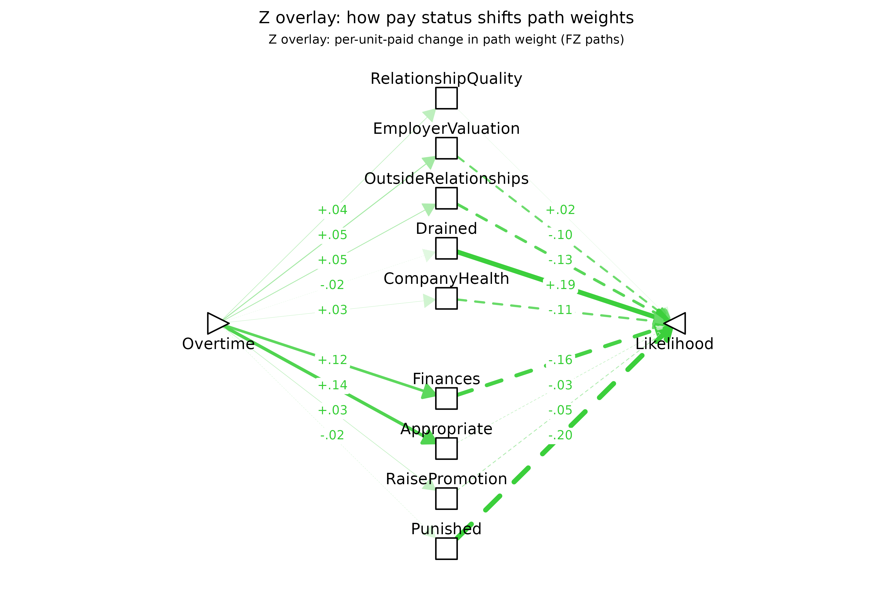
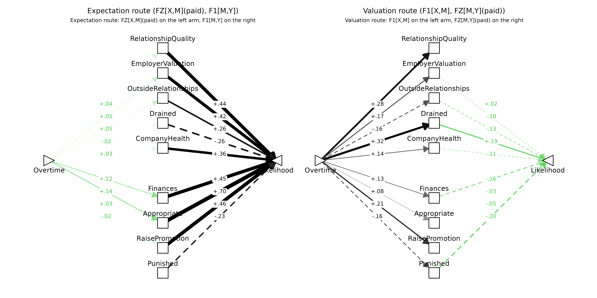
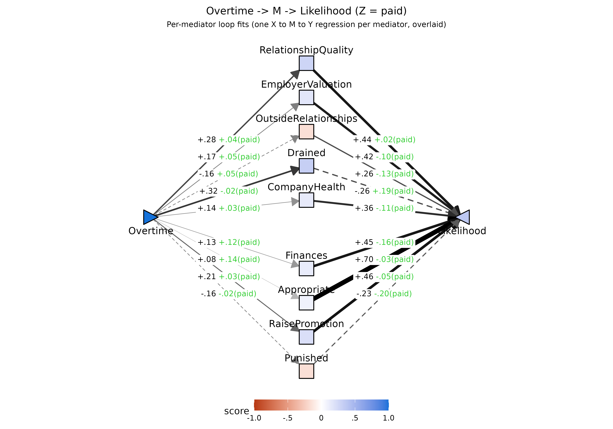
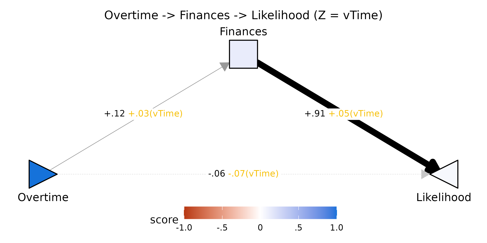

# Moderated mediation with \`pathXMY()\`: the work-overtime EXSJT

This vignette walks through moderated mediation with
[`pathXMY()`](https://dustin-wood.github.io/funfield/reference/pathXMY.md)
using the `overtimeESJT` dataset — an **EXSJT** in which a single
work-overtime scenario was randomly varied across eight features, and
each participant rated two actions (agree to work overtime; decline) on
nine expected outcomes.

**Same respondents as `speedingESJT`.** The work-overtime, speeding, and
data-home EXSJTs were all administered to the same Prolific panel (N =
347). The three datasets (`overtimeESJT`, `speedingESJT`,
`dataHomeESJT`) share a participant pool and can be linked by `p` — each
respondent’s id appears in all three datasets that retained them after
per-block quality screens. This makes cross-scenario consistency
questions (e.g., do trait-level differences predict similar expectation
shifts across domains?) tractable without recollecting data.

## The data

``` r

library(funfield)
data(overtimeESJT)
lapply(overtimeESJT, function(x) if (is.data.frame(x)) dim(x) else length(x))
#> $PSI
#> [1] 658  14
#> 
#> $cond
#> [1] 329  11
#> 
#> $sit
#> [1] 329   4
#> 
#> $traits
#> [1] 329  37
#> 
#> $codebook
#> [1] 8
```

## Variables and survey wording

### The scenario

Each participant saw exactly one scenario, randomly assembled from eight
situational factors. The Qualtrics scenario template lives at
`overtimeESJT$codebook$scenario$template`; what that returns is shown
below in a readable format. The `${...}` placeholders are filled in per
respondent from the eight factors that follow:

> \${e://Field/WO.CoType} asks if you can work overtime on a project for
> a couple hours tomorrow, a \${e://Field/WO.weekday}. You
> \${e://Field/WO.priorPlans} at that time. \${e://Field/WO.CoType2}
> says that \${e://Field/WO.cashReward}. It seems like the work would be
> \${e://Field/WO.workDifficulty}. It \${e://Field/WO.projectImpact}.

``` r

knitr::kable(
  overtimeESJT$codebook$scenario$factors,
  col.names = c("Factor", "Levels (semicolon-separated)"),
  caption = "The eight factors that varied across respondents"
)
```

|  | Factor | Levels (semicolon-separated) |
|:---|:---|:---|
| WO.CoType | CoType | A coworker; Your boss |
| WO.CoType2 | CoType2 | The coworker; Your boss |
| WO.CoType3 | CoType3 | your coworker; your boss |
| WO.weekday | weekday | Friday evening; Wednesday evening |
| WO.priorPlans | priorPlans | have previously made plans to meet with friends; don’t have any plans |
| WO.workDifficulty | workDifficulty | difficult; fairly easy |
| WO.cashReward | cashReward | the company isn’t offering overtime pay for the project; the company will pay you overtime (above your normal pay rate) to work on the project |
| WO.projectImpact | projectImpact | is clear that completing this project will be very helpful to the company; isn’t particularly clear how completing this project will help the company |

The eight factors that varied across respondents {.table}

Each respondent’s fully assembled scenario is in
`overtimeESJT$cond$scenario`. Below are the first three (i.e., what
`overtimeESJT$cond$scenario[1:3]` returns, again formatted for
readability):

> **Respondent 1.** A coworker asks if you can work overtime on a
> project for a couple hours tomorrow, a Wednesday evening. You have
> previously made plans to meet with friends at that time. The coworker
> says that the company will pay you overtime (above your normal pay
> rate) to work on the project. It seems like the work would be fairly
> easy. It isn’t particularly clear how completing this project will
> help the company.

> **Respondent 2.** Your boss asks if you can work overtime on a project
> for a couple hours tomorrow, a Wednesday evening. You have previously
> made plans to meet with friends at that time. Your boss says that the
> company isn’t offering overtime pay for the project. It seems like the
> work would be difficult. It isn’t particularly clear how completing
> this project will help the company.

> **Respondent 3.** A coworker asks if you can work overtime on a
> project for a couple hours tomorrow, a Wednesday evening. You have
> previously made plans to meet with friends at that time. The coworker
> says that the company will pay you overtime (above your normal pay
> rate) to work on the project. It seems like the work would be fairly
> easy. It is clear that completing this project will be very helpful to
> the company.

Notice how the same template produces materially different scenarios
through random factor assignment. The factor levels that were combined
to produce each of the three scenarios above:

``` r

knitr::kable(
  overtimeESJT$cond[1:3, c("CoType","weekday","priorPlans","workDifficulty",
                           "cashReward","projectImpact")],
  caption = "Factor levels for respondents 1-3"
)
```

|  | CoType | weekday | priorPlans | workDifficulty | cashReward | projectImpact |
|:---|:---|:---|:---|:---|:---|:---|
| 5 | A coworker | Wednesday evening | have previously made plans to meet with friends | fairly easy | the company will pay you overtime (above your normal pay rate) to work on the project | isn’t particularly clear how completing this project will help the company |
| 7 | Your boss | Wednesday evening | have previously made plans to meet with friends | difficult | the company isn’t offering overtime pay for the project | isn’t particularly clear how completing this project will help the company |
| 8 | A coworker | Wednesday evening | have previously made plans to meet with friends | fairly easy | the company will pay you overtime (above your normal pay rate) to work on the project | is clear that completing this project will be very helpful to the company |

Factor levels for respondents 1-3 {.table}

### Expected outcomes

After reading the scenario, each respondent rated each of the two
candidate actions on the nine expected-outcome items below (0 = Very Low
… 1 = Very High):

``` r

knitr::kable(
  overtimeESJT$codebook$outcomes[, c("var", "label")],
  col.names = c("Variable", "Survey wording"),
  caption = "Outcome items, rated on [0, 1]"
)
```

|  | Variable | Survey wording |
|:---|:---|:---|
| iOvertime1.Out_1 | RelationshipQuality | The quality of your relationship with \[Field-WO.CoType3\] |
| iOvertime1.Out_2 | EmployerValuation | The company’s understanding of your value as an employee |
| iOvertime1.Out_3 | OutsideRelationships | The quality of your relationships with people outside of work |
| iOvertime1.Out_4 | Drained | Your feeling of being drained/tired from work |
| iOvertime1.Out_5 | CompanyHealth | The health of the company |
| iOvertime1.Out_6 | Finances | Your overall financial well-being |
| iOvertime1.Out_7 | Appropriate | Your sense that you had acted appropriately |
| iOvertime1.Out_8 | RaisePromotion | Likelihood of company giving you a raise or promotion in the near future |
| iOvertime1.Out_9 | Punished | Likelihood of company firing/punishing you in the near future |

Outcome items, rated on \[0, 1\] {.table}

The focal **predictor** is `Overtime` — the action coding (0 = decline,
1 = agree to work overtime). The focal **outcome** is `Likelihood`. The
nine **mediators** are the expected-outcome ratings.

## Data preparation

Within-person deviate the Level-1 columns.

``` r

L1cols <- c("Overtime","RelationshipQuality","EmployerValuation",
            "OutsideRelationships","Drained","CompanyHealth","Finances",
            "Appropriate","RaisePromotion","Punished","Likelihood")
mediators <- c("RelationshipQuality","EmployerValuation","OutsideRelationships",
               "Drained","CompanyHealth","Finances","Appropriate",
               "RaisePromotion","Punished")

dat <- overtimeESJT$PSI
for (v in L1cols) {
  dat[[v]] <- ave(dat[[v]], dat$p, FUN = function(x) x - mean(x))
}
```

## Normative model (no moderator)

``` r

norm <- pathXMY(dat, X = "Overtime", Y = "Likelihood", M = mediators)
```

### Expectation paths (F1\[X,M\]): what does agreeing to overtime produce?

``` r

knitr::kable(
  subset(norm$tidy_loop, param == "f1_XM")[, c("mediator","est","se","z","pvalue")],
  digits = 3,
  caption = "Expectation paths (Overtime -> M)"
)
```

|     | mediator             |    est |    se |       z | pvalue |
|:----|:---------------------|-------:|------:|--------:|-------:|
| 1   | RelationshipQuality  |  0.280 | 0.017 |  16.085 |  0.000 |
| 5   | EmployerValuation    |  0.165 | 0.019 |   8.858 |  0.000 |
| 9   | OutsideRelationships | -0.162 | 0.021 |  -7.724 |  0.000 |
| 13  | Drained              |  0.319 | 0.020 |  15.640 |  0.000 |
| 17  | CompanyHealth        |  0.137 | 0.015 |   9.384 |  0.000 |
| 21  | Finances             |  0.125 | 0.017 |   7.500 |  0.000 |
| 25  | Appropriate          |  0.082 | 0.024 |   3.432 |  0.001 |
| 29  | RaisePromotion       |  0.210 | 0.014 |  15.046 |  0.000 |
| 33  | Punished             | -0.161 | 0.015 | -10.807 |  0.000 |

Expectation paths (Overtime -\> M) {.table}

Agreeing to work overtime is expected to substantially increase
`Drained` (+0.32), `RelationshipQuality` with the asker (+0.28),
`RaisePromotion` (+0.21), and `EmployerValuation` (+0.16). It is
expected to reduce `OutsideRelationships` (−0.16) and the likelihood of
being `Punished` by the company (−0.16). Smaller positive expectations
attach to `CompanyHealth`, `Finances`, and `Appropriate`.

### Valuation paths (F1\[M,Y\]): which expectations drive action likelihood?

``` r

knitr::kable(
  subset(norm$tidy_loop, param == "f1_MY")[, c("mediator","est","se","z","pvalue")],
  digits = 3,
  caption = "Valuation paths (M -> Likelihood)"
)
```

|     | mediator             |    est |    se |      z | pvalue |
|:----|:---------------------|-------:|------:|-------:|-------:|
| 3   | RelationshipQuality  |  0.567 | 0.106 |  5.352 |  0.000 |
| 7   | EmployerValuation    |  0.598 | 0.097 |  6.195 |  0.000 |
| 11  | OutsideRelationships |  0.395 | 0.090 |  4.414 |  0.000 |
| 15  | Drained              | -0.326 | 0.097 | -3.372 |  0.001 |
| 19  | CompanyHealth        |  0.497 | 0.122 |  4.062 |  0.000 |
| 23  | Finances             |  0.887 | 0.102 |  8.682 |  0.000 |
| 27  | Appropriate          |  0.904 | 0.048 | 18.940 |  0.000 |
| 31  | RaisePromotion       |  0.651 | 0.125 |  5.220 |  0.000 |
| 35  | Punished             | -0.350 | 0.140 | -2.497 |  0.013 |

Valuation paths (M -\> Likelihood) {.table}

`Appropriate` (+0.90) and `Finances` (+0.89) are the strongest positive
drivers of taking the action. `RaisePromotion` (+0.65),
`EmployerValuation` (+0.60), and `RelationshipQuality` (+0.57) also
strongly increase likelihood. `Drained` (−0.33) and `Punished` (−0.35)
suppress likelihood. The valuation pattern is intuitive: financial,
evaluative, and relational gains pull respondents toward the action;
expected fatigue and punishment push them away.

### Indirect effects (F1\[X,M\]·F1\[M,Y\])

``` r

knitr::kable(
  subset(norm$tidy_loop, param == "f1_XM * f1_MY")[, c("mediator","est","se","z","pvalue")],
  digits = 3,
  caption = "Indirect effects through each mediator"
)
```

|     | mediator             |    est |    se |      z | pvalue |
|:----|:---------------------|-------:|------:|-------:|-------:|
| 4   | RelationshipQuality  |  0.159 | 0.032 |  5.003 |  0.000 |
| 8   | EmployerValuation    |  0.099 | 0.019 |  5.158 |  0.000 |
| 12  | OutsideRelationships | -0.064 | 0.018 | -3.538 |  0.000 |
| 16  | Drained              | -0.104 | 0.033 | -3.164 |  0.002 |
| 20  | CompanyHealth        |  0.068 | 0.018 |  3.834 |  0.000 |
| 24  | Finances             |  0.111 | 0.019 |  5.800 |  0.000 |
| 28  | Appropriate          |  0.074 | 0.022 |  3.386 |  0.001 |
| 32  | RaisePromotion       |  0.136 | 0.028 |  4.853 |  0.000 |
| 36  | Punished             |  0.056 | 0.024 |  2.373 |  0.018 |

Indirect effects through each mediator {.table}

The pull toward agreeing comes mainly through expected gains in
`RelationshipQuality` (+0.16), `RaisePromotion` (+0.14), `Finances`
(+0.11), and `EmployerValuation` (+0.10). The push toward declining
comes through expected `Drained` (−0.10) and harm to
`OutsideRelationships` (−0.06).

## Situation-level moderation: is overtime paid?

`WO.cashReward` was randomly assigned at the person level: either the
company pays for the overtime work, or it doesn’t. Code as a binary
`paid` indicator and merge:

``` r

cot <- overtimeESJT$cond[, c("p","cashReward")]
cot$paid <- as.numeric(cot$cashReward ==
  "the company will pay you overtime (above your normal pay rate) to work on the project")
dat <- merge(dat, cot[, c("p","paid")], by = "p")

mod_s <- pathXMY(dat, X = "Overtime", Y = "Likelihood",
                 M = mediators, Z = "paid", Z.within = FALSE)
dec_paid <- pathXMY_decompose(dat, X = "Overtime", Y = "Likelihood",
                              M = mediators, Z = "paid", Z.within = FALSE)
```

### Can we identify reasons that paying for overtime increases the likelihood of agreeing to work overtime?

Pay status’s effect on the overall agreement decision routes through
*which* expected outcomes get shifted (the **expectation arm**,
`FZ[X,M]`) and through *how* each expected outcome is weighted on the
choice (the **valuation arm**, `FZ[M,Y]`). The pretty pairtable lays the
two arms side by side:

``` r

group_kable(
  pathXMY_pairtable(mod_s, c("fZ_XM", "fZ_MY")),
  groups = c(" " = 1,
             "Pay-status moderation: expectation arm (FZ[X,M])" = 4,
             "Pay-status moderation: valuation arm (FZ[M,Y])"   = 4),
  col_labels = c("Mediator", "est", "se", "z", "p",
                             "est", "se", "z", "p")
)
```

|  | Pay-status moderation: expectation arm (FZ\[X,M\]) |  |  |  | Pay-status moderation: valuation arm (FZ\[M,Y\]) |  |  |  |
|----|----|----|----|----|----|----|----|----|
| Mediator | est | se | z | p | est | se | z | p |
| RelationshipQuality | .036 | .017 | 2.067 | .039 | .017 | .091 | .188 | .851 |
| EmployerValuation | .053 | .018 | 2.921 | .003 | -.101 | .085 | -1.178 | .239 |
| OutsideRelationships | .047 | .021 | 2.254 | .024 | -.127 | .073 | -1.736 | .083 |
| Drained | -.015 | .020 | -.751 | .453 | .190 | .082 | 2.315 | .021 |
| CompanyHealth | .025 | .015 | 1.717 | .086 | -.108 | .103 | -1.054 | .292 |
| Finances | .121 | .015 | 8.039 | .000 | -.163 | .100 | -1.623 | .105 |
| Appropriate | .141 | .022 | 6.295 | .000 | -.033 | .054 | -.612 | .540 |
| RaisePromotion | .034 | .014 | 2.457 | .014 | -.047 | .117 | -.404 | .686 |
| Punished | -.020 | .015 | -1.355 | .175 | -.196 | .111 | -1.761 | .078 |

On the **expectation arm**, six of the nine outcomes are significantly
moderated. The largest shifts are in `Appropriate` (+0.141, *p* \< .001)
and `Finances` (+0.121, *p* \< .001) — agreeing to paid overtime feels
both more role-appropriate and genuinely produces more money, by a large
margin. Smaller but significant positive shifts attach to
`EmployerValuation`, `OutsideRelationships`, `RelationshipQuality`, and
`RaisePromotion`. The cost-side outcomes — `Drained`, `Punished`,
`CompanyHealth` — are untouched: pay status doesn’t change how depleting
or risky people expect overtime to be, it shifts the *upside* of the
action.

On the **valuation arm**, only one path reaches *p* \< .05: `Drained`
(+0.190, *p* = .02). The positive sign means the average negative weight
that fatigue carries on the agreement decision (`F1[M,Y]` ≈ −0.33) is
*less* negative when overtime is paid — being tired matters less to the
choice when there’s money on the table. Two cost paths near-miss
significance in the same direction (`Punished`, *p* = .08;
`OutsideRelationships`, *p* = .08). As in the speeding fits, the
valuation-arm standard errors run roughly 5× the expectation-arm SEs (a
design-variance asymmetry: `X` has guaranteed within-person variation,
the mediators don’t always follow), so magnitude-equivalent effects on
the right side are held to a weaker statistical claim than on the left.

#### Z-overlay field

The same coefficients as a **Z-overlay field** — the normative layout,
but with every `F1` swapped for its `FZ` counterpart. Each edge is the
per-unit-`paid` change in that path’s weight; near-zero coefficients
fade to light gray. Because `paid` is binary and z-standardized inside
[`pathXMY()`](https://dustin-wood.github.io/funfield/reference/pathXMY.md),
each edge is half the no-pay → pay swing in the corresponding F1.

``` r

plotPathXMY(mod_s,
            X_label = "Overtime", Y_label = "Likelihood",
            Z_label = "paid", X_shape = "rtTri",
            Z_overlay = TRUE,
            scale_max = 0.3,
            title = "Z overlay: how pay status shifts path weights")
```



Visually the asymmetry is obvious: the strongest moderation sits on the
left half of the diagram (expectation arms into `Appropriate` and
`Finances`), with most of the right half (valuation arms out of the
mediators) faded out.

#### Do those shifts create reasons to agree?

The expectation arm and the valuation arm only become *reasons* when
paired with their counterpart on the other side. An expectancy shift
through `Appropriate` is only a reason if `Appropriate` carries weight
on `Likelihood`; a valuation shift on `Drained` is only a reason if
overtime actually moves `Drained`.
[`plotPathXMY_routes()`](https://dustin-wood.github.io/funfield/reference/plotPathXMY_routes.md)
shows the two products directly: the **expectation route** pairs each
green `FZ[X,M](paid)` shift with the surviving black average `F1[M,Y]`;
the **valuation route** pairs each black average `F1[X,M]` with each
green `FZ[M,Y](paid)`. Both panels are read left-to-right: any complete
chain where both arms are visibly thick is a candidate reason that
paying shifts agreement.

``` r

plotPathXMY_routes(dec_paid,
                   X_label = "Overtime", Y_label = "Likelihood",
                   Z_label = "paid", X_shape = "rtTri",
                   scale_max = 0.5)
```



The **expectation route** does most of the work. The strongest reason
runs through `Appropriate` (+0.099, *p* \< .001) — agreeing to *paid*
overtime feels appropriate to a degree that agreeing to unpaid overtime
does not, and appropriateness in turn strongly drives the action. The
second-largest reason is `Finances` (+0.054, *p* \< .001): paid overtime
is expected to actually produce financial gain (it’s the definition of
the condition), and financial gain weighs heavily on the choice. Smaller
but real expectation-route reasons run through `EmployerValuation`
(+0.022, *p* = .01) and `RaisePromotion` (+0.016, *p* = .02), with
`RelationshipQuality` and `OutsideRelationships` borderline.

The **valuation route** contributes one significant reason: `Drained`
(+0.060, *p* = .02). Overtime is reliably expected to produce fatigue
(`F1[X,M](Drained)` ≈ +0.32 normatively); when that fatigue’s *weight*
on the decision shrinks under paid conditions, that shrinkage acts as a
route toward agreement even though the underlying expectation didn’t
change. `Punished` and `OutsideRelationships` carry borderline
valuation-route reasons in the same direction (when paid, the threat of
punishment and the threat to outside relationships matter slightly less
to the choice).

The composite picture: paying for overtime increases agreement mostly by
changing what respondents *expect* the action to produce — primarily
that it is appropriate to agree, and that agreement will actually be
financially rewarding — and secondarily by softening the *weight* placed
on the one cost the action reliably produces (fatigue). The upsides get
amplified and one of the downsides gets discounted; the rest of the cost
ledger stays as it was.

### Decomposition and field view

``` r

knitr::kable(dec_paid$total, digits = 3,
             caption = "Total moderation FZ*[X,Y] for pay status")
```

|   est |    se |      z | pvalue | ci.lower | ci.upper |
|------:|------:|-------:|-------:|---------:|---------:|
| 0.343 | 0.029 | 11.852 |      0 |    0.286 |    0.399 |

Total moderation FZ\*\[X,Y\] for pay status {.table}

``` r

plotPathXMY(dec_paid,
            X_label = "Overtime", Y_label = "Likelihood",
            Z_label = "paid",
            X_shape = "rtTri",
            title = "Overtime -> M -> Likelihood (Z = paid)")
```



The fan diagram’s mediator arms are the per-mediator *loop* fits (one X
to M to Y model per mediator, overlaid). The straight **X to Likelihood
arrow** is the residual direct path from the *joint* multi-mediator fit
(added automatically by `pathXMY(joint = TRUE)`, the default) — i.e. the
`Overtime -> Likelihood` effect after controlling for the *full* set of
nine mediators simultaneously. See the speeding vignette for an extended
discussion of why the loop coefficients (not the per-mediator joint
ones) are the right tool for inference about a single mediator’s role,
and why the joint `FZ[X,Y]` is best treated as a system-level diagnostic
(Wood, Adanu, & Harms, 2025).

``` r

plotPathXMY_widget(dec_paid,
                   X_label = "Overtime", Y_label = "Likelihood",
                   Z_label = "paid",
                   X_shape = "rtTri",
                   Z_levels = c(-1, 1),
                   format   = "svg")
```

![paid =
-1](data:image/svg+xml;base64,PD94bWwgdmVyc2lvbj0nMS4wJyBlbmNvZGluZz0nVVRGLTgnID8+CjxzdmcgeG1sbnM9J2h0dHA6Ly93d3cudzMub3JnLzIwMDAvc3ZnJyB4bWxuczp4bGluaz0naHR0cDovL3d3dy53My5vcmcvMTk5OS94bGluaycgd2lkdGg9JzY0OC4wMHB0JyBoZWlnaHQ9JzU0MC4wMHB0JyB2aWV3Qm94PScwIDAgNjQ4LjAwIDU0MC4wMCc+CjxnIGNsYXNzPSdzdmdsaXRlJz4KPGRlZnM+CiAgPHN0eWxlIHR5cGU9J3RleHQvY3NzJz48IVtDREFUQVsKICAgIC5zdmdsaXRlIGxpbmUsIC5zdmdsaXRlIHBvbHlsaW5lLCAuc3ZnbGl0ZSBwb2x5Z29uLCAuc3ZnbGl0ZSBwYXRoLCAuc3ZnbGl0ZSByZWN0LCAuc3ZnbGl0ZSBjaXJjbGUgewogICAgICBmaWxsOiBub25lOwogICAgICBzdHJva2U6ICMwMDAwMDA7CiAgICAgIHN0cm9rZS1saW5lY2FwOiByb3VuZDsKICAgICAgc3Ryb2tlLWxpbmVqb2luOiByb3VuZDsKICAgICAgc3Ryb2tlLW1pdGVybGltaXQ6IDEwLjAwOwogICAgfQogICAgLnN2Z2xpdGUgdGV4dCB7CiAgICAgIHdoaXRlLXNwYWNlOiBwcmU7CiAgICB9CiAgICAuc3ZnbGl0ZSBnLmdseXBoZ3JvdXAgcGF0aCB7CiAgICAgIGZpbGw6IGluaGVyaXQ7CiAgICAgIHN0cm9rZTogbm9uZTsKICAgIH0KICBdXT48L3N0eWxlPgo8L2RlZnM+CjxyZWN0IHdpZHRoPScxMDAlJyBoZWlnaHQ9JzEwMCUnIHN0eWxlPSdzdHJva2U6IG5vbmU7IGZpbGw6ICNGRkZGRkY7Jy8+CjxkZWZzPgogIDxjbGlwUGF0aCBpZD0nY3BNQzR3TUh3Mk5EZ3VNREI4TUM0d01IdzFOREF1TURBPSc+CiAgICA8cmVjdCB4PScwLjAwJyB5PScwLjAwJyB3aWR0aD0nNjQ4LjAwJyBoZWlnaHQ9JzU0MC4wMCcgLz4KICA8L2NsaXBQYXRoPgo8L2RlZnM+CjxnIGNsaXAtcGF0aD0ndXJsKCNjcE1DNHdNSHcyTkRndU1EQjhNQzR3TUh3MU5EQXVNREE9KSc+CjwvZz4KPGRlZnM+CiAgPGNsaXBQYXRoIGlkPSdjcE9EY3VNREI4TlRZeExqQXdmREF1TURCOE5UUXdMakF3Jz4KICAgIDxyZWN0IHg9Jzg3LjAwJyB5PScwLjAwJyB3aWR0aD0nNDczLjk5JyBoZWlnaHQ9JzU0MC4wMCcgLz4KICA8L2NsaXBQYXRoPgo8L2RlZnM+CjxnIGNsaXAtcGF0aD0ndXJsKCNjcE9EY3VNREI4TlRZeExqQXdmREF1TURCOE5UUXdMakF3KSc+CjxyZWN0IHg9Jzg3LjAwJyB5PScwLjAwJyB3aWR0aD0nNDczLjk5JyBoZWlnaHQ9JzU0MC4wMCcgc3R5bGU9J3N0cm9rZS13aWR0aDogMC4wMDsgc3Ryb2tlOiBub25lOycgLz4KPC9nPgo8ZyBjbGlwLXBhdGg9J3VybCgjY3BNQzR3TUh3Mk5EZ3VNREI4TUM0d01IdzFOREF1TURBPSknPgo8bGluZSB4MT0nMTI4LjE5JyB5MT0nMjY5Ljk1JyB4Mj0nMzE0LjcyJyB5Mj0nODUuMjknIHN0eWxlPSdzdHJva2Utd2lkdGg6IDEuMzM7IHN0cm9rZTogIzU1NTU1NTsnIC8+Cjxwb2x5Z29uIHBvaW50cz0nMzEyLjA2LDk1LjAyIDMxNC43Miw4NS4yOSAzMDQuOTcsODcuODUgJyBzdHlsZT0nc3Ryb2tlLXdpZHRoOiAxLjMzOyBzdHJva2U6ICM1NTU1NTU7IGZpbGw6ICM1NTU1NTU7JyAvPgo8bGluZSB4MT0nMzMzLjI4JyB5MT0nODUuMjknIHgyPSc1MTkuODEnIHkyPScyNjkuOTUnIHN0eWxlPSdzdHJva2Utd2lkdGg6IDIuNzQ7IHN0cm9rZTogIzFCMUIxQjsnIC8+Cjxwb2x5Z29uIHBvaW50cz0nNTEwLjA2LDI2Ny4zOSA1MTkuODEsMjY5Ljk1IDUxNy4xNSwyNjAuMjMgJyBzdHlsZT0nc3Ryb2tlLXdpZHRoOiAyLjc0OyBzdHJva2U6ICMxQjFCMUI7IGZpbGw6ICMxQjFCMUI7JyAvPgo8bGluZSB4MT0nMTI4LjczJyB5MT0nMjcwLjIyJyB4Mj0nMzE0LjcyJyB5Mj0nMTI3LjAxJyBzdHlsZT0nc3Ryb2tlLXdpZHRoOiAwLjUyOyBzdHJva2U6ICNBMkEyQTI7JyAvPgo8cG9seWdvbiBwb2ludHM9JzMxMC44OCwxMzYuMzMgMzE0LjcyLDEyNy4wMSAzMDQuNzMsMTI4LjM1ICcgc3R5bGU9J3N0cm9rZS13aWR0aDogMC41Mjsgc3Ryb2tlOiAjQTJBMkEyOyBmaWxsOiAjQTJBMkEyOycgLz4KPGxpbmUgeDE9JzMzMy4yOCcgeTE9JzEyNy4wMScgeDI9JzUxOS4yNycgeTI9JzI3MC4yMicgc3R5bGU9J3N0cm9rZS13aWR0aDogMy41ODsgc3Ryb2tlOiAjMEIwQjBCOycgLz4KPHBvbHlnb24gcG9pbnRzPSc1MDkuMjgsMjY4Ljg5IDUxOS4yNywyNzAuMjIgNTE1LjQyLDI2MC45MCAnIHN0eWxlPSdzdHJva2Utd2lkdGg6IDMuNTg7IHN0cm9rZTogIzBCMEIwQjsgZmlsbDogIzBCMEIwQjsnIC8+CjxsaW5lIHgxPScxMjkuNTAnIHkxPScyNzAuNjAnIHgyPSczMTQuNzInIHkyPScxNjguNzMnIHN0eWxlPSdzdHJva2Utd2lkdGg6IDEuMDc7IHN0cm9rZTogIzY4Njg2ODsgc3Ryb2tlLWRhc2hhcnJheTogNS43Miw1LjcyOycgLz4KPHBvbHlnb24gcG9pbnRzPSczMDkuNTAsMTc3LjM2IDMxNC43MiwxNjguNzMgMzA0LjY0LDE2OC41MiAnIHN0eWxlPSdzdHJva2Utd2lkdGg6IDEuMDc7IHN0cm9rZTogIzY4Njg2ODsgc3Ryb2tlLWRhc2hhcnJheTogNS43Miw1LjcyOyBmaWxsOiAjNjg2ODY4OycgLz4KPGxpbmUgeDE9JzMzMy4yOCcgeTE9JzE2OC43MycgeDI9JzUxOC41MCcgeTI9JzI3MC42MCcgc3R5bGU9J3N0cm9rZS13aWR0aDogMi40Mzsgc3Ryb2tlOiAjMjMyMzIzOycgLz4KPHBvbHlnb24gcG9pbnRzPSc1MDguNDIsMjcwLjgxIDUxOC41MCwyNzAuNjAgNTEzLjI4LDI2MS45OCAnIHN0eWxlPSdzdHJva2Utd2lkdGg6IDIuNDM7IHN0cm9rZTogIzIzMjMyMzsgZmlsbDogIzIzMjMyMzsnIC8+CjxsaW5lIHgxPScxMzAuNjcnIHkxPScyNzEuMTknIHgyPSczMTQuNzInIHkyPScyMTAuNDUnIHN0eWxlPSdzdHJva2Utd2lkdGg6IDEuOTk7IHN0cm9rZTogIzMyMzIzMjsnIC8+Cjxwb2x5Z29uIHBvaW50cz0nMzA4LjAxLDIxNy45OCAzMTQuNzIsMjEwLjQ1IDMwNC44NSwyMDguNDAgJyBzdHlsZT0nc3Ryb2tlLXdpZHRoOiAxLjk5OyBzdHJva2U6ICMzMjMyMzI7IGZpbGw6ICMzMjMyMzI7JyAvPgo8bGluZSB4MT0nMzMzLjI4JyB5MT0nMjEwLjQ1JyB4Mj0nNTE3LjMzJyB5Mj0nMjcxLjE5JyBzdHlsZT0nc3Ryb2tlLXdpZHRoOiAzLjAwOyBzdHJva2U6ICMxNTE1MTU7IHN0cm9rZS1kYXNoYXJyYXk6IDE1Ljk4LDE1Ljk4OycgLz4KPHBvbHlnb24gcG9pbnRzPSc1MDcuNDYsMjczLjI0IDUxNy4zMywyNzEuMTkgNTEwLjYyLDI2My42NyAnIHN0eWxlPSdzdHJva2Utd2lkdGg6IDMuMDA7IHN0cm9rZTogIzE1MTUxNTsgc3Ryb2tlLWRhc2hhcnJheTogMTUuOTgsMTUuOTg7IGZpbGw6ICMxNTE1MTU7JyAvPgo8bGluZSB4MT0nMTMyLjY5JyB5MT0nMjcyLjIwJyB4Mj0nMzE0LjcyJyB5Mj0nMjUyLjE3JyBzdHlsZT0nc3Ryb2tlLXdpZHRoOiAwLjUyOyBzdHJva2U6ICNBMkEyQTI7JyAvPgo8cG9seWdvbiBwb2ludHM9JzMwNi41OSwyNTguMTQgMzE0LjcyLDI1Mi4xNyAzMDUuNDksMjQ4LjEyICcgc3R5bGU9J3N0cm9rZS13aWR0aDogMC41Mjsgc3Ryb2tlOiAjQTJBMkEyOyBmaWxsOiAjQTJBMkEyOycgLz4KPGxpbmUgeDE9JzMzMy4yOCcgeTE9JzI1Mi4xNycgeDI9JzUxNS4zMScgeTI9JzI3Mi4yMCcgc3R5bGU9J3N0cm9rZS13aWR0aDogMy4xMzsgc3Ryb2tlOiAjMTIxMjEyOycgLz4KPHBvbHlnb24gcG9pbnRzPSc1MDYuMDgsMjc2LjI1IDUxNS4zMSwyNzIuMjAgNTA3LjE5LDI2Ni4yMyAnIHN0eWxlPSdzdHJva2Utd2lkdGg6IDMuMTM7IHN0cm9rZTogIzEyMTIxMjsgZmlsbDogIzEyMTIxMjsnIC8+CjxsaW5lIHgxPScxMzAuNjcnIHkxPScyNzQuODgnIHgyPSczMTQuNzInIHkyPSczMzUuNjInIHN0eWxlPSdzdHJva2Utd2lkdGg6IDAuMTE7IHN0cm9rZTogI0Y5RjlGOTsnIC8+Cjxwb2x5Z29uIHBvaW50cz0nMzA0Ljg1LDMzNy42NyAzMTQuNzIsMzM1LjYyIDMwOC4wMSwzMjguMDkgJyBzdHlsZT0nc3Ryb2tlLXdpZHRoOiAwLjExOyBzdHJva2U6ICNGOUY5Rjk7IGZpbGw6ICNGOUY5Rjk7JyAvPgo8bGluZSB4MT0nMzMzLjI4JyB5MT0nMzM1LjYyJyB4Mj0nNTE3LjMzJyB5Mj0nMjc0Ljg4JyBzdHlsZT0nc3Ryb2tlLXdpZHRoOiA0LjUwOyBzdHJva2U6ICMwMzAzMDM7JyAvPgo8cG9seWdvbiBwb2ludHM9JzUxMC42MiwyODIuNDAgNTE3LjMzLDI3NC44OCA1MDcuNDYsMjcyLjgzICcgc3R5bGU9J3N0cm9rZS13aWR0aDogNC41MDsgc3Ryb2tlOiAjMDMwMzAzOyBmaWxsOiAjMDMwMzAzOycgLz4KPGxpbmUgeDE9JzEyOS41MCcgeTE9JzI3NS40NycgeDI9JzMxNC43MicgeTI9JzM3Ny4zNCcgc3R5bGU9J3N0cm9rZS13aWR0aDogMC4yNjsgc3Ryb2tlOiAjQ0RDRENEOyBzdHJva2UtZGFzaGFycmF5OiA0LjAwLDQuMDA7JyAvPgo8cG9seWdvbiBwb2ludHM9JzMwNC42NCwzNzcuNTQgMzE0LjcyLDM3Ny4zNCAzMDkuNTAsMzY4LjcxICcgc3R5bGU9J3N0cm9rZS13aWR0aDogMC4yNjsgc3Ryb2tlOiAjQ0RDRENEOyBzdHJva2UtZGFzaGFycmF5OiA0LjAwLDQuMDA7IGZpbGw6ICNDRENEQ0Q7JyAvPgo8bGluZSB4MT0nMzMzLjI4JyB5MT0nMzc3LjM0JyB4Mj0nNTE4LjUwJyB5Mj0nMjc1LjQ3JyBzdHlsZT0nc3Ryb2tlLXdpZHRoOiA1Ljc4OycgLz4KPHBvbHlnb24gcG9pbnRzPSc1MTMuMjgsMjg0LjA5IDUxOC41MCwyNzUuNDcgNTA4LjQyLDI3NS4yNiAnIHN0eWxlPSdzdHJva2Utd2lkdGg6IDUuNzg7IGZpbGw6ICMwMDAwMDA7JyAvPgo8bGluZSB4MT0nMTI4LjczJyB5MT0nMjc1Ljg1JyB4Mj0nMzE0LjcyJyB5Mj0nNDE5LjA2JyBzdHlsZT0nc3Ryb2tlLXdpZHRoOiAwLjg4OyBzdHJva2U6ICM3OTc5Nzk7JyAvPgo8cG9seWdvbiBwb2ludHM9JzMwNC43Myw0MTcuNzIgMzE0LjcyLDQxOS4wNiAzMTAuODgsNDA5Ljc0ICcgc3R5bGU9J3N0cm9rZS13aWR0aDogMC44ODsgc3Ryb2tlOiAjNzk3OTc5OyBmaWxsOiAjNzk3OTc5OycgLz4KPGxpbmUgeDE9JzMzMy4yOCcgeTE9JzQxOS4wNicgeDI9JzUxOS4yNycgeTI9JzI3NS44NScgc3R5bGU9J3N0cm9rZS13aWR0aDogMy41MTsgc3Ryb2tlOiAjMEMwQzBDOycgLz4KPHBvbHlnb24gcG9pbnRzPSc1MTUuNDIsMjg1LjE3IDUxOS4yNywyNzUuODUgNTA5LjI4LDI3Ny4xOCAnIHN0eWxlPSdzdHJva2Utd2lkdGg6IDMuNTE7IHN0cm9rZTogIzBDMEMwQzsgZmlsbDogIzBDMEMwQzsnIC8+CjxsaW5lIHgxPScxMjguMTknIHkxPScyNzYuMTInIHgyPSczMTQuNzInIHkyPSc0NjAuNzgnIHN0eWxlPSdzdHJva2Utd2lkdGg6IDAuNjc7IHN0cm9rZTogIzhGOEY4Rjsgc3Ryb2tlLWRhc2hhcnJheTogNC4wMCw0LjAwOycgLz4KPHBvbHlnb24gcG9pbnRzPSczMDQuOTcsNDU4LjIyIDMxNC43Miw0NjAuNzggMzEyLjA2LDQ1MS4wNSAnIHN0eWxlPSdzdHJva2Utd2lkdGg6IDAuNjc7IHN0cm9rZTogIzhGOEY4Rjsgc3Ryb2tlLWRhc2hhcnJheTogNC4wMCw0LjAwOyBmaWxsOiAjOEY4RjhGOycgLz4KPGxpbmUgeDE9JzMzMy4yOCcgeTE9JzQ2MC43OCcgeDI9JzUxOS44MScgeTI9JzI3Ni4xMicgc3R5bGU9J3N0cm9rZS13aWR0aDogMC4yMDsgc3Ryb2tlOiAjRENEQ0RDOyBzdHJva2UtZGFzaGFycmF5OiA0LjAwLDQuMDA7JyAvPgo8cG9seWdvbiBwb2ludHM9JzUxNy4xNSwyODUuODQgNTE5LjgxLDI3Ni4xMiA1MTAuMDYsMjc4LjY4ICcgc3R5bGU9J3N0cm9rZS13aWR0aDogMC4yMDsgc3Ryb2tlOiAjRENEQ0RDOyBzdHJva2UtZGFzaGFycmF5OiA0LjAwLDQuMDA7IGZpbGw6ICNEQ0RDREM7JyAvPgo8cG9seWdvbiBwb2ludHM9JzIxNS45OSwxODAuMzcgMjMzLjA5LDE4MC4zNyAyMzMuMDAsMTgwLjM3IDIzMy4zNSwxODAuMzUgMjMzLjY5LDE4MC4yOCAyMzQuMDIsMTgwLjE2IDIzNC4zMiwxNzkuOTkgMjM0LjU5LDE3OS43NyAyMzQuODIsMTc5LjUxIDIzNS4wMCwxNzkuMjEgMjM1LjE0LDE3OC44OSAyMzUuMjIsMTc4LjU1IDIzNS4yNSwxNzguMjEgMjM1LjI1LDE3OC4yMSAyMzUuMjUsMTcwLjkzIDIzNS4yNSwxNzAuOTMgMjM1LjIyLDE3MC41OCAyMzUuMTQsMTcwLjI0IDIzNS4wMCwxNjkuOTMgMjM0LjgyLDE2OS42MyAyMzQuNTksMTY5LjM3IDIzNC4zMiwxNjkuMTUgMjM0LjAyLDE2OC45OCAyMzMuNjksMTY4Ljg1IDIzMy4zNSwxNjguNzggMjMzLjA5LDE2OC43NyAyMTUuOTksMTY4Ljc3IDIxNi4yNSwxNjguNzggMjE1LjkwLDE2OC43NyAyMTUuNTUsMTY4LjgxIDIxNS4yMiwxNjguOTEgMjE0LjkxLDE2OS4wNiAyMTQuNjIsMTY5LjI2IDIxNC4zNywxNjkuNTAgMjE0LjE2LDE2OS43NyAyMTQuMDAsMTcwLjA4IDIxMy44OSwxNzAuNDEgMjEzLjgzLDE3MC43NiAyMTMuODMsMTcwLjkzIDIxMy44MywxNzguMjEgMjEzLjgzLDE3OC4wMyAyMTMuODMsMTc4LjM4IDIxMy44OSwxNzguNzMgMjE0LjAwLDE3OS4wNSAyMTQuMTYsMTc5LjM2IDIxNC4zNywxNzkuNjQgMjE0LjYyLDE3OS44OCAyMTQuOTEsMTgwLjA4IDIxNS4yMiwxODAuMjMgMjE1LjU1LDE4MC4zMiAyMTUuOTAsMTgwLjM3ICcgc3R5bGU9J3N0cm9rZS13aWR0aDogMC4wMDsgZmlsbDogI0ZGRkZGRjsnIC8+Cjx0ZXh0IHg9JzIxNS41NScgeT0nMTc2Ljc1JyBzdHlsZT0nZm9udC1zaXplOiA5LjEwcHg7IGZvbnQtZmFtaWx5OiAiTGliZXJhdGlvbiBTYW5zIjsnIHRleHRMZW5ndGg9JzE3Ljk3cHgnIGxlbmd0aEFkanVzdD0nc3BhY2luZ0FuZEdseXBocyc+Ky4yNDwvdGV4dD4KPHBvbHlnb24gcG9pbnRzPSc0MTQuOTEsMTgwLjM3IDQzMi4wMSwxODAuMzcgNDMxLjkzLDE4MC4zNyA0MzIuMjcsMTgwLjM1IDQzMi42MSwxODAuMjggNDMyLjk0LDE4MC4xNiA0MzMuMjQsMTc5Ljk5IDQzMy41MSwxNzkuNzcgNDMzLjc0LDE3OS41MSA0MzMuOTMsMTc5LjIxIDQzNC4wNiwxNzguODkgNDM0LjE1LDE3OC41NSA0MzQuMTcsMTc4LjIxIDQzNC4xNywxNzguMjEgNDM0LjE3LDE3MC45MyA0MzQuMTcsMTcwLjkzIDQzNC4xNSwxNzAuNTggNDM0LjA2LDE3MC4yNCA0MzMuOTMsMTY5LjkzIDQzMy43NCwxNjkuNjMgNDMzLjUxLDE2OS4zNyA0MzMuMjQsMTY5LjE1IDQzMi45NCwxNjguOTggNDMyLjYxLDE2OC44NSA0MzIuMjcsMTY4Ljc4IDQzMi4wMSwxNjguNzcgNDE0LjkxLDE2OC43NyA0MTUuMTcsMTY4Ljc4IDQxNC44MiwxNjguNzcgNDE0LjQ4LDE2OC44MSA0MTQuMTQsMTY4LjkxIDQxMy44MywxNjkuMDYgNDEzLjU0LDE2OS4yNiA0MTMuMjksMTY5LjUwIDQxMy4wOCwxNjkuNzcgNDEyLjkyLDE3MC4wOCA0MTIuODEsMTcwLjQxIDQxMi43NiwxNzAuNzYgNDEyLjc1LDE3MC45MyA0MTIuNzUsMTc4LjIxIDQxMi43NiwxNzguMDMgNDEyLjc2LDE3OC4zOCA0MTIuODEsMTc4LjczIDQxMi45MiwxNzkuMDUgNDEzLjA4LDE3OS4zNiA0MTMuMjksMTc5LjY0IDQxMy41NCwxNzkuODggNDEzLjgzLDE4MC4wOCA0MTQuMTQsMTgwLjIzIDQxNC40OCwxODAuMzIgNDE0LjgyLDE4MC4zNyAnIHN0eWxlPSdzdHJva2Utd2lkdGg6IDAuMDA7IGZpbGw6ICNGRkZGRkY7JyAvPgo8dGV4dCB4PSc0MTQuNDgnIHk9JzE3Ni43NScgc3R5bGU9J2ZvbnQtc2l6ZTogOS4xMHB4OyBmb250LWZhbWlseTogIkxpYmVyYXRpb24gU2FucyI7JyB0ZXh0TGVuZ3RoPScxNy45N3B4JyBsZW5ndGhBZGp1c3Q9J3NwYWNpbmdBbmRHbHlwaHMnPisuNDI8L3RleHQ+Cjxwb2x5Z29uIHBvaW50cz0nMjE2LjMyLDIwMi4yNSAyMzIuNzYsMjAyLjI1IDIzMi42NywyMDIuMjUgMjMzLjAyLDIwMi4yMyAyMzMuMzYsMjAyLjE2IDIzMy42OCwyMDIuMDQgMjMzLjk4LDIwMS44NyAyMzQuMjUsMjAxLjY1IDIzNC40OCwyMDEuMzkgMjM0LjY3LDIwMS4wOSAyMzQuODAsMjAwLjc3IDIzNC44OSwyMDAuNDQgMjM0LjkyLDIwMC4wOSAyMzQuOTIsMjAwLjA5IDIzNC45MiwxOTIuODEgMjM0LjkyLDE5Mi44MSAyMzQuODksMTkyLjQ2IDIzNC44MCwxOTIuMTMgMjM0LjY3LDE5MS44MSAyMzQuNDgsMTkxLjUxIDIzNC4yNSwxOTEuMjUgMjMzLjk4LDE5MS4wMyAyMzMuNjgsMTkwLjg2IDIzMy4zNiwxOTAuNzQgMjMzLjAyLDE5MC42NyAyMzIuNzYsMTkwLjY1IDIxNi4zMiwxOTAuNjUgMjE2LjU4LDE5MC42NyAyMTYuMjQsMTkwLjY1IDIxNS44OSwxOTAuNjkgMjE1LjU2LDE5MC43OSAyMTUuMjQsMTkwLjk0IDIxNC45NiwxOTEuMTQgMjE0LjcxLDE5MS4zOCAyMTQuNTAsMTkxLjY2IDIxNC4zNCwxOTEuOTYgMjE0LjIzLDE5Mi4yOSAyMTQuMTcsMTkyLjY0IDIxNC4xNiwxOTIuODEgMjE0LjE2LDIwMC4wOSAyMTQuMTcsMTk5LjkyIDIxNC4xNywyMDAuMjYgMjE0LjIzLDIwMC42MSAyMTQuMzQsMjAwLjk0IDIxNC41MCwyMDEuMjQgMjE0LjcxLDIwMS41MiAyMTQuOTYsMjAxLjc2IDIxNS4yNCwyMDEuOTYgMjE1LjU2LDIwMi4xMSAyMTUuODksMjAyLjIxIDIxNi4yNCwyMDIuMjUgJyBzdHlsZT0nc3Ryb2tlLXdpZHRoOiAwLjAwOyBmaWxsOiAjRkZGRkZGOycgLz4KPHRleHQgeD0nMjE1Ljg5JyB5PScxOTguNjQnIHN0eWxlPSdmb250LXNpemU6IDkuMTBweDsgZm9udC1mYW1pbHk6ICJMaWJlcmF0aW9uIFNhbnMiOycgdGV4dExlbmd0aD0nMTcuMzBweCcgbGVuZ3RoQWRqdXN0PSdzcGFjaW5nQW5kR2x5cGhzJz4rLjExPC90ZXh0Pgo8cG9seWdvbiBwb2ludHM9JzQxNC45MSwyMDIuMjUgNDMyLjAxLDIwMi4yNSA0MzEuOTMsMjAyLjI1IDQzMi4yNywyMDIuMjMgNDMyLjYxLDIwMi4xNiA0MzIuOTQsMjAyLjA0IDQzMy4yNCwyMDEuODcgNDMzLjUxLDIwMS42NSA0MzMuNzQsMjAxLjM5IDQzMy45MywyMDEuMDkgNDM0LjA2LDIwMC43NyA0MzQuMTUsMjAwLjQ0IDQzNC4xNywyMDAuMDkgNDM0LjE3LDIwMC4wOSA0MzQuMTcsMTkyLjgxIDQzNC4xNywxOTIuODEgNDM0LjE1LDE5Mi40NiA0MzQuMDYsMTkyLjEzIDQzMy45MywxOTEuODEgNDMzLjc0LDE5MS41MSA0MzMuNTEsMTkxLjI1IDQzMy4yNCwxOTEuMDMgNDMyLjk0LDE5MC44NiA0MzIuNjEsMTkwLjc0IDQzMi4yNywxOTAuNjcgNDMyLjAxLDE5MC42NSA0MTQuOTEsMTkwLjY1IDQxNS4xNywxOTAuNjcgNDE0LjgyLDE5MC42NSA0MTQuNDgsMTkwLjY5IDQxNC4xNCwxOTAuNzkgNDEzLjgzLDE5MC45NCA0MTMuNTQsMTkxLjE0IDQxMy4yOSwxOTEuMzggNDEzLjA4LDE5MS42NiA0MTIuOTIsMTkxLjk2IDQxMi44MSwxOTIuMjkgNDEyLjc2LDE5Mi42NCA0MTIuNzUsMTkyLjgxIDQxMi43NSwyMDAuMDkgNDEyLjc2LDE5OS45MiA0MTIuNzYsMjAwLjI2IDQxMi44MSwyMDAuNjEgNDEyLjkyLDIwMC45NCA0MTMuMDgsMjAxLjI0IDQxMy4yOSwyMDEuNTIgNDEzLjU0LDIwMS43NiA0MTMuODMsMjAxLjk2IDQxNC4xNCwyMDIuMTEgNDE0LjQ4LDIwMi4yMSA0MTQuODIsMjAyLjI1ICcgc3R5bGU9J3N0cm9rZS13aWR0aDogMC4wMDsgZmlsbDogI0ZGRkZGRjsnIC8+Cjx0ZXh0IHg9JzQxNC40OCcgeT0nMTk4LjY0JyBzdHlsZT0nZm9udC1zaXplOiA5LjEwcHg7IGZvbnQtZmFtaWx5OiAiTGliZXJhdGlvbiBTYW5zIjsnIHRleHRMZW5ndGg9JzE3Ljk3cHgnIGxlbmd0aEFkanVzdD0nc3BhY2luZ0FuZEdseXBocyc+Ky41MjwvdGV4dD4KPHBvbHlnb24gcG9pbnRzPScyMTcuMTMsMjI0LjEzIDIzMS45NSwyMjQuMTMgMjMxLjg2LDIyNC4xMyAyMzIuMjEsMjI0LjEyIDIzMi41NSwyMjQuMDUgMjMyLjg4LDIyMy45MiAyMzMuMTgsMjIzLjc1IDIzMy40NSwyMjMuNTMgMjMzLjY4LDIyMy4yNyAyMzMuODYsMjIyLjk3IDIzNC4wMCwyMjIuNjUgMjM0LjA4LDIyMi4zMiAyMzQuMTEsMjIxLjk3IDIzNC4xMSwyMjEuOTcgMjM0LjExLDIxNC42OSAyMzQuMTEsMjE0LjY5IDIzNC4wOCwyMTQuMzUgMjM0LjAwLDIxNC4wMSAyMzMuODYsMjEzLjY5IDIzMy42OCwyMTMuMzkgMjMzLjQ1LDIxMy4xMyAyMzMuMTgsMjEyLjkxIDIzMi44OCwyMTIuNzQgMjMyLjU1LDIxMi42MiAyMzIuMjEsMjEyLjU1IDIzMS45NSwyMTIuNTMgMjE3LjEzLDIxMi41MyAyMTcuMzksMjEyLjU1IDIxNy4wNCwyMTIuNTMgMjE2LjcwLDIxMi41OCAyMTYuMzYsMjEyLjY3IDIxNi4wNSwyMTIuODIgMjE1Ljc2LDIxMy4wMiAyMTUuNTEsMjEzLjI2IDIxNS4zMCwyMTMuNTQgMjE1LjE0LDIxMy44NCAyMTUuMDMsMjE0LjE3IDIxNC45NywyMTQuNTIgMjE0Ljk3LDIxNC42OSAyMTQuOTcsMjIxLjk3IDIxNC45NywyMjEuODAgMjE0Ljk3LDIyMi4xNCAyMTUuMDMsMjIyLjQ5IDIxNS4xNCwyMjIuODIgMjE1LjMwLDIyMy4xMyAyMTUuNTEsMjIzLjQwIDIxNS43NiwyMjMuNjQgMjE2LjA1LDIyMy44NCAyMTYuMzYsMjIzLjk5IDIxNi43MCwyMjQuMDkgMjE3LjA0LDIyNC4xMyAnIHN0eWxlPSdzdHJva2Utd2lkdGg6IDAuMDA7IGZpbGw6ICNGRkZGRkY7JyAvPgo8dGV4dCB4PScyMTYuNzAnIHk9JzIyMC41Micgc3R5bGU9J2ZvbnQtc2l6ZTogOS4xMHB4OyBmb250LWZhbWlseTogIkxpYmVyYXRpb24gU2FucyI7JyB0ZXh0TGVuZ3RoPScxNS42OXB4JyBsZW5ndGhBZGp1c3Q9J3NwYWNpbmdBbmRHbHlwaHMnPi0uMjE8L3RleHQ+Cjxwb2x5Z29uIHBvaW50cz0nNDE0LjkxLDIyNC4xMyA0MzIuMDEsMjI0LjEzIDQzMS45MywyMjQuMTMgNDMyLjI3LDIyNC4xMiA0MzIuNjEsMjI0LjA1IDQzMi45NCwyMjMuOTIgNDMzLjI0LDIyMy43NSA0MzMuNTEsMjIzLjUzIDQzMy43NCwyMjMuMjcgNDMzLjkzLDIyMi45NyA0MzQuMDYsMjIyLjY1IDQzNC4xNSwyMjIuMzIgNDM0LjE3LDIyMS45NyA0MzQuMTcsMjIxLjk3IDQzNC4xNywyMTQuNjkgNDM0LjE3LDIxNC42OSA0MzQuMTUsMjE0LjM1IDQzNC4wNiwyMTQuMDEgNDMzLjkzLDIxMy42OSA0MzMuNzQsMjEzLjM5IDQzMy41MSwyMTMuMTMgNDMzLjI0LDIxMi45MSA0MzIuOTQsMjEyLjc0IDQzMi42MSwyMTIuNjIgNDMyLjI3LDIxMi41NSA0MzIuMDEsMjEyLjUzIDQxNC45MSwyMTIuNTMgNDE1LjE3LDIxMi41NSA0MTQuODIsMjEyLjUzIDQxNC40OCwyMTIuNTggNDE0LjE0LDIxMi42NyA0MTMuODMsMjEyLjgyIDQxMy41NCwyMTMuMDIgNDEzLjI5LDIxMy4yNiA0MTMuMDgsMjEzLjU0IDQxMi45MiwyMTMuODQgNDEyLjgxLDIxNC4xNyA0MTIuNzYsMjE0LjUyIDQxMi43NSwyMTQuNjkgNDEyLjc1LDIyMS45NyA0MTIuNzYsMjIxLjgwIDQxMi43NiwyMjIuMTQgNDEyLjgxLDIyMi40OSA0MTIuOTIsMjIyLjgyIDQxMy4wOCwyMjMuMTMgNDEzLjI5LDIyMy40MCA0MTMuNTQsMjIzLjY0IDQxMy44MywyMjMuODQgNDE0LjE0LDIyMy45OSA0MTQuNDgsMjI0LjA5IDQxNC44MiwyMjQuMTMgJyBzdHlsZT0nc3Ryb2tlLXdpZHRoOiAwLjAwOyBmaWxsOiAjRkZGRkZGOycgLz4KPHRleHQgeD0nNDE0LjQ4JyB5PScyMjAuNTInIHN0eWxlPSdmb250LXNpemU6IDkuMTBweDsgZm9udC1mYW1pbHk6ICJMaWJlcmF0aW9uIFNhbnMiOycgdGV4dExlbmd0aD0nMTcuOTdweCcgbGVuZ3RoQWRqdXN0PSdzcGFjaW5nQW5kR2x5cGhzJz4rLjM5PC90ZXh0Pgo8cG9seWdvbiBwb2ludHM9JzIxNS45OSwyNDYuMDEgMjMzLjA5LDI0Ni4wMSAyMzMuMDAsMjQ2LjAxIDIzMy4zNSwyNDYuMDAgMjMzLjY5LDI0NS45MyAyMzQuMDIsMjQ1LjgwIDIzNC4zMiwyNDUuNjMgMjM0LjU5LDI0NS40MSAyMzQuODIsMjQ1LjE1IDIzNS4wMCwyNDQuODYgMjM1LjE0LDI0NC41NCAyMzUuMjIsMjQ0LjIwIDIzNS4yNSwyNDMuODUgMjM1LjI1LDI0My44NSAyMzUuMjUsMjM2LjU3IDIzNS4yNSwyMzYuNTcgMjM1LjIyLDIzNi4yMyAyMzUuMTQsMjM1Ljg5IDIzNS4wMCwyMzUuNTcgMjM0LjgyLDIzNS4yOCAyMzQuNTksMjM1LjAyIDIzNC4zMiwyMzQuODAgMjM0LjAyLDIzNC42MiAyMzMuNjksMjM0LjUwIDIzMy4zNSwyMzQuNDMgMjMzLjA5LDIzNC40MSAyMTUuOTksMjM0LjQxIDIxNi4yNSwyMzQuNDMgMjE1LjkwLDIzNC40MSAyMTUuNTUsMjM0LjQ2IDIxNS4yMiwyMzQuNTUgMjE0LjkxLDIzNC43MCAyMTQuNjIsMjM0LjkwIDIxNC4zNywyMzUuMTQgMjE0LjE2LDIzNS40MiAyMTQuMDAsMjM1LjczIDIxMy44OSwyMzYuMDYgMjEzLjgzLDIzNi40MCAyMTMuODMsMjM2LjU3IDIxMy44MywyNDMuODUgMjEzLjgzLDI0My42OCAyMTMuODMsMjQ0LjAzIDIxMy44OSwyNDQuMzcgMjE0LjAwLDI0NC43MCAyMTQuMTYsMjQ1LjAxIDIxNC4zNywyNDUuMjggMjE0LjYyLDI0NS41MyAyMTQuOTEsMjQ1LjcyIDIxNS4yMiwyNDUuODcgMjE1LjU1LDI0NS45NyAyMTUuOTAsMjQ2LjAxICcgc3R5bGU9J3N0cm9rZS13aWR0aDogMC4wMDsgZmlsbDogI0ZGRkZGRjsnIC8+Cjx0ZXh0IHg9JzIxNS41NScgeT0nMjQyLjQwJyBzdHlsZT0nZm9udC1zaXplOiA5LjEwcHg7IGZvbnQtZmFtaWx5OiAiTGliZXJhdGlvbiBTYW5zIjsnIHRleHRMZW5ndGg9JzE3Ljk3cHgnIGxlbmd0aEFkanVzdD0nc3BhY2luZ0FuZEdseXBocyc+Ky4zMzwvdGV4dD4KPHBvbHlnb24gcG9pbnRzPSc0MTYuMDUsMjQ2LjAxIDQzMC44NywyNDYuMDEgNDMwLjc5LDI0Ni4wMSA0MzEuMTMsMjQ2LjAwIDQzMS40NywyNDUuOTMgNDMxLjgwLDI0NS44MCA0MzIuMTAsMjQ1LjYzIDQzMi4zNywyNDUuNDEgNDMyLjYwLDI0NS4xNSA0MzIuNzksMjQ0Ljg2IDQzMi45MiwyNDQuNTQgNDMzLjAwLDI0NC4yMCA0MzMuMDMsMjQzLjg1IDQzMy4wMywyNDMuODUgNDMzLjAzLDIzNi41NyA0MzMuMDMsMjM2LjU3IDQzMy4wMCwyMzYuMjMgNDMyLjkyLDIzNS44OSA0MzIuNzksMjM1LjU3IDQzMi42MCwyMzUuMjggNDMyLjM3LDIzNS4wMiA0MzIuMTAsMjM0LjgwIDQzMS44MCwyMzQuNjIgNDMxLjQ3LDIzNC41MCA0MzEuMTMsMjM0LjQzIDQzMC44NywyMzQuNDEgNDE2LjA1LDIzNC40MSA0MTYuMzEsMjM0LjQzIDQxNS45NiwyMzQuNDEgNDE1LjYyLDIzNC40NiA0MTUuMjgsMjM0LjU1IDQxNC45NywyMzQuNzAgNDE0LjY4LDIzNC45MCA0MTQuNDMsMjM1LjE0IDQxNC4yMiwyMzUuNDIgNDE0LjA2LDIzNS43MyA0MTMuOTUsMjM2LjA2IDQxMy45MCwyMzYuNDAgNDEzLjg5LDIzNi41NyA0MTMuODksMjQzLjg1IDQxMy45MCwyNDMuNjggNDEzLjkwLDI0NC4wMyA0MTMuOTUsMjQ0LjM3IDQxNC4wNiwyNDQuNzAgNDE0LjIyLDI0NS4wMSA0MTQuNDMsMjQ1LjI4IDQxNC42OCwyNDUuNTMgNDE0Ljk3LDI0NS43MiA0MTUuMjgsMjQ1Ljg3IDQxNS42MiwyNDUuOTcgNDE1Ljk2LDI0Ni4wMSAnIHN0eWxlPSdzdHJva2Utd2lkdGg6IDAuMDA7IGZpbGw6ICNGRkZGRkY7JyAvPgo8dGV4dCB4PSc0MTUuNjInIHk9JzI0Mi40MCcgc3R5bGU9J2ZvbnQtc2l6ZTogOS4xMHB4OyBmb250LWZhbWlseTogIkxpYmVyYXRpb24gU2FucyI7JyB0ZXh0TGVuZ3RoPScxNS42OXB4JyBsZW5ndGhBZGp1c3Q9J3NwYWNpbmdBbmRHbHlwaHMnPi0uNDU8L3RleHQ+Cjxwb2x5Z29uIHBvaW50cz0nMjE2LjMyLDI2Ny44OSAyMzIuNzYsMjY3Ljg5IDIzMi42NywyNjcuODkgMjMzLjAyLDI2Ny44OCAyMzMuMzYsMjY3LjgxIDIzMy42OCwyNjcuNjggMjMzLjk4LDI2Ny41MSAyMzQuMjUsMjY3LjI5IDIzNC40OCwyNjcuMDMgMjM0LjY3LDI2Ni43NCAyMzQuODAsMjY2LjQyIDIzNC44OSwyNjYuMDggMjM0LjkyLDI2NS43MyAyMzQuOTIsMjY1LjczIDIzNC45MiwyNTguNDUgMjM0LjkyLDI1OC40NSAyMzQuODksMjU4LjExIDIzNC44MCwyNTcuNzcgMjM0LjY3LDI1Ny40NSAyMzQuNDgsMjU3LjE2IDIzNC4yNSwyNTYuOTAgMjMzLjk4LDI1Ni42OCAyMzMuNjgsMjU2LjUwIDIzMy4zNiwyNTYuMzggMjMzLjAyLDI1Ni4zMSAyMzIuNzYsMjU2LjI5IDIxNi4zMiwyNTYuMjkgMjE2LjU4LDI1Ni4zMSAyMTYuMjQsMjU2LjMwIDIxNS44OSwyNTYuMzQgMjE1LjU2LDI1Ni40MyAyMTUuMjQsMjU2LjU4IDIxNC45NiwyNTYuNzggMjE0LjcxLDI1Ny4wMiAyMTQuNTAsMjU3LjMwIDIxNC4zNCwyNTcuNjEgMjE0LjIzLDI1Ny45NCAyMTQuMTcsMjU4LjI4IDIxNC4xNiwyNTguNDUgMjE0LjE2LDI2NS43MyAyMTQuMTcsMjY1LjU2IDIxNC4xNywyNjUuOTEgMjE0LjIzLDI2Ni4yNSAyMTQuMzQsMjY2LjU4IDIxNC41MCwyNjYuODkgMjE0LjcxLDI2Ny4xNyAyMTQuOTYsMjY3LjQxIDIxNS4yNCwyNjcuNjAgMjE1LjU2LDI2Ny43NSAyMTUuODksMjY3Ljg1IDIxNi4yNCwyNjcuODkgJyBzdHlsZT0nc3Ryb2tlLXdpZHRoOiAwLjAwOyBmaWxsOiAjRkZGRkZGOycgLz4KPHRleHQgeD0nMjE1Ljg5JyB5PScyNjQuMjgnIHN0eWxlPSdmb250LXNpemU6IDkuMTBweDsgZm9udC1mYW1pbHk6ICJMaWJlcmF0aW9uIFNhbnMiOycgdGV4dExlbmd0aD0nMTcuMzBweCcgbGVuZ3RoQWRqdXN0PSdzcGFjaW5nQW5kR2x5cGhzJz4rLjExPC90ZXh0Pgo8cG9seWdvbiBwb2ludHM9JzQxNC45MSwyNjcuODkgNDMyLjAxLDI2Ny44OSA0MzEuOTMsMjY3Ljg5IDQzMi4yNywyNjcuODggNDMyLjYxLDI2Ny44MSA0MzIuOTQsMjY3LjY4IDQzMy4yNCwyNjcuNTEgNDMzLjUxLDI2Ny4yOSA0MzMuNzQsMjY3LjAzIDQzMy45MywyNjYuNzQgNDM0LjA2LDI2Ni40MiA0MzQuMTUsMjY2LjA4IDQzNC4xNywyNjUuNzMgNDM0LjE3LDI2NS43MyA0MzQuMTcsMjU4LjQ1IDQzNC4xNywyNTguNDUgNDM0LjE1LDI1OC4xMSA0MzQuMDYsMjU3Ljc3IDQzMy45MywyNTcuNDUgNDMzLjc0LDI1Ny4xNiA0MzMuNTEsMjU2LjkwIDQzMy4yNCwyNTYuNjggNDMyLjk0LDI1Ni41MCA0MzIuNjEsMjU2LjM4IDQzMi4yNywyNTYuMzEgNDMyLjAxLDI1Ni4yOSA0MTQuOTEsMjU2LjI5IDQxNS4xNywyNTYuMzEgNDE0LjgyLDI1Ni4zMCA0MTQuNDgsMjU2LjM0IDQxNC4xNCwyNTYuNDMgNDEzLjgzLDI1Ni41OCA0MTMuNTQsMjU2Ljc4IDQxMy4yOSwyNTcuMDIgNDEzLjA4LDI1Ny4zMCA0MTIuOTIsMjU3LjYxIDQxMi44MSwyNTcuOTQgNDEyLjc2LDI1OC4yOCA0MTIuNzUsMjU4LjQ1IDQxMi43NSwyNjUuNzMgNDEyLjc2LDI2NS41NiA0MTIuNzYsMjY1LjkxIDQxMi44MSwyNjYuMjUgNDEyLjkyLDI2Ni41OCA0MTMuMDgsMjY2Ljg5IDQxMy4yOSwyNjcuMTcgNDEzLjU0LDI2Ny40MSA0MTMuODMsMjY3LjYwIDQxNC4xNCwyNjcuNzUgNDE0LjQ4LDI2Ny44NSA0MTQuODIsMjY3Ljg5ICcgc3R5bGU9J3N0cm9rZS13aWR0aDogMC4wMDsgZmlsbDogI0ZGRkZGRjsnIC8+Cjx0ZXh0IHg9JzQxNC40OCcgeT0nMjY0LjI4JyBzdHlsZT0nZm9udC1zaXplOiA5LjEwcHg7IGZvbnQtZmFtaWx5OiAiTGliZXJhdGlvbiBTYW5zIjsnIHRleHRMZW5ndGg9JzE3Ljk3cHgnIGxlbmd0aEFkanVzdD0nc3BhY2luZ0FuZEdseXBocyc+Ky40NzwvdGV4dD4KPHBvbHlnb24gcG9pbnRzPScyMTUuOTksMzExLjY2IDIzMy4wOSwzMTEuNjYgMjMzLjAwLDMxMS42NSAyMzMuMzUsMzExLjY0IDIzMy42OSwzMTEuNTcgMjM0LjAyLDMxMS40NSAyMzQuMzIsMzExLjI3IDIzNC41OSwzMTEuMDUgMjM0LjgyLDMxMC43OSAyMzUuMDAsMzEwLjUwIDIzNS4xNCwzMTAuMTggMjM1LjIyLDMwOS44NCAyMzUuMjUsMzA5LjUwIDIzNS4yNSwzMDkuNTAgMjM1LjI1LDMwMi4yMiAyMzUuMjUsMzAyLjIyIDIzNS4yMiwzMDEuODcgMjM1LjE0LDMwMS41MyAyMzUuMDAsMzAxLjIxIDIzNC44MiwzMDAuOTIgMjM0LjU5LDMwMC42NiAyMzQuMzIsMzAwLjQ0IDIzNC4wMiwzMDAuMjcgMjMzLjY5LDMwMC4xNCAyMzMuMzUsMzAwLjA3IDIzMy4wOSwzMDAuMDYgMjE1Ljk5LDMwMC4wNiAyMTYuMjUsMzAwLjA3IDIxNS45MCwzMDAuMDYgMjE1LjU1LDMwMC4xMCAyMTUuMjIsMzAwLjIwIDIxNC45MSwzMDAuMzUgMjE0LjYyLDMwMC41NCAyMTQuMzcsMzAwLjc4IDIxNC4xNiwzMDEuMDYgMjE0LjAwLDMwMS4zNyAyMTMuODksMzAxLjcwIDIxMy44MywzMDIuMDQgMjEzLjgzLDMwMi4yMiAyMTMuODMsMzA5LjUwIDIxMy44MywzMDkuMzIgMjEzLjgzLDMwOS42NyAyMTMuODksMzEwLjAxIDIxNC4wMCwzMTAuMzQgMjE0LjE2LDMxMC42NSAyMTQuMzcsMzEwLjkzIDIxNC42MiwzMTEuMTcgMjE0LjkxLDMxMS4zNyAyMTUuMjIsMzExLjUyIDIxNS41NSwzMTEuNjEgMjE1LjkwLDMxMS42NSAnIHN0eWxlPSdzdHJva2Utd2lkdGg6IDAuMDA7IGZpbGw6ICNGRkZGRkY7JyAvPgo8dGV4dCB4PScyMTUuNTUnIHk9JzMwOC4wNCcgc3R5bGU9J2ZvbnQtc2l6ZTogOS4xMHB4OyBmb250LWZhbWlseTogIkxpYmVyYXRpb24gU2FucyI7JyB0ZXh0TGVuZ3RoPScxNy45N3B4JyBsZW5ndGhBZGp1c3Q9J3NwYWNpbmdBbmRHbHlwaHMnPisuMDE8L3RleHQ+Cjxwb2x5Z29uIHBvaW50cz0nNDE0LjkxLDMxMS42NiA0MzIuMDEsMzExLjY2IDQzMS45MywzMTEuNjUgNDMyLjI3LDMxMS42NCA0MzIuNjEsMzExLjU3IDQzMi45NCwzMTEuNDUgNDMzLjI0LDMxMS4yNyA0MzMuNTEsMzExLjA1IDQzMy43NCwzMTAuNzkgNDMzLjkzLDMxMC41MCA0MzQuMDYsMzEwLjE4IDQzNC4xNSwzMDkuODQgNDM0LjE3LDMwOS41MCA0MzQuMTcsMzA5LjUwIDQzNC4xNywzMDIuMjIgNDM0LjE3LDMwMi4yMiA0MzQuMTUsMzAxLjg3IDQzNC4wNiwzMDEuNTMgNDMzLjkzLDMwMS4yMSA0MzMuNzQsMzAwLjkyIDQzMy41MSwzMDAuNjYgNDMzLjI0LDMwMC40NCA0MzIuOTQsMzAwLjI3IDQzMi42MSwzMDAuMTQgNDMyLjI3LDMwMC4wNyA0MzIuMDEsMzAwLjA2IDQxNC45MSwzMDAuMDYgNDE1LjE3LDMwMC4wNyA0MTQuODIsMzAwLjA2IDQxNC40OCwzMDAuMTAgNDE0LjE0LDMwMC4yMCA0MTMuODMsMzAwLjM1IDQxMy41NCwzMDAuNTQgNDEzLjI5LDMwMC43OCA0MTMuMDgsMzAxLjA2IDQxMi45MiwzMDEuMzcgNDEyLjgxLDMwMS43MCA0MTIuNzYsMzAyLjA0IDQxMi43NSwzMDIuMjIgNDEyLjc1LDMwOS41MCA0MTIuNzYsMzA5LjMyIDQxMi43NiwzMDkuNjcgNDEyLjgxLDMxMC4wMSA0MTIuOTIsMzEwLjM0IDQxMy4wOCwzMTAuNjUgNDEzLjI5LDMxMC45MyA0MTMuNTQsMzExLjE3IDQxMy44MywzMTEuMzcgNDE0LjE0LDMxMS41MiA0MTQuNDgsMzExLjYxIDQxNC44MiwzMTEuNjUgJyBzdHlsZT0nc3Ryb2tlLXdpZHRoOiAwLjAwOyBmaWxsOiAjRkZGRkZGOycgLz4KPHRleHQgeD0nNDE0LjQ4JyB5PSczMDguMDQnIHN0eWxlPSdmb250LXNpemU6IDkuMTBweDsgZm9udC1mYW1pbHk6ICJMaWJlcmF0aW9uIFNhbnMiOycgdGV4dExlbmd0aD0nMTcuOTdweCcgbGVuZ3RoQWRqdXN0PSdzcGFjaW5nQW5kR2x5cGhzJz4rLjYxPC90ZXh0Pgo8cG9seWdvbiBwb2ludHM9JzIxNy4xMywzMzMuNTQgMjMxLjk1LDMzMy41NCAyMzEuODYsMzMzLjU0IDIzMi4yMSwzMzMuNTIgMjMyLjU1LDMzMy40NSAyMzIuODgsMzMzLjMzIDIzMy4xOCwzMzMuMTYgMjMzLjQ1LDMzMi45NCAyMzMuNjgsMzMyLjY4IDIzMy44NiwzMzIuMzggMjM0LjAwLDMzMi4wNiAyMzQuMDgsMzMxLjcyIDIzNC4xMSwzMzEuMzggMjM0LjExLDMzMS4zOCAyMzQuMTEsMzI0LjEwIDIzNC4xMSwzMjQuMTAgMjM0LjA4LDMyMy43NSAyMzQuMDAsMzIzLjQxIDIzMy44NiwzMjMuMDkgMjMzLjY4LDMyMi44MCAyMzMuNDUsMzIyLjU0IDIzMy4xOCwzMjIuMzIgMjMyLjg4LDMyMi4xNSAyMzIuNTUsMzIyLjAyIDIzMi4yMSwzMjEuOTUgMjMxLjk1LDMyMS45NCAyMTcuMTMsMzIxLjk0IDIxNy4zOSwzMjEuOTUgMjE3LjA0LDMyMS45NCAyMTYuNzAsMzIxLjk4IDIxNi4zNiwzMjIuMDggMjE2LjA1LDMyMi4yMyAyMTUuNzYsMzIyLjQzIDIxNS41MSwzMjIuNjcgMjE1LjMwLDMyMi45NCAyMTUuMTQsMzIzLjI1IDIxNS4wMywzMjMuNTggMjE0Ljk3LDMyMy45MiAyMTQuOTcsMzI0LjEwIDIxNC45NywzMzEuMzggMjE0Ljk3LDMzMS4yMCAyMTQuOTcsMzMxLjU1IDIxNS4wMywzMzEuODkgMjE1LjE0LDMzMi4yMiAyMTUuMzAsMzMyLjUzIDIxNS41MSwzMzIuODEgMjE1Ljc2LDMzMy4wNSAyMTYuMDUsMzMzLjI1IDIxNi4zNiwzMzMuNDAgMjE2LjcwLDMzMy40OSAyMTcuMDQsMzMzLjU0ICcgc3R5bGU9J3N0cm9rZS13aWR0aDogMC4wMDsgZmlsbDogI0ZGRkZGRjsnIC8+Cjx0ZXh0IHg9JzIxNi43MCcgeT0nMzI5LjkyJyBzdHlsZT0nZm9udC1zaXplOiA5LjEwcHg7IGZvbnQtZmFtaWx5OiAiTGliZXJhdGlvbiBTYW5zIjsnIHRleHRMZW5ndGg9JzE1LjY5cHgnIGxlbmd0aEFkanVzdD0nc3BhY2luZ0FuZEdseXBocyc+LS4wNjwvdGV4dD4KPHBvbHlnb24gcG9pbnRzPSc0MTQuOTEsMzMzLjU0IDQzMi4wMSwzMzMuNTQgNDMxLjkzLDMzMy41NCA0MzIuMjcsMzMzLjUyIDQzMi42MSwzMzMuNDUgNDMyLjk0LDMzMy4zMyA0MzMuMjQsMzMzLjE2IDQzMy41MSwzMzIuOTQgNDMzLjc0LDMzMi42OCA0MzMuOTMsMzMyLjM4IDQzNC4wNiwzMzIuMDYgNDM0LjE1LDMzMS43MiA0MzQuMTcsMzMxLjM4IDQzNC4xNywzMzEuMzggNDM0LjE3LDMyNC4xMCA0MzQuMTcsMzI0LjEwIDQzNC4xNSwzMjMuNzUgNDM0LjA2LDMyMy40MSA0MzMuOTMsMzIzLjA5IDQzMy43NCwzMjIuODAgNDMzLjUxLDMyMi41NCA0MzMuMjQsMzIyLjMyIDQzMi45NCwzMjIuMTUgNDMyLjYxLDMyMi4wMiA0MzIuMjcsMzIxLjk1IDQzMi4wMSwzMjEuOTQgNDE0LjkxLDMyMS45NCA0MTUuMTcsMzIxLjk1IDQxNC44MiwzMjEuOTQgNDE0LjQ4LDMyMS45OCA0MTQuMTQsMzIyLjA4IDQxMy44MywzMjIuMjMgNDEzLjU0LDMyMi40MyA0MTMuMjksMzIyLjY3IDQxMy4wOCwzMjIuOTQgNDEyLjkyLDMyMy4yNSA0MTIuODEsMzIzLjU4IDQxMi43NiwzMjMuOTIgNDEyLjc1LDMyNC4xMCA0MTIuNzUsMzMxLjM4IDQxMi43NiwzMzEuMjAgNDEyLjc2LDMzMS41NSA0MTIuODEsMzMxLjg5IDQxMi45MiwzMzIuMjIgNDEzLjA4LDMzMi41MyA0MTMuMjksMzMyLjgxIDQxMy41NCwzMzMuMDUgNDEzLjgzLDMzMy4yNSA0MTQuMTQsMzMzLjQwIDQxNC40OCwzMzMuNDkgNDE0LjgyLDMzMy41NCAnIHN0eWxlPSdzdHJva2Utd2lkdGg6IDAuMDA7IGZpbGw6ICNGRkZGRkY7JyAvPgo8dGV4dCB4PSc0MTQuNDgnIHk9JzMyOS45Micgc3R5bGU9J2ZvbnQtc2l6ZTogOS4xMHB4OyBmb250LWZhbWlseTogIkxpYmVyYXRpb24gU2FucyI7JyB0ZXh0TGVuZ3RoPScxNy45N3B4JyBsZW5ndGhBZGp1c3Q9J3NwYWNpbmdBbmRHbHlwaHMnPisuNzM8L3RleHQ+Cjxwb2x5Z29uIHBvaW50cz0nMjE1Ljk5LDM1NS40MiAyMzMuMDksMzU1LjQyIDIzMy4wMCwzNTUuNDIgMjMzLjM1LDM1NS40MCAyMzMuNjksMzU1LjMzIDIzNC4wMiwzNTUuMjEgMjM0LjMyLDM1NS4wNCAyMzQuNTksMzU0LjgyIDIzNC44MiwzNTQuNTYgMjM1LjAwLDM1NC4yNiAyMzUuMTQsMzUzLjk0IDIzNS4yMiwzNTMuNjEgMjM1LjI1LDM1My4yNiAyMzUuMjUsMzUzLjI2IDIzNS4yNSwzNDUuOTggMjM1LjI1LDM0NS45OCAyMzUuMjIsMzQ1LjYzIDIzNS4xNCwzNDUuMzAgMjM1LjAwLDM0NC45OCAyMzQuODIsMzQ0LjY4IDIzNC41OSwzNDQuNDIgMjM0LjMyLDM0NC4yMCAyMzQuMDIsMzQ0LjAzIDIzMy42OSwzNDMuOTEgMjMzLjM1LDM0My44NCAyMzMuMDksMzQzLjgyIDIxNS45OSwzNDMuODIgMjE2LjI1LDM0My44NCAyMTUuOTAsMzQzLjgyIDIxNS41NSwzNDMuODYgMjE1LjIyLDM0My45NiAyMTQuOTEsMzQ0LjExIDIxNC42MiwzNDQuMzEgMjE0LjM3LDM0NC41NSAyMTQuMTYsMzQ0LjgzIDIxNC4wMCwzNDUuMTMgMjEzLjg5LDM0NS40NiAyMTMuODMsMzQ1LjgxIDIxMy44MywzNDUuOTggMjEzLjgzLDM1My4yNiAyMTMuODMsMzUzLjA5IDIxMy44MywzNTMuNDMgMjEzLjg5LDM1My43OCAyMTQuMDAsMzU0LjExIDIxNC4xNiwzNTQuNDEgMjE0LjM3LDM1NC42OSAyMTQuNjIsMzU0LjkzIDIxNC45MSwzNTUuMTMgMjE1LjIyLDM1NS4yOCAyMTUuNTUsMzU1LjM4IDIxNS45MCwzNTUuNDIgJyBzdHlsZT0nc3Ryb2tlLXdpZHRoOiAwLjAwOyBmaWxsOiAjRkZGRkZGOycgLz4KPHRleHQgeD0nMjE1LjU1JyB5PSczNTEuODAnIHN0eWxlPSdmb250LXNpemU6IDkuMTBweDsgZm9udC1mYW1pbHk6ICJMaWJlcmF0aW9uIFNhbnMiOycgdGV4dExlbmd0aD0nMTcuOTdweCcgbGVuZ3RoQWRqdXN0PSdzcGFjaW5nQW5kR2x5cGhzJz4rLjE4PC90ZXh0Pgo8cG9seWdvbiBwb2ludHM9JzQxNC45MSwzNTUuNDIgNDMyLjAxLDM1NS40MiA0MzEuOTMsMzU1LjQyIDQzMi4yNywzNTUuNDAgNDMyLjYxLDM1NS4zMyA0MzIuOTQsMzU1LjIxIDQzMy4yNCwzNTUuMDQgNDMzLjUxLDM1NC44MiA0MzMuNzQsMzU0LjU2IDQzMy45MywzNTQuMjYgNDM0LjA2LDM1My45NCA0MzQuMTUsMzUzLjYxIDQzNC4xNywzNTMuMjYgNDM0LjE3LDM1My4yNiA0MzQuMTcsMzQ1Ljk4IDQzNC4xNywzNDUuOTggNDM0LjE1LDM0NS42MyA0MzQuMDYsMzQ1LjMwIDQzMy45MywzNDQuOTggNDMzLjc0LDM0NC42OCA0MzMuNTEsMzQ0LjQyIDQzMy4yNCwzNDQuMjAgNDMyLjk0LDM0NC4wMyA0MzIuNjEsMzQzLjkxIDQzMi4yNywzNDMuODQgNDMyLjAxLDM0My44MiA0MTQuOTEsMzQzLjgyIDQxNS4xNywzNDMuODQgNDE0LjgyLDM0My44MiA0MTQuNDgsMzQzLjg2IDQxNC4xNCwzNDMuOTYgNDEzLjgzLDM0NC4xMSA0MTMuNTQsMzQ0LjMxIDQxMy4yOSwzNDQuNTUgNDEzLjA4LDM0NC44MyA0MTIuOTIsMzQ1LjEzIDQxMi44MSwzNDUuNDYgNDEyLjc2LDM0NS44MSA0MTIuNzUsMzQ1Ljk4IDQxMi43NSwzNTMuMjYgNDEyLjc2LDM1My4wOSA0MTIuNzYsMzUzLjQzIDQxMi44MSwzNTMuNzggNDEyLjkyLDM1NC4xMSA0MTMuMDgsMzU0LjQxIDQxMy4yOSwzNTQuNjkgNDEzLjU0LDM1NC45MyA0MTMuODMsMzU1LjEzIDQxNC4xNCwzNTUuMjggNDE0LjQ4LDM1NS4zOCA0MTQuODIsMzU1LjQyICcgc3R5bGU9J3N0cm9rZS13aWR0aDogMC4wMDsgZmlsbDogI0ZGRkZGRjsnIC8+Cjx0ZXh0IHg9JzQxNC40OCcgeT0nMzUxLjgwJyBzdHlsZT0nZm9udC1zaXplOiA5LjEwcHg7IGZvbnQtZmFtaWx5OiAiTGliZXJhdGlvbiBTYW5zIjsnIHRleHRMZW5ndGg9JzE3Ljk3cHgnIGxlbmd0aEFkanVzdD0nc3BhY2luZ0FuZEdseXBocyc+Ky41MTwvdGV4dD4KPHBvbHlnb24gcG9pbnRzPScyMTcuMTMsMzc3LjMwIDIzMS45NSwzNzcuMzAgMjMxLjg2LDM3Ny4zMCAyMzIuMjEsMzc3LjI4IDIzMi41NSwzNzcuMjIgMjMyLjg4LDM3Ny4wOSAyMzMuMTgsMzc2LjkyIDIzMy40NSwzNzYuNzAgMjMzLjY4LDM3Ni40NCAyMzMuODYsMzc2LjE0IDIzNC4wMCwzNzUuODIgMjM0LjA4LDM3NS40OSAyMzQuMTEsMzc1LjE0IDIzNC4xMSwzNzUuMTQgMjM0LjExLDM2Ny44NiAyMzQuMTEsMzY3Ljg2IDIzNC4wOCwzNjcuNTEgMjM0LjAwLDM2Ny4xOCAyMzMuODYsMzY2Ljg2IDIzMy42OCwzNjYuNTYgMjMzLjQ1LDM2Ni4zMCAyMzMuMTgsMzY2LjA4IDIzMi44OCwzNjUuOTEgMjMyLjU1LDM2NS43OSAyMzIuMjEsMzY1LjcyIDIzMS45NSwzNjUuNzAgMjE3LjEzLDM2NS43MCAyMTcuMzksMzY1LjcyIDIxNy4wNCwzNjUuNzAgMjE2LjcwLDM2NS43NCAyMTYuMzYsMzY1Ljg0IDIxNi4wNSwzNjUuOTkgMjE1Ljc2LDM2Ni4xOSAyMTUuNTEsMzY2LjQzIDIxNS4zMCwzNjYuNzEgMjE1LjE0LDM2Ny4wMSAyMTUuMDMsMzY3LjM0IDIxNC45NywzNjcuNjkgMjE0Ljk3LDM2Ny44NiAyMTQuOTcsMzc1LjE0IDIxNC45NywzNzQuOTcgMjE0Ljk3LDM3NS4zMSAyMTUuMDMsMzc1LjY2IDIxNS4xNCwzNzUuOTkgMjE1LjMwLDM3Ni4yOSAyMTUuNTEsMzc2LjU3IDIxNS43NiwzNzYuODEgMjE2LjA1LDM3Ny4wMSAyMTYuMzYsMzc3LjE2IDIxNi43MCwzNzcuMjYgMjE3LjA0LDM3Ny4zMCAnIHN0eWxlPSdzdHJva2Utd2lkdGg6IDAuMDA7IGZpbGw6ICNGRkZGRkY7JyAvPgo8dGV4dCB4PScyMTYuNzAnIHk9JzM3My42OScgc3R5bGU9J2ZvbnQtc2l6ZTogOS4xMHB4OyBmb250LWZhbWlseTogIkxpYmVyYXRpb24gU2FucyI7JyB0ZXh0TGVuZ3RoPScxNS42OXB4JyBsZW5ndGhBZGp1c3Q9J3NwYWNpbmdBbmRHbHlwaHMnPi0uMTQ8L3RleHQ+Cjxwb2x5Z29uIHBvaW50cz0nNDE2LjA1LDM3Ny4zMCA0MzAuODcsMzc3LjMwIDQzMC43OSwzNzcuMzAgNDMxLjEzLDM3Ny4yOCA0MzEuNDcsMzc3LjIyIDQzMS44MCwzNzcuMDkgNDMyLjEwLDM3Ni45MiA0MzIuMzcsMzc2LjcwIDQzMi42MCwzNzYuNDQgNDMyLjc5LDM3Ni4xNCA0MzIuOTIsMzc1LjgyIDQzMy4wMCwzNzUuNDkgNDMzLjAzLDM3NS4xNCA0MzMuMDMsMzc1LjE0IDQzMy4wMywzNjcuODYgNDMzLjAzLDM2Ny44NiA0MzMuMDAsMzY3LjUxIDQzMi45MiwzNjcuMTggNDMyLjc5LDM2Ni44NiA0MzIuNjAsMzY2LjU2IDQzMi4zNywzNjYuMzAgNDMyLjEwLDM2Ni4wOCA0MzEuODAsMzY1LjkxIDQzMS40NywzNjUuNzkgNDMxLjEzLDM2NS43MiA0MzAuODcsMzY1LjcwIDQxNi4wNSwzNjUuNzAgNDE2LjMxLDM2NS43MiA0MTUuOTYsMzY1LjcwIDQxNS42MiwzNjUuNzQgNDE1LjI4LDM2NS44NCA0MTQuOTcsMzY1Ljk5IDQxNC42OCwzNjYuMTkgNDE0LjQzLDM2Ni40MyA0MTQuMjIsMzY2LjcxIDQxNC4wNiwzNjcuMDEgNDEzLjk1LDM2Ny4zNCA0MTMuOTAsMzY3LjY5IDQxMy44OSwzNjcuODYgNDEzLjg5LDM3NS4xNCA0MTMuOTAsMzc0Ljk3IDQxMy45MCwzNzUuMzEgNDEzLjk1LDM3NS42NiA0MTQuMDYsMzc1Ljk5IDQxNC4yMiwzNzYuMjkgNDE0LjQzLDM3Ni41NyA0MTQuNjgsMzc2LjgxIDQxNC45NywzNzcuMDEgNDE1LjI4LDM3Ny4xNiA0MTUuNjIsMzc3LjI2IDQxNS45NiwzNzcuMzAgJyBzdHlsZT0nc3Ryb2tlLXdpZHRoOiAwLjAwOyBmaWxsOiAjRkZGRkZGOycgLz4KPHRleHQgeD0nNDE1LjYyJyB5PSczNzMuNjknIHN0eWxlPSdmb250LXNpemU6IDkuMTBweDsgZm9udC1mYW1pbHk6ICJMaWJlcmF0aW9uIFNhbnMiOycgdGV4dExlbmd0aD0nMTUuNjlweCcgbGVuZ3RoQWRqdXN0PSdzcGFjaW5nQW5kR2x5cGhzJz4tLjA0PC90ZXh0Pgo8cG9seWdvbiBwb2ludHM9JzMxNC43MiwzOTEuNzIgMzMzLjI4LDM5MS43MiAzMzMuMjgsMzczLjE2IDMxNC43MiwzNzMuMTYgJyBzdHlsZT0nc3Ryb2tlLXdpZHRoOiAxLjA3OyBzdHJva2UtbGluZWNhcDogYnV0dDsgZmlsbDogI0ZFRjRGMDsnIC8+Cjxwb2x5Z29uIHBvaW50cz0nMzE0LjcyLDI2MC40NCAzMzMuMjgsMjYwLjQ0IDMzMy4yOCwyNDEuODcgMzE0LjcyLDI0MS44NyAnIHN0eWxlPSdzdHJva2Utd2lkdGg6IDEuMDc7IHN0cm9rZS1saW5lY2FwOiBidXR0OyBmaWxsOiAjRUJFRUZCOycgLz4KPHBvbHlnb24gcG9pbnRzPSczMTQuNzIsMjE2LjY3IDMzMy4yOCwyMTYuNjcgMzMzLjI4LDE5OC4xMSAzMTQuNzIsMTk4LjExICcgc3R5bGU9J3N0cm9rZS13aWR0aDogMS4wNzsgc3Ryb2tlLWxpbmVjYXA6IGJ1dHQ7IGZpbGw6ICNDM0NERjQ7JyAvPgo8cG9seWdvbiBwb2ludHM9JzMxNC43MiwxMjkuMTUgMzMzLjI4LDEyOS4xNSAzMzMuMjgsMTEwLjU4IDMxNC43MiwxMTAuNTggJyBzdHlsZT0nc3Ryb2tlLXdpZHRoOiAxLjA3OyBzdHJva2UtbGluZWNhcDogYnV0dDsgZmlsbDogI0VCRUVGQjsnIC8+Cjxwb2x5Z29uIHBvaW50cz0nMzE0LjcyLDM0Ny45NiAzMzMuMjgsMzQ3Ljk2IDMzMy4yOCwzMjkuNDAgMzE0LjcyLDMyOS40MCAnIHN0eWxlPSdzdHJva2Utd2lkdGg6IDEuMDc7IHN0cm9rZS1saW5lY2FwOiBidXR0OyBmaWxsOiAjRkVGRUZGOycgLz4KPHBvbHlnb24gcG9pbnRzPSczMTQuNzIsMTcyLjkxIDMzMy4yOCwxNzIuOTEgMzMzLjI4LDE1NC4zNCAzMTQuNzIsMTU0LjM0ICcgc3R5bGU9J3N0cm9rZS13aWR0aDogMS4wNzsgc3Ryb2tlLWxpbmVjYXA6IGJ1dHQ7IGZpbGw6ICNGOEQ2Q0E7JyAvPgo8cG9seWdvbiBwb2ludHM9JzMxNC43Miw0NzkuMjUgMzMzLjI4LDQ3OS4yNSAzMzMuMjgsNDYwLjY4IDMxNC43Miw0NjAuNjggJyBzdHlsZT0nc3Ryb2tlLXdpZHRoOiAxLjA3OyBzdHJva2UtbGluZWNhcDogYnV0dDsgZmlsbDogI0ZCRTNEQjsnIC8+Cjxwb2x5Z29uIHBvaW50cz0nMzE0LjcyLDQzNS40OSAzMzMuMjgsNDM1LjQ5IDMzMy4yOCw0MTYuOTIgMzE0LjcyLDQxNi45MiAnIHN0eWxlPSdzdHJva2Utd2lkdGg6IDEuMDc7IHN0cm9rZS1saW5lY2FwOiBidXR0OyBmaWxsOiAjRTBFNEY5OycgLz4KPHBvbHlnb24gcG9pbnRzPSczMTQuNzIsODUuMzkgMzMzLjI4LDg1LjM5IDMzMy4yOCw2Ni44MiAzMTQuNzIsNjYuODIgJyBzdHlsZT0nc3Ryb2tlLXdpZHRoOiAxLjA3OyBzdHJva2UtbGluZWNhcDogYnV0dDsgZmlsbDogI0Q0REFGNzsnIC8+Cjxwb2x5Z29uIHBvaW50cz0nMTM0LjM2LDI3My4wMyAxMTUuODAsMjYzLjc1IDExNS44MCwyODIuMzIgJyBzdHlsZT0nc3Ryb2tlLXdpZHRoOiAxLjA3OyBzdHJva2UtbGluZWNhcDogYnV0dDsgZmlsbDogIzE1NzJEQTsnIC8+Cjxwb2x5Z29uIHBvaW50cz0nNTEzLjY0LDI3My4wMyA1MzIuMjAsMjYzLjc1IDUzMi4yMCwyODIuMzIgJyBzdHlsZT0nc3Ryb2tlLXdpZHRoOiAxLjA3OyBzdHJva2UtbGluZWNhcDogYnV0dDsgZmlsbDogI0Y4RjlGRTsnIC8+Cjx0ZXh0IHg9JzEyNS4wOCcgeT0nMjkzLjQ2JyB0ZXh0LWFuY2hvcj0nbWlkZGxlJyBzdHlsZT0nZm9udC1zaXplOiAxMS4zOHB4OyBmb250LWZhbWlseTogIkxpYmVyYXRpb24gU2FucyI7JyB0ZXh0TGVuZ3RoPSc0Ni4xMnB4JyBsZW5ndGhBZGp1c3Q9J3NwYWNpbmdBbmRHbHlwaHMnPk92ZXJ0aW1lPC90ZXh0Pgo8dGV4dCB4PSczMjQuMDAnIHk9JzYzLjUwJyB0ZXh0LWFuY2hvcj0nbWlkZGxlJyBzdHlsZT0nZm9udC1zaXplOiAxMS4zOHB4OyBmb250LWZhbWlseTogIkxpYmVyYXRpb24gU2FucyI7JyB0ZXh0TGVuZ3RoPSc5OC4wM3B4JyBsZW5ndGhBZGp1c3Q9J3NwYWNpbmdBbmRHbHlwaHMnPlJlbGF0aW9uc2hpcFF1YWxpdHk8L3RleHQ+Cjx0ZXh0IHg9JzMyNC4wMCcgeT0nMTA3LjI3JyB0ZXh0LWFuY2hvcj0nbWlkZGxlJyBzdHlsZT0nZm9udC1zaXplOiAxMS4zOHB4OyBmb250LWZhbWlseTogIkxpYmVyYXRpb24gU2FucyI7JyB0ZXh0TGVuZ3RoPSc5NC42NnB4JyBsZW5ndGhBZGp1c3Q9J3NwYWNpbmdBbmRHbHlwaHMnPkVtcGxveWVyVmFsdWF0aW9uPC90ZXh0Pgo8dGV4dCB4PSczMjQuMDAnIHk9JzE1MS4wMycgdGV4dC1hbmNob3I9J21pZGRsZScgc3R5bGU9J2ZvbnQtc2l6ZTogMTEuMzhweDsgZm9udC1mYW1pbHk6ICJMaWJlcmF0aW9uIFNhbnMiOycgdGV4dExlbmd0aD0nMTA3LjUycHgnIGxlbmd0aEFkanVzdD0nc3BhY2luZ0FuZEdseXBocyc+T3V0c2lkZVJlbGF0aW9uc2hpcHM8L3RleHQ+Cjx0ZXh0IHg9JzMyNC4wMCcgeT0nMTk0Ljc5JyB0ZXh0LWFuY2hvcj0nbWlkZGxlJyBzdHlsZT0nZm9udC1zaXplOiAxMS4zOHB4OyBmb250LWZhbWlseTogIkxpYmVyYXRpb24gU2FucyI7JyB0ZXh0TGVuZ3RoPSczOS44NHB4JyBsZW5ndGhBZGp1c3Q9J3NwYWNpbmdBbmRHbHlwaHMnPkRyYWluZWQ8L3RleHQ+Cjx0ZXh0IHg9JzMyNC4wMCcgeT0nMjM4LjU1JyB0ZXh0LWFuY2hvcj0nbWlkZGxlJyBzdHlsZT0nZm9udC1zaXplOiAxMS4zOHB4OyBmb250LWZhbWlseTogIkxpYmVyYXRpb24gU2FucyI7JyB0ZXh0TGVuZ3RoPSc4MS41OHB4JyBsZW5ndGhBZGp1c3Q9J3NwYWNpbmdBbmRHbHlwaHMnPkNvbXBhbnlIZWFsdGg8L3RleHQ+Cjx0ZXh0IHg9JzMyNC4wMCcgeT0nMzI2LjA4JyB0ZXh0LWFuY2hvcj0nbWlkZGxlJyBzdHlsZT0nZm9udC1zaXplOiAxMS4zOHB4OyBmb250LWZhbWlseTogIkxpYmVyYXRpb24gU2FucyI7JyB0ZXh0TGVuZ3RoPSc0Ni4xN3B4JyBsZW5ndGhBZGp1c3Q9J3NwYWNpbmdBbmRHbHlwaHMnPkZpbmFuY2VzPC90ZXh0Pgo8dGV4dCB4PSczMjQuMDAnIHk9JzM2OS44NCcgdGV4dC1hbmNob3I9J21pZGRsZScgc3R5bGU9J2ZvbnQtc2l6ZTogMTEuMzhweDsgZm9udC1mYW1pbHk6ICJMaWJlcmF0aW9uIFNhbnMiOycgdGV4dExlbmd0aD0nNTguODFweCcgbGVuZ3RoQWRqdXN0PSdzcGFjaW5nQW5kR2x5cGhzJz5BcHByb3ByaWF0ZTwvdGV4dD4KPHRleHQgeD0nMzI0LjAwJyB5PSc0MTMuNjEnIHRleHQtYW5jaG9yPSdtaWRkbGUnIHN0eWxlPSdmb250LXNpemU6IDExLjM4cHg7IGZvbnQtZmFtaWx5OiAiTGliZXJhdGlvbiBTYW5zIjsnIHRleHRMZW5ndGg9JzgwLjk0cHgnIGxlbmd0aEFkanVzdD0nc3BhY2luZ0FuZEdseXBocyc+UmFpc2VQcm9tb3Rpb248L3RleHQ+Cjx0ZXh0IHg9JzMyNC4wMCcgeT0nNDU3LjM3JyB0ZXh0LWFuY2hvcj0nbWlkZGxlJyBzdHlsZT0nZm9udC1zaXplOiAxMS4zOHB4OyBmb250LWZhbWlseTogIkxpYmVyYXRpb24gU2FucyI7JyB0ZXh0TGVuZ3RoPSc0Ny40NXB4JyBsZW5ndGhBZGp1c3Q9J3NwYWNpbmdBbmRHbHlwaHMnPlB1bmlzaGVkPC90ZXh0Pgo8dGV4dCB4PSc1MjIuOTInIHk9JzI5My40NicgdGV4dC1hbmNob3I9J21pZGRsZScgc3R5bGU9J2ZvbnQtc2l6ZTogMTEuMzhweDsgZm9udC1mYW1pbHk6ICJMaWJlcmF0aW9uIFNhbnMiOycgdGV4dExlbmd0aD0nNTEuMjVweCcgbGVuZ3RoQWRqdXN0PSdzcGFjaW5nQW5kR2x5cGhzJz5MaWtlbGlob29kPC90ZXh0Pgo8dGV4dCB4PScyMjguNjEnIHk9JzUyMi42NScgc3R5bGU9J2ZvbnQtc2l6ZTogMTEuMDBweDsgZm9udC1mYW1pbHk6ICJMaWJlcmF0aW9uIFNhbnMiOycgdGV4dExlbmd0aD0nMjYuOTFweCcgbGVuZ3RoQWRqdXN0PSdzcGFjaW5nQW5kR2x5cGhzJz5zY29yZTwvdGV4dD4KPGltYWdlIHdpZHRoPScxNTguNDAnIGhlaWdodD0nMTIuOTYnIHg9JzI2MC45OScgeT0nNTA1LjcxJyBwcmVzZXJ2ZUFzcGVjdFJhdGlvPSdub25lJyB4bGluazpocmVmPSdkYXRhOmltYWdlL3BuZztiYXNlNjQsaVZCT1J3MEtHZ29BQUFBTlNVaEVVZ0FBQVN3QUFBQUJDQVlBQUFCa09KTXBBQUFBd2tsRVFWUTRqWTJReXhIRElBeEUzMUpDbWtucDZTMnhVUTZBUVRJd1BqRHNhai9DMXVmOU1xV0VKRWdKS2FFa3BGUzU4TG91RDg1YjU5VlA5RW0zVE94c0hmUHNmUDQwMzN6RVhwZmJaSWIvUTNpUHkxZGYxKzU3Wi8xTDN5U3p4bjFueEtVcjFTNDVQT3YwbnZLTnhkTXhtMTJHTUFNenEzYzVlVHJ6dk9WeTREMi9tdTEzUGQwZFo5a01ZNWZ4YjUzbUY5eTlDYy96Zy80ODZuZzlQL0RuMEQveUM5TzFITHpYTHJ4K3czUitEbnJESndYM1l4d0dCM0FZL016NEd2d0JpOEpKY2FJd0lsOEFBQUFBU1VWT1JLNUNZSUk9Jy8+Cjxwb2x5bGluZSBwb2ludHM9JzI2MS4yNiw1MTUuMjEgMjYxLjI2LDUxOC42NyAnIHN0eWxlPSdzdHJva2Utd2lkdGg6IDAuMzg7IHN0cm9rZTogI0ZGRkZGRjsnIC8+Cjxwb2x5bGluZSBwb2ludHM9JzMwMC43Miw1MTUuMjEgMzAwLjcyLDUxOC42NyAnIHN0eWxlPSdzdHJva2Utd2lkdGg6IDAuMzg7IHN0cm9rZTogI0ZGRkZGRjsnIC8+Cjxwb2x5bGluZSBwb2ludHM9JzM0MC4xOSw1MTUuMjEgMzQwLjE5LDUxOC42NyAnIHN0eWxlPSdzdHJva2Utd2lkdGg6IDAuMzg7IHN0cm9rZTogI0ZGRkZGRjsnIC8+Cjxwb2x5bGluZSBwb2ludHM9JzM3OS42Niw1MTUuMjEgMzc5LjY2LDUxOC42NyAnIHN0eWxlPSdzdHJva2Utd2lkdGg6IDAuMzg7IHN0cm9rZTogI0ZGRkZGRjsnIC8+Cjxwb2x5bGluZSBwb2ludHM9JzQxOS4xMyw1MTUuMjEgNDE5LjEzLDUxOC42NyAnIHN0eWxlPSdzdHJva2Utd2lkdGg6IDAuMzg7IHN0cm9rZTogI0ZGRkZGRjsnIC8+Cjxwb2x5bGluZSBwb2ludHM9JzI2MS4yNiw1MDkuMTYgMjYxLjI2LDUwNS43MSAnIHN0eWxlPSdzdHJva2Utd2lkdGg6IDAuMzg7IHN0cm9rZTogI0ZGRkZGRjsnIC8+Cjxwb2x5bGluZSBwb2ludHM9JzMwMC43Miw1MDkuMTYgMzAwLjcyLDUwNS43MSAnIHN0eWxlPSdzdHJva2Utd2lkdGg6IDAuMzg7IHN0cm9rZTogI0ZGRkZGRjsnIC8+Cjxwb2x5bGluZSBwb2ludHM9JzM0MC4xOSw1MDkuMTYgMzQwLjE5LDUwNS43MSAnIHN0eWxlPSdzdHJva2Utd2lkdGg6IDAuMzg7IHN0cm9rZTogI0ZGRkZGRjsnIC8+Cjxwb2x5bGluZSBwb2ludHM9JzM3OS42Niw1MDkuMTYgMzc5LjY2LDUwNS43MSAnIHN0eWxlPSdzdHJva2Utd2lkdGg6IDAuMzg7IHN0cm9rZTogI0ZGRkZGRjsnIC8+Cjxwb2x5bGluZSBwb2ludHM9JzQxOS4xMyw1MDkuMTYgNDE5LjEzLDUwNS43MSAnIHN0eWxlPSdzdHJva2Utd2lkdGg6IDAuMzg7IHN0cm9rZTogI0ZGRkZGRjsnIC8+Cjx0ZXh0IHg9JzI2MS4yNicgeT0nNTMwLjIwJyB0ZXh0LWFuY2hvcj0nbWlkZGxlJyBzdHlsZT0nZm9udC1zaXplOiA4LjgwcHg7IGZvbnQtZmFtaWx5OiAiTGliZXJhdGlvbiBTYW5zIjsnIHRleHRMZW5ndGg9JzE1LjE0cHgnIGxlbmd0aEFkanVzdD0nc3BhY2luZ0FuZEdseXBocyc+LTEuMDwvdGV4dD4KPHRleHQgeD0nMzAwLjcyJyB5PSc1MzAuMjAnIHRleHQtYW5jaG9yPSdtaWRkbGUnIHN0eWxlPSdmb250LXNpemU6IDguODBweDsgZm9udC1mYW1pbHk6ICJMaWJlcmF0aW9uIFNhbnMiOycgdGV4dExlbmd0aD0nMTAuMjVweCcgbGVuZ3RoQWRqdXN0PSdzcGFjaW5nQW5kR2x5cGhzJz4tLjU8L3RleHQ+Cjx0ZXh0IHg9JzM0MC4xOScgeT0nNTMwLjIwJyB0ZXh0LWFuY2hvcj0nbWlkZGxlJyBzdHlsZT0nZm9udC1zaXplOiA4LjgwcHg7IGZvbnQtZmFtaWx5OiAiTGliZXJhdGlvbiBTYW5zIjsnIHRleHRMZW5ndGg9JzQuODlweCcgbGVuZ3RoQWRqdXN0PSdzcGFjaW5nQW5kR2x5cGhzJz4wPC90ZXh0Pgo8dGV4dCB4PSczNzkuNjYnIHk9JzUzMC4yMCcgdGV4dC1hbmNob3I9J21pZGRsZScgc3R5bGU9J2ZvbnQtc2l6ZTogOC44MHB4OyBmb250LWZhbWlseTogIkxpYmVyYXRpb24gU2FucyI7JyB0ZXh0TGVuZ3RoPSc3LjMzcHgnIGxlbmd0aEFkanVzdD0nc3BhY2luZ0FuZEdseXBocyc+LjU8L3RleHQ+Cjx0ZXh0IHg9JzQxOS4xMycgeT0nNTMwLjIwJyB0ZXh0LWFuY2hvcj0nbWlkZGxlJyBzdHlsZT0nZm9udC1zaXplOiA4LjgwcHg7IGZvbnQtZmFtaWx5OiAiTGliZXJhdGlvbiBTYW5zIjsnIHRleHRMZW5ndGg9JzEyLjIycHgnIGxlbmd0aEFkanVzdD0nc3BhY2luZ0FuZEdseXBocyc+MS4wPC90ZXh0Pgo8dGV4dCB4PSczMjQuMDAnIHk9JzMwLjg5JyB0ZXh0LWFuY2hvcj0nbWlkZGxlJyBzdHlsZT0nZm9udC1zaXplOiA5LjAwcHg7IGZvbnQtZmFtaWx5OiAiTGliZXJhdGlvbiBTYW5zIjsnIHRleHRMZW5ndGg9JzI4OS4xOXB4JyBsZW5ndGhBZGp1c3Q9J3NwYWNpbmdBbmRHbHlwaHMnPlBlci1tZWRpYXRvciBsb29wIGZpdHMgKG9uZSBYIHRvIE0gdG8gWSByZWdyZXNzaW9uIHBlciBtZWRpYXRvciwgb3ZlcmxhaWQpPC90ZXh0Pgo8dGV4dCB4PSczMjQuMDAnIHk9JzE2LjIzJyB0ZXh0LWFuY2hvcj0nbWlkZGxlJyBzdHlsZT0nZm9udC1zaXplOiAxMi4wMHB4OyBmb250LWZhbWlseTogIkxpYmVyYXRpb24gU2FucyI7JyB0ZXh0TGVuZ3RoPSc0Ny4wM3B4JyBsZW5ndGhBZGp1c3Q9J3NwYWNpbmdBbmRHbHlwaHMnPnBhaWQgPSAtMTwvdGV4dD4KPC9nPgo8L2c+Cjwvc3ZnPgo=)![paid
=
+1](data:image/svg+xml;base64,PD94bWwgdmVyc2lvbj0nMS4wJyBlbmNvZGluZz0nVVRGLTgnID8+CjxzdmcgeG1sbnM9J2h0dHA6Ly93d3cudzMub3JnLzIwMDAvc3ZnJyB4bWxuczp4bGluaz0naHR0cDovL3d3dy53My5vcmcvMTk5OS94bGluaycgd2lkdGg9JzY0OC4wMHB0JyBoZWlnaHQ9JzU0MC4wMHB0JyB2aWV3Qm94PScwIDAgNjQ4LjAwIDU0MC4wMCc+CjxnIGNsYXNzPSdzdmdsaXRlJz4KPGRlZnM+CiAgPHN0eWxlIHR5cGU9J3RleHQvY3NzJz48IVtDREFUQVsKICAgIC5zdmdsaXRlIGxpbmUsIC5zdmdsaXRlIHBvbHlsaW5lLCAuc3ZnbGl0ZSBwb2x5Z29uLCAuc3ZnbGl0ZSBwYXRoLCAuc3ZnbGl0ZSByZWN0LCAuc3ZnbGl0ZSBjaXJjbGUgewogICAgICBmaWxsOiBub25lOwogICAgICBzdHJva2U6ICMwMDAwMDA7CiAgICAgIHN0cm9rZS1saW5lY2FwOiByb3VuZDsKICAgICAgc3Ryb2tlLWxpbmVqb2luOiByb3VuZDsKICAgICAgc3Ryb2tlLW1pdGVybGltaXQ6IDEwLjAwOwogICAgfQogICAgLnN2Z2xpdGUgdGV4dCB7CiAgICAgIHdoaXRlLXNwYWNlOiBwcmU7CiAgICB9CiAgICAuc3ZnbGl0ZSBnLmdseXBoZ3JvdXAgcGF0aCB7CiAgICAgIGZpbGw6IGluaGVyaXQ7CiAgICAgIHN0cm9rZTogbm9uZTsKICAgIH0KICBdXT48L3N0eWxlPgo8L2RlZnM+CjxyZWN0IHdpZHRoPScxMDAlJyBoZWlnaHQ9JzEwMCUnIHN0eWxlPSdzdHJva2U6IG5vbmU7IGZpbGw6ICNGRkZGRkY7Jy8+CjxkZWZzPgogIDxjbGlwUGF0aCBpZD0nY3BNQzR3TUh3Mk5EZ3VNREI4TUM0d01IdzFOREF1TURBPSc+CiAgICA8cmVjdCB4PScwLjAwJyB5PScwLjAwJyB3aWR0aD0nNjQ4LjAwJyBoZWlnaHQ9JzU0MC4wMCcgLz4KICA8L2NsaXBQYXRoPgo8L2RlZnM+CjxnIGNsaXAtcGF0aD0ndXJsKCNjcE1DNHdNSHcyTkRndU1EQjhNQzR3TUh3MU5EQXVNREE9KSc+CjwvZz4KPGRlZnM+CiAgPGNsaXBQYXRoIGlkPSdjcE9EY3VNREI4TlRZeExqQXdmREF1TURCOE5UUXdMakF3Jz4KICAgIDxyZWN0IHg9Jzg3LjAwJyB5PScwLjAwJyB3aWR0aD0nNDczLjk5JyBoZWlnaHQ9JzU0MC4wMCcgLz4KICA8L2NsaXBQYXRoPgo8L2RlZnM+CjxnIGNsaXAtcGF0aD0ndXJsKCNjcE9EY3VNREI4TlRZeExqQXdmREF1TURCOE5UUXdMakF3KSc+CjxyZWN0IHg9Jzg3LjAwJyB5PScwLjAwJyB3aWR0aD0nNDczLjk5JyBoZWlnaHQ9JzU0MC4wMCcgc3R5bGU9J3N0cm9rZS13aWR0aDogMC4wMDsgc3Ryb2tlOiBub25lOycgLz4KPC9nPgo8ZyBjbGlwLXBhdGg9J3VybCgjY3BNQzR3TUh3Mk5EZ3VNREI4TUM0d01IdzFOREF1TURBPSknPgo8bGluZSB4MT0nMTI4LjE5JyB5MT0nMjY5Ljk1JyB4Mj0nMzE0LjcyJyB5Mj0nODUuMjknIHN0eWxlPSdzdHJva2Utd2lkdGg6IDEuODU7IHN0cm9rZTogIzM4MzgzODsnIC8+Cjxwb2x5Z29uIHBvaW50cz0nMzEyLjA2LDk1LjAyIDMxNC43Miw4NS4yOSAzMDQuOTcsODcuODUgJyBzdHlsZT0nc3Ryb2tlLXdpZHRoOiAxLjg1OyBzdHJva2U6ICMzODM4Mzg7IGZpbGw6ICMzODM4Mzg7JyAvPgo8bGluZSB4MT0nMzMzLjI4JyB5MT0nODUuMjknIHgyPSc1MTkuODEnIHkyPScyNjkuOTUnIHN0eWxlPSdzdHJva2Utd2lkdGg6IDMuMDQ7IHN0cm9rZTogIzE0MTQxNDsnIC8+Cjxwb2x5Z29uIHBvaW50cz0nNTEwLjA2LDI2Ny4zOSA1MTkuODEsMjY5Ljk1IDUxNy4xNSwyNjAuMjMgJyBzdHlsZT0nc3Ryb2tlLXdpZHRoOiAzLjA0OyBzdHJva2U6ICMxNDE0MTQ7IGZpbGw6ICMxNDE0MTQ7JyAvPgo8bGluZSB4MT0nMTI4LjczJyB5MT0nMjcwLjIyJyB4Mj0nMzE0LjcyJyB5Mj0nMTI3LjAxJyBzdHlsZT0nc3Ryb2tlLXdpZHRoOiAxLjE1OyBzdHJva2U6ICM2MjYyNjI7JyAvPgo8cG9seWdvbiBwb2ludHM9JzMxMC44OCwxMzYuMzMgMzE0LjcyLDEyNy4wMSAzMDQuNzMsMTI4LjM1ICcgc3R5bGU9J3N0cm9rZS13aWR0aDogMS4xNTsgc3Ryb2tlOiAjNjI2MjYyOyBmaWxsOiAjNjI2MjYyOycgLz4KPGxpbmUgeDE9JzMzMy4yOCcgeTE9JzEyNy4wMScgeDI9JzUxOS4yNycgeTI9JzI3MC4yMicgc3R5bGU9J3N0cm9rZS13aWR0aDogMS44NTsgc3Ryb2tlOiAjMzgzODM4OycgLz4KPHBvbHlnb24gcG9pbnRzPSc1MDkuMjgsMjY4Ljg5IDUxOS4yNywyNzAuMjIgNTE1LjQyLDI2MC45MCAnIHN0eWxlPSdzdHJva2Utd2lkdGg6IDEuODU7IHN0cm9rZTogIzM4MzgzODsgZmlsbDogIzM4MzgzODsnIC8+CjxsaW5lIHgxPScxMjkuNTAnIHkxPScyNzAuNjAnIHgyPSczMTQuNzInIHkyPScxNjguNzMnIHN0eWxlPSdzdHJva2Utd2lkdGg6IDAuNTM7IHN0cm9rZTogI0ExQTFBMTsgc3Ryb2tlLWRhc2hhcnJheTogNC4wMCw0LjAwOycgLz4KPHBvbHlnb24gcG9pbnRzPSczMDkuNTAsMTc3LjM2IDMxNC43MiwxNjguNzMgMzA0LjY0LDE2OC41MiAnIHN0eWxlPSdzdHJva2Utd2lkdGg6IDAuNTM7IHN0cm9rZTogI0ExQTFBMTsgc3Ryb2tlLWRhc2hhcnJheTogNC4wMCw0LjAwOyBmaWxsOiAjQTFBMUExOycgLz4KPGxpbmUgeDE9JzMzMy4yOCcgeTE9JzE2OC43MycgeDI9JzUxOC41MCcgeTI9JzI3MC42MCcgc3R5bGU9J3N0cm9rZS13aWR0aDogMC42Mzsgc3Ryb2tlOiAjOTQ5NDk0OycgLz4KPHBvbHlnb24gcG9pbnRzPSc1MDguNDIsMjcwLjgxIDUxOC41MCwyNzAuNjAgNTEzLjI4LDI2MS45OCAnIHN0eWxlPSdzdHJva2Utd2lkdGg6IDAuNjM7IHN0cm9rZTogIzk0OTQ5NDsgZmlsbDogIzk0OTQ5NDsnIC8+CjxsaW5lIHgxPScxMzAuNjcnIHkxPScyNzEuMTknIHgyPSczMTQuNzInIHkyPScyMTAuNDUnIHN0eWxlPSdzdHJva2Utd2lkdGg6IDEuNzY7IHN0cm9rZTogIzNEM0QzRDsnIC8+Cjxwb2x5Z29uIHBvaW50cz0nMzA4LjAxLDIxNy45OCAzMTQuNzIsMjEwLjQ1IDMwNC44NSwyMDguNDAgJyBzdHlsZT0nc3Ryb2tlLXdpZHRoOiAxLjc2OyBzdHJva2U6ICMzRDNEM0Q7IGZpbGw6ICMzRDNEM0Q7JyAvPgo8bGluZSB4MT0nMzMzLjI4JyB5MT0nMjEwLjQ1JyB4Mj0nNTE3LjMzJyB5Mj0nMjcxLjE5JyBzdHlsZT0nc3Ryb2tlLXdpZHRoOiAwLjM0OyBzdHJva2U6ICNCRkJGQkY7IHN0cm9rZS1kYXNoYXJyYXk6IDQuMDAsNC4wMDsnIC8+Cjxwb2x5Z29uIHBvaW50cz0nNTA3LjQ2LDI3My4yNCA1MTcuMzMsMjcxLjE5IDUxMC42MiwyNjMuNjcgJyBzdHlsZT0nc3Ryb2tlLXdpZHRoOiAwLjM0OyBzdHJva2U6ICNCRkJGQkY7IHN0cm9rZS1kYXNoYXJyYXk6IDQuMDAsNC4wMDsgZmlsbDogI0JGQkZCRjsnIC8+CjxsaW5lIHgxPScxMzIuNjknIHkxPScyNzIuMjAnIHgyPSczMTQuNzInIHkyPScyNTIuMTcnIHN0eWxlPSdzdHJva2Utd2lkdGg6IDAuODA7IHN0cm9rZTogIzgxODE4MTsnIC8+Cjxwb2x5Z29uIHBvaW50cz0nMzA2LjU5LDI1OC4xNCAzMTQuNzIsMjUyLjE3IDMwNS40OSwyNDguMTIgJyBzdHlsZT0nc3Ryb2tlLXdpZHRoOiAwLjgwOyBzdHJva2U6ICM4MTgxODE7IGZpbGw6ICM4MTgxODE7JyAvPgo8bGluZSB4MT0nMzMzLjI4JyB5MT0nMjUyLjE3JyB4Mj0nNTE1LjMxJyB5Mj0nMjcyLjIwJyBzdHlsZT0nc3Ryb2tlLXdpZHRoOiAxLjM3OyBzdHJva2U6ICM1MjUyNTI7JyAvPgo8cG9seWdvbiBwb2ludHM9JzUwNi4wOCwyNzYuMjUgNTE1LjMxLDI3Mi4yMCA1MDcuMTksMjY2LjIzICcgc3R5bGU9J3N0cm9rZS13aWR0aDogMS4zNzsgc3Ryb2tlOiAjNTI1MjUyOyBmaWxsOiAjNTI1MjUyOycgLz4KPGxpbmUgeDE9JzEzMC42NycgeTE9JzI3NC44OCcgeDI9JzMxNC43MicgeTI9JzMzNS42Micgc3R5bGU9J3N0cm9rZS13aWR0aDogMS4zNTsgc3Ryb2tlOiAjNTQ1NDU0OycgLz4KPHBvbHlnb24gcG9pbnRzPSczMDQuODUsMzM3LjY3IDMxNC43MiwzMzUuNjIgMzA4LjAxLDMyOC4wOSAnIHN0eWxlPSdzdHJva2Utd2lkdGg6IDEuMzU7IHN0cm9rZTogIzU0NTQ1NDsgZmlsbDogIzU0NTQ1NDsnIC8+CjxsaW5lIHgxPSczMzMuMjgnIHkxPSczMzUuNjInIHgyPSc1MTcuMzMnIHkyPScyNzQuODgnIHN0eWxlPSdzdHJva2Utd2lkdGg6IDEuNjI7IHN0cm9rZTogIzQ0NDQ0NDsnIC8+Cjxwb2x5Z29uIHBvaW50cz0nNTEwLjYyLDI4Mi40MCA1MTcuMzMsMjc0Ljg4IDUwNy40NiwyNzIuODMgJyBzdHlsZT0nc3Ryb2tlLXdpZHRoOiAxLjYyOyBzdHJva2U6ICM0NDQ0NDQ7IGZpbGw6ICM0NDQ0NDQ7JyAvPgo8bGluZSB4MT0nMTI5LjUwJyB5MT0nMjc1LjQ3JyB4Mj0nMzE0LjcyJyB5Mj0nMzc3LjM0JyBzdHlsZT0nc3Ryb2tlLXdpZHRoOiAxLjIwOyBzdHJva2U6ICM1RTVFNUU7JyAvPgo8cG9seWdvbiBwb2ludHM9JzMwNC42NCwzNzcuNTQgMzE0LjcyLDM3Ny4zNCAzMDkuNTAsMzY4LjcxICcgc3R5bGU9J3N0cm9rZS13aWR0aDogMS4yMDsgc3Ryb2tlOiAjNUU1RTVFOyBmaWxsOiAjNUU1RTVFOycgLz4KPGxpbmUgeDE9JzMzMy4yOCcgeTE9JzM3Ny4zNCcgeDI9JzUxOC41MCcgeTI9JzI3NS40Nycgc3R5bGU9J3N0cm9rZS13aWR0aDogNS4wODsgc3Ryb2tlOiAjMDEwMTAxOycgLz4KPHBvbHlnb24gcG9pbnRzPSc1MTMuMjgsMjg0LjA5IDUxOC41MCwyNzUuNDcgNTA4LjQyLDI3NS4yNiAnIHN0eWxlPSdzdHJva2Utd2lkdGg6IDUuMDg7IHN0cm9rZTogIzAxMDEwMTsgZmlsbDogIzAxMDEwMTsnIC8+CjxsaW5lIHgxPScxMjguNzMnIHkxPScyNzUuODUnIHgyPSczMTQuNzInIHkyPSc0MTkuMDYnIHN0eWxlPSdzdHJva2Utd2lkdGg6IDEuMzI7IHN0cm9rZTogIzU1NTU1NTsnIC8+Cjxwb2x5Z29uIHBvaW50cz0nMzA0LjczLDQxNy43MiAzMTQuNzIsNDE5LjA2IDMxMC44OCw0MDkuNzQgJyBzdHlsZT0nc3Ryb2tlLXdpZHRoOiAxLjMyOyBzdHJva2U6ICM1NTU1NTU7IGZpbGw6ICM1NTU1NTU7JyAvPgo8bGluZSB4MT0nMzMzLjI4JyB5MT0nNDE5LjA2JyB4Mj0nNTE5LjI3JyB5Mj0nMjc1Ljg1JyBzdHlsZT0nc3Ryb2tlLXdpZHRoOiAyLjY3OyBzdHJva2U6ICMxQzFDMUM7JyAvPgo8cG9seWdvbiBwb2ludHM9JzUxNS40MiwyODUuMTcgNTE5LjI3LDI3NS44NSA1MDkuMjgsMjc3LjE4ICcgc3R5bGU9J3N0cm9rZS13aWR0aDogMi42Nzsgc3Ryb2tlOiAjMUMxQzFDOyBmaWxsOiAjMUMxQzFDOycgLz4KPGxpbmUgeDE9JzEyOC4xOScgeTE9JzI3Ni4xMicgeDI9JzMxNC43MicgeTI9JzQ2MC43OCcgc3R5bGU9J3N0cm9rZS13aWR0aDogMC45MTsgc3Ryb2tlOiAjNzY3Njc2OyBzdHJva2UtZGFzaGFycmF5OiA0Ljg0LDQuODQ7JyAvPgo8cG9seWdvbiBwb2ludHM9JzMwNC45Nyw0NTguMjIgMzE0LjcyLDQ2MC43OCAzMTIuMDYsNDUxLjA1ICcgc3R5bGU9J3N0cm9rZS13aWR0aDogMC45MTsgc3Ryb2tlOiAjNzY3Njc2OyBzdHJva2UtZGFzaGFycmF5OiA0Ljg0LDQuODQ7IGZpbGw6ICM3Njc2NzY7JyAvPgo8bGluZSB4MT0nMzMzLjI4JyB5MT0nNDYwLjc4JyB4Mj0nNTE5LjgxJyB5Mj0nMjc2LjEyJyBzdHlsZT0nc3Ryb2tlLXdpZHRoOiAyLjc5OyBzdHJva2U6ICMxOTE5MTk7IHN0cm9rZS1kYXNoYXJyYXk6IDE0Ljg4LDE0Ljg4OycgLz4KPHBvbHlnb24gcG9pbnRzPSc1MTcuMTUsMjg1Ljg0IDUxOS44MSwyNzYuMTIgNTEwLjA2LDI3OC42OCAnIHN0eWxlPSdzdHJva2Utd2lkdGg6IDIuNzk7IHN0cm9rZTogIzE5MTkxOTsgc3Ryb2tlLWRhc2hhcnJheTogMTQuODgsMTQuODg7IGZpbGw6ICMxOTE5MTk7JyAvPgo8cG9seWdvbiBwb2ludHM9JzIxNS45OSwxODAuMzcgMjMzLjA5LDE4MC4zNyAyMzMuMDAsMTgwLjM3IDIzMy4zNSwxODAuMzUgMjMzLjY5LDE4MC4yOCAyMzQuMDIsMTgwLjE2IDIzNC4zMiwxNzkuOTkgMjM0LjU5LDE3OS43NyAyMzQuODIsMTc5LjUxIDIzNS4wMCwxNzkuMjEgMjM1LjE0LDE3OC44OSAyMzUuMjIsMTc4LjU1IDIzNS4yNSwxNzguMjEgMjM1LjI1LDE3OC4yMSAyMzUuMjUsMTcwLjkzIDIzNS4yNSwxNzAuOTMgMjM1LjIyLDE3MC41OCAyMzUuMTQsMTcwLjI0IDIzNS4wMCwxNjkuOTMgMjM0LjgyLDE2OS42MyAyMzQuNTksMTY5LjM3IDIzNC4zMiwxNjkuMTUgMjM0LjAyLDE2OC45OCAyMzMuNjksMTY4Ljg1IDIzMy4zNSwxNjguNzggMjMzLjA5LDE2OC43NyAyMTUuOTksMTY4Ljc3IDIxNi4yNSwxNjguNzggMjE1LjkwLDE2OC43NyAyMTUuNTUsMTY4LjgxIDIxNS4yMiwxNjguOTEgMjE0LjkxLDE2OS4wNiAyMTQuNjIsMTY5LjI2IDIxNC4zNywxNjkuNTAgMjE0LjE2LDE2OS43NyAyMTQuMDAsMTcwLjA4IDIxMy44OSwxNzAuNDEgMjEzLjgzLDE3MC43NiAyMTMuODMsMTcwLjkzIDIxMy44MywxNzguMjEgMjEzLjgzLDE3OC4wMyAyMTMuODMsMTc4LjM4IDIxMy44OSwxNzguNzMgMjE0LjAwLDE3OS4wNSAyMTQuMTYsMTc5LjM2IDIxNC4zNywxNzkuNjQgMjE0LjYyLDE3OS44OCAyMTQuOTEsMTgwLjA4IDIxNS4yMiwxODAuMjMgMjE1LjU1LDE4MC4zMiAyMTUuOTAsMTgwLjM3ICcgc3R5bGU9J3N0cm9rZS13aWR0aDogMC4wMDsgZmlsbDogI0ZGRkZGRjsnIC8+Cjx0ZXh0IHg9JzIxNS41NScgeT0nMTc2Ljc1JyBzdHlsZT0nZm9udC1zaXplOiA5LjEwcHg7IGZvbnQtZmFtaWx5OiAiTGliZXJhdGlvbiBTYW5zIjsnIHRleHRMZW5ndGg9JzE3Ljk3cHgnIGxlbmd0aEFkanVzdD0nc3BhY2luZ0FuZEdseXBocyc+Ky4zMjwvdGV4dD4KPHBvbHlnb24gcG9pbnRzPSc0MTQuOTEsMTgwLjM3IDQzMi4wMSwxODAuMzcgNDMxLjkzLDE4MC4zNyA0MzIuMjcsMTgwLjM1IDQzMi42MSwxODAuMjggNDMyLjk0LDE4MC4xNiA0MzMuMjQsMTc5Ljk5IDQzMy41MSwxNzkuNzcgNDMzLjc0LDE3OS41MSA0MzMuOTMsMTc5LjIxIDQzNC4wNiwxNzguODkgNDM0LjE1LDE3OC41NSA0MzQuMTcsMTc4LjIxIDQzNC4xNywxNzguMjEgNDM0LjE3LDE3MC45MyA0MzQuMTcsMTcwLjkzIDQzNC4xNSwxNzAuNTggNDM0LjA2LDE3MC4yNCA0MzMuOTMsMTY5LjkzIDQzMy43NCwxNjkuNjMgNDMzLjUxLDE2OS4zNyA0MzMuMjQsMTY5LjE1IDQzMi45NCwxNjguOTggNDMyLjYxLDE2OC44NSA0MzIuMjcsMTY4Ljc4IDQzMi4wMSwxNjguNzcgNDE0LjkxLDE2OC43NyA0MTUuMTcsMTY4Ljc4IDQxNC44MiwxNjguNzcgNDE0LjQ4LDE2OC44MSA0MTQuMTQsMTY4LjkxIDQxMy44MywxNjkuMDYgNDEzLjU0LDE2OS4yNiA0MTMuMjksMTY5LjUwIDQxMy4wOCwxNjkuNzcgNDEyLjkyLDE3MC4wOCA0MTIuODEsMTcwLjQxIDQxMi43NiwxNzAuNzYgNDEyLjc1LDE3MC45MyA0MTIuNzUsMTc4LjIxIDQxMi43NiwxNzguMDMgNDEyLjc2LDE3OC4zOCA0MTIuODEsMTc4LjczIDQxMi45MiwxNzkuMDUgNDEzLjA4LDE3OS4zNiA0MTMuMjksMTc5LjY0IDQxMy41NCwxNzkuODggNDEzLjgzLDE4MC4wOCA0MTQuMTQsMTgwLjIzIDQxNC40OCwxODAuMzIgNDE0LjgyLDE4MC4zNyAnIHN0eWxlPSdzdHJva2Utd2lkdGg6IDAuMDA7IGZpbGw6ICNGRkZGRkY7JyAvPgo8dGV4dCB4PSc0MTQuNDgnIHk9JzE3Ni43NScgc3R5bGU9J2ZvbnQtc2l6ZTogOS4xMHB4OyBmb250LWZhbWlseTogIkxpYmVyYXRpb24gU2FucyI7JyB0ZXh0TGVuZ3RoPScxNy45N3B4JyBsZW5ndGhBZGp1c3Q9J3NwYWNpbmdBbmRHbHlwaHMnPisuNDY8L3RleHQ+Cjxwb2x5Z29uIHBvaW50cz0nMjE1Ljk5LDIwMi4yNSAyMzMuMDksMjAyLjI1IDIzMy4wMCwyMDIuMjUgMjMzLjM1LDIwMi4yMyAyMzMuNjksMjAyLjE2IDIzNC4wMiwyMDIuMDQgMjM0LjMyLDIwMS44NyAyMzQuNTksMjAxLjY1IDIzNC44MiwyMDEuMzkgMjM1LjAwLDIwMS4wOSAyMzUuMTQsMjAwLjc3IDIzNS4yMiwyMDAuNDQgMjM1LjI1LDIwMC4wOSAyMzUuMjUsMjAwLjA5IDIzNS4yNSwxOTIuODEgMjM1LjI1LDE5Mi44MSAyMzUuMjIsMTkyLjQ2IDIzNS4xNCwxOTIuMTMgMjM1LjAwLDE5MS44MSAyMzQuODIsMTkxLjUxIDIzNC41OSwxOTEuMjUgMjM0LjMyLDE5MS4wMyAyMzQuMDIsMTkwLjg2IDIzMy42OSwxOTAuNzQgMjMzLjM1LDE5MC42NyAyMzMuMDksMTkwLjY1IDIxNS45OSwxOTAuNjUgMjE2LjI1LDE5MC42NyAyMTUuOTAsMTkwLjY1IDIxNS41NSwxOTAuNjkgMjE1LjIyLDE5MC43OSAyMTQuOTEsMTkwLjk0IDIxNC42MiwxOTEuMTQgMjE0LjM3LDE5MS4zOCAyMTQuMTYsMTkxLjY2IDIxNC4wMCwxOTEuOTYgMjEzLjg5LDE5Mi4yOSAyMTMuODMsMTkyLjY0IDIxMy44MywxOTIuODEgMjEzLjgzLDIwMC4wOSAyMTMuODMsMTk5LjkyIDIxMy44MywyMDAuMjYgMjEzLjg5LDIwMC42MSAyMTQuMDAsMjAwLjk0IDIxNC4xNiwyMDEuMjQgMjE0LjM3LDIwMS41MiAyMTQuNjIsMjAxLjc2IDIxNC45MSwyMDEuOTYgMjE1LjIyLDIwMi4xMSAyMTUuNTUsMjAyLjIxIDIxNS45MCwyMDIuMjUgJyBzdHlsZT0nc3Ryb2tlLXdpZHRoOiAwLjAwOyBmaWxsOiAjRkZGRkZGOycgLz4KPHRleHQgeD0nMjE1LjU1JyB5PScxOTguNjQnIHN0eWxlPSdmb250LXNpemU6IDkuMTBweDsgZm9udC1mYW1pbHk6ICJMaWJlcmF0aW9uIFNhbnMiOycgdGV4dExlbmd0aD0nMTcuOTdweCcgbGVuZ3RoQWRqdXN0PSdzcGFjaW5nQW5kR2x5cGhzJz4rLjIyPC90ZXh0Pgo8cG9seWdvbiBwb2ludHM9JzQxNC45MSwyMDIuMjUgNDMyLjAxLDIwMi4yNSA0MzEuOTMsMjAyLjI1IDQzMi4yNywyMDIuMjMgNDMyLjYxLDIwMi4xNiA0MzIuOTQsMjAyLjA0IDQzMy4yNCwyMDEuODcgNDMzLjUxLDIwMS42NSA0MzMuNzQsMjAxLjM5IDQzMy45MywyMDEuMDkgNDM0LjA2LDIwMC43NyA0MzQuMTUsMjAwLjQ0IDQzNC4xNywyMDAuMDkgNDM0LjE3LDIwMC4wOSA0MzQuMTcsMTkyLjgxIDQzNC4xNywxOTIuODEgNDM0LjE1LDE5Mi40NiA0MzQuMDYsMTkyLjEzIDQzMy45MywxOTEuODEgNDMzLjc0LDE5MS41MSA0MzMuNTEsMTkxLjI1IDQzMy4yNCwxOTEuMDMgNDMyLjk0LDE5MC44NiA0MzIuNjEsMTkwLjc0IDQzMi4yNywxOTAuNjcgNDMyLjAxLDE5MC42NSA0MTQuOTEsMTkwLjY1IDQxNS4xNywxOTAuNjcgNDE0LjgyLDE5MC42NSA0MTQuNDgsMTkwLjY5IDQxNC4xNCwxOTAuNzkgNDEzLjgzLDE5MC45NCA0MTMuNTQsMTkxLjE0IDQxMy4yOSwxOTEuMzggNDEzLjA4LDE5MS42NiA0MTIuOTIsMTkxLjk2IDQxMi44MSwxOTIuMjkgNDEyLjc2LDE5Mi42NCA0MTIuNzUsMTkyLjgxIDQxMi43NSwyMDAuMDkgNDEyLjc2LDE5OS45MiA0MTIuNzYsMjAwLjI2IDQxMi44MSwyMDAuNjEgNDEyLjkyLDIwMC45NCA0MTMuMDgsMjAxLjI0IDQxMy4yOSwyMDEuNTIgNDEzLjU0LDIwMS43NiA0MTMuODMsMjAxLjk2IDQxNC4xNCwyMDIuMTEgNDE0LjQ4LDIwMi4yMSA0MTQuODIsMjAyLjI1ICcgc3R5bGU9J3N0cm9rZS13aWR0aDogMC4wMDsgZmlsbDogI0ZGRkZGRjsnIC8+Cjx0ZXh0IHg9JzQxNC40OCcgeT0nMTk4LjY0JyBzdHlsZT0nZm9udC1zaXplOiA5LjEwcHg7IGZvbnQtZmFtaWx5OiAiTGliZXJhdGlvbiBTYW5zIjsnIHRleHRMZW5ndGg9JzE3Ljk3cHgnIGxlbmd0aEFkanVzdD0nc3BhY2luZ0FuZEdseXBocyc+Ky4zMjwvdGV4dD4KPHBvbHlnb24gcG9pbnRzPScyMTcuNDYsMjI0LjEzIDIzMS42MiwyMjQuMTMgMjMxLjUzLDIyNC4xMyAyMzEuODgsMjI0LjEyIDIzMi4yMiwyMjQuMDUgMjMyLjU0LDIyMy45MiAyMzIuODQsMjIzLjc1IDIzMy4xMSwyMjMuNTMgMjMzLjM0LDIyMy4yNyAyMzMuNTMsMjIyLjk3IDIzMy42NiwyMjIuNjUgMjMzLjc1LDIyMi4zMiAyMzMuNzgsMjIxLjk3IDIzMy43OCwyMjEuOTcgMjMzLjc4LDIxNC42OSAyMzMuNzgsMjE0LjY5IDIzMy43NSwyMTQuMzUgMjMzLjY2LDIxNC4wMSAyMzMuNTMsMjEzLjY5IDIzMy4zNCwyMTMuMzkgMjMzLjExLDIxMy4xMyAyMzIuODQsMjEyLjkxIDIzMi41NCwyMTIuNzQgMjMyLjIyLDIxMi42MiAyMzEuODgsMjEyLjU1IDIzMS42MiwyMTIuNTMgMjE3LjQ2LDIxMi41MyAyMTcuNzIsMjEyLjU1IDIxNy4zOCwyMTIuNTMgMjE3LjAzLDIxMi41OCAyMTYuNzAsMjEyLjY3IDIxNi4zOCwyMTIuODIgMjE2LjEwLDIxMy4wMiAyMTUuODUsMjEzLjI2IDIxNS42NCwyMTMuNTQgMjE1LjQ4LDIxMy44NCAyMTUuMzcsMjE0LjE3IDIxNS4zMSwyMTQuNTIgMjE1LjMwLDIxNC42OSAyMTUuMzAsMjIxLjk3IDIxNS4zMSwyMjEuODAgMjE1LjMxLDIyMi4xNCAyMTUuMzcsMjIyLjQ5IDIxNS40OCwyMjIuODIgMjE1LjY0LDIyMy4xMyAyMTUuODUsMjIzLjQwIDIxNi4xMCwyMjMuNjQgMjE2LjM4LDIyMy44NCAyMTYuNzAsMjIzLjk5IDIxNy4wMywyMjQuMDkgMjE3LjM4LDIyNC4xMyAnIHN0eWxlPSdzdHJva2Utd2lkdGg6IDAuMDA7IGZpbGw6ICNGRkZGRkY7JyAvPgo8dGV4dCB4PScyMTcuMDMnIHk9JzIyMC41Micgc3R5bGU9J2ZvbnQtc2l6ZTogOS4xMHB4OyBmb250LWZhbWlseTogIkxpYmVyYXRpb24gU2FucyI7JyB0ZXh0TGVuZ3RoPScxNS4wMnB4JyBsZW5ndGhBZGp1c3Q9J3NwYWNpbmdBbmRHbHlwaHMnPi0uMTE8L3RleHQ+Cjxwb2x5Z29uIHBvaW50cz0nNDE0LjkxLDIyNC4xMyA0MzIuMDEsMjI0LjEzIDQzMS45MywyMjQuMTMgNDMyLjI3LDIyNC4xMiA0MzIuNjEsMjI0LjA1IDQzMi45NCwyMjMuOTIgNDMzLjI0LDIyMy43NSA0MzMuNTEsMjIzLjUzIDQzMy43NCwyMjMuMjcgNDMzLjkzLDIyMi45NyA0MzQuMDYsMjIyLjY1IDQzNC4xNSwyMjIuMzIgNDM0LjE3LDIyMS45NyA0MzQuMTcsMjIxLjk3IDQzNC4xNywyMTQuNjkgNDM0LjE3LDIxNC42OSA0MzQuMTUsMjE0LjM1IDQzNC4wNiwyMTQuMDEgNDMzLjkzLDIxMy42OSA0MzMuNzQsMjEzLjM5IDQzMy41MSwyMTMuMTMgNDMzLjI0LDIxMi45MSA0MzIuOTQsMjEyLjc0IDQzMi42MSwyMTIuNjIgNDMyLjI3LDIxMi41NSA0MzIuMDEsMjEyLjUzIDQxNC45MSwyMTIuNTMgNDE1LjE3LDIxMi41NSA0MTQuODIsMjEyLjUzIDQxNC40OCwyMTIuNTggNDE0LjE0LDIxMi42NyA0MTMuODMsMjEyLjgyIDQxMy41NCwyMTMuMDIgNDEzLjI5LDIxMy4yNiA0MTMuMDgsMjEzLjU0IDQxMi45MiwyMTMuODQgNDEyLjgxLDIxNC4xNyA0MTIuNzYsMjE0LjUyIDQxMi43NSwyMTQuNjkgNDEyLjc1LDIyMS45NyA0MTIuNzYsMjIxLjgwIDQxMi43NiwyMjIuMTQgNDEyLjgxLDIyMi40OSA0MTIuOTIsMjIyLjgyIDQxMy4wOCwyMjMuMTMgNDEzLjI5LDIyMy40MCA0MTMuNTQsMjIzLjY0IDQxMy44MywyMjMuODQgNDE0LjE0LDIyMy45OSA0MTQuNDgsMjI0LjA5IDQxNC44MiwyMjQuMTMgJyBzdHlsZT0nc3Ryb2tlLXdpZHRoOiAwLjAwOyBmaWxsOiAjRkZGRkZGOycgLz4KPHRleHQgeD0nNDE0LjQ4JyB5PScyMjAuNTInIHN0eWxlPSdmb250LXNpemU6IDkuMTBweDsgZm9udC1mYW1pbHk6ICJMaWJlcmF0aW9uIFNhbnMiOycgdGV4dExlbmd0aD0nMTcuOTdweCcgbGVuZ3RoQWRqdXN0PSdzcGFjaW5nQW5kR2x5cGhzJz4rLjEzPC90ZXh0Pgo8cG9seWdvbiBwb2ludHM9JzIxNS45OSwyNDYuMDEgMjMzLjA5LDI0Ni4wMSAyMzMuMDAsMjQ2LjAxIDIzMy4zNSwyNDYuMDAgMjMzLjY5LDI0NS45MyAyMzQuMDIsMjQ1LjgwIDIzNC4zMiwyNDUuNjMgMjM0LjU5LDI0NS40MSAyMzQuODIsMjQ1LjE1IDIzNS4wMCwyNDQuODYgMjM1LjE0LDI0NC41NCAyMzUuMjIsMjQ0LjIwIDIzNS4yNSwyNDMuODUgMjM1LjI1LDI0My44NSAyMzUuMjUsMjM2LjU3IDIzNS4yNSwyMzYuNTcgMjM1LjIyLDIzNi4yMyAyMzUuMTQsMjM1Ljg5IDIzNS4wMCwyMzUuNTcgMjM0LjgyLDIzNS4yOCAyMzQuNTksMjM1LjAyIDIzNC4zMiwyMzQuODAgMjM0LjAyLDIzNC42MiAyMzMuNjksMjM0LjUwIDIzMy4zNSwyMzQuNDMgMjMzLjA5LDIzNC40MSAyMTUuOTksMjM0LjQxIDIxNi4yNSwyMzQuNDMgMjE1LjkwLDIzNC40MSAyMTUuNTUsMjM0LjQ2IDIxNS4yMiwyMzQuNTUgMjE0LjkxLDIzNC43MCAyMTQuNjIsMjM0LjkwIDIxNC4zNywyMzUuMTQgMjE0LjE2LDIzNS40MiAyMTQuMDAsMjM1LjczIDIxMy44OSwyMzYuMDYgMjEzLjgzLDIzNi40MCAyMTMuODMsMjM2LjU3IDIxMy44MywyNDMuODUgMjEzLjgzLDI0My42OCAyMTMuODMsMjQ0LjAzIDIxMy44OSwyNDQuMzcgMjE0LjAwLDI0NC43MCAyMTQuMTYsMjQ1LjAxIDIxNC4zNywyNDUuMjggMjE0LjYyLDI0NS41MyAyMTQuOTEsMjQ1LjcyIDIxNS4yMiwyNDUuODcgMjE1LjU1LDI0NS45NyAyMTUuOTAsMjQ2LjAxICcgc3R5bGU9J3N0cm9rZS13aWR0aDogMC4wMDsgZmlsbDogI0ZGRkZGRjsnIC8+Cjx0ZXh0IHg9JzIxNS41NScgeT0nMjQyLjQwJyBzdHlsZT0nZm9udC1zaXplOiA5LjEwcHg7IGZvbnQtZmFtaWx5OiAiTGliZXJhdGlvbiBTYW5zIjsnIHRleHRMZW5ndGg9JzE3Ljk3cHgnIGxlbmd0aEFkanVzdD0nc3BhY2luZ0FuZEdseXBocyc+Ky4zMDwvdGV4dD4KPHBvbHlnb24gcG9pbnRzPSc0MTYuMDUsMjQ2LjAxIDQzMC44NywyNDYuMDEgNDMwLjc5LDI0Ni4wMSA0MzEuMTMsMjQ2LjAwIDQzMS40NywyNDUuOTMgNDMxLjgwLDI0NS44MCA0MzIuMTAsMjQ1LjYzIDQzMi4zNywyNDUuNDEgNDMyLjYwLDI0NS4xNSA0MzIuNzksMjQ0Ljg2IDQzMi45MiwyNDQuNTQgNDMzLjAwLDI0NC4yMCA0MzMuMDMsMjQzLjg1IDQzMy4wMywyNDMuODUgNDMzLjAzLDIzNi41NyA0MzMuMDMsMjM2LjU3IDQzMy4wMCwyMzYuMjMgNDMyLjkyLDIzNS44OSA0MzIuNzksMjM1LjU3IDQzMi42MCwyMzUuMjggNDMyLjM3LDIzNS4wMiA0MzIuMTAsMjM0LjgwIDQzMS44MCwyMzQuNjIgNDMxLjQ3LDIzNC41MCA0MzEuMTMsMjM0LjQzIDQzMC44NywyMzQuNDEgNDE2LjA1LDIzNC40MSA0MTYuMzEsMjM0LjQzIDQxNS45NiwyMzQuNDEgNDE1LjYyLDIzNC40NiA0MTUuMjgsMjM0LjU1IDQxNC45NywyMzQuNzAgNDE0LjY4LDIzNC45MCA0MTQuNDMsMjM1LjE0IDQxNC4yMiwyMzUuNDIgNDE0LjA2LDIzNS43MyA0MTMuOTUsMjM2LjA2IDQxMy45MCwyMzYuNDAgNDEzLjg5LDIzNi41NyA0MTMuODksMjQzLjg1IDQxMy45MCwyNDMuNjggNDEzLjkwLDI0NC4wMyA0MTMuOTUsMjQ0LjM3IDQxNC4wNiwyNDQuNzAgNDE0LjIyLDI0NS4wMSA0MTQuNDMsMjQ1LjI4IDQxNC42OCwyNDUuNTMgNDE0Ljk3LDI0NS43MiA0MTUuMjgsMjQ1Ljg3IDQxNS42MiwyNDUuOTcgNDE1Ljk2LDI0Ni4wMSAnIHN0eWxlPSdzdHJva2Utd2lkdGg6IDAuMDA7IGZpbGw6ICNGRkZGRkY7JyAvPgo8dGV4dCB4PSc0MTUuNjInIHk9JzI0Mi40MCcgc3R5bGU9J2ZvbnQtc2l6ZTogOS4xMHB4OyBmb250LWZhbWlseTogIkxpYmVyYXRpb24gU2FucyI7JyB0ZXh0TGVuZ3RoPScxNS42OXB4JyBsZW5ndGhBZGp1c3Q9J3NwYWNpbmdBbmRHbHlwaHMnPi0uMDc8L3RleHQ+Cjxwb2x5Z29uIHBvaW50cz0nMjE1Ljk5LDI2Ny44OSAyMzMuMDksMjY3Ljg5IDIzMy4wMCwyNjcuODkgMjMzLjM1LDI2Ny44OCAyMzMuNjksMjY3LjgxIDIzNC4wMiwyNjcuNjggMjM0LjMyLDI2Ny41MSAyMzQuNTksMjY3LjI5IDIzNC44MiwyNjcuMDMgMjM1LjAwLDI2Ni43NCAyMzUuMTQsMjY2LjQyIDIzNS4yMiwyNjYuMDggMjM1LjI1LDI2NS43MyAyMzUuMjUsMjY1LjczIDIzNS4yNSwyNTguNDUgMjM1LjI1LDI1OC40NSAyMzUuMjIsMjU4LjExIDIzNS4xNCwyNTcuNzcgMjM1LjAwLDI1Ny40NSAyMzQuODIsMjU3LjE2IDIzNC41OSwyNTYuOTAgMjM0LjMyLDI1Ni42OCAyMzQuMDIsMjU2LjUwIDIzMy42OSwyNTYuMzggMjMzLjM1LDI1Ni4zMSAyMzMuMDksMjU2LjI5IDIxNS45OSwyNTYuMjkgMjE2LjI1LDI1Ni4zMSAyMTUuOTAsMjU2LjMwIDIxNS41NSwyNTYuMzQgMjE1LjIyLDI1Ni40MyAyMTQuOTEsMjU2LjU4IDIxNC42MiwyNTYuNzggMjE0LjM3LDI1Ny4wMiAyMTQuMTYsMjU3LjMwIDIxNC4wMCwyNTcuNjEgMjEzLjg5LDI1Ny45NCAyMTMuODMsMjU4LjI4IDIxMy44MywyNTguNDUgMjEzLjgzLDI2NS43MyAyMTMuODMsMjY1LjU2IDIxMy44MywyNjUuOTEgMjEzLjg5LDI2Ni4yNSAyMTQuMDAsMjY2LjU4IDIxNC4xNiwyNjYuODkgMjE0LjM3LDI2Ny4xNyAyMTQuNjIsMjY3LjQxIDIxNC45MSwyNjcuNjAgMjE1LjIyLDI2Ny43NSAyMTUuNTUsMjY3Ljg1IDIxNS45MCwyNjcuODkgJyBzdHlsZT0nc3Ryb2tlLXdpZHRoOiAwLjAwOyBmaWxsOiAjRkZGRkZGOycgLz4KPHRleHQgeD0nMjE1LjU1JyB5PScyNjQuMjgnIHN0eWxlPSdmb250LXNpemU6IDkuMTBweDsgZm9udC1mYW1pbHk6ICJMaWJlcmF0aW9uIFNhbnMiOycgdGV4dExlbmd0aD0nMTcuOTdweCcgbGVuZ3RoQWRqdXN0PSdzcGFjaW5nQW5kR2x5cGhzJz4rLjE2PC90ZXh0Pgo8cG9seWdvbiBwb2ludHM9JzQxNC45MSwyNjcuODkgNDMyLjAxLDI2Ny44OSA0MzEuOTMsMjY3Ljg5IDQzMi4yNywyNjcuODggNDMyLjYxLDI2Ny44MSA0MzIuOTQsMjY3LjY4IDQzMy4yNCwyNjcuNTEgNDMzLjUxLDI2Ny4yOSA0MzMuNzQsMjY3LjAzIDQzMy45MywyNjYuNzQgNDM0LjA2LDI2Ni40MiA0MzQuMTUsMjY2LjA4IDQzNC4xNywyNjUuNzMgNDM0LjE3LDI2NS43MyA0MzQuMTcsMjU4LjQ1IDQzNC4xNywyNTguNDUgNDM0LjE1LDI1OC4xMSA0MzQuMDYsMjU3Ljc3IDQzMy45MywyNTcuNDUgNDMzLjc0LDI1Ny4xNiA0MzMuNTEsMjU2LjkwIDQzMy4yNCwyNTYuNjggNDMyLjk0LDI1Ni41MCA0MzIuNjEsMjU2LjM4IDQzMi4yNywyNTYuMzEgNDMyLjAxLDI1Ni4yOSA0MTQuOTEsMjU2LjI5IDQxNS4xNywyNTYuMzEgNDE0LjgyLDI1Ni4zMCA0MTQuNDgsMjU2LjM0IDQxNC4xNCwyNTYuNDMgNDEzLjgzLDI1Ni41OCA0MTMuNTQsMjU2Ljc4IDQxMy4yOSwyNTcuMDIgNDEzLjA4LDI1Ny4zMCA0MTIuOTIsMjU3LjYxIDQxMi44MSwyNTcuOTQgNDEyLjc2LDI1OC4yOCA0MTIuNzUsMjU4LjQ1IDQxMi43NSwyNjUuNzMgNDEyLjc2LDI2NS41NiA0MTIuNzYsMjY1LjkxIDQxMi44MSwyNjYuMjUgNDEyLjkyLDI2Ni41OCA0MTMuMDgsMjY2Ljg5IDQxMy4yOSwyNjcuMTcgNDEzLjU0LDI2Ny40MSA0MTMuODMsMjY3LjYwIDQxNC4xNCwyNjcuNzUgNDE0LjQ4LDI2Ny44NSA0MTQuODIsMjY3Ljg5ICcgc3R5bGU9J3N0cm9rZS13aWR0aDogMC4wMDsgZmlsbDogI0ZGRkZGRjsnIC8+Cjx0ZXh0IHg9JzQxNC40OCcgeT0nMjY0LjI4JyBzdHlsZT0nZm9udC1zaXplOiA5LjEwcHg7IGZvbnQtZmFtaWx5OiAiTGliZXJhdGlvbiBTYW5zIjsnIHRleHRMZW5ndGg9JzE3Ljk3cHgnIGxlbmd0aEFkanVzdD0nc3BhY2luZ0FuZEdseXBocyc+Ky4yNTwvdGV4dD4KPHBvbHlnb24gcG9pbnRzPScyMTUuOTksMzExLjY2IDIzMy4wOSwzMTEuNjYgMjMzLjAwLDMxMS42NSAyMzMuMzUsMzExLjY0IDIzMy42OSwzMTEuNTcgMjM0LjAyLDMxMS40NSAyMzQuMzIsMzExLjI3IDIzNC41OSwzMTEuMDUgMjM0LjgyLDMxMC43OSAyMzUuMDAsMzEwLjUwIDIzNS4xNCwzMTAuMTggMjM1LjIyLDMwOS44NCAyMzUuMjUsMzA5LjUwIDIzNS4yNSwzMDkuNTAgMjM1LjI1LDMwMi4yMiAyMzUuMjUsMzAyLjIyIDIzNS4yMiwzMDEuODcgMjM1LjE0LDMwMS41MyAyMzUuMDAsMzAxLjIxIDIzNC44MiwzMDAuOTIgMjM0LjU5LDMwMC42NiAyMzQuMzIsMzAwLjQ0IDIzNC4wMiwzMDAuMjcgMjMzLjY5LDMwMC4xNCAyMzMuMzUsMzAwLjA3IDIzMy4wOSwzMDAuMDYgMjE1Ljk5LDMwMC4wNiAyMTYuMjUsMzAwLjA3IDIxNS45MCwzMDAuMDYgMjE1LjU1LDMwMC4xMCAyMTUuMjIsMzAwLjIwIDIxNC45MSwzMDAuMzUgMjE0LjYyLDMwMC41NCAyMTQuMzcsMzAwLjc4IDIxNC4xNiwzMDEuMDYgMjE0LjAwLDMwMS4zNyAyMTMuODksMzAxLjcwIDIxMy44MywzMDIuMDQgMjEzLjgzLDMwMi4yMiAyMTMuODMsMzA5LjUwIDIxMy44MywzMDkuMzIgMjEzLjgzLDMwOS42NyAyMTMuODksMzEwLjAxIDIxNC4wMCwzMTAuMzQgMjE0LjE2LDMxMC42NSAyMTQuMzcsMzEwLjkzIDIxNC42MiwzMTEuMTcgMjE0LjkxLDMxMS4zNyAyMTUuMjIsMzExLjUyIDIxNS41NSwzMTEuNjEgMjE1LjkwLDMxMS42NSAnIHN0eWxlPSdzdHJva2Utd2lkdGg6IDAuMDA7IGZpbGw6ICNGRkZGRkY7JyAvPgo8dGV4dCB4PScyMTUuNTUnIHk9JzMwOC4wNCcgc3R5bGU9J2ZvbnQtc2l6ZTogOS4xMHB4OyBmb250LWZhbWlseTogIkxpYmVyYXRpb24gU2FucyI7JyB0ZXh0TGVuZ3RoPScxNy45N3B4JyBsZW5ndGhBZGp1c3Q9J3NwYWNpbmdBbmRHbHlwaHMnPisuMjU8L3RleHQ+Cjxwb2x5Z29uIHBvaW50cz0nNDE0LjkxLDMxMS42NiA0MzIuMDEsMzExLjY2IDQzMS45MywzMTEuNjUgNDMyLjI3LDMxMS42NCA0MzIuNjEsMzExLjU3IDQzMi45NCwzMTEuNDUgNDMzLjI0LDMxMS4yNyA0MzMuNTEsMzExLjA1IDQzMy43NCwzMTAuNzkgNDMzLjkzLDMxMC41MCA0MzQuMDYsMzEwLjE4IDQzNC4xNSwzMDkuODQgNDM0LjE3LDMwOS41MCA0MzQuMTcsMzA5LjUwIDQzNC4xNywzMDIuMjIgNDM0LjE3LDMwMi4yMiA0MzQuMTUsMzAxLjg3IDQzNC4wNiwzMDEuNTMgNDMzLjkzLDMwMS4yMSA0MzMuNzQsMzAwLjkyIDQzMy41MSwzMDAuNjYgNDMzLjI0LDMwMC40NCA0MzIuOTQsMzAwLjI3IDQzMi42MSwzMDAuMTQgNDMyLjI3LDMwMC4wNyA0MzIuMDEsMzAwLjA2IDQxNC45MSwzMDAuMDYgNDE1LjE3LDMwMC4wNyA0MTQuODIsMzAwLjA2IDQxNC40OCwzMDAuMTAgNDE0LjE0LDMwMC4yMCA0MTMuODMsMzAwLjM1IDQxMy41NCwzMDAuNTQgNDEzLjI5LDMwMC43OCA0MTMuMDgsMzAxLjA2IDQxMi45MiwzMDEuMzcgNDEyLjgxLDMwMS43MCA0MTIuNzYsMzAyLjA0IDQxMi43NSwzMDIuMjIgNDEyLjc1LDMwOS41MCA0MTIuNzYsMzA5LjMyIDQxMi43NiwzMDkuNjcgNDEyLjgxLDMxMC4wMSA0MTIuOTIsMzEwLjM0IDQxMy4wOCwzMTAuNjUgNDEzLjI5LDMxMC45MyA0MTMuNTQsMzExLjE3IDQxMy44MywzMTEuMzcgNDE0LjE0LDMxMS41MiA0MTQuNDgsMzExLjYxIDQxNC44MiwzMTEuNjUgJyBzdHlsZT0nc3Ryb2tlLXdpZHRoOiAwLjAwOyBmaWxsOiAjRkZGRkZGOycgLz4KPHRleHQgeD0nNDE0LjQ4JyB5PSczMDguMDQnIHN0eWxlPSdmb250LXNpemU6IDkuMTBweDsgZm9udC1mYW1pbHk6ICJMaWJlcmF0aW9uIFNhbnMiOycgdGV4dExlbmd0aD0nMTcuOTdweCcgbGVuZ3RoQWRqdXN0PSdzcGFjaW5nQW5kR2x5cGhzJz4rLjI5PC90ZXh0Pgo8cG9seWdvbiBwb2ludHM9JzIxNS45OSwzMzMuNTQgMjMzLjA5LDMzMy41NCAyMzMuMDAsMzMzLjU0IDIzMy4zNSwzMzMuNTIgMjMzLjY5LDMzMy40NSAyMzQuMDIsMzMzLjMzIDIzNC4zMiwzMzMuMTYgMjM0LjU5LDMzMi45NCAyMzQuODIsMzMyLjY4IDIzNS4wMCwzMzIuMzggMjM1LjE0LDMzMi4wNiAyMzUuMjIsMzMxLjcyIDIzNS4yNSwzMzEuMzggMjM1LjI1LDMzMS4zOCAyMzUuMjUsMzI0LjEwIDIzNS4yNSwzMjQuMTAgMjM1LjIyLDMyMy43NSAyMzUuMTQsMzIzLjQxIDIzNS4wMCwzMjMuMDkgMjM0LjgyLDMyMi44MCAyMzQuNTksMzIyLjU0IDIzNC4zMiwzMjIuMzIgMjM0LjAyLDMyMi4xNSAyMzMuNjksMzIyLjAyIDIzMy4zNSwzMjEuOTUgMjMzLjA5LDMyMS45NCAyMTUuOTksMzIxLjk0IDIxNi4yNSwzMjEuOTUgMjE1LjkwLDMyMS45NCAyMTUuNTUsMzIxLjk4IDIxNS4yMiwzMjIuMDggMjE0LjkxLDMyMi4yMyAyMTQuNjIsMzIyLjQzIDIxNC4zNywzMjIuNjcgMjE0LjE2LDMyMi45NCAyMTQuMDAsMzIzLjI1IDIxMy44OSwzMjMuNTggMjEzLjgzLDMyMy45MiAyMTMuODMsMzI0LjEwIDIxMy44MywzMzEuMzggMjEzLjgzLDMzMS4yMCAyMTMuODMsMzMxLjU1IDIxMy44OSwzMzEuODkgMjE0LjAwLDMzMi4yMiAyMTQuMTYsMzMyLjUzIDIxNC4zNywzMzIuODEgMjE0LjYyLDMzMy4wNSAyMTQuOTEsMzMzLjI1IDIxNS4yMiwzMzMuNDAgMjE1LjU1LDMzMy40OSAyMTUuOTAsMzMzLjU0ICcgc3R5bGU9J3N0cm9rZS13aWR0aDogMC4wMDsgZmlsbDogI0ZGRkZGRjsnIC8+Cjx0ZXh0IHg9JzIxNS41NScgeT0nMzI5LjkyJyBzdHlsZT0nZm9udC1zaXplOiA5LjEwcHg7IGZvbnQtZmFtaWx5OiAiTGliZXJhdGlvbiBTYW5zIjsnIHRleHRMZW5ndGg9JzE3Ljk3cHgnIGxlbmd0aEFkanVzdD0nc3BhY2luZ0FuZEdseXBocyc+Ky4yMzwvdGV4dD4KPHBvbHlnb24gcG9pbnRzPSc0MTQuOTEsMzMzLjU0IDQzMi4wMSwzMzMuNTQgNDMxLjkzLDMzMy41NCA0MzIuMjcsMzMzLjUyIDQzMi42MSwzMzMuNDUgNDMyLjk0LDMzMy4zMyA0MzMuMjQsMzMzLjE2IDQzMy41MSwzMzIuOTQgNDMzLjc0LDMzMi42OCA0MzMuOTMsMzMyLjM4IDQzNC4wNiwzMzIuMDYgNDM0LjE1LDMzMS43MiA0MzQuMTcsMzMxLjM4IDQzNC4xNywzMzEuMzggNDM0LjE3LDMyNC4xMCA0MzQuMTcsMzI0LjEwIDQzNC4xNSwzMjMuNzUgNDM0LjA2LDMyMy40MSA0MzMuOTMsMzIzLjA5IDQzMy43NCwzMjIuODAgNDMzLjUxLDMyMi41NCA0MzMuMjQsMzIyLjMyIDQzMi45NCwzMjIuMTUgNDMyLjYxLDMyMi4wMiA0MzIuMjcsMzIxLjk1IDQzMi4wMSwzMjEuOTQgNDE0LjkxLDMyMS45NCA0MTUuMTcsMzIxLjk1IDQxNC44MiwzMjEuOTQgNDE0LjQ4LDMyMS45OCA0MTQuMTQsMzIyLjA4IDQxMy44MywzMjIuMjMgNDEzLjU0LDMyMi40MyA0MTMuMjksMzIyLjY3IDQxMy4wOCwzMjIuOTQgNDEyLjkyLDMyMy4yNSA0MTIuODEsMzIzLjU4IDQxMi43NiwzMjMuOTIgNDEyLjc1LDMyNC4xMCA0MTIuNzUsMzMxLjM4IDQxMi43NiwzMzEuMjAgNDEyLjc2LDMzMS41NSA0MTIuODEsMzMxLjg5IDQxMi45MiwzMzIuMjIgNDEzLjA4LDMzMi41MyA0MTMuMjksMzMyLjgxIDQxMy41NCwzMzMuMDUgNDEzLjgzLDMzMy4yNSA0MTQuMTQsMzMzLjQwIDQxNC40OCwzMzMuNDkgNDE0LjgyLDMzMy41NCAnIHN0eWxlPSdzdHJva2Utd2lkdGg6IDAuMDA7IGZpbGw6ICNGRkZGRkY7JyAvPgo8dGV4dCB4PSc0MTQuNDgnIHk9JzMyOS45Micgc3R5bGU9J2ZvbnQtc2l6ZTogOS4xMHB4OyBmb250LWZhbWlseTogIkxpYmVyYXRpb24gU2FucyI7JyB0ZXh0TGVuZ3RoPScxNy45N3B4JyBsZW5ndGhBZGp1c3Q9J3NwYWNpbmdBbmRHbHlwaHMnPisuNjc8L3RleHQ+Cjxwb2x5Z29uIHBvaW50cz0nMjE1Ljk5LDM1NS40MiAyMzMuMDksMzU1LjQyIDIzMy4wMCwzNTUuNDIgMjMzLjM1LDM1NS40MCAyMzMuNjksMzU1LjMzIDIzNC4wMiwzNTUuMjEgMjM0LjMyLDM1NS4wNCAyMzQuNTksMzU0LjgyIDIzNC44MiwzNTQuNTYgMjM1LjAwLDM1NC4yNiAyMzUuMTQsMzUzLjk0IDIzNS4yMiwzNTMuNjEgMjM1LjI1LDM1My4yNiAyMzUuMjUsMzUzLjI2IDIzNS4yNSwzNDUuOTggMjM1LjI1LDM0NS45OCAyMzUuMjIsMzQ1LjYzIDIzNS4xNCwzNDUuMzAgMjM1LjAwLDM0NC45OCAyMzQuODIsMzQ0LjY4IDIzNC41OSwzNDQuNDIgMjM0LjMyLDM0NC4yMCAyMzQuMDIsMzQ0LjAzIDIzMy42OSwzNDMuOTEgMjMzLjM1LDM0My44NCAyMzMuMDksMzQzLjgyIDIxNS45OSwzNDMuODIgMjE2LjI1LDM0My44NCAyMTUuOTAsMzQzLjgyIDIxNS41NSwzNDMuODYgMjE1LjIyLDM0My45NiAyMTQuOTEsMzQ0LjExIDIxNC42MiwzNDQuMzEgMjE0LjM3LDM0NC41NSAyMTQuMTYsMzQ0LjgzIDIxNC4wMCwzNDUuMTMgMjEzLjg5LDM0NS40NiAyMTMuODMsMzQ1LjgxIDIxMy44MywzNDUuOTggMjEzLjgzLDM1My4yNiAyMTMuODMsMzUzLjA5IDIxMy44MywzNTMuNDMgMjEzLjg5LDM1My43OCAyMTQuMDAsMzU0LjExIDIxNC4xNiwzNTQuNDEgMjE0LjM3LDM1NC42OSAyMTQuNjIsMzU0LjkzIDIxNC45MSwzNTUuMTMgMjE1LjIyLDM1NS4yOCAyMTUuNTUsMzU1LjM4IDIxNS45MCwzNTUuNDIgJyBzdHlsZT0nc3Ryb2tlLXdpZHRoOiAwLjAwOyBmaWxsOiAjRkZGRkZGOycgLz4KPHRleHQgeD0nMjE1LjU1JyB5PSczNTEuODAnIHN0eWxlPSdmb250LXNpemU6IDkuMTBweDsgZm9udC1mYW1pbHk6ICJMaWJlcmF0aW9uIFNhbnMiOycgdGV4dExlbmd0aD0nMTcuOTdweCcgbGVuZ3RoQWRqdXN0PSdzcGFjaW5nQW5kR2x5cGhzJz4rLjI0PC90ZXh0Pgo8cG9seWdvbiBwb2ludHM9JzQxNC45MSwzNTUuNDIgNDMyLjAxLDM1NS40MiA0MzEuOTMsMzU1LjQyIDQzMi4yNywzNTUuNDAgNDMyLjYxLDM1NS4zMyA0MzIuOTQsMzU1LjIxIDQzMy4yNCwzNTUuMDQgNDMzLjUxLDM1NC44MiA0MzMuNzQsMzU0LjU2IDQzMy45MywzNTQuMjYgNDM0LjA2LDM1My45NCA0MzQuMTUsMzUzLjYxIDQzNC4xNywzNTMuMjYgNDM0LjE3LDM1My4yNiA0MzQuMTcsMzQ1Ljk4IDQzNC4xNywzNDUuOTggNDM0LjE1LDM0NS42MyA0MzQuMDYsMzQ1LjMwIDQzMy45MywzNDQuOTggNDMzLjc0LDM0NC42OCA0MzMuNTEsMzQ0LjQyIDQzMy4yNCwzNDQuMjAgNDMyLjk0LDM0NC4wMyA0MzIuNjEsMzQzLjkxIDQzMi4yNywzNDMuODQgNDMyLjAxLDM0My44MiA0MTQuOTEsMzQzLjgyIDQxNS4xNywzNDMuODQgNDE0LjgyLDM0My44MiA0MTQuNDgsMzQzLjg2IDQxNC4xNCwzNDMuOTYgNDEzLjgzLDM0NC4xMSA0MTMuNTQsMzQ0LjMxIDQxMy4yOSwzNDQuNTUgNDEzLjA4LDM0NC44MyA0MTIuOTIsMzQ1LjEzIDQxMi44MSwzNDUuNDYgNDEyLjc2LDM0NS44MSA0MTIuNzUsMzQ1Ljk4IDQxMi43NSwzNTMuMjYgNDEyLjc2LDM1My4wOSA0MTIuNzYsMzUzLjQzIDQxMi44MSwzNTMuNzggNDEyLjkyLDM1NC4xMSA0MTMuMDgsMzU0LjQxIDQxMy4yOSwzNTQuNjkgNDEzLjU0LDM1NC45MyA0MTMuODMsMzU1LjEzIDQxNC4xNCwzNTUuMjggNDE0LjQ4LDM1NS4zOCA0MTQuODIsMzU1LjQyICcgc3R5bGU9J3N0cm9rZS13aWR0aDogMC4wMDsgZmlsbDogI0ZGRkZGRjsnIC8+Cjx0ZXh0IHg9JzQxNC40OCcgeT0nMzUxLjgwJyBzdHlsZT0nZm9udC1zaXplOiA5LjEwcHg7IGZvbnQtZmFtaWx5OiAiTGliZXJhdGlvbiBTYW5zIjsnIHRleHRMZW5ndGg9JzE3Ljk3cHgnIGxlbmd0aEFkanVzdD0nc3BhY2luZ0FuZEdseXBocyc+Ky40MjwvdGV4dD4KPHBvbHlnb24gcG9pbnRzPScyMTcuMTMsMzc3LjMwIDIzMS45NSwzNzcuMzAgMjMxLjg2LDM3Ny4zMCAyMzIuMjEsMzc3LjI4IDIzMi41NSwzNzcuMjIgMjMyLjg4LDM3Ny4wOSAyMzMuMTgsMzc2LjkyIDIzMy40NSwzNzYuNzAgMjMzLjY4LDM3Ni40NCAyMzMuODYsMzc2LjE0IDIzNC4wMCwzNzUuODIgMjM0LjA4LDM3NS40OSAyMzQuMTEsMzc1LjE0IDIzNC4xMSwzNzUuMTQgMjM0LjExLDM2Ny44NiAyMzQuMTEsMzY3Ljg2IDIzNC4wOCwzNjcuNTEgMjM0LjAwLDM2Ny4xOCAyMzMuODYsMzY2Ljg2IDIzMy42OCwzNjYuNTYgMjMzLjQ1LDM2Ni4zMCAyMzMuMTgsMzY2LjA4IDIzMi44OCwzNjUuOTEgMjMyLjU1LDM2NS43OSAyMzIuMjEsMzY1LjcyIDIzMS45NSwzNjUuNzAgMjE3LjEzLDM2NS43MCAyMTcuMzksMzY1LjcyIDIxNy4wNCwzNjUuNzAgMjE2LjcwLDM2NS43NCAyMTYuMzYsMzY1Ljg0IDIxNi4wNSwzNjUuOTkgMjE1Ljc2LDM2Ni4xOSAyMTUuNTEsMzY2LjQzIDIxNS4zMCwzNjYuNzEgMjE1LjE0LDM2Ny4wMSAyMTUuMDMsMzY3LjM0IDIxNC45NywzNjcuNjkgMjE0Ljk3LDM2Ny44NiAyMTQuOTcsMzc1LjE0IDIxNC45NywzNzQuOTcgMjE0Ljk3LDM3NS4zMSAyMTUuMDMsMzc1LjY2IDIxNS4xNCwzNzUuOTkgMjE1LjMwLDM3Ni4yOSAyMTUuNTEsMzc2LjU3IDIxNS43NiwzNzYuODEgMjE2LjA1LDM3Ny4wMSAyMTYuMzYsMzc3LjE2IDIxNi43MCwzNzcuMjYgMjE3LjA0LDM3Ny4zMCAnIHN0eWxlPSdzdHJva2Utd2lkdGg6IDAuMDA7IGZpbGw6ICNGRkZGRkY7JyAvPgo8dGV4dCB4PScyMTYuNzAnIHk9JzM3My42OScgc3R5bGU9J2ZvbnQtc2l6ZTogOS4xMHB4OyBmb250LWZhbWlseTogIkxpYmVyYXRpb24gU2FucyI7JyB0ZXh0TGVuZ3RoPScxNS42OXB4JyBsZW5ndGhBZGp1c3Q9J3NwYWNpbmdBbmRHbHlwaHMnPi0uMTg8L3RleHQ+Cjxwb2x5Z29uIHBvaW50cz0nNDE2LjA1LDM3Ny4zMCA0MzAuODcsMzc3LjMwIDQzMC43OSwzNzcuMzAgNDMxLjEzLDM3Ny4yOCA0MzEuNDcsMzc3LjIyIDQzMS44MCwzNzcuMDkgNDMyLjEwLDM3Ni45MiA0MzIuMzcsMzc2LjcwIDQzMi42MCwzNzYuNDQgNDMyLjc5LDM3Ni4xNCA0MzIuOTIsMzc1LjgyIDQzMy4wMCwzNzUuNDkgNDMzLjAzLDM3NS4xNCA0MzMuMDMsMzc1LjE0IDQzMy4wMywzNjcuODYgNDMzLjAzLDM2Ny44NiA0MzMuMDAsMzY3LjUxIDQzMi45MiwzNjcuMTggNDMyLjc5LDM2Ni44NiA0MzIuNjAsMzY2LjU2IDQzMi4zNywzNjYuMzAgNDMyLjEwLDM2Ni4wOCA0MzEuODAsMzY1LjkxIDQzMS40NywzNjUuNzkgNDMxLjEzLDM2NS43MiA0MzAuODcsMzY1LjcwIDQxNi4wNSwzNjUuNzAgNDE2LjMxLDM2NS43MiA0MTUuOTYsMzY1LjcwIDQxNS42MiwzNjUuNzQgNDE1LjI4LDM2NS44NCA0MTQuOTcsMzY1Ljk5IDQxNC42OCwzNjYuMTkgNDE0LjQzLDM2Ni40MyA0MTQuMjIsMzY2LjcxIDQxNC4wNiwzNjcuMDEgNDEzLjk1LDM2Ny4zNCA0MTMuOTAsMzY3LjY5IDQxMy44OSwzNjcuODYgNDEzLjg5LDM3NS4xNCA0MTMuOTAsMzc0Ljk3IDQxMy45MCwzNzUuMzEgNDEzLjk1LDM3NS42NiA0MTQuMDYsMzc1Ljk5IDQxNC4yMiwzNzYuMjkgNDE0LjQzLDM3Ni41NyA0MTQuNjgsMzc2LjgxIDQxNC45NywzNzcuMDEgNDE1LjI4LDM3Ny4xNiA0MTUuNjIsMzc3LjI2IDQxNS45NiwzNzcuMzAgJyBzdHlsZT0nc3Ryb2tlLXdpZHRoOiAwLjAwOyBmaWxsOiAjRkZGRkZGOycgLz4KPHRleHQgeD0nNDE1LjYyJyB5PSczNzMuNjknIHN0eWxlPSdmb250LXNpemU6IDkuMTBweDsgZm9udC1mYW1pbHk6ICJMaWJlcmF0aW9uIFNhbnMiOycgdGV4dExlbmd0aD0nMTUuNjlweCcgbGVuZ3RoQWRqdXN0PSdzcGFjaW5nQW5kR2x5cGhzJz4tLjQzPC90ZXh0Pgo8cG9seWdvbiBwb2ludHM9JzMxNC43MiwzOTEuNzIgMzMzLjI4LDM5MS43MiAzMzMuMjgsMzczLjE2IDMxNC43MiwzNzMuMTYgJyBzdHlsZT0nc3Ryb2tlLXdpZHRoOiAxLjA3OyBzdHJva2UtbGluZWNhcDogYnV0dDsgZmlsbDogI0Q3RERGNzsnIC8+Cjxwb2x5Z29uIHBvaW50cz0nMzE0LjcyLDI2MC40NCAzMzMuMjgsMjYwLjQ0IDMzMy4yOCwyNDEuODcgMzE0LjcyLDI0MS44NyAnIHN0eWxlPSdzdHJva2Utd2lkdGg6IDEuMDc7IHN0cm9rZS1saW5lY2FwOiBidXR0OyBmaWxsOiAjRTJFNkZBOycgLz4KPHBvbHlnb24gcG9pbnRzPSczMTQuNzIsMjE2LjY3IDMzMy4yOCwyMTYuNjcgMzMzLjI4LDE5OC4xMSAzMTQuNzIsMTk4LjExICcgc3R5bGU9J3N0cm9rZS13aWR0aDogMS4wNzsgc3Ryb2tlLWxpbmVjYXA6IGJ1dHQ7IGZpbGw6ICNDOUQxRjU7JyAvPgo8cG9seWdvbiBwb2ludHM9JzMxNC43MiwxMjkuMTUgMzMzLjI4LDEyOS4xNSAzMzMuMjgsMTEwLjU4IDMxNC43MiwxMTAuNTggJyBzdHlsZT0nc3Ryb2tlLXdpZHRoOiAxLjA3OyBzdHJva2UtbGluZWNhcDogYnV0dDsgZmlsbDogI0Q4REVGODsnIC8+Cjxwb2x5Z29uIHBvaW50cz0nMzE0LjcyLDM0Ny45NiAzMzMuMjgsMzQ3Ljk2IDMzMy4yOCwzMjkuNDAgMzE0LjcyLDMyOS40MCAnIHN0eWxlPSdzdHJva2Utd2lkdGg6IDEuMDc7IHN0cm9rZS1saW5lY2FwOiBidXR0OyBmaWxsOiAjRDNEQUY3OycgLz4KPHBvbHlnb24gcG9pbnRzPSczMTQuNzIsMTcyLjkxIDMzMy4yOCwxNzIuOTEgMzMzLjI4LDE1NC4zNCAzMTQuNzIsMTU0LjM0ICcgc3R5bGU9J3N0cm9rZS13aWR0aDogMS4wNzsgc3Ryb2tlLWxpbmVjYXA6IGJ1dHQ7IGZpbGw6ICNGQ0U4RTI7JyAvPgo8cG9seWdvbiBwb2ludHM9JzMxNC43Miw0NzkuMjUgMzMzLjI4LDQ3OS4yNSAzMzMuMjgsNDYwLjY4IDMxNC43Miw0NjAuNjggJyBzdHlsZT0nc3Ryb2tlLXdpZHRoOiAxLjA3OyBzdHJva2UtbGluZWNhcDogYnV0dDsgZmlsbDogI0ZBREJEMTsnIC8+Cjxwb2x5Z29uIHBvaW50cz0nMzE0LjcyLDQzNS40OSAzMzMuMjgsNDM1LjQ5IDMzMy4yOCw0MTYuOTIgMzE0LjcyLDQxNi45MiAnIHN0eWxlPSdzdHJva2Utd2lkdGg6IDEuMDc7IHN0cm9rZS1saW5lY2FwOiBidXR0OyBmaWxsOiAjRDREQUY3OycgLz4KPHBvbHlnb24gcG9pbnRzPSczMTQuNzIsODUuMzkgMzMzLjI4LDg1LjM5IDMzMy4yOCw2Ni44MiAzMTQuNzIsNjYuODIgJyBzdHlsZT0nc3Ryb2tlLXdpZHRoOiAxLjA3OyBzdHJva2UtbGluZWNhcDogYnV0dDsgZmlsbDogI0M3RDBGNDsnIC8+Cjxwb2x5Z29uIHBvaW50cz0nMTM0LjM2LDI3My4wMyAxMTUuODAsMjYzLjc1IDExNS44MCwyODIuMzIgJyBzdHlsZT0nc3Ryb2tlLXdpZHRoOiAxLjA3OyBzdHJva2UtbGluZWNhcDogYnV0dDsgZmlsbDogIzE1NzJEQTsnIC8+Cjxwb2x5Z29uIHBvaW50cz0nNTEzLjY0LDI3My4wMyA1MzIuMjAsMjYzLjc1IDUzMi4yMCwyODIuMzIgJyBzdHlsZT0nc3Ryb2tlLXdpZHRoOiAxLjA3OyBzdHJva2UtbGluZWNhcDogYnV0dDsgZmlsbDogIzhDQTRFOTsnIC8+Cjx0ZXh0IHg9JzEyNS4wOCcgeT0nMjkzLjQ2JyB0ZXh0LWFuY2hvcj0nbWlkZGxlJyBzdHlsZT0nZm9udC1zaXplOiAxMS4zOHB4OyBmb250LWZhbWlseTogIkxpYmVyYXRpb24gU2FucyI7JyB0ZXh0TGVuZ3RoPSc0Ni4xMnB4JyBsZW5ndGhBZGp1c3Q9J3NwYWNpbmdBbmRHbHlwaHMnPk92ZXJ0aW1lPC90ZXh0Pgo8dGV4dCB4PSczMjQuMDAnIHk9JzYzLjUwJyB0ZXh0LWFuY2hvcj0nbWlkZGxlJyBzdHlsZT0nZm9udC1zaXplOiAxMS4zOHB4OyBmb250LWZhbWlseTogIkxpYmVyYXRpb24gU2FucyI7JyB0ZXh0TGVuZ3RoPSc5OC4wM3B4JyBsZW5ndGhBZGp1c3Q9J3NwYWNpbmdBbmRHbHlwaHMnPlJlbGF0aW9uc2hpcFF1YWxpdHk8L3RleHQ+Cjx0ZXh0IHg9JzMyNC4wMCcgeT0nMTA3LjI3JyB0ZXh0LWFuY2hvcj0nbWlkZGxlJyBzdHlsZT0nZm9udC1zaXplOiAxMS4zOHB4OyBmb250LWZhbWlseTogIkxpYmVyYXRpb24gU2FucyI7JyB0ZXh0TGVuZ3RoPSc5NC42NnB4JyBsZW5ndGhBZGp1c3Q9J3NwYWNpbmdBbmRHbHlwaHMnPkVtcGxveWVyVmFsdWF0aW9uPC90ZXh0Pgo8dGV4dCB4PSczMjQuMDAnIHk9JzE1MS4wMycgdGV4dC1hbmNob3I9J21pZGRsZScgc3R5bGU9J2ZvbnQtc2l6ZTogMTEuMzhweDsgZm9udC1mYW1pbHk6ICJMaWJlcmF0aW9uIFNhbnMiOycgdGV4dExlbmd0aD0nMTA3LjUycHgnIGxlbmd0aEFkanVzdD0nc3BhY2luZ0FuZEdseXBocyc+T3V0c2lkZVJlbGF0aW9uc2hpcHM8L3RleHQ+Cjx0ZXh0IHg9JzMyNC4wMCcgeT0nMTk0Ljc5JyB0ZXh0LWFuY2hvcj0nbWlkZGxlJyBzdHlsZT0nZm9udC1zaXplOiAxMS4zOHB4OyBmb250LWZhbWlseTogIkxpYmVyYXRpb24gU2FucyI7JyB0ZXh0TGVuZ3RoPSczOS44NHB4JyBsZW5ndGhBZGp1c3Q9J3NwYWNpbmdBbmRHbHlwaHMnPkRyYWluZWQ8L3RleHQ+Cjx0ZXh0IHg9JzMyNC4wMCcgeT0nMjM4LjU1JyB0ZXh0LWFuY2hvcj0nbWlkZGxlJyBzdHlsZT0nZm9udC1zaXplOiAxMS4zOHB4OyBmb250LWZhbWlseTogIkxpYmVyYXRpb24gU2FucyI7JyB0ZXh0TGVuZ3RoPSc4MS41OHB4JyBsZW5ndGhBZGp1c3Q9J3NwYWNpbmdBbmRHbHlwaHMnPkNvbXBhbnlIZWFsdGg8L3RleHQ+Cjx0ZXh0IHg9JzMyNC4wMCcgeT0nMzI2LjA4JyB0ZXh0LWFuY2hvcj0nbWlkZGxlJyBzdHlsZT0nZm9udC1zaXplOiAxMS4zOHB4OyBmb250LWZhbWlseTogIkxpYmVyYXRpb24gU2FucyI7JyB0ZXh0TGVuZ3RoPSc0Ni4xN3B4JyBsZW5ndGhBZGp1c3Q9J3NwYWNpbmdBbmRHbHlwaHMnPkZpbmFuY2VzPC90ZXh0Pgo8dGV4dCB4PSczMjQuMDAnIHk9JzM2OS44NCcgdGV4dC1hbmNob3I9J21pZGRsZScgc3R5bGU9J2ZvbnQtc2l6ZTogMTEuMzhweDsgZm9udC1mYW1pbHk6ICJMaWJlcmF0aW9uIFNhbnMiOycgdGV4dExlbmd0aD0nNTguODFweCcgbGVuZ3RoQWRqdXN0PSdzcGFjaW5nQW5kR2x5cGhzJz5BcHByb3ByaWF0ZTwvdGV4dD4KPHRleHQgeD0nMzI0LjAwJyB5PSc0MTMuNjEnIHRleHQtYW5jaG9yPSdtaWRkbGUnIHN0eWxlPSdmb250LXNpemU6IDExLjM4cHg7IGZvbnQtZmFtaWx5OiAiTGliZXJhdGlvbiBTYW5zIjsnIHRleHRMZW5ndGg9JzgwLjk0cHgnIGxlbmd0aEFkanVzdD0nc3BhY2luZ0FuZEdseXBocyc+UmFpc2VQcm9tb3Rpb248L3RleHQ+Cjx0ZXh0IHg9JzMyNC4wMCcgeT0nNDU3LjM3JyB0ZXh0LWFuY2hvcj0nbWlkZGxlJyBzdHlsZT0nZm9udC1zaXplOiAxMS4zOHB4OyBmb250LWZhbWlseTogIkxpYmVyYXRpb24gU2FucyI7JyB0ZXh0TGVuZ3RoPSc0Ny40NXB4JyBsZW5ndGhBZGp1c3Q9J3NwYWNpbmdBbmRHbHlwaHMnPlB1bmlzaGVkPC90ZXh0Pgo8dGV4dCB4PSc1MjIuOTInIHk9JzI5My40NicgdGV4dC1hbmNob3I9J21pZGRsZScgc3R5bGU9J2ZvbnQtc2l6ZTogMTEuMzhweDsgZm9udC1mYW1pbHk6ICJMaWJlcmF0aW9uIFNhbnMiOycgdGV4dExlbmd0aD0nNTEuMjVweCcgbGVuZ3RoQWRqdXN0PSdzcGFjaW5nQW5kR2x5cGhzJz5MaWtlbGlob29kPC90ZXh0Pgo8dGV4dCB4PScyMjguNjEnIHk9JzUyMi42NScgc3R5bGU9J2ZvbnQtc2l6ZTogMTEuMDBweDsgZm9udC1mYW1pbHk6ICJMaWJlcmF0aW9uIFNhbnMiOycgdGV4dExlbmd0aD0nMjYuOTFweCcgbGVuZ3RoQWRqdXN0PSdzcGFjaW5nQW5kR2x5cGhzJz5zY29yZTwvdGV4dD4KPGltYWdlIHdpZHRoPScxNTguNDAnIGhlaWdodD0nMTIuOTYnIHg9JzI2MC45OScgeT0nNTA1LjcxJyBwcmVzZXJ2ZUFzcGVjdFJhdGlvPSdub25lJyB4bGluazpocmVmPSdkYXRhOmltYWdlL3BuZztiYXNlNjQsaVZCT1J3MEtHZ29BQUFBTlNVaEVVZ0FBQVN3QUFBQUJDQVlBQUFCa09KTXBBQUFBd2tsRVFWUTRqWTJReXhIRElBeEUzMUpDbWtucDZTMnhVUTZBUVRJd1BqRHNhai9DMXVmOU1xV0VKRWdKS2FFa3BGUzU4TG91RDg1YjU5VlA5RW0zVE94c0hmUHNmUDQwMzN6RVhwZmJaSWIvUTNpUHkxZGYxKzU3Wi8xTDN5U3p4bjFueEtVcjFTNDVQT3YwbnZLTnhkTXhtMTJHTUFNenEzYzVlVHJ6dk9WeTREMi9tdTEzUGQwZFo5a01ZNWZ4YjUzbUY5eTlDYy96Zy80ODZuZzlQL0RuMEQveUM5TzFITHpYTHJ4K3czUitEbnJESndYM1l4d0dCM0FZL016NEd2d0JpOEpKY2FJd0lsOEFBQUFBU1VWT1JLNUNZSUk9Jy8+Cjxwb2x5bGluZSBwb2ludHM9JzI2MS4yNiw1MTUuMjEgMjYxLjI2LDUxOC42NyAnIHN0eWxlPSdzdHJva2Utd2lkdGg6IDAuMzg7IHN0cm9rZTogI0ZGRkZGRjsnIC8+Cjxwb2x5bGluZSBwb2ludHM9JzMwMC43Miw1MTUuMjEgMzAwLjcyLDUxOC42NyAnIHN0eWxlPSdzdHJva2Utd2lkdGg6IDAuMzg7IHN0cm9rZTogI0ZGRkZGRjsnIC8+Cjxwb2x5bGluZSBwb2ludHM9JzM0MC4xOSw1MTUuMjEgMzQwLjE5LDUxOC42NyAnIHN0eWxlPSdzdHJva2Utd2lkdGg6IDAuMzg7IHN0cm9rZTogI0ZGRkZGRjsnIC8+Cjxwb2x5bGluZSBwb2ludHM9JzM3OS42Niw1MTUuMjEgMzc5LjY2LDUxOC42NyAnIHN0eWxlPSdzdHJva2Utd2lkdGg6IDAuMzg7IHN0cm9rZTogI0ZGRkZGRjsnIC8+Cjxwb2x5bGluZSBwb2ludHM9JzQxOS4xMyw1MTUuMjEgNDE5LjEzLDUxOC42NyAnIHN0eWxlPSdzdHJva2Utd2lkdGg6IDAuMzg7IHN0cm9rZTogI0ZGRkZGRjsnIC8+Cjxwb2x5bGluZSBwb2ludHM9JzI2MS4yNiw1MDkuMTYgMjYxLjI2LDUwNS43MSAnIHN0eWxlPSdzdHJva2Utd2lkdGg6IDAuMzg7IHN0cm9rZTogI0ZGRkZGRjsnIC8+Cjxwb2x5bGluZSBwb2ludHM9JzMwMC43Miw1MDkuMTYgMzAwLjcyLDUwNS43MSAnIHN0eWxlPSdzdHJva2Utd2lkdGg6IDAuMzg7IHN0cm9rZTogI0ZGRkZGRjsnIC8+Cjxwb2x5bGluZSBwb2ludHM9JzM0MC4xOSw1MDkuMTYgMzQwLjE5LDUwNS43MSAnIHN0eWxlPSdzdHJva2Utd2lkdGg6IDAuMzg7IHN0cm9rZTogI0ZGRkZGRjsnIC8+Cjxwb2x5bGluZSBwb2ludHM9JzM3OS42Niw1MDkuMTYgMzc5LjY2LDUwNS43MSAnIHN0eWxlPSdzdHJva2Utd2lkdGg6IDAuMzg7IHN0cm9rZTogI0ZGRkZGRjsnIC8+Cjxwb2x5bGluZSBwb2ludHM9JzQxOS4xMyw1MDkuMTYgNDE5LjEzLDUwNS43MSAnIHN0eWxlPSdzdHJva2Utd2lkdGg6IDAuMzg7IHN0cm9rZTogI0ZGRkZGRjsnIC8+Cjx0ZXh0IHg9JzI2MS4yNicgeT0nNTMwLjIwJyB0ZXh0LWFuY2hvcj0nbWlkZGxlJyBzdHlsZT0nZm9udC1zaXplOiA4LjgwcHg7IGZvbnQtZmFtaWx5OiAiTGliZXJhdGlvbiBTYW5zIjsnIHRleHRMZW5ndGg9JzE1LjE0cHgnIGxlbmd0aEFkanVzdD0nc3BhY2luZ0FuZEdseXBocyc+LTEuMDwvdGV4dD4KPHRleHQgeD0nMzAwLjcyJyB5PSc1MzAuMjAnIHRleHQtYW5jaG9yPSdtaWRkbGUnIHN0eWxlPSdmb250LXNpemU6IDguODBweDsgZm9udC1mYW1pbHk6ICJMaWJlcmF0aW9uIFNhbnMiOycgdGV4dExlbmd0aD0nMTAuMjVweCcgbGVuZ3RoQWRqdXN0PSdzcGFjaW5nQW5kR2x5cGhzJz4tLjU8L3RleHQ+Cjx0ZXh0IHg9JzM0MC4xOScgeT0nNTMwLjIwJyB0ZXh0LWFuY2hvcj0nbWlkZGxlJyBzdHlsZT0nZm9udC1zaXplOiA4LjgwcHg7IGZvbnQtZmFtaWx5OiAiTGliZXJhdGlvbiBTYW5zIjsnIHRleHRMZW5ndGg9JzQuODlweCcgbGVuZ3RoQWRqdXN0PSdzcGFjaW5nQW5kR2x5cGhzJz4wPC90ZXh0Pgo8dGV4dCB4PSczNzkuNjYnIHk9JzUzMC4yMCcgdGV4dC1hbmNob3I9J21pZGRsZScgc3R5bGU9J2ZvbnQtc2l6ZTogOC44MHB4OyBmb250LWZhbWlseTogIkxpYmVyYXRpb24gU2FucyI7JyB0ZXh0TGVuZ3RoPSc3LjMzcHgnIGxlbmd0aEFkanVzdD0nc3BhY2luZ0FuZEdseXBocyc+LjU8L3RleHQ+Cjx0ZXh0IHg9JzQxOS4xMycgeT0nNTMwLjIwJyB0ZXh0LWFuY2hvcj0nbWlkZGxlJyBzdHlsZT0nZm9udC1zaXplOiA4LjgwcHg7IGZvbnQtZmFtaWx5OiAiTGliZXJhdGlvbiBTYW5zIjsnIHRleHRMZW5ndGg9JzEyLjIycHgnIGxlbmd0aEFkanVzdD0nc3BhY2luZ0FuZEdseXBocyc+MS4wPC90ZXh0Pgo8dGV4dCB4PSczMjQuMDAnIHk9JzMwLjg5JyB0ZXh0LWFuY2hvcj0nbWlkZGxlJyBzdHlsZT0nZm9udC1zaXplOiA5LjAwcHg7IGZvbnQtZmFtaWx5OiAiTGliZXJhdGlvbiBTYW5zIjsnIHRleHRMZW5ndGg9JzI4OS4xOXB4JyBsZW5ndGhBZGp1c3Q9J3NwYWNpbmdBbmRHbHlwaHMnPlBlci1tZWRpYXRvciBsb29wIGZpdHMgKG9uZSBYIHRvIE0gdG8gWSByZWdyZXNzaW9uIHBlciBtZWRpYXRvciwgb3ZlcmxhaWQpPC90ZXh0Pgo8dGV4dCB4PSczMjQuMDAnIHk9JzE2LjIzJyB0ZXh0LWFuY2hvcj0nbWlkZGxlJyBzdHlsZT0nZm9udC1zaXplOiAxMi4wMHB4OyBmb250LWZhbWlseTogIkxpYmVyYXRpb24gU2FucyI7JyB0ZXh0TGVuZ3RoPSc1MC4wNXB4JyBsZW5ndGhBZGp1c3Q9J3NwYWNpbmdBbmRHbHlwaHMnPnBhaWQgPSArMTwvdGV4dD4KPC9nPgo8L2c+Cjwvc3ZnPgo=)

← Back

Frame 1 of 2

Forward →

`paid` is binary (no / yes) and z-standardized inside
[`pathXMY()`](https://dustin-wood.github.io/funfield/reference/pathXMY.md),
so `Z = -1` and `Z = +1` map exactly to “no pay offered” and “pay
offered.” The widget uses just those two frames. Toggling between them:
the upper arms (`Finances`, `Appropriate`, `EmployerValuation`,
`RaisePromotion`) all thicken when paid, while the cost edges
(`Drained`, `Punished`) stay fixed.

## Person-level moderation: vTime

`vTime` is the single-item self-report *“I value my time”* (SR_12 in
`$traits`, rescaled to \[0, 1\]). As a between-person trait, it uses
`Z.within = FALSE`.

``` r

tr <- overtimeESJT$traits[, c("p","SR_12")]
names(tr)[2] <- "vTime"
tr <- tr[!is.na(tr$vTime), ]
dat2 <- merge(dat, tr, by = "p")

mod_p <- pathXMY(dat2, X = "Overtime", Y = "Likelihood",
                 M = mediators, Z = "vTime", Z.within = FALSE)
```

### Does vTime moderate the expectation arm?

``` r

knitr::kable(
  subset(mod_p$tidy_loop, param == "fZ_XM")[, c("mediator","est","se","z","pvalue")],
  digits = 3,
  caption = "Moderation of expectation paths by vTime (FZ[X,M])"
)
```

|     | mediator             |    est |    se |      z | pvalue |
|:----|:---------------------|-------:|------:|-------:|-------:|
| 2   | RelationshipQuality  |  0.020 | 0.016 |  1.256 |  0.209 |
| 11  | EmployerValuation    |  0.041 | 0.016 |  2.581 |  0.010 |
| 20  | OutsideRelationships | -0.007 | 0.019 | -0.360 |  0.719 |
| 29  | Drained              | -0.005 | 0.020 | -0.278 |  0.781 |
| 38  | CompanyHealth        |  0.035 | 0.016 |  2.164 |  0.030 |
| 47  | Finances             |  0.033 | 0.016 |  2.057 |  0.040 |
| 56  | Appropriate          |  0.010 | 0.024 |  0.421 |  0.674 |
| 65  | RaisePromotion       |  0.036 | 0.015 |  2.327 |  0.020 |
| 74  | Punished             |  0.009 | 0.018 |  0.529 |  0.597 |

Moderation of expectation paths by vTime (FZ\[X,M\]) {.table}

Respondents who report valuing their time more expect agreeing to
overtime to produce *larger* gains in `EmployerValuation`,
`CompanyHealth`, `Finances`, and `RaisePromotion`. Each effect is modest
but the pattern is coherent: high-vTime respondents view overtime as a
more profitable investment of their time, both financially and
reputationally.

### Does that carry through to the indirect effect?

``` r

knitr::kable(
  subset(mod_p$tidy_loop, param == "fZ_XM * f1_MY")[, c("mediator","est","se","z","pvalue")],
  digits = 3,
  caption = "Moderation of indirect effects by vTime (FZ[X,M]·F1[M,Y])"
)
```

|     | mediator             |    est |    se |      z | pvalue |
|:----|:---------------------|-------:|------:|-------:|-------:|
| 8   | RelationshipQuality  |  0.012 | 0.010 |  1.193 |  0.233 |
| 17  | EmployerValuation    |  0.025 | 0.011 |  2.391 |  0.017 |
| 26  | OutsideRelationships | -0.003 | 0.008 | -0.360 |  0.719 |
| 35  | Drained              |  0.002 | 0.007 |  0.275 |  0.783 |
| 44  | CompanyHealth        |  0.018 | 0.011 |  1.699 |  0.089 |
| 53  | Finances             |  0.030 | 0.014 |  2.064 |  0.039 |
| 62  | Appropriate          |  0.009 | 0.022 |  0.420 |  0.675 |
| 71  | RaisePromotion       |  0.024 | 0.012 |  2.053 |  0.040 |
| 80  | Punished             | -0.003 | 0.006 | -0.547 |  0.584 |

Moderation of indirect effects by vTime (FZ\[X,M\]·F1\[M,Y\]) {.table}

The corresponding indirect-path moderation is in the same direction for
the same mediators, though only the largest ones reach significance
after the multiplication by the valuation weights.

### Decomposition and field view

``` r

dec_vt <- pathXMY_decompose(dat2, X = "Overtime", Y = "Likelihood",
                            M = mediators, Z = "vTime", Z.within = FALSE)
knitr::kable(dec_vt$total, digits = 3,
             caption = "Total moderation FZ*[X,Y] for vTime")
```

|    est |    se |      z | pvalue | ci.lower | ci.upper |
|-------:|------:|-------:|-------:|---------:|---------:|
| -0.036 | 0.035 | -1.027 |  0.304 |   -0.104 |    0.032 |

Total moderation FZ\*\[X,Y\] for vTime {.table}

``` r

plotPathXMY(dec_vt, mediator = "Finances",
            X_label = "Overtime", Y_label = "Likelihood",
            Z_label = "vTime",
            X_shape = "rtTri",
            title = "Overtime -> Finances -> Likelihood (Z = vTime)")
```



``` r

plotPathXMY_widget(dec_vt, mediator = "Finances",
                   X_label = "Overtime", Y_label = "Likelihood",
                   Z_label = "vTime",
                   X_shape = "rtTri",
                   format  = "svg")
```

![vTime =
-1](data:image/svg+xml;base64,PD94bWwgdmVyc2lvbj0nMS4wJyBlbmNvZGluZz0nVVRGLTgnID8+CjxzdmcgeG1sbnM9J2h0dHA6Ly93d3cudzMub3JnLzIwMDAvc3ZnJyB4bWxuczp4bGluaz0naHR0cDovL3d3dy53My5vcmcvMTk5OS94bGluaycgd2lkdGg9JzY0OC4wMHB0JyBoZWlnaHQ9JzI1Mi4wMHB0JyB2aWV3Qm94PScwIDAgNjQ4LjAwIDI1Mi4wMCc+CjxnIGNsYXNzPSdzdmdsaXRlJz4KPGRlZnM+CiAgPHN0eWxlIHR5cGU9J3RleHQvY3NzJz48IVtDREFUQVsKICAgIC5zdmdsaXRlIGxpbmUsIC5zdmdsaXRlIHBvbHlsaW5lLCAuc3ZnbGl0ZSBwb2x5Z29uLCAuc3ZnbGl0ZSBwYXRoLCAuc3ZnbGl0ZSByZWN0LCAuc3ZnbGl0ZSBjaXJjbGUgewogICAgICBmaWxsOiBub25lOwogICAgICBzdHJva2U6ICMwMDAwMDA7CiAgICAgIHN0cm9rZS1saW5lY2FwOiByb3VuZDsKICAgICAgc3Ryb2tlLWxpbmVqb2luOiByb3VuZDsKICAgICAgc3Ryb2tlLW1pdGVybGltaXQ6IDEwLjAwOwogICAgfQogICAgLnN2Z2xpdGUgdGV4dCB7CiAgICAgIHdoaXRlLXNwYWNlOiBwcmU7CiAgICB9CiAgICAuc3ZnbGl0ZSBnLmdseXBoZ3JvdXAgcGF0aCB7CiAgICAgIGZpbGw6IGluaGVyaXQ7CiAgICAgIHN0cm9rZTogbm9uZTsKICAgIH0KICBdXT48L3N0eWxlPgo8L2RlZnM+CjxyZWN0IHdpZHRoPScxMDAlJyBoZWlnaHQ9JzEwMCUnIHN0eWxlPSdzdHJva2U6IG5vbmU7IGZpbGw6ICNGRkZGRkY7Jy8+CjxkZWZzPgogIDxjbGlwUGF0aCBpZD0nY3BNQzR3TUh3Mk5EZ3VNREI4TUM0d01Id3lOVEl1TURBPSc+CiAgICA8cmVjdCB4PScwLjAwJyB5PScwLjAwJyB3aWR0aD0nNjQ4LjAwJyBoZWlnaHQ9JzI1Mi4wMCcgLz4KICA8L2NsaXBQYXRoPgo8L2RlZnM+CjxnIGNsaXAtcGF0aD0ndXJsKCNjcE1DNHdNSHcyTkRndU1EQjhNQzR3TUh3eU5USXVNREE9KSc+CjwvZz4KPGRlZnM+CiAgPGNsaXBQYXRoIGlkPSdjcE5qSXVNamw4TlRnMUxqY3hmREF1TURCOE1qVXlMakF3Jz4KICAgIDxyZWN0IHg9JzYyLjI5JyB5PScwLjAwJyB3aWR0aD0nNTIzLjQyJyBoZWlnaHQ9JzI1Mi4wMCcgLz4KICA8L2NsaXBQYXRoPgo8L2RlZnM+CjxnIGNsaXAtcGF0aD0ndXJsKCNjcE5qSXVNamw4TlRnMUxqY3hmREF1TURCOE1qVXlMakF3KSc+CjxyZWN0IHg9JzYyLjI5JyB5PScwLjAwJyB3aWR0aD0nNTIzLjQyJyBoZWlnaHQ9JzI1Mi4wMCcgc3R5bGU9J3N0cm9rZS13aWR0aDogMC4wMDsgc3Ryb2tlOiBub25lOycgLz4KPC9nPgo8ZyBjbGlwLXBhdGg9J3VybCgjY3BNQzR3TUh3Mk5EZ3VNREI4TUM0d01Id3lOVEl1TURBPSknPgo8bGluZSB4MT0nMTE1LjI4JyB5MT0nMTc4LjkzJyB4Mj0nMzA4LjkxJyB5Mj0nNjIuNzUnIHN0eWxlPSdzdHJva2Utd2lkdGg6IDAuNDI7IHN0cm9rZTogI0IxQjFCMTsnIC8+Cjxwb2x5Z29uIHBvaW50cz0nMzA0LjAyLDcxLjU2IDMwOC45MSw2Mi43NSAyOTguODMsNjIuOTIgJyBzdHlsZT0nc3Ryb2tlLXdpZHRoOiAwLjQyOyBzdHJva2U6ICNCMUIxQjE7IGZpbGw6ICNCMUIxQjE7JyAvPgo8bGluZSB4MT0nMzM5LjA5JyB5MT0nNjIuNzUnIHgyPSc1MzIuNzInIHkyPScxNzguOTMnIHN0eWxlPSdzdHJva2Utd2lkdGg6IDYuNTE7JyAvPgo8cG9seWdvbiBwb2ludHM9JzUyMi42NCwxNzguNzYgNTMyLjcyLDE3OC45MyA1MjcuODMsMTcwLjExICcgc3R5bGU9J3N0cm9rZS13aWR0aDogNi41MTsgZmlsbDogIzAwMDAwMDsnIC8+CjxsaW5lIHgxPScxMjMuNTEnIHkxPScxODMuMDQnIHgyPSc1MjQuNDknIHkyPScxODMuMDQnIHN0eWxlPSdzdHJva2Utd2lkdGg6IDAuMTI7IHN0cm9rZTogI0Y4RjhGODsnIC8+Cjxwb2x5Z29uIHBvaW50cz0nNTE1Ljc2LDE4OC4wOCA1MjQuNDksMTgzLjA0IDUxNS43NiwxNzguMDAgJyBzdHlsZT0nc3Ryb2tlLXdpZHRoOiAwLjEyOyBzdHJva2U6ICNGOEY4Rjg7IGZpbGw6ICNGOEY4Rjg7JyAvPgo8cG9seWdvbiBwb2ludHM9JzIwNy42NiwxMjQuMTcgMjI0Ljc2LDEyNC4xNyAyMjQuNjcsMTI0LjE3IDIyNS4wMiwxMjQuMTUgMjI1LjM2LDEyNC4wOCAyMjUuNjksMTIzLjk2IDIyNS45OSwxMjMuNzggMjI2LjI2LDEyMy41NiAyMjYuNDksMTIzLjMwIDIyNi42NywxMjMuMDEgMjI2LjgxLDEyMi42OSAyMjYuODksMTIyLjM1IDIyNi45MiwxMjIuMDEgMjI2LjkyLDEyMi4wMSAyMjYuOTIsMTE0LjczIDIyNi45MiwxMTQuNzMgMjI2Ljg5LDExNC4zOCAyMjYuODEsMTE0LjA0IDIyNi42NywxMTMuNzIgMjI2LjQ5LDExMy40MyAyMjYuMjYsMTEzLjE3IDIyNS45OSwxMTIuOTUgMjI1LjY5LDExMi43OCAyMjUuMzYsMTEyLjY1IDIyNS4wMiwxMTIuNTggMjI0Ljc2LDExMi41NyAyMDcuNjYsMTEyLjU3IDIwNy45MiwxMTIuNTggMjA3LjU3LDExMi41NyAyMDcuMjMsMTEyLjYxIDIwNi44OSwxMTIuNzEgMjA2LjU4LDExMi44NiAyMDYuMjksMTEzLjA1IDIwNi4wNCwxMTMuMzAgMjA1LjgzLDExMy41NyAyMDUuNjcsMTEzLjg4IDIwNS41NiwxMTQuMjEgMjA1LjUwLDExNC41NSAyMDUuNTAsMTE0LjczIDIwNS41MCwxMjIuMDEgMjA1LjUwLDEyMS44MyAyMDUuNTAsMTIyLjE4IDIwNS41NiwxMjIuNTIgMjA1LjY3LDEyMi44NSAyMDUuODMsMTIzLjE2IDIwNi4wNCwxMjMuNDQgMjA2LjI5LDEyMy42OCAyMDYuNTgsMTIzLjg4IDIwNi44OSwxMjQuMDMgMjA3LjIzLDEyNC4xMiAyMDcuNTcsMTI0LjE3ICcgc3R5bGU9J3N0cm9rZS13aWR0aDogMC4wMDsgZmlsbDogI0ZGRkZGRjsnIC8+Cjx0ZXh0IHg9JzIwNy4yMycgeT0nMTIwLjU1JyBzdHlsZT0nZm9udC1zaXplOiA5LjEwcHg7IGZvbnQtZmFtaWx5OiAiTGliZXJhdGlvbiBTYW5zIjsnIHRleHRMZW5ndGg9JzE3Ljk3cHgnIGxlbmd0aEFkanVzdD0nc3BhY2luZ0FuZEdseXBocyc+Ky4wOTwvdGV4dD4KPHBvbHlnb24gcG9pbnRzPSc0MjMuMjQsMTI0LjE3IDQ0MC4zNCwxMjQuMTcgNDQwLjI2LDEyNC4xNyA0NDAuNjAsMTI0LjE1IDQ0MC45NCwxMjQuMDggNDQxLjI3LDEyMy45NiA0NDEuNTcsMTIzLjc4IDQ0MS44NCwxMjMuNTYgNDQyLjA3LDEyMy4zMCA0NDIuMjYsMTIzLjAxIDQ0Mi4zOSwxMjIuNjkgNDQyLjQ3LDEyMi4zNSA0NDIuNTAsMTIyLjAxIDQ0Mi41MCwxMjIuMDEgNDQyLjUwLDExNC43MyA0NDIuNTAsMTE0LjczIDQ0Mi40NywxMTQuMzggNDQyLjM5LDExNC4wNCA0NDIuMjYsMTEzLjcyIDQ0Mi4wNywxMTMuNDMgNDQxLjg0LDExMy4xNyA0NDEuNTcsMTEyLjk1IDQ0MS4yNywxMTIuNzggNDQwLjk0LDExMi42NSA0NDAuNjAsMTEyLjU4IDQ0MC4zNCwxMTIuNTcgNDIzLjI0LDExMi41NyA0MjMuNTAsMTEyLjU4IDQyMy4xNSwxMTIuNTcgNDIyLjgxLDExMi42MSA0MjIuNDcsMTEyLjcxIDQyMi4xNiwxMTIuODYgNDIxLjg3LDExMy4wNSA0MjEuNjIsMTEzLjMwIDQyMS40MSwxMTMuNTcgNDIxLjI1LDExMy44OCA0MjEuMTQsMTE0LjIxIDQyMS4wOSwxMTQuNTUgNDIxLjA4LDExNC43MyA0MjEuMDgsMTIyLjAxIDQyMS4wOSwxMjEuODMgNDIxLjA5LDEyMi4xOCA0MjEuMTQsMTIyLjUyIDQyMS4yNSwxMjIuODUgNDIxLjQxLDEyMy4xNiA0MjEuNjIsMTIzLjQ0IDQyMS44NywxMjMuNjggNDIyLjE2LDEyMy44OCA0MjIuNDcsMTI0LjAzIDQyMi44MSwxMjQuMTIgNDIzLjE1LDEyNC4xNyAnIHN0eWxlPSdzdHJva2Utd2lkdGg6IDAuMDA7IGZpbGw6ICNGRkZGRkY7JyAvPgo8dGV4dCB4PSc0MjIuODEnIHk9JzEyMC41NScgc3R5bGU9J2ZvbnQtc2l6ZTogOS4xMHB4OyBmb250LWZhbWlseTogIkxpYmVyYXRpb24gU2FucyI7JyB0ZXh0TGVuZ3RoPScxNy45N3B4JyBsZW5ndGhBZGp1c3Q9J3NwYWNpbmdBbmRHbHlwaHMnPisuODY8L3RleHQ+Cjxwb2x5Z29uIHBvaW50cz0nMzE1LjQ1LDE4OC44NCAzMzIuNTUsMTg4Ljg0IDMzMi40NywxODguODQgMzMyLjgxLDE4OC44MyAzMzMuMTUsMTg4Ljc2IDMzMy40OCwxODguNjMgMzMzLjc4LDE4OC40NiAzMzQuMDUsMTg4LjI0IDMzNC4yOCwxODcuOTggMzM0LjQ2LDE4Ny42OCAzMzQuNjAsMTg3LjM3IDMzNC42OCwxODcuMDMgMzM0LjcxLDE4Ni42OCAzMzQuNzEsMTg2LjY4IDMzNC43MSwxNzkuNDAgMzM0LjcxLDE3OS40MCAzMzQuNjgsMTc5LjA2IDMzNC42MCwxNzguNzIgMzM0LjQ2LDE3OC40MCAzMzQuMjgsMTc4LjEwIDMzNC4wNSwxNzcuODQgMzMzLjc4LDE3Ny42MiAzMzMuNDgsMTc3LjQ1IDMzMy4xNSwxNzcuMzMgMzMyLjgxLDE3Ny4yNiAzMzIuNTUsMTc3LjI0IDMxNS40NSwxNzcuMjQgMzE1LjcxLDE3Ny4yNiAzMTUuMzYsMTc3LjI0IDMxNS4wMiwxNzcuMjkgMzE0LjY4LDE3Ny4zOCAzMTQuMzcsMTc3LjUzIDMxNC4wOCwxNzcuNzMgMzEzLjgzLDE3Ny45NyAzMTMuNjIsMTc4LjI1IDMxMy40NiwxNzguNTYgMzEzLjM1LDE3OC44OCAzMTMuMjksMTc5LjIzIDMxMy4yOSwxNzkuNDAgMzEzLjI5LDE4Ni42OCAzMTMuMjksMTg2LjUxIDMxMy4yOSwxODYuODUgMzEzLjM1LDE4Ny4yMCAzMTMuNDYsMTg3LjUzIDMxMy42MiwxODcuODQgMzEzLjgzLDE4OC4xMSAzMTQuMDgsMTg4LjM1IDMxNC4zNywxODguNTUgMzE0LjY4LDE4OC43MCAzMTUuMDIsMTg4LjgwIDMxNS4zNiwxODguODQgJyBzdHlsZT0nc3Ryb2tlLXdpZHRoOiAwLjAwOyBmaWxsOiAjRkZGRkZGOycgLz4KPHRleHQgeD0nMzE1LjAyJyB5PScxODUuMjMnIHN0eWxlPSdmb250LXNpemU6IDkuMTBweDsgZm9udC1mYW1pbHk6ICJMaWJlcmF0aW9uIFNhbnMiOycgdGV4dExlbmd0aD0nMTcuOTdweCcgbGVuZ3RoQWRqdXN0PSdzcGFjaW5nQW5kR2x5cGhzJz4rLjAxPC90ZXh0Pgo8cG9seWdvbiBwb2ludHM9JzMwOC45MSw2OC43OCAzMzkuMDksNjguNzggMzM5LjA5LDM4LjYwIDMwOC45MSwzOC42MCAnIHN0eWxlPSdzdHJva2Utd2lkdGg6IDEuMDc7IHN0cm9rZS1saW5lY2FwOiBidXR0OyBmaWxsOiAjRUZGMUZDOycgLz4KPHBvbHlnb24gcG9pbnRzPScxMjMuNTEsMTgzLjA0IDkzLjMzLDE2Ny45NSA5My4zMywxOTguMTMgJyBzdHlsZT0nc3Ryb2tlLXdpZHRoOiAxLjA3OyBzdHJva2UtbGluZWNhcDogYnV0dDsgZmlsbDogIzE1NzJEQTsnIC8+Cjxwb2x5Z29uIHBvaW50cz0nNTI0LjQ5LDE4My4wNCA1NTQuNjcsMTY3Ljk1IDU1NC42NywxOTguMTMgJyBzdHlsZT0nc3Ryb2tlLXdpZHRoOiAxLjA3OyBzdHJva2UtbGluZWNhcDogYnV0dDsgZmlsbDogI0YwRjJGQzsnIC8+Cjx0ZXh0IHg9JzEwOC40MicgeT0nMjExLjM1JyB0ZXh0LWFuY2hvcj0nbWlkZGxlJyBzdHlsZT0nZm9udC1zaXplOiAxMS4zOHB4OyBmb250LWZhbWlseTogIkxpYmVyYXRpb24gU2FucyI7JyB0ZXh0TGVuZ3RoPSc0Ni4xMnB4JyBsZW5ndGhBZGp1c3Q9J3NwYWNpbmdBbmRHbHlwaHMnPk92ZXJ0aW1lPC90ZXh0Pgo8dGV4dCB4PSczMjQuMDAnIHk9JzMzLjIxJyB0ZXh0LWFuY2hvcj0nbWlkZGxlJyBzdHlsZT0nZm9udC1zaXplOiAxMS4zOHB4OyBmb250LWZhbWlseTogIkxpYmVyYXRpb24gU2FucyI7JyB0ZXh0TGVuZ3RoPSc0Ni4xN3B4JyBsZW5ndGhBZGp1c3Q9J3NwYWNpbmdBbmRHbHlwaHMnPkZpbmFuY2VzPC90ZXh0Pgo8dGV4dCB4PSc1MzkuNTgnIHk9JzIxMS4zNScgdGV4dC1hbmNob3I9J21pZGRsZScgc3R5bGU9J2ZvbnQtc2l6ZTogMTEuMzhweDsgZm9udC1mYW1pbHk6ICJMaWJlcmF0aW9uIFNhbnMiOycgdGV4dExlbmd0aD0nNTEuMjVweCcgbGVuZ3RoQWRqdXN0PSdzcGFjaW5nQW5kR2x5cGhzJz5MaWtlbGlob29kPC90ZXh0Pgo8dGV4dCB4PScyMjguNjEnIHk9JzIzNC42NScgc3R5bGU9J2ZvbnQtc2l6ZTogMTEuMDBweDsgZm9udC1mYW1pbHk6ICJMaWJlcmF0aW9uIFNhbnMiOycgdGV4dExlbmd0aD0nMjYuOTFweCcgbGVuZ3RoQWRqdXN0PSdzcGFjaW5nQW5kR2x5cGhzJz5zY29yZTwvdGV4dD4KPGltYWdlIHdpZHRoPScxNTguNDAnIGhlaWdodD0nMTIuOTYnIHg9JzI2MC45OScgeT0nMjE3LjcxJyBwcmVzZXJ2ZUFzcGVjdFJhdGlvPSdub25lJyB4bGluazpocmVmPSdkYXRhOmltYWdlL3BuZztiYXNlNjQsaVZCT1J3MEtHZ29BQUFBTlNVaEVVZ0FBQVN3QUFBQUJDQVlBQUFCa09KTXBBQUFBd2tsRVFWUTRqWTJReXhIRElBeEUzMUpDbWtucDZTMnhVUTZBUVRJd1BqRHNhai9DMXVmOU1xV0VKRWdKS2FFa3BGUzU4TG91RDg1YjU5VlA5RW0zVE94c0hmUHNmUDQwMzN6RVhwZmJaSWIvUTNpUHkxZGYxKzU3Wi8xTDN5U3p4bjFueEtVcjFTNDVQT3YwbnZLTnhkTXhtMTJHTUFNenEzYzVlVHJ6dk9WeTREMi9tdTEzUGQwZFo5a01ZNWZ4YjUzbUY5eTlDYy96Zy80ODZuZzlQL0RuMEQveUM5TzFITHpYTHJ4K3czUitEbnJESndYM1l4d0dCM0FZL016NEd2d0JpOEpKY2FJd0lsOEFBQUFBU1VWT1JLNUNZSUk9Jy8+Cjxwb2x5bGluZSBwb2ludHM9JzI2MS4yNiwyMjcuMjEgMjYxLjI2LDIzMC42NyAnIHN0eWxlPSdzdHJva2Utd2lkdGg6IDAuMzg7IHN0cm9rZTogI0ZGRkZGRjsnIC8+Cjxwb2x5bGluZSBwb2ludHM9JzMwMC43MiwyMjcuMjEgMzAwLjcyLDIzMC42NyAnIHN0eWxlPSdzdHJva2Utd2lkdGg6IDAuMzg7IHN0cm9rZTogI0ZGRkZGRjsnIC8+Cjxwb2x5bGluZSBwb2ludHM9JzM0MC4xOSwyMjcuMjEgMzQwLjE5LDIzMC42NyAnIHN0eWxlPSdzdHJva2Utd2lkdGg6IDAuMzg7IHN0cm9rZTogI0ZGRkZGRjsnIC8+Cjxwb2x5bGluZSBwb2ludHM9JzM3OS42NiwyMjcuMjEgMzc5LjY2LDIzMC42NyAnIHN0eWxlPSdzdHJva2Utd2lkdGg6IDAuMzg7IHN0cm9rZTogI0ZGRkZGRjsnIC8+Cjxwb2x5bGluZSBwb2ludHM9JzQxOS4xMywyMjcuMjEgNDE5LjEzLDIzMC42NyAnIHN0eWxlPSdzdHJva2Utd2lkdGg6IDAuMzg7IHN0cm9rZTogI0ZGRkZGRjsnIC8+Cjxwb2x5bGluZSBwb2ludHM9JzI2MS4yNiwyMjEuMTYgMjYxLjI2LDIxNy43MSAnIHN0eWxlPSdzdHJva2Utd2lkdGg6IDAuMzg7IHN0cm9rZTogI0ZGRkZGRjsnIC8+Cjxwb2x5bGluZSBwb2ludHM9JzMwMC43MiwyMjEuMTYgMzAwLjcyLDIxNy43MSAnIHN0eWxlPSdzdHJva2Utd2lkdGg6IDAuMzg7IHN0cm9rZTogI0ZGRkZGRjsnIC8+Cjxwb2x5bGluZSBwb2ludHM9JzM0MC4xOSwyMjEuMTYgMzQwLjE5LDIxNy43MSAnIHN0eWxlPSdzdHJva2Utd2lkdGg6IDAuMzg7IHN0cm9rZTogI0ZGRkZGRjsnIC8+Cjxwb2x5bGluZSBwb2ludHM9JzM3OS42NiwyMjEuMTYgMzc5LjY2LDIxNy43MSAnIHN0eWxlPSdzdHJva2Utd2lkdGg6IDAuMzg7IHN0cm9rZTogI0ZGRkZGRjsnIC8+Cjxwb2x5bGluZSBwb2ludHM9JzQxOS4xMywyMjEuMTYgNDE5LjEzLDIxNy43MSAnIHN0eWxlPSdzdHJva2Utd2lkdGg6IDAuMzg7IHN0cm9rZTogI0ZGRkZGRjsnIC8+Cjx0ZXh0IHg9JzI2MS4yNicgeT0nMjQyLjIwJyB0ZXh0LWFuY2hvcj0nbWlkZGxlJyBzdHlsZT0nZm9udC1zaXplOiA4LjgwcHg7IGZvbnQtZmFtaWx5OiAiTGliZXJhdGlvbiBTYW5zIjsnIHRleHRMZW5ndGg9JzE1LjE0cHgnIGxlbmd0aEFkanVzdD0nc3BhY2luZ0FuZEdseXBocyc+LTEuMDwvdGV4dD4KPHRleHQgeD0nMzAwLjcyJyB5PScyNDIuMjAnIHRleHQtYW5jaG9yPSdtaWRkbGUnIHN0eWxlPSdmb250LXNpemU6IDguODBweDsgZm9udC1mYW1pbHk6ICJMaWJlcmF0aW9uIFNhbnMiOycgdGV4dExlbmd0aD0nMTAuMjVweCcgbGVuZ3RoQWRqdXN0PSdzcGFjaW5nQW5kR2x5cGhzJz4tLjU8L3RleHQ+Cjx0ZXh0IHg9JzM0MC4xOScgeT0nMjQyLjIwJyB0ZXh0LWFuY2hvcj0nbWlkZGxlJyBzdHlsZT0nZm9udC1zaXplOiA4LjgwcHg7IGZvbnQtZmFtaWx5OiAiTGliZXJhdGlvbiBTYW5zIjsnIHRleHRMZW5ndGg9JzQuODlweCcgbGVuZ3RoQWRqdXN0PSdzcGFjaW5nQW5kR2x5cGhzJz4wPC90ZXh0Pgo8dGV4dCB4PSczNzkuNjYnIHk9JzI0Mi4yMCcgdGV4dC1hbmNob3I9J21pZGRsZScgc3R5bGU9J2ZvbnQtc2l6ZTogOC44MHB4OyBmb250LWZhbWlseTogIkxpYmVyYXRpb24gU2FucyI7JyB0ZXh0TGVuZ3RoPSc3LjMzcHgnIGxlbmd0aEFkanVzdD0nc3BhY2luZ0FuZEdseXBocyc+LjU8L3RleHQ+Cjx0ZXh0IHg9JzQxOS4xMycgeT0nMjQyLjIwJyB0ZXh0LWFuY2hvcj0nbWlkZGxlJyBzdHlsZT0nZm9udC1zaXplOiA4LjgwcHg7IGZvbnQtZmFtaWx5OiAiTGliZXJhdGlvbiBTYW5zIjsnIHRleHRMZW5ndGg9JzEyLjIycHgnIGxlbmd0aEFkanVzdD0nc3BhY2luZ0FuZEdseXBocyc+MS4wPC90ZXh0Pgo8dGV4dCB4PSczMjQuMDAnIHk9JzE2LjIzJyB0ZXh0LWFuY2hvcj0nbWlkZGxlJyBzdHlsZT0nZm9udC1zaXplOiAxMi4wMHB4OyBmb250LWZhbWlseTogIkxpYmVyYXRpb24gU2FucyI7JyB0ZXh0TGVuZ3RoPSc1Ni41OHB4JyBsZW5ndGhBZGp1c3Q9J3NwYWNpbmdBbmRHbHlwaHMnPnZUaW1lID0gLTE8L3RleHQ+CjwvZz4KPC9nPgo8L3N2Zz4K)![vTime
=
+0](data:image/svg+xml;base64,PD94bWwgdmVyc2lvbj0nMS4wJyBlbmNvZGluZz0nVVRGLTgnID8+CjxzdmcgeG1sbnM9J2h0dHA6Ly93d3cudzMub3JnLzIwMDAvc3ZnJyB4bWxuczp4bGluaz0naHR0cDovL3d3dy53My5vcmcvMTk5OS94bGluaycgd2lkdGg9JzY0OC4wMHB0JyBoZWlnaHQ9JzI1Mi4wMHB0JyB2aWV3Qm94PScwIDAgNjQ4LjAwIDI1Mi4wMCc+CjxnIGNsYXNzPSdzdmdsaXRlJz4KPGRlZnM+CiAgPHN0eWxlIHR5cGU9J3RleHQvY3NzJz48IVtDREFUQVsKICAgIC5zdmdsaXRlIGxpbmUsIC5zdmdsaXRlIHBvbHlsaW5lLCAuc3ZnbGl0ZSBwb2x5Z29uLCAuc3ZnbGl0ZSBwYXRoLCAuc3ZnbGl0ZSByZWN0LCAuc3ZnbGl0ZSBjaXJjbGUgewogICAgICBmaWxsOiBub25lOwogICAgICBzdHJva2U6ICMwMDAwMDA7CiAgICAgIHN0cm9rZS1saW5lY2FwOiByb3VuZDsKICAgICAgc3Ryb2tlLWxpbmVqb2luOiByb3VuZDsKICAgICAgc3Ryb2tlLW1pdGVybGltaXQ6IDEwLjAwOwogICAgfQogICAgLnN2Z2xpdGUgdGV4dCB7CiAgICAgIHdoaXRlLXNwYWNlOiBwcmU7CiAgICB9CiAgICAuc3ZnbGl0ZSBnLmdseXBoZ3JvdXAgcGF0aCB7CiAgICAgIGZpbGw6IGluaGVyaXQ7CiAgICAgIHN0cm9rZTogbm9uZTsKICAgIH0KICBdXT48L3N0eWxlPgo8L2RlZnM+CjxyZWN0IHdpZHRoPScxMDAlJyBoZWlnaHQ9JzEwMCUnIHN0eWxlPSdzdHJva2U6IG5vbmU7IGZpbGw6ICNGRkZGRkY7Jy8+CjxkZWZzPgogIDxjbGlwUGF0aCBpZD0nY3BNQzR3TUh3Mk5EZ3VNREI4TUM0d01Id3lOVEl1TURBPSc+CiAgICA8cmVjdCB4PScwLjAwJyB5PScwLjAwJyB3aWR0aD0nNjQ4LjAwJyBoZWlnaHQ9JzI1Mi4wMCcgLz4KICA8L2NsaXBQYXRoPgo8L2RlZnM+CjxnIGNsaXAtcGF0aD0ndXJsKCNjcE1DNHdNSHcyTkRndU1EQjhNQzR3TUh3eU5USXVNREE9KSc+CjwvZz4KPGRlZnM+CiAgPGNsaXBQYXRoIGlkPSdjcE5qSXVNamw4TlRnMUxqY3hmREF1TURCOE1qVXlMakF3Jz4KICAgIDxyZWN0IHg9JzYyLjI5JyB5PScwLjAwJyB3aWR0aD0nNTIzLjQyJyBoZWlnaHQ9JzI1Mi4wMCcgLz4KICA8L2NsaXBQYXRoPgo8L2RlZnM+CjxnIGNsaXAtcGF0aD0ndXJsKCNjcE5qSXVNamw4TlRnMUxqY3hmREF1TURCOE1qVXlMakF3KSc+CjxyZWN0IHg9JzYyLjI5JyB5PScwLjAwJyB3aWR0aD0nNTIzLjQyJyBoZWlnaHQ9JzI1Mi4wMCcgc3R5bGU9J3N0cm9rZS13aWR0aDogMC4wMDsgc3Ryb2tlOiBub25lOycgLz4KPC9nPgo8ZyBjbGlwLXBhdGg9J3VybCgjY3BNQzR3TUh3Mk5EZ3VNREI4TUM0d01Id3lOVEl1TURBPSknPgo8bGluZSB4MT0nMTE1LjI4JyB5MT0nMTc4LjkzJyB4Mj0nMzA4LjkxJyB5Mj0nNjIuNzUnIHN0eWxlPSdzdHJva2Utd2lkdGg6IDAuNTg7IHN0cm9rZTogIzk5OTk5OTsnIC8+Cjxwb2x5Z29uIHBvaW50cz0nMzA0LjAyLDcxLjU2IDMwOC45MSw2Mi43NSAyOTguODMsNjIuOTIgJyBzdHlsZT0nc3Ryb2tlLXdpZHRoOiAwLjU4OyBzdHJva2U6ICM5OTk5OTk7IGZpbGw6ICM5OTk5OTk7JyAvPgo8bGluZSB4MT0nMzM5LjA5JyB5MT0nNjIuNzUnIHgyPSc1MzIuNzInIHkyPScxNzguOTMnIHN0eWxlPSdzdHJva2Utd2lkdGg6IDYuNTE7JyAvPgo8cG9seWdvbiBwb2ludHM9JzUyMi42NCwxNzguNzYgNTMyLjcyLDE3OC45MyA1MjcuODMsMTcwLjExICcgc3R5bGU9J3N0cm9rZS13aWR0aDogNi41MTsgZmlsbDogIzAwMDAwMDsnIC8+CjxsaW5lIHgxPScxMjMuNTEnIHkxPScxODMuMDQnIHgyPSc1MjQuNDknIHkyPScxODMuMDQnIHN0eWxlPSdzdHJva2Utd2lkdGg6IDAuMjk7IHN0cm9rZTogI0M3QzdDNzsgc3Ryb2tlLWRhc2hhcnJheTogNC4wMCw0LjAwOycgLz4KPHBvbHlnb24gcG9pbnRzPSc1MTUuNzYsMTg4LjA4IDUyNC40OSwxODMuMDQgNTE1Ljc2LDE3OC4wMCAnIHN0eWxlPSdzdHJva2Utd2lkdGg6IDAuMjk7IHN0cm9rZTogI0M3QzdDNzsgc3Ryb2tlLWRhc2hhcnJheTogNC4wMCw0LjAwOyBmaWxsOiAjQzdDN0M3OycgLz4KPHBvbHlnb24gcG9pbnRzPScyMDcuNjYsMTI0LjE3IDIyNC43NiwxMjQuMTcgMjI0LjY3LDEyNC4xNyAyMjUuMDIsMTI0LjE1IDIyNS4zNiwxMjQuMDggMjI1LjY5LDEyMy45NiAyMjUuOTksMTIzLjc4IDIyNi4yNiwxMjMuNTYgMjI2LjQ5LDEyMy4zMCAyMjYuNjcsMTIzLjAxIDIyNi44MSwxMjIuNjkgMjI2Ljg5LDEyMi4zNSAyMjYuOTIsMTIyLjAxIDIyNi45MiwxMjIuMDEgMjI2LjkyLDExNC43MyAyMjYuOTIsMTE0LjczIDIyNi44OSwxMTQuMzggMjI2LjgxLDExNC4wNCAyMjYuNjcsMTEzLjcyIDIyNi40OSwxMTMuNDMgMjI2LjI2LDExMy4xNyAyMjUuOTksMTEyLjk1IDIyNS42OSwxMTIuNzggMjI1LjM2LDExMi42NSAyMjUuMDIsMTEyLjU4IDIyNC43NiwxMTIuNTcgMjA3LjY2LDExMi41NyAyMDcuOTIsMTEyLjU4IDIwNy41NywxMTIuNTcgMjA3LjIzLDExMi42MSAyMDYuODksMTEyLjcxIDIwNi41OCwxMTIuODYgMjA2LjI5LDExMy4wNSAyMDYuMDQsMTEzLjMwIDIwNS44MywxMTMuNTcgMjA1LjY3LDExMy44OCAyMDUuNTYsMTE0LjIxIDIwNS41MCwxMTQuNTUgMjA1LjUwLDExNC43MyAyMDUuNTAsMTIyLjAxIDIwNS41MCwxMjEuODMgMjA1LjUwLDEyMi4xOCAyMDUuNTYsMTIyLjUyIDIwNS42NywxMjIuODUgMjA1LjgzLDEyMy4xNiAyMDYuMDQsMTIzLjQ0IDIwNi4yOSwxMjMuNjggMjA2LjU4LDEyMy44OCAyMDYuODksMTI0LjAzIDIwNy4yMywxMjQuMTIgMjA3LjU3LDEyNC4xNyAnIHN0eWxlPSdzdHJva2Utd2lkdGg6IDAuMDA7IGZpbGw6ICNGRkZGRkY7JyAvPgo8dGV4dCB4PScyMDcuMjMnIHk9JzEyMC41NScgc3R5bGU9J2ZvbnQtc2l6ZTogOS4xMHB4OyBmb250LWZhbWlseTogIkxpYmVyYXRpb24gU2FucyI7JyB0ZXh0TGVuZ3RoPScxNy45N3B4JyBsZW5ndGhBZGp1c3Q9J3NwYWNpbmdBbmRHbHlwaHMnPisuMTI8L3RleHQ+Cjxwb2x5Z29uIHBvaW50cz0nNDIzLjI0LDEyNC4xNyA0NDAuMzQsMTI0LjE3IDQ0MC4yNiwxMjQuMTcgNDQwLjYwLDEyNC4xNSA0NDAuOTQsMTI0LjA4IDQ0MS4yNywxMjMuOTYgNDQxLjU3LDEyMy43OCA0NDEuODQsMTIzLjU2IDQ0Mi4wNywxMjMuMzAgNDQyLjI2LDEyMy4wMSA0NDIuMzksMTIyLjY5IDQ0Mi40NywxMjIuMzUgNDQyLjUwLDEyMi4wMSA0NDIuNTAsMTIyLjAxIDQ0Mi41MCwxMTQuNzMgNDQyLjUwLDExNC43MyA0NDIuNDcsMTE0LjM4IDQ0Mi4zOSwxMTQuMDQgNDQyLjI2LDExMy43MiA0NDIuMDcsMTEzLjQzIDQ0MS44NCwxMTMuMTcgNDQxLjU3LDExMi45NSA0NDEuMjcsMTEyLjc4IDQ0MC45NCwxMTIuNjUgNDQwLjYwLDExMi41OCA0NDAuMzQsMTEyLjU3IDQyMy4yNCwxMTIuNTcgNDIzLjUwLDExMi41OCA0MjMuMTUsMTEyLjU3IDQyMi44MSwxMTIuNjEgNDIyLjQ3LDExMi43MSA0MjIuMTYsMTEyLjg2IDQyMS44NywxMTMuMDUgNDIxLjYyLDExMy4zMCA0MjEuNDEsMTEzLjU3IDQyMS4yNSwxMTMuODggNDIxLjE0LDExNC4yMSA0MjEuMDksMTE0LjU1IDQyMS4wOCwxMTQuNzMgNDIxLjA4LDEyMi4wMSA0MjEuMDksMTIxLjgzIDQyMS4wOSwxMjIuMTggNDIxLjE0LDEyMi41MiA0MjEuMjUsMTIyLjg1IDQyMS40MSwxMjMuMTYgNDIxLjYyLDEyMy40NCA0MjEuODcsMTIzLjY4IDQyMi4xNiwxMjMuODggNDIyLjQ3LDEyNC4wMyA0MjIuODEsMTI0LjEyIDQyMy4xNSwxMjQuMTcgJyBzdHlsZT0nc3Ryb2tlLXdpZHRoOiAwLjAwOyBmaWxsOiAjRkZGRkZGOycgLz4KPHRleHQgeD0nNDIyLjgxJyB5PScxMjAuNTUnIHN0eWxlPSdmb250LXNpemU6IDkuMTBweDsgZm9udC1mYW1pbHk6ICJMaWJlcmF0aW9uIFNhbnMiOycgdGV4dExlbmd0aD0nMTcuOTdweCcgbGVuZ3RoQWRqdXN0PSdzcGFjaW5nQW5kR2x5cGhzJz4rLjkxPC90ZXh0Pgo8cG9seWdvbiBwb2ludHM9JzMxNi41OSwxODguODQgMzMxLjQxLDE4OC44NCAzMzEuMzIsMTg4Ljg0IDMzMS42NywxODguODMgMzMyLjAxLDE4OC43NiAzMzIuMzQsMTg4LjYzIDMzMi42NCwxODguNDYgMzMyLjkxLDE4OC4yNCAzMzMuMTQsMTg3Ljk4IDMzMy4zMiwxODcuNjggMzMzLjQ2LDE4Ny4zNyAzMzMuNTQsMTg3LjAzIDMzMy41NywxODYuNjggMzMzLjU3LDE4Ni42OCAzMzMuNTcsMTc5LjQwIDMzMy41NywxNzkuNDAgMzMzLjU0LDE3OS4wNiAzMzMuNDYsMTc4LjcyIDMzMy4zMiwxNzguNDAgMzMzLjE0LDE3OC4xMCAzMzIuOTEsMTc3Ljg0IDMzMi42NCwxNzcuNjIgMzMyLjM0LDE3Ny40NSAzMzIuMDEsMTc3LjMzIDMzMS42NywxNzcuMjYgMzMxLjQxLDE3Ny4yNCAzMTYuNTksMTc3LjI0IDMxNi44NSwxNzcuMjYgMzE2LjUwLDE3Ny4yNCAzMTYuMTYsMTc3LjI5IDMxNS44MiwxNzcuMzggMzE1LjUxLDE3Ny41MyAzMTUuMjIsMTc3LjczIDMxNC45NywxNzcuOTcgMzE0Ljc2LDE3OC4yNSAzMTQuNjAsMTc4LjU2IDMxNC40OSwxNzguODggMzE0LjQ0LDE3OS4yMyAzMTQuNDMsMTc5LjQwIDMxNC40MywxODYuNjggMzE0LjQ0LDE4Ni41MSAzMTQuNDQsMTg2Ljg1IDMxNC40OSwxODcuMjAgMzE0LjYwLDE4Ny41MyAzMTQuNzYsMTg3Ljg0IDMxNC45NywxODguMTEgMzE1LjIyLDE4OC4zNSAzMTUuNTEsMTg4LjU1IDMxNS44MiwxODguNzAgMzE2LjE2LDE4OC44MCAzMTYuNTAsMTg4Ljg0ICcgc3R5bGU9J3N0cm9rZS13aWR0aDogMC4wMDsgZmlsbDogI0ZGRkZGRjsnIC8+Cjx0ZXh0IHg9JzMxNi4xNicgeT0nMTg1LjIzJyBzdHlsZT0nZm9udC1zaXplOiA5LjEwcHg7IGZvbnQtZmFtaWx5OiAiTGliZXJhdGlvbiBTYW5zIjsnIHRleHRMZW5ndGg9JzE1LjY5cHgnIGxlbmd0aEFkanVzdD0nc3BhY2luZ0FuZEdseXBocyc+LS4wNjwvdGV4dD4KPHBvbHlnb24gcG9pbnRzPSczMDguOTEsNjguNzggMzM5LjA5LDY4Ljc4IDMzOS4wOSwzOC42MCAzMDguOTEsMzguNjAgJyBzdHlsZT0nc3Ryb2tlLXdpZHRoOiAxLjA3OyBzdHJva2UtbGluZWNhcDogYnV0dDsgZmlsbDogI0U5RUNGQjsnIC8+Cjxwb2x5Z29uIHBvaW50cz0nMTIzLjUxLDE4My4wNCA5My4zMywxNjcuOTUgOTMuMzMsMTk4LjEzICcgc3R5bGU9J3N0cm9rZS13aWR0aDogMS4wNzsgc3Ryb2tlLWxpbmVjYXA6IGJ1dHQ7IGZpbGw6ICMxNTcyREE7JyAvPgo8cG9seWdvbiBwb2ludHM9JzUyNC40OSwxODMuMDQgNTU0LjY3LDE2Ny45NSA1NTQuNjcsMTk4LjEzICcgc3R5bGU9J3N0cm9rZS13aWR0aDogMS4wNzsgc3Ryb2tlLWxpbmVjYXA6IGJ1dHQ7IGZpbGw6ICNGNkY4RkQ7JyAvPgo8dGV4dCB4PScxMDguNDInIHk9JzIxMS4zNScgdGV4dC1hbmNob3I9J21pZGRsZScgc3R5bGU9J2ZvbnQtc2l6ZTogMTEuMzhweDsgZm9udC1mYW1pbHk6ICJMaWJlcmF0aW9uIFNhbnMiOycgdGV4dExlbmd0aD0nNDYuMTJweCcgbGVuZ3RoQWRqdXN0PSdzcGFjaW5nQW5kR2x5cGhzJz5PdmVydGltZTwvdGV4dD4KPHRleHQgeD0nMzI0LjAwJyB5PSczMy4yMScgdGV4dC1hbmNob3I9J21pZGRsZScgc3R5bGU9J2ZvbnQtc2l6ZTogMTEuMzhweDsgZm9udC1mYW1pbHk6ICJMaWJlcmF0aW9uIFNhbnMiOycgdGV4dExlbmd0aD0nNDYuMTdweCcgbGVuZ3RoQWRqdXN0PSdzcGFjaW5nQW5kR2x5cGhzJz5GaW5hbmNlczwvdGV4dD4KPHRleHQgeD0nNTM5LjU4JyB5PScyMTEuMzUnIHRleHQtYW5jaG9yPSdtaWRkbGUnIHN0eWxlPSdmb250LXNpemU6IDExLjM4cHg7IGZvbnQtZmFtaWx5OiAiTGliZXJhdGlvbiBTYW5zIjsnIHRleHRMZW5ndGg9JzUxLjI1cHgnIGxlbmd0aEFkanVzdD0nc3BhY2luZ0FuZEdseXBocyc+TGlrZWxpaG9vZDwvdGV4dD4KPHRleHQgeD0nMjI4LjYxJyB5PScyMzQuNjUnIHN0eWxlPSdmb250LXNpemU6IDExLjAwcHg7IGZvbnQtZmFtaWx5OiAiTGliZXJhdGlvbiBTYW5zIjsnIHRleHRMZW5ndGg9JzI2LjkxcHgnIGxlbmd0aEFkanVzdD0nc3BhY2luZ0FuZEdseXBocyc+c2NvcmU8L3RleHQ+CjxpbWFnZSB3aWR0aD0nMTU4LjQwJyBoZWlnaHQ9JzEyLjk2JyB4PScyNjAuOTknIHk9JzIxNy43MScgcHJlc2VydmVBc3BlY3RSYXRpbz0nbm9uZScgeGxpbms6aHJlZj0nZGF0YTppbWFnZS9wbmc7YmFzZTY0LGlWQk9SdzBLR2dvQUFBQU5TVWhFVWdBQUFTd0FBQUFCQ0FZQUFBQmtPSk1wQUFBQXdrbEVRVlE0alkyUXl4SERJQXhFMzFKQ21rbnA2UzJ4VVE2QVFUSXdQakRzYWovQzF1ZjlNcVdFSkVnSkthRWtwRlM1OExvdUQ4NWI1OVZQOUVtM1RPeHNIZlBzZlA0MDMzekVYcGZiWkliL1EzaVB5MWRmMSs1N1ovMUwzeVN6eG4xbnhLVXIxUzQ1UE92MG52S054ZE14bTEyR01BTXpxM2M1ZVRyenZPVnk0RDIvbXUxM1BkMGRaOWtNWTVmeGI1M21GOXk5Q2MvemcvNDg2bmc5UC9EbjBEL3lDOU8xSEx6WExyeCt3M1IrRG5yREp3WDNZeHdHQjNBWS9NejRHdndCaThKSmNhSXdJbDhBQUFBQVNVVk9SSzVDWUlJPScvPgo8cG9seWxpbmUgcG9pbnRzPScyNjEuMjYsMjI3LjIxIDI2MS4yNiwyMzAuNjcgJyBzdHlsZT0nc3Ryb2tlLXdpZHRoOiAwLjM4OyBzdHJva2U6ICNGRkZGRkY7JyAvPgo8cG9seWxpbmUgcG9pbnRzPSczMDAuNzIsMjI3LjIxIDMwMC43MiwyMzAuNjcgJyBzdHlsZT0nc3Ryb2tlLXdpZHRoOiAwLjM4OyBzdHJva2U6ICNGRkZGRkY7JyAvPgo8cG9seWxpbmUgcG9pbnRzPSczNDAuMTksMjI3LjIxIDM0MC4xOSwyMzAuNjcgJyBzdHlsZT0nc3Ryb2tlLXdpZHRoOiAwLjM4OyBzdHJva2U6ICNGRkZGRkY7JyAvPgo8cG9seWxpbmUgcG9pbnRzPSczNzkuNjYsMjI3LjIxIDM3OS42NiwyMzAuNjcgJyBzdHlsZT0nc3Ryb2tlLXdpZHRoOiAwLjM4OyBzdHJva2U6ICNGRkZGRkY7JyAvPgo8cG9seWxpbmUgcG9pbnRzPSc0MTkuMTMsMjI3LjIxIDQxOS4xMywyMzAuNjcgJyBzdHlsZT0nc3Ryb2tlLXdpZHRoOiAwLjM4OyBzdHJva2U6ICNGRkZGRkY7JyAvPgo8cG9seWxpbmUgcG9pbnRzPScyNjEuMjYsMjIxLjE2IDI2MS4yNiwyMTcuNzEgJyBzdHlsZT0nc3Ryb2tlLXdpZHRoOiAwLjM4OyBzdHJva2U6ICNGRkZGRkY7JyAvPgo8cG9seWxpbmUgcG9pbnRzPSczMDAuNzIsMjIxLjE2IDMwMC43MiwyMTcuNzEgJyBzdHlsZT0nc3Ryb2tlLXdpZHRoOiAwLjM4OyBzdHJva2U6ICNGRkZGRkY7JyAvPgo8cG9seWxpbmUgcG9pbnRzPSczNDAuMTksMjIxLjE2IDM0MC4xOSwyMTcuNzEgJyBzdHlsZT0nc3Ryb2tlLXdpZHRoOiAwLjM4OyBzdHJva2U6ICNGRkZGRkY7JyAvPgo8cG9seWxpbmUgcG9pbnRzPSczNzkuNjYsMjIxLjE2IDM3OS42NiwyMTcuNzEgJyBzdHlsZT0nc3Ryb2tlLXdpZHRoOiAwLjM4OyBzdHJva2U6ICNGRkZGRkY7JyAvPgo8cG9seWxpbmUgcG9pbnRzPSc0MTkuMTMsMjIxLjE2IDQxOS4xMywyMTcuNzEgJyBzdHlsZT0nc3Ryb2tlLXdpZHRoOiAwLjM4OyBzdHJva2U6ICNGRkZGRkY7JyAvPgo8dGV4dCB4PScyNjEuMjYnIHk9JzI0Mi4yMCcgdGV4dC1hbmNob3I9J21pZGRsZScgc3R5bGU9J2ZvbnQtc2l6ZTogOC44MHB4OyBmb250LWZhbWlseTogIkxpYmVyYXRpb24gU2FucyI7JyB0ZXh0TGVuZ3RoPScxNS4xNHB4JyBsZW5ndGhBZGp1c3Q9J3NwYWNpbmdBbmRHbHlwaHMnPi0xLjA8L3RleHQ+Cjx0ZXh0IHg9JzMwMC43MicgeT0nMjQyLjIwJyB0ZXh0LWFuY2hvcj0nbWlkZGxlJyBzdHlsZT0nZm9udC1zaXplOiA4LjgwcHg7IGZvbnQtZmFtaWx5OiAiTGliZXJhdGlvbiBTYW5zIjsnIHRleHRMZW5ndGg9JzEwLjI1cHgnIGxlbmd0aEFkanVzdD0nc3BhY2luZ0FuZEdseXBocyc+LS41PC90ZXh0Pgo8dGV4dCB4PSczNDAuMTknIHk9JzI0Mi4yMCcgdGV4dC1hbmNob3I9J21pZGRsZScgc3R5bGU9J2ZvbnQtc2l6ZTogOC44MHB4OyBmb250LWZhbWlseTogIkxpYmVyYXRpb24gU2FucyI7JyB0ZXh0TGVuZ3RoPSc0Ljg5cHgnIGxlbmd0aEFkanVzdD0nc3BhY2luZ0FuZEdseXBocyc+MDwvdGV4dD4KPHRleHQgeD0nMzc5LjY2JyB5PScyNDIuMjAnIHRleHQtYW5jaG9yPSdtaWRkbGUnIHN0eWxlPSdmb250LXNpemU6IDguODBweDsgZm9udC1mYW1pbHk6ICJMaWJlcmF0aW9uIFNhbnMiOycgdGV4dExlbmd0aD0nNy4zM3B4JyBsZW5ndGhBZGp1c3Q9J3NwYWNpbmdBbmRHbHlwaHMnPi41PC90ZXh0Pgo8dGV4dCB4PSc0MTkuMTMnIHk9JzI0Mi4yMCcgdGV4dC1hbmNob3I9J21pZGRsZScgc3R5bGU9J2ZvbnQtc2l6ZTogOC44MHB4OyBmb250LWZhbWlseTogIkxpYmVyYXRpb24gU2FucyI7JyB0ZXh0TGVuZ3RoPScxMi4yMnB4JyBsZW5ndGhBZGp1c3Q9J3NwYWNpbmdBbmRHbHlwaHMnPjEuMDwvdGV4dD4KPHRleHQgeD0nMzI0LjAwJyB5PScxNi4yMycgdGV4dC1hbmNob3I9J21pZGRsZScgc3R5bGU9J2ZvbnQtc2l6ZTogMTIuMDBweDsgZm9udC1mYW1pbHk6ICJMaWJlcmF0aW9uIFNhbnMiOycgdGV4dExlbmd0aD0nNTkuNTlweCcgbGVuZ3RoQWRqdXN0PSdzcGFjaW5nQW5kR2x5cGhzJz52VGltZSA9ICswPC90ZXh0Pgo8L2c+CjwvZz4KPC9zdmc+Cg==)![vTime
=
+1](data:image/svg+xml;base64,PD94bWwgdmVyc2lvbj0nMS4wJyBlbmNvZGluZz0nVVRGLTgnID8+CjxzdmcgeG1sbnM9J2h0dHA6Ly93d3cudzMub3JnLzIwMDAvc3ZnJyB4bWxuczp4bGluaz0naHR0cDovL3d3dy53My5vcmcvMTk5OS94bGluaycgd2lkdGg9JzY0OC4wMHB0JyBoZWlnaHQ9JzI1Mi4wMHB0JyB2aWV3Qm94PScwIDAgNjQ4LjAwIDI1Mi4wMCc+CjxnIGNsYXNzPSdzdmdsaXRlJz4KPGRlZnM+CiAgPHN0eWxlIHR5cGU9J3RleHQvY3NzJz48IVtDREFUQVsKICAgIC5zdmdsaXRlIGxpbmUsIC5zdmdsaXRlIHBvbHlsaW5lLCAuc3ZnbGl0ZSBwb2x5Z29uLCAuc3ZnbGl0ZSBwYXRoLCAuc3ZnbGl0ZSByZWN0LCAuc3ZnbGl0ZSBjaXJjbGUgewogICAgICBmaWxsOiBub25lOwogICAgICBzdHJva2U6ICMwMDAwMDA7CiAgICAgIHN0cm9rZS1saW5lY2FwOiByb3VuZDsKICAgICAgc3Ryb2tlLWxpbmVqb2luOiByb3VuZDsKICAgICAgc3Ryb2tlLW1pdGVybGltaXQ6IDEwLjAwOwogICAgfQogICAgLnN2Z2xpdGUgdGV4dCB7CiAgICAgIHdoaXRlLXNwYWNlOiBwcmU7CiAgICB9CiAgICAuc3ZnbGl0ZSBnLmdseXBoZ3JvdXAgcGF0aCB7CiAgICAgIGZpbGw6IGluaGVyaXQ7CiAgICAgIHN0cm9rZTogbm9uZTsKICAgIH0KICBdXT48L3N0eWxlPgo8L2RlZnM+CjxyZWN0IHdpZHRoPScxMDAlJyBoZWlnaHQ9JzEwMCUnIHN0eWxlPSdzdHJva2U6IG5vbmU7IGZpbGw6ICNGRkZGRkY7Jy8+CjxkZWZzPgogIDxjbGlwUGF0aCBpZD0nY3BNQzR3TUh3Mk5EZ3VNREI4TUM0d01Id3lOVEl1TURBPSc+CiAgICA8cmVjdCB4PScwLjAwJyB5PScwLjAwJyB3aWR0aD0nNjQ4LjAwJyBoZWlnaHQ9JzI1Mi4wMCcgLz4KICA8L2NsaXBQYXRoPgo8L2RlZnM+CjxnIGNsaXAtcGF0aD0ndXJsKCNjcE1DNHdNSHcyTkRndU1EQjhNQzR3TUh3eU5USXVNREE9KSc+CjwvZz4KPGRlZnM+CiAgPGNsaXBQYXRoIGlkPSdjcE5qSXVNamw4TlRnMUxqY3hmREF1TURCOE1qVXlMakF3Jz4KICAgIDxyZWN0IHg9JzYyLjI5JyB5PScwLjAwJyB3aWR0aD0nNTIzLjQyJyBoZWlnaHQ9JzI1Mi4wMCcgLz4KICA8L2NsaXBQYXRoPgo8L2RlZnM+CjxnIGNsaXAtcGF0aD0ndXJsKCNjcE5qSXVNamw4TlRnMUxqY3hmREF1TURCOE1qVXlMakF3KSc+CjxyZWN0IHg9JzYyLjI5JyB5PScwLjAwJyB3aWR0aD0nNTIzLjQyJyBoZWlnaHQ9JzI1Mi4wMCcgc3R5bGU9J3N0cm9rZS13aWR0aDogMC4wMDsgc3Ryb2tlOiBub25lOycgLz4KPC9nPgo8ZyBjbGlwLXBhdGg9J3VybCgjY3BNQzR3TUh3Mk5EZ3VNREI4TUM0d01Id3lOVEl1TURBPSknPgo8bGluZSB4MT0nMTE1LjI4JyB5MT0nMTc4LjkzJyB4Mj0nMzA4LjkxJyB5Mj0nNjIuNzUnIHN0eWxlPSdzdHJva2Utd2lkdGg6IDAuNzY7IHN0cm9rZTogIzg0ODQ4NDsnIC8+Cjxwb2x5Z29uIHBvaW50cz0nMzA0LjAyLDcxLjU2IDMwOC45MSw2Mi43NSAyOTguODMsNjIuOTIgJyBzdHlsZT0nc3Ryb2tlLXdpZHRoOiAwLjc2OyBzdHJva2U6ICM4NDg0ODQ7IGZpbGw6ICM4NDg0ODQ7JyAvPgo8bGluZSB4MT0nMzM5LjA5JyB5MT0nNjIuNzUnIHgyPSc1MzIuNzInIHkyPScxNzguOTMnIHN0eWxlPSdzdHJva2Utd2lkdGg6IDYuNTE7JyAvPgo8cG9seWdvbiBwb2ludHM9JzUyMi42NCwxNzguNzYgNTMyLjcyLDE3OC45MyA1MjcuODMsMTcwLjExICcgc3R5bGU9J3N0cm9rZS13aWR0aDogNi41MTsgZmlsbDogIzAwMDAwMDsnIC8+CjxsaW5lIHgxPScxMjMuNTEnIHkxPScxODMuMDQnIHgyPSc1MjQuNDknIHkyPScxODMuMDQnIHN0eWxlPSdzdHJva2Utd2lkdGg6IDAuNjQ7IHN0cm9rZTogIzkyOTI5Mjsgc3Ryb2tlLWRhc2hhcnJheTogNC4wMCw0LjAwOycgLz4KPHBvbHlnb24gcG9pbnRzPSc1MTUuNzYsMTg4LjA4IDUyNC40OSwxODMuMDQgNTE1Ljc2LDE3OC4wMCAnIHN0eWxlPSdzdHJva2Utd2lkdGg6IDAuNjQ7IHN0cm9rZTogIzkyOTI5Mjsgc3Ryb2tlLWRhc2hhcnJheTogNC4wMCw0LjAwOyBmaWxsOiAjOTI5MjkyOycgLz4KPHBvbHlnb24gcG9pbnRzPScyMDcuNjYsMTI0LjE3IDIyNC43NiwxMjQuMTcgMjI0LjY3LDEyNC4xNyAyMjUuMDIsMTI0LjE1IDIyNS4zNiwxMjQuMDggMjI1LjY5LDEyMy45NiAyMjUuOTksMTIzLjc4IDIyNi4yNiwxMjMuNTYgMjI2LjQ5LDEyMy4zMCAyMjYuNjcsMTIzLjAxIDIyNi44MSwxMjIuNjkgMjI2Ljg5LDEyMi4zNSAyMjYuOTIsMTIyLjAxIDIyNi45MiwxMjIuMDEgMjI2LjkyLDExNC43MyAyMjYuOTIsMTE0LjczIDIyNi44OSwxMTQuMzggMjI2LjgxLDExNC4wNCAyMjYuNjcsMTEzLjcyIDIyNi40OSwxMTMuNDMgMjI2LjI2LDExMy4xNyAyMjUuOTksMTEyLjk1IDIyNS42OSwxMTIuNzggMjI1LjM2LDExMi42NSAyMjUuMDIsMTEyLjU4IDIyNC43NiwxMTIuNTcgMjA3LjY2LDExMi41NyAyMDcuOTIsMTEyLjU4IDIwNy41NywxMTIuNTcgMjA3LjIzLDExMi42MSAyMDYuODksMTEyLjcxIDIwNi41OCwxMTIuODYgMjA2LjI5LDExMy4wNSAyMDYuMDQsMTEzLjMwIDIwNS44MywxMTMuNTcgMjA1LjY3LDExMy44OCAyMDUuNTYsMTE0LjIxIDIwNS41MCwxMTQuNTUgMjA1LjUwLDExNC43MyAyMDUuNTAsMTIyLjAxIDIwNS41MCwxMjEuODMgMjA1LjUwLDEyMi4xOCAyMDUuNTYsMTIyLjUyIDIwNS42NywxMjIuODUgMjA1LjgzLDEyMy4xNiAyMDYuMDQsMTIzLjQ0IDIwNi4yOSwxMjMuNjggMjA2LjU4LDEyMy44OCAyMDYuODksMTI0LjAzIDIwNy4yMywxMjQuMTIgMjA3LjU3LDEyNC4xNyAnIHN0eWxlPSdzdHJva2Utd2lkdGg6IDAuMDA7IGZpbGw6ICNGRkZGRkY7JyAvPgo8dGV4dCB4PScyMDcuMjMnIHk9JzEyMC41NScgc3R5bGU9J2ZvbnQtc2l6ZTogOS4xMHB4OyBmb250LWZhbWlseTogIkxpYmVyYXRpb24gU2FucyI7JyB0ZXh0TGVuZ3RoPScxNy45N3B4JyBsZW5ndGhBZGp1c3Q9J3NwYWNpbmdBbmRHbHlwaHMnPisuMTY8L3RleHQ+Cjxwb2x5Z29uIHBvaW50cz0nNDIzLjI0LDEyNC4xNyA0NDAuMzQsMTI0LjE3IDQ0MC4yNiwxMjQuMTcgNDQwLjYwLDEyNC4xNSA0NDAuOTQsMTI0LjA4IDQ0MS4yNywxMjMuOTYgNDQxLjU3LDEyMy43OCA0NDEuODQsMTIzLjU2IDQ0Mi4wNywxMjMuMzAgNDQyLjI2LDEyMy4wMSA0NDIuMzksMTIyLjY5IDQ0Mi40NywxMjIuMzUgNDQyLjUwLDEyMi4wMSA0NDIuNTAsMTIyLjAxIDQ0Mi41MCwxMTQuNzMgNDQyLjUwLDExNC43MyA0NDIuNDcsMTE0LjM4IDQ0Mi4zOSwxMTQuMDQgNDQyLjI2LDExMy43MiA0NDIuMDcsMTEzLjQzIDQ0MS44NCwxMTMuMTcgNDQxLjU3LDExMi45NSA0NDEuMjcsMTEyLjc4IDQ0MC45NCwxMTIuNjUgNDQwLjYwLDExMi41OCA0NDAuMzQsMTEyLjU3IDQyMy4yNCwxMTIuNTcgNDIzLjUwLDExMi41OCA0MjMuMTUsMTEyLjU3IDQyMi44MSwxMTIuNjEgNDIyLjQ3LDExMi43MSA0MjIuMTYsMTEyLjg2IDQyMS44NywxMTMuMDUgNDIxLjYyLDExMy4zMCA0MjEuNDEsMTEzLjU3IDQyMS4yNSwxMTMuODggNDIxLjE0LDExNC4yMSA0MjEuMDksMTE0LjU1IDQyMS4wOCwxMTQuNzMgNDIxLjA4LDEyMi4wMSA0MjEuMDksMTIxLjgzIDQyMS4wOSwxMjIuMTggNDIxLjE0LDEyMi41MiA0MjEuMjUsMTIyLjg1IDQyMS40MSwxMjMuMTYgNDIxLjYyLDEyMy40NCA0MjEuODcsMTIzLjY4IDQyMi4xNiwxMjMuODggNDIyLjQ3LDEyNC4wMyA0MjIuODEsMTI0LjEyIDQyMy4xNSwxMjQuMTcgJyBzdHlsZT0nc3Ryb2tlLXdpZHRoOiAwLjAwOyBmaWxsOiAjRkZGRkZGOycgLz4KPHRleHQgeD0nNDIyLjgxJyB5PScxMjAuNTUnIHN0eWxlPSdmb250LXNpemU6IDkuMTBweDsgZm9udC1mYW1pbHk6ICJMaWJlcmF0aW9uIFNhbnMiOycgdGV4dExlbmd0aD0nMTcuOTdweCcgbGVuZ3RoQWRqdXN0PSdzcGFjaW5nQW5kR2x5cGhzJz4rLjk2PC90ZXh0Pgo8cG9seWdvbiBwb2ludHM9JzMxNi41OSwxODguODQgMzMxLjQxLDE4OC44NCAzMzEuMzIsMTg4Ljg0IDMzMS42NywxODguODMgMzMyLjAxLDE4OC43NiAzMzIuMzQsMTg4LjYzIDMzMi42NCwxODguNDYgMzMyLjkxLDE4OC4yNCAzMzMuMTQsMTg3Ljk4IDMzMy4zMiwxODcuNjggMzMzLjQ2LDE4Ny4zNyAzMzMuNTQsMTg3LjAzIDMzMy41NywxODYuNjggMzMzLjU3LDE4Ni42OCAzMzMuNTcsMTc5LjQwIDMzMy41NywxNzkuNDAgMzMzLjU0LDE3OS4wNiAzMzMuNDYsMTc4LjcyIDMzMy4zMiwxNzguNDAgMzMzLjE0LDE3OC4xMCAzMzIuOTEsMTc3Ljg0IDMzMi42NCwxNzcuNjIgMzMyLjM0LDE3Ny40NSAzMzIuMDEsMTc3LjMzIDMzMS42NywxNzcuMjYgMzMxLjQxLDE3Ny4yNCAzMTYuNTksMTc3LjI0IDMxNi44NSwxNzcuMjYgMzE2LjUwLDE3Ny4yNCAzMTYuMTYsMTc3LjI5IDMxNS44MiwxNzcuMzggMzE1LjUxLDE3Ny41MyAzMTUuMjIsMTc3LjczIDMxNC45NywxNzcuOTcgMzE0Ljc2LDE3OC4yNSAzMTQuNjAsMTc4LjU2IDMxNC40OSwxNzguODggMzE0LjQ0LDE3OS4yMyAzMTQuNDMsMTc5LjQwIDMxNC40MywxODYuNjggMzE0LjQ0LDE4Ni41MSAzMTQuNDQsMTg2Ljg1IDMxNC40OSwxODcuMjAgMzE0LjYwLDE4Ny41MyAzMTQuNzYsMTg3Ljg0IDMxNC45NywxODguMTEgMzE1LjIyLDE4OC4zNSAzMTUuNTEsMTg4LjU1IDMxNS44MiwxODguNzAgMzE2LjE2LDE4OC44MCAzMTYuNTAsMTg4Ljg0ICcgc3R5bGU9J3N0cm9rZS13aWR0aDogMC4wMDsgZmlsbDogI0ZGRkZGRjsnIC8+Cjx0ZXh0IHg9JzMxNi4xNicgeT0nMTg1LjIzJyBzdHlsZT0nZm9udC1zaXplOiA5LjEwcHg7IGZvbnQtZmFtaWx5OiAiTGliZXJhdGlvbiBTYW5zIjsnIHRleHRMZW5ndGg9JzE1LjY5cHgnIGxlbmd0aEFkanVzdD0nc3BhY2luZ0FuZEdseXBocyc+LS4xNDwvdGV4dD4KPHBvbHlnb24gcG9pbnRzPSczMDguOTEsNjguNzggMzM5LjA5LDY4Ljc4IDMzOS4wOSwzOC42MCAzMDguOTEsMzguNjAgJyBzdHlsZT0nc3Ryb2tlLXdpZHRoOiAxLjA3OyBzdHJva2UtbGluZWNhcDogYnV0dDsgZmlsbDogI0UzRTdGQTsnIC8+Cjxwb2x5Z29uIHBvaW50cz0nMTIzLjUxLDE4My4wNCA5My4zMywxNjcuOTUgOTMuMzMsMTk4LjEzICcgc3R5bGU9J3N0cm9rZS13aWR0aDogMS4wNzsgc3Ryb2tlLWxpbmVjYXA6IGJ1dHQ7IGZpbGw6ICMxNTcyREE7JyAvPgo8cG9seWdvbiBwb2ludHM9JzUyNC40OSwxODMuMDQgNTU0LjY3LDE2Ny45NSA1NTQuNjcsMTk4LjEzICcgc3R5bGU9J3N0cm9rZS13aWR0aDogMS4wNzsgc3Ryb2tlLWxpbmVjYXA6IGJ1dHQ7IGZpbGw6ICNGQ0ZERkY7JyAvPgo8dGV4dCB4PScxMDguNDInIHk9JzIxMS4zNScgdGV4dC1hbmNob3I9J21pZGRsZScgc3R5bGU9J2ZvbnQtc2l6ZTogMTEuMzhweDsgZm9udC1mYW1pbHk6ICJMaWJlcmF0aW9uIFNhbnMiOycgdGV4dExlbmd0aD0nNDYuMTJweCcgbGVuZ3RoQWRqdXN0PSdzcGFjaW5nQW5kR2x5cGhzJz5PdmVydGltZTwvdGV4dD4KPHRleHQgeD0nMzI0LjAwJyB5PSczMy4yMScgdGV4dC1hbmNob3I9J21pZGRsZScgc3R5bGU9J2ZvbnQtc2l6ZTogMTEuMzhweDsgZm9udC1mYW1pbHk6ICJMaWJlcmF0aW9uIFNhbnMiOycgdGV4dExlbmd0aD0nNDYuMTdweCcgbGVuZ3RoQWRqdXN0PSdzcGFjaW5nQW5kR2x5cGhzJz5GaW5hbmNlczwvdGV4dD4KPHRleHQgeD0nNTM5LjU4JyB5PScyMTEuMzUnIHRleHQtYW5jaG9yPSdtaWRkbGUnIHN0eWxlPSdmb250LXNpemU6IDExLjM4cHg7IGZvbnQtZmFtaWx5OiAiTGliZXJhdGlvbiBTYW5zIjsnIHRleHRMZW5ndGg9JzUxLjI1cHgnIGxlbmd0aEFkanVzdD0nc3BhY2luZ0FuZEdseXBocyc+TGlrZWxpaG9vZDwvdGV4dD4KPHRleHQgeD0nMjI4LjYxJyB5PScyMzQuNjUnIHN0eWxlPSdmb250LXNpemU6IDExLjAwcHg7IGZvbnQtZmFtaWx5OiAiTGliZXJhdGlvbiBTYW5zIjsnIHRleHRMZW5ndGg9JzI2LjkxcHgnIGxlbmd0aEFkanVzdD0nc3BhY2luZ0FuZEdseXBocyc+c2NvcmU8L3RleHQ+CjxpbWFnZSB3aWR0aD0nMTU4LjQwJyBoZWlnaHQ9JzEyLjk2JyB4PScyNjAuOTknIHk9JzIxNy43MScgcHJlc2VydmVBc3BlY3RSYXRpbz0nbm9uZScgeGxpbms6aHJlZj0nZGF0YTppbWFnZS9wbmc7YmFzZTY0LGlWQk9SdzBLR2dvQUFBQU5TVWhFVWdBQUFTd0FBQUFCQ0FZQUFBQmtPSk1wQUFBQXdrbEVRVlE0alkyUXl4SERJQXhFMzFKQ21rbnA2UzJ4VVE2QVFUSXdQakRzYWovQzF1ZjlNcVdFSkVnSkthRWtwRlM1OExvdUQ4NWI1OVZQOUVtM1RPeHNIZlBzZlA0MDMzekVYcGZiWkliL1EzaVB5MWRmMSs1N1ovMUwzeVN6eG4xbnhLVXIxUzQ1UE92MG52S054ZE14bTEyR01BTXpxM2M1ZVRyenZPVnk0RDIvbXUxM1BkMGRaOWtNWTVmeGI1M21GOXk5Q2MvemcvNDg2bmc5UC9EbjBEL3lDOU8xSEx6WExyeCt3M1IrRG5yREp3WDNZeHdHQjNBWS9NejRHdndCaThKSmNhSXdJbDhBQUFBQVNVVk9SSzVDWUlJPScvPgo8cG9seWxpbmUgcG9pbnRzPScyNjEuMjYsMjI3LjIxIDI2MS4yNiwyMzAuNjcgJyBzdHlsZT0nc3Ryb2tlLXdpZHRoOiAwLjM4OyBzdHJva2U6ICNGRkZGRkY7JyAvPgo8cG9seWxpbmUgcG9pbnRzPSczMDAuNzIsMjI3LjIxIDMwMC43MiwyMzAuNjcgJyBzdHlsZT0nc3Ryb2tlLXdpZHRoOiAwLjM4OyBzdHJva2U6ICNGRkZGRkY7JyAvPgo8cG9seWxpbmUgcG9pbnRzPSczNDAuMTksMjI3LjIxIDM0MC4xOSwyMzAuNjcgJyBzdHlsZT0nc3Ryb2tlLXdpZHRoOiAwLjM4OyBzdHJva2U6ICNGRkZGRkY7JyAvPgo8cG9seWxpbmUgcG9pbnRzPSczNzkuNjYsMjI3LjIxIDM3OS42NiwyMzAuNjcgJyBzdHlsZT0nc3Ryb2tlLXdpZHRoOiAwLjM4OyBzdHJva2U6ICNGRkZGRkY7JyAvPgo8cG9seWxpbmUgcG9pbnRzPSc0MTkuMTMsMjI3LjIxIDQxOS4xMywyMzAuNjcgJyBzdHlsZT0nc3Ryb2tlLXdpZHRoOiAwLjM4OyBzdHJva2U6ICNGRkZGRkY7JyAvPgo8cG9seWxpbmUgcG9pbnRzPScyNjEuMjYsMjIxLjE2IDI2MS4yNiwyMTcuNzEgJyBzdHlsZT0nc3Ryb2tlLXdpZHRoOiAwLjM4OyBzdHJva2U6ICNGRkZGRkY7JyAvPgo8cG9seWxpbmUgcG9pbnRzPSczMDAuNzIsMjIxLjE2IDMwMC43MiwyMTcuNzEgJyBzdHlsZT0nc3Ryb2tlLXdpZHRoOiAwLjM4OyBzdHJva2U6ICNGRkZGRkY7JyAvPgo8cG9seWxpbmUgcG9pbnRzPSczNDAuMTksMjIxLjE2IDM0MC4xOSwyMTcuNzEgJyBzdHlsZT0nc3Ryb2tlLXdpZHRoOiAwLjM4OyBzdHJva2U6ICNGRkZGRkY7JyAvPgo8cG9seWxpbmUgcG9pbnRzPSczNzkuNjYsMjIxLjE2IDM3OS42NiwyMTcuNzEgJyBzdHlsZT0nc3Ryb2tlLXdpZHRoOiAwLjM4OyBzdHJva2U6ICNGRkZGRkY7JyAvPgo8cG9seWxpbmUgcG9pbnRzPSc0MTkuMTMsMjIxLjE2IDQxOS4xMywyMTcuNzEgJyBzdHlsZT0nc3Ryb2tlLXdpZHRoOiAwLjM4OyBzdHJva2U6ICNGRkZGRkY7JyAvPgo8dGV4dCB4PScyNjEuMjYnIHk9JzI0Mi4yMCcgdGV4dC1hbmNob3I9J21pZGRsZScgc3R5bGU9J2ZvbnQtc2l6ZTogOC44MHB4OyBmb250LWZhbWlseTogIkxpYmVyYXRpb24gU2FucyI7JyB0ZXh0TGVuZ3RoPScxNS4xNHB4JyBsZW5ndGhBZGp1c3Q9J3NwYWNpbmdBbmRHbHlwaHMnPi0xLjA8L3RleHQ+Cjx0ZXh0IHg9JzMwMC43MicgeT0nMjQyLjIwJyB0ZXh0LWFuY2hvcj0nbWlkZGxlJyBzdHlsZT0nZm9udC1zaXplOiA4LjgwcHg7IGZvbnQtZmFtaWx5OiAiTGliZXJhdGlvbiBTYW5zIjsnIHRleHRMZW5ndGg9JzEwLjI1cHgnIGxlbmd0aEFkanVzdD0nc3BhY2luZ0FuZEdseXBocyc+LS41PC90ZXh0Pgo8dGV4dCB4PSczNDAuMTknIHk9JzI0Mi4yMCcgdGV4dC1hbmNob3I9J21pZGRsZScgc3R5bGU9J2ZvbnQtc2l6ZTogOC44MHB4OyBmb250LWZhbWlseTogIkxpYmVyYXRpb24gU2FucyI7JyB0ZXh0TGVuZ3RoPSc0Ljg5cHgnIGxlbmd0aEFkanVzdD0nc3BhY2luZ0FuZEdseXBocyc+MDwvdGV4dD4KPHRleHQgeD0nMzc5LjY2JyB5PScyNDIuMjAnIHRleHQtYW5jaG9yPSdtaWRkbGUnIHN0eWxlPSdmb250LXNpemU6IDguODBweDsgZm9udC1mYW1pbHk6ICJMaWJlcmF0aW9uIFNhbnMiOycgdGV4dExlbmd0aD0nNy4zM3B4JyBsZW5ndGhBZGp1c3Q9J3NwYWNpbmdBbmRHbHlwaHMnPi41PC90ZXh0Pgo8dGV4dCB4PSc0MTkuMTMnIHk9JzI0Mi4yMCcgdGV4dC1hbmNob3I9J21pZGRsZScgc3R5bGU9J2ZvbnQtc2l6ZTogOC44MHB4OyBmb250LWZhbWlseTogIkxpYmVyYXRpb24gU2FucyI7JyB0ZXh0TGVuZ3RoPScxMi4yMnB4JyBsZW5ndGhBZGp1c3Q9J3NwYWNpbmdBbmRHbHlwaHMnPjEuMDwvdGV4dD4KPHRleHQgeD0nMzI0LjAwJyB5PScxNi4yMycgdGV4dC1hbmNob3I9J21pZGRsZScgc3R5bGU9J2ZvbnQtc2l6ZTogMTIuMDBweDsgZm9udC1mYW1pbHk6ICJMaWJlcmF0aW9uIFNhbnMiOycgdGV4dExlbmd0aD0nNTkuNTlweCcgbGVuZ3RoQWRqdXN0PSdzcGFjaW5nQW5kR2x5cGhzJz52VGltZSA9ICsxPC90ZXh0Pgo8L2c+CjwvZz4KPC9zdmc+Cg==)

← Back

Frame 1 of 3

Forward →

The vTime moderation is subtle but consistent: as time-valuing rises,
the `Overtime -> Finances` edge slightly thickens (people who value time
more expect a larger financial return from agreeing). The other paths in
the triangle are essentially fixed.

## Quickly screening for moderator candidates

`vTime` was a single guess about which trait might shift the overtime
decision. The traits table holds 30 self-report items plus age, and the
situation block adds six experimentally varied factors — most untouched
so far. Fitting a separate
[`pathXMY()`](https://dustin-wood.github.io/funfield/reference/pathXMY.md)
for each one would be expensive, but a shortcut falls out of the
structure of the total moderation itself: the no-mediator `FZ*[X,Y]`
from a fit with a between-person candidate `Z` is algebraically
equivalent (up to an SD-of-slope constant that cancels) to the Pearson
correlation between `Z` and each person’s within-person
`Overtime → Likelihood` slope.
[`screenModerators()`](https://dustin-wood.github.io/funfield/reference/screenModerators.md)
packages this shortcut and reports the estimate on the `FZ` scale; see
the speeding vignette for the derivation and the discussion of how its
*p*-value relates to the cluster-robust *p* from
[`pathXMY()`](https://dustin-wood.github.io/funfield/reference/pathXMY.md).

### Trait screen

``` r

screen <- screenModerators(psi    = dat,
                           X      = "Overtime",
                           Y      = "Likelihood",
                           M      = mediators,
                           traits = overtimeESJT$traits)
#> screenModerators: skipping non-numeric trait columns: employment, education, income, ethnicity, gender

labels <- overtimeESJT$codebook$trait_items[, c("var","label")]
screen <- merge(screen, labels,
                by.x = "trait", by.y = "var", all.x = TRUE, sort = FALSE)

screen_yx <- subset(screen, target == "YX")
screen_yx <- screen_yx[order(-abs(screen_yx$beta)), ]
knitr::kable(head(screen_yx, 15)[, c("trait","r","beta","p","label")],
             digits = 3, row.names = FALSE,
             caption = paste0("Top 15 traits ranked by the within-person ",
                              "Overtime effect on Likelihood: a fast screen ",
                              "for total-moderation candidates."))
```

| trait | r | beta | p | label |
|:---|---:|---:|---:|:---|
| SR_18 | 0.236 | 0.146 | 0.000 | I am compassionate, have a soft heart. |
| SR_01 | 0.210 | 0.130 | 0.000 | I try to follow the rules. |
| SR_20 | 0.189 | 0.117 | 0.001 | I assume the best about people. |
| SR_10 | 0.130 | 0.080 | 0.022 | I would be upset if I were unemployed. |
| age | 0.121 | 0.075 | 0.034 | NA |
| SR_27 | 0.112 | 0.070 | 0.048 | I am fascinated by art, music, or literature. |
| SR_23 | 0.112 | 0.069 | 0.049 | I am reliable, can always be counted on. |
| SR_14 | 0.110 | 0.068 | 0.053 | I am helpful and unselfish with others. |
| SR_09 | 0.110 | 0.068 | 0.053 | I take commitments I have made to people seriously. |
| SR_19 | -0.108 | -0.067 | 0.056 | I am sometimes rude to others. |
| SR_11 | -0.095 | -0.059 | 0.095 | I tend to be lazy. |
| SR_05 | -0.087 | -0.054 | 0.124 | I love dangerous situations. |
| SR_02 | 0.078 | 0.048 | 0.172 | I try hard to maintain good relationships with others. |
| SR_30 | -0.071 | -0.044 | 0.213 | I regularly drive far over the speed limit when driving. |
| SR_21 | -0.066 | -0.041 | 0.245 | I tend to be disorganized. |

Top 15 traits ranked by the within-person Overtime effect on Likelihood:
a fast screen for total-moderation candidates. {.table}

The top of the trait list is unusually coherent. The strongest
single-item moderator is *“I am compassionate, have a soft heart”*
(`SR_18`, *r* = .24, *p* \< .001), followed by *“I try to follow the
rules”* (`SR_01`), *“I assume the best about people”* (`SR_20`), *“I
would be upset if I were unemployed”* (`SR_10`), age, *“I am fascinated
by art, music, or literature”* (`SR_27`), *“I am reliable, can always be
counted on”* (`SR_23`), *“I am helpful and unselfish with others”*
(`SR_14`), and *“I take commitments I have made to people seriously”*
(`SR_09`). The lone item with a negative sign in the top fifteen is *“I
am sometimes rude to others”* (`SR_19`) — the opposite end of the same
agreeable continuum.

Read together, this is a pro-social / conscientious / agreeable cluster:
respondents who agree to work overtime in this scenario are not, item by
item, distinguished by valuing their time or by ambition for the raise —
they are distinguished by self-descriptions oriented toward duty,
dependability, and care for the people who would be affected. `vTime`
(`SR_12`) itself sits well outside the top fifteen (*r* = −.06, *p* =
.31), which makes the choice of `vTime` as a moderator above a genuinely
cold-pick illustration rather than an *a priori* favorite.

### Situational factor screen

The six randomly varied situational factors slot into the same
[`screenModerators()`](https://dustin-wood.github.io/funfield/reference/screenModerators.md)
call once they are recoded to 0/1 indicators — the `traits` argument
accepts any per-person frame:

``` r

cond <- overtimeESJT$cond
sit_num <- data.frame(
  p              = cond$p,
  paid           = as.numeric(cond$cashReward ==
                              "the company will pay you overtime (above your normal pay rate) to work on the project"),
  boss           = as.numeric(cond$CoType == "Your boss"),
  friday         = as.numeric(cond$weekday == "Friday evening"),
  priorPlans     = as.numeric(cond$priorPlans ==
                              "have previously made plans to meet with friends"),
  difficult      = as.numeric(cond$workDifficulty == "difficult"),
  helpfulProject = as.numeric(cond$projectImpact ==
                              "is clear that completing this project will be very helpful to the company")
)

screen_sit <- screenModerators(psi = dat, X = "Overtime", Y = "Likelihood",
                                M = mediators, traits = sit_num)
screen_sit_yx <- subset(screen_sit, target == "YX")
screen_sit_yx <- screen_sit_yx[order(-abs(screen_sit_yx$beta)), ]
knitr::kable(screen_sit_yx[, c("trait","r","beta","p","n")],
             digits = 3, row.names = FALSE,
             caption = "Situational factors ranked by their moderation of Overtime -> Likelihood")
```

| trait          |      r |   beta |     p |   n |
|:---------------|-------:|-------:|------:|----:|
| paid           |  0.554 |  0.343 | 0.000 | 317 |
| priorPlans     | -0.237 | -0.147 | 0.000 | 317 |
| difficult      | -0.123 | -0.076 | 0.028 | 317 |
| helpfulProject |  0.103 |  0.063 | 0.068 | 317 |
| boss           |  0.067 |  0.041 | 0.235 | 317 |
| friday         |  0.013 |  0.008 | 0.821 | 317 |

Situational factors ranked by their moderation of Overtime -\>
Likelihood {.table}

Pay status dominates the situational list — and the combined list.
Toggling from unpaid to paid overtime shifts the within-person
`Overtime → Likelihood` slope by **+.34**, more than twice the strongest
trait moderator. Having previously made plans with friends pulls the
slope down by .15 (*p* \< .001), and a “difficult” framing of the work
pulls it down by a further .08 (*p* = .03). The remaining three
situational factors — whether it is the boss or a coworker doing the
asking, whether it is a Friday or Wednesday evening, and whether the
project’s helpfulness to the company is clear — do not reach
significance on their own.

### Largest FZ\[X,Y\] moderators, combined ranking

Putting the two screens together names the variables that should carry
the largest `FZ[X,Y]` coefficients in a full
[`pathXMY_decompose()`](https://dustin-wood.github.io/funfield/reference/pathXMY_decompose.md)
fit on this dataset:

| Rank | Variable                                  | Type        |     β |
|-----:|-------------------------------------------|-------------|------:|
|    1 | overtime is paid                          | situation   | +.343 |
|    2 | *“I am compassionate, have a soft heart”* | trait       | +.146 |
|    3 | prior plans with friends                  | situation   | −.147 |
|    4 | *“I try to follow the rules”*             | trait       | +.130 |
|    5 | *“I assume the best about people”*        | trait       | +.117 |
|    6 | *“I would be upset if I were unemployed”* | trait       | +.080 |
|    7 | work described as difficult               | situation   | −.076 |
|    8 | age                                       | demographic | +.075 |

The dominant single moderator is the experimentally manipulated pay
indicator — a satisfying result, in that the scenario was *designed* to
surface it. The trait moderators that fall out of the screen aren’t the
candidates a researcher might guess from the overtime-as-investment
framing (`vTime`, ambition, ratings of one’s leadership) but a tight
cluster of agreeable / conscientious / pro-social self-descriptions.
That cluster is a natural next target for a per-trait
[`pathXMY_decompose()`](https://dustin-wood.github.io/funfield/reference/pathXMY_decompose.md)
— each item rephrases the same underlying disposition, so the field
decompositions should look similar across them and the exercise becomes
one of identifying which mediators carry that shared moderation rather
than which item to model first.

## Cross-scenario linkage

`overtimeESJT$traits` and `speedingESJT$traits` carry the same 30
self-report items for the same set of respondents. Cross-domain analyses
can be done by joining on `p`:

``` r

data(speedingESJT)
both <- merge(
  overtimeESJT$traits[, c("p","SR_12")],
  speedingESJT$traits[, c("p","SR_12")],
  by = "p"
)  # identical SR_12 within p, by design — confirms the same-respondents claim
```

## Function reference

See
[`?pathXMY`](https://dustin-wood.github.io/funfield/reference/pathXMY.md),
[`?pathXMY_decompose`](https://dustin-wood.github.io/funfield/reference/pathXMY_decompose.md),
[`?plotPathXMY`](https://dustin-wood.github.io/funfield/reference/plotPathXMY.md),
[`?plotPathXMY_widget`](https://dustin-wood.github.io/funfield/reference/plotPathXMY_widget.md),
[`?esjtFromQualtrics`](https://dustin-wood.github.io/funfield/reference/esjtFromQualtrics.md),
and
[`?overtimeESJT`](https://dustin-wood.github.io/funfield/reference/overtimeESJT.md).
