# Moderated mediation with \`pathXMY()\`: the speeding EXSJT

This vignette demonstrates how the
[`pathXMY()`](https://dustin-wood.github.io/funfield/reference/pathXMY.md)
function and associated `funfield` functions can be used to empirically
evaluate expectancy×value (or E×V)-related reasons for behavior.

The vignette uses the `speedingESJT` dataset — an **EXSJT** (Elaborated
& eXperimental Situational Judgment Test) in which respondents were
presented with a single driving scenario which contained six randomly
varied situational factors, and then were asked to rate (1) their
likelihood of driving at three different speeds in response to the
scenario, and (2) the expected level of eight outcomes if driving at
each speed. This vignette also explores how we can identify personal and
situational factors that are associated with an increased likelihood of
speeding in this scenario, and in turn find E×V-related reasons for this
association. For instance, why is it that **time pressure** (an
experimentally manipulated situational factor) or a **self-reported
general tendency to speed** (a more general person-level factor) are
associated with an increased likelihood to speed in this scenario?

We will introduce the data and then discuss how the
[`pathXMY()`](https://dustin-wood.github.io/funfield/reference/pathXMY.md)
and related `funfield` functions can be used to implement a multi-step
strategy for understanding first the *normative* behavioral response to
this scenario and then to understand how and why *particular personal
and situational factors* affect a person’s action likelihood.

### The data

``` r

library(funfield)
data(speedingESJT)
lapply(speedingESJT, function(x) if (is.data.frame(x)) dim(x) else length(x))
#> $PSI
#> [1] 999  13
#> 
#> $cond
#> [1] 333   9
#> 
#> $sit
#> [1] 333   4
#> 
#> $traits
#> [1] 333  37
#> 
#> $codebook
#> [1] 8
```

The dataset is a named list with five components:

- **`$PSI`** — 999 rows: 333 persons × 3 actions, with 8
  expected-outcome ratings, the action’s `Speed` coding, and the
  response `Likelihood`.
- **`$cond`** — the six randomly assigned situation factors per person,
  plus the assembled scenario text as displayed.
- **`$sit`** — situation perceptions (`Realistic`, `Relatable`) per
  person.
- **`$traits`** — 30 raw self-report items (`SR_01` … `SR_30`) plus
  demographics, per person.
- **`$codebook`** — survey wording, scale anchors, factor levels, and
  composite-scoring recipes.

All Likert ratings are stored on a \[0, 1\]
proportion-of-maximum-possible scale, so that within-person differences
between two actions fall on \[-1, 1\] — the natural metric for
expectancy-value reasoning.

### Variables and survey wording

#### The scenario

Each participant saw exactly one scenario, randomly assembled from six
situational factors. The Qualtrics scenario template lives at
`speedingESJT$codebook$scenario$template`; what that returns is shown
below in a readable format. The `${...}` placeholders are filled in per
respondent from the six factors that follow:

> You are driving on the freeway in \${e://Field/SL.vehicle}. It is a
> \${e://Field/SL.weather} day with \${e://Field/SL.traffic} on the
> road. You are running \${e://Field/SL.timePressure} for a meeting with
> your \${e://Field/SL.context}. The posted speed limit of 65
> miles-per-hour, and you \${e://Field/SL.policeFreq} seen police on
> this road.

``` r

kable0(
  speedingESJT$codebook$scenario$factors,
  col.names = c("Factor", "Levels (semicolon-separated)"),
  caption = "The six factors that varied across respondents"
)
```

|  | Factor | Levels (semicolon-separated) |
|:---|:---|:---|
| SL.context | context | coworkers; boss; friends |
| SL.vehicle | vehicle | a midsized SUV; a small compact car; a large truck |
| SL.weather | weather | dry and sunny; very foggy; gray and rainy |
| SL.traffic | traffic | almost no other cars; many other cars |
| SL.timePressure | timePressure | comfortably ahead of schedule; a bit late; quite late |
| SL.policeFreq | policeFreq | have occasionally; have regularly; don’t recall having ever |

The six factors that varied across respondents {.table}

Each respondent’s fully assembled scenario is in
`speedingESJT$cond$scenario`. Below are the first three (i.e., what
`speedingESJT$cond$scenario[1:3]` returns, again formatted for
readability):

> **Respondent 1.** You are driving on the freeway in a midsized SUV. It
> is a dry and sunny day with almost no other cars on the road. You are
> running comfortably ahead of schedule for a meeting with your
> coworkers. The posted speed limit of 65 miles-per-hour, and you have
> occasionally seen police on this road.

> **Respondent 2.** You are driving on the freeway in a midsized SUV. It
> is a very foggy day with almost no other cars on the road. You are
> running comfortably ahead of schedule for a meeting with your friends.
> The posted speed limit of 65 miles-per-hour, and you have occasionally
> seen police on this road.

> **Respondent 3.** You are driving on the freeway in a midsized SUV. It
> is a dry and sunny day with many other cars on the road. You are
> running quite late for a meeting with your boss. The posted speed
> limit of 65 miles-per-hour, and you have occasionally seen police on
> this road.

Notice how the same template produces materially different scenarios
through random factor assignment. The factor levels that were combined
to produce each of the three scenarios above:

``` r

kable0(
  speedingESJT$cond[1:3, c("vehicle","weather","traffic",
                           "timePressure","context","policeFreq")],
  caption = "Factor levels for respondents 1-3"
)
```

|  | vehicle | weather | traffic | timePressure | context | policeFreq |
|:---|:---|:---|:---|:---|:---|:---|
| 1 | a midsized SUV | dry and sunny | almost no other cars | comfortably ahead of schedule | coworkers | have occasionally |
| 5 | a midsized SUV | very foggy | almost no other cars | comfortably ahead of schedule | friends | have occasionally |
| 8 | a midsized SUV | dry and sunny | many other cars | quite late | boss | have occasionally |

Factor levels for respondents 1-3 {.table}

#### Expected outcomes

After reading the scenario, each respondent rated each of the three
candidate actions on the eight expected-outcome items below (0 = Very
Low … 1 = Very High):

``` r

kable0(
  speedingESJT$codebook$outcomes[, c("var", "label")],
  col.names = c("Variable", "Survey wording"),
  caption = "Outcome items (PSI), rated on [0, 1]"
)
```

|  | Variable | Survey wording |
|:---|:---|:---|
| iSpeed1.Out_1 | MoneyCost | The total financial cost of your trip |
| iSpeed1.Out_2 | FunDrive | The amount of enjoyment experienced from driving on this trip |
| iSpeed1.Out_3 | IntQuality | The quality of your next meeting with your \[Field-SL.context\] |
| iSpeed1.Out_4 | Appropriate | Your sense that you acted appropriately |
| iSpeed1.Out_5 | OnTime | Likelihood of getting to your meeting on time |
| iSpeed1.Out_6 | Crash | Likelihood of getting into a car crash |
| iSpeed1.Out_7 | Injured | Likelihood of having a serious injury |
| iSpeed1.Out_8 | Ticket | Likelihood of getting a speeding ticket |

Outcome items (PSI), rated on \[0, 1\] {.table}

The focal **predictor** is `Speed` — the action’s encoded speed level (0
= at the limit, .5 = +5 mph, 1 = +10+ mph). The focal **outcome** is
`Likelihood` — how likely the respondent says they would take the
action. The eight **mediators** are the expected-outcome ratings.

### Data preparation

Within-person deviate all Level-1 columns. This is the only required
preprocessing — situation factors (in `$cond`) and traits (in `$traits`)
are already at the appropriate level and need no deviation.

``` r

L1cols <- c("Speed","MoneyCost","FunDrive","IntQuality","Appropriate",
            "OnTime","Crash","Injured","Ticket","Likelihood")
mediators <- c("MoneyCost","FunDrive","IntQuality","Appropriate",
               "OnTime","Crash","Injured","Ticket")

dat <- speedingESJT$PSI
for (v in L1cols) {
  dat[[v]] <- ave(dat[[v]], dat$p, FUN = function(x) x - mean(x))
}
```

## Normative model (no moderator)

Before introducing any moderators, we work through the **normative**
path-decomposition logic — how the total `Speed → Likelihood` effect is
built up from the per-mediator routes plus a residual direct path. The
section walks through three steps in order:

1.  **Total effect.** Indexing the unmediated `Speed → Likelihood` slope
    — the single number that the whole decomposition is an account of.
2.  **Per-mediator decomposition.** The loop-fit identity that splits
    the total into an indirect route through one mediator at a time plus
    a residual.
3.  **The full mediator set.** The joint-fit identity that splits the
    total into the sum of indirect routes through every measured
    mediator plus a single residual direct path.

The “Total moderation” section later in the vignette mirrors these three
steps exactly, with the moderator’s path-weight shifts
(`FZ[X,M]·F1[M,Y]`, `F1[X,M]·FZ[M,Y]`, `FZ[X,Y]`) playing the role of
the indirect/residual terms here. Reading the normative half first makes
the symmetric structure of the moderation half obvious.

A note on notation. Coefficients are written in the package’s F-schema
matrix-cell form: **`FZ[X,Y]`** is the force on the `X → Y` path (row
`X`, column `Y` of the field matrix `F`) carried by moderator `Z`, and
**`F1[X,Y]`** is its baseline (unmoderated) counterpart. A superscript
marks *which model* a coefficient comes from — `F1*[X,Y]` is the
**total** `X → Y` slope from the no-mediator model, the target the
mediated decomposition accounts for. (In code,
[`pathXMY()`](https://dustin-wood.github.io/funfield/reference/pathXMY.md)
keys its tidy tables on the terse source-target form `f1_XM` / `fZ_XY` —
lavaan-safe identifiers where the two trailing letters read source then
target;
[`pathXMY_to_F()`](https://dustin-wood.github.io/funfield/reference/pathXMY_to_F.md)
renders those as the bracket display form used in the prose and tables
here, and
[`vignette("notation")`](https://dustin-wood.github.io/funfield/articles/notation.md)
gives the full schema.)

#### Indexing the total effect (here: the overall likelihood to speed)

Before decomposing the field into routes, it helps to index the **total
normative effect** — the unmediated `Speed → Likelihood` slope that
everything to follow is going to be an account of. Run
[`pathXMY()`](https://dustin-wood.github.io/funfield/reference/pathXMY.md)
with no mediators:

``` r

dec0 <- pathXMY(dat, X = "Speed", Y = "Likelihood")
pathXMY_to_F(dec0$tidy_loop)
#>   mediator   param        est         se         z pvalue   ci.lower   ci.upper
#> 1     <NA> F1[X,Y] -0.2759434 0.02877604 -9.589346      0 -0.3323434 -0.2195434
```

`F1*[X,Y] ≈ -.28`, with a 95% CI of roughly \[-.33, -.22\]. On the
`[0, 1]` POMP scale (Speed = 0 at the speed limit, .5 at +5 mph, 1 at
+10+ mph), this can be interpreted roughly as: in the same situation,
respondents say they would be about **28 percentage points less likely
to drive 10 mph over the speed limit than to drive at the speed limit**,
averaged across the random factor configurations they were shown. That
single number is the target of the decomposition that follows — every
per-mediator indirect effect below is one route’s account of *why* the
slope is that negative (or, for `OnTime`, a route that pushes the other
way).

#### Decomposing the total effect

The total `Speed → Likelihood` effect can be split into an **indirect
route through a mediator** and a **residual direct path**. For a
single-mediator model the identity is

``` math
F_{1}^{*}[X,Y] \;=\; F_{1}[X,M]\,F_{1}[M,Y]
\;+\; F_{1}[X,Y]
```

which generalizes to a set of mediators as

``` math
F_{1}^{*}[X,Y] \;=\; \sum_{M} F_{1}[X,M]\,F_{1}[M,Y]
\;+\; F_{1}[X,Y]
```

Each term:

- **Term 0** (`F1*[X,Y]`, on the left): the total normative `X → Y`
  effect — the value we indexed above.
- **Term 1** (`F1[X,M]·F1[M,Y]`): the **indirect effect** through one
  mediator `M` (or, summed across `M`, through the full mediator set).
  This is the part of the total `X → Y` slope that operates via the
  expectation-then-valuation route.
- **Term 2** (`F1[X,Y]`): the **residual direct effect** after the
  mediator(s) are accounted for. In the single-mediator case this is the
  loop fit’s `F1[X,Y]` (a residual controlling only for that one
  mediator); in the multi-mediator case it is the joint fit’s `F1[X,Y]`,
  the residual after controlling for every measured mediator
  simultaneously. A near-zero value indicates the mediator set has
  collectively captured the `X → Y` association.

Unlike the moderation decomposition later in the vignette (which is
*approximate* per Muller, Judd, & Yzerbyt, 2005), this normative
identity is *exact* — it falls out of the OLS algebra of the loop and
joint regressions.

##### General mediation

The two sides of the identity, pictured. The left-hand side is the
unmediated `X → Y` slope (a single arrow); the right-hand side unpacks
that one arrow into the indirect product through `M` plus a residual
direct arrow. Every symbol in the equation above is one arrow in one of
these two diagrams.

``` r

plotPathSchema(
  XY_label = "F<sub>1</sub><sup>&#42;</sup>[X,Y]"
)
```


``` r

plotPathSchema(
  M_label  = "M",
  XM_label = "F<sub>1</sub>[X,M]",
  MY_label = "F<sub>1</sub>[M,Y]",
  XY_label = "F<sub>1</sub>[X,Y]"
)
```

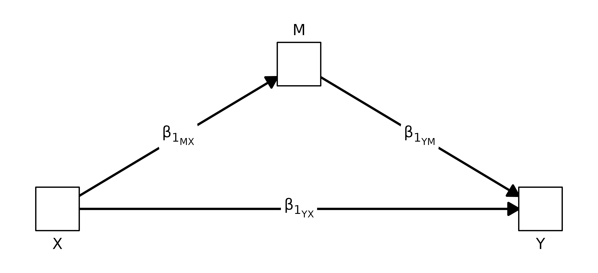

This is the classic Baron-Kenny / Sobel mediation identity
$`c \,=\, a \cdot b \,+\, c'`$ in funfield’s notation:
$`a = F_{1}[X,M]`$, $`b = F_{1}[M,Y]`$, $`c' = F_{1}[X,Y]`$, and the
total $`c`$ is $`F_{1}^{*}[X,Y]`$.

##### Expectancy × Value application

The same identity carries a more specific reading when **X is the
imagined performance of an action**, **Y is the rated likelihood of
*actually* doing that action**, and **M is an expected outcome of
performing the action**. The algebra of the decomposition is unchanged;
what changes is how the two indirect arms are read.

Following the convention used in the field diagrams later in this
vignette, X is drawn as a right-facing triangle (an *initiating* action)
and Y as a left-facing triangle (an action-likelihood outcome); the
mediator stays a square because it is a continuous expected outcome.

``` r

plotPathSchema(
  XY_label = "F<sub>1</sub><sup>&#42;</sup>[X,Y]",
  X_shape  = "rtTri",
  Y_shape  = "lfTri"
)
```


``` r

plotPathSchema(
  M_label  = "M",
  XM_label = "F<sub>1</sub>[X,M]",
  MY_label = "F<sub>1</sub>[M,Y]",
  XY_label = "F<sub>1</sub>[X,Y]",
  X_shape  = "rtTri",
  Y_shape  = "lfTri"
)
```

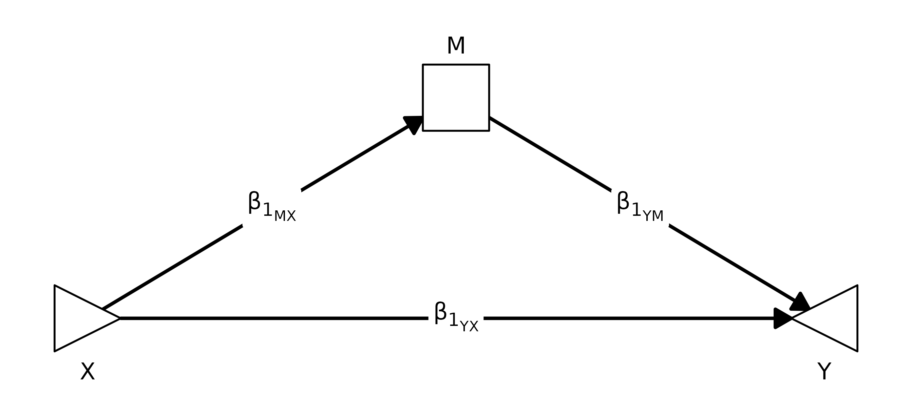

In this framing the two indirect arms operationalize the two terms of an
**Expectancy × Value** model:

- $`F_{1}[X,M]`$ is the **expectancy** arm — how strongly imagining the
  action shifts the rated expectation of that outcome `M`. It is the
  respondent’s subjective probability (in slope form) that the action
  produces `M`.
- $`F_{1}[M,Y]`$ is the **value** arm — how strongly the expected
  outcome `M`, in turn, shifts the likelihood of actually doing the
  action. It is how much that outcome weighs on the action-choice side:
  outcomes with a steeper `F1[M,Y]` are the ones the respondent
  effectively cares about.

The product $`F_{1}[X,M] \cdot F_{1}[M,Y]`$ is then the indirect route’s
E×V contribution: an outcome only moves action likelihood through `M` to
the extent the action moves the expectation *and* the expectation moves
the choice.

A concrete read for one of the speeding mediators (`OnTime`): driving 10
mph over the limit raises the expectation of arriving on time, so
$`F_{1}[X,M]`$ is positive (the expectancy arm). On the choice side,
respondents who expect to be on time are more likely to report they
would do the action, so $`F_{1}[M,Y]`$ is also positive (the value arm).
Their product is the share of the total `Speed → Likelihood` slope that
runs through “I’ll arrive on time” as a reason to speed. A mediator
whose expectancy arm is strong but whose value arm is near zero (an
outcome people predict but don’t weight) contributes little; one whose
value arm is strong but whose expectancy arm is near zero (an outcome
people weight but the action doesn’t shift) contributes little; the
indirect effect only lights up when both arms do.

The next two subsections walk Terms 1 and 2 through the speeding data:
first the per-mediator loop fits (Term 1 one mediator at a time, plus
the per-mediator residual), then the joint fit (Term 1 summed across all
eight mediators, plus the single global residual).

#### Mediated breakdown

How does each expected outcome mediate the link between an action’s
speed and how likely the respondent is to take it, averaging across
people and conditions?

``` r

norm <- pathXMY(dat, X = "Speed", Y = "Likelihood", M = mediators)

## Loop pass: one X -> M -> Y regression PER MEDIATOR, fit independently.
## An F1[M,Y] row here is the slope of Likelihood on that mediator
## controlling only for Speed (no other mediators in the equation).
## pathXMY_to_F() rewrites the legacy B-labels into the F-schema for
## display; the tidy table itself still keys on the legacy labels.
pathXMY_to_F(norm$tidy_loop)
#>       mediator           param          est          se            z       pvalue    ci.lower      ci.upper
#> 1    MoneyCost         F1[X,M]  0.139240506 0.015158866   9.18541709 0.000000e+00  0.10952968  0.1689513376
#> 2    MoneyCost         F1[X,Y] -0.227565820 0.031873868  -7.13957333 9.361401e-13 -0.29003745 -0.1650941859
#> 3    MoneyCost         F1[M,Y] -0.371345477 0.085047044  -4.36635373 1.263378e-05 -0.53803462 -0.2046563341
#> 4    MoneyCost F1[X,M]·F1[M,Y] -0.051706332 0.013892826  -3.72180087 1.978070e-04 -0.07893577 -0.0244768934
#> 5     FunDrive         F1[X,M]  0.001582278 0.016507440   0.09585245 9.236378e-01 -0.03077171  0.0339362659
#> 6     FunDrive         F1[X,Y] -0.280416609 0.026692098 -10.50560395 0.000000e+00 -0.33273216 -0.2281010584
#> 7     FunDrive         F1[M,Y]  0.723296874 0.071036222  10.18208535 0.000000e+00  0.58406844  0.8625253108
#> 8     FunDrive F1[X,M]·F1[M,Y]  0.001144457 0.011934744   0.09589289 9.236056e-01 -0.02224721  0.0245361263
#> 9   IntQuality         F1[X,M]  0.007120253 0.015298411   0.46542436 6.416276e-01 -0.02286408  0.0371045881
#> 10  IntQuality         F1[X,Y] -0.282914235 0.027562230 -10.26456263 0.000000e+00 -0.33693521 -0.2288932573
#> 11  IntQuality         F1[M,Y]  0.511510383 0.084549838   6.04980911 1.450176e-09  0.34579574  0.6772250213
#> 12  IntQuality F1[X,M]·F1[M,Y]  0.003642083 0.007720233   0.47175825 6.370994e-01 -0.01148929  0.0187734612
#> 13 Appropriate         F1[X,M] -0.446202532 0.021400025 -20.85056166 0.000000e+00 -0.48814581 -0.4042592542
#> 14 Appropriate         F1[X,Y]  0.012236624 0.044294609   0.27625538 7.823519e-01 -0.07457921  0.0990524629
#> 15 Appropriate         F1[M,Y]  0.653310448 0.070525986   9.26340048 0.000000e+00  0.51508206  0.7915388398
#> 16 Appropriate F1[X,M]·F1[M,Y] -0.291508776 0.035491119  -8.21356960 2.220446e-16 -0.36107009 -0.2219474610
#> 17      OnTime         F1[X,M]  0.240506329 0.017710393  13.57995446 0.000000e+00  0.20579460  0.2752180614
#> 18      OnTime         F1[X,Y] -0.365904773 0.033057871 -11.06861274 0.000000e+00 -0.43069701 -0.3011125363
#> 19      OnTime         F1[M,Y]  0.360209319 0.077202862   4.66575085 3.074921e-06  0.20889449  0.5115241485
#> 20      OnTime F1[X,M]·F1[M,Y]  0.086632621 0.020385649   4.24968674 2.140697e-05  0.04667748  0.1265877584
#> 21       Crash         F1[X,M]  0.306170886 0.015427231  19.84613313 0.000000e+00  0.27593407  0.3364077038
#> 22       Crash         F1[X,Y] -0.071610295 0.038298221  -1.86980735 6.151058e-02 -0.14667343  0.0034528386
#> 23       Crash         F1[M,Y] -0.678254746 0.072501616  -9.35502933 0.000000e+00 -0.82035530 -0.5361541894
#> 24       Crash F1[X,M]·F1[M,Y] -0.207661857 0.024139694  -8.60250593 0.000000e+00 -0.25497479 -0.1603489267
#> 25     Injured         F1[X,M]  0.303797468 0.015914442  19.08941984 0.000000e+00  0.27260573  0.3349892019
#> 26     Injured         F1[X,Y] -0.076444825 0.039378362  -1.94129013 5.222310e-02 -0.15362500  0.0007353459
#> 27     Injured         F1[M,Y] -0.667639952 0.082401626  -8.10226668 4.440892e-16 -0.82914417 -0.5061357317
#> 28     Injured F1[X,M]·F1[M,Y] -0.202827327 0.027360844  -7.41305093 1.234568e-13 -0.25645360 -0.1492010590
#> 29      Ticket         F1[X,M]  0.551424051 0.017281272  31.90876602 0.000000e+00  0.51755338  0.5852947205
#> 30      Ticket         F1[X,Y]  0.020471755 0.050581131   0.40473106 6.856752e-01 -0.07866544  0.1196089496
#> 31      Ticket         F1[M,Y] -0.543581489 0.070950310  -7.66143926 1.842970e-14 -0.68264154 -0.4045214374
#> 32      Ticket F1[X,M]·F1[M,Y] -0.299743907 0.039987083  -7.49601834 6.572520e-14 -0.37811715 -0.2213706643

## Joint pass: a SINGLE simultaneous regression with all eight mediators
## together in the Y equation. The joint F1[M,Y] slopes are partial
## slopes net of the other seven mediators -- not comparable to the loop
## F1[M,Y] above.
pathXMY_to_F(norm$tidy_joint)
#>       mediator   param          est         se            z       pvalue    ci.lower    ci.upper
#> 1    MoneyCost F1[X,M]  0.139240506 0.01515887   9.18541709 0.000000e+00  0.10952968  0.16895134
#> 2    MoneyCost F1[M,Y] -0.028927061 0.07320582  -0.39514699 6.927344e-01 -0.17240784  0.11455372
#> 3     FunDrive F1[X,M]  0.001582278 0.01650744   0.09585245 9.236378e-01 -0.03077171  0.03393627
#> 4     FunDrive F1[M,Y]  0.409776446 0.08097880   5.06029284 4.186131e-07  0.25106091  0.56849198
#> 5   IntQuality F1[X,M]  0.007120253 0.01529841   0.46542436 6.416276e-01 -0.02286408  0.03710459
#> 6   IntQuality F1[M,Y]  0.014019165 0.08574465   0.16349901 8.701256e-01 -0.15403726  0.18207559
#> 7  Appropriate F1[X,M] -0.446202532 0.02140002 -20.85056166 0.000000e+00 -0.48814581 -0.40425925
#> 8  Appropriate F1[M,Y]  0.382971737 0.07541720   5.07804231 3.813438e-07  0.23515674  0.53078673
#> 9       OnTime F1[X,M]  0.240506329 0.01771039  13.57995446 0.000000e+00  0.20579460  0.27521806
#> 10      OnTime F1[M,Y]  0.226702427 0.07298069   3.10633448 1.894223e-03  0.08366291  0.36974195
#> 11       Crash F1[X,M]  0.306170886 0.01542723  19.84613313 0.000000e+00  0.27593407  0.33640770
#> 12       Crash F1[M,Y] -0.266502254 0.09407779  -2.83278594 4.614427e-03 -0.45089134 -0.08211316
#> 13     Injured F1[X,M]  0.303797468 0.01591444  19.08941984 0.000000e+00  0.27260573  0.33498920
#> 14     Injured F1[M,Y] -0.094829812 0.10293282  -0.92127872 3.569049e-01 -0.29657442  0.10691480
#> 15      Ticket F1[X,M]  0.551424051 0.01728127  31.90876602 0.000000e+00  0.51755338  0.58529472
#> 16      Ticket F1[M,Y] -0.121664879 0.08560263  -1.42127508 1.552368e-01 -0.28944294  0.04611318
#> 17        <NA> F1[X,Y]  0.017860284 0.05948115   0.30026797 7.639728e-01 -0.09872063  0.13444120
```

#### Expectation and valuation paths, side by side

Each mediator sits on two paths. `F1[X,M]` is the **expectation** path —
how much an action’s speed shifts that expected outcome. `F1[M,Y]` is
the **valuation** path — how much that expected outcome, in turn, drives
action likelihood.
[`pathXMY_pairtable()`](https://dustin-wood.github.io/funfield/reference/pathXMY_pairtable.md)
reshapes the long `tidy_loop` table so the two paths sit next to each
other, one row per mediator, and the `mediator` column is not repeated.
[`group_kable()`](https://dustin-wood.github.io/funfield/reference/group_kable.md)
then prints that table with each parameter block set under its own
spanning header.

``` r

group_kable(
  pathXMY_pairtable(norm, c("f1_XM", "f1_MY")),
  groups = c(" " = 1,
             "Expectation paths (F1[X,M]: Speed &rarr; M)"      = 4,
             "Valuation paths (F1[M,Y]: M &rarr; Likelihood)"   = 4),
  col_labels = c("Mediator", "est", "se", "z", "p",
                             "est", "se", "z", "p")
)
```

|  | Expectation paths (F1\[X,M\]: Speed → M) |  |  |  | Valuation paths (F1\[M,Y\]: M → Likelihood) |  |  |  |
|----|----|----|----|----|----|----|----|----|
| Mediator | est | se | z | p | est | se | z | p |
| MoneyCost | .139 | .015 | 9.185 | .000 | -.371 | .085 | -4.366 | .000 |
| FunDrive | .002 | .017 | .096 | .924 | .723 | .071 | 10.182 | .000 |
| IntQuality | .007 | .015 | .465 | .642 | .512 | .085 | 6.050 | .000 |
| Appropriate | -.446 | .021 | -20.851 | .000 | .653 | .071 | 9.263 | .000 |
| OnTime | .241 | .018 | 13.580 | .000 | .360 | .077 | 4.666 | .000 |
| Crash | .306 | .015 | 19.846 | .000 | -.678 | .073 | -9.355 | .000 |
| Injured | .304 | .016 | 19.089 | .000 | -.668 | .082 | -8.102 | .000 |
| Ticket | .551 | .017 | 31.909 | .000 | -.544 | .071 | -7.661 | .000 |

The same coefficients as a field diagram — every path in the table
becomes one labeled, signed, and weighted arrow. Edges left of the
mediator column are `F1[X,M]`; edges right are `F1[M,Y]`. Mediator node
fills show each `F1[X,M]` directly (red = expected outcome drops with
speed, blue = rises); the `Likelihood` node fills with the implied total
effect when `Speed = 1`. (See the **Field-style diagrams** section below
for the full convention.)

``` r

plotPathXMY(norm,
            X_label = "Speed", Y_label = "Likelihood",
            X_shape = "rtTri",
            title = "Normative field for speeding decisions")
```

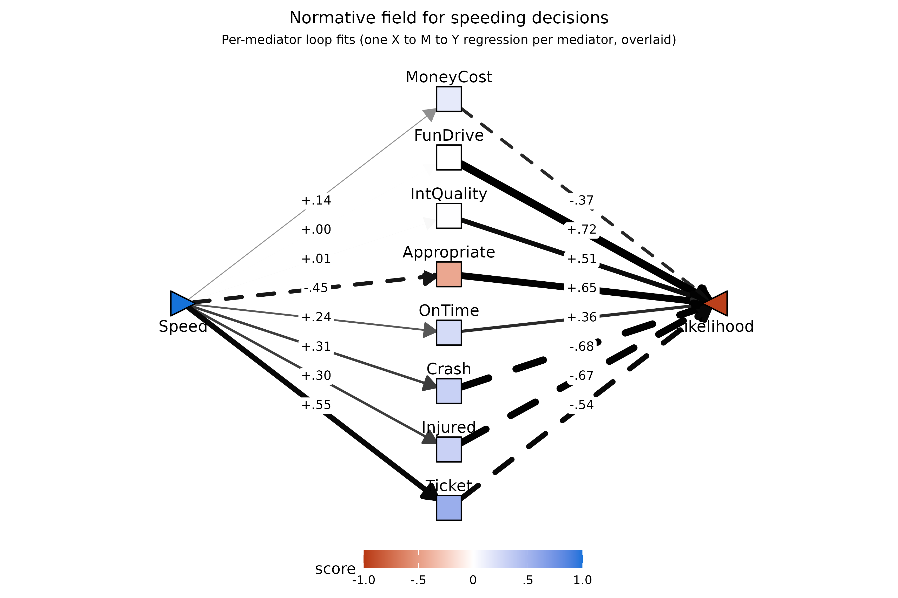

*Expectation paths (`F1[X,M]`).* Faster speeds are expected to
substantially increase `Ticket`, `Crash`, `Injured`, `OnTime`, and (more
modestly) `MoneyCost`, and to substantially reduce perceived
appropriateness (`Appropriate`). `FunDrive` and `IntQuality` are
essentially uncorrelated with `Speed` at the within-person level —
perceived enjoyment of the drive and quality of the next meeting do not
move much with the action’s speed.

*Valuation paths (`F1[M,Y]`).* `FunDrive` and `Appropriate` are the
strongest positive drivers of whether the respondent says they’d take
the action, followed by `IntQuality` and `OnTime`. `Crash`, `Injured`,
`Ticket`, and `MoneyCost` all suppress likelihood. The signs are
intuitive throughout.

#### Indirect effects (F1\[X,M\]·F1\[M,Y\])

``` r

kable0(
  subset(norm$tidy_loop, param == "f1_XM * f1_MY")[, c("mediator","est","se","z","pvalue")],
  digits = 3,
  caption = "Indirect effects through each mediator (F1[X,M]·F1[M,Y])"
)
```

|     | mediator    |   est |   se |      z | pvalue |
|:----|:------------|------:|-----:|-------:|-------:|
| 4   | MoneyCost   | -.052 | .014 | -3.722 |   .000 |
| 8   | FunDrive    |  .001 | .012 |   .096 |   .924 |
| 12  | IntQuality  |  .004 | .008 |   .472 |   .637 |
| 16  | Appropriate | -.292 | .035 | -8.214 |   .000 |
| 20  | OnTime      |  .087 | .020 |  4.250 |   .000 |
| 24  | Crash       | -.208 | .024 | -8.603 |   .000 |
| 28  | Injured     | -.203 | .027 | -7.413 |   .000 |
| 32  | Ticket      | -.300 | .040 | -7.496 |   .000 |

Indirect effects through each mediator (F1\[X,M\]·F1\[M,Y\]) {.table}

The pathways through `Ticket`, `Appropriate`, `Crash`, and `Injured` are
all large and negative: faster speeds are expected to produce tickets
and accidents (each of which strongly suppresses action likelihood) and
to be less appropriate (which also strongly suppresses likelihood).
Notably, the loop indirect through `Ticket` alone (`-.30`) and through
`Appropriate` alone (`-.29`) each rival the total normative effect of
`-.28` indexed
[above](#indexing-the-total-effect-here-the-overall-likelihood-to-speed)
— either route, taken on its own, is large enough to mechanically
account for the entire normative drop in action likelihood. The `OnTime`
pathway is the lone strong positive (`+.09`): faster speeds are expected
to get the respondent to the meeting on time, which *increases*
likelihood, partially offsetting the cost routes. This is the model’s
formal account of a reason *to* speed. `FunDrive` and `IntQuality`
contribute essentially nothing — because faster speeds don’t shift those
expectations, the pathways are near zero despite their strong valuation
paths. The joint multi-mediator residual direct path (joint
`F1[X,Y] ≈ +.02`, *p* ≈ .76) is essentially zero: all eight mediators
together fully account for the total.

#### Joint-fit field: how the full mediator set carries the total

The loop overlay above shows each mediator’s `Speed → M → Likelihood`
arm in isolation. The *joint* fit asks a complementary question: if all
eight expected outcomes are entered into the `Likelihood` regression
simultaneously, how much of the total `Speed → Likelihood` slope remains
unmediated? `plotPathXMY(norm, from = "joint")` renders the joint
simultaneous fit on the same canvas — per-mediator slopes are now
partial slopes net of the other seven mediators, and the straight
`Speed → Likelihood` arrow is the single global joint `F1[X,Y]` residual
direct path.

``` r

plotPathXMY(norm, from = "joint",
            X_label = "Speed", Y_label = "Likelihood",
            X_shape = "rtTri",
            title = "Joint-fit field for speeding decisions")
```

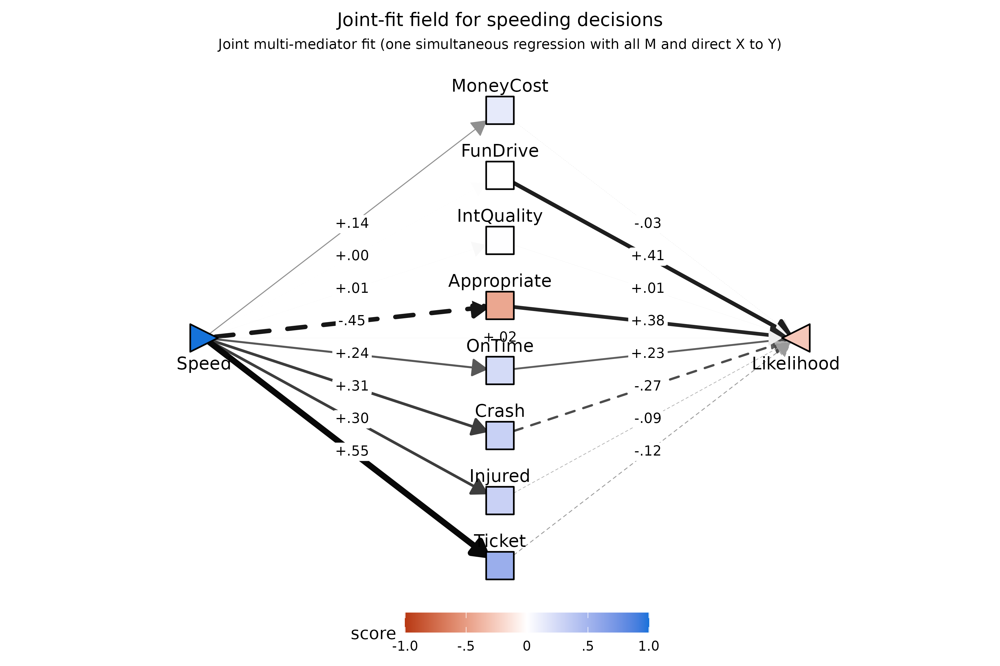

The residual joint `F1[X,Y] ≈ +.02` (the labeled center arrow) is the
visual confirmation that the eight expected outcomes collectively absorb
the entire `-.28` normative effect — there is essentially nothing left
for `Speed` to do directly. The per-mediator joint slopes, by contrast,
look quite different from their loop counterparts: `Crash → Likelihood`
drops from `-.68` in the loop fit to `-.27` here,
`FunDrive → Likelihood` from `+.72` to `+.41`, and so on. That is the
natural consequence of high collinearity among the eight expected
outcomes: each joint slope is now a partial slope net of the others, so
much of what looked like one mediator’s “weight” in the loop view is
being absorbed by its correlated neighbors. The loop fit is the right
tool for *which mediator* questions; the joint fit is the right tool for
*system-level* diagnostics like the residual direct path.

### Total moderation and its decomposition

This section mirrors the three-step normative structure above, but for a
*moderator* `Z` instead of the bare `X → Y` slope: (1) the **total
moderation effect** — how much `Z` shifts the `X → Y` slope — followed
by (2) the per-mediator decomposition of that shift, and later (3) the
joint residual `FZ[X,Y]`. The normative [decomposition
identity](#decomposing-the-total-effect) gains one extra term in the
moderation case because `Z` can rebuild the field in two ways: through
`M`’s expected level (`FZ[X,M]·F1[M,Y]`) and through how strongly `M` is
weighted (`F1[X,M]·FZ[M,Y]`).

#### (here: What personal and situational factors affect the likelihood of speeding, and why?)

The
[`pathXMY()`](https://dustin-wood.github.io/funfield/reference/pathXMY.md)
function is particularly useful for understanding the personal and
situational factors that may affect an `X → Y` pathway, and why they may
do so from within an expectancy×value lens. The full identity is

``` math
F_{Z}^{*}[X,Y] \approx\; F_{Z}[X,M]\,F_{1}[M,Y]
\;+\; F_{1}[X,M]\,F_{Z}[M,Y]
\;+\; F_{Z}[X,Y]
```

When `X` is an action, `M` is an outcome, and `Y` is the rated action
likelihood, the model can account for behavior in the manner below: -
**Term 0** (`FZ*[X,Y]`): This value, on the left-hand-side of the
equation, indicates the total degree to which the variable `Z` moderates
the likelihood of doing the action (here: speeding). - **Term 1**
(`FZ[X,M]·F1[M,Y]`): `Z` shifts *the degree to which `X` is expected to
affect `M`* — the **expectation** route, which affects the likelihood of
doing the action if `M` tends to be valued. - **Term 2**
(`F1[X,M]·FZ[M,Y]`): `Z` shifts *how much outcome `M` affects `Y`* — the
**valuation** route, which effects the action likelihood if `X` tends to
affect `M`. - **Term 3** (`FZ[X,Y]`): the residual moderation of the
`X → Y` pathway by variable `Z`, after accounting for this mediator.
(Here: concerns extent to which the person/situation factor’s affect on
speeding can’t be accounted for by this mediator.)

Note also that the decomposition will result in an *approximation* of
the initial `FZ*[X,Y]` term prior to considering the mediator. It will
not be exactly equal for reasons detailed by Muller, Judd, & Yzerbyt,
(2005) - although the decomposition will tend to be very close.

When a moderator produces a large (`FZ[X,M]·F1[M,Y]`) or
(`F1[X,M]·FZ[M,Y]`) effect, this can be described as formally indicating
a *reason* for the behavior.

##### Schematic of the moderated decomposition

The same E×V schematics from the normative section carry over once a
moderator `Z` is in the field — every coefficient gains a “+ FZ”
companion that captures how `Z` shifts that arm. To match the
[field-style convention](#field-style-diagrams) used later in this
section, every fragment colored **gold** is an FZ term (the part of an
arm that varies with `Z`); the leading F1 term stays black.

``` r

## Local helpers for the three moderation schematics below. Wrap a
## fragment in gold to flag it as an FZ coefficient, and in light
## gray to fade it into "not part of this term".
## Note: starred-total cells use &#42; (HTML numeric entity for `*`)
## rather than a literal asterisk -- gridtext treats paired `*`
## characters as Markdown italic, which would break color spans that
## happen to bracket them.
gold <- "#F6BE00"; gray <- "#E5E5E5"
gz <- function(s) paste0("<span style='color:", gold, "'>", s, "</span>")
gr <- function(s) paste0("<span style='color:", gray, "'>", s, "</span>")

f1_XM <- "F<sub>1</sub>[X,M]"
f1_MY <- "F<sub>1</sub>[M,Y]"
f1_XY <- "F<sub>1</sub>[X,Y]"
fZ_XM <- "F<sub>Z</sub>[X,M]"
fZ_MY <- "F<sub>Z</sub>[M,Y]"
fZ_XY <- "F<sub>Z</sub>[X,Y]"

f1s_XY <- "F<sub>1</sub><sup>&#42;</sup>[X,Y]"   # starred F1 (total)
fZs_XY <- "F<sub>Z</sub><sup>&#42;</sup>[X,Y]"   # starred FZ (total)
```

**Figure 1 — Total moderation effect.** Before decomposing, index the
total moderation: the single arrow from `X` to `Y` carries both the
unmediated `X → Y` slope ($`F_{1}^{*}[X,Y]`$) and how that slope is
shifted by `Z` ($`F_{Z}^{*}[X,Y]`$). The whole “Term 0” of the identity
above is what the green fragment names.

``` r

plotPathSchema(
  XY_label = paste0(f1s_XY, " ", gz(paste0("+&nbsp;", fZs_XY))),
  X_shape  = "rtTri",
  Y_shape  = "lfTri"
)
```


**Figure 2 — Full moderated mediation triangle.** Once a mediator is in
the picture, each of the three arms carries its own F1+FZ pair: the F1
piece is the arm as fit at the average level of `Z`, and the FZ piece is
how that arm bends as `Z` moves.

``` r

plotPathSchema(
  M_label  = "M",
  XM_label = paste0(f1_XM, " ", gz(paste0("+&nbsp;", fZ_XM))),
  MY_label = paste0(f1_MY, " ", gz(paste0("+&nbsp;", fZ_MY))),
  XY_label = paste0(f1_XY, " ", gz(paste0("+&nbsp;", fZ_XY))),
  X_shape  = "rtTri",
  Y_shape  = "lfTri"
)
```

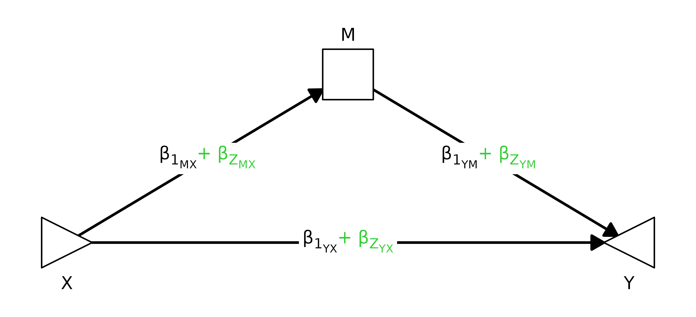

**Figure 3 — One panel per term in the decomposition.** Each panel shows
the same triangle but fades every fragment that is *not* part of the
term being indexed. Active F1 terms stay black, active FZ terms stay
gold, and arrows whose color matches their label are the ones
contributing to that panel’s product; everything else drops to light
gray.

``` r

## Helper: stitch a single XY-label string for an arm where one of
## (f1, fZ) is active and the other is faded.
arm_lab <- function(f1, fZ, active = c("f1", "fZ")) {
  active <- match.arg(active)
  if (active == "f1") paste0(f1,     " ", gr(paste0("+&nbsp;", fZ)))
  else                paste0(gr(f1), " ", gz(paste0("+&nbsp;", fZ)))
}
## And a fully faded label (whole "f1 + fZ" string wrapped in gray).
arm_off <- function(f1, fZ) gr(paste0(f1, " +&nbsp;", fZ))

## Panel 1: FZ[X,M]·F1[M,Y] (expectation-route moderation).
p1 <- plotPathSchema(
  M_label  = "M",
  XM_label = arm_lab(f1_XM, fZ_XM, "fZ"),   # fZ active -> green line
  MY_label = arm_lab(f1_MY, fZ_MY, "f1"),   # f1 active -> black line
  XY_label = arm_off(f1_XY, fZ_XY),         # not in this term
  X_shape  = "rtTri", Y_shape = "lfTri",
  XM_color = gold, MY_color = "black", XY_color = gray,
  title    = "Term 1:  F<sub>Z</sub>[X,M] &middot; F<sub>1</sub>[M,Y]"
) + ggplot2::theme(plot.title = ggtext::element_markdown(hjust = 0.5))

## Panel 2: F1[X,M]·FZ[M,Y] (valuation-route moderation).
p2 <- plotPathSchema(
  M_label  = "M",
  XM_label = arm_lab(f1_XM, fZ_XM, "f1"),
  MY_label = arm_lab(f1_MY, fZ_MY, "fZ"),
  XY_label = arm_off(f1_XY, fZ_XY),
  X_shape  = "rtTri", Y_shape = "lfTri",
  XM_color = "black", MY_color = gold, XY_color = gray,
  title    = "Term 2:  F<sub>1</sub>[X,M] &middot; F<sub>Z</sub>[M,Y]"
) + ggplot2::theme(plot.title = ggtext::element_markdown(hjust = 0.5))

## Panel 3: FZ[X,Y] (residual direct moderation).
p3 <- plotPathSchema(
  M_label  = "M",
  XM_label = arm_off(f1_XM, fZ_XM),
  MY_label = arm_off(f1_MY, fZ_MY),
  XY_label = arm_lab(f1_XY, fZ_XY, "fZ"),
  X_shape  = "rtTri", Y_shape = "lfTri",
  XM_color = gray, MY_color = gray, XY_color = gold,
  title    = "Term 3:  F<sub>Z</sub>[X,Y]"
) + ggplot2::theme(plot.title = ggtext::element_markdown(hjust = 0.5))

patchwork::wrap_plots(p1, p2, p3, ncol = 3)
```

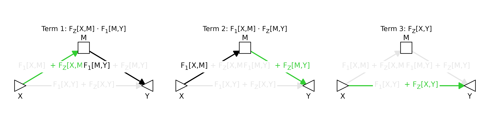

Reading across the panels: the indirect Z-routes (Terms 1 and 2) each
need *one* FZ arm paired with the surviving F1 on the other arm —
expectation-route moderation operates through `Z` shifting `F1[X,M]`
(producing `FZ[X,M]`) while the average valuation `F1[M,Y]` does the
carrying, and the valuation route is the mirror image. Term 3 is what
`Z` does *directly* to `Y` once the indirect routes are accounted for.
The three terms sum to (an approximation of) the gold Term-0 arrow in
Figure 1.

**Toggleable overlay.** Side-by-side helps with comparison, but the
three panels live on the *same* triangle — so it can be easier to see
how the highlight migrates by overlaying them in place and clicking
through.

``` r

## Same three frames as Figure 3, but stitched into a Back/Forward
## widget so they swap at pixel-identical layout instead of sitting
## side by side. p1/p2/p3 are reused from the chunk above.
plotsAsWidget(
  list(p1, p2, p3),
  panel_titles = c(
    "Term 1: FZ[X,M]·F1[M,Y] (expectation route)",
    "Term 2: F1[X,M]·FZ[M,Y] (valuation route)",
    "Term 3: FZ[X,Y] (residual direct)"
  ),
  width  = 7,
  height = 3.5,
  format = "svg"
)
```

![Term 1: FZ\[X,M\]·F1\[M,Y\] (expectation
route)](data:image/svg+xml;base64,PD94bWwgdmVyc2lvbj0nMS4wJyBlbmNvZGluZz0nVVRGLTgnID8+CjxzdmcgeG1sbnM9J2h0dHA6Ly93d3cudzMub3JnLzIwMDAvc3ZnJyB4bWxuczp4bGluaz0naHR0cDovL3d3dy53My5vcmcvMTk5OS94bGluaycgd2lkdGg9JzUwNC4wMHB0JyBoZWlnaHQ9JzI1Mi4wMHB0JyB2aWV3Qm94PScwIDAgNTA0LjAwIDI1Mi4wMCc+CjxnIGNsYXNzPSdzdmdsaXRlJz4KPGRlZnM+CiAgPHN0eWxlIHR5cGU9J3RleHQvY3NzJz48IVtDREFUQVsKICAgIC5zdmdsaXRlIGxpbmUsIC5zdmdsaXRlIHBvbHlsaW5lLCAuc3ZnbGl0ZSBwb2x5Z29uLCAuc3ZnbGl0ZSBwYXRoLCAuc3ZnbGl0ZSByZWN0LCAuc3ZnbGl0ZSBjaXJjbGUgewogICAgICBmaWxsOiBub25lOwogICAgICBzdHJva2U6ICMwMDAwMDA7CiAgICAgIHN0cm9rZS1saW5lY2FwOiByb3VuZDsKICAgICAgc3Ryb2tlLWxpbmVqb2luOiByb3VuZDsKICAgICAgc3Ryb2tlLW1pdGVybGltaXQ6IDEwLjAwOwogICAgfQogICAgLnN2Z2xpdGUgdGV4dCB7CiAgICAgIHdoaXRlLXNwYWNlOiBwcmU7CiAgICB9CiAgICAuc3ZnbGl0ZSBnLmdseXBoZ3JvdXAgcGF0aCB7CiAgICAgIGZpbGw6IGluaGVyaXQ7CiAgICAgIHN0cm9rZTogbm9uZTsKICAgIH0KICBdXT48L3N0eWxlPgo8L2RlZnM+CjxyZWN0IHdpZHRoPScxMDAlJyBoZWlnaHQ9JzEwMCUnIHN0eWxlPSdzdHJva2U6IG5vbmU7IGZpbGw6ICNGRkZGRkY7Jy8+CjxkZWZzPgogIDxjbGlwUGF0aCBpZD0nY3BNQzR3TUh3MU1EUXVNREI4TUM0d01Id3lOVEl1TURBPSc+CiAgICA8cmVjdCB4PScwLjAwJyB5PScwLjAwJyB3aWR0aD0nNTA0LjAwJyBoZWlnaHQ9JzI1Mi4wMCcgLz4KICA8L2NsaXBQYXRoPgo8L2RlZnM+CjxnIGNsaXAtcGF0aD0ndXJsKCNjcE1DNHdNSHcxTURRdU1EQjhNQzR3TUh3eU5USXVNREE9KSc+CjwvZz4KPGRlZnM+CiAgPGNsaXBQYXRoIGlkPSdjcE1DNHdNSHcxTURRdU1EQjhNVFF1TWpSOE1qTTNMamMyJz4KICAgIDxyZWN0IHg9JzAuMDAnIHk9JzE0LjI0JyB3aWR0aD0nNTA0LjAwJyBoZWlnaHQ9JzIyMy41MicgLz4KICA8L2NsaXBQYXRoPgo8L2RlZnM+CjxnIGNsaXAtcGF0aD0ndXJsKCNjcE1DNHdNSHcxTURRdU1EQjhNVFF1TWpSOE1qTTNMamMyKSc+CjxyZWN0IHg9JzAuMDAnIHk9JzE0LjI0JyB3aWR0aD0nNTA0LjAwJyBoZWlnaHQ9JzIyMy41Micgc3R5bGU9J3N0cm9rZS13aWR0aDogMC4wMDsgc3Ryb2tlOiBub25lOycgLz4KPC9nPgo8ZyBjbGlwLXBhdGg9J3VybCgjY3BNQzR3TUh3MU1EUXVNREI4TUM0d01Id3lOVEl1TURBPSknPgo8bGluZSB4MT0nNTYuODAnIHkxPScxOTEuODInIHgyPScyMzMuNjgnIHkyPSc4NS42OScgc3R5bGU9J3N0cm9rZS13aWR0aDogMS45Mjsgc3Ryb2tlOiAjRjZCRTAwOycgLz4KPHBvbHlnb24gcG9pbnRzPScyMjguNzksOTQuNTEgMjMzLjY4LDg1LjY5IDIyMy42MCw4NS44NiAnIHN0eWxlPSdzdHJva2Utd2lkdGg6IDEuOTI7IHN0cm9rZTogI0Y2QkUwMDsgZmlsbDogI0Y2QkUwMDsnIC8+CjxsaW5lIHgxPScyNzAuMzInIHkxPSc4NS42OScgeDI9JzQ0Ny4yMCcgeTI9JzE5MS44Micgc3R5bGU9J3N0cm9rZS13aWR0aDogMS45MjsnIC8+Cjxwb2x5Z29uIHBvaW50cz0nNDM3LjEyLDE5MS42NSA0NDcuMjAsMTkxLjgyIDQ0Mi4zMSwxODMuMDEgJyBzdHlsZT0nc3Ryb2tlLXdpZHRoOiAxLjkyOyBmaWxsOiAjMDAwMDAwOycgLz4KPGxpbmUgeDE9JzY2Ljc5JyB5MT0nMTk2LjgyJyB4Mj0nNDM3LjIxJyB5Mj0nMTk2LjgyJyBzdHlsZT0nc3Ryb2tlLXdpZHRoOiAxLjkyOyBzdHJva2U6ICNFNUU1RTU7JyAvPgo8cG9seWdvbiBwb2ludHM9JzQyOC40OCwyMDEuODYgNDM3LjIxLDE5Ni44MiA0MjguNDgsMTkxLjc4ICcgc3R5bGU9J3N0cm9rZS13aWR0aDogMS45Mjsgc3Ryb2tlOiAjRTVFNUU1OyBmaWxsOiAjRTVFNUU1OycgLz4KPHBvbHlnb24gcG9pbnRzPSc5Ny4wNywxNDUuNTggMjAzLjQwLDE0NS41OCAyMDMuMzIsMTQ1LjU4IDIwMy42NiwxNDUuNTYgMjA0LjAwLDE0NS40OSAyMDQuMzMsMTQ1LjM3IDIwNC42MywxNDUuMjAgMjA0LjkwLDE0NC45OCAyMDUuMTMsMTQ0LjcyIDIwNS4zMiwxNDQuNDIgMjA1LjQ1LDE0NC4xMCAyMDUuNTMsMTQzLjc2IDIwNS41NiwxNDMuNDIgMjA1LjU2LDE0My40MiAyMDUuNTYsMTI4LjEwIDIwNS41NiwxMjguMTAgMjA1LjUzLDEyNy43NiAyMDUuNDUsMTI3LjQyIDIwNS4zMiwxMjcuMTAgMjA1LjEzLDEyNi44MSAyMDQuOTAsMTI2LjU1IDIwNC42MywxMjYuMzMgMjA0LjMzLDEyNi4xNSAyMDQuMDAsMTI2LjAzIDIwMy42NiwxMjUuOTYgMjAzLjQwLDEyNS45NCA5Ny4wNywxMjUuOTQgOTcuMzMsMTI1Ljk2IDk2Ljk4LDEyNS45NCA5Ni42NCwxMjUuOTkgOTYuMzAsMTI2LjA4IDk1Ljk5LDEyNi4yMyA5NS43MCwxMjYuNDMgOTUuNDUsMTI2LjY3IDk1LjI0LDEyNi45NSA5NS4wOCwxMjcuMjYgOTQuOTcsMTI3LjU5IDk0LjkyLDEyNy45MyA5NC45MSwxMjguMTAgOTQuOTEsMTQzLjQyIDk0LjkyLDE0My4yNCA5NC45MiwxNDMuNTkgOTQuOTcsMTQzLjkzIDk1LjA4LDE0NC4yNiA5NS4yNCwxNDQuNTcgOTUuNDUsMTQ0Ljg1IDk1LjcwLDE0NS4wOSA5NS45OSwxNDUuMjkgOTYuMzAsMTQ1LjQ0IDk2LjY0LDE0NS41MyA5Ni45OCwxNDUuNTggJyBzdHlsZT0nc3Ryb2tlLXdpZHRoOiAwLjAwOyBmaWxsOiAjRkZGRkZGOycgLz4KPHRleHQgeD0nOTcuNTAnIHk9JzEzNy4zNCcgc3R5bGU9J2ZvbnQtc2l6ZTogMTIuODBweDtmaWxsOiAjRTVFNUU1OyBmb250LWZhbWlseTogIkxpYmVyYXRpb24gU2FucyI7JyB0ZXh0TGVuZ3RoPSc3LjgxcHgnIGxlbmd0aEFkanVzdD0nc3BhY2luZ0FuZEdseXBocyc+RjwvdGV4dD4KPHRleHQgeD0nMTA1LjMxJyB5PScxNDAuODYnIHN0eWxlPSdmb250LXNpemU6IDEwLjI0cHg7ZmlsbDogI0U1RTVFNTsgZm9udC1mYW1pbHk6ICJMaWJlcmF0aW9uIFNhbnMiOycgdGV4dExlbmd0aD0nNS42OXB4JyBsZW5ndGhBZGp1c3Q9J3NwYWNpbmdBbmRHbHlwaHMnPjE8L3RleHQ+Cjx0ZXh0IHg9JzExMS4wMCcgeT0nMTM3LjM0JyBzdHlsZT0nZm9udC1zaXplOiAxMi44MHB4O2ZpbGw6ICNFNUU1RTU7IGZvbnQtZmFtaWx5OiAiTGliZXJhdGlvbiBTYW5zIjsnIHRleHRMZW5ndGg9JzI5Ljg4cHgnIGxlbmd0aEFkanVzdD0nc3BhY2luZ0FuZEdseXBocyc+W1gsTV08L3RleHQ+Cjx0ZXh0IHg9JzE0OC4wMCcgeT0nMTM3LjM0JyBzdHlsZT0nZm9udC1zaXplOiAxMi44MHB4O2ZpbGw6ICNGNkJFMDA7IGZvbnQtZmFtaWx5OiAiTGliZXJhdGlvbiBTYW5zIjsnIHRleHRMZW5ndGg9JzcuNDdweCcgbGVuZ3RoQWRqdXN0PSdzcGFjaW5nQW5kR2x5cGhzJz4rPC90ZXh0Pgo8dGV4dCB4PScxNTkuMDMnIHk9JzEzNy4zNCcgc3R5bGU9J2ZvbnQtc2l6ZTogMTIuODBweDtmaWxsOiAjRjZCRTAwOyBmb250LWZhbWlseTogIkxpYmVyYXRpb24gU2FucyI7JyB0ZXh0TGVuZ3RoPSc3LjgxcHgnIGxlbmd0aEFkanVzdD0nc3BhY2luZ0FuZEdseXBocyc+RjwvdGV4dD4KPHRleHQgeD0nMTY2Ljg1JyB5PScxNDAuODYnIHN0eWxlPSdmb250LXNpemU6IDEwLjI0cHg7ZmlsbDogI0Y2QkUwMDsgZm9udC1mYW1pbHk6ICJMaWJlcmF0aW9uIFNhbnMiOycgdGV4dExlbmd0aD0nNi4yNXB4JyBsZW5ndGhBZGp1c3Q9J3NwYWNpbmdBbmRHbHlwaHMnPlo8L3RleHQ+Cjx0ZXh0IHg9JzE3My4xMCcgeT0nMTM3LjM0JyBzdHlsZT0nZm9udC1zaXplOiAxMi44MHB4O2ZpbGw6ICNGNkJFMDA7IGZvbnQtZmFtaWx5OiAiTGliZXJhdGlvbiBTYW5zIjsnIHRleHRMZW5ndGg9JzI5Ljg4cHgnIGxlbmd0aEFkanVzdD0nc3BhY2luZ0FuZEdseXBocyc+W1gsTV08L3RleHQ+Cjxwb2x5Z29uIHBvaW50cz0nMzAyLjM4LDE0NS41OCA0MDUuMTUsMTQ1LjU4IDQwNS4wNiwxNDUuNTggNDA1LjQxLDE0NS41NiA0MDUuNzUsMTQ1LjQ5IDQwNi4wOCwxNDUuMzcgNDA2LjM4LDE0NS4yMCA0MDYuNjUsMTQ0Ljk4IDQwNi44OCwxNDQuNzIgNDA3LjA2LDE0NC40MiA0MDcuMjAsMTQ0LjEwIDQwNy4yOCwxNDMuNzYgNDA3LjMxLDE0My40MiA0MDcuMzEsMTQzLjQyIDQwNy4zMSwxMjguMTAgNDA3LjMxLDEyOC4xMCA0MDcuMjgsMTI3Ljc2IDQwNy4yMCwxMjcuNDIgNDA3LjA2LDEyNy4xMCA0MDYuODgsMTI2LjgxIDQwNi42NSwxMjYuNTUgNDA2LjM4LDEyNi4zMyA0MDYuMDgsMTI2LjE1IDQwNS43NSwxMjYuMDMgNDA1LjQxLDEyNS45NiA0MDUuMTUsMTI1Ljk0IDMwMi4zOCwxMjUuOTQgMzAyLjY0LDEyNS45NiAzMDIuMjksMTI1Ljk0IDMwMS45NSwxMjUuOTkgMzAxLjYxLDEyNi4wOCAzMDEuMzAsMTI2LjIzIDMwMS4wMSwxMjYuNDMgMzAwLjc2LDEyNi42NyAzMDAuNTUsMTI2Ljk1IDMwMC4zOSwxMjcuMjYgMzAwLjI4LDEyNy41OSAzMDAuMjMsMTI3LjkzIDMwMC4yMiwxMjguMTAgMzAwLjIyLDE0My40MiAzMDAuMjMsMTQzLjI0IDMwMC4yMywxNDMuNTkgMzAwLjI4LDE0My45MyAzMDAuMzksMTQ0LjI2IDMwMC41NSwxNDQuNTcgMzAwLjc2LDE0NC44NSAzMDEuMDEsMTQ1LjA5IDMwMS4zMCwxNDUuMjkgMzAxLjYxLDE0NS40NCAzMDEuOTUsMTQ1LjUzIDMwMi4yOSwxNDUuNTggJyBzdHlsZT0nc3Ryb2tlLXdpZHRoOiAwLjAwOyBmaWxsOiAjRkZGRkZGOycgLz4KPHRleHQgeD0nMzAyLjgxJyB5PScxMzcuMzQnIHN0eWxlPSdmb250LXNpemU6IDEyLjgwcHg7IGZvbnQtZmFtaWx5OiAiTGliZXJhdGlvbiBTYW5zIjsnIHRleHRMZW5ndGg9JzcuODFweCcgbGVuZ3RoQWRqdXN0PSdzcGFjaW5nQW5kR2x5cGhzJz5GPC90ZXh0Pgo8dGV4dCB4PSczMTAuNjInIHk9JzE0MC44Nicgc3R5bGU9J2ZvbnQtc2l6ZTogMTAuMjRweDsgZm9udC1mYW1pbHk6ICJMaWJlcmF0aW9uIFNhbnMiOycgdGV4dExlbmd0aD0nNS42OXB4JyBsZW5ndGhBZGp1c3Q9J3NwYWNpbmdBbmRHbHlwaHMnPjE8L3RleHQ+Cjx0ZXh0IHg9JzMxNi4zMScgeT0nMTM3LjM0JyBzdHlsZT0nZm9udC1zaXplOiAxMi44MHB4OyBmb250LWZhbWlseTogIkxpYmVyYXRpb24gU2FucyI7JyB0ZXh0TGVuZ3RoPScyOS44OHB4JyBsZW5ndGhBZGp1c3Q9J3NwYWNpbmdBbmRHbHlwaHMnPltNLFldPC90ZXh0Pgo8dGV4dCB4PSczNDkuNzUnIHk9JzEzNy4zNCcgc3R5bGU9J2ZvbnQtc2l6ZTogMTIuODBweDtmaWxsOiAjRTVFNUU1OyBmb250LWZhbWlseTogIkxpYmVyYXRpb24gU2FucyI7JyB0ZXh0TGVuZ3RoPSc3LjQ3cHgnIGxlbmd0aEFkanVzdD0nc3BhY2luZ0FuZEdseXBocyc+KzwvdGV4dD4KPHRleHQgeD0nMzYwLjc4JyB5PScxMzcuMzQnIHN0eWxlPSdmb250LXNpemU6IDEyLjgwcHg7ZmlsbDogI0U1RTVFNTsgZm9udC1mYW1pbHk6ICJMaWJlcmF0aW9uIFNhbnMiOycgdGV4dExlbmd0aD0nNy44MXB4JyBsZW5ndGhBZGp1c3Q9J3NwYWNpbmdBbmRHbHlwaHMnPkY8L3RleHQ+Cjx0ZXh0IHg9JzM2OC41OScgeT0nMTQwLjg2JyBzdHlsZT0nZm9udC1zaXplOiAxMC4yNHB4O2ZpbGw6ICNFNUU1RTU7IGZvbnQtZmFtaWx5OiAiTGliZXJhdGlvbiBTYW5zIjsnIHRleHRMZW5ndGg9JzYuMjVweCcgbGVuZ3RoQWRqdXN0PSdzcGFjaW5nQW5kR2x5cGhzJz5aPC90ZXh0Pgo8dGV4dCB4PSczNzQuODQnIHk9JzEzNy4zNCcgc3R5bGU9J2ZvbnQtc2l6ZTogMTIuODBweDtmaWxsOiAjRTVFNUU1OyBmb250LWZhbWlseTogIkxpYmVyYXRpb24gU2FucyI7JyB0ZXh0TGVuZ3RoPScyOS44OHB4JyBsZW5ndGhBZGp1c3Q9J3NwYWNpbmdBbmRHbHlwaHMnPltNLFldPC90ZXh0Pgo8cG9seWdvbiBwb2ludHM9JzIwMi43NCwyMDYuNjQgMzAxLjI2LDIwNi42NCAzMDEuMTcsMjA2LjYzIDMwMS41MiwyMDYuNjIgMzAxLjg2LDIwNi41NSAzMDIuMTksMjA2LjQzIDMwMi40OSwyMDYuMjUgMzAyLjc2LDIwNi4wMyAzMDIuOTksMjA1Ljc3IDMwMy4xNywyMDUuNDggMzAzLjMxLDIwNS4xNiAzMDMuMzksMjA0LjgyIDMwMy40MiwyMDQuNDggMzAzLjQyLDIwNC40OCAzMDMuNDIsMTg5LjE2IDMwMy40MiwxODkuMTYgMzAzLjM5LDE4OC44MiAzMDMuMzEsMTg4LjQ4IDMwMy4xNywxODguMTYgMzAyLjk5LDE4Ny44NiAzMDIuNzYsMTg3LjYwIDMwMi40OSwxODcuMzggMzAyLjE5LDE4Ny4yMSAzMDEuODYsMTg3LjA5IDMwMS41MiwxODcuMDIgMzAxLjI2LDE4Ny4wMCAyMDIuNzQsMTg3LjAwIDIwMy4wMCwxODcuMDIgMjAyLjY1LDE4Ny4wMCAyMDIuMzEsMTg3LjA1IDIwMS45NywxODcuMTQgMjAxLjY2LDE4Ny4yOSAyMDEuMzcsMTg3LjQ5IDIwMS4xMiwxODcuNzMgMjAwLjkxLDE4OC4wMSAyMDAuNzUsMTg4LjMxIDIwMC42NCwxODguNjQgMjAwLjU5LDE4OC45OSAyMDAuNTgsMTg5LjE2IDIwMC41OCwyMDQuNDggMjAwLjU5LDIwNC4zMCAyMDAuNTksMjA0LjY1IDIwMC42NCwyMDQuOTkgMjAwLjc1LDIwNS4zMiAyMDAuOTEsMjA1LjYzIDIwMS4xMiwyMDUuOTEgMjAxLjM3LDIwNi4xNSAyMDEuNjYsMjA2LjM1IDIwMS45NywyMDYuNTAgMjAyLjMxLDIwNi41OSAyMDIuNjUsMjA2LjYzICcgc3R5bGU9J3N0cm9rZS13aWR0aDogMC4wMDsgZmlsbDogI0ZGRkZGRjsnIC8+Cjx0ZXh0IHg9JzIwMy4xNycgeT0nMTk4LjQwJyBzdHlsZT0nZm9udC1zaXplOiAxMi44MHB4O2ZpbGw6ICNFNUU1RTU7IGZvbnQtZmFtaWx5OiAiTGliZXJhdGlvbiBTYW5zIjsnIHRleHRMZW5ndGg9JzcuODFweCcgbGVuZ3RoQWRqdXN0PSdzcGFjaW5nQW5kR2x5cGhzJz5GPC90ZXh0Pgo8dGV4dCB4PScyMTAuOTgnIHk9JzIwMS45Micgc3R5bGU9J2ZvbnQtc2l6ZTogMTAuMjRweDtmaWxsOiAjRTVFNUU1OyBmb250LWZhbWlseTogIkxpYmVyYXRpb24gU2FucyI7JyB0ZXh0TGVuZ3RoPSc1LjY5cHgnIGxlbmd0aEFkanVzdD0nc3BhY2luZ0FuZEdseXBocyc+MTwvdGV4dD4KPHRleHQgeD0nMjE2LjY3JyB5PScxOTguNDAnIHN0eWxlPSdmb250LXNpemU6IDEyLjgwcHg7ZmlsbDogI0U1RTVFNTsgZm9udC1mYW1pbHk6ICJMaWJlcmF0aW9uIFNhbnMiOycgdGV4dExlbmd0aD0nMjcuNzVweCcgbGVuZ3RoQWRqdXN0PSdzcGFjaW5nQW5kR2x5cGhzJz5bWCxZXTwvdGV4dD4KPHRleHQgeD0nMjQ3Ljk4JyB5PScxOTguNDAnIHN0eWxlPSdmb250LXNpemU6IDEyLjgwcHg7ZmlsbDogI0U1RTVFNTsgZm9udC1mYW1pbHk6ICJMaWJlcmF0aW9uIFNhbnMiOycgdGV4dExlbmd0aD0nNy40N3B4JyBsZW5ndGhBZGp1c3Q9J3NwYWNpbmdBbmRHbHlwaHMnPis8L3RleHQ+Cjx0ZXh0IHg9JzI1OS4wMicgeT0nMTk4LjQwJyBzdHlsZT0nZm9udC1zaXplOiAxMi44MHB4O2ZpbGw6ICNFNUU1RTU7IGZvbnQtZmFtaWx5OiAiTGliZXJhdGlvbiBTYW5zIjsnIHRleHRMZW5ndGg9JzcuODFweCcgbGVuZ3RoQWRqdXN0PSdzcGFjaW5nQW5kR2x5cGhzJz5GPC90ZXh0Pgo8dGV4dCB4PScyNjYuODMnIHk9JzIwMS45Micgc3R5bGU9J2ZvbnQtc2l6ZTogMTAuMjRweDtmaWxsOiAjRTVFNUU1OyBmb250LWZhbWlseTogIkxpYmVyYXRpb24gU2FucyI7JyB0ZXh0TGVuZ3RoPSc2LjI1cHgnIGxlbmd0aEFkanVzdD0nc3BhY2luZ0FuZEdseXBocyc+WjwvdGV4dD4KPHRleHQgeD0nMjczLjA4JyB5PScxOTguNDAnIHN0eWxlPSdmb250LXNpemU6IDEyLjgwcHg7ZmlsbDogI0U1RTVFNTsgZm9udC1mYW1pbHk6ICJMaWJlcmF0aW9uIFNhbnMiOycgdGV4dExlbmd0aD0nMjcuNzVweCcgbGVuZ3RoQWRqdXN0PSdzcGFjaW5nQW5kR2x5cGhzJz5bWCxZXTwvdGV4dD4KPHBvbHlnb24gcG9pbnRzPScyMzMuNjgsOTMuMDIgMjcwLjMyLDkzLjAyIDI3MC4zMiw1Ni4zOCAyMzMuNjgsNTYuMzggJyBzdHlsZT0nc3Ryb2tlLXdpZHRoOiAxLjA3OyBzdHJva2UtbGluZWNhcDogYnV0dDsgZmlsbDogI0ZGRkZGRjsnIC8+Cjxwb2x5Z29uIHBvaW50cz0nNjYuNzksMTk2LjgyIDMwLjE1LDE3OC41MCAzMC4xNSwyMTUuMTQgJyBzdHlsZT0nc3Ryb2tlLXdpZHRoOiAxLjA3OyBzdHJva2UtbGluZWNhcDogYnV0dDsgZmlsbDogI0ZGRkZGRjsnIC8+Cjxwb2x5Z29uIHBvaW50cz0nNDM3LjIxLDE5Ni44MiA0NzMuODUsMTc4LjUwIDQ3My44NSwyMTUuMTQgJyBzdHlsZT0nc3Ryb2tlLXdpZHRoOiAxLjA3OyBzdHJva2UtbGluZWNhcDogYnV0dDsgZmlsbDogI0ZGRkZGRjsnIC8+Cjx0ZXh0IHg9JzQ4LjQ3JyB5PScyMzAuMDUnIHRleHQtYW5jaG9yPSdtaWRkbGUnIHN0eWxlPSdmb250LXNpemU6IDEyLjgwcHg7IGZvbnQtZmFtaWx5OiAiTGliZXJhdGlvbiBTYW5zIjsnIHRleHRMZW5ndGg9JzguNTNweCcgbGVuZ3RoQWRqdXN0PSdzcGFjaW5nQW5kR2x5cGhzJz5YPC90ZXh0Pgo8dGV4dCB4PScyNTIuMDAnIHk9JzUwLjI4JyB0ZXh0LWFuY2hvcj0nbWlkZGxlJyBzdHlsZT0nZm9udC1zaXplOiAxMi44MHB4OyBmb250LWZhbWlseTogIkxpYmVyYXRpb24gU2FucyI7JyB0ZXh0TGVuZ3RoPScxMC42NnB4JyBsZW5ndGhBZGp1c3Q9J3NwYWNpbmdBbmRHbHlwaHMnPk08L3RleHQ+Cjx0ZXh0IHg9JzQ1NS41MycgeT0nMjMwLjA1JyB0ZXh0LWFuY2hvcj0nbWlkZGxlJyBzdHlsZT0nZm9udC1zaXplOiAxMi44MHB4OyBmb250LWZhbWlseTogIkxpYmVyYXRpb24gU2FucyI7JyB0ZXh0TGVuZ3RoPSc4LjUzcHgnIGxlbmd0aEFkanVzdD0nc3BhY2luZ0FuZEdseXBocyc+WTwvdGV4dD4KPHRleHQgeD0nMTg0LjEwJyB5PSczMC40Nycgc3R5bGU9J2ZvbnQtc2l6ZTogMTIuMDBweDsgZm9udC1mYW1pbHk6ICJMaWJlcmF0aW9uIFNhbnMiOycgdGV4dExlbmd0aD0nMjYuNjdweCcgbGVuZ3RoQWRqdXN0PSdzcGFjaW5nQW5kR2x5cGhzJz5UZXJtPC90ZXh0Pgo8dGV4dCB4PScyMTQuMTAnIHk9JzMwLjQ3JyBzdHlsZT0nZm9udC1zaXplOiAxMi4wMHB4OyBmb250LWZhbWlseTogIkxpYmVyYXRpb24gU2FucyI7JyB0ZXh0TGVuZ3RoPScxMC4wMHB4JyBsZW5ndGhBZGp1c3Q9J3NwYWNpbmdBbmRHbHlwaHMnPjE6PC90ZXh0Pgo8dGV4dCB4PScyMjcuNDMnIHk9JzMwLjQ3JyBzdHlsZT0nZm9udC1zaXplOiAxMi4wMHB4OyBmb250LWZhbWlseTogIkxpYmVyYXRpb24gU2FucyI7JyB0ZXh0TGVuZ3RoPSc3LjMzcHgnIGxlbmd0aEFkanVzdD0nc3BhY2luZ0FuZEdseXBocyc+RjwvdGV4dD4KPHRleHQgeD0nMjM0Ljc2JyB5PSczMy43Nycgc3R5bGU9J2ZvbnQtc2l6ZTogOS42MHB4OyBmb250LWZhbWlseTogIkxpYmVyYXRpb24gU2FucyI7JyB0ZXh0TGVuZ3RoPSc1Ljg2cHgnIGxlbmd0aEFkanVzdD0nc3BhY2luZ0FuZEdseXBocyc+WjwvdGV4dD4KPHRleHQgeD0nMjQwLjYyJyB5PSczMC40Nycgc3R5bGU9J2ZvbnQtc2l6ZTogMTIuMDBweDsgZm9udC1mYW1pbHk6ICJMaWJlcmF0aW9uIFNhbnMiOycgdGV4dExlbmd0aD0nMjcuOThweCcgbGVuZ3RoQWRqdXN0PSdzcGFjaW5nQW5kR2x5cGhzJz5bWCxNXTwvdGV4dD4KPHRleHQgeD0nMjcxLjkzJyB5PSczMC40Nycgc3R5bGU9J2ZvbnQtc2l6ZTogMTIuMDBweDsgZm9udC1mYW1pbHk6ICJMaWJlcmF0aW9uIFNhbnMiOycgdGV4dExlbmd0aD0nNC4wMHB4JyBsZW5ndGhBZGp1c3Q9J3NwYWNpbmdBbmRHbHlwaHMnPsK3PC90ZXh0Pgo8dGV4dCB4PScyNzkuMjYnIHk9JzMwLjQ3JyBzdHlsZT0nZm9udC1zaXplOiAxMi4wMHB4OyBmb250LWZhbWlseTogIkxpYmVyYXRpb24gU2FucyI7JyB0ZXh0TGVuZ3RoPSc3LjMzcHgnIGxlbmd0aEFkanVzdD0nc3BhY2luZ0FuZEdseXBocyc+RjwvdGV4dD4KPHRleHQgeD0nMjg2LjU5JyB5PSczMy43Nycgc3R5bGU9J2ZvbnQtc2l6ZTogOS42MHB4OyBmb250LWZhbWlseTogIkxpYmVyYXRpb24gU2FucyI7JyB0ZXh0TGVuZ3RoPSc1LjMzcHgnIGxlbmd0aEFkanVzdD0nc3BhY2luZ0FuZEdseXBocyc+MTwvdGV4dD4KPHRleHQgeD0nMjkxLjkxJyB5PSczMC40Nycgc3R5bGU9J2ZvbnQtc2l6ZTogMTIuMDBweDsgZm9udC1mYW1pbHk6ICJMaWJlcmF0aW9uIFNhbnMiOycgdGV4dExlbmd0aD0nMjcuOThweCcgbGVuZ3RoQWRqdXN0PSdzcGFjaW5nQW5kR2x5cGhzJz5bTSxZXTwvdGV4dD4KPC9nPgo8L2c+Cjwvc3ZnPgo=)![Term
2: F1\[X,M\]·FZ\[M,Y\] (valuation
route)](data:image/svg+xml;base64,PD94bWwgdmVyc2lvbj0nMS4wJyBlbmNvZGluZz0nVVRGLTgnID8+CjxzdmcgeG1sbnM9J2h0dHA6Ly93d3cudzMub3JnLzIwMDAvc3ZnJyB4bWxuczp4bGluaz0naHR0cDovL3d3dy53My5vcmcvMTk5OS94bGluaycgd2lkdGg9JzUwNC4wMHB0JyBoZWlnaHQ9JzI1Mi4wMHB0JyB2aWV3Qm94PScwIDAgNTA0LjAwIDI1Mi4wMCc+CjxnIGNsYXNzPSdzdmdsaXRlJz4KPGRlZnM+CiAgPHN0eWxlIHR5cGU9J3RleHQvY3NzJz48IVtDREFUQVsKICAgIC5zdmdsaXRlIGxpbmUsIC5zdmdsaXRlIHBvbHlsaW5lLCAuc3ZnbGl0ZSBwb2x5Z29uLCAuc3ZnbGl0ZSBwYXRoLCAuc3ZnbGl0ZSByZWN0LCAuc3ZnbGl0ZSBjaXJjbGUgewogICAgICBmaWxsOiBub25lOwogICAgICBzdHJva2U6ICMwMDAwMDA7CiAgICAgIHN0cm9rZS1saW5lY2FwOiByb3VuZDsKICAgICAgc3Ryb2tlLWxpbmVqb2luOiByb3VuZDsKICAgICAgc3Ryb2tlLW1pdGVybGltaXQ6IDEwLjAwOwogICAgfQogICAgLnN2Z2xpdGUgdGV4dCB7CiAgICAgIHdoaXRlLXNwYWNlOiBwcmU7CiAgICB9CiAgICAuc3ZnbGl0ZSBnLmdseXBoZ3JvdXAgcGF0aCB7CiAgICAgIGZpbGw6IGluaGVyaXQ7CiAgICAgIHN0cm9rZTogbm9uZTsKICAgIH0KICBdXT48L3N0eWxlPgo8L2RlZnM+CjxyZWN0IHdpZHRoPScxMDAlJyBoZWlnaHQ9JzEwMCUnIHN0eWxlPSdzdHJva2U6IG5vbmU7IGZpbGw6ICNGRkZGRkY7Jy8+CjxkZWZzPgogIDxjbGlwUGF0aCBpZD0nY3BNQzR3TUh3MU1EUXVNREI4TUM0d01Id3lOVEl1TURBPSc+CiAgICA8cmVjdCB4PScwLjAwJyB5PScwLjAwJyB3aWR0aD0nNTA0LjAwJyBoZWlnaHQ9JzI1Mi4wMCcgLz4KICA8L2NsaXBQYXRoPgo8L2RlZnM+CjxnIGNsaXAtcGF0aD0ndXJsKCNjcE1DNHdNSHcxTURRdU1EQjhNQzR3TUh3eU5USXVNREE9KSc+CjwvZz4KPGRlZnM+CiAgPGNsaXBQYXRoIGlkPSdjcE1DNHdNSHcxTURRdU1EQjhNVFF1TWpSOE1qTTNMamMyJz4KICAgIDxyZWN0IHg9JzAuMDAnIHk9JzE0LjI0JyB3aWR0aD0nNTA0LjAwJyBoZWlnaHQ9JzIyMy41MicgLz4KICA8L2NsaXBQYXRoPgo8L2RlZnM+CjxnIGNsaXAtcGF0aD0ndXJsKCNjcE1DNHdNSHcxTURRdU1EQjhNVFF1TWpSOE1qTTNMamMyKSc+CjxyZWN0IHg9JzAuMDAnIHk9JzE0LjI0JyB3aWR0aD0nNTA0LjAwJyBoZWlnaHQ9JzIyMy41Micgc3R5bGU9J3N0cm9rZS13aWR0aDogMC4wMDsgc3Ryb2tlOiBub25lOycgLz4KPC9nPgo8ZyBjbGlwLXBhdGg9J3VybCgjY3BNQzR3TUh3MU1EUXVNREI4TUM0d01Id3lOVEl1TURBPSknPgo8bGluZSB4MT0nNTYuODAnIHkxPScxOTEuODInIHgyPScyMzMuNjgnIHkyPSc4NS42OScgc3R5bGU9J3N0cm9rZS13aWR0aDogMS45MjsnIC8+Cjxwb2x5Z29uIHBvaW50cz0nMjI4Ljc5LDk0LjUxIDIzMy42OCw4NS42OSAyMjMuNjAsODUuODYgJyBzdHlsZT0nc3Ryb2tlLXdpZHRoOiAxLjkyOyBmaWxsOiAjMDAwMDAwOycgLz4KPGxpbmUgeDE9JzI3MC4zMicgeTE9Jzg1LjY5JyB4Mj0nNDQ3LjIwJyB5Mj0nMTkxLjgyJyBzdHlsZT0nc3Ryb2tlLXdpZHRoOiAxLjkyOyBzdHJva2U6ICNGNkJFMDA7JyAvPgo8cG9seWdvbiBwb2ludHM9JzQzNy4xMiwxOTEuNjUgNDQ3LjIwLDE5MS44MiA0NDIuMzEsMTgzLjAxICcgc3R5bGU9J3N0cm9rZS13aWR0aDogMS45Mjsgc3Ryb2tlOiAjRjZCRTAwOyBmaWxsOiAjRjZCRTAwOycgLz4KPGxpbmUgeDE9JzY2Ljc5JyB5MT0nMTk2LjgyJyB4Mj0nNDM3LjIxJyB5Mj0nMTk2LjgyJyBzdHlsZT0nc3Ryb2tlLXdpZHRoOiAxLjkyOyBzdHJva2U6ICNFNUU1RTU7JyAvPgo8cG9seWdvbiBwb2ludHM9JzQyOC40OCwyMDEuODYgNDM3LjIxLDE5Ni44MiA0MjguNDgsMTkxLjc4ICcgc3R5bGU9J3N0cm9rZS13aWR0aDogMS45Mjsgc3Ryb2tlOiAjRTVFNUU1OyBmaWxsOiAjRTVFNUU1OycgLz4KPHBvbHlnb24gcG9pbnRzPSc5OC44NSwxNDUuNTggMjAxLjYyLDE0NS41OCAyMDEuNTMsMTQ1LjU4IDIwMS44OCwxNDUuNTYgMjAyLjIyLDE0NS40OSAyMDIuNTUsMTQ1LjM3IDIwMi44NSwxNDUuMjAgMjAzLjEyLDE0NC45OCAyMDMuMzUsMTQ0LjcyIDIwMy41MywxNDQuNDIgMjAzLjY3LDE0NC4xMCAyMDMuNzUsMTQzLjc2IDIwMy43OCwxNDMuNDIgMjAzLjc4LDE0My40MiAyMDMuNzgsMTI4LjEwIDIwMy43OCwxMjguMTAgMjAzLjc1LDEyNy43NiAyMDMuNjcsMTI3LjQyIDIwMy41MywxMjcuMTAgMjAzLjM1LDEyNi44MSAyMDMuMTIsMTI2LjU1IDIwMi44NSwxMjYuMzMgMjAyLjU1LDEyNi4xNSAyMDIuMjIsMTI2LjAzIDIwMS44OCwxMjUuOTYgMjAxLjYyLDEyNS45NCA5OC44NSwxMjUuOTQgOTkuMTEsMTI1Ljk2IDk4Ljc2LDEyNS45NCA5OC40MiwxMjUuOTkgOTguMDksMTI2LjA4IDk3Ljc3LDEyNi4yMyA5Ny40OCwxMjYuNDMgOTcuMjMsMTI2LjY3IDk3LjAzLDEyNi45NSA5Ni44NiwxMjcuMjYgOTYuNzUsMTI3LjU5IDk2LjcwLDEyNy45MyA5Ni42OSwxMjguMTAgOTYuNjksMTQzLjQyIDk2LjcwLDE0My4yNCA5Ni43MCwxNDMuNTkgOTYuNzUsMTQzLjkzIDk2Ljg2LDE0NC4yNiA5Ny4wMywxNDQuNTcgOTcuMjMsMTQ0Ljg1IDk3LjQ4LDE0NS4wOSA5Ny43NywxNDUuMjkgOTguMDksMTQ1LjQ0IDk4LjQyLDE0NS41MyA5OC43NiwxNDUuNTggJyBzdHlsZT0nc3Ryb2tlLXdpZHRoOiAwLjAwOyBmaWxsOiAjRkZGRkZGOycgLz4KPHRleHQgeD0nOTkuMjgnIHk9JzEzNy4zNCcgc3R5bGU9J2ZvbnQtc2l6ZTogMTIuODBweDsgZm9udC1mYW1pbHk6ICJMaWJlcmF0aW9uIFNhbnMiOycgdGV4dExlbmd0aD0nNy44MXB4JyBsZW5ndGhBZGp1c3Q9J3NwYWNpbmdBbmRHbHlwaHMnPkY8L3RleHQ+Cjx0ZXh0IHg9JzEwNy4xMCcgeT0nMTQwLjg2JyBzdHlsZT0nZm9udC1zaXplOiAxMC4yNHB4OyBmb250LWZhbWlseTogIkxpYmVyYXRpb24gU2FucyI7JyB0ZXh0TGVuZ3RoPSc1LjY5cHgnIGxlbmd0aEFkanVzdD0nc3BhY2luZ0FuZEdseXBocyc+MTwvdGV4dD4KPHRleHQgeD0nMTEyLjc4JyB5PScxMzcuMzQnIHN0eWxlPSdmb250LXNpemU6IDEyLjgwcHg7IGZvbnQtZmFtaWx5OiAiTGliZXJhdGlvbiBTYW5zIjsnIHRleHRMZW5ndGg9JzI5Ljg4cHgnIGxlbmd0aEFkanVzdD0nc3BhY2luZ0FuZEdseXBocyc+W1gsTV08L3RleHQ+Cjx0ZXh0IHg9JzE0Ni4yMicgeT0nMTM3LjM0JyBzdHlsZT0nZm9udC1zaXplOiAxMi44MHB4O2ZpbGw6ICNFNUU1RTU7IGZvbnQtZmFtaWx5OiAiTGliZXJhdGlvbiBTYW5zIjsnIHRleHRMZW5ndGg9JzcuNDdweCcgbGVuZ3RoQWRqdXN0PSdzcGFjaW5nQW5kR2x5cGhzJz4rPC90ZXh0Pgo8dGV4dCB4PScxNTcuMjUnIHk9JzEzNy4zNCcgc3R5bGU9J2ZvbnQtc2l6ZTogMTIuODBweDtmaWxsOiAjRTVFNUU1OyBmb250LWZhbWlseTogIkxpYmVyYXRpb24gU2FucyI7JyB0ZXh0TGVuZ3RoPSc3LjgxcHgnIGxlbmd0aEFkanVzdD0nc3BhY2luZ0FuZEdseXBocyc+RjwvdGV4dD4KPHRleHQgeD0nMTY1LjA2JyB5PScxNDAuODYnIHN0eWxlPSdmb250LXNpemU6IDEwLjI0cHg7ZmlsbDogI0U1RTVFNTsgZm9udC1mYW1pbHk6ICJMaWJlcmF0aW9uIFNhbnMiOycgdGV4dExlbmd0aD0nNi4yNXB4JyBsZW5ndGhBZGp1c3Q9J3NwYWNpbmdBbmRHbHlwaHMnPlo8L3RleHQ+Cjx0ZXh0IHg9JzE3MS4zMScgeT0nMTM3LjM0JyBzdHlsZT0nZm9udC1zaXplOiAxMi44MHB4O2ZpbGw6ICNFNUU1RTU7IGZvbnQtZmFtaWx5OiAiTGliZXJhdGlvbiBTYW5zIjsnIHRleHRMZW5ndGg9JzI5Ljg4cHgnIGxlbmd0aEFkanVzdD0nc3BhY2luZ0FuZEdseXBocyc+W1gsTV08L3RleHQ+Cjxwb2x5Z29uIHBvaW50cz0nMzAwLjYwLDE0NS41OCA0MDYuOTMsMTQ1LjU4IDQwNi44NCwxNDUuNTggNDA3LjE5LDE0NS41NiA0MDcuNTMsMTQ1LjQ5IDQwNy44NiwxNDUuMzcgNDA4LjE2LDE0NS4yMCA0MDguNDMsMTQ0Ljk4IDQwOC42NiwxNDQuNzIgNDA4Ljg0LDE0NC40MiA0MDguOTgsMTQ0LjEwIDQwOS4wNiwxNDMuNzYgNDA5LjA5LDE0My40MiA0MDkuMDksMTQzLjQyIDQwOS4wOSwxMjguMTAgNDA5LjA5LDEyOC4xMCA0MDkuMDYsMTI3Ljc2IDQwOC45OCwxMjcuNDIgNDA4Ljg0LDEyNy4xMCA0MDguNjYsMTI2LjgxIDQwOC40MywxMjYuNTUgNDA4LjE2LDEyNi4zMyA0MDcuODYsMTI2LjE1IDQwNy41MywxMjYuMDMgNDA3LjE5LDEyNS45NiA0MDYuOTMsMTI1Ljk0IDMwMC42MCwxMjUuOTQgMzAwLjg2LDEyNS45NiAzMDAuNTEsMTI1Ljk0IDMwMC4xNywxMjUuOTkgMjk5LjgzLDEyNi4wOCAyOTkuNTIsMTI2LjIzIDI5OS4yMywxMjYuNDMgMjk4Ljk4LDEyNi42NyAyOTguNzcsMTI2Ljk1IDI5OC42MSwxMjcuMjYgMjk4LjUwLDEyNy41OSAyOTguNDQsMTI3LjkzIDI5OC40NCwxMjguMTAgMjk4LjQ0LDE0My40MiAyOTguNDQsMTQzLjI0IDI5OC40NCwxNDMuNTkgMjk4LjUwLDE0My45MyAyOTguNjEsMTQ0LjI2IDI5OC43NywxNDQuNTcgMjk4Ljk4LDE0NC44NSAyOTkuMjMsMTQ1LjA5IDI5OS41MiwxNDUuMjkgMjk5LjgzLDE0NS40NCAzMDAuMTcsMTQ1LjUzIDMwMC41MSwxNDUuNTggJyBzdHlsZT0nc3Ryb2tlLXdpZHRoOiAwLjAwOyBmaWxsOiAjRkZGRkZGOycgLz4KPHRleHQgeD0nMzAxLjAzJyB5PScxMzcuMzQnIHN0eWxlPSdmb250LXNpemU6IDEyLjgwcHg7ZmlsbDogI0U1RTVFNTsgZm9udC1mYW1pbHk6ICJMaWJlcmF0aW9uIFNhbnMiOycgdGV4dExlbmd0aD0nNy44MXB4JyBsZW5ndGhBZGp1c3Q9J3NwYWNpbmdBbmRHbHlwaHMnPkY8L3RleHQ+Cjx0ZXh0IHg9JzMwOC44NCcgeT0nMTQwLjg2JyBzdHlsZT0nZm9udC1zaXplOiAxMC4yNHB4O2ZpbGw6ICNFNUU1RTU7IGZvbnQtZmFtaWx5OiAiTGliZXJhdGlvbiBTYW5zIjsnIHRleHRMZW5ndGg9JzUuNjlweCcgbGVuZ3RoQWRqdXN0PSdzcGFjaW5nQW5kR2x5cGhzJz4xPC90ZXh0Pgo8dGV4dCB4PSczMTQuNTMnIHk9JzEzNy4zNCcgc3R5bGU9J2ZvbnQtc2l6ZTogMTIuODBweDtmaWxsOiAjRTVFNUU1OyBmb250LWZhbWlseTogIkxpYmVyYXRpb24gU2FucyI7JyB0ZXh0TGVuZ3RoPScyOS44OHB4JyBsZW5ndGhBZGp1c3Q9J3NwYWNpbmdBbmRHbHlwaHMnPltNLFldPC90ZXh0Pgo8dGV4dCB4PSczNTEuNTMnIHk9JzEzNy4zNCcgc3R5bGU9J2ZvbnQtc2l6ZTogMTIuODBweDtmaWxsOiAjRjZCRTAwOyBmb250LWZhbWlseTogIkxpYmVyYXRpb24gU2FucyI7JyB0ZXh0TGVuZ3RoPSc3LjQ3cHgnIGxlbmd0aEFkanVzdD0nc3BhY2luZ0FuZEdseXBocyc+KzwvdGV4dD4KPHRleHQgeD0nMzYyLjU2JyB5PScxMzcuMzQnIHN0eWxlPSdmb250LXNpemU6IDEyLjgwcHg7ZmlsbDogI0Y2QkUwMDsgZm9udC1mYW1pbHk6ICJMaWJlcmF0aW9uIFNhbnMiOycgdGV4dExlbmd0aD0nNy44MXB4JyBsZW5ndGhBZGp1c3Q9J3NwYWNpbmdBbmRHbHlwaHMnPkY8L3RleHQ+Cjx0ZXh0IHg9JzM3MC4zNycgeT0nMTQwLjg2JyBzdHlsZT0nZm9udC1zaXplOiAxMC4yNHB4O2ZpbGw6ICNGNkJFMDA7IGZvbnQtZmFtaWx5OiAiTGliZXJhdGlvbiBTYW5zIjsnIHRleHRMZW5ndGg9JzYuMjVweCcgbGVuZ3RoQWRqdXN0PSdzcGFjaW5nQW5kR2x5cGhzJz5aPC90ZXh0Pgo8dGV4dCB4PSczNzYuNjInIHk9JzEzNy4zNCcgc3R5bGU9J2ZvbnQtc2l6ZTogMTIuODBweDtmaWxsOiAjRjZCRTAwOyBmb250LWZhbWlseTogIkxpYmVyYXRpb24gU2FucyI7JyB0ZXh0TGVuZ3RoPScyOS44OHB4JyBsZW5ndGhBZGp1c3Q9J3NwYWNpbmdBbmRHbHlwaHMnPltNLFldPC90ZXh0Pgo8cG9seWdvbiBwb2ludHM9JzIwMi43NCwyMDYuNjQgMzAxLjI2LDIwNi42NCAzMDEuMTcsMjA2LjYzIDMwMS41MiwyMDYuNjIgMzAxLjg2LDIwNi41NSAzMDIuMTksMjA2LjQzIDMwMi40OSwyMDYuMjUgMzAyLjc2LDIwNi4wMyAzMDIuOTksMjA1Ljc3IDMwMy4xNywyMDUuNDggMzAzLjMxLDIwNS4xNiAzMDMuMzksMjA0LjgyIDMwMy40MiwyMDQuNDggMzAzLjQyLDIwNC40OCAzMDMuNDIsMTg5LjE2IDMwMy40MiwxODkuMTYgMzAzLjM5LDE4OC44MiAzMDMuMzEsMTg4LjQ4IDMwMy4xNywxODguMTYgMzAyLjk5LDE4Ny44NiAzMDIuNzYsMTg3LjYwIDMwMi40OSwxODcuMzggMzAyLjE5LDE4Ny4yMSAzMDEuODYsMTg3LjA5IDMwMS41MiwxODcuMDIgMzAxLjI2LDE4Ny4wMCAyMDIuNzQsMTg3LjAwIDIwMy4wMCwxODcuMDIgMjAyLjY1LDE4Ny4wMCAyMDIuMzEsMTg3LjA1IDIwMS45NywxODcuMTQgMjAxLjY2LDE4Ny4yOSAyMDEuMzcsMTg3LjQ5IDIwMS4xMiwxODcuNzMgMjAwLjkxLDE4OC4wMSAyMDAuNzUsMTg4LjMxIDIwMC42NCwxODguNjQgMjAwLjU5LDE4OC45OSAyMDAuNTgsMTg5LjE2IDIwMC41OCwyMDQuNDggMjAwLjU5LDIwNC4zMCAyMDAuNTksMjA0LjY1IDIwMC42NCwyMDQuOTkgMjAwLjc1LDIwNS4zMiAyMDAuOTEsMjA1LjYzIDIwMS4xMiwyMDUuOTEgMjAxLjM3LDIwNi4xNSAyMDEuNjYsMjA2LjM1IDIwMS45NywyMDYuNTAgMjAyLjMxLDIwNi41OSAyMDIuNjUsMjA2LjYzICcgc3R5bGU9J3N0cm9rZS13aWR0aDogMC4wMDsgZmlsbDogI0ZGRkZGRjsnIC8+Cjx0ZXh0IHg9JzIwMy4xNycgeT0nMTk4LjQwJyBzdHlsZT0nZm9udC1zaXplOiAxMi44MHB4O2ZpbGw6ICNFNUU1RTU7IGZvbnQtZmFtaWx5OiAiTGliZXJhdGlvbiBTYW5zIjsnIHRleHRMZW5ndGg9JzcuODFweCcgbGVuZ3RoQWRqdXN0PSdzcGFjaW5nQW5kR2x5cGhzJz5GPC90ZXh0Pgo8dGV4dCB4PScyMTAuOTgnIHk9JzIwMS45Micgc3R5bGU9J2ZvbnQtc2l6ZTogMTAuMjRweDtmaWxsOiAjRTVFNUU1OyBmb250LWZhbWlseTogIkxpYmVyYXRpb24gU2FucyI7JyB0ZXh0TGVuZ3RoPSc1LjY5cHgnIGxlbmd0aEFkanVzdD0nc3BhY2luZ0FuZEdseXBocyc+MTwvdGV4dD4KPHRleHQgeD0nMjE2LjY3JyB5PScxOTguNDAnIHN0eWxlPSdmb250LXNpemU6IDEyLjgwcHg7ZmlsbDogI0U1RTVFNTsgZm9udC1mYW1pbHk6ICJMaWJlcmF0aW9uIFNhbnMiOycgdGV4dExlbmd0aD0nMjcuNzVweCcgbGVuZ3RoQWRqdXN0PSdzcGFjaW5nQW5kR2x5cGhzJz5bWCxZXTwvdGV4dD4KPHRleHQgeD0nMjQ3Ljk4JyB5PScxOTguNDAnIHN0eWxlPSdmb250LXNpemU6IDEyLjgwcHg7ZmlsbDogI0U1RTVFNTsgZm9udC1mYW1pbHk6ICJMaWJlcmF0aW9uIFNhbnMiOycgdGV4dExlbmd0aD0nNy40N3B4JyBsZW5ndGhBZGp1c3Q9J3NwYWNpbmdBbmRHbHlwaHMnPis8L3RleHQ+Cjx0ZXh0IHg9JzI1OS4wMicgeT0nMTk4LjQwJyBzdHlsZT0nZm9udC1zaXplOiAxMi44MHB4O2ZpbGw6ICNFNUU1RTU7IGZvbnQtZmFtaWx5OiAiTGliZXJhdGlvbiBTYW5zIjsnIHRleHRMZW5ndGg9JzcuODFweCcgbGVuZ3RoQWRqdXN0PSdzcGFjaW5nQW5kR2x5cGhzJz5GPC90ZXh0Pgo8dGV4dCB4PScyNjYuODMnIHk9JzIwMS45Micgc3R5bGU9J2ZvbnQtc2l6ZTogMTAuMjRweDtmaWxsOiAjRTVFNUU1OyBmb250LWZhbWlseTogIkxpYmVyYXRpb24gU2FucyI7JyB0ZXh0TGVuZ3RoPSc2LjI1cHgnIGxlbmd0aEFkanVzdD0nc3BhY2luZ0FuZEdseXBocyc+WjwvdGV4dD4KPHRleHQgeD0nMjczLjA4JyB5PScxOTguNDAnIHN0eWxlPSdmb250LXNpemU6IDEyLjgwcHg7ZmlsbDogI0U1RTVFNTsgZm9udC1mYW1pbHk6ICJMaWJlcmF0aW9uIFNhbnMiOycgdGV4dExlbmd0aD0nMjcuNzVweCcgbGVuZ3RoQWRqdXN0PSdzcGFjaW5nQW5kR2x5cGhzJz5bWCxZXTwvdGV4dD4KPHBvbHlnb24gcG9pbnRzPScyMzMuNjgsOTMuMDIgMjcwLjMyLDkzLjAyIDI3MC4zMiw1Ni4zOCAyMzMuNjgsNTYuMzggJyBzdHlsZT0nc3Ryb2tlLXdpZHRoOiAxLjA3OyBzdHJva2UtbGluZWNhcDogYnV0dDsgZmlsbDogI0ZGRkZGRjsnIC8+Cjxwb2x5Z29uIHBvaW50cz0nNjYuNzksMTk2LjgyIDMwLjE1LDE3OC41MCAzMC4xNSwyMTUuMTQgJyBzdHlsZT0nc3Ryb2tlLXdpZHRoOiAxLjA3OyBzdHJva2UtbGluZWNhcDogYnV0dDsgZmlsbDogI0ZGRkZGRjsnIC8+Cjxwb2x5Z29uIHBvaW50cz0nNDM3LjIxLDE5Ni44MiA0NzMuODUsMTc4LjUwIDQ3My44NSwyMTUuMTQgJyBzdHlsZT0nc3Ryb2tlLXdpZHRoOiAxLjA3OyBzdHJva2UtbGluZWNhcDogYnV0dDsgZmlsbDogI0ZGRkZGRjsnIC8+Cjx0ZXh0IHg9JzQ4LjQ3JyB5PScyMzAuMDUnIHRleHQtYW5jaG9yPSdtaWRkbGUnIHN0eWxlPSdmb250LXNpemU6IDEyLjgwcHg7IGZvbnQtZmFtaWx5OiAiTGliZXJhdGlvbiBTYW5zIjsnIHRleHRMZW5ndGg9JzguNTNweCcgbGVuZ3RoQWRqdXN0PSdzcGFjaW5nQW5kR2x5cGhzJz5YPC90ZXh0Pgo8dGV4dCB4PScyNTIuMDAnIHk9JzUwLjI4JyB0ZXh0LWFuY2hvcj0nbWlkZGxlJyBzdHlsZT0nZm9udC1zaXplOiAxMi44MHB4OyBmb250LWZhbWlseTogIkxpYmVyYXRpb24gU2FucyI7JyB0ZXh0TGVuZ3RoPScxMC42NnB4JyBsZW5ndGhBZGp1c3Q9J3NwYWNpbmdBbmRHbHlwaHMnPk08L3RleHQ+Cjx0ZXh0IHg9JzQ1NS41MycgeT0nMjMwLjA1JyB0ZXh0LWFuY2hvcj0nbWlkZGxlJyBzdHlsZT0nZm9udC1zaXplOiAxMi44MHB4OyBmb250LWZhbWlseTogIkxpYmVyYXRpb24gU2FucyI7JyB0ZXh0TGVuZ3RoPSc4LjUzcHgnIGxlbmd0aEFkanVzdD0nc3BhY2luZ0FuZEdseXBocyc+WTwvdGV4dD4KPHRleHQgeD0nMTg0LjEwJyB5PSczMC40Nycgc3R5bGU9J2ZvbnQtc2l6ZTogMTIuMDBweDsgZm9udC1mYW1pbHk6ICJMaWJlcmF0aW9uIFNhbnMiOycgdGV4dExlbmd0aD0nMjYuNjdweCcgbGVuZ3RoQWRqdXN0PSdzcGFjaW5nQW5kR2x5cGhzJz5UZXJtPC90ZXh0Pgo8dGV4dCB4PScyMTQuMTAnIHk9JzMwLjQ3JyBzdHlsZT0nZm9udC1zaXplOiAxMi4wMHB4OyBmb250LWZhbWlseTogIkxpYmVyYXRpb24gU2FucyI7JyB0ZXh0TGVuZ3RoPScxMC4wMHB4JyBsZW5ndGhBZGp1c3Q9J3NwYWNpbmdBbmRHbHlwaHMnPjI6PC90ZXh0Pgo8dGV4dCB4PScyMjcuNDMnIHk9JzMwLjQ3JyBzdHlsZT0nZm9udC1zaXplOiAxMi4wMHB4OyBmb250LWZhbWlseTogIkxpYmVyYXRpb24gU2FucyI7JyB0ZXh0TGVuZ3RoPSc3LjMzcHgnIGxlbmd0aEFkanVzdD0nc3BhY2luZ0FuZEdseXBocyc+RjwvdGV4dD4KPHRleHQgeD0nMjM0Ljc2JyB5PSczMy43Nycgc3R5bGU9J2ZvbnQtc2l6ZTogOS42MHB4OyBmb250LWZhbWlseTogIkxpYmVyYXRpb24gU2FucyI7JyB0ZXh0TGVuZ3RoPSc1LjMzcHgnIGxlbmd0aEFkanVzdD0nc3BhY2luZ0FuZEdseXBocyc+MTwvdGV4dD4KPHRleHQgeD0nMjQwLjA5JyB5PSczMC40Nycgc3R5bGU9J2ZvbnQtc2l6ZTogMTIuMDBweDsgZm9udC1mYW1pbHk6ICJMaWJlcmF0aW9uIFNhbnMiOycgdGV4dExlbmd0aD0nMjcuOThweCcgbGVuZ3RoQWRqdXN0PSdzcGFjaW5nQW5kR2x5cGhzJz5bWCxNXTwvdGV4dD4KPHRleHQgeD0nMjcxLjQwJyB5PSczMC40Nycgc3R5bGU9J2ZvbnQtc2l6ZTogMTIuMDBweDsgZm9udC1mYW1pbHk6ICJMaWJlcmF0aW9uIFNhbnMiOycgdGV4dExlbmd0aD0nNC4wMHB4JyBsZW5ndGhBZGp1c3Q9J3NwYWNpbmdBbmRHbHlwaHMnPsK3PC90ZXh0Pgo8dGV4dCB4PScyNzguNzMnIHk9JzMwLjQ3JyBzdHlsZT0nZm9udC1zaXplOiAxMi4wMHB4OyBmb250LWZhbWlseTogIkxpYmVyYXRpb24gU2FucyI7JyB0ZXh0TGVuZ3RoPSc3LjMzcHgnIGxlbmd0aEFkanVzdD0nc3BhY2luZ0FuZEdseXBocyc+RjwvdGV4dD4KPHRleHQgeD0nMjg2LjA1JyB5PSczMy43Nycgc3R5bGU9J2ZvbnQtc2l6ZTogOS42MHB4OyBmb250LWZhbWlseTogIkxpYmVyYXRpb24gU2FucyI7JyB0ZXh0TGVuZ3RoPSc1Ljg2cHgnIGxlbmd0aEFkanVzdD0nc3BhY2luZ0FuZEdseXBocyc+WjwvdGV4dD4KPHRleHQgeD0nMjkxLjkxJyB5PSczMC40Nycgc3R5bGU9J2ZvbnQtc2l6ZTogMTIuMDBweDsgZm9udC1mYW1pbHk6ICJMaWJlcmF0aW9uIFNhbnMiOycgdGV4dExlbmd0aD0nMjcuOThweCcgbGVuZ3RoQWRqdXN0PSdzcGFjaW5nQW5kR2x5cGhzJz5bTSxZXTwvdGV4dD4KPC9nPgo8L2c+Cjwvc3ZnPgo=)![Term
3: FZ\[X,Y\] (residual
direct)](data:image/svg+xml;base64,PD94bWwgdmVyc2lvbj0nMS4wJyBlbmNvZGluZz0nVVRGLTgnID8+CjxzdmcgeG1sbnM9J2h0dHA6Ly93d3cudzMub3JnLzIwMDAvc3ZnJyB4bWxuczp4bGluaz0naHR0cDovL3d3dy53My5vcmcvMTk5OS94bGluaycgd2lkdGg9JzUwNC4wMHB0JyBoZWlnaHQ9JzI1Mi4wMHB0JyB2aWV3Qm94PScwIDAgNTA0LjAwIDI1Mi4wMCc+CjxnIGNsYXNzPSdzdmdsaXRlJz4KPGRlZnM+CiAgPHN0eWxlIHR5cGU9J3RleHQvY3NzJz48IVtDREFUQVsKICAgIC5zdmdsaXRlIGxpbmUsIC5zdmdsaXRlIHBvbHlsaW5lLCAuc3ZnbGl0ZSBwb2x5Z29uLCAuc3ZnbGl0ZSBwYXRoLCAuc3ZnbGl0ZSByZWN0LCAuc3ZnbGl0ZSBjaXJjbGUgewogICAgICBmaWxsOiBub25lOwogICAgICBzdHJva2U6ICMwMDAwMDA7CiAgICAgIHN0cm9rZS1saW5lY2FwOiByb3VuZDsKICAgICAgc3Ryb2tlLWxpbmVqb2luOiByb3VuZDsKICAgICAgc3Ryb2tlLW1pdGVybGltaXQ6IDEwLjAwOwogICAgfQogICAgLnN2Z2xpdGUgdGV4dCB7CiAgICAgIHdoaXRlLXNwYWNlOiBwcmU7CiAgICB9CiAgICAuc3ZnbGl0ZSBnLmdseXBoZ3JvdXAgcGF0aCB7CiAgICAgIGZpbGw6IGluaGVyaXQ7CiAgICAgIHN0cm9rZTogbm9uZTsKICAgIH0KICBdXT48L3N0eWxlPgo8L2RlZnM+CjxyZWN0IHdpZHRoPScxMDAlJyBoZWlnaHQ9JzEwMCUnIHN0eWxlPSdzdHJva2U6IG5vbmU7IGZpbGw6ICNGRkZGRkY7Jy8+CjxkZWZzPgogIDxjbGlwUGF0aCBpZD0nY3BNQzR3TUh3MU1EUXVNREI4TUM0d01Id3lOVEl1TURBPSc+CiAgICA8cmVjdCB4PScwLjAwJyB5PScwLjAwJyB3aWR0aD0nNTA0LjAwJyBoZWlnaHQ9JzI1Mi4wMCcgLz4KICA8L2NsaXBQYXRoPgo8L2RlZnM+CjxnIGNsaXAtcGF0aD0ndXJsKCNjcE1DNHdNSHcxTURRdU1EQjhNQzR3TUh3eU5USXVNREE9KSc+CjwvZz4KPGRlZnM+CiAgPGNsaXBQYXRoIGlkPSdjcE1DNHdNSHcxTURRdU1EQjhNVFF1TWpSOE1qTTNMamMyJz4KICAgIDxyZWN0IHg9JzAuMDAnIHk9JzE0LjI0JyB3aWR0aD0nNTA0LjAwJyBoZWlnaHQ9JzIyMy41MicgLz4KICA8L2NsaXBQYXRoPgo8L2RlZnM+CjxnIGNsaXAtcGF0aD0ndXJsKCNjcE1DNHdNSHcxTURRdU1EQjhNVFF1TWpSOE1qTTNMamMyKSc+CjxyZWN0IHg9JzAuMDAnIHk9JzE0LjI0JyB3aWR0aD0nNTA0LjAwJyBoZWlnaHQ9JzIyMy41Micgc3R5bGU9J3N0cm9rZS13aWR0aDogMC4wMDsgc3Ryb2tlOiBub25lOycgLz4KPC9nPgo8ZyBjbGlwLXBhdGg9J3VybCgjY3BNQzR3TUh3MU1EUXVNREI4TUM0d01Id3lOVEl1TURBPSknPgo8bGluZSB4MT0nNTYuODAnIHkxPScxOTEuODInIHgyPScyMzMuNjgnIHkyPSc4NS42OScgc3R5bGU9J3N0cm9rZS13aWR0aDogMS45Mjsgc3Ryb2tlOiAjRTVFNUU1OycgLz4KPHBvbHlnb24gcG9pbnRzPScyMjguNzksOTQuNTEgMjMzLjY4LDg1LjY5IDIyMy42MCw4NS44NiAnIHN0eWxlPSdzdHJva2Utd2lkdGg6IDEuOTI7IHN0cm9rZTogI0U1RTVFNTsgZmlsbDogI0U1RTVFNTsnIC8+CjxsaW5lIHgxPScyNzAuMzInIHkxPSc4NS42OScgeDI9JzQ0Ny4yMCcgeTI9JzE5MS44Micgc3R5bGU9J3N0cm9rZS13aWR0aDogMS45Mjsgc3Ryb2tlOiAjRTVFNUU1OycgLz4KPHBvbHlnb24gcG9pbnRzPSc0MzcuMTIsMTkxLjY1IDQ0Ny4yMCwxOTEuODIgNDQyLjMxLDE4My4wMSAnIHN0eWxlPSdzdHJva2Utd2lkdGg6IDEuOTI7IHN0cm9rZTogI0U1RTVFNTsgZmlsbDogI0U1RTVFNTsnIC8+CjxsaW5lIHgxPSc2Ni43OScgeTE9JzE5Ni44MicgeDI9JzQzNy4yMScgeTI9JzE5Ni44Micgc3R5bGU9J3N0cm9rZS13aWR0aDogMS45Mjsgc3Ryb2tlOiAjRjZCRTAwOycgLz4KPHBvbHlnb24gcG9pbnRzPSc0MjguNDgsMjAxLjg2IDQzNy4yMSwxOTYuODIgNDI4LjQ4LDE5MS43OCAnIHN0eWxlPSdzdHJva2Utd2lkdGg6IDEuOTI7IHN0cm9rZTogI0Y2QkUwMDsgZmlsbDogI0Y2QkUwMDsnIC8+Cjxwb2x5Z29uIHBvaW50cz0nOTguODUsMTQ1LjU4IDIwMS42MiwxNDUuNTggMjAxLjUzLDE0NS41OCAyMDEuODgsMTQ1LjU2IDIwMi4yMiwxNDUuNDkgMjAyLjU1LDE0NS4zNyAyMDIuODUsMTQ1LjIwIDIwMy4xMiwxNDQuOTggMjAzLjM1LDE0NC43MiAyMDMuNTMsMTQ0LjQyIDIwMy42NywxNDQuMTAgMjAzLjc1LDE0My43NiAyMDMuNzgsMTQzLjQyIDIwMy43OCwxNDMuNDIgMjAzLjc4LDEyOC4xMCAyMDMuNzgsMTI4LjEwIDIwMy43NSwxMjcuNzYgMjAzLjY3LDEyNy40MiAyMDMuNTMsMTI3LjEwIDIwMy4zNSwxMjYuODEgMjAzLjEyLDEyNi41NSAyMDIuODUsMTI2LjMzIDIwMi41NSwxMjYuMTUgMjAyLjIyLDEyNi4wMyAyMDEuODgsMTI1Ljk2IDIwMS42MiwxMjUuOTQgOTguODUsMTI1Ljk0IDk5LjExLDEyNS45NiA5OC43NiwxMjUuOTQgOTguNDIsMTI1Ljk5IDk4LjA5LDEyNi4wOCA5Ny43NywxMjYuMjMgOTcuNDgsMTI2LjQzIDk3LjIzLDEyNi42NyA5Ny4wMywxMjYuOTUgOTYuODYsMTI3LjI2IDk2Ljc1LDEyNy41OSA5Ni43MCwxMjcuOTMgOTYuNjksMTI4LjEwIDk2LjY5LDE0My40MiA5Ni43MCwxNDMuMjQgOTYuNzAsMTQzLjU5IDk2Ljc1LDE0My45MyA5Ni44NiwxNDQuMjYgOTcuMDMsMTQ0LjU3IDk3LjIzLDE0NC44NSA5Ny40OCwxNDUuMDkgOTcuNzcsMTQ1LjI5IDk4LjA5LDE0NS40NCA5OC40MiwxNDUuNTMgOTguNzYsMTQ1LjU4ICcgc3R5bGU9J3N0cm9rZS13aWR0aDogMC4wMDsgZmlsbDogI0ZGRkZGRjsnIC8+Cjx0ZXh0IHg9Jzk5LjI4JyB5PScxMzcuMzQnIHN0eWxlPSdmb250LXNpemU6IDEyLjgwcHg7ZmlsbDogI0U1RTVFNTsgZm9udC1mYW1pbHk6ICJMaWJlcmF0aW9uIFNhbnMiOycgdGV4dExlbmd0aD0nNy44MXB4JyBsZW5ndGhBZGp1c3Q9J3NwYWNpbmdBbmRHbHlwaHMnPkY8L3RleHQ+Cjx0ZXh0IHg9JzEwNy4xMCcgeT0nMTQwLjg2JyBzdHlsZT0nZm9udC1zaXplOiAxMC4yNHB4O2ZpbGw6ICNFNUU1RTU7IGZvbnQtZmFtaWx5OiAiTGliZXJhdGlvbiBTYW5zIjsnIHRleHRMZW5ndGg9JzUuNjlweCcgbGVuZ3RoQWRqdXN0PSdzcGFjaW5nQW5kR2x5cGhzJz4xPC90ZXh0Pgo8dGV4dCB4PScxMTIuNzgnIHk9JzEzNy4zNCcgc3R5bGU9J2ZvbnQtc2l6ZTogMTIuODBweDtmaWxsOiAjRTVFNUU1OyBmb250LWZhbWlseTogIkxpYmVyYXRpb24gU2FucyI7JyB0ZXh0TGVuZ3RoPScyOS44OHB4JyBsZW5ndGhBZGp1c3Q9J3NwYWNpbmdBbmRHbHlwaHMnPltYLE1dPC90ZXh0Pgo8dGV4dCB4PScxNDYuMjInIHk9JzEzNy4zNCcgc3R5bGU9J2ZvbnQtc2l6ZTogMTIuODBweDtmaWxsOiAjRTVFNUU1OyBmb250LWZhbWlseTogIkxpYmVyYXRpb24gU2FucyI7JyB0ZXh0TGVuZ3RoPSc3LjQ3cHgnIGxlbmd0aEFkanVzdD0nc3BhY2luZ0FuZEdseXBocyc+KzwvdGV4dD4KPHRleHQgeD0nMTU3LjI1JyB5PScxMzcuMzQnIHN0eWxlPSdmb250LXNpemU6IDEyLjgwcHg7ZmlsbDogI0U1RTVFNTsgZm9udC1mYW1pbHk6ICJMaWJlcmF0aW9uIFNhbnMiOycgdGV4dExlbmd0aD0nNy44MXB4JyBsZW5ndGhBZGp1c3Q9J3NwYWNpbmdBbmRHbHlwaHMnPkY8L3RleHQ+Cjx0ZXh0IHg9JzE2NS4wNicgeT0nMTQwLjg2JyBzdHlsZT0nZm9udC1zaXplOiAxMC4yNHB4O2ZpbGw6ICNFNUU1RTU7IGZvbnQtZmFtaWx5OiAiTGliZXJhdGlvbiBTYW5zIjsnIHRleHRMZW5ndGg9JzYuMjVweCcgbGVuZ3RoQWRqdXN0PSdzcGFjaW5nQW5kR2x5cGhzJz5aPC90ZXh0Pgo8dGV4dCB4PScxNzEuMzEnIHk9JzEzNy4zNCcgc3R5bGU9J2ZvbnQtc2l6ZTogMTIuODBweDtmaWxsOiAjRTVFNUU1OyBmb250LWZhbWlseTogIkxpYmVyYXRpb24gU2FucyI7JyB0ZXh0TGVuZ3RoPScyOS44OHB4JyBsZW5ndGhBZGp1c3Q9J3NwYWNpbmdBbmRHbHlwaHMnPltYLE1dPC90ZXh0Pgo8cG9seWdvbiBwb2ludHM9JzMwMi4zOCwxNDUuNTggNDA1LjE1LDE0NS41OCA0MDUuMDYsMTQ1LjU4IDQwNS40MSwxNDUuNTYgNDA1Ljc1LDE0NS40OSA0MDYuMDgsMTQ1LjM3IDQwNi4zOCwxNDUuMjAgNDA2LjY1LDE0NC45OCA0MDYuODgsMTQ0LjcyIDQwNy4wNiwxNDQuNDIgNDA3LjIwLDE0NC4xMCA0MDcuMjgsMTQzLjc2IDQwNy4zMSwxNDMuNDIgNDA3LjMxLDE0My40MiA0MDcuMzEsMTI4LjEwIDQwNy4zMSwxMjguMTAgNDA3LjI4LDEyNy43NiA0MDcuMjAsMTI3LjQyIDQwNy4wNiwxMjcuMTAgNDA2Ljg4LDEyNi44MSA0MDYuNjUsMTI2LjU1IDQwNi4zOCwxMjYuMzMgNDA2LjA4LDEyNi4xNSA0MDUuNzUsMTI2LjAzIDQwNS40MSwxMjUuOTYgNDA1LjE1LDEyNS45NCAzMDIuMzgsMTI1Ljk0IDMwMi42NCwxMjUuOTYgMzAyLjI5LDEyNS45NCAzMDEuOTUsMTI1Ljk5IDMwMS42MSwxMjYuMDggMzAxLjMwLDEyNi4yMyAzMDEuMDEsMTI2LjQzIDMwMC43NiwxMjYuNjcgMzAwLjU1LDEyNi45NSAzMDAuMzksMTI3LjI2IDMwMC4yOCwxMjcuNTkgMzAwLjIzLDEyNy45MyAzMDAuMjIsMTI4LjEwIDMwMC4yMiwxNDMuNDIgMzAwLjIzLDE0My4yNCAzMDAuMjMsMTQzLjU5IDMwMC4yOCwxNDMuOTMgMzAwLjM5LDE0NC4yNiAzMDAuNTUsMTQ0LjU3IDMwMC43NiwxNDQuODUgMzAxLjAxLDE0NS4wOSAzMDEuMzAsMTQ1LjI5IDMwMS42MSwxNDUuNDQgMzAxLjk1LDE0NS41MyAzMDIuMjksMTQ1LjU4ICcgc3R5bGU9J3N0cm9rZS13aWR0aDogMC4wMDsgZmlsbDogI0ZGRkZGRjsnIC8+Cjx0ZXh0IHg9JzMwMi44MScgeT0nMTM3LjM0JyBzdHlsZT0nZm9udC1zaXplOiAxMi44MHB4O2ZpbGw6ICNFNUU1RTU7IGZvbnQtZmFtaWx5OiAiTGliZXJhdGlvbiBTYW5zIjsnIHRleHRMZW5ndGg9JzcuODFweCcgbGVuZ3RoQWRqdXN0PSdzcGFjaW5nQW5kR2x5cGhzJz5GPC90ZXh0Pgo8dGV4dCB4PSczMTAuNjInIHk9JzE0MC44Nicgc3R5bGU9J2ZvbnQtc2l6ZTogMTAuMjRweDtmaWxsOiAjRTVFNUU1OyBmb250LWZhbWlseTogIkxpYmVyYXRpb24gU2FucyI7JyB0ZXh0TGVuZ3RoPSc1LjY5cHgnIGxlbmd0aEFkanVzdD0nc3BhY2luZ0FuZEdseXBocyc+MTwvdGV4dD4KPHRleHQgeD0nMzE2LjMxJyB5PScxMzcuMzQnIHN0eWxlPSdmb250LXNpemU6IDEyLjgwcHg7ZmlsbDogI0U1RTVFNTsgZm9udC1mYW1pbHk6ICJMaWJlcmF0aW9uIFNhbnMiOycgdGV4dExlbmd0aD0nMjkuODhweCcgbGVuZ3RoQWRqdXN0PSdzcGFjaW5nQW5kR2x5cGhzJz5bTSxZXTwvdGV4dD4KPHRleHQgeD0nMzQ5Ljc1JyB5PScxMzcuMzQnIHN0eWxlPSdmb250LXNpemU6IDEyLjgwcHg7ZmlsbDogI0U1RTVFNTsgZm9udC1mYW1pbHk6ICJMaWJlcmF0aW9uIFNhbnMiOycgdGV4dExlbmd0aD0nNy40N3B4JyBsZW5ndGhBZGp1c3Q9J3NwYWNpbmdBbmRHbHlwaHMnPis8L3RleHQ+Cjx0ZXh0IHg9JzM2MC43OCcgeT0nMTM3LjM0JyBzdHlsZT0nZm9udC1zaXplOiAxMi44MHB4O2ZpbGw6ICNFNUU1RTU7IGZvbnQtZmFtaWx5OiAiTGliZXJhdGlvbiBTYW5zIjsnIHRleHRMZW5ndGg9JzcuODFweCcgbGVuZ3RoQWRqdXN0PSdzcGFjaW5nQW5kR2x5cGhzJz5GPC90ZXh0Pgo8dGV4dCB4PSczNjguNTknIHk9JzE0MC44Nicgc3R5bGU9J2ZvbnQtc2l6ZTogMTAuMjRweDtmaWxsOiAjRTVFNUU1OyBmb250LWZhbWlseTogIkxpYmVyYXRpb24gU2FucyI7JyB0ZXh0TGVuZ3RoPSc2LjI1cHgnIGxlbmd0aEFkanVzdD0nc3BhY2luZ0FuZEdseXBocyc+WjwvdGV4dD4KPHRleHQgeD0nMzc0Ljg0JyB5PScxMzcuMzQnIHN0eWxlPSdmb250LXNpemU6IDEyLjgwcHg7ZmlsbDogI0U1RTVFNTsgZm9udC1mYW1pbHk6ICJMaWJlcmF0aW9uIFNhbnMiOycgdGV4dExlbmd0aD0nMjkuODhweCcgbGVuZ3RoQWRqdXN0PSdzcGFjaW5nQW5kR2x5cGhzJz5bTSxZXTwvdGV4dD4KPHBvbHlnb24gcG9pbnRzPScyMDAuOTYsMjA2LjY0IDMwMy4wNCwyMDYuNjQgMzAyLjk1LDIwNi42MyAzMDMuMzAsMjA2LjYyIDMwMy42NCwyMDYuNTUgMzAzLjk3LDIwNi40MyAzMDQuMjcsMjA2LjI1IDMwNC41NCwyMDYuMDMgMzA0Ljc3LDIwNS43NyAzMDQuOTUsMjA1LjQ4IDMwNS4wOSwyMDUuMTYgMzA1LjE3LDIwNC44MiAzMDUuMjAsMjA0LjQ4IDMwNS4yMCwyMDQuNDggMzA1LjIwLDE4OS4xNiAzMDUuMjAsMTg5LjE2IDMwNS4xNywxODguODIgMzA1LjA5LDE4OC40OCAzMDQuOTUsMTg4LjE2IDMwNC43NywxODcuODYgMzA0LjU0LDE4Ny42MCAzMDQuMjcsMTg3LjM4IDMwMy45NywxODcuMjEgMzAzLjY0LDE4Ny4wOSAzMDMuMzAsMTg3LjAyIDMwMy4wNCwxODcuMDAgMjAwLjk2LDE4Ny4wMCAyMDEuMjIsMTg3LjAyIDIwMC44NywxODcuMDAgMjAwLjUzLDE4Ny4wNSAyMDAuMTksMTg3LjE0IDE5OS44OCwxODcuMjkgMTk5LjU5LDE4Ny40OSAxOTkuMzQsMTg3LjczIDE5OS4xMywxODguMDEgMTk4Ljk3LDE4OC4zMSAxOTguODYsMTg4LjY0IDE5OC44MSwxODguOTkgMTk4LjgwLDE4OS4xNiAxOTguODAsMjA0LjQ4IDE5OC44MSwyMDQuMzAgMTk4LjgxLDIwNC42NSAxOTguODYsMjA0Ljk5IDE5OC45NywyMDUuMzIgMTk5LjEzLDIwNS42MyAxOTkuMzQsMjA1LjkxIDE5OS41OSwyMDYuMTUgMTk5Ljg4LDIwNi4zNSAyMDAuMTksMjA2LjUwIDIwMC41MywyMDYuNTkgMjAwLjg3LDIwNi42MyAnIHN0eWxlPSdzdHJva2Utd2lkdGg6IDAuMDA7IGZpbGw6ICNGRkZGRkY7JyAvPgo8dGV4dCB4PScyMDEuMzknIHk9JzE5OC40MCcgc3R5bGU9J2ZvbnQtc2l6ZTogMTIuODBweDtmaWxsOiAjRTVFNUU1OyBmb250LWZhbWlseTogIkxpYmVyYXRpb24gU2FucyI7JyB0ZXh0TGVuZ3RoPSc3LjgxcHgnIGxlbmd0aEFkanVzdD0nc3BhY2luZ0FuZEdseXBocyc+RjwvdGV4dD4KPHRleHQgeD0nMjA5LjIwJyB5PScyMDEuOTInIHN0eWxlPSdmb250LXNpemU6IDEwLjI0cHg7ZmlsbDogI0U1RTVFNTsgZm9udC1mYW1pbHk6ICJMaWJlcmF0aW9uIFNhbnMiOycgdGV4dExlbmd0aD0nNS42OXB4JyBsZW5ndGhBZGp1c3Q9J3NwYWNpbmdBbmRHbHlwaHMnPjE8L3RleHQ+Cjx0ZXh0IHg9JzIxNC44OScgeT0nMTk4LjQwJyBzdHlsZT0nZm9udC1zaXplOiAxMi44MHB4O2ZpbGw6ICNFNUU1RTU7IGZvbnQtZmFtaWx5OiAiTGliZXJhdGlvbiBTYW5zIjsnIHRleHRMZW5ndGg9JzI3Ljc1cHgnIGxlbmd0aEFkanVzdD0nc3BhY2luZ0FuZEdseXBocyc+W1gsWV08L3RleHQ+Cjx0ZXh0IHg9JzI0OS43NycgeT0nMTk4LjQwJyBzdHlsZT0nZm9udC1zaXplOiAxMi44MHB4O2ZpbGw6ICNGNkJFMDA7IGZvbnQtZmFtaWx5OiAiTGliZXJhdGlvbiBTYW5zIjsnIHRleHRMZW5ndGg9JzcuNDdweCcgbGVuZ3RoQWRqdXN0PSdzcGFjaW5nQW5kR2x5cGhzJz4rPC90ZXh0Pgo8dGV4dCB4PScyNjAuODAnIHk9JzE5OC40MCcgc3R5bGU9J2ZvbnQtc2l6ZTogMTIuODBweDtmaWxsOiAjRjZCRTAwOyBmb250LWZhbWlseTogIkxpYmVyYXRpb24gU2FucyI7JyB0ZXh0TGVuZ3RoPSc3LjgxcHgnIGxlbmd0aEFkanVzdD0nc3BhY2luZ0FuZEdseXBocyc+RjwvdGV4dD4KPHRleHQgeD0nMjY4LjYxJyB5PScyMDEuOTInIHN0eWxlPSdmb250LXNpemU6IDEwLjI0cHg7ZmlsbDogI0Y2QkUwMDsgZm9udC1mYW1pbHk6ICJMaWJlcmF0aW9uIFNhbnMiOycgdGV4dExlbmd0aD0nNi4yNXB4JyBsZW5ndGhBZGp1c3Q9J3NwYWNpbmdBbmRHbHlwaHMnPlo8L3RleHQ+Cjx0ZXh0IHg9JzI3NC44NicgeT0nMTk4LjQwJyBzdHlsZT0nZm9udC1zaXplOiAxMi44MHB4O2ZpbGw6ICNGNkJFMDA7IGZvbnQtZmFtaWx5OiAiTGliZXJhdGlvbiBTYW5zIjsnIHRleHRMZW5ndGg9JzI3Ljc1cHgnIGxlbmd0aEFkanVzdD0nc3BhY2luZ0FuZEdseXBocyc+W1gsWV08L3RleHQ+Cjxwb2x5Z29uIHBvaW50cz0nMjMzLjY4LDkzLjAyIDI3MC4zMiw5My4wMiAyNzAuMzIsNTYuMzggMjMzLjY4LDU2LjM4ICcgc3R5bGU9J3N0cm9rZS13aWR0aDogMS4wNzsgc3Ryb2tlLWxpbmVjYXA6IGJ1dHQ7IGZpbGw6ICNGRkZGRkY7JyAvPgo8cG9seWdvbiBwb2ludHM9JzY2Ljc5LDE5Ni44MiAzMC4xNSwxNzguNTAgMzAuMTUsMjE1LjE0ICcgc3R5bGU9J3N0cm9rZS13aWR0aDogMS4wNzsgc3Ryb2tlLWxpbmVjYXA6IGJ1dHQ7IGZpbGw6ICNGRkZGRkY7JyAvPgo8cG9seWdvbiBwb2ludHM9JzQzNy4yMSwxOTYuODIgNDczLjg1LDE3OC41MCA0NzMuODUsMjE1LjE0ICcgc3R5bGU9J3N0cm9rZS13aWR0aDogMS4wNzsgc3Ryb2tlLWxpbmVjYXA6IGJ1dHQ7IGZpbGw6ICNGRkZGRkY7JyAvPgo8dGV4dCB4PSc0OC40NycgeT0nMjMwLjA1JyB0ZXh0LWFuY2hvcj0nbWlkZGxlJyBzdHlsZT0nZm9udC1zaXplOiAxMi44MHB4OyBmb250LWZhbWlseTogIkxpYmVyYXRpb24gU2FucyI7JyB0ZXh0TGVuZ3RoPSc4LjUzcHgnIGxlbmd0aEFkanVzdD0nc3BhY2luZ0FuZEdseXBocyc+WDwvdGV4dD4KPHRleHQgeD0nMjUyLjAwJyB5PSc1MC4yOCcgdGV4dC1hbmNob3I9J21pZGRsZScgc3R5bGU9J2ZvbnQtc2l6ZTogMTIuODBweDsgZm9udC1mYW1pbHk6ICJMaWJlcmF0aW9uIFNhbnMiOycgdGV4dExlbmd0aD0nMTAuNjZweCcgbGVuZ3RoQWRqdXN0PSdzcGFjaW5nQW5kR2x5cGhzJz5NPC90ZXh0Pgo8dGV4dCB4PSc0NTUuNTMnIHk9JzIzMC4wNScgdGV4dC1hbmNob3I9J21pZGRsZScgc3R5bGU9J2ZvbnQtc2l6ZTogMTIuODBweDsgZm9udC1mYW1pbHk6ICJMaWJlcmF0aW9uIFNhbnMiOycgdGV4dExlbmd0aD0nOC41M3B4JyBsZW5ndGhBZGp1c3Q9J3NwYWNpbmdBbmRHbHlwaHMnPlk8L3RleHQ+Cjx0ZXh0IHg9JzIxMC43NScgeT0nMzAuNDcnIHN0eWxlPSdmb250LXNpemU6IDEyLjAwcHg7IGZvbnQtZmFtaWx5OiAiTGliZXJhdGlvbiBTYW5zIjsnIHRleHRMZW5ndGg9JzI2LjY3cHgnIGxlbmd0aEFkanVzdD0nc3BhY2luZ0FuZEdseXBocyc+VGVybTwvdGV4dD4KPHRleHQgeD0nMjQwLjc1JyB5PSczMC40Nycgc3R5bGU9J2ZvbnQtc2l6ZTogMTIuMDBweDsgZm9udC1mYW1pbHk6ICJMaWJlcmF0aW9uIFNhbnMiOycgdGV4dExlbmd0aD0nMTAuMDBweCcgbGVuZ3RoQWRqdXN0PSdzcGFjaW5nQW5kR2x5cGhzJz4zOjwvdGV4dD4KPHRleHQgeD0nMjU0LjA4JyB5PSczMC40Nycgc3R5bGU9J2ZvbnQtc2l6ZTogMTIuMDBweDsgZm9udC1mYW1pbHk6ICJMaWJlcmF0aW9uIFNhbnMiOycgdGV4dExlbmd0aD0nNy4zM3B4JyBsZW5ndGhBZGp1c3Q9J3NwYWNpbmdBbmRHbHlwaHMnPkY8L3RleHQ+Cjx0ZXh0IHg9JzI2MS40MScgeT0nMzMuNzcnIHN0eWxlPSdmb250LXNpemU6IDkuNjBweDsgZm9udC1mYW1pbHk6ICJMaWJlcmF0aW9uIFNhbnMiOycgdGV4dExlbmd0aD0nNS44NnB4JyBsZW5ndGhBZGp1c3Q9J3NwYWNpbmdBbmRHbHlwaHMnPlo8L3RleHQ+Cjx0ZXh0IHg9JzI2Ny4yNycgeT0nMzAuNDcnIHN0eWxlPSdmb250LXNpemU6IDEyLjAwcHg7IGZvbnQtZmFtaWx5OiAiTGliZXJhdGlvbiBTYW5zIjsnIHRleHRMZW5ndGg9JzI1Ljk4cHgnIGxlbmd0aEFkanVzdD0nc3BhY2luZ0FuZEdseXBocyc+W1gsWV08L3RleHQ+CjwvZz4KPC9nPgo8L3N2Zz4K)

← Back

Frame 1 of 3

Forward →

### Example of Person-level moderation: self-reported fast-driver tendency

`SRFastDriver` is the \[0, 1\] rescaled response to *“I regularly drive
far over the speed limit when driving”* — item `SR_30` in `$traits`. As
a between-person trait, it uses `Z.within = FALSE`. Some respondents are
missing this item:

``` r

sr <- speedingESJT$traits[, c("p","SR_30")]
sr <- sr[!is.na(sr$SR_30), ]
names(sr)[2] <- "SRFastDriver"
dat2 <- merge(dat, sr, by = "p")
cat("Persons with SRFastDriver:", length(unique(dat2$p)), "\n")
#> Persons with SRFastDriver: 313

mod_p <- pathXMY(dat2, X = "Speed", Y = "Likelihood",
                 M = mediators, Z = "SRFastDriver", Z.within = FALSE)
```

#### The total moderation:

[`pathXMY_decompose()`](https://dustin-wood.github.io/funfield/reference/pathXMY_decompose.md)
fits both the no-mediator model (giving just `FZ*[X,Y]`) and the full
mediated model (giving the three components) and tabulates them per
mediator.

``` r

dec <- pathXMY_decompose(dat2, X = "Speed", Y = "Likelihood",
                         M = mediators, Z = "SRFastDriver",
                         Z.within = FALSE)
```

``` r

kable0(dec$total, digits = 3,
             caption = "Total moderation FZ*[X,Y] (no mediator)")
```

|  est |   se |     z | pvalue | ci.lower | ci.upper |
|-----:|-----:|------:|-------:|---------:|---------:|
| .253 | .028 | 8.988 |   .000 |     .198 |     .309 |

Total moderation FZ\*\[X,Y\] (no mediator) {.table}

Self-reported fast-driver tendency moderates the `Speed → Likelihood`
link by **+.25** — a substantial effect: respondents one SD higher on
`SRFastDriver` reported increasing their likelihood of speeding by 25%
(i.e., an extra .25 units on the \[0, 1\] outcome) when shifting from
at-limit to +10+ mph speeds.

#### Decomposition per mediator

``` r

kable0(pathXMY_to_F(dec$components), digits = 3,
             caption = "Decomposition of FZ*[X,Y] through each single mediator")
```

| mediator    | term                |   est |   se |      z | pvalue |
|:------------|:--------------------|------:|-----:|-------:|-------:|
| MoneyCost   | FZ\[X,M\]·F1\[M,Y\] |  .011 | .005 |  2.178 |   .029 |
| MoneyCost   | F1\[X,M\]·FZ\[M,Y\] |  .013 | .012 |  1.049 |   .294 |
| MoneyCost   | FZ\[X,Y\] (direct)  |  .235 | .030 |  7.812 |   .000 |
| MoneyCost   | sum (1+2+3)         |  .259 |   NA |     NA |     NA |
| FunDrive    | FZ\[X,M\]·F1\[M,Y\] |  .039 | .011 |  3.704 |   .000 |
| FunDrive    | F1\[X,M\]·FZ\[M,Y\] |  .000 | .001 |   .000 |  1.000 |
| FunDrive    | FZ\[X,Y\] (direct)  |  .212 | .027 |  7.975 |   .000 |
| FunDrive    | sum (1+2+3)         |  .251 |   NA |     NA |     NA |
| IntQuality  | FZ\[X,M\]·F1\[M,Y\] |  .013 | .007 |  1.719 |   .086 |
| IntQuality  | F1\[X,M\]·FZ\[M,Y\] |  .000 | .001 |   .439 |   .661 |
| IntQuality  | FZ\[X,Y\] (direct)  |  .239 | .027 |  8.790 |   .000 |
| IntQuality  | sum (1+2+3)         |  .252 |   NA |     NA |     NA |
| Appropriate | FZ\[X,M\]·F1\[M,Y\] |  .073 | .016 |  4.442 |   .000 |
| Appropriate | F1\[X,M\]·FZ\[M,Y\] | -.001 | .031 |  -.036 |   .971 |
| Appropriate | FZ\[X,Y\] (direct)  |  .181 | .038 |  4.815 |   .000 |
| Appropriate | sum (1+2+3)         |  .253 |   NA |     NA |     NA |
| OnTime      | FZ\[X,M\]·F1\[M,Y\] |  .004 | .006 |   .670 |   .503 |
| OnTime      | F1\[X,M\]·FZ\[M,Y\] |  .028 | .017 |  1.618 |   .106 |
| OnTime      | FZ\[X,Y\] (direct)  |  .222 | .034 |  6.556 |   .000 |
| OnTime      | sum (1+2+3)         |  .254 |   NA |     NA |     NA |
| Crash       | FZ\[X,M\]·F1\[M,Y\] |  .038 | .010 |  3.994 |   .000 |
| Crash       | F1\[X,M\]·FZ\[M,Y\] | -.024 | .020 | -1.220 |   .223 |
| Crash       | FZ\[X,Y\] (direct)  |  .237 | .032 |  7.366 |   .000 |
| Crash       | sum (1+2+3)         |  .250 |   NA |     NA |     NA |
| Injured     | FZ\[X,M\]·F1\[M,Y\] |  .038 | .009 |  4.032 |   .000 |
| Injured     | F1\[X,M\]·FZ\[M,Y\] | -.002 | .030 |  -.076 |   .940 |
| Injured     | FZ\[X,Y\] (direct)  |  .217 | .036 |  5.994 |   .000 |
| Injured     | sum (1+2+3)         |  .253 |   NA |     NA |     NA |
| Ticket      | FZ\[X,M\]·F1\[M,Y\] |  .033 | .010 |  3.226 |   .001 |
| Ticket      | F1\[X,M\]·FZ\[M,Y\] |  .022 | .032 |   .674 |   .500 |
| Ticket      | FZ\[X,Y\] (direct)  |  .200 | .044 |  4.579 |   .000 |
| Ticket      | sum (1+2+3)         |  .255 |   NA |     NA |     NA |

Decomposition of FZ\*\[X,Y\] through each single mediator {.table}

Each mediator’s three components plus residual sum to ~.25 — that’s the
algebraic identity at work. The `sum (1+2+3)` row should equal
`FZ*[X,Y]` exactly in the linear case (small deviations come from
numerical precision).

**Where does the moderation route?** The largest single-mediator
expectation-route is through `Appropriate`: `FZ[X,M]·F1[M,Y] = .073`.
Term 2 (valuation route) is negligible for every mediator here — fast
drivers don’t differentially *weight* outcomes, they have different
*expectations*. And **most of `FZ*[X,Y]` sits in the residual `FZ[X,Y]`
column** (≈ .18–.24 for every mediator). That isn’t a failure of the
decomposition — it’s the signature of moderation routed through
*multiple mediators jointly*. With a single mediator in the model, every
other mediator’s contribution gets absorbed into the residual.

#### Can we identify likely reasons that regular speeders tend to speed?

``` r

group_kable(
  pathXMY_pairtable(mod_p, c("fZ_XM", "fZ_MY")),
  groups = c(" " = 1,
             "Fast-driver moderation: expectation arm (FZ[X,M])" = 4,
             "Fast-driver moderation: valuation arm (FZ[M,Y])"   = 4),
  col_labels = c("Mediator", "est", "se", "z", "p",
                             "est", "se", "z", "p")
)
```

|  | Fast-driver moderation: expectation arm (FZ\[X,M\]) |  |  |  | Fast-driver moderation: valuation arm (FZ\[M,Y\]) |  |  |  |
|----|----|----|----|----|----|----|----|----|
| Mediator | est | se | z | p | est | se | z | p |
| MoneyCost | -.041 | .015 | -2.790 | .005 | .094 | .090 | 1.051 | .293 |
| FunDrive | .063 | .015 | 4.099 | .000 | .064 | .061 | 1.052 | .293 |
| IntQuality | .028 | .016 | 1.789 | .074 | .062 | .077 | .804 | .421 |
| Appropriate | .137 | .021 | 6.420 | .000 | .003 | .069 | .036 | .971 |
| OnTime | .012 | .018 | .664 | .507 | .115 | .072 | 1.606 | .108 |
| Crash | -.069 | .015 | -4.654 | .000 | -.079 | .065 | -1.220 | .222 |
| Injured | -.072 | .016 | -4.425 | .000 | -.007 | .097 | -.076 | .940 |
| Ticket | -.079 | .019 | -4.182 | .000 | .039 | .058 | .677 | .498 |

The same coefficients as a **Z-overlay field** — the same graph layout
as the normative field above, but with each `F1` swapped for its `FZ`
counterpart. Each edge is therefore the per-unit-`SRFast` change in that
path’s weight; coefficients near zero fade to light gray so the strong
moderation paths stand out cleanly. Nodes are drawn white because
expected scores have no meaning in a per-unit-Z slope field.
`scale_max = .3` is set tighter than the normative default `.8` because
FZ magnitudes are typically smaller than F1’s.

``` r

plotPathXMY(mod_p,
            X_label = "Speed", Y_label = "Likelihood",
            Z_label = "SRFast", X_shape = "rtTri",
            Z_overlay = TRUE,
            scale_max = 0.3,
            title = "Z overlay: how SRFast shifts path weights")
```

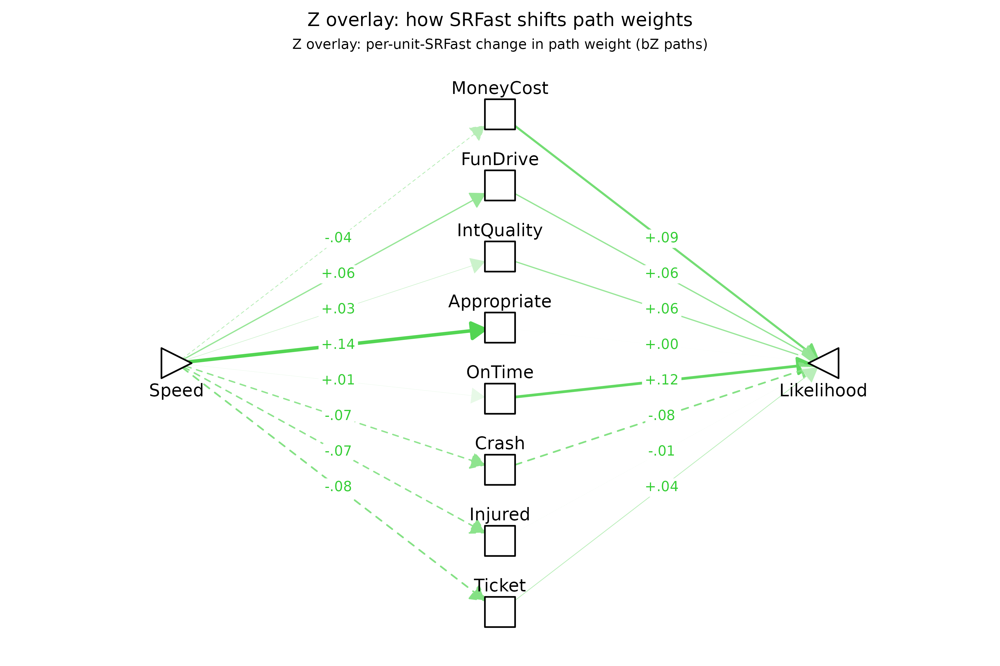

On the **expectation** side (`FZ[X,M]`), self-described fast drivers
expect speeding to be less catastrophic — smaller `Crash`, `Injured`,
`Ticket`, and `MoneyCost` shifts (all *p* \< .01) — more enjoyable
(`FunDrive`, *p* \< .001), and substantially more role-appropriate
(`Appropriate`, *p* \< .001, by far the largest effect). Six of the
eight expectation paths are significantly moderated.

On the **valuation** side (`FZ[M,Y]`), *not one* of the eight paths
reaches *p* \< .05; the nearest is `OnTime` (*b* = +.12, *p* = .11).
This is not because the valuation-arm coefficients are smaller — their
mean `|FZ|` is essentially equal to that on the expectation arm — but
because their standard errors run roughly 4× larger. The SE asymmetry
itself is taken up in detail under the route-diagram section below; the
careful reading here is that every *individually significant* moderation
effect across both the time-pressure and fast-driver fits lives on the
expectation arm, but whether the valuation arm carries comparable true
moderation that this sample size cannot resolve is left genuinely open.
The one place a valuation-arm effect *does* clear individual
significance — the item *“I like to arrive at appointments in plenty of
time”* moderating the weight placed on `OnTime` — is taken up below
under [When does Term 2 carry the
moderation?](#when-does-term-2-carry-the-moderation).

#### Does these differing expectancies & values create reasons for speeding?

As before, the two columns are the model’s two **routes** by which the
moderator reshapes the overall `Speed → Likelihood` link — the
**expectation route** (`FZ[X,M]·F1[M,Y]`) and the **valuation route**
(`F1[X,M]·FZ[M,Y]`). Significant entries are this model’s formal account
of *why* self-described fast drivers are more likely to speed: the
[decomposition section](#total-moderation-and-its-decomposition) below
shows that fast-driver tendency moderates the direct
`Speed → Likelihood` path by `FZ*[X,Y]` **= +.25**, and these
per-mediator route effects are the pieces that sum toward it.

[`plotPathXMY()`](https://dustin-wood.github.io/funfield/reference/plotPathXMY.md)
carries a per-route view (`route = "expectation"` /
`route = "valuation"`) that visualizes the two columns of the table
below directly. Following the package’s color convention — gold for
anything that is a pure `FZ` coefficient — each route panel renders one
arm in gold and the other in black:

- **Expectation panel:** `FZ[X,M](SRFast)` on the gold left arm,
  `F1[M,Y]` on the black right arm. A gold-black chain through a
  mediator says fast drivers’ *expectations* of speeding’s outcomes
  shift on that mediator AND those outcomes carry weight for action.
- **Valuation panel:** `F1[X,M]` on the black left arm,
  `FZ[M,Y](SRFast)` on the gold right arm. A black-gold chain says
  speeding *produces* that outcome AND fast drivers *weight* it
  differently.

A complete left-to-right path through any mediator — one where both arms
are visibly thick — is the diagram’s claim that we’ve identified a
**reason** the moderator shifts the focal action. The
[`pathXMY_pairtable()`](#bz-indirect-srfast) table immediately below
gives the formal indirect-product backing for that visual reading.

``` r

plotPathXMY_routes(dec,
                   X_label = "Speed", Y_label = "Likelihood",
                   Z_label = "SRFast", X_shape = "rtTri",
                   scale_max = 0.5)
```

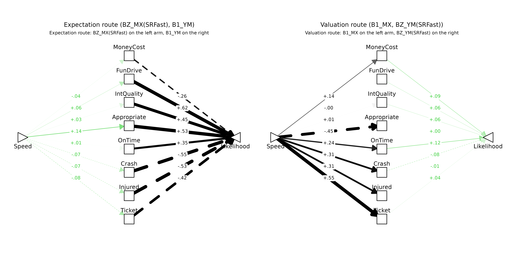

Both panels carry chains of comparable visible weight. In the
expectation panel, `Speed → Appropriate → Likelihood` (+.14 × +.53),
`Speed → Crash → Likelihood` (-.07 × -.55), and
`Speed → Ticket → Likelihood` (-.08 × -.42) are the strongest. In the
valuation panel, `Speed → OnTime → Likelihood` (+.24 × +.12) and
`Speed → Crash → Likelihood` (+.31 × -.08) trace chains where both arms
have visible weight. The mean `|FZ|` across mediators is in fact
essentially identical on the two arms (about .06 each).

What differs across panels is *precision*. The standard errors on the
valuation-arm `FZ[M,Y]` coefficients run roughly 4× the standard errors
on the expectation-arm `FZ[X,M]` coefficients in this fit:

``` r

fzxm <- subset(mod_p$tidy_loop,
               param == "fZ_XM" & !is.na(mediator))[, c("mediator","est","se","pvalue")]
fzmy <- subset(mod_p$tidy_loop,
               param == "fZ_MY" & !is.na(mediator))[, c("mediator","est","se","pvalue")]
names(fzxm)[2:4] <- c("fZ_XM","SE_XM","p_XM")
names(fzmy)[2:4] <- c("fZ_MY","SE_MY","p_MY")
cmp <- merge(fzxm, fzmy, by = "mediator")
cmp$SE_ratio <- cmp$SE_MY / cmp$SE_XM
kable0(cmp, digits = 3,
  col.names = c("mediator", "FZ[X,M]", "SE_XM", "p_XM",
                            "FZ[M,Y]", "SE_MY", "p_MY", "SE_ratio"),
  caption = paste0("Per-mediator comparison of expectation-arm (FZ[X,M]) and ",
                   "valuation-arm (FZ[M,Y]) moderation coefficients. ",
                   "Mean |FZ| is similar across arms (",
                   sprintf("%.3f", mean(abs(cmp$fZ_XM))), " vs ",
                   sprintf("%.3f", mean(abs(cmp$fZ_MY))),
                   ") but mean SE differs by ",
                   sprintf("%.1fx", mean(cmp$SE_MY) / mean(cmp$SE_XM)),
                   "."))
```

| mediator    | FZ\[X,M\] | SE_XM | p_XM | FZ\[M,Y\] | SE_MY | p_MY | SE_ratio |
|:------------|----------:|------:|-----:|----------:|------:|-----:|---------:|
| Appropriate |      .137 |  .021 | .000 |      .003 |  .069 | .971 |    3.244 |
| Crash       |     -.069 |  .015 | .000 |     -.079 |  .065 | .222 |    4.342 |
| FunDrive    |      .063 |  .015 | .000 |      .064 |  .061 | .293 |    3.956 |
| Injured     |     -.072 |  .016 | .000 |     -.007 |  .097 | .940 |    5.932 |
| IntQuality  |      .028 |  .016 | .074 |      .062 |  .077 | .421 |    4.936 |
| MoneyCost   |     -.041 |  .015 | .005 |      .094 |  .090 | .293 |    6.115 |
| OnTime      |      .012 |  .018 | .507 |      .115 |  .072 | .108 |    3.893 |
| Ticket      |     -.079 |  .019 | .000 |      .039 |  .058 | .498 |    3.036 |

Per-mediator comparison of expectation-arm (FZ\[X,M\]) and valuation-arm
(FZ\[M,Y\]) moderation coefficients. Mean \|FZ\| is similar across arms
(0.063 vs 0.058) but mean SE differs by 4.3x. {.table}

The same-magnitude moderation effect therefore sits at *p* \< .001 on
the expectation arm and well outside *p* \< .05 on the valuation arm.
The structural reason is in the design. `X` is the experimentally varied
scenario factor: every respondent rates scenarios at both `Speed = 1`
and `Speed = 0`, so `X` has guaranteed within-person variation for every
person, and therefore so does the `X × Z` interaction term used to
estimate `FZ[X,M]`. `M`, by contrast, is each respondent’s *rating* of
an expected outcome at those scenarios, and many respondents give the
same rating in both speed conditions — a respondent who reports `Crash`
likelihood as 0 whether `Speed = 1` or `Speed = 0` contributes zero
within-person variation in `M` and therefore zero in the `M × Z` term
used to estimate `FZ[M,Y]`. The effective sample of informative persons
is therefore everyone for `FZ[X,M]` but only the subset whose `M`
actually moves with `Speed` for `FZ[M,Y]` — and that latter subset can
be small enough to inflate SEs several-fold, as it does here.

This matters for how the route diagrams should be read. The “any visible
chain is a candidate reason” rule applies symmetrically across the two
panels, but chains on the valuation arm should be weighted by the larger
uncertainty: a magnitude-equivalent chain on the valuation side is a
weaker statistical claim than the same chain on the expectation side,
not because the effect is smaller but because we can resolve it less
sharply. The [`pathXMY_pairtable()`](#bz-indirect-srfast) table below is
the formal counterpart that combines estimates with their uncertainties.

The same data shown as a toggle (click **Forward** to watch the green
arm slide from left to right):

``` r

plotPathXMY_widget_routes(dec,
                          X_label = "Speed", Y_label = "Likelihood",
                          Z_label = "SRFast", X_shape = "rtTri",
                          scale_max = 0.5,
                          format  = "svg")
```

,
F1\[M,Y\])](data:image/svg+xml;base64,PD94bWwgdmVyc2lvbj0nMS4wJyBlbmNvZGluZz0nVVRGLTgnID8+CjxzdmcgeG1sbnM9J2h0dHA6Ly93d3cudzMub3JnLzIwMDAvc3ZnJyB4bWxuczp4bGluaz0naHR0cDovL3d3dy53My5vcmcvMTk5OS94bGluaycgd2lkdGg9JzY0OC4wMHB0JyBoZWlnaHQ9JzUwNC4wMHB0JyB2aWV3Qm94PScwIDAgNjQ4LjAwIDUwNC4wMCc+CjxnIGNsYXNzPSdzdmdsaXRlJz4KPGRlZnM+CiAgPHN0eWxlIHR5cGU9J3RleHQvY3NzJz48IVtDREFUQVsKICAgIC5zdmdsaXRlIGxpbmUsIC5zdmdsaXRlIHBvbHlsaW5lLCAuc3ZnbGl0ZSBwb2x5Z29uLCAuc3ZnbGl0ZSBwYXRoLCAuc3ZnbGl0ZSByZWN0LCAuc3ZnbGl0ZSBjaXJjbGUgewogICAgICBmaWxsOiBub25lOwogICAgICBzdHJva2U6ICMwMDAwMDA7CiAgICAgIHN0cm9rZS1saW5lY2FwOiByb3VuZDsKICAgICAgc3Ryb2tlLWxpbmVqb2luOiByb3VuZDsKICAgICAgc3Ryb2tlLW1pdGVybGltaXQ6IDEwLjAwOwogICAgfQogICAgLnN2Z2xpdGUgdGV4dCB7CiAgICAgIHdoaXRlLXNwYWNlOiBwcmU7CiAgICB9CiAgICAuc3ZnbGl0ZSBnLmdseXBoZ3JvdXAgcGF0aCB7CiAgICAgIGZpbGw6IGluaGVyaXQ7CiAgICAgIHN0cm9rZTogbm9uZTsKICAgIH0KICBdXT48L3N0eWxlPgo8L2RlZnM+CjxyZWN0IHdpZHRoPScxMDAlJyBoZWlnaHQ9JzEwMCUnIHN0eWxlPSdzdHJva2U6IG5vbmU7IGZpbGw6ICNGRkZGRkY7Jy8+CjxkZWZzPgogIDxjbGlwUGF0aCBpZD0nY3BNQzR3TUh3Mk5EZ3VNREI4TUM0d01IdzFNRFF1TURBPSc+CiAgICA8cmVjdCB4PScwLjAwJyB5PScwLjAwJyB3aWR0aD0nNjQ4LjAwJyBoZWlnaHQ9JzUwNC4wMCcgLz4KICA8L2NsaXBQYXRoPgo8L2RlZnM+CjxnIGNsaXAtcGF0aD0ndXJsKCNjcE1DNHdNSHcyTkRndU1EQjhNQzR3TUh3MU1EUXVNREE9KSc+CjwvZz4KPGRlZnM+CiAgPGNsaXBQYXRoIGlkPSdjcE1qZ3VORGQ4TmpFNUxqVXpmREF1TURCOE5UQTBMakF3Jz4KICAgIDxyZWN0IHg9JzI4LjQ3JyB5PScwLjAwJyB3aWR0aD0nNTkxLjA1JyBoZWlnaHQ9JzUwNC4wMCcgLz4KICA8L2NsaXBQYXRoPgo8L2RlZnM+CjxnIGNsaXAtcGF0aD0ndXJsKCNjcE1qZ3VORGQ4TmpFNUxqVXpmREF1TURCOE5UQTBMakF3KSc+CjxyZWN0IHg9JzI4LjQ3JyB5PSctMC4wMDAwMDAwMDAwMDAxMScgd2lkdGg9JzU5MS4wNScgaGVpZ2h0PSc1MDQuMDAnIHN0eWxlPSdzdHJva2Utd2lkdGg6IDAuMDA7IHN0cm9rZTogbm9uZTsnIC8+CjwvZz4KPGcgY2xpcC1wYXRoPSd1cmwoI2NwTUM0d01IdzJORGd1TURCOE1DNHdNSHcxTURRdU1EQT0pJz4KPGxpbmUgeDE9Jzc4LjgzJyB5MT0nMjY3LjkyJyB4Mj0nMzEyLjM0JyB5Mj0nODguMTEnIHN0eWxlPSdzdHJva2Utd2lkdGg6IDAuMzA7IHN0cm9rZTogI0ZERjBDNTsgc3Ryb2tlLWRhc2hhcnJheTogNC4wMCw0LjAwOycgLz4KPHBvbHlnb24gcG9pbnRzPSczMDguNTAsOTcuNDMgMzEyLjM0LDg4LjExIDMwMi4zNSw4OS40NSAnIHN0eWxlPSdzdHJva2Utd2lkdGg6IDAuMzA7IHN0cm9rZTogI0ZERjBDNTsgc3Ryb2tlLWRhc2hhcnJheTogNC4wMCw0LjAwOyBmaWxsOiAjRkRGMEM1OycgLz4KPGxpbmUgeDE9JzMzNS42NicgeTE9Jzg4LjExJyB4Mj0nNTY5LjE3JyB5Mj0nMjY3LjkyJyBzdHlsZT0nc3Ryb2tlLXdpZHRoOiAyLjY4OyBzdHJva2U6ICMxQzFDMUM7IHN0cm9rZS1kYXNoYXJyYXk6IDE0LjMxLDE0LjMxOycgLz4KPHBvbHlnb24gcG9pbnRzPSc1NTkuMTgsMjY2LjU5IDU2OS4xNywyNjcuOTIgNTY1LjMzLDI1OC42MCAnIHN0eWxlPSdzdHJva2Utd2lkdGg6IDIuNjg7IHN0cm9rZTogIzFDMUMxQzsgc3Ryb2tlLWRhc2hhcnJheTogMTQuMzEsMTQuMzE7IGZpbGw6ICMxQzFDMUM7JyAvPgo8bGluZSB4MT0nNzkuNzknIHkxPScyNjguNDAnIHgyPSczMTIuMzQnIHkyPScxNDAuNTAnIHN0eWxlPSdzdHJva2Utd2lkdGg6IDAuNDY7IHN0cm9rZTogI0ZDRTlBQTsnIC8+Cjxwb2x5Z29uIHBvaW50cz0nMzA3LjEyLDE0OS4xMiAzMTIuMzQsMTQwLjUwIDMwMi4yNywxNDAuMjkgJyBzdHlsZT0nc3Ryb2tlLXdpZHRoOiAwLjQ2OyBzdHJva2U6ICNGQ0U5QUE7IGZpbGw6ICNGQ0U5QUE7JyAvPgo8bGluZSB4MT0nMzM1LjY2JyB5MT0nMTQwLjUwJyB4Mj0nNTY4LjIxJyB5Mj0nMjY4LjQwJyBzdHlsZT0nc3Ryb2tlLXdpZHRoOiA2LjUxOycgLz4KPHBvbHlnb24gcG9pbnRzPSc1NTguMTMsMjY4LjYxIDU2OC4yMSwyNjguNDAgNTYyLjk5LDI1OS43OCAnIHN0eWxlPSdzdHJva2Utd2lkdGg6IDYuNTE7IGZpbGw6ICMwMDAwMDA7JyAvPgo8bGluZSB4MT0nODEuMjYnIHkxPScyNjkuMTQnIHgyPSczMTIuMzQnIHkyPScxOTIuODgnIHN0eWxlPSdzdHJva2Utd2lkdGg6IDAuMjI7IHN0cm9rZTogI0ZFRjVENzsnIC8+Cjxwb2x5Z29uIHBvaW50cz0nMzA1LjYzLDIwMC40MCAzMTIuMzQsMTkyLjg4IDMwMi40OCwxOTAuODMgJyBzdHlsZT0nc3Ryb2tlLXdpZHRoOiAwLjIyOyBzdHJva2U6ICNGRUY1RDc7IGZpbGw6ICNGRUY1RDc7JyAvPgo8bGluZSB4MT0nMzM1LjY2JyB5MT0nMTkyLjg4JyB4Mj0nNTY2Ljc0JyB5Mj0nMjY5LjE0JyBzdHlsZT0nc3Ryb2tlLXdpZHRoOiA1LjcxOycgLz4KPHBvbHlnb24gcG9pbnRzPSc1NTYuODcsMjcxLjE5IDU2Ni43NCwyNjkuMTQgNTYwLjAzLDI2MS42MiAnIHN0eWxlPSdzdHJva2Utd2lkdGg6IDUuNzE7IGZpbGw6ICMwMDAwMDA7JyAvPgo8bGluZSB4MT0nODMuNzknIHkxPScyNzAuNDAnIHgyPSczMTIuMzQnIHkyPScyNDUuMjYnIHN0eWxlPSdzdHJva2Utd2lkdGg6IDEuMTU7IHN0cm9rZTogI0Y5RDc2MTsnIC8+Cjxwb2x5Z29uIHBvaW50cz0nMzA0LjIyLDI1MS4yMyAzMTIuMzQsMjQ1LjI2IDMwMy4xMiwyNDEuMjEgJyBzdHlsZT0nc3Ryb2tlLXdpZHRoOiAxLjE1OyBzdHJva2U6ICNGOUQ3NjE7IGZpbGw6ICNGOUQ3NjE7JyAvPgo8bGluZSB4MT0nMzM1LjY2JyB5MT0nMjQ1LjI2JyB4Mj0nNTY0LjIxJyB5Mj0nMjcwLjQwJyBzdHlsZT0nc3Ryb2tlLXdpZHRoOiA2LjUxOycgLz4KPHBvbHlnb24gcG9pbnRzPSc1NTQuOTgsMjc0LjQ2IDU2NC4yMSwyNzAuNDAgNTU2LjA4LDI2NC40NCAnIHN0eWxlPSdzdHJva2Utd2lkdGg6IDYuNTE7IGZpbGw6ICMwMDAwMDA7JyAvPgo8bGluZSB4MT0nODMuNzknIHkxPScyNzIuNTEnIHgyPSczMTIuMzQnIHkyPScyOTcuNjUnIHN0eWxlPSdzdHJva2Utd2lkdGg6IDAuMTQ7IHN0cm9rZTogI0ZFRkFFRDsnIC8+Cjxwb2x5Z29uIHBvaW50cz0nMzAzLjEyLDMwMS43MCAzMTIuMzQsMjk3LjY1IDMwNC4yMiwyOTEuNjggJyBzdHlsZT0nc3Ryb2tlLXdpZHRoOiAwLjE0OyBzdHJva2U6ICNGRUZBRUQ7IGZpbGw6ICNGRUZBRUQ7JyAvPgo8bGluZSB4MT0nMzM1LjY2JyB5MT0nMjk3LjY1JyB4Mj0nNTY0LjIxJyB5Mj0nMjcyLjUxJyBzdHlsZT0nc3Ryb2tlLXdpZHRoOiAzLjk1OyBzdHJva2U6ICMwNzA3MDc7JyAvPgo8cG9seWdvbiBwb2ludHM9JzU1Ni4wOCwyNzguNDcgNTY0LjIxLDI3Mi41MSA1NTQuOTgsMjY4LjQ1ICcgc3R5bGU9J3N0cm9rZS13aWR0aDogMy45NTsgc3Ryb2tlOiAjMDcwNzA3OyBmaWxsOiAjMDcwNzA3OycgLz4KPGxpbmUgeDE9JzgxLjI2JyB5MT0nMjczLjc3JyB4Mj0nMzEyLjM0JyB5Mj0nMzUwLjAzJyBzdHlsZT0nc3Ryb2tlLXdpZHRoOiAwLjUxOyBzdHJva2U6ICNGQ0U4QTM7IHN0cm9rZS1kYXNoYXJyYXk6IDQuMDAsNC4wMDsnIC8+Cjxwb2x5Z29uIHBvaW50cz0nMzAyLjQ4LDM1Mi4wOCAzMTIuMzQsMzUwLjAzIDMwNS42MywzNDIuNTEgJyBzdHlsZT0nc3Ryb2tlLXdpZHRoOiAwLjUxOyBzdHJva2U6ICNGQ0U4QTM7IHN0cm9rZS1kYXNoYXJyYXk6IDQuMDAsNC4wMDsgZmlsbDogI0ZDRThBMzsnIC8+CjxsaW5lIHgxPSczMzUuNjYnIHkxPSczNTAuMDMnIHgyPSc1NjYuNzQnIHkyPScyNzMuNzcnIHN0eWxlPSdzdHJva2Utd2lkdGg6IDYuNTE7IHN0cm9rZS1kYXNoYXJyYXk6IDM0LjcxLDM0LjcxOycgLz4KPHBvbHlnb24gcG9pbnRzPSc1NjAuMDMsMjgxLjI5IDU2Ni43NCwyNzMuNzcgNTU2Ljg3LDI3MS43MiAnIHN0eWxlPSdzdHJva2Utd2lkdGg6IDYuNTE7IHN0cm9rZS1kYXNoYXJyYXk6IDM0LjcxLDM0LjcxOyBmaWxsOiAjMDAwMDAwOycgLz4KPGxpbmUgeDE9Jzc5Ljc5JyB5MT0nMjc0LjUxJyB4Mj0nMzEyLjM0JyB5Mj0nNDAyLjQxJyBzdHlsZT0nc3Ryb2tlLXdpZHRoOiAwLjUzOyBzdHJva2U6ICNGQ0U3QTA7IHN0cm9rZS1kYXNoYXJyYXk6IDQuMDAsNC4wMDsnIC8+Cjxwb2x5Z29uIHBvaW50cz0nMzAyLjI3LDQwMi42MiAzMTIuMzQsNDAyLjQxIDMwNy4xMiwzOTMuNzkgJyBzdHlsZT0nc3Ryb2tlLXdpZHRoOiAwLjUzOyBzdHJva2U6ICNGQ0U3QTA7IHN0cm9rZS1kYXNoYXJyYXk6IDQuMDAsNC4wMDsgZmlsbDogI0ZDRTdBMDsnIC8+CjxsaW5lIHgxPSczMzUuNjYnIHkxPSc0MDIuNDEnIHgyPSc1NjguMjEnIHkyPScyNzQuNTEnIHN0eWxlPSdzdHJva2Utd2lkdGg6IDYuNTE7IHN0cm9rZS1kYXNoYXJyYXk6IDM0LjcxLDM0LjcxOycgLz4KPHBvbHlnb24gcG9pbnRzPSc1NjIuOTksMjgzLjEzIDU2OC4yMSwyNzQuNTEgNTU4LjEzLDI3NC4zMCAnIHN0eWxlPSdzdHJva2Utd2lkdGg6IDYuNTE7IHN0cm9rZS1kYXNoYXJyYXk6IDM0LjcxLDM0LjcxOyBmaWxsOiAjMDAwMDAwOycgLz4KPGxpbmUgeDE9Jzc4LjgzJyB5MT0nMjc0Ljk5JyB4Mj0nMzEyLjM0JyB5Mj0nNDU0Ljc5JyBzdHlsZT0nc3Ryb2tlLXdpZHRoOiAwLjU5OyBzdHJva2U6ICNGQkU1OTg7IHN0cm9rZS1kYXNoYXJyYXk6IDQuMDAsNC4wMDsnIC8+Cjxwb2x5Z29uIHBvaW50cz0nMzAyLjM1LDQ1My40NiAzMTIuMzQsNDU0Ljc5IDMwOC41MCw0NDUuNDggJyBzdHlsZT0nc3Ryb2tlLXdpZHRoOiAwLjU5OyBzdHJva2U6ICNGQkU1OTg7IHN0cm9rZS1kYXNoYXJyYXk6IDQuMDAsNC4wMDsgZmlsbDogI0ZCRTU5ODsnIC8+CjxsaW5lIHgxPSczMzUuNjYnIHkxPSc0NTQuNzknIHgyPSc1NjkuMTcnIHkyPScyNzQuOTknIHN0eWxlPSdzdHJva2Utd2lkdGg6IDUuMTE7IHN0cm9rZTogIzAxMDEwMTsgc3Ryb2tlLWRhc2hhcnJheTogMjcuMjQsMjcuMjQ7JyAvPgo8cG9seWdvbiBwb2ludHM9JzU2NS4zMywyODQuMzEgNTY5LjE3LDI3NC45OSA1NTkuMTgsMjc2LjMyICcgc3R5bGU9J3N0cm9rZS13aWR0aDogNS4xMTsgc3Ryb2tlOiAjMDEwMTAxOyBzdHJva2UtZGFzaGFycmF5OiAyNy4yNCwyNy4yNDsgZmlsbDogIzAxMDEwMTsnIC8+Cjxwb2x5Z29uIHBvaW50cz0nMTkxLjcxLDE4MS4xMCAyMDYuNTMsMTgxLjEwIDIwNi40NSwxODEuMTAgMjA2Ljc5LDE4MS4wOCAyMDcuMTMsMTgxLjAxIDIwNy40NiwxODAuODkgMjA3Ljc2LDE4MC43MSAyMDguMDMsMTgwLjQ5IDIwOC4yNiwxODAuMjMgMjA4LjQ0LDE3OS45NCAyMDguNTgsMTc5LjYyIDIwOC42NiwxNzkuMjggMjA4LjY5LDE3OC45NCAyMDguNjksMTc4Ljk0IDIwOC42OSwxNzEuNjYgMjA4LjY5LDE3MS42NiAyMDguNjYsMTcxLjMxIDIwOC41OCwxNzAuOTcgMjA4LjQ0LDE3MC42NSAyMDguMjYsMTcwLjM2IDIwOC4wMywxNzAuMTAgMjA3Ljc2LDE2OS44OCAyMDcuNDYsMTY5LjcxIDIwNy4xMywxNjkuNTggMjA2Ljc5LDE2OS41MSAyMDYuNTMsMTY5LjUwIDE5MS43MSwxNjkuNTAgMTkxLjk3LDE2OS41MSAxOTEuNjIsMTY5LjUwIDE5MS4yOCwxNjkuNTQgMTkwLjk0LDE2OS42NCAxOTAuNjMsMTY5Ljc5IDE5MC4zNCwxNjkuOTggMTkwLjA5LDE3MC4yMyAxODkuODgsMTcwLjUwIDE4OS43MiwxNzAuODEgMTg5LjYxLDE3MS4xNCAxODkuNTYsMTcxLjQ4IDE4OS41NSwxNzEuNjYgMTg5LjU1LDE3OC45NCAxODkuNTYsMTc4Ljc2IDE4OS41NiwxNzkuMTEgMTg5LjYxLDE3OS40NSAxODkuNzIsMTc5Ljc4IDE4OS44OCwxODAuMDkgMTkwLjA5LDE4MC4zNyAxOTAuMzQsMTgwLjYxIDE5MC42MywxODAuODEgMTkwLjk0LDE4MC45NiAxOTEuMjgsMTgxLjA1IDE5MS42MiwxODEuMTAgJyBzdHlsZT0nc3Ryb2tlLXdpZHRoOiAwLjAwOyBmaWxsOiAjRkZGRkZGOycgLz4KPHRleHQgeD0nMTkxLjI4JyB5PScxNzcuNDgnIHN0eWxlPSdmb250LXNpemU6IDkuMTBweDtmaWxsOiAjRjZCRTAwOyBmb250LWZhbWlseTogIkxpYmVyYXRpb24gU2FucyI7JyB0ZXh0TGVuZ3RoPScxNS42OXB4JyBsZW5ndGhBZGp1c3Q9J3NwYWNpbmdBbmRHbHlwaHMnPi0uMDQ8L3RleHQ+Cjxwb2x5Z29uIHBvaW50cz0nNDQxLjQ3LDE4MS4xMCA0NTYuMjksMTgxLjEwIDQ1Ni4yMCwxODEuMTAgNDU2LjU1LDE4MS4wOCA0NTYuODksMTgxLjAxIDQ1Ny4yMiwxODAuODkgNDU3LjUyLDE4MC43MSA0NTcuNzksMTgwLjQ5IDQ1OC4wMiwxODAuMjMgNDU4LjIwLDE3OS45NCA0NTguMzQsMTc5LjYyIDQ1OC40MiwxNzkuMjggNDU4LjQ1LDE3OC45NCA0NTguNDUsMTc4Ljk0IDQ1OC40NSwxNzEuNjYgNDU4LjQ1LDE3MS42NiA0NTguNDIsMTcxLjMxIDQ1OC4zNCwxNzAuOTcgNDU4LjIwLDE3MC42NSA0NTguMDIsMTcwLjM2IDQ1Ny43OSwxNzAuMTAgNDU3LjUyLDE2OS44OCA0NTcuMjIsMTY5LjcxIDQ1Ni44OSwxNjkuNTggNDU2LjU1LDE2OS41MSA0NTYuMjksMTY5LjUwIDQ0MS40NywxNjkuNTAgNDQxLjczLDE2OS41MSA0NDEuMzgsMTY5LjUwIDQ0MS4wNCwxNjkuNTQgNDQwLjcwLDE2OS42NCA0NDAuMzksMTY5Ljc5IDQ0MC4xMCwxNjkuOTggNDM5Ljg1LDE3MC4yMyA0MzkuNjQsMTcwLjUwIDQzOS40OCwxNzAuODEgNDM5LjM3LDE3MS4xNCA0MzkuMzEsMTcxLjQ4IDQzOS4zMSwxNzEuNjYgNDM5LjMxLDE3OC45NCA0MzkuMzEsMTc4Ljc2IDQzOS4zMSwxNzkuMTEgNDM5LjM3LDE3OS40NSA0MzkuNDgsMTc5Ljc4IDQzOS42NCwxODAuMDkgNDM5Ljg1LDE4MC4zNyA0NDAuMTAsMTgwLjYxIDQ0MC4zOSwxODAuODEgNDQwLjcwLDE4MC45NiA0NDEuMDQsMTgxLjA1IDQ0MS4zOCwxODEuMTAgJyBzdHlsZT0nc3Ryb2tlLXdpZHRoOiAwLjAwOyBmaWxsOiAjRkZGRkZGOycgLz4KPHRleHQgeD0nNDQxLjA0JyB5PScxNzcuNDgnIHN0eWxlPSdmb250LXNpemU6IDkuMTBweDsgZm9udC1mYW1pbHk6ICJMaWJlcmF0aW9uIFNhbnMiOycgdGV4dExlbmd0aD0nMTUuNjlweCcgbGVuZ3RoQWRqdXN0PSdzcGFjaW5nQW5kR2x5cGhzJz4tLjI2PC90ZXh0Pgo8cG9seWdvbiBwb2ludHM9JzE5MC41NywyMDguNTcgMjA3LjY3LDIwOC41NyAyMDcuNTksMjA4LjU3IDIwNy45MywyMDguNTUgMjA4LjI3LDIwOC40OSAyMDguNjAsMjA4LjM2IDIwOC45MCwyMDguMTkgMjA5LjE3LDIwNy45NyAyMDkuNDAsMjA3LjcxIDIwOS41OSwyMDcuNDEgMjA5LjcyLDIwNy4wOSAyMDkuODAsMjA2Ljc2IDIwOS44MywyMDYuNDEgMjA5LjgzLDIwNi40MSAyMDkuODMsMTk5LjEzIDIwOS44MywxOTkuMTMgMjA5LjgwLDE5OC43OCAyMDkuNzIsMTk4LjQ1IDIwOS41OSwxOTguMTMgMjA5LjQwLDE5Ny44MyAyMDkuMTcsMTk3LjU3IDIwOC45MCwxOTcuMzUgMjA4LjYwLDE5Ny4xOCAyMDguMjcsMTk3LjA2IDIwNy45MywxOTYuOTkgMjA3LjY3LDE5Ni45NyAxOTAuNTcsMTk2Ljk3IDE5MC44MywxOTYuOTkgMTkwLjQ4LDE5Ni45NyAxOTAuMTQsMTk3LjAxIDE4OS44MCwxOTcuMTEgMTg5LjQ5LDE5Ny4yNiAxODkuMjAsMTk3LjQ2IDE4OC45NSwxOTcuNzAgMTg4Ljc0LDE5Ny45OCAxODguNTgsMTk4LjI4IDE4OC40NywxOTguNjEgMTg4LjQxLDE5OC45NiAxODguNDEsMTk5LjEzIDE4OC40MSwyMDYuNDEgMTg4LjQxLDIwNi4yNCAxODguNDEsMjA2LjU4IDE4OC40NywyMDYuOTMgMTg4LjU4LDIwNy4yNiAxODguNzQsMjA3LjU2IDE4OC45NSwyMDcuODQgMTg5LjIwLDIwOC4wOCAxODkuNDksMjA4LjI4IDE4OS44MCwyMDguNDMgMTkwLjE0LDIwOC41MyAxOTAuNDgsMjA4LjU3ICcgc3R5bGU9J3N0cm9rZS13aWR0aDogMC4wMDsgZmlsbDogI0ZGRkZGRjsnIC8+Cjx0ZXh0IHg9JzE5MC4xNCcgeT0nMjA0Ljk2JyBzdHlsZT0nZm9udC1zaXplOiA5LjEwcHg7ZmlsbDogI0Y2QkUwMDsgZm9udC1mYW1pbHk6ICJMaWJlcmF0aW9uIFNhbnMiOycgdGV4dExlbmd0aD0nMTcuOTdweCcgbGVuZ3RoQWRqdXN0PSdzcGFjaW5nQW5kR2x5cGhzJz4rLjA2PC90ZXh0Pgo8cG9seWdvbiBwb2ludHM9JzQ0MC4zMywyMDguNTcgNDU3LjQzLDIwOC41NyA0NTcuMzUsMjA4LjU3IDQ1Ny42OSwyMDguNTUgNDU4LjAzLDIwOC40OSA0NTguMzYsMjA4LjM2IDQ1OC42NiwyMDguMTkgNDU4LjkzLDIwNy45NyA0NTkuMTYsMjA3LjcxIDQ1OS4zNCwyMDcuNDEgNDU5LjQ4LDIwNy4wOSA0NTkuNTYsMjA2Ljc2IDQ1OS41OSwyMDYuNDEgNDU5LjU5LDIwNi40MSA0NTkuNTksMTk5LjEzIDQ1OS41OSwxOTkuMTMgNDU5LjU2LDE5OC43OCA0NTkuNDgsMTk4LjQ1IDQ1OS4zNCwxOTguMTMgNDU5LjE2LDE5Ny44MyA0NTguOTMsMTk3LjU3IDQ1OC42NiwxOTcuMzUgNDU4LjM2LDE5Ny4xOCA0NTguMDMsMTk3LjA2IDQ1Ny42OSwxOTYuOTkgNDU3LjQzLDE5Ni45NyA0NDAuMzMsMTk2Ljk3IDQ0MC41OSwxOTYuOTkgNDQwLjI0LDE5Ni45NyA0MzkuOTAsMTk3LjAxIDQzOS41NiwxOTcuMTEgNDM5LjI1LDE5Ny4yNiA0MzguOTYsMTk3LjQ2IDQzOC43MSwxOTcuNzAgNDM4LjUwLDE5Ny45OCA0MzguMzQsMTk4LjI4IDQzOC4yMywxOTguNjEgNDM4LjE3LDE5OC45NiA0MzguMTcsMTk5LjEzIDQzOC4xNywyMDYuNDEgNDM4LjE3LDIwNi4yNCA0MzguMTcsMjA2LjU4IDQzOC4yMywyMDYuOTMgNDM4LjM0LDIwNy4yNiA0MzguNTAsMjA3LjU2IDQzOC43MSwyMDcuODQgNDM4Ljk2LDIwOC4wOCA0MzkuMjUsMjA4LjI4IDQzOS41NiwyMDguNDMgNDM5LjkwLDIwOC41MyA0NDAuMjQsMjA4LjU3ICcgc3R5bGU9J3N0cm9rZS13aWR0aDogMC4wMDsgZmlsbDogI0ZGRkZGRjsnIC8+Cjx0ZXh0IHg9JzQzOS45MCcgeT0nMjA0Ljk2JyBzdHlsZT0nZm9udC1zaXplOiA5LjEwcHg7IGZvbnQtZmFtaWx5OiAiTGliZXJhdGlvbiBTYW5zIjsnIHRleHRMZW5ndGg9JzE3Ljk3cHgnIGxlbmd0aEFkanVzdD0nc3BhY2luZ0FuZEdseXBocyc+Ky42MjwvdGV4dD4KPHBvbHlnb24gcG9pbnRzPScxOTAuNTcsMjM2LjA0IDIwNy42NywyMzYuMDQgMjA3LjU5LDIzNi4wNCAyMDcuOTMsMjM2LjAzIDIwOC4yNywyMzUuOTYgMjA4LjYwLDIzNS44NCAyMDguOTAsMjM1LjY2IDIwOS4xNywyMzUuNDQgMjA5LjQwLDIzNS4xOCAyMDkuNTksMjM0Ljg5IDIwOS43MiwyMzQuNTcgMjA5LjgwLDIzNC4yMyAyMDkuODMsMjMzLjg4IDIwOS44MywyMzMuODggMjA5LjgzLDIyNi42MCAyMDkuODMsMjI2LjYwIDIwOS44MCwyMjYuMjYgMjA5LjcyLDIyNS45MiAyMDkuNTksMjI1LjYwIDIwOS40MCwyMjUuMzEgMjA5LjE3LDIyNS4wNSAyMDguOTAsMjI0LjgzIDIwOC42MCwyMjQuNjUgMjA4LjI3LDIyNC41MyAyMDcuOTMsMjI0LjQ2IDIwNy42NywyMjQuNDQgMTkwLjU3LDIyNC40NCAxOTAuODMsMjI0LjQ2IDE5MC40OCwyMjQuNDUgMTkwLjE0LDIyNC40OSAxODkuODAsMjI0LjU5IDE4OS40OSwyMjQuNzMgMTg5LjIwLDIyNC45MyAxODguOTUsMjI1LjE3IDE4OC43NCwyMjUuNDUgMTg4LjU4LDIyNS43NiAxODguNDcsMjI2LjA5IDE4OC40MSwyMjYuNDMgMTg4LjQxLDIyNi42MCAxODguNDEsMjMzLjg4IDE4OC40MSwyMzMuNzEgMTg4LjQxLDIzNC4wNiAxODguNDcsMjM0LjQwIDE4OC41OCwyMzQuNzMgMTg4Ljc0LDIzNS4wNCAxODguOTUsMjM1LjMyIDE4OS4yMCwyMzUuNTYgMTg5LjQ5LDIzNS43NSAxODkuODAsMjM1LjkwIDE5MC4xNCwyMzYuMDAgMTkwLjQ4LDIzNi4wNCAnIHN0eWxlPSdzdHJva2Utd2lkdGg6IDAuMDA7IGZpbGw6ICNGRkZGRkY7JyAvPgo8dGV4dCB4PScxOTAuMTQnIHk9JzIzMi40Mycgc3R5bGU9J2ZvbnQtc2l6ZTogOS4xMHB4O2ZpbGw6ICNGNkJFMDA7IGZvbnQtZmFtaWx5OiAiTGliZXJhdGlvbiBTYW5zIjsnIHRleHRMZW5ndGg9JzE3Ljk3cHgnIGxlbmd0aEFkanVzdD0nc3BhY2luZ0FuZEdseXBocyc+Ky4wMzwvdGV4dD4KPHBvbHlnb24gcG9pbnRzPSc0NDAuMzMsMjM2LjA0IDQ1Ny40MywyMzYuMDQgNDU3LjM1LDIzNi4wNCA0NTcuNjksMjM2LjAzIDQ1OC4wMywyMzUuOTYgNDU4LjM2LDIzNS44NCA0NTguNjYsMjM1LjY2IDQ1OC45MywyMzUuNDQgNDU5LjE2LDIzNS4xOCA0NTkuMzQsMjM0Ljg5IDQ1OS40OCwyMzQuNTcgNDU5LjU2LDIzNC4yMyA0NTkuNTksMjMzLjg4IDQ1OS41OSwyMzMuODggNDU5LjU5LDIyNi42MCA0NTkuNTksMjI2LjYwIDQ1OS41NiwyMjYuMjYgNDU5LjQ4LDIyNS45MiA0NTkuMzQsMjI1LjYwIDQ1OS4xNiwyMjUuMzEgNDU4LjkzLDIyNS4wNSA0NTguNjYsMjI0LjgzIDQ1OC4zNiwyMjQuNjUgNDU4LjAzLDIyNC41MyA0NTcuNjksMjI0LjQ2IDQ1Ny40MywyMjQuNDQgNDQwLjMzLDIyNC40NCA0NDAuNTksMjI0LjQ2IDQ0MC4yNCwyMjQuNDUgNDM5LjkwLDIyNC40OSA0MzkuNTYsMjI0LjU5IDQzOS4yNSwyMjQuNzMgNDM4Ljk2LDIyNC45MyA0MzguNzEsMjI1LjE3IDQzOC41MCwyMjUuNDUgNDM4LjM0LDIyNS43NiA0MzguMjMsMjI2LjA5IDQzOC4xNywyMjYuNDMgNDM4LjE3LDIyNi42MCA0MzguMTcsMjMzLjg4IDQzOC4xNywyMzMuNzEgNDM4LjE3LDIzNC4wNiA0MzguMjMsMjM0LjQwIDQzOC4zNCwyMzQuNzMgNDM4LjUwLDIzNS4wNCA0MzguNzEsMjM1LjMyIDQzOC45NiwyMzUuNTYgNDM5LjI1LDIzNS43NSA0MzkuNTYsMjM1LjkwIDQzOS45MCwyMzYuMDAgNDQwLjI0LDIzNi4wNCAnIHN0eWxlPSdzdHJva2Utd2lkdGg6IDAuMDA7IGZpbGw6ICNGRkZGRkY7JyAvPgo8dGV4dCB4PSc0MzkuOTAnIHk9JzIzMi40Mycgc3R5bGU9J2ZvbnQtc2l6ZTogOS4xMHB4OyBmb250LWZhbWlseTogIkxpYmVyYXRpb24gU2FucyI7JyB0ZXh0TGVuZ3RoPScxNy45N3B4JyBsZW5ndGhBZGp1c3Q9J3NwYWNpbmdBbmRHbHlwaHMnPisuNDU8L3RleHQ+Cjxwb2x5Z29uIHBvaW50cz0nMTkwLjU3LDI2My41MiAyMDcuNjcsMjYzLjUyIDIwNy41OSwyNjMuNTIgMjA3LjkzLDI2My41MCAyMDguMjcsMjYzLjQzIDIwOC42MCwyNjMuMzEgMjA4LjkwLDI2My4xNCAyMDkuMTcsMjYyLjkyIDIwOS40MCwyNjIuNjYgMjA5LjU5LDI2Mi4zNiAyMDkuNzIsMjYyLjA0IDIwOS44MCwyNjEuNzAgMjA5LjgzLDI2MS4zNiAyMDkuODMsMjYxLjM2IDIwOS44MywyNTQuMDggMjA5LjgzLDI1NC4wOCAyMDkuODAsMjUzLjczIDIwOS43MiwyNTMuMzkgMjA5LjU5LDI1My4wNyAyMDkuNDAsMjUyLjc4IDIwOS4xNywyNTIuNTIgMjA4LjkwLDI1Mi4zMCAyMDguNjAsMjUyLjEzIDIwOC4yNywyNTIuMDAgMjA3LjkzLDI1MS45MyAyMDcuNjcsMjUxLjkyIDE5MC41NywyNTEuOTIgMTkwLjgzLDI1MS45MyAxOTAuNDgsMjUxLjkyIDE5MC4xNCwyNTEuOTYgMTg5LjgwLDI1Mi4wNiAxODkuNDksMjUyLjIxIDE4OS4yMCwyNTIuNDEgMTg4Ljk1LDI1Mi42NSAxODguNzQsMjUyLjkyIDE4OC41OCwyNTMuMjMgMTg4LjQ3LDI1My41NiAxODguNDEsMjUzLjkwIDE4OC40MSwyNTQuMDggMTg4LjQxLDI2MS4zNiAxODguNDEsMjYxLjE4IDE4OC40MSwyNjEuNTMgMTg4LjQ3LDI2MS44NyAxODguNTgsMjYyLjIwIDE4OC43NCwyNjIuNTEgMTg4Ljk1LDI2Mi43OSAxODkuMjAsMjYzLjAzIDE4OS40OSwyNjMuMjMgMTg5LjgwLDI2My4zOCAxOTAuMTQsMjYzLjQ3IDE5MC40OCwyNjMuNTIgJyBzdHlsZT0nc3Ryb2tlLXdpZHRoOiAwLjAwOyBmaWxsOiAjRkZGRkZGOycgLz4KPHRleHQgeD0nMTkwLjE0JyB5PScyNTkuOTAnIHN0eWxlPSdmb250LXNpemU6IDkuMTBweDtmaWxsOiAjRjZCRTAwOyBmb250LWZhbWlseTogIkxpYmVyYXRpb24gU2FucyI7JyB0ZXh0TGVuZ3RoPScxNy45N3B4JyBsZW5ndGhBZGp1c3Q9J3NwYWNpbmdBbmRHbHlwaHMnPisuMTQ8L3RleHQ+Cjxwb2x5Z29uIHBvaW50cz0nNDQwLjMzLDI2My41MiA0NTcuNDMsMjYzLjUyIDQ1Ny4zNSwyNjMuNTIgNDU3LjY5LDI2My41MCA0NTguMDMsMjYzLjQzIDQ1OC4zNiwyNjMuMzEgNDU4LjY2LDI2My4xNCA0NTguOTMsMjYyLjkyIDQ1OS4xNiwyNjIuNjYgNDU5LjM0LDI2Mi4zNiA0NTkuNDgsMjYyLjA0IDQ1OS41NiwyNjEuNzAgNDU5LjU5LDI2MS4zNiA0NTkuNTksMjYxLjM2IDQ1OS41OSwyNTQuMDggNDU5LjU5LDI1NC4wOCA0NTkuNTYsMjUzLjczIDQ1OS40OCwyNTMuMzkgNDU5LjM0LDI1My4wNyA0NTkuMTYsMjUyLjc4IDQ1OC45MywyNTIuNTIgNDU4LjY2LDI1Mi4zMCA0NTguMzYsMjUyLjEzIDQ1OC4wMywyNTIuMDAgNDU3LjY5LDI1MS45MyA0NTcuNDMsMjUxLjkyIDQ0MC4zMywyNTEuOTIgNDQwLjU5LDI1MS45MyA0NDAuMjQsMjUxLjkyIDQzOS45MCwyNTEuOTYgNDM5LjU2LDI1Mi4wNiA0MzkuMjUsMjUyLjIxIDQzOC45NiwyNTIuNDEgNDM4LjcxLDI1Mi42NSA0MzguNTAsMjUyLjkyIDQzOC4zNCwyNTMuMjMgNDM4LjIzLDI1My41NiA0MzguMTcsMjUzLjkwIDQzOC4xNywyNTQuMDggNDM4LjE3LDI2MS4zNiA0MzguMTcsMjYxLjE4IDQzOC4xNywyNjEuNTMgNDM4LjIzLDI2MS44NyA0MzguMzQsMjYyLjIwIDQzOC41MCwyNjIuNTEgNDM4LjcxLDI2Mi43OSA0MzguOTYsMjYzLjAzIDQzOS4yNSwyNjMuMjMgNDM5LjU2LDI2My4zOCA0MzkuOTAsMjYzLjQ3IDQ0MC4yNCwyNjMuNTIgJyBzdHlsZT0nc3Ryb2tlLXdpZHRoOiAwLjAwOyBmaWxsOiAjRkZGRkZGOycgLz4KPHRleHQgeD0nNDM5LjkwJyB5PScyNTkuOTAnIHN0eWxlPSdmb250LXNpemU6IDkuMTBweDsgZm9udC1mYW1pbHk6ICJMaWJlcmF0aW9uIFNhbnMiOycgdGV4dExlbmd0aD0nMTcuOTdweCcgbGVuZ3RoQWRqdXN0PSdzcGFjaW5nQW5kR2x5cGhzJz4rLjUzPC90ZXh0Pgo8cG9seWdvbiBwb2ludHM9JzE5MC41NywyOTAuOTkgMjA3LjY3LDI5MC45OSAyMDcuNTksMjkwLjk5IDIwNy45MywyOTAuOTggMjA4LjI3LDI5MC45MSAyMDguNjAsMjkwLjc4IDIwOC45MCwyOTAuNjEgMjA5LjE3LDI5MC4zOSAyMDkuNDAsMjkwLjEzIDIwOS41OSwyODkuODMgMjA5LjcyLDI4OS41MiAyMDkuODAsMjg5LjE4IDIwOS44MywyODguODMgMjA5LjgzLDI4OC44MyAyMDkuODMsMjgxLjU1IDIwOS44MywyODEuNTUgMjA5LjgwLDI4MS4yMSAyMDkuNzIsMjgwLjg3IDIwOS41OSwyODAuNTUgMjA5LjQwLDI4MC4yNSAyMDkuMTcsMjc5Ljk5IDIwOC45MCwyNzkuNzcgMjA4LjYwLDI3OS42MCAyMDguMjcsMjc5LjQ4IDIwNy45MywyNzkuNDEgMjA3LjY3LDI3OS4zOSAxOTAuNTcsMjc5LjM5IDE5MC44MywyNzkuNDEgMTkwLjQ4LDI3OS4zOSAxOTAuMTQsMjc5LjQ0IDE4OS44MCwyNzkuNTMgMTg5LjQ5LDI3OS42OCAxODkuMjAsMjc5Ljg4IDE4OC45NSwyODAuMTIgMTg4Ljc0LDI4MC40MCAxODguNTgsMjgwLjcxIDE4OC40NywyODEuMDMgMTg4LjQxLDI4MS4zOCAxODguNDEsMjgxLjU1IDE4OC40MSwyODguODMgMTg4LjQxLDI4OC42NiAxODguNDEsMjg5LjAwIDE4OC40NywyODkuMzUgMTg4LjU4LDI4OS42OCAxODguNzQsMjg5Ljk5IDE4OC45NSwyOTAuMjYgMTg5LjIwLDI5MC41MCAxODkuNDksMjkwLjcwIDE4OS44MCwyOTAuODUgMTkwLjE0LDI5MC45NSAxOTAuNDgsMjkwLjk5ICcgc3R5bGU9J3N0cm9rZS13aWR0aDogMC4wMDsgZmlsbDogI0ZGRkZGRjsnIC8+Cjx0ZXh0IHg9JzE5MC4xNCcgeT0nMjg3LjM4JyBzdHlsZT0nZm9udC1zaXplOiA5LjEwcHg7ZmlsbDogI0Y2QkUwMDsgZm9udC1mYW1pbHk6ICJMaWJlcmF0aW9uIFNhbnMiOycgdGV4dExlbmd0aD0nMTcuOTdweCcgbGVuZ3RoQWRqdXN0PSdzcGFjaW5nQW5kR2x5cGhzJz4rLjAxPC90ZXh0Pgo8cG9seWdvbiBwb2ludHM9JzQ0MC4zMywyOTAuOTkgNDU3LjQzLDI5MC45OSA0NTcuMzUsMjkwLjk5IDQ1Ny42OSwyOTAuOTggNDU4LjAzLDI5MC45MSA0NTguMzYsMjkwLjc4IDQ1OC42NiwyOTAuNjEgNDU4LjkzLDI5MC4zOSA0NTkuMTYsMjkwLjEzIDQ1OS4zNCwyODkuODMgNDU5LjQ4LDI4OS41MiA0NTkuNTYsMjg5LjE4IDQ1OS41OSwyODguODMgNDU5LjU5LDI4OC44MyA0NTkuNTksMjgxLjU1IDQ1OS41OSwyODEuNTUgNDU5LjU2LDI4MS4yMSA0NTkuNDgsMjgwLjg3IDQ1OS4zNCwyODAuNTUgNDU5LjE2LDI4MC4yNSA0NTguOTMsMjc5Ljk5IDQ1OC42NiwyNzkuNzcgNDU4LjM2LDI3OS42MCA0NTguMDMsMjc5LjQ4IDQ1Ny42OSwyNzkuNDEgNDU3LjQzLDI3OS4zOSA0NDAuMzMsMjc5LjM5IDQ0MC41OSwyNzkuNDEgNDQwLjI0LDI3OS4zOSA0MzkuOTAsMjc5LjQ0IDQzOS41NiwyNzkuNTMgNDM5LjI1LDI3OS42OCA0MzguOTYsMjc5Ljg4IDQzOC43MSwyODAuMTIgNDM4LjUwLDI4MC40MCA0MzguMzQsMjgwLjcxIDQzOC4yMywyODEuMDMgNDM4LjE3LDI4MS4zOCA0MzguMTcsMjgxLjU1IDQzOC4xNywyODguODMgNDM4LjE3LDI4OC42NiA0MzguMTcsMjg5LjAwIDQzOC4yMywyODkuMzUgNDM4LjM0LDI4OS42OCA0MzguNTAsMjg5Ljk5IDQzOC43MSwyOTAuMjYgNDM4Ljk2LDI5MC41MCA0MzkuMjUsMjkwLjcwIDQzOS41NiwyOTAuODUgNDM5LjkwLDI5MC45NSA0NDAuMjQsMjkwLjk5ICcgc3R5bGU9J3N0cm9rZS13aWR0aDogMC4wMDsgZmlsbDogI0ZGRkZGRjsnIC8+Cjx0ZXh0IHg9JzQzOS45MCcgeT0nMjg3LjM4JyBzdHlsZT0nZm9udC1zaXplOiA5LjEwcHg7IGZvbnQtZmFtaWx5OiAiTGliZXJhdGlvbiBTYW5zIjsnIHRleHRMZW5ndGg9JzE3Ljk3cHgnIGxlbmd0aEFkanVzdD0nc3BhY2luZ0FuZEdseXBocyc+Ky4zNTwvdGV4dD4KPHBvbHlnb24gcG9pbnRzPScxOTEuNzEsMzE4LjQ2IDIwNi41MywzMTguNDYgMjA2LjQ1LDMxOC40NiAyMDYuNzksMzE4LjQ1IDIwNy4xMywzMTguMzggMjA3LjQ2LDMxOC4yNiAyMDcuNzYsMzE4LjA4IDIwOC4wMywzMTcuODYgMjA4LjI2LDMxNy42MCAyMDguNDQsMzE3LjMxIDIwOC41OCwzMTYuOTkgMjA4LjY2LDMxNi42NSAyMDguNjksMzE2LjMwIDIwOC42OSwzMTYuMzAgMjA4LjY5LDMwOS4wMyAyMDguNjksMzA5LjAzIDIwOC42NiwzMDguNjggMjA4LjU4LDMwOC4zNCAyMDguNDQsMzA4LjAyIDIwOC4yNiwzMDcuNzMgMjA4LjAzLDMwNy40NyAyMDcuNzYsMzA3LjI1IDIwNy40NiwzMDcuMDcgMjA3LjEzLDMwNi45NSAyMDYuNzksMzA2Ljg4IDIwNi41MywzMDYuODcgMTkxLjcxLDMwNi44NyAxOTEuOTcsMzA2Ljg4IDE5MS42MiwzMDYuODcgMTkxLjI4LDMwNi45MSAxOTAuOTQsMzA3LjAxIDE5MC42MywzMDcuMTUgMTkwLjM0LDMwNy4zNSAxOTAuMDksMzA3LjU5IDE4OS44OCwzMDcuODcgMTg5LjcyLDMwOC4xOCAxODkuNjEsMzA4LjUxIDE4OS41NiwzMDguODUgMTg5LjU1LDMwOS4wMyAxODkuNTUsMzE2LjMwIDE4OS41NiwzMTYuMTMgMTg5LjU2LDMxNi40OCAxODkuNjEsMzE2LjgyIDE4OS43MiwzMTcuMTUgMTg5Ljg4LDMxNy40NiAxOTAuMDksMzE3Ljc0IDE5MC4zNCwzMTcuOTggMTkwLjYzLDMxOC4xOCAxOTAuOTQsMzE4LjMyIDE5MS4yOCwzMTguNDIgMTkxLjYyLDMxOC40NiAnIHN0eWxlPSdzdHJva2Utd2lkdGg6IDAuMDA7IGZpbGw6ICNGRkZGRkY7JyAvPgo8dGV4dCB4PScxOTEuMjgnIHk9JzMxNC44NScgc3R5bGU9J2ZvbnQtc2l6ZTogOS4xMHB4O2ZpbGw6ICNGNkJFMDA7IGZvbnQtZmFtaWx5OiAiTGliZXJhdGlvbiBTYW5zIjsnIHRleHRMZW5ndGg9JzE1LjY5cHgnIGxlbmd0aEFkanVzdD0nc3BhY2luZ0FuZEdseXBocyc+LS4wNzwvdGV4dD4KPHBvbHlnb24gcG9pbnRzPSc0NDEuNDcsMzE4LjQ2IDQ1Ni4yOSwzMTguNDYgNDU2LjIwLDMxOC40NiA0NTYuNTUsMzE4LjQ1IDQ1Ni44OSwzMTguMzggNDU3LjIyLDMxOC4yNiA0NTcuNTIsMzE4LjA4IDQ1Ny43OSwzMTcuODYgNDU4LjAyLDMxNy42MCA0NTguMjAsMzE3LjMxIDQ1OC4zNCwzMTYuOTkgNDU4LjQyLDMxNi42NSA0NTguNDUsMzE2LjMwIDQ1OC40NSwzMTYuMzAgNDU4LjQ1LDMwOS4wMyA0NTguNDUsMzA5LjAzIDQ1OC40MiwzMDguNjggNDU4LjM0LDMwOC4zNCA0NTguMjAsMzA4LjAyIDQ1OC4wMiwzMDcuNzMgNDU3Ljc5LDMwNy40NyA0NTcuNTIsMzA3LjI1IDQ1Ny4yMiwzMDcuMDcgNDU2Ljg5LDMwNi45NSA0NTYuNTUsMzA2Ljg4IDQ1Ni4yOSwzMDYuODcgNDQxLjQ3LDMwNi44NyA0NDEuNzMsMzA2Ljg4IDQ0MS4zOCwzMDYuODcgNDQxLjA0LDMwNi45MSA0NDAuNzAsMzA3LjAxIDQ0MC4zOSwzMDcuMTUgNDQwLjEwLDMwNy4zNSA0MzkuODUsMzA3LjU5IDQzOS42NCwzMDcuODcgNDM5LjQ4LDMwOC4xOCA0MzkuMzcsMzA4LjUxIDQzOS4zMSwzMDguODUgNDM5LjMxLDMwOS4wMyA0MzkuMzEsMzE2LjMwIDQzOS4zMSwzMTYuMTMgNDM5LjMxLDMxNi40OCA0MzkuMzcsMzE2LjgyIDQzOS40OCwzMTcuMTUgNDM5LjY0LDMxNy40NiA0MzkuODUsMzE3Ljc0IDQ0MC4xMCwzMTcuOTggNDQwLjM5LDMxOC4xOCA0NDAuNzAsMzE4LjMyIDQ0MS4wNCwzMTguNDIgNDQxLjM4LDMxOC40NiAnIHN0eWxlPSdzdHJva2Utd2lkdGg6IDAuMDA7IGZpbGw6ICNGRkZGRkY7JyAvPgo8dGV4dCB4PSc0NDEuMDQnIHk9JzMxNC44NScgc3R5bGU9J2ZvbnQtc2l6ZTogOS4xMHB4OyBmb250LWZhbWlseTogIkxpYmVyYXRpb24gU2FucyI7JyB0ZXh0TGVuZ3RoPScxNS42OXB4JyBsZW5ndGhBZGp1c3Q9J3NwYWNpbmdBbmRHbHlwaHMnPi0uNTU8L3RleHQ+Cjxwb2x5Z29uIHBvaW50cz0nMTkxLjcxLDM0NS45NCAyMDYuNTMsMzQ1Ljk0IDIwNi40NSwzNDUuOTQgMjA2Ljc5LDM0NS45MiAyMDcuMTMsMzQ1Ljg1IDIwNy40NiwzNDUuNzMgMjA3Ljc2LDM0NS41NiAyMDguMDMsMzQ1LjM0IDIwOC4yNiwzNDUuMDggMjA4LjQ0LDM0NC43OCAyMDguNTgsMzQ0LjQ2IDIwOC42NiwzNDQuMTIgMjA4LjY5LDM0My43OCAyMDguNjksMzQzLjc4IDIwOC42OSwzMzYuNTAgMjA4LjY5LDMzNi41MCAyMDguNjYsMzM2LjE1IDIwOC41OCwzMzUuODEgMjA4LjQ0LDMzNS41MCAyMDguMjYsMzM1LjIwIDIwOC4wMywzMzQuOTQgMjA3Ljc2LDMzNC43MiAyMDcuNDYsMzM0LjU1IDIwNy4xMywzMzQuNDIgMjA2Ljc5LDMzNC4zNSAyMDYuNTMsMzM0LjM0IDE5MS43MSwzMzQuMzQgMTkxLjk3LDMzNC4zNSAxOTEuNjIsMzM0LjM0IDE5MS4yOCwzMzQuMzggMTkwLjk0LDMzNC40OCAxOTAuNjMsMzM0LjYzIDE5MC4zNCwzMzQuODMgMTkwLjA5LDMzNS4wNyAxODkuODgsMzM1LjM0IDE4OS43MiwzMzUuNjUgMTg5LjYxLDMzNS45OCAxODkuNTYsMzM2LjMzIDE4OS41NSwzMzYuNTAgMTg5LjU1LDM0My43OCAxODkuNTYsMzQzLjYwIDE4OS41NiwzNDMuOTUgMTg5LjYxLDM0NC4yOSAxODkuNzIsMzQ0LjYyIDE4OS44OCwzNDQuOTMgMTkwLjA5LDM0NS4yMSAxOTAuMzQsMzQ1LjQ1IDE5MC42MywzNDUuNjUgMTkwLjk0LDM0NS44MCAxOTEuMjgsMzQ1Ljg5IDE5MS42MiwzNDUuOTQgJyBzdHlsZT0nc3Ryb2tlLXdpZHRoOiAwLjAwOyBmaWxsOiAjRkZGRkZGOycgLz4KPHRleHQgeD0nMTkxLjI4JyB5PSczNDIuMzInIHN0eWxlPSdmb250LXNpemU6IDkuMTBweDtmaWxsOiAjRjZCRTAwOyBmb250LWZhbWlseTogIkxpYmVyYXRpb24gU2FucyI7JyB0ZXh0TGVuZ3RoPScxNS42OXB4JyBsZW5ndGhBZGp1c3Q9J3NwYWNpbmdBbmRHbHlwaHMnPi0uMDc8L3RleHQ+Cjxwb2x5Z29uIHBvaW50cz0nNDQxLjQ3LDM0NS45NCA0NTYuMjksMzQ1Ljk0IDQ1Ni4yMCwzNDUuOTQgNDU2LjU1LDM0NS45MiA0NTYuODksMzQ1Ljg1IDQ1Ny4yMiwzNDUuNzMgNDU3LjUyLDM0NS41NiA0NTcuNzksMzQ1LjM0IDQ1OC4wMiwzNDUuMDggNDU4LjIwLDM0NC43OCA0NTguMzQsMzQ0LjQ2IDQ1OC40MiwzNDQuMTIgNDU4LjQ1LDM0My43OCA0NTguNDUsMzQzLjc4IDQ1OC40NSwzMzYuNTAgNDU4LjQ1LDMzNi41MCA0NTguNDIsMzM2LjE1IDQ1OC4zNCwzMzUuODEgNDU4LjIwLDMzNS41MCA0NTguMDIsMzM1LjIwIDQ1Ny43OSwzMzQuOTQgNDU3LjUyLDMzNC43MiA0NTcuMjIsMzM0LjU1IDQ1Ni44OSwzMzQuNDIgNDU2LjU1LDMzNC4zNSA0NTYuMjksMzM0LjM0IDQ0MS40NywzMzQuMzQgNDQxLjczLDMzNC4zNSA0NDEuMzgsMzM0LjM0IDQ0MS4wNCwzMzQuMzggNDQwLjcwLDMzNC40OCA0NDAuMzksMzM0LjYzIDQ0MC4xMCwzMzQuODMgNDM5Ljg1LDMzNS4wNyA0MzkuNjQsMzM1LjM0IDQzOS40OCwzMzUuNjUgNDM5LjM3LDMzNS45OCA0MzkuMzEsMzM2LjMzIDQzOS4zMSwzMzYuNTAgNDM5LjMxLDM0My43OCA0MzkuMzEsMzQzLjYwIDQzOS4zMSwzNDMuOTUgNDM5LjM3LDM0NC4yOSA0MzkuNDgsMzQ0LjYyIDQzOS42NCwzNDQuOTMgNDM5Ljg1LDM0NS4yMSA0NDAuMTAsMzQ1LjQ1IDQ0MC4zOSwzNDUuNjUgNDQwLjcwLDM0NS44MCA0NDEuMDQsMzQ1Ljg5IDQ0MS4zOCwzNDUuOTQgJyBzdHlsZT0nc3Ryb2tlLXdpZHRoOiAwLjAwOyBmaWxsOiAjRkZGRkZGOycgLz4KPHRleHQgeD0nNDQxLjA0JyB5PSczNDIuMzInIHN0eWxlPSdmb250LXNpemU6IDkuMTBweDsgZm9udC1mYW1pbHk6ICJMaWJlcmF0aW9uIFNhbnMiOycgdGV4dExlbmd0aD0nMTUuNjlweCcgbGVuZ3RoQWRqdXN0PSdzcGFjaW5nQW5kR2x5cGhzJz4tLjUzPC90ZXh0Pgo8cG9seWdvbiBwb2ludHM9JzE5MS43MSwzNzMuNDEgMjA2LjUzLDM3My40MSAyMDYuNDUsMzczLjQxIDIwNi43OSwzNzMuNDAgMjA3LjEzLDM3My4zMyAyMDcuNDYsMzczLjIwIDIwNy43NiwzNzMuMDMgMjA4LjAzLDM3Mi44MSAyMDguMjYsMzcyLjU1IDIwOC40NCwzNzIuMjYgMjA4LjU4LDM3MS45NCAyMDguNjYsMzcxLjYwIDIwOC42OSwzNzEuMjUgMjA4LjY5LDM3MS4yNSAyMDguNjksMzYzLjk3IDIwOC42OSwzNjMuOTcgMjA4LjY2LDM2My42MyAyMDguNTgsMzYzLjI5IDIwOC40NCwzNjIuOTcgMjA4LjI2LDM2Mi42NyAyMDguMDMsMzYyLjQxIDIwNy43NiwzNjIuMTkgMjA3LjQ2LDM2Mi4wMiAyMDcuMTMsMzYxLjkwIDIwNi43OSwzNjEuODMgMjA2LjUzLDM2MS44MSAxOTEuNzEsMzYxLjgxIDE5MS45NywzNjEuODMgMTkxLjYyLDM2MS44MSAxOTEuMjgsMzYxLjg2IDE5MC45NCwzNjEuOTUgMTkwLjYzLDM2Mi4xMCAxOTAuMzQsMzYyLjMwIDE5MC4wOSwzNjIuNTQgMTg5Ljg4LDM2Mi44MiAxODkuNzIsMzYzLjEzIDE4OS42MSwzNjMuNDYgMTg5LjU2LDM2My44MCAxODkuNTUsMzYzLjk3IDE4OS41NSwzNzEuMjUgMTg5LjU2LDM3MS4wOCAxODkuNTYsMzcxLjQzIDE4OS42MSwzNzEuNzcgMTg5LjcyLDM3Mi4xMCAxODkuODgsMzcyLjQxIDE5MC4wOSwzNzIuNjggMTkwLjM0LDM3Mi45MiAxOTAuNjMsMzczLjEyIDE5MC45NCwzNzMuMjcgMTkxLjI4LDM3My4zNyAxOTEuNjIsMzczLjQxICcgc3R5bGU9J3N0cm9rZS13aWR0aDogMC4wMDsgZmlsbDogI0ZGRkZGRjsnIC8+Cjx0ZXh0IHg9JzE5MS4yOCcgeT0nMzY5LjgwJyBzdHlsZT0nZm9udC1zaXplOiA5LjEwcHg7ZmlsbDogI0Y2QkUwMDsgZm9udC1mYW1pbHk6ICJMaWJlcmF0aW9uIFNhbnMiOycgdGV4dExlbmd0aD0nMTUuNjlweCcgbGVuZ3RoQWRqdXN0PSdzcGFjaW5nQW5kR2x5cGhzJz4tLjA4PC90ZXh0Pgo8cG9seWdvbiBwb2ludHM9JzQ0MS40NywzNzMuNDEgNDU2LjI5LDM3My40MSA0NTYuMjAsMzczLjQxIDQ1Ni41NSwzNzMuNDAgNDU2Ljg5LDM3My4zMyA0NTcuMjIsMzczLjIwIDQ1Ny41MiwzNzMuMDMgNDU3Ljc5LDM3Mi44MSA0NTguMDIsMzcyLjU1IDQ1OC4yMCwzNzIuMjYgNDU4LjM0LDM3MS45NCA0NTguNDIsMzcxLjYwIDQ1OC40NSwzNzEuMjUgNDU4LjQ1LDM3MS4yNSA0NTguNDUsMzYzLjk3IDQ1OC40NSwzNjMuOTcgNDU4LjQyLDM2My42MyA0NTguMzQsMzYzLjI5IDQ1OC4yMCwzNjIuOTcgNDU4LjAyLDM2Mi42NyA0NTcuNzksMzYyLjQxIDQ1Ny41MiwzNjIuMTkgNDU3LjIyLDM2Mi4wMiA0NTYuODksMzYxLjkwIDQ1Ni41NSwzNjEuODMgNDU2LjI5LDM2MS44MSA0NDEuNDcsMzYxLjgxIDQ0MS43MywzNjEuODMgNDQxLjM4LDM2MS44MSA0NDEuMDQsMzYxLjg2IDQ0MC43MCwzNjEuOTUgNDQwLjM5LDM2Mi4xMCA0NDAuMTAsMzYyLjMwIDQzOS44NSwzNjIuNTQgNDM5LjY0LDM2Mi44MiA0MzkuNDgsMzYzLjEzIDQzOS4zNywzNjMuNDYgNDM5LjMxLDM2My44MCA0MzkuMzEsMzYzLjk3IDQzOS4zMSwzNzEuMjUgNDM5LjMxLDM3MS4wOCA0MzkuMzEsMzcxLjQzIDQzOS4zNywzNzEuNzcgNDM5LjQ4LDM3Mi4xMCA0MzkuNjQsMzcyLjQxIDQzOS44NSwzNzIuNjggNDQwLjEwLDM3Mi45MiA0NDAuMzksMzczLjEyIDQ0MC43MCwzNzMuMjcgNDQxLjA0LDM3My4zNyA0NDEuMzgsMzczLjQxICcgc3R5bGU9J3N0cm9rZS13aWR0aDogMC4wMDsgZmlsbDogI0ZGRkZGRjsnIC8+Cjx0ZXh0IHg9JzQ0MS4wNCcgeT0nMzY5LjgwJyBzdHlsZT0nZm9udC1zaXplOiA5LjEwcHg7IGZvbnQtZmFtaWx5OiAiTGliZXJhdGlvbiBTYW5zIjsnIHRleHRMZW5ndGg9JzE1LjY5cHgnIGxlbmd0aEFkanVzdD0nc3BhY2luZ0FuZEdseXBocyc+LS40MjwvdGV4dD4KPHBvbHlnb24gcG9pbnRzPSczMTIuMzQsMjU1LjY0IDMzNS42NiwyNTUuNjQgMzM1LjY2LDIzMi4zMyAzMTIuMzQsMjMyLjMzICcgc3R5bGU9J3N0cm9rZS13aWR0aDogMS4wNzsgc3Ryb2tlLWxpbmVjYXA6IGJ1dHQ7IGZpbGw6ICNGRkZGRkY7JyAvPgo8cG9seWdvbiBwb2ludHM9JzMxMi4zNCwzNjUuNTMgMzM1LjY2LDM2NS41MyAzMzUuNjYsMzQyLjIyIDMxMi4zNCwzNDIuMjIgJyBzdHlsZT0nc3Ryb2tlLXdpZHRoOiAxLjA3OyBzdHJva2UtbGluZWNhcDogYnV0dDsgZmlsbDogI0ZGRkZGRjsnIC8+Cjxwb2x5Z29uIHBvaW50cz0nMzEyLjM0LDE0NS43NCAzMzUuNjYsMTQ1Ljc0IDMzNS42NiwxMjIuNDMgMzEyLjM0LDEyMi40MyAnIHN0eWxlPSdzdHJva2Utd2lkdGg6IDEuMDc7IHN0cm9rZS1saW5lY2FwOiBidXR0OyBmaWxsOiAjRkZGRkZGOycgLz4KPHBvbHlnb24gcG9pbnRzPSczMTIuMzQsNDIwLjQ4IDMzNS42Niw0MjAuNDggMzM1LjY2LDM5Ny4xNyAzMTIuMzQsMzk3LjE3ICcgc3R5bGU9J3N0cm9rZS13aWR0aDogMS4wNzsgc3Ryb2tlLWxpbmVjYXA6IGJ1dHQ7IGZpbGw6ICNGRkZGRkY7JyAvPgo8cG9seWdvbiBwb2ludHM9JzMxMi4zNCwyMDAuNjkgMzM1LjY2LDIwMC42OSAzMzUuNjYsMTc3LjM4IDMxMi4zNCwxNzcuMzggJyBzdHlsZT0nc3Ryb2tlLXdpZHRoOiAxLjA3OyBzdHJva2UtbGluZWNhcDogYnV0dDsgZmlsbDogI0ZGRkZGRjsnIC8+Cjxwb2x5Z29uIHBvaW50cz0nMzEyLjM0LDkwLjgwIDMzNS42Niw5MC44MCAzMzUuNjYsNjcuNDggMzEyLjM0LDY3LjQ4ICcgc3R5bGU9J3N0cm9rZS13aWR0aDogMS4wNzsgc3Ryb2tlLWxpbmVjYXA6IGJ1dHQ7IGZpbGw6ICNGRkZGRkY7JyAvPgo8cG9seWdvbiBwb2ludHM9JzMxMi4zNCwzMTAuNTggMzM1LjY2LDMxMC41OCAzMzUuNjYsMjg3LjI3IDMxMi4zNCwyODcuMjcgJyBzdHlsZT0nc3Ryb2tlLXdpZHRoOiAxLjA3OyBzdHJva2UtbGluZWNhcDogYnV0dDsgZmlsbDogI0ZGRkZGRjsnIC8+Cjxwb2x5Z29uIHBvaW50cz0nMzEyLjM0LDQ3NS40MiAzMzUuNjYsNDc1LjQyIDMzNS42Niw0NTIuMTEgMzEyLjM0LDQ1Mi4xMSAnIHN0eWxlPSdzdHJva2Utd2lkdGg6IDEuMDc7IHN0cm9rZS1saW5lY2FwOiBidXR0OyBmaWxsOiAjRkZGRkZGOycgLz4KPHBvbHlnb24gcG9pbnRzPSc4NS45MCwyNzEuNDUgNjIuNTksMjU5LjgwIDYyLjU5LDI4My4xMSAnIHN0eWxlPSdzdHJva2Utd2lkdGg6IDEuMDc7IHN0cm9rZS1saW5lY2FwOiBidXR0OyBmaWxsOiAjRkZGRkZGOycgLz4KPHBvbHlnb24gcG9pbnRzPSc1NjIuMTAsMjcxLjQ1IDU4NS40MSwyNTkuODAgNTg1LjQxLDI4My4xMSAnIHN0eWxlPSdzdHJva2Utd2lkdGg6IDEuMDc7IHN0cm9rZS1saW5lY2FwOiBidXR0OyBmaWxsOiAjRkZGRkZGOycgLz4KPHRleHQgeD0nNzQuMjQnIHk9JzI5NS4xMCcgdGV4dC1hbmNob3I9J21pZGRsZScgc3R5bGU9J2ZvbnQtc2l6ZTogMTEuMzhweDsgZm9udC1mYW1pbHk6ICJMaWJlcmF0aW9uIFNhbnMiOycgdGV4dExlbmd0aD0nMzIuOTFweCcgbGVuZ3RoQWRqdXN0PSdzcGFjaW5nQW5kR2x5cGhzJz5TcGVlZDwvdGV4dD4KPHRleHQgeD0nMzI0LjAwJyB5PSc2My4zMicgdGV4dC1hbmNob3I9J21pZGRsZScgc3R5bGU9J2ZvbnQtc2l6ZTogMTEuMzhweDsgZm9udC1mYW1pbHk6ICJMaWJlcmF0aW9uIFNhbnMiOycgdGV4dExlbmd0aD0nNTcuNTNweCcgbGVuZ3RoQWRqdXN0PSdzcGFjaW5nQW5kR2x5cGhzJz5Nb25leUNvc3Q8L3RleHQ+Cjx0ZXh0IHg9JzMyNC4wMCcgeT0nMTE4LjI3JyB0ZXh0LWFuY2hvcj0nbWlkZGxlJyBzdHlsZT0nZm9udC1zaXplOiAxMS4zOHB4OyBmb250LWZhbWlseTogIkxpYmVyYXRpb24gU2FucyI7JyB0ZXh0TGVuZ3RoPSc0Ni4xNnB4JyBsZW5ndGhBZGp1c3Q9J3NwYWNpbmdBbmRHbHlwaHMnPkZ1bkRyaXZlPC90ZXh0Pgo8dGV4dCB4PSczMjQuMDAnIHk9JzE3My4yMicgdGV4dC1hbmNob3I9J21pZGRsZScgc3R5bGU9J2ZvbnQtc2l6ZTogMTEuMzhweDsgZm9udC1mYW1pbHk6ICJMaWJlcmF0aW9uIFNhbnMiOycgdGV4dExlbmd0aD0nNDguMDVweCcgbGVuZ3RoQWRqdXN0PSdzcGFjaW5nQW5kR2x5cGhzJz5JbnRRdWFsaXR5PC90ZXh0Pgo8dGV4dCB4PSczMjQuMDAnIHk9JzIyOC4xNicgdGV4dC1hbmNob3I9J21pZGRsZScgc3R5bGU9J2ZvbnQtc2l6ZTogMTEuMzhweDsgZm9udC1mYW1pbHk6ICJMaWJlcmF0aW9uIFNhbnMiOycgdGV4dExlbmd0aD0nNTguODFweCcgbGVuZ3RoQWRqdXN0PSdzcGFjaW5nQW5kR2x5cGhzJz5BcHByb3ByaWF0ZTwvdGV4dD4KPHRleHQgeD0nMzI0LjAwJyB5PScyODMuMTEnIHRleHQtYW5jaG9yPSdtaWRkbGUnIHN0eWxlPSdmb250LXNpemU6IDExLjM4cHg7IGZvbnQtZmFtaWx5OiAiTGliZXJhdGlvbiBTYW5zIjsnIHRleHRMZW5ndGg9JzQwLjAzcHgnIGxlbmd0aEFkanVzdD0nc3BhY2luZ0FuZEdseXBocyc+T25UaW1lPC90ZXh0Pgo8dGV4dCB4PSczMjQuMDAnIHk9JzMzOC4wNicgdGV4dC1hbmNob3I9J21pZGRsZScgc3R5bGU9J2ZvbnQtc2l6ZTogMTEuMzhweDsgZm9udC1mYW1pbHk6ICJMaWJlcmF0aW9uIFNhbnMiOycgdGV4dExlbmd0aD0nMzAuMzRweCcgbGVuZ3RoQWRqdXN0PSdzcGFjaW5nQW5kR2x5cGhzJz5DcmFzaDwvdGV4dD4KPHRleHQgeD0nMzI0LjAwJyB5PSczOTMuMDAnIHRleHQtYW5jaG9yPSdtaWRkbGUnIHN0eWxlPSdmb250LXNpemU6IDExLjM4cHg7IGZvbnQtZmFtaWx5OiAiTGliZXJhdGlvbiBTYW5zIjsnIHRleHRMZW5ndGg9JzM0Ljc4cHgnIGxlbmd0aEFkanVzdD0nc3BhY2luZ0FuZEdseXBocyc+SW5qdXJlZDwvdGV4dD4KPHRleHQgeD0nMzI0LjAwJyB5PSc0NDcuOTUnIHRleHQtYW5jaG9yPSdtaWRkbGUnIHN0eWxlPSdmb250LXNpemU6IDExLjM4cHg7IGZvbnQtZmFtaWx5OiAiTGliZXJhdGlvbiBTYW5zIjsnIHRleHRMZW5ndGg9JzI5LjkycHgnIGxlbmd0aEFkanVzdD0nc3BhY2luZ0FuZEdseXBocyc+VGlja2V0PC90ZXh0Pgo8dGV4dCB4PSc1NzMuNzYnIHk9JzI5NS4xMCcgdGV4dC1hbmNob3I9J21pZGRsZScgc3R5bGU9J2ZvbnQtc2l6ZTogMTEuMzhweDsgZm9udC1mYW1pbHk6ICJMaWJlcmF0aW9uIFNhbnMiOycgdGV4dExlbmd0aD0nNTEuMjVweCcgbGVuZ3RoQWRqdXN0PSdzcGFjaW5nQW5kR2x5cGhzJz5MaWtlbGlob29kPC90ZXh0Pgo8dGV4dCB4PSczMjQuMDAnIHk9JzMwLjg5JyB0ZXh0LWFuY2hvcj0nbWlkZGxlJyBzdHlsZT0nZm9udC1zaXplOiA5LjAwcHg7IGZvbnQtZmFtaWx5OiAiTGliZXJhdGlvbiBTYW5zIjsnIHRleHRMZW5ndGg9JzI4Ny4wMHB4JyBsZW5ndGhBZGp1c3Q9J3NwYWNpbmdBbmRHbHlwaHMnPkV4cGVjdGF0aW9uIHJvdXRlOiBGWltYLE1dKFNSRmFzdCkgb24gdGhlIGxlZnQgYXJtLCBGMVtNLFldIG9uIHRoZSByaWdodDwvdGV4dD4KPHRleHQgeD0nMzI0LjAwJyB5PScxNi4yMycgdGV4dC1hbmNob3I9J21pZGRsZScgc3R5bGU9J2ZvbnQtc2l6ZTogMTIuMDBweDsgZm9udC1mYW1pbHk6ICJMaWJlcmF0aW9uIFNhbnMiOycgdGV4dExlbmd0aD0nMjQzLjk3cHgnIGxlbmd0aEFkanVzdD0nc3BhY2luZ0FuZEdseXBocyc+RXhwZWN0YXRpb24gcm91dGUgKEZaW1gsTV0oU1JGYXN0KSwgRjFbTSxZXSk8L3RleHQ+CjwvZz4KPC9nPgo8L3N2Zz4K)![Valuation
route (F1\[X,M\],
FZ\[M,Y\](SRFast))](data:image/svg+xml;base64,PD94bWwgdmVyc2lvbj0nMS4wJyBlbmNvZGluZz0nVVRGLTgnID8+CjxzdmcgeG1sbnM9J2h0dHA6Ly93d3cudzMub3JnLzIwMDAvc3ZnJyB4bWxuczp4bGluaz0naHR0cDovL3d3dy53My5vcmcvMTk5OS94bGluaycgd2lkdGg9JzY0OC4wMHB0JyBoZWlnaHQ9JzUwNC4wMHB0JyB2aWV3Qm94PScwIDAgNjQ4LjAwIDUwNC4wMCc+CjxnIGNsYXNzPSdzdmdsaXRlJz4KPGRlZnM+CiAgPHN0eWxlIHR5cGU9J3RleHQvY3NzJz48IVtDREFUQVsKICAgIC5zdmdsaXRlIGxpbmUsIC5zdmdsaXRlIHBvbHlsaW5lLCAuc3ZnbGl0ZSBwb2x5Z29uLCAuc3ZnbGl0ZSBwYXRoLCAuc3ZnbGl0ZSByZWN0LCAuc3ZnbGl0ZSBjaXJjbGUgewogICAgICBmaWxsOiBub25lOwogICAgICBzdHJva2U6ICMwMDAwMDA7CiAgICAgIHN0cm9rZS1saW5lY2FwOiByb3VuZDsKICAgICAgc3Ryb2tlLWxpbmVqb2luOiByb3VuZDsKICAgICAgc3Ryb2tlLW1pdGVybGltaXQ6IDEwLjAwOwogICAgfQogICAgLnN2Z2xpdGUgdGV4dCB7CiAgICAgIHdoaXRlLXNwYWNlOiBwcmU7CiAgICB9CiAgICAuc3ZnbGl0ZSBnLmdseXBoZ3JvdXAgcGF0aCB7CiAgICAgIGZpbGw6IGluaGVyaXQ7CiAgICAgIHN0cm9rZTogbm9uZTsKICAgIH0KICBdXT48L3N0eWxlPgo8L2RlZnM+CjxyZWN0IHdpZHRoPScxMDAlJyBoZWlnaHQ9JzEwMCUnIHN0eWxlPSdzdHJva2U6IG5vbmU7IGZpbGw6ICNGRkZGRkY7Jy8+CjxkZWZzPgogIDxjbGlwUGF0aCBpZD0nY3BNQzR3TUh3Mk5EZ3VNREI4TUM0d01IdzFNRFF1TURBPSc+CiAgICA8cmVjdCB4PScwLjAwJyB5PScwLjAwJyB3aWR0aD0nNjQ4LjAwJyBoZWlnaHQ9JzUwNC4wMCcgLz4KICA8L2NsaXBQYXRoPgo8L2RlZnM+CjxnIGNsaXAtcGF0aD0ndXJsKCNjcE1DNHdNSHcyTkRndU1EQjhNQzR3TUh3MU1EUXVNREE9KSc+CjwvZz4KPGRlZnM+CiAgPGNsaXBQYXRoIGlkPSdjcE1qZ3VORGQ4TmpFNUxqVXpmREF1TURCOE5UQTBMakF3Jz4KICAgIDxyZWN0IHg9JzI4LjQ3JyB5PScwLjAwJyB3aWR0aD0nNTkxLjA1JyBoZWlnaHQ9JzUwNC4wMCcgLz4KICA8L2NsaXBQYXRoPgo8L2RlZnM+CjxnIGNsaXAtcGF0aD0ndXJsKCNjcE1qZ3VORGQ4TmpFNUxqVXpmREF1TURCOE5UQTBMakF3KSc+CjxyZWN0IHg9JzI4LjQ3JyB5PSctMC4wMDAwMDAwMDAwMDAxMScgd2lkdGg9JzU5MS4wNScgaGVpZ2h0PSc1MDQuMDAnIHN0eWxlPSdzdHJva2Utd2lkdGg6IDAuMDA7IHN0cm9rZTogbm9uZTsnIC8+CjwvZz4KPGcgY2xpcC1wYXRoPSd1cmwoI2NwTUM0d01IdzJORGd1TURCOE1DNHdNSHcxTURRdU1EQT0pJz4KPGxpbmUgeDE9Jzc4LjgzJyB5MT0nMjY3LjkyJyB4Mj0nMzEyLjM0JyB5Mj0nODguMTEnIHN0eWxlPSdzdHJva2Utd2lkdGg6IDEuMTc7IHN0cm9rZTogIzYwNjA2MDsnIC8+Cjxwb2x5Z29uIHBvaW50cz0nMzA4LjUwLDk3LjQzIDMxMi4zNCw4OC4xMSAzMDIuMzUsODkuNDUgJyBzdHlsZT0nc3Ryb2tlLXdpZHRoOiAxLjE3OyBzdHJva2U6ICM2MDYwNjA7IGZpbGw6ICM2MDYwNjA7JyAvPgo8bGluZSB4MT0nMzM1LjY2JyB5MT0nODguMTEnIHgyPSc1NjkuMTcnIHkyPScyNjcuOTInIHN0eWxlPSdzdHJva2Utd2lkdGg6IDAuNzM7IHN0cm9rZTogI0ZCRTE4ODsnIC8+Cjxwb2x5Z29uIHBvaW50cz0nNTU5LjE4LDI2Ni41OSA1NjkuMTcsMjY3LjkyIDU2NS4zMywyNTguNjAgJyBzdHlsZT0nc3Ryb2tlLXdpZHRoOiAwLjczOyBzdHJva2U6ICNGQkUxODg7IGZpbGw6ICNGQkUxODg7JyAvPgo8bGluZSB4MT0nNzkuNzknIHkxPScyNjguNDAnIHgyPSczMTIuMzQnIHkyPScxNDAuNTAnIHN0eWxlPSdzdHJva2Utd2lkdGg6IDAuMTE7IHN0cm9rZTogI0ZGRkZGRjsnIC8+Cjxwb2x5Z29uIHBvaW50cz0nMzA3LjEyLDE0OS4xMiAzMTIuMzQsMTQwLjUwIDMwMi4yNywxNDAuMjkgJyBzdHlsZT0nc3Ryb2tlLXdpZHRoOiAwLjExOyBzdHJva2U6ICNGRkZGRkY7IGZpbGw6ICNGRkZGRkY7JyAvPgo8bGluZSB4MT0nMzM1LjY2JyB5MT0nMTQwLjUwJyB4Mj0nNTY4LjIxJyB5Mj0nMjY4LjQwJyBzdHlsZT0nc3Ryb2tlLXdpZHRoOiAwLjQ3OyBzdHJva2U6ICNGQ0U5QTk7JyAvPgo8cG9seWdvbiBwb2ludHM9JzU1OC4xMywyNjguNjEgNTY4LjIxLDI2OC40MCA1NjIuOTksMjU5Ljc4ICcgc3R5bGU9J3N0cm9rZS13aWR0aDogMC40Nzsgc3Ryb2tlOiAjRkNFOUE5OyBmaWxsOiAjRkNFOUE5OycgLz4KPGxpbmUgeDE9JzgxLjI2JyB5MT0nMjY5LjE0JyB4Mj0nMzEyLjM0JyB5Mj0nMTkyLjg4JyBzdHlsZT0nc3Ryb2tlLXdpZHRoOiAwLjEzOyBzdHJva2U6ICNGM0YzRjM7JyAvPgo8cG9seWdvbiBwb2ludHM9JzMwNS42MywyMDAuNDAgMzEyLjM0LDE5Mi44OCAzMDIuNDgsMTkwLjgzICcgc3R5bGU9J3N0cm9rZS13aWR0aDogMC4xMzsgc3Ryb2tlOiAjRjNGM0YzOyBmaWxsOiAjRjNGM0YzOycgLz4KPGxpbmUgeDE9JzMzNS42NicgeTE9JzE5Mi44OCcgeDI9JzU2Ni43NCcgeTI9JzI2OS4xNCcgc3R5bGU9J3N0cm9rZS13aWR0aDogMC40NTsgc3Ryb2tlOiAjRkNFQUFDOycgLz4KPHBvbHlnb24gcG9pbnRzPSc1NTYuODcsMjcxLjE5IDU2Ni43NCwyNjkuMTQgNTYwLjAzLDI2MS42MiAnIHN0eWxlPSdzdHJva2Utd2lkdGg6IDAuNDU7IHN0cm9rZTogI0ZDRUFBQzsgZmlsbDogI0ZDRUFBQzsnIC8+CjxsaW5lIHgxPSc4My43OScgeTE9JzI3MC40MCcgeDI9JzMxMi4zNCcgeTI9JzI0NS4yNicgc3R5bGU9J3N0cm9rZS13aWR0aDogNS41ODsgc3Ryb2tlLWRhc2hhcnJheTogMjkuNzgsMjkuNzg7JyAvPgo8cG9seWdvbiBwb2ludHM9JzMwNC4yMiwyNTEuMjMgMzEyLjM0LDI0NS4yNiAzMDMuMTIsMjQxLjIxICcgc3R5bGU9J3N0cm9rZS13aWR0aDogNS41ODsgc3Ryb2tlLWRhc2hhcnJheTogMjkuNzgsMjkuNzg7IGZpbGw6ICMwMDAwMDA7JyAvPgo8bGluZSB4MT0nMzM1LjY2JyB5MT0nMjQ1LjI2JyB4Mj0nNTY0LjIxJyB5Mj0nMjcwLjQwJyBzdHlsZT0nc3Ryb2tlLXdpZHRoOiAwLjExOyBzdHJva2U6ICNGRkZFRkI7JyAvPgo8cG9seWdvbiBwb2ludHM9JzU1NC45OCwyNzQuNDYgNTY0LjIxLDI3MC40MCA1NTYuMDgsMjY0LjQ0ICcgc3R5bGU9J3N0cm9rZS13aWR0aDogMC4xMTsgc3Ryb2tlOiAjRkZGRUZCOyBmaWxsOiAjRkZGRUZCOycgLz4KPGxpbmUgeDE9JzgzLjc5JyB5MT0nMjcyLjUxJyB4Mj0nMzEyLjM0JyB5Mj0nMjk3LjY1JyBzdHlsZT0nc3Ryb2tlLXdpZHRoOiAyLjQxOyBzdHJva2U6ICMyMzIzMjM7JyAvPgo8cG9seWdvbiBwb2ludHM9JzMwMy4xMiwzMDEuNzAgMzEyLjM0LDI5Ny42NSAzMDQuMjIsMjkxLjY4ICcgc3R5bGU9J3N0cm9rZS13aWR0aDogMi40MTsgc3Ryb2tlOiAjMjMyMzIzOyBmaWxsOiAjMjMyMzIzOycgLz4KPGxpbmUgeDE9JzMzNS42NicgeTE9JzI5Ny42NScgeDI9JzU2NC4yMScgeTI9JzI3Mi41MScgc3R5bGU9J3N0cm9rZS13aWR0aDogMC45Mzsgc3Ryb2tlOiAjRkFEQzc0OycgLz4KPHBvbHlnb24gcG9pbnRzPSc1NTYuMDgsMjc4LjQ3IDU2NC4yMSwyNzIuNTEgNTU0Ljk4LDI2OC40NSAnIHN0eWxlPSdzdHJva2Utd2lkdGg6IDAuOTM7IHN0cm9rZTogI0ZBREM3NDsgZmlsbDogI0ZBREM3NDsnIC8+CjxsaW5lIHgxPSc4MS4yNicgeTE9JzI3My43NycgeDI9JzMxMi4zNCcgeTI9JzM1MC4wMycgc3R5bGU9J3N0cm9rZS13aWR0aDogMy4zNjsgc3Ryb2tlOiAjMEUwRTBFOycgLz4KPHBvbHlnb24gcG9pbnRzPSczMDIuNDgsMzUyLjA4IDMxMi4zNCwzNTAuMDMgMzA1LjYzLDM0Mi41MSAnIHN0eWxlPSdzdHJva2Utd2lkdGg6IDMuMzY7IHN0cm9rZTogIzBFMEUwRTsgZmlsbDogIzBFMEUwRTsnIC8+CjxsaW5lIHgxPSczMzUuNjYnIHkxPSczNTAuMDMnIHgyPSc1NjYuNzQnIHkyPScyNzMuNzcnIHN0eWxlPSdzdHJva2Utd2lkdGg6IDAuNTk7IHN0cm9rZTogI0ZCRTU5ODsgc3Ryb2tlLWRhc2hhcnJheTogNC4wMCw0LjAwOycgLz4KPHBvbHlnb24gcG9pbnRzPSc1NjAuMDMsMjgxLjI5IDU2Ni43NCwyNzMuNzcgNTU2Ljg3LDI3MS43MiAnIHN0eWxlPSdzdHJva2Utd2lkdGg6IDAuNTk7IHN0cm9rZTogI0ZCRTU5ODsgc3Ryb2tlLWRhc2hhcnJheTogNC4wMCw0LjAwOyBmaWxsOiAjRkJFNTk4OycgLz4KPGxpbmUgeDE9Jzc5Ljc5JyB5MT0nMjc0LjUxJyB4Mj0nMzEyLjM0JyB5Mj0nNDAyLjQxJyBzdHlsZT0nc3Ryb2tlLXdpZHRoOiAzLjMyOyBzdHJva2U6ICMwRjBGMEY7JyAvPgo8cG9seWdvbiBwb2ludHM9JzMwMi4yNyw0MDIuNjIgMzEyLjM0LDQwMi40MSAzMDcuMTIsMzkzLjc5ICcgc3R5bGU9J3N0cm9rZS13aWR0aDogMy4zMjsgc3Ryb2tlOiAjMEYwRjBGOyBmaWxsOiAjMEYwRjBGOycgLz4KPGxpbmUgeDE9JzMzNS42NicgeTE9JzQwMi40MScgeDI9JzU2OC4yMScgeTI9JzI3NC41MScgc3R5bGU9J3N0cm9rZS13aWR0aDogMC4xMjsgc3Ryb2tlOiAjRkZGQ0Y0OyBzdHJva2UtZGFzaGFycmF5OiA0LjAwLDQuMDA7JyAvPgo8cG9seWdvbiBwb2ludHM9JzU2Mi45OSwyODMuMTMgNTY4LjIxLDI3NC41MSA1NTguMTMsMjc0LjMwICcgc3R5bGU9J3N0cm9rZS13aWR0aDogMC4xMjsgc3Ryb2tlOiAjRkZGQ0Y0OyBzdHJva2UtZGFzaGFycmF5OiA0LjAwLDQuMDA7IGZpbGw6ICNGRkZDRjQ7JyAvPgo8bGluZSB4MT0nNzguODMnIHkxPScyNzQuOTknIHgyPSczMTIuMzQnIHkyPSc0NTQuNzknIHN0eWxlPSdzdHJva2Utd2lkdGg6IDYuNTE7JyAvPgo8cG9seWdvbiBwb2ludHM9JzMwMi4zNSw0NTMuNDYgMzEyLjM0LDQ1NC43OSAzMDguNTAsNDQ1LjQ4ICcgc3R5bGU9J3N0cm9rZS13aWR0aDogNi41MTsgZmlsbDogIzAwMDAwMDsnIC8+CjxsaW5lIHgxPSczMzUuNjYnIHkxPSc0NTQuNzknIHgyPSc1NjkuMTcnIHkyPScyNzQuOTknIHN0eWxlPSdzdHJva2Utd2lkdGg6IDAuMjk7IHN0cm9rZTogI0ZERjFDODsnIC8+Cjxwb2x5Z29uIHBvaW50cz0nNTY1LjMzLDI4NC4zMSA1NjkuMTcsMjc0Ljk5IDU1OS4xOCwyNzYuMzIgJyBzdHlsZT0nc3Ryb2tlLXdpZHRoOiAwLjI5OyBzdHJva2U6ICNGREYxQzg7IGZpbGw6ICNGREYxQzg7JyAvPgo8cG9seWdvbiBwb2ludHM9JzE5MC41NywxODEuMTAgMjA3LjY3LDE4MS4xMCAyMDcuNTksMTgxLjEwIDIwNy45MywxODEuMDggMjA4LjI3LDE4MS4wMSAyMDguNjAsMTgwLjg5IDIwOC45MCwxODAuNzEgMjA5LjE3LDE4MC40OSAyMDkuNDAsMTgwLjIzIDIwOS41OSwxNzkuOTQgMjA5LjcyLDE3OS42MiAyMDkuODAsMTc5LjI4IDIwOS44MywxNzguOTQgMjA5LjgzLDE3OC45NCAyMDkuODMsMTcxLjY2IDIwOS44MywxNzEuNjYgMjA5LjgwLDE3MS4zMSAyMDkuNzIsMTcwLjk3IDIwOS41OSwxNzAuNjUgMjA5LjQwLDE3MC4zNiAyMDkuMTcsMTcwLjEwIDIwOC45MCwxNjkuODggMjA4LjYwLDE2OS43MSAyMDguMjcsMTY5LjU4IDIwNy45MywxNjkuNTEgMjA3LjY3LDE2OS41MCAxOTAuNTcsMTY5LjUwIDE5MC44MywxNjkuNTEgMTkwLjQ4LDE2OS41MCAxOTAuMTQsMTY5LjU0IDE4OS44MCwxNjkuNjQgMTg5LjQ5LDE2OS43OSAxODkuMjAsMTY5Ljk4IDE4OC45NSwxNzAuMjMgMTg4Ljc0LDE3MC41MCAxODguNTgsMTcwLjgxIDE4OC40NywxNzEuMTQgMTg4LjQxLDE3MS40OCAxODguNDEsMTcxLjY2IDE4OC40MSwxNzguOTQgMTg4LjQxLDE3OC43NiAxODguNDEsMTc5LjExIDE4OC40NywxNzkuNDUgMTg4LjU4LDE3OS43OCAxODguNzQsMTgwLjA5IDE4OC45NSwxODAuMzcgMTg5LjIwLDE4MC42MSAxODkuNDksMTgwLjgxIDE4OS44MCwxODAuOTYgMTkwLjE0LDE4MS4wNSAxOTAuNDgsMTgxLjEwICcgc3R5bGU9J3N0cm9rZS13aWR0aDogMC4wMDsgZmlsbDogI0ZGRkZGRjsnIC8+Cjx0ZXh0IHg9JzE5MC4xNCcgeT0nMTc3LjQ4JyBzdHlsZT0nZm9udC1zaXplOiA5LjEwcHg7IGZvbnQtZmFtaWx5OiAiTGliZXJhdGlvbiBTYW5zIjsnIHRleHRMZW5ndGg9JzE3Ljk3cHgnIGxlbmd0aEFkanVzdD0nc3BhY2luZ0FuZEdseXBocyc+Ky4xNDwvdGV4dD4KPHBvbHlnb24gcG9pbnRzPSc0NDAuMzMsMTgxLjEwIDQ1Ny40MywxODEuMTAgNDU3LjM1LDE4MS4xMCA0NTcuNjksMTgxLjA4IDQ1OC4wMywxODEuMDEgNDU4LjM2LDE4MC44OSA0NTguNjYsMTgwLjcxIDQ1OC45MywxODAuNDkgNDU5LjE2LDE4MC4yMyA0NTkuMzQsMTc5Ljk0IDQ1OS40OCwxNzkuNjIgNDU5LjU2LDE3OS4yOCA0NTkuNTksMTc4Ljk0IDQ1OS41OSwxNzguOTQgNDU5LjU5LDE3MS42NiA0NTkuNTksMTcxLjY2IDQ1OS41NiwxNzEuMzEgNDU5LjQ4LDE3MC45NyA0NTkuMzQsMTcwLjY1IDQ1OS4xNiwxNzAuMzYgNDU4LjkzLDE3MC4xMCA0NTguNjYsMTY5Ljg4IDQ1OC4zNiwxNjkuNzEgNDU4LjAzLDE2OS41OCA0NTcuNjksMTY5LjUxIDQ1Ny40MywxNjkuNTAgNDQwLjMzLDE2OS41MCA0NDAuNTksMTY5LjUxIDQ0MC4yNCwxNjkuNTAgNDM5LjkwLDE2OS41NCA0MzkuNTYsMTY5LjY0IDQzOS4yNSwxNjkuNzkgNDM4Ljk2LDE2OS45OCA0MzguNzEsMTcwLjIzIDQzOC41MCwxNzAuNTAgNDM4LjM0LDE3MC44MSA0MzguMjMsMTcxLjE0IDQzOC4xNywxNzEuNDggNDM4LjE3LDE3MS42NiA0MzguMTcsMTc4Ljk0IDQzOC4xNywxNzguNzYgNDM4LjE3LDE3OS4xMSA0MzguMjMsMTc5LjQ1IDQzOC4zNCwxNzkuNzggNDM4LjUwLDE4MC4wOSA0MzguNzEsMTgwLjM3IDQzOC45NiwxODAuNjEgNDM5LjI1LDE4MC44MSA0MzkuNTYsMTgwLjk2IDQzOS45MCwxODEuMDUgNDQwLjI0LDE4MS4xMCAnIHN0eWxlPSdzdHJva2Utd2lkdGg6IDAuMDA7IGZpbGw6ICNGRkZGRkY7JyAvPgo8dGV4dCB4PSc0MzkuOTAnIHk9JzE3Ny40OCcgc3R5bGU9J2ZvbnQtc2l6ZTogOS4xMHB4O2ZpbGw6ICNGNkJFMDA7IGZvbnQtZmFtaWx5OiAiTGliZXJhdGlvbiBTYW5zIjsnIHRleHRMZW5ndGg9JzE3Ljk3cHgnIGxlbmd0aEFkanVzdD0nc3BhY2luZ0FuZEdseXBocyc+Ky4wOTwvdGV4dD4KPHBvbHlnb24gcG9pbnRzPScxOTAuNTcsMjA4LjU3IDIwNy42NywyMDguNTcgMjA3LjU5LDIwOC41NyAyMDcuOTMsMjA4LjU1IDIwOC4yNywyMDguNDkgMjA4LjYwLDIwOC4zNiAyMDguOTAsMjA4LjE5IDIwOS4xNywyMDcuOTcgMjA5LjQwLDIwNy43MSAyMDkuNTksMjA3LjQxIDIwOS43MiwyMDcuMDkgMjA5LjgwLDIwNi43NiAyMDkuODMsMjA2LjQxIDIwOS44MywyMDYuNDEgMjA5LjgzLDE5OS4xMyAyMDkuODMsMTk5LjEzIDIwOS44MCwxOTguNzggMjA5LjcyLDE5OC40NSAyMDkuNTksMTk4LjEzIDIwOS40MCwxOTcuODMgMjA5LjE3LDE5Ny41NyAyMDguOTAsMTk3LjM1IDIwOC42MCwxOTcuMTggMjA4LjI3LDE5Ny4wNiAyMDcuOTMsMTk2Ljk5IDIwNy42NywxOTYuOTcgMTkwLjU3LDE5Ni45NyAxOTAuODMsMTk2Ljk5IDE5MC40OCwxOTYuOTcgMTkwLjE0LDE5Ny4wMSAxODkuODAsMTk3LjExIDE4OS40OSwxOTcuMjYgMTg5LjIwLDE5Ny40NiAxODguOTUsMTk3LjcwIDE4OC43NCwxOTcuOTggMTg4LjU4LDE5OC4yOCAxODguNDcsMTk4LjYxIDE4OC40MSwxOTguOTYgMTg4LjQxLDE5OS4xMyAxODguNDEsMjA2LjQxIDE4OC40MSwyMDYuMjQgMTg4LjQxLDIwNi41OCAxODguNDcsMjA2LjkzIDE4OC41OCwyMDcuMjYgMTg4Ljc0LDIwNy41NiAxODguOTUsMjA3Ljg0IDE4OS4yMCwyMDguMDggMTg5LjQ5LDIwOC4yOCAxODkuODAsMjA4LjQzIDE5MC4xNCwyMDguNTMgMTkwLjQ4LDIwOC41NyAnIHN0eWxlPSdzdHJva2Utd2lkdGg6IDAuMDA7IGZpbGw6ICNGRkZGRkY7JyAvPgo8dGV4dCB4PScxOTAuMTQnIHk9JzIwNC45Nicgc3R5bGU9J2ZvbnQtc2l6ZTogOS4xMHB4OyBmb250LWZhbWlseTogIkxpYmVyYXRpb24gU2FucyI7JyB0ZXh0TGVuZ3RoPScxNy45N3B4JyBsZW5ndGhBZGp1c3Q9J3NwYWNpbmdBbmRHbHlwaHMnPisuMDA8L3RleHQ+Cjxwb2x5Z29uIHBvaW50cz0nNDQwLjMzLDIwOC41NyA0NTcuNDMsMjA4LjU3IDQ1Ny4zNSwyMDguNTcgNDU3LjY5LDIwOC41NSA0NTguMDMsMjA4LjQ5IDQ1OC4zNiwyMDguMzYgNDU4LjY2LDIwOC4xOSA0NTguOTMsMjA3Ljk3IDQ1OS4xNiwyMDcuNzEgNDU5LjM0LDIwNy40MSA0NTkuNDgsMjA3LjA5IDQ1OS41NiwyMDYuNzYgNDU5LjU5LDIwNi40MSA0NTkuNTksMjA2LjQxIDQ1OS41OSwxOTkuMTMgNDU5LjU5LDE5OS4xMyA0NTkuNTYsMTk4Ljc4IDQ1OS40OCwxOTguNDUgNDU5LjM0LDE5OC4xMyA0NTkuMTYsMTk3LjgzIDQ1OC45MywxOTcuNTcgNDU4LjY2LDE5Ny4zNSA0NTguMzYsMTk3LjE4IDQ1OC4wMywxOTcuMDYgNDU3LjY5LDE5Ni45OSA0NTcuNDMsMTk2Ljk3IDQ0MC4zMywxOTYuOTcgNDQwLjU5LDE5Ni45OSA0NDAuMjQsMTk2Ljk3IDQzOS45MCwxOTcuMDEgNDM5LjU2LDE5Ny4xMSA0MzkuMjUsMTk3LjI2IDQzOC45NiwxOTcuNDYgNDM4LjcxLDE5Ny43MCA0MzguNTAsMTk3Ljk4IDQzOC4zNCwxOTguMjggNDM4LjIzLDE5OC42MSA0MzguMTcsMTk4Ljk2IDQzOC4xNywxOTkuMTMgNDM4LjE3LDIwNi40MSA0MzguMTcsMjA2LjI0IDQzOC4xNywyMDYuNTggNDM4LjIzLDIwNi45MyA0MzguMzQsMjA3LjI2IDQzOC41MCwyMDcuNTYgNDM4LjcxLDIwNy44NCA0MzguOTYsMjA4LjA4IDQzOS4yNSwyMDguMjggNDM5LjU2LDIwOC40MyA0MzkuOTAsMjA4LjUzIDQ0MC4yNCwyMDguNTcgJyBzdHlsZT0nc3Ryb2tlLXdpZHRoOiAwLjAwOyBmaWxsOiAjRkZGRkZGOycgLz4KPHRleHQgeD0nNDM5LjkwJyB5PScyMDQuOTYnIHN0eWxlPSdmb250LXNpemU6IDkuMTBweDtmaWxsOiAjRjZCRTAwOyBmb250LWZhbWlseTogIkxpYmVyYXRpb24gU2FucyI7JyB0ZXh0TGVuZ3RoPScxNy45N3B4JyBsZW5ndGhBZGp1c3Q9J3NwYWNpbmdBbmRHbHlwaHMnPisuMDY8L3RleHQ+Cjxwb2x5Z29uIHBvaW50cz0nMTkwLjU3LDIzNi4wNCAyMDcuNjcsMjM2LjA0IDIwNy41OSwyMzYuMDQgMjA3LjkzLDIzNi4wMyAyMDguMjcsMjM1Ljk2IDIwOC42MCwyMzUuODQgMjA4LjkwLDIzNS42NiAyMDkuMTcsMjM1LjQ0IDIwOS40MCwyMzUuMTggMjA5LjU5LDIzNC44OSAyMDkuNzIsMjM0LjU3IDIwOS44MCwyMzQuMjMgMjA5LjgzLDIzMy44OCAyMDkuODMsMjMzLjg4IDIwOS44MywyMjYuNjAgMjA5LjgzLDIyNi42MCAyMDkuODAsMjI2LjI2IDIwOS43MiwyMjUuOTIgMjA5LjU5LDIyNS42MCAyMDkuNDAsMjI1LjMxIDIwOS4xNywyMjUuMDUgMjA4LjkwLDIyNC44MyAyMDguNjAsMjI0LjY1IDIwOC4yNywyMjQuNTMgMjA3LjkzLDIyNC40NiAyMDcuNjcsMjI0LjQ0IDE5MC41NywyMjQuNDQgMTkwLjgzLDIyNC40NiAxOTAuNDgsMjI0LjQ1IDE5MC4xNCwyMjQuNDkgMTg5LjgwLDIyNC41OSAxODkuNDksMjI0LjczIDE4OS4yMCwyMjQuOTMgMTg4Ljk1LDIyNS4xNyAxODguNzQsMjI1LjQ1IDE4OC41OCwyMjUuNzYgMTg4LjQ3LDIyNi4wOSAxODguNDEsMjI2LjQzIDE4OC40MSwyMjYuNjAgMTg4LjQxLDIzMy44OCAxODguNDEsMjMzLjcxIDE4OC40MSwyMzQuMDYgMTg4LjQ3LDIzNC40MCAxODguNTgsMjM0LjczIDE4OC43NCwyMzUuMDQgMTg4Ljk1LDIzNS4zMiAxODkuMjAsMjM1LjU2IDE4OS40OSwyMzUuNzUgMTg5LjgwLDIzNS45MCAxOTAuMTQsMjM2LjAwIDE5MC40OCwyMzYuMDQgJyBzdHlsZT0nc3Ryb2tlLXdpZHRoOiAwLjAwOyBmaWxsOiAjRkZGRkZGOycgLz4KPHRleHQgeD0nMTkwLjE0JyB5PScyMzIuNDMnIHN0eWxlPSdmb250LXNpemU6IDkuMTBweDsgZm9udC1mYW1pbHk6ICJMaWJlcmF0aW9uIFNhbnMiOycgdGV4dExlbmd0aD0nMTcuOTdweCcgbGVuZ3RoQWRqdXN0PSdzcGFjaW5nQW5kR2x5cGhzJz4rLjAxPC90ZXh0Pgo8cG9seWdvbiBwb2ludHM9JzQ0MC4zMywyMzYuMDQgNDU3LjQzLDIzNi4wNCA0NTcuMzUsMjM2LjA0IDQ1Ny42OSwyMzYuMDMgNDU4LjAzLDIzNS45NiA0NTguMzYsMjM1Ljg0IDQ1OC42NiwyMzUuNjYgNDU4LjkzLDIzNS40NCA0NTkuMTYsMjM1LjE4IDQ1OS4zNCwyMzQuODkgNDU5LjQ4LDIzNC41NyA0NTkuNTYsMjM0LjIzIDQ1OS41OSwyMzMuODggNDU5LjU5LDIzMy44OCA0NTkuNTksMjI2LjYwIDQ1OS41OSwyMjYuNjAgNDU5LjU2LDIyNi4yNiA0NTkuNDgsMjI1LjkyIDQ1OS4zNCwyMjUuNjAgNDU5LjE2LDIyNS4zMSA0NTguOTMsMjI1LjA1IDQ1OC42NiwyMjQuODMgNDU4LjM2LDIyNC42NSA0NTguMDMsMjI0LjUzIDQ1Ny42OSwyMjQuNDYgNDU3LjQzLDIyNC40NCA0NDAuMzMsMjI0LjQ0IDQ0MC41OSwyMjQuNDYgNDQwLjI0LDIyNC40NSA0MzkuOTAsMjI0LjQ5IDQzOS41NiwyMjQuNTkgNDM5LjI1LDIyNC43MyA0MzguOTYsMjI0LjkzIDQzOC43MSwyMjUuMTcgNDM4LjUwLDIyNS40NSA0MzguMzQsMjI1Ljc2IDQzOC4yMywyMjYuMDkgNDM4LjE3LDIyNi40MyA0MzguMTcsMjI2LjYwIDQzOC4xNywyMzMuODggNDM4LjE3LDIzMy43MSA0MzguMTcsMjM0LjA2IDQzOC4yMywyMzQuNDAgNDM4LjM0LDIzNC43MyA0MzguNTAsMjM1LjA0IDQzOC43MSwyMzUuMzIgNDM4Ljk2LDIzNS41NiA0MzkuMjUsMjM1Ljc1IDQzOS41NiwyMzUuOTAgNDM5LjkwLDIzNi4wMCA0NDAuMjQsMjM2LjA0ICcgc3R5bGU9J3N0cm9rZS13aWR0aDogMC4wMDsgZmlsbDogI0ZGRkZGRjsnIC8+Cjx0ZXh0IHg9JzQzOS45MCcgeT0nMjMyLjQzJyBzdHlsZT0nZm9udC1zaXplOiA5LjEwcHg7ZmlsbDogI0Y2QkUwMDsgZm9udC1mYW1pbHk6ICJMaWJlcmF0aW9uIFNhbnMiOycgdGV4dExlbmd0aD0nMTcuOTdweCcgbGVuZ3RoQWRqdXN0PSdzcGFjaW5nQW5kR2x5cGhzJz4rLjA2PC90ZXh0Pgo8cG9seWdvbiBwb2ludHM9JzE5MS43MSwyNjMuNTIgMjA2LjUzLDI2My41MiAyMDYuNDUsMjYzLjUyIDIwNi43OSwyNjMuNTAgMjA3LjEzLDI2My40MyAyMDcuNDYsMjYzLjMxIDIwNy43NiwyNjMuMTQgMjA4LjAzLDI2Mi45MiAyMDguMjYsMjYyLjY2IDIwOC40NCwyNjIuMzYgMjA4LjU4LDI2Mi4wNCAyMDguNjYsMjYxLjcwIDIwOC42OSwyNjEuMzYgMjA4LjY5LDI2MS4zNiAyMDguNjksMjU0LjA4IDIwOC42OSwyNTQuMDggMjA4LjY2LDI1My43MyAyMDguNTgsMjUzLjM5IDIwOC40NCwyNTMuMDcgMjA4LjI2LDI1Mi43OCAyMDguMDMsMjUyLjUyIDIwNy43NiwyNTIuMzAgMjA3LjQ2LDI1Mi4xMyAyMDcuMTMsMjUyLjAwIDIwNi43OSwyNTEuOTMgMjA2LjUzLDI1MS45MiAxOTEuNzEsMjUxLjkyIDE5MS45NywyNTEuOTMgMTkxLjYyLDI1MS45MiAxOTEuMjgsMjUxLjk2IDE5MC45NCwyNTIuMDYgMTkwLjYzLDI1Mi4yMSAxOTAuMzQsMjUyLjQxIDE5MC4wOSwyNTIuNjUgMTg5Ljg4LDI1Mi45MiAxODkuNzIsMjUzLjIzIDE4OS42MSwyNTMuNTYgMTg5LjU2LDI1My45MCAxODkuNTUsMjU0LjA4IDE4OS41NSwyNjEuMzYgMTg5LjU2LDI2MS4xOCAxODkuNTYsMjYxLjUzIDE4OS42MSwyNjEuODcgMTg5LjcyLDI2Mi4yMCAxODkuODgsMjYyLjUxIDE5MC4wOSwyNjIuNzkgMTkwLjM0LDI2My4wMyAxOTAuNjMsMjYzLjIzIDE5MC45NCwyNjMuMzggMTkxLjI4LDI2My40NyAxOTEuNjIsMjYzLjUyICcgc3R5bGU9J3N0cm9rZS13aWR0aDogMC4wMDsgZmlsbDogI0ZGRkZGRjsnIC8+Cjx0ZXh0IHg9JzE5MS4yOCcgeT0nMjU5LjkwJyBzdHlsZT0nZm9udC1zaXplOiA5LjEwcHg7IGZvbnQtZmFtaWx5OiAiTGliZXJhdGlvbiBTYW5zIjsnIHRleHRMZW5ndGg9JzE1LjY5cHgnIGxlbmd0aEFkanVzdD0nc3BhY2luZ0FuZEdseXBocyc+LS40NTwvdGV4dD4KPHBvbHlnb24gcG9pbnRzPSc0NDAuMzMsMjYzLjUyIDQ1Ny40MywyNjMuNTIgNDU3LjM1LDI2My41MiA0NTcuNjksMjYzLjUwIDQ1OC4wMywyNjMuNDMgNDU4LjM2LDI2My4zMSA0NTguNjYsMjYzLjE0IDQ1OC45MywyNjIuOTIgNDU5LjE2LDI2Mi42NiA0NTkuMzQsMjYyLjM2IDQ1OS40OCwyNjIuMDQgNDU5LjU2LDI2MS43MCA0NTkuNTksMjYxLjM2IDQ1OS41OSwyNjEuMzYgNDU5LjU5LDI1NC4wOCA0NTkuNTksMjU0LjA4IDQ1OS41NiwyNTMuNzMgNDU5LjQ4LDI1My4zOSA0NTkuMzQsMjUzLjA3IDQ1OS4xNiwyNTIuNzggNDU4LjkzLDI1Mi41MiA0NTguNjYsMjUyLjMwIDQ1OC4zNiwyNTIuMTMgNDU4LjAzLDI1Mi4wMCA0NTcuNjksMjUxLjkzIDQ1Ny40MywyNTEuOTIgNDQwLjMzLDI1MS45MiA0NDAuNTksMjUxLjkzIDQ0MC4yNCwyNTEuOTIgNDM5LjkwLDI1MS45NiA0MzkuNTYsMjUyLjA2IDQzOS4yNSwyNTIuMjEgNDM4Ljk2LDI1Mi40MSA0MzguNzEsMjUyLjY1IDQzOC41MCwyNTIuOTIgNDM4LjM0LDI1My4yMyA0MzguMjMsMjUzLjU2IDQzOC4xNywyNTMuOTAgNDM4LjE3LDI1NC4wOCA0MzguMTcsMjYxLjM2IDQzOC4xNywyNjEuMTggNDM4LjE3LDI2MS41MyA0MzguMjMsMjYxLjg3IDQzOC4zNCwyNjIuMjAgNDM4LjUwLDI2Mi41MSA0MzguNzEsMjYyLjc5IDQzOC45NiwyNjMuMDMgNDM5LjI1LDI2My4yMyA0MzkuNTYsMjYzLjM4IDQzOS45MCwyNjMuNDcgNDQwLjI0LDI2My41MiAnIHN0eWxlPSdzdHJva2Utd2lkdGg6IDAuMDA7IGZpbGw6ICNGRkZGRkY7JyAvPgo8dGV4dCB4PSc0MzkuOTAnIHk9JzI1OS45MCcgc3R5bGU9J2ZvbnQtc2l6ZTogOS4xMHB4O2ZpbGw6ICNGNkJFMDA7IGZvbnQtZmFtaWx5OiAiTGliZXJhdGlvbiBTYW5zIjsnIHRleHRMZW5ndGg9JzE3Ljk3cHgnIGxlbmd0aEFkanVzdD0nc3BhY2luZ0FuZEdseXBocyc+Ky4wMDwvdGV4dD4KPHBvbHlnb24gcG9pbnRzPScxOTAuNTcsMjkwLjk5IDIwNy42NywyOTAuOTkgMjA3LjU5LDI5MC45OSAyMDcuOTMsMjkwLjk4IDIwOC4yNywyOTAuOTEgMjA4LjYwLDI5MC43OCAyMDguOTAsMjkwLjYxIDIwOS4xNywyOTAuMzkgMjA5LjQwLDI5MC4xMyAyMDkuNTksMjg5LjgzIDIwOS43MiwyODkuNTIgMjA5LjgwLDI4OS4xOCAyMDkuODMsMjg4LjgzIDIwOS44MywyODguODMgMjA5LjgzLDI4MS41NSAyMDkuODMsMjgxLjU1IDIwOS44MCwyODEuMjEgMjA5LjcyLDI4MC44NyAyMDkuNTksMjgwLjU1IDIwOS40MCwyODAuMjUgMjA5LjE3LDI3OS45OSAyMDguOTAsMjc5Ljc3IDIwOC42MCwyNzkuNjAgMjA4LjI3LDI3OS40OCAyMDcuOTMsMjc5LjQxIDIwNy42NywyNzkuMzkgMTkwLjU3LDI3OS4zOSAxOTAuODMsMjc5LjQxIDE5MC40OCwyNzkuMzkgMTkwLjE0LDI3OS40NCAxODkuODAsMjc5LjUzIDE4OS40OSwyNzkuNjggMTg5LjIwLDI3OS44OCAxODguOTUsMjgwLjEyIDE4OC43NCwyODAuNDAgMTg4LjU4LDI4MC43MSAxODguNDcsMjgxLjAzIDE4OC40MSwyODEuMzggMTg4LjQxLDI4MS41NSAxODguNDEsMjg4LjgzIDE4OC40MSwyODguNjYgMTg4LjQxLDI4OS4wMCAxODguNDcsMjg5LjM1IDE4OC41OCwyODkuNjggMTg4Ljc0LDI4OS45OSAxODguOTUsMjkwLjI2IDE4OS4yMCwyOTAuNTAgMTg5LjQ5LDI5MC43MCAxODkuODAsMjkwLjg1IDE5MC4xNCwyOTAuOTUgMTkwLjQ4LDI5MC45OSAnIHN0eWxlPSdzdHJva2Utd2lkdGg6IDAuMDA7IGZpbGw6ICNGRkZGRkY7JyAvPgo8dGV4dCB4PScxOTAuMTQnIHk9JzI4Ny4zOCcgc3R5bGU9J2ZvbnQtc2l6ZTogOS4xMHB4OyBmb250LWZhbWlseTogIkxpYmVyYXRpb24gU2FucyI7JyB0ZXh0TGVuZ3RoPScxNy45N3B4JyBsZW5ndGhBZGp1c3Q9J3NwYWNpbmdBbmRHbHlwaHMnPisuMjQ8L3RleHQ+Cjxwb2x5Z29uIHBvaW50cz0nNDQwLjMzLDI5MC45OSA0NTcuNDMsMjkwLjk5IDQ1Ny4zNSwyOTAuOTkgNDU3LjY5LDI5MC45OCA0NTguMDMsMjkwLjkxIDQ1OC4zNiwyOTAuNzggNDU4LjY2LDI5MC42MSA0NTguOTMsMjkwLjM5IDQ1OS4xNiwyOTAuMTMgNDU5LjM0LDI4OS44MyA0NTkuNDgsMjg5LjUyIDQ1OS41NiwyODkuMTggNDU5LjU5LDI4OC44MyA0NTkuNTksMjg4LjgzIDQ1OS41OSwyODEuNTUgNDU5LjU5LDI4MS41NSA0NTkuNTYsMjgxLjIxIDQ1OS40OCwyODAuODcgNDU5LjM0LDI4MC41NSA0NTkuMTYsMjgwLjI1IDQ1OC45MywyNzkuOTkgNDU4LjY2LDI3OS43NyA0NTguMzYsMjc5LjYwIDQ1OC4wMywyNzkuNDggNDU3LjY5LDI3OS40MSA0NTcuNDMsMjc5LjM5IDQ0MC4zMywyNzkuMzkgNDQwLjU5LDI3OS40MSA0NDAuMjQsMjc5LjM5IDQzOS45MCwyNzkuNDQgNDM5LjU2LDI3OS41MyA0MzkuMjUsMjc5LjY4IDQzOC45NiwyNzkuODggNDM4LjcxLDI4MC4xMiA0MzguNTAsMjgwLjQwIDQzOC4zNCwyODAuNzEgNDM4LjIzLDI4MS4wMyA0MzguMTcsMjgxLjM4IDQzOC4xNywyODEuNTUgNDM4LjE3LDI4OC44MyA0MzguMTcsMjg4LjY2IDQzOC4xNywyODkuMDAgNDM4LjIzLDI4OS4zNSA0MzguMzQsMjg5LjY4IDQzOC41MCwyODkuOTkgNDM4LjcxLDI5MC4yNiA0MzguOTYsMjkwLjUwIDQzOS4yNSwyOTAuNzAgNDM5LjU2LDI5MC44NSA0MzkuOTAsMjkwLjk1IDQ0MC4yNCwyOTAuOTkgJyBzdHlsZT0nc3Ryb2tlLXdpZHRoOiAwLjAwOyBmaWxsOiAjRkZGRkZGOycgLz4KPHRleHQgeD0nNDM5LjkwJyB5PScyODcuMzgnIHN0eWxlPSdmb250LXNpemU6IDkuMTBweDtmaWxsOiAjRjZCRTAwOyBmb250LWZhbWlseTogIkxpYmVyYXRpb24gU2FucyI7JyB0ZXh0TGVuZ3RoPScxNy45N3B4JyBsZW5ndGhBZGp1c3Q9J3NwYWNpbmdBbmRHbHlwaHMnPisuMTI8L3RleHQ+Cjxwb2x5Z29uIHBvaW50cz0nMTkwLjU3LDMxOC40NiAyMDcuNjcsMzE4LjQ2IDIwNy41OSwzMTguNDYgMjA3LjkzLDMxOC40NSAyMDguMjcsMzE4LjM4IDIwOC42MCwzMTguMjYgMjA4LjkwLDMxOC4wOCAyMDkuMTcsMzE3Ljg2IDIwOS40MCwzMTcuNjAgMjA5LjU5LDMxNy4zMSAyMDkuNzIsMzE2Ljk5IDIwOS44MCwzMTYuNjUgMjA5LjgzLDMxNi4zMCAyMDkuODMsMzE2LjMwIDIwOS44MywzMDkuMDMgMjA5LjgzLDMwOS4wMyAyMDkuODAsMzA4LjY4IDIwOS43MiwzMDguMzQgMjA5LjU5LDMwOC4wMiAyMDkuNDAsMzA3LjczIDIwOS4xNywzMDcuNDcgMjA4LjkwLDMwNy4yNSAyMDguNjAsMzA3LjA3IDIwOC4yNywzMDYuOTUgMjA3LjkzLDMwNi44OCAyMDcuNjcsMzA2Ljg3IDE5MC41NywzMDYuODcgMTkwLjgzLDMwNi44OCAxOTAuNDgsMzA2Ljg3IDE5MC4xNCwzMDYuOTEgMTg5LjgwLDMwNy4wMSAxODkuNDksMzA3LjE1IDE4OS4yMCwzMDcuMzUgMTg4Ljk1LDMwNy41OSAxODguNzQsMzA3Ljg3IDE4OC41OCwzMDguMTggMTg4LjQ3LDMwOC41MSAxODguNDEsMzA4Ljg1IDE4OC40MSwzMDkuMDMgMTg4LjQxLDMxNi4zMCAxODguNDEsMzE2LjEzIDE4OC40MSwzMTYuNDggMTg4LjQ3LDMxNi44MiAxODguNTgsMzE3LjE1IDE4OC43NCwzMTcuNDYgMTg4Ljk1LDMxNy43NCAxODkuMjAsMzE3Ljk4IDE4OS40OSwzMTguMTggMTg5LjgwLDMxOC4zMiAxOTAuMTQsMzE4LjQyIDE5MC40OCwzMTguNDYgJyBzdHlsZT0nc3Ryb2tlLXdpZHRoOiAwLjAwOyBmaWxsOiAjRkZGRkZGOycgLz4KPHRleHQgeD0nMTkwLjE0JyB5PSczMTQuODUnIHN0eWxlPSdmb250LXNpemU6IDkuMTBweDsgZm9udC1mYW1pbHk6ICJMaWJlcmF0aW9uIFNhbnMiOycgdGV4dExlbmd0aD0nMTcuOTdweCcgbGVuZ3RoQWRqdXN0PSdzcGFjaW5nQW5kR2x5cGhzJz4rLjMxPC90ZXh0Pgo8cG9seWdvbiBwb2ludHM9JzQ0MS40NywzMTguNDYgNDU2LjI5LDMxOC40NiA0NTYuMjAsMzE4LjQ2IDQ1Ni41NSwzMTguNDUgNDU2Ljg5LDMxOC4zOCA0NTcuMjIsMzE4LjI2IDQ1Ny41MiwzMTguMDggNDU3Ljc5LDMxNy44NiA0NTguMDIsMzE3LjYwIDQ1OC4yMCwzMTcuMzEgNDU4LjM0LDMxNi45OSA0NTguNDIsMzE2LjY1IDQ1OC40NSwzMTYuMzAgNDU4LjQ1LDMxNi4zMCA0NTguNDUsMzA5LjAzIDQ1OC40NSwzMDkuMDMgNDU4LjQyLDMwOC42OCA0NTguMzQsMzA4LjM0IDQ1OC4yMCwzMDguMDIgNDU4LjAyLDMwNy43MyA0NTcuNzksMzA3LjQ3IDQ1Ny41MiwzMDcuMjUgNDU3LjIyLDMwNy4wNyA0NTYuODksMzA2Ljk1IDQ1Ni41NSwzMDYuODggNDU2LjI5LDMwNi44NyA0NDEuNDcsMzA2Ljg3IDQ0MS43MywzMDYuODggNDQxLjM4LDMwNi44NyA0NDEuMDQsMzA2LjkxIDQ0MC43MCwzMDcuMDEgNDQwLjM5LDMwNy4xNSA0NDAuMTAsMzA3LjM1IDQzOS44NSwzMDcuNTkgNDM5LjY0LDMwNy44NyA0MzkuNDgsMzA4LjE4IDQzOS4zNywzMDguNTEgNDM5LjMxLDMwOC44NSA0MzkuMzEsMzA5LjAzIDQzOS4zMSwzMTYuMzAgNDM5LjMxLDMxNi4xMyA0MzkuMzEsMzE2LjQ4IDQzOS4zNywzMTYuODIgNDM5LjQ4LDMxNy4xNSA0MzkuNjQsMzE3LjQ2IDQzOS44NSwzMTcuNzQgNDQwLjEwLDMxNy45OCA0NDAuMzksMzE4LjE4IDQ0MC43MCwzMTguMzIgNDQxLjA0LDMxOC40MiA0NDEuMzgsMzE4LjQ2ICcgc3R5bGU9J3N0cm9rZS13aWR0aDogMC4wMDsgZmlsbDogI0ZGRkZGRjsnIC8+Cjx0ZXh0IHg9JzQ0MS4wNCcgeT0nMzE0Ljg1JyBzdHlsZT0nZm9udC1zaXplOiA5LjEwcHg7ZmlsbDogI0Y2QkUwMDsgZm9udC1mYW1pbHk6ICJMaWJlcmF0aW9uIFNhbnMiOycgdGV4dExlbmd0aD0nMTUuNjlweCcgbGVuZ3RoQWRqdXN0PSdzcGFjaW5nQW5kR2x5cGhzJz4tLjA4PC90ZXh0Pgo8cG9seWdvbiBwb2ludHM9JzE5MC41NywzNDUuOTQgMjA3LjY3LDM0NS45NCAyMDcuNTksMzQ1Ljk0IDIwNy45MywzNDUuOTIgMjA4LjI3LDM0NS44NSAyMDguNjAsMzQ1LjczIDIwOC45MCwzNDUuNTYgMjA5LjE3LDM0NS4zNCAyMDkuNDAsMzQ1LjA4IDIwOS41OSwzNDQuNzggMjA5LjcyLDM0NC40NiAyMDkuODAsMzQ0LjEyIDIwOS44MywzNDMuNzggMjA5LjgzLDM0My43OCAyMDkuODMsMzM2LjUwIDIwOS44MywzMzYuNTAgMjA5LjgwLDMzNi4xNSAyMDkuNzIsMzM1LjgxIDIwOS41OSwzMzUuNTAgMjA5LjQwLDMzNS4yMCAyMDkuMTcsMzM0Ljk0IDIwOC45MCwzMzQuNzIgMjA4LjYwLDMzNC41NSAyMDguMjcsMzM0LjQyIDIwNy45MywzMzQuMzUgMjA3LjY3LDMzNC4zNCAxOTAuNTcsMzM0LjM0IDE5MC44MywzMzQuMzUgMTkwLjQ4LDMzNC4zNCAxOTAuMTQsMzM0LjM4IDE4OS44MCwzMzQuNDggMTg5LjQ5LDMzNC42MyAxODkuMjAsMzM0LjgzIDE4OC45NSwzMzUuMDcgMTg4Ljc0LDMzNS4zNCAxODguNTgsMzM1LjY1IDE4OC40NywzMzUuOTggMTg4LjQxLDMzNi4zMyAxODguNDEsMzM2LjUwIDE4OC40MSwzNDMuNzggMTg4LjQxLDM0My42MCAxODguNDEsMzQzLjk1IDE4OC40NywzNDQuMjkgMTg4LjU4LDM0NC42MiAxODguNzQsMzQ0LjkzIDE4OC45NSwzNDUuMjEgMTg5LjIwLDM0NS40NSAxODkuNDksMzQ1LjY1IDE4OS44MCwzNDUuODAgMTkwLjE0LDM0NS44OSAxOTAuNDgsMzQ1Ljk0ICcgc3R5bGU9J3N0cm9rZS13aWR0aDogMC4wMDsgZmlsbDogI0ZGRkZGRjsnIC8+Cjx0ZXh0IHg9JzE5MC4xNCcgeT0nMzQyLjMyJyBzdHlsZT0nZm9udC1zaXplOiA5LjEwcHg7IGZvbnQtZmFtaWx5OiAiTGliZXJhdGlvbiBTYW5zIjsnIHRleHRMZW5ndGg9JzE3Ljk3cHgnIGxlbmd0aEFkanVzdD0nc3BhY2luZ0FuZEdseXBocyc+Ky4zMTwvdGV4dD4KPHBvbHlnb24gcG9pbnRzPSc0NDEuNDcsMzQ1Ljk0IDQ1Ni4yOSwzNDUuOTQgNDU2LjIwLDM0NS45NCA0NTYuNTUsMzQ1LjkyIDQ1Ni44OSwzNDUuODUgNDU3LjIyLDM0NS43MyA0NTcuNTIsMzQ1LjU2IDQ1Ny43OSwzNDUuMzQgNDU4LjAyLDM0NS4wOCA0NTguMjAsMzQ0Ljc4IDQ1OC4zNCwzNDQuNDYgNDU4LjQyLDM0NC4xMiA0NTguNDUsMzQzLjc4IDQ1OC40NSwzNDMuNzggNDU4LjQ1LDMzNi41MCA0NTguNDUsMzM2LjUwIDQ1OC40MiwzMzYuMTUgNDU4LjM0LDMzNS44MSA0NTguMjAsMzM1LjUwIDQ1OC4wMiwzMzUuMjAgNDU3Ljc5LDMzNC45NCA0NTcuNTIsMzM0LjcyIDQ1Ny4yMiwzMzQuNTUgNDU2Ljg5LDMzNC40MiA0NTYuNTUsMzM0LjM1IDQ1Ni4yOSwzMzQuMzQgNDQxLjQ3LDMzNC4zNCA0NDEuNzMsMzM0LjM1IDQ0MS4zOCwzMzQuMzQgNDQxLjA0LDMzNC4zOCA0NDAuNzAsMzM0LjQ4IDQ0MC4zOSwzMzQuNjMgNDQwLjEwLDMzNC44MyA0MzkuODUsMzM1LjA3IDQzOS42NCwzMzUuMzQgNDM5LjQ4LDMzNS42NSA0MzkuMzcsMzM1Ljk4IDQzOS4zMSwzMzYuMzMgNDM5LjMxLDMzNi41MCA0MzkuMzEsMzQzLjc4IDQzOS4zMSwzNDMuNjAgNDM5LjMxLDM0My45NSA0MzkuMzcsMzQ0LjI5IDQzOS40OCwzNDQuNjIgNDM5LjY0LDM0NC45MyA0MzkuODUsMzQ1LjIxIDQ0MC4xMCwzNDUuNDUgNDQwLjM5LDM0NS42NSA0NDAuNzAsMzQ1LjgwIDQ0MS4wNCwzNDUuODkgNDQxLjM4LDM0NS45NCAnIHN0eWxlPSdzdHJva2Utd2lkdGg6IDAuMDA7IGZpbGw6ICNGRkZGRkY7JyAvPgo8dGV4dCB4PSc0NDEuMDQnIHk9JzM0Mi4zMicgc3R5bGU9J2ZvbnQtc2l6ZTogOS4xMHB4O2ZpbGw6ICNGNkJFMDA7IGZvbnQtZmFtaWx5OiAiTGliZXJhdGlvbiBTYW5zIjsnIHRleHRMZW5ndGg9JzE1LjY5cHgnIGxlbmd0aEFkanVzdD0nc3BhY2luZ0FuZEdseXBocyc+LS4wMTwvdGV4dD4KPHBvbHlnb24gcG9pbnRzPScxOTAuNTcsMzczLjQxIDIwNy42NywzNzMuNDEgMjA3LjU5LDM3My40MSAyMDcuOTMsMzczLjQwIDIwOC4yNywzNzMuMzMgMjA4LjYwLDM3My4yMCAyMDguOTAsMzczLjAzIDIwOS4xNywzNzIuODEgMjA5LjQwLDM3Mi41NSAyMDkuNTksMzcyLjI2IDIwOS43MiwzNzEuOTQgMjA5LjgwLDM3MS42MCAyMDkuODMsMzcxLjI1IDIwOS44MywzNzEuMjUgMjA5LjgzLDM2My45NyAyMDkuODMsMzYzLjk3IDIwOS44MCwzNjMuNjMgMjA5LjcyLDM2My4yOSAyMDkuNTksMzYyLjk3IDIwOS40MCwzNjIuNjcgMjA5LjE3LDM2Mi40MSAyMDguOTAsMzYyLjE5IDIwOC42MCwzNjIuMDIgMjA4LjI3LDM2MS45MCAyMDcuOTMsMzYxLjgzIDIwNy42NywzNjEuODEgMTkwLjU3LDM2MS44MSAxOTAuODMsMzYxLjgzIDE5MC40OCwzNjEuODEgMTkwLjE0LDM2MS44NiAxODkuODAsMzYxLjk1IDE4OS40OSwzNjIuMTAgMTg5LjIwLDM2Mi4zMCAxODguOTUsMzYyLjU0IDE4OC43NCwzNjIuODIgMTg4LjU4LDM2My4xMyAxODguNDcsMzYzLjQ2IDE4OC40MSwzNjMuODAgMTg4LjQxLDM2My45NyAxODguNDEsMzcxLjI1IDE4OC40MSwzNzEuMDggMTg4LjQxLDM3MS40MyAxODguNDcsMzcxLjc3IDE4OC41OCwzNzIuMTAgMTg4Ljc0LDM3Mi40MSAxODguOTUsMzcyLjY4IDE4OS4yMCwzNzIuOTIgMTg5LjQ5LDM3My4xMiAxODkuODAsMzczLjI3IDE5MC4xNCwzNzMuMzcgMTkwLjQ4LDM3My40MSAnIHN0eWxlPSdzdHJva2Utd2lkdGg6IDAuMDA7IGZpbGw6ICNGRkZGRkY7JyAvPgo8dGV4dCB4PScxOTAuMTQnIHk9JzM2OS44MCcgc3R5bGU9J2ZvbnQtc2l6ZTogOS4xMHB4OyBmb250LWZhbWlseTogIkxpYmVyYXRpb24gU2FucyI7JyB0ZXh0TGVuZ3RoPScxNy45N3B4JyBsZW5ndGhBZGp1c3Q9J3NwYWNpbmdBbmRHbHlwaHMnPisuNTU8L3RleHQ+Cjxwb2x5Z29uIHBvaW50cz0nNDQwLjMzLDM3My40MSA0NTcuNDMsMzczLjQxIDQ1Ny4zNSwzNzMuNDEgNDU3LjY5LDM3My40MCA0NTguMDMsMzczLjMzIDQ1OC4zNiwzNzMuMjAgNDU4LjY2LDM3My4wMyA0NTguOTMsMzcyLjgxIDQ1OS4xNiwzNzIuNTUgNDU5LjM0LDM3Mi4yNiA0NTkuNDgsMzcxLjk0IDQ1OS41NiwzNzEuNjAgNDU5LjU5LDM3MS4yNSA0NTkuNTksMzcxLjI1IDQ1OS41OSwzNjMuOTcgNDU5LjU5LDM2My45NyA0NTkuNTYsMzYzLjYzIDQ1OS40OCwzNjMuMjkgNDU5LjM0LDM2Mi45NyA0NTkuMTYsMzYyLjY3IDQ1OC45MywzNjIuNDEgNDU4LjY2LDM2Mi4xOSA0NTguMzYsMzYyLjAyIDQ1OC4wMywzNjEuOTAgNDU3LjY5LDM2MS44MyA0NTcuNDMsMzYxLjgxIDQ0MC4zMywzNjEuODEgNDQwLjU5LDM2MS44MyA0NDAuMjQsMzYxLjgxIDQzOS45MCwzNjEuODYgNDM5LjU2LDM2MS45NSA0MzkuMjUsMzYyLjEwIDQzOC45NiwzNjIuMzAgNDM4LjcxLDM2Mi41NCA0MzguNTAsMzYyLjgyIDQzOC4zNCwzNjMuMTMgNDM4LjIzLDM2My40NiA0MzguMTcsMzYzLjgwIDQzOC4xNywzNjMuOTcgNDM4LjE3LDM3MS4yNSA0MzguMTcsMzcxLjA4IDQzOC4xNywzNzEuNDMgNDM4LjIzLDM3MS43NyA0MzguMzQsMzcyLjEwIDQzOC41MCwzNzIuNDEgNDM4LjcxLDM3Mi42OCA0MzguOTYsMzcyLjkyIDQzOS4yNSwzNzMuMTIgNDM5LjU2LDM3My4yNyA0MzkuOTAsMzczLjM3IDQ0MC4yNCwzNzMuNDEgJyBzdHlsZT0nc3Ryb2tlLXdpZHRoOiAwLjAwOyBmaWxsOiAjRkZGRkZGOycgLz4KPHRleHQgeD0nNDM5LjkwJyB5PSczNjkuODAnIHN0eWxlPSdmb250LXNpemU6IDkuMTBweDtmaWxsOiAjRjZCRTAwOyBmb250LWZhbWlseTogIkxpYmVyYXRpb24gU2FucyI7JyB0ZXh0TGVuZ3RoPScxNy45N3B4JyBsZW5ndGhBZGp1c3Q9J3NwYWNpbmdBbmRHbHlwaHMnPisuMDQ8L3RleHQ+Cjxwb2x5Z29uIHBvaW50cz0nMzEyLjM0LDI1NS42NCAzMzUuNjYsMjU1LjY0IDMzNS42NiwyMzIuMzMgMzEyLjM0LDIzMi4zMyAnIHN0eWxlPSdzdHJva2Utd2lkdGg6IDEuMDc7IHN0cm9rZS1saW5lY2FwOiBidXR0OyBmaWxsOiAjRkZGRkZGOycgLz4KPHBvbHlnb24gcG9pbnRzPSczMTIuMzQsMzY1LjUzIDMzNS42NiwzNjUuNTMgMzM1LjY2LDM0Mi4yMiAzMTIuMzQsMzQyLjIyICcgc3R5bGU9J3N0cm9rZS13aWR0aDogMS4wNzsgc3Ryb2tlLWxpbmVjYXA6IGJ1dHQ7IGZpbGw6ICNGRkZGRkY7JyAvPgo8cG9seWdvbiBwb2ludHM9JzMxMi4zNCwxNDUuNzQgMzM1LjY2LDE0NS43NCAzMzUuNjYsMTIyLjQzIDMxMi4zNCwxMjIuNDMgJyBzdHlsZT0nc3Ryb2tlLXdpZHRoOiAxLjA3OyBzdHJva2UtbGluZWNhcDogYnV0dDsgZmlsbDogI0ZGRkZGRjsnIC8+Cjxwb2x5Z29uIHBvaW50cz0nMzEyLjM0LDQyMC40OCAzMzUuNjYsNDIwLjQ4IDMzNS42NiwzOTcuMTcgMzEyLjM0LDM5Ny4xNyAnIHN0eWxlPSdzdHJva2Utd2lkdGg6IDEuMDc7IHN0cm9rZS1saW5lY2FwOiBidXR0OyBmaWxsOiAjRkZGRkZGOycgLz4KPHBvbHlnb24gcG9pbnRzPSczMTIuMzQsMjAwLjY5IDMzNS42NiwyMDAuNjkgMzM1LjY2LDE3Ny4zOCAzMTIuMzQsMTc3LjM4ICcgc3R5bGU9J3N0cm9rZS13aWR0aDogMS4wNzsgc3Ryb2tlLWxpbmVjYXA6IGJ1dHQ7IGZpbGw6ICNGRkZGRkY7JyAvPgo8cG9seWdvbiBwb2ludHM9JzMxMi4zNCw5MC44MCAzMzUuNjYsOTAuODAgMzM1LjY2LDY3LjQ4IDMxMi4zNCw2Ny40OCAnIHN0eWxlPSdzdHJva2Utd2lkdGg6IDEuMDc7IHN0cm9rZS1saW5lY2FwOiBidXR0OyBmaWxsOiAjRkZGRkZGOycgLz4KPHBvbHlnb24gcG9pbnRzPSczMTIuMzQsMzEwLjU4IDMzNS42NiwzMTAuNTggMzM1LjY2LDI4Ny4yNyAzMTIuMzQsMjg3LjI3ICcgc3R5bGU9J3N0cm9rZS13aWR0aDogMS4wNzsgc3Ryb2tlLWxpbmVjYXA6IGJ1dHQ7IGZpbGw6ICNGRkZGRkY7JyAvPgo8cG9seWdvbiBwb2ludHM9JzMxMi4zNCw0NzUuNDIgMzM1LjY2LDQ3NS40MiAzMzUuNjYsNDUyLjExIDMxMi4zNCw0NTIuMTEgJyBzdHlsZT0nc3Ryb2tlLXdpZHRoOiAxLjA3OyBzdHJva2UtbGluZWNhcDogYnV0dDsgZmlsbDogI0ZGRkZGRjsnIC8+Cjxwb2x5Z29uIHBvaW50cz0nODUuOTAsMjcxLjQ1IDYyLjU5LDI1OS44MCA2Mi41OSwyODMuMTEgJyBzdHlsZT0nc3Ryb2tlLXdpZHRoOiAxLjA3OyBzdHJva2UtbGluZWNhcDogYnV0dDsgZmlsbDogI0ZGRkZGRjsnIC8+Cjxwb2x5Z29uIHBvaW50cz0nNTYyLjEwLDI3MS40NSA1ODUuNDEsMjU5LjgwIDU4NS40MSwyODMuMTEgJyBzdHlsZT0nc3Ryb2tlLXdpZHRoOiAxLjA3OyBzdHJva2UtbGluZWNhcDogYnV0dDsgZmlsbDogI0ZGRkZGRjsnIC8+Cjx0ZXh0IHg9Jzc0LjI0JyB5PScyOTUuMTAnIHRleHQtYW5jaG9yPSdtaWRkbGUnIHN0eWxlPSdmb250LXNpemU6IDExLjM4cHg7IGZvbnQtZmFtaWx5OiAiTGliZXJhdGlvbiBTYW5zIjsnIHRleHRMZW5ndGg9JzMyLjkxcHgnIGxlbmd0aEFkanVzdD0nc3BhY2luZ0FuZEdseXBocyc+U3BlZWQ8L3RleHQ+Cjx0ZXh0IHg9JzMyNC4wMCcgeT0nNjMuMzInIHRleHQtYW5jaG9yPSdtaWRkbGUnIHN0eWxlPSdmb250LXNpemU6IDExLjM4cHg7IGZvbnQtZmFtaWx5OiAiTGliZXJhdGlvbiBTYW5zIjsnIHRleHRMZW5ndGg9JzU3LjUzcHgnIGxlbmd0aEFkanVzdD0nc3BhY2luZ0FuZEdseXBocyc+TW9uZXlDb3N0PC90ZXh0Pgo8dGV4dCB4PSczMjQuMDAnIHk9JzExOC4yNycgdGV4dC1hbmNob3I9J21pZGRsZScgc3R5bGU9J2ZvbnQtc2l6ZTogMTEuMzhweDsgZm9udC1mYW1pbHk6ICJMaWJlcmF0aW9uIFNhbnMiOycgdGV4dExlbmd0aD0nNDYuMTZweCcgbGVuZ3RoQWRqdXN0PSdzcGFjaW5nQW5kR2x5cGhzJz5GdW5Ecml2ZTwvdGV4dD4KPHRleHQgeD0nMzI0LjAwJyB5PScxNzMuMjInIHRleHQtYW5jaG9yPSdtaWRkbGUnIHN0eWxlPSdmb250LXNpemU6IDExLjM4cHg7IGZvbnQtZmFtaWx5OiAiTGliZXJhdGlvbiBTYW5zIjsnIHRleHRMZW5ndGg9JzQ4LjA1cHgnIGxlbmd0aEFkanVzdD0nc3BhY2luZ0FuZEdseXBocyc+SW50UXVhbGl0eTwvdGV4dD4KPHRleHQgeD0nMzI0LjAwJyB5PScyMjguMTYnIHRleHQtYW5jaG9yPSdtaWRkbGUnIHN0eWxlPSdmb250LXNpemU6IDExLjM4cHg7IGZvbnQtZmFtaWx5OiAiTGliZXJhdGlvbiBTYW5zIjsnIHRleHRMZW5ndGg9JzU4LjgxcHgnIGxlbmd0aEFkanVzdD0nc3BhY2luZ0FuZEdseXBocyc+QXBwcm9wcmlhdGU8L3RleHQ+Cjx0ZXh0IHg9JzMyNC4wMCcgeT0nMjgzLjExJyB0ZXh0LWFuY2hvcj0nbWlkZGxlJyBzdHlsZT0nZm9udC1zaXplOiAxMS4zOHB4OyBmb250LWZhbWlseTogIkxpYmVyYXRpb24gU2FucyI7JyB0ZXh0TGVuZ3RoPSc0MC4wM3B4JyBsZW5ndGhBZGp1c3Q9J3NwYWNpbmdBbmRHbHlwaHMnPk9uVGltZTwvdGV4dD4KPHRleHQgeD0nMzI0LjAwJyB5PSczMzguMDYnIHRleHQtYW5jaG9yPSdtaWRkbGUnIHN0eWxlPSdmb250LXNpemU6IDExLjM4cHg7IGZvbnQtZmFtaWx5OiAiTGliZXJhdGlvbiBTYW5zIjsnIHRleHRMZW5ndGg9JzMwLjM0cHgnIGxlbmd0aEFkanVzdD0nc3BhY2luZ0FuZEdseXBocyc+Q3Jhc2g8L3RleHQ+Cjx0ZXh0IHg9JzMyNC4wMCcgeT0nMzkzLjAwJyB0ZXh0LWFuY2hvcj0nbWlkZGxlJyBzdHlsZT0nZm9udC1zaXplOiAxMS4zOHB4OyBmb250LWZhbWlseTogIkxpYmVyYXRpb24gU2FucyI7JyB0ZXh0TGVuZ3RoPSczNC43OHB4JyBsZW5ndGhBZGp1c3Q9J3NwYWNpbmdBbmRHbHlwaHMnPkluanVyZWQ8L3RleHQ+Cjx0ZXh0IHg9JzMyNC4wMCcgeT0nNDQ3Ljk1JyB0ZXh0LWFuY2hvcj0nbWlkZGxlJyBzdHlsZT0nZm9udC1zaXplOiAxMS4zOHB4OyBmb250LWZhbWlseTogIkxpYmVyYXRpb24gU2FucyI7JyB0ZXh0TGVuZ3RoPScyOS45MnB4JyBsZW5ndGhBZGp1c3Q9J3NwYWNpbmdBbmRHbHlwaHMnPlRpY2tldDwvdGV4dD4KPHRleHQgeD0nNTczLjc2JyB5PScyOTUuMTAnIHRleHQtYW5jaG9yPSdtaWRkbGUnIHN0eWxlPSdmb250LXNpemU6IDExLjM4cHg7IGZvbnQtZmFtaWx5OiAiTGliZXJhdGlvbiBTYW5zIjsnIHRleHRMZW5ndGg9JzUxLjI1cHgnIGxlbmd0aEFkanVzdD0nc3BhY2luZ0FuZEdseXBocyc+TGlrZWxpaG9vZDwvdGV4dD4KPHRleHQgeD0nMzI0LjAwJyB5PSczMC44OScgdGV4dC1hbmNob3I9J21pZGRsZScgc3R5bGU9J2ZvbnQtc2l6ZTogOS4wMHB4OyBmb250LWZhbWlseTogIkxpYmVyYXRpb24gU2FucyI7JyB0ZXh0TGVuZ3RoPScyNzYuODNweCcgbGVuZ3RoQWRqdXN0PSdzcGFjaW5nQW5kR2x5cGhzJz5WYWx1YXRpb24gcm91dGU6IEYxW1gsTV0gb24gdGhlIGxlZnQgYXJtLCBGWltNLFldKFNSRmFzdCkgb24gdGhlIHJpZ2h0PC90ZXh0Pgo8dGV4dCB4PSczMjQuMDAnIHk9JzE2LjIzJyB0ZXh0LWFuY2hvcj0nbWlkZGxlJyBzdHlsZT0nZm9udC1zaXplOiAxMi4wMHB4OyBmb250LWZhbWlseTogIkxpYmVyYXRpb24gU2FucyI7JyB0ZXh0TGVuZ3RoPScyMzAuNDJweCcgbGVuZ3RoQWRqdXN0PSdzcGFjaW5nQW5kR2x5cGhzJz5WYWx1YXRpb24gcm91dGUgKEYxW1gsTV0sIEZaW00sWV0oU1JGYXN0KSk8L3RleHQ+CjwvZz4KPC9nPgo8L3N2Zz4K)

← Back

Frame 1 of 2

Forward →

``` r

group_kable(
  pathXMY_pairtable(mod_p, c("fZ_XM * f1_MY", "f1_XM * fZ_MY")),
  groups = c(" " = 1,
             "Expectation route (FZ[X,M] &times; F1[M,Y])" = 4,
             "Valuation route (F1[X,M] &times; FZ[M,Y])"   = 4),
  col_labels = c("Mediator", "est", "se", "z", "p",
                             "est", "se", "z", "p")
)
```

|  | Expectation route (FZ\[X,M\] × F1\[M,Y\]) |  |  |  | Valuation route (F1\[X,M\] × FZ\[M,Y\]) |  |  |  |
|----|----|----|----|----|----|----|----|----|
| Mediator | est | se | z | p | est | se | z | p |
| MoneyCost | .011 | .005 | 2.178 | .029 | .013 | .012 | 1.049 | .294 |
| FunDrive | .039 | .011 | 3.704 | .000 | .000 | .001 | .000 | 1.000 |
| IntQuality | .013 | .007 | 1.719 | .086 | .000 | .001 | .439 | .661 |
| Appropriate | .073 | .016 | 4.442 | .000 | -.001 | .031 | -.036 | .971 |
| OnTime | .004 | .006 | .670 | .503 | .028 | .017 | 1.618 | .106 |
| Crash | .038 | .010 | 3.994 | .000 | -.024 | .020 | -1.220 | .223 |
| Injured | .038 | .009 | 4.032 | .000 | -.002 | .030 | -.076 | .940 |
| Ticket | .033 | .010 | 3.226 | .001 | .022 | .032 | .674 | .500 |

The expectation route does essentially all the work. Fast-driver
tendency strengthens the indirect pull toward the faster action through
`Appropriate` (*p* \< .001, the largest single route), `FunDrive`,
`Crash`, `Injured`, and `Ticket` (all *p* \< .005) and `MoneyCost` (*p*
= .03) — six significant expectation-route reasons. The valuation route
contributes nothing significant (nearest: `OnTime`, *p* = .11). So the
*reason* fast drivers speed more is, item by item, that they expect
speeding to be more appropriate and less costly — not that they weight
those outcomes differently. The contrast with the time-pressure result
is informative: time pressure shifts the *upside* (OnTime, IntQuality);
fast-driver tendency shifts the *downside* (the expected costs of
speeding feel smaller, and the action feels more appropriate). In both
cases the moderation routes almost entirely through shifted
expectations.

#### Field-style diagrams

[`plotPathXMY()`](https://dustin-wood.github.io/funfield/reference/plotPathXMY.md)
renders the X-M-Y structure as a **ggplot object** in the funfield
visualization style:

- Nodes are colored by their **expected score when X is held at 1** on a
  continuous red→white→blue gradient over the `[-1, 1]` range
  (`scale_fill_gradient2()`). X is by definition full blue (score = 1);
  each mediator is colored by its `F1[X,M]` coefficient; Y is colored by
  the implied total effect at X = 1.
- The default shape convention reads action-status off the variable
  role: squares for regular continuous variables, triangles for action
  variables. Y (Likelihood) is drawn as a **left-facing triangle**
  (`Y_shape = "lfTri"`) to mark it as the focal action node; in this
  EXSJT, X (Speed) is itself an imagined action and so is drawn as a
  **right-facing triangle** (`X_shape = "rtTri"`). Mediators are always
  squares. For a Y that is a regular continuous outcome rather than an
  action likelihood, pass `Y_shape = "square"`.
- Node **labels sit outside the shapes**: above for any mediator, below
  for X and Y. This convention carries to the fan view so labels stay
  unambiguously attached to their box.
- Edges are **dashed for negative**, **solid for positive**, with
  thickness scaled by path magnitude (capped at `scale_max = .8`). Edge
  labels show the full `F1 + FZ(Z)` form. Arrowheads are clipped to the
  node perimeter.

**Single-mediator triangle** for the dominant route through
`Appropriate`:

``` r

plotPathXMY(dec, mediator = "Appropriate",
            X_label = "Speed", Y_label = "Likelihood",
            Z_label = "SRFast",
            X_shape = "rtTri",
            title = "Speed -> Appropriate -> Likelihood (Z = SRFastDriver)")
```

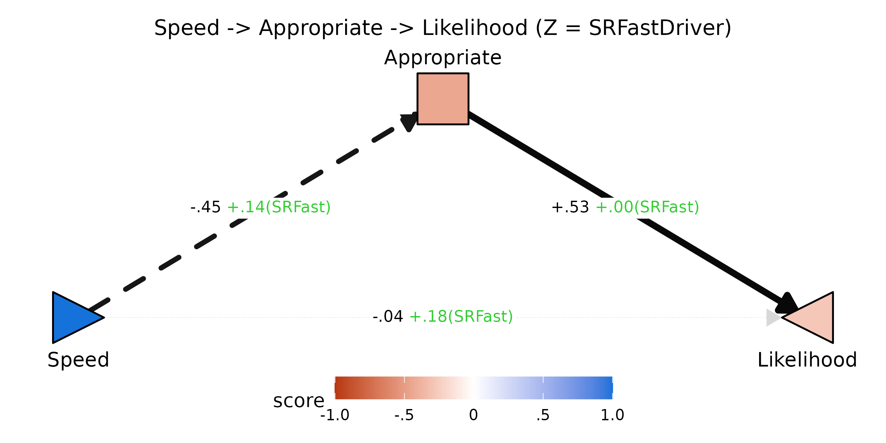

Reading the diagram: a one-unit increase in `Speed` lowers `Appropriate`
by .45 *on average* (dashed edge, negative), but among fast drivers
(high `SRFast`) that drop is dampened by +.14 — they perceive faster
driving as less of an appropriateness violation. `Appropriate` strongly
drives `Likelihood` (+.53, solid) and that valuation is *not* moderated
by `SRFast` (≈ +.00). The residual `FZ[X,Y]` direct path (+.18) reflects
the joint contribution of the seven other mediators not shown here. The
Y node renders in the red half of the gradient because the total
predicted Y at `Speed = 1` is negative — speeding produces a
net-negative expected likelihood when only `Appropriate` mediates.

**Full multi-mediator fan view** — pass no `mediator` argument and all
available mediators are arranged in a fan between X and Y:

``` r

plotPathXMY(dec,
            X_label = "Speed", Y_label = "Likelihood",
            Z_label = "SRFast",
            X_shape = "rtTri",
            title = "Full X-M-Y field for speeding decisions")
```

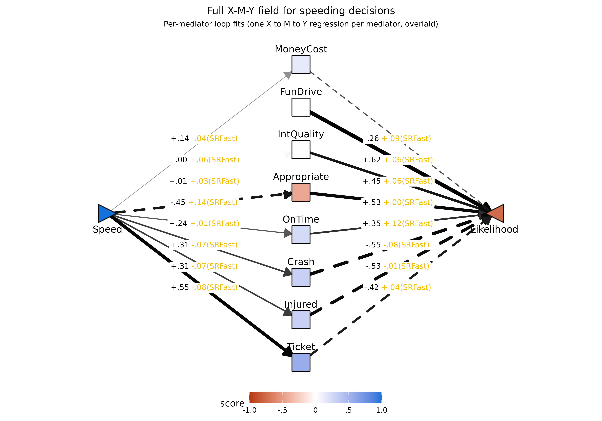

The fan diagram is a **summary overlay**, not a single fit. The mediator
arms are read off the per-mediator *loop* fits — one X to M to Y model
per mediator — so each `Speed -> M_k` and `M_k -> Likelihood` arm is
interpretable on its own without worrying about how the other mediators
are competing for variance. Because no single direct path would be
coherent in such an overlay, **no direct X to Y arrow is drawn here**;
the residual direct path of the joint simultaneous fit lives instead in
the [joint-fit field
section](#joint-fit-field-how-the-full-mediator-set-carries-the-total)
in the normative-model block above.

The mediator column reveals which expectations move with Speed: `Ticket`
(+.55) and `Appropriate` (-.45) are the strongest in opposite
directions; `FunDrive` and `IntQuality` are essentially unaffected by
Speed (near-white). The right column of edges shows the valuation
weights (`F1[M,Y]`). Edge thickness in the fan diagnoses where the
indirect-effect mass concentrates.

#### Joint multi-mediator fit: residual direct path and stability

The same
[`pathXMY()`](https://dustin-wood.github.io/funfield/reference/pathXMY.md)
call that produced the loop coefficients also returns simultaneous-fit
parameters in its joint-fit table (`tidy_joint`). The most useful of
these are the residual direct path and its Z-moderation:

``` r

joint_yx <- subset(mod_p$tidy_joint, param %in% c("f1_XY_joint","fZ_XY_joint"))
joint_yx$mediator <- NULL
kable0(pathXMY_to_F(joint_yx), digits = 3,
  caption = "Residual direct path X -> Y from the joint fit of all 8 mediators (Z = SRFastDriver)")
```

|     | param     |   est |   se |     z | pvalue | ci.lower | ci.upper |
|:----|:----------|------:|-----:|------:|-------:|---------:|---------:|
| 33  | F1\[X,Y\] | -.046 | .058 | -.788 |   .430 |    -.159 |     .068 |
| 34  | FZ\[X,Y\] |  .155 | .052 | 2.998 |   .003 |     .054 |     .257 |

Residual direct path X -\> Y from the joint fit of all 8 mediators (Z =
SRFastDriver) {.table}

The joint `F1[X,Y]` is the residual `Speed -> Likelihood` path
controlling for all eight expected outcomes simultaneously. If the
measured mediator set has captured the within-person mechanisms, it
should be near zero. The joint `FZ[X,Y]` is the analogous diagnostic for
moderation: an `SRFastDriver` effect on `Speed -> Likelihood` that does
*not* run through any of the eight outcomes shows up here. The
decomposition table earlier in this section flagged the residual
`FZ[X,Y]` as substantial (≈ .18-.24) for every single-mediator fit; the
joint result tells us whether the mediator set collectively absorbs that
moderation.

**Why prefer loop coefficients for per-mediator inference.** The joint
fit also returns joint `F1[M,Y]` and `FZ[M,Y]` rows. When mediators are
numerous and correlated — as the eight expected outcomes here certainly
are — the M-by-Z product terms used to estimate the joint `FZ[M,Y]` are
highly collinear with each other, which inflates the standard errors
substantially compared to the single-mediator loop fit (Wood, Adanu, &
Harms, 2025). The loop estimates are not contaminated by this
multicollinearity because each loop fit estimates only one mediator’s
`FZ[M,Y]` at a time. The asymmetry can be made explicit:

``` r

loop <- subset(mod_p$tidy_loop,
               param == "fZ_MY" & !is.na(mediator))[, c("mediator","est","se")]
join <- subset(mod_p$tidy_joint,
               param == "fZ_MY_joint")[, c("mediator","est","se")]
names(loop)[2:3] <- c("loop_est","loop_se")
names(join)[2:3] <- c("joint_est","joint_se")
cmp <- merge(loop, join, by = "mediator")
cmp$se_inflation <- cmp$joint_se / cmp$loop_se
kable0(cmp, digits = 3,
  caption = "FZ[M,Y] (valuation moderation) per mediator: loop vs joint, with SE inflation factor")
```

| mediator    | loop_est | loop_se | joint_est | joint_se | se_inflation |
|:------------|---------:|--------:|----------:|---------:|-------------:|
| Appropriate |     .003 |    .069 |     -.025 |     .065 |         .941 |
| Crash       |    -.079 |    .065 |     -.115 |     .104 |        1.610 |
| FunDrive    |     .064 |    .061 |      .104 |     .086 |        1.406 |
| Injured     |    -.007 |    .097 |      .050 |     .114 |        1.182 |
| IntQuality  |     .062 |    .077 |      .082 |     .079 |        1.032 |
| MoneyCost   |     .094 |    .090 |      .058 |     .072 |         .797 |
| OnTime      |     .115 |    .072 |      .106 |     .074 |        1.034 |
| Ticket      |     .039 |    .058 |     -.067 |     .060 |        1.041 |

FZ\[M,Y\] (valuation moderation) per mediator: loop vs joint, with SE
inflation factor {.table}

Joint SEs are inflated compared to the loop SEs (see the `se_inflation`
column), and the joint point estimates jitter substantially across
mediators when the mediator set is large and correlated. For inference
about *which* mediators carry the valuation-route moderation, the loop
coefficient is the right tool. The joint fit is best treated as a
system-level diagnostic — most useful for the joint `F1[X,Y]` /
`FZ[X,Y]` (which are stable, because they estimate a single residual
path), less useful for the per-mediator joint coefficients.

> Wood, D., Adanu, E. K., & Harms, P. D. (2025). Expectancy x value
> models of the relations between demographic, psychological, and
> situational factors and speeding behavior. *Journal of Safety
> Research*, **93**, 135-147. <doi:10.1016/j.jsr.2025.02.012>

#### Two-panel low-Z vs high-Z view

[`plotPathXMY_ZLH()`](https://dustin-wood.github.io/funfield/reference/plotPathXMY_ZLH.md)
draws the field at a low and high value of `Z` side-by-side, with
coefficients collapsed to their effective value at that `Z`. This makes
the moderation visually concrete: edge widths thin out, node colors
fade, and the implied total effect on `Y` shifts between panels.

``` r

plotPathXMY_ZLH(dec,
                X_label = "Speed", Y_label = "Likelihood",
                Z_label = "SRFast",
                X_shape = "rtTri",
                Z_levels = c(-1, 1))
```

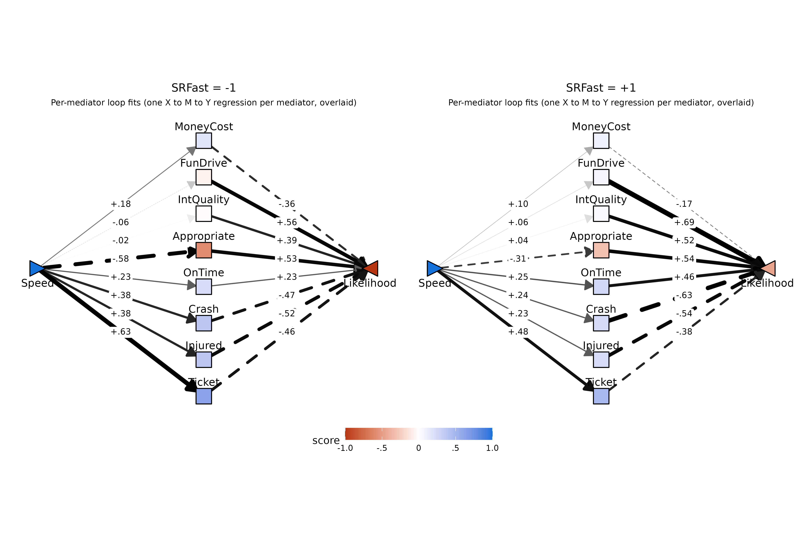

At `SRFast = -1` (low fast-driver tendency) the expected costs of
speeding are maximal: large red `Appropriate` node, thick negative edges
from `Crash`/`Injured`/`Ticket`, and the `Likelihood` triangle glows
deep red — the field predicts a substantial *decrease* in action
likelihood as `Speed` rises.

At `SRFast = +1` the same field has visibly attenuated: every cost
mediator’s Speed-loading shrinks (smaller numbers, thinner edges), the
`Appropriate` node lightens, and the `Likelihood` triangle fades — the
predicted decrease is much smaller. Self-reported fast drivers expect
speeding to be less costly across the board, and the field-level summary
captures all of those shifts at once.

#### Toggleable Z-scrubbing widget

The side-by-side panels make the contrast easy to compare, but
overlaying them in place and toggling makes the moderation feel even
sharper — you can watch the edge thicknesses and node colors swap as you
click forward / back.
[`plotPathXMY_widget()`](https://dustin-wood.github.io/funfield/reference/plotPathXMY_widget.md)
renders one frame per Z value and embeds them in a self-contained HTML
widget with Back / Forward buttons.

``` r

plotPathXMY_widget(dec,
                   X_label = "Speed", Y_label = "Likelihood",
                   Z_label = "SRFast",
                   X_shape = "rtTri",
                   format  = "svg")
```

![SRFast =
-1](data:image/svg+xml;base64,PD94bWwgdmVyc2lvbj0nMS4wJyBlbmNvZGluZz0nVVRGLTgnID8+CjxzdmcgeG1sbnM9J2h0dHA6Ly93d3cudzMub3JnLzIwMDAvc3ZnJyB4bWxuczp4bGluaz0naHR0cDovL3d3dy53My5vcmcvMTk5OS94bGluaycgd2lkdGg9JzY0OC4wMHB0JyBoZWlnaHQ9JzUwNC4wMHB0JyB2aWV3Qm94PScwIDAgNjQ4LjAwIDUwNC4wMCc+CjxnIGNsYXNzPSdzdmdsaXRlJz4KPGRlZnM+CiAgPHN0eWxlIHR5cGU9J3RleHQvY3NzJz48IVtDREFUQVsKICAgIC5zdmdsaXRlIGxpbmUsIC5zdmdsaXRlIHBvbHlsaW5lLCAuc3ZnbGl0ZSBwb2x5Z29uLCAuc3ZnbGl0ZSBwYXRoLCAuc3ZnbGl0ZSByZWN0LCAuc3ZnbGl0ZSBjaXJjbGUgewogICAgICBmaWxsOiBub25lOwogICAgICBzdHJva2U6ICMwMDAwMDA7CiAgICAgIHN0cm9rZS1saW5lY2FwOiByb3VuZDsKICAgICAgc3Ryb2tlLWxpbmVqb2luOiByb3VuZDsKICAgICAgc3Ryb2tlLW1pdGVybGltaXQ6IDEwLjAwOwogICAgfQogICAgLnN2Z2xpdGUgdGV4dCB7CiAgICAgIHdoaXRlLXNwYWNlOiBwcmU7CiAgICB9CiAgICAuc3ZnbGl0ZSBnLmdseXBoZ3JvdXAgcGF0aCB7CiAgICAgIGZpbGw6IGluaGVyaXQ7CiAgICAgIHN0cm9rZTogbm9uZTsKICAgIH0KICBdXT48L3N0eWxlPgo8L2RlZnM+CjxyZWN0IHdpZHRoPScxMDAlJyBoZWlnaHQ9JzEwMCUnIHN0eWxlPSdzdHJva2U6IG5vbmU7IGZpbGw6ICNGRkZGRkY7Jy8+CjxkZWZzPgogIDxjbGlwUGF0aCBpZD0nY3BNQzR3TUh3Mk5EZ3VNREI4TUM0d01IdzFNRFF1TURBPSc+CiAgICA8cmVjdCB4PScwLjAwJyB5PScwLjAwJyB3aWR0aD0nNjQ4LjAwJyBoZWlnaHQ9JzUwNC4wMCcgLz4KICA8L2NsaXBQYXRoPgo8L2RlZnM+CjxnIGNsaXAtcGF0aD0ndXJsKCNjcE1DNHdNSHcyTkRndU1EQjhNQzR3TUh3MU1EUXVNREE9KSc+CjwvZz4KPGRlZnM+CiAgPGNsaXBQYXRoIGlkPSdjcE5EZ3VOemQ4TlRrNUxqSXpmREF1TURCOE5UQTBMakF3Jz4KICAgIDxyZWN0IHg9JzQ4Ljc3JyB5PScwLjAwJyB3aWR0aD0nNTUwLjQ2JyBoZWlnaHQ9JzUwNC4wMCcgLz4KICA8L2NsaXBQYXRoPgo8L2RlZnM+CjxnIGNsaXAtcGF0aD0ndXJsKCNjcE5EZ3VOemQ4TlRrNUxqSXpmREF1TURCOE5UQTBMakF3KSc+CjxyZWN0IHg9JzQ4Ljc3JyB5PSctMC4wMDAwMDAwMDAwMDAxMScgd2lkdGg9JzU1MC40NicgaGVpZ2h0PSc1MDQuMDAnIHN0eWxlPSdzdHJva2Utd2lkdGg6IDAuMDA7IHN0cm9rZTogbm9uZTsnIC8+CjwvZz4KPGcgY2xpcC1wYXRoPSd1cmwoI2NwTUM0d01IdzJORGd1TURCOE1DNHdNSHcxTURRdU1EQT0pJz4KPGxpbmUgeDE9Jzk2LjEzJyB5MT0nMjUyLjAzJyB4Mj0nMzEzLjE3JyB5Mj0nODQuOTEnIHN0eWxlPSdzdHJva2Utd2lkdGg6IDAuOTA7IHN0cm9rZTogIzc3Nzc3NzsnIC8+Cjxwb2x5Z29uIHBvaW50cz0nMzA5LjMzLDk0LjIzIDMxMy4xNyw4NC45MSAzMDMuMTgsODYuMjQgJyBzdHlsZT0nc3Ryb2tlLXdpZHRoOiAwLjkwOyBzdHJva2U6ICM3Nzc3Nzc7IGZpbGw6ICM3Nzc3Nzc7JyAvPgo8bGluZSB4MT0nMzM0LjgzJyB5MT0nODQuOTEnIHgyPSc1NTEuODcnIHkyPScyNTIuMDMnIHN0eWxlPSdzdHJva2Utd2lkdGg6IDIuMTY7IHN0cm9rZTogIzJDMkMyQzsgc3Ryb2tlLWRhc2hhcnJheTogMTEuNTMsMTEuNTM7JyAvPgo8cG9seWdvbiBwb2ludHM9JzU0MS44OCwyNTAuNjkgNTUxLjg3LDI1Mi4wMyA1NDguMDMsMjQyLjcxICcgc3R5bGU9J3N0cm9rZS13aWR0aDogMi4xNjsgc3Ryb2tlOiAjMkMyQzJDOyBzdHJva2UtZGFzaGFycmF5OiAxMS41MywxMS41MzsgZmlsbDogIzJDMkMyQzsnIC8+CjxsaW5lIHgxPSc5Ny4wMycgeTE9JzI1Mi40NycgeDI9JzMxMy4xNycgeTI9JzEzMy42MCcgc3R5bGU9J3N0cm9rZS13aWR0aDogMC4yOTsgc3Ryb2tlOiAjQzdDN0M3OyBzdHJva2UtZGFzaGFycmF5OiA0LjAwLDQuMDA7JyAvPgo8cG9seWdvbiBwb2ludHM9JzMwNy45NSwxNDIuMjIgMzEzLjE3LDEzMy42MCAzMDMuMDksMTMzLjM5ICcgc3R5bGU9J3N0cm9rZS13aWR0aDogMC4yOTsgc3Ryb2tlOiAjQzdDN0M3OyBzdHJva2UtZGFzaGFycmF5OiA0LjAwLDQuMDA7IGZpbGw6ICNDN0M3Qzc7JyAvPgo8bGluZSB4MT0nMzM0LjgzJyB5MT0nMTMzLjYwJyB4Mj0nNTUwLjk3JyB5Mj0nMjUyLjQ3JyBzdHlsZT0nc3Ryb2tlLXdpZHRoOiAzLjk3OyBzdHJva2U6ICMwNzA3MDc7JyAvPgo8cG9seWdvbiBwb2ludHM9JzU0MC45MCwyNTIuNjggNTUwLjk3LDI1Mi40NyA1NDUuNzUsMjQzLjg1ICcgc3R5bGU9J3N0cm9rZS13aWR0aDogMy45Nzsgc3Ryb2tlOiAjMDcwNzA3OyBmaWxsOiAjMDcwNzA3OycgLz4KPGxpbmUgeDE9Jzk4LjM5JyB5MT0nMjUzLjE2JyB4Mj0nMzEzLjE3JyB5Mj0nMTgyLjI4JyBzdHlsZT0nc3Ryb2tlLXdpZHRoOiAwLjE0OyBzdHJva2U6ICNFQ0VDRUM7IHN0cm9rZS1kYXNoYXJyYXk6IDQuMDAsNC4wMDsnIC8+Cjxwb2x5Z29uIHBvaW50cz0nMzA2LjQ2LDE4OS44MCAzMTMuMTcsMTgyLjI4IDMwMy4zMCwxODAuMjMgJyBzdHlsZT0nc3Ryb2tlLXdpZHRoOiAwLjE0OyBzdHJva2U6ICNFQ0VDRUM7IHN0cm9rZS1kYXNoYXJyYXk6IDQuMDAsNC4wMDsgZmlsbDogI0VDRUNFQzsnIC8+CjxsaW5lIHgxPSczMzQuODMnIHkxPScxODIuMjgnIHgyPSc1NDkuNjEnIHkyPScyNTMuMTYnIHN0eWxlPSdzdHJva2Utd2lkdGg6IDIuNDc7IHN0cm9rZTogIzIyMjIyMjsnIC8+Cjxwb2x5Z29uIHBvaW50cz0nNTM5Ljc0LDI1NS4yMSA1NDkuNjEsMjUzLjE2IDU0Mi45MCwyNDUuNjQgJyBzdHlsZT0nc3Ryb2tlLXdpZHRoOiAyLjQ3OyBzdHJva2U6ICMyMjIyMjI7IGZpbGw6ICMyMjIyMjI7JyAvPgo8bGluZSB4MT0nMTAwLjc1JyB5MT0nMjU0LjMzJyB4Mj0nMzEzLjE3JyB5Mj0nMjMwLjk3JyBzdHlsZT0nc3Ryb2tlLXdpZHRoOiA0LjIzOyBzdHJva2U6ICMwNTA1MDU7IHN0cm9rZS1kYXNoYXJyYXk6IDIyLjU3LDIyLjU3OycgLz4KPHBvbHlnb24gcG9pbnRzPSczMDUuMDQsMjM2LjkzIDMxMy4xNywyMzAuOTcgMzAzLjk0LDIyNi45MSAnIHN0eWxlPSdzdHJva2Utd2lkdGg6IDQuMjM7IHN0cm9rZTogIzA1MDUwNTsgc3Ryb2tlLWRhc2hhcnJheTogMjIuNTcsMjIuNTc7IGZpbGw6ICMwNTA1MDU7JyAvPgo8bGluZSB4MT0nMzM0LjgzJyB5MT0nMjMwLjk3JyB4Mj0nNTQ3LjI1JyB5Mj0nMjU0LjMzJyBzdHlsZT0nc3Ryb2tlLXdpZHRoOiAzLjcyOyBzdHJva2U6ICMwQTBBMEE7JyAvPgo8cG9seWdvbiBwb2ludHM9JzUzOC4wMiwyNTguMzkgNTQ3LjI1LDI1NC4zMyA1MzkuMTMsMjQ4LjM3ICcgc3R5bGU9J3N0cm9rZS13aWR0aDogMy43Mjsgc3Ryb2tlOiAjMEEwQTBBOyBmaWxsOiAjMEEwQTBBOycgLz4KPGxpbmUgeDE9JzEwMC43NScgeTE9JzI1Ni4yOScgeDI9JzMxMy4xNycgeTI9JzI3OS42NScgc3R5bGU9J3N0cm9rZS13aWR0aDogMS4yMjsgc3Ryb2tlOiAjNUQ1RDVEOycgLz4KPHBvbHlnb24gcG9pbnRzPSczMDMuOTQsMjgzLjcxIDMxMy4xNywyNzkuNjUgMzA1LjA0LDI3My42OSAnIHN0eWxlPSdzdHJva2Utd2lkdGg6IDEuMjI7IHN0cm9rZTogIzVENUQ1RDsgZmlsbDogIzVENUQ1RDsnIC8+CjxsaW5lIHgxPSczMzQuODMnIHkxPScyNzkuNjUnIHgyPSc1NDcuMjUnIHkyPScyNTYuMjknIHN0eWxlPSdzdHJva2Utd2lkdGg6IDEuMjQ7IHN0cm9rZTogIzVCNUI1QjsnIC8+Cjxwb2x5Z29uIHBvaW50cz0nNTM5LjEzLDI2Mi4yNSA1NDcuMjUsMjU2LjI5IDUzOC4wMiwyNTIuMjMgJyBzdHlsZT0nc3Ryb2tlLXdpZHRoOiAxLjI0OyBzdHJva2U6ICM1QjVCNUI7IGZpbGw6ICM1QjVCNUI7JyAvPgo8bGluZSB4MT0nOTguMzknIHkxPScyNTcuNDYnIHgyPSczMTMuMTcnIHkyPSczMjguMzQnIHN0eWxlPSdzdHJva2Utd2lkdGg6IDIuMzQ7IHN0cm9rZTogIzI2MjYyNjsnIC8+Cjxwb2x5Z29uIHBvaW50cz0nMzAzLjMwLDMzMC4zOSAzMTMuMTcsMzI4LjM0IDMwNi40NiwzMjAuODIgJyBzdHlsZT0nc3Ryb2tlLXdpZHRoOiAyLjM0OyBzdHJva2U6ICMyNjI2MjY7IGZpbGw6ICMyNjI2MjY7JyAvPgo8bGluZSB4MT0nMzM0LjgzJyB5MT0nMzI4LjM0JyB4Mj0nNTQ5LjYxJyB5Mj0nMjU3LjQ2JyBzdHlsZT0nc3Ryb2tlLXdpZHRoOiAzLjE0OyBzdHJva2U6ICMxMjEyMTI7IHN0cm9rZS1kYXNoYXJyYXk6IDE2Ljc1LDE2Ljc1OycgLz4KPHBvbHlnb24gcG9pbnRzPSc1NDIuOTAsMjY0Ljk5IDU0OS42MSwyNTcuNDYgNTM5Ljc0LDI1NS40MSAnIHN0eWxlPSdzdHJva2Utd2lkdGg6IDMuMTQ7IHN0cm9rZTogIzEyMTIxMjsgc3Ryb2tlLWRhc2hhcnJheTogMTYuNzUsMTYuNzU7IGZpbGw6ICMxMjEyMTI7JyAvPgo8bGluZSB4MT0nOTcuMDMnIHkxPScyNTguMTUnIHgyPSczMTMuMTcnIHkyPSczNzcuMDMnIHN0eWxlPSdzdHJva2Utd2lkdGg6IDIuMzU7IHN0cm9rZTogIzI1MjUyNTsnIC8+Cjxwb2x5Z29uIHBvaW50cz0nMzAzLjA5LDM3Ny4yNCAzMTMuMTcsMzc3LjAzIDMwNy45NSwzNjguNDAgJyBzdHlsZT0nc3Ryb2tlLXdpZHRoOiAyLjM1OyBzdHJva2U6ICMyNTI1MjU7IGZpbGw6ICMyNTI1MjU7JyAvPgo8bGluZSB4MT0nMzM0LjgzJyB5MT0nMzc3LjAzJyB4Mj0nNTUwLjk3JyB5Mj0nMjU4LjE1JyBzdHlsZT0nc3Ryb2tlLXdpZHRoOiAzLjY0OyBzdHJva2U6ICMwQjBCMEI7IHN0cm9rZS1kYXNoYXJyYXk6IDE5LjQwLDE5LjQwOycgLz4KPHBvbHlnb24gcG9pbnRzPSc1NDUuNzUsMjY2Ljc3IDU1MC45NywyNTguMTUgNTQwLjkwLDI1Ny45NCAnIHN0eWxlPSdzdHJva2Utd2lkdGg6IDMuNjQ7IHN0cm9rZTogIzBCMEIwQjsgc3Ryb2tlLWRhc2hhcnJheTogMTkuNDAsMTkuNDA7IGZpbGw6ICMwQjBCMEI7JyAvPgo8bGluZSB4MT0nOTYuMTMnIHkxPScyNTguNjAnIHgyPSczMTMuMTcnIHkyPSc0MjUuNzEnIHN0eWxlPSdzdHJva2Utd2lkdGg6IDQuNzM7IHN0cm9rZTogIzAyMDIwMjsnIC8+Cjxwb2x5Z29uIHBvaW50cz0nMzAzLjE4LDQyNC4zOCAzMTMuMTcsNDI1LjcxIDMwOS4zMyw0MTYuMzkgJyBzdHlsZT0nc3Ryb2tlLXdpZHRoOiA0LjczOyBzdHJva2U6ICMwMjAyMDI7IGZpbGw6ICMwMjAyMDI7JyAvPgo8bGluZSB4MT0nMzM0LjgzJyB5MT0nNDI1LjcxJyB4Mj0nNTUxLjg3JyB5Mj0nMjU4LjYwJyBzdHlsZT0nc3Ryb2tlLXdpZHRoOiAzLjA0OyBzdHJva2U6ICMxNDE0MTQ7IHN0cm9rZS1kYXNoYXJyYXk6IDE2LjIxLDE2LjIxOycgLz4KPHBvbHlnb24gcG9pbnRzPSc1NDguMDMsMjY3LjkxIDU1MS44NywyNTguNjAgNTQxLjg4LDI1OS45MyAnIHN0eWxlPSdzdHJva2Utd2lkdGg6IDMuMDQ7IHN0cm9rZTogIzE0MTQxNDsgc3Ryb2tlLWRhc2hhcnJheTogMTYuMjEsMTYuMjE7IGZpbGw6ICMxNDE0MTQ7JyAvPgo8cG9seWdvbiBwb2ludHM9JzE5OS4zOCwxNzEuNzQgMjE2LjQ5LDE3MS43NCAyMTYuNDAsMTcxLjc0IDIxNi43NSwxNzEuNzIgMjE3LjA5LDE3MS42NSAyMTcuNDEsMTcxLjUzIDIxNy43MSwxNzEuMzYgMjE3Ljk4LDE3MS4xNCAyMTguMjEsMTcwLjg4IDIxOC40MCwxNzAuNTggMjE4LjUzLDE3MC4yNiAyMTguNjIsMTY5LjkzIDIxOC42NSwxNjkuNTggMjE4LjY1LDE2OS41OCAyMTguNjUsMTYyLjMwIDIxOC42NSwxNjIuMzAgMjE4LjYyLDE2MS45NSAyMTguNTMsMTYxLjYyIDIxOC40MCwxNjEuMzAgMjE4LjIxLDE2MS4wMCAyMTcuOTgsMTYwLjc0IDIxNy43MSwxNjAuNTIgMjE3LjQxLDE2MC4zNSAyMTcuMDksMTYwLjIzIDIxNi43NSwxNjAuMTYgMjE2LjQ5LDE2MC4xNCAxOTkuMzgsMTYwLjE0IDE5OS42NCwxNjAuMTYgMTk5LjI5LDE2MC4xNCAxOTguOTUsMTYwLjE4IDE5OC42MiwxNjAuMjggMTk4LjMwLDE2MC40MyAxOTguMDIsMTYwLjYzIDE5Ny43NiwxNjAuODcgMTk3LjU2LDE2MS4xNSAxOTcuMzksMTYxLjQ1IDE5Ny4yOCwxNjEuNzggMTk3LjIzLDE2Mi4xMyAxOTcuMjIsMTYyLjMwIDE5Ny4yMiwxNjkuNTggMTk3LjIzLDE2OS40MSAxOTcuMjMsMTY5Ljc1IDE5Ny4yOCwxNzAuMTAgMTk3LjM5LDE3MC40MyAxOTcuNTYsMTcwLjczIDE5Ny43NiwxNzEuMDEgMTk4LjAyLDE3MS4yNSAxOTguMzAsMTcxLjQ1IDE5OC42MiwxNzEuNjAgMTk4Ljk1LDE3MS43MCAxOTkuMjksMTcxLjc0ICcgc3R5bGU9J3N0cm9rZS13aWR0aDogMC4wMDsgZmlsbDogI0ZGRkZGRjsnIC8+Cjx0ZXh0IHg9JzE5OC45NScgeT0nMTY4LjEzJyBzdHlsZT0nZm9udC1zaXplOiA5LjEwcHg7IGZvbnQtZmFtaWx5OiAiTGliZXJhdGlvbiBTYW5zIjsnIHRleHRMZW5ndGg9JzE3Ljk3cHgnIGxlbmd0aEFkanVzdD0nc3BhY2luZ0FuZEdseXBocyc+Ky4xODwvdGV4dD4KPHBvbHlnb24gcG9pbnRzPSc0MzIuNjUsMTcxLjc0IDQ0Ny40OCwxNzEuNzQgNDQ3LjM5LDE3MS43NCA0NDcuNzQsMTcxLjcyIDQ0OC4wOCwxNzEuNjUgNDQ4LjQwLDE3MS41MyA0NDguNzAsMTcxLjM2IDQ0OC45NywxNzEuMTQgNDQ5LjIwLDE3MC44OCA0NDkuMzksMTcwLjU4IDQ0OS41MywxNzAuMjYgNDQ5LjYxLDE2OS45MyA0NDkuNjQsMTY5LjU4IDQ0OS42NCwxNjkuNTggNDQ5LjY0LDE2Mi4zMCA0NDkuNjQsMTYyLjMwIDQ0OS42MSwxNjEuOTUgNDQ5LjUzLDE2MS42MiA0NDkuMzksMTYxLjMwIDQ0OS4yMCwxNjEuMDAgNDQ4Ljk3LDE2MC43NCA0NDguNzAsMTYwLjUyIDQ0OC40MCwxNjAuMzUgNDQ4LjA4LDE2MC4yMyA0NDcuNzQsMTYwLjE2IDQ0Ny40OCwxNjAuMTQgNDMyLjY1LDE2MC4xNCA0MzIuOTEsMTYwLjE2IDQzMi41NywxNjAuMTQgNDMyLjIyLDE2MC4xOCA0MzEuODksMTYwLjI4IDQzMS41NywxNjAuNDMgNDMxLjI5LDE2MC42MyA0MzEuMDQsMTYwLjg3IDQzMC44MywxNjEuMTUgNDMwLjY3LDE2MS40NSA0MzAuNTYsMTYxLjc4IDQzMC41MCwxNjIuMTMgNDMwLjQ5LDE2Mi4zMCA0MzAuNDksMTY5LjU4IDQzMC41MCwxNjkuNDEgNDMwLjUwLDE2OS43NSA0MzAuNTYsMTcwLjEwIDQzMC42NywxNzAuNDMgNDMwLjgzLDE3MC43MyA0MzEuMDQsMTcxLjAxIDQzMS4yOSwxNzEuMjUgNDMxLjU3LDE3MS40NSA0MzEuODksMTcxLjYwIDQzMi4yMiwxNzEuNzAgNDMyLjU3LDE3MS43NCAnIHN0eWxlPSdzdHJva2Utd2lkdGg6IDAuMDA7IGZpbGw6ICNGRkZGRkY7JyAvPgo8dGV4dCB4PSc0MzIuMjInIHk9JzE2OC4xMycgc3R5bGU9J2ZvbnQtc2l6ZTogOS4xMHB4OyBmb250LWZhbWlseTogIkxpYmVyYXRpb24gU2FucyI7JyB0ZXh0TGVuZ3RoPScxNS42OXB4JyBsZW5ndGhBZGp1c3Q9J3NwYWNpbmdBbmRHbHlwaHMnPi0uMzY8L3RleHQ+Cjxwb2x5Z29uIHBvaW50cz0nMjAwLjUyLDE5Ny4yNyAyMTUuMzUsMTk3LjI3IDIxNS4yNiwxOTcuMjcgMjE1LjYxLDE5Ny4yNiAyMTUuOTUsMTk3LjE5IDIxNi4yNywxOTcuMDcgMjE2LjU3LDE5Ni44OSAyMTYuODQsMTk2LjY3IDIxNy4wNywxOTYuNDEgMjE3LjI2LDE5Ni4xMiAyMTcuMzksMTk1LjgwIDIxNy40OCwxOTUuNDYgMjE3LjUxLDE5NS4xMSAyMTcuNTEsMTk1LjExIDIxNy41MSwxODcuODQgMjE3LjUxLDE4Ny44NCAyMTcuNDgsMTg3LjQ5IDIxNy4zOSwxODcuMTUgMjE3LjI2LDE4Ni44MyAyMTcuMDcsMTg2LjU0IDIxNi44NCwxODYuMjggMjE2LjU3LDE4Ni4wNiAyMTYuMjcsMTg1Ljg4IDIxNS45NSwxODUuNzYgMjE1LjYxLDE4NS42OSAyMTUuMzUsMTg1LjY4IDIwMC41MiwxODUuNjggMjAwLjc4LDE4NS42OSAyMDAuNDQsMTg1LjY4IDIwMC4wOSwxODUuNzIgMTk5Ljc2LDE4NS44MiAxOTkuNDQsMTg1Ljk2IDE5OS4xNiwxODYuMTYgMTk4LjkxLDE4Ni40MCAxOTguNzAsMTg2LjY4IDE5OC41MywxODYuOTkgMTk4LjQyLDE4Ny4zMiAxOTguMzcsMTg3LjY2IDE5OC4zNiwxODcuODQgMTk4LjM2LDE5NS4xMSAxOTguMzcsMTk0Ljk0IDE5OC4zNywxOTUuMjkgMTk4LjQyLDE5NS42MyAxOTguNTMsMTk1Ljk2IDE5OC43MCwxOTYuMjcgMTk4LjkxLDE5Ni41NSAxOTkuMTYsMTk2Ljc5IDE5OS40NCwxOTYuOTkgMTk5Ljc2LDE5Ny4xMyAyMDAuMDksMTk3LjIzIDIwMC40NCwxOTcuMjcgJyBzdHlsZT0nc3Ryb2tlLXdpZHRoOiAwLjAwOyBmaWxsOiAjRkZGRkZGOycgLz4KPHRleHQgeD0nMjAwLjA5JyB5PScxOTMuNjYnIHN0eWxlPSdmb250LXNpemU6IDkuMTBweDsgZm9udC1mYW1pbHk6ICJMaWJlcmF0aW9uIFNhbnMiOycgdGV4dExlbmd0aD0nMTUuNjlweCcgbGVuZ3RoQWRqdXN0PSdzcGFjaW5nQW5kR2x5cGhzJz4tLjA2PC90ZXh0Pgo8cG9seWdvbiBwb2ludHM9JzQzMS41MSwxOTcuMjcgNDQ4LjYyLDE5Ny4yNyA0NDguNTMsMTk3LjI3IDQ0OC44OCwxOTcuMjYgNDQ5LjIyLDE5Ny4xOSA0NDkuNTQsMTk3LjA3IDQ0OS44NSwxOTYuODkgNDUwLjExLDE5Ni42NyA0NTAuMzUsMTk2LjQxIDQ1MC41MywxOTYuMTIgNDUwLjY3LDE5NS44MCA0NTAuNzUsMTk1LjQ2IDQ1MC43OCwxOTUuMTEgNDUwLjc4LDE5NS4xMSA0NTAuNzgsMTg3Ljg0IDQ1MC43OCwxODcuODQgNDUwLjc1LDE4Ny40OSA0NTAuNjcsMTg3LjE1IDQ1MC41MywxODYuODMgNDUwLjM1LDE4Ni41NCA0NTAuMTEsMTg2LjI4IDQ0OS44NSwxODYuMDYgNDQ5LjU0LDE4NS44OCA0NDkuMjIsMTg1Ljc2IDQ0OC44OCwxODUuNjkgNDQ4LjYyLDE4NS42OCA0MzEuNTEsMTg1LjY4IDQzMS43NywxODUuNjkgNDMxLjQzLDE4NS42OCA0MzEuMDgsMTg1LjcyIDQzMC43NSwxODUuODIgNDMwLjQzLDE4NS45NiA0MzAuMTUsMTg2LjE2IDQyOS45MCwxODYuNDAgNDI5LjY5LDE4Ni42OCA0MjkuNTMsMTg2Ljk5IDQyOS40MiwxODcuMzIgNDI5LjM2LDE4Ny42NiA0MjkuMzUsMTg3Ljg0IDQyOS4zNSwxOTUuMTEgNDI5LjM2LDE5NC45NCA0MjkuMzYsMTk1LjI5IDQyOS40MiwxOTUuNjMgNDI5LjUzLDE5NS45NiA0MjkuNjksMTk2LjI3IDQyOS45MCwxOTYuNTUgNDMwLjE1LDE5Ni43OSA0MzAuNDMsMTk2Ljk5IDQzMC43NSwxOTcuMTMgNDMxLjA4LDE5Ny4yMyA0MzEuNDMsMTk3LjI3ICcgc3R5bGU9J3N0cm9rZS13aWR0aDogMC4wMDsgZmlsbDogI0ZGRkZGRjsnIC8+Cjx0ZXh0IHg9JzQzMS4wOCcgeT0nMTkzLjY2JyBzdHlsZT0nZm9udC1zaXplOiA5LjEwcHg7IGZvbnQtZmFtaWx5OiAiTGliZXJhdGlvbiBTYW5zIjsnIHRleHRMZW5ndGg9JzE3Ljk3cHgnIGxlbmd0aEFkanVzdD0nc3BhY2luZ0FuZEdseXBocyc+Ky41NjwvdGV4dD4KPHBvbHlnb24gcG9pbnRzPScyMDAuNTIsMjIyLjgxIDIxNS4zNSwyMjIuODEgMjE1LjI2LDIyMi44MSAyMTUuNjEsMjIyLjc5IDIxNS45NSwyMjIuNzIgMjE2LjI3LDIyMi42MCAyMTYuNTcsMjIyLjQzIDIxNi44NCwyMjIuMjEgMjE3LjA3LDIyMS45NSAyMTcuMjYsMjIxLjY1IDIxNy4zOSwyMjEuMzMgMjE3LjQ4LDIyMS4wMCAyMTcuNTEsMjIwLjY1IDIxNy41MSwyMjAuNjUgMjE3LjUxLDIxMy4zNyAyMTcuNTEsMjEzLjM3IDIxNy40OCwyMTMuMDIgMjE3LjM5LDIxMi42OSAyMTcuMjYsMjEyLjM3IDIxNy4wNywyMTIuMDcgMjE2Ljg0LDIxMS44MSAyMTYuNTcsMjExLjU5IDIxNi4yNywyMTEuNDIgMjE1Ljk1LDIxMS4zMCAyMTUuNjEsMjExLjIzIDIxNS4zNSwyMTEuMjEgMjAwLjUyLDIxMS4yMSAyMDAuNzgsMjExLjIzIDIwMC40NCwyMTEuMjEgMjAwLjA5LDIxMS4yNSAxOTkuNzYsMjExLjM1IDE5OS40NCwyMTEuNTAgMTk5LjE2LDIxMS43MCAxOTguOTEsMjExLjk0IDE5OC43MCwyMTIuMjIgMTk4LjUzLDIxMi41MiAxOTguNDIsMjEyLjg1IDE5OC4zNywyMTMuMjAgMTk4LjM2LDIxMy4zNyAxOTguMzYsMjIwLjY1IDE5OC4zNywyMjAuNDggMTk4LjM3LDIyMC44MiAxOTguNDIsMjIxLjE3IDE5OC41MywyMjEuNTAgMTk4LjcwLDIyMS44MCAxOTguOTEsMjIyLjA4IDE5OS4xNiwyMjIuMzIgMTk5LjQ0LDIyMi41MiAxOTkuNzYsMjIyLjY3IDIwMC4wOSwyMjIuNzcgMjAwLjQ0LDIyMi44MSAnIHN0eWxlPSdzdHJva2Utd2lkdGg6IDAuMDA7IGZpbGw6ICNGRkZGRkY7JyAvPgo8dGV4dCB4PScyMDAuMDknIHk9JzIxOS4xOScgc3R5bGU9J2ZvbnQtc2l6ZTogOS4xMHB4OyBmb250LWZhbWlseTogIkxpYmVyYXRpb24gU2FucyI7JyB0ZXh0TGVuZ3RoPScxNS42OXB4JyBsZW5ndGhBZGp1c3Q9J3NwYWNpbmdBbmRHbHlwaHMnPi0uMDI8L3RleHQ+Cjxwb2x5Z29uIHBvaW50cz0nNDMxLjUxLDIyMi44MSA0NDguNjIsMjIyLjgxIDQ0OC41MywyMjIuODEgNDQ4Ljg4LDIyMi43OSA0NDkuMjIsMjIyLjcyIDQ0OS41NCwyMjIuNjAgNDQ5Ljg1LDIyMi40MyA0NTAuMTEsMjIyLjIxIDQ1MC4zNSwyMjEuOTUgNDUwLjUzLDIyMS42NSA0NTAuNjcsMjIxLjMzIDQ1MC43NSwyMjEuMDAgNDUwLjc4LDIyMC42NSA0NTAuNzgsMjIwLjY1IDQ1MC43OCwyMTMuMzcgNDUwLjc4LDIxMy4zNyA0NTAuNzUsMjEzLjAyIDQ1MC42NywyMTIuNjkgNDUwLjUzLDIxMi4zNyA0NTAuMzUsMjEyLjA3IDQ1MC4xMSwyMTEuODEgNDQ5Ljg1LDIxMS41OSA0NDkuNTQsMjExLjQyIDQ0OS4yMiwyMTEuMzAgNDQ4Ljg4LDIxMS4yMyA0NDguNjIsMjExLjIxIDQzMS41MSwyMTEuMjEgNDMxLjc3LDIxMS4yMyA0MzEuNDMsMjExLjIxIDQzMS4wOCwyMTEuMjUgNDMwLjc1LDIxMS4zNSA0MzAuNDMsMjExLjUwIDQzMC4xNSwyMTEuNzAgNDI5LjkwLDIxMS45NCA0MjkuNjksMjEyLjIyIDQyOS41MywyMTIuNTIgNDI5LjQyLDIxMi44NSA0MjkuMzYsMjEzLjIwIDQyOS4zNSwyMTMuMzcgNDI5LjM1LDIyMC42NSA0MjkuMzYsMjIwLjQ4IDQyOS4zNiwyMjAuODIgNDI5LjQyLDIyMS4xNyA0MjkuNTMsMjIxLjUwIDQyOS42OSwyMjEuODAgNDI5LjkwLDIyMi4wOCA0MzAuMTUsMjIyLjMyIDQzMC40MywyMjIuNTIgNDMwLjc1LDIyMi42NyA0MzEuMDgsMjIyLjc3IDQzMS40MywyMjIuODEgJyBzdHlsZT0nc3Ryb2tlLXdpZHRoOiAwLjAwOyBmaWxsOiAjRkZGRkZGOycgLz4KPHRleHQgeD0nNDMxLjA4JyB5PScyMTkuMTknIHN0eWxlPSdmb250LXNpemU6IDkuMTBweDsgZm9udC1mYW1pbHk6ICJMaWJlcmF0aW9uIFNhbnMiOycgdGV4dExlbmd0aD0nMTcuOTdweCcgbGVuZ3RoQWRqdXN0PSdzcGFjaW5nQW5kR2x5cGhzJz4rLjM5PC90ZXh0Pgo8cG9seWdvbiBwb2ludHM9JzIwMC41MiwyNDguMzQgMjE1LjM1LDI0OC4zNCAyMTUuMjYsMjQ4LjM0IDIxNS42MSwyNDguMzMgMjE1Ljk1LDI0OC4yNiAyMTYuMjcsMjQ4LjE0IDIxNi41NywyNDcuOTYgMjE2Ljg0LDI0Ny43NCAyMTcuMDcsMjQ3LjQ4IDIxNy4yNiwyNDcuMTkgMjE3LjM5LDI0Ni44NyAyMTcuNDgsMjQ2LjUzIDIxNy41MSwyNDYuMTggMjE3LjUxLDI0Ni4xOCAyMTcuNTEsMjM4LjkwIDIxNy41MSwyMzguOTAgMjE3LjQ4LDIzOC41NiAyMTcuMzksMjM4LjIyIDIxNy4yNiwyMzcuOTAgMjE3LjA3LDIzNy42MSAyMTYuODQsMjM3LjM1IDIxNi41NywyMzcuMTMgMjE2LjI3LDIzNi45NSAyMTUuOTUsMjM2LjgzIDIxNS42MSwyMzYuNzYgMjE1LjM1LDIzNi43NCAyMDAuNTIsMjM2Ljc0IDIwMC43OCwyMzYuNzYgMjAwLjQ0LDIzNi43NSAyMDAuMDksMjM2Ljc5IDE5OS43NiwyMzYuODggMTk5LjQ0LDIzNy4wMyAxOTkuMTYsMjM3LjIzIDE5OC45MSwyMzcuNDcgMTk4LjcwLDIzNy43NSAxOTguNTMsMjM4LjA2IDE5OC40MiwyMzguMzkgMTk4LjM3LDIzOC43MyAxOTguMzYsMjM4LjkwIDE5OC4zNiwyNDYuMTggMTk4LjM3LDI0Ni4wMSAxOTguMzcsMjQ2LjM2IDE5OC40MiwyNDYuNzAgMTk4LjUzLDI0Ny4wMyAxOTguNzAsMjQ3LjM0IDE5OC45MSwyNDcuNjIgMTk5LjE2LDI0Ny44NiAxOTkuNDQsMjQ4LjA1IDE5OS43NiwyNDguMjAgMjAwLjA5LDI0OC4zMCAyMDAuNDQsMjQ4LjM0ICcgc3R5bGU9J3N0cm9rZS13aWR0aDogMC4wMDsgZmlsbDogI0ZGRkZGRjsnIC8+Cjx0ZXh0IHg9JzIwMC4wOScgeT0nMjQ0LjczJyBzdHlsZT0nZm9udC1zaXplOiA5LjEwcHg7IGZvbnQtZmFtaWx5OiAiTGliZXJhdGlvbiBTYW5zIjsnIHRleHRMZW5ndGg9JzE1LjY5cHgnIGxlbmd0aEFkanVzdD0nc3BhY2luZ0FuZEdseXBocyc+LS41ODwvdGV4dD4KPHBvbHlnb24gcG9pbnRzPSc0MzEuNTEsMjQ4LjM0IDQ0OC42MiwyNDguMzQgNDQ4LjUzLDI0OC4zNCA0NDguODgsMjQ4LjMzIDQ0OS4yMiwyNDguMjYgNDQ5LjU0LDI0OC4xNCA0NDkuODUsMjQ3Ljk2IDQ1MC4xMSwyNDcuNzQgNDUwLjM1LDI0Ny40OCA0NTAuNTMsMjQ3LjE5IDQ1MC42NywyNDYuODcgNDUwLjc1LDI0Ni41MyA0NTAuNzgsMjQ2LjE4IDQ1MC43OCwyNDYuMTggNDUwLjc4LDIzOC45MCA0NTAuNzgsMjM4LjkwIDQ1MC43NSwyMzguNTYgNDUwLjY3LDIzOC4yMiA0NTAuNTMsMjM3LjkwIDQ1MC4zNSwyMzcuNjEgNDUwLjExLDIzNy4zNSA0NDkuODUsMjM3LjEzIDQ0OS41NCwyMzYuOTUgNDQ5LjIyLDIzNi44MyA0NDguODgsMjM2Ljc2IDQ0OC42MiwyMzYuNzQgNDMxLjUxLDIzNi43NCA0MzEuNzcsMjM2Ljc2IDQzMS40MywyMzYuNzUgNDMxLjA4LDIzNi43OSA0MzAuNzUsMjM2Ljg4IDQzMC40MywyMzcuMDMgNDMwLjE1LDIzNy4yMyA0MjkuOTAsMjM3LjQ3IDQyOS42OSwyMzcuNzUgNDI5LjUzLDIzOC4wNiA0MjkuNDIsMjM4LjM5IDQyOS4zNiwyMzguNzMgNDI5LjM1LDIzOC45MCA0MjkuMzUsMjQ2LjE4IDQyOS4zNiwyNDYuMDEgNDI5LjM2LDI0Ni4zNiA0MjkuNDIsMjQ2LjcwIDQyOS41MywyNDcuMDMgNDI5LjY5LDI0Ny4zNCA0MjkuOTAsMjQ3LjYyIDQzMC4xNSwyNDcuODYgNDMwLjQzLDI0OC4wNSA0MzAuNzUsMjQ4LjIwIDQzMS4wOCwyNDguMzAgNDMxLjQzLDI0OC4zNCAnIHN0eWxlPSdzdHJva2Utd2lkdGg6IDAuMDA7IGZpbGw6ICNGRkZGRkY7JyAvPgo8dGV4dCB4PSc0MzEuMDgnIHk9JzI0NC43Mycgc3R5bGU9J2ZvbnQtc2l6ZTogOS4xMHB4OyBmb250LWZhbWlseTogIkxpYmVyYXRpb24gU2FucyI7JyB0ZXh0TGVuZ3RoPScxNy45N3B4JyBsZW5ndGhBZGp1c3Q9J3NwYWNpbmdBbmRHbHlwaHMnPisuNTM8L3RleHQ+Cjxwb2x5Z29uIHBvaW50cz0nMTk5LjM4LDI3My44OCAyMTYuNDksMjczLjg4IDIxNi40MCwyNzMuODggMjE2Ljc1LDI3My44NiAyMTcuMDksMjczLjc5IDIxNy40MSwyNzMuNjcgMjE3LjcxLDI3My41MCAyMTcuOTgsMjczLjI4IDIxOC4yMSwyNzMuMDIgMjE4LjQwLDI3Mi43MiAyMTguNTMsMjcyLjQwIDIxOC42MiwyNzIuMDYgMjE4LjY1LDI3MS43MiAyMTguNjUsMjcxLjcyIDIxOC42NSwyNjQuNDQgMjE4LjY1LDI2NC40NCAyMTguNjIsMjY0LjA5IDIxOC41MywyNjMuNzYgMjE4LjQwLDI2My40NCAyMTguMjEsMjYzLjE0IDIxNy45OCwyNjIuODggMjE3LjcxLDI2Mi42NiAyMTcuNDEsMjYyLjQ5IDIxNy4wOSwyNjIuMzYgMjE2Ljc1LDI2Mi4yOSAyMTYuNDksMjYyLjI4IDE5OS4zOCwyNjIuMjggMTk5LjY0LDI2Mi4yOSAxOTkuMjksMjYyLjI4IDE5OC45NSwyNjIuMzIgMTk4LjYyLDI2Mi40MiAxOTguMzAsMjYyLjU3IDE5OC4wMiwyNjIuNzcgMTk3Ljc2LDI2My4wMSAxOTcuNTYsMjYzLjI4IDE5Ny4zOSwyNjMuNTkgMTk3LjI4LDI2My45MiAxOTcuMjMsMjY0LjI3IDE5Ny4yMiwyNjQuNDQgMTk3LjIyLDI3MS43MiAxOTcuMjMsMjcxLjU0IDE5Ny4yMywyNzEuODkgMTk3LjI4LDI3Mi4yNCAxOTcuMzksMjcyLjU2IDE5Ny41NiwyNzIuODcgMTk3Ljc2LDI3My4xNSAxOTguMDIsMjczLjM5IDE5OC4zMCwyNzMuNTkgMTk4LjYyLDI3My43NCAxOTguOTUsMjczLjgzIDE5OS4yOSwyNzMuODggJyBzdHlsZT0nc3Ryb2tlLXdpZHRoOiAwLjAwOyBmaWxsOiAjRkZGRkZGOycgLz4KPHRleHQgeD0nMTk4Ljk1JyB5PScyNzAuMjYnIHN0eWxlPSdmb250LXNpemU6IDkuMTBweDsgZm9udC1mYW1pbHk6ICJMaWJlcmF0aW9uIFNhbnMiOycgdGV4dExlbmd0aD0nMTcuOTdweCcgbGVuZ3RoQWRqdXN0PSdzcGFjaW5nQW5kR2x5cGhzJz4rLjIzPC90ZXh0Pgo8cG9seWdvbiBwb2ludHM9JzQzMS41MSwyNzMuODggNDQ4LjYyLDI3My44OCA0NDguNTMsMjczLjg4IDQ0OC44OCwyNzMuODYgNDQ5LjIyLDI3My43OSA0NDkuNTQsMjczLjY3IDQ0OS44NSwyNzMuNTAgNDUwLjExLDI3My4yOCA0NTAuMzUsMjczLjAyIDQ1MC41MywyNzIuNzIgNDUwLjY3LDI3Mi40MCA0NTAuNzUsMjcyLjA2IDQ1MC43OCwyNzEuNzIgNDUwLjc4LDI3MS43MiA0NTAuNzgsMjY0LjQ0IDQ1MC43OCwyNjQuNDQgNDUwLjc1LDI2NC4wOSA0NTAuNjcsMjYzLjc2IDQ1MC41MywyNjMuNDQgNDUwLjM1LDI2My4xNCA0NTAuMTEsMjYyLjg4IDQ0OS44NSwyNjIuNjYgNDQ5LjU0LDI2Mi40OSA0NDkuMjIsMjYyLjM2IDQ0OC44OCwyNjIuMjkgNDQ4LjYyLDI2Mi4yOCA0MzEuNTEsMjYyLjI4IDQzMS43NywyNjIuMjkgNDMxLjQzLDI2Mi4yOCA0MzEuMDgsMjYyLjMyIDQzMC43NSwyNjIuNDIgNDMwLjQzLDI2Mi41NyA0MzAuMTUsMjYyLjc3IDQyOS45MCwyNjMuMDEgNDI5LjY5LDI2My4yOCA0MjkuNTMsMjYzLjU5IDQyOS40MiwyNjMuOTIgNDI5LjM2LDI2NC4yNyA0MjkuMzUsMjY0LjQ0IDQyOS4zNSwyNzEuNzIgNDI5LjM2LDI3MS41NCA0MjkuMzYsMjcxLjg5IDQyOS40MiwyNzIuMjQgNDI5LjUzLDI3Mi41NiA0MjkuNjksMjcyLjg3IDQyOS45MCwyNzMuMTUgNDMwLjE1LDI3My4zOSA0MzAuNDMsMjczLjU5IDQzMC43NSwyNzMuNzQgNDMxLjA4LDI3My44MyA0MzEuNDMsMjczLjg4ICcgc3R5bGU9J3N0cm9rZS13aWR0aDogMC4wMDsgZmlsbDogI0ZGRkZGRjsnIC8+Cjx0ZXh0IHg9JzQzMS4wOCcgeT0nMjcwLjI2JyBzdHlsZT0nZm9udC1zaXplOiA5LjEwcHg7IGZvbnQtZmFtaWx5OiAiTGliZXJhdGlvbiBTYW5zIjsnIHRleHRMZW5ndGg9JzE3Ljk3cHgnIGxlbmd0aEFkanVzdD0nc3BhY2luZ0FuZEdseXBocyc+Ky4yMzwvdGV4dD4KPHBvbHlnb24gcG9pbnRzPScxOTkuMzgsMjk5LjQxIDIxNi40OSwyOTkuNDEgMjE2LjQwLDI5OS40MSAyMTYuNzUsMjk5LjQwIDIxNy4wOSwyOTkuMzMgMjE3LjQxLDI5OS4yMCAyMTcuNzEsMjk5LjAzIDIxNy45OCwyOTguODEgMjE4LjIxLDI5OC41NSAyMTguNDAsMjk4LjI2IDIxOC41MywyOTcuOTQgMjE4LjYyLDI5Ny42MCAyMTguNjUsMjk3LjI1IDIxOC42NSwyOTcuMjUgMjE4LjY1LDI4OS45NyAyMTguNjUsMjg5Ljk3IDIxOC42MiwyODkuNjMgMjE4LjUzLDI4OS4yOSAyMTguNDAsMjg4Ljk3IDIxOC4yMSwyODguNjggMjE3Ljk4LDI4OC40MiAyMTcuNzEsMjg4LjIwIDIxNy40MSwyODguMDIgMjE3LjA5LDI4Ny45MCAyMTYuNzUsMjg3LjgzIDIxNi40OSwyODcuODEgMTk5LjM4LDI4Ny44MSAxOTkuNjQsMjg3LjgzIDE5OS4yOSwyODcuODIgMTk4Ljk1LDI4Ny44NiAxOTguNjIsMjg3Ljk1IDE5OC4zMCwyODguMTAgMTk4LjAyLDI4OC4zMCAxOTcuNzYsMjg4LjU0IDE5Ny41NiwyODguODIgMTk3LjM5LDI4OS4xMyAxOTcuMjgsMjg5LjQ2IDE5Ny4yMywyODkuODAgMTk3LjIyLDI4OS45NyAxOTcuMjIsMjk3LjI1IDE5Ny4yMywyOTcuMDggMTk3LjIzLDI5Ny40MyAxOTcuMjgsMjk3Ljc3IDE5Ny4zOSwyOTguMTAgMTk3LjU2LDI5OC40MSAxOTcuNzYsMjk4LjY5IDE5OC4wMiwyOTguOTMgMTk4LjMwLDI5OS4xMiAxOTguNjIsMjk5LjI3IDE5OC45NSwyOTkuMzcgMTk5LjI5LDI5OS40MSAnIHN0eWxlPSdzdHJva2Utd2lkdGg6IDAuMDA7IGZpbGw6ICNGRkZGRkY7JyAvPgo8dGV4dCB4PScxOTguOTUnIHk9JzI5NS44MCcgc3R5bGU9J2ZvbnQtc2l6ZTogOS4xMHB4OyBmb250LWZhbWlseTogIkxpYmVyYXRpb24gU2FucyI7JyB0ZXh0TGVuZ3RoPScxNy45N3B4JyBsZW5ndGhBZGp1c3Q9J3NwYWNpbmdBbmRHbHlwaHMnPisuMzg8L3RleHQ+Cjxwb2x5Z29uIHBvaW50cz0nNDMyLjY1LDI5OS40MSA0NDcuNDgsMjk5LjQxIDQ0Ny4zOSwyOTkuNDEgNDQ3Ljc0LDI5OS40MCA0NDguMDgsMjk5LjMzIDQ0OC40MCwyOTkuMjAgNDQ4LjcwLDI5OS4wMyA0NDguOTcsMjk4LjgxIDQ0OS4yMCwyOTguNTUgNDQ5LjM5LDI5OC4yNiA0NDkuNTMsMjk3Ljk0IDQ0OS42MSwyOTcuNjAgNDQ5LjY0LDI5Ny4yNSA0NDkuNjQsMjk3LjI1IDQ0OS42NCwyODkuOTcgNDQ5LjY0LDI4OS45NyA0NDkuNjEsMjg5LjYzIDQ0OS41MywyODkuMjkgNDQ5LjM5LDI4OC45NyA0NDkuMjAsMjg4LjY4IDQ0OC45NywyODguNDIgNDQ4LjcwLDI4OC4yMCA0NDguNDAsMjg4LjAyIDQ0OC4wOCwyODcuOTAgNDQ3Ljc0LDI4Ny44MyA0NDcuNDgsMjg3LjgxIDQzMi42NSwyODcuODEgNDMyLjkxLDI4Ny44MyA0MzIuNTcsMjg3LjgyIDQzMi4yMiwyODcuODYgNDMxLjg5LDI4Ny45NSA0MzEuNTcsMjg4LjEwIDQzMS4yOSwyODguMzAgNDMxLjA0LDI4OC41NCA0MzAuODMsMjg4LjgyIDQzMC42NywyODkuMTMgNDMwLjU2LDI4OS40NiA0MzAuNTAsMjg5LjgwIDQzMC40OSwyODkuOTcgNDMwLjQ5LDI5Ny4yNSA0MzAuNTAsMjk3LjA4IDQzMC41MCwyOTcuNDMgNDMwLjU2LDI5Ny43NyA0MzAuNjcsMjk4LjEwIDQzMC44MywyOTguNDEgNDMxLjA0LDI5OC42OSA0MzEuMjksMjk4LjkzIDQzMS41NywyOTkuMTIgNDMxLjg5LDI5OS4yNyA0MzIuMjIsMjk5LjM3IDQzMi41NywyOTkuNDEgJyBzdHlsZT0nc3Ryb2tlLXdpZHRoOiAwLjAwOyBmaWxsOiAjRkZGRkZGOycgLz4KPHRleHQgeD0nNDMyLjIyJyB5PScyOTUuODAnIHN0eWxlPSdmb250LXNpemU6IDkuMTBweDsgZm9udC1mYW1pbHk6ICJMaWJlcmF0aW9uIFNhbnMiOycgdGV4dExlbmd0aD0nMTUuNjlweCcgbGVuZ3RoQWRqdXN0PSdzcGFjaW5nQW5kR2x5cGhzJz4tLjQ3PC90ZXh0Pgo8cG9seWdvbiBwb2ludHM9JzE5OS4zOCwzMjQuOTUgMjE2LjQ5LDMyNC45NSAyMTYuNDAsMzI0Ljk1IDIxNi43NSwzMjQuOTMgMjE3LjA5LDMyNC44NiAyMTcuNDEsMzI0Ljc0IDIxNy43MSwzMjQuNTcgMjE3Ljk4LDMyNC4zNSAyMTguMjEsMzI0LjA5IDIxOC40MCwzMjMuNzkgMjE4LjUzLDMyMy40NyAyMTguNjIsMzIzLjEzIDIxOC42NSwzMjIuNzkgMjE4LjY1LDMyMi43OSAyMTguNjUsMzE1LjUxIDIxOC42NSwzMTUuNTEgMjE4LjYyLDMxNS4xNiAyMTguNTMsMzE0LjgyIDIxOC40MCwzMTQuNTAgMjE4LjIxLDMxNC4yMSAyMTcuOTgsMzEzLjk1IDIxNy43MSwzMTMuNzMgMjE3LjQxLDMxMy41NiAyMTcuMDksMzEzLjQzIDIxNi43NSwzMTMuMzYgMjE2LjQ5LDMxMy4zNSAxOTkuMzgsMzEzLjM1IDE5OS42NCwzMTMuMzYgMTk5LjI5LDMxMy4zNSAxOTguOTUsMzEzLjM5IDE5OC42MiwzMTMuNDkgMTk4LjMwLDMxMy42NCAxOTguMDIsMzEzLjg0IDE5Ny43NiwzMTQuMDggMTk3LjU2LDMxNC4zNSAxOTcuMzksMzE0LjY2IDE5Ny4yOCwzMTQuOTkgMTk3LjIzLDMxNS4zMyAxOTcuMjIsMzE1LjUxIDE5Ny4yMiwzMjIuNzkgMTk3LjIzLDMyMi42MSAxOTcuMjMsMzIyLjk2IDE5Ny4yOCwzMjMuMzAgMTk3LjM5LDMyMy42MyAxOTcuNTYsMzIzLjk0IDE5Ny43NiwzMjQuMjIgMTk4LjAyLDMyNC40NiAxOTguMzAsMzI0LjY2IDE5OC42MiwzMjQuODEgMTk4Ljk1LDMyNC45MCAxOTkuMjksMzI0Ljk1ICcgc3R5bGU9J3N0cm9rZS13aWR0aDogMC4wMDsgZmlsbDogI0ZGRkZGRjsnIC8+Cjx0ZXh0IHg9JzE5OC45NScgeT0nMzIxLjMzJyBzdHlsZT0nZm9udC1zaXplOiA5LjEwcHg7IGZvbnQtZmFtaWx5OiAiTGliZXJhdGlvbiBTYW5zIjsnIHRleHRMZW5ndGg9JzE3Ljk3cHgnIGxlbmd0aEFkanVzdD0nc3BhY2luZ0FuZEdseXBocyc+Ky4zODwvdGV4dD4KPHBvbHlnb24gcG9pbnRzPSc0MzIuNjUsMzI0Ljk1IDQ0Ny40OCwzMjQuOTUgNDQ3LjM5LDMyNC45NSA0NDcuNzQsMzI0LjkzIDQ0OC4wOCwzMjQuODYgNDQ4LjQwLDMyNC43NCA0NDguNzAsMzI0LjU3IDQ0OC45NywzMjQuMzUgNDQ5LjIwLDMyNC4wOSA0NDkuMzksMzIzLjc5IDQ0OS41MywzMjMuNDcgNDQ5LjYxLDMyMy4xMyA0NDkuNjQsMzIyLjc5IDQ0OS42NCwzMjIuNzkgNDQ5LjY0LDMxNS41MSA0NDkuNjQsMzE1LjUxIDQ0OS42MSwzMTUuMTYgNDQ5LjUzLDMxNC44MiA0NDkuMzksMzE0LjUwIDQ0OS4yMCwzMTQuMjEgNDQ4Ljk3LDMxMy45NSA0NDguNzAsMzEzLjczIDQ0OC40MCwzMTMuNTYgNDQ4LjA4LDMxMy40MyA0NDcuNzQsMzEzLjM2IDQ0Ny40OCwzMTMuMzUgNDMyLjY1LDMxMy4zNSA0MzIuOTEsMzEzLjM2IDQzMi41NywzMTMuMzUgNDMyLjIyLDMxMy4zOSA0MzEuODksMzEzLjQ5IDQzMS41NywzMTMuNjQgNDMxLjI5LDMxMy44NCA0MzEuMDQsMzE0LjA4IDQzMC44MywzMTQuMzUgNDMwLjY3LDMxNC42NiA0MzAuNTYsMzE0Ljk5IDQzMC41MCwzMTUuMzMgNDMwLjQ5LDMxNS41MSA0MzAuNDksMzIyLjc5IDQzMC41MCwzMjIuNjEgNDMwLjUwLDMyMi45NiA0MzAuNTYsMzIzLjMwIDQzMC42NywzMjMuNjMgNDMwLjgzLDMyMy45NCA0MzEuMDQsMzI0LjIyIDQzMS4yOSwzMjQuNDYgNDMxLjU3LDMyNC42NiA0MzEuODksMzI0LjgxIDQzMi4yMiwzMjQuOTAgNDMyLjU3LDMyNC45NSAnIHN0eWxlPSdzdHJva2Utd2lkdGg6IDAuMDA7IGZpbGw6ICNGRkZGRkY7JyAvPgo8dGV4dCB4PSc0MzIuMjInIHk9JzMyMS4zMycgc3R5bGU9J2ZvbnQtc2l6ZTogOS4xMHB4OyBmb250LWZhbWlseTogIkxpYmVyYXRpb24gU2FucyI7JyB0ZXh0TGVuZ3RoPScxNS42OXB4JyBsZW5ndGhBZGp1c3Q9J3NwYWNpbmdBbmRHbHlwaHMnPi0uNTI8L3RleHQ+Cjxwb2x5Z29uIHBvaW50cz0nMTk5LjM4LDM1MC40OCAyMTYuNDksMzUwLjQ4IDIxNi40MCwzNTAuNDggMjE2Ljc1LDM1MC40NyAyMTcuMDksMzUwLjQwIDIxNy40MSwzNTAuMjcgMjE3LjcxLDM1MC4xMCAyMTcuOTgsMzQ5Ljg4IDIxOC4yMSwzNDkuNjIgMjE4LjQwLDM0OS4zMyAyMTguNTMsMzQ5LjAxIDIxOC42MiwzNDguNjcgMjE4LjY1LDM0OC4zMiAyMTguNjUsMzQ4LjMyIDIxOC42NSwzNDEuMDQgMjE4LjY1LDM0MS4wNCAyMTguNjIsMzQwLjcwIDIxOC41MywzNDAuMzYgMjE4LjQwLDM0MC4wNCAyMTguMjEsMzM5Ljc1IDIxNy45OCwzMzkuNDggMjE3LjcxLDMzOS4yNyAyMTcuNDEsMzM5LjA5IDIxNy4wOSwzMzguOTcgMjE2Ljc1LDMzOC45MCAyMTYuNDksMzM4Ljg4IDE5OS4zOCwzMzguODggMTk5LjY0LDMzOC45MCAxOTkuMjksMzM4Ljg4IDE5OC45NSwzMzguOTMgMTk4LjYyLDMzOS4wMiAxOTguMzAsMzM5LjE3IDE5OC4wMiwzMzkuMzcgMTk3Ljc2LDMzOS42MSAxOTcuNTYsMzM5Ljg5IDE5Ny4zOSwzNDAuMjAgMTk3LjI4LDM0MC41MyAxOTcuMjMsMzQwLjg3IDE5Ny4yMiwzNDEuMDQgMTk3LjIyLDM0OC4zMiAxOTcuMjMsMzQ4LjE1IDE5Ny4yMywzNDguNTAgMTk3LjI4LDM0OC44NCAxOTcuMzksMzQ5LjE3IDE5Ny41NiwzNDkuNDggMTk3Ljc2LDM0OS43NSAxOTguMDIsMzUwLjAwIDE5OC4zMCwzNTAuMTkgMTk4LjYyLDM1MC4zNCAxOTguOTUsMzUwLjQ0IDE5OS4yOSwzNTAuNDggJyBzdHlsZT0nc3Ryb2tlLXdpZHRoOiAwLjAwOyBmaWxsOiAjRkZGRkZGOycgLz4KPHRleHQgeD0nMTk4Ljk1JyB5PSczNDYuODcnIHN0eWxlPSdmb250LXNpemU6IDkuMTBweDsgZm9udC1mYW1pbHk6ICJMaWJlcmF0aW9uIFNhbnMiOycgdGV4dExlbmd0aD0nMTcuOTdweCcgbGVuZ3RoQWRqdXN0PSdzcGFjaW5nQW5kR2x5cGhzJz4rLjYzPC90ZXh0Pgo8cG9seWdvbiBwb2ludHM9JzQzMi42NSwzNTAuNDggNDQ3LjQ4LDM1MC40OCA0NDcuMzksMzUwLjQ4IDQ0Ny43NCwzNTAuNDcgNDQ4LjA4LDM1MC40MCA0NDguNDAsMzUwLjI3IDQ0OC43MCwzNTAuMTAgNDQ4Ljk3LDM0OS44OCA0NDkuMjAsMzQ5LjYyIDQ0OS4zOSwzNDkuMzMgNDQ5LjUzLDM0OS4wMSA0NDkuNjEsMzQ4LjY3IDQ0OS42NCwzNDguMzIgNDQ5LjY0LDM0OC4zMiA0NDkuNjQsMzQxLjA0IDQ0OS42NCwzNDEuMDQgNDQ5LjYxLDM0MC43MCA0NDkuNTMsMzQwLjM2IDQ0OS4zOSwzNDAuMDQgNDQ5LjIwLDMzOS43NSA0NDguOTcsMzM5LjQ4IDQ0OC43MCwzMzkuMjcgNDQ4LjQwLDMzOS4wOSA0NDguMDgsMzM4Ljk3IDQ0Ny43NCwzMzguOTAgNDQ3LjQ4LDMzOC44OCA0MzIuNjUsMzM4Ljg4IDQzMi45MSwzMzguOTAgNDMyLjU3LDMzOC44OCA0MzIuMjIsMzM4LjkzIDQzMS44OSwzMzkuMDIgNDMxLjU3LDMzOS4xNyA0MzEuMjksMzM5LjM3IDQzMS4wNCwzMzkuNjEgNDMwLjgzLDMzOS44OSA0MzAuNjcsMzQwLjIwIDQzMC41NiwzNDAuNTMgNDMwLjUwLDM0MC44NyA0MzAuNDksMzQxLjA0IDQzMC40OSwzNDguMzIgNDMwLjUwLDM0OC4xNSA0MzAuNTAsMzQ4LjUwIDQzMC41NiwzNDguODQgNDMwLjY3LDM0OS4xNyA0MzAuODMsMzQ5LjQ4IDQzMS4wNCwzNDkuNzUgNDMxLjI5LDM1MC4wMCA0MzEuNTcsMzUwLjE5IDQzMS44OSwzNTAuMzQgNDMyLjIyLDM1MC40NCA0MzIuNTcsMzUwLjQ4ICcgc3R5bGU9J3N0cm9rZS13aWR0aDogMC4wMDsgZmlsbDogI0ZGRkZGRjsnIC8+Cjx0ZXh0IHg9JzQzMi4yMicgeT0nMzQ2Ljg3JyBzdHlsZT0nZm9udC1zaXplOiA5LjEwcHg7IGZvbnQtZmFtaWx5OiAiTGliZXJhdGlvbiBTYW5zIjsnIHRleHRMZW5ndGg9JzE1LjY5cHgnIGxlbmd0aEFkanVzdD0nc3BhY2luZ0FuZEdseXBocyc+LS40NjwvdGV4dD4KPHBvbHlnb24gcG9pbnRzPSczMTMuMTcsMjQwLjYxIDMzNC44MywyNDAuNjEgMzM0LjgzLDIxOC45NCAzMTMuMTcsMjE4Ljk0ICcgc3R5bGU9J3N0cm9rZS13aWR0aDogMS4wNzsgc3Ryb2tlLWxpbmVjYXA6IGJ1dHQ7IGZpbGw6ICNFMThDNzA7JyAvPgo8cG9seWdvbiBwb2ludHM9JzMxMy4xNywzNDIuNzUgMzM0LjgzLDM0Mi43NSAzMzQuODMsMzIxLjA4IDMxMy4xNywzMjEuMDggJyBzdHlsZT0nc3Ryb2tlLXdpZHRoOiAxLjA3OyBzdHJva2UtbGluZWNhcDogYnV0dDsgZmlsbDogI0JCQzdGMjsnIC8+Cjxwb2x5Z29uIHBvaW50cz0nMzEzLjE3LDEzOC40NyAzMzQuODMsMTM4LjQ3IDMzNC44MywxMTYuODEgMzEzLjE3LDExNi44MSAnIHN0eWxlPSdzdHJva2Utd2lkdGg6IDEuMDc7IHN0cm9rZS1saW5lY2FwOiBidXR0OyBmaWxsOiAjRkVGMkVGOycgLz4KPHBvbHlnb24gcG9pbnRzPSczMTMuMTcsMzkzLjgyIDMzNC44MywzOTMuODIgMzM0LjgzLDM3Mi4xNSAzMTMuMTcsMzcyLjE1ICcgc3R5bGU9J3N0cm9rZS13aWR0aDogMS4wNzsgc3Ryb2tlLWxpbmVjYXA6IGJ1dHQ7IGZpbGw6ICNCQkM3RjI7JyAvPgo8cG9seWdvbiBwb2ludHM9JzMxMy4xNywxODkuNTQgMzM0LjgzLDE4OS41NCAzMzQuODMsMTY3Ljg3IDMxMy4xNywxNjcuODcgJyBzdHlsZT0nc3Ryb2tlLXdpZHRoOiAxLjA3OyBzdHJva2UtbGluZWNhcDogYnV0dDsgZmlsbDogI0ZGRkJGQTsnIC8+Cjxwb2x5Z29uIHBvaW50cz0nMzEzLjE3LDg3LjQwIDMzNC44Myw4Ny40MCAzMzQuODMsNjUuNzQgMzEzLjE3LDY1Ljc0ICcgc3R5bGU9J3N0cm9rZS13aWR0aDogMS4wNzsgc3Ryb2tlLWxpbmVjYXA6IGJ1dHQ7IGZpbGw6ICNERkU0Rjk7JyAvPgo8cG9seWdvbiBwb2ludHM9JzMxMy4xNywyOTEuNjggMzM0LjgzLDI5MS42OCAzMzQuODMsMjcwLjAxIDMxMy4xNywyNzAuMDEgJyBzdHlsZT0nc3Ryb2tlLXdpZHRoOiAxLjA3OyBzdHJva2UtbGluZWNhcDogYnV0dDsgZmlsbDogI0Q2RENGNzsnIC8+Cjxwb2x5Z29uIHBvaW50cz0nMzEzLjE3LDQ0NC44OSAzMzQuODMsNDQ0Ljg5IDMzNC44Myw0MjMuMjIgMzEzLjE3LDQyMy4yMiAnIHN0eWxlPSdzdHJva2Utd2lkdGg6IDEuMDc7IHN0cm9rZS1saW5lY2FwOiBidXR0OyBmaWxsOiAjODlBMkU5OycgLz4KPHBvbHlnb24gcG9pbnRzPScxMDIuNzAsMjU1LjMxIDgxLjAzLDI0NC40OCA4MS4wMywyNjYuMTQgJyBzdHlsZT0nc3Ryb2tlLXdpZHRoOiAxLjA3OyBzdHJva2UtbGluZWNhcDogYnV0dDsgZmlsbDogIzE1NzJEQTsnIC8+Cjxwb2x5Z29uIHBvaW50cz0nNTQ1LjMwLDI1NS4zMSA1NjYuOTcsMjQ0LjQ4IDU2Ni45NywyNjYuMTQgJyBzdHlsZT0nc3Ryb2tlLXdpZHRoOiAxLjA3OyBzdHJva2UtbGluZWNhcDogYnV0dDsgZmlsbDogI0I3MzcxMjsnIC8+Cjx0ZXh0IHg9JzkxLjg3JyB5PScyNzcuODQnIHRleHQtYW5jaG9yPSdtaWRkbGUnIHN0eWxlPSdmb250LXNpemU6IDExLjM4cHg7IGZvbnQtZmFtaWx5OiAiTGliZXJhdGlvbiBTYW5zIjsnIHRleHRMZW5ndGg9JzMyLjkxcHgnIGxlbmd0aEFkanVzdD0nc3BhY2luZ0FuZEdseXBocyc+U3BlZWQ8L3RleHQ+Cjx0ZXh0IHg9JzMyNC4wMCcgeT0nNjEuODcnIHRleHQtYW5jaG9yPSdtaWRkbGUnIHN0eWxlPSdmb250LXNpemU6IDExLjM4cHg7IGZvbnQtZmFtaWx5OiAiTGliZXJhdGlvbiBTYW5zIjsnIHRleHRMZW5ndGg9JzU3LjUzcHgnIGxlbmd0aEFkanVzdD0nc3BhY2luZ0FuZEdseXBocyc+TW9uZXlDb3N0PC90ZXh0Pgo8dGV4dCB4PSczMjQuMDAnIHk9JzExMi45NCcgdGV4dC1hbmNob3I9J21pZGRsZScgc3R5bGU9J2ZvbnQtc2l6ZTogMTEuMzhweDsgZm9udC1mYW1pbHk6ICJMaWJlcmF0aW9uIFNhbnMiOycgdGV4dExlbmd0aD0nNDYuMTZweCcgbGVuZ3RoQWRqdXN0PSdzcGFjaW5nQW5kR2x5cGhzJz5GdW5Ecml2ZTwvdGV4dD4KPHRleHQgeD0nMzI0LjAwJyB5PScxNjQuMDEnIHRleHQtYW5jaG9yPSdtaWRkbGUnIHN0eWxlPSdmb250LXNpemU6IDExLjM4cHg7IGZvbnQtZmFtaWx5OiAiTGliZXJhdGlvbiBTYW5zIjsnIHRleHRMZW5ndGg9JzQ4LjA1cHgnIGxlbmd0aEFkanVzdD0nc3BhY2luZ0FuZEdseXBocyc+SW50UXVhbGl0eTwvdGV4dD4KPHRleHQgeD0nMzI0LjAwJyB5PScyMTUuMDgnIHRleHQtYW5jaG9yPSdtaWRkbGUnIHN0eWxlPSdmb250LXNpemU6IDExLjM4cHg7IGZvbnQtZmFtaWx5OiAiTGliZXJhdGlvbiBTYW5zIjsnIHRleHRMZW5ndGg9JzU4LjgxcHgnIGxlbmd0aEFkanVzdD0nc3BhY2luZ0FuZEdseXBocyc+QXBwcm9wcmlhdGU8L3RleHQ+Cjx0ZXh0IHg9JzMyNC4wMCcgeT0nMjY2LjE0JyB0ZXh0LWFuY2hvcj0nbWlkZGxlJyBzdHlsZT0nZm9udC1zaXplOiAxMS4zOHB4OyBmb250LWZhbWlseTogIkxpYmVyYXRpb24gU2FucyI7JyB0ZXh0TGVuZ3RoPSc0MC4wM3B4JyBsZW5ndGhBZGp1c3Q9J3NwYWNpbmdBbmRHbHlwaHMnPk9uVGltZTwvdGV4dD4KPHRleHQgeD0nMzI0LjAwJyB5PSczMTcuMjEnIHRleHQtYW5jaG9yPSdtaWRkbGUnIHN0eWxlPSdmb250LXNpemU6IDExLjM4cHg7IGZvbnQtZmFtaWx5OiAiTGliZXJhdGlvbiBTYW5zIjsnIHRleHRMZW5ndGg9JzMwLjM0cHgnIGxlbmd0aEFkanVzdD0nc3BhY2luZ0FuZEdseXBocyc+Q3Jhc2g8L3RleHQ+Cjx0ZXh0IHg9JzMyNC4wMCcgeT0nMzY4LjI4JyB0ZXh0LWFuY2hvcj0nbWlkZGxlJyBzdHlsZT0nZm9udC1zaXplOiAxMS4zOHB4OyBmb250LWZhbWlseTogIkxpYmVyYXRpb24gU2FucyI7JyB0ZXh0TGVuZ3RoPSczNC43OHB4JyBsZW5ndGhBZGp1c3Q9J3NwYWNpbmdBbmRHbHlwaHMnPkluanVyZWQ8L3RleHQ+Cjx0ZXh0IHg9JzMyNC4wMCcgeT0nNDE5LjM1JyB0ZXh0LWFuY2hvcj0nbWlkZGxlJyBzdHlsZT0nZm9udC1zaXplOiAxMS4zOHB4OyBmb250LWZhbWlseTogIkxpYmVyYXRpb24gU2FucyI7JyB0ZXh0TGVuZ3RoPScyOS45MnB4JyBsZW5ndGhBZGp1c3Q9J3NwYWNpbmdBbmRHbHlwaHMnPlRpY2tldDwvdGV4dD4KPHRleHQgeD0nNTU2LjEzJyB5PScyNzcuODQnIHRleHQtYW5jaG9yPSdtaWRkbGUnIHN0eWxlPSdmb250LXNpemU6IDExLjM4cHg7IGZvbnQtZmFtaWx5OiAiTGliZXJhdGlvbiBTYW5zIjsnIHRleHRMZW5ndGg9JzUxLjI1cHgnIGxlbmd0aEFkanVzdD0nc3BhY2luZ0FuZEdseXBocyc+TGlrZWxpaG9vZDwvdGV4dD4KPHRleHQgeD0nMjI4LjYxJyB5PSc0ODYuNjUnIHN0eWxlPSdmb250LXNpemU6IDExLjAwcHg7IGZvbnQtZmFtaWx5OiAiTGliZXJhdGlvbiBTYW5zIjsnIHRleHRMZW5ndGg9JzI2LjkxcHgnIGxlbmd0aEFkanVzdD0nc3BhY2luZ0FuZEdseXBocyc+c2NvcmU8L3RleHQ+CjxpbWFnZSB3aWR0aD0nMTU4LjQwJyBoZWlnaHQ9JzEyLjk2JyB4PScyNjAuOTknIHk9JzQ2OS43MScgcHJlc2VydmVBc3BlY3RSYXRpbz0nbm9uZScgeGxpbms6aHJlZj0nZGF0YTppbWFnZS9wbmc7YmFzZTY0LGlWQk9SdzBLR2dvQUFBQU5TVWhFVWdBQUFTd0FBQUFCQ0FZQUFBQmtPSk1wQUFBQXdrbEVRVlE0alkyUXl4SERJQXhFMzFKQ21rbnA2UzJ4VVE2QVFUSXdQakRzYWovQzF1ZjlNcVdFSkVnSkthRWtwRlM1OExvdUQ4NWI1OVZQOUVtM1RPeHNIZlBzZlA0MDMzekVYcGZiWkliL1EzaVB5MWRmMSs1N1ovMUwzeVN6eG4xbnhLVXIxUzQ1UE92MG52S054ZE14bTEyR01BTXpxM2M1ZVRyenZPVnk0RDIvbXUxM1BkMGRaOWtNWTVmeGI1M21GOXk5Q2MvemcvNDg2bmc5UC9EbjBEL3lDOU8xSEx6WExyeCt3M1IrRG5yREp3WDNZeHdHQjNBWS9NejRHdndCaThKSmNhSXdJbDhBQUFBQVNVVk9SSzVDWUlJPScvPgo8cG9seWxpbmUgcG9pbnRzPScyNjEuMjYsNDc5LjIxIDI2MS4yNiw0ODIuNjcgJyBzdHlsZT0nc3Ryb2tlLXdpZHRoOiAwLjM4OyBzdHJva2U6ICNGRkZGRkY7JyAvPgo8cG9seWxpbmUgcG9pbnRzPSczMDAuNzIsNDc5LjIxIDMwMC43Miw0ODIuNjcgJyBzdHlsZT0nc3Ryb2tlLXdpZHRoOiAwLjM4OyBzdHJva2U6ICNGRkZGRkY7JyAvPgo8cG9seWxpbmUgcG9pbnRzPSczNDAuMTksNDc5LjIxIDM0MC4xOSw0ODIuNjcgJyBzdHlsZT0nc3Ryb2tlLXdpZHRoOiAwLjM4OyBzdHJva2U6ICNGRkZGRkY7JyAvPgo8cG9seWxpbmUgcG9pbnRzPSczNzkuNjYsNDc5LjIxIDM3OS42Niw0ODIuNjcgJyBzdHlsZT0nc3Ryb2tlLXdpZHRoOiAwLjM4OyBzdHJva2U6ICNGRkZGRkY7JyAvPgo8cG9seWxpbmUgcG9pbnRzPSc0MTkuMTMsNDc5LjIxIDQxOS4xMyw0ODIuNjcgJyBzdHlsZT0nc3Ryb2tlLXdpZHRoOiAwLjM4OyBzdHJva2U6ICNGRkZGRkY7JyAvPgo8cG9seWxpbmUgcG9pbnRzPScyNjEuMjYsNDczLjE2IDI2MS4yNiw0NjkuNzEgJyBzdHlsZT0nc3Ryb2tlLXdpZHRoOiAwLjM4OyBzdHJva2U6ICNGRkZGRkY7JyAvPgo8cG9seWxpbmUgcG9pbnRzPSczMDAuNzIsNDczLjE2IDMwMC43Miw0NjkuNzEgJyBzdHlsZT0nc3Ryb2tlLXdpZHRoOiAwLjM4OyBzdHJva2U6ICNGRkZGRkY7JyAvPgo8cG9seWxpbmUgcG9pbnRzPSczNDAuMTksNDczLjE2IDM0MC4xOSw0NjkuNzEgJyBzdHlsZT0nc3Ryb2tlLXdpZHRoOiAwLjM4OyBzdHJva2U6ICNGRkZGRkY7JyAvPgo8cG9seWxpbmUgcG9pbnRzPSczNzkuNjYsNDczLjE2IDM3OS42Niw0NjkuNzEgJyBzdHlsZT0nc3Ryb2tlLXdpZHRoOiAwLjM4OyBzdHJva2U6ICNGRkZGRkY7JyAvPgo8cG9seWxpbmUgcG9pbnRzPSc0MTkuMTMsNDczLjE2IDQxOS4xMyw0NjkuNzEgJyBzdHlsZT0nc3Ryb2tlLXdpZHRoOiAwLjM4OyBzdHJva2U6ICNGRkZGRkY7JyAvPgo8dGV4dCB4PScyNjEuMjYnIHk9JzQ5NC4yMCcgdGV4dC1hbmNob3I9J21pZGRsZScgc3R5bGU9J2ZvbnQtc2l6ZTogOC44MHB4OyBmb250LWZhbWlseTogIkxpYmVyYXRpb24gU2FucyI7JyB0ZXh0TGVuZ3RoPScxNS4xNHB4JyBsZW5ndGhBZGp1c3Q9J3NwYWNpbmdBbmRHbHlwaHMnPi0xLjA8L3RleHQ+Cjx0ZXh0IHg9JzMwMC43MicgeT0nNDk0LjIwJyB0ZXh0LWFuY2hvcj0nbWlkZGxlJyBzdHlsZT0nZm9udC1zaXplOiA4LjgwcHg7IGZvbnQtZmFtaWx5OiAiTGliZXJhdGlvbiBTYW5zIjsnIHRleHRMZW5ndGg9JzEwLjI1cHgnIGxlbmd0aEFkanVzdD0nc3BhY2luZ0FuZEdseXBocyc+LS41PC90ZXh0Pgo8dGV4dCB4PSczNDAuMTknIHk9JzQ5NC4yMCcgdGV4dC1hbmNob3I9J21pZGRsZScgc3R5bGU9J2ZvbnQtc2l6ZTogOC44MHB4OyBmb250LWZhbWlseTogIkxpYmVyYXRpb24gU2FucyI7JyB0ZXh0TGVuZ3RoPSc0Ljg5cHgnIGxlbmd0aEFkanVzdD0nc3BhY2luZ0FuZEdseXBocyc+MDwvdGV4dD4KPHRleHQgeD0nMzc5LjY2JyB5PSc0OTQuMjAnIHRleHQtYW5jaG9yPSdtaWRkbGUnIHN0eWxlPSdmb250LXNpemU6IDguODBweDsgZm9udC1mYW1pbHk6ICJMaWJlcmF0aW9uIFNhbnMiOycgdGV4dExlbmd0aD0nNy4zM3B4JyBsZW5ndGhBZGp1c3Q9J3NwYWNpbmdBbmRHbHlwaHMnPi41PC90ZXh0Pgo8dGV4dCB4PSc0MTkuMTMnIHk9JzQ5NC4yMCcgdGV4dC1hbmNob3I9J21pZGRsZScgc3R5bGU9J2ZvbnQtc2l6ZTogOC44MHB4OyBmb250LWZhbWlseTogIkxpYmVyYXRpb24gU2FucyI7JyB0ZXh0TGVuZ3RoPScxMi4yMnB4JyBsZW5ndGhBZGp1c3Q9J3NwYWNpbmdBbmRHbHlwaHMnPjEuMDwvdGV4dD4KPHRleHQgeD0nMzI0LjAwJyB5PSczMC44OScgdGV4dC1hbmNob3I9J21pZGRsZScgc3R5bGU9J2ZvbnQtc2l6ZTogOS4wMHB4OyBmb250LWZhbWlseTogIkxpYmVyYXRpb24gU2FucyI7JyB0ZXh0TGVuZ3RoPScyODkuMTlweCcgbGVuZ3RoQWRqdXN0PSdzcGFjaW5nQW5kR2x5cGhzJz5QZXItbWVkaWF0b3IgbG9vcCBmaXRzIChvbmUgWCB0byBNIHRvIFkgcmVncmVzc2lvbiBwZXIgbWVkaWF0b3IsIG92ZXJsYWlkKTwvdGV4dD4KPHRleHQgeD0nMzI0LjAwJyB5PScxNi4yMycgdGV4dC1hbmNob3I9J21pZGRsZScgc3R5bGU9J2ZvbnQtc2l6ZTogMTIuMDBweDsgZm9udC1mYW1pbHk6ICJMaWJlcmF0aW9uIFNhbnMiOycgdGV4dExlbmd0aD0nNjQuMzRweCcgbGVuZ3RoQWRqdXN0PSdzcGFjaW5nQW5kR2x5cGhzJz5TUkZhc3QgPSAtMTwvdGV4dD4KPC9nPgo8L2c+Cjwvc3ZnPgo=)![SRFast
=
+0](data:image/svg+xml;base64,PD94bWwgdmVyc2lvbj0nMS4wJyBlbmNvZGluZz0nVVRGLTgnID8+CjxzdmcgeG1sbnM9J2h0dHA6Ly93d3cudzMub3JnLzIwMDAvc3ZnJyB4bWxuczp4bGluaz0naHR0cDovL3d3dy53My5vcmcvMTk5OS94bGluaycgd2lkdGg9JzY0OC4wMHB0JyBoZWlnaHQ9JzUwNC4wMHB0JyB2aWV3Qm94PScwIDAgNjQ4LjAwIDUwNC4wMCc+CjxnIGNsYXNzPSdzdmdsaXRlJz4KPGRlZnM+CiAgPHN0eWxlIHR5cGU9J3RleHQvY3NzJz48IVtDREFUQVsKICAgIC5zdmdsaXRlIGxpbmUsIC5zdmdsaXRlIHBvbHlsaW5lLCAuc3ZnbGl0ZSBwb2x5Z29uLCAuc3ZnbGl0ZSBwYXRoLCAuc3ZnbGl0ZSByZWN0LCAuc3ZnbGl0ZSBjaXJjbGUgewogICAgICBmaWxsOiBub25lOwogICAgICBzdHJva2U6ICMwMDAwMDA7CiAgICAgIHN0cm9rZS1saW5lY2FwOiByb3VuZDsKICAgICAgc3Ryb2tlLWxpbmVqb2luOiByb3VuZDsKICAgICAgc3Ryb2tlLW1pdGVybGltaXQ6IDEwLjAwOwogICAgfQogICAgLnN2Z2xpdGUgdGV4dCB7CiAgICAgIHdoaXRlLXNwYWNlOiBwcmU7CiAgICB9CiAgICAuc3ZnbGl0ZSBnLmdseXBoZ3JvdXAgcGF0aCB7CiAgICAgIGZpbGw6IGluaGVyaXQ7CiAgICAgIHN0cm9rZTogbm9uZTsKICAgIH0KICBdXT48L3N0eWxlPgo8L2RlZnM+CjxyZWN0IHdpZHRoPScxMDAlJyBoZWlnaHQ9JzEwMCUnIHN0eWxlPSdzdHJva2U6IG5vbmU7IGZpbGw6ICNGRkZGRkY7Jy8+CjxkZWZzPgogIDxjbGlwUGF0aCBpZD0nY3BNQzR3TUh3Mk5EZ3VNREI4TUM0d01IdzFNRFF1TURBPSc+CiAgICA8cmVjdCB4PScwLjAwJyB5PScwLjAwJyB3aWR0aD0nNjQ4LjAwJyBoZWlnaHQ9JzUwNC4wMCcgLz4KICA8L2NsaXBQYXRoPgo8L2RlZnM+CjxnIGNsaXAtcGF0aD0ndXJsKCNjcE1DNHdNSHcyTkRndU1EQjhNQzR3TUh3MU1EUXVNREE9KSc+CjwvZz4KPGRlZnM+CiAgPGNsaXBQYXRoIGlkPSdjcE5EZ3VOemQ4TlRrNUxqSXpmREF1TURCOE5UQTBMakF3Jz4KICAgIDxyZWN0IHg9JzQ4Ljc3JyB5PScwLjAwJyB3aWR0aD0nNTUwLjQ2JyBoZWlnaHQ9JzUwNC4wMCcgLz4KICA8L2NsaXBQYXRoPgo8L2RlZnM+CjxnIGNsaXAtcGF0aD0ndXJsKCNjcE5EZ3VOemQ4TlRrNUxqSXpmREF1TURCOE5UQTBMakF3KSc+CjxyZWN0IHg9JzQ4Ljc3JyB5PSctMC4wMDAwMDAwMDAwMDAxMScgd2lkdGg9JzU1MC40NicgaGVpZ2h0PSc1MDQuMDAnIHN0eWxlPSdzdHJva2Utd2lkdGg6IDAuMDA7IHN0cm9rZTogbm9uZTsnIC8+CjwvZz4KPGcgY2xpcC1wYXRoPSd1cmwoI2NwTUM0d01IdzJORGd1TURCOE1DNHdNSHcxTURRdU1EQT0pJz4KPGxpbmUgeDE9Jzk2LjEzJyB5MT0nMjUyLjAzJyB4Mj0nMzEzLjE3JyB5Mj0nODQuOTEnIHN0eWxlPSdzdHJva2Utd2lkdGg6IDAuNjY7IHN0cm9rZTogIzkwOTA5MDsnIC8+Cjxwb2x5Z29uIHBvaW50cz0nMzA5LjMzLDk0LjIzIDMxMy4xNyw4NC45MSAzMDMuMTgsODYuMjQgJyBzdHlsZT0nc3Ryb2tlLXdpZHRoOiAwLjY2OyBzdHJva2U6ICM5MDkwOTA7IGZpbGw6ICM5MDkwOTA7JyAvPgo8bGluZSB4MT0nMzM0LjgzJyB5MT0nODQuOTEnIHgyPSc1NTEuODcnIHkyPScyNTIuMDMnIHN0eWxlPSdzdHJva2Utd2lkdGg6IDEuNDQ7IHN0cm9rZTogIzRFNEU0RTsgc3Ryb2tlLWRhc2hhcnJheTogNy42OCw3LjY4OycgLz4KPHBvbHlnb24gcG9pbnRzPSc1NDEuODgsMjUwLjY5IDU1MS44NywyNTIuMDMgNTQ4LjAzLDI0Mi43MSAnIHN0eWxlPSdzdHJva2Utd2lkdGg6IDEuNDQ7IHN0cm9rZTogIzRFNEU0RTsgc3Ryb2tlLWRhc2hhcnJheTogNy42OCw3LjY4OyBmaWxsOiAjNEU0RTRFOycgLz4KPGxpbmUgeDE9Jzk3LjAzJyB5MT0nMjUyLjQ3JyB4Mj0nMzEzLjE3JyB5Mj0nMTMzLjYwJyBzdHlsZT0nc3Ryb2tlLXdpZHRoOiAwLjExOyBzdHJva2U6ICNGRkZGRkY7JyAvPgo8cG9seWdvbiBwb2ludHM9JzMwNy45NSwxNDIuMjIgMzEzLjE3LDEzMy42MCAzMDMuMDksMTMzLjM5ICcgc3R5bGU9J3N0cm9rZS13aWR0aDogMC4xMTsgc3Ryb2tlOiAjRkZGRkZGOyBmaWxsOiAjRkZGRkZGOycgLz4KPGxpbmUgeDE9JzMzNC44MycgeTE9JzEzMy42MCcgeDI9JzU1MC45NycgeTI9JzI1Mi40Nycgc3R5bGU9J3N0cm9rZS13aWR0aDogNC42MDsgc3Ryb2tlOiAjMDMwMzAzOycgLz4KPHBvbHlnb24gcG9pbnRzPSc1NDAuOTAsMjUyLjY4IDU1MC45NywyNTIuNDcgNTQ1Ljc1LDI0My44NSAnIHN0eWxlPSdzdHJva2Utd2lkdGg6IDQuNjA7IHN0cm9rZTogIzAzMDMwMzsgZmlsbDogIzAzMDMwMzsnIC8+CjxsaW5lIHgxPSc5OC4zOScgeTE9JzI1My4xNicgeDI9JzMxMy4xNycgeTI9JzE4Mi4yOCcgc3R5bGU9J3N0cm9rZS13aWR0aDogMC4xMjsgc3Ryb2tlOiAjRjdGN0Y3OycgLz4KPHBvbHlnb24gcG9pbnRzPSczMDYuNDYsMTg5LjgwIDMxMy4xNywxODIuMjggMzAzLjMwLDE4MC4yMyAnIHN0eWxlPSdzdHJva2Utd2lkdGg6IDAuMTI7IHN0cm9rZTogI0Y3RjdGNzsgZmlsbDogI0Y3RjdGNzsnIC8+CjxsaW5lIHgxPSczMzQuODMnIHkxPScxODIuMjgnIHgyPSc1NDkuNjEnIHkyPScyNTMuMTYnIHN0eWxlPSdzdHJva2Utd2lkdGg6IDMuMDE7IHN0cm9rZTogIzE1MTUxNTsnIC8+Cjxwb2x5Z29uIHBvaW50cz0nNTM5Ljc0LDI1NS4yMSA1NDkuNjEsMjUzLjE2IDU0Mi45MCwyNDUuNjQgJyBzdHlsZT0nc3Ryb2tlLXdpZHRoOiAzLjAxOyBzdHJva2U6ICMxNTE1MTU7IGZpbGw6ICMxNTE1MTU7JyAvPgo8bGluZSB4MT0nMTAwLjc1JyB5MT0nMjU0LjMzJyB4Mj0nMzEzLjE3JyB5Mj0nMjMwLjk3JyBzdHlsZT0nc3Ryb2tlLXdpZHRoOiAyLjk0OyBzdHJva2U6ICMxNjE2MTY7IHN0cm9rZS1kYXNoYXJyYXk6IDE1LjcwLDE1LjcwOycgLz4KPHBvbHlnb24gcG9pbnRzPSczMDUuMDQsMjM2LjkzIDMxMy4xNywyMzAuOTcgMzAzLjk0LDIyNi45MSAnIHN0eWxlPSdzdHJva2Utd2lkdGg6IDIuOTQ7IHN0cm9rZTogIzE2MTYxNjsgc3Ryb2tlLWRhc2hhcnJheTogMTUuNzAsMTUuNzA7IGZpbGw6ICMxNjE2MTY7JyAvPgo8bGluZSB4MT0nMzM0LjgzJyB5MT0nMjMwLjk3JyB4Mj0nNTQ3LjI1JyB5Mj0nMjU0LjMzJyBzdHlsZT0nc3Ryb2tlLXdpZHRoOiAzLjc0OyBzdHJva2U6ICMwOTA5MDk7JyAvPgo8cG9seWdvbiBwb2ludHM9JzUzOC4wMiwyNTguMzkgNTQ3LjI1LDI1NC4zMyA1MzkuMTMsMjQ4LjM3ICcgc3R5bGU9J3N0cm9rZS13aWR0aDogMy43NDsgc3Ryb2tlOiAjMDkwOTA5OyBmaWxsOiAjMDkwOTA5OycgLz4KPGxpbmUgeDE9JzEwMC43NScgeTE9JzI1Ni4yOScgeDI9JzMxMy4xNycgeTI9JzI3OS42NScgc3R5bGU9J3N0cm9rZS13aWR0aDogMS4zMDsgc3Ryb2tlOiAjNTc1NzU3OycgLz4KPHBvbHlnb24gcG9pbnRzPSczMDMuOTQsMjgzLjcxIDMxMy4xNywyNzkuNjUgMzA1LjA0LDI3My42OSAnIHN0eWxlPSdzdHJva2Utd2lkdGg6IDEuMzA7IHN0cm9rZTogIzU3NTc1NzsgZmlsbDogIzU3NTc1NzsnIC8+CjxsaW5lIHgxPSczMzQuODMnIHkxPScyNzkuNjUnIHgyPSc1NDcuMjUnIHkyPScyNTYuMjknIHN0eWxlPSdzdHJva2Utd2lkdGg6IDIuMTA7IHN0cm9rZTogIzJFMkUyRTsnIC8+Cjxwb2x5Z29uIHBvaW50cz0nNTM5LjEzLDI2Mi4yNSA1NDcuMjUsMjU2LjI5IDUzOC4wMiwyNTIuMjMgJyBzdHlsZT0nc3Ryb2tlLXdpZHRoOiAyLjEwOyBzdHJva2U6ICMyRTJFMkU7IGZpbGw6ICMyRTJFMkU7JyAvPgo8bGluZSB4MT0nOTguMzknIHkxPScyNTcuNDYnIHgyPSczMTMuMTcnIHkyPSczMjguMzQnIHN0eWxlPSdzdHJva2Utd2lkdGg6IDEuNzk7IHN0cm9rZTogIzNCM0IzQjsnIC8+Cjxwb2x5Z29uIHBvaW50cz0nMzAzLjMwLDMzMC4zOSAzMTMuMTcsMzI4LjM0IDMwNi40NiwzMjAuODIgJyBzdHlsZT0nc3Ryb2tlLXdpZHRoOiAxLjc5OyBzdHJva2U6ICMzQjNCM0I7IGZpbGw6ICMzQjNCM0I7JyAvPgo8bGluZSB4MT0nMzM0LjgzJyB5MT0nMzI4LjM0JyB4Mj0nNTQ5LjYxJyB5Mj0nMjU3LjQ2JyBzdHlsZT0nc3Ryb2tlLXdpZHRoOiAzLjg4OyBzdHJva2U6ICMwODA4MDg7IHN0cm9rZS1kYXNoYXJyYXk6IDIwLjY4LDIwLjY4OycgLz4KPHBvbHlnb24gcG9pbnRzPSc1NDIuOTAsMjY0Ljk5IDU0OS42MSwyNTcuNDYgNTM5Ljc0LDI1NS40MSAnIHN0eWxlPSdzdHJva2Utd2lkdGg6IDMuODg7IHN0cm9rZTogIzA4MDgwODsgc3Ryb2tlLWRhc2hhcnJheTogMjAuNjgsMjAuNjg7IGZpbGw6ICMwODA4MDg7JyAvPgo8bGluZSB4MT0nOTcuMDMnIHkxPScyNTguMTUnIHgyPSczMTMuMTcnIHkyPSczNzcuMDMnIHN0eWxlPSdzdHJva2Utd2lkdGg6IDEuNzc7IHN0cm9rZTogIzNDM0MzQzsnIC8+Cjxwb2x5Z29uIHBvaW50cz0nMzAzLjA5LDM3Ny4yNCAzMTMuMTcsMzc3LjAzIDMwNy45NSwzNjguNDAgJyBzdHlsZT0nc3Ryb2tlLXdpZHRoOiAxLjc3OyBzdHJva2U6ICMzQzNDM0M7IGZpbGw6ICMzQzNDM0M7JyAvPgo8bGluZSB4MT0nMzM0LjgzJyB5MT0nMzc3LjAzJyB4Mj0nNTUwLjk3JyB5Mj0nMjU4LjE1JyBzdHlsZT0nc3Ryb2tlLXdpZHRoOiAzLjcxOyBzdHJva2U6ICMwQTBBMEE7IHN0cm9rZS1kYXNoYXJyYXk6IDE5Ljc3LDE5Ljc3OycgLz4KPHBvbHlnb24gcG9pbnRzPSc1NDUuNzUsMjY2Ljc3IDU1MC45NywyNTguMTUgNTQwLjkwLDI1Ny45NCAnIHN0eWxlPSdzdHJva2Utd2lkdGg6IDMuNzE7IHN0cm9rZTogIzBBMEEwQTsgc3Ryb2tlLWRhc2hhcnJheTogMTkuNzcsMTkuNzc7IGZpbGw6ICMwQTBBMEE7JyAvPgo8bGluZSB4MT0nOTYuMTMnIHkxPScyNTguNjAnIHgyPSczMTMuMTcnIHkyPSc0MjUuNzEnIHN0eWxlPSdzdHJva2Utd2lkdGg6IDMuOTQ7IHN0cm9rZTogIzA3MDcwNzsnIC8+Cjxwb2x5Z29uIHBvaW50cz0nMzAzLjE4LDQyNC4zOCAzMTMuMTcsNDI1LjcxIDMwOS4zMyw0MTYuMzkgJyBzdHlsZT0nc3Ryb2tlLXdpZHRoOiAzLjk0OyBzdHJva2U6ICMwNzA3MDc7IGZpbGw6ICMwNzA3MDc7JyAvPgo8bGluZSB4MT0nMzM0LjgzJyB5MT0nNDI1LjcxJyB4Mj0nNTUxLjg3JyB5Mj0nMjU4LjYwJyBzdHlsZT0nc3Ryb2tlLXdpZHRoOiAyLjcwOyBzdHJva2U6ICMxQzFDMUM7IHN0cm9rZS1kYXNoYXJyYXk6IDE0LjM4LDE0LjM4OycgLz4KPHBvbHlnb24gcG9pbnRzPSc1NDguMDMsMjY3LjkxIDU1MS44NywyNTguNjAgNTQxLjg4LDI1OS45MyAnIHN0eWxlPSdzdHJva2Utd2lkdGg6IDIuNzA7IHN0cm9rZTogIzFDMUMxQzsgc3Ryb2tlLWRhc2hhcnJheTogMTQuMzgsMTQuMzg7IGZpbGw6ICMxQzFDMUM7JyAvPgo8cG9seWdvbiBwb2ludHM9JzE5OS4zOCwxNzEuNzQgMjE2LjQ5LDE3MS43NCAyMTYuNDAsMTcxLjc0IDIxNi43NSwxNzEuNzIgMjE3LjA5LDE3MS42NSAyMTcuNDEsMTcxLjUzIDIxNy43MSwxNzEuMzYgMjE3Ljk4LDE3MS4xNCAyMTguMjEsMTcwLjg4IDIxOC40MCwxNzAuNTggMjE4LjUzLDE3MC4yNiAyMTguNjIsMTY5LjkzIDIxOC42NSwxNjkuNTggMjE4LjY1LDE2OS41OCAyMTguNjUsMTYyLjMwIDIxOC42NSwxNjIuMzAgMjE4LjYyLDE2MS45NSAyMTguNTMsMTYxLjYyIDIxOC40MCwxNjEuMzAgMjE4LjIxLDE2MS4wMCAyMTcuOTgsMTYwLjc0IDIxNy43MSwxNjAuNTIgMjE3LjQxLDE2MC4zNSAyMTcuMDksMTYwLjIzIDIxNi43NSwxNjAuMTYgMjE2LjQ5LDE2MC4xNCAxOTkuMzgsMTYwLjE0IDE5OS42NCwxNjAuMTYgMTk5LjI5LDE2MC4xNCAxOTguOTUsMTYwLjE4IDE5OC42MiwxNjAuMjggMTk4LjMwLDE2MC40MyAxOTguMDIsMTYwLjYzIDE5Ny43NiwxNjAuODcgMTk3LjU2LDE2MS4xNSAxOTcuMzksMTYxLjQ1IDE5Ny4yOCwxNjEuNzggMTk3LjIzLDE2Mi4xMyAxOTcuMjIsMTYyLjMwIDE5Ny4yMiwxNjkuNTggMTk3LjIzLDE2OS40MSAxOTcuMjMsMTY5Ljc1IDE5Ny4yOCwxNzAuMTAgMTk3LjM5LDE3MC40MyAxOTcuNTYsMTcwLjczIDE5Ny43NiwxNzEuMDEgMTk4LjAyLDE3MS4yNSAxOTguMzAsMTcxLjQ1IDE5OC42MiwxNzEuNjAgMTk4Ljk1LDE3MS43MCAxOTkuMjksMTcxLjc0ICcgc3R5bGU9J3N0cm9rZS13aWR0aDogMC4wMDsgZmlsbDogI0ZGRkZGRjsnIC8+Cjx0ZXh0IHg9JzE5OC45NScgeT0nMTY4LjEzJyBzdHlsZT0nZm9udC1zaXplOiA5LjEwcHg7IGZvbnQtZmFtaWx5OiAiTGliZXJhdGlvbiBTYW5zIjsnIHRleHRMZW5ndGg9JzE3Ljk3cHgnIGxlbmd0aEFkanVzdD0nc3BhY2luZ0FuZEdseXBocyc+Ky4xNDwvdGV4dD4KPHBvbHlnb24gcG9pbnRzPSc0MzIuNjUsMTcxLjc0IDQ0Ny40OCwxNzEuNzQgNDQ3LjM5LDE3MS43NCA0NDcuNzQsMTcxLjcyIDQ0OC4wOCwxNzEuNjUgNDQ4LjQwLDE3MS41MyA0NDguNzAsMTcxLjM2IDQ0OC45NywxNzEuMTQgNDQ5LjIwLDE3MC44OCA0NDkuMzksMTcwLjU4IDQ0OS41MywxNzAuMjYgNDQ5LjYxLDE2OS45MyA0NDkuNjQsMTY5LjU4IDQ0OS42NCwxNjkuNTggNDQ5LjY0LDE2Mi4zMCA0NDkuNjQsMTYyLjMwIDQ0OS42MSwxNjEuOTUgNDQ5LjUzLDE2MS42MiA0NDkuMzksMTYxLjMwIDQ0OS4yMCwxNjEuMDAgNDQ4Ljk3LDE2MC43NCA0NDguNzAsMTYwLjUyIDQ0OC40MCwxNjAuMzUgNDQ4LjA4LDE2MC4yMyA0NDcuNzQsMTYwLjE2IDQ0Ny40OCwxNjAuMTQgNDMyLjY1LDE2MC4xNCA0MzIuOTEsMTYwLjE2IDQzMi41NywxNjAuMTQgNDMyLjIyLDE2MC4xOCA0MzEuODksMTYwLjI4IDQzMS41NywxNjAuNDMgNDMxLjI5LDE2MC42MyA0MzEuMDQsMTYwLjg3IDQzMC44MywxNjEuMTUgNDMwLjY3LDE2MS40NSA0MzAuNTYsMTYxLjc4IDQzMC41MCwxNjIuMTMgNDMwLjQ5LDE2Mi4zMCA0MzAuNDksMTY5LjU4IDQzMC41MCwxNjkuNDEgNDMwLjUwLDE2OS43NSA0MzAuNTYsMTcwLjEwIDQzMC42NywxNzAuNDMgNDMwLjgzLDE3MC43MyA0MzEuMDQsMTcxLjAxIDQzMS4yOSwxNzEuMjUgNDMxLjU3LDE3MS40NSA0MzEuODksMTcxLjYwIDQzMi4yMiwxNzEuNzAgNDMyLjU3LDE3MS43NCAnIHN0eWxlPSdzdHJva2Utd2lkdGg6IDAuMDA7IGZpbGw6ICNGRkZGRkY7JyAvPgo8dGV4dCB4PSc0MzIuMjInIHk9JzE2OC4xMycgc3R5bGU9J2ZvbnQtc2l6ZTogOS4xMHB4OyBmb250LWZhbWlseTogIkxpYmVyYXRpb24gU2FucyI7JyB0ZXh0TGVuZ3RoPScxNS42OXB4JyBsZW5ndGhBZGp1c3Q9J3NwYWNpbmdBbmRHbHlwaHMnPi0uMjY8L3RleHQ+Cjxwb2x5Z29uIHBvaW50cz0nMTk5LjM4LDE5Ny4yNyAyMTYuNDksMTk3LjI3IDIxNi40MCwxOTcuMjcgMjE2Ljc1LDE5Ny4yNiAyMTcuMDksMTk3LjE5IDIxNy40MSwxOTcuMDcgMjE3LjcxLDE5Ni44OSAyMTcuOTgsMTk2LjY3IDIxOC4yMSwxOTYuNDEgMjE4LjQwLDE5Ni4xMiAyMTguNTMsMTk1LjgwIDIxOC42MiwxOTUuNDYgMjE4LjY1LDE5NS4xMSAyMTguNjUsMTk1LjExIDIxOC42NSwxODcuODQgMjE4LjY1LDE4Ny44NCAyMTguNjIsMTg3LjQ5IDIxOC41MywxODcuMTUgMjE4LjQwLDE4Ni44MyAyMTguMjEsMTg2LjU0IDIxNy45OCwxODYuMjggMjE3LjcxLDE4Ni4wNiAyMTcuNDEsMTg1Ljg4IDIxNy4wOSwxODUuNzYgMjE2Ljc1LDE4NS42OSAyMTYuNDksMTg1LjY4IDE5OS4zOCwxODUuNjggMTk5LjY0LDE4NS42OSAxOTkuMjksMTg1LjY4IDE5OC45NSwxODUuNzIgMTk4LjYyLDE4NS44MiAxOTguMzAsMTg1Ljk2IDE5OC4wMiwxODYuMTYgMTk3Ljc2LDE4Ni40MCAxOTcuNTYsMTg2LjY4IDE5Ny4zOSwxODYuOTkgMTk3LjI4LDE4Ny4zMiAxOTcuMjMsMTg3LjY2IDE5Ny4yMiwxODcuODQgMTk3LjIyLDE5NS4xMSAxOTcuMjMsMTk0Ljk0IDE5Ny4yMywxOTUuMjkgMTk3LjI4LDE5NS42MyAxOTcuMzksMTk1Ljk2IDE5Ny41NiwxOTYuMjcgMTk3Ljc2LDE5Ni41NSAxOTguMDIsMTk2Ljc5IDE5OC4zMCwxOTYuOTkgMTk4LjYyLDE5Ny4xMyAxOTguOTUsMTk3LjIzIDE5OS4yOSwxOTcuMjcgJyBzdHlsZT0nc3Ryb2tlLXdpZHRoOiAwLjAwOyBmaWxsOiAjRkZGRkZGOycgLz4KPHRleHQgeD0nMTk4Ljk1JyB5PScxOTMuNjYnIHN0eWxlPSdmb250LXNpemU6IDkuMTBweDsgZm9udC1mYW1pbHk6ICJMaWJlcmF0aW9uIFNhbnMiOycgdGV4dExlbmd0aD0nMTcuOTdweCcgbGVuZ3RoQWRqdXN0PSdzcGFjaW5nQW5kR2x5cGhzJz4rLjAwPC90ZXh0Pgo8cG9seWdvbiBwb2ludHM9JzQzMS41MSwxOTcuMjcgNDQ4LjYyLDE5Ny4yNyA0NDguNTMsMTk3LjI3IDQ0OC44OCwxOTcuMjYgNDQ5LjIyLDE5Ny4xOSA0NDkuNTQsMTk3LjA3IDQ0OS44NSwxOTYuODkgNDUwLjExLDE5Ni42NyA0NTAuMzUsMTk2LjQxIDQ1MC41MywxOTYuMTIgNDUwLjY3LDE5NS44MCA0NTAuNzUsMTk1LjQ2IDQ1MC43OCwxOTUuMTEgNDUwLjc4LDE5NS4xMSA0NTAuNzgsMTg3Ljg0IDQ1MC43OCwxODcuODQgNDUwLjc1LDE4Ny40OSA0NTAuNjcsMTg3LjE1IDQ1MC41MywxODYuODMgNDUwLjM1LDE4Ni41NCA0NTAuMTEsMTg2LjI4IDQ0OS44NSwxODYuMDYgNDQ5LjU0LDE4NS44OCA0NDkuMjIsMTg1Ljc2IDQ0OC44OCwxODUuNjkgNDQ4LjYyLDE4NS42OCA0MzEuNTEsMTg1LjY4IDQzMS43NywxODUuNjkgNDMxLjQzLDE4NS42OCA0MzEuMDgsMTg1LjcyIDQzMC43NSwxODUuODIgNDMwLjQzLDE4NS45NiA0MzAuMTUsMTg2LjE2IDQyOS45MCwxODYuNDAgNDI5LjY5LDE4Ni42OCA0MjkuNTMsMTg2Ljk5IDQyOS40MiwxODcuMzIgNDI5LjM2LDE4Ny42NiA0MjkuMzUsMTg3Ljg0IDQyOS4zNSwxOTUuMTEgNDI5LjM2LDE5NC45NCA0MjkuMzYsMTk1LjI5IDQyOS40MiwxOTUuNjMgNDI5LjUzLDE5NS45NiA0MjkuNjksMTk2LjI3IDQyOS45MCwxOTYuNTUgNDMwLjE1LDE5Ni43OSA0MzAuNDMsMTk2Ljk5IDQzMC43NSwxOTcuMTMgNDMxLjA4LDE5Ny4yMyA0MzEuNDMsMTk3LjI3ICcgc3R5bGU9J3N0cm9rZS13aWR0aDogMC4wMDsgZmlsbDogI0ZGRkZGRjsnIC8+Cjx0ZXh0IHg9JzQzMS4wOCcgeT0nMTkzLjY2JyBzdHlsZT0nZm9udC1zaXplOiA5LjEwcHg7IGZvbnQtZmFtaWx5OiAiTGliZXJhdGlvbiBTYW5zIjsnIHRleHRMZW5ndGg9JzE3Ljk3cHgnIGxlbmd0aEFkanVzdD0nc3BhY2luZ0FuZEdseXBocyc+Ky42MjwvdGV4dD4KPHBvbHlnb24gcG9pbnRzPScxOTkuMzgsMjIyLjgxIDIxNi40OSwyMjIuODEgMjE2LjQwLDIyMi44MSAyMTYuNzUsMjIyLjc5IDIxNy4wOSwyMjIuNzIgMjE3LjQxLDIyMi42MCAyMTcuNzEsMjIyLjQzIDIxNy45OCwyMjIuMjEgMjE4LjIxLDIyMS45NSAyMTguNDAsMjIxLjY1IDIxOC41MywyMjEuMzMgMjE4LjYyLDIyMS4wMCAyMTguNjUsMjIwLjY1IDIxOC42NSwyMjAuNjUgMjE4LjY1LDIxMy4zNyAyMTguNjUsMjEzLjM3IDIxOC42MiwyMTMuMDIgMjE4LjUzLDIxMi42OSAyMTguNDAsMjEyLjM3IDIxOC4yMSwyMTIuMDcgMjE3Ljk4LDIxMS44MSAyMTcuNzEsMjExLjU5IDIxNy40MSwyMTEuNDIgMjE3LjA5LDIxMS4zMCAyMTYuNzUsMjExLjIzIDIxNi40OSwyMTEuMjEgMTk5LjM4LDIxMS4yMSAxOTkuNjQsMjExLjIzIDE5OS4yOSwyMTEuMjEgMTk4Ljk1LDIxMS4yNSAxOTguNjIsMjExLjM1IDE5OC4zMCwyMTEuNTAgMTk4LjAyLDIxMS43MCAxOTcuNzYsMjExLjk0IDE5Ny41NiwyMTIuMjIgMTk3LjM5LDIxMi41MiAxOTcuMjgsMjEyLjg1IDE5Ny4yMywyMTMuMjAgMTk3LjIyLDIxMy4zNyAxOTcuMjIsMjIwLjY1IDE5Ny4yMywyMjAuNDggMTk3LjIzLDIyMC44MiAxOTcuMjgsMjIxLjE3IDE5Ny4zOSwyMjEuNTAgMTk3LjU2LDIyMS44MCAxOTcuNzYsMjIyLjA4IDE5OC4wMiwyMjIuMzIgMTk4LjMwLDIyMi41MiAxOTguNjIsMjIyLjY3IDE5OC45NSwyMjIuNzcgMTk5LjI5LDIyMi44MSAnIHN0eWxlPSdzdHJva2Utd2lkdGg6IDAuMDA7IGZpbGw6ICNGRkZGRkY7JyAvPgo8dGV4dCB4PScxOTguOTUnIHk9JzIxOS4xOScgc3R5bGU9J2ZvbnQtc2l6ZTogOS4xMHB4OyBmb250LWZhbWlseTogIkxpYmVyYXRpb24gU2FucyI7JyB0ZXh0TGVuZ3RoPScxNy45N3B4JyBsZW5ndGhBZGp1c3Q9J3NwYWNpbmdBbmRHbHlwaHMnPisuMDE8L3RleHQ+Cjxwb2x5Z29uIHBvaW50cz0nNDMxLjUxLDIyMi44MSA0NDguNjIsMjIyLjgxIDQ0OC41MywyMjIuODEgNDQ4Ljg4LDIyMi43OSA0NDkuMjIsMjIyLjcyIDQ0OS41NCwyMjIuNjAgNDQ5Ljg1LDIyMi40MyA0NTAuMTEsMjIyLjIxIDQ1MC4zNSwyMjEuOTUgNDUwLjUzLDIyMS42NSA0NTAuNjcsMjIxLjMzIDQ1MC43NSwyMjEuMDAgNDUwLjc4LDIyMC42NSA0NTAuNzgsMjIwLjY1IDQ1MC43OCwyMTMuMzcgNDUwLjc4LDIxMy4zNyA0NTAuNzUsMjEzLjAyIDQ1MC42NywyMTIuNjkgNDUwLjUzLDIxMi4zNyA0NTAuMzUsMjEyLjA3IDQ1MC4xMSwyMTEuODEgNDQ5Ljg1LDIxMS41OSA0NDkuNTQsMjExLjQyIDQ0OS4yMiwyMTEuMzAgNDQ4Ljg4LDIxMS4yMyA0NDguNjIsMjExLjIxIDQzMS41MSwyMTEuMjEgNDMxLjc3LDIxMS4yMyA0MzEuNDMsMjExLjIxIDQzMS4wOCwyMTEuMjUgNDMwLjc1LDIxMS4zNSA0MzAuNDMsMjExLjUwIDQzMC4xNSwyMTEuNzAgNDI5LjkwLDIxMS45NCA0MjkuNjksMjEyLjIyIDQyOS41MywyMTIuNTIgNDI5LjQyLDIxMi44NSA0MjkuMzYsMjEzLjIwIDQyOS4zNSwyMTMuMzcgNDI5LjM1LDIyMC42NSA0MjkuMzYsMjIwLjQ4IDQyOS4zNiwyMjAuODIgNDI5LjQyLDIyMS4xNyA0MjkuNTMsMjIxLjUwIDQyOS42OSwyMjEuODAgNDI5LjkwLDIyMi4wOCA0MzAuMTUsMjIyLjMyIDQzMC40MywyMjIuNTIgNDMwLjc1LDIyMi42NyA0MzEuMDgsMjIyLjc3IDQzMS40MywyMjIuODEgJyBzdHlsZT0nc3Ryb2tlLXdpZHRoOiAwLjAwOyBmaWxsOiAjRkZGRkZGOycgLz4KPHRleHQgeD0nNDMxLjA4JyB5PScyMTkuMTknIHN0eWxlPSdmb250LXNpemU6IDkuMTBweDsgZm9udC1mYW1pbHk6ICJMaWJlcmF0aW9uIFNhbnMiOycgdGV4dExlbmd0aD0nMTcuOTdweCcgbGVuZ3RoQWRqdXN0PSdzcGFjaW5nQW5kR2x5cGhzJz4rLjQ1PC90ZXh0Pgo8cG9seWdvbiBwb2ludHM9JzIwMC41MiwyNDguMzQgMjE1LjM1LDI0OC4zNCAyMTUuMjYsMjQ4LjM0IDIxNS42MSwyNDguMzMgMjE1Ljk1LDI0OC4yNiAyMTYuMjcsMjQ4LjE0IDIxNi41NywyNDcuOTYgMjE2Ljg0LDI0Ny43NCAyMTcuMDcsMjQ3LjQ4IDIxNy4yNiwyNDcuMTkgMjE3LjM5LDI0Ni44NyAyMTcuNDgsMjQ2LjUzIDIxNy41MSwyNDYuMTggMjE3LjUxLDI0Ni4xOCAyMTcuNTEsMjM4LjkwIDIxNy41MSwyMzguOTAgMjE3LjQ4LDIzOC41NiAyMTcuMzksMjM4LjIyIDIxNy4yNiwyMzcuOTAgMjE3LjA3LDIzNy42MSAyMTYuODQsMjM3LjM1IDIxNi41NywyMzcuMTMgMjE2LjI3LDIzNi45NSAyMTUuOTUsMjM2LjgzIDIxNS42MSwyMzYuNzYgMjE1LjM1LDIzNi43NCAyMDAuNTIsMjM2Ljc0IDIwMC43OCwyMzYuNzYgMjAwLjQ0LDIzNi43NSAyMDAuMDksMjM2Ljc5IDE5OS43NiwyMzYuODggMTk5LjQ0LDIzNy4wMyAxOTkuMTYsMjM3LjIzIDE5OC45MSwyMzcuNDcgMTk4LjcwLDIzNy43NSAxOTguNTMsMjM4LjA2IDE5OC40MiwyMzguMzkgMTk4LjM3LDIzOC43MyAxOTguMzYsMjM4LjkwIDE5OC4zNiwyNDYuMTggMTk4LjM3LDI0Ni4wMSAxOTguMzcsMjQ2LjM2IDE5OC40MiwyNDYuNzAgMTk4LjUzLDI0Ny4wMyAxOTguNzAsMjQ3LjM0IDE5OC45MSwyNDcuNjIgMTk5LjE2LDI0Ny44NiAxOTkuNDQsMjQ4LjA1IDE5OS43NiwyNDguMjAgMjAwLjA5LDI0OC4zMCAyMDAuNDQsMjQ4LjM0ICcgc3R5bGU9J3N0cm9rZS13aWR0aDogMC4wMDsgZmlsbDogI0ZGRkZGRjsnIC8+Cjx0ZXh0IHg9JzIwMC4wOScgeT0nMjQ0LjczJyBzdHlsZT0nZm9udC1zaXplOiA5LjEwcHg7IGZvbnQtZmFtaWx5OiAiTGliZXJhdGlvbiBTYW5zIjsnIHRleHRMZW5ndGg9JzE1LjY5cHgnIGxlbmd0aEFkanVzdD0nc3BhY2luZ0FuZEdseXBocyc+LS40NTwvdGV4dD4KPHBvbHlnb24gcG9pbnRzPSc0MzEuNTEsMjQ4LjM0IDQ0OC42MiwyNDguMzQgNDQ4LjUzLDI0OC4zNCA0NDguODgsMjQ4LjMzIDQ0OS4yMiwyNDguMjYgNDQ5LjU0LDI0OC4xNCA0NDkuODUsMjQ3Ljk2IDQ1MC4xMSwyNDcuNzQgNDUwLjM1LDI0Ny40OCA0NTAuNTMsMjQ3LjE5IDQ1MC42NywyNDYuODcgNDUwLjc1LDI0Ni41MyA0NTAuNzgsMjQ2LjE4IDQ1MC43OCwyNDYuMTggNDUwLjc4LDIzOC45MCA0NTAuNzgsMjM4LjkwIDQ1MC43NSwyMzguNTYgNDUwLjY3LDIzOC4yMiA0NTAuNTMsMjM3LjkwIDQ1MC4zNSwyMzcuNjEgNDUwLjExLDIzNy4zNSA0NDkuODUsMjM3LjEzIDQ0OS41NCwyMzYuOTUgNDQ5LjIyLDIzNi44MyA0NDguODgsMjM2Ljc2IDQ0OC42MiwyMzYuNzQgNDMxLjUxLDIzNi43NCA0MzEuNzcsMjM2Ljc2IDQzMS40MywyMzYuNzUgNDMxLjA4LDIzNi43OSA0MzAuNzUsMjM2Ljg4IDQzMC40MywyMzcuMDMgNDMwLjE1LDIzNy4yMyA0MjkuOTAsMjM3LjQ3IDQyOS42OSwyMzcuNzUgNDI5LjUzLDIzOC4wNiA0MjkuNDIsMjM4LjM5IDQyOS4zNiwyMzguNzMgNDI5LjM1LDIzOC45MCA0MjkuMzUsMjQ2LjE4IDQyOS4zNiwyNDYuMDEgNDI5LjM2LDI0Ni4zNiA0MjkuNDIsMjQ2LjcwIDQyOS41MywyNDcuMDMgNDI5LjY5LDI0Ny4zNCA0MjkuOTAsMjQ3LjYyIDQzMC4xNSwyNDcuODYgNDMwLjQzLDI0OC4wNSA0MzAuNzUsMjQ4LjIwIDQzMS4wOCwyNDguMzAgNDMxLjQzLDI0OC4zNCAnIHN0eWxlPSdzdHJva2Utd2lkdGg6IDAuMDA7IGZpbGw6ICNGRkZGRkY7JyAvPgo8dGV4dCB4PSc0MzEuMDgnIHk9JzI0NC43Mycgc3R5bGU9J2ZvbnQtc2l6ZTogOS4xMHB4OyBmb250LWZhbWlseTogIkxpYmVyYXRpb24gU2FucyI7JyB0ZXh0TGVuZ3RoPScxNy45N3B4JyBsZW5ndGhBZGp1c3Q9J3NwYWNpbmdBbmRHbHlwaHMnPisuNTM8L3RleHQ+Cjxwb2x5Z29uIHBvaW50cz0nMTk5LjM4LDI3My44OCAyMTYuNDksMjczLjg4IDIxNi40MCwyNzMuODggMjE2Ljc1LDI3My44NiAyMTcuMDksMjczLjc5IDIxNy40MSwyNzMuNjcgMjE3LjcxLDI3My41MCAyMTcuOTgsMjczLjI4IDIxOC4yMSwyNzMuMDIgMjE4LjQwLDI3Mi43MiAyMTguNTMsMjcyLjQwIDIxOC42MiwyNzIuMDYgMjE4LjY1LDI3MS43MiAyMTguNjUsMjcxLjcyIDIxOC42NSwyNjQuNDQgMjE4LjY1LDI2NC40NCAyMTguNjIsMjY0LjA5IDIxOC41MywyNjMuNzYgMjE4LjQwLDI2My40NCAyMTguMjEsMjYzLjE0IDIxNy45OCwyNjIuODggMjE3LjcxLDI2Mi42NiAyMTcuNDEsMjYyLjQ5IDIxNy4wOSwyNjIuMzYgMjE2Ljc1LDI2Mi4yOSAyMTYuNDksMjYyLjI4IDE5OS4zOCwyNjIuMjggMTk5LjY0LDI2Mi4yOSAxOTkuMjksMjYyLjI4IDE5OC45NSwyNjIuMzIgMTk4LjYyLDI2Mi40MiAxOTguMzAsMjYyLjU3IDE5OC4wMiwyNjIuNzcgMTk3Ljc2LDI2My4wMSAxOTcuNTYsMjYzLjI4IDE5Ny4zOSwyNjMuNTkgMTk3LjI4LDI2My45MiAxOTcuMjMsMjY0LjI3IDE5Ny4yMiwyNjQuNDQgMTk3LjIyLDI3MS43MiAxOTcuMjMsMjcxLjU0IDE5Ny4yMywyNzEuODkgMTk3LjI4LDI3Mi4yNCAxOTcuMzksMjcyLjU2IDE5Ny41NiwyNzIuODcgMTk3Ljc2LDI3My4xNSAxOTguMDIsMjczLjM5IDE5OC4zMCwyNzMuNTkgMTk4LjYyLDI3My43NCAxOTguOTUsMjczLjgzIDE5OS4yOSwyNzMuODggJyBzdHlsZT0nc3Ryb2tlLXdpZHRoOiAwLjAwOyBmaWxsOiAjRkZGRkZGOycgLz4KPHRleHQgeD0nMTk4Ljk1JyB5PScyNzAuMjYnIHN0eWxlPSdmb250LXNpemU6IDkuMTBweDsgZm9udC1mYW1pbHk6ICJMaWJlcmF0aW9uIFNhbnMiOycgdGV4dExlbmd0aD0nMTcuOTdweCcgbGVuZ3RoQWRqdXN0PSdzcGFjaW5nQW5kR2x5cGhzJz4rLjI0PC90ZXh0Pgo8cG9seWdvbiBwb2ludHM9JzQzMS41MSwyNzMuODggNDQ4LjYyLDI3My44OCA0NDguNTMsMjczLjg4IDQ0OC44OCwyNzMuODYgNDQ5LjIyLDI3My43OSA0NDkuNTQsMjczLjY3IDQ0OS44NSwyNzMuNTAgNDUwLjExLDI3My4yOCA0NTAuMzUsMjczLjAyIDQ1MC41MywyNzIuNzIgNDUwLjY3LDI3Mi40MCA0NTAuNzUsMjcyLjA2IDQ1MC43OCwyNzEuNzIgNDUwLjc4LDI3MS43MiA0NTAuNzgsMjY0LjQ0IDQ1MC43OCwyNjQuNDQgNDUwLjc1LDI2NC4wOSA0NTAuNjcsMjYzLjc2IDQ1MC41MywyNjMuNDQgNDUwLjM1LDI2My4xNCA0NTAuMTEsMjYyLjg4IDQ0OS44NSwyNjIuNjYgNDQ5LjU0LDI2Mi40OSA0NDkuMjIsMjYyLjM2IDQ0OC44OCwyNjIuMjkgNDQ4LjYyLDI2Mi4yOCA0MzEuNTEsMjYyLjI4IDQzMS43NywyNjIuMjkgNDMxLjQzLDI2Mi4yOCA0MzEuMDgsMjYyLjMyIDQzMC43NSwyNjIuNDIgNDMwLjQzLDI2Mi41NyA0MzAuMTUsMjYyLjc3IDQyOS45MCwyNjMuMDEgNDI5LjY5LDI2My4yOCA0MjkuNTMsMjYzLjU5IDQyOS40MiwyNjMuOTIgNDI5LjM2LDI2NC4yNyA0MjkuMzUsMjY0LjQ0IDQyOS4zNSwyNzEuNzIgNDI5LjM2LDI3MS41NCA0MjkuMzYsMjcxLjg5IDQyOS40MiwyNzIuMjQgNDI5LjUzLDI3Mi41NiA0MjkuNjksMjcyLjg3IDQyOS45MCwyNzMuMTUgNDMwLjE1LDI3My4zOSA0MzAuNDMsMjczLjU5IDQzMC43NSwyNzMuNzQgNDMxLjA4LDI3My44MyA0MzEuNDMsMjczLjg4ICcgc3R5bGU9J3N0cm9rZS13aWR0aDogMC4wMDsgZmlsbDogI0ZGRkZGRjsnIC8+Cjx0ZXh0IHg9JzQzMS4wOCcgeT0nMjcwLjI2JyBzdHlsZT0nZm9udC1zaXplOiA5LjEwcHg7IGZvbnQtZmFtaWx5OiAiTGliZXJhdGlvbiBTYW5zIjsnIHRleHRMZW5ndGg9JzE3Ljk3cHgnIGxlbmd0aEFkanVzdD0nc3BhY2luZ0FuZEdseXBocyc+Ky4zNTwvdGV4dD4KPHBvbHlnb24gcG9pbnRzPScxOTkuMzgsMjk5LjQxIDIxNi40OSwyOTkuNDEgMjE2LjQwLDI5OS40MSAyMTYuNzUsMjk5LjQwIDIxNy4wOSwyOTkuMzMgMjE3LjQxLDI5OS4yMCAyMTcuNzEsMjk5LjAzIDIxNy45OCwyOTguODEgMjE4LjIxLDI5OC41NSAyMTguNDAsMjk4LjI2IDIxOC41MywyOTcuOTQgMjE4LjYyLDI5Ny42MCAyMTguNjUsMjk3LjI1IDIxOC42NSwyOTcuMjUgMjE4LjY1LDI4OS45NyAyMTguNjUsMjg5Ljk3IDIxOC42MiwyODkuNjMgMjE4LjUzLDI4OS4yOSAyMTguNDAsMjg4Ljk3IDIxOC4yMSwyODguNjggMjE3Ljk4LDI4OC40MiAyMTcuNzEsMjg4LjIwIDIxNy40MSwyODguMDIgMjE3LjA5LDI4Ny45MCAyMTYuNzUsMjg3LjgzIDIxNi40OSwyODcuODEgMTk5LjM4LDI4Ny44MSAxOTkuNjQsMjg3LjgzIDE5OS4yOSwyODcuODIgMTk4Ljk1LDI4Ny44NiAxOTguNjIsMjg3Ljk1IDE5OC4zMCwyODguMTAgMTk4LjAyLDI4OC4zMCAxOTcuNzYsMjg4LjU0IDE5Ny41NiwyODguODIgMTk3LjM5LDI4OS4xMyAxOTcuMjgsMjg5LjQ2IDE5Ny4yMywyODkuODAgMTk3LjIyLDI4OS45NyAxOTcuMjIsMjk3LjI1IDE5Ny4yMywyOTcuMDggMTk3LjIzLDI5Ny40MyAxOTcuMjgsMjk3Ljc3IDE5Ny4zOSwyOTguMTAgMTk3LjU2LDI5OC40MSAxOTcuNzYsMjk4LjY5IDE5OC4wMiwyOTguOTMgMTk4LjMwLDI5OS4xMiAxOTguNjIsMjk5LjI3IDE5OC45NSwyOTkuMzcgMTk5LjI5LDI5OS40MSAnIHN0eWxlPSdzdHJva2Utd2lkdGg6IDAuMDA7IGZpbGw6ICNGRkZGRkY7JyAvPgo8dGV4dCB4PScxOTguOTUnIHk9JzI5NS44MCcgc3R5bGU9J2ZvbnQtc2l6ZTogOS4xMHB4OyBmb250LWZhbWlseTogIkxpYmVyYXRpb24gU2FucyI7JyB0ZXh0TGVuZ3RoPScxNy45N3B4JyBsZW5ndGhBZGp1c3Q9J3NwYWNpbmdBbmRHbHlwaHMnPisuMzE8L3RleHQ+Cjxwb2x5Z29uIHBvaW50cz0nNDMyLjY1LDI5OS40MSA0NDcuNDgsMjk5LjQxIDQ0Ny4zOSwyOTkuNDEgNDQ3Ljc0LDI5OS40MCA0NDguMDgsMjk5LjMzIDQ0OC40MCwyOTkuMjAgNDQ4LjcwLDI5OS4wMyA0NDguOTcsMjk4LjgxIDQ0OS4yMCwyOTguNTUgNDQ5LjM5LDI5OC4yNiA0NDkuNTMsMjk3Ljk0IDQ0OS42MSwyOTcuNjAgNDQ5LjY0LDI5Ny4yNSA0NDkuNjQsMjk3LjI1IDQ0OS42NCwyODkuOTcgNDQ5LjY0LDI4OS45NyA0NDkuNjEsMjg5LjYzIDQ0OS41MywyODkuMjkgNDQ5LjM5LDI4OC45NyA0NDkuMjAsMjg4LjY4IDQ0OC45NywyODguNDIgNDQ4LjcwLDI4OC4yMCA0NDguNDAsMjg4LjAyIDQ0OC4wOCwyODcuOTAgNDQ3Ljc0LDI4Ny44MyA0NDcuNDgsMjg3LjgxIDQzMi42NSwyODcuODEgNDMyLjkxLDI4Ny44MyA0MzIuNTcsMjg3LjgyIDQzMi4yMiwyODcuODYgNDMxLjg5LDI4Ny45NSA0MzEuNTcsMjg4LjEwIDQzMS4yOSwyODguMzAgNDMxLjA0LDI4OC41NCA0MzAuODMsMjg4LjgyIDQzMC42NywyODkuMTMgNDMwLjU2LDI4OS40NiA0MzAuNTAsMjg5LjgwIDQzMC40OSwyODkuOTcgNDMwLjQ5LDI5Ny4yNSA0MzAuNTAsMjk3LjA4IDQzMC41MCwyOTcuNDMgNDMwLjU2LDI5Ny43NyA0MzAuNjcsMjk4LjEwIDQzMC44MywyOTguNDEgNDMxLjA0LDI5OC42OSA0MzEuMjksMjk4LjkzIDQzMS41NywyOTkuMTIgNDMxLjg5LDI5OS4yNyA0MzIuMjIsMjk5LjM3IDQzMi41NywyOTkuNDEgJyBzdHlsZT0nc3Ryb2tlLXdpZHRoOiAwLjAwOyBmaWxsOiAjRkZGRkZGOycgLz4KPHRleHQgeD0nNDMyLjIyJyB5PScyOTUuODAnIHN0eWxlPSdmb250LXNpemU6IDkuMTBweDsgZm9udC1mYW1pbHk6ICJMaWJlcmF0aW9uIFNhbnMiOycgdGV4dExlbmd0aD0nMTUuNjlweCcgbGVuZ3RoQWRqdXN0PSdzcGFjaW5nQW5kR2x5cGhzJz4tLjU1PC90ZXh0Pgo8cG9seWdvbiBwb2ludHM9JzE5OS4zOCwzMjQuOTUgMjE2LjQ5LDMyNC45NSAyMTYuNDAsMzI0Ljk1IDIxNi43NSwzMjQuOTMgMjE3LjA5LDMyNC44NiAyMTcuNDEsMzI0Ljc0IDIxNy43MSwzMjQuNTcgMjE3Ljk4LDMyNC4zNSAyMTguMjEsMzI0LjA5IDIxOC40MCwzMjMuNzkgMjE4LjUzLDMyMy40NyAyMTguNjIsMzIzLjEzIDIxOC42NSwzMjIuNzkgMjE4LjY1LDMyMi43OSAyMTguNjUsMzE1LjUxIDIxOC42NSwzMTUuNTEgMjE4LjYyLDMxNS4xNiAyMTguNTMsMzE0LjgyIDIxOC40MCwzMTQuNTAgMjE4LjIxLDMxNC4yMSAyMTcuOTgsMzEzLjk1IDIxNy43MSwzMTMuNzMgMjE3LjQxLDMxMy41NiAyMTcuMDksMzEzLjQzIDIxNi43NSwzMTMuMzYgMjE2LjQ5LDMxMy4zNSAxOTkuMzgsMzEzLjM1IDE5OS42NCwzMTMuMzYgMTk5LjI5LDMxMy4zNSAxOTguOTUsMzEzLjM5IDE5OC42MiwzMTMuNDkgMTk4LjMwLDMxMy42NCAxOTguMDIsMzEzLjg0IDE5Ny43NiwzMTQuMDggMTk3LjU2LDMxNC4zNSAxOTcuMzksMzE0LjY2IDE5Ny4yOCwzMTQuOTkgMTk3LjIzLDMxNS4zMyAxOTcuMjIsMzE1LjUxIDE5Ny4yMiwzMjIuNzkgMTk3LjIzLDMyMi42MSAxOTcuMjMsMzIyLjk2IDE5Ny4yOCwzMjMuMzAgMTk3LjM5LDMyMy42MyAxOTcuNTYsMzIzLjk0IDE5Ny43NiwzMjQuMjIgMTk4LjAyLDMyNC40NiAxOTguMzAsMzI0LjY2IDE5OC42MiwzMjQuODEgMTk4Ljk1LDMyNC45MCAxOTkuMjksMzI0Ljk1ICcgc3R5bGU9J3N0cm9rZS13aWR0aDogMC4wMDsgZmlsbDogI0ZGRkZGRjsnIC8+Cjx0ZXh0IHg9JzE5OC45NScgeT0nMzIxLjMzJyBzdHlsZT0nZm9udC1zaXplOiA5LjEwcHg7IGZvbnQtZmFtaWx5OiAiTGliZXJhdGlvbiBTYW5zIjsnIHRleHRMZW5ndGg9JzE3Ljk3cHgnIGxlbmd0aEFkanVzdD0nc3BhY2luZ0FuZEdseXBocyc+Ky4zMTwvdGV4dD4KPHBvbHlnb24gcG9pbnRzPSc0MzIuNjUsMzI0Ljk1IDQ0Ny40OCwzMjQuOTUgNDQ3LjM5LDMyNC45NSA0NDcuNzQsMzI0LjkzIDQ0OC4wOCwzMjQuODYgNDQ4LjQwLDMyNC43NCA0NDguNzAsMzI0LjU3IDQ0OC45NywzMjQuMzUgNDQ5LjIwLDMyNC4wOSA0NDkuMzksMzIzLjc5IDQ0OS41MywzMjMuNDcgNDQ5LjYxLDMyMy4xMyA0NDkuNjQsMzIyLjc5IDQ0OS42NCwzMjIuNzkgNDQ5LjY0LDMxNS41MSA0NDkuNjQsMzE1LjUxIDQ0OS42MSwzMTUuMTYgNDQ5LjUzLDMxNC44MiA0NDkuMzksMzE0LjUwIDQ0OS4yMCwzMTQuMjEgNDQ4Ljk3LDMxMy45NSA0NDguNzAsMzEzLjczIDQ0OC40MCwzMTMuNTYgNDQ4LjA4LDMxMy40MyA0NDcuNzQsMzEzLjM2IDQ0Ny40OCwzMTMuMzUgNDMyLjY1LDMxMy4zNSA0MzIuOTEsMzEzLjM2IDQzMi41NywzMTMuMzUgNDMyLjIyLDMxMy4zOSA0MzEuODksMzEzLjQ5IDQzMS41NywzMTMuNjQgNDMxLjI5LDMxMy44NCA0MzEuMDQsMzE0LjA4IDQzMC44MywzMTQuMzUgNDMwLjY3LDMxNC42NiA0MzAuNTYsMzE0Ljk5IDQzMC41MCwzMTUuMzMgNDMwLjQ5LDMxNS41MSA0MzAuNDksMzIyLjc5IDQzMC41MCwzMjIuNjEgNDMwLjUwLDMyMi45NiA0MzAuNTYsMzIzLjMwIDQzMC42NywzMjMuNjMgNDMwLjgzLDMyMy45NCA0MzEuMDQsMzI0LjIyIDQzMS4yOSwzMjQuNDYgNDMxLjU3LDMyNC42NiA0MzEuODksMzI0LjgxIDQzMi4yMiwzMjQuOTAgNDMyLjU3LDMyNC45NSAnIHN0eWxlPSdzdHJva2Utd2lkdGg6IDAuMDA7IGZpbGw6ICNGRkZGRkY7JyAvPgo8dGV4dCB4PSc0MzIuMjInIHk9JzMyMS4zMycgc3R5bGU9J2ZvbnQtc2l6ZTogOS4xMHB4OyBmb250LWZhbWlseTogIkxpYmVyYXRpb24gU2FucyI7JyB0ZXh0TGVuZ3RoPScxNS42OXB4JyBsZW5ndGhBZGp1c3Q9J3NwYWNpbmdBbmRHbHlwaHMnPi0uNTM8L3RleHQ+Cjxwb2x5Z29uIHBvaW50cz0nMTk5LjM4LDM1MC40OCAyMTYuNDksMzUwLjQ4IDIxNi40MCwzNTAuNDggMjE2Ljc1LDM1MC40NyAyMTcuMDksMzUwLjQwIDIxNy40MSwzNTAuMjcgMjE3LjcxLDM1MC4xMCAyMTcuOTgsMzQ5Ljg4IDIxOC4yMSwzNDkuNjIgMjE4LjQwLDM0OS4zMyAyMTguNTMsMzQ5LjAxIDIxOC42MiwzNDguNjcgMjE4LjY1LDM0OC4zMiAyMTguNjUsMzQ4LjMyIDIxOC42NSwzNDEuMDQgMjE4LjY1LDM0MS4wNCAyMTguNjIsMzQwLjcwIDIxOC41MywzNDAuMzYgMjE4LjQwLDM0MC4wNCAyMTguMjEsMzM5Ljc1IDIxNy45OCwzMzkuNDggMjE3LjcxLDMzOS4yNyAyMTcuNDEsMzM5LjA5IDIxNy4wOSwzMzguOTcgMjE2Ljc1LDMzOC45MCAyMTYuNDksMzM4Ljg4IDE5OS4zOCwzMzguODggMTk5LjY0LDMzOC45MCAxOTkuMjksMzM4Ljg4IDE5OC45NSwzMzguOTMgMTk4LjYyLDMzOS4wMiAxOTguMzAsMzM5LjE3IDE5OC4wMiwzMzkuMzcgMTk3Ljc2LDMzOS42MSAxOTcuNTYsMzM5Ljg5IDE5Ny4zOSwzNDAuMjAgMTk3LjI4LDM0MC41MyAxOTcuMjMsMzQwLjg3IDE5Ny4yMiwzNDEuMDQgMTk3LjIyLDM0OC4zMiAxOTcuMjMsMzQ4LjE1IDE5Ny4yMywzNDguNTAgMTk3LjI4LDM0OC44NCAxOTcuMzksMzQ5LjE3IDE5Ny41NiwzNDkuNDggMTk3Ljc2LDM0OS43NSAxOTguMDIsMzUwLjAwIDE5OC4zMCwzNTAuMTkgMTk4LjYyLDM1MC4zNCAxOTguOTUsMzUwLjQ0IDE5OS4yOSwzNTAuNDggJyBzdHlsZT0nc3Ryb2tlLXdpZHRoOiAwLjAwOyBmaWxsOiAjRkZGRkZGOycgLz4KPHRleHQgeD0nMTk4Ljk1JyB5PSczNDYuODcnIHN0eWxlPSdmb250LXNpemU6IDkuMTBweDsgZm9udC1mYW1pbHk6ICJMaWJlcmF0aW9uIFNhbnMiOycgdGV4dExlbmd0aD0nMTcuOTdweCcgbGVuZ3RoQWRqdXN0PSdzcGFjaW5nQW5kR2x5cGhzJz4rLjU1PC90ZXh0Pgo8cG9seWdvbiBwb2ludHM9JzQzMi42NSwzNTAuNDggNDQ3LjQ4LDM1MC40OCA0NDcuMzksMzUwLjQ4IDQ0Ny43NCwzNTAuNDcgNDQ4LjA4LDM1MC40MCA0NDguNDAsMzUwLjI3IDQ0OC43MCwzNTAuMTAgNDQ4Ljk3LDM0OS44OCA0NDkuMjAsMzQ5LjYyIDQ0OS4zOSwzNDkuMzMgNDQ5LjUzLDM0OS4wMSA0NDkuNjEsMzQ4LjY3IDQ0OS42NCwzNDguMzIgNDQ5LjY0LDM0OC4zMiA0NDkuNjQsMzQxLjA0IDQ0OS42NCwzNDEuMDQgNDQ5LjYxLDM0MC43MCA0NDkuNTMsMzQwLjM2IDQ0OS4zOSwzNDAuMDQgNDQ5LjIwLDMzOS43NSA0NDguOTcsMzM5LjQ4IDQ0OC43MCwzMzkuMjcgNDQ4LjQwLDMzOS4wOSA0NDguMDgsMzM4Ljk3IDQ0Ny43NCwzMzguOTAgNDQ3LjQ4LDMzOC44OCA0MzIuNjUsMzM4Ljg4IDQzMi45MSwzMzguOTAgNDMyLjU3LDMzOC44OCA0MzIuMjIsMzM4LjkzIDQzMS44OSwzMzkuMDIgNDMxLjU3LDMzOS4xNyA0MzEuMjksMzM5LjM3IDQzMS4wNCwzMzkuNjEgNDMwLjgzLDMzOS44OSA0MzAuNjcsMzQwLjIwIDQzMC41NiwzNDAuNTMgNDMwLjUwLDM0MC44NyA0MzAuNDksMzQxLjA0IDQzMC40OSwzNDguMzIgNDMwLjUwLDM0OC4xNSA0MzAuNTAsMzQ4LjUwIDQzMC41NiwzNDguODQgNDMwLjY3LDM0OS4xNyA0MzAuODMsMzQ5LjQ4IDQzMS4wNCwzNDkuNzUgNDMxLjI5LDM1MC4wMCA0MzEuNTcsMzUwLjE5IDQzMS44OSwzNTAuMzQgNDMyLjIyLDM1MC40NCA0MzIuNTcsMzUwLjQ4ICcgc3R5bGU9J3N0cm9rZS13aWR0aDogMC4wMDsgZmlsbDogI0ZGRkZGRjsnIC8+Cjx0ZXh0IHg9JzQzMi4yMicgeT0nMzQ2Ljg3JyBzdHlsZT0nZm9udC1zaXplOiA5LjEwcHg7IGZvbnQtZmFtaWx5OiAiTGliZXJhdGlvbiBTYW5zIjsnIHRleHRMZW5ndGg9JzE1LjY5cHgnIGxlbmd0aEFkanVzdD0nc3BhY2luZ0FuZEdseXBocyc+LS40MjwvdGV4dD4KPHBvbHlnb24gcG9pbnRzPSczMTMuMTcsMjQwLjYxIDMzNC44MywyNDAuNjEgMzM0LjgzLDIxOC45NCAzMTMuMTcsMjE4Ljk0ICcgc3R5bGU9J3N0cm9rZS13aWR0aDogMS4wNzsgc3Ryb2tlLWxpbmVjYXA6IGJ1dHQ7IGZpbGw6ICNFQkE3OTA7JyAvPgo8cG9seWdvbiBwb2ludHM9JzMxMy4xNywzNDIuNzUgMzM0LjgzLDM0Mi43NSAzMzQuODMsMzIxLjA4IDMxMy4xNywzMjEuMDggJyBzdHlsZT0nc3Ryb2tlLXdpZHRoOiAxLjA3OyBzdHJva2UtbGluZWNhcDogYnV0dDsgZmlsbDogI0M4RDFGNTsnIC8+Cjxwb2x5Z29uIHBvaW50cz0nMzEzLjE3LDEzOC40NyAzMzQuODMsMTM4LjQ3IDMzNC44MywxMTYuODEgMzEzLjE3LDExNi44MSAnIHN0eWxlPSdzdHJva2Utd2lkdGg6IDEuMDc7IHN0cm9rZS1saW5lY2FwOiBidXR0OyBmaWxsOiAjRkZGRkZGOycgLz4KPHBvbHlnb24gcG9pbnRzPSczMTMuMTcsMzkzLjgyIDMzNC44MywzOTMuODIgMzM0LjgzLDM3Mi4xNSAzMTMuMTcsMzcyLjE1ICcgc3R5bGU9J3N0cm9rZS13aWR0aDogMS4wNzsgc3Ryb2tlLWxpbmVjYXA6IGJ1dHQ7IGZpbGw6ICNDOEQxRjU7JyAvPgo8cG9seWdvbiBwb2ludHM9JzMxMy4xNywxODkuNTQgMzM0LjgzLDE4OS41NCAzMzQuODMsMTY3Ljg3IDMxMy4xNywxNjcuODcgJyBzdHlsZT0nc3Ryb2tlLXdpZHRoOiAxLjA3OyBzdHJva2UtbGluZWNhcDogYnV0dDsgZmlsbDogI0ZFRkVGRjsnIC8+Cjxwb2x5Z29uIHBvaW50cz0nMzEzLjE3LDg3LjQwIDMzNC44Myw4Ny40MCAzMzQuODMsNjUuNzQgMzEzLjE3LDY1Ljc0ICcgc3R5bGU9J3N0cm9rZS13aWR0aDogMS4wNzsgc3Ryb2tlLWxpbmVjYXA6IGJ1dHQ7IGZpbGw6ICNFN0VBRkE7JyAvPgo8cG9seWdvbiBwb2ludHM9JzMxMy4xNywyOTEuNjggMzM0LjgzLDI5MS42OCAzMzQuODMsMjcwLjAxIDMxMy4xNywyNzAuMDEgJyBzdHlsZT0nc3Ryb2tlLXdpZHRoOiAxLjA3OyBzdHJva2UtbGluZWNhcDogYnV0dDsgZmlsbDogI0Q0REJGNzsnIC8+Cjxwb2x5Z29uIHBvaW50cz0nMzEzLjE3LDQ0NC44OSAzMzQuODMsNDQ0Ljg5IDMzNC44Myw0MjMuMjIgMzEzLjE3LDQyMy4yMiAnIHN0eWxlPSdzdHJva2Utd2lkdGg6IDEuMDc7IHN0cm9rZS1saW5lY2FwOiBidXR0OyBmaWxsOiAjOTlBREVDOycgLz4KPHBvbHlnb24gcG9pbnRzPScxMDIuNzAsMjU1LjMxIDgxLjAzLDI0NC40OCA4MS4wMywyNjYuMTQgJyBzdHlsZT0nc3Ryb2tlLXdpZHRoOiAxLjA3OyBzdHJva2UtbGluZWNhcDogYnV0dDsgZmlsbDogIzE1NzJEQTsnIC8+Cjxwb2x5Z29uIHBvaW50cz0nNTQ1LjMwLDI1NS4zMSA1NjYuOTcsMjQ0LjQ4IDU2Ni45NywyNjYuMTQgJyBzdHlsZT0nc3Ryb2tlLXdpZHRoOiAxLjA3OyBzdHJva2UtbGluZWNhcDogYnV0dDsgZmlsbDogI0QyNkI0QjsnIC8+Cjx0ZXh0IHg9JzkxLjg3JyB5PScyNzcuODQnIHRleHQtYW5jaG9yPSdtaWRkbGUnIHN0eWxlPSdmb250LXNpemU6IDExLjM4cHg7IGZvbnQtZmFtaWx5OiAiTGliZXJhdGlvbiBTYW5zIjsnIHRleHRMZW5ndGg9JzMyLjkxcHgnIGxlbmd0aEFkanVzdD0nc3BhY2luZ0FuZEdseXBocyc+U3BlZWQ8L3RleHQ+Cjx0ZXh0IHg9JzMyNC4wMCcgeT0nNjEuODcnIHRleHQtYW5jaG9yPSdtaWRkbGUnIHN0eWxlPSdmb250LXNpemU6IDExLjM4cHg7IGZvbnQtZmFtaWx5OiAiTGliZXJhdGlvbiBTYW5zIjsnIHRleHRMZW5ndGg9JzU3LjUzcHgnIGxlbmd0aEFkanVzdD0nc3BhY2luZ0FuZEdseXBocyc+TW9uZXlDb3N0PC90ZXh0Pgo8dGV4dCB4PSczMjQuMDAnIHk9JzExMi45NCcgdGV4dC1hbmNob3I9J21pZGRsZScgc3R5bGU9J2ZvbnQtc2l6ZTogMTEuMzhweDsgZm9udC1mYW1pbHk6ICJMaWJlcmF0aW9uIFNhbnMiOycgdGV4dExlbmd0aD0nNDYuMTZweCcgbGVuZ3RoQWRqdXN0PSdzcGFjaW5nQW5kR2x5cGhzJz5GdW5Ecml2ZTwvdGV4dD4KPHRleHQgeD0nMzI0LjAwJyB5PScxNjQuMDEnIHRleHQtYW5jaG9yPSdtaWRkbGUnIHN0eWxlPSdmb250LXNpemU6IDExLjM4cHg7IGZvbnQtZmFtaWx5OiAiTGliZXJhdGlvbiBTYW5zIjsnIHRleHRMZW5ndGg9JzQ4LjA1cHgnIGxlbmd0aEFkanVzdD0nc3BhY2luZ0FuZEdseXBocyc+SW50UXVhbGl0eTwvdGV4dD4KPHRleHQgeD0nMzI0LjAwJyB5PScyMTUuMDgnIHRleHQtYW5jaG9yPSdtaWRkbGUnIHN0eWxlPSdmb250LXNpemU6IDExLjM4cHg7IGZvbnQtZmFtaWx5OiAiTGliZXJhdGlvbiBTYW5zIjsnIHRleHRMZW5ndGg9JzU4LjgxcHgnIGxlbmd0aEFkanVzdD0nc3BhY2luZ0FuZEdseXBocyc+QXBwcm9wcmlhdGU8L3RleHQ+Cjx0ZXh0IHg9JzMyNC4wMCcgeT0nMjY2LjE0JyB0ZXh0LWFuY2hvcj0nbWlkZGxlJyBzdHlsZT0nZm9udC1zaXplOiAxMS4zOHB4OyBmb250LWZhbWlseTogIkxpYmVyYXRpb24gU2FucyI7JyB0ZXh0TGVuZ3RoPSc0MC4wM3B4JyBsZW5ndGhBZGp1c3Q9J3NwYWNpbmdBbmRHbHlwaHMnPk9uVGltZTwvdGV4dD4KPHRleHQgeD0nMzI0LjAwJyB5PSczMTcuMjEnIHRleHQtYW5jaG9yPSdtaWRkbGUnIHN0eWxlPSdmb250LXNpemU6IDExLjM4cHg7IGZvbnQtZmFtaWx5OiAiTGliZXJhdGlvbiBTYW5zIjsnIHRleHRMZW5ndGg9JzMwLjM0cHgnIGxlbmd0aEFkanVzdD0nc3BhY2luZ0FuZEdseXBocyc+Q3Jhc2g8L3RleHQ+Cjx0ZXh0IHg9JzMyNC4wMCcgeT0nMzY4LjI4JyB0ZXh0LWFuY2hvcj0nbWlkZGxlJyBzdHlsZT0nZm9udC1zaXplOiAxMS4zOHB4OyBmb250LWZhbWlseTogIkxpYmVyYXRpb24gU2FucyI7JyB0ZXh0TGVuZ3RoPSczNC43OHB4JyBsZW5ndGhBZGp1c3Q9J3NwYWNpbmdBbmRHbHlwaHMnPkluanVyZWQ8L3RleHQ+Cjx0ZXh0IHg9JzMyNC4wMCcgeT0nNDE5LjM1JyB0ZXh0LWFuY2hvcj0nbWlkZGxlJyBzdHlsZT0nZm9udC1zaXplOiAxMS4zOHB4OyBmb250LWZhbWlseTogIkxpYmVyYXRpb24gU2FucyI7JyB0ZXh0TGVuZ3RoPScyOS45MnB4JyBsZW5ndGhBZGp1c3Q9J3NwYWNpbmdBbmRHbHlwaHMnPlRpY2tldDwvdGV4dD4KPHRleHQgeD0nNTU2LjEzJyB5PScyNzcuODQnIHRleHQtYW5jaG9yPSdtaWRkbGUnIHN0eWxlPSdmb250LXNpemU6IDExLjM4cHg7IGZvbnQtZmFtaWx5OiAiTGliZXJhdGlvbiBTYW5zIjsnIHRleHRMZW5ndGg9JzUxLjI1cHgnIGxlbmd0aEFkanVzdD0nc3BhY2luZ0FuZEdseXBocyc+TGlrZWxpaG9vZDwvdGV4dD4KPHRleHQgeD0nMjI4LjYxJyB5PSc0ODYuNjUnIHN0eWxlPSdmb250LXNpemU6IDExLjAwcHg7IGZvbnQtZmFtaWx5OiAiTGliZXJhdGlvbiBTYW5zIjsnIHRleHRMZW5ndGg9JzI2LjkxcHgnIGxlbmd0aEFkanVzdD0nc3BhY2luZ0FuZEdseXBocyc+c2NvcmU8L3RleHQ+CjxpbWFnZSB3aWR0aD0nMTU4LjQwJyBoZWlnaHQ9JzEyLjk2JyB4PScyNjAuOTknIHk9JzQ2OS43MScgcHJlc2VydmVBc3BlY3RSYXRpbz0nbm9uZScgeGxpbms6aHJlZj0nZGF0YTppbWFnZS9wbmc7YmFzZTY0LGlWQk9SdzBLR2dvQUFBQU5TVWhFVWdBQUFTd0FBQUFCQ0FZQUFBQmtPSk1wQUFBQXdrbEVRVlE0alkyUXl4SERJQXhFMzFKQ21rbnA2UzJ4VVE2QVFUSXdQakRzYWovQzF1ZjlNcVdFSkVnSkthRWtwRlM1OExvdUQ4NWI1OVZQOUVtM1RPeHNIZlBzZlA0MDMzekVYcGZiWkliL1EzaVB5MWRmMSs1N1ovMUwzeVN6eG4xbnhLVXIxUzQ1UE92MG52S054ZE14bTEyR01BTXpxM2M1ZVRyenZPVnk0RDIvbXUxM1BkMGRaOWtNWTVmeGI1M21GOXk5Q2MvemcvNDg2bmc5UC9EbjBEL3lDOU8xSEx6WExyeCt3M1IrRG5yREp3WDNZeHdHQjNBWS9NejRHdndCaThKSmNhSXdJbDhBQUFBQVNVVk9SSzVDWUlJPScvPgo8cG9seWxpbmUgcG9pbnRzPScyNjEuMjYsNDc5LjIxIDI2MS4yNiw0ODIuNjcgJyBzdHlsZT0nc3Ryb2tlLXdpZHRoOiAwLjM4OyBzdHJva2U6ICNGRkZGRkY7JyAvPgo8cG9seWxpbmUgcG9pbnRzPSczMDAuNzIsNDc5LjIxIDMwMC43Miw0ODIuNjcgJyBzdHlsZT0nc3Ryb2tlLXdpZHRoOiAwLjM4OyBzdHJva2U6ICNGRkZGRkY7JyAvPgo8cG9seWxpbmUgcG9pbnRzPSczNDAuMTksNDc5LjIxIDM0MC4xOSw0ODIuNjcgJyBzdHlsZT0nc3Ryb2tlLXdpZHRoOiAwLjM4OyBzdHJva2U6ICNGRkZGRkY7JyAvPgo8cG9seWxpbmUgcG9pbnRzPSczNzkuNjYsNDc5LjIxIDM3OS42Niw0ODIuNjcgJyBzdHlsZT0nc3Ryb2tlLXdpZHRoOiAwLjM4OyBzdHJva2U6ICNGRkZGRkY7JyAvPgo8cG9seWxpbmUgcG9pbnRzPSc0MTkuMTMsNDc5LjIxIDQxOS4xMyw0ODIuNjcgJyBzdHlsZT0nc3Ryb2tlLXdpZHRoOiAwLjM4OyBzdHJva2U6ICNGRkZGRkY7JyAvPgo8cG9seWxpbmUgcG9pbnRzPScyNjEuMjYsNDczLjE2IDI2MS4yNiw0NjkuNzEgJyBzdHlsZT0nc3Ryb2tlLXdpZHRoOiAwLjM4OyBzdHJva2U6ICNGRkZGRkY7JyAvPgo8cG9seWxpbmUgcG9pbnRzPSczMDAuNzIsNDczLjE2IDMwMC43Miw0NjkuNzEgJyBzdHlsZT0nc3Ryb2tlLXdpZHRoOiAwLjM4OyBzdHJva2U6ICNGRkZGRkY7JyAvPgo8cG9seWxpbmUgcG9pbnRzPSczNDAuMTksNDczLjE2IDM0MC4xOSw0NjkuNzEgJyBzdHlsZT0nc3Ryb2tlLXdpZHRoOiAwLjM4OyBzdHJva2U6ICNGRkZGRkY7JyAvPgo8cG9seWxpbmUgcG9pbnRzPSczNzkuNjYsNDczLjE2IDM3OS42Niw0NjkuNzEgJyBzdHlsZT0nc3Ryb2tlLXdpZHRoOiAwLjM4OyBzdHJva2U6ICNGRkZGRkY7JyAvPgo8cG9seWxpbmUgcG9pbnRzPSc0MTkuMTMsNDczLjE2IDQxOS4xMyw0NjkuNzEgJyBzdHlsZT0nc3Ryb2tlLXdpZHRoOiAwLjM4OyBzdHJva2U6ICNGRkZGRkY7JyAvPgo8dGV4dCB4PScyNjEuMjYnIHk9JzQ5NC4yMCcgdGV4dC1hbmNob3I9J21pZGRsZScgc3R5bGU9J2ZvbnQtc2l6ZTogOC44MHB4OyBmb250LWZhbWlseTogIkxpYmVyYXRpb24gU2FucyI7JyB0ZXh0TGVuZ3RoPScxNS4xNHB4JyBsZW5ndGhBZGp1c3Q9J3NwYWNpbmdBbmRHbHlwaHMnPi0xLjA8L3RleHQ+Cjx0ZXh0IHg9JzMwMC43MicgeT0nNDk0LjIwJyB0ZXh0LWFuY2hvcj0nbWlkZGxlJyBzdHlsZT0nZm9udC1zaXplOiA4LjgwcHg7IGZvbnQtZmFtaWx5OiAiTGliZXJhdGlvbiBTYW5zIjsnIHRleHRMZW5ndGg9JzEwLjI1cHgnIGxlbmd0aEFkanVzdD0nc3BhY2luZ0FuZEdseXBocyc+LS41PC90ZXh0Pgo8dGV4dCB4PSczNDAuMTknIHk9JzQ5NC4yMCcgdGV4dC1hbmNob3I9J21pZGRsZScgc3R5bGU9J2ZvbnQtc2l6ZTogOC44MHB4OyBmb250LWZhbWlseTogIkxpYmVyYXRpb24gU2FucyI7JyB0ZXh0TGVuZ3RoPSc0Ljg5cHgnIGxlbmd0aEFkanVzdD0nc3BhY2luZ0FuZEdseXBocyc+MDwvdGV4dD4KPHRleHQgeD0nMzc5LjY2JyB5PSc0OTQuMjAnIHRleHQtYW5jaG9yPSdtaWRkbGUnIHN0eWxlPSdmb250LXNpemU6IDguODBweDsgZm9udC1mYW1pbHk6ICJMaWJlcmF0aW9uIFNhbnMiOycgdGV4dExlbmd0aD0nNy4zM3B4JyBsZW5ndGhBZGp1c3Q9J3NwYWNpbmdBbmRHbHlwaHMnPi41PC90ZXh0Pgo8dGV4dCB4PSc0MTkuMTMnIHk9JzQ5NC4yMCcgdGV4dC1hbmNob3I9J21pZGRsZScgc3R5bGU9J2ZvbnQtc2l6ZTogOC44MHB4OyBmb250LWZhbWlseTogIkxpYmVyYXRpb24gU2FucyI7JyB0ZXh0TGVuZ3RoPScxMi4yMnB4JyBsZW5ndGhBZGp1c3Q9J3NwYWNpbmdBbmRHbHlwaHMnPjEuMDwvdGV4dD4KPHRleHQgeD0nMzI0LjAwJyB5PSczMC44OScgdGV4dC1hbmNob3I9J21pZGRsZScgc3R5bGU9J2ZvbnQtc2l6ZTogOS4wMHB4OyBmb250LWZhbWlseTogIkxpYmVyYXRpb24gU2FucyI7JyB0ZXh0TGVuZ3RoPScyODkuMTlweCcgbGVuZ3RoQWRqdXN0PSdzcGFjaW5nQW5kR2x5cGhzJz5QZXItbWVkaWF0b3IgbG9vcCBmaXRzIChvbmUgWCB0byBNIHRvIFkgcmVncmVzc2lvbiBwZXIgbWVkaWF0b3IsIG92ZXJsYWlkKTwvdGV4dD4KPHRleHQgeD0nMzI0LjAwJyB5PScxNi4yMycgdGV4dC1hbmNob3I9J21pZGRsZScgc3R5bGU9J2ZvbnQtc2l6ZTogMTIuMDBweDsgZm9udC1mYW1pbHk6ICJMaWJlcmF0aW9uIFNhbnMiOycgdGV4dExlbmd0aD0nNjcuMzZweCcgbGVuZ3RoQWRqdXN0PSdzcGFjaW5nQW5kR2x5cGhzJz5TUkZhc3QgPSArMDwvdGV4dD4KPC9nPgo8L2c+Cjwvc3ZnPgo=)![SRFast
=
+1](data:image/svg+xml;base64,PD94bWwgdmVyc2lvbj0nMS4wJyBlbmNvZGluZz0nVVRGLTgnID8+CjxzdmcgeG1sbnM9J2h0dHA6Ly93d3cudzMub3JnLzIwMDAvc3ZnJyB4bWxuczp4bGluaz0naHR0cDovL3d3dy53My5vcmcvMTk5OS94bGluaycgd2lkdGg9JzY0OC4wMHB0JyBoZWlnaHQ9JzUwNC4wMHB0JyB2aWV3Qm94PScwIDAgNjQ4LjAwIDUwNC4wMCc+CjxnIGNsYXNzPSdzdmdsaXRlJz4KPGRlZnM+CiAgPHN0eWxlIHR5cGU9J3RleHQvY3NzJz48IVtDREFUQVsKICAgIC5zdmdsaXRlIGxpbmUsIC5zdmdsaXRlIHBvbHlsaW5lLCAuc3ZnbGl0ZSBwb2x5Z29uLCAuc3ZnbGl0ZSBwYXRoLCAuc3ZnbGl0ZSByZWN0LCAuc3ZnbGl0ZSBjaXJjbGUgewogICAgICBmaWxsOiBub25lOwogICAgICBzdHJva2U6ICMwMDAwMDA7CiAgICAgIHN0cm9rZS1saW5lY2FwOiByb3VuZDsKICAgICAgc3Ryb2tlLWxpbmVqb2luOiByb3VuZDsKICAgICAgc3Ryb2tlLW1pdGVybGltaXQ6IDEwLjAwOwogICAgfQogICAgLnN2Z2xpdGUgdGV4dCB7CiAgICAgIHdoaXRlLXNwYWNlOiBwcmU7CiAgICB9CiAgICAuc3ZnbGl0ZSBnLmdseXBoZ3JvdXAgcGF0aCB7CiAgICAgIGZpbGw6IGluaGVyaXQ7CiAgICAgIHN0cm9rZTogbm9uZTsKICAgIH0KICBdXT48L3N0eWxlPgo8L2RlZnM+CjxyZWN0IHdpZHRoPScxMDAlJyBoZWlnaHQ9JzEwMCUnIHN0eWxlPSdzdHJva2U6IG5vbmU7IGZpbGw6ICNGRkZGRkY7Jy8+CjxkZWZzPgogIDxjbGlwUGF0aCBpZD0nY3BNQzR3TUh3Mk5EZ3VNREI4TUM0d01IdzFNRFF1TURBPSc+CiAgICA8cmVjdCB4PScwLjAwJyB5PScwLjAwJyB3aWR0aD0nNjQ4LjAwJyBoZWlnaHQ9JzUwNC4wMCcgLz4KICA8L2NsaXBQYXRoPgo8L2RlZnM+CjxnIGNsaXAtcGF0aD0ndXJsKCNjcE1DNHdNSHcyTkRndU1EQjhNQzR3TUh3MU1EUXVNREE9KSc+CjwvZz4KPGRlZnM+CiAgPGNsaXBQYXRoIGlkPSdjcE5EZ3VOemQ4TlRrNUxqSXpmREF1TURCOE5UQTBMakF3Jz4KICAgIDxyZWN0IHg9JzQ4Ljc3JyB5PScwLjAwJyB3aWR0aD0nNTUwLjQ2JyBoZWlnaHQ9JzUwNC4wMCcgLz4KICA8L2NsaXBQYXRoPgo8L2RlZnM+CjxnIGNsaXAtcGF0aD0ndXJsKCNjcE5EZ3VOemQ4TlRrNUxqSXpmREF1TURCOE5UQTBMakF3KSc+CjxyZWN0IHg9JzQ4Ljc3JyB5PSctMC4wMDAwMDAwMDAwMDAxMScgd2lkdGg9JzU1MC40NicgaGVpZ2h0PSc1MDQuMDAnIHN0eWxlPSdzdHJva2Utd2lkdGg6IDAuMDA7IHN0cm9rZTogbm9uZTsnIC8+CjwvZz4KPGcgY2xpcC1wYXRoPSd1cmwoI2NwTUM0d01IdzJORGd1TURCOE1DNHdNSHcxTURRdU1EQT0pJz4KPGxpbmUgeDE9Jzk2LjEzJyB5MT0nMjUyLjAzJyB4Mj0nMzEzLjE3JyB5Mj0nODQuOTEnIHN0eWxlPSdzdHJva2Utd2lkdGg6IDAuNDU7IHN0cm9rZTogI0FDQUNBQzsnIC8+Cjxwb2x5Z29uIHBvaW50cz0nMzA5LjMzLDk0LjIzIDMxMy4xNyw4NC45MSAzMDMuMTgsODYuMjQgJyBzdHlsZT0nc3Ryb2tlLXdpZHRoOiAwLjQ1OyBzdHJva2U6ICNBQ0FDQUM7IGZpbGw6ICNBQ0FDQUM7JyAvPgo8bGluZSB4MT0nMzM0LjgzJyB5MT0nODQuOTEnIHgyPSc1NTEuODcnIHkyPScyNTIuMDMnIHN0eWxlPSdzdHJva2Utd2lkdGg6IDAuODI7IHN0cm9rZTogIzdGN0Y3Rjsgc3Ryb2tlLWRhc2hhcnJheTogNC4zNyw0LjM3OycgLz4KPHBvbHlnb24gcG9pbnRzPSc1NDEuODgsMjUwLjY5IDU1MS44NywyNTIuMDMgNTQ4LjAzLDI0Mi43MSAnIHN0eWxlPSdzdHJva2Utd2lkdGg6IDAuODI7IHN0cm9rZTogIzdGN0Y3Rjsgc3Ryb2tlLWRhc2hhcnJheTogNC4zNyw0LjM3OyBmaWxsOiAjN0Y3RjdGOycgLz4KPGxpbmUgeDE9Jzk3LjAzJyB5MT0nMjUyLjQ3JyB4Mj0nMzEzLjE3JyB5Mj0nMTMzLjYwJyBzdHlsZT0nc3Ryb2tlLXdpZHRoOiAwLjI5OyBzdHJva2U6ICNDN0M3Qzc7JyAvPgo8cG9seWdvbiBwb2ludHM9JzMwNy45NSwxNDIuMjIgMzEzLjE3LDEzMy42MCAzMDMuMDksMTMzLjM5ICcgc3R5bGU9J3N0cm9rZS13aWR0aDogMC4yOTsgc3Ryb2tlOiAjQzdDN0M3OyBmaWxsOiAjQzdDN0M3OycgLz4KPGxpbmUgeDE9JzMzNC44MycgeTE9JzEzMy42MCcgeDI9JzU1MC45NycgeTI9JzI1Mi40Nycgc3R5bGU9J3N0cm9rZS13aWR0aDogNS4yNzsgc3Ryb2tlOiAjMDEwMTAxOycgLz4KPHBvbHlnb24gcG9pbnRzPSc1NDAuOTAsMjUyLjY4IDU1MC45NywyNTIuNDcgNTQ1Ljc1LDI0My44NSAnIHN0eWxlPSdzdHJva2Utd2lkdGg6IDUuMjc7IHN0cm9rZTogIzAxMDEwMTsgZmlsbDogIzAxMDEwMTsnIC8+CjxsaW5lIHgxPSc5OC4zOScgeTE9JzI1My4xNicgeDI9JzMxMy4xNycgeTI9JzE4Mi4yOCcgc3R5bGU9J3N0cm9rZS13aWR0aDogMC4xOTsgc3Ryb2tlOiAjREVERURFOycgLz4KPHBvbHlnb24gcG9pbnRzPSczMDYuNDYsMTg5LjgwIDMxMy4xNywxODIuMjggMzAzLjMwLDE4MC4yMyAnIHN0eWxlPSdzdHJva2Utd2lkdGg6IDAuMTk7IHN0cm9rZTogI0RFREVERTsgZmlsbDogI0RFREVERTsnIC8+CjxsaW5lIHgxPSczMzQuODMnIHkxPScxODIuMjgnIHgyPSc1NDkuNjEnIHkyPScyNTMuMTYnIHN0eWxlPSdzdHJva2Utd2lkdGg6IDMuNTg7IHN0cm9rZTogIzBCMEIwQjsnIC8+Cjxwb2x5Z29uIHBvaW50cz0nNTM5Ljc0LDI1NS4yMSA1NDkuNjEsMjUzLjE2IDU0Mi45MCwyNDUuNjQgJyBzdHlsZT0nc3Ryb2tlLXdpZHRoOiAzLjU4OyBzdHJva2U6ICMwQjBCMEI7IGZpbGw6ICMwQjBCMEI7JyAvPgo8bGluZSB4MT0nMTAwLjc1JyB5MT0nMjU0LjMzJyB4Mj0nMzEzLjE3JyB5Mj0nMjMwLjk3JyBzdHlsZT0nc3Ryb2tlLXdpZHRoOiAxLjgwOyBzdHJva2U6ICMzQjNCM0I7IHN0cm9rZS1kYXNoYXJyYXk6IDkuNjMsOS42MzsnIC8+Cjxwb2x5Z29uIHBvaW50cz0nMzA1LjA0LDIzNi45MyAzMTMuMTcsMjMwLjk3IDMwMy45NCwyMjYuOTEgJyBzdHlsZT0nc3Ryb2tlLXdpZHRoOiAxLjgwOyBzdHJva2U6ICMzQjNCM0I7IHN0cm9rZS1kYXNoYXJyYXk6IDkuNjMsOS42MzsgZmlsbDogIzNCM0IzQjsnIC8+CjxsaW5lIHgxPSczMzQuODMnIHkxPScyMzAuOTcnIHgyPSc1NDcuMjUnIHkyPScyNTQuMzMnIHN0eWxlPSdzdHJva2Utd2lkdGg6IDMuNzY7IHN0cm9rZTogIzA5MDkwOTsnIC8+Cjxwb2x5Z29uIHBvaW50cz0nNTM4LjAyLDI1OC4zOSA1NDcuMjUsMjU0LjMzIDUzOS4xMywyNDguMzcgJyBzdHlsZT0nc3Ryb2tlLXdpZHRoOiAzLjc2OyBzdHJva2U6ICMwOTA5MDk7IGZpbGw6ICMwOTA5MDk7JyAvPgo8bGluZSB4MT0nMTAwLjc1JyB5MT0nMjU2LjI5JyB4Mj0nMzEzLjE3JyB5Mj0nMjc5LjY1JyBzdHlsZT0nc3Ryb2tlLXdpZHRoOiAxLjM5OyBzdHJva2U6ICM1MTUxNTE7JyAvPgo8cG9seWdvbiBwb2ludHM9JzMwMy45NCwyODMuNzEgMzEzLjE3LDI3OS42NSAzMDUuMDQsMjczLjY5ICcgc3R5bGU9J3N0cm9rZS13aWR0aDogMS4zOTsgc3Ryb2tlOiAjNTE1MTUxOyBmaWxsOiAjNTE1MTUxOycgLz4KPGxpbmUgeDE9JzMzNC44MycgeTE9JzI3OS42NScgeDI9JzU0Ny4yNScgeTI9JzI1Ni4yOScgc3R5bGU9J3N0cm9rZS13aWR0aDogMy4wODsgc3Ryb2tlOiAjMTMxMzEzOycgLz4KPHBvbHlnb24gcG9pbnRzPSc1MzkuMTMsMjYyLjI1IDU0Ny4yNSwyNTYuMjkgNTM4LjAyLDI1Mi4yMyAnIHN0eWxlPSdzdHJva2Utd2lkdGg6IDMuMDg7IHN0cm9rZTogIzEzMTMxMzsgZmlsbDogIzEzMTMxMzsnIC8+CjxsaW5lIHgxPSc5OC4zOScgeTE9JzI1Ny40NicgeDI9JzMxMy4xNycgeTI9JzMyOC4zNCcgc3R5bGU9J3N0cm9rZS13aWR0aDogMS4yOTsgc3Ryb2tlOiAjNTg1ODU4OycgLz4KPHBvbHlnb24gcG9pbnRzPSczMDMuMzAsMzMwLjM5IDMxMy4xNywzMjguMzQgMzA2LjQ2LDMyMC44MiAnIHN0eWxlPSdzdHJva2Utd2lkdGg6IDEuMjk7IHN0cm9rZTogIzU4NTg1ODsgZmlsbDogIzU4NTg1ODsnIC8+CjxsaW5lIHgxPSczMzQuODMnIHkxPSczMjguMzQnIHgyPSc1NDkuNjEnIHkyPScyNTcuNDYnIHN0eWxlPSdzdHJva2Utd2lkdGg6IDQuNjY7IHN0cm9rZTogIzAzMDMwMzsgc3Ryb2tlLWRhc2hhcnJheTogMjQuODUsMjQuODU7JyAvPgo8cG9seWdvbiBwb2ludHM9JzU0Mi45MCwyNjQuOTkgNTQ5LjYxLDI1Ny40NiA1MzkuNzQsMjU1LjQxICcgc3R5bGU9J3N0cm9rZS13aWR0aDogNC42Njsgc3Ryb2tlOiAjMDMwMzAzOyBzdHJva2UtZGFzaGFycmF5OiAyNC44NSwyNC44NTsgZmlsbDogIzAzMDMwMzsnIC8+CjxsaW5lIHgxPSc5Ny4wMycgeTE9JzI1OC4xNScgeDI9JzMxMy4xNycgeTI9JzM3Ny4wMycgc3R5bGU9J3N0cm9rZS13aWR0aDogMS4yNTsgc3Ryb2tlOiAjNUE1QTVBOycgLz4KPHBvbHlnb24gcG9pbnRzPSczMDMuMDksMzc3LjI0IDMxMy4xNywzNzcuMDMgMzA3Ljk1LDM2OC40MCAnIHN0eWxlPSdzdHJva2Utd2lkdGg6IDEuMjU7IHN0cm9rZTogIzVBNUE1QTsgZmlsbDogIzVBNUE1QTsnIC8+CjxsaW5lIHgxPSczMzQuODMnIHkxPSczNzcuMDMnIHgyPSc1NTAuOTcnIHkyPScyNTguMTUnIHN0eWxlPSdzdHJva2Utd2lkdGg6IDMuNzg7IHN0cm9rZTogIzA5MDkwOTsgc3Ryb2tlLWRhc2hhcnJheTogMjAuMTQsMjAuMTQ7JyAvPgo8cG9seWdvbiBwb2ludHM9JzU0NS43NSwyNjYuNzcgNTUwLjk3LDI1OC4xNSA1NDAuOTAsMjU3Ljk0ICcgc3R5bGU9J3N0cm9rZS13aWR0aDogMy43ODsgc3Ryb2tlOiAjMDkwOTA5OyBzdHJva2UtZGFzaGFycmF5OiAyMC4xNCwyMC4xNDsgZmlsbDogIzA5MDkwOTsnIC8+CjxsaW5lIHgxPSc5Ni4xMycgeTE9JzI1OC42MCcgeDI9JzMxMy4xNycgeTI9JzQyNS43MScgc3R5bGU9J3N0cm9rZS13aWR0aDogMy4xOTsgc3Ryb2tlOiAjMTExMTExOycgLz4KPHBvbHlnb24gcG9pbnRzPSczMDMuMTgsNDI0LjM4IDMxMy4xNyw0MjUuNzEgMzA5LjMzLDQxNi4zOSAnIHN0eWxlPSdzdHJva2Utd2lkdGg6IDMuMTk7IHN0cm9rZTogIzExMTExMTsgZmlsbDogIzExMTExMTsnIC8+CjxsaW5lIHgxPSczMzQuODMnIHkxPSc0MjUuNzEnIHgyPSc1NTEuODcnIHkyPScyNTguNjAnIHN0eWxlPSdzdHJva2Utd2lkdGg6IDIuMzc7IHN0cm9rZTogIzI1MjUyNTsgc3Ryb2tlLWRhc2hhcnJheTogMTIuNjIsMTIuNjI7JyAvPgo8cG9seWdvbiBwb2ludHM9JzU0OC4wMywyNjcuOTEgNTUxLjg3LDI1OC42MCA1NDEuODgsMjU5LjkzICcgc3R5bGU9J3N0cm9rZS13aWR0aDogMi4zNzsgc3Ryb2tlOiAjMjUyNTI1OyBzdHJva2UtZGFzaGFycmF5OiAxMi42MiwxMi42MjsgZmlsbDogIzI1MjUyNTsnIC8+Cjxwb2x5Z29uIHBvaW50cz0nMTk5LjM4LDE3MS43NCAyMTYuNDksMTcxLjc0IDIxNi40MCwxNzEuNzQgMjE2Ljc1LDE3MS43MiAyMTcuMDksMTcxLjY1IDIxNy40MSwxNzEuNTMgMjE3LjcxLDE3MS4zNiAyMTcuOTgsMTcxLjE0IDIxOC4yMSwxNzAuODggMjE4LjQwLDE3MC41OCAyMTguNTMsMTcwLjI2IDIxOC42MiwxNjkuOTMgMjE4LjY1LDE2OS41OCAyMTguNjUsMTY5LjU4IDIxOC42NSwxNjIuMzAgMjE4LjY1LDE2Mi4zMCAyMTguNjIsMTYxLjk1IDIxOC41MywxNjEuNjIgMjE4LjQwLDE2MS4zMCAyMTguMjEsMTYxLjAwIDIxNy45OCwxNjAuNzQgMjE3LjcxLDE2MC41MiAyMTcuNDEsMTYwLjM1IDIxNy4wOSwxNjAuMjMgMjE2Ljc1LDE2MC4xNiAyMTYuNDksMTYwLjE0IDE5OS4zOCwxNjAuMTQgMTk5LjY0LDE2MC4xNiAxOTkuMjksMTYwLjE0IDE5OC45NSwxNjAuMTggMTk4LjYyLDE2MC4yOCAxOTguMzAsMTYwLjQzIDE5OC4wMiwxNjAuNjMgMTk3Ljc2LDE2MC44NyAxOTcuNTYsMTYxLjE1IDE5Ny4zOSwxNjEuNDUgMTk3LjI4LDE2MS43OCAxOTcuMjMsMTYyLjEzIDE5Ny4yMiwxNjIuMzAgMTk3LjIyLDE2OS41OCAxOTcuMjMsMTY5LjQxIDE5Ny4yMywxNjkuNzUgMTk3LjI4LDE3MC4xMCAxOTcuMzksMTcwLjQzIDE5Ny41NiwxNzAuNzMgMTk3Ljc2LDE3MS4wMSAxOTguMDIsMTcxLjI1IDE5OC4zMCwxNzEuNDUgMTk4LjYyLDE3MS42MCAxOTguOTUsMTcxLjcwIDE5OS4yOSwxNzEuNzQgJyBzdHlsZT0nc3Ryb2tlLXdpZHRoOiAwLjAwOyBmaWxsOiAjRkZGRkZGOycgLz4KPHRleHQgeD0nMTk4Ljk1JyB5PScxNjguMTMnIHN0eWxlPSdmb250LXNpemU6IDkuMTBweDsgZm9udC1mYW1pbHk6ICJMaWJlcmF0aW9uIFNhbnMiOycgdGV4dExlbmd0aD0nMTcuOTdweCcgbGVuZ3RoQWRqdXN0PSdzcGFjaW5nQW5kR2x5cGhzJz4rLjEwPC90ZXh0Pgo8cG9seWdvbiBwb2ludHM9JzQzMi42NSwxNzEuNzQgNDQ3LjQ4LDE3MS43NCA0NDcuMzksMTcxLjc0IDQ0Ny43NCwxNzEuNzIgNDQ4LjA4LDE3MS42NSA0NDguNDAsMTcxLjUzIDQ0OC43MCwxNzEuMzYgNDQ4Ljk3LDE3MS4xNCA0NDkuMjAsMTcwLjg4IDQ0OS4zOSwxNzAuNTggNDQ5LjUzLDE3MC4yNiA0NDkuNjEsMTY5LjkzIDQ0OS42NCwxNjkuNTggNDQ5LjY0LDE2OS41OCA0NDkuNjQsMTYyLjMwIDQ0OS42NCwxNjIuMzAgNDQ5LjYxLDE2MS45NSA0NDkuNTMsMTYxLjYyIDQ0OS4zOSwxNjEuMzAgNDQ5LjIwLDE2MS4wMCA0NDguOTcsMTYwLjc0IDQ0OC43MCwxNjAuNTIgNDQ4LjQwLDE2MC4zNSA0NDguMDgsMTYwLjIzIDQ0Ny43NCwxNjAuMTYgNDQ3LjQ4LDE2MC4xNCA0MzIuNjUsMTYwLjE0IDQzMi45MSwxNjAuMTYgNDMyLjU3LDE2MC4xNCA0MzIuMjIsMTYwLjE4IDQzMS44OSwxNjAuMjggNDMxLjU3LDE2MC40MyA0MzEuMjksMTYwLjYzIDQzMS4wNCwxNjAuODcgNDMwLjgzLDE2MS4xNSA0MzAuNjcsMTYxLjQ1IDQzMC41NiwxNjEuNzggNDMwLjUwLDE2Mi4xMyA0MzAuNDksMTYyLjMwIDQzMC40OSwxNjkuNTggNDMwLjUwLDE2OS40MSA0MzAuNTAsMTY5Ljc1IDQzMC41NiwxNzAuMTAgNDMwLjY3LDE3MC40MyA0MzAuODMsMTcwLjczIDQzMS4wNCwxNzEuMDEgNDMxLjI5LDE3MS4yNSA0MzEuNTcsMTcxLjQ1IDQzMS44OSwxNzEuNjAgNDMyLjIyLDE3MS43MCA0MzIuNTcsMTcxLjc0ICcgc3R5bGU9J3N0cm9rZS13aWR0aDogMC4wMDsgZmlsbDogI0ZGRkZGRjsnIC8+Cjx0ZXh0IHg9JzQzMi4yMicgeT0nMTY4LjEzJyBzdHlsZT0nZm9udC1zaXplOiA5LjEwcHg7IGZvbnQtZmFtaWx5OiAiTGliZXJhdGlvbiBTYW5zIjsnIHRleHRMZW5ndGg9JzE1LjY5cHgnIGxlbmd0aEFkanVzdD0nc3BhY2luZ0FuZEdseXBocyc+LS4xNzwvdGV4dD4KPHBvbHlnb24gcG9pbnRzPScxOTkuMzgsMTk3LjI3IDIxNi40OSwxOTcuMjcgMjE2LjQwLDE5Ny4yNyAyMTYuNzUsMTk3LjI2IDIxNy4wOSwxOTcuMTkgMjE3LjQxLDE5Ny4wNyAyMTcuNzEsMTk2Ljg5IDIxNy45OCwxOTYuNjcgMjE4LjIxLDE5Ni40MSAyMTguNDAsMTk2LjEyIDIxOC41MywxOTUuODAgMjE4LjYyLDE5NS40NiAyMTguNjUsMTk1LjExIDIxOC42NSwxOTUuMTEgMjE4LjY1LDE4Ny44NCAyMTguNjUsMTg3Ljg0IDIxOC42MiwxODcuNDkgMjE4LjUzLDE4Ny4xNSAyMTguNDAsMTg2LjgzIDIxOC4yMSwxODYuNTQgMjE3Ljk4LDE4Ni4yOCAyMTcuNzEsMTg2LjA2IDIxNy40MSwxODUuODggMjE3LjA5LDE4NS43NiAyMTYuNzUsMTg1LjY5IDIxNi40OSwxODUuNjggMTk5LjM4LDE4NS42OCAxOTkuNjQsMTg1LjY5IDE5OS4yOSwxODUuNjggMTk4Ljk1LDE4NS43MiAxOTguNjIsMTg1LjgyIDE5OC4zMCwxODUuOTYgMTk4LjAyLDE4Ni4xNiAxOTcuNzYsMTg2LjQwIDE5Ny41NiwxODYuNjggMTk3LjM5LDE4Ni45OSAxOTcuMjgsMTg3LjMyIDE5Ny4yMywxODcuNjYgMTk3LjIyLDE4Ny44NCAxOTcuMjIsMTk1LjExIDE5Ny4yMywxOTQuOTQgMTk3LjIzLDE5NS4yOSAxOTcuMjgsMTk1LjYzIDE5Ny4zOSwxOTUuOTYgMTk3LjU2LDE5Ni4yNyAxOTcuNzYsMTk2LjU1IDE5OC4wMiwxOTYuNzkgMTk4LjMwLDE5Ni45OSAxOTguNjIsMTk3LjEzIDE5OC45NSwxOTcuMjMgMTk5LjI5LDE5Ny4yNyAnIHN0eWxlPSdzdHJva2Utd2lkdGg6IDAuMDA7IGZpbGw6ICNGRkZGRkY7JyAvPgo8dGV4dCB4PScxOTguOTUnIHk9JzE5My42Nicgc3R5bGU9J2ZvbnQtc2l6ZTogOS4xMHB4OyBmb250LWZhbWlseTogIkxpYmVyYXRpb24gU2FucyI7JyB0ZXh0TGVuZ3RoPScxNy45N3B4JyBsZW5ndGhBZGp1c3Q9J3NwYWNpbmdBbmRHbHlwaHMnPisuMDY8L3RleHQ+Cjxwb2x5Z29uIHBvaW50cz0nNDMxLjUxLDE5Ny4yNyA0NDguNjIsMTk3LjI3IDQ0OC41MywxOTcuMjcgNDQ4Ljg4LDE5Ny4yNiA0NDkuMjIsMTk3LjE5IDQ0OS41NCwxOTcuMDcgNDQ5Ljg1LDE5Ni44OSA0NTAuMTEsMTk2LjY3IDQ1MC4zNSwxOTYuNDEgNDUwLjUzLDE5Ni4xMiA0NTAuNjcsMTk1LjgwIDQ1MC43NSwxOTUuNDYgNDUwLjc4LDE5NS4xMSA0NTAuNzgsMTk1LjExIDQ1MC43OCwxODcuODQgNDUwLjc4LDE4Ny44NCA0NTAuNzUsMTg3LjQ5IDQ1MC42NywxODcuMTUgNDUwLjUzLDE4Ni44MyA0NTAuMzUsMTg2LjU0IDQ1MC4xMSwxODYuMjggNDQ5Ljg1LDE4Ni4wNiA0NDkuNTQsMTg1Ljg4IDQ0OS4yMiwxODUuNzYgNDQ4Ljg4LDE4NS42OSA0NDguNjIsMTg1LjY4IDQzMS41MSwxODUuNjggNDMxLjc3LDE4NS42OSA0MzEuNDMsMTg1LjY4IDQzMS4wOCwxODUuNzIgNDMwLjc1LDE4NS44MiA0MzAuNDMsMTg1Ljk2IDQzMC4xNSwxODYuMTYgNDI5LjkwLDE4Ni40MCA0MjkuNjksMTg2LjY4IDQyOS41MywxODYuOTkgNDI5LjQyLDE4Ny4zMiA0MjkuMzYsMTg3LjY2IDQyOS4zNSwxODcuODQgNDI5LjM1LDE5NS4xMSA0MjkuMzYsMTk0Ljk0IDQyOS4zNiwxOTUuMjkgNDI5LjQyLDE5NS42MyA0MjkuNTMsMTk1Ljk2IDQyOS42OSwxOTYuMjcgNDI5LjkwLDE5Ni41NSA0MzAuMTUsMTk2Ljc5IDQzMC40MywxOTYuOTkgNDMwLjc1LDE5Ny4xMyA0MzEuMDgsMTk3LjIzIDQzMS40MywxOTcuMjcgJyBzdHlsZT0nc3Ryb2tlLXdpZHRoOiAwLjAwOyBmaWxsOiAjRkZGRkZGOycgLz4KPHRleHQgeD0nNDMxLjA4JyB5PScxOTMuNjYnIHN0eWxlPSdmb250LXNpemU6IDkuMTBweDsgZm9udC1mYW1pbHk6ICJMaWJlcmF0aW9uIFNhbnMiOycgdGV4dExlbmd0aD0nMTcuOTdweCcgbGVuZ3RoQWRqdXN0PSdzcGFjaW5nQW5kR2x5cGhzJz4rLjY5PC90ZXh0Pgo8cG9seWdvbiBwb2ludHM9JzE5OS4zOCwyMjIuODEgMjE2LjQ5LDIyMi44MSAyMTYuNDAsMjIyLjgxIDIxNi43NSwyMjIuNzkgMjE3LjA5LDIyMi43MiAyMTcuNDEsMjIyLjYwIDIxNy43MSwyMjIuNDMgMjE3Ljk4LDIyMi4yMSAyMTguMjEsMjIxLjk1IDIxOC40MCwyMjEuNjUgMjE4LjUzLDIyMS4zMyAyMTguNjIsMjIxLjAwIDIxOC42NSwyMjAuNjUgMjE4LjY1LDIyMC42NSAyMTguNjUsMjEzLjM3IDIxOC42NSwyMTMuMzcgMjE4LjYyLDIxMy4wMiAyMTguNTMsMjEyLjY5IDIxOC40MCwyMTIuMzcgMjE4LjIxLDIxMi4wNyAyMTcuOTgsMjExLjgxIDIxNy43MSwyMTEuNTkgMjE3LjQxLDIxMS40MiAyMTcuMDksMjExLjMwIDIxNi43NSwyMTEuMjMgMjE2LjQ5LDIxMS4yMSAxOTkuMzgsMjExLjIxIDE5OS42NCwyMTEuMjMgMTk5LjI5LDIxMS4yMSAxOTguOTUsMjExLjI1IDE5OC42MiwyMTEuMzUgMTk4LjMwLDIxMS41MCAxOTguMDIsMjExLjcwIDE5Ny43NiwyMTEuOTQgMTk3LjU2LDIxMi4yMiAxOTcuMzksMjEyLjUyIDE5Ny4yOCwyMTIuODUgMTk3LjIzLDIxMy4yMCAxOTcuMjIsMjEzLjM3IDE5Ny4yMiwyMjAuNjUgMTk3LjIzLDIyMC40OCAxOTcuMjMsMjIwLjgyIDE5Ny4yOCwyMjEuMTcgMTk3LjM5LDIyMS41MCAxOTcuNTYsMjIxLjgwIDE5Ny43NiwyMjIuMDggMTk4LjAyLDIyMi4zMiAxOTguMzAsMjIyLjUyIDE5OC42MiwyMjIuNjcgMTk4Ljk1LDIyMi43NyAxOTkuMjksMjIyLjgxICcgc3R5bGU9J3N0cm9rZS13aWR0aDogMC4wMDsgZmlsbDogI0ZGRkZGRjsnIC8+Cjx0ZXh0IHg9JzE5OC45NScgeT0nMjE5LjE5JyBzdHlsZT0nZm9udC1zaXplOiA5LjEwcHg7IGZvbnQtZmFtaWx5OiAiTGliZXJhdGlvbiBTYW5zIjsnIHRleHRMZW5ndGg9JzE3Ljk3cHgnIGxlbmd0aEFkanVzdD0nc3BhY2luZ0FuZEdseXBocyc+Ky4wNDwvdGV4dD4KPHBvbHlnb24gcG9pbnRzPSc0MzEuNTEsMjIyLjgxIDQ0OC42MiwyMjIuODEgNDQ4LjUzLDIyMi44MSA0NDguODgsMjIyLjc5IDQ0OS4yMiwyMjIuNzIgNDQ5LjU0LDIyMi42MCA0NDkuODUsMjIyLjQzIDQ1MC4xMSwyMjIuMjEgNDUwLjM1LDIyMS45NSA0NTAuNTMsMjIxLjY1IDQ1MC42NywyMjEuMzMgNDUwLjc1LDIyMS4wMCA0NTAuNzgsMjIwLjY1IDQ1MC43OCwyMjAuNjUgNDUwLjc4LDIxMy4zNyA0NTAuNzgsMjEzLjM3IDQ1MC43NSwyMTMuMDIgNDUwLjY3LDIxMi42OSA0NTAuNTMsMjEyLjM3IDQ1MC4zNSwyMTIuMDcgNDUwLjExLDIxMS44MSA0NDkuODUsMjExLjU5IDQ0OS41NCwyMTEuNDIgNDQ5LjIyLDIxMS4zMCA0NDguODgsMjExLjIzIDQ0OC42MiwyMTEuMjEgNDMxLjUxLDIxMS4yMSA0MzEuNzcsMjExLjIzIDQzMS40MywyMTEuMjEgNDMxLjA4LDIxMS4yNSA0MzAuNzUsMjExLjM1IDQzMC40MywyMTEuNTAgNDMwLjE1LDIxMS43MCA0MjkuOTAsMjExLjk0IDQyOS42OSwyMTIuMjIgNDI5LjUzLDIxMi41MiA0MjkuNDIsMjEyLjg1IDQyOS4zNiwyMTMuMjAgNDI5LjM1LDIxMy4zNyA0MjkuMzUsMjIwLjY1IDQyOS4zNiwyMjAuNDggNDI5LjM2LDIyMC44MiA0MjkuNDIsMjIxLjE3IDQyOS41MywyMjEuNTAgNDI5LjY5LDIyMS44MCA0MjkuOTAsMjIyLjA4IDQzMC4xNSwyMjIuMzIgNDMwLjQzLDIyMi41MiA0MzAuNzUsMjIyLjY3IDQzMS4wOCwyMjIuNzcgNDMxLjQzLDIyMi44MSAnIHN0eWxlPSdzdHJva2Utd2lkdGg6IDAuMDA7IGZpbGw6ICNGRkZGRkY7JyAvPgo8dGV4dCB4PSc0MzEuMDgnIHk9JzIxOS4xOScgc3R5bGU9J2ZvbnQtc2l6ZTogOS4xMHB4OyBmb250LWZhbWlseTogIkxpYmVyYXRpb24gU2FucyI7JyB0ZXh0TGVuZ3RoPScxNy45N3B4JyBsZW5ndGhBZGp1c3Q9J3NwYWNpbmdBbmRHbHlwaHMnPisuNTI8L3RleHQ+Cjxwb2x5Z29uIHBvaW50cz0nMjAwLjUyLDI0OC4zNCAyMTUuMzUsMjQ4LjM0IDIxNS4yNiwyNDguMzQgMjE1LjYxLDI0OC4zMyAyMTUuOTUsMjQ4LjI2IDIxNi4yNywyNDguMTQgMjE2LjU3LDI0Ny45NiAyMTYuODQsMjQ3Ljc0IDIxNy4wNywyNDcuNDggMjE3LjI2LDI0Ny4xOSAyMTcuMzksMjQ2Ljg3IDIxNy40OCwyNDYuNTMgMjE3LjUxLDI0Ni4xOCAyMTcuNTEsMjQ2LjE4IDIxNy41MSwyMzguOTAgMjE3LjUxLDIzOC45MCAyMTcuNDgsMjM4LjU2IDIxNy4zOSwyMzguMjIgMjE3LjI2LDIzNy45MCAyMTcuMDcsMjM3LjYxIDIxNi44NCwyMzcuMzUgMjE2LjU3LDIzNy4xMyAyMTYuMjcsMjM2Ljk1IDIxNS45NSwyMzYuODMgMjE1LjYxLDIzNi43NiAyMTUuMzUsMjM2Ljc0IDIwMC41MiwyMzYuNzQgMjAwLjc4LDIzNi43NiAyMDAuNDQsMjM2Ljc1IDIwMC4wOSwyMzYuNzkgMTk5Ljc2LDIzNi44OCAxOTkuNDQsMjM3LjAzIDE5OS4xNiwyMzcuMjMgMTk4LjkxLDIzNy40NyAxOTguNzAsMjM3Ljc1IDE5OC41MywyMzguMDYgMTk4LjQyLDIzOC4zOSAxOTguMzcsMjM4LjczIDE5OC4zNiwyMzguOTAgMTk4LjM2LDI0Ni4xOCAxOTguMzcsMjQ2LjAxIDE5OC4zNywyNDYuMzYgMTk4LjQyLDI0Ni43MCAxOTguNTMsMjQ3LjAzIDE5OC43MCwyNDcuMzQgMTk4LjkxLDI0Ny42MiAxOTkuMTYsMjQ3Ljg2IDE5OS40NCwyNDguMDUgMTk5Ljc2LDI0OC4yMCAyMDAuMDksMjQ4LjMwIDIwMC40NCwyNDguMzQgJyBzdHlsZT0nc3Ryb2tlLXdpZHRoOiAwLjAwOyBmaWxsOiAjRkZGRkZGOycgLz4KPHRleHQgeD0nMjAwLjA5JyB5PScyNDQuNzMnIHN0eWxlPSdmb250LXNpemU6IDkuMTBweDsgZm9udC1mYW1pbHk6ICJMaWJlcmF0aW9uIFNhbnMiOycgdGV4dExlbmd0aD0nMTUuNjlweCcgbGVuZ3RoQWRqdXN0PSdzcGFjaW5nQW5kR2x5cGhzJz4tLjMxPC90ZXh0Pgo8cG9seWdvbiBwb2ludHM9JzQzMS41MSwyNDguMzQgNDQ4LjYyLDI0OC4zNCA0NDguNTMsMjQ4LjM0IDQ0OC44OCwyNDguMzMgNDQ5LjIyLDI0OC4yNiA0NDkuNTQsMjQ4LjE0IDQ0OS44NSwyNDcuOTYgNDUwLjExLDI0Ny43NCA0NTAuMzUsMjQ3LjQ4IDQ1MC41MywyNDcuMTkgNDUwLjY3LDI0Ni44NyA0NTAuNzUsMjQ2LjUzIDQ1MC43OCwyNDYuMTggNDUwLjc4LDI0Ni4xOCA0NTAuNzgsMjM4LjkwIDQ1MC43OCwyMzguOTAgNDUwLjc1LDIzOC41NiA0NTAuNjcsMjM4LjIyIDQ1MC41MywyMzcuOTAgNDUwLjM1LDIzNy42MSA0NTAuMTEsMjM3LjM1IDQ0OS44NSwyMzcuMTMgNDQ5LjU0LDIzNi45NSA0NDkuMjIsMjM2LjgzIDQ0OC44OCwyMzYuNzYgNDQ4LjYyLDIzNi43NCA0MzEuNTEsMjM2Ljc0IDQzMS43NywyMzYuNzYgNDMxLjQzLDIzNi43NSA0MzEuMDgsMjM2Ljc5IDQzMC43NSwyMzYuODggNDMwLjQzLDIzNy4wMyA0MzAuMTUsMjM3LjIzIDQyOS45MCwyMzcuNDcgNDI5LjY5LDIzNy43NSA0MjkuNTMsMjM4LjA2IDQyOS40MiwyMzguMzkgNDI5LjM2LDIzOC43MyA0MjkuMzUsMjM4LjkwIDQyOS4zNSwyNDYuMTggNDI5LjM2LDI0Ni4wMSA0MjkuMzYsMjQ2LjM2IDQyOS40MiwyNDYuNzAgNDI5LjUzLDI0Ny4wMyA0MjkuNjksMjQ3LjM0IDQyOS45MCwyNDcuNjIgNDMwLjE1LDI0Ny44NiA0MzAuNDMsMjQ4LjA1IDQzMC43NSwyNDguMjAgNDMxLjA4LDI0OC4zMCA0MzEuNDMsMjQ4LjM0ICcgc3R5bGU9J3N0cm9rZS13aWR0aDogMC4wMDsgZmlsbDogI0ZGRkZGRjsnIC8+Cjx0ZXh0IHg9JzQzMS4wOCcgeT0nMjQ0LjczJyBzdHlsZT0nZm9udC1zaXplOiA5LjEwcHg7IGZvbnQtZmFtaWx5OiAiTGliZXJhdGlvbiBTYW5zIjsnIHRleHRMZW5ndGg9JzE3Ljk3cHgnIGxlbmd0aEFkanVzdD0nc3BhY2luZ0FuZEdseXBocyc+Ky41NDwvdGV4dD4KPHBvbHlnb24gcG9pbnRzPScxOTkuMzgsMjczLjg4IDIxNi40OSwyNzMuODggMjE2LjQwLDI3My44OCAyMTYuNzUsMjczLjg2IDIxNy4wOSwyNzMuNzkgMjE3LjQxLDI3My42NyAyMTcuNzEsMjczLjUwIDIxNy45OCwyNzMuMjggMjE4LjIxLDI3My4wMiAyMTguNDAsMjcyLjcyIDIxOC41MywyNzIuNDAgMjE4LjYyLDI3Mi4wNiAyMTguNjUsMjcxLjcyIDIxOC42NSwyNzEuNzIgMjE4LjY1LDI2NC40NCAyMTguNjUsMjY0LjQ0IDIxOC42MiwyNjQuMDkgMjE4LjUzLDI2My43NiAyMTguNDAsMjYzLjQ0IDIxOC4yMSwyNjMuMTQgMjE3Ljk4LDI2Mi44OCAyMTcuNzEsMjYyLjY2IDIxNy40MSwyNjIuNDkgMjE3LjA5LDI2Mi4zNiAyMTYuNzUsMjYyLjI5IDIxNi40OSwyNjIuMjggMTk5LjM4LDI2Mi4yOCAxOTkuNjQsMjYyLjI5IDE5OS4yOSwyNjIuMjggMTk4Ljk1LDI2Mi4zMiAxOTguNjIsMjYyLjQyIDE5OC4zMCwyNjIuNTcgMTk4LjAyLDI2Mi43NyAxOTcuNzYsMjYzLjAxIDE5Ny41NiwyNjMuMjggMTk3LjM5LDI2My41OSAxOTcuMjgsMjYzLjkyIDE5Ny4yMywyNjQuMjcgMTk3LjIyLDI2NC40NCAxOTcuMjIsMjcxLjcyIDE5Ny4yMywyNzEuNTQgMTk3LjIzLDI3MS44OSAxOTcuMjgsMjcyLjI0IDE5Ny4zOSwyNzIuNTYgMTk3LjU2LDI3Mi44NyAxOTcuNzYsMjczLjE1IDE5OC4wMiwyNzMuMzkgMTk4LjMwLDI3My41OSAxOTguNjIsMjczLjc0IDE5OC45NSwyNzMuODMgMTk5LjI5LDI3My44OCAnIHN0eWxlPSdzdHJva2Utd2lkdGg6IDAuMDA7IGZpbGw6ICNGRkZGRkY7JyAvPgo8dGV4dCB4PScxOTguOTUnIHk9JzI3MC4yNicgc3R5bGU9J2ZvbnQtc2l6ZTogOS4xMHB4OyBmb250LWZhbWlseTogIkxpYmVyYXRpb24gU2FucyI7JyB0ZXh0TGVuZ3RoPScxNy45N3B4JyBsZW5ndGhBZGp1c3Q9J3NwYWNpbmdBbmRHbHlwaHMnPisuMjU8L3RleHQ+Cjxwb2x5Z29uIHBvaW50cz0nNDMxLjUxLDI3My44OCA0NDguNjIsMjczLjg4IDQ0OC41MywyNzMuODggNDQ4Ljg4LDI3My44NiA0NDkuMjIsMjczLjc5IDQ0OS41NCwyNzMuNjcgNDQ5Ljg1LDI3My41MCA0NTAuMTEsMjczLjI4IDQ1MC4zNSwyNzMuMDIgNDUwLjUzLDI3Mi43MiA0NTAuNjcsMjcyLjQwIDQ1MC43NSwyNzIuMDYgNDUwLjc4LDI3MS43MiA0NTAuNzgsMjcxLjcyIDQ1MC43OCwyNjQuNDQgNDUwLjc4LDI2NC40NCA0NTAuNzUsMjY0LjA5IDQ1MC42NywyNjMuNzYgNDUwLjUzLDI2My40NCA0NTAuMzUsMjYzLjE0IDQ1MC4xMSwyNjIuODggNDQ5Ljg1LDI2Mi42NiA0NDkuNTQsMjYyLjQ5IDQ0OS4yMiwyNjIuMzYgNDQ4Ljg4LDI2Mi4yOSA0NDguNjIsMjYyLjI4IDQzMS41MSwyNjIuMjggNDMxLjc3LDI2Mi4yOSA0MzEuNDMsMjYyLjI4IDQzMS4wOCwyNjIuMzIgNDMwLjc1LDI2Mi40MiA0MzAuNDMsMjYyLjU3IDQzMC4xNSwyNjIuNzcgNDI5LjkwLDI2My4wMSA0MjkuNjksMjYzLjI4IDQyOS41MywyNjMuNTkgNDI5LjQyLDI2My45MiA0MjkuMzYsMjY0LjI3IDQyOS4zNSwyNjQuNDQgNDI5LjM1LDI3MS43MiA0MjkuMzYsMjcxLjU0IDQyOS4zNiwyNzEuODkgNDI5LjQyLDI3Mi4yNCA0MjkuNTMsMjcyLjU2IDQyOS42OSwyNzIuODcgNDI5LjkwLDI3My4xNSA0MzAuMTUsMjczLjM5IDQzMC40MywyNzMuNTkgNDMwLjc1LDI3My43NCA0MzEuMDgsMjczLjgzIDQzMS40MywyNzMuODggJyBzdHlsZT0nc3Ryb2tlLXdpZHRoOiAwLjAwOyBmaWxsOiAjRkZGRkZGOycgLz4KPHRleHQgeD0nNDMxLjA4JyB5PScyNzAuMjYnIHN0eWxlPSdmb250LXNpemU6IDkuMTBweDsgZm9udC1mYW1pbHk6ICJMaWJlcmF0aW9uIFNhbnMiOycgdGV4dExlbmd0aD0nMTcuOTdweCcgbGVuZ3RoQWRqdXN0PSdzcGFjaW5nQW5kR2x5cGhzJz4rLjQ2PC90ZXh0Pgo8cG9seWdvbiBwb2ludHM9JzE5OS4zOCwyOTkuNDEgMjE2LjQ5LDI5OS40MSAyMTYuNDAsMjk5LjQxIDIxNi43NSwyOTkuNDAgMjE3LjA5LDI5OS4zMyAyMTcuNDEsMjk5LjIwIDIxNy43MSwyOTkuMDMgMjE3Ljk4LDI5OC44MSAyMTguMjEsMjk4LjU1IDIxOC40MCwyOTguMjYgMjE4LjUzLDI5Ny45NCAyMTguNjIsMjk3LjYwIDIxOC42NSwyOTcuMjUgMjE4LjY1LDI5Ny4yNSAyMTguNjUsMjg5Ljk3IDIxOC42NSwyODkuOTcgMjE4LjYyLDI4OS42MyAyMTguNTMsMjg5LjI5IDIxOC40MCwyODguOTcgMjE4LjIxLDI4OC42OCAyMTcuOTgsMjg4LjQyIDIxNy43MSwyODguMjAgMjE3LjQxLDI4OC4wMiAyMTcuMDksMjg3LjkwIDIxNi43NSwyODcuODMgMjE2LjQ5LDI4Ny44MSAxOTkuMzgsMjg3LjgxIDE5OS42NCwyODcuODMgMTk5LjI5LDI4Ny44MiAxOTguOTUsMjg3Ljg2IDE5OC42MiwyODcuOTUgMTk4LjMwLDI4OC4xMCAxOTguMDIsMjg4LjMwIDE5Ny43NiwyODguNTQgMTk3LjU2LDI4OC44MiAxOTcuMzksMjg5LjEzIDE5Ny4yOCwyODkuNDYgMTk3LjIzLDI4OS44MCAxOTcuMjIsMjg5Ljk3IDE5Ny4yMiwyOTcuMjUgMTk3LjIzLDI5Ny4wOCAxOTcuMjMsMjk3LjQzIDE5Ny4yOCwyOTcuNzcgMTk3LjM5LDI5OC4xMCAxOTcuNTYsMjk4LjQxIDE5Ny43NiwyOTguNjkgMTk4LjAyLDI5OC45MyAxOTguMzAsMjk5LjEyIDE5OC42MiwyOTkuMjcgMTk4Ljk1LDI5OS4zNyAxOTkuMjksMjk5LjQxICcgc3R5bGU9J3N0cm9rZS13aWR0aDogMC4wMDsgZmlsbDogI0ZGRkZGRjsnIC8+Cjx0ZXh0IHg9JzE5OC45NScgeT0nMjk1LjgwJyBzdHlsZT0nZm9udC1zaXplOiA5LjEwcHg7IGZvbnQtZmFtaWx5OiAiTGliZXJhdGlvbiBTYW5zIjsnIHRleHRMZW5ndGg9JzE3Ljk3cHgnIGxlbmd0aEFkanVzdD0nc3BhY2luZ0FuZEdseXBocyc+Ky4yNDwvdGV4dD4KPHBvbHlnb24gcG9pbnRzPSc0MzIuNjUsMjk5LjQxIDQ0Ny40OCwyOTkuNDEgNDQ3LjM5LDI5OS40MSA0NDcuNzQsMjk5LjQwIDQ0OC4wOCwyOTkuMzMgNDQ4LjQwLDI5OS4yMCA0NDguNzAsMjk5LjAzIDQ0OC45NywyOTguODEgNDQ5LjIwLDI5OC41NSA0NDkuMzksMjk4LjI2IDQ0OS41MywyOTcuOTQgNDQ5LjYxLDI5Ny42MCA0NDkuNjQsMjk3LjI1IDQ0OS42NCwyOTcuMjUgNDQ5LjY0LDI4OS45NyA0NDkuNjQsMjg5Ljk3IDQ0OS42MSwyODkuNjMgNDQ5LjUzLDI4OS4yOSA0NDkuMzksMjg4Ljk3IDQ0OS4yMCwyODguNjggNDQ4Ljk3LDI4OC40MiA0NDguNzAsMjg4LjIwIDQ0OC40MCwyODguMDIgNDQ4LjA4LDI4Ny45MCA0NDcuNzQsMjg3LjgzIDQ0Ny40OCwyODcuODEgNDMyLjY1LDI4Ny44MSA0MzIuOTEsMjg3LjgzIDQzMi41NywyODcuODIgNDMyLjIyLDI4Ny44NiA0MzEuODksMjg3Ljk1IDQzMS41NywyODguMTAgNDMxLjI5LDI4OC4zMCA0MzEuMDQsMjg4LjU0IDQzMC44MywyODguODIgNDMwLjY3LDI4OS4xMyA0MzAuNTYsMjg5LjQ2IDQzMC41MCwyODkuODAgNDMwLjQ5LDI4OS45NyA0MzAuNDksMjk3LjI1IDQzMC41MCwyOTcuMDggNDMwLjUwLDI5Ny40MyA0MzAuNTYsMjk3Ljc3IDQzMC42NywyOTguMTAgNDMwLjgzLDI5OC40MSA0MzEuMDQsMjk4LjY5IDQzMS4yOSwyOTguOTMgNDMxLjU3LDI5OS4xMiA0MzEuODksMjk5LjI3IDQzMi4yMiwyOTkuMzcgNDMyLjU3LDI5OS40MSAnIHN0eWxlPSdzdHJva2Utd2lkdGg6IDAuMDA7IGZpbGw6ICNGRkZGRkY7JyAvPgo8dGV4dCB4PSc0MzIuMjInIHk9JzI5NS44MCcgc3R5bGU9J2ZvbnQtc2l6ZTogOS4xMHB4OyBmb250LWZhbWlseTogIkxpYmVyYXRpb24gU2FucyI7JyB0ZXh0TGVuZ3RoPScxNS42OXB4JyBsZW5ndGhBZGp1c3Q9J3NwYWNpbmdBbmRHbHlwaHMnPi0uNjM8L3RleHQ+Cjxwb2x5Z29uIHBvaW50cz0nMTk5LjM4LDMyNC45NSAyMTYuNDksMzI0Ljk1IDIxNi40MCwzMjQuOTUgMjE2Ljc1LDMyNC45MyAyMTcuMDksMzI0Ljg2IDIxNy40MSwzMjQuNzQgMjE3LjcxLDMyNC41NyAyMTcuOTgsMzI0LjM1IDIxOC4yMSwzMjQuMDkgMjE4LjQwLDMyMy43OSAyMTguNTMsMzIzLjQ3IDIxOC42MiwzMjMuMTMgMjE4LjY1LDMyMi43OSAyMTguNjUsMzIyLjc5IDIxOC42NSwzMTUuNTEgMjE4LjY1LDMxNS41MSAyMTguNjIsMzE1LjE2IDIxOC41MywzMTQuODIgMjE4LjQwLDMxNC41MCAyMTguMjEsMzE0LjIxIDIxNy45OCwzMTMuOTUgMjE3LjcxLDMxMy43MyAyMTcuNDEsMzEzLjU2IDIxNy4wOSwzMTMuNDMgMjE2Ljc1LDMxMy4zNiAyMTYuNDksMzEzLjM1IDE5OS4zOCwzMTMuMzUgMTk5LjY0LDMxMy4zNiAxOTkuMjksMzEzLjM1IDE5OC45NSwzMTMuMzkgMTk4LjYyLDMxMy40OSAxOTguMzAsMzEzLjY0IDE5OC4wMiwzMTMuODQgMTk3Ljc2LDMxNC4wOCAxOTcuNTYsMzE0LjM1IDE5Ny4zOSwzMTQuNjYgMTk3LjI4LDMxNC45OSAxOTcuMjMsMzE1LjMzIDE5Ny4yMiwzMTUuNTEgMTk3LjIyLDMyMi43OSAxOTcuMjMsMzIyLjYxIDE5Ny4yMywzMjIuOTYgMTk3LjI4LDMyMy4zMCAxOTcuMzksMzIzLjYzIDE5Ny41NiwzMjMuOTQgMTk3Ljc2LDMyNC4yMiAxOTguMDIsMzI0LjQ2IDE5OC4zMCwzMjQuNjYgMTk4LjYyLDMyNC44MSAxOTguOTUsMzI0LjkwIDE5OS4yOSwzMjQuOTUgJyBzdHlsZT0nc3Ryb2tlLXdpZHRoOiAwLjAwOyBmaWxsOiAjRkZGRkZGOycgLz4KPHRleHQgeD0nMTk4Ljk1JyB5PSczMjEuMzMnIHN0eWxlPSdmb250LXNpemU6IDkuMTBweDsgZm9udC1mYW1pbHk6ICJMaWJlcmF0aW9uIFNhbnMiOycgdGV4dExlbmd0aD0nMTcuOTdweCcgbGVuZ3RoQWRqdXN0PSdzcGFjaW5nQW5kR2x5cGhzJz4rLjIzPC90ZXh0Pgo8cG9seWdvbiBwb2ludHM9JzQzMi42NSwzMjQuOTUgNDQ3LjQ4LDMyNC45NSA0NDcuMzksMzI0Ljk1IDQ0Ny43NCwzMjQuOTMgNDQ4LjA4LDMyNC44NiA0NDguNDAsMzI0Ljc0IDQ0OC43MCwzMjQuNTcgNDQ4Ljk3LDMyNC4zNSA0NDkuMjAsMzI0LjA5IDQ0OS4zOSwzMjMuNzkgNDQ5LjUzLDMyMy40NyA0NDkuNjEsMzIzLjEzIDQ0OS42NCwzMjIuNzkgNDQ5LjY0LDMyMi43OSA0NDkuNjQsMzE1LjUxIDQ0OS42NCwzMTUuNTEgNDQ5LjYxLDMxNS4xNiA0NDkuNTMsMzE0LjgyIDQ0OS4zOSwzMTQuNTAgNDQ5LjIwLDMxNC4yMSA0NDguOTcsMzEzLjk1IDQ0OC43MCwzMTMuNzMgNDQ4LjQwLDMxMy41NiA0NDguMDgsMzEzLjQzIDQ0Ny43NCwzMTMuMzYgNDQ3LjQ4LDMxMy4zNSA0MzIuNjUsMzEzLjM1IDQzMi45MSwzMTMuMzYgNDMyLjU3LDMxMy4zNSA0MzIuMjIsMzEzLjM5IDQzMS44OSwzMTMuNDkgNDMxLjU3LDMxMy42NCA0MzEuMjksMzEzLjg0IDQzMS4wNCwzMTQuMDggNDMwLjgzLDMxNC4zNSA0MzAuNjcsMzE0LjY2IDQzMC41NiwzMTQuOTkgNDMwLjUwLDMxNS4zMyA0MzAuNDksMzE1LjUxIDQzMC40OSwzMjIuNzkgNDMwLjUwLDMyMi42MSA0MzAuNTAsMzIyLjk2IDQzMC41NiwzMjMuMzAgNDMwLjY3LDMyMy42MyA0MzAuODMsMzIzLjk0IDQzMS4wNCwzMjQuMjIgNDMxLjI5LDMyNC40NiA0MzEuNTcsMzI0LjY2IDQzMS44OSwzMjQuODEgNDMyLjIyLDMyNC45MCA0MzIuNTcsMzI0Ljk1ICcgc3R5bGU9J3N0cm9rZS13aWR0aDogMC4wMDsgZmlsbDogI0ZGRkZGRjsnIC8+Cjx0ZXh0IHg9JzQzMi4yMicgeT0nMzIxLjMzJyBzdHlsZT0nZm9udC1zaXplOiA5LjEwcHg7IGZvbnQtZmFtaWx5OiAiTGliZXJhdGlvbiBTYW5zIjsnIHRleHRMZW5ndGg9JzE1LjY5cHgnIGxlbmd0aEFkanVzdD0nc3BhY2luZ0FuZEdseXBocyc+LS41NDwvdGV4dD4KPHBvbHlnb24gcG9pbnRzPScxOTkuMzgsMzUwLjQ4IDIxNi40OSwzNTAuNDggMjE2LjQwLDM1MC40OCAyMTYuNzUsMzUwLjQ3IDIxNy4wOSwzNTAuNDAgMjE3LjQxLDM1MC4yNyAyMTcuNzEsMzUwLjEwIDIxNy45OCwzNDkuODggMjE4LjIxLDM0OS42MiAyMTguNDAsMzQ5LjMzIDIxOC41MywzNDkuMDEgMjE4LjYyLDM0OC42NyAyMTguNjUsMzQ4LjMyIDIxOC42NSwzNDguMzIgMjE4LjY1LDM0MS4wNCAyMTguNjUsMzQxLjA0IDIxOC42MiwzNDAuNzAgMjE4LjUzLDM0MC4zNiAyMTguNDAsMzQwLjA0IDIxOC4yMSwzMzkuNzUgMjE3Ljk4LDMzOS40OCAyMTcuNzEsMzM5LjI3IDIxNy40MSwzMzkuMDkgMjE3LjA5LDMzOC45NyAyMTYuNzUsMzM4LjkwIDIxNi40OSwzMzguODggMTk5LjM4LDMzOC44OCAxOTkuNjQsMzM4LjkwIDE5OS4yOSwzMzguODggMTk4Ljk1LDMzOC45MyAxOTguNjIsMzM5LjAyIDE5OC4zMCwzMzkuMTcgMTk4LjAyLDMzOS4zNyAxOTcuNzYsMzM5LjYxIDE5Ny41NiwzMzkuODkgMTk3LjM5LDM0MC4yMCAxOTcuMjgsMzQwLjUzIDE5Ny4yMywzNDAuODcgMTk3LjIyLDM0MS4wNCAxOTcuMjIsMzQ4LjMyIDE5Ny4yMywzNDguMTUgMTk3LjIzLDM0OC41MCAxOTcuMjgsMzQ4Ljg0IDE5Ny4zOSwzNDkuMTcgMTk3LjU2LDM0OS40OCAxOTcuNzYsMzQ5Ljc1IDE5OC4wMiwzNTAuMDAgMTk4LjMwLDM1MC4xOSAxOTguNjIsMzUwLjM0IDE5OC45NSwzNTAuNDQgMTk5LjI5LDM1MC40OCAnIHN0eWxlPSdzdHJva2Utd2lkdGg6IDAuMDA7IGZpbGw6ICNGRkZGRkY7JyAvPgo8dGV4dCB4PScxOTguOTUnIHk9JzM0Ni44Nycgc3R5bGU9J2ZvbnQtc2l6ZTogOS4xMHB4OyBmb250LWZhbWlseTogIkxpYmVyYXRpb24gU2FucyI7JyB0ZXh0TGVuZ3RoPScxNy45N3B4JyBsZW5ndGhBZGp1c3Q9J3NwYWNpbmdBbmRHbHlwaHMnPisuNDg8L3RleHQ+Cjxwb2x5Z29uIHBvaW50cz0nNDMyLjY1LDM1MC40OCA0NDcuNDgsMzUwLjQ4IDQ0Ny4zOSwzNTAuNDggNDQ3Ljc0LDM1MC40NyA0NDguMDgsMzUwLjQwIDQ0OC40MCwzNTAuMjcgNDQ4LjcwLDM1MC4xMCA0NDguOTcsMzQ5Ljg4IDQ0OS4yMCwzNDkuNjIgNDQ5LjM5LDM0OS4zMyA0NDkuNTMsMzQ5LjAxIDQ0OS42MSwzNDguNjcgNDQ5LjY0LDM0OC4zMiA0NDkuNjQsMzQ4LjMyIDQ0OS42NCwzNDEuMDQgNDQ5LjY0LDM0MS4wNCA0NDkuNjEsMzQwLjcwIDQ0OS41MywzNDAuMzYgNDQ5LjM5LDM0MC4wNCA0NDkuMjAsMzM5Ljc1IDQ0OC45NywzMzkuNDggNDQ4LjcwLDMzOS4yNyA0NDguNDAsMzM5LjA5IDQ0OC4wOCwzMzguOTcgNDQ3Ljc0LDMzOC45MCA0NDcuNDgsMzM4Ljg4IDQzMi42NSwzMzguODggNDMyLjkxLDMzOC45MCA0MzIuNTcsMzM4Ljg4IDQzMi4yMiwzMzguOTMgNDMxLjg5LDMzOS4wMiA0MzEuNTcsMzM5LjE3IDQzMS4yOSwzMzkuMzcgNDMxLjA0LDMzOS42MSA0MzAuODMsMzM5Ljg5IDQzMC42NywzNDAuMjAgNDMwLjU2LDM0MC41MyA0MzAuNTAsMzQwLjg3IDQzMC40OSwzNDEuMDQgNDMwLjQ5LDM0OC4zMiA0MzAuNTAsMzQ4LjE1IDQzMC41MCwzNDguNTAgNDMwLjU2LDM0OC44NCA0MzAuNjcsMzQ5LjE3IDQzMC44MywzNDkuNDggNDMxLjA0LDM0OS43NSA0MzEuMjksMzUwLjAwIDQzMS41NywzNTAuMTkgNDMxLjg5LDM1MC4zNCA0MzIuMjIsMzUwLjQ0IDQzMi41NywzNTAuNDggJyBzdHlsZT0nc3Ryb2tlLXdpZHRoOiAwLjAwOyBmaWxsOiAjRkZGRkZGOycgLz4KPHRleHQgeD0nNDMyLjIyJyB5PSczNDYuODcnIHN0eWxlPSdmb250LXNpemU6IDkuMTBweDsgZm9udC1mYW1pbHk6ICJMaWJlcmF0aW9uIFNhbnMiOycgdGV4dExlbmd0aD0nMTUuNjlweCcgbGVuZ3RoQWRqdXN0PSdzcGFjaW5nQW5kR2x5cGhzJz4tLjM4PC90ZXh0Pgo8cG9seWdvbiBwb2ludHM9JzMxMy4xNywyNDAuNjEgMzM0LjgzLDI0MC42MSAzMzQuODMsMjE4Ljk0IDMxMy4xNywyMTguOTQgJyBzdHlsZT0nc3Ryb2tlLXdpZHRoOiAxLjA3OyBzdHJva2UtbGluZWNhcDogYnV0dDsgZmlsbDogI0YzQzFCMTsnIC8+Cjxwb2x5Z29uIHBvaW50cz0nMzEzLjE3LDM0Mi43NSAzMzQuODMsMzQyLjc1IDMzNC44MywzMjEuMDggMzEzLjE3LDMyMS4wOCAnIHN0eWxlPSdzdHJva2Utd2lkdGg6IDEuMDc7IHN0cm9rZS1saW5lY2FwOiBidXR0OyBmaWxsOiAjRDVEQkY3OycgLz4KPHBvbHlnb24gcG9pbnRzPSczMTMuMTcsMTM4LjQ3IDMzNC44MywxMzguNDcgMzM0LjgzLDExNi44MSAzMTMuMTcsMTE2LjgxICcgc3R5bGU9J3N0cm9rZS13aWR0aDogMS4wNzsgc3Ryb2tlLWxpbmVjYXA6IGJ1dHQ7IGZpbGw6ICNGNEY1RkQ7JyAvPgo8cG9seWdvbiBwb2ludHM9JzMxMy4xNywzOTMuODIgMzM0LjgzLDM5My44MiAzMzQuODMsMzcyLjE1IDMxMy4xNywzNzIuMTUgJyBzdHlsZT0nc3Ryb2tlLXdpZHRoOiAxLjA3OyBzdHJva2UtbGluZWNhcDogYnV0dDsgZmlsbDogI0Q2RENGNzsnIC8+Cjxwb2x5Z29uIHBvaW50cz0nMzEzLjE3LDE4OS41NCAzMzQuODMsMTg5LjU0IDMzNC44MywxNjcuODcgMzEzLjE3LDE2Ny44NyAnIHN0eWxlPSdzdHJva2Utd2lkdGg6IDEuMDc7IHN0cm9rZS1saW5lY2FwOiBidXR0OyBmaWxsOiAjRjlGQUZFOycgLz4KPHBvbHlnb24gcG9pbnRzPSczMTMuMTcsODcuNDAgMzM0LjgzLDg3LjQwIDMzNC44Myw2NS43NCAzMTMuMTcsNjUuNzQgJyBzdHlsZT0nc3Ryb2tlLXdpZHRoOiAxLjA3OyBzdHJva2UtbGluZWNhcDogYnV0dDsgZmlsbDogI0VFRjBGQzsnIC8+Cjxwb2x5Z29uIHBvaW50cz0nMzEzLjE3LDI5MS42OCAzMzQuODMsMjkxLjY4IDMzNC44MywyNzAuMDEgMzEzLjE3LDI3MC4wMSAnIHN0eWxlPSdzdHJva2Utd2lkdGg6IDEuMDc7IHN0cm9rZS1saW5lY2FwOiBidXR0OyBmaWxsOiAjRDJEOUY3OycgLz4KPHBvbHlnb24gcG9pbnRzPSczMTMuMTcsNDQ0Ljg5IDMzNC44Myw0NDQuODkgMzM0LjgzLDQyMy4yMiAzMTMuMTcsNDIzLjIyICcgc3R5bGU9J3N0cm9rZS13aWR0aDogMS4wNzsgc3Ryb2tlLWxpbmVjYXA6IGJ1dHQ7IGZpbGw6ICNBOUI5RUY7JyAvPgo8cG9seWdvbiBwb2ludHM9JzEwMi43MCwyNTUuMzEgODEuMDMsMjQ0LjQ4IDgxLjAzLDI2Ni4xNCAnIHN0eWxlPSdzdHJva2Utd2lkdGg6IDEuMDc7IHN0cm9rZS1saW5lY2FwOiBidXR0OyBmaWxsOiAjMTU3MkRBOycgLz4KPHBvbHlnb24gcG9pbnRzPSc1NDUuMzAsMjU1LjMxIDU2Ni45NywyNDQuNDggNTY2Ljk3LDI2Ni4xNCAnIHN0eWxlPSdzdHJva2Utd2lkdGg6IDEuMDc7IHN0cm9rZS1saW5lY2FwOiBidXR0OyBmaWxsOiAjRUFBNDhEOycgLz4KPHRleHQgeD0nOTEuODcnIHk9JzI3Ny44NCcgdGV4dC1hbmNob3I9J21pZGRsZScgc3R5bGU9J2ZvbnQtc2l6ZTogMTEuMzhweDsgZm9udC1mYW1pbHk6ICJMaWJlcmF0aW9uIFNhbnMiOycgdGV4dExlbmd0aD0nMzIuOTFweCcgbGVuZ3RoQWRqdXN0PSdzcGFjaW5nQW5kR2x5cGhzJz5TcGVlZDwvdGV4dD4KPHRleHQgeD0nMzI0LjAwJyB5PSc2MS44NycgdGV4dC1hbmNob3I9J21pZGRsZScgc3R5bGU9J2ZvbnQtc2l6ZTogMTEuMzhweDsgZm9udC1mYW1pbHk6ICJMaWJlcmF0aW9uIFNhbnMiOycgdGV4dExlbmd0aD0nNTcuNTNweCcgbGVuZ3RoQWRqdXN0PSdzcGFjaW5nQW5kR2x5cGhzJz5Nb25leUNvc3Q8L3RleHQ+Cjx0ZXh0IHg9JzMyNC4wMCcgeT0nMTEyLjk0JyB0ZXh0LWFuY2hvcj0nbWlkZGxlJyBzdHlsZT0nZm9udC1zaXplOiAxMS4zOHB4OyBmb250LWZhbWlseTogIkxpYmVyYXRpb24gU2FucyI7JyB0ZXh0TGVuZ3RoPSc0Ni4xNnB4JyBsZW5ndGhBZGp1c3Q9J3NwYWNpbmdBbmRHbHlwaHMnPkZ1bkRyaXZlPC90ZXh0Pgo8dGV4dCB4PSczMjQuMDAnIHk9JzE2NC4wMScgdGV4dC1hbmNob3I9J21pZGRsZScgc3R5bGU9J2ZvbnQtc2l6ZTogMTEuMzhweDsgZm9udC1mYW1pbHk6ICJMaWJlcmF0aW9uIFNhbnMiOycgdGV4dExlbmd0aD0nNDguMDVweCcgbGVuZ3RoQWRqdXN0PSdzcGFjaW5nQW5kR2x5cGhzJz5JbnRRdWFsaXR5PC90ZXh0Pgo8dGV4dCB4PSczMjQuMDAnIHk9JzIxNS4wOCcgdGV4dC1hbmNob3I9J21pZGRsZScgc3R5bGU9J2ZvbnQtc2l6ZTogMTEuMzhweDsgZm9udC1mYW1pbHk6ICJMaWJlcmF0aW9uIFNhbnMiOycgdGV4dExlbmd0aD0nNTguODFweCcgbGVuZ3RoQWRqdXN0PSdzcGFjaW5nQW5kR2x5cGhzJz5BcHByb3ByaWF0ZTwvdGV4dD4KPHRleHQgeD0nMzI0LjAwJyB5PScyNjYuMTQnIHRleHQtYW5jaG9yPSdtaWRkbGUnIHN0eWxlPSdmb250LXNpemU6IDExLjM4cHg7IGZvbnQtZmFtaWx5OiAiTGliZXJhdGlvbiBTYW5zIjsnIHRleHRMZW5ndGg9JzQwLjAzcHgnIGxlbmd0aEFkanVzdD0nc3BhY2luZ0FuZEdseXBocyc+T25UaW1lPC90ZXh0Pgo8dGV4dCB4PSczMjQuMDAnIHk9JzMxNy4yMScgdGV4dC1hbmNob3I9J21pZGRsZScgc3R5bGU9J2ZvbnQtc2l6ZTogMTEuMzhweDsgZm9udC1mYW1pbHk6ICJMaWJlcmF0aW9uIFNhbnMiOycgdGV4dExlbmd0aD0nMzAuMzRweCcgbGVuZ3RoQWRqdXN0PSdzcGFjaW5nQW5kR2x5cGhzJz5DcmFzaDwvdGV4dD4KPHRleHQgeD0nMzI0LjAwJyB5PSczNjguMjgnIHRleHQtYW5jaG9yPSdtaWRkbGUnIHN0eWxlPSdmb250LXNpemU6IDExLjM4cHg7IGZvbnQtZmFtaWx5OiAiTGliZXJhdGlvbiBTYW5zIjsnIHRleHRMZW5ndGg9JzM0Ljc4cHgnIGxlbmd0aEFkanVzdD0nc3BhY2luZ0FuZEdseXBocyc+SW5qdXJlZDwvdGV4dD4KPHRleHQgeD0nMzI0LjAwJyB5PSc0MTkuMzUnIHRleHQtYW5jaG9yPSdtaWRkbGUnIHN0eWxlPSdmb250LXNpemU6IDExLjM4cHg7IGZvbnQtZmFtaWx5OiAiTGliZXJhdGlvbiBTYW5zIjsnIHRleHRMZW5ndGg9JzI5LjkycHgnIGxlbmd0aEFkanVzdD0nc3BhY2luZ0FuZEdseXBocyc+VGlja2V0PC90ZXh0Pgo8dGV4dCB4PSc1NTYuMTMnIHk9JzI3Ny44NCcgdGV4dC1hbmNob3I9J21pZGRsZScgc3R5bGU9J2ZvbnQtc2l6ZTogMTEuMzhweDsgZm9udC1mYW1pbHk6ICJMaWJlcmF0aW9uIFNhbnMiOycgdGV4dExlbmd0aD0nNTEuMjVweCcgbGVuZ3RoQWRqdXN0PSdzcGFjaW5nQW5kR2x5cGhzJz5MaWtlbGlob29kPC90ZXh0Pgo8dGV4dCB4PScyMjguNjEnIHk9JzQ4Ni42NScgc3R5bGU9J2ZvbnQtc2l6ZTogMTEuMDBweDsgZm9udC1mYW1pbHk6ICJMaWJlcmF0aW9uIFNhbnMiOycgdGV4dExlbmd0aD0nMjYuOTFweCcgbGVuZ3RoQWRqdXN0PSdzcGFjaW5nQW5kR2x5cGhzJz5zY29yZTwvdGV4dD4KPGltYWdlIHdpZHRoPScxNTguNDAnIGhlaWdodD0nMTIuOTYnIHg9JzI2MC45OScgeT0nNDY5LjcxJyBwcmVzZXJ2ZUFzcGVjdFJhdGlvPSdub25lJyB4bGluazpocmVmPSdkYXRhOmltYWdlL3BuZztiYXNlNjQsaVZCT1J3MEtHZ29BQUFBTlNVaEVVZ0FBQVN3QUFBQUJDQVlBQUFCa09KTXBBQUFBd2tsRVFWUTRqWTJReXhIRElBeEUzMUpDbWtucDZTMnhVUTZBUVRJd1BqRHNhai9DMXVmOU1xV0VKRWdKS2FFa3BGUzU4TG91RDg1YjU5VlA5RW0zVE94c0hmUHNmUDQwMzN6RVhwZmJaSWIvUTNpUHkxZGYxKzU3Wi8xTDN5U3p4bjFueEtVcjFTNDVQT3YwbnZLTnhkTXhtMTJHTUFNenEzYzVlVHJ6dk9WeTREMi9tdTEzUGQwZFo5a01ZNWZ4YjUzbUY5eTlDYy96Zy80ODZuZzlQL0RuMEQveUM5TzFITHpYTHJ4K3czUitEbnJESndYM1l4d0dCM0FZL016NEd2d0JpOEpKY2FJd0lsOEFBQUFBU1VWT1JLNUNZSUk9Jy8+Cjxwb2x5bGluZSBwb2ludHM9JzI2MS4yNiw0NzkuMjEgMjYxLjI2LDQ4Mi42NyAnIHN0eWxlPSdzdHJva2Utd2lkdGg6IDAuMzg7IHN0cm9rZTogI0ZGRkZGRjsnIC8+Cjxwb2x5bGluZSBwb2ludHM9JzMwMC43Miw0NzkuMjEgMzAwLjcyLDQ4Mi42NyAnIHN0eWxlPSdzdHJva2Utd2lkdGg6IDAuMzg7IHN0cm9rZTogI0ZGRkZGRjsnIC8+Cjxwb2x5bGluZSBwb2ludHM9JzM0MC4xOSw0NzkuMjEgMzQwLjE5LDQ4Mi42NyAnIHN0eWxlPSdzdHJva2Utd2lkdGg6IDAuMzg7IHN0cm9rZTogI0ZGRkZGRjsnIC8+Cjxwb2x5bGluZSBwb2ludHM9JzM3OS42Niw0NzkuMjEgMzc5LjY2LDQ4Mi42NyAnIHN0eWxlPSdzdHJva2Utd2lkdGg6IDAuMzg7IHN0cm9rZTogI0ZGRkZGRjsnIC8+Cjxwb2x5bGluZSBwb2ludHM9JzQxOS4xMyw0NzkuMjEgNDE5LjEzLDQ4Mi42NyAnIHN0eWxlPSdzdHJva2Utd2lkdGg6IDAuMzg7IHN0cm9rZTogI0ZGRkZGRjsnIC8+Cjxwb2x5bGluZSBwb2ludHM9JzI2MS4yNiw0NzMuMTYgMjYxLjI2LDQ2OS43MSAnIHN0eWxlPSdzdHJva2Utd2lkdGg6IDAuMzg7IHN0cm9rZTogI0ZGRkZGRjsnIC8+Cjxwb2x5bGluZSBwb2ludHM9JzMwMC43Miw0NzMuMTYgMzAwLjcyLDQ2OS43MSAnIHN0eWxlPSdzdHJva2Utd2lkdGg6IDAuMzg7IHN0cm9rZTogI0ZGRkZGRjsnIC8+Cjxwb2x5bGluZSBwb2ludHM9JzM0MC4xOSw0NzMuMTYgMzQwLjE5LDQ2OS43MSAnIHN0eWxlPSdzdHJva2Utd2lkdGg6IDAuMzg7IHN0cm9rZTogI0ZGRkZGRjsnIC8+Cjxwb2x5bGluZSBwb2ludHM9JzM3OS42Niw0NzMuMTYgMzc5LjY2LDQ2OS43MSAnIHN0eWxlPSdzdHJva2Utd2lkdGg6IDAuMzg7IHN0cm9rZTogI0ZGRkZGRjsnIC8+Cjxwb2x5bGluZSBwb2ludHM9JzQxOS4xMyw0NzMuMTYgNDE5LjEzLDQ2OS43MSAnIHN0eWxlPSdzdHJva2Utd2lkdGg6IDAuMzg7IHN0cm9rZTogI0ZGRkZGRjsnIC8+Cjx0ZXh0IHg9JzI2MS4yNicgeT0nNDk0LjIwJyB0ZXh0LWFuY2hvcj0nbWlkZGxlJyBzdHlsZT0nZm9udC1zaXplOiA4LjgwcHg7IGZvbnQtZmFtaWx5OiAiTGliZXJhdGlvbiBTYW5zIjsnIHRleHRMZW5ndGg9JzE1LjE0cHgnIGxlbmd0aEFkanVzdD0nc3BhY2luZ0FuZEdseXBocyc+LTEuMDwvdGV4dD4KPHRleHQgeD0nMzAwLjcyJyB5PSc0OTQuMjAnIHRleHQtYW5jaG9yPSdtaWRkbGUnIHN0eWxlPSdmb250LXNpemU6IDguODBweDsgZm9udC1mYW1pbHk6ICJMaWJlcmF0aW9uIFNhbnMiOycgdGV4dExlbmd0aD0nMTAuMjVweCcgbGVuZ3RoQWRqdXN0PSdzcGFjaW5nQW5kR2x5cGhzJz4tLjU8L3RleHQ+Cjx0ZXh0IHg9JzM0MC4xOScgeT0nNDk0LjIwJyB0ZXh0LWFuY2hvcj0nbWlkZGxlJyBzdHlsZT0nZm9udC1zaXplOiA4LjgwcHg7IGZvbnQtZmFtaWx5OiAiTGliZXJhdGlvbiBTYW5zIjsnIHRleHRMZW5ndGg9JzQuODlweCcgbGVuZ3RoQWRqdXN0PSdzcGFjaW5nQW5kR2x5cGhzJz4wPC90ZXh0Pgo8dGV4dCB4PSczNzkuNjYnIHk9JzQ5NC4yMCcgdGV4dC1hbmNob3I9J21pZGRsZScgc3R5bGU9J2ZvbnQtc2l6ZTogOC44MHB4OyBmb250LWZhbWlseTogIkxpYmVyYXRpb24gU2FucyI7JyB0ZXh0TGVuZ3RoPSc3LjMzcHgnIGxlbmd0aEFkanVzdD0nc3BhY2luZ0FuZEdseXBocyc+LjU8L3RleHQ+Cjx0ZXh0IHg9JzQxOS4xMycgeT0nNDk0LjIwJyB0ZXh0LWFuY2hvcj0nbWlkZGxlJyBzdHlsZT0nZm9udC1zaXplOiA4LjgwcHg7IGZvbnQtZmFtaWx5OiAiTGliZXJhdGlvbiBTYW5zIjsnIHRleHRMZW5ndGg9JzEyLjIycHgnIGxlbmd0aEFkanVzdD0nc3BhY2luZ0FuZEdseXBocyc+MS4wPC90ZXh0Pgo8dGV4dCB4PSczMjQuMDAnIHk9JzMwLjg5JyB0ZXh0LWFuY2hvcj0nbWlkZGxlJyBzdHlsZT0nZm9udC1zaXplOiA5LjAwcHg7IGZvbnQtZmFtaWx5OiAiTGliZXJhdGlvbiBTYW5zIjsnIHRleHRMZW5ndGg9JzI4OS4xOXB4JyBsZW5ndGhBZGp1c3Q9J3NwYWNpbmdBbmRHbHlwaHMnPlBlci1tZWRpYXRvciBsb29wIGZpdHMgKG9uZSBYIHRvIE0gdG8gWSByZWdyZXNzaW9uIHBlciBtZWRpYXRvciwgb3ZlcmxhaWQpPC90ZXh0Pgo8dGV4dCB4PSczMjQuMDAnIHk9JzE2LjIzJyB0ZXh0LWFuY2hvcj0nbWlkZGxlJyBzdHlsZT0nZm9udC1zaXplOiAxMi4wMHB4OyBmb250LWZhbWlseTogIkxpYmVyYXRpb24gU2FucyI7JyB0ZXh0TGVuZ3RoPSc2Ny4zNnB4JyBsZW5ndGhBZGp1c3Q9J3NwYWNpbmdBbmRHbHlwaHMnPlNSRmFzdCA9ICsxPC90ZXh0Pgo8L2c+CjwvZz4KPC9zdmc+Cg==)

← Back

Frame 1 of 3

Forward →

The default `Z_levels = c(-1, 0, 1)` toggles between one SD below the
mean, the mean, and one SD above. The widget renders in HTML output
only; in PDF the chunk is skipped. Path coefficients are linear in `Z`
so frames between the endpoints are trivially interpolatable; values at
`|Z| > 1` are often outside the well-supported range of the data, so are
not in the default — pass an explicit `Z_levels` vector if you want a
wider range.

#### Quickly screening for moderator candidates

Fast-driver tendency was an obvious moderator to try. But the traits
table holds 30 self-report items — most untouched here — and each
[`pathXMY()`](https://dustin-wood.github.io/funfield/reference/pathXMY.md)
fit takes a couple of seconds. That’s fine for one moderator at a time
but expensive as a screening tool across the whole item set. A shortcut
falls out of the structure of the total moderation itself.

The no-mediator coefficient `FZ*[X,Y]` from a fit with trait `T` as the
moderator is, in effect, the slope of each person’s within-person Speed
effect on Likelihood (`ΔL`) regressed on `T`. The simple Pearson
correlation of `T` with `ΔL` across persons is a standardized form of
that same regression slope:

[`screenModerators()`](https://dustin-wood.github.io/funfield/reference/screenModerators.md)
packages this shortcut as a single call, and extends it to the
per-mediator expectation (`MX`) and valuation (`YM`) arms as well:

``` r

screen <- screenModerators(psi    = dat,
                           X      = "Speed",
                           Y      = "Likelihood",
                           M      = mediators,
                           traits = speedingESJT$traits)
#> screenModerators: skipping non-numeric trait columns: employment, education, income, ethnicity, gender

## Attach the codebook label so the table is readable.
labels <- speedingESJT$codebook$trait_items[, c("var","label")]
screen <- merge(screen, labels,
                by.x = "trait", by.y = "var", all.x = TRUE, sort = FALSE)

screen_yx <- subset(screen, target == "YX")
screen_yx <- screen_yx[order(-abs(screen_yx$beta)), ]
kable0(head(screen_yx, 15)[, c("trait","r","beta","p","label")],
             digits = 3, row.names = FALSE,
             caption = paste0("Top 15 traits ranked by the within-person ",
                              "Speed effect on Likelihood: a fast screen ",
                              "for total-moderation candidates."))
```

| trait | r | beta | p | label |
|:---|---:|---:|---:|:---|
| SR_30 | .494 | .254 | .000 | I regularly drive far over the speed limit when driving. |
| SR_05 | .237 | .122 | .000 | I love dangerous situations. |
| SR_01 | -.237 | -.121 | .000 | I try to follow the rules. |
| SR_12 | -.157 | -.081 | .005 | I value my time. |
| age | -.146 | -.075 | .010 | NA |
| SR_25 | .134 | .069 | .017 | I tend to feel depressed, blue. |
| SR_26 | -.132 | -.068 | .019 | I am emotionally stable, not easily upset. |
| SR_04 | .130 | .066 | .021 | I love excitement. |
| SR_02 | -.127 | -.065 | .024 | I try hard to maintain good relationships with others. |
| SR_22 | .121 | .062 | .031 | I have difficulty getting started on tasks. |
| SR_06 | -.118 | -.061 | .036 | I try hard to save money. |
| SR_03 | -.111 | -.057 | .049 | I like to arrive at appointments in plenty of time. |
| SR_11 | .100 | .051 | .078 | I tend to be lazy. |
| SR_16 | .099 | .051 | .081 | I am dominant, act as a leader. |
| SR_27 | -.097 | -.050 | .085 | I am fascinated by art, music, or literature. |

Top 15 traits ranked by the within-person Speed effect on Likelihood: a
fast screen for total-moderation candidates. {.table}

These correlations track the formal `FZ*[X,Y]` from a full
[`pathXMY_decompose()`](https://dustin-wood.github.io/funfield/reference/pathXMY_decompose.md)
fit on the same data with a clean algebraic relationship. The OLS slope
of $`\Delta L`$ on a trait $`T`$ across persons is
$`\hat{\beta}_{\Delta L \sim T} = r \cdot \mathrm{SD}(\Delta L) / \mathrm{SD}(T)`$
by the standard regression-from-correlation identity.
[`pathXMY()`](https://dustin-wood.github.io/funfield/reference/pathXMY.md)
z-standardizes the between-person moderator (see `Z.within = FALSE` in
[`?pathXMY`](https://dustin-wood.github.io/funfield/reference/pathXMY.md)),
so its reported `FZ*[X,Y]` is the slope expressed per *SD* of $`T`$
rather than per raw unit of $`T`$:
``` math
F_{Z}^{*}[X,Y] \;=\; \hat{\beta}_{\Delta L \sim T} \cdot \mathrm{SD}(T)
                       \;=\; r \cdot \mathrm{SD}(\Delta L).
```
The $`\mathrm{SD}(T)`$ cancels, which is why the ratio
$`F_{Z}^{*}[X,Y] / r`$ is the same across items even though items differ
in their raw response variances. In this fit
$`\mathrm{SD}(\Delta L) \approx .51`$, so the empirical relationship is
$`F_{Z}^{*}[X,Y] \approx .51 \times r`$, with the constant being just
the variability of the per-person Speed effect in this sample. For
“which traits should I look at next” the screen is a useful shortcut: a
few [`cor.test()`](https://rdrr.io/r/stats/cor.test.html) calls in place
of 30 SEM fits.

**Where the *p*-values disagree, and the estimator that matches.** The
b₂ identity above is exact; the *p*-value identity is not —
[`cor.test()`](https://rdrr.io/r/stats/cor.test.html) and
[`pathXMY()`](https://dustin-wood.github.io/funfield/reference/pathXMY.md)
use different finite-sample SE formulas, so the two *p*-values can
differ by a factor of 20× or more at the tails. The estimator that
*does* reproduce the screen’s *p* exactly is the same regression with
**person fixed effects** — the panel-econometrics identity that
first-differencing equals the within transformation under a balanced
design:

``` r

## Balanced 2-level within-person design: pull raw PSI (since `dat`
## has Speed within-person-deviated for the pathXMY pipeline) and
## drop the middle Speed level so each person contributes the
## endpoint difference L|Speed=1 - L|Speed=0.
d2 <- subset(speedingESJT$PSI, Speed != 0.5)
d2 <- merge(d2,
            transform(speedingESJT$traits[, c("p","SR_30")],
                      SRz = as.numeric(scale(SR_30)))[, c("p","SRz")],
            by = "p")
d2 <- d2[order(d2$p, d2$Speed), ]

## (A) per-person Δ regression -- the "screen" form, 1 row per person
dL  <- tapply(d2$Likelihood, d2$p, function(L) L[2] - L[1])
SRz <- tapply(d2$SRz,        d2$p, `[`, 1)
coef(summary(lm(dL ~ SRz)))["SRz", ]
#>     Estimate   Std. Error      t value     Pr(>|t|) 
#> 2.536665e-01 2.534038e-02 1.001037e+01 1.245500e-20

## (A') what screenModerators() actually calls -- Pearson cor.test on
## the same Δ vector. The `estimate` it returns is `r` (the
## standardized form of b₂; SD(dL) cancels into SD-units) but the
## *t*-statistic and *p*-value are the same hypothesis test.
ct <- cor.test(dL, SRz)
c(r = unname(ct$estimate), t = unname(ct$statistic), p = ct$p.value)
#>            r            t            p 
#> 4.936504e-01 1.001037e+01 1.245500e-20

## (B) same numbers from person fixed effects on the 2N-row form
coef(summary(lm(Likelihood ~ Speed * SRz + factor(p),
                data = d2)))["Speed:SRz", ]
#>     Estimate   Std. Error      t value     Pr(>|t|) 
#> 2.536665e-01 2.534038e-02 1.001037e+01 1.245500e-20
```

All three calls return the same *t* and *p* to machine precision; (A)
and (B) additionally share b₂ and its SE. The screen’s `cor.test`-based
*p* IS the per-person Δ regression’s *p* IS the person-fixed-effects
*p*. pathXMY’s *p* is asymptotically the same with a cluster-robust SE
that differs in finite samples, and a random-intercept LMER (`(1 | p)`)
gives still-different SEs because it pools person variance through a
normal prior. Pick the SE that matches your inferential intent.

The lm-`cor.test` equivalence above is a recurring pattern across
`funfield`: wherever a coefficient can be re-expressed as a Pearson
correlation between two derived per-unit summaries (per person, per
situation, per scenario), the bare
[`cor.test()`](https://rdrr.io/r/stats/cor.test.html) recovers the same
*t* and *p* as the corresponding regression slope test.

The substance of the list is worth a moment. Beyond the self-reported
fast-driver item at the top (which we already investigated), the
strongest moderators of Speed → Likelihood in this sample include
rule-following (*“I try to follow the rules”* — negative), love of
dangerous situations and excitement, time valuation (*“I value my time”*
— negative, which is interesting given its valence), `age` (older
respondents speed less), depressive feelings, emotional stability
(negative), and care for relationships (negative). Several of these
would not have been obvious *a priori*; the screen makes them visible
without a guess-and-check pass through 30 fits.

**Path-specific moderators.** The `YX` screen captures moderation of the
*total* `Speed → Likelihood` path. A trait whose effect concentrates in
a single field path — strong moderation of one mediator’s arm, with
little contribution to the total — will rank lower in the `YX` table
than its path-specific importance suggests. The `YM` rows of the same
`screen` object identify those single-arm valuation-route moderators
directly:

``` r

screen_ym <- subset(screen, target == "YM")
screen_ym <- screen_ym[order(-abs(screen_ym$beta)), ]
kable0(head(screen_ym, 10)[, c("trait","mediator","beta","p","label")],
             digits = 3, row.names = FALSE,
             caption = paste0("Top 10 valuation-arm (YM) moderation ",
                              "candidates: trait moderation of the ",
                              "M -> Likelihood path."))
```

| trait | mediator | beta | p | label |
|:---|:---|---:|---:|:---|
| SR_03 | OnTime | .217 | .000 | I like to arrive at appointments in plenty of time. |
| SR_23 | IntQuality | .206 | .001 | I am reliable, can always be counted on. |
| SR_07 | Crash | -.198 | .001 | I would say that I am a skilled driver. |
| SR_27 | MoneyCost | -.191 | .003 | I am fascinated by art, music, or literature. |
| SR_27 | OnTime | -.181 | .002 | I am fascinated by art, music, or literature. |
| SR_21 | MoneyCost | .177 | .010 | I tend to be disorganized. |
| SR_22 | MoneyCost | .171 | .009 | I have difficulty getting started on tasks. |
| SR_18 | Crash | -.170 | .009 | I am compassionate, have a soft heart. |
| SR_03 | Appropriate | .170 | .000 | I like to arrive at appointments in plenty of time. |
| SR_26 | MoneyCost | -.166 | .008 | I am emotionally stable, not easily upset. |

Top 10 valuation-arm (YM) moderation candidates: trait moderation of the
M -\> Likelihood path. {.table}

The item *“I like to arrive at appointments in plenty of time”* sits at
the top of the `YM` table moderating `OnTime`, even though it only
reaches rank ~12 in the `YX` screen above (*r* = −.11, *p* = .049,
barely clearing significance). The next section works through exactly
this case. Several other path-specific valuation moderators surface here
that don’t feature in the `YX` top-10: *“I am reliable, can always be
counted on”* on `IntQuality`, *“I would say that I am a skilled driver”*
on `Crash`, and *“I am fascinated by art, music, or literature”* on
`MoneyCost` and `OnTime`. The expectation-arm (`MX`) screen is in
`subset(screen, target == "MX")` and works analogously. The total-effect
screen is the right tool for “where should I look first”; the
path-specific screens are the tool for “what role does this trait play
in the field”.

Per-arm scaling caveats are documented in
[`?screenModerators`](https://dustin-wood.github.io/funfield/reference/screenModerators.md).
The short version: `YX` and `MX` *p*-values come from a clean
between-person [`cor.test()`](https://rdrr.io/r/stats/cor.test.html),
but the `YM` *p* comes from an OLS interaction regression that does not
account for within-person clustering — it’s optimistic by a small
factor. Use the YM ranking for screening; fit
[`pathXMY_decompose()`](https://dustin-wood.github.io/funfield/reference/pathXMY_decompose.md)
for inference.

#### When does Term 2 carry the moderation?

A counter-example shows valuation routing in isolation — and brings out
a conceptual point about what these moderation tests are measuring.
Consider the item *“I like to arrive at appointments in plenty of
time.”* as the moderator, with `OnTime` as the focal mediator.

The choice of `OnTime` here is not arbitrary. The path coefficient
`F1[OnTime,Y]` answers a fairly specific empirical question: how much
does an increased prospect of arriving on time raise the likelihood of
speeding? That is closely related to what the item is asking the
respondent to introspect about — how strongly the prospect of being on
time motivates them. The trait endorsement and the modeled path
coefficient can be viewed as two routes to a similar underlying
quantity: one a single self-report sentence, the other a within-person
regression on observed action ratings across scenarios. Where a
self-report item is conceptually close to a particular field path in
this way, we have some prior reason to look for moderation of that path
specifically.

``` r

tr <- speedingESJT$traits[, c("p","SR_03")]
names(tr)[2] <- "LikeToArriveOnTime"
tr <- tr[!is.na(tr$LikeToArriveOnTime), ]
dat_lot <- merge(dat, tr, by = "p")

dec_lot <- pathXMY_decompose(dat_lot, X = "Speed", Y = "Likelihood",
                             M = mediators, Z = "LikeToArriveOnTime",
                             Z.within = FALSE)
kable0(
  pathXMY_to_F(subset(dec_lot$components, mediator == "OnTime")),
  digits = 3,
  caption = paste0("OnTime decomposition under Z = liking to arrive ",
                   "at appointments in plenty of time")
)
```

|     | mediator | term                |   est |   se |      z | pvalue |
|:----|:---------|:--------------------|------:|-----:|-------:|-------:|
| 17  | OnTime   | FZ\[X,M\]·F1\[M,Y\] |  .002 | .006 |   .277 |   .781 |
| 18  | OnTime   | F1\[X,M\]·FZ\[M,Y\] |  .052 | .020 |  2.572 |   .010 |
| 19  | OnTime   | FZ\[X,Y\] (direct)  | -.115 | .036 | -3.206 |   .001 |
| 20  | OnTime   | sum (1+2+3)         | -.061 |   NA |     NA |     NA |

OnTime decomposition under Z = liking to arrive at appointments in
plenty of time {.table}

Term 1 (`FZ[X,M]·F1[M,Y] ≈ +.002`, *p* = .78) is essentially zero —
respondents who endorse the item don’t expect a *different* OnTime
payoff from speeding, which is sensible: the within-scenario OnTime
ratings reflect what the scenario implies about timing, not what the
rater wants. Term 2 (`F1[X,M]·FZ[M,Y] = +.052`, *p* = .01) is
significantly non-zero: respondents who like to arrive on time weight
`OnTime` more heavily as a motivator for the focal action. In the
decomposition’s vocabulary this is a *reason* located in the **valuation
route**: to whatever degree these respondents are pulled toward speeding
when time presses, part of the account is that arriving on time simply
matters more to them — not that they expect different on-time outcomes
from speeding. Without
[`pathXMY_decompose()`](https://dustin-wood.github.io/funfield/reference/pathXMY_decompose.md),
this valuation-route reason would be invisible in the standard `FZ[X,M]`
table.

``` r

plotPathXMY(dec_lot, mediator = "OnTime",
            X_label = "Speed", Y_label = "Likelihood",
            Z_label = "Likes arriving on time",
            X_shape = "rtTri",
            title = "Speed -> OnTime -> Likelihood")
```

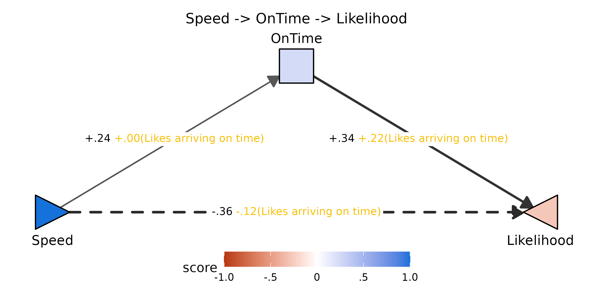

Toggling through low / mid / high values of the moderator makes the
valuation-only moderation pattern visible: the `Speed -> OnTime` edge
barely budges (`FZ[X,M]` is null), while the `OnTime -> Likelihood` edge
steepens as endorsement of the item rises — and the `Likelihood`
triangle correspondingly lifts toward blue. The whole change rides on a
single arm.

``` r

plotPathXMY_widget(dec_lot, mediator = "OnTime",
                   X_label = "Speed", Y_label = "Likelihood",
                   Z_label = "Likes arriving on time",
                   X_shape = "rtTri",
                   format  = "svg")
```

![Likes arriving on time =
-1](data:image/svg+xml;base64,PD94bWwgdmVyc2lvbj0nMS4wJyBlbmNvZGluZz0nVVRGLTgnID8+CjxzdmcgeG1sbnM9J2h0dHA6Ly93d3cudzMub3JnLzIwMDAvc3ZnJyB4bWxuczp4bGluaz0naHR0cDovL3d3dy53My5vcmcvMTk5OS94bGluaycgd2lkdGg9JzY0OC4wMHB0JyBoZWlnaHQ9JzI1Mi4wMHB0JyB2aWV3Qm94PScwIDAgNjQ4LjAwIDI1Mi4wMCc+CjxnIGNsYXNzPSdzdmdsaXRlJz4KPGRlZnM+CiAgPHN0eWxlIHR5cGU9J3RleHQvY3NzJz48IVtDREFUQVsKICAgIC5zdmdsaXRlIGxpbmUsIC5zdmdsaXRlIHBvbHlsaW5lLCAuc3ZnbGl0ZSBwb2x5Z29uLCAuc3ZnbGl0ZSBwYXRoLCAuc3ZnbGl0ZSByZWN0LCAuc3ZnbGl0ZSBjaXJjbGUgewogICAgICBmaWxsOiBub25lOwogICAgICBzdHJva2U6ICMwMDAwMDA7CiAgICAgIHN0cm9rZS1saW5lY2FwOiByb3VuZDsKICAgICAgc3Ryb2tlLWxpbmVqb2luOiByb3VuZDsKICAgICAgc3Ryb2tlLW1pdGVybGltaXQ6IDEwLjAwOwogICAgfQogICAgLnN2Z2xpdGUgdGV4dCB7CiAgICAgIHdoaXRlLXNwYWNlOiBwcmU7CiAgICB9CiAgICAuc3ZnbGl0ZSBnLmdseXBoZ3JvdXAgcGF0aCB7CiAgICAgIGZpbGw6IGluaGVyaXQ7CiAgICAgIHN0cm9rZTogbm9uZTsKICAgIH0KICBdXT48L3N0eWxlPgo8L2RlZnM+CjxyZWN0IHdpZHRoPScxMDAlJyBoZWlnaHQ9JzEwMCUnIHN0eWxlPSdzdHJva2U6IG5vbmU7IGZpbGw6ICNGRkZGRkY7Jy8+CjxkZWZzPgogIDxjbGlwUGF0aCBpZD0nY3BNQzR3TUh3Mk5EZ3VNREI4TUM0d01Id3lOVEl1TURBPSc+CiAgICA8cmVjdCB4PScwLjAwJyB5PScwLjAwJyB3aWR0aD0nNjQ4LjAwJyBoZWlnaHQ9JzI1Mi4wMCcgLz4KICA8L2NsaXBQYXRoPgo8L2RlZnM+CjxnIGNsaXAtcGF0aD0ndXJsKCNjcE1DNHdNSHcyTkRndU1EQjhNQzR3TUh3eU5USXVNREE9KSc+CjwvZz4KPGRlZnM+CiAgPGNsaXBQYXRoIGlkPSdjcE5qSXVNamw4TlRnMUxqY3hmREF1TURCOE1qVXlMakF3Jz4KICAgIDxyZWN0IHg9JzYyLjI5JyB5PScwLjAwJyB3aWR0aD0nNTIzLjQyJyBoZWlnaHQ9JzI1Mi4wMCcgLz4KICA8L2NsaXBQYXRoPgo8L2RlZnM+CjxnIGNsaXAtcGF0aD0ndXJsKCNjcE5qSXVNamw4TlRnMUxqY3hmREF1TURCOE1qVXlMakF3KSc+CjxyZWN0IHg9JzYyLjI5JyB5PScwLjAwJyB3aWR0aD0nNTIzLjQyJyBoZWlnaHQ9JzI1Mi4wMCcgc3R5bGU9J3N0cm9rZS13aWR0aDogMC4wMDsgc3Ryb2tlOiBub25lOycgLz4KPC9nPgo8ZyBjbGlwLXBhdGg9J3VybCgjY3BNQzR3TUh3Mk5EZ3VNREI4TUM0d01Id3lOVEl1TURBPSknPgo8bGluZSB4MT0nMTE1LjI4JyB5MT0nMTc4LjkzJyB4Mj0nMzA4LjkxJyB5Mj0nNjIuNzUnIHN0eWxlPSdzdHJva2Utd2lkdGg6IDEuMjc7IHN0cm9rZTogIzU5NTk1OTsnIC8+Cjxwb2x5Z29uIHBvaW50cz0nMzA0LjAyLDcxLjU2IDMwOC45MSw2Mi43NSAyOTguODMsNjIuOTIgJyBzdHlsZT0nc3Ryb2tlLXdpZHRoOiAxLjI3OyBzdHJva2U6ICM1OTU5NTk7IGZpbGw6ICM1OTU5NTk7JyAvPgo8bGluZSB4MT0nMzM5LjA5JyB5MT0nNjIuNzUnIHgyPSc1MzIuNzInIHkyPScxNzguOTMnIHN0eWxlPSdzdHJva2Utd2lkdGg6IDAuNTU7IHN0cm9rZTogIzlEOUQ5RDsnIC8+Cjxwb2x5Z29uIHBvaW50cz0nNTIyLjY0LDE3OC43NiA1MzIuNzIsMTc4LjkzIDUyNy44MywxNzAuMTEgJyBzdHlsZT0nc3Ryb2tlLXdpZHRoOiAwLjU1OyBzdHJva2U6ICM5RDlEOUQ7IGZpbGw6ICM5RDlEOUQ7JyAvPgo8bGluZSB4MT0nMTIzLjUxJyB5MT0nMTgzLjA0JyB4Mj0nNTI0LjQ5JyB5Mj0nMTgzLjA0JyBzdHlsZT0nc3Ryb2tlLXdpZHRoOiAxLjM0OyBzdHJva2U6ICM1NDU0NTQ7IHN0cm9rZS1kYXNoYXJyYXk6IDcuMTYsNy4xNjsnIC8+Cjxwb2x5Z29uIHBvaW50cz0nNTE1Ljc2LDE4OC4wOCA1MjQuNDksMTgzLjA0IDUxNS43NiwxNzguMDAgJyBzdHlsZT0nc3Ryb2tlLXdpZHRoOiAxLjM0OyBzdHJva2U6ICM1NDU0NTQ7IHN0cm9rZS1kYXNoYXJyYXk6IDcuMTYsNy4xNjsgZmlsbDogIzU0NTQ1NDsnIC8+Cjxwb2x5Z29uIHBvaW50cz0nMjA3LjY2LDEyNC4xNyAyMjQuNzYsMTI0LjE3IDIyNC42NywxMjQuMTcgMjI1LjAyLDEyNC4xNSAyMjUuMzYsMTI0LjA4IDIyNS42OSwxMjMuOTYgMjI1Ljk5LDEyMy43OCAyMjYuMjYsMTIzLjU2IDIyNi40OSwxMjMuMzAgMjI2LjY3LDEyMy4wMSAyMjYuODEsMTIyLjY5IDIyNi44OSwxMjIuMzUgMjI2LjkyLDEyMi4wMSAyMjYuOTIsMTIyLjAxIDIyNi45MiwxMTQuNzMgMjI2LjkyLDExNC43MyAyMjYuODksMTE0LjM4IDIyNi44MSwxMTQuMDQgMjI2LjY3LDExMy43MiAyMjYuNDksMTEzLjQzIDIyNi4yNiwxMTMuMTcgMjI1Ljk5LDExMi45NSAyMjUuNjksMTEyLjc4IDIyNS4zNiwxMTIuNjUgMjI1LjAyLDExMi41OCAyMjQuNzYsMTEyLjU3IDIwNy42NiwxMTIuNTcgMjA3LjkyLDExMi41OCAyMDcuNTcsMTEyLjU3IDIwNy4yMywxMTIuNjEgMjA2Ljg5LDExMi43MSAyMDYuNTgsMTEyLjg2IDIwNi4yOSwxMTMuMDUgMjA2LjA0LDExMy4zMCAyMDUuODMsMTEzLjU3IDIwNS42NywxMTMuODggMjA1LjU2LDExNC4yMSAyMDUuNTAsMTE0LjU1IDIwNS41MCwxMTQuNzMgMjA1LjUwLDEyMi4wMSAyMDUuNTAsMTIxLjgzIDIwNS41MCwxMjIuMTggMjA1LjU2LDEyMi41MiAyMDUuNjcsMTIyLjg1IDIwNS44MywxMjMuMTYgMjA2LjA0LDEyMy40NCAyMDYuMjksMTIzLjY4IDIwNi41OCwxMjMuODggMjA2Ljg5LDEyNC4wMyAyMDcuMjMsMTI0LjEyIDIwNy41NywxMjQuMTcgJyBzdHlsZT0nc3Ryb2tlLXdpZHRoOiAwLjAwOyBmaWxsOiAjRkZGRkZGOycgLz4KPHRleHQgeD0nMjA3LjIzJyB5PScxMjAuNTUnIHN0eWxlPSdmb250LXNpemU6IDkuMTBweDsgZm9udC1mYW1pbHk6ICJMaWJlcmF0aW9uIFNhbnMiOycgdGV4dExlbmd0aD0nMTcuOTdweCcgbGVuZ3RoQWRqdXN0PSdzcGFjaW5nQW5kR2x5cGhzJz4rLjI0PC90ZXh0Pgo8cG9seWdvbiBwb2ludHM9JzQyMy4yNCwxMjQuMTcgNDQwLjM0LDEyNC4xNyA0NDAuMjYsMTI0LjE3IDQ0MC42MCwxMjQuMTUgNDQwLjk0LDEyNC4wOCA0NDEuMjcsMTIzLjk2IDQ0MS41NywxMjMuNzggNDQxLjg0LDEyMy41NiA0NDIuMDcsMTIzLjMwIDQ0Mi4yNiwxMjMuMDEgNDQyLjM5LDEyMi42OSA0NDIuNDcsMTIyLjM1IDQ0Mi41MCwxMjIuMDEgNDQyLjUwLDEyMi4wMSA0NDIuNTAsMTE0LjczIDQ0Mi41MCwxMTQuNzMgNDQyLjQ3LDExNC4zOCA0NDIuMzksMTE0LjA0IDQ0Mi4yNiwxMTMuNzIgNDQyLjA3LDExMy40MyA0NDEuODQsMTEzLjE3IDQ0MS41NywxMTIuOTUgNDQxLjI3LDExMi43OCA0NDAuOTQsMTEyLjY1IDQ0MC42MCwxMTIuNTggNDQwLjM0LDExMi41NyA0MjMuMjQsMTEyLjU3IDQyMy41MCwxMTIuNTggNDIzLjE1LDExMi41NyA0MjIuODEsMTEyLjYxIDQyMi40NywxMTIuNzEgNDIyLjE2LDExMi44NiA0MjEuODcsMTEzLjA1IDQyMS42MiwxMTMuMzAgNDIxLjQxLDExMy41NyA0MjEuMjUsMTEzLjg4IDQyMS4xNCwxMTQuMjEgNDIxLjA5LDExNC41NSA0MjEuMDgsMTE0LjczIDQyMS4wOCwxMjIuMDEgNDIxLjA5LDEyMS44MyA0MjEuMDksMTIyLjE4IDQyMS4xNCwxMjIuNTIgNDIxLjI1LDEyMi44NSA0MjEuNDEsMTIzLjE2IDQyMS42MiwxMjMuNDQgNDIxLjg3LDEyMy42OCA0MjIuMTYsMTIzLjg4IDQyMi40NywxMjQuMDMgNDIyLjgxLDEyNC4xMiA0MjMuMTUsMTI0LjE3ICcgc3R5bGU9J3N0cm9rZS13aWR0aDogMC4wMDsgZmlsbDogI0ZGRkZGRjsnIC8+Cjx0ZXh0IHg9JzQyMi44MScgeT0nMTIwLjU1JyBzdHlsZT0nZm9udC1zaXplOiA5LjEwcHg7IGZvbnQtZmFtaWx5OiAiTGliZXJhdGlvbiBTYW5zIjsnIHRleHRMZW5ndGg9JzE3Ljk3cHgnIGxlbmd0aEFkanVzdD0nc3BhY2luZ0FuZEdseXBocyc+Ky4xMjwvdGV4dD4KPHBvbHlnb24gcG9pbnRzPSczMTYuNTksMTg4Ljg0IDMzMS40MSwxODguODQgMzMxLjMyLDE4OC44NCAzMzEuNjcsMTg4LjgzIDMzMi4wMSwxODguNzYgMzMyLjM0LDE4OC42MyAzMzIuNjQsMTg4LjQ2IDMzMi45MSwxODguMjQgMzMzLjE0LDE4Ny45OCAzMzMuMzIsMTg3LjY4IDMzMy40NiwxODcuMzcgMzMzLjU0LDE4Ny4wMyAzMzMuNTcsMTg2LjY4IDMzMy41NywxODYuNjggMzMzLjU3LDE3OS40MCAzMzMuNTcsMTc5LjQwIDMzMy41NCwxNzkuMDYgMzMzLjQ2LDE3OC43MiAzMzMuMzIsMTc4LjQwIDMzMy4xNCwxNzguMTAgMzMyLjkxLDE3Ny44NCAzMzIuNjQsMTc3LjYyIDMzMi4zNCwxNzcuNDUgMzMyLjAxLDE3Ny4zMyAzMzEuNjcsMTc3LjI2IDMzMS40MSwxNzcuMjQgMzE2LjU5LDE3Ny4yNCAzMTYuODUsMTc3LjI2IDMxNi41MCwxNzcuMjQgMzE2LjE2LDE3Ny4yOSAzMTUuODIsMTc3LjM4IDMxNS41MSwxNzcuNTMgMzE1LjIyLDE3Ny43MyAzMTQuOTcsMTc3Ljk3IDMxNC43NiwxNzguMjUgMzE0LjYwLDE3OC41NiAzMTQuNDksMTc4Ljg4IDMxNC40NCwxNzkuMjMgMzE0LjQzLDE3OS40MCAzMTQuNDMsMTg2LjY4IDMxNC40NCwxODYuNTEgMzE0LjQ0LDE4Ni44NSAzMTQuNDksMTg3LjIwIDMxNC42MCwxODcuNTMgMzE0Ljc2LDE4Ny44NCAzMTQuOTcsMTg4LjExIDMxNS4yMiwxODguMzUgMzE1LjUxLDE4OC41NSAzMTUuODIsMTg4LjcwIDMxNi4xNiwxODguODAgMzE2LjUwLDE4OC44NCAnIHN0eWxlPSdzdHJva2Utd2lkdGg6IDAuMDA7IGZpbGw6ICNGRkZGRkY7JyAvPgo8dGV4dCB4PSczMTYuMTYnIHk9JzE4NS4yMycgc3R5bGU9J2ZvbnQtc2l6ZTogOS4xMHB4OyBmb250LWZhbWlseTogIkxpYmVyYXRpb24gU2FucyI7JyB0ZXh0TGVuZ3RoPScxNS42OXB4JyBsZW5ndGhBZGp1c3Q9J3NwYWNpbmdBbmRHbHlwaHMnPi0uMjU8L3RleHQ+Cjxwb2x5Z29uIHBvaW50cz0nMzA4LjkxLDY4Ljc4IDMzOS4wOSw2OC43OCAzMzkuMDksMzguNjAgMzA4LjkxLDM4LjYwICcgc3R5bGU9J3N0cm9rZS13aWR0aDogMS4wNzsgc3Ryb2tlLWxpbmVjYXA6IGJ1dHQ7IGZpbGw6ICNENURCRjc7JyAvPgo8cG9seWdvbiBwb2ludHM9JzEyMy41MSwxODMuMDQgOTMuMzMsMTY3Ljk1IDkzLjMzLDE5OC4xMyAnIHN0eWxlPSdzdHJva2Utd2lkdGg6IDEuMDc7IHN0cm9rZS1saW5lY2FwOiBidXR0OyBmaWxsOiAjMTU3MkRBOycgLz4KPHBvbHlnb24gcG9pbnRzPSc1MjQuNDksMTgzLjA0IDU1NC42NywxNjcuOTUgNTU0LjY3LDE5OC4xMyAnIHN0eWxlPSdzdHJva2Utd2lkdGg6IDEuMDc7IHN0cm9rZS1saW5lY2FwOiBidXR0OyBmaWxsOiAjRjhEM0M3OycgLz4KPHRleHQgeD0nMTA4LjQyJyB5PScyMTEuMzUnIHRleHQtYW5jaG9yPSdtaWRkbGUnIHN0eWxlPSdmb250LXNpemU6IDExLjM4cHg7IGZvbnQtZmFtaWx5OiAiTGliZXJhdGlvbiBTYW5zIjsnIHRleHRMZW5ndGg9JzMyLjkxcHgnIGxlbmd0aEFkanVzdD0nc3BhY2luZ0FuZEdseXBocyc+U3BlZWQ8L3RleHQ+Cjx0ZXh0IHg9JzMyNC4wMCcgeT0nMzMuMjEnIHRleHQtYW5jaG9yPSdtaWRkbGUnIHN0eWxlPSdmb250LXNpemU6IDExLjM4cHg7IGZvbnQtZmFtaWx5OiAiTGliZXJhdGlvbiBTYW5zIjsnIHRleHRMZW5ndGg9JzQwLjAzcHgnIGxlbmd0aEFkanVzdD0nc3BhY2luZ0FuZEdseXBocyc+T25UaW1lPC90ZXh0Pgo8dGV4dCB4PSc1MzkuNTgnIHk9JzIxMS4zNScgdGV4dC1hbmNob3I9J21pZGRsZScgc3R5bGU9J2ZvbnQtc2l6ZTogMTEuMzhweDsgZm9udC1mYW1pbHk6ICJMaWJlcmF0aW9uIFNhbnMiOycgdGV4dExlbmd0aD0nNTEuMjVweCcgbGVuZ3RoQWRqdXN0PSdzcGFjaW5nQW5kR2x5cGhzJz5MaWtlbGlob29kPC90ZXh0Pgo8dGV4dCB4PScyMjguNjEnIHk9JzIzNC42NScgc3R5bGU9J2ZvbnQtc2l6ZTogMTEuMDBweDsgZm9udC1mYW1pbHk6ICJMaWJlcmF0aW9uIFNhbnMiOycgdGV4dExlbmd0aD0nMjYuOTFweCcgbGVuZ3RoQWRqdXN0PSdzcGFjaW5nQW5kR2x5cGhzJz5zY29yZTwvdGV4dD4KPGltYWdlIHdpZHRoPScxNTguNDAnIGhlaWdodD0nMTIuOTYnIHg9JzI2MC45OScgeT0nMjE3LjcxJyBwcmVzZXJ2ZUFzcGVjdFJhdGlvPSdub25lJyB4bGluazpocmVmPSdkYXRhOmltYWdlL3BuZztiYXNlNjQsaVZCT1J3MEtHZ29BQUFBTlNVaEVVZ0FBQVN3QUFBQUJDQVlBQUFCa09KTXBBQUFBd2tsRVFWUTRqWTJReXhIRElBeEUzMUpDbWtucDZTMnhVUTZBUVRJd1BqRHNhai9DMXVmOU1xV0VKRWdKS2FFa3BGUzU4TG91RDg1YjU5VlA5RW0zVE94c0hmUHNmUDQwMzN6RVhwZmJaSWIvUTNpUHkxZGYxKzU3Wi8xTDN5U3p4bjFueEtVcjFTNDVQT3YwbnZLTnhkTXhtMTJHTUFNenEzYzVlVHJ6dk9WeTREMi9tdTEzUGQwZFo5a01ZNWZ4YjUzbUY5eTlDYy96Zy80ODZuZzlQL0RuMEQveUM5TzFITHpYTHJ4K3czUitEbnJESndYM1l4d0dCM0FZL016NEd2d0JpOEpKY2FJd0lsOEFBQUFBU1VWT1JLNUNZSUk9Jy8+Cjxwb2x5bGluZSBwb2ludHM9JzI2MS4yNiwyMjcuMjEgMjYxLjI2LDIzMC42NyAnIHN0eWxlPSdzdHJva2Utd2lkdGg6IDAuMzg7IHN0cm9rZTogI0ZGRkZGRjsnIC8+Cjxwb2x5bGluZSBwb2ludHM9JzMwMC43MiwyMjcuMjEgMzAwLjcyLDIzMC42NyAnIHN0eWxlPSdzdHJva2Utd2lkdGg6IDAuMzg7IHN0cm9rZTogI0ZGRkZGRjsnIC8+Cjxwb2x5bGluZSBwb2ludHM9JzM0MC4xOSwyMjcuMjEgMzQwLjE5LDIzMC42NyAnIHN0eWxlPSdzdHJva2Utd2lkdGg6IDAuMzg7IHN0cm9rZTogI0ZGRkZGRjsnIC8+Cjxwb2x5bGluZSBwb2ludHM9JzM3OS42NiwyMjcuMjEgMzc5LjY2LDIzMC42NyAnIHN0eWxlPSdzdHJva2Utd2lkdGg6IDAuMzg7IHN0cm9rZTogI0ZGRkZGRjsnIC8+Cjxwb2x5bGluZSBwb2ludHM9JzQxOS4xMywyMjcuMjEgNDE5LjEzLDIzMC42NyAnIHN0eWxlPSdzdHJva2Utd2lkdGg6IDAuMzg7IHN0cm9rZTogI0ZGRkZGRjsnIC8+Cjxwb2x5bGluZSBwb2ludHM9JzI2MS4yNiwyMjEuMTYgMjYxLjI2LDIxNy43MSAnIHN0eWxlPSdzdHJva2Utd2lkdGg6IDAuMzg7IHN0cm9rZTogI0ZGRkZGRjsnIC8+Cjxwb2x5bGluZSBwb2ludHM9JzMwMC43MiwyMjEuMTYgMzAwLjcyLDIxNy43MSAnIHN0eWxlPSdzdHJva2Utd2lkdGg6IDAuMzg7IHN0cm9rZTogI0ZGRkZGRjsnIC8+Cjxwb2x5bGluZSBwb2ludHM9JzM0MC4xOSwyMjEuMTYgMzQwLjE5LDIxNy43MSAnIHN0eWxlPSdzdHJva2Utd2lkdGg6IDAuMzg7IHN0cm9rZTogI0ZGRkZGRjsnIC8+Cjxwb2x5bGluZSBwb2ludHM9JzM3OS42NiwyMjEuMTYgMzc5LjY2LDIxNy43MSAnIHN0eWxlPSdzdHJva2Utd2lkdGg6IDAuMzg7IHN0cm9rZTogI0ZGRkZGRjsnIC8+Cjxwb2x5bGluZSBwb2ludHM9JzQxOS4xMywyMjEuMTYgNDE5LjEzLDIxNy43MSAnIHN0eWxlPSdzdHJva2Utd2lkdGg6IDAuMzg7IHN0cm9rZTogI0ZGRkZGRjsnIC8+Cjx0ZXh0IHg9JzI2MS4yNicgeT0nMjQyLjIwJyB0ZXh0LWFuY2hvcj0nbWlkZGxlJyBzdHlsZT0nZm9udC1zaXplOiA4LjgwcHg7IGZvbnQtZmFtaWx5OiAiTGliZXJhdGlvbiBTYW5zIjsnIHRleHRMZW5ndGg9JzE1LjE0cHgnIGxlbmd0aEFkanVzdD0nc3BhY2luZ0FuZEdseXBocyc+LTEuMDwvdGV4dD4KPHRleHQgeD0nMzAwLjcyJyB5PScyNDIuMjAnIHRleHQtYW5jaG9yPSdtaWRkbGUnIHN0eWxlPSdmb250LXNpemU6IDguODBweDsgZm9udC1mYW1pbHk6ICJMaWJlcmF0aW9uIFNhbnMiOycgdGV4dExlbmd0aD0nMTAuMjVweCcgbGVuZ3RoQWRqdXN0PSdzcGFjaW5nQW5kR2x5cGhzJz4tLjU8L3RleHQ+Cjx0ZXh0IHg9JzM0MC4xOScgeT0nMjQyLjIwJyB0ZXh0LWFuY2hvcj0nbWlkZGxlJyBzdHlsZT0nZm9udC1zaXplOiA4LjgwcHg7IGZvbnQtZmFtaWx5OiAiTGliZXJhdGlvbiBTYW5zIjsnIHRleHRMZW5ndGg9JzQuODlweCcgbGVuZ3RoQWRqdXN0PSdzcGFjaW5nQW5kR2x5cGhzJz4wPC90ZXh0Pgo8dGV4dCB4PSczNzkuNjYnIHk9JzI0Mi4yMCcgdGV4dC1hbmNob3I9J21pZGRsZScgc3R5bGU9J2ZvbnQtc2l6ZTogOC44MHB4OyBmb250LWZhbWlseTogIkxpYmVyYXRpb24gU2FucyI7JyB0ZXh0TGVuZ3RoPSc3LjMzcHgnIGxlbmd0aEFkanVzdD0nc3BhY2luZ0FuZEdseXBocyc+LjU8L3RleHQ+Cjx0ZXh0IHg9JzQxOS4xMycgeT0nMjQyLjIwJyB0ZXh0LWFuY2hvcj0nbWlkZGxlJyBzdHlsZT0nZm9udC1zaXplOiA4LjgwcHg7IGZvbnQtZmFtaWx5OiAiTGliZXJhdGlvbiBTYW5zIjsnIHRleHRMZW5ndGg9JzEyLjIycHgnIGxlbmd0aEFkanVzdD0nc3BhY2luZ0FuZEdseXBocyc+MS4wPC90ZXh0Pgo8dGV4dCB4PSczMjQuMDAnIHk9JzE2LjIzJyB0ZXh0LWFuY2hvcj0nbWlkZGxlJyBzdHlsZT0nZm9udC1zaXplOiAxMi4wMHB4OyBmb250LWZhbWlseTogIkxpYmVyYXRpb24gU2FucyI7JyB0ZXh0TGVuZ3RoPScxMzcuNzJweCcgbGVuZ3RoQWRqdXN0PSdzcGFjaW5nQW5kR2x5cGhzJz5MaWtlcyBhcnJpdmluZyBvbiB0aW1lID0gLTE8L3RleHQ+CjwvZz4KPC9nPgo8L3N2Zz4K)![Likes
arriving on time =
+0](data:image/svg+xml;base64,PD94bWwgdmVyc2lvbj0nMS4wJyBlbmNvZGluZz0nVVRGLTgnID8+CjxzdmcgeG1sbnM9J2h0dHA6Ly93d3cudzMub3JnLzIwMDAvc3ZnJyB4bWxuczp4bGluaz0naHR0cDovL3d3dy53My5vcmcvMTk5OS94bGluaycgd2lkdGg9JzY0OC4wMHB0JyBoZWlnaHQ9JzI1Mi4wMHB0JyB2aWV3Qm94PScwIDAgNjQ4LjAwIDI1Mi4wMCc+CjxnIGNsYXNzPSdzdmdsaXRlJz4KPGRlZnM+CiAgPHN0eWxlIHR5cGU9J3RleHQvY3NzJz48IVtDREFUQVsKICAgIC5zdmdsaXRlIGxpbmUsIC5zdmdsaXRlIHBvbHlsaW5lLCAuc3ZnbGl0ZSBwb2x5Z29uLCAuc3ZnbGl0ZSBwYXRoLCAuc3ZnbGl0ZSByZWN0LCAuc3ZnbGl0ZSBjaXJjbGUgewogICAgICBmaWxsOiBub25lOwogICAgICBzdHJva2U6ICMwMDAwMDA7CiAgICAgIHN0cm9rZS1saW5lY2FwOiByb3VuZDsKICAgICAgc3Ryb2tlLWxpbmVqb2luOiByb3VuZDsKICAgICAgc3Ryb2tlLW1pdGVybGltaXQ6IDEwLjAwOwogICAgfQogICAgLnN2Z2xpdGUgdGV4dCB7CiAgICAgIHdoaXRlLXNwYWNlOiBwcmU7CiAgICB9CiAgICAuc3ZnbGl0ZSBnLmdseXBoZ3JvdXAgcGF0aCB7CiAgICAgIGZpbGw6IGluaGVyaXQ7CiAgICAgIHN0cm9rZTogbm9uZTsKICAgIH0KICBdXT48L3N0eWxlPgo8L2RlZnM+CjxyZWN0IHdpZHRoPScxMDAlJyBoZWlnaHQ9JzEwMCUnIHN0eWxlPSdzdHJva2U6IG5vbmU7IGZpbGw6ICNGRkZGRkY7Jy8+CjxkZWZzPgogIDxjbGlwUGF0aCBpZD0nY3BNQzR3TUh3Mk5EZ3VNREI4TUM0d01Id3lOVEl1TURBPSc+CiAgICA8cmVjdCB4PScwLjAwJyB5PScwLjAwJyB3aWR0aD0nNjQ4LjAwJyBoZWlnaHQ9JzI1Mi4wMCcgLz4KICA8L2NsaXBQYXRoPgo8L2RlZnM+CjxnIGNsaXAtcGF0aD0ndXJsKCNjcE1DNHdNSHcyTkRndU1EQjhNQzR3TUh3eU5USXVNREE9KSc+CjwvZz4KPGRlZnM+CiAgPGNsaXBQYXRoIGlkPSdjcE5qSXVNamw4TlRnMUxqY3hmREF1TURCOE1qVXlMakF3Jz4KICAgIDxyZWN0IHg9JzYyLjI5JyB5PScwLjAwJyB3aWR0aD0nNTIzLjQyJyBoZWlnaHQ9JzI1Mi4wMCcgLz4KICA8L2NsaXBQYXRoPgo8L2RlZnM+CjxnIGNsaXAtcGF0aD0ndXJsKCNjcE5qSXVNamw4TlRnMUxqY3hmREF1TURCOE1qVXlMakF3KSc+CjxyZWN0IHg9JzYyLjI5JyB5PScwLjAwJyB3aWR0aD0nNTIzLjQyJyBoZWlnaHQ9JzI1Mi4wMCcgc3R5bGU9J3N0cm9rZS13aWR0aDogMC4wMDsgc3Ryb2tlOiBub25lOycgLz4KPC9nPgo8ZyBjbGlwLXBhdGg9J3VybCgjY3BNQzR3TUh3Mk5EZ3VNREI4TUM0d01Id3lOVEl1TURBPSknPgo8bGluZSB4MT0nMTE1LjI4JyB5MT0nMTc4LjkzJyB4Mj0nMzA4LjkxJyB5Mj0nNjIuNzUnIHN0eWxlPSdzdHJva2Utd2lkdGg6IDEuMzA7IHN0cm9rZTogIzU3NTc1NzsnIC8+Cjxwb2x5Z29uIHBvaW50cz0nMzA0LjAyLDcxLjU2IDMwOC45MSw2Mi43NSAyOTguODMsNjIuOTIgJyBzdHlsZT0nc3Ryb2tlLXdpZHRoOiAxLjMwOyBzdHJva2U6ICM1NzU3NTc7IGZpbGw6ICM1NzU3NTc7JyAvPgo8bGluZSB4MT0nMzM5LjA5JyB5MT0nNjIuNzUnIHgyPSc1MzIuNzInIHkyPScxNzguOTMnIHN0eWxlPSdzdHJva2Utd2lkdGg6IDIuMDE7IHN0cm9rZTogIzMyMzIzMjsnIC8+Cjxwb2x5Z29uIHBvaW50cz0nNTIyLjY0LDE3OC43NiA1MzIuNzIsMTc4LjkzIDUyNy44MywxNzAuMTEgJyBzdHlsZT0nc3Ryb2tlLXdpZHRoOiAyLjAxOyBzdHJva2U6ICMzMjMyMzI7IGZpbGw6ICMzMjMyMzI7JyAvPgo8bGluZSB4MT0nMTIzLjUxJyB5MT0nMTgzLjA0JyB4Mj0nNTI0LjQ5JyB5Mj0nMTgzLjA0JyBzdHlsZT0nc3Ryb2tlLXdpZHRoOiAyLjIyOyBzdHJva2U6ICMyQTJBMkE7IHN0cm9rZS1kYXNoYXJyYXk6IDExLjgzLDExLjgzOycgLz4KPHBvbHlnb24gcG9pbnRzPSc1MTUuNzYsMTg4LjA4IDUyNC40OSwxODMuMDQgNTE1Ljc2LDE3OC4wMCAnIHN0eWxlPSdzdHJva2Utd2lkdGg6IDIuMjI7IHN0cm9rZTogIzJBMkEyQTsgc3Ryb2tlLWRhc2hhcnJheTogMTEuODMsMTEuODM7IGZpbGw6ICMyQTJBMkE7JyAvPgo8cG9seWdvbiBwb2ludHM9JzIwNy42NiwxMjQuMTcgMjI0Ljc2LDEyNC4xNyAyMjQuNjcsMTI0LjE3IDIyNS4wMiwxMjQuMTUgMjI1LjM2LDEyNC4wOCAyMjUuNjksMTIzLjk2IDIyNS45OSwxMjMuNzggMjI2LjI2LDEyMy41NiAyMjYuNDksMTIzLjMwIDIyNi42NywxMjMuMDEgMjI2LjgxLDEyMi42OSAyMjYuODksMTIyLjM1IDIyNi45MiwxMjIuMDEgMjI2LjkyLDEyMi4wMSAyMjYuOTIsMTE0LjczIDIyNi45MiwxMTQuNzMgMjI2Ljg5LDExNC4zOCAyMjYuODEsMTE0LjA0IDIyNi42NywxMTMuNzIgMjI2LjQ5LDExMy40MyAyMjYuMjYsMTEzLjE3IDIyNS45OSwxMTIuOTUgMjI1LjY5LDExMi43OCAyMjUuMzYsMTEyLjY1IDIyNS4wMiwxMTIuNTggMjI0Ljc2LDExMi41NyAyMDcuNjYsMTEyLjU3IDIwNy45MiwxMTIuNTggMjA3LjU3LDExMi41NyAyMDcuMjMsMTEyLjYxIDIwNi44OSwxMTIuNzEgMjA2LjU4LDExMi44NiAyMDYuMjksMTEzLjA1IDIwNi4wNCwxMTMuMzAgMjA1LjgzLDExMy41NyAyMDUuNjcsMTEzLjg4IDIwNS41NiwxMTQuMjEgMjA1LjUwLDExNC41NSAyMDUuNTAsMTE0LjczIDIwNS41MCwxMjIuMDEgMjA1LjUwLDEyMS44MyAyMDUuNTAsMTIyLjE4IDIwNS41NiwxMjIuNTIgMjA1LjY3LDEyMi44NSAyMDUuODMsMTIzLjE2IDIwNi4wNCwxMjMuNDQgMjA2LjI5LDEyMy42OCAyMDYuNTgsMTIzLjg4IDIwNi44OSwxMjQuMDMgMjA3LjIzLDEyNC4xMiAyMDcuNTcsMTI0LjE3ICcgc3R5bGU9J3N0cm9rZS13aWR0aDogMC4wMDsgZmlsbDogI0ZGRkZGRjsnIC8+Cjx0ZXh0IHg9JzIwNy4yMycgeT0nMTIwLjU1JyBzdHlsZT0nZm9udC1zaXplOiA5LjEwcHg7IGZvbnQtZmFtaWx5OiAiTGliZXJhdGlvbiBTYW5zIjsnIHRleHRMZW5ndGg9JzE3Ljk3cHgnIGxlbmd0aEFkanVzdD0nc3BhY2luZ0FuZEdseXBocyc+Ky4yNDwvdGV4dD4KPHBvbHlnb24gcG9pbnRzPSc0MjMuMjQsMTI0LjE3IDQ0MC4zNCwxMjQuMTcgNDQwLjI2LDEyNC4xNyA0NDAuNjAsMTI0LjE1IDQ0MC45NCwxMjQuMDggNDQxLjI3LDEyMy45NiA0NDEuNTcsMTIzLjc4IDQ0MS44NCwxMjMuNTYgNDQyLjA3LDEyMy4zMCA0NDIuMjYsMTIzLjAxIDQ0Mi4zOSwxMjIuNjkgNDQyLjQ3LDEyMi4zNSA0NDIuNTAsMTIyLjAxIDQ0Mi41MCwxMjIuMDEgNDQyLjUwLDExNC43MyA0NDIuNTAsMTE0LjczIDQ0Mi40NywxMTQuMzggNDQyLjM5LDExNC4wNCA0NDIuMjYsMTEzLjcyIDQ0Mi4wNywxMTMuNDMgNDQxLjg0LDExMy4xNyA0NDEuNTcsMTEyLjk1IDQ0MS4yNywxMTIuNzggNDQwLjk0LDExMi42NSA0NDAuNjAsMTEyLjU4IDQ0MC4zNCwxMTIuNTcgNDIzLjI0LDExMi41NyA0MjMuNTAsMTEyLjU4IDQyMy4xNSwxMTIuNTcgNDIyLjgxLDExMi42MSA0MjIuNDcsMTEyLjcxIDQyMi4xNiwxMTIuODYgNDIxLjg3LDExMy4wNSA0MjEuNjIsMTEzLjMwIDQyMS40MSwxMTMuNTcgNDIxLjI1LDExMy44OCA0MjEuMTQsMTE0LjIxIDQyMS4wOSwxMTQuNTUgNDIxLjA4LDExNC43MyA0MjEuMDgsMTIyLjAxIDQyMS4wOSwxMjEuODMgNDIxLjA5LDEyMi4xOCA0MjEuMTQsMTIyLjUyIDQyMS4yNSwxMjIuODUgNDIxLjQxLDEyMy4xNiA0MjEuNjIsMTIzLjQ0IDQyMS44NywxMjMuNjggNDIyLjE2LDEyMy44OCA0MjIuNDcsMTI0LjAzIDQyMi44MSwxMjQuMTIgNDIzLjE1LDEyNC4xNyAnIHN0eWxlPSdzdHJva2Utd2lkdGg6IDAuMDA7IGZpbGw6ICNGRkZGRkY7JyAvPgo8dGV4dCB4PSc0MjIuODEnIHk9JzEyMC41NScgc3R5bGU9J2ZvbnQtc2l6ZTogOS4xMHB4OyBmb250LWZhbWlseTogIkxpYmVyYXRpb24gU2FucyI7JyB0ZXh0TGVuZ3RoPScxNy45N3B4JyBsZW5ndGhBZGp1c3Q9J3NwYWNpbmdBbmRHbHlwaHMnPisuMzQ8L3RleHQ+Cjxwb2x5Z29uIHBvaW50cz0nMzE2LjU5LDE4OC44NCAzMzEuNDEsMTg4Ljg0IDMzMS4zMiwxODguODQgMzMxLjY3LDE4OC44MyAzMzIuMDEsMTg4Ljc2IDMzMi4zNCwxODguNjMgMzMyLjY0LDE4OC40NiAzMzIuOTEsMTg4LjI0IDMzMy4xNCwxODcuOTggMzMzLjMyLDE4Ny42OCAzMzMuNDYsMTg3LjM3IDMzMy41NCwxODcuMDMgMzMzLjU3LDE4Ni42OCAzMzMuNTcsMTg2LjY4IDMzMy41NywxNzkuNDAgMzMzLjU3LDE3OS40MCAzMzMuNTQsMTc5LjA2IDMzMy40NiwxNzguNzIgMzMzLjMyLDE3OC40MCAzMzMuMTQsMTc4LjEwIDMzMi45MSwxNzcuODQgMzMyLjY0LDE3Ny42MiAzMzIuMzQsMTc3LjQ1IDMzMi4wMSwxNzcuMzMgMzMxLjY3LDE3Ny4yNiAzMzEuNDEsMTc3LjI0IDMxNi41OSwxNzcuMjQgMzE2Ljg1LDE3Ny4yNiAzMTYuNTAsMTc3LjI0IDMxNi4xNiwxNzcuMjkgMzE1LjgyLDE3Ny4zOCAzMTUuNTEsMTc3LjUzIDMxNS4yMiwxNzcuNzMgMzE0Ljk3LDE3Ny45NyAzMTQuNzYsMTc4LjI1IDMxNC42MCwxNzguNTYgMzE0LjQ5LDE3OC44OCAzMTQuNDQsMTc5LjIzIDMxNC40MywxNzkuNDAgMzE0LjQzLDE4Ni42OCAzMTQuNDQsMTg2LjUxIDMxNC40NCwxODYuODUgMzE0LjQ5LDE4Ny4yMCAzMTQuNjAsMTg3LjUzIDMxNC43NiwxODcuODQgMzE0Ljk3LDE4OC4xMSAzMTUuMjIsMTg4LjM1IDMxNS41MSwxODguNTUgMzE1LjgyLDE4OC43MCAzMTYuMTYsMTg4LjgwIDMxNi41MCwxODguODQgJyBzdHlsZT0nc3Ryb2tlLXdpZHRoOiAwLjAwOyBmaWxsOiAjRkZGRkZGOycgLz4KPHRleHQgeD0nMzE2LjE2JyB5PScxODUuMjMnIHN0eWxlPSdmb250LXNpemU6IDkuMTBweDsgZm9udC1mYW1pbHk6ICJMaWJlcmF0aW9uIFNhbnMiOycgdGV4dExlbmd0aD0nMTUuNjlweCcgbGVuZ3RoQWRqdXN0PSdzcGFjaW5nQW5kR2x5cGhzJz4tLjM2PC90ZXh0Pgo8cG9seWdvbiBwb2ludHM9JzMwOC45MSw2OC43OCAzMzkuMDksNjguNzggMzM5LjA5LDM4LjYwIDMwOC45MSwzOC42MCAnIHN0eWxlPSdzdHJva2Utd2lkdGg6IDEuMDc7IHN0cm9rZS1saW5lY2FwOiBidXR0OyBmaWxsOiAjRDREQkY3OycgLz4KPHBvbHlnb24gcG9pbnRzPScxMjMuNTEsMTgzLjA0IDkzLjMzLDE2Ny45NSA5My4zMywxOTguMTMgJyBzdHlsZT0nc3Ryb2tlLXdpZHRoOiAxLjA3OyBzdHJva2UtbGluZWNhcDogYnV0dDsgZmlsbDogIzE1NzJEQTsnIC8+Cjxwb2x5Z29uIHBvaW50cz0nNTI0LjQ5LDE4My4wNCA1NTQuNjcsMTY3Ljk1IDU1NC42NywxOTguMTMgJyBzdHlsZT0nc3Ryb2tlLXdpZHRoOiAxLjA3OyBzdHJva2UtbGluZWNhcDogYnV0dDsgZmlsbDogI0Y1QzdCODsnIC8+Cjx0ZXh0IHg9JzEwOC40MicgeT0nMjExLjM1JyB0ZXh0LWFuY2hvcj0nbWlkZGxlJyBzdHlsZT0nZm9udC1zaXplOiAxMS4zOHB4OyBmb250LWZhbWlseTogIkxpYmVyYXRpb24gU2FucyI7JyB0ZXh0TGVuZ3RoPSczMi45MXB4JyBsZW5ndGhBZGp1c3Q9J3NwYWNpbmdBbmRHbHlwaHMnPlNwZWVkPC90ZXh0Pgo8dGV4dCB4PSczMjQuMDAnIHk9JzMzLjIxJyB0ZXh0LWFuY2hvcj0nbWlkZGxlJyBzdHlsZT0nZm9udC1zaXplOiAxMS4zOHB4OyBmb250LWZhbWlseTogIkxpYmVyYXRpb24gU2FucyI7JyB0ZXh0TGVuZ3RoPSc0MC4wM3B4JyBsZW5ndGhBZGp1c3Q9J3NwYWNpbmdBbmRHbHlwaHMnPk9uVGltZTwvdGV4dD4KPHRleHQgeD0nNTM5LjU4JyB5PScyMTEuMzUnIHRleHQtYW5jaG9yPSdtaWRkbGUnIHN0eWxlPSdmb250LXNpemU6IDExLjM4cHg7IGZvbnQtZmFtaWx5OiAiTGliZXJhdGlvbiBTYW5zIjsnIHRleHRMZW5ndGg9JzUxLjI1cHgnIGxlbmd0aEFkanVzdD0nc3BhY2luZ0FuZEdseXBocyc+TGlrZWxpaG9vZDwvdGV4dD4KPHRleHQgeD0nMjI4LjYxJyB5PScyMzQuNjUnIHN0eWxlPSdmb250LXNpemU6IDExLjAwcHg7IGZvbnQtZmFtaWx5OiAiTGliZXJhdGlvbiBTYW5zIjsnIHRleHRMZW5ndGg9JzI2LjkxcHgnIGxlbmd0aEFkanVzdD0nc3BhY2luZ0FuZEdseXBocyc+c2NvcmU8L3RleHQ+CjxpbWFnZSB3aWR0aD0nMTU4LjQwJyBoZWlnaHQ9JzEyLjk2JyB4PScyNjAuOTknIHk9JzIxNy43MScgcHJlc2VydmVBc3BlY3RSYXRpbz0nbm9uZScgeGxpbms6aHJlZj0nZGF0YTppbWFnZS9wbmc7YmFzZTY0LGlWQk9SdzBLR2dvQUFBQU5TVWhFVWdBQUFTd0FBQUFCQ0FZQUFBQmtPSk1wQUFBQXdrbEVRVlE0alkyUXl4SERJQXhFMzFKQ21rbnA2UzJ4VVE2QVFUSXdQakRzYWovQzF1ZjlNcVdFSkVnSkthRWtwRlM1OExvdUQ4NWI1OVZQOUVtM1RPeHNIZlBzZlA0MDMzekVYcGZiWkliL1EzaVB5MWRmMSs1N1ovMUwzeVN6eG4xbnhLVXIxUzQ1UE92MG52S054ZE14bTEyR01BTXpxM2M1ZVRyenZPVnk0RDIvbXUxM1BkMGRaOWtNWTVmeGI1M21GOXk5Q2MvemcvNDg2bmc5UC9EbjBEL3lDOU8xSEx6WExyeCt3M1IrRG5yREp3WDNZeHdHQjNBWS9NejRHdndCaThKSmNhSXdJbDhBQUFBQVNVVk9SSzVDWUlJPScvPgo8cG9seWxpbmUgcG9pbnRzPScyNjEuMjYsMjI3LjIxIDI2MS4yNiwyMzAuNjcgJyBzdHlsZT0nc3Ryb2tlLXdpZHRoOiAwLjM4OyBzdHJva2U6ICNGRkZGRkY7JyAvPgo8cG9seWxpbmUgcG9pbnRzPSczMDAuNzIsMjI3LjIxIDMwMC43MiwyMzAuNjcgJyBzdHlsZT0nc3Ryb2tlLXdpZHRoOiAwLjM4OyBzdHJva2U6ICNGRkZGRkY7JyAvPgo8cG9seWxpbmUgcG9pbnRzPSczNDAuMTksMjI3LjIxIDM0MC4xOSwyMzAuNjcgJyBzdHlsZT0nc3Ryb2tlLXdpZHRoOiAwLjM4OyBzdHJva2U6ICNGRkZGRkY7JyAvPgo8cG9seWxpbmUgcG9pbnRzPSczNzkuNjYsMjI3LjIxIDM3OS42NiwyMzAuNjcgJyBzdHlsZT0nc3Ryb2tlLXdpZHRoOiAwLjM4OyBzdHJva2U6ICNGRkZGRkY7JyAvPgo8cG9seWxpbmUgcG9pbnRzPSc0MTkuMTMsMjI3LjIxIDQxOS4xMywyMzAuNjcgJyBzdHlsZT0nc3Ryb2tlLXdpZHRoOiAwLjM4OyBzdHJva2U6ICNGRkZGRkY7JyAvPgo8cG9seWxpbmUgcG9pbnRzPScyNjEuMjYsMjIxLjE2IDI2MS4yNiwyMTcuNzEgJyBzdHlsZT0nc3Ryb2tlLXdpZHRoOiAwLjM4OyBzdHJva2U6ICNGRkZGRkY7JyAvPgo8cG9seWxpbmUgcG9pbnRzPSczMDAuNzIsMjIxLjE2IDMwMC43MiwyMTcuNzEgJyBzdHlsZT0nc3Ryb2tlLXdpZHRoOiAwLjM4OyBzdHJva2U6ICNGRkZGRkY7JyAvPgo8cG9seWxpbmUgcG9pbnRzPSczNDAuMTksMjIxLjE2IDM0MC4xOSwyMTcuNzEgJyBzdHlsZT0nc3Ryb2tlLXdpZHRoOiAwLjM4OyBzdHJva2U6ICNGRkZGRkY7JyAvPgo8cG9seWxpbmUgcG9pbnRzPSczNzkuNjYsMjIxLjE2IDM3OS42NiwyMTcuNzEgJyBzdHlsZT0nc3Ryb2tlLXdpZHRoOiAwLjM4OyBzdHJva2U6ICNGRkZGRkY7JyAvPgo8cG9seWxpbmUgcG9pbnRzPSc0MTkuMTMsMjIxLjE2IDQxOS4xMywyMTcuNzEgJyBzdHlsZT0nc3Ryb2tlLXdpZHRoOiAwLjM4OyBzdHJva2U6ICNGRkZGRkY7JyAvPgo8dGV4dCB4PScyNjEuMjYnIHk9JzI0Mi4yMCcgdGV4dC1hbmNob3I9J21pZGRsZScgc3R5bGU9J2ZvbnQtc2l6ZTogOC44MHB4OyBmb250LWZhbWlseTogIkxpYmVyYXRpb24gU2FucyI7JyB0ZXh0TGVuZ3RoPScxNS4xNHB4JyBsZW5ndGhBZGp1c3Q9J3NwYWNpbmdBbmRHbHlwaHMnPi0xLjA8L3RleHQ+Cjx0ZXh0IHg9JzMwMC43MicgeT0nMjQyLjIwJyB0ZXh0LWFuY2hvcj0nbWlkZGxlJyBzdHlsZT0nZm9udC1zaXplOiA4LjgwcHg7IGZvbnQtZmFtaWx5OiAiTGliZXJhdGlvbiBTYW5zIjsnIHRleHRMZW5ndGg9JzEwLjI1cHgnIGxlbmd0aEFkanVzdD0nc3BhY2luZ0FuZEdseXBocyc+LS41PC90ZXh0Pgo8dGV4dCB4PSczNDAuMTknIHk9JzI0Mi4yMCcgdGV4dC1hbmNob3I9J21pZGRsZScgc3R5bGU9J2ZvbnQtc2l6ZTogOC44MHB4OyBmb250LWZhbWlseTogIkxpYmVyYXRpb24gU2FucyI7JyB0ZXh0TGVuZ3RoPSc0Ljg5cHgnIGxlbmd0aEFkanVzdD0nc3BhY2luZ0FuZEdseXBocyc+MDwvdGV4dD4KPHRleHQgeD0nMzc5LjY2JyB5PScyNDIuMjAnIHRleHQtYW5jaG9yPSdtaWRkbGUnIHN0eWxlPSdmb250LXNpemU6IDguODBweDsgZm9udC1mYW1pbHk6ICJMaWJlcmF0aW9uIFNhbnMiOycgdGV4dExlbmd0aD0nNy4zM3B4JyBsZW5ndGhBZGp1c3Q9J3NwYWNpbmdBbmRHbHlwaHMnPi41PC90ZXh0Pgo8dGV4dCB4PSc0MTkuMTMnIHk9JzI0Mi4yMCcgdGV4dC1hbmNob3I9J21pZGRsZScgc3R5bGU9J2ZvbnQtc2l6ZTogOC44MHB4OyBmb250LWZhbWlseTogIkxpYmVyYXRpb24gU2FucyI7JyB0ZXh0TGVuZ3RoPScxMi4yMnB4JyBsZW5ndGhBZGp1c3Q9J3NwYWNpbmdBbmRHbHlwaHMnPjEuMDwvdGV4dD4KPHRleHQgeD0nMzI0LjAwJyB5PScxNi4yMycgdGV4dC1hbmNob3I9J21pZGRsZScgc3R5bGU9J2ZvbnQtc2l6ZTogMTIuMDBweDsgZm9udC1mYW1pbHk6ICJMaWJlcmF0aW9uIFNhbnMiOycgdGV4dExlbmd0aD0nMTQwLjczcHgnIGxlbmd0aEFkanVzdD0nc3BhY2luZ0FuZEdseXBocyc+TGlrZXMgYXJyaXZpbmcgb24gdGltZSA9ICswPC90ZXh0Pgo8L2c+CjwvZz4KPC9zdmc+Cg==)![Likes
arriving on time =
+1](data:image/svg+xml;base64,PD94bWwgdmVyc2lvbj0nMS4wJyBlbmNvZGluZz0nVVRGLTgnID8+CjxzdmcgeG1sbnM9J2h0dHA6Ly93d3cudzMub3JnLzIwMDAvc3ZnJyB4bWxuczp4bGluaz0naHR0cDovL3d3dy53My5vcmcvMTk5OS94bGluaycgd2lkdGg9JzY0OC4wMHB0JyBoZWlnaHQ9JzI1Mi4wMHB0JyB2aWV3Qm94PScwIDAgNjQ4LjAwIDI1Mi4wMCc+CjxnIGNsYXNzPSdzdmdsaXRlJz4KPGRlZnM+CiAgPHN0eWxlIHR5cGU9J3RleHQvY3NzJz48IVtDREFUQVsKICAgIC5zdmdsaXRlIGxpbmUsIC5zdmdsaXRlIHBvbHlsaW5lLCAuc3ZnbGl0ZSBwb2x5Z29uLCAuc3ZnbGl0ZSBwYXRoLCAuc3ZnbGl0ZSByZWN0LCAuc3ZnbGl0ZSBjaXJjbGUgewogICAgICBmaWxsOiBub25lOwogICAgICBzdHJva2U6ICMwMDAwMDA7CiAgICAgIHN0cm9rZS1saW5lY2FwOiByb3VuZDsKICAgICAgc3Ryb2tlLWxpbmVqb2luOiByb3VuZDsKICAgICAgc3Ryb2tlLW1pdGVybGltaXQ6IDEwLjAwOwogICAgfQogICAgLnN2Z2xpdGUgdGV4dCB7CiAgICAgIHdoaXRlLXNwYWNlOiBwcmU7CiAgICB9CiAgICAuc3ZnbGl0ZSBnLmdseXBoZ3JvdXAgcGF0aCB7CiAgICAgIGZpbGw6IGluaGVyaXQ7CiAgICAgIHN0cm9rZTogbm9uZTsKICAgIH0KICBdXT48L3N0eWxlPgo8L2RlZnM+CjxyZWN0IHdpZHRoPScxMDAlJyBoZWlnaHQ9JzEwMCUnIHN0eWxlPSdzdHJva2U6IG5vbmU7IGZpbGw6ICNGRkZGRkY7Jy8+CjxkZWZzPgogIDxjbGlwUGF0aCBpZD0nY3BNQzR3TUh3Mk5EZ3VNREI4TUM0d01Id3lOVEl1TURBPSc+CiAgICA8cmVjdCB4PScwLjAwJyB5PScwLjAwJyB3aWR0aD0nNjQ4LjAwJyBoZWlnaHQ9JzI1Mi4wMCcgLz4KICA8L2NsaXBQYXRoPgo8L2RlZnM+CjxnIGNsaXAtcGF0aD0ndXJsKCNjcE1DNHdNSHcyTkRndU1EQjhNQzR3TUh3eU5USXVNREE9KSc+CjwvZz4KPGRlZnM+CiAgPGNsaXBQYXRoIGlkPSdjcE5qSXVNamw4TlRnMUxqY3hmREF1TURCOE1qVXlMakF3Jz4KICAgIDxyZWN0IHg9JzYyLjI5JyB5PScwLjAwJyB3aWR0aD0nNTIzLjQyJyBoZWlnaHQ9JzI1Mi4wMCcgLz4KICA8L2NsaXBQYXRoPgo8L2RlZnM+CjxnIGNsaXAtcGF0aD0ndXJsKCNjcE5qSXVNamw4TlRnMUxqY3hmREF1TURCOE1qVXlMakF3KSc+CjxyZWN0IHg9JzYyLjI5JyB5PScwLjAwJyB3aWR0aD0nNTIzLjQyJyBoZWlnaHQ9JzI1Mi4wMCcgc3R5bGU9J3N0cm9rZS13aWR0aDogMC4wMDsgc3Ryb2tlOiBub25lOycgLz4KPC9nPgo8ZyBjbGlwLXBhdGg9J3VybCgjY3BNQzR3TUh3Mk5EZ3VNREI4TUM0d01Id3lOVEl1TURBPSknPgo8bGluZSB4MT0nMTE1LjI4JyB5MT0nMTc4LjkzJyB4Mj0nMzA4LjkxJyB5Mj0nNjIuNzUnIHN0eWxlPSdzdHJva2Utd2lkdGg6IDEuMzQ7IHN0cm9rZTogIzU1NTU1NTsnIC8+Cjxwb2x5Z29uIHBvaW50cz0nMzA0LjAyLDcxLjU2IDMwOC45MSw2Mi43NSAyOTguODMsNjIuOTIgJyBzdHlsZT0nc3Ryb2tlLXdpZHRoOiAxLjM0OyBzdHJva2U6ICM1NTU1NTU7IGZpbGw6ICM1NTU1NTU7JyAvPgo8bGluZSB4MT0nMzM5LjA5JyB5MT0nNjIuNzUnIHgyPSc1MzIuNzInIHkyPScxNzguOTMnIHN0eWxlPSdzdHJva2Utd2lkdGg6IDMuOTI7IHN0cm9rZTogIzA4MDgwODsnIC8+Cjxwb2x5Z29uIHBvaW50cz0nNTIyLjY0LDE3OC43NiA1MzIuNzIsMTc4LjkzIDUyNy44MywxNzAuMTEgJyBzdHlsZT0nc3Ryb2tlLXdpZHRoOiAzLjkyOyBzdHJva2U6ICMwODA4MDg7IGZpbGw6ICMwODA4MDg7JyAvPgo8bGluZSB4MT0nMTIzLjUxJyB5MT0nMTgzLjA0JyB4Mj0nNTI0LjQ5JyB5Mj0nMTgzLjA0JyBzdHlsZT0nc3Ryb2tlLXdpZHRoOiAzLjIxOyBzdHJva2U6ICMxMTExMTE7IHN0cm9rZS1kYXNoYXJyYXk6IDE3LjE0LDE3LjE0OycgLz4KPHBvbHlnb24gcG9pbnRzPSc1MTUuNzYsMTg4LjA4IDUyNC40OSwxODMuMDQgNTE1Ljc2LDE3OC4wMCAnIHN0eWxlPSdzdHJva2Utd2lkdGg6IDMuMjE7IHN0cm9rZTogIzExMTExMTsgc3Ryb2tlLWRhc2hhcnJheTogMTcuMTQsMTcuMTQ7IGZpbGw6ICMxMTExMTE7JyAvPgo8cG9seWdvbiBwb2ludHM9JzIwNy42NiwxMjQuMTcgMjI0Ljc2LDEyNC4xNyAyMjQuNjcsMTI0LjE3IDIyNS4wMiwxMjQuMTUgMjI1LjM2LDEyNC4wOCAyMjUuNjksMTIzLjk2IDIyNS45OSwxMjMuNzggMjI2LjI2LDEyMy41NiAyMjYuNDksMTIzLjMwIDIyNi42NywxMjMuMDEgMjI2LjgxLDEyMi42OSAyMjYuODksMTIyLjM1IDIyNi45MiwxMjIuMDEgMjI2LjkyLDEyMi4wMSAyMjYuOTIsMTE0LjczIDIyNi45MiwxMTQuNzMgMjI2Ljg5LDExNC4zOCAyMjYuODEsMTE0LjA0IDIyNi42NywxMTMuNzIgMjI2LjQ5LDExMy40MyAyMjYuMjYsMTEzLjE3IDIyNS45OSwxMTIuOTUgMjI1LjY5LDExMi43OCAyMjUuMzYsMTEyLjY1IDIyNS4wMiwxMTIuNTggMjI0Ljc2LDExMi41NyAyMDcuNjYsMTEyLjU3IDIwNy45MiwxMTIuNTggMjA3LjU3LDExMi41NyAyMDcuMjMsMTEyLjYxIDIwNi44OSwxMTIuNzEgMjA2LjU4LDExMi44NiAyMDYuMjksMTEzLjA1IDIwNi4wNCwxMTMuMzAgMjA1LjgzLDExMy41NyAyMDUuNjcsMTEzLjg4IDIwNS41NiwxMTQuMjEgMjA1LjUwLDExNC41NSAyMDUuNTAsMTE0LjczIDIwNS41MCwxMjIuMDEgMjA1LjUwLDEyMS44MyAyMDUuNTAsMTIyLjE4IDIwNS41NiwxMjIuNTIgMjA1LjY3LDEyMi44NSAyMDUuODMsMTIzLjE2IDIwNi4wNCwxMjMuNDQgMjA2LjI5LDEyMy42OCAyMDYuNTgsMTIzLjg4IDIwNi44OSwxMjQuMDMgMjA3LjIzLDEyNC4xMiAyMDcuNTcsMTI0LjE3ICcgc3R5bGU9J3N0cm9rZS13aWR0aDogMC4wMDsgZmlsbDogI0ZGRkZGRjsnIC8+Cjx0ZXh0IHg9JzIwNy4yMycgeT0nMTIwLjU1JyBzdHlsZT0nZm9udC1zaXplOiA5LjEwcHg7IGZvbnQtZmFtaWx5OiAiTGliZXJhdGlvbiBTYW5zIjsnIHRleHRMZW5ndGg9JzE3Ljk3cHgnIGxlbmd0aEFkanVzdD0nc3BhY2luZ0FuZEdseXBocyc+Ky4yNTwvdGV4dD4KPHBvbHlnb24gcG9pbnRzPSc0MjMuMjQsMTI0LjE3IDQ0MC4zNCwxMjQuMTcgNDQwLjI2LDEyNC4xNyA0NDAuNjAsMTI0LjE1IDQ0MC45NCwxMjQuMDggNDQxLjI3LDEyMy45NiA0NDEuNTcsMTIzLjc4IDQ0MS44NCwxMjMuNTYgNDQyLjA3LDEyMy4zMCA0NDIuMjYsMTIzLjAxIDQ0Mi4zOSwxMjIuNjkgNDQyLjQ3LDEyMi4zNSA0NDIuNTAsMTIyLjAxIDQ0Mi41MCwxMjIuMDEgNDQyLjUwLDExNC43MyA0NDIuNTAsMTE0LjczIDQ0Mi40NywxMTQuMzggNDQyLjM5LDExNC4wNCA0NDIuMjYsMTEzLjcyIDQ0Mi4wNywxMTMuNDMgNDQxLjg0LDExMy4xNyA0NDEuNTcsMTEyLjk1IDQ0MS4yNywxMTIuNzggNDQwLjk0LDExMi42NSA0NDAuNjAsMTEyLjU4IDQ0MC4zNCwxMTIuNTcgNDIzLjI0LDExMi41NyA0MjMuNTAsMTEyLjU4IDQyMy4xNSwxMTIuNTcgNDIyLjgxLDExMi42MSA0MjIuNDcsMTEyLjcxIDQyMi4xNiwxMTIuODYgNDIxLjg3LDExMy4wNSA0MjEuNjIsMTEzLjMwIDQyMS40MSwxMTMuNTcgNDIxLjI1LDExMy44OCA0MjEuMTQsMTE0LjIxIDQyMS4wOSwxMTQuNTUgNDIxLjA4LDExNC43MyA0MjEuMDgsMTIyLjAxIDQyMS4wOSwxMjEuODMgNDIxLjA5LDEyMi4xOCA0MjEuMTQsMTIyLjUyIDQyMS4yNSwxMjIuODUgNDIxLjQxLDEyMy4xNiA0MjEuNjIsMTIzLjQ0IDQyMS44NywxMjMuNjggNDIyLjE2LDEyMy44OCA0MjIuNDcsMTI0LjAzIDQyMi44MSwxMjQuMTIgNDIzLjE1LDEyNC4xNyAnIHN0eWxlPSdzdHJva2Utd2lkdGg6IDAuMDA7IGZpbGw6ICNGRkZGRkY7JyAvPgo8dGV4dCB4PSc0MjIuODEnIHk9JzEyMC41NScgc3R5bGU9J2ZvbnQtc2l6ZTogOS4xMHB4OyBmb250LWZhbWlseTogIkxpYmVyYXRpb24gU2FucyI7JyB0ZXh0TGVuZ3RoPScxNy45N3B4JyBsZW5ndGhBZGp1c3Q9J3NwYWNpbmdBbmRHbHlwaHMnPisuNTU8L3RleHQ+Cjxwb2x5Z29uIHBvaW50cz0nMzE2LjU5LDE4OC44NCAzMzEuNDEsMTg4Ljg0IDMzMS4zMiwxODguODQgMzMxLjY3LDE4OC44MyAzMzIuMDEsMTg4Ljc2IDMzMi4zNCwxODguNjMgMzMyLjY0LDE4OC40NiAzMzIuOTEsMTg4LjI0IDMzMy4xNCwxODcuOTggMzMzLjMyLDE4Ny42OCAzMzMuNDYsMTg3LjM3IDMzMy41NCwxODcuMDMgMzMzLjU3LDE4Ni42OCAzMzMuNTcsMTg2LjY4IDMzMy41NywxNzkuNDAgMzMzLjU3LDE3OS40MCAzMzMuNTQsMTc5LjA2IDMzMy40NiwxNzguNzIgMzMzLjMyLDE3OC40MCAzMzMuMTQsMTc4LjEwIDMzMi45MSwxNzcuODQgMzMyLjY0LDE3Ny42MiAzMzIuMzQsMTc3LjQ1IDMzMi4wMSwxNzcuMzMgMzMxLjY3LDE3Ny4yNiAzMzEuNDEsMTc3LjI0IDMxNi41OSwxNzcuMjQgMzE2Ljg1LDE3Ny4yNiAzMTYuNTAsMTc3LjI0IDMxNi4xNiwxNzcuMjkgMzE1LjgyLDE3Ny4zOCAzMTUuNTEsMTc3LjUzIDMxNS4yMiwxNzcuNzMgMzE0Ljk3LDE3Ny45NyAzMTQuNzYsMTc4LjI1IDMxNC42MCwxNzguNTYgMzE0LjQ5LDE3OC44OCAzMTQuNDQsMTc5LjIzIDMxNC40MywxNzkuNDAgMzE0LjQzLDE4Ni42OCAzMTQuNDQsMTg2LjUxIDMxNC40NCwxODYuODUgMzE0LjQ5LDE4Ny4yMCAzMTQuNjAsMTg3LjUzIDMxNC43NiwxODcuODQgMzE0Ljk3LDE4OC4xMSAzMTUuMjIsMTg4LjM1IDMxNS41MSwxODguNTUgMzE1LjgyLDE4OC43MCAzMTYuMTYsMTg4LjgwIDMxNi41MCwxODguODQgJyBzdHlsZT0nc3Ryb2tlLXdpZHRoOiAwLjAwOyBmaWxsOiAjRkZGRkZGOycgLz4KPHRleHQgeD0nMzE2LjE2JyB5PScxODUuMjMnIHN0eWxlPSdmb250LXNpemU6IDkuMTBweDsgZm9udC1mYW1pbHk6ICJMaWJlcmF0aW9uIFNhbnMiOycgdGV4dExlbmd0aD0nMTUuNjlweCcgbGVuZ3RoQWRqdXN0PSdzcGFjaW5nQW5kR2x5cGhzJz4tLjQ4PC90ZXh0Pgo8cG9seWdvbiBwb2ludHM9JzMwOC45MSw2OC43OCAzMzkuMDksNjguNzggMzM5LjA5LDM4LjYwIDMwOC45MSwzOC42MCAnIHN0eWxlPSdzdHJva2Utd2lkdGg6IDEuMDc7IHN0cm9rZS1saW5lY2FwOiBidXR0OyBmaWxsOiAjRDNEQUY3OycgLz4KPHBvbHlnb24gcG9pbnRzPScxMjMuNTEsMTgzLjA0IDkzLjMzLDE2Ny45NSA5My4zMywxOTguMTMgJyBzdHlsZT0nc3Ryb2tlLXdpZHRoOiAxLjA3OyBzdHJva2UtbGluZWNhcDogYnV0dDsgZmlsbDogIzE1NzJEQTsnIC8+Cjxwb2x5Z29uIHBvaW50cz0nNTI0LjQ5LDE4My4wNCA1NTQuNjcsMTY3Ljk1IDU1NC42NywxOTguMTMgJyBzdHlsZT0nc3Ryb2tlLXdpZHRoOiAxLjA3OyBzdHJva2UtbGluZWNhcDogYnV0dDsgZmlsbDogI0YyQkJBOTsnIC8+Cjx0ZXh0IHg9JzEwOC40MicgeT0nMjExLjM1JyB0ZXh0LWFuY2hvcj0nbWlkZGxlJyBzdHlsZT0nZm9udC1zaXplOiAxMS4zOHB4OyBmb250LWZhbWlseTogIkxpYmVyYXRpb24gU2FucyI7JyB0ZXh0TGVuZ3RoPSczMi45MXB4JyBsZW5ndGhBZGp1c3Q9J3NwYWNpbmdBbmRHbHlwaHMnPlNwZWVkPC90ZXh0Pgo8dGV4dCB4PSczMjQuMDAnIHk9JzMzLjIxJyB0ZXh0LWFuY2hvcj0nbWlkZGxlJyBzdHlsZT0nZm9udC1zaXplOiAxMS4zOHB4OyBmb250LWZhbWlseTogIkxpYmVyYXRpb24gU2FucyI7JyB0ZXh0TGVuZ3RoPSc0MC4wM3B4JyBsZW5ndGhBZGp1c3Q9J3NwYWNpbmdBbmRHbHlwaHMnPk9uVGltZTwvdGV4dD4KPHRleHQgeD0nNTM5LjU4JyB5PScyMTEuMzUnIHRleHQtYW5jaG9yPSdtaWRkbGUnIHN0eWxlPSdmb250LXNpemU6IDExLjM4cHg7IGZvbnQtZmFtaWx5OiAiTGliZXJhdGlvbiBTYW5zIjsnIHRleHRMZW5ndGg9JzUxLjI1cHgnIGxlbmd0aEFkanVzdD0nc3BhY2luZ0FuZEdseXBocyc+TGlrZWxpaG9vZDwvdGV4dD4KPHRleHQgeD0nMjI4LjYxJyB5PScyMzQuNjUnIHN0eWxlPSdmb250LXNpemU6IDExLjAwcHg7IGZvbnQtZmFtaWx5OiAiTGliZXJhdGlvbiBTYW5zIjsnIHRleHRMZW5ndGg9JzI2LjkxcHgnIGxlbmd0aEFkanVzdD0nc3BhY2luZ0FuZEdseXBocyc+c2NvcmU8L3RleHQ+CjxpbWFnZSB3aWR0aD0nMTU4LjQwJyBoZWlnaHQ9JzEyLjk2JyB4PScyNjAuOTknIHk9JzIxNy43MScgcHJlc2VydmVBc3BlY3RSYXRpbz0nbm9uZScgeGxpbms6aHJlZj0nZGF0YTppbWFnZS9wbmc7YmFzZTY0LGlWQk9SdzBLR2dvQUFBQU5TVWhFVWdBQUFTd0FBQUFCQ0FZQUFBQmtPSk1wQUFBQXdrbEVRVlE0alkyUXl4SERJQXhFMzFKQ21rbnA2UzJ4VVE2QVFUSXdQakRzYWovQzF1ZjlNcVdFSkVnSkthRWtwRlM1OExvdUQ4NWI1OVZQOUVtM1RPeHNIZlBzZlA0MDMzekVYcGZiWkliL1EzaVB5MWRmMSs1N1ovMUwzeVN6eG4xbnhLVXIxUzQ1UE92MG52S054ZE14bTEyR01BTXpxM2M1ZVRyenZPVnk0RDIvbXUxM1BkMGRaOWtNWTVmeGI1M21GOXk5Q2MvemcvNDg2bmc5UC9EbjBEL3lDOU8xSEx6WExyeCt3M1IrRG5yREp3WDNZeHdHQjNBWS9NejRHdndCaThKSmNhSXdJbDhBQUFBQVNVVk9SSzVDWUlJPScvPgo8cG9seWxpbmUgcG9pbnRzPScyNjEuMjYsMjI3LjIxIDI2MS4yNiwyMzAuNjcgJyBzdHlsZT0nc3Ryb2tlLXdpZHRoOiAwLjM4OyBzdHJva2U6ICNGRkZGRkY7JyAvPgo8cG9seWxpbmUgcG9pbnRzPSczMDAuNzIsMjI3LjIxIDMwMC43MiwyMzAuNjcgJyBzdHlsZT0nc3Ryb2tlLXdpZHRoOiAwLjM4OyBzdHJva2U6ICNGRkZGRkY7JyAvPgo8cG9seWxpbmUgcG9pbnRzPSczNDAuMTksMjI3LjIxIDM0MC4xOSwyMzAuNjcgJyBzdHlsZT0nc3Ryb2tlLXdpZHRoOiAwLjM4OyBzdHJva2U6ICNGRkZGRkY7JyAvPgo8cG9seWxpbmUgcG9pbnRzPSczNzkuNjYsMjI3LjIxIDM3OS42NiwyMzAuNjcgJyBzdHlsZT0nc3Ryb2tlLXdpZHRoOiAwLjM4OyBzdHJva2U6ICNGRkZGRkY7JyAvPgo8cG9seWxpbmUgcG9pbnRzPSc0MTkuMTMsMjI3LjIxIDQxOS4xMywyMzAuNjcgJyBzdHlsZT0nc3Ryb2tlLXdpZHRoOiAwLjM4OyBzdHJva2U6ICNGRkZGRkY7JyAvPgo8cG9seWxpbmUgcG9pbnRzPScyNjEuMjYsMjIxLjE2IDI2MS4yNiwyMTcuNzEgJyBzdHlsZT0nc3Ryb2tlLXdpZHRoOiAwLjM4OyBzdHJva2U6ICNGRkZGRkY7JyAvPgo8cG9seWxpbmUgcG9pbnRzPSczMDAuNzIsMjIxLjE2IDMwMC43MiwyMTcuNzEgJyBzdHlsZT0nc3Ryb2tlLXdpZHRoOiAwLjM4OyBzdHJva2U6ICNGRkZGRkY7JyAvPgo8cG9seWxpbmUgcG9pbnRzPSczNDAuMTksMjIxLjE2IDM0MC4xOSwyMTcuNzEgJyBzdHlsZT0nc3Ryb2tlLXdpZHRoOiAwLjM4OyBzdHJva2U6ICNGRkZGRkY7JyAvPgo8cG9seWxpbmUgcG9pbnRzPSczNzkuNjYsMjIxLjE2IDM3OS42NiwyMTcuNzEgJyBzdHlsZT0nc3Ryb2tlLXdpZHRoOiAwLjM4OyBzdHJva2U6ICNGRkZGRkY7JyAvPgo8cG9seWxpbmUgcG9pbnRzPSc0MTkuMTMsMjIxLjE2IDQxOS4xMywyMTcuNzEgJyBzdHlsZT0nc3Ryb2tlLXdpZHRoOiAwLjM4OyBzdHJva2U6ICNGRkZGRkY7JyAvPgo8dGV4dCB4PScyNjEuMjYnIHk9JzI0Mi4yMCcgdGV4dC1hbmNob3I9J21pZGRsZScgc3R5bGU9J2ZvbnQtc2l6ZTogOC44MHB4OyBmb250LWZhbWlseTogIkxpYmVyYXRpb24gU2FucyI7JyB0ZXh0TGVuZ3RoPScxNS4xNHB4JyBsZW5ndGhBZGp1c3Q9J3NwYWNpbmdBbmRHbHlwaHMnPi0xLjA8L3RleHQ+Cjx0ZXh0IHg9JzMwMC43MicgeT0nMjQyLjIwJyB0ZXh0LWFuY2hvcj0nbWlkZGxlJyBzdHlsZT0nZm9udC1zaXplOiA4LjgwcHg7IGZvbnQtZmFtaWx5OiAiTGliZXJhdGlvbiBTYW5zIjsnIHRleHRMZW5ndGg9JzEwLjI1cHgnIGxlbmd0aEFkanVzdD0nc3BhY2luZ0FuZEdseXBocyc+LS41PC90ZXh0Pgo8dGV4dCB4PSczNDAuMTknIHk9JzI0Mi4yMCcgdGV4dC1hbmNob3I9J21pZGRsZScgc3R5bGU9J2ZvbnQtc2l6ZTogOC44MHB4OyBmb250LWZhbWlseTogIkxpYmVyYXRpb24gU2FucyI7JyB0ZXh0TGVuZ3RoPSc0Ljg5cHgnIGxlbmd0aEFkanVzdD0nc3BhY2luZ0FuZEdseXBocyc+MDwvdGV4dD4KPHRleHQgeD0nMzc5LjY2JyB5PScyNDIuMjAnIHRleHQtYW5jaG9yPSdtaWRkbGUnIHN0eWxlPSdmb250LXNpemU6IDguODBweDsgZm9udC1mYW1pbHk6ICJMaWJlcmF0aW9uIFNhbnMiOycgdGV4dExlbmd0aD0nNy4zM3B4JyBsZW5ndGhBZGp1c3Q9J3NwYWNpbmdBbmRHbHlwaHMnPi41PC90ZXh0Pgo8dGV4dCB4PSc0MTkuMTMnIHk9JzI0Mi4yMCcgdGV4dC1hbmNob3I9J21pZGRsZScgc3R5bGU9J2ZvbnQtc2l6ZTogOC44MHB4OyBmb250LWZhbWlseTogIkxpYmVyYXRpb24gU2FucyI7JyB0ZXh0TGVuZ3RoPScxMi4yMnB4JyBsZW5ndGhBZGp1c3Q9J3NwYWNpbmdBbmRHbHlwaHMnPjEuMDwvdGV4dD4KPHRleHQgeD0nMzI0LjAwJyB5PScxNi4yMycgdGV4dC1hbmNob3I9J21pZGRsZScgc3R5bGU9J2ZvbnQtc2l6ZTogMTIuMDBweDsgZm9udC1mYW1pbHk6ICJMaWJlcmF0aW9uIFNhbnMiOycgdGV4dExlbmd0aD0nMTQwLjczcHgnIGxlbmd0aEFkanVzdD0nc3BhY2luZ0FuZEdseXBocyc+TGlrZXMgYXJyaXZpbmcgb24gdGltZSA9ICsxPC90ZXh0Pgo8L2c+CjwvZz4KPC9zdmc+Cg==)

← Back

Frame 1 of 3

Forward →

The structural alignment between the item and `F1[OnTime,Y]` is part of
what makes the moderation legible here. The within-scenario regressions
and a single direct self-report seem to be picking up on related
underlying weightings — a small but useful self-check on the ESJT
methodology.

The same principle extends to the *“I regularly drive far over the speed
limit when driving”* item from earlier in this vignette, but at a
different scope. That item can be read as a self-report of the *total*
`F1*[X,Y]` path — the direct link from X = “drive over the limit” to Y =
“likelihood of doing the action”, with no mediators in the picture.
Adding mediators is then a way of asking *why* such an endorser feels
inclined to speed: which shifted expectations of particular outcomes, or
shifted weightings of them, make speeding feel sensible enough for the
actor to endorse the item in the first place. That framing fits with
what we observed in the earlier section — fast-driver tendency’s
moderation spread across several expectation paths because those paths
are the per-mediator components from which a total endorsement of the
action is built.

### Situation-level moderation: time pressure

The decomposition framework applies unchanged to *situational*
moderators — they are handled statistically exactly as the personal
moderator above; only the substantive reading differs.

`timePressure` was randomly assigned at the person level — each
respondent saw exactly one of three levels
(`comfortably ahead of schedule`, `a bit late`, `quite late`). Code it
as a continuous “lateness” variable (0/.5/1), merge it, and fit both the
moderated model and its decomposition:

``` r

late_code <- c(`comfortably ahead of schedule` = 0,
               `a bit late`                    = 0.5,
               `quite late`                    = 1)
dat$late <- late_code[speedingESJT$cond$timePressure[match(dat$p,
                                                           speedingESJT$cond$p)]]

mod_s <- pathXMY(dat, X = "Speed", Y = "Likelihood",
                 M = mediators, Z = "late", Z.within = FALSE)
dec_s <- pathXMY_decompose(dat, X = "Speed", Y = "Likelihood",
                           M = mediators, Z = "late", Z.within = FALSE)
```

#### The total moderation

``` r

kable0(dec_s$total, digits = 3,
             caption = "Total moderation FZ*[X,Y] by time pressure (no mediator)")
```

|  est |   se |     z | pvalue | ci.lower | ci.upper |
|-----:|-----:|------:|-------:|---------:|---------:|
| .038 | .028 | 1.354 |   .176 |    -.017 |     .092 |

Total moderation FZ\*\[X,Y\] by time pressure (no mediator) {.table}

Where the fast-driver trait moved the `Speed → Likelihood` link by a
substantial, significant **+.25**, time pressure’s total moderation is
only **+.04**, and is *not* statistically significant (*p* = .18). Read
on its own, that says time pressure does not reliably change how
strongly faster speeds pull respondents toward speeding.

A non-significant total is exactly where the decomposition earns its
keep. It can mean the moderator is genuinely irrelevant — or that real
route-specific shifts are present but too small, or too offsetting, to
surface in the aggregate. Only the per-mediator breakdown tells the two
apart.

#### Decomposition per mediator

``` r

kable0(pathXMY_to_F(dec_s$components), digits = 3,
             caption = "Decomposition of the time-pressure moderation through each single mediator")
```

| mediator    | term                |   est |   se |      z | pvalue |
|:------------|:--------------------|------:|-----:|-------:|-------:|
| MoneyCost   | FZ\[X,M\]·F1\[M,Y\] | -.006 | .006 | -1.114 |   .265 |
| MoneyCost   | F1\[X,M\]·FZ\[M,Y\] | -.018 | .011 | -1.648 |   .099 |
| MoneyCost   | FZ\[X,Y\] (direct)  |  .066 | .030 |  2.239 |   .025 |
| MoneyCost   | sum (1+2+3)         |  .042 |   NA |     NA |     NA |
| FunDrive    | FZ\[X,M\]·F1\[M,Y\] | -.002 | .012 |  -.183 |   .855 |
| FunDrive    | F1\[X,M\]·FZ\[M,Y\] |  .000 | .000 |   .094 |   .925 |
| FunDrive    | FZ\[X,Y\] (direct)  |  .043 | .025 |  1.732 |   .083 |
| FunDrive    | sum (1+2+3)         |  .041 |   NA |     NA |     NA |
| IntQuality  | FZ\[X,M\]·F1\[M,Y\] |  .026 | .008 |  3.108 |   .002 |
| IntQuality  | F1\[X,M\]·FZ\[M,Y\] | -.000 | .001 |  -.373 |   .709 |
| IntQuality  | FZ\[X,Y\] (direct)  |  .015 | .026 |   .570 |   .569 |
| IntQuality  | sum (1+2+3)         |  .041 |   NA |     NA |     NA |
| Appropriate | FZ\[X,M\]·F1\[M,Y\] |  .025 | .014 |  1.857 |   .063 |
| Appropriate | F1\[X,M\]·FZ\[M,Y\] | -.033 | .033 | -1.002 |   .316 |
| Appropriate | FZ\[X,Y\] (direct)  |  .049 | .043 |  1.150 |   .250 |
| Appropriate | sum (1+2+3)         |  .042 |   NA |     NA |     NA |
| OnTime      | FZ\[X,M\]·F1\[M,Y\] |  .031 | .009 |  3.459 |   .001 |
| OnTime      | F1\[X,M\]·FZ\[M,Y\] | -.024 | .018 | -1.290 |   .197 |
| OnTime      | FZ\[X,Y\] (direct)  |  .030 | .031 |   .973 |   .331 |
| OnTime      | sum (1+2+3)         |  .038 |   NA |     NA |     NA |
| Crash       | FZ\[X,M\]·F1\[M,Y\] | -.004 | .010 |  -.361 |   .718 |
| Crash       | F1\[X,M\]·FZ\[M,Y\] | -.017 | .019 |  -.878 |   .380 |
| Crash       | FZ\[X,Y\] (direct)  |  .063 | .038 |  1.656 |   .098 |
| Crash       | sum (1+2+3)         |  .043 |   NA |     NA |     NA |
| Injured     | FZ\[X,M\]·F1\[M,Y\] | -.006 | .011 |  -.590 |   .555 |
| Injured     | F1\[X,M\]·FZ\[M,Y\] | -.016 | .021 |  -.752 |   .452 |
| Injured     | FZ\[X,Y\] (direct)  |  .065 | .037 |  1.739 |   .082 |
| Injured     | sum (1+2+3)         |  .043 |   NA |     NA |     NA |
| Ticket      | FZ\[X,M\]·F1\[M,Y\] |  .006 | .009 |   .637 |   .524 |
| Ticket      | F1\[X,M\]·FZ\[M,Y\] | -.075 | .040 | -1.867 |   .062 |
| Ticket      | FZ\[X,Y\] (direct)  |  .114 | .051 |  2.223 |   .026 |
| Ticket      | sum (1+2+3)         |  .044 |   NA |     NA |     NA |

Decomposition of the time-pressure moderation through each single
mediator {.table}

The decomposition localizes the modest signal. Two **expectation-route**
entries (Term 1, `FZ[X,M]·F1[M,Y]`) stand out: time pressure strengthens
the pull toward speeding through the expected `OnTime` gain (+.031, *p*
\< .001) and the expected `IntQuality` gain (+.026, *p* = .002), with
`Appropriate` a borderline third. The **valuation route** (Term 2,
`F1[X,M]·FZ[M,Y]`) is null for every mediator. The residual
`FZ[X,Y] (direct)` column — the total minus that mediator’s two routes —
adds nothing the total did not already say: with a near-null total there
is little for it to carry. So time pressure does produce a couple of
genuine, significant expectation-route *reasons* to speed — chiefly a
larger expected on-time payoff — but they are small and never accumulate
into a reliable aggregate effect.

#### Which expectancies and values does time pressure shift?

``` r

group_kable(
  pathXMY_pairtable(mod_s, c("fZ_XM", "fZ_MY")),
  groups = c(" " = 1,
             "Time-pressure moderation: expectation arm (FZ[X,M])" = 4,
             "Time-pressure moderation: valuation arm (FZ[M,Y])"   = 4),
  col_labels = c("Mediator", "est", "se", "z", "p",
                             "est", "se", "z", "p")
)
```

|  | Time-pressure moderation: expectation arm (FZ\[X,M\]) |  |  |  | Time-pressure moderation: valuation arm (FZ\[M,Y\]) |  |  |  |
|----|----|----|----|----|----|----|----|----|
| Mediator | est | se | z | p | est | se | z | p |
| MoneyCost | .017 | .015 | 1.137 | .255 | -.128 | .077 | -1.658 | .097 |
| FunDrive | -.003 | .017 | -.183 | .855 | .028 | .068 | .406 | .685 |
| IntQuality | .052 | .013 | 3.877 | .000 | -.043 | .084 | -.513 | .608 |
| Appropriate | .039 | .020 | 1.952 | .051 | .073 | .073 | .997 | .319 |
| OnTime | .086 | .017 | 5.165 | .000 | -.098 | .076 | -1.295 | .195 |
| Crash | .005 | .015 | .360 | .719 | -.055 | .063 | -.876 | .381 |
| Injured | .009 | .016 | .590 | .555 | -.053 | .070 | -.751 | .452 |
| Ticket | -.011 | .017 | -.637 | .524 | -.136 | .073 | -1.877 | .060 |

The raw arms tell the same story as the decomposition, one step
upstream. On the **expectation** side (`FZ[X,M]`), time pressure
significantly amplifies the expected on-time gain from speeding
(`OnTime`, *p* \< .001 — the largest effect) and the expected
meeting-quality gain (`IntQuality`, *p* \< .001), with appropriateness a
borderline third (`Appropriate`, *p* ≈ .05). Other expectations —
including crash and ticket expectations — are not moved. People under
time pressure don’t expect *different consequences* from speeding; they
expect a *larger payoff* from getting there on time.

On the **valuation** side (`FZ[M,Y]`), nothing reaches *p* \< .05: time
pressure does not detectably change how heavily any expected outcome is
weighted. The two nearest misses are both cost outcomes — `Ticket` (*b*
= -.14, *p* = .06) and `MoneyCost` (*b* = -.13, *p* = .10) — hinting
that respondents may weight the financial costs of speeding slightly
more heavily when rushed, but neither effect is significant. This echoes
the fast-driver case: **expectation-arm moderation is the common case in
these data; valuation-arm moderation is comparatively rare.**

#### Do those shifts become reasons to speed?

The expectation-route (`FZ[X,M]·F1[M,Y]`) and valuation-route
(`F1[X,M]·FZ[M,Y]`) products turn the raw arm shifts above into the
per-mediator *reasons* of the decomposition — Term 1 and Term 2, with
their significance tests laid side by side:

``` r

group_kable(
  pathXMY_pairtable(mod_s, c("fZ_XM * f1_MY", "f1_XM * fZ_MY")),
  groups = c(" " = 1,
             "Expectation route (FZ[X,M] &times; F1[M,Y])" = 4,
             "Valuation route (F1[X,M] &times; FZ[M,Y])"   = 4),
  col_labels = c("Mediator", "est", "se", "z", "p",
                             "est", "se", "z", "p")
)
```

|  | Expectation route (FZ\[X,M\] × F1\[M,Y\]) |  |  |  | Valuation route (F1\[X,M\] × FZ\[M,Y\]) |  |  |  |
|----|----|----|----|----|----|----|----|----|
| Mediator | est | se | z | p | est | se | z | p |
| MoneyCost | -.006 | .006 | -1.114 | .265 | -.018 | .011 | -1.648 | .099 |
| FunDrive | -.002 | .012 | -.183 | .855 | .000 | .000 | .094 | .925 |
| IntQuality | .026 | .008 | 3.108 | .002 | -.000 | .001 | -.373 | .709 |
| Appropriate | .025 | .014 | 1.857 | .063 | -.033 | .033 | -1.002 | .316 |
| OnTime | .031 | .009 | 3.459 | .001 | -.024 | .018 | -1.290 | .197 |
| Crash | -.004 | .010 | -.361 | .718 | -.017 | .019 | -.878 | .380 |
| Injured | -.006 | .011 | -.590 | .555 | -.016 | .021 | -.752 | .452 |
| Ticket | .006 | .009 | .637 | .524 | -.075 | .040 | -1.867 | .062 |

The only reliable *reasons* are expectation-route ones: time pressure
strengthens the pull toward speeding through the expected `OnTime` (*p*
\< .001) and `IntQuality` (*p* = .002) gains, with `Appropriate`
borderline (*p* = .06). The valuation route yields nothing significant
(nearest: `Ticket`, *p* = .06). But unlike the fast-driver case — where
six expectation-route reasons summed to a large, significant **+.25**
total — here the two genuine reasons are modest and, as the total
moderation already showed, do not accumulate into a statistically
reliable change in overall speeding propensity. The decomposition’s
value in this example is exactly that: it pinpoints *which* expectations
time pressure shifts, and confirms those shifts are real, even though
the aggregate moderation is not itself significant.

### Ordered mediators: causal chains with `pathF()`

Everything to this point treats the eight expected outcomes as
**parallel** mediators: each sits side by side between `Speed` and
`Likelihood`, and no mediator is allowed to affect another. For most of
the outcome set that is a reasonable default — but for some pairs the
parallel reading is clearly wrong. An injury expectation should ride on
a crash expectation (you are not injured by a crash that doesn’t
happen), and a speeding ticket is the most obvious way driving fast
costs money. Pairs like `Crash → Injured` and `Ticket → MoneyCost` are
*ordered*: one expected outcome sits causally upstream of the other.

[`pathF()`](https://dustin-wood.github.io/funfield/reference/pathF.md)
generalizes
[`pathXMY()`](https://dustin-wood.github.io/funfield/reference/pathXMY.md)
to this case. Given the variables in presumed causal order, it expands
them into the **saturated cascade** — every causally upstream variable
predicts every downstream variable — fits the whole system as a single
lavaan model, and enumerates the indirect effect along every directed
route from `X` to `Y`. Parameter labels carry the full source-target
names (`f1_Speed_Crash` is the display form `F1[Speed,Crash]`), and
routes appear as `*`-joined products of their edges.

#### The crash-injury chain

``` r

chain1 <- pathF(dat, order = c("Speed", "Crash", "Injured", "Likelihood"))
kable0(chain1$tidy[, c("param","est","se","z","pvalue")], digits = 3,
       caption = "Saturated cascade Speed -> Crash -> Injured -> Likelihood")
```

| param | est | se | z | pvalue |
|:---|---:|---:|---:|---:|
| f1_Speed_Crash | .306 | .015 | 19.846 | .000 |
| f1_Speed_Injured | .093 | .016 | 5.940 | .000 |
| f1_Crash_Injured | .688 | .042 | 16.530 | .000 |
| f1_Speed_Likelihood | -.034 | .041 | -.842 | .400 |
| f1_Crash_Likelihood | -.402 | .089 | -4.510 | .000 |
| f1_Injured_Likelihood | -.401 | .103 | -3.893 | .000 |
| f1_Speed_Crash \* f1_Crash_Injured \* f1_Injured_Likelihood | -.085 | .022 | -3.853 | .000 |
| f1_Speed_Crash \* f1_Crash_Likelihood | -.123 | .028 | -4.445 | .000 |
| f1_Speed_Injured \* f1_Injured_Likelihood | -.037 | .012 | -3.034 | .002 |

Saturated cascade Speed -\> Crash -\> Injured -\> Likelihood {.table}

The structural edges tell an intuitive story. `F1[Speed,Crash] = .31`:
faster speeds raise the crash expectation, as in the parallel fan. The
new information is in the next two rows. `F1[Crash,Injured] = .69` is
the strongest edge in the model — the injury expectation tracks the
crash expectation closely — while the *direct* `F1[Speed,Injured]` path,
net of `Crash`, falls to `.09`. In the parallel fan the
`Speed → Injured` slope was about `.30`; the cascade attributes the bulk
of that movement to the crash expectation sitting upstream
(`.31 × .69 ≈ .21` of it), leaving a comparatively small residual direct
path. That accords with how the injury expectation should work: speed
raises injury risk *because* it raises crash risk.

The bottom three rows are the route decomposition: the cascade has three
directed routes from `Speed` to `Likelihood` through the mediators
(through both, via `Crash` alone, via `Injured` alone), each estimated
as the product of its edges with a delta-method SE. The three-edge route
`Speed → Crash → Injured → Likelihood` carries `-.09` (*p* \< .001) — a
chained *reason not to speed* that the parallel model can state only
piecemeal.

[`plotPathF()`](https://dustin-wood.github.io/funfield/reference/plotPathF.md)
draws the fitted model directly from the
[`pathF()`](https://dustin-wood.github.io/funfield/reference/pathF.md)
return, with no layout arguments: each node’s horizontal position is its
causal depth, edges between adjacent depths draw straight, and skip
edges (here, the residual direct paths) bow into arcs — alternating
above and below the chain so converging arrows stay legible. The
familiar conventions carry over from
[`plotPathXMY()`](https://dustin-wood.github.io/funfield/reference/plotPathXMY.md):
node fill is the implied expected score at `Speed = 1` propagated
through the cascade, negative edges are dashed, and edge thickness and
darkness scale with magnitude.

``` r

plotPathF(chain1,
          title = "The crash-injury cascade as a field diagram")
```

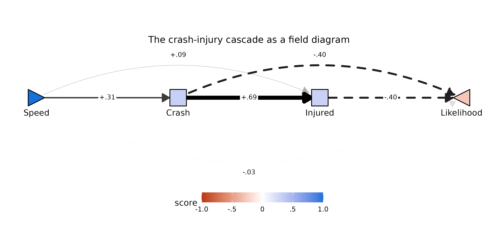

The diagram makes the chain’s verdict visible at a glance: the
production line along the baseline (`Speed → Crash → Injured`, with the
`.69` crash-injury edge the thickest in the field), the two dashed cost
routes arcing into `Likelihood` from above, and the residual direct
`Speed → Likelihood` arc below the chain rendered so faint it nearly
vanishes — the structural restatement of the near-zero `-.03` residual.
`Likelihood`’s pale red fill is the implied total at `Speed = 1`
propagated through every route.

#### The ticket-money chain

``` r

chain2 <- pathF(dat, order = c("Speed", "Ticket", "MoneyCost", "Likelihood"))
kable0(chain2$tidy[, c("param","est","se","z","pvalue")], digits = 3,
       caption = "Saturated cascade Speed -> Ticket -> MoneyCost -> Likelihood")
```

| param | est | se | z | pvalue |
|:---|---:|---:|---:|---:|
| f1_Speed_Ticket | .551 | .017 | 31.909 | .000 |
| f1_Speed_MoneyCost | -.001 | .020 | -.074 | .941 |
| f1_Ticket_MoneyCost | .255 | .039 | 6.544 | .000 |
| f1_Speed_Likelihood | .020 | .051 | .393 | .694 |
| f1_Ticket_Likelihood | -.492 | .077 | -6.376 | .000 |
| f1_MoneyCost_Likelihood | -.204 | .085 | -2.408 | .016 |
| f1_Speed_Ticket \* f1_Ticket_MoneyCost \* f1_MoneyCost_Likelihood | -.029 | .013 | -2.214 | .027 |
| f1_Speed_Ticket \* f1_Ticket_Likelihood | -.271 | .043 | -6.333 | .000 |
| f1_Speed_MoneyCost \* f1_MoneyCost_Likelihood | .000 | .004 | .074 | .941 |

Saturated cascade Speed -\> Ticket -\> MoneyCost -\> Likelihood {.table
style="width:100%;"}

Here the upstream attribution is nearly complete:
`F1[Speed,MoneyCost] = -.00` (*p* = .92) once `Ticket` is in the model.
Respondents do not appear to expect faster driving to cost money in
itself; the money-cost expectation moves with speed only by way of the
ticket expectation (`F1[Speed,Ticket] = .55`,
`F1[Ticket,MoneyCost] = .26`). The parallel fan reported a modest
positive `Speed → MoneyCost` loading; the cascade locates its origin one
step upstream.

#### Sliding-Z: moderation decomposed through a chain

The moderation decomposition generalizes along with the model. With a
single mediator, `Z`’s total moderation splits into an expectation term,
a valuation term, and a residual. In a chain, the same logic produces
one term per **edge position** as the moderator “slides” through the
route — for the two-mediator chain `X → M1 → M2 → Y`:

``` math
F_{Z}^{*}[X,Y] \;\approx\;
F_{Z}[X,M_1]\,F_{1}[M_1,M_2]\,F_{1}[M_2,Y] \;+\;
F_{1}[X,M_1]\,F_{Z}[M_1,M_2]\,F_{1}[M_2,Y] \;+\;
F_{1}[X,M_1]\,F_{1}[M_1,M_2]\,F_{Z}[M_2,Y] \;+\;
\cdots \;+\; F_{Z}[X,Y]
```

with the `⋯` collecting the analogous slide terms for the shorter
sub-routes of the saturated cascade, and `FZ[X,Y]` the residual direct
moderation.
[`pathF_decompose()`](https://dustin-wood.github.io/funfield/reference/pathF_decompose.md)
fits the bare total model alongside the cascade and tabulates every
term, their sum, and the gap between the sum and the total:

``` r

dec_pf <- pathF_decompose(dat2,
                          order = c("Speed", "Crash", "Injured", "Likelihood"),
                          Z = "SRFastDriver", Z.within = FALSE)
kable0(subset(dec_pf$components, block == "fZ")[, c("term","est","se","z","pvalue")],
       digits = 3,
       caption = "Sliding-Z decomposition of the fast-driver moderation through the crash-injury chain")
```

|  | term | est | se | z | pvalue |
|:---|:---|---:|---:|---:|---:|
| 8 | fZ_Speed_Crash \* f1_Crash_Injured \* f1_Injured_Likelihood | .015 | .005 | 2.742 | .006 |
| 9 | f1_Speed_Crash \* fZ_Crash_Injured \* f1_Injured_Likelihood | .001 | .005 | .202 | .840 |
| 10 | f1_Speed_Crash \* f1_Crash_Injured \* fZ_Injured_Likelihood | .012 | .023 | .504 | .615 |
| 11 | fZ_Speed_Crash \* f1_Crash_Likelihood | .023 | .008 | 2.918 | .004 |
| 12 | f1_Speed_Crash \* fZ_Crash_Likelihood | -.037 | .024 | -1.563 | .118 |
| 13 | fZ_Speed_Injured \* f1_Injured_Likelihood | .007 | .006 | 1.286 | .199 |
| 14 | f1_Speed_Injured \* fZ_Injured_Likelihood | .006 | .011 | .504 | .614 |
| 15 | fZ_Speed_Likelihood (direct) | .225 | .035 | 6.345 | .000 |
| 16 | sum (routes + direct) | .251 | NA | NA | NA |
| 17 | total (no-mediator) | .253 | .028 | NA | NA |
| 18 | gap (total - sum) | .002 | NA | NA | NA |

Sliding-Z decomposition of the fast-driver moderation through the
crash-injury chain {.table}

The total being decomposed is the same `FZ*[X,Y] ≈ .25` indexed in the
fast-driver section above. The only slide terms that reach significance
are the two where the moderation sits on the *first* edge —
`FZ[Speed,Crash]` propagating down the three-edge route (+.01, *p* =
.006) and down the two-edge route through `Crash` (+.02, *p* = .003).
That is the chain-level restatement of the expectation-route story from
the parallel analysis: self-described fast drivers expect less crash
risk from speed, and that one shifted expectation echoes down every
route it heads. The residual direct term (+.22) again absorbs what the
other seven mediators would carry.

The `sum (routes + direct)` and `total (no-mediator)` rows put the
approximation quality on the table: the first-order identity is accurate
here to about `.002` (the `gap` row), or under 1% of the total. Across
these data the gap stays similarly small for three-, four-, and
five-node chains — the dropped higher-order terms are products of two or
more `FZ` coefficients and shrink quickly. What *does* erode with chain
length is per-term precision: a route product of three or four small
coefficients has a small estimate and a wide relative SE, so individual
slide terms in long chains are rarely significant even when the
accounting as a whole is nearly exact.

The same moderated cascade as a field diagram —
[`plotPathF()`](https://dustin-wood.github.io/funfield/reference/plotPathF.md)
accepts the
[`pathF_decompose()`](https://dustin-wood.github.io/funfield/reference/pathF_decompose.md)
return directly, and each edge label carries the `F1` coefficient with
its gold `FZ` companion, following the package’s moderator-color
convention.
[`plotPathF_widget()`](https://dustin-wood.github.io/funfield/reference/plotPathF_widget.md)
stitches the diagram’s three *views* into a Back/Forward toggle at
pixel-identical layout: the decomposed field first, then the
**normative** frame (the same `F1` paths with the moderation hidden),
then the **moderation** frame (every edge swapped for its `FZ`
counterpart, all gold). Clicking **Forward** peels the one diagram apart
into its black and gold layers in place. The moderation frame is drawn
with `scale_max_moderation = .3` — tighter than the normative `.8` cap,
as elsewhere in this vignette, because `FZ` magnitudes run smaller:

``` r

plotPathF_widget(dec_pf, Z_label = "SRFast",
                 title = "The crash-injury cascade, moderated by fast-driver tendency",
                 scale_max_moderation = 0.3,
                 format = "svg")
```

![The crash-injury cascade, moderated by fast-driver
tendency](data:image/svg+xml;base64,PD94bWwgdmVyc2lvbj0nMS4wJyBlbmNvZGluZz0nVVRGLTgnID8+CjxzdmcgeG1sbnM9J2h0dHA6Ly93d3cudzMub3JnLzIwMDAvc3ZnJyB4bWxuczp4bGluaz0naHR0cDovL3d3dy53My5vcmcvMTk5OS94bGluaycgd2lkdGg9JzY0OC4wMHB0JyBoZWlnaHQ9JzMyNC4wMHB0JyB2aWV3Qm94PScwIDAgNjQ4LjAwIDMyNC4wMCc+CjxnIGNsYXNzPSdzdmdsaXRlJz4KPGRlZnM+CiAgPHN0eWxlIHR5cGU9J3RleHQvY3NzJz48IVtDREFUQVsKICAgIC5zdmdsaXRlIGxpbmUsIC5zdmdsaXRlIHBvbHlsaW5lLCAuc3ZnbGl0ZSBwb2x5Z29uLCAuc3ZnbGl0ZSBwYXRoLCAuc3ZnbGl0ZSByZWN0LCAuc3ZnbGl0ZSBjaXJjbGUgewogICAgICBmaWxsOiBub25lOwogICAgICBzdHJva2U6ICMwMDAwMDA7CiAgICAgIHN0cm9rZS1saW5lY2FwOiByb3VuZDsKICAgICAgc3Ryb2tlLWxpbmVqb2luOiByb3VuZDsKICAgICAgc3Ryb2tlLW1pdGVybGltaXQ6IDEwLjAwOwogICAgfQogICAgLnN2Z2xpdGUgdGV4dCB7CiAgICAgIHdoaXRlLXNwYWNlOiBwcmU7CiAgICB9CiAgICAuc3ZnbGl0ZSBnLmdseXBoZ3JvdXAgcGF0aCB7CiAgICAgIGZpbGw6IGluaGVyaXQ7CiAgICAgIHN0cm9rZTogbm9uZTsKICAgIH0KICBdXT48L3N0eWxlPgo8L2RlZnM+CjxyZWN0IHdpZHRoPScxMDAlJyBoZWlnaHQ9JzEwMCUnIHN0eWxlPSdzdHJva2U6IG5vbmU7IGZpbGw6ICNGRkZGRkY7Jy8+CjxkZWZzPgogIDxjbGlwUGF0aCBpZD0nY3BNQzR3TUh3Mk5EZ3VNREI4TUM0d01Id3pNalF1TURBPSc+CiAgICA8cmVjdCB4PScwLjAwJyB5PScwLjAwJyB3aWR0aD0nNjQ4LjAwJyBoZWlnaHQ9JzMyNC4wMCcgLz4KICA8L2NsaXBQYXRoPgo8L2RlZnM+CjxnIGNsaXAtcGF0aD0ndXJsKCNjcE1DNHdNSHcyTkRndU1EQjhNQzR3TUh3ek1qUXVNREE9KSc+CjwvZz4KPGRlZnM+CiAgPGNsaXBQYXRoIGlkPSdjcE1DNHdNSHcyTkRndU1EQjhOakV1TlRsOE1qWXlMalF4Jz4KICAgIDxyZWN0IHg9JzAuMDAnIHk9JzYxLjU5JyB3aWR0aD0nNjQ4LjAwJyBoZWlnaHQ9JzIwMC44MicgLz4KICA8L2NsaXBQYXRoPgo8L2RlZnM+CjxnIGNsaXAtcGF0aD0ndXJsKCNjcE1DNHdNSHcyTkRndU1EQjhOakV1TlRsOE1qWXlMalF4KSc+CjxyZWN0IHg9JzAuMDAnIHk9JzYxLjU5JyB3aWR0aD0nNjQ4LjAwJyBoZWlnaHQ9JzIwMC44Micgc3R5bGU9J3N0cm9rZS13aWR0aDogMC4wMDsgc3Ryb2tlOiBub25lOycgLz4KPC9nPgo8ZyBjbGlwLXBhdGg9J3VybCgjY3BNQzR3TUh3Mk5EZ3VNREI4TUM0d01Id3pNalF1TURBPSknPgo8cG9seWxpbmUgcG9pbnRzPSc1OS4xMiwxNDkuMjQgNjEuNDYsMTQ5LjI0IDYzLjc5LDE0OS4yNCA2Ni4xMiwxNDkuMjQgNjguNDYsMTQ5LjI0IDcwLjc5LDE0OS4yNCA3My4xMywxNDkuMjQgNzUuNDYsMTQ5LjI0IDc3Ljc5LDE0OS4yNCA4MC4xMywxNDkuMjQgODIuNDYsMTQ5LjI0IDg0Ljc5LDE0OS4yNCA4Ny4xMywxNDkuMjQgODkuNDYsMTQ5LjI0IDkxLjgwLDE0OS4yNCA5NC4xMywxNDkuMjQgOTYuNDYsMTQ5LjI0IDk4LjgwLDE0OS4yNCAxMDEuMTMsMTQ5LjI0IDEwMy40NiwxNDkuMjQgMTA1LjgwLDE0OS4yNCAxMDguMTMsMTQ5LjI0IDExMC40NiwxNDkuMjQgMTEyLjgwLDE0OS4yNCAxMTUuMTMsMTQ5LjI0IDExNy40NywxNDkuMjQgMTE5LjgwLDE0OS4yNCAxMjIuMTMsMTQ5LjI0IDEyNC40NywxNDkuMjQgMTI2LjgwLDE0OS4yNCAxMjkuMTMsMTQ5LjI0IDEzMS40NywxNDkuMjQgMTMzLjgwLDE0OS4yNCAxMzYuMTQsMTQ5LjI0IDEzOC40NywxNDkuMjQgMTQwLjgwLDE0OS4yNCAxNDMuMTQsMTQ5LjI0IDE0NS40NywxNDkuMjQgMTQ3LjgwLDE0OS4yNCAxNTAuMTQsMTQ5LjI0IDE1Mi40NywxNDkuMjQgMTU0LjgxLDE0OS4yNCAxNTcuMTQsMTQ5LjI0IDE1OS40NywxNDkuMjQgMTYxLjgxLDE0OS4yNCAxNjQuMTQsMTQ5LjI0IDE2Ni40NywxNDkuMjQgMTY4LjgxLDE0OS4yNCAxNzEuMTQsMTQ5LjI0IDE3My40OCwxNDkuMjQgMTc1LjgxLDE0OS4yNCAxNzguMTQsMTQ5LjI0IDE4MC40OCwxNDkuMjQgMTgyLjgxLDE0OS4yNCAxODUuMTQsMTQ5LjI0IDE4Ny40OCwxNDkuMjQgMTg5LjgxLDE0OS4yNCAxOTIuMTUsMTQ5LjI0IDE5NC40OCwxNDkuMjQgMTk2LjgxLDE0OS4yNCAxOTkuMTUsMTQ5LjI0IDIwMS40OCwxNDkuMjQgMjAzLjgxLDE0OS4yNCAyMDYuMTUsMTQ5LjI0IDIwOC40OCwxNDkuMjQgMjEwLjgxLDE0OS4yNCAyMTMuMTUsMTQ5LjI0IDIxNS40OCwxNDkuMjQgMjE3LjgyLDE0OS4yNCAyMjAuMTUsMTQ5LjI0ICcgc3R5bGU9J3N0cm9rZS13aWR0aDogMS43OTsgc3Ryb2tlOiAjM0IzQjNCOycgLz4KPHBvbHlnb24gcG9pbnRzPScyMTEuNDIsMTU0LjI4IDIyMC4xNSwxNDkuMjQgMjExLjQyLDE0NC4yMCAnIHN0eWxlPSdzdHJva2Utd2lkdGg6IDEuNzk7IHN0cm9rZTogIzNCM0IzQjsgZmlsbDogIzNCM0IzQjsnIC8+Cjxwb2x5bGluZSBwb2ludHM9JzU2Ljc5LDE0NS4wNyA2MS40NiwxNDMuMDYgNjYuMTIsMTQxLjExIDcwLjc5LDEzOS4yMiA3NS40NiwxMzcuMzggODAuMTMsMTM1LjU5IDg0Ljc5LDEzMy44NiA4OS40NiwxMzIuMTggOTQuMTMsMTMwLjU1IDk4LjgwLDEyOC45OCAxMDMuNDYsMTI3LjQ3IDEwOC4xMywxMjYuMDAgMTEyLjgwLDEyNC42MCAxMTcuNDcsMTIzLjI0IDEyMi4xMywxMjEuOTQgMTI2LjgwLDEyMC43MCAxMzEuNDcsMTE5LjUxIDEzNi4xNCwxMTguMzcgMTQwLjgwLDExNy4yOSAxNDUuNDcsMTE2LjI2IDE1MC4xNCwxMTUuMjggMTU0LjgxLDExNC4zNiAxNTkuNDcsMTEzLjQ5IDE2NC4xNCwxMTIuNjggMTY4LjgxLDExMS45MiAxNzMuNDgsMTExLjIyIDE3OC4xNCwxMTAuNTcgMTgyLjgxLDEwOS45NyAxODcuNDgsMTA5LjQzIDE5Mi4xNSwxMDguOTUgMTk2LjgxLDEwOC41MSAyMDEuNDgsMTA4LjEzIDIwNi4xNSwxMDcuODEgMjEwLjgxLDEwNy41NCAyMTUuNDgsMTA3LjMyIDIyMC4xNSwxMDcuMTYgMjI0LjgyLDEwNy4wNSAyMjkuNDgsMTA3LjAwIDIzNC4xNSwxMDcuMDAgMjM4LjgyLDEwNy4wNSAyNDMuNDksMTA3LjE2IDI0OC4xNSwxMDcuMzIgMjUyLjgyLDEwNy41NCAyNTcuNDksMTA3LjgxIDI2Mi4xNiwxMDguMTMgMjY2LjgyLDEwOC41MSAyNzEuNDksMTA4Ljk1IDI3Ni4xNiwxMDkuNDMgMjgwLjgzLDEwOS45NyAyODUuNDksMTEwLjU3IDI5MC4xNiwxMTEuMjIgMjk0LjgzLDExMS45MiAyOTkuNTAsMTEyLjY4IDMwNC4xNiwxMTMuNDkgMzA4LjgzLDExNC4zNiAzMTMuNTAsMTE1LjI4IDMxOC4xNywxMTYuMjYgMzIyLjgzLDExNy4yOSAzMjcuNTAsMTE4LjM3IDMzMi4xNywxMTkuNTEgMzM2Ljg0LDEyMC43MCAzNDEuNTAsMTIxLjk0IDM0Ni4xNywxMjMuMjQgMzUwLjg0LDEyNC42MCAzNTUuNTEsMTI2LjAwIDM2MC4xNywxMjcuNDcgMzY0Ljg0LDEyOC45OCAzNjkuNTEsMTMwLjU1IDM3NC4xNywxMzIuMTggMzc4Ljg0LDEzMy44NiAzODMuNTEsMTM1LjU5IDM4OC4xOCwxMzcuMzggMzkyLjg0LDEzOS4yMiAzOTcuNTEsMTQxLjExIDQwMi4xOCwxNDMuMDYgJyBzdHlsZT0nc3Ryb2tlLXdpZHRoOiAwLjQ1OyBzdHJva2U6ICNBQkFCQUI7JyAvPgo8cG9seWdvbiBwb2ludHM9JzM5Mi4xOCwxNDQuMzUgNDAyLjE4LDE0My4wNiAzOTYuMDcsMTM1LjA1ICcgc3R5bGU9J3N0cm9rZS13aWR0aDogMC40NTsgc3Ryb2tlOiAjQUJBQkFCOyBmaWxsOiAjQUJBQkFCOycgLz4KPHBvbHlsaW5lIHBvaW50cz0nMjQzLjQ5LDE0OS4yNCAyNDUuODIsMTQ5LjI0IDI0OC4xNSwxNDkuMjQgMjUwLjQ5LDE0OS4yNCAyNTIuODIsMTQ5LjI0IDI1NS4xNiwxNDkuMjQgMjU3LjQ5LDE0OS4yNCAyNTkuODIsMTQ5LjI0IDI2Mi4xNiwxNDkuMjQgMjY0LjQ5LDE0OS4yNCAyNjYuODIsMTQ5LjI0IDI2OS4xNiwxNDkuMjQgMjcxLjQ5LDE0OS4yNCAyNzMuODMsMTQ5LjI0IDI3Ni4xNiwxNDkuMjQgMjc4LjQ5LDE0OS4yNCAyODAuODMsMTQ5LjI0IDI4My4xNiwxNDkuMjQgMjg1LjQ5LDE0OS4yNCAyODcuODMsMTQ5LjI0IDI5MC4xNiwxNDkuMjQgMjkyLjQ5LDE0OS4yNCAyOTQuODMsMTQ5LjI0IDI5Ny4xNiwxNDkuMjQgMjk5LjUwLDE0OS4yNCAzMDEuODMsMTQ5LjI0IDMwNC4xNiwxNDkuMjQgMzA2LjUwLDE0OS4yNCAzMDguODMsMTQ5LjI0IDMxMS4xNiwxNDkuMjQgMzEzLjUwLDE0OS4yNCAzMTUuODMsMTQ5LjI0IDMxOC4xNywxNDkuMjQgMzIwLjUwLDE0OS4yNCAzMjIuODMsMTQ5LjI0IDMyNS4xNywxNDkuMjQgMzI3LjUwLDE0OS4yNCAzMjkuODMsMTQ5LjI0IDMzMi4xNywxNDkuMjQgMzM0LjUwLDE0OS4yNCAzMzYuODQsMTQ5LjI0IDMzOS4xNywxNDkuMjQgMzQxLjUwLDE0OS4yNCAzNDMuODQsMTQ5LjI0IDM0Ni4xNywxNDkuMjQgMzQ4LjUwLDE0OS4yNCAzNTAuODQsMTQ5LjI0IDM1My4xNywxNDkuMjQgMzU1LjUxLDE0OS4yNCAzNTcuODQsMTQ5LjI0IDM2MC4xNywxNDkuMjQgMzYyLjUxLDE0OS4yNCAzNjQuODQsMTQ5LjI0IDM2Ny4xNywxNDkuMjQgMzY5LjUxLDE0OS4yNCAzNzEuODQsMTQ5LjI0IDM3NC4xNywxNDkuMjQgMzc2LjUxLDE0OS4yNCAzNzguODQsMTQ5LjI0IDM4MS4xOCwxNDkuMjQgMzgzLjUxLDE0OS4yNCAzODUuODQsMTQ5LjI0IDM4OC4xOCwxNDkuMjQgMzkwLjUxLDE0OS4yNCAzOTIuODQsMTQ5LjI0IDM5NS4xOCwxNDkuMjQgMzk3LjUxLDE0OS4yNCAzOTkuODUsMTQ5LjI0IDQwMi4xOCwxNDkuMjQgNDA0LjUxLDE0OS4yNCAnIHN0eWxlPSdzdHJva2Utd2lkdGg6IDUuMDg7IHN0cm9rZTogIzAxMDEwMTsnIC8+Cjxwb2x5Z29uIHBvaW50cz0nMzk1Ljc4LDE1NC4yOCA0MDQuNTEsMTQ5LjI0IDM5NS43OCwxNDQuMjAgJyBzdHlsZT0nc3Ryb2tlLXdpZHRoOiA1LjA4OyBzdHJva2U6ICMwMTAxMDE7IGZpbGw6ICMwMTAxMDE7JyAvPgo8cG9seWxpbmUgcG9pbnRzPSc1NC40NiwxNTMuNDYgNjEuNDYsMTU3LjU4IDY4LjQ2LDE2MS41OSA3NS40NiwxNjUuNDkgODIuNDYsMTY5LjI4IDg5LjQ2LDE3Mi45NiA5Ni40NiwxNzYuNTMgMTAzLjQ2LDE4MC4wMCAxMTAuNDYsMTgzLjM2IDExNy40NywxODYuNjEgMTI0LjQ3LDE4OS43NSAxMzEuNDcsMTkyLjc4IDEzOC40NywxOTUuNzEgMTQ1LjQ3LDE5OC41MiAxNTIuNDcsMjAxLjIzIDE1OS40NywyMDMuODMgMTY2LjQ3LDIwNi4zMiAxNzMuNDgsMjA4LjcwIDE4MC40OCwyMTAuOTggMTg3LjQ4LDIxMy4xNSAxOTQuNDgsMjE1LjIwIDIwMS40OCwyMTcuMTUgMjA4LjQ4LDIxOC45OSAyMTUuNDgsMjIwLjczIDIyMi40OCwyMjIuMzUgMjI5LjQ4LDIyMy44NyAyMzYuNDksMjI1LjI4IDI0My40OSwyMjYuNTggMjUwLjQ5LDIyNy43NyAyNTcuNDksMjI4Ljg1IDI2NC40OSwyMjkuODMgMjcxLjQ5LDIzMC42OSAyNzguNDksMjMxLjQ1IDI4NS40OSwyMzIuMTAgMjkyLjQ5LDIzMi42NCAyOTkuNTAsMjMzLjA4IDMwNi41MCwyMzMuNDAgMzEzLjUwLDIzMy42MiAzMjAuNTAsMjMzLjczIDMyNy41MCwyMzMuNzMgMzM0LjUwLDIzMy42MiAzNDEuNTAsMjMzLjQwIDM0OC41MCwyMzMuMDggMzU1LjUxLDIzMi42NCAzNjIuNTEsMjMyLjEwIDM2OS41MSwyMzEuNDUgMzc2LjUxLDIzMC42OSAzODMuNTEsMjI5LjgzIDM5MC41MSwyMjguODUgMzk3LjUxLDIyNy43NyA0MDQuNTEsMjI2LjU4IDQxMS41MSwyMjUuMjggNDE4LjUyLDIyMy44NyA0MjUuNTIsMjIyLjM1IDQzMi41MiwyMjAuNzMgNDM5LjUyLDIxOC45OSA0NDYuNTIsMjE3LjE1IDQ1My41MiwyMTUuMjAgNDYwLjUyLDIxMy4xNSA0NjcuNTIsMjEwLjk4IDQ3NC41MiwyMDguNzAgNDgxLjUzLDIwNi4zMiA0ODguNTMsMjAzLjgzIDQ5NS41MywyMDEuMjMgNTAyLjUzLDE5OC41MiA1MDkuNTMsMTk1LjcxIDUxNi41MywxOTIuNzggNTIzLjUzLDE4OS43NSA1MzAuNTMsMTg2LjYxIDUzNy41NCwxODMuMzYgNTQ0LjU0LDE4MC4wMCA1NTEuNTQsMTc2LjUzIDU1OC41NCwxNzIuOTYgNTY1LjU0LDE2OS4yOCA1NzIuNTQsMTY1LjQ5IDU3OS41NCwxNjEuNTkgNTg2LjU0LDE1Ny41OCA1OTMuNTQsMTUzLjQ2ICcgc3R5bGU9J3N0cm9rZS13aWR0aDogMC4zODsgc3Ryb2tlOiAjQjZCNkI2OyBzdHJva2UtZGFzaGFycmF5OiA0LjAwLDQuMDA7JyAvPgo8cG9seWdvbiBwb2ludHM9JzU4OC41NywxNjIuMjMgNTkzLjU0LDE1My40NiA1ODMuNDYsMTUzLjU0ICcgc3R5bGU9J3N0cm9rZS13aWR0aDogMC4zODsgc3Ryb2tlOiAjQjZCNkI2OyBzdHJva2UtZGFzaGFycmF5OiA0LjAwLDQuMDA7IGZpbGw6ICNCNkI2QjY7JyAvPgo8cG9seWxpbmUgcG9pbnRzPScyNDUuODIsMTQzLjA2IDI1MC40OSwxNDEuMTEgMjU1LjE2LDEzOS4yMiAyNTkuODIsMTM3LjM4IDI2NC40OSwxMzUuNTkgMjY5LjE2LDEzMy44NiAyNzMuODMsMTMyLjE4IDI3OC40OSwxMzAuNTUgMjgzLjE2LDEyOC45OCAyODcuODMsMTI3LjQ3IDI5Mi40OSwxMjYuMDAgMjk3LjE2LDEyNC42MCAzMDEuODMsMTIzLjI0IDMwNi41MCwxMjEuOTQgMzExLjE2LDEyMC43MCAzMTUuODMsMTE5LjUxIDMyMC41MCwxMTguMzcgMzI1LjE3LDExNy4yOSAzMjkuODMsMTE2LjI2IDMzNC41MCwxMTUuMjggMzM5LjE3LDExNC4zNiAzNDMuODQsMTEzLjQ5IDM0OC41MCwxMTIuNjggMzUzLjE3LDExMS45MiAzNTcuODQsMTExLjIyIDM2Mi41MSwxMTAuNTcgMzY3LjE3LDEwOS45NyAzNzEuODQsMTA5LjQzIDM3Ni41MSwxMDguOTUgMzgxLjE4LDEwOC41MSAzODUuODQsMTA4LjEzIDM5MC41MSwxMDcuODEgMzk1LjE4LDEwNy41NCAzOTkuODUsMTA3LjMyIDQwNC41MSwxMDcuMTYgNDA5LjE4LDEwNy4wNSA0MTMuODUsMTA3LjAwIDQxOC41MiwxMDcuMDAgNDIzLjE4LDEwNy4wNSA0MjcuODUsMTA3LjE2IDQzMi41MiwxMDcuMzIgNDM3LjE5LDEwNy41NCA0NDEuODUsMTA3LjgxIDQ0Ni41MiwxMDguMTMgNDUxLjE5LDEwOC41MSA0NTUuODUsMTA4Ljk1IDQ2MC41MiwxMDkuNDMgNDY1LjE5LDEwOS45NyA0NjkuODYsMTEwLjU3IDQ3NC41MiwxMTEuMjIgNDc5LjE5LDExMS45MiA0ODMuODYsMTEyLjY4IDQ4OC41MywxMTMuNDkgNDkzLjE5LDExNC4zNiA0OTcuODYsMTE1LjI4IDUwMi41MywxMTYuMjYgNTA3LjIwLDExNy4yOSA1MTEuODYsMTE4LjM3IDUxNi41MywxMTkuNTEgNTIxLjIwLDEyMC43MCA1MjUuODcsMTIxLjk0IDUzMC41MywxMjMuMjQgNTM1LjIwLDEyNC42MCA1MzkuODcsMTI2LjAwIDU0NC41NCwxMjcuNDcgNTQ5LjIwLDEyOC45OCA1NTMuODcsMTMwLjU1IDU1OC41NCwxMzIuMTggNTYzLjIxLDEzMy44NiA1NjcuODcsMTM1LjU5IDU3Mi41NCwxMzcuMzggNTc3LjIxLDEzOS4yMiA1ODEuODgsMTQxLjExIDU4Ni41NCwxNDMuMDYgNTkxLjIxLDE0NS4wNyAnIHN0eWxlPSdzdHJva2Utd2lkdGg6IDEuOTk7IHN0cm9rZTogIzMyMzIzMjsgc3Ryb2tlLWRhc2hhcnJheTogMTAuNjMsMTAuNjM7JyAvPgo8cG9seWdvbiBwb2ludHM9JzU4MS4yMCwxNDYuMjYgNTkxLjIxLDE0NS4wNyA1ODUuMTgsMTM2Ljk5ICcgc3R5bGU9J3N0cm9rZS13aWR0aDogMS45OTsgc3Ryb2tlOiAjMzIzMjMyOyBzdHJva2UtZGFzaGFycmF5OiAxMC42MywxMC42MzsgZmlsbDogIzMyMzIzMjsnIC8+Cjxwb2x5bGluZSBwb2ludHM9JzQyNy44NSwxNDkuMjQgNDMwLjE4LDE0OS4yNCA0MzIuNTIsMTQ5LjI0IDQzNC44NSwxNDkuMjQgNDM3LjE5LDE0OS4yNCA0MzkuNTIsMTQ5LjI0IDQ0MS44NSwxNDkuMjQgNDQ0LjE5LDE0OS4yNCA0NDYuNTIsMTQ5LjI0IDQ0OC44NSwxNDkuMjQgNDUxLjE5LDE0OS4yNCA0NTMuNTIsMTQ5LjI0IDQ1NS44NSwxNDkuMjQgNDU4LjE5LDE0OS4yNCA0NjAuNTIsMTQ5LjI0IDQ2Mi44NiwxNDkuMjQgNDY1LjE5LDE0OS4yNCA0NjcuNTIsMTQ5LjI0IDQ2OS44NiwxNDkuMjQgNDcyLjE5LDE0OS4yNCA0NzQuNTIsMTQ5LjI0IDQ3Ni44NiwxNDkuMjQgNDc5LjE5LDE0OS4yNCA0ODEuNTMsMTQ5LjI0IDQ4My44NiwxNDkuMjQgNDg2LjE5LDE0OS4yNCA0ODguNTMsMTQ5LjI0IDQ5MC44NiwxNDkuMjQgNDkzLjE5LDE0OS4yNCA0OTUuNTMsMTQ5LjI0IDQ5Ny44NiwxNDkuMjQgNTAwLjIwLDE0OS4yNCA1MDIuNTMsMTQ5LjI0IDUwNC44NiwxNDkuMjQgNTA3LjIwLDE0OS4yNCA1MDkuNTMsMTQ5LjI0IDUxMS44NiwxNDkuMjQgNTE0LjIwLDE0OS4yNCA1MTYuNTMsMTQ5LjI0IDUxOC44NywxNDkuMjQgNTIxLjIwLDE0OS4yNCA1MjMuNTMsMTQ5LjI0IDUyNS44NywxNDkuMjQgNTI4LjIwLDE0OS4yNCA1MzAuNTMsMTQ5LjI0IDUzMi44NywxNDkuMjQgNTM1LjIwLDE0OS4yNCA1MzcuNTQsMTQ5LjI0IDUzOS44NywxNDkuMjQgNTQyLjIwLDE0OS4yNCA1NDQuNTQsMTQ5LjI0IDU0Ni44NywxNDkuMjQgNTQ5LjIwLDE0OS4yNCA1NTEuNTQsMTQ5LjI0IDU1My44NywxNDkuMjQgNTU2LjIwLDE0OS4yNCA1NTguNTQsMTQ5LjI0IDU2MC44NywxNDkuMjQgNTYzLjIxLDE0OS4yNCA1NjUuNTQsMTQ5LjI0IDU2Ny44NywxNDkuMjQgNTcwLjIxLDE0OS4yNCA1NzIuNTQsMTQ5LjI0IDU3NC44NywxNDkuMjQgNTc3LjIxLDE0OS4yNCA1NzkuNTQsMTQ5LjI0IDU4MS44OCwxNDkuMjQgNTg0LjIxLDE0OS4yNCA1ODYuNTQsMTQ5LjI0IDU4OC44OCwxNDkuMjQgJyBzdHlsZT0nc3Ryb2tlLXdpZHRoOiAxLjg4OyBzdHJva2U6ICMzNzM3Mzc7IHN0cm9rZS1kYXNoYXJyYXk6IDEwLjAxLDEwLjAxOycgLz4KPHBvbHlnb24gcG9pbnRzPSc1ODAuMTUsMTU0LjI4IDU4OC44OCwxNDkuMjQgNTgwLjE1LDE0NC4yMCAnIHN0eWxlPSdzdHJva2Utd2lkdGg6IDEuODg7IHN0cm9rZTogIzM3MzczNzsgc3Ryb2tlLWRhc2hhcnJheTogMTAuMDEsMTAuMDE7IGZpbGw6ICMzNzM3Mzc7JyAvPgo8cG9seWdvbiBwb2ludHM9JzEwNi4zMSwxNTQuNTAgMTcyLjk2LDE1NC41MCAxNzIuODgsMTU0LjUwIDE3My4yMiwxNTQuNDggMTczLjU2LDE1NC40MSAxNzMuODksMTU0LjI5IDE3NC4xOSwxNTQuMTIgMTc0LjQ2LDE1My45MCAxNzQuNjksMTUzLjY0IDE3NC44OCwxNTMuMzQgMTc1LjAxLDE1My4wMiAxNzUuMTAsMTUyLjY4IDE3NS4xMiwxNTIuMzQgMTc1LjEyLDE1Mi4zNCAxNzUuMTIsMTQ2LjE0IDE3NS4xMiwxNDYuMTQgMTc1LjEwLDE0NS43OSAxNzUuMDEsMTQ1LjQ1IDE3NC44OCwxNDUuMTQgMTc0LjY5LDE0NC44NCAxNzQuNDYsMTQ0LjU4IDE3NC4xOSwxNDQuMzYgMTczLjg5LDE0NC4xOSAxNzMuNTYsMTQ0LjA2IDE3My4yMiwxNDMuOTkgMTcyLjk2LDE0My45OCAxMDYuMzEsMTQzLjk4IDEwNi41NywxNDMuOTkgMTA2LjIyLDE0My45OCAxMDUuODgsMTQ0LjAyIDEwNS41NCwxNDQuMTIgMTA1LjIzLDE0NC4yNyAxMDQuOTQsMTQ0LjQ3IDEwNC42OSwxNDQuNzEgMTA0LjQ4LDE0NC45OCAxMDQuMzIsMTQ1LjI5IDEwNC4yMSwxNDUuNjIgMTA0LjE2LDE0NS45NyAxMDQuMTUsMTQ2LjE0IDEwNC4xNSwxNTIuMzQgMTA0LjE2LDE1Mi4xNiAxMDQuMTYsMTUyLjUxIDEwNC4yMSwxNTIuODYgMTA0LjMyLDE1My4xOCAxMDQuNDgsMTUzLjQ5IDEwNC42OSwxNTMuNzcgMTA0Ljk0LDE1NC4wMSAxMDUuMjMsMTU0LjIxIDEwNS41NCwxNTQuMzYgMTA1Ljg4LDE1NC40NSAxMDYuMjIsMTU0LjUwICcgc3R5bGU9J3N0cm9rZS13aWR0aDogMC4wMDsgZmlsbDogI0ZGRkZGRjsnIC8+Cjx0ZXh0IHg9JzEwNS41OScgeT0nMTUxLjI5JyBzdHlsZT0nZm9udC1zaXplOiA4LjU0cHg7IGZvbnQtZmFtaWx5OiAiTGliZXJhdGlvbiBTYW5zIjsnIHRleHRMZW5ndGg9JzE2Ljg2cHgnIGxlbmd0aEFkanVzdD0nc3BhY2luZ0FuZEdseXBocyc+Ky4zMTwvdGV4dD4KPHRleHQgeD0nMTI0LjgyJyB5PScxNTEuMjknIHN0eWxlPSdmb250LXNpemU6IDguNTRweDtmaWxsOiAjRjZCRTAwOyBmb250LWZhbWlseTogIkxpYmVyYXRpb24gU2FucyI7JyB0ZXh0TGVuZ3RoPSc0OC44NnB4JyBsZW5ndGhBZGp1c3Q9J3NwYWNpbmdBbmRHbHlwaHMnPi0uMDcoU1JGYXN0KTwvdGV4dD4KPHBvbHlnb24gcG9pbnRzPScxOTguNDksOTkuMTkgMjY1LjE1LDk5LjE5IDI2NS4wNiw5OS4xOSAyNjUuNDEsOTkuMTcgMjY1Ljc1LDk5LjEwIDI2Ni4wNyw5OC45OCAyNjYuMzcsOTguODEgMjY2LjY0LDk4LjU5IDI2Ni44Nyw5OC4zMyAyNjcuMDYsOTguMDMgMjY3LjE5LDk3LjcxIDI2Ny4yOCw5Ny4zOCAyNjcuMzEsOTcuMDMgMjY3LjMxLDk3LjAzIDI2Ny4zMSw5MC44MyAyNjcuMzEsOTAuODMgMjY3LjI4LDkwLjQ4IDI2Ny4xOSw5MC4xNSAyNjcuMDYsODkuODMgMjY2Ljg3LDg5LjUzIDI2Ni42NCw4OS4yNyAyNjYuMzcsODkuMDUgMjY2LjA3LDg4Ljg4IDI2NS43NSw4OC43NiAyNjUuNDEsODguNjkgMjY1LjE1LDg4LjY3IDE5OC40OSw4OC42NyAxOTguNzUsODguNjkgMTk4LjQwLDg4LjY3IDE5OC4wNiw4OC43MSAxOTcuNzMsODguODEgMTk3LjQxLDg4Ljk2IDE5Ny4xMyw4OS4xNiAxOTYuODcsODkuNDAgMTk2LjY3LDg5LjY4IDE5Ni41MCw4OS45OCAxOTYuMzksOTAuMzEgMTk2LjM0LDkwLjY2IDE5Ni4zMyw5MC44MyAxOTYuMzMsOTcuMDMgMTk2LjM0LDk2Ljg2IDE5Ni4zNCw5Ny4yMCAxOTYuMzksOTcuNTUgMTk2LjUwLDk3Ljg4IDE5Ni42Nyw5OC4xOCAxOTYuODcsOTguNDYgMTk3LjEzLDk4LjcwIDE5Ny40MSw5OC45MCAxOTcuNzMsOTkuMDUgMTk4LjA2LDk5LjE1IDE5OC40MCw5OS4xOSAnIHN0eWxlPSdzdHJva2Utd2lkdGg6IDAuMDA7IGZpbGw6ICNGRkZGRkY7JyAvPgo8dGV4dCB4PScxOTcuNzcnIHk9Jzk1Ljk4JyBzdHlsZT0nZm9udC1zaXplOiA4LjU0cHg7IGZvbnQtZmFtaWx5OiAiTGliZXJhdGlvbiBTYW5zIjsnIHRleHRMZW5ndGg9JzE2Ljg2cHgnIGxlbmd0aEFkanVzdD0nc3BhY2luZ0FuZEdseXBocyc+Ky4xMDwvdGV4dD4KPHRleHQgeD0nMjE3LjAxJyB5PSc5NS45OCcgc3R5bGU9J2ZvbnQtc2l6ZTogOC41NHB4O2ZpbGw6ICNGNkJFMDA7IGZvbnQtZmFtaWx5OiAiTGliZXJhdGlvbiBTYW5zIjsnIHRleHRMZW5ndGg9JzQ4Ljg2cHgnIGxlbmd0aEFkanVzdD0nc3BhY2luZ0FuZEdseXBocyc+LS4wMihTUkZhc3QpPC90ZXh0Pgo8cG9seWdvbiBwb2ludHM9JzI5MC42NywxNTQuNTAgMzU3LjMzLDE1NC41MCAzNTcuMjQsMTU0LjUwIDM1Ny41OSwxNTQuNDggMzU3LjkzLDE1NC40MSAzNTguMjUsMTU0LjI5IDM1OC41NSwxNTQuMTIgMzU4LjgyLDE1My45MCAzNTkuMDUsMTUzLjY0IDM1OS4yNCwxNTMuMzQgMzU5LjM4LDE1My4wMiAzNTkuNDYsMTUyLjY4IDM1OS40OSwxNTIuMzQgMzU5LjQ5LDE1Mi4zNCAzNTkuNDksMTQ2LjE0IDM1OS40OSwxNDYuMTQgMzU5LjQ2LDE0NS43OSAzNTkuMzgsMTQ1LjQ1IDM1OS4yNCwxNDUuMTQgMzU5LjA1LDE0NC44NCAzNTguODIsMTQ0LjU4IDM1OC41NSwxNDQuMzYgMzU4LjI1LDE0NC4xOSAzNTcuOTMsMTQ0LjA2IDM1Ny41OSwxNDMuOTkgMzU3LjMzLDE0My45OCAyOTAuNjcsMTQzLjk4IDI5MC45MywxNDMuOTkgMjkwLjU5LDE0My45OCAyOTAuMjQsMTQ0LjAyIDI4OS45MSwxNDQuMTIgMjg5LjU5LDE0NC4yNyAyODkuMzEsMTQ0LjQ3IDI4OS4wNiwxNDQuNzEgMjg4Ljg1LDE0NC45OCAyODguNjksMTQ1LjI5IDI4OC41OCwxNDUuNjIgMjg4LjUyLDE0NS45NyAyODguNTEsMTQ2LjE0IDI4OC41MSwxNTIuMzQgMjg4LjUyLDE1Mi4xNiAyODguNTIsMTUyLjUxIDI4OC41OCwxNTIuODYgMjg4LjY5LDE1My4xOCAyODguODUsMTUzLjQ5IDI4OS4wNiwxNTMuNzcgMjg5LjMxLDE1NC4wMSAyODkuNTksMTU0LjIxIDI4OS45MSwxNTQuMzYgMjkwLjI0LDE1NC40NSAyOTAuNTksMTU0LjUwICcgc3R5bGU9J3N0cm9rZS13aWR0aDogMC4wMDsgZmlsbDogI0ZGRkZGRjsnIC8+Cjx0ZXh0IHg9JzI4OS45NScgeT0nMTUxLjI5JyBzdHlsZT0nZm9udC1zaXplOiA4LjU0cHg7IGZvbnQtZmFtaWx5OiAiTGliZXJhdGlvbiBTYW5zIjsnIHRleHRMZW5ndGg9JzE2Ljg2cHgnIGxlbmd0aEFkanVzdD0nc3BhY2luZ0FuZEdseXBocyc+Ky42NzwvdGV4dD4KPHRleHQgeD0nMzA5LjE5JyB5PScxNTEuMjknIHN0eWxlPSdmb250LXNpemU6IDguNTRweDtmaWxsOiAjRjZCRTAwOyBmb250LWZhbWlseTogIkxpYmVyYXRpb24gU2FucyI7JyB0ZXh0TGVuZ3RoPSc0OC44NnB4JyBsZW5ndGhBZGp1c3Q9J3NwYWNpbmdBbmRHbHlwaHMnPi0uMDEoU1JGYXN0KTwvdGV4dD4KPHBvbHlnb24gcG9pbnRzPScyOTAuNjcsMjUyLjA2IDM1Ny4zMywyNTIuMDYgMzU3LjI0LDI1Mi4wNiAzNTcuNTksMjUyLjA0IDM1Ny45MywyNTEuOTcgMzU4LjI1LDI1MS44NSAzNTguNTUsMjUxLjY3IDM1OC44MiwyNTEuNDYgMzU5LjA1LDI1MS4xOSAzNTkuMjQsMjUwLjkwIDM1OS4zOCwyNTAuNTggMzU5LjQ2LDI1MC4yNCAzNTkuNDksMjQ5LjkwIDM1OS40OSwyNDkuOTAgMzU5LjQ5LDI0My43MCAzNTkuNDksMjQzLjcwIDM1OS40NiwyNDMuMzUgMzU5LjM4LDI0My4wMSAzNTkuMjQsMjQyLjY5IDM1OS4wNSwyNDIuNDAgMzU4LjgyLDI0Mi4xNCAzNTguNTUsMjQxLjkyIDM1OC4yNSwyNDEuNzUgMzU3LjkzLDI0MS42MiAzNTcuNTksMjQxLjU1IDM1Ny4zMywyNDEuNTQgMjkwLjY3LDI0MS41NCAyOTAuOTMsMjQxLjU1IDI5MC41OSwyNDEuNTQgMjkwLjI0LDI0MS41OCAyODkuOTEsMjQxLjY4IDI4OS41OSwyNDEuODMgMjg5LjMxLDI0Mi4wMiAyODkuMDYsMjQyLjI3IDI4OC44NSwyNDIuNTQgMjg4LjY5LDI0Mi44NSAyODguNTgsMjQzLjE4IDI4OC41MiwyNDMuNTIgMjg4LjUxLDI0My43MCAyODguNTEsMjQ5LjkwIDI4OC41MiwyNDkuNzIgMjg4LjUyLDI1MC4wNyAyODguNTgsMjUwLjQxIDI4OC42OSwyNTAuNzQgMjg4Ljg1LDI1MS4wNSAyODkuMDYsMjUxLjMzIDI4OS4zMSwyNTEuNTcgMjg5LjU5LDI1MS43NyAyODkuOTEsMjUxLjkyIDI5MC4yNCwyNTIuMDEgMjkwLjU5LDI1Mi4wNiAnIHN0eWxlPSdzdHJva2Utd2lkdGg6IDAuMDA7IGZpbGw6ICNGRkZGRkY7JyAvPgo8dGV4dCB4PScyODkuOTUnIHk9JzI0OC44NScgc3R5bGU9J2ZvbnQtc2l6ZTogOC41NHB4OyBmb250LWZhbWlseTogIkxpYmVyYXRpb24gU2FucyI7JyB0ZXh0TGVuZ3RoPScxNC43MnB4JyBsZW5ndGhBZGp1c3Q9J3NwYWNpbmdBbmRHbHlwaHMnPi0uMDg8L3RleHQ+Cjx0ZXh0IHg9JzMwNy4wNScgeT0nMjQ4Ljg1JyBzdHlsZT0nZm9udC1zaXplOiA4LjU0cHg7ZmlsbDogI0Y2QkUwMDsgZm9udC1mYW1pbHk6ICJMaWJlcmF0aW9uIFNhbnMiOycgdGV4dExlbmd0aD0nNTEuMDBweCcgbGVuZ3RoQWRqdXN0PSdzcGFjaW5nQW5kR2x5cGhzJz4rLjIyKFNSRmFzdCk8L3RleHQ+Cjxwb2x5Z29uIHBvaW50cz0nMzgzLjkzLDk5LjE5IDQ0OC40NCw5OS4xOSA0NDguMzUsOTkuMTkgNDQ4LjcwLDk5LjE3IDQ0OS4wNCw5OS4xMCA0NDkuMzYsOTguOTggNDQ5LjY3LDk4LjgxIDQ0OS45Myw5OC41OSA0NTAuMTcsOTguMzMgNDUwLjM1LDk4LjAzIDQ1MC40OSw5Ny43MSA0NTAuNTcsOTcuMzggNDUwLjYwLDk3LjAzIDQ1MC42MCw5Ny4wMyA0NTAuNjAsOTAuODMgNDUwLjYwLDkwLjgzIDQ1MC41Nyw5MC40OCA0NTAuNDksOTAuMTUgNDUwLjM1LDg5LjgzIDQ1MC4xNyw4OS41MyA0NDkuOTMsODkuMjcgNDQ5LjY3LDg5LjA1IDQ0OS4zNiw4OC44OCA0NDkuMDQsODguNzYgNDQ4LjcwLDg4LjY5IDQ0OC40NCw4OC42NyAzODMuOTMsODguNjcgMzg0LjE5LDg4LjY5IDM4My44NCw4OC42NyAzODMuNDksODguNzEgMzgzLjE2LDg4LjgxIDM4Mi44NSw4OC45NiAzODIuNTYsODkuMTYgMzgyLjMxLDg5LjQwIDM4Mi4xMCw4OS42OCAzODEuOTQsODkuOTggMzgxLjgzLDkwLjMxIDM4MS43Nyw5MC42NiAzODEuNzcsOTAuODMgMzgxLjc3LDk3LjAzIDM4MS43Nyw5Ni44NiAzODEuNzcsOTcuMjAgMzgxLjgzLDk3LjU1IDM4MS45NCw5Ny44OCAzODIuMTAsOTguMTggMzgyLjMxLDk4LjQ2IDM4Mi41Niw5OC43MCAzODIuODUsOTguOTAgMzgzLjE2LDk5LjA1IDM4My40OSw5OS4xNSAzODMuODQsOTkuMTkgJyBzdHlsZT0nc3Ryb2tlLXdpZHRoOiAwLjAwOyBmaWxsOiAjRkZGRkZGOycgLz4KPHRleHQgeD0nMzgzLjIxJyB5PSc5NS45OCcgc3R5bGU9J2ZvbnQtc2l6ZTogOC41NHB4OyBmb250LWZhbWlseTogIkxpYmVyYXRpb24gU2FucyI7JyB0ZXh0TGVuZ3RoPScxNC43MnB4JyBsZW5ndGhBZGp1c3Q9J3NwYWNpbmdBbmRHbHlwaHMnPi0uMzM8L3RleHQ+Cjx0ZXh0IHg9JzQwMC4zMCcgeT0nOTUuOTgnIHN0eWxlPSdmb250LXNpemU6IDguNTRweDtmaWxsOiAjRjZCRTAwOyBmb250LWZhbWlseTogIkxpYmVyYXRpb24gU2FucyI7JyB0ZXh0TGVuZ3RoPSc0OC44NnB4JyBsZW5ndGhBZGp1c3Q9J3NwYWNpbmdBbmRHbHlwaHMnPi0uMTIoU1JGYXN0KTwvdGV4dD4KPHBvbHlnb24gcG9pbnRzPSc0NzUuMDQsMTU0LjUwIDU0MS42OSwxNTQuNTAgNTQxLjYwLDE1NC41MCA1NDEuOTUsMTU0LjQ4IDU0Mi4yOSwxNTQuNDEgNTQyLjYyLDE1NC4yOSA1NDIuOTIsMTU0LjEyIDU0My4xOSwxNTMuOTAgNTQzLjQyLDE1My42NCA1NDMuNjAsMTUzLjM0IDU0My43NCwxNTMuMDIgNTQzLjgyLDE1Mi42OCA1NDMuODUsMTUyLjM0IDU0My44NSwxNTIuMzQgNTQzLjg1LDE0Ni4xNCA1NDMuODUsMTQ2LjE0IDU0My44MiwxNDUuNzkgNTQzLjc0LDE0NS40NSA1NDMuNjAsMTQ1LjE0IDU0My40MiwxNDQuODQgNTQzLjE5LDE0NC41OCA1NDIuOTIsMTQ0LjM2IDU0Mi42MiwxNDQuMTkgNTQyLjI5LDE0NC4wNiA1NDEuOTUsMTQzLjk5IDU0MS42OSwxNDMuOTggNDc1LjA0LDE0My45OCA0NzUuMzAsMTQzLjk5IDQ3NC45NSwxNDMuOTggNDc0LjYwLDE0NC4wMiA0NzQuMjcsMTQ0LjEyIDQ3My45NiwxNDQuMjcgNDczLjY3LDE0NC40NyA0NzMuNDIsMTQ0LjcxIDQ3My4yMSwxNDQuOTggNDczLjA1LDE0NS4yOSA0NzIuOTQsMTQ1LjYyIDQ3Mi44OCwxNDUuOTcgNDcyLjg4LDE0Ni4xNCA0NzIuODgsMTUyLjM0IDQ3Mi44OCwxNTIuMTYgNDcyLjg4LDE1Mi41MSA0NzIuOTQsMTUyLjg2IDQ3My4wNSwxNTMuMTggNDczLjIxLDE1My40OSA0NzMuNDIsMTUzLjc3IDQ3My42NywxNTQuMDEgNDczLjk2LDE1NC4yMSA0NzQuMjcsMTU0LjM2IDQ3NC42MCwxNTQuNDUgNDc0Ljk1LDE1NC41MCAnIHN0eWxlPSdzdHJva2Utd2lkdGg6IDAuMDA7IGZpbGw6ICNGRkZGRkY7JyAvPgo8dGV4dCB4PSc0NzQuMzInIHk9JzE1MS4yOScgc3R5bGU9J2ZvbnQtc2l6ZTogOC41NHB4OyBmb250LWZhbWlseTogIkxpYmVyYXRpb24gU2FucyI7JyB0ZXh0TGVuZ3RoPScxNC43MnB4JyBsZW5ndGhBZGp1c3Q9J3NwYWNpbmdBbmRHbHlwaHMnPi0uMzI8L3RleHQ+Cjx0ZXh0IHg9JzQ5MS40MScgeT0nMTUxLjI5JyBzdHlsZT0nZm9udC1zaXplOiA4LjU0cHg7ZmlsbDogI0Y2QkUwMDsgZm9udC1mYW1pbHk6ICJMaWJlcmF0aW9uIFNhbnMiOycgdGV4dExlbmd0aD0nNTEuMDBweCcgbGVuZ3RoQWRqdXN0PSdzcGFjaW5nQW5kR2x5cGhzJz4rLjA2KFNSRmFzdCk8L3RleHQ+Cjxwb2x5Z29uIHBvaW50cz0nMjIxLjA2LDE1OS45OSAyNDIuNTcsMTU5Ljk5IDI0Mi41NywxMzguNDggMjIxLjA2LDEzOC40OCAnIHN0eWxlPSdzdHJva2Utd2lkdGg6IDEuMDc7IHN0cm9rZS1saW5lY2FwOiBidXR0OyBmaWxsOiAjQzhEMUY1OycgLz4KPHBvbHlnb24gcG9pbnRzPSc0MDUuNDMsMTU5Ljk5IDQyNi45NCwxNTkuOTkgNDI2Ljk0LDEzOC40OCA0MDUuNDMsMTM4LjQ4ICcgc3R5bGU9J3N0cm9rZS13aWR0aDogMS4wNzsgc3Ryb2tlLWxpbmVjYXA6IGJ1dHQ7IGZpbGw6ICNDOUQxRjU7JyAvPgo8cG9seWdvbiBwb2ludHM9JzU4OS43OSwxNDkuMjQgNjExLjMwLDEzOC40OCA2MTEuMzAsMTU5Ljk5ICcgc3R5bGU9J3N0cm9rZS13aWR0aDogMS4wNzsgc3Ryb2tlLWxpbmVjYXA6IGJ1dHQ7IGZpbGw6ICNGNUM2Qjc7JyAvPgo8cG9seWdvbiBwb2ludHM9JzU4LjIxLDE0OS4yNCAzNi43MCwxMzguNDggMzYuNzAsMTU5Ljk5ICcgc3R5bGU9J3N0cm9rZS13aWR0aDogMS4wNzsgc3Ryb2tlLWxpbmVjYXA6IGJ1dHQ7IGZpbGw6ICMxNTcyREE7JyAvPgo8dGV4dCB4PSc0Ny40NScgeT0nMTcyLjAzJyB0ZXh0LWFuY2hvcj0nbWlkZGxlJyBzdHlsZT0nZm9udC1zaXplOiAxMC44MXB4OyBmb250LWZhbWlseTogIkxpYmVyYXRpb24gU2FucyI7JyB0ZXh0TGVuZ3RoPSczMS4yMHB4JyBsZW5ndGhBZGp1c3Q9J3NwYWNpbmdBbmRHbHlwaHMnPlNwZWVkPC90ZXh0Pgo8dGV4dCB4PScyMzEuODInIHk9JzE3Mi4wMycgdGV4dC1hbmNob3I9J21pZGRsZScgc3R5bGU9J2ZvbnQtc2l6ZTogMTAuODFweDsgZm9udC1mYW1pbHk6ICJMaWJlcmF0aW9uIFNhbnMiOycgdGV4dExlbmd0aD0nMjguODBweCcgbGVuZ3RoQWRqdXN0PSdzcGFjaW5nQW5kR2x5cGhzJz5DcmFzaDwvdGV4dD4KPHRleHQgeD0nNDE2LjE4JyB5PScxNzIuMDMnIHRleHQtYW5jaG9yPSdtaWRkbGUnIHN0eWxlPSdmb250LXNpemU6IDEwLjgxcHg7IGZvbnQtZmFtaWx5OiAiTGliZXJhdGlvbiBTYW5zIjsnIHRleHRMZW5ndGg9JzMzLjAwcHgnIGxlbmd0aEFkanVzdD0nc3BhY2luZ0FuZEdseXBocyc+SW5qdXJlZDwvdGV4dD4KPHRleHQgeD0nNjAwLjU1JyB5PScxNzIuMDMnIHRleHQtYW5jaG9yPSdtaWRkbGUnIHN0eWxlPSdmb250LXNpemU6IDEwLjgxcHg7IGZvbnQtZmFtaWx5OiAiTGliZXJhdGlvbiBTYW5zIjsnIHRleHRMZW5ndGg9JzQ4LjYycHgnIGxlbmd0aEFkanVzdD0nc3BhY2luZ0FuZEdseXBocyc+TGlrZWxpaG9vZDwvdGV4dD4KPHRleHQgeD0nMzI0LjAwJyB5PSc3Ny44MicgdGV4dC1hbmNob3I9J21pZGRsZScgc3R5bGU9J2ZvbnQtc2l6ZTogMTIuMDBweDsgZm9udC1mYW1pbHk6ICJMaWJlcmF0aW9uIFNhbnMiOycgdGV4dExlbmd0aD0nMzIyLjc1cHgnIGxlbmd0aEFkanVzdD0nc3BhY2luZ0FuZEdseXBocyc+VGhlIGNyYXNoLWluanVyeSBjYXNjYWRlLCBtb2RlcmF0ZWQgYnkgZmFzdC1kcml2ZXIgdGVuZGVuY3k8L3RleHQ+CjwvZz4KPC9nPgo8L3N2Zz4K)![The
crash-injury cascade, moderated by fast-driver tendency \[normative
effects\]](data:image/svg+xml;base64,PD94bWwgdmVyc2lvbj0nMS4wJyBlbmNvZGluZz0nVVRGLTgnID8+CjxzdmcgeG1sbnM9J2h0dHA6Ly93d3cudzMub3JnLzIwMDAvc3ZnJyB4bWxuczp4bGluaz0naHR0cDovL3d3dy53My5vcmcvMTk5OS94bGluaycgd2lkdGg9JzY0OC4wMHB0JyBoZWlnaHQ9JzMyNC4wMHB0JyB2aWV3Qm94PScwIDAgNjQ4LjAwIDMyNC4wMCc+CjxnIGNsYXNzPSdzdmdsaXRlJz4KPGRlZnM+CiAgPHN0eWxlIHR5cGU9J3RleHQvY3NzJz48IVtDREFUQVsKICAgIC5zdmdsaXRlIGxpbmUsIC5zdmdsaXRlIHBvbHlsaW5lLCAuc3ZnbGl0ZSBwb2x5Z29uLCAuc3ZnbGl0ZSBwYXRoLCAuc3ZnbGl0ZSByZWN0LCAuc3ZnbGl0ZSBjaXJjbGUgewogICAgICBmaWxsOiBub25lOwogICAgICBzdHJva2U6ICMwMDAwMDA7CiAgICAgIHN0cm9rZS1saW5lY2FwOiByb3VuZDsKICAgICAgc3Ryb2tlLWxpbmVqb2luOiByb3VuZDsKICAgICAgc3Ryb2tlLW1pdGVybGltaXQ6IDEwLjAwOwogICAgfQogICAgLnN2Z2xpdGUgdGV4dCB7CiAgICAgIHdoaXRlLXNwYWNlOiBwcmU7CiAgICB9CiAgICAuc3ZnbGl0ZSBnLmdseXBoZ3JvdXAgcGF0aCB7CiAgICAgIGZpbGw6IGluaGVyaXQ7CiAgICAgIHN0cm9rZTogbm9uZTsKICAgIH0KICBdXT48L3N0eWxlPgo8L2RlZnM+CjxyZWN0IHdpZHRoPScxMDAlJyBoZWlnaHQ9JzEwMCUnIHN0eWxlPSdzdHJva2U6IG5vbmU7IGZpbGw6ICNGRkZGRkY7Jy8+CjxkZWZzPgogIDxjbGlwUGF0aCBpZD0nY3BNQzR3TUh3Mk5EZ3VNREI4TUM0d01Id3pNalF1TURBPSc+CiAgICA8cmVjdCB4PScwLjAwJyB5PScwLjAwJyB3aWR0aD0nNjQ4LjAwJyBoZWlnaHQ9JzMyNC4wMCcgLz4KICA8L2NsaXBQYXRoPgo8L2RlZnM+CjxnIGNsaXAtcGF0aD0ndXJsKCNjcE1DNHdNSHcyTkRndU1EQjhNQzR3TUh3ek1qUXVNREE9KSc+CjwvZz4KPGRlZnM+CiAgPGNsaXBQYXRoIGlkPSdjcE1DNHdNSHcyTkRndU1EQjhOakV1TlRsOE1qWXlMalF4Jz4KICAgIDxyZWN0IHg9JzAuMDAnIHk9JzYxLjU5JyB3aWR0aD0nNjQ4LjAwJyBoZWlnaHQ9JzIwMC44MicgLz4KICA8L2NsaXBQYXRoPgo8L2RlZnM+CjxnIGNsaXAtcGF0aD0ndXJsKCNjcE1DNHdNSHcyTkRndU1EQjhOakV1TlRsOE1qWXlMalF4KSc+CjxyZWN0IHg9JzAuMDAnIHk9JzYxLjU5JyB3aWR0aD0nNjQ4LjAwJyBoZWlnaHQ9JzIwMC44Micgc3R5bGU9J3N0cm9rZS13aWR0aDogMC4wMDsgc3Ryb2tlOiBub25lOycgLz4KPC9nPgo8ZyBjbGlwLXBhdGg9J3VybCgjY3BNQzR3TUh3Mk5EZ3VNREI4TUM0d01Id3pNalF1TURBPSknPgo8cG9seWxpbmUgcG9pbnRzPSc1OS4xMiwxNDkuMjQgNjEuNDYsMTQ5LjI0IDYzLjc5LDE0OS4yNCA2Ni4xMiwxNDkuMjQgNjguNDYsMTQ5LjI0IDcwLjc5LDE0OS4yNCA3My4xMywxNDkuMjQgNzUuNDYsMTQ5LjI0IDc3Ljc5LDE0OS4yNCA4MC4xMywxNDkuMjQgODIuNDYsMTQ5LjI0IDg0Ljc5LDE0OS4yNCA4Ny4xMywxNDkuMjQgODkuNDYsMTQ5LjI0IDkxLjgwLDE0OS4yNCA5NC4xMywxNDkuMjQgOTYuNDYsMTQ5LjI0IDk4LjgwLDE0OS4yNCAxMDEuMTMsMTQ5LjI0IDEwMy40NiwxNDkuMjQgMTA1LjgwLDE0OS4yNCAxMDguMTMsMTQ5LjI0IDExMC40NiwxNDkuMjQgMTEyLjgwLDE0OS4yNCAxMTUuMTMsMTQ5LjI0IDExNy40NywxNDkuMjQgMTE5LjgwLDE0OS4yNCAxMjIuMTMsMTQ5LjI0IDEyNC40NywxNDkuMjQgMTI2LjgwLDE0OS4yNCAxMjkuMTMsMTQ5LjI0IDEzMS40NywxNDkuMjQgMTMzLjgwLDE0OS4yNCAxMzYuMTQsMTQ5LjI0IDEzOC40NywxNDkuMjQgMTQwLjgwLDE0OS4yNCAxNDMuMTQsMTQ5LjI0IDE0NS40NywxNDkuMjQgMTQ3LjgwLDE0OS4yNCAxNTAuMTQsMTQ5LjI0IDE1Mi40NywxNDkuMjQgMTU0LjgxLDE0OS4yNCAxNTcuMTQsMTQ5LjI0IDE1OS40NywxNDkuMjQgMTYxLjgxLDE0OS4yNCAxNjQuMTQsMTQ5LjI0IDE2Ni40NywxNDkuMjQgMTY4LjgxLDE0OS4yNCAxNzEuMTQsMTQ5LjI0IDE3My40OCwxNDkuMjQgMTc1LjgxLDE0OS4yNCAxNzguMTQsMTQ5LjI0IDE4MC40OCwxNDkuMjQgMTgyLjgxLDE0OS4yNCAxODUuMTQsMTQ5LjI0IDE4Ny40OCwxNDkuMjQgMTg5LjgxLDE0OS4yNCAxOTIuMTUsMTQ5LjI0IDE5NC40OCwxNDkuMjQgMTk2LjgxLDE0OS4yNCAxOTkuMTUsMTQ5LjI0IDIwMS40OCwxNDkuMjQgMjAzLjgxLDE0OS4yNCAyMDYuMTUsMTQ5LjI0IDIwOC40OCwxNDkuMjQgMjEwLjgxLDE0OS4yNCAyMTMuMTUsMTQ5LjI0IDIxNS40OCwxNDkuMjQgMjE3LjgyLDE0OS4yNCAyMjAuMTUsMTQ5LjI0ICcgc3R5bGU9J3N0cm9rZS13aWR0aDogMS43OTsgc3Ryb2tlOiAjM0IzQjNCOycgLz4KPHBvbHlnb24gcG9pbnRzPScyMTEuNDIsMTU0LjI4IDIyMC4xNSwxNDkuMjQgMjExLjQyLDE0NC4yMCAnIHN0eWxlPSdzdHJva2Utd2lkdGg6IDEuNzk7IHN0cm9rZTogIzNCM0IzQjsgZmlsbDogIzNCM0IzQjsnIC8+Cjxwb2x5bGluZSBwb2ludHM9JzU2Ljc5LDE0NS4wNyA2MS40NiwxNDMuMDYgNjYuMTIsMTQxLjExIDcwLjc5LDEzOS4yMiA3NS40NiwxMzcuMzggODAuMTMsMTM1LjU5IDg0Ljc5LDEzMy44NiA4OS40NiwxMzIuMTggOTQuMTMsMTMwLjU1IDk4LjgwLDEyOC45OCAxMDMuNDYsMTI3LjQ3IDEwOC4xMywxMjYuMDAgMTEyLjgwLDEyNC42MCAxMTcuNDcsMTIzLjI0IDEyMi4xMywxMjEuOTQgMTI2LjgwLDEyMC43MCAxMzEuNDcsMTE5LjUxIDEzNi4xNCwxMTguMzcgMTQwLjgwLDExNy4yOSAxNDUuNDcsMTE2LjI2IDE1MC4xNCwxMTUuMjggMTU0LjgxLDExNC4zNiAxNTkuNDcsMTEzLjQ5IDE2NC4xNCwxMTIuNjggMTY4LjgxLDExMS45MiAxNzMuNDgsMTExLjIyIDE3OC4xNCwxMTAuNTcgMTgyLjgxLDEwOS45NyAxODcuNDgsMTA5LjQzIDE5Mi4xNSwxMDguOTUgMTk2LjgxLDEwOC41MSAyMDEuNDgsMTA4LjEzIDIwNi4xNSwxMDcuODEgMjEwLjgxLDEwNy41NCAyMTUuNDgsMTA3LjMyIDIyMC4xNSwxMDcuMTYgMjI0LjgyLDEwNy4wNSAyMjkuNDgsMTA3LjAwIDIzNC4xNSwxMDcuMDAgMjM4LjgyLDEwNy4wNSAyNDMuNDksMTA3LjE2IDI0OC4xNSwxMDcuMzIgMjUyLjgyLDEwNy41NCAyNTcuNDksMTA3LjgxIDI2Mi4xNiwxMDguMTMgMjY2LjgyLDEwOC41MSAyNzEuNDksMTA4Ljk1IDI3Ni4xNiwxMDkuNDMgMjgwLjgzLDEwOS45NyAyODUuNDksMTEwLjU3IDI5MC4xNiwxMTEuMjIgMjk0LjgzLDExMS45MiAyOTkuNTAsMTEyLjY4IDMwNC4xNiwxMTMuNDkgMzA4LjgzLDExNC4zNiAzMTMuNTAsMTE1LjI4IDMxOC4xNywxMTYuMjYgMzIyLjgzLDExNy4yOSAzMjcuNTAsMTE4LjM3IDMzMi4xNywxMTkuNTEgMzM2Ljg0LDEyMC43MCAzNDEuNTAsMTIxLjk0IDM0Ni4xNywxMjMuMjQgMzUwLjg0LDEyNC42MCAzNTUuNTEsMTI2LjAwIDM2MC4xNywxMjcuNDcgMzY0Ljg0LDEyOC45OCAzNjkuNTEsMTMwLjU1IDM3NC4xNywxMzIuMTggMzc4Ljg0LDEzMy44NiAzODMuNTEsMTM1LjU5IDM4OC4xOCwxMzcuMzggMzkyLjg0LDEzOS4yMiAzOTcuNTEsMTQxLjExIDQwMi4xOCwxNDMuMDYgJyBzdHlsZT0nc3Ryb2tlLXdpZHRoOiAwLjQ1OyBzdHJva2U6ICNBQkFCQUI7JyAvPgo8cG9seWdvbiBwb2ludHM9JzM5Mi4xOCwxNDQuMzUgNDAyLjE4LDE0My4wNiAzOTYuMDcsMTM1LjA1ICcgc3R5bGU9J3N0cm9rZS13aWR0aDogMC40NTsgc3Ryb2tlOiAjQUJBQkFCOyBmaWxsOiAjQUJBQkFCOycgLz4KPHBvbHlsaW5lIHBvaW50cz0nMjQzLjQ5LDE0OS4yNCAyNDUuODIsMTQ5LjI0IDI0OC4xNSwxNDkuMjQgMjUwLjQ5LDE0OS4yNCAyNTIuODIsMTQ5LjI0IDI1NS4xNiwxNDkuMjQgMjU3LjQ5LDE0OS4yNCAyNTkuODIsMTQ5LjI0IDI2Mi4xNiwxNDkuMjQgMjY0LjQ5LDE0OS4yNCAyNjYuODIsMTQ5LjI0IDI2OS4xNiwxNDkuMjQgMjcxLjQ5LDE0OS4yNCAyNzMuODMsMTQ5LjI0IDI3Ni4xNiwxNDkuMjQgMjc4LjQ5LDE0OS4yNCAyODAuODMsMTQ5LjI0IDI4My4xNiwxNDkuMjQgMjg1LjQ5LDE0OS4yNCAyODcuODMsMTQ5LjI0IDI5MC4xNiwxNDkuMjQgMjkyLjQ5LDE0OS4yNCAyOTQuODMsMTQ5LjI0IDI5Ny4xNiwxNDkuMjQgMjk5LjUwLDE0OS4yNCAzMDEuODMsMTQ5LjI0IDMwNC4xNiwxNDkuMjQgMzA2LjUwLDE0OS4yNCAzMDguODMsMTQ5LjI0IDMxMS4xNiwxNDkuMjQgMzEzLjUwLDE0OS4yNCAzMTUuODMsMTQ5LjI0IDMxOC4xNywxNDkuMjQgMzIwLjUwLDE0OS4yNCAzMjIuODMsMTQ5LjI0IDMyNS4xNywxNDkuMjQgMzI3LjUwLDE0OS4yNCAzMjkuODMsMTQ5LjI0IDMzMi4xNywxNDkuMjQgMzM0LjUwLDE0OS4yNCAzMzYuODQsMTQ5LjI0IDMzOS4xNywxNDkuMjQgMzQxLjUwLDE0OS4yNCAzNDMuODQsMTQ5LjI0IDM0Ni4xNywxNDkuMjQgMzQ4LjUwLDE0OS4yNCAzNTAuODQsMTQ5LjI0IDM1My4xNywxNDkuMjQgMzU1LjUxLDE0OS4yNCAzNTcuODQsMTQ5LjI0IDM2MC4xNywxNDkuMjQgMzYyLjUxLDE0OS4yNCAzNjQuODQsMTQ5LjI0IDM2Ny4xNywxNDkuMjQgMzY5LjUxLDE0OS4yNCAzNzEuODQsMTQ5LjI0IDM3NC4xNywxNDkuMjQgMzc2LjUxLDE0OS4yNCAzNzguODQsMTQ5LjI0IDM4MS4xOCwxNDkuMjQgMzgzLjUxLDE0OS4yNCAzODUuODQsMTQ5LjI0IDM4OC4xOCwxNDkuMjQgMzkwLjUxLDE0OS4yNCAzOTIuODQsMTQ5LjI0IDM5NS4xOCwxNDkuMjQgMzk3LjUxLDE0OS4yNCAzOTkuODUsMTQ5LjI0IDQwMi4xOCwxNDkuMjQgNDA0LjUxLDE0OS4yNCAnIHN0eWxlPSdzdHJva2Utd2lkdGg6IDUuMDg7IHN0cm9rZTogIzAxMDEwMTsnIC8+Cjxwb2x5Z29uIHBvaW50cz0nMzk1Ljc4LDE1NC4yOCA0MDQuNTEsMTQ5LjI0IDM5NS43OCwxNDQuMjAgJyBzdHlsZT0nc3Ryb2tlLXdpZHRoOiA1LjA4OyBzdHJva2U6ICMwMTAxMDE7IGZpbGw6ICMwMTAxMDE7JyAvPgo8cG9seWxpbmUgcG9pbnRzPSc1NC40NiwxNTMuNDYgNjEuNDYsMTU3LjU4IDY4LjQ2LDE2MS41OSA3NS40NiwxNjUuNDkgODIuNDYsMTY5LjI4IDg5LjQ2LDE3Mi45NiA5Ni40NiwxNzYuNTMgMTAzLjQ2LDE4MC4wMCAxMTAuNDYsMTgzLjM2IDExNy40NywxODYuNjEgMTI0LjQ3LDE4OS43NSAxMzEuNDcsMTkyLjc4IDEzOC40NywxOTUuNzEgMTQ1LjQ3LDE5OC41MiAxNTIuNDcsMjAxLjIzIDE1OS40NywyMDMuODMgMTY2LjQ3LDIwNi4zMiAxNzMuNDgsMjA4LjcwIDE4MC40OCwyMTAuOTggMTg3LjQ4LDIxMy4xNSAxOTQuNDgsMjE1LjIwIDIwMS40OCwyMTcuMTUgMjA4LjQ4LDIxOC45OSAyMTUuNDgsMjIwLjczIDIyMi40OCwyMjIuMzUgMjI5LjQ4LDIyMy44NyAyMzYuNDksMjI1LjI4IDI0My40OSwyMjYuNTggMjUwLjQ5LDIyNy43NyAyNTcuNDksMjI4Ljg1IDI2NC40OSwyMjkuODMgMjcxLjQ5LDIzMC42OSAyNzguNDksMjMxLjQ1IDI4NS40OSwyMzIuMTAgMjkyLjQ5LDIzMi42NCAyOTkuNTAsMjMzLjA4IDMwNi41MCwyMzMuNDAgMzEzLjUwLDIzMy42MiAzMjAuNTAsMjMzLjczIDMyNy41MCwyMzMuNzMgMzM0LjUwLDIzMy42MiAzNDEuNTAsMjMzLjQwIDM0OC41MCwyMzMuMDggMzU1LjUxLDIzMi42NCAzNjIuNTEsMjMyLjEwIDM2OS41MSwyMzEuNDUgMzc2LjUxLDIzMC42OSAzODMuNTEsMjI5LjgzIDM5MC41MSwyMjguODUgMzk3LjUxLDIyNy43NyA0MDQuNTEsMjI2LjU4IDQxMS41MSwyMjUuMjggNDE4LjUyLDIyMy44NyA0MjUuNTIsMjIyLjM1IDQzMi41MiwyMjAuNzMgNDM5LjUyLDIxOC45OSA0NDYuNTIsMjE3LjE1IDQ1My41MiwyMTUuMjAgNDYwLjUyLDIxMy4xNSA0NjcuNTIsMjEwLjk4IDQ3NC41MiwyMDguNzAgNDgxLjUzLDIwNi4zMiA0ODguNTMsMjAzLjgzIDQ5NS41MywyMDEuMjMgNTAyLjUzLDE5OC41MiA1MDkuNTMsMTk1LjcxIDUxNi41MywxOTIuNzggNTIzLjUzLDE4OS43NSA1MzAuNTMsMTg2LjYxIDUzNy41NCwxODMuMzYgNTQ0LjU0LDE4MC4wMCA1NTEuNTQsMTc2LjUzIDU1OC41NCwxNzIuOTYgNTY1LjU0LDE2OS4yOCA1NzIuNTQsMTY1LjQ5IDU3OS41NCwxNjEuNTkgNTg2LjU0LDE1Ny41OCA1OTMuNTQsMTUzLjQ2ICcgc3R5bGU9J3N0cm9rZS13aWR0aDogMC4zODsgc3Ryb2tlOiAjQjZCNkI2OyBzdHJva2UtZGFzaGFycmF5OiA0LjAwLDQuMDA7JyAvPgo8cG9seWdvbiBwb2ludHM9JzU4OC41NywxNjIuMjMgNTkzLjU0LDE1My40NiA1ODMuNDYsMTUzLjU0ICcgc3R5bGU9J3N0cm9rZS13aWR0aDogMC4zODsgc3Ryb2tlOiAjQjZCNkI2OyBzdHJva2UtZGFzaGFycmF5OiA0LjAwLDQuMDA7IGZpbGw6ICNCNkI2QjY7JyAvPgo8cG9seWxpbmUgcG9pbnRzPScyNDUuODIsMTQzLjA2IDI1MC40OSwxNDEuMTEgMjU1LjE2LDEzOS4yMiAyNTkuODIsMTM3LjM4IDI2NC40OSwxMzUuNTkgMjY5LjE2LDEzMy44NiAyNzMuODMsMTMyLjE4IDI3OC40OSwxMzAuNTUgMjgzLjE2LDEyOC45OCAyODcuODMsMTI3LjQ3IDI5Mi40OSwxMjYuMDAgMjk3LjE2LDEyNC42MCAzMDEuODMsMTIzLjI0IDMwNi41MCwxMjEuOTQgMzExLjE2LDEyMC43MCAzMTUuODMsMTE5LjUxIDMyMC41MCwxMTguMzcgMzI1LjE3LDExNy4yOSAzMjkuODMsMTE2LjI2IDMzNC41MCwxMTUuMjggMzM5LjE3LDExNC4zNiAzNDMuODQsMTEzLjQ5IDM0OC41MCwxMTIuNjggMzUzLjE3LDExMS45MiAzNTcuODQsMTExLjIyIDM2Mi41MSwxMTAuNTcgMzY3LjE3LDEwOS45NyAzNzEuODQsMTA5LjQzIDM3Ni41MSwxMDguOTUgMzgxLjE4LDEwOC41MSAzODUuODQsMTA4LjEzIDM5MC41MSwxMDcuODEgMzk1LjE4LDEwNy41NCAzOTkuODUsMTA3LjMyIDQwNC41MSwxMDcuMTYgNDA5LjE4LDEwNy4wNSA0MTMuODUsMTA3LjAwIDQxOC41MiwxMDcuMDAgNDIzLjE4LDEwNy4wNSA0MjcuODUsMTA3LjE2IDQzMi41MiwxMDcuMzIgNDM3LjE5LDEwNy41NCA0NDEuODUsMTA3LjgxIDQ0Ni41MiwxMDguMTMgNDUxLjE5LDEwOC41MSA0NTUuODUsMTA4Ljk1IDQ2MC41MiwxMDkuNDMgNDY1LjE5LDEwOS45NyA0NjkuODYsMTEwLjU3IDQ3NC41MiwxMTEuMjIgNDc5LjE5LDExMS45MiA0ODMuODYsMTEyLjY4IDQ4OC41MywxMTMuNDkgNDkzLjE5LDExNC4zNiA0OTcuODYsMTE1LjI4IDUwMi41MywxMTYuMjYgNTA3LjIwLDExNy4yOSA1MTEuODYsMTE4LjM3IDUxNi41MywxMTkuNTEgNTIxLjIwLDEyMC43MCA1MjUuODcsMTIxLjk0IDUzMC41MywxMjMuMjQgNTM1LjIwLDEyNC42MCA1MzkuODcsMTI2LjAwIDU0NC41NCwxMjcuNDcgNTQ5LjIwLDEyOC45OCA1NTMuODcsMTMwLjU1IDU1OC41NCwxMzIuMTggNTYzLjIxLDEzMy44NiA1NjcuODcsMTM1LjU5IDU3Mi41NCwxMzcuMzggNTc3LjIxLDEzOS4yMiA1ODEuODgsMTQxLjExIDU4Ni41NCwxNDMuMDYgNTkxLjIxLDE0NS4wNyAnIHN0eWxlPSdzdHJva2Utd2lkdGg6IDEuOTk7IHN0cm9rZTogIzMyMzIzMjsgc3Ryb2tlLWRhc2hhcnJheTogMTAuNjMsMTAuNjM7JyAvPgo8cG9seWdvbiBwb2ludHM9JzU4MS4yMCwxNDYuMjYgNTkxLjIxLDE0NS4wNyA1ODUuMTgsMTM2Ljk5ICcgc3R5bGU9J3N0cm9rZS13aWR0aDogMS45OTsgc3Ryb2tlOiAjMzIzMjMyOyBzdHJva2UtZGFzaGFycmF5OiAxMC42MywxMC42MzsgZmlsbDogIzMyMzIzMjsnIC8+Cjxwb2x5bGluZSBwb2ludHM9JzQyNy44NSwxNDkuMjQgNDMwLjE4LDE0OS4yNCA0MzIuNTIsMTQ5LjI0IDQzNC44NSwxNDkuMjQgNDM3LjE5LDE0OS4yNCA0MzkuNTIsMTQ5LjI0IDQ0MS44NSwxNDkuMjQgNDQ0LjE5LDE0OS4yNCA0NDYuNTIsMTQ5LjI0IDQ0OC44NSwxNDkuMjQgNDUxLjE5LDE0OS4yNCA0NTMuNTIsMTQ5LjI0IDQ1NS44NSwxNDkuMjQgNDU4LjE5LDE0OS4yNCA0NjAuNTIsMTQ5LjI0IDQ2Mi44NiwxNDkuMjQgNDY1LjE5LDE0OS4yNCA0NjcuNTIsMTQ5LjI0IDQ2OS44NiwxNDkuMjQgNDcyLjE5LDE0OS4yNCA0NzQuNTIsMTQ5LjI0IDQ3Ni44NiwxNDkuMjQgNDc5LjE5LDE0OS4yNCA0ODEuNTMsMTQ5LjI0IDQ4My44NiwxNDkuMjQgNDg2LjE5LDE0OS4yNCA0ODguNTMsMTQ5LjI0IDQ5MC44NiwxNDkuMjQgNDkzLjE5LDE0OS4yNCA0OTUuNTMsMTQ5LjI0IDQ5Ny44NiwxNDkuMjQgNTAwLjIwLDE0OS4yNCA1MDIuNTMsMTQ5LjI0IDUwNC44NiwxNDkuMjQgNTA3LjIwLDE0OS4yNCA1MDkuNTMsMTQ5LjI0IDUxMS44NiwxNDkuMjQgNTE0LjIwLDE0OS4yNCA1MTYuNTMsMTQ5LjI0IDUxOC44NywxNDkuMjQgNTIxLjIwLDE0OS4yNCA1MjMuNTMsMTQ5LjI0IDUyNS44NywxNDkuMjQgNTI4LjIwLDE0OS4yNCA1MzAuNTMsMTQ5LjI0IDUzMi44NywxNDkuMjQgNTM1LjIwLDE0OS4yNCA1MzcuNTQsMTQ5LjI0IDUzOS44NywxNDkuMjQgNTQyLjIwLDE0OS4yNCA1NDQuNTQsMTQ5LjI0IDU0Ni44NywxNDkuMjQgNTQ5LjIwLDE0OS4yNCA1NTEuNTQsMTQ5LjI0IDU1My44NywxNDkuMjQgNTU2LjIwLDE0OS4yNCA1NTguNTQsMTQ5LjI0IDU2MC44NywxNDkuMjQgNTYzLjIxLDE0OS4yNCA1NjUuNTQsMTQ5LjI0IDU2Ny44NywxNDkuMjQgNTcwLjIxLDE0OS4yNCA1NzIuNTQsMTQ5LjI0IDU3NC44NywxNDkuMjQgNTc3LjIxLDE0OS4yNCA1NzkuNTQsMTQ5LjI0IDU4MS44OCwxNDkuMjQgNTg0LjIxLDE0OS4yNCA1ODYuNTQsMTQ5LjI0IDU4OC44OCwxNDkuMjQgJyBzdHlsZT0nc3Ryb2tlLXdpZHRoOiAxLjg4OyBzdHJva2U6ICMzNzM3Mzc7IHN0cm9rZS1kYXNoYXJyYXk6IDEwLjAxLDEwLjAxOycgLz4KPHBvbHlnb24gcG9pbnRzPSc1ODAuMTUsMTU0LjI4IDU4OC44OCwxNDkuMjQgNTgwLjE1LDE0NC4yMCAnIHN0eWxlPSdzdHJva2Utd2lkdGg6IDEuODg7IHN0cm9rZTogIzM3MzczNzsgc3Ryb2tlLWRhc2hhcnJheTogMTAuMDEsMTAuMDE7IGZpbGw6ICMzNzM3Mzc7JyAvPgo8cG9seWdvbiBwb2ludHM9JzEzMS45MywxNTQuNTAgMTQ3LjM1LDE1NC41MCAxNDcuMjYsMTU0LjUwIDE0Ny42MSwxNTQuNDggMTQ3Ljk1LDE1NC40MSAxNDguMjcsMTU0LjI5IDE0OC41NywxNTQuMTIgMTQ4Ljg0LDE1My45MCAxNDkuMDcsMTUzLjY0IDE0OS4yNiwxNTMuMzQgMTQ5LjM5LDE1My4wMiAxNDkuNDgsMTUyLjY4IDE0OS41MSwxNTIuMzQgMTQ5LjUxLDE1Mi4zNCAxNDkuNTEsMTQ2LjE0IDE0OS41MSwxNDYuMTQgMTQ5LjQ4LDE0NS43OSAxNDkuMzksMTQ1LjQ1IDE0OS4yNiwxNDUuMTQgMTQ5LjA3LDE0NC44NCAxNDguODQsMTQ0LjU4IDE0OC41NywxNDQuMzYgMTQ4LjI3LDE0NC4xOSAxNDcuOTUsMTQ0LjA2IDE0Ny42MSwxNDMuOTkgMTQ3LjM1LDE0My45OCAxMzEuOTMsMTQzLjk4IDEzMi4xOSwxNDMuOTkgMTMxLjg0LDE0My45OCAxMzEuNDksMTQ0LjAyIDEzMS4xNiwxNDQuMTIgMTMwLjg1LDE0NC4yNyAxMzAuNTYsMTQ0LjQ3IDEzMC4zMSwxNDQuNzEgMTMwLjEwLDE0NC45OCAxMjkuOTQsMTQ1LjI5IDEyOS44MywxNDUuNjIgMTI5Ljc3LDE0NS45NyAxMjkuNzcsMTQ2LjE0IDEyOS43NywxNTIuMzQgMTI5Ljc3LDE1Mi4xNiAxMjkuNzcsMTUyLjUxIDEyOS44MywxNTIuODYgMTI5Ljk0LDE1My4xOCAxMzAuMTAsMTUzLjQ5IDEzMC4zMSwxNTMuNzcgMTMwLjU2LDE1NC4wMSAxMzAuODUsMTU0LjIxIDEzMS4xNiwxNTQuMzYgMTMxLjQ5LDE1NC40NSAxMzEuODQsMTU0LjUwICcgc3R5bGU9J3N0cm9rZS13aWR0aDogMC4wMDsgZmlsbDogI0ZGRkZGRjsnIC8+Cjx0ZXh0IHg9JzEzMS4yMScgeT0nMTUxLjI5JyBzdHlsZT0nZm9udC1zaXplOiA4LjU0cHg7IGZvbnQtZmFtaWx5OiAiTGliZXJhdGlvbiBTYW5zIjsnIHRleHRMZW5ndGg9JzE2Ljg2cHgnIGxlbmd0aEFkanVzdD0nc3BhY2luZ0FuZEdseXBocyc+Ky4zMTwvdGV4dD4KPHBvbHlnb24gcG9pbnRzPScyMjQuMTEsOTkuMTkgMjM5LjUzLDk5LjE5IDIzOS40NCw5OS4xOSAyMzkuNzksOTkuMTcgMjQwLjEzLDk5LjEwIDI0MC40NSw5OC45OCAyNDAuNzUsOTguODEgMjQxLjAyLDk4LjU5IDI0MS4yNSw5OC4zMyAyNDEuNDQsOTguMDMgMjQxLjU4LDk3LjcxIDI0MS42Niw5Ny4zOCAyNDEuNjksOTcuMDMgMjQxLjY5LDk3LjAzIDI0MS42OSw5MC44MyAyNDEuNjksOTAuODMgMjQxLjY2LDkwLjQ4IDI0MS41OCw5MC4xNSAyNDEuNDQsODkuODMgMjQxLjI1LDg5LjUzIDI0MS4wMiw4OS4yNyAyNDAuNzUsODkuMDUgMjQwLjQ1LDg4Ljg4IDI0MC4xMyw4OC43NiAyMzkuNzksODguNjkgMjM5LjUzLDg4LjY3IDIyNC4xMSw4OC42NyAyMjQuMzcsODguNjkgMjI0LjAyLDg4LjY3IDIyMy42OCw4OC43MSAyMjMuMzQsODguODEgMjIzLjAzLDg4Ljk2IDIyMi43NCw4OS4xNiAyMjIuNDksODkuNDAgMjIyLjI4LDg5LjY4IDIyMi4xMiw4OS45OCAyMjIuMDEsOTAuMzEgMjIxLjk2LDkwLjY2IDIyMS45NSw5MC44MyAyMjEuOTUsOTcuMDMgMjIxLjk2LDk2Ljg2IDIyMS45Niw5Ny4yMCAyMjIuMDEsOTcuNTUgMjIyLjEyLDk3Ljg4IDIyMi4yOCw5OC4xOCAyMjIuNDksOTguNDYgMjIyLjc0LDk4LjcwIDIyMy4wMyw5OC45MCAyMjMuMzQsOTkuMDUgMjIzLjY4LDk5LjE1IDIyNC4wMiw5OS4xOSAnIHN0eWxlPSdzdHJva2Utd2lkdGg6IDAuMDA7IGZpbGw6ICNGRkZGRkY7JyAvPgo8dGV4dCB4PScyMjMuMzknIHk9Jzk1Ljk4JyBzdHlsZT0nZm9udC1zaXplOiA4LjU0cHg7IGZvbnQtZmFtaWx5OiAiTGliZXJhdGlvbiBTYW5zIjsnIHRleHRMZW5ndGg9JzE2Ljg2cHgnIGxlbmd0aEFkanVzdD0nc3BhY2luZ0FuZEdseXBocyc+Ky4xMDwvdGV4dD4KPHBvbHlnb24gcG9pbnRzPSczMTYuMjksMTU0LjUwIDMzMS43MSwxNTQuNTAgMzMxLjYyLDE1NC41MCAzMzEuOTcsMTU0LjQ4IDMzMi4zMSwxNTQuNDEgMzMyLjY0LDE1NC4yOSAzMzIuOTQsMTU0LjEyIDMzMy4yMSwxNTMuOTAgMzMzLjQ0LDE1My42NCAzMzMuNjIsMTUzLjM0IDMzMy43NiwxNTMuMDIgMzMzLjg0LDE1Mi42OCAzMzMuODcsMTUyLjM0IDMzMy44NywxNTIuMzQgMzMzLjg3LDE0Ni4xNCAzMzMuODcsMTQ2LjE0IDMzMy44NCwxNDUuNzkgMzMzLjc2LDE0NS40NSAzMzMuNjIsMTQ1LjE0IDMzMy40NCwxNDQuODQgMzMzLjIxLDE0NC41OCAzMzIuOTQsMTQ0LjM2IDMzMi42NCwxNDQuMTkgMzMyLjMxLDE0NC4wNiAzMzEuOTcsMTQzLjk5IDMzMS43MSwxNDMuOTggMzE2LjI5LDE0My45OCAzMTYuNTUsMTQzLjk5IDMxNi4yMCwxNDMuOTggMzE1Ljg2LDE0NC4wMiAzMTUuNTIsMTQ0LjEyIDMxNS4yMSwxNDQuMjcgMzE0LjkyLDE0NC40NyAzMTQuNjcsMTQ0LjcxIDMxNC40NiwxNDQuOTggMzE0LjMwLDE0NS4yOSAzMTQuMTksMTQ1LjYyIDMxNC4xNCwxNDUuOTcgMzE0LjEzLDE0Ni4xNCAzMTQuMTMsMTUyLjM0IDMxNC4xNCwxNTIuMTYgMzE0LjE0LDE1Mi41MSAzMTQuMTksMTUyLjg2IDMxNC4zMCwxNTMuMTggMzE0LjQ2LDE1My40OSAzMTQuNjcsMTUzLjc3IDMxNC45MiwxNTQuMDEgMzE1LjIxLDE1NC4yMSAzMTUuNTIsMTU0LjM2IDMxNS44NiwxNTQuNDUgMzE2LjIwLDE1NC41MCAnIHN0eWxlPSdzdHJva2Utd2lkdGg6IDAuMDA7IGZpbGw6ICNGRkZGRkY7JyAvPgo8dGV4dCB4PSczMTUuNTcnIHk9JzE1MS4yOScgc3R5bGU9J2ZvbnQtc2l6ZTogOC41NHB4OyBmb250LWZhbWlseTogIkxpYmVyYXRpb24gU2FucyI7JyB0ZXh0TGVuZ3RoPScxNi44NnB4JyBsZW5ndGhBZGp1c3Q9J3NwYWNpbmdBbmRHbHlwaHMnPisuNjc8L3RleHQ+Cjxwb2x5Z29uIHBvaW50cz0nMzE3LjM2LDI1Mi4wNiAzMzAuNjQsMjUyLjA2IDMzMC41NSwyNTIuMDYgMzMwLjkwLDI1Mi4wNCAzMzEuMjQsMjUxLjk3IDMzMS41NywyNTEuODUgMzMxLjg3LDI1MS42NyAzMzIuMTQsMjUxLjQ2IDMzMi4zNywyNTEuMTkgMzMyLjU1LDI1MC45MCAzMzIuNjksMjUwLjU4IDMzMi43NywyNTAuMjQgMzMyLjgwLDI0OS45MCAzMzIuODAsMjQ5LjkwIDMzMi44MCwyNDMuNzAgMzMyLjgwLDI0My43MCAzMzIuNzcsMjQzLjM1IDMzMi42OSwyNDMuMDEgMzMyLjU1LDI0Mi42OSAzMzIuMzcsMjQyLjQwIDMzMi4xNCwyNDIuMTQgMzMxLjg3LDI0MS45MiAzMzEuNTcsMjQxLjc1IDMzMS4yNCwyNDEuNjIgMzMwLjkwLDI0MS41NSAzMzAuNjQsMjQxLjU0IDMxNy4zNiwyNDEuNTQgMzE3LjYyLDI0MS41NSAzMTcuMjcsMjQxLjU0IDMxNi45MywyNDEuNTggMzE2LjU5LDI0MS42OCAzMTYuMjgsMjQxLjgzIDMxNS45OSwyNDIuMDIgMzE1Ljc0LDI0Mi4yNyAzMTUuNTQsMjQyLjU0IDMxNS4zNywyNDIuODUgMzE1LjI2LDI0My4xOCAzMTUuMjEsMjQzLjUyIDMxNS4yMCwyNDMuNzAgMzE1LjIwLDI0OS45MCAzMTUuMjEsMjQ5LjcyIDMxNS4yMSwyNTAuMDcgMzE1LjI2LDI1MC40MSAzMTUuMzcsMjUwLjc0IDMxNS41NCwyNTEuMDUgMzE1Ljc0LDI1MS4zMyAzMTUuOTksMjUxLjU3IDMxNi4yOCwyNTEuNzcgMzE2LjU5LDI1MS45MiAzMTYuOTMsMjUyLjAxIDMxNy4yNywyNTIuMDYgJyBzdHlsZT0nc3Ryb2tlLXdpZHRoOiAwLjAwOyBmaWxsOiAjRkZGRkZGOycgLz4KPHRleHQgeD0nMzE2LjY0JyB5PScyNDguODUnIHN0eWxlPSdmb250LXNpemU6IDguNTRweDsgZm9udC1mYW1pbHk6ICJMaWJlcmF0aW9uIFNhbnMiOycgdGV4dExlbmd0aD0nMTQuNzJweCcgbGVuZ3RoQWRqdXN0PSdzcGFjaW5nQW5kR2x5cGhzJz4tLjA4PC90ZXh0Pgo8cG9seWdvbiBwb2ludHM9JzQwOS41NCw5OS4xOSA0MjIuODIsOTkuMTkgNDIyLjczLDk5LjE5IDQyMy4wOCw5OS4xNyA0MjMuNDIsOTkuMTAgNDIzLjc1LDk4Ljk4IDQyNC4wNSw5OC44MSA0MjQuMzIsOTguNTkgNDI0LjU1LDk4LjMzIDQyNC43Myw5OC4wMyA0MjQuODcsOTcuNzEgNDI0Ljk1LDk3LjM4IDQyNC45OCw5Ny4wMyA0MjQuOTgsOTcuMDMgNDI0Ljk4LDkwLjgzIDQyNC45OCw5MC44MyA0MjQuOTUsOTAuNDggNDI0Ljg3LDkwLjE1IDQyNC43Myw4OS44MyA0MjQuNTUsODkuNTMgNDI0LjMyLDg5LjI3IDQyNC4wNSw4OS4wNSA0MjMuNzUsODguODggNDIzLjQyLDg4Ljc2IDQyMy4wOCw4OC42OSA0MjIuODIsODguNjcgNDA5LjU0LDg4LjY3IDQwOS44MCw4OC42OSA0MDkuNDYsODguNjcgNDA5LjExLDg4LjcxIDQwOC43OCw4OC44MSA0MDguNDYsODguOTYgNDA4LjE4LDg5LjE2IDQwNy45Myw4OS40MCA0MDcuNzIsODkuNjggNDA3LjU2LDg5Ljk4IDQwNy40NSw5MC4zMSA0MDcuMzksOTAuNjYgNDA3LjM4LDkwLjgzIDQwNy4zOCw5Ny4wMyA0MDcuMzksOTYuODYgNDA3LjM5LDk3LjIwIDQwNy40NSw5Ny41NSA0MDcuNTYsOTcuODggNDA3LjcyLDk4LjE4IDQwNy45Myw5OC40NiA0MDguMTgsOTguNzAgNDA4LjQ2LDk4LjkwIDQwOC43OCw5OS4wNSA0MDkuMTEsOTkuMTUgNDA5LjQ2LDk5LjE5ICcgc3R5bGU9J3N0cm9rZS13aWR0aDogMC4wMDsgZmlsbDogI0ZGRkZGRjsnIC8+Cjx0ZXh0IHg9JzQwOC44MicgeT0nOTUuOTgnIHN0eWxlPSdmb250LXNpemU6IDguNTRweDsgZm9udC1mYW1pbHk6ICJMaWJlcmF0aW9uIFNhbnMiOycgdGV4dExlbmd0aD0nMTQuNzJweCcgbGVuZ3RoQWRqdXN0PSdzcGFjaW5nQW5kR2x5cGhzJz4tLjMzPC90ZXh0Pgo8cG9seWdvbiBwb2ludHM9JzUwMS43MiwxNTQuNTAgNTE1LjAwLDE1NC41MCA1MTQuOTIsMTU0LjUwIDUxNS4yNiwxNTQuNDggNTE1LjYwLDE1NC40MSA1MTUuOTMsMTU0LjI5IDUxNi4yMywxNTQuMTIgNTE2LjUwLDE1My45MCA1MTYuNzMsMTUzLjY0IDUxNi45MiwxNTMuMzQgNTE3LjA1LDE1My4wMiA1MTcuMTMsMTUyLjY4IDUxNy4xNiwxNTIuMzQgNTE3LjE2LDE1Mi4zNCA1MTcuMTYsMTQ2LjE0IDUxNy4xNiwxNDYuMTQgNTE3LjEzLDE0NS43OSA1MTcuMDUsMTQ1LjQ1IDUxNi45MiwxNDUuMTQgNTE2LjczLDE0NC44NCA1MTYuNTAsMTQ0LjU4IDUxNi4yMywxNDQuMzYgNTE1LjkzLDE0NC4xOSA1MTUuNjAsMTQ0LjA2IDUxNS4yNiwxNDMuOTkgNTE1LjAwLDE0My45OCA1MDEuNzIsMTQzLjk4IDUwMS45OCwxNDMuOTkgNTAxLjY0LDE0My45OCA1MDEuMjksMTQ0LjAyIDUwMC45NiwxNDQuMTIgNTAwLjY0LDE0NC4yNyA1MDAuMzYsMTQ0LjQ3IDUwMC4xMSwxNDQuNzEgNDk5LjkwLDE0NC45OCA0OTkuNzQsMTQ1LjI5IDQ5OS42MywxNDUuNjIgNDk5LjU3LDE0NS45NyA0OTkuNTYsMTQ2LjE0IDQ5OS41NiwxNTIuMzQgNDk5LjU3LDE1Mi4xNiA0OTkuNTcsMTUyLjUxIDQ5OS42MywxNTIuODYgNDk5Ljc0LDE1My4xOCA0OTkuOTAsMTUzLjQ5IDUwMC4xMSwxNTMuNzcgNTAwLjM2LDE1NC4wMSA1MDAuNjQsMTU0LjIxIDUwMC45NiwxNTQuMzYgNTAxLjI5LDE1NC40NSA1MDEuNjQsMTU0LjUwICcgc3R5bGU9J3N0cm9rZS13aWR0aDogMC4wMDsgZmlsbDogI0ZGRkZGRjsnIC8+Cjx0ZXh0IHg9JzUwMS4wMCcgeT0nMTUxLjI5JyBzdHlsZT0nZm9udC1zaXplOiA4LjU0cHg7IGZvbnQtZmFtaWx5OiAiTGliZXJhdGlvbiBTYW5zIjsnIHRleHRMZW5ndGg9JzE0LjcycHgnIGxlbmd0aEFkanVzdD0nc3BhY2luZ0FuZEdseXBocyc+LS4zMjwvdGV4dD4KPHBvbHlnb24gcG9pbnRzPScyMjEuMDYsMTU5Ljk5IDI0Mi41NywxNTkuOTkgMjQyLjU3LDEzOC40OCAyMjEuMDYsMTM4LjQ4ICcgc3R5bGU9J3N0cm9rZS13aWR0aDogMS4wNzsgc3Ryb2tlLWxpbmVjYXA6IGJ1dHQ7IGZpbGw6ICNDOEQxRjU7JyAvPgo8cG9seWdvbiBwb2ludHM9JzQwNS40MywxNTkuOTkgNDI2Ljk0LDE1OS45OSA0MjYuOTQsMTM4LjQ4IDQwNS40MywxMzguNDggJyBzdHlsZT0nc3Ryb2tlLXdpZHRoOiAxLjA3OyBzdHJva2UtbGluZWNhcDogYnV0dDsgZmlsbDogI0M5RDFGNTsnIC8+Cjxwb2x5Z29uIHBvaW50cz0nNTg5Ljc5LDE0OS4yNCA2MTEuMzAsMTM4LjQ4IDYxMS4zMCwxNTkuOTkgJyBzdHlsZT0nc3Ryb2tlLXdpZHRoOiAxLjA3OyBzdHJva2UtbGluZWNhcDogYnV0dDsgZmlsbDogI0Y1QzZCNzsnIC8+Cjxwb2x5Z29uIHBvaW50cz0nNTguMjEsMTQ5LjI0IDM2LjcwLDEzOC40OCAzNi43MCwxNTkuOTkgJyBzdHlsZT0nc3Ryb2tlLXdpZHRoOiAxLjA3OyBzdHJva2UtbGluZWNhcDogYnV0dDsgZmlsbDogIzE1NzJEQTsnIC8+Cjx0ZXh0IHg9JzQ3LjQ1JyB5PScxNzIuMDMnIHRleHQtYW5jaG9yPSdtaWRkbGUnIHN0eWxlPSdmb250LXNpemU6IDEwLjgxcHg7IGZvbnQtZmFtaWx5OiAiTGliZXJhdGlvbiBTYW5zIjsnIHRleHRMZW5ndGg9JzMxLjIwcHgnIGxlbmd0aEFkanVzdD0nc3BhY2luZ0FuZEdseXBocyc+U3BlZWQ8L3RleHQ+Cjx0ZXh0IHg9JzIzMS44MicgeT0nMTcyLjAzJyB0ZXh0LWFuY2hvcj0nbWlkZGxlJyBzdHlsZT0nZm9udC1zaXplOiAxMC44MXB4OyBmb250LWZhbWlseTogIkxpYmVyYXRpb24gU2FucyI7JyB0ZXh0TGVuZ3RoPScyOC44MHB4JyBsZW5ndGhBZGp1c3Q9J3NwYWNpbmdBbmRHbHlwaHMnPkNyYXNoPC90ZXh0Pgo8dGV4dCB4PSc0MTYuMTgnIHk9JzE3Mi4wMycgdGV4dC1hbmNob3I9J21pZGRsZScgc3R5bGU9J2ZvbnQtc2l6ZTogMTAuODFweDsgZm9udC1mYW1pbHk6ICJMaWJlcmF0aW9uIFNhbnMiOycgdGV4dExlbmd0aD0nMzMuMDBweCcgbGVuZ3RoQWRqdXN0PSdzcGFjaW5nQW5kR2x5cGhzJz5Jbmp1cmVkPC90ZXh0Pgo8dGV4dCB4PSc2MDAuNTUnIHk9JzE3Mi4wMycgdGV4dC1hbmNob3I9J21pZGRsZScgc3R5bGU9J2ZvbnQtc2l6ZTogMTAuODFweDsgZm9udC1mYW1pbHk6ICJMaWJlcmF0aW9uIFNhbnMiOycgdGV4dExlbmd0aD0nNDguNjJweCcgbGVuZ3RoQWRqdXN0PSdzcGFjaW5nQW5kR2x5cGhzJz5MaWtlbGlob29kPC90ZXh0Pgo8dGV4dCB4PSczMjQuMDAnIHk9Jzc3LjgyJyB0ZXh0LWFuY2hvcj0nbWlkZGxlJyBzdHlsZT0nZm9udC1zaXplOiAxMi4wMHB4OyBmb250LWZhbWlseTogIkxpYmVyYXRpb24gU2FucyI7JyB0ZXh0TGVuZ3RoPSc0MjMuODZweCcgbGVuZ3RoQWRqdXN0PSdzcGFjaW5nQW5kR2x5cGhzJz5UaGUgY3Jhc2gtaW5qdXJ5IGNhc2NhZGUsIG1vZGVyYXRlZCBieSBmYXN0LWRyaXZlciB0ZW5kZW5jeSBbbm9ybWF0aXZlIGVmZmVjdHNdPC90ZXh0Pgo8L2c+CjwvZz4KPC9zdmc+Cg==)![The
crash-injury cascade, moderated by fast-driver tendency \[moderation
effects\]](data:image/svg+xml;base64,PD94bWwgdmVyc2lvbj0nMS4wJyBlbmNvZGluZz0nVVRGLTgnID8+CjxzdmcgeG1sbnM9J2h0dHA6Ly93d3cudzMub3JnLzIwMDAvc3ZnJyB4bWxuczp4bGluaz0naHR0cDovL3d3dy53My5vcmcvMTk5OS94bGluaycgd2lkdGg9JzY0OC4wMHB0JyBoZWlnaHQ9JzMyNC4wMHB0JyB2aWV3Qm94PScwIDAgNjQ4LjAwIDMyNC4wMCc+CjxnIGNsYXNzPSdzdmdsaXRlJz4KPGRlZnM+CiAgPHN0eWxlIHR5cGU9J3RleHQvY3NzJz48IVtDREFUQVsKICAgIC5zdmdsaXRlIGxpbmUsIC5zdmdsaXRlIHBvbHlsaW5lLCAuc3ZnbGl0ZSBwb2x5Z29uLCAuc3ZnbGl0ZSBwYXRoLCAuc3ZnbGl0ZSByZWN0LCAuc3ZnbGl0ZSBjaXJjbGUgewogICAgICBmaWxsOiBub25lOwogICAgICBzdHJva2U6ICMwMDAwMDA7CiAgICAgIHN0cm9rZS1saW5lY2FwOiByb3VuZDsKICAgICAgc3Ryb2tlLWxpbmVqb2luOiByb3VuZDsKICAgICAgc3Ryb2tlLW1pdGVybGltaXQ6IDEwLjAwOwogICAgfQogICAgLnN2Z2xpdGUgdGV4dCB7CiAgICAgIHdoaXRlLXNwYWNlOiBwcmU7CiAgICB9CiAgICAuc3ZnbGl0ZSBnLmdseXBoZ3JvdXAgcGF0aCB7CiAgICAgIGZpbGw6IGluaGVyaXQ7CiAgICAgIHN0cm9rZTogbm9uZTsKICAgIH0KICBdXT48L3N0eWxlPgo8L2RlZnM+CjxyZWN0IHdpZHRoPScxMDAlJyBoZWlnaHQ9JzEwMCUnIHN0eWxlPSdzdHJva2U6IG5vbmU7IGZpbGw6ICNGRkZGRkY7Jy8+CjxkZWZzPgogIDxjbGlwUGF0aCBpZD0nY3BNQzR3TUh3Mk5EZ3VNREI4TUM0d01Id3pNalF1TURBPSc+CiAgICA8cmVjdCB4PScwLjAwJyB5PScwLjAwJyB3aWR0aD0nNjQ4LjAwJyBoZWlnaHQ9JzMyNC4wMCcgLz4KICA8L2NsaXBQYXRoPgo8L2RlZnM+CjxnIGNsaXAtcGF0aD0ndXJsKCNjcE1DNHdNSHcyTkRndU1EQjhNQzR3TUh3ek1qUXVNREE9KSc+CjwvZz4KPGRlZnM+CiAgPGNsaXBQYXRoIGlkPSdjcE1DNHdNSHcyTkRndU1EQjhOakV1TlRsOE1qWXlMalF4Jz4KICAgIDxyZWN0IHg9JzAuMDAnIHk9JzYxLjU5JyB3aWR0aD0nNjQ4LjAwJyBoZWlnaHQ9JzIwMC44MicgLz4KICA8L2NsaXBQYXRoPgo8L2RlZnM+CjxnIGNsaXAtcGF0aD0ndXJsKCNjcE1DNHdNSHcyTkRndU1EQjhOakV1TlRsOE1qWXlMalF4KSc+CjxyZWN0IHg9JzAuMDAnIHk9JzYxLjU5JyB3aWR0aD0nNjQ4LjAwJyBoZWlnaHQ9JzIwMC44Micgc3R5bGU9J3N0cm9rZS13aWR0aDogMC4wMDsgc3Ryb2tlOiBub25lOycgLz4KPC9nPgo8ZyBjbGlwLXBhdGg9J3VybCgjY3BNQzR3TUh3Mk5EZ3VNREI4TUM0d01Id3pNalF1TURBPSknPgo8cG9seWxpbmUgcG9pbnRzPSc1OS4xMiwxNDkuMjQgNjEuNDYsMTQ5LjI0IDYzLjc5LDE0OS4yNCA2Ni4xMiwxNDkuMjQgNjguNDYsMTQ5LjI0IDcwLjc5LDE0OS4yNCA3My4xMywxNDkuMjQgNzUuNDYsMTQ5LjI0IDc3Ljc5LDE0OS4yNCA4MC4xMywxNDkuMjQgODIuNDYsMTQ5LjI0IDg0Ljc5LDE0OS4yNCA4Ny4xMywxNDkuMjQgODkuNDYsMTQ5LjI0IDkxLjgwLDE0OS4yNCA5NC4xMywxNDkuMjQgOTYuNDYsMTQ5LjI0IDk4LjgwLDE0OS4yNCAxMDEuMTMsMTQ5LjI0IDEwMy40NiwxNDkuMjQgMTA1LjgwLDE0OS4yNCAxMDguMTMsMTQ5LjI0IDExMC40NiwxNDkuMjQgMTEyLjgwLDE0OS4yNCAxMTUuMTMsMTQ5LjI0IDExNy40NywxNDkuMjQgMTE5LjgwLDE0OS4yNCAxMjIuMTMsMTQ5LjI0IDEyNC40NywxNDkuMjQgMTI2LjgwLDE0OS4yNCAxMjkuMTMsMTQ5LjI0IDEzMS40NywxNDkuMjQgMTMzLjgwLDE0OS4yNCAxMzYuMTQsMTQ5LjI0IDEzOC40NywxNDkuMjQgMTQwLjgwLDE0OS4yNCAxNDMuMTQsMTQ5LjI0IDE0NS40NywxNDkuMjQgMTQ3LjgwLDE0OS4yNCAxNTAuMTQsMTQ5LjI0IDE1Mi40NywxNDkuMjQgMTU0LjgxLDE0OS4yNCAxNTcuMTQsMTQ5LjI0IDE1OS40NywxNDkuMjQgMTYxLjgxLDE0OS4yNCAxNjQuMTQsMTQ5LjI0IDE2Ni40NywxNDkuMjQgMTY4LjgxLDE0OS4yNCAxNzEuMTQsMTQ5LjI0IDE3My40OCwxNDkuMjQgMTc1LjgxLDE0OS4yNCAxNzguMTQsMTQ5LjI0IDE4MC40OCwxNDkuMjQgMTgyLjgxLDE0OS4yNCAxODUuMTQsMTQ5LjI0IDE4Ny40OCwxNDkuMjQgMTg5LjgxLDE0OS4yNCAxOTIuMTUsMTQ5LjI0IDE5NC40OCwxNDkuMjQgMTk2LjgxLDE0OS4yNCAxOTkuMTUsMTQ5LjI0IDIwMS40OCwxNDkuMjQgMjAzLjgxLDE0OS4yNCAyMDYuMTUsMTQ5LjI0IDIwOC40OCwxNDkuMjQgMjEwLjgxLDE0OS4yNCAyMTMuMTUsMTQ5LjI0IDIxNS40OCwxNDkuMjQgMjE3LjgyLDE0OS4yNCAyMjAuMTUsMTQ5LjI0ICcgc3R5bGU9J3N0cm9rZS13aWR0aDogMC45Mzsgc3Ryb2tlOiAjRkFEQzc0OyBzdHJva2UtZGFzaGFycmF5OiA0Ljk2LDQuOTY7JyAvPgo8cG9seWdvbiBwb2ludHM9JzIxMS40MiwxNTQuMjggMjIwLjE1LDE0OS4yNCAyMTEuNDIsMTQ0LjIwICcgc3R5bGU9J3N0cm9rZS13aWR0aDogMC45Mzsgc3Ryb2tlOiAjRkFEQzc0OyBzdHJva2UtZGFzaGFycmF5OiA0Ljk2LDQuOTY7IGZpbGw6ICNGQURDNzQ7JyAvPgo8cG9seWxpbmUgcG9pbnRzPSc1Ni43OSwxNDUuMDcgNjEuNDYsMTQzLjA2IDY2LjEyLDE0MS4xMSA3MC43OSwxMzkuMjIgNzUuNDYsMTM3LjM4IDgwLjEzLDEzNS41OSA4NC43OSwxMzMuODYgODkuNDYsMTMyLjE4IDk0LjEzLDEzMC41NSA5OC44MCwxMjguOTggMTAzLjQ2LDEyNy40NyAxMDguMTMsMTI2LjAwIDExMi44MCwxMjQuNjAgMTE3LjQ3LDEyMy4yNCAxMjIuMTMsMTIxLjk0IDEyNi44MCwxMjAuNzAgMTMxLjQ3LDExOS41MSAxMzYuMTQsMTE4LjM3IDE0MC44MCwxMTcuMjkgMTQ1LjQ3LDExNi4yNiAxNTAuMTQsMTE1LjI4IDE1NC44MSwxMTQuMzYgMTU5LjQ3LDExMy40OSAxNjQuMTQsMTEyLjY4IDE2OC44MSwxMTEuOTIgMTczLjQ4LDExMS4yMiAxNzguMTQsMTEwLjU3IDE4Mi44MSwxMDkuOTcgMTg3LjQ4LDEwOS40MyAxOTIuMTUsMTA4Ljk1IDE5Ni44MSwxMDguNTEgMjAxLjQ4LDEwOC4xMyAyMDYuMTUsMTA3LjgxIDIxMC44MSwxMDcuNTQgMjE1LjQ4LDEwNy4zMiAyMjAuMTUsMTA3LjE2IDIyNC44MiwxMDcuMDUgMjI5LjQ4LDEwNy4wMCAyMzQuMTUsMTA3LjAwIDIzOC44MiwxMDcuMDUgMjQzLjQ5LDEwNy4xNiAyNDguMTUsMTA3LjMyIDI1Mi44MiwxMDcuNTQgMjU3LjQ5LDEwNy44MSAyNjIuMTYsMTA4LjEzIDI2Ni44MiwxMDguNTEgMjcxLjQ5LDEwOC45NSAyNzYuMTYsMTA5LjQzIDI4MC44MywxMDkuOTcgMjg1LjQ5LDExMC41NyAyOTAuMTYsMTExLjIyIDI5NC44MywxMTEuOTIgMjk5LjUwLDExMi42OCAzMDQuMTYsMTEzLjQ5IDMwOC44MywxMTQuMzYgMzEzLjUwLDExNS4yOCAzMTguMTcsMTE2LjI2IDMyMi44MywxMTcuMjkgMzI3LjUwLDExOC4zNyAzMzIuMTcsMTE5LjUxIDMzNi44NCwxMjAuNzAgMzQxLjUwLDEyMS45NCAzNDYuMTcsMTIzLjI0IDM1MC44NCwxMjQuNjAgMzU1LjUxLDEyNi4wMCAzNjAuMTcsMTI3LjQ3IDM2NC44NCwxMjguOTggMzY5LjUxLDEzMC41NSAzNzQuMTcsMTMyLjE4IDM3OC44NCwxMzMuODYgMzgzLjUxLDEzNS41OSAzODguMTgsMTM3LjM4IDM5Mi44NCwxMzkuMjIgMzk3LjUxLDE0MS4xMSA0MDIuMTgsMTQzLjA2ICcgc3R5bGU9J3N0cm9rZS13aWR0aDogMC4yODsgc3Ryb2tlOiAjRkRGMUM5OyBzdHJva2UtZGFzaGFycmF5OiA0LjAwLDQuMDA7JyAvPgo8cG9seWdvbiBwb2ludHM9JzM5Mi4xOCwxNDQuMzUgNDAyLjE4LDE0My4wNiAzOTYuMDcsMTM1LjA1ICcgc3R5bGU9J3N0cm9rZS13aWR0aDogMC4yODsgc3Ryb2tlOiAjRkRGMUM5OyBzdHJva2UtZGFzaGFycmF5OiA0LjAwLDQuMDA7IGZpbGw6ICNGREYxQzk7JyAvPgo8cG9seWxpbmUgcG9pbnRzPScyNDMuNDksMTQ5LjI0IDI0NS44MiwxNDkuMjQgMjQ4LjE1LDE0OS4yNCAyNTAuNDksMTQ5LjI0IDI1Mi44MiwxNDkuMjQgMjU1LjE2LDE0OS4yNCAyNTcuNDksMTQ5LjI0IDI1OS44MiwxNDkuMjQgMjYyLjE2LDE0OS4yNCAyNjQuNDksMTQ5LjI0IDI2Ni44MiwxNDkuMjQgMjY5LjE2LDE0OS4yNCAyNzEuNDksMTQ5LjI0IDI3My44MywxNDkuMjQgMjc2LjE2LDE0OS4yNCAyNzguNDksMTQ5LjI0IDI4MC44MywxNDkuMjQgMjgzLjE2LDE0OS4yNCAyODUuNDksMTQ5LjI0IDI4Ny44MywxNDkuMjQgMjkwLjE2LDE0OS4yNCAyOTIuNDksMTQ5LjI0IDI5NC44MywxNDkuMjQgMjk3LjE2LDE0OS4yNCAyOTkuNTAsMTQ5LjI0IDMwMS44MywxNDkuMjQgMzA0LjE2LDE0OS4yNCAzMDYuNTAsMTQ5LjI0IDMwOC44MywxNDkuMjQgMzExLjE2LDE0OS4yNCAzMTMuNTAsMTQ5LjI0IDMxNS44MywxNDkuMjQgMzE4LjE3LDE0OS4yNCAzMjAuNTAsMTQ5LjI0IDMyMi44MywxNDkuMjQgMzI1LjE3LDE0OS4yNCAzMjcuNTAsMTQ5LjI0IDMyOS44MywxNDkuMjQgMzMyLjE3LDE0OS4yNCAzMzQuNTAsMTQ5LjI0IDMzNi44NCwxNDkuMjQgMzM5LjE3LDE0OS4yNCAzNDEuNTAsMTQ5LjI0IDM0My44NCwxNDkuMjQgMzQ2LjE3LDE0OS4yNCAzNDguNTAsMTQ5LjI0IDM1MC44NCwxNDkuMjQgMzUzLjE3LDE0OS4yNCAzNTUuNTEsMTQ5LjI0IDM1Ny44NCwxNDkuMjQgMzYwLjE3LDE0OS4yNCAzNjIuNTEsMTQ5LjI0IDM2NC44NCwxNDkuMjQgMzY3LjE3LDE0OS4yNCAzNjkuNTEsMTQ5LjI0IDM3MS44NCwxNDkuMjQgMzc0LjE3LDE0OS4yNCAzNzYuNTEsMTQ5LjI0IDM3OC44NCwxNDkuMjQgMzgxLjE4LDE0OS4yNCAzODMuNTEsMTQ5LjI0IDM4NS44NCwxNDkuMjQgMzg4LjE4LDE0OS4yNCAzOTAuNTEsMTQ5LjI0IDM5Mi44NCwxNDkuMjQgMzk1LjE4LDE0OS4yNCAzOTcuNTEsMTQ5LjI0IDM5OS44NSwxNDkuMjQgNDAyLjE4LDE0OS4yNCA0MDQuNTEsMTQ5LjI0ICcgc3R5bGU9J3N0cm9rZS13aWR0aDogMC4xNjsgc3Ryb2tlOiAjRkVGOUU2OyBzdHJva2UtZGFzaGFycmF5OiA0LjAwLDQuMDA7JyAvPgo8cG9seWdvbiBwb2ludHM9JzM5NS43OCwxNTQuMjggNDA0LjUxLDE0OS4yNCAzOTUuNzgsMTQ0LjIwICcgc3R5bGU9J3N0cm9rZS13aWR0aDogMC4xNjsgc3Ryb2tlOiAjRkVGOUU2OyBzdHJva2UtZGFzaGFycmF5OiA0LjAwLDQuMDA7IGZpbGw6ICNGRUY5RTY7JyAvPgo8cG9seWxpbmUgcG9pbnRzPSc1NC40NiwxNTMuNDYgNjEuNDYsMTU3LjU4IDY4LjQ2LDE2MS41OSA3NS40NiwxNjUuNDkgODIuNDYsMTY5LjI4IDg5LjQ2LDE3Mi45NiA5Ni40NiwxNzYuNTMgMTAzLjQ2LDE4MC4wMCAxMTAuNDYsMTgzLjM2IDExNy40NywxODYuNjEgMTI0LjQ3LDE4OS43NSAxMzEuNDcsMTkyLjc4IDEzOC40NywxOTUuNzEgMTQ1LjQ3LDE5OC41MiAxNTIuNDcsMjAxLjIzIDE1OS40NywyMDMuODMgMTY2LjQ3LDIwNi4zMiAxNzMuNDgsMjA4LjcwIDE4MC40OCwyMTAuOTggMTg3LjQ4LDIxMy4xNSAxOTQuNDgsMjE1LjIwIDIwMS40OCwyMTcuMTUgMjA4LjQ4LDIxOC45OSAyMTUuNDgsMjIwLjczIDIyMi40OCwyMjIuMzUgMjI5LjQ4LDIyMy44NyAyMzYuNDksMjI1LjI4IDI0My40OSwyMjYuNTggMjUwLjQ5LDIyNy43NyAyNTcuNDksMjI4Ljg1IDI2NC40OSwyMjkuODMgMjcxLjQ5LDIzMC42OSAyNzguNDksMjMxLjQ1IDI4NS40OSwyMzIuMTAgMjkyLjQ5LDIzMi42NCAyOTkuNTAsMjMzLjA4IDMwNi41MCwyMzMuNDAgMzEzLjUwLDIzMy42MiAzMjAuNTAsMjMzLjczIDMyNy41MCwyMzMuNzMgMzM0LjUwLDIzMy42MiAzNDEuNTAsMjMzLjQwIDM0OC41MCwyMzMuMDggMzU1LjUxLDIzMi42NCAzNjIuNTEsMjMyLjEwIDM2OS41MSwyMzEuNDUgMzc2LjUxLDIzMC42OSAzODMuNTEsMjI5LjgzIDM5MC41MSwyMjguODUgMzk3LjUxLDIyNy43NyA0MDQuNTEsMjI2LjU4IDQxMS41MSwyMjUuMjggNDE4LjUyLDIyMy44NyA0MjUuNTIsMjIyLjM1IDQzMi41MiwyMjAuNzMgNDM5LjUyLDIxOC45OSA0NDYuNTIsMjE3LjE1IDQ1My41MiwyMTUuMjAgNDYwLjUyLDIxMy4xNSA0NjcuNTIsMjEwLjk4IDQ3NC41MiwyMDguNzAgNDgxLjUzLDIwNi4zMiA0ODguNTMsMjAzLjgzIDQ5NS41MywyMDEuMjMgNTAyLjUzLDE5OC41MiA1MDkuNTMsMTk1LjcxIDUxNi41MywxOTIuNzggNTIzLjUzLDE4OS43NSA1MzAuNTMsMTg2LjYxIDUzNy41NCwxODMuMzYgNTQ0LjU0LDE4MC4wMCA1NTEuNTQsMTc2LjUzIDU1OC41NCwxNzIuOTYgNTY1LjU0LDE2OS4yOCA1NzIuNTQsMTY1LjQ5IDU3OS41NCwxNjEuNTkgNTg2LjU0LDE1Ny41OCA1OTMuNTQsMTUzLjQ2ICcgc3R5bGU9J3N0cm9rZS13aWR0aDogNC4zNzsgc3Ryb2tlOiAjRjZCRjA0OycgLz4KPHBvbHlnb24gcG9pbnRzPSc1ODguNTcsMTYyLjIzIDU5My41NCwxNTMuNDYgNTgzLjQ2LDE1My41NCAnIHN0eWxlPSdzdHJva2Utd2lkdGg6IDQuMzc7IHN0cm9rZTogI0Y2QkYwNDsgZmlsbDogI0Y2QkYwNDsnIC8+Cjxwb2x5bGluZSBwb2ludHM9JzI0NS44MiwxNDMuMDYgMjUwLjQ5LDE0MS4xMSAyNTUuMTYsMTM5LjIyIDI1OS44MiwxMzcuMzggMjY0LjQ5LDEzNS41OSAyNjkuMTYsMTMzLjg2IDI3My44MywxMzIuMTggMjc4LjQ5LDEzMC41NSAyODMuMTYsMTI4Ljk4IDI4Ny44MywxMjcuNDcgMjkyLjQ5LDEyNi4wMCAyOTcuMTYsMTI0LjYwIDMwMS44MywxMjMuMjQgMzA2LjUwLDEyMS45NCAzMTEuMTYsMTIwLjcwIDMxNS44MywxMTkuNTEgMzIwLjUwLDExOC4zNyAzMjUuMTcsMTE3LjI5IDMyOS44MywxMTYuMjYgMzM0LjUwLDExNS4yOCAzMzkuMTcsMTE0LjM2IDM0My44NCwxMTMuNDkgMzQ4LjUwLDExMi42OCAzNTMuMTcsMTExLjkyIDM1Ny44NCwxMTEuMjIgMzYyLjUxLDExMC41NyAzNjcuMTcsMTA5Ljk3IDM3MS44NCwxMDkuNDMgMzc2LjUxLDEwOC45NSAzODEuMTgsMTA4LjUxIDM4NS44NCwxMDguMTMgMzkwLjUxLDEwNy44MSAzOTUuMTgsMTA3LjU0IDM5OS44NSwxMDcuMzIgNDA0LjUxLDEwNy4xNiA0MDkuMTgsMTA3LjA1IDQxMy44NSwxMDcuMDAgNDE4LjUyLDEwNy4wMCA0MjMuMTgsMTA3LjA1IDQyNy44NSwxMDcuMTYgNDMyLjUyLDEwNy4zMiA0MzcuMTksMTA3LjU0IDQ0MS44NSwxMDcuODEgNDQ2LjUyLDEwOC4xMyA0NTEuMTksMTA4LjUxIDQ1NS44NSwxMDguOTUgNDYwLjUyLDEwOS40MyA0NjUuMTksMTA5Ljk3IDQ2OS44NiwxMTAuNTcgNDc0LjUyLDExMS4yMiA0NzkuMTksMTExLjkyIDQ4My44NiwxMTIuNjggNDg4LjUzLDExMy40OSA0OTMuMTksMTE0LjM2IDQ5Ny44NiwxMTUuMjggNTAyLjUzLDExNi4yNiA1MDcuMjAsMTE3LjI5IDUxMS44NiwxMTguMzcgNTE2LjUzLDExOS41MSA1MjEuMjAsMTIwLjcwIDUyNS44NywxMjEuOTQgNTMwLjUzLDEyMy4yNCA1MzUuMjAsMTI0LjYwIDUzOS44NywxMjYuMDAgNTQ0LjU0LDEyNy40NyA1NDkuMjAsMTI4Ljk4IDU1My44NywxMzAuNTUgNTU4LjU0LDEzMi4xOCA1NjMuMjEsMTMzLjg2IDU2Ny44NywxMzUuNTkgNTcyLjU0LDEzNy4zOCA1NzcuMjEsMTM5LjIyIDU4MS44OCwxNDEuMTEgNTg2LjU0LDE0My4wNiA1OTEuMjEsMTQ1LjA3ICcgc3R5bGU9J3N0cm9rZS13aWR0aDogMS44ODsgc3Ryb2tlOiAjRjhDQzM3OyBzdHJva2UtZGFzaGFycmF5OiAxMC4wMSwxMC4wMTsnIC8+Cjxwb2x5Z29uIHBvaW50cz0nNTgxLjIwLDE0Ni4yNiA1OTEuMjEsMTQ1LjA3IDU4NS4xOCwxMzYuOTkgJyBzdHlsZT0nc3Ryb2tlLXdpZHRoOiAxLjg4OyBzdHJva2U6ICNGOENDMzc7IHN0cm9rZS1kYXNoYXJyYXk6IDEwLjAxLDEwLjAxOyBmaWxsOiAjRjhDQzM3OycgLz4KPHBvbHlsaW5lIHBvaW50cz0nNDI3Ljg1LDE0OS4yNCA0MzAuMTgsMTQ5LjI0IDQzMi41MiwxNDkuMjQgNDM0Ljg1LDE0OS4yNCA0MzcuMTksMTQ5LjI0IDQzOS41MiwxNDkuMjQgNDQxLjg1LDE0OS4yNCA0NDQuMTksMTQ5LjI0IDQ0Ni41MiwxNDkuMjQgNDQ4Ljg1LDE0OS4yNCA0NTEuMTksMTQ5LjI0IDQ1My41MiwxNDkuMjQgNDU1Ljg1LDE0OS4yNCA0NTguMTksMTQ5LjI0IDQ2MC41MiwxNDkuMjQgNDYyLjg2LDE0OS4yNCA0NjUuMTksMTQ5LjI0IDQ2Ny41MiwxNDkuMjQgNDY5Ljg2LDE0OS4yNCA0NzIuMTksMTQ5LjI0IDQ3NC41MiwxNDkuMjQgNDc2Ljg2LDE0OS4yNCA0NzkuMTksMTQ5LjI0IDQ4MS41MywxNDkuMjQgNDgzLjg2LDE0OS4yNCA0ODYuMTksMTQ5LjI0IDQ4OC41MywxNDkuMjQgNDkwLjg2LDE0OS4yNCA0OTMuMTksMTQ5LjI0IDQ5NS41MywxNDkuMjQgNDk3Ljg2LDE0OS4yNCA1MDAuMjAsMTQ5LjI0IDUwMi41MywxNDkuMjQgNTA0Ljg2LDE0OS4yNCA1MDcuMjAsMTQ5LjI0IDUwOS41MywxNDkuMjQgNTExLjg2LDE0OS4yNCA1MTQuMjAsMTQ5LjI0IDUxNi41MywxNDkuMjQgNTE4Ljg3LDE0OS4yNCA1MjEuMjAsMTQ5LjI0IDUyMy41MywxNDkuMjQgNTI1Ljg3LDE0OS4yNCA1MjguMjAsMTQ5LjI0IDUzMC41MywxNDkuMjQgNTMyLjg3LDE0OS4yNCA1MzUuMjAsMTQ5LjI0IDUzNy41NCwxNDkuMjQgNTM5Ljg3LDE0OS4yNCA1NDIuMjAsMTQ5LjI0IDU0NC41NCwxNDkuMjQgNTQ2Ljg3LDE0OS4yNCA1NDkuMjAsMTQ5LjI0IDU1MS41NCwxNDkuMjQgNTUzLjg3LDE0OS4yNCA1NTYuMjAsMTQ5LjI0IDU1OC41NCwxNDkuMjQgNTYwLjg3LDE0OS4yNCA1NjMuMjEsMTQ5LjI0IDU2NS41NCwxNDkuMjQgNTY3Ljg3LDE0OS4yNCA1NzAuMjEsMTQ5LjI0IDU3Mi41NCwxNDkuMjQgNTc0Ljg3LDE0OS4yNCA1NzcuMjEsMTQ5LjI0IDU3OS41NCwxNDkuMjQgNTgxLjg4LDE0OS4yNCA1ODQuMjEsMTQ5LjI0IDU4Ni41NCwxNDkuMjQgNTg4Ljg4LDE0OS4yNCAnIHN0eWxlPSdzdHJva2Utd2lkdGg6IDAuNzM7IHN0cm9rZTogI0ZCRTE4ODsnIC8+Cjxwb2x5Z29uIHBvaW50cz0nNTgwLjE1LDE1NC4yOCA1ODguODgsMTQ5LjI0IDU4MC4xNSwxNDQuMjAgJyBzdHlsZT0nc3Ryb2tlLXdpZHRoOiAwLjczOyBzdHJva2U6ICNGQkUxODg7IGZpbGw6ICNGQkUxODg7JyAvPgo8cG9seWdvbiBwb2ludHM9JzEzMy4wMCwxNTQuNTAgMTQ2LjI4LDE1NC41MCAxNDYuMTksMTU0LjUwIDE0Ni41NCwxNTQuNDggMTQ2Ljg4LDE1NC40MSAxNDcuMjAsMTU0LjI5IDE0Ny41MCwxNTQuMTIgMTQ3Ljc3LDE1My45MCAxNDguMDAsMTUzLjY0IDE0OC4xOSwxNTMuMzQgMTQ4LjMyLDE1My4wMiAxNDguNDEsMTUyLjY4IDE0OC40NCwxNTIuMzQgMTQ4LjQ0LDE1Mi4zNCAxNDguNDQsMTQ2LjE0IDE0OC40NCwxNDYuMTQgMTQ4LjQxLDE0NS43OSAxNDguMzIsMTQ1LjQ1IDE0OC4xOSwxNDUuMTQgMTQ4LjAwLDE0NC44NCAxNDcuNzcsMTQ0LjU4IDE0Ny41MCwxNDQuMzYgMTQ3LjIwLDE0NC4xOSAxNDYuODgsMTQ0LjA2IDE0Ni41NCwxNDMuOTkgMTQ2LjI4LDE0My45OCAxMzMuMDAsMTQzLjk4IDEzMy4yNiwxNDMuOTkgMTMyLjkxLDE0My45OCAxMzIuNTYsMTQ0LjAyIDEzMi4yMywxNDQuMTIgMTMxLjkyLDE0NC4yNyAxMzEuNjMsMTQ0LjQ3IDEzMS4zOCwxNDQuNzEgMTMxLjE3LDE0NC45OCAxMzEuMDEsMTQ1LjI5IDEzMC45MCwxNDUuNjIgMTMwLjg0LDE0NS45NyAxMzAuODQsMTQ2LjE0IDEzMC44NCwxNTIuMzQgMTMwLjg0LDE1Mi4xNiAxMzAuODQsMTUyLjUxIDEzMC45MCwxNTIuODYgMTMxLjAxLDE1My4xOCAxMzEuMTcsMTUzLjQ5IDEzMS4zOCwxNTMuNzcgMTMxLjYzLDE1NC4wMSAxMzEuOTIsMTU0LjIxIDEzMi4yMywxNTQuMzYgMTMyLjU2LDE1NC40NSAxMzIuOTEsMTU0LjUwICcgc3R5bGU9J3N0cm9rZS13aWR0aDogMC4wMDsgZmlsbDogI0ZGRkZGRjsnIC8+Cjx0ZXh0IHg9JzEzMi4yOCcgeT0nMTUxLjI5JyBzdHlsZT0nZm9udC1zaXplOiA4LjU0cHg7ZmlsbDogI0Y2QkUwMDsgZm9udC1mYW1pbHk6ICJMaWJlcmF0aW9uIFNhbnMiOycgdGV4dExlbmd0aD0nMTQuNzJweCcgbGVuZ3RoQWRqdXN0PSdzcGFjaW5nQW5kR2x5cGhzJz4tLjA3PC90ZXh0Pgo8cG9seWdvbiBwb2ludHM9JzIyNS4xOCw5OS4xOSAyMzguNDYsOTkuMTkgMjM4LjM3LDk5LjE5IDIzOC43Miw5OS4xNyAyMzkuMDYsOTkuMTAgMjM5LjM4LDk4Ljk4IDIzOS42OCw5OC44MSAyMzkuOTUsOTguNTkgMjQwLjE4LDk4LjMzIDI0MC4zNyw5OC4wMyAyNDAuNTEsOTcuNzEgMjQwLjU5LDk3LjM4IDI0MC42Miw5Ny4wMyAyNDAuNjIsOTcuMDMgMjQwLjYyLDkwLjgzIDI0MC42Miw5MC44MyAyNDAuNTksOTAuNDggMjQwLjUxLDkwLjE1IDI0MC4zNyw4OS44MyAyNDAuMTgsODkuNTMgMjM5Ljk1LDg5LjI3IDIzOS42OCw4OS4wNSAyMzkuMzgsODguODggMjM5LjA2LDg4Ljc2IDIzOC43Miw4OC42OSAyMzguNDYsODguNjcgMjI1LjE4LDg4LjY3IDIyNS40NCw4OC42OSAyMjUuMDksODguNjcgMjI0Ljc1LDg4LjcxIDIyNC40MSw4OC44MSAyMjQuMTAsODguOTYgMjIzLjgxLDg5LjE2IDIyMy41Niw4OS40MCAyMjMuMzUsODkuNjggMjIzLjE5LDg5Ljk4IDIyMy4wOCw5MC4zMSAyMjMuMDMsOTAuNjYgMjIzLjAyLDkwLjgzIDIyMy4wMiw5Ny4wMyAyMjMuMDMsOTYuODYgMjIzLjAzLDk3LjIwIDIyMy4wOCw5Ny41NSAyMjMuMTksOTcuODggMjIzLjM1LDk4LjE4IDIyMy41Niw5OC40NiAyMjMuODEsOTguNzAgMjI0LjEwLDk4LjkwIDIyNC40MSw5OS4wNSAyMjQuNzUsOTkuMTUgMjI1LjA5LDk5LjE5ICcgc3R5bGU9J3N0cm9rZS13aWR0aDogMC4wMDsgZmlsbDogI0ZGRkZGRjsnIC8+Cjx0ZXh0IHg9JzIyNC40NicgeT0nOTUuOTgnIHN0eWxlPSdmb250LXNpemU6IDguNTRweDtmaWxsOiAjRjZCRTAwOyBmb250LWZhbWlseTogIkxpYmVyYXRpb24gU2FucyI7JyB0ZXh0TGVuZ3RoPScxNC43MnB4JyBsZW5ndGhBZGp1c3Q9J3NwYWNpbmdBbmRHbHlwaHMnPi0uMDI8L3RleHQ+Cjxwb2x5Z29uIHBvaW50cz0nMzE3LjM2LDE1NC41MCAzMzAuNjQsMTU0LjUwIDMzMC41NSwxNTQuNTAgMzMwLjkwLDE1NC40OCAzMzEuMjQsMTU0LjQxIDMzMS41NywxNTQuMjkgMzMxLjg3LDE1NC4xMiAzMzIuMTQsMTUzLjkwIDMzMi4zNywxNTMuNjQgMzMyLjU1LDE1My4zNCAzMzIuNjksMTUzLjAyIDMzMi43NywxNTIuNjggMzMyLjgwLDE1Mi4zNCAzMzIuODAsMTUyLjM0IDMzMi44MCwxNDYuMTQgMzMyLjgwLDE0Ni4xNCAzMzIuNzcsMTQ1Ljc5IDMzMi42OSwxNDUuNDUgMzMyLjU1LDE0NS4xNCAzMzIuMzcsMTQ0Ljg0IDMzMi4xNCwxNDQuNTggMzMxLjg3LDE0NC4zNiAzMzEuNTcsMTQ0LjE5IDMzMS4yNCwxNDQuMDYgMzMwLjkwLDE0My45OSAzMzAuNjQsMTQzLjk4IDMxNy4zNiwxNDMuOTggMzE3LjYyLDE0My45OSAzMTcuMjcsMTQzLjk4IDMxNi45MywxNDQuMDIgMzE2LjU5LDE0NC4xMiAzMTYuMjgsMTQ0LjI3IDMxNS45OSwxNDQuNDcgMzE1Ljc0LDE0NC43MSAzMTUuNTQsMTQ0Ljk4IDMxNS4zNywxNDUuMjkgMzE1LjI2LDE0NS42MiAzMTUuMjEsMTQ1Ljk3IDMxNS4yMCwxNDYuMTQgMzE1LjIwLDE1Mi4zNCAzMTUuMjEsMTUyLjE2IDMxNS4yMSwxNTIuNTEgMzE1LjI2LDE1Mi44NiAzMTUuMzcsMTUzLjE4IDMxNS41NCwxNTMuNDkgMzE1Ljc0LDE1My43NyAzMTUuOTksMTU0LjAxIDMxNi4yOCwxNTQuMjEgMzE2LjU5LDE1NC4zNiAzMTYuOTMsMTU0LjQ1IDMxNy4yNywxNTQuNTAgJyBzdHlsZT0nc3Ryb2tlLXdpZHRoOiAwLjAwOyBmaWxsOiAjRkZGRkZGOycgLz4KPHRleHQgeD0nMzE2LjY0JyB5PScxNTEuMjknIHN0eWxlPSdmb250LXNpemU6IDguNTRweDtmaWxsOiAjRjZCRTAwOyBmb250LWZhbWlseTogIkxpYmVyYXRpb24gU2FucyI7JyB0ZXh0TGVuZ3RoPScxNC43MnB4JyBsZW5ndGhBZGp1c3Q9J3NwYWNpbmdBbmRHbHlwaHMnPi0uMDE8L3RleHQ+Cjxwb2x5Z29uIHBvaW50cz0nMzE2LjI5LDI1Mi4wNiAzMzEuNzEsMjUyLjA2IDMzMS42MiwyNTIuMDYgMzMxLjk3LDI1Mi4wNCAzMzIuMzEsMjUxLjk3IDMzMi42NCwyNTEuODUgMzMyLjk0LDI1MS42NyAzMzMuMjEsMjUxLjQ2IDMzMy40NCwyNTEuMTkgMzMzLjYyLDI1MC45MCAzMzMuNzYsMjUwLjU4IDMzMy44NCwyNTAuMjQgMzMzLjg3LDI0OS45MCAzMzMuODcsMjQ5LjkwIDMzMy44NywyNDMuNzAgMzMzLjg3LDI0My43MCAzMzMuODQsMjQzLjM1IDMzMy43NiwyNDMuMDEgMzMzLjYyLDI0Mi42OSAzMzMuNDQsMjQyLjQwIDMzMy4yMSwyNDIuMTQgMzMyLjk0LDI0MS45MiAzMzIuNjQsMjQxLjc1IDMzMi4zMSwyNDEuNjIgMzMxLjk3LDI0MS41NSAzMzEuNzEsMjQxLjU0IDMxNi4yOSwyNDEuNTQgMzE2LjU1LDI0MS41NSAzMTYuMjAsMjQxLjU0IDMxNS44NiwyNDEuNTggMzE1LjUyLDI0MS42OCAzMTUuMjEsMjQxLjgzIDMxNC45MiwyNDIuMDIgMzE0LjY3LDI0Mi4yNyAzMTQuNDYsMjQyLjU0IDMxNC4zMCwyNDIuODUgMzE0LjE5LDI0My4xOCAzMTQuMTQsMjQzLjUyIDMxNC4xMywyNDMuNzAgMzE0LjEzLDI0OS45MCAzMTQuMTQsMjQ5LjcyIDMxNC4xNCwyNTAuMDcgMzE0LjE5LDI1MC40MSAzMTQuMzAsMjUwLjc0IDMxNC40NiwyNTEuMDUgMzE0LjY3LDI1MS4zMyAzMTQuOTIsMjUxLjU3IDMxNS4yMSwyNTEuNzcgMzE1LjUyLDI1MS45MiAzMTUuODYsMjUyLjAxIDMxNi4yMCwyNTIuMDYgJyBzdHlsZT0nc3Ryb2tlLXdpZHRoOiAwLjAwOyBmaWxsOiAjRkZGRkZGOycgLz4KPHRleHQgeD0nMzE1LjU3JyB5PScyNDguODUnIHN0eWxlPSdmb250LXNpemU6IDguNTRweDtmaWxsOiAjRjZCRTAwOyBmb250LWZhbWlseTogIkxpYmVyYXRpb24gU2FucyI7JyB0ZXh0TGVuZ3RoPScxNi44NnB4JyBsZW5ndGhBZGp1c3Q9J3NwYWNpbmdBbmRHbHlwaHMnPisuMjI8L3RleHQ+Cjxwb2x5Z29uIHBvaW50cz0nNDA5LjU0LDk5LjE5IDQyMi44Miw5OS4xOSA0MjIuNzMsOTkuMTkgNDIzLjA4LDk5LjE3IDQyMy40Miw5OS4xMCA0MjMuNzUsOTguOTggNDI0LjA1LDk4LjgxIDQyNC4zMiw5OC41OSA0MjQuNTUsOTguMzMgNDI0LjczLDk4LjAzIDQyNC44Nyw5Ny43MSA0MjQuOTUsOTcuMzggNDI0Ljk4LDk3LjAzIDQyNC45OCw5Ny4wMyA0MjQuOTgsOTAuODMgNDI0Ljk4LDkwLjgzIDQyNC45NSw5MC40OCA0MjQuODcsOTAuMTUgNDI0LjczLDg5LjgzIDQyNC41NSw4OS41MyA0MjQuMzIsODkuMjcgNDI0LjA1LDg5LjA1IDQyMy43NSw4OC44OCA0MjMuNDIsODguNzYgNDIzLjA4LDg4LjY5IDQyMi44Miw4OC42NyA0MDkuNTQsODguNjcgNDA5LjgwLDg4LjY5IDQwOS40Niw4OC42NyA0MDkuMTEsODguNzEgNDA4Ljc4LDg4LjgxIDQwOC40Niw4OC45NiA0MDguMTgsODkuMTYgNDA3LjkzLDg5LjQwIDQwNy43Miw4OS42OCA0MDcuNTYsODkuOTggNDA3LjQ1LDkwLjMxIDQwNy4zOSw5MC42NiA0MDcuMzgsOTAuODMgNDA3LjM4LDk3LjAzIDQwNy4zOSw5Ni44NiA0MDcuMzksOTcuMjAgNDA3LjQ1LDk3LjU1IDQwNy41Niw5Ny44OCA0MDcuNzIsOTguMTggNDA3LjkzLDk4LjQ2IDQwOC4xOCw5OC43MCA0MDguNDYsOTguOTAgNDA4Ljc4LDk5LjA1IDQwOS4xMSw5OS4xNSA0MDkuNDYsOTkuMTkgJyBzdHlsZT0nc3Ryb2tlLXdpZHRoOiAwLjAwOyBmaWxsOiAjRkZGRkZGOycgLz4KPHRleHQgeD0nNDA4LjgyJyB5PSc5NS45OCcgc3R5bGU9J2ZvbnQtc2l6ZTogOC41NHB4O2ZpbGw6ICNGNkJFMDA7IGZvbnQtZmFtaWx5OiAiTGliZXJhdGlvbiBTYW5zIjsnIHRleHRMZW5ndGg9JzE0LjcycHgnIGxlbmd0aEFkanVzdD0nc3BhY2luZ0FuZEdseXBocyc+LS4xMjwvdGV4dD4KPHBvbHlnb24gcG9pbnRzPSc1MDAuNjUsMTU0LjUwIDUxNi4wNywxNTQuNTAgNTE1Ljk5LDE1NC41MCA1MTYuMzMsMTU0LjQ4IDUxNi42NywxNTQuNDEgNTE3LjAwLDE1NC4yOSA1MTcuMzAsMTU0LjEyIDUxNy41NywxNTMuOTAgNTE3LjgwLDE1My42NCA1MTcuOTksMTUzLjM0IDUxOC4xMiwxNTMuMDIgNTE4LjIxLDE1Mi42OCA1MTguMjMsMTUyLjM0IDUxOC4yMywxNTIuMzQgNTE4LjIzLDE0Ni4xNCA1MTguMjMsMTQ2LjE0IDUxOC4yMSwxNDUuNzkgNTE4LjEyLDE0NS40NSA1MTcuOTksMTQ1LjE0IDUxNy44MCwxNDQuODQgNTE3LjU3LDE0NC41OCA1MTcuMzAsMTQ0LjM2IDUxNy4wMCwxNDQuMTkgNTE2LjY3LDE0NC4wNiA1MTYuMzMsMTQzLjk5IDUxNi4wNywxNDMuOTggNTAwLjY1LDE0My45OCA1MDAuOTEsMTQzLjk5IDUwMC41NywxNDMuOTggNTAwLjIyLDE0NC4wMiA0OTkuODksMTQ0LjEyIDQ5OS41NywxNDQuMjcgNDk5LjI5LDE0NC40NyA0OTkuMDQsMTQ0LjcxIDQ5OC44MywxNDQuOTggNDk4LjY3LDE0NS4yOSA0OTguNTYsMTQ1LjYyIDQ5OC41MCwxNDUuOTcgNDk4LjQ5LDE0Ni4xNCA0OTguNDksMTUyLjM0IDQ5OC41MCwxNTIuMTYgNDk4LjUwLDE1Mi41MSA0OTguNTYsMTUyLjg2IDQ5OC42NywxNTMuMTggNDk4LjgzLDE1My40OSA0OTkuMDQsMTUzLjc3IDQ5OS4yOSwxNTQuMDEgNDk5LjU3LDE1NC4yMSA0OTkuODksMTU0LjM2IDUwMC4yMiwxNTQuNDUgNTAwLjU3LDE1NC41MCAnIHN0eWxlPSdzdHJva2Utd2lkdGg6IDAuMDA7IGZpbGw6ICNGRkZGRkY7JyAvPgo8dGV4dCB4PSc0OTkuOTMnIHk9JzE1MS4yOScgc3R5bGU9J2ZvbnQtc2l6ZTogOC41NHB4O2ZpbGw6ICNGNkJFMDA7IGZvbnQtZmFtaWx5OiAiTGliZXJhdGlvbiBTYW5zIjsnIHRleHRMZW5ndGg9JzE2Ljg2cHgnIGxlbmd0aEFkanVzdD0nc3BhY2luZ0FuZEdseXBocyc+Ky4wNjwvdGV4dD4KPHBvbHlnb24gcG9pbnRzPScyMjEuMDYsMTU5Ljk5IDI0Mi41NywxNTkuOTkgMjQyLjU3LDEzOC40OCAyMjEuMDYsMTM4LjQ4ICcgc3R5bGU9J3N0cm9rZS13aWR0aDogMS4wNzsgc3Ryb2tlLWxpbmVjYXA6IGJ1dHQ7IGZpbGw6ICNGRkZGRkY7JyAvPgo8cG9seWdvbiBwb2ludHM9JzQwNS40MywxNTkuOTkgNDI2Ljk0LDE1OS45OSA0MjYuOTQsMTM4LjQ4IDQwNS40MywxMzguNDggJyBzdHlsZT0nc3Ryb2tlLXdpZHRoOiAxLjA3OyBzdHJva2UtbGluZWNhcDogYnV0dDsgZmlsbDogI0ZGRkZGRjsnIC8+Cjxwb2x5Z29uIHBvaW50cz0nNTg5Ljc5LDE0OS4yNCA2MTEuMzAsMTM4LjQ4IDYxMS4zMCwxNTkuOTkgJyBzdHlsZT0nc3Ryb2tlLXdpZHRoOiAxLjA3OyBzdHJva2UtbGluZWNhcDogYnV0dDsgZmlsbDogI0ZGRkZGRjsnIC8+Cjxwb2x5Z29uIHBvaW50cz0nNTguMjEsMTQ5LjI0IDM2LjcwLDEzOC40OCAzNi43MCwxNTkuOTkgJyBzdHlsZT0nc3Ryb2tlLXdpZHRoOiAxLjA3OyBzdHJva2UtbGluZWNhcDogYnV0dDsgZmlsbDogI0ZGRkZGRjsnIC8+Cjx0ZXh0IHg9JzQ3LjQ1JyB5PScxNzIuMDMnIHRleHQtYW5jaG9yPSdtaWRkbGUnIHN0eWxlPSdmb250LXNpemU6IDEwLjgxcHg7IGZvbnQtZmFtaWx5OiAiTGliZXJhdGlvbiBTYW5zIjsnIHRleHRMZW5ndGg9JzMxLjIwcHgnIGxlbmd0aEFkanVzdD0nc3BhY2luZ0FuZEdseXBocyc+U3BlZWQ8L3RleHQ+Cjx0ZXh0IHg9JzIzMS44MicgeT0nMTcyLjAzJyB0ZXh0LWFuY2hvcj0nbWlkZGxlJyBzdHlsZT0nZm9udC1zaXplOiAxMC44MXB4OyBmb250LWZhbWlseTogIkxpYmVyYXRpb24gU2FucyI7JyB0ZXh0TGVuZ3RoPScyOC44MHB4JyBsZW5ndGhBZGp1c3Q9J3NwYWNpbmdBbmRHbHlwaHMnPkNyYXNoPC90ZXh0Pgo8dGV4dCB4PSc0MTYuMTgnIHk9JzE3Mi4wMycgdGV4dC1hbmNob3I9J21pZGRsZScgc3R5bGU9J2ZvbnQtc2l6ZTogMTAuODFweDsgZm9udC1mYW1pbHk6ICJMaWJlcmF0aW9uIFNhbnMiOycgdGV4dExlbmd0aD0nMzMuMDBweCcgbGVuZ3RoQWRqdXN0PSdzcGFjaW5nQW5kR2x5cGhzJz5Jbmp1cmVkPC90ZXh0Pgo8dGV4dCB4PSc2MDAuNTUnIHk9JzE3Mi4wMycgdGV4dC1hbmNob3I9J21pZGRsZScgc3R5bGU9J2ZvbnQtc2l6ZTogMTAuODFweDsgZm9udC1mYW1pbHk6ICJMaWJlcmF0aW9uIFNhbnMiOycgdGV4dExlbmd0aD0nNDguNjJweCcgbGVuZ3RoQWRqdXN0PSdzcGFjaW5nQW5kR2x5cGhzJz5MaWtlbGlob29kPC90ZXh0Pgo8dGV4dCB4PSczMjQuMDAnIHk9Jzc3LjgyJyB0ZXh0LWFuY2hvcj0nbWlkZGxlJyBzdHlsZT0nZm9udC1zaXplOiAxMi4wMHB4OyBmb250LWZhbWlseTogIkxpYmVyYXRpb24gU2FucyI7JyB0ZXh0TGVuZ3RoPSc0MzEuMjBweCcgbGVuZ3RoQWRqdXN0PSdzcGFjaW5nQW5kR2x5cGhzJz5UaGUgY3Jhc2gtaW5qdXJ5IGNhc2NhZGUsIG1vZGVyYXRlZCBieSBmYXN0LWRyaXZlciB0ZW5kZW5jeSBbbW9kZXJhdGlvbiBlZmZlY3RzXTwvdGV4dD4KPC9nPgo8L2c+Cjwvc3ZnPgo=)

← Back

Frame 1 of 3

Forward →

The gold fragments of the decomposed frame locate the moderation
visually, and the moderation frame isolates them: the working shifts sit
on the first edge (`-.07(SRFast)` on `Speed → Crash`) and on the
residual direct arc below the chain (`+.22(SRFast)`), while the interior
production edge `Crash → Injured` is essentially unmoderated (`-.01`) —
fast drivers discount the *onset* of trouble, not its physical
consequences once underway. A `Z_value` argument to
[`plotPathF()`](https://dustin-wood.github.io/funfield/reference/plotPathF.md)
instead collapses the diagram to the effective field at a chosen level
of the moderator, as in the [two-panel low-Z/high-Z
view](#two-panel-low-z-vs-high-z-view) earlier.

#### Arbitrary path structures

The cascade is the default reading of an ordered variable list, but
[`pathF()`](https://dustin-wood.github.io/funfield/reference/pathF.md)
also accepts an explicit path diagram via lavaan-style formulas — useful
when some edges should be absent rather than estimated. For instance, a
two-route model in which `OnTime` and `Appropriate` mediate in parallel
but no direct `Speed → Likelihood` edge through the other six outcomes
is wanted:

``` r

dag <- pathF(dat, paths = c("Likelihood ~ Appropriate + OnTime",
                            "Appropriate ~ Speed",
                            "OnTime ~ Speed"),
             X = "Speed", Y = "Likelihood")
kable0(dag$tidy[, c("param","est","se","z","pvalue")], digits = 3,
       caption = "A two-route DAG specified with paths=")
```

| param                                             |   est |   se |       z | pvalue |
|:--------------------------------------------------|------:|-----:|--------:|-------:|
| f1_Appropriate_Likelihood                         |  .698 | .043 |  16.060 |   .000 |
| f1_OnTime_Likelihood                              |  .252 | .063 |   4.020 |   .000 |
| f1_Speed_Appropriate                              | -.446 | .021 | -20.851 |   .000 |
| f1_Speed_OnTime                                   |  .241 | .018 |  13.580 |   .000 |
| f1_Speed_Appropriate \* f1_Appropriate_Likelihood | -.311 | .026 | -12.115 |   .000 |
| f1_Speed_OnTime \* f1_OnTime_Likelihood           |  .061 | .016 |   3.759 |   .000 |

A two-route DAG specified with paths= {.table}

Every directed route from `X` to `Y` present in the diagram is
enumerated automatically, exactly as in the cascade. The same
[`plotPathF()`](https://dustin-wood.github.io/funfield/reference/plotPathF.md)
call handles this structure with no layout hints — parallel mediators
share a causal depth, so they stack vertically and the familiar fan
re-emerges on its own:

``` r

plotPathF(dag, title = "The two-route DAG")
```

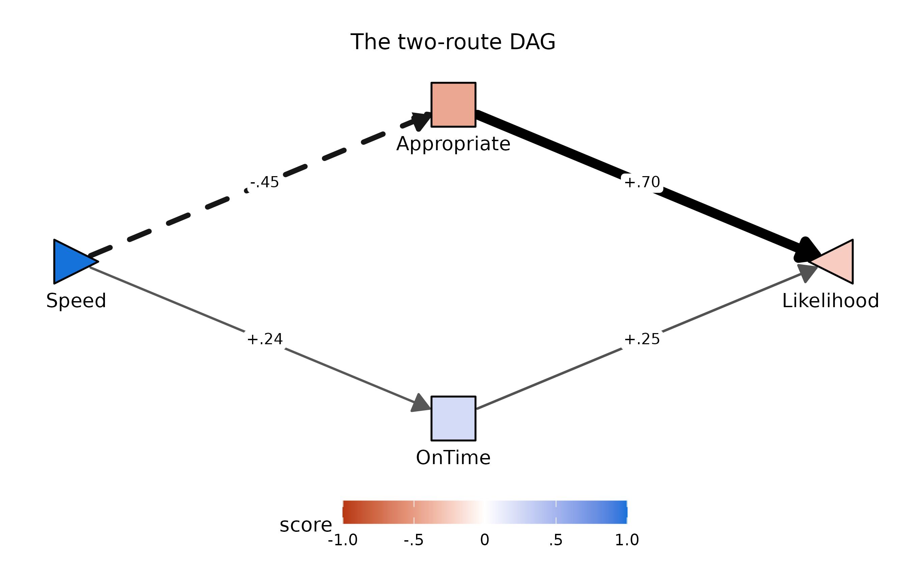

[`pathXMY()`](https://dustin-wood.github.io/funfield/reference/pathXMY.md)
remains the right tool for the parallel-mediator screening passes that
make up most of this vignette;
[`pathF()`](https://dustin-wood.github.io/funfield/reference/pathF.md)
takes over where the mediators themselves have causal structure worth
modeling.

### Scoring named trait composites

If you want the Big Five and other named scales from Wood, Harms, & Cho
(2023), use the recipes in `speedingESJT$codebook$trait_scales`:

``` r

tr <- speedingESJT$traits
tr$Extra <- rowMeans(cbind(1 - tr$SR_15, tr$SR_16, tr$SR_17), na.rm = TRUE)
tr$Agree <- rowMeans(cbind(tr$SR_18, 1 - tr$SR_19, tr$SR_20), na.rm = TRUE)
tr$Consc <- rowMeans(cbind(1 - tr$SR_21, 1 - tr$SR_22, tr$SR_23), na.rm = TRUE)
tr$Neuro <- rowMeans(cbind(tr$SR_24, tr$SR_25, 1 - tr$SR_26), na.rm = TRUE)
tr$Open  <- rowMeans(cbind(tr$SR_27, 1 - tr$SR_28, tr$SR_29), na.rm = TRUE)
```

### Function reference

See
[`?pathXMY`](https://dustin-wood.github.io/funfield/reference/pathXMY.md),
[`?pathXMY_pairtable`](https://dustin-wood.github.io/funfield/reference/pathXMY_pairtable.md),
[`?group_kable`](https://dustin-wood.github.io/funfield/reference/group_kable.md),
[`?pathXMY_decompose`](https://dustin-wood.github.io/funfield/reference/pathXMY_decompose.md),
[`?pathF`](https://dustin-wood.github.io/funfield/reference/pathF.md),
[`?pathF_decompose`](https://dustin-wood.github.io/funfield/reference/pathF_decompose.md),
[`?plotPathXMY`](https://dustin-wood.github.io/funfield/reference/plotPathXMY.md),
[`?plotPathXMY_ZLH`](https://dustin-wood.github.io/funfield/reference/plotPathXMY_ZLH.md),
[`?plotPathXMY_widget`](https://dustin-wood.github.io/funfield/reference/plotPathXMY_widget.md),
and
[`?speedingESJT`](https://dustin-wood.github.io/funfield/reference/speedingESJT.md).
